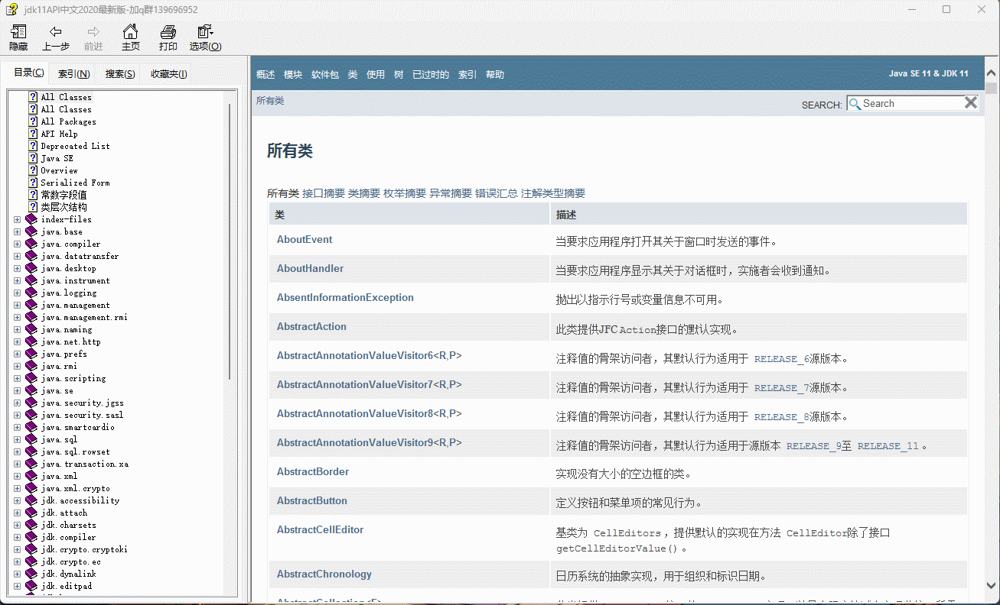
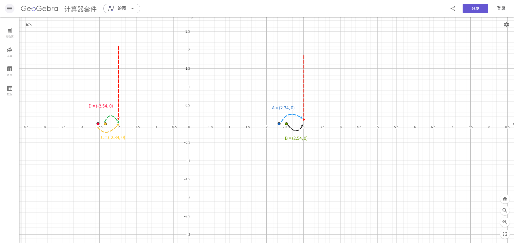
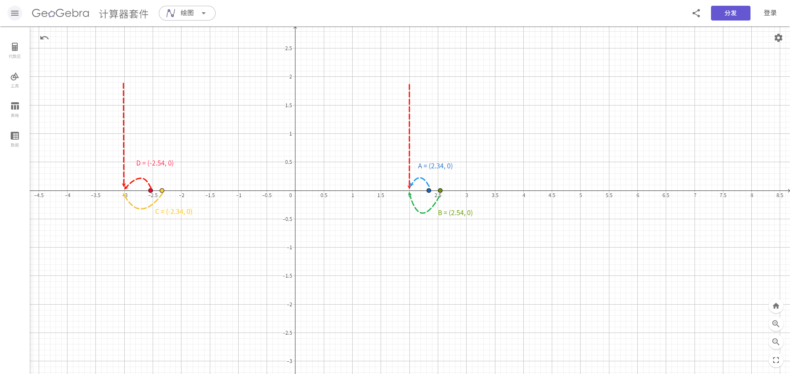

# 第一章：API 和 API 帮助文档

## 1.1 概述

* 之前我们已经学习过了面向对象了。并且我们知道，面向对象具体就是两个部分：
  * ① `如何使用别人已经写好的东西`。
  * ② `我们自己如何设计一个类，并使用`。
* 之前，我们都是学习`自己如何设计一个类，并使用`。但是，不可能所有的功能都是我们自己去手动实现，这样效率太低。

> [!NOTE]
>
> * ① 为了降低开发的难度，Java 官方将一些常用的功能进行了封装，并形成 API 供我们调用。
> * ② 有的时候，我们需要实现一些功能，Java 官方并没有实现，如：通过 Java 代码去操作 Word、Excel 等，这个时候就需要调用一些第三方库提供的 API，如：Apache POI 等。

* 之后，在学习和工作的时候，我们也需要学习`如何使用别人已经写好的东西`。

## 1.2 ISA、ABI 和 API

* ISA 、ABI 和 API 的参考模型，如下所示：


* 在底层，硬件模型以指令集架构 （ISA） 表示，该架构定义了处理器、寄存器、存储器和中断管理的指令集。ISA 是硬件和软件之间的接口，对于操作系统 （OS） 开发人员 （System ISA） 和直接管理底层硬件的应用程序 （User ISA） 的开发人员来说非常重要。

> [!NOTE]
>
> - ① ISA 是计算机体系结构中定义的一组指令，它规定了处理器能够执行的操作。ISA 包括指令的编码、寄存器的使用、内存访问模式等。不同的处理器可能有不同的 ISA，例如：x86、ARM、MIPS 等。
> - ② 在设计一个新的操作系统时，开发者需要确保操作系统能够支持特定的 ISA ，以便在特定的硬件上运行。例如：如果操作系统旨在运行在 ARM 架构的处理器上，那么它必须能够理解和执行 ARM ISA 定义的指令集。

* 应用程序二进制接口 （ABI） 将`操作系统层`与由操作系统管理的`应用程序`和`库`分开。ABI 涵盖了低级数据类型、对齐方式和调用约定等详细信息，并定义了可执行程序的格式。系统调用在此级别定义。此接口允许应用程序和库在实现相同 ABI 的操作系统之间移植。

> [!NOTE]
>
> - ① ABI 是指在二进制级别上，应用程序与操作系统、库或应用程序的不同部分之间的接口。它定义了数据类型的大小、布局、对齐方式，以及函数调用的约定（如参数如何传递、返回值如何处理等）。ABI 确保了编译后的二进制文件能够在特定的操作系统和硬件平台上正确地运行。
> - ② 在 windows 上的应用程序的运行格式是：`PE`（portable executable）格式、`.dll` （dynamic link library）格式和 `.lib` 格式；而在 Linux 上的应用程序的运行格式是：`ELF`（executable and linking format）格式、`.so` （shared object）格式和 `.a` 格式。
> - ③ 在 Linux 中可以通过 `file /bin/ls` 命令查看指定可执行应用程序的 ABI 格式；从而也可以论证，在 Windows 上可以运行的程序，在 Linux 上运行不了。
> - ④ 当开发者在 Linux 系统上编写 C 语言程序，并使用特定的编译器（如：GCC）编译时，编译器会遵循 Linux 平台的 ABI 规范来生成二进制文件。这样，生成的可执行文件就可以在任何遵循相同 ABI 规范的 Linux 系统上运行。
> - ⑤ 如果一个应用程序需要跨平台（操作系统）运行，就需要使用`一套代码，多平台编译`的方式（针对 C 或 C++ 等），即：相同的源代码，在不同平台（操作系统）上使用特定平台的编译器（如：GCC）来分别编译成符合自己平台的 ABI 规范的二进制文件。

* 最高级别的抽象由应用程序编程接口 （API） 表示，它将`应用程序`连接到`库`或`底层操作系统`。

> [!NOTE]
>
> - ① API 是一组预定义的函数、协议和工具，用于构建软件和应用程序。API 允许不同的软件系统相互交互，它定义了软件组件之间如何相互通信。API 可以是库、框架、协议或服务。
> - ② 在 Web 开发中，开发者可能会使用 JavaScript 的 Fetch API 来与服务器进行通信，获取数据或提交表单。这个 API 提供了一种标准化的方式来发送 HTTP 请求和处理响应，而不需要开发者关心底层的网络协议细节。

## 1.3 API

* `API`（`A`pplication `P`rogramming `I`nterface）：应用程序编程接口。

> [!NOTE]
>
> API 的简单理解：API 就是别人已经写好的东西，我们不需要自己编写，直接使用。（无情的调参侠）

* `Java API`：指的是 JDK 中提供的各种功能的 Java 类。

> [!NOTE]
>
> * ① Java API（应用程序编程接口）是 Java 编程语言提供的一组预定义的类、接口、方法和工具，它们用于帮助开发人员快速构建应用程序。
> * ② Java API 是 Java 平台的重要组成部分，提供了大量的功能模块，开发人员可以直接使用这些模块来避免重复造轮子。
> * ③ Java API 涵盖了广泛的领域，包括输入/输出、网络、数据库连接、图形用户界面等。
> * ④ 这些类将底层的实现封装起来，我们并不需要关心这些类是如何实现的，只需要学习如何使用这些类。

* `第三方 API`：指的是开源组织或个人提供用于实现特定功能的 Java 类，如：Apache 的 POI 。

## 1.4 API 帮助文档

* Java 本身提供的 API 实在是太多太多，如果每个类，我们都需要背诵并记忆，那么我们想哭的心都有，如下所示：



* 为了帮助开发人员（程序员）能快速的搜索、了解以及学习的 Java 中的 API，Java 提供了文档，如下所示：

> [!NOTE]
>
> Java 中的`API 帮助文档`是通过`java doc`工具根据`文档注释`来生成的！！！


## 1.5 API 学习方法（⭐）

* ① 千万不要去背 Java 中的 API （根据背不完），因为 Java 中的 API 实现是太多了！！！
* ② 只需要记住`类名`和`类的作用`就可以了。
* ③ 平常养成查询 API 帮助文档的习惯。


# 第二章：Math 类

## 2.1 概述

* Math 类是一个帮助我们用于数学计算的`工具类`。
* Math 类的构造方法是私有的，所有的方法都是静态方法。

## 2.2 常用 API

### 2.2.1 绝对值

* 求一个数的绝对值：

```java
public static int abs(int a){
    ...
}
```

```java
public static long abs(long a){
    ...
}
```

```java
public static float abs(float a){
    ...
}
```

```java
public static double abs(double a){
    ...
}
```

> [!NOTE]
>
> * ① int 取值范围是：`[-2147483648,2147483647]`，如果对`abs(-2147483648)`求绝对值，其值还是`-2147483648`，因为`-2147483648`对应的绝对值`2147483648`，不在 int 的取值范围内。
> * ② 在实际开发中，更推荐使用`absExact`方法代替`abs`方法，因为对于`-2147483648`这种问题，`absExact`直接抛出异常。


* 示例：

```java
package com.github;

public class MathDemo {
    public static void main(String[] args) {
        int abs = Math.abs(1);
        System.out.println("abs = " + abs); // abs = 1

        abs = Math.abs(-1);
        System.out.println("abs = " + abs); // abs = 1
    }
}
```


* 示例：

```java
package com.github;

public class MathDemo {
    public static void main(String[] args) {
        int abs = Math.abs(-2147483648);
        System.out.println("abs = " + abs); // abs = -2147483648
    }
}
```


* 示例：

```java
package com.github;

public class MathDemo {
    public static void main(String[] args) {
        // 运行报错
        // Exception in thread "main" java.lang.ArithmeticException:
        // Overflow to represent absolute value of Integer.MIN_VALUE
        int abs = Math.absExact(-2147483648);
        System.out.println("abs = " + abs); // 
    }
}
```

### 2.2.2 向上取整和向下取值

* 向上取整：

```java
public static double ceil(double a){
    ...
}
```

* 向下取整：

```java
public static double floor(double a){
    ...
}
```

> [!NOTE]
>
> * ① `向上取整`类似于数学中的`进一法`，即：向正无穷大的方向获取距离最近的整数。
>
> ::: details 点我查看 具体细节
>
> 
>
> :::
>
> * ② `向下取整`类似于数学中的`去尾法`，即：向负无穷大的方向获取距离最近的整数。
>
> ::: details 点我查看 具体细节
>
> 
>
> :::


* 示例：

```java
package com.github;

public class MathDemo {
    public static void main(String[] args) {
        System.out.println(Math.ceil(12.34)); // 13.0
        System.out.println(Math.ceil(12.54)); // 13.0
        System.out.println(Math.ceil(-12.34)); // -12.0
        System.out.println(Math.ceil(-12.54)); // -12.0
    }
}
```


* 示例：

```java
package com.github;

public class MathDemo {
    public static void main(String[] args) {
        System.out.println(Math.floor(12.34)); // 12.0
        System.out.println(Math.floor(12.54)); // 12.0
        System.out.println(Math.floor(-12.34)); // -13.0
        System.out.println(Math.floor(-12.54)); // -13.0
    }
}
```

### 2.2.3 四舍五入

* 求一个数的四舍五入：

```java
public static int round(float a){
    ...
}
```

```java
public static long round(double a){
    ...
}
```


* 示例：

```java
package com.github;

public class MathDemo {
    public static void main(String[] args) {
        System.out.println(Math.round(2.34)); // 2
        System.out.println(Math.round(2.54)); // 3
        System.out.println(Math.round(-2.34)); // -2
        System.out.println(Math.round(-2.54)); // -3
    }
}
```

### 2.2.4  最值（最大值和最小值）

* 求一个数的最大值：

```java
public static int max(int a, int b) {
    ...
}
```

```java
public static long max(long a, long b) {
    ...
}
```

```java
public static float max(float a, float b) {
    ...
}
```

```java
public static double max(double a, double b) {
    ...
}
```

* 求一个数的最小值：

```java
public static int min(int a, int b) {
    ...
}
```

```java
public static long min(long a, long b) {
    ...
}
```

```java
public static float min(float a, float b) {
    ...
}
```

```java
public static double min(double a, double b) {
    ...
}
```


* 示例：

```java
package com.github;

public class MathDemo {
    public static void main(String[] args) {
        System.out.println(Math.max(1, 1.1)); // 1.1
        System.out.println(Math.max(10, 1.1)); // 10.0
        System.out.println(Math.min(1, 1.1)); // 1.0
        System.out.println(Math.min(10, 1.1)); // 1.1
    }
}
```

### 2.2.5 指数、平方根和立方根

* 求一个数的指数：

```java
public static double pow(double a, double b) {
    ...
}
```

* 求一个数的平方根：

```java
public static double sqrt(double a) {
    ...
}
```

* 求一个数的立方根：

```java
public static double cbrt(double a){
    ...
}
```


* 示例：

```java
package com.github;

public class MathDemo {
    public static void main(String[] args) {
        System.out.println("2^3 = " + Math.pow(2, 3)); // 2^3 = 8.0
        System.out.println("4 的平方根 = " + Math.sqrt(4)); // 4 的平方根 = 2.0
        System.out.println("8 的立方根 = " + Math.cbrt(8)); // 8 的立方根 = 2.0
    }
}
```

### 2.2.6 随机值

* 求一个数的随机值，范围是`[0.0,1.0)`：

```java
public static double random() { 
	...
}
```

> [!NOTE]
>
> * ① 在 Java 中，我们通常会使用`Random`类，而不是 Math.random() 方法获取随机值，因为 Random 类中的 nextInt(10) 方法就是获取 [0,10) 之间的随机值。
> * ② 在其他编程语言中，如：JavaScript ，就只有 `Math.random()` 方法用来获取随机值。


* 示例：

```java
package com.github;

import java.util.Random;

public class MathDemo {
    public static void main(String[] args) {
        Random random = new Random();
        for (int i = 0; i < 100; i++) {
            // 获取 1 - 100 之间的随机值
            int num = random.nextInt(100) + 1;
            System.out.println("num = " + num);
        }
    }
}
```


* 示例：

```java
package com.github;

public class MathDemo {
    public static void main(String[] args) {
        for (int i = 0; i < 10; i++) {
            // 获取 1 - 100 之间的随机值
            int num = (int) (Math.floor(Math.random() * 100)) + 1;
            System.out.println("num = " + num);
        }
    }
}
```

## 2.3 应用示例

* 需求：判断一个数是否为质数。


* 示例：

```java
package com.github;

public class MathDemo {
    public static void main(String[] args) {
        System.out.println(isPrime(2));
        System.out.println(isPrime(3));
        System.out.println(isPrime(4));
    }

    /**
     * 判断一个数是否为质数
     * @param num 整数
     * @return true 表示质数，false 表示非质数
     */
    public static boolean isPrime(int num) {
        for (int i = 2; i < num; i++) {
            if (num % i == 0) {
                return false;
            }
        }
        return true;
    }
}
```


* 示例：

```java
package com.github;

public class MathDemo {
    public static void main(String[] args) {
        System.out.println(isPrime(2));
        System.out.println(isPrime(3));
        System.out.println(isPrime(4));
    }

    /**
     * 判断一个数是否为质数
     * @param num 整数
     * @return true 表示质数，false 表示非质数
     */
    public static boolean isPrime(int num) {
        for (int i = 2; i <= Math.sqrt(num); i++) {
            if (num % i == 0) {
                return false;
            }
        }
        return true;
    }
}
```

## 2.4 应用示例

* 自幂数：一个 n 位自然数等于自身给位上的数字的 n 次幂之和。

> [!NOTE]
>
> * ① 三位数 `1^3 + 2^3 + 3^3 = 153`。
> * ② 四位数 `1^4 + 6 ^4 + 3^4 + 4^4 = 1634`。


* 示例：

```java
package com.github;

import java.util.ArrayList;
import java.util.List;
import java.util.ListIterator;

public class MathDemo2 {
    public static void main(String[] args) {
        System.out.println(isSelfPower(1634));
        System.out.println(isSelfPower(153));
    }

    /**
     * 判断一个数是否为自幂数
     *
     * @param num 整数
     * @return true 表示自幂数，false 表示非自幂数
     */
    public static boolean isSelfPower(int num) {
        // 缓存 num
        int original = num;
        // 获取 num 各个位上的数
        List<Integer> list = new ArrayList<>();
        while (num != 0) {
            list.add(num % 10);
            num /= 10;
        }
        // 逆序遍历，并获取结果
        int result = 0;
        ListIterator<Integer> iterator = list.listIterator(list.size());
        while (iterator.hasPrevious()) {
            int element = iterator.previous();
            result += (int) Math.pow(element, list.size());
        }
        return result == original;
    }
}
```


# 第三章：System 类

## 3.1 概述

* System 是一个工具类，提供了一些和系统相关的属性或方法。
* System 类的构造方法是私有的，所有的方法都是静态方法。

## 3.2 常用 API

### 3.2.1 当前系统时间戳

* 返回当前系统时间距离`1970-01-01 00:00:00`的毫秒值：

```java
public static native long currentTimeMillis();
```

* 返回当前系统时间距离`1970-01-01 00:00:00`的纳秒值：

```java
public static native long nanoTime();
```


* 示例：

```java
package com.github;

import java.util.Date;

public class SystemDemo {
    public static void main(String[] args) {
        long timeMillis = System.currentTimeMillis();
        // timeMillis = 1744791339759
        System.out.println("timeMillis = " + timeMillis); 

        Date date = new Date(timeMillis);
        // date = Wed Apr 16 16:16:04 CST 2025
        System.out.println("date = " + date); 
    }
}
```

### 3.2.2 退出当前系统

* 终止当前运行的 JVM 虚拟机：

```java
public static void exit(int status) {
    ...
}
```


* 示例：

```java
package com.github;

import java.util.Scanner;

public class SystemDemo2 {
    public static void main(String[] args) {
        Scanner input = new Scanner(System.in);
        do {
            System.out.print("请输入数字（0 退出）：");
            int num = input.nextInt();
            if (num == 0) {
                System.exit(0);
            }
            System.out.println("num = " + num);
        } while (true);
    }
}
```

### 3.2.3 获取操作系统环境变量

* 获取操作系统所有环境变量：

```java
public static java.util.Map<String,String> getenv() {
   ...   
}    
```

* 根据`环境变量名`获取`环境变量值`：

```java
public static String getenv(String name) {
   ...   
}    
```

> [!NOTE]
>
> * ① 环境变量：从运行 Java 应用程序的操作系统环境中获取。这些环境变量通常在操作系统级别或启动应用程序的 shell 环境中设置。
> * ② 应用场景：
>   * 配置应用程序的外部依赖，如：数据库连接字符串、API 密钥、文件路径等，而无需将这些敏感信息硬编码到应用程序中（不常用）。
>   * 获取操作系统相关的信息，如：用户的家目录（Maven 中的`.m2`默认目录在 Windows 是`C:\Users\<你的用户名>\.m2`）、临时目录等。
>   * 根据不同的环境（开发、测试、生产）进行不同的配置（Java 中不怎么常用；但是，前端（Vite）中非常常见）。
> * ③ 操作系统环境变量通常对同一个用户或系统中的所有进程可见。

> [!CAUTION]
>
> * ① 由于环境变量通常在系统级别设置，因此需要注意潜在的安全风险，避免泄露敏感信息。
> * ② 环境变量的应用场景是`项目构建工具`开发，如：Maven 或 Gradle 等。


* 示例：

```java
package com.github;

import java.util.Map;
import java.util.Set;

public class SystemDemo5 {
    public static void main(String[] args) {
        Map<String, String> map = System.getenv();

        Set<Map.Entry<String, String>> entries = map.entrySet();
        for (Map.Entry<String, String> entry : entries) {
            System.out.println(entry.getKey() + "=" + entry.getValue());
        }

        String javaHome = System.getenv("JAVA_HOME");
        System.out.println("javaHome = " + javaHome);
    }
}
```

### 3.2.4 获取 Java 系统属性（值）

* 获取Java 系统（JVM 和应用程序相关）所有属性：

```java
public static Properties getProperties() {
    ...
}
```

* 根据`系统属性名`获取`系统属性值`：

```java
public String getProperty(String key) { 
	...
}
```

> [!NOTE]
>
> * ① Java 系统属性：Java 虚拟机（JVM）和正在运行的 Java 应用程序相关的键值对，这些属性可以在如下的几种方式设置。
>   * 在命令行启动 JVM 的时候使用`-D<name>=<value>`参数指定，如：`java -Dspring.profile=dev abc.jar`。
>   * 在程序中通过`System.setProperty(String key, String value)`方法动态设置。
>   * 某些系统属性是 JVM 启动的时候自动设置的，如：`java.version`（Java 版本）、`os.version`（操作系统版本）。
> * ② 应用场景：
>   * 配置 JVM 的行为，如：设置默认的文件编码、代理服务器等。
>   * 向应用程序传递配置信息，类似于环境变量，但作用范围更局限于当前的 JVM 实例。
>   * 获取 Java 运行时环境的信息。
> * ③ Java 系统属性（JVM 和应用程序相关）仅限于当前的 JVM 实例。


* 示例：

```java
package com.github;

import java.util.Properties;
import java.util.Set;

public class SystemDemo3 {
    public static void main(String[] args) {
        Properties properties = System.getProperties();
        Set<String> propertyNames = properties.stringPropertyNames();
        for (String propertyName : propertyNames) {
            String property = properties.getProperty(propertyName);
            System.out.println(propertyName + " = " + property);
        }
    }
}

```

### 3.2.5 数组复制（拷贝）

* 从指定源数组中复制一个数组，复制从指定的位置开始，到目标数组的指定位置结束。

```java
public static native void arraycopy(Object src,  int  srcPos,
                                        Object dest, int destPos,
                                        int length);
```

> [!NOTE]
>
> * ① 如果`数据源数组`和`目的地数组`都是基本数据类型，两者的数据类型必须保持一致，否则将会报错！！！
> * ② 在拷贝的时候，需要考虑数组的长度，如果超出范围将会报错！！！
> * ③ 如果`数据源数组`和`目的地数组`都是引用数据类型，那么子类类型可以赋值给父类类型。


* 示例：

```java
package com.github;

import java.util.Arrays;

public class SystemDemo4 {
    public static void main(String[] args) {
        int[] arr = {1, 2, 3, 4, 5, 6};
        int[] target = new int[arr.length];
        System.arraycopy(arr, 0, target, 0, 2);
        System.out.println(Arrays.toString(target)); // [1, 2, 0, 0, 0, 0]
    }
}
```


# 第四章：Runtime 类

## 4.1 概述

* 每个应用程序都有一个 Runtime 类的实例，使得应用程序能够和其运行的环境相连接。

> [!NOTE]
>
> * ① 每个 Java 应用程序都有一个 Runtime 类的实例。
> * ② Runtime 类的实例表示当前虚拟机的运行时环境。

* 应用程序不能创建自己的 Runtime 实例，只能通过 getRuntime() 方法获取当前虚拟机的运行时环境。

## 4.2 常用 API

### 4.2.1 当前系统的运行时环境

* 返回当前系统的运行时环境对象：

```java
private static final Runtime currentRuntime = new Runtime();

private Runtime() {}

public static Runtime getRuntime() { // [!code focus]
	return currentRuntime;
} // [!code focus]
```


* 示例：

```java
package com.github;

public class RuntimeDemo {
    public static void main(String[] args){
        Runtime rt = Runtime.getRuntime();
        System.out.println("rt = " + rt);
    }
}
```

### 4.2.2 退出当前系统

* 终止当前运行的 JVM 虚拟机：

```java
public void exit(int status) { 
   ...
}
```


* 示例：

```java
package com.github;

import java.util.Scanner;

public class RuntimeDemo {
    public static void main(String[] args){
        Scanner input = new Scanner(System.in);
        Runtime rt = Runtime.getRuntime();
        do {
            System.out.print("请输入数字（0 退出）：");
            int num = input.nextInt();
            if (num == 0) {
                rt.exit(0);
            }
            System.out.println("num = " + num);
        } while (true);
    }
}
```

### 4.2.3 获取 CPU 的线程数

* 获取 CPU 的线程数：

```java
public native int availableProcessors();
```


* 示例：

```java
package com.github;

public class RuntimeDemo2 {
    public static void main(String[] args){
        Runtime rt = Runtime.getRuntime();
        int num = rt.availableProcessors();
        System.out.println("num = " + num); // 24
    }
}
```

### 4.2.4 获取 JVM 的最大内存总量

* 返回 JVM 能从系统中获取的最大内存总数量（单位字节）：

```java
public native long maxMemory();
```

> [!NOTE]
>
> * ① 返回 Java 虚拟机将尝试使用的最大内存量。如果没有固有限制，则将返回该值 `Long.MAX_VALUE`。
> * ② 此方法返回的值可能随时间的推移而变化，这取决于主机环境！！！


* 示例：

```java
package com.github;

public class RuntimeDemo3 {

    private static final long KB = 1024;
    private static final long MB = KB * KB;
    private static final long GB = MB * KB;
    private static final long TB = GB * KB;
    private static final long PB = TB * KB;
    public static void main(String[] args){
        Runtime rt = Runtime.getRuntime();
        long maxMemory = rt.maxMemory();
        System.out.println(maxMemory); // 25753026560
        System.out.println(formatBytes(maxMemory)); // 23.98 GB
    }

    // 使用二进制单位 (KiB, MiB, GiB 等)
    public static String formatBytes(long bytes) {
        if (bytes < KB) {
            return bytes + " B";
        } else if (bytes < MB) {
            return String.format("%.2f KB", (double) bytes / KB);
        } else if (bytes < GB) {
            return String.format("%.2f MB", (double) bytes / MB);
        } else if (bytes < TB) {
            return String.format("%.2f GB", (double) bytes / GB);
        } else if (bytes < PB) {
            return String.format("%.2f TB", (double) bytes / TB);
        } else {
            return String.format("%.2f PB", (double) bytes / PB);
        }
    }
}
```

### 4.2.5 获取 JVM 的内存总量

* 返回 JVM 已经从系统中获取的内存总数量（单位字节）：

```java
public native long totalMemory();
```

> [!NOTE]
>
> * ① 返回 Java 虚拟机中的内存总量。
> * ② 此方法返回的值可能随时间的推移而变化，这取决于主机环境！！！


* 示例：

```java
package com.github;

public class RuntimeDemo3 {

    private static final long KB = 1024;
    private static final long MB = KB * KB;
    private static final long GB = MB * KB;
    private static final long TB = GB * KB;
    private static final long PB = TB * KB;
    public static void main(String[] args){
        Runtime rt = Runtime.getRuntime();
        long maxMemory = rt.maxMemory();
        System.out.println(maxMemory); // 25753026560
        System.out.println(formatBytes(maxMemory)); // 23.98 GB
        long totalMemory = rt.totalMemory();
        System.out.println(totalMemory); // 1610612736
        System.out.println(formatBytes(totalMemory)); // 1.50 GB
    }

    // 使用二进制单位 (KiB, MiB, GiB 等)
    public static String formatBytes(long bytes) {
        if (bytes < KB) {
            return bytes + " B";
        } else if (bytes < MB) {
            return String.format("%.2f KB", (double) bytes / KB);
        } else if (bytes < GB) {
            return String.format("%.2f MB", (double) bytes / MB);
        } else if (bytes < TB) {
            return String.format("%.2f GB", (double) bytes / GB);
        } else if (bytes < PB) {
            return String.format("%.2f TB", (double) bytes / TB);
        } else {
            return String.format("%.2f PB", (double) bytes / PB);
        }
    }
}
```

### 4.2.6 获取 JVM 的空闲内存总量

* 获取 JVM 的空闲内存总数量（单位字节）：

```java
public native long freeMemory();
```

> [!NOTE]
>
> * ① 返回 Java 虚拟机中的可用内存量。
> * ② 调用 gc 方法可能导致 freeMemory 返回值的增加！！！


* 示例：

```java
package com.github;

public class RuntimeDemo3 {

    private static final long KB = 1024;
    private static final long MB = KB * KB;
    private static final long GB = MB * KB;
    private static final long TB = GB * KB;
    private static final long PB = TB * KB;
    
    public static void main(String[] args){
        Runtime rt = Runtime.getRuntime();
        long maxMemory = rt.maxMemory();
        System.out.println(maxMemory); // 25753026560
        System.out.println(formatBytes(maxMemory)); // 23.98 GB
        long totalMemory = rt.totalMemory();
        System.out.println(totalMemory); // 1610612736
        System.out.println(formatBytes(totalMemory)); // 1.50 GB
        long freeMemory = rt.freeMemory();
        System.out.println(freeMemory); // 1599874488
        System.out.println(formatBytes(freeMemory)); // 1.49 GB
    }

    // 使用二进制单位 (KiB, MiB, GiB 等)
    public static String formatBytes(long bytes) {
        if (bytes < KB) {
            return bytes + " B";
        } else if (bytes < MB) {
            return String.format("%.2f KB", (double) bytes / KB);
        } else if (bytes < GB) {
            return String.format("%.2f MB", (double) bytes / MB);
        } else if (bytes < TB) {
            return String.format("%.2f GB", (double) bytes / GB);
        } else if (bytes < PB) {
            return String.format("%.2f TB", (double) bytes / TB);
        } else {
            return String.format("%.2f PB", (double) bytes / PB);
        }
    }
}
```

### 4.2.7 执行 cmd 命令

* 执行 cmd 命令：

```java
public Process exec(String command) throws IOException { 
	...
}
```

```java
public Process exec(String command, String[] envp) throws IOException {
    ...
}
```

```java
public Process exec(String command, String[] envp, File dir) {
    ...
}
```

```java
public Process exec(String cmdarray[]) throws IOException {
    ...
}
```

```java
public Process exec(String[] cmdarray, String[] envp) throws IOException {
    ...
}
```

```java
public Process exec(String[] cmdarray, String[] envp, File dir) {
    ...
}
```


* 示例：

```java
package com.github;

import java.io.BufferedReader;
import java.io.IOException;
import java.io.InputStreamReader;
import java.nio.charset.Charset;

public class RuntimeDemo4 {

    public static void main(String[] args) 
        	throws IOException, InterruptedException {
        Runtime rt = Runtime.getRuntime();
        Process process = rt.exec("cmd /c dir");
        // 获取命令的输出流
        BufferedReader reader = new BufferedReader(
            new InputStreamReader(process.getInputStream(), 
                                  Charset.forName("GBK")));
        String line;
        System.out.println("命令输出：");
        while ((line = reader.readLine()) != null) {
            System.out.println(line);
        }

        // 获取命令的错误流（如果有）
        BufferedReader errorReader = new BufferedReader(
            new InputStreamReader(process.getErrorStream(), 
                                  Charset.forName("GBK")));
        System.out.println("命令错误：");
        while ((line = errorReader.readLine()) != null) {
            System.out.println(line);
        }

        // 等待命令执行完成
        int exitCode = process.waitFor();
        System.out.println("命令执行完成，退出代码: " + exitCode);
    }

}
```


# 第五章：Object 类（⭐）

## 5.1 概述

* 在 Java 中，Object 类是所有类的根父类，所有类都直接或间接地继承于 Object 类。

> [!NOTE]
>
> 如果在类的声明处没有使用`extends`关键字指明其父类，则默认父类为`java.lang.Object`类。

* Object 类中的方法可以被所有子类访问，所以我们要学习 Object 类和其中的方法。

## 5.2 常用 API

### 5.2.1 构造方法

* Object 类只有一个无参构造方法：

```java
public Object() {}
```

> [!NOTE]
>
> * ① Object 类是没有成员变量（属性）的，在学习继承的时候，我们知道，如果类中有共性的部分（属性），就可以抽取到父类中。但是，Object 类是所有类的父类，对于所有类来说，是没有共性部分的，所以 Object 类是没有成员变量（属性），也就没有带参数的构造方法。
> * ② 之前说过，对于任意类的构造方法，在第一行都隐藏了一个 `super();`语句，其就是用来访问父类的无参构造，因为顶级父类 Object 类只有无参构造方法。
>
> ::: details 点我查看 具体细节
>
> ```java {6,10}
> public class Person {
>     String name;
>     int age;
>     
>     public Person(){
>         super(); // 默认访问父类的无参构造，就是因为顶级父类 Object 只有无参构造方法
>     }
>     
>     public Person(String name,int age){
>         super(); // 默认访问父类的无参构造，就是因为顶级父类 Object 只有无参构造方法
>         this.name = name;
>         this.age = age;
>     }
> }
> ```
> :::


* 示例：

```java
package com.github.object;

public class ObjectDemo1 {
    public static void main(String[] args){
        Object o = new Object();
        System.out.println("o = " + o);
    }
}
```

### 5.2.2 获取对象的字符串表示形式

* 返回对象的字符串表现形式：

```java
public String toString() {
    return getClass().getName() + "@" + Integer.toHexString(hashCode());
}
```

> [!NOTE]
>
> * ① 默认情况下，该方法的返回值是：`对象类型@对象hashCode值的十六进制`。
> * ② 在实际开发中，通常建议子类重写`toString()`方法。
> * ③ 如果我们直接使用`System.out.println(对象);` 输出语句，默认会自动调用该对象的`toString()`方法。
>
> ::: details 点我查看 具体细节
>
> ```java [PrintStream.java]
> public class PrintStream extends FilterOutputStream
>     implements Appendable, Closeable
> {   
> 	public void println(Object x) {
>         String s = String.valueOf(x); // [!code highlight]
>         if (getClass() == PrintStream.class) {
>             // need to apply String.valueOf again since first invocation
>             // might return null
>             writeln(String.valueOf(s));
>         } else {
>             synchronized (this) {
>                 print(s);
>                 newLine();
>             }
>         }
>     }
>     ...
> }
> ```
>
> ```java [String.java]
> public final class String
>     implements java.io.Serializable, Comparable<String>, CharSequence,
>                Constable, ConstantDesc {   
>                    
> 	public static String valueOf(Object obj) { // [!code highlight]
>         return (obj == null) ? "null" : obj.toString();
>     }
>                    ...
> }
> ```
>
> :::


* 示例：

::: code-group

```java [Person.java]
package com.github.object;

public class Person {

    private String name;

    private int age;

    public Person() {
    }

    public Person(String name, int age) {
        this.name = name;
        this.age = age;
    }

    public String getName() {
        return name;
    }

    public void setName(String name) {
        this.name = name;
    }

    public int getAge() {
        return age;
    }

    public void setAge(int age) {
        this.age = age;
    }

    @Override
    public String toString() { // [!code highlight]
        return "Person{" +
                "name='" + name + '\'' +
                ", age=" + age +
                '}';
    }
}

```

```java [Test.java]
package com.github.object;

public class Test {
    public static void main(String[] args){
        Person p1 = new Person("张三", 18);
        System.out.println(p1); // [!code highlight]

        Person p2 = new Person("李四", 18);
        System.out.println(p2); // [!code highlight]
    }
}
```

```txt [cmd 控制台]
Person{name='张三', age=18}
Person{name='李四', age=18}
```

:::

### 5.2.3 获取表示对象运行时类的 Class 对象

* 返回表示对象运行时类的 Class 对象：

```java
public final native Class<?> getClass();
```

> [!NOTE]
>
> * ① 因为 Java 的多态特性，可能会导致`编译时类型`和`运行时类型`不一样，如：`Person p = new Student();`。
> * ② 如果需要查看一个`引用类型变量`实际指向的对象类型，即：运行时类型，就需要使用到此方法了。
> * ③ 该方法返回的是一个`java.lang.Class`类的对象，这个`Class`对象包含了`引用类型变量`实际指向的`对象类所属类型`的所有信息，如：类名、包名、父类、实现的接口、方法、字段、构造方法、注解等。


* 示例：

::: code-group

```java [Person.java]
package com.github.object;

public class Person {

    private String name;

    private int age;

    public Person() {
    }

    public Person(String name, int age) {
        this.name = name;
        this.age = age;
    }

    public String getName() {
        return name;
    }

    public void setName(String name) {
        this.name = name;
    }

    public int getAge() {
        return age;
    }

    public void setAge(int age) {
        this.age = age;
    }

    @Override
    public String toString() {
        return "Person{" +
                "name='" + name + '\'' +
                ", age=" + age +
                '}';
    }
}
```

```java [Student.java]
package com.github.object;

public class Student extends Person {

    public Student() {
    }

    public Student(String name, int age) {
        super(name, age);
    }
}
```

```java [Test.java]
package com.github.object;

public class Test {
    public static void main(String[] args){
        Person p1 = new Person("张三", 18);
        System.out.println(p1);
        System.out.println(p1.getClass()); // [!code highlight]

        Person p2 = new Student("李四", 18);
        System.out.println(p2);
        System.out.println(p2.getClass()); // [!code highlight]
    }
}
```

```txt [cmd 控制台]
Person{name='张三', age=18}
class com.github.object.Person
Person{name='李四', age=18}
class com.github.object.Student
```

:::

### 5.2.4 哈希表（补充）

#### 5.2.4.1 概述

* 假设一个班级有 n 个学生，不可避免的会出现`学生姓名`重名的现象，如：张伟等，那么老师通常会在开学第一天给每个学生进行编号（学号），这样后期讲课的时候，直接叫同学的学号，就可以很好的解决`学生姓名`重名的问题，如下所示：


* 其实，上述的方案就是哈希表（映射表），如下所示：

> [!NOTE]
>
> * ① 哈希表（映射表）就是通过键（key，如：学号）和值（value，如：姓名）建立映射关系，实现高效元素的查询。
> * ② 当我们向哈希表中输入一个键（key）的时候，可以在`O(1)`时间内获取到对应的值（value）。


* Java 中的`HashMap`就是典型的哈希表数据结构，如下所示：

```java
package com.github.object2;

import java.util.HashMap;
import java.util.Map;

public class Test {
    public static void main(String[] args){
        Map<String,String> map = new HashMap<>();

        // 添加数据
        map.put("12836", "张三");
        map.put("15937", "李四");
        map.put("20339", "张三");
        map.put("13276", "王五");

        // 查询数据
        String value = map.get("12836");
        System.out.println("12836 = " + value); // 12836 = 张三
        value = map.get("15937");
        System.out.println("15937 = " + value); // 15937 = 李四
        value = map.get("20336");
        System.out.println("20339 = " + value); // 20339 = 张三
        value = map.get("20339");
        System.out.println("13276 = " + value); // 13276 = 王五

        // 删除数据
        map.remove("13276");

        // 查询数据
        System.out.println(map); // {12836=张三, 15937=李四, 20339=张三}
    }
}
```

#### 5.2.4.2 哈希表的简单实现

* 我们可以使用`数组`来实现哈希表，在哈希表中，我们将数组中的每个`空位`称为`桶`（bucket），每个桶可以存储一个`键值对`（key-value），如下所示：


* 那么，查询操作就是根据`key`找到数组中对应的桶，并在桶中获取`value`，如下所示：


* 那么，如何通过`key`定位到桶，以便存储数据或查询数据？其实，就是通过`哈希函数`来实现的，如下所示：

> [!NOTE]
>
> * ① 哈希函数的作用就是将任意长度的输入变为固定长度的输出，如：12836 --> 36 、15937 --> 37 。
> * ② 在哈希函数中，通常输出空间要远小于输入空间，如：12836（输入空间） --> 36（输出空间） 。
> * ③ 在哈希函数中，不同的输入（输入空间）可能会散列成相同的输出（输出空间），但是不可能从散列值（输出空间）确定唯一的输入值（输入空间），这就是`哈希冲突`（哈希碰撞），如：12836 --> 36、20336 --> 36 。
> * ④ 在哈希表中，输入空间是所有的 key，而输出空间是数组桶（数组索引）。


* 如果输入一个`key`，哈希函数的计算过程就是这样的：
  * ① 通过某种哈希算法`hash(key)`获取到哈希值。
  * ② 将哈希值对桶数量（数组长度，`capacity`）进行取模，从而获取该`key`对应的数组索引`index`，即：`index = hash(key) % capacity`。

> [!NOTE]
>
> 假设数组长度`capacity`是`100`，哈希算法`hash(key)`是`key`，那么哈希函数就是`key%100`。


#### 5.2.4.3 哈希冲突的解决

* 从本质上看，哈希函数的作用是将所有`key`构成的输入空间映射到`数组所有索引`构成的输出空间，而输入空间往往远大于输出空间。因此，`理论上一定存在“多个输入对应相同输出”的情况`，如：12836 --> 36、20336 --> 36。


* 如果哈希表的容量 n （数组长度 capacity）越大，那么多个`key`被分配到同一个桶中的概率就越低，冲突也就越少，即：可以通过`扩容哈希表`来减少哈希冲突，如下所示：


### 5.2.5 获取对象的哈希代码值

* 返回对象的 hashCode 值：

```java
public native int hashCode();
```

> [!NOTE]
>
> * ① 如果两个对象的 hashCode 不相等，那么这两个对象一定不相等。
> * ② 如果两个对象的 hashCode 相等，那么这两个对象不一定相等。
> * ③ 默认情况下，Object 类提供的`hashCode()`方法，通常会返回对象的内存地址的某种转换形式。这意味着，即使两个对象的内容相同，但是如果它们是不同的对象实例，它们的 hashCode 也不相同；所以，在实际开发中，经常需要重写`hashCode()`方法，以便属性相同的两个对象的 hashCode 是一样的。

> [!NOTE]
>
> ::: details 点我查看 为什么需要重写 hashCode() 方法？
>
> `hashCode()`方法的主要目的是为了提高基于哈希表的集合的性能，如下所示：
>
> * ① **快速查找：** 当向 `HashMap` 或 `HashSet` 中添加一个对象时，集合会首先使用对象的哈希码来确定该对象应该存储在哪个“桶”（bucket）中。这样，在查找、删除或检查对象是否存在时，集合只需要在对应的桶中进行比较，而不需要遍历整个集合，从而大大提高了效率。
> * ② **确定唯一性：** 在 `HashSet` 中，哈希码被用来快速判断两个对象是否可能相等。如果两个对象的哈希码不同，那么它们肯定是不相等的，可以直接判断为不同的元素。如果哈希码相同，则需要进一步使用 `equals()` 方法进行比较，以确定它们是否真的相等。
>
> :::


* 示例：默认实现

::: code-group

```java [Person.java]
package com.github.object2;

public class Person {

    private String name;

    private int age;

    public Person() {
    }

    public Person(String name, int age) {
        this.name = name;
        this.age = age;
    }

    public String getName() {
        return name;
    }

    public void setName(String name) {
        this.name = name;
    }

    public int getAge() {
        return age;
    }

    public void setAge(int age) {
        this.age = age;
    }

    @Override
    public String toString() {
        return "Person{" +
                "name='" + name + '\'' +
                ", age=" + age +
                '}';
    }
}
```

```java [Test.java]
package com.github.object2;

public class Test {
    public static void main(String[] args){
        Person p1 = new Person("张三", 18);
        Person p2 = new Person("张三", 18);
        System.out.println(p1.hashCode()); // 1096979270
        System.out.println(p2.hashCode()); // 1078694789
        System.out.println(p1.hashCode() == p2.hashCode()); // false
    }
}
```

```txt [cmd 控制台]
1096979270
1078694789
false
```

:::


* 示例：重写 hashCode 方法

::: code-group

```java [Person.java]
package com.github.object2;

import java.util.Objects;

public class Person {

    private String name;

    private int age;

    public Person() {
    }

    public Person(String name, int age) {
        this.name = name;
        this.age = age;
    }

    public String getName() {
        return name;
    }

    public void setName(String name) {
        this.name = name;
    }

    public int getAge() {
        return age;
    }

    public void setAge(int age) {
        this.age = age;
    }

    @Override
    public int hashCode() { // [!code highlight]
        return Objects.hash(getName(), getAge());
    }

    @Override
    public String toString() {
        return "Person{" +
                "name='" + name + '\'' +
                ", age=" + age +
                '}';
    }
}
```

```java [Test.java]
package com.github.object2;

public class Test {
    public static void main(String[] args){
        Person p1 = new Person("张三", 18);
        Person p2 = new Person("张三", 18);
        System.out.println(p1.hashCode()); // 24022538
        System.out.println(p2.hashCode()); // 24022538
        System.out.println(p1.hashCode() == p2.hashCode()); // true
    }
}
```

```txt [cmd 控制台]
24022538
24022538
true
```

:::

### 5.2.6 判断两个对象是否相等

* 判断两个对象是否相等：

```java
public boolean equals(Object obj) {
    return (this == obj);
}
```

> [!NOTE]
>
> * ① 默认情况下，`equals()`比较的是两个对象的地址是否相等。
> * ② 在实际开发下，我们经常希望：如果两个对象的属性相同就认为这两个对象相等，所以需要重写`equals()`方法。


* 示例：默认实现

::: code-group

```java [Person.java]
package com.github.object2;

import java.util.Objects;

public class Person {

    private String name;

    private int age;

    public Person() {
    }

    public Person(String name, int age) {
        this.name = name;
        this.age = age;
    }

    public String getName() {
        return name;
    }

    public void setName(String name) {
        this.name = name;
    }

    public int getAge() {
        return age;
    }

    public void setAge(int age) {
        this.age = age;
    }

    @Override
    public int hashCode() {
        return Objects.hash(getName(), getAge());
    }

    @Override
    public String toString() {
        return "Person{" +
                "name='" + name + '\'' +
                ", age=" + age +
                '}';
    }
}
```

```java [Test.java]
package com.github.object2;

public class Test {
    public static void main(String[] args){
        Person p1 = new Person("张三", 18);
        Person p2 = new Person("张三", 18);
        System.out.println(p1); // Person{name='张三', age=18}
        System.out.println(p2); // Person{name='张三', age=18}
        System.out.println(p1.equals(p2)); // false
    }
}
```

```txt [cmd 控制台]
Person{name='张三', age=18}
Person{name='张三', age=18}
false
```

:::


* 示例：重写 equals 方法

::: code-group

```java [Person.java]
package com.github.object2;

import java.util.Objects;

public class Person {

    private String name;

    private int age;

    public Person() {
    }

    public Person(String name, int age) {
        this.name = name;
        this.age = age;
    }

    public String getName() {
        return name;
    }

    public void setName(String name) {
        this.name = name;
    }

    public int getAge() {
        return age;
    }

    public void setAge(int age) {
        this.age = age;
    }

    @Override
    public boolean equals(Object o) { // [!code highlight]
        if (o == null || getClass() != o.getClass()) return false;
        Person person = (Person) o;
        return getAge() == person.getAge() 
            && Objects.equals(getName(), person.getName());
    }

    @Override
    public int hashCode() {
        return Objects.hash(getName(), getAge());
    }

    @Override
    public String toString() {
        return "Person{" +
                "name='" + name + '\'' +
                ", age=" + age +
                '}';
    }
}

```

```java [Test.java]
package com.github.object2;

public class Test {
    public static void main(String[] args){
        Person p1 = new Person("张三", 18);
        Person p2 = new Person("张三", 18);
        System.out.println(p1); // Person{name='张三', age=18}
        System.out.println(p2); // Person{name='张三', age=18}
        System.out.println(p1.equals(p2)); // true
    }
}
```

```txt [cmd 控制台]
Person{name='张三', age=18}
Person{name='张三', age=18}
true
```

:::

### 5.2.7 浅克隆

* 将 A 对象的属性值完全拷贝给 B 对象，即：对象拷贝（对象复制）。

```java
protected native Object clone() throws CloneNotSupportedException;
```

> [!NOTE]
>
> * ① native 关键字是本地的、原生的意思。
> * ② native 关键字的用法：
>   * 只能用来修饰方法。
>   * 表示该方法的方法体不是用 Java 语言实现的，而是用 C/C++  是的。
>   * 对于 Java 程序员来说，可以当做普通的 Java 方法正常调用，或者使用子类重写 native 方法。
> * ③ 当调用 clone() 方法的时候，会在底层帮我们创建一个对象，并将原对象的数据拷贝过去。
>   * 需要重写 Object 类的 clone() 方法。
>   * 需要让 JavaBean 类实现`java.lang.Cloneable`接口。
>   * 创建原对象并调用 clone() 方法。

> [!CAUTION]
>
> * ① 对于基本数据类型变量，存储的是真实的值。对于引用数据类型的变量，存储的是另一个空间的地址值。
>
> ::: details 点我查看 具体细节
>
> 
>
> :::
>
> * ② 当调用 clone() 方法的时候，如果属性是基本数据类型，就拷贝真实的值；如果属性是引用数据类型，就拷贝地址值，这就是浅克隆（浅拷贝）。
>
> ::: details 点我查看 具体细节
>
> 
>
> :::


* 示例：

::: code-group

```java [Person.java]
package com.github.object3;

import java.util.Arrays;
import java.util.Objects;

public class Person implements Cloneable { // [!code highlight]

    private String name;

    private int age;

    private String[] hobbies;

    public Person() {}

    public Person(String name, int age, String[] hobbies) {
        this.name = name;
        this.age = age;
        this.hobbies = hobbies;
    }

    public String getName() {
        return name;
    }

    public void setName(String name) {
        this.name = name;
    }

    public int getAge() {
        return age;
    }

    public void setAge(int age) {
        this.age = age;
    }

    public String[] getHobbies() {
        return hobbies;
    }

    public void setHobbies(String[] hobbies) {
        this.hobbies = hobbies;
    }

    @Override
    public boolean equals(Object o) {
        if (o == null || getClass() != o.getClass()) return false;
        Person person = (Person) o;
        return getAge() == person.getAge()
                && Objects.equals(getName(), person.getName())
                && Objects.deepEquals(getHobbies(), person.getHobbies());
    }

    @Override
    public int hashCode() {
        return Objects.hash(getName(), getAge(), 
                            Arrays.hashCode(getHobbies()));
    }

    @Override
    public String toString() {
        return "Person{" 
            + "name='" + name + '\'' 
            + ", age=" + age 
            + ", hobbies=" + Arrays.toString(hobbies) + '}';
    }

    @Override
    public Person clone() { // [!code highlight]
        try {
            Person clone = (Person) super.clone();
            return clone;
        } catch (CloneNotSupportedException e) {
            throw new AssertionError();
        }
    }
}
```

```java [Test.java]
package com.github.object3;

public class Test {
    public static void main(String[] args) {
        String[] hobbies = new String[] {"王者荣耀", "英雄联盟", "诛仙"};
        Person p1 = new Person("张三", 18, hobbies);
        Person p2 = p1.clone();

        System.out.println(p1 == p2);
        System.out.println(p1);
        System.out.println(p2);

        System.out.println(hobbies == p1.getHobbies());
        System.out.println(hobbies == p2.getHobbies());
    }
}
```

```txt [cmd 控制台]
false
Person{name='张三', age=18, hobbies=[王者荣耀, 英雄联盟, 诛仙]}
Person{name='张三', age=18, hobbies=[王者荣耀, 英雄联盟, 诛仙]}
true
true
```

:::

### 5.2.8 深克隆

* 和`浅克隆（浅拷贝）`对应的是`深克隆（深拷贝）`。
* 深克隆的特点是：
  * 如果对象的属性是基本数据类型，就拷贝真实的值。
  * 如果属性是引用数据类型，不是直接拷贝地址值，而是再创建一个新的对象，并将该对象的地址值赋值给该属性（字符串除外，字符串会进行复用，这样可以节省内存）。

> [!NOTE]
>
> ::: details 点我查看 具体细节
>
> 
>
> :::

> [!NOTE]
>
> 深克隆的实现方式：
>
> * ① 手动实现：如果属性是引用数据类型，就创建新的对象，并赋值给该属性（如果是循环引用，实现比较繁琐）。
> * ② 借助第三方库，如：GSON 等。


* 示例：手动实现

::: code-group

```java [Person.java]
package com.github.object5;

import java.util.Arrays;
import java.util.Objects;

public class Person implements Cloneable { // [!code highlight]

    private String name;

    private int age;

    private String[] hobbies;

    public Person() {}

    public Person(String name, int age, String[] hobbies) {
        this.name = name;
        this.age = age;
        this.hobbies = hobbies;
    }

    public String getName() {
        return name;
    }

    public void setName(String name) {
        this.name = name;
    }

    public int getAge() {
        return age;
    }

    public void setAge(int age) {
        this.age = age;
    }

    public String[] getHobbies() {
        return hobbies;
    }

    public void setHobbies(String[] hobbies) {
        this.hobbies = hobbies;
    }

    @Override
    public boolean equals(Object o) {
        if (o == null || getClass() != o.getClass()) return false;
        Person person = (Person) o;
        return getAge() == person.getAge()
                && Objects.equals(getName(), person.getName())
                && Objects.deepEquals(getHobbies(), person.getHobbies());
    }

    @Override
    public int hashCode() {
        return Objects.hash(getName(), getAge(), 
                            Arrays.hashCode(getHobbies()));
    }

    @Override
    public String toString() {
        return "Person{" 
            + "name='" + name + '\'' 
            + ", age=" + age 
            + ", hobbies=" + Arrays.toString(hobbies) + '}';
    }

    @Override
    public Person clone() { // [!code highlight]
        try {
            Person clone = (Person) super.clone();
            String[] newHobbies = new String[this.hobbies.length];
            System.arraycopy(hobbies, 0, newHobbies, 0, this.hobbies.length);
            clone.setHobbies(newHobbies);
            return clone;
        } catch (CloneNotSupportedException e) {
            throw new AssertionError();
        }
    }
}
```

```java [Test.java]
package com.github.object5;

public class Test {
    public static void main(String[] args) {
        String[] hobbies = new String[] {"王者荣耀", "英雄联盟", "诛仙"};
        Person p1 = new Person("张三", 18, hobbies);
        Person p2 = p1.clone();

        System.out.println(p1 == p2); // false
        System.out.println(p1);
        System.out.println(p2);

        System.out.println(hobbies == p1.getHobbies()); // true
        System.out.println(hobbies == p2.getHobbies()); // false
    }
}
```

```txt [cmd 控制台]
false
Person{name='张三', age=18, hobbies=[王者荣耀, 英雄联盟, 诛仙]}
Person{name='张三', age=18, hobbies=[王者荣耀, 英雄联盟, 诛仙]}
true
false
```

:::


* 示例：借助第三方库

::: code-group

```java [Person.java]
package com.github.object4;

import java.util.Arrays;
import java.util.Objects;

public class Person {

    private String name;

    private int age;

    private String[] hobbies;

    public Person() {}

    public Person(String name, int age, String[] hobbies) {
        this.name = name;
        this.age = age;
        this.hobbies = hobbies;
    }

    public String getName() {
        return name;
    }

    public void setName(String name) {
        this.name = name;
    }

    public int getAge() {
        return age;
    }

    public void setAge(int age) {
        this.age = age;
    }

    public String[] getHobbies() {
        return hobbies;
    }

    public void setHobbies(String[] hobbies) {
        this.hobbies = hobbies;
    }

    @Override
    public boolean equals(Object o) {
        if (o == null || getClass() != o.getClass()) return false;
        Person person = (Person) o;
        return getAge() == person.getAge()
                && Objects.equals(getName(), person.getName())
                && Objects.deepEquals(getHobbies(), person.getHobbies());
    }

    @Override
    public int hashCode() {
        return Objects.hash(getName(), getAge(), 
                            Arrays.hashCode(getHobbies()));
    }

    @Override
    public String toString() {
        return "Person{" 
            + "name='" + name + '\'' 
            + ", age=" + age + ", hobbies=" + Arrays.toString(hobbies) + '}';
    }
}
```

```java [Test.java]
package com.github.object4;

import com.google.gson.Gson;

public class Test {
    public static void main(String[] args) {
        String[] hobbies = new String[] {"王者荣耀", "英雄联盟", "诛仙"};
        Person p1 = new Person("张三", 18, hobbies);

        Person p2 = deepCopy(p1);

        System.out.println("p1 = " + p1);
        System.out.println("p2 = " + p2);

        System.out.println(p1 == p2); // false

        System.out.println(hobbies == p1.getHobbies()); // true
        System.out.println(hobbies == p2.getHobbies()); // false
    }

    /**
     * 深克隆
     * @param person 对象
     * @return 深克隆后的对象
     */
    public static Person deepCopy(Person person) {
        Gson gson = new Gson();
        String json = gson.toJson(person);
        return gson.fromJson(json, Person.class);
    }
}
```

```txt [cmd 控制台]
false
Person{name='张三', age=18, hobbies=[王者荣耀, 英雄联盟, 诛仙]}
Person{name='张三', age=18, hobbies=[王者荣耀, 英雄联盟, 诛仙]}
true
false
```

:::

