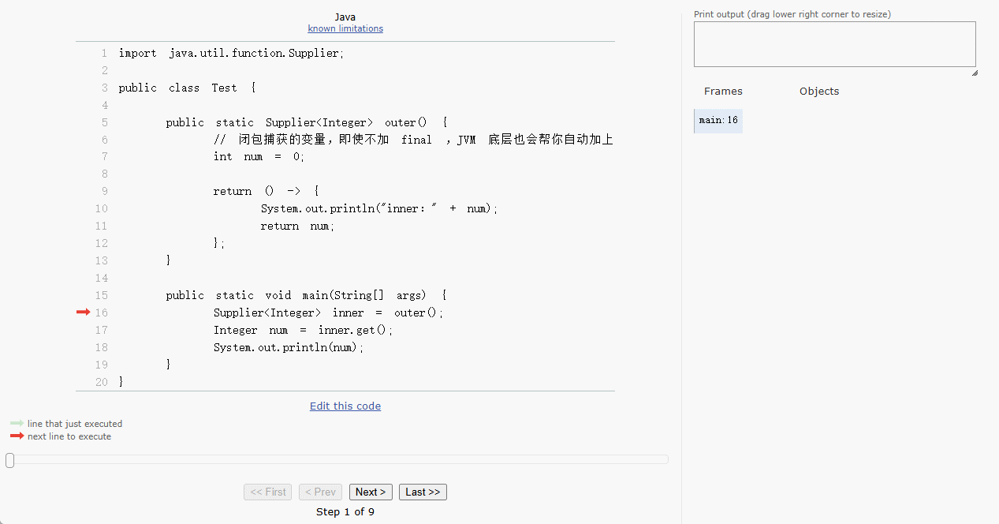

# 第一章：函数式编程

## 1.1 概述

* 2014 年 3 月，Oracle 推出了 JDK8 ，为我们带来了如下的特性：
  * ① `Lambda 表达式`：使得 Java 能够支持函数式编程。它允许我们以简洁的方式表达匿名函数，从而可以更灵活地处理集合、流等操作。
  * ② `Stream API` ：提供了一种通过声明性方式处理集合的手段。它支持函数式编程中的流式操作，可以通过流水线式的方式进行数据转换、过滤、聚合等操作。Stream API 让我们能够在不改变原数据的情况下，以更高效、更清晰的方式进行数据处理。
  * ③ `接口中新增默认方法和静态方法`：这样接口可以拥有实现，而不影响其实现类，即：避免了为接口添加新方法时破坏现有实现类的兼容性。
  * ④ `Optional 类`：容器类，其目的是更优雅地防止空指针异常（NullPointerException）。
  * ⑤ `新的日期时间 API`：ZoneId、Instant、DateTimeFormatter、LocalDateTime 等。
  * ⑥ `方法引用`：是 Lambda 表达式的一种简化形式，它可以引用已有的方法，而不需要显式地写出 Lambda 表达式。
* 其中，最为重要的特性就是`Lambda 表达式`和`Stream API`，极大地增强了 Java 对函数式编程范式的支持。

> [!NOTE]
>
> 函数式编程强调：
>
> - **不可变性**：避免使用可变的对象，通过值传递数据而不是通过引用传递。
> - **高阶函数**：函数可以作为参数传递，或者返回值。
> - **纯函数**：没有副作用，输出仅仅依赖于输入。

* 通过`Lambda 表达式`，Java 程序员可以编写更加简洁且具有表达力的代码。
* 与此同时，`Stream API`提供的流水线式数据处理，符合函数式编程的思想，强调通过组合小的函数来实现复杂的操作。
* `Optional`类的引入也是函数式编程中对`空指针异常`的优雅处理方式之一。

## 1.2 函数

### 1.2.1 什么是函数？

* 在初中，`函数`是这么定义的：在一个变化过程中有两个变量 x 和 y，对于 x 的每一个值，都有唯一的一个 y 值与之对应，我们称 y 是 x 的函数，其中 x 是自变量，y 是因变量。


* 在高中，`函数`是这么定义的：X、Y 是两个非空的数集，如果按照某种确定的对应关系 f，对于集合 X 的任意一个数 x ，在集合 Y 中都有唯一确定的 f(x) 和它对应，那么就称：X→Y 为从集合 X 到集合 Y 的一个函数，记作：y=f(x)，x∈X 。


* 其实，`函数`就是`规则`（类似于机器或黑箱），给予输入值 x 便产生唯一的输出值 y 。

> [!NOTE]
>
> * 假设有这样的一组数据，如下所示：
>
> | 输入 x | 函数（规则，f） | 输出 y |
> | ------ | --------------- | ------ |
> | 1      | ?               | 3      |
> | 2      | ?               | 6      |
> | 3      | ?               | 9      |
> | ...    | ...             | ...    |
>
> * 那么，这组数据对应的规则就是 `y = f(x) = 3 * x` ，如下所示：
>
> | 输入 x | 函数（规则，f） | 输出 y |
> | ------ | --------------- | ------ |
> | 1      | 3 * 1           | 3      |
> | 2      | 3 * 2           | 6      |
> | 3      | 3 * 3           | 9      |
> | ...    | ...             | ...    |


### 1.2.2 合格的函数

* 合格的函数：只要输入相同，无论多少次调用，无论什么时候调用，输出都相同（无副作用）。

> [!NOTE]
>
> * ① `相同的输入总是返回相同的输出`：无论什么时候调用这个函数，只要给定相同的输入，函数的输出一定的相同的，即：合格的函数（纯函数）不依赖于外部的状态或者可变的数据，即：可以依赖外部不可变的数据，函数的行为仅仅取决于其输入输出，如：`y = x * x`，只要 x = 2 ，y 就是 4 。
> * ② `没有副作用`： 副作用是指在函数执行过程中对外部世界的任何影响，如：修改全局变量、改变输入参数的值、进行输入输出操作（打印或文件写入）、修改文件或数据库状态等。合格的函数（纯函数）不能有这些副作用，它只能依赖输入并计算出结果，而不改变外部状态。

> [!CAUTION]
>
>  Java 中的`成员方法`也是合格的函数（纯函数）！！！


* 示例：合格的函数（纯函数）

```java
package com.github.lambda;

public class Test {
    public static void main(String[] args) {
        System.out.println(square(4)); // 16
        System.out.println(square(4)); // 16
        System.out.println(square(4)); // 16
        System.out.println(square(4)); // 16
        System.out.println(square(4)); // 16
        System.out.println(square(4)); // 16
        System.out.println(square(4)); // 16
        System.out.println(square(4)); // 16
        System.out.println(square(4)); // 16
    }

    /**
     * 合格的函数（纯函数）
     * @param x 输入
     * @return 输出
     */
    public static int square(int x) { // [!code highlight:3]
        return x * x;
    }
}
```


* 示例：不合格的函数

::: code-group

```java [Test.java]
package com.github.lambda;

public class Test {
    public static final Buddha buddha = new Buddha("满天神佛");

    public static void main(String[] args) {
        System.out.println(pray("张三"));
        System.out.println(pray("张三"));
        System.out.println(pray("张三"));
        buddha.name = "魔王"; // [!code highlight]
        System.out.println(pray("张三"));
    }

    /**
     * 不合格的函数（有副作用），依赖于外部可变的数据
     * @param person 输入
     * @return 输出
     */
    public static String pray(String person) { // [!code highlight:3]
        return person + "向【" + buddha.name + "】祈祷";
    }

    public static class Buddha {

        String name; // [!code highlight]

        public Buddha(String name) {
            this.name = name;
        }
    }
}
```

```txt [cmd 控制台]
张三向【满天神佛】祈祷
张三向【满天神佛】祈祷
张三向【满天神佛】祈祷
张三向【魔王】祈祷
```

:::


* 示例：合格的函数（纯函数）

::: code-group

```java {10} [Test.java]
package com.github.lambda;

public class Test {
    public static final Buddha buddha = new Buddha("满天神佛");

    public static void main(String[] args) {
        System.out.println(pray("张三"));
        System.out.println(pray("张三"));
        System.out.println(pray("张三"));
        // buddha.name = "魔王"; 
        System.out.println(pray("张三"));
    }

    /**
     * 合格的函数（没有副作用），不依赖于外部的状态或者可变的数据
     * 换言之，合格的函数（没有副作用）可以依赖于不可变的数据
     * @param person 输入
     * @return 输出
     */
    public static String pray(String person) { // [!code highlight:3]
        return person + "向【" + buddha.name + "】祈祷";
    }

    public static class Buddha {

        final String name; // [!code highlight]

        public Buddha(String name) {
            this.name = name;
        }
    }
}
```

```txt [cmd 控制台]
张三向【满天神佛】祈祷
张三向【满天神佛】祈祷
张三向【满天神佛】祈祷
张三向【满天神佛】祈祷
```

:::


* 示例：合格的函数（成员方法）

::: code-group

```java [Student.java]	
package com.github.lambda.demo1;

public class Student {
    String name;

    public Student() {
    }

    public Student(String name) {
        this.name = name;
    }

    /**
     * 合格的函数（纯函数）
     */
    public String getName(Student this) { // [!code highlight:3]
        return name;
    }

    public void setName(String name) {
        this.name = name;
    }
}
```

```java [Test.java]
package com.github.lambda.demo1;

public class Test {
    public static void main(String[] args) {
        Student s1 = new Student("张三");
        System.out.println(s1.getName()); // 底层会这么执行 getName(s1)
        System.out.println(s1.getName()); // 底层会这么执行 getName(s1)

        Student s2 = new Student("张三");
        System.out.println(s2.getName()); // 底层会这么执行 getName(s2)
        System.out.println(s2.getName()); // 底层会这么执行 getName(s2)
    }
    
}
```

:::

### 1.2.3 有形的函数

#### 1.2.3.1 其它语言中有形的函数

* 在函数式编程中，`函数`是`头等公民`，即：`函数可以写到任意位置`，可以作为函数的形参、函数的返回值、赋值给某个变量甚至存储到数据结构（数组、Set、Map）中。

> [!NOTE]
>
> JavaScript 是一门支持函数式编程的计算机语言，即：在 JavaScript 中，函数是头等公民！！！

* ① 函数可以被赋值给变量（函数表达式）

```js
let foo = function(){ // [!code highlight]
    console.log('foo 函数被执行了');
}

foo();
```

* ② 函数可以在变量之间来回传递：

```js
let foo = function(){ 
    console.log('foo 函数被执行了');
}

let bar = foo // [!code highlight]

bar();
```

* ③ 函数可以作为其它函数的形参：

```js
let foo = function(){ 
    console.log('foo 函数被执行了');
}

function biz(fn){ // [!code highlight]
    fn();
}

biz(foo);
```

* ④ 函数可以作为其它函数的返回值：

```js
let foo = function(){
    console.log('foo 函数被执行了');
}

function biz(){ 
    return foo; // [!code highlight]
}

const bar = biz()
bar();
```

* ⑤ 函数可以存储在其它数据结构中：

```js
let foo = function(){
    console.log('foo 函数被执行了');
}

let bar = function(){
    console.log('bar 函数被执行了');
}

let arr = [foo,bar] // [!code highlight]

arr[0]();
arr[1]();
```

* 其实，在 JavaScript 中，`函数`是一种特殊的`对象`，如下所示：


* 其内存图，如下所示：


> [!NOTE]
>
> 总结：函数的有形，就是让函数变为对象（持有对象的引用），这样函数就可以写到任意位置（让函数的规则传播）。

#### 1.2.3.2 Java 语言中有形的函数

* 在 JDK8 之前，Java 是一个纯粹的面向对象的编程语言。

> [!NOTE]
>
> 所谓的面向对象，就是先找对象，然后让对象帮我们做事情。

* 当调用一个方法的时候，如果方法的形参是一个接口，由于 Java 语法的限制，我们必须给这个方法传递该接口的实现类对象或者匿名内部类（匿名内部类的对象）。
* ① 没有使用匿名内部类：

::: code-group

```java [Swim.java]
public interface Swim {

    void swimming();
}
```

```java [Student.java]
public class Student implements Swim {

    @Override
    public void swimming() {
        System.out.println("重写了 swimming 方法");
    }
}
```

```java [Test.java]
public class Test {
    public static void main(String[] args) {
        goSwimming(new Student());
    }
    
    // 定义一个方法,模拟请一些人去游泳
    public static void goSwimming(Swim s) {
        s.swimming();
    }
}
```

:::

* ② 使用匿名内部类：

::: code-group

```java [Swim.java]
public interface Swim {

    void swimming();
}
```

```java [Test.java]
public class Test {
    public static void main(String[] args) {
        Swim swim = new Swim() {
            @Override
            public void swimming() {
                System.out.println("重写了 swimming 方法");
            }
        }
        
        goSwimming(swim);
    }
    
    // 定义一个方法,模拟请一些人去游泳
    public static void goSwimming(Swim s) {
        s.swimming();
    }
}
```

:::

* 在 JDK8 之后，Java 引入了函数式编程的思想。

> [!NOTE]
>
> 所谓的函数式编程，忽略面向对象的复杂语法，强调做什么（对行为的抽象），而不是谁去做。

* 当调用一个方法的时候，如果方法的形参是一个接口，我们不再需要给这个方法传递该接口的实现类对象或者匿名内部类（匿名内部类的对象），只需要传递`函数化对象`。

::: code-group

```java [Swim.java]
@FunctionalInterface 
public interface Swim {

    void swimming();
}
```

```java [Test.java]
public class Test {

    public static void main(String[] args) {

        // 函数化对象
        Swim swim = () -> System.out.println("重写了 swimming 方法");

        goSwimming(swim);
    }

    // 定义一个方法,模拟请一些人去游泳
    public static void goSwimming(Swim s) {
        s.swimming();
    }
}
```

:::

> [!NOTE]
>
> * ① 对于 JavaScript 而言，有形的函数，就是让函数变为对象（持有对象的引用），这样函数就可以写到任意位置（让函数的规则传播），即：JavaScript 从语法上就原生支持函数式编程。
> * ② 对于 Java 而言，有形的函数，也是让函数变为对象；但是，本质上是`实现了函数式接口（只有一个抽象方法的接口）的对象`，即：Java 从语法上只能有限支持函数式编程（必须依托于函数式接口）。

#### 1.2.3.3 JavaScript VS Java

* 对于 JavaScript 和 Java 而言，有形的函数：都是让函数变为对象；但是，二者内部的原理截然不同。
* 在 JavaScript 中，函数就是对象，如下所示：

```js
function add(a,b){ 
    return a+b;
}

// add 函数其实就是 Function 类的对象

const result = add(1,2);
console.log(result);
```

* 其内存动态图，如下所示：


* 正是 JavaScript 内部的这种原理，导致了 JavaScript 中的函数可以任意传递，这也是 JavaScript 中函数是头等公民，即：JavaScript 支持函数式编程的原因所在。

```js
let foo = function(){ // 函数可以被赋值给变量（函数表达式）
    console.log('foo 函数被执行了');
}

foo();
```

```js
let foo = function(){ 
    console.log('foo 函数被执行了');
}

let bar = foo // 函数可以在变量之间来回传递

bar();
```

```js
let foo = function(){ 
    console.log('foo 函数被执行了');
}

function biz(fn){  // 函数可以作为其它函数的形参
    fn();
}

biz(foo);
```

```js
let foo = function(){
    console.log('foo 函数被执行了');
}

function biz(){ 
    return foo; // 函数可以作为其它函数的返回值
}

const bar = biz()
bar();
```

```js
let foo = function(){
    console.log('foo 函数被执行了');
}

let bar = function(){
    console.log('bar 函数被执行了');
}

let arr = [foo,bar] // 函数可以存储在其它数据结构中

arr[0]();
arr[1]();
```

* 在 ES6 中，JavaScript  引入了箭头函数，也就是 Lambda 表达式（函数对象），并且由于 JavaScript 函数天生就是对象的特性，可以非常轻松地将函数转换为 Lambda 表达式：

```js
let foo = () => { // 函数可以被赋值给变量（函数表达式）
    console.log('foo 函数被执行了');
}

foo();
```

```js
let foo = () => { 
    console.log('foo 函数被执行了');
}

let bar = foo // 函数可以在变量之间来回传递

bar();
```

```js
let foo = () => { 
    console.log('foo 函数被执行了');
}

function biz(fn){  // 函数可以作为其它函数的形参
    fn();
}

biz(foo);
```

```js
let foo = () => {
    console.log('foo 函数被执行了');
}

function biz(){ 
    return foo; // 函数可以作为其它函数的返回值
}

const bar = biz()
bar();
```

```js
let foo = () => {
    console.log('foo 函数被执行了');
}

let bar = () => {
    console.log('bar 函数被执行了');
}

let arr = [foo,bar] // 函数可以存储在其它数据结构中

arr[0]();
arr[1]();
```

* 但是，Java 不一样，Java 中的方法不是对象，它仅仅表示一个栈帧而已，如下所示：

> [!NOTE]
>
> * ① 方法调用的时候，压入栈中执行。
> * ② 方法调用完毕后，从栈中弹出。

```java
public class Test {
  public static void main(String[] args) {
    int result = add(1,2);
    
    System.out.println(result);
  }
  
  public static int add(int a,int b){
    return a+b;
  }
}
```

* 其内存动态图，如下所示：


* 有形的函数都是让函数变为对象，Java 也不例外。但是，如果你仔细观察 JavaScript 中的函数，是可以直接运行的：

```js
let foo = function(){ // 函数可以被赋值给变量（函数表达式，匿名函数）
    console.log('foo 函数被执行了');
}

foo();
```

```js
let foo = () => { // 函数可以被赋值给变量（函数表达式，匿名函数）
    console.log('foo 函数被执行了');
}

foo();
```

* 由于，Java 传统上是面向对象的编程语言，方法总是依附于类的实例（对象）或类本身的。Java 是无法像 JavaScript 那样无缝的将“函数”当做对象来进行转换的，因为 Java 是静态类型语言，其强类型系统要求在编译时确定函数的参数类型和签名。换言之，如果像 JavaScript 那样，允许裸露“函数”字面量而不指定其接口类型，编译器将无法在编译时进行类型检查，即： JDK8 之后，虽然 Java 支持了 Lambda 表达式，但是依然受到了面向对象语言的限制。

> [!NOTE]
>
> * ① 在 Java 中，Lambda 表达式本质上是一个简化的匿名函数，用于实现接口（尤其是函数式接口）。
> * ② 在 Java 中，Lambda 表达式需要依附于接口的方法签名，并通过接口来实现。

```java
@FunctionalInterface
interface MathOperation {
    int operate(int a, int b);
}

public class Test {
    public static void main(String[] args) {
        MathOperation add = (a, b) -> a + b;  // Lambda 表达式
        System.out.println(add.operate(5, 3));  // 输出 8
    }
}
```

> [!NOTE]
>
> * ① 如果将 JavaScript 中的“函数”当做是自由职业者，可以随心所欲地选择任意工作。
> * ② 那么，Java 中的“函数”更像是上班一族（合同工），必须签了合同（接口）才能上岗。

## 1.3 函数对象

### 1.3.1 概述

* 函数对象有如下的好处：
  * 行为参数化。
  * 延迟执行。

### 1.3.2 行为参数化

* 所谓的行为参数化，就是允许将不同的行为作为参数传入，提高方法的通用性和可重用性。

> [!NOTE]
>
> 假设现在有多个学生，需要筛选出男性或 18 岁以下的学生：
>
> * ① 按照之前面向对象的思维，我们可能需要编写两个方法，即：一个方法用于筛选出男性学生，另一个方法用于筛选出 18 岁以下的学生。
>
> * ② 按照函数式编程的思想，我们可以将行为作为参数传递给方法，使得方法的行为可以在运行时动态决定。


* 示例：传统写法

::: code-group

```java [Student.java]
package com.github.lambda.demo2;

public class Student {

    private String name;

    private Integer age;

    private String gender;

    public Student(String name, Integer age, String gender) {
        this.name = name;
        this.age = age;
        this.gender = gender;
    }

    public String getName() {
        return name;
    }

    public void setName(String name) {
        this.name = name;
    }

    public Integer getAge() {
        return age;
    }

    public void setAge(Integer age) {
        this.age = age;
    }

    public String getGender() {
        return gender;
    }

    public void setGender(String gender) {
        this.gender = gender;
    }

    @Override
    public String toString() {
        return "Student{" +
                "name='" + name + '\'' +
                ", age=" + age +
                ", gender='" + gender + '\'' +
                '}';
    }
}
```

```java [Test.java]
package com.github.lambda.demo2;

import java.util.ArrayList;
import java.util.List;
import java.util.Objects;

public class Test {
    public static void main(String[] args) {
        // 构建集合
        List<Student> studentList = List.of(
                new Student("张无忌", 18, "男"),
                new Student("杨不悔", 16, "女"),
                new Student("周芷若", 19, "女"),
                new Student("宋青书", 20, "男")
        );

        // 条件1：筛选出男性学生
        List<Student> resultList = filter(studentList);
        // 遍历集合
        resultList.forEach(System.out::println);


        System.out.println("-----------------------------------------");

        // 条件2：筛选出 18 岁以下的学生
        resultList = filter2(studentList);
        // 遍历集合
        resultList.forEach(System.out::println);
    }

    /**
     * 筛选出男性学生
     *
     * @param studentList 集合
     * @return 符合条件的集合
     */
    public static List<Student> filter(List<Student> studentList) { // [!code highlight]
        // 确保 studentList 非空
        studentList = Objects.requireNonNullElseGet(studentList, ArrayList::new);
        // 筛选逻辑
        List<Student> resultList = new ArrayList<>();
        for (Student student : studentList) {
            if ("男".equals(student.getGender())) { // [!code highlight]
                resultList.add(student);
            }
        }
        return resultList;
    }

    /**
     * 筛选出 18 岁以下的学生
     *
     * @param studentList 集合
     * @return 符合条件的集合
     */
    public static List<Student> filter2(List<Student> studentList) { // [!code highlight]
        // 确保 studentList 非空
        studentList = Objects.requireNonNullElseGet(studentList, ArrayList::new);
        // 筛选逻辑
        List<Student> resultList = new ArrayList<>();
        for (Student student : studentList) {
            if (student.getAge() < 18) { // [!code highlight]
                resultList.add(student);
            }
        }
        return resultList;
    }
}
```

```txt [cmd 控制台]
Student{name='张无忌', age=18, gender='男'}
Student{name='宋青书', age=20, gender='男'}
-----------------------------------------
Student{name='杨不悔', age=16, gender='女'}
```

:::


* 示例：函数式写法

::: code-group

```java [Student.java]
package com.github.lambda.demo2;

public class Student {

    private String name;

    private Integer age;

    private String gender;

    public Student(String name, Integer age, String gender) {
        this.name = name;
        this.age = age;
        this.gender = gender;
    }

    public String getName() {
        return name;
    }

    public void setName(String name) {
        this.name = name;
    }

    public Integer getAge() {
        return age;
    }

    public void setAge(Integer age) {
        this.age = age;
    }

    public String getGender() {
        return gender;
    }

    public void setGender(String gender) {
        this.gender = gender;
    }

    @Override
    public String toString() {
        return "Student{" +
                "name='" + name + '\'' +
                ", age=" + age +
                ", gender='" + gender + '\'' +
                '}';
    }
}
```

```java {19,27,38,44} [Test.java]
package com.github.lambda.demo2;

import java.util.ArrayList;
import java.util.List;
import java.util.Objects;
import java.util.function.Predicate;

public class Test {
    public static void main(String[] args) {
        // 构建集合
        List<Student> studentList = List.of(
                new Student("张无忌", 18, "男"), 
                new Student("杨不悔", 16, "女"), 
                new Student("周芷若", 19, "女"), 
                new Student("宋青书", 20, "男")
        );

        // 条件1：筛选出男性学生
        List<Student> resultList = filter(studentList, student -> "男".equals(student.getGender()));
        // 遍历集合
        resultList.forEach(System.out::println);


        System.out.println("-----------------------------------------");

        // 条件2：筛选出 18 岁以下的学生
        resultList = filter(studentList, student -> student.getAge() <= 18);
        // 遍历集合
        resultList.forEach(System.out::println);
    }

    /**
     * 筛选出学生
     *
     * @param studentList 集合
     * @return 符合条件的集合
     */
    public static List<Student> filter(List<Student> studentList, Predicate<Student> predicate) {
        // 确保 studentList 非空
        studentList = Objects.requireNonNullElseGet(studentList, ArrayList::new);
        // 筛选逻辑
        List<Student> resultList = new ArrayList<>();
        for (Student student : studentList) {
            if (predicate.test(student)) {
                resultList.add(student);
            }
        }
        return resultList;
    }

}
```

```txt [cmd 控制台]
Student{name='张无忌', age=18, gender='男'}
Student{name='宋青书', age=20, gender='男'}
-----------------------------------------
Student{name='杨不悔', age=16, gender='女'}
```

:::

### 1.3.3 延迟执行

#### 1.3.3.1 概述

* 所谓的延迟执行，就是代码在定义的时候不会立即执行，而是等到真正需要结果的时候才执行，可以提升性能，避免不必要的计算，适合处理大型数据流、懒加载等场景。

> [!NOTE]
>
> * ① 通过日志来模拟延迟执行，需要使用 slf4j+ log4j2 日志组件，如果使用 Gradle 构建工具，需要配置如下的依赖：
>
> ```groovy
> // SLF4J API
> implementation 'org.slf4j:slf4j-api:2.0.12'
> 
> // Log4j2 核心库
> implementation 'org.apache.logging.log4j:log4j-core:2.20.0'
> 
> // Log4j2 配置支持
> implementation 'org.apache.logging.log4j:log4j-api:2.20.0'
> 
> // 将 SLF4J 绑定到 Log4j2
> implementation 'org.apache.logging.log4j:log4j-slf4j2-impl:2.20.0'
> ```
> *  ② 日志级别由低到高是：TRACE < DEBUG < INFO < WARN < ERROR < FATAL ，即：当设置日志级别为 INFO ，只会输出 WARN 、ERROR  以及 FATAL 级别的日志信息。

#### 1.3.3.2 现象

* 全局日志级别是 DEBUG，主方法中的日志级别为 DEBUG，expensive() 方法会执行。


* 示例：

::: code-group

```java [Test.java]
package com.github.lambda.demo3;

import org.apache.logging.log4j.Level;
import org.apache.logging.log4j.LogManager;
import org.apache.logging.log4j.Logger;
import org.apache.logging.log4j.core.appender.ConsoleAppender;
import org.apache.logging.log4j.core.config.builder.api.AppenderComponentBuilder;
import org.apache.logging.log4j.core.config.builder.api.ConfigurationBuilder;
import org.apache.logging.log4j.core.config.builder.api.ConfigurationBuilderFactory;
import org.apache.logging.log4j.core.config.builder.impl.BuiltConfiguration;

import static org.apache.logging.log4j.core.config.Configurator.initialize;

public class Test {

    // 全局日志级别
    public static Logger logger = init(Level.DEBUG); // [!code highlight]

    public static Logger init(Level level) {
        ConfigurationBuilder<BuiltConfiguration> builder = ConfigurationBuilderFactory
                .newConfigurationBuilder()
                .setStatusLevel(Level.ERROR)
                .setConfigurationName("BuilderTest");
        AppenderComponentBuilder appender =
                builder
                        .newAppender("Stdout", "CONSOLE")
                        .addAttribute("target", ConsoleAppender.Target.SYSTEM_OUT)
                        .add(builder
                                .newLayout("PatternLayout")
                                .addAttribute("pattern", "%d [%t] %-5level: %msg%n%throwable"));
        builder
                .add(appender)
                .add(builder
                        .newRootLogger(level)
                        .add(builder.newAppenderRef("Stdout")));
        initialize(builder.build());
        return LogManager.getLogger();

    }

    public static String expensive() {
        System.out.println("执行耗时操作...");
        return "日志";
    }


    public static void main(String[] args) {
        // 当前日志级别
        logger.debug("{}", expensive()); // [!code highlight]
    }
}
```

```txt [cmd 控制台]
执行耗时操作...
2025-05-10 21:31:29,212 [main] DEBUG: 日志
```

:::

#### 1.3.3.3 问题

* 全局日志级别是 INFO ，主方法中的日志级别为 DEBUG，expensive() 方法依然会执行。

> [!NOTE]
>
> 其实这种情况下，我们想要的是 expensive() 不应该执行，如果执行的话，性能就很差。


* 示例：

::: code-group

```java [Test.java]
package com.github.lambda.demo3;

import org.apache.logging.log4j.Level;
import org.apache.logging.log4j.LogManager;
import org.apache.logging.log4j.Logger;
import org.apache.logging.log4j.core.appender.ConsoleAppender;
import org.apache.logging.log4j.core.config.builder.api.AppenderComponentBuilder;
import org.apache.logging.log4j.core.config.builder.api.ConfigurationBuilder;
import org.apache.logging.log4j.core.config.builder.api.ConfigurationBuilderFactory;
import org.apache.logging.log4j.core.config.builder.impl.BuiltConfiguration;

import static org.apache.logging.log4j.core.config.Configurator.initialize;

public class Test {

    // 全局日志级别
    public static Logger logger = init(Level.INFO); // [!code highlight]

    public static Logger init(Level level) {
        ConfigurationBuilder<BuiltConfiguration> builder = ConfigurationBuilderFactory
                .newConfigurationBuilder()
                .setStatusLevel(Level.ERROR)
                .setConfigurationName("BuilderTest");
        AppenderComponentBuilder appender =
                builder
                        .newAppender("Stdout", "CONSOLE")
                        .addAttribute("target", ConsoleAppender.Target.SYSTEM_OUT)
                        .add(builder
                                .newLayout("PatternLayout")
                                .addAttribute("pattern", "%d [%t] %-5level: %msg%n%throwable"));
        builder
                .add(appender)
                .add(builder
                        .newRootLogger(level)
                        .add(builder.newAppenderRef("Stdout")));
        initialize(builder.build());
        return LogManager.getLogger();

    }

    public static String expensive() {
        System.out.println("执行耗时操作...");
        return "日志";
    }


    public static void main(String[] args) {
        // 当前日志级别
        logger.debug("{}", expensive()); // [!code highlight]
    }
}
```

```txt [cmd 控制台]
执行耗时操作...
```

:::

#### 1.3.3.4 解决方案

* Log4j2 提供了如下的方法，可以判断当前的日志级别是否是 DEBUG：

```java
boolean isDebugEnabled();
```

> [!NOTE]
>
> 我们可以利用该方法来解决：全局日志级别是 INFO ，主方法中的日志级别为 DEBUG，expensive() 方法会执行。


* 示例：

::: code-group

```java [Test.java]
package com.github.lambda.demo3;

import org.apache.logging.log4j.Level;
import org.apache.logging.log4j.LogManager;
import org.apache.logging.log4j.Logger;
import org.apache.logging.log4j.core.appender.ConsoleAppender;
import org.apache.logging.log4j.core.config.builder.api.AppenderComponentBuilder;
import org.apache.logging.log4j.core.config.builder.api.ConfigurationBuilder;
import org.apache.logging.log4j.core.config.builder.api.ConfigurationBuilderFactory;
import org.apache.logging.log4j.core.config.builder.impl.BuiltConfiguration;

import static org.apache.logging.log4j.core.config.Configurator.initialize;

public class Test {

    // 全局日志级别
    public static Logger logger = init(Level.INFO); // [!code highlight]

    public static Logger init(Level level) {
        ConfigurationBuilder<BuiltConfiguration> builder = ConfigurationBuilderFactory
                .newConfigurationBuilder()
                .setStatusLevel(Level.ERROR)
                .setConfigurationName("BuilderTest");
        AppenderComponentBuilder appender =
                builder
                        .newAppender("Stdout", "CONSOLE")
                        .addAttribute("target", ConsoleAppender.Target.SYSTEM_OUT)
                        .add(builder
                                .newLayout("PatternLayout")
                                .addAttribute("pattern", "%d [%t] %-5level: %msg%n%throwable"));
        builder
                .add(appender)
                .add(builder
                        .newRootLogger(level)
                        .add(builder.newAppenderRef("Stdout")));
        initialize(builder.build());
        return LogManager.getLogger();

    }

    public static String expensive() {
        System.out.println("执行耗时操作...");
        return "日志";
    }


    public static void main(String[] args) {
        // 当前日志级别
        if (logger.isDebugEnabled()) { // [!code highlight]
            logger.debug("{}", expensive()); // [!code highlight]
        }
    }
}
```

```txt [cmd 控制台]

```

:::

#### 1.3.3.5 解决方案

* 其实，Log4j2 提供了 debug 重载的方法，就可以用来解决上述问题：

```java
void debug(String message, Supplier<?>... paramSuppliers)
```

> [!NOTE]
>
> * ① `logger.debug("{}",expensive());` 会立即执行  expensive() 方法。
> * ② `logger.debug("{}", () -> expensive());`会延迟执行 expensive() 方法。


* 示例：

::: code-group

```java [Test.java]
package com.github.lambda.demo3;

import org.apache.logging.log4j.Level;
import org.apache.logging.log4j.LogManager;
import org.apache.logging.log4j.Logger;
import org.apache.logging.log4j.core.appender.ConsoleAppender;
import org.apache.logging.log4j.core.config.builder.api.AppenderComponentBuilder;
import org.apache.logging.log4j.core.config.builder.api.ConfigurationBuilder;
import org.apache.logging.log4j.core.config.builder.api.ConfigurationBuilderFactory;
import org.apache.logging.log4j.core.config.builder.impl.BuiltConfiguration;

import static org.apache.logging.log4j.core.config.Configurator.initialize;

public class Test {

    // 全局日志级别
    public static Logger logger = init(Level.INFO); // [!code highlight]

    public static Logger init(Level level) {
        ConfigurationBuilder<BuiltConfiguration> builder = ConfigurationBuilderFactory
                .newConfigurationBuilder()
                .setStatusLevel(Level.ERROR)
                .setConfigurationName("BuilderTest");
        AppenderComponentBuilder appender =
                builder
                        .newAppender("Stdout", "CONSOLE")
                        .addAttribute("target", ConsoleAppender.Target.SYSTEM_OUT)
                        .add(builder
                                .newLayout("PatternLayout")
                                .addAttribute("pattern", "%d [%t] %-5level: %msg%n%throwable"));
        builder
                .add(appender)
                .add(builder
                        .newRootLogger(level)
                        .add(builder.newAppenderRef("Stdout")));
        initialize(builder.build());
        return LogManager.getLogger();

    }

    public static String expensive() {
        System.out.println("执行耗时操作...");
        return "日志";
    }


    public static void main(String[] args) {
        // 当前日志级别
        logger.debug("{}", () -> expensive()); // [!code highlight]
    }
}
```

```txt [cmd 控制台]

```

:::


# 第二章：函数编程语法（⭐）

## 2.1 概述

* 本章将学习函数编程的语法，如下所示：
  * ① 函数对象的表现形式。
  * ② 函数接口。
  * ③ 闭包和柯里化。
  * ④ 高阶函数。
* 其中，函数对象的表现形式：`Lambda 表达式`和`方法引用`。

> [!NOTE]
>
> * ① Lambda 表达式的特点是：功能更全面。
>
> * ② 方法引用的特点是：写法更简洁。

## 2.2 函数式接口

### 2.2.1 概述

* Lambda 表达式其实就是实现了 SAM（Single Abstract Method，即：接口中有且仅有一个抽象方法）接口的语法糖。

> [!NOTE]
>
> SAM 中接口中有且仅有一个抽象方法，但是可以包含非抽象方法，如：静态方法和默认方法。

* 只要满足 SAM 特征的接口就是`函数式接口`。如果在声明函数式接口的时候，使用 `@FunctionalInterface` 注解来标注，编译器将会强制检查该接口是否有且仅有一个抽象方法，如果不是，将会报错。
* JDK 8 之前的很多接口，满足 SAM 特性的接口有：Runnable、Comparator 、Callable 以及 FileFilter。
* JDK 8 在`java.util.function`包中新增了很多函数式接口，主要分为：消费型、供给型、断言型（判断型）、和函数型（功能型）。

> [!NOTE]
>
> * ① JDK 内置的函数是接口，基本满足我们的实际开发需求。
> * ② 但是，为了满足实际的业务需求，我们也可以自定义函数式接口。

### 2.2.2 语法

* 函数式接口的语法：

```java
@FunctionalInterface
修饰符 interface 接口名{
    [public abstract] 返回值类型 方法名(形参列表);
}
```

> [!NOTE]
>
> 接口中抽象方法可以省略`public abstract`关键字！！！


* 示例：

::: code-group

```java [Calculator.java]
package com.github.lambda.demo3;

@FunctionalInterface
public interface Calculator {

    int cal(int a, int b);

}
```

```java [Test.java]
package com.github.lambda.demo3;

public class Test {
    public static void main(String[] args) {
        int a = 10;
        int b = 2;

        System.out.println(calc(a, b, (x, y) -> x + y)); // 12
        System.out.println(calc(a, b, (x, y) -> x - y)); // 8
        System.out.println(calc(a, b, (x, y) -> x * y)); // 20
        System.out.println(calc(a, b, (x, y) -> x / y)); // 5
        System.out.println(calc(a, b, (x, y) -> x % y)); // 0
    }

    /**
     * 计算 a 和 b 的四则运算
     *
     * @param a          整数
     * @param b          整数
     * @param calculator 函数式接口
     * @return 结果
     */
    public static int calc(int a, int b, Calculator calculator) {
        return calculator.cal(a, b);
    }
}
```

:::

### 2.2.3 函数式接口的分类

#### 2.2.3.1 概述

* 除了我们可以自定义函数式接口，JDK 还给我们内置了一些函数式接口，大致分为：
  * 消费型。
  * 供给型。
  * 断言型（判断型）。
  * 函数型（功能型）。

#### 2.2.3.2 消费型接口

* 所谓的消费：就是只吃不拉，如下所示：


* 消费型接口中抽象方法的特点是：有形参，但是无返回值，即：返回值类型是 void 。

| 接口名                 | 抽象方法                          | 描述                                            |
| ---------------------- | --------------------------------- | ----------------------------------------------- |
| `Consumer<T>`          | `void accept(T t);`               | 接收一个参数（T 类型）用于完成功能              |
| `BiConsumer<T, U>`     | `void accept(T t, U u);`          | 接收两个参数（T 类型、U 类型）用于完成功能      |
| `IntConsumer`          | `void accept(int value);`         | 接收一个参数（int 类型）用于完成功能            |
| `LongConsumer`         | `void accept(long value);`        | 接收一个参数（long 类型）用于完成功能           |
| `ObjIntConsumer<T>`    | `void accept(T t, int value);`    | 接收两个参数（T 类型、int 类型）用于完成功能    |
| `ObjLongConsumer<T>`   | `void accept(T t, long value);`   | 接收两个参数（T 类型、long 类型）用于完成功能   |
| `ObjDoubleConsumer<T>` | `void accept(T t, double value);` | 接收两个参数（T 类型、double 类型）用于完成功能 |

> [!NOTE]
>
> * ① 函数式接口的命名规律：
>   * 带有 Unary 是一元的意思，即：表示一个参数。
>   * 带有 Bi 或 Binary 是二元的意思，即：表示两个参数。
>   * 带有 Ternary 是三元的意思，即：表示三个参数。
>   * 带有 Quatenary 是四元的意思，即：表示四个参数。
>
> * ② 当我们调用`消费型接口`中的抽象方法的时候，相当于我们给其一个实参，却得不到任意返回值，即：有去无回，纯消费行为。
> * ③ 应用场景：对传入的对象执行某个操作，如：打印、修改、保存等。


* 示例：

::: code-group

```java [Test.java]
package com.github.lambda.demo4;

import java.util.List;
import java.util.function.Consumer;

public class Test {
    public static void main(String[] args) {

        List<Integer> list = List.of(1, 2, 3, 4, 5, 6, 7);

        consume(list, (i) -> {
            i *= 2;
            System.out.println("i = " + i);
        });

        System.out.println("---------------------------------");

        consume(list, (i) -> {
            i /= 2;
            System.out.println("i = " + i);
        });

    }

    /**
     *
     * @param list 集合
     * @param con  消费型接口
     */
    public static void consume(List<Integer> list, Consumer<Integer> con) {
        for (Integer i : list) {
            con.accept(i);
        }
    }
}
```

```txt [cmd 控制台]
i = 2
i = 4
i = 6
i = 8
i = 10
i = 12
i = 14
---------------------------------
i = 0
i = 1
i = 1
i = 2
i = 2
i = 3
i = 3
```

:::


* 示例：

```java
package com.github.lambda.demo4;

import java.util.function.Consumer;

public class Test {
    public static void main(String[] args) {

        Consumer<String> consumer = str -> {
            String upperCase = str.toUpperCase();
            // HELLO WORLD
            System.out.println(upperCase);
        };

        consumer.accept("hello World");

        System.out.println("--------------------");

        consumer = str -> {
            String lowerCase = str.toLowerCase();
            // hello world
            System.out.println(lowerCase);
        };

        consumer.accept("hello World");

    }
}
```

#### 2.2.3.3 供给型接口

* 所谓的供给，就是只产出却没有输入，如下所示：


* 供给型接口中抽象方法的特点是：无形参，但是有返回值。

| 接口名            | 抽象方法                  | 描述                      |
| ----------------- | ------------------------- | ------------------------- |
| `Supplier<T>`     | `T get();`                | 返回一个 T 类型的值       |
| `BooleanSupplier` | `boolean getAsBoolean();` | 返回一个 boolean 类型的值 |
| `DoubleSupplier`  | `double getAsDouble();`   | 返回一个 double 类型的值  |
| `IntSupplier`     | `int getAsInt();`         | 返回一个 int 类型的值     |
| `LongSupplier`    | `long getAsLong();`       | 返回一个 long 类型的值    |

> [!NOTE]
>
> * ① 函数式接口的命名规律：
>   * 带有 Unary 是一元的意思，即：表示一个参数。
>   * 带有 Bi 或 Binary 是二元的意思，即：表示两个参数。
>   * 带有 Ternary 是三元的意思，即：表示三个参数。
>   * 带有 Quatenary 是四元的意思，即：表示四个参数。
>
> * ② 调用这些抽象方法的时候，相当于我们不给它们传递参数，却可以得到一个返回值，即：空手套白狼。
> * ③ 应用场景：生产或提供一个值，无需输入参数，如：默认值生成、延迟加载、数据生成等。


* 示例：

::: code-group

```java [Test.java]
package com.github.lambda.demo4;

import java.util.ArrayList;
import java.util.List;
import java.util.concurrent.ThreadLocalRandom;
import java.util.function.Supplier;

public class Test {
    public static void main(String[] args) {

        int count = 10;

        List<Integer> generate = generate(count, () -> ThreadLocalRandom
                .current()
                .nextInt(count));

        generate.forEach(System.out::println);
    }

    public static List<Integer> generate(int count, Supplier<Integer> supplier) {
        List<Integer> list = new ArrayList<>();
        for (int i = 0; i < count; i++) {
            list.add(supplier.get());
        }
        return list;
    }
}
```

```txt [cmd 控制台]
1
4
6
6
6
1
9
7
2
5
```

:::

#### 2.2.3.4 断言型接口（判断型接口）

* 所谓的断言（判断），就是判断参数是否满足条件，如下所示：


* 断言型接口中抽象方法的特点是：有形参，但是返回值类型是 boolean。

| 接口名              | 抽象方法                      | 描述                                                      |
| ------------------- | ----------------------------- | --------------------------------------------------------- |
| `Predicate<T>`      | `boolean test(T t);`          | 接收一个 T 类型的参数，返回一个 boolean 类型的值          |
| `BiPredicate<T, U>` | `boolean test(T t, U u);`     | 接收两个参数（T 类型、U 类型），返回一个 boolean 类型的值 |
| `DoublePredicate`   | `boolean test(double value);` | 接收一个 double 类型的参数，返回一个 boolean 类型的值     |
| `IntPredicate`      | `boolean test(int value);`    | 接收一个 int 类型的参数，返回一个 boolean 类型的值        |
| `LongPredicate`     | `boolean test(long value);`   | 接收一个 long 类型的参数，返回一个 boolean 类型的值       |

> [!NOTE]
>
> * ① 函数式接口的命名规律：
>   * 带有 Unary 是一元的意思，即：表示一个参数。
>   * 带有 Bi 或 Binary 是二元的意思，即：表示两个参数。
>   * 带有 Ternary 是三元的意思，即：表示三个参数。
>   * 带有 Quatenary 是四元的意思，即：表示四个参数。
>
> * ② 调用这些抽象方法的时候，给告诉我们传入的参数是否满足指定的条件，如果满足，就返回 true；否则，返回 false。
> * ③ 应用场景：用于测试某个条件或进行布尔判断，如：判断条件、过滤数据、复杂的逻辑组合等。


* 示例：

```java
package com.github.lambda.demo4;

import java.util.ArrayList;
import java.util.List;
import java.util.function.Predicate;

public class Test {
    public static void main(String[] args) {

        List<Integer> list = List.of(1, 2, 3, 4, 5, 6);

        // 过滤集合中的偶数
        List<Integer> resultList = filter(list, x -> x % 2 == 0);
        resultList.forEach(System.out::println);

        // 过滤集合中的奇数
        resultList = filter(list, x -> x % 2 != 0);
        resultList.forEach(System.out::println);

    }

    /**
     * 根据指定的条件过滤集合中的元素
     *
     * @param list      集合
     * @param predicate 断言型接口
     * @return 过滤之后集合的元素
     */
    public static List<Integer> filter(List<Integer> list, Predicate<Integer> predicate) {
        List<Integer> resultList = new ArrayList<>();
        for (Integer i : list) {
            if (predicate.test(i)) {
                resultList.add(i);
            }
        }
        return resultList;
    }
}
```

#### 2.2.3.5 函数型接口

* 所谓的函数，就是有输入就有输出，如下所示：


* 函数型接口中抽象方法的特点是：有形参，但是有返回值。

| 接口名                     | 抽象方法                            | 描述                                                      |
| -------------------------- | ----------------------------------- | --------------------------------------------------------- |
| `Function<T,R>`            | `R apply(T t);`                     | 接收一个参数（T 类型），返回一个 R 类型的值               |
| `BiFunction<T, U, R>`      | `R apply(T t, U u);`                | 接收两个参数（T 类型和 U 类型），返回一个 R 类型的值      |
| `DoubleFunction<R>`        | `R apply(double value);`            | 接收一个参数（double  类型），返回一个 R 类型的值         |
| `DoubleToIntFunction`      | `int applyAsInt(double value);`     | 接收一个参数（double  类型），返回一个 int 类型的值       |
| `DoubleToLongFunction`     | `long applyAsLong(double value);`   | 接收一个参数（double  类型），返回一个 long 类型的值      |
| `IntToDoubleFunction`      | `double applyAsDouble(int value);`  | 接收一个参数（int 类型），返回一个 double 类型的值        |
| `IntToLongFunction`        | `long applyAsLong(int value);`      | 接收一个参数（int 类型），返回一个 long 类型的值          |
| `LongFunction<R>`          | `R apply(long value);`              | 接收一个参数（long  类型），返回一个 R 类型的值           |
| `LongToDoubleFunction`     | `double applyAsDouble(long value);` | 接收一个参数（long  类型），返回一个 double 类型的值      |
| `LongToIntFunction`        | `int applyAsInt(long value);`       | 接收一个参数（long  类型），返回一个 int 类型的值         |
| `ToDoubleBiFunction<T, U>` | `double applyAsDouble(T t, U u);`   | 接收两个参数（T 类型和 U 类型），返回一个 double 类型的值 |
| `ToDoubleFunction<T>`      | `double applyAsDouble(T value);`    | 接收一个参数（T 类型），返回一个 double 类型的值          |
| `ToIntBiFunction<T, U>`    | `int applyAsInt(T t, U u);`         | 接收两个参数（T 类型和 U 类型），返回一个 int 类型的值    |
| `ToIntFunction<T>`         | `int applyAsInt(T value);`          | 接收一个参数（T 类型），返回一个 int 类型的值             |
| `ToLongBiFunction<T, U>`   | `long applyAsLong(T t, U u);`       | 接收两个参数（T 类型和 U 类型），返回一个 long 类型的值   |
| `ToLongFunction<T>`        | `long applyAsLong(T value);`        | 接收一个参数（T 类型），返回一个 long 类型的值            |

> [!NOTE]
>
> * ① 函数式接口的命名规律：
>   * 带有 Unary 是一元的意思，即：表示一个参数。
>   * 带有 Bi 或 Binary 是二元的意思，即：表示两个参数。
>   * 带有 Ternary 是三元的意思，即：表示三个参数。
>   * 带有 Quatenary 是四元的意思，即：表示四个参数。
>
> * ② 调用这些抽象方法的时候，相当于我们给它们一个或多个参数，同时也可以获取一个返回值，即：礼尚往来。
> * ③ 应用场景：数据处理或数据转换。
> * ④ 含有 Operator 名词的函数式接口也是函数型接口，只不过参数的类型和返回值的类型相同，如下所示：
>
> | 接口名              | 抽象方法            | 描述                                                 |
> | ------------------- | ------------------- | ---------------------------------------------------- |
> | `UnaryOperator<T>`  | `T apply(T t);`     | 接收一个参数（T 类型），返回一个 T 类型的值          |
> | `BinaryOperator<T>` | `T apply(T t, T u)` | 接收两个参数（T 类型和 T 类型），返回一个 T 类型的值 |


* 示例：

```java
package com.github.lambda.demo4;

import java.util.function.BiFunction;

public class Test {
    public static void main(String[] args) {

        int result1 = process(5, 3, (x, y) -> x + y);
        int result2 = process(5, 3, (x, y) -> x * y);

        System.out.println(result1); // 输出: 8
        System.out.println(result2); // 输出: 15

    }

    public static int process(int a, int b, BiFunction<Integer, Integer, Integer> func) {
        return func.apply(a, b);
    }
}
```

## 2.3 Lambda 表达式

### 2.3.1 概述

* Lambda 表达式是用来给 `函数式接口` 的变量或形参赋值使用的。
* 本质上，Lambda 表达式是用于实现 `函数式接口` 的 `抽象方法` 。 

### 2.3.2 语法

* Lambda 表达式语法：

```java
(形参列表) -> {Lambda体}
```

> [!NOTE]
>
> * `(形参列表)`：就是要赋值的函数式接口的抽象方法的 `(形参列表)` 。
>* `->`：Lambda 操作符，也可以称为“箭头符号”。
> * `{Lambda体}`：就是实现这个抽象方法的方法体。


* 示例：无参 Lambda 表达式

```java [Test.java]
package com.github.lambda.demo4;

public class Test {
    public static void main(String[] args) {
        
        Runnable runnable = () -> {
            System.out.println(Thread
                .currentThread()
                .getName());
        }

        new Thread(runnable).start();
    }
}
```


* 示例：单个参数的 Lambda 表达式

```java
package com.github.lambda.demo4;

import java.util.List;

public class Test {
    public static void main(String[] args) {
        List<Integer> list = List.of(1, 2, 3, 4);
        
        // 单个参数 Lambda 表达式：(x) -> {...}
        list.forEach( x -> {
            System.out.println(x);
        });
    }
}
```


* 示例：多个参数的 Lambda 表达式

```java
package com.github.lambda.demo4;

import java.util.List;
import java.util.function.BiFunction;

public class Test {
    public static void main(String[] args) {
        // 多个参数 Lambda 表达式：(x1,x2) -> {...}
        int result = calculate(1, 2, (a, b) -> a + b);
        System.out.println(result);
    }

    /**
     * 计算 a 和 b 的运算
     *
     * @param a          整数
     * @param b          整数
     * @param biFunction 函数式接口
     * @return a 和 b 运算的结果
     */
    public static int calculate(int a, int b, BiFunction<Integer, Integer, Integer> biFunction) {
        return biFunction.apply(a, b);
    }
}
```


* 示例：带方法体的 Lambda 表达式

```java
package com.github.lambda.demo4;

import java.util.function.Function;

public class Test {
    public static void main(String[] args) {
        // 带方法体的 Lambda 表达式：(x1,x2) -> { ... }
        Function<Integer, Integer> square = (x) -> {
            int result = x * x;
            return result;
        };
        System.out.println(square.apply(4));  // 输出 16
    }

}
```

### 2.3.3 简化写法

* Lambda 表达式的完整写法：

```java
(形参列表) -> {Lambda体}
```

* 但是，当出现以下条件的时候，可以简化 Lambda 表达式的写法：

| 条件                            | 描述                                   | 举例                               |
| ------------------------------- | -------------------------------------- | ---------------------------------- |
| 如果`{Lambda体}`中只有一条语句  | 可以省略`{}`或`{;}`                    | `() -> {return 1;}` <--> `() -> 1` |
| `(形参列表)` 中形参的类型       | 可以省略                               | `(int x) -> x` <--> `(x) -> x`     |
| `(形参列表)` 的形参个数只有一个 | 数据类型和`()`一起省略，形参名不能省略 | `(int x) -> x` <--> `x -> x`       |
| `(形参列表)` 是空参的时候       | `()`不能省略                           | `() -> 2`                          |

> [!CAUTION]
>
> * ① 如果 `{Lambda体}` 只有一条语句的时候，并且这个语句是`return`语句，`return`和`{;}`可以同时省略。
> * ② 如果 `{Lambda体}` 只有一条语句的时候，但是`{;}`没有省略，那么`return`是不可以省略的。


* 示例：

```java
package com.github.lambda.demo5;

import java.util.function.IntBinaryOperator;

public class Test {
    public static void main(String[] args) {
        useIntBinaryOperator(1, 2, (a, b) -> a + b);
    }

    public static void useIntBinaryOperator(int a, int b, IntBinaryOperator operator) {
        int result = operator.applyAsInt(a, b);
        System.out.println("result = " + result);
    }

}
```


* 示例：

```java
package com.github.lambda.demo5;

import java.util.Set;
import java.util.TreeSet;

public class Test {
    public static void main(String[] args) {
        Set<Integer> set = new TreeSet<>((a, b) -> a - b);
        set.add(10);
        set.add(100);
        set.add(-20);
        set.add(5);
        set.add(1);

        System.out.println("set = " + set); // set = [-20, 1, 5, 10, 100]
    }
}
```


* 示例：

```java
package com.github.lambda.demo5;

import java.util.Arrays;
import java.util.List;
import java.util.function.Consumer;
import java.util.function.Function;
import java.util.function.Predicate;
import java.util.function.Supplier;

public class Test {
    public static void main(String[] args) {
        userConsumer("abc", s -> System.out.println(s));

        useSupplier(() -> String.valueOf(Math.random()));

        usePredicate(Arrays.asList("a", "b", "c"), (s) -> s.equals("a"));

        useFunction(1, (i) -> String.valueOf(i));
    }

    public static void userConsumer(String str, Consumer<String> consumer) {
        consumer.accept(str);
    }

    public static void useSupplier(Supplier<String> supplier) {
        String s = supplier.get();
        System.out.println(s);
    }

    public static void usePredicate(List<String> list, Predicate<String> predicate) {
        for (String s : list) {
            if (predicate.test(s)) {
                System.out.println(s);
            }
        }
    }

    public static void useFunction(Integer num, Function<Integer, String> function) {
        String apply = function.apply(num);
        System.out.println(apply);
    }
}
```

### 2.3.4 IDEA 快捷键

* 开启装订区域图标：自定义 --> 所有设置 --> 编辑器 --> 常规 --> 装订区域图标


* IDEA 中 Lambda 快捷键是：`Ctrl + Shift + Space（空格键）`。


* 示例：


### 2.3.5 综合练习

#### 2.3.5.1 消费型接口

* JDK8 的 Iterable 接口中增加了一个 forEach 默认方法，该方法的形参是消费型接口：

```java
public interface Iterable<T> {
    
    // 遍历集合中的每个元素
    default void forEach(Consumer<? super T> action) {
        Objects.requireNonNull(action);
        for (T t : this) {
            action.accept(t);
        }
    }
    
    ...
}    
```

* JDK8 的 Map 集合中增加了一个 forEach 默认方法，该方法的形参是消费型接口：

```java
public interface Map<K, V> {    
    
    // 遍历 Map 集合中的 key-value 键值对
	default void forEach(BiConsumer<? super K, ? super V> action) {
        Objects.requireNonNull(action);
        for (Map.Entry<K, V> entry : entrySet()) {
            K k;
            V v;
            try {
                k = entry.getKey();
                v = entry.getValue();
            } catch (IllegalStateException ise) {
                // this usually means the entry is no longer in the map.
                throw new ConcurrentModificationException(ise);
            }
            action.accept(k, v);
        }
    }
    
    ...
}
```


* 示例：

```java
package com.github.lambda.demo5;

import java.util.List;

public class Test {
    public static void main(String[] args) {
        List<Integer> list = List.of(3, 5, 2, 1, -1, 10, 23);

        // 遍历 List 集合中的每个元素
        list.forEach(x -> System.out.println(x));
    }
}
```


* 示例：

```java
package com.github.lambda.demo5;

import java.util.HashMap;
import java.util.Map;

public class Test {
    public static void main(String[] args) {
        Map<String, String> map = new HashMap<>();

        map.put("1", "java");
        map.put("2", "c");
        map.put("3", "python");
        map.put("4", "vb");
        map.put("5", "c#");

        map.forEach((key, value) -> System.out.printf("key=%s，value=%s\n", key, value));
    }

}
```

#### 2.3.5.2 供给型接口

* JDK8 中的 Stream 接口提供了一个 generate 静态方法，该方法的形参是供给型接口：

```java
public interface Stream<T> extends BaseStream<T, Stream<T>> {
    // 
	public static<T> Stream<T> generate(Supplier<? extends T> s) {
        Objects.requireNonNull(s);
        return StreamSupport.stream(
                new StreamSpliterators.InfiniteSupplyingSpliterator.OfRef<>(Long.MAX_VALUE, s), false);
    }
    ...
}
```


* 示例：

```java
package com.github.lambda.demo5;

import java.util.Random;
import java.util.stream.Stream;

public class Test {
    public static void main(String[] args) {
        Stream<Integer> stream = Stream
                .generate(() -> new Random().nextInt(10) + 1)
                .limit(10);

        stream.forEach(System.out::println);
    }

}
```

#### 2.3.5.3 函数型接口

* JDK8 的 Map 集合中增加了很多方法，其形参是函数型接口：

```java
public interface Map<K, V> {
    // 替换 Map 中的值
    default void replaceAll(BiFunction<? super K, ? super V, ? extends V> function) {
            Objects.requireNonNull(function);
            for (Map.Entry<K, V> entry : entrySet()) {
                K k;
                V v;
                try {
                    k = entry.getKey();
                    v = entry.getValue();
                } catch (IllegalStateException ise) {
                    // this usually means the entry is no longer in the map.
                    throw new ConcurrentModificationException(ise);
                }

                // ise thrown from function is not a cme.
                v = function.apply(k, v);

                try {
                    entry.setValue(v);
                } catch (IllegalStateException ise) {
                    // this usually means the entry is no longer in the map.
                    throw new ConcurrentModificationException(ise);
                }
            }
        }
    ...
}
```


* 示例：

::: code-group

```java [Student.java]
package com.github.lambda.method;

import java.math.BigDecimal;

public class Student {

    private Integer id;
    private String name;
    private BigDecimal salary;

    public Student() {
    }

    public Student(Integer id, String name, BigDecimal salary) {
        this.id = id;
        this.name = name;
        this.salary = salary;
    }

    public Integer getId() {
        return id;
    }

    public void setId(Integer id) {
        this.id = id;
    }

    public String getName() {
        return name;
    }

    public void setName(String name) {
        this.name = name;
    }

    public BigDecimal getSalary() {
        return salary;
    }

    public void setSalary(BigDecimal salary) {
        this.salary = salary;
    }

    @Override
    public String toString() {
        return "Student{" +
                "id=" + id +
                ", name='" + name + '\'' +
                ", salary=" + salary +
                '}';
    }
}
```

```java [Test.java]
package com.github.lambda.method;

import java.math.BigDecimal;
import java.util.HashMap;
import java.util.Map;

public class Test {
    public static void main(String[] args) {
        Map<Integer, Student> map = new HashMap<>();

        Student s1 = new Student(1, "张三", BigDecimal.valueOf(5000.00));
        Student s2 = new Student(2, "李四", BigDecimal.valueOf(15000.00));
        Student s3 = new Student(3, "王五", BigDecimal.valueOf(75000.00));
        Student s4 = new Student(4, "赵六", BigDecimal.valueOf(7000.00));
        Student s5 = new Student(5, "田七", BigDecimal.valueOf(200.00));

        map.put(s1.getId(), s1);
        map.put(s2.getId(), s2);
        map.put(s3.getId(), s3);
        map.put(s4.getId(), s4);
        map.put(s5.getId(), s5);

        // 将工资小于 10000 元的员工的工资提高到 10000
        map.replaceAll((key, value) -> {
            if (value
                    .getSalary()
                    .compareTo(BigDecimal.valueOf(10000.00)) < 0) {
                value.setSalary(BigDecimal.valueOf(10000.00));
            }
            return value;
        });

        // 遍历 Map 集合
        map.forEach((key, value) -> {
            System.out.println("key=" + key + ",value=" + value);
        });

    }
}
```

```txt [cmd 控制台]
key=1,value=Student{id=1, name='张三', salary=10000.0}
key=2,value=Student{id=2, name='李四', salary=15000.0}
key=3,value=Student{id=3, name='王五', salary=75000.0}
key=4,value=Student{id=4, name='赵六', salary=10000.0}
key=5,value=Student{id=5, name='田七', salary=10000.0}
```

:::


* 示例：

::: code-group

```java [Test.java]
package com.github.lambda.demo5;

import java.util.HashMap;
import java.util.Map;

public class Test {
    public static void main(String[] args) {
        Map<String, String> map = new HashMap<>();

        map.put("1", "java");
        map.put("2", "c");
        map.put("3", "python");
        map.put("4", "java");
        map.put("5", "c#");

        // 将 Map 中的 java 替换成 Kubernetes
        map.replaceAll((k, v) -> {
            if (v.equals("java")) {
                v = "Kubernetes";
            }
            return v;
        });

        map.forEach((key, value) -> {
            System.out.println("key=" + key + ",value=" + value);
        });

    }

}
```

```txt [cmd 控制台]
key=1,value=Kubernetes
key=2,value=c
key=3,value=python
key=4,value=Kubernetes
key=5,value=c#
```

:::

#### 2.3.5.4 断言型接口

* JDK8 中的 Collection 接口增加了一个 removeIf 默认方法，其形参是断言型接口：

```java
public interface Collection<E> extends Iterable<E> {
   // 根据指定的条件删除集合中的元素 
   default boolean removeIf(Predicate<? super E> filter) {
        Objects.requireNonNull(filter);
        boolean removed = false;
        final Iterator<E> each = iterator();
        while (each.hasNext()) {
            if (filter.test(each.next())) {
                each.remove();
                removed = true;
            }
        }
        return removed;
    }
    
    ...
}
```


* 示例：

```java
package com.github.lambda.demo5;

import java.util.ArrayList;
import java.util.List;

public class Test {
    public static void main(String[] args) {
        List<Integer> list = new ArrayList<>();

        list.add(1);
        list.add(2);
        list.add(3);
        list.add(4);
        list.add(5);

        list.removeIf(i -> 1 == i);

        list.forEach(i -> System.out.println(i));

    }

}
```

## 2.4 方法引用

### 2.4.1 概述

* 在 Java 中，`方法引用`（Method Reference）是 Java 8 引入的一种语法糖，它可以更加简洁地表示 `Lambda 表达式`，用于引用已有的方法。
* 方法引用的本质是：`当 Lambda 表达式只是调用一个已有的方法时，可以用方法引用来替代`，使代码更简洁、更易读。

> [!CAUTION]
>
> * ① 方法调用是指在程序中实际执行某个方法的过程（是一个立即的过程），即：方法调用的时候，压入栈中执行；方法调用完毕时，从栈中弹出。
> * ② 方法引用仅仅是 Lambda 表达式的一种简化写法，可以将方法引用作为参数传递给函数式接口。方法引用并不立即执行方法，只是“引用”一个已经存在的方法，并将其当做函数式接口的实例来使用。
> * ③ 更通俗的理解是：方法调用类似于“我现在就需要执行这个方法”，而方法引用类似于“我先将这个方法传递过去，后面你什么时候有空再调用”。

### 2.4.2 方法引用的规则

* ① Lambda 体只有一条语句，并且通过调用一个类或对象的方法来完成，形参和实参完全一致。

::: code-group

```java [Lambda.java]
import java.util.function.Function;
import java.util.stream.Stream;

public class Lambda {
    public static void main(String[] args) {
        Consumer<Integer> consumer = x -> System.out.println(x); // [!code highlight]
        
        consumer.accept(1);
    }
}
```

```java [MethodReference.java]
import java.util.function.Function;
import java.util.stream.Stream;

public class MethodReference {
    public static void main(String[] args) {
    	 Consumer<Integer> consumer = System.out::println; // [!code highlight]
         
		 consumer.accept(1);
    }
}
```

:::

* ② Lambda 体只有一个语句，并且通过调用一个现有对象的方法来完成的，第一个参数是调用者，后面的参数是方法参数。

::: code-group

```java [Lambda.java]
package com.github.lambda.method;

import java.util.Comparator;

public class Lambda {
    public static void main(String[] args) {

        Comparator<Integer> comparator = (o1, o2) -> o1.compareTo(o2); // [!code highlight]

        int compare = comparator.compare(1, 2);

        System.out.println("compare = " + compare);

    }
}
```

```java [MethodReference.java]
package com.github.lambda.method;

import java.util.Comparator;

public class MethodReference {
    public static void main(String[] args) {

        Comparator<Integer> comparator = Integer::compareTo; // [!code highlight]

        int compare = comparator.compare(1, 2);

        System.out.println("compare = " + compare);

    }
}
```

:::

### 2.4.3 方法引用的类型

#### 2.4.3.1 概述

* 在 Java 中，方法引用有四种类型，如下所示：

| 类型                                        | 举例                        | 对应的 Lambda 表达式                                      |
| ------------------------------------------- | --------------------------- | --------------------------------------------------------- |
| 静态方法引用                                | `ClassName::staticMethod`   | `args -> ClassName.staticMethod(args)`                    |
| 特定对象实例方法引用                        | `instance::instanceMethod`  | `args -> instance.instanceMethod(args)`                   |
| 类的实例方法引用(Lambda 第一个参数是调用者) | `ClassName::instanceMethod` | `(obj, args) -> obj.instanceMethod(args)`                 |
| 构造函数引用                                | `ClassName::new`            | `() -> new ClassName()`或 `(args) -> new ClassName(args)` |

#### 2.4.3.2 判断是否使用方法引用的步骤

* ① Lambda 是否只调用一个已有方法？

```java
// ✅ Lambda 表达式：直接调用一个已有的方法
list.forEach(s -> System.out.println(s)); 
```

```java
// ❌ Lambda 表达式：有额外的逻辑
list.forEach(s -> { 
    String upper = s.toUpperCase(); 
    System.out.println(upper);
});
```

* ② Lambda 表达式的参数和方法引用中方法的参数是否一一对应？

```java
// ✅ Lambda 表达式：参数直接传递
list.forEach(s -> System.out.println(s));
```

```java
// ❌ Lambda 表达式：参数转换
list.forEach(s -> System.out.println(s.toUpperCase()));
```

* ③ Lambda 表达式是否在调用方法的过程中引入了额外的变量、逻辑判断、或者其他操作？

```java
// ✅ 只是调用现有方法，没有额外的逻辑
list.forEach(s -> System.out.println(s));
```

```java
// ❌ 包含条件判断和其他逻辑
list.forEach(s -> {
    if (s.length() > 5) {
        System.out.println(s.toUpperCase());
    }
});
```

#### 2.4.3.3 静态方法引用

* 语法：

```java
类名::静态方法名
```

> [!NOTE]
>
> * ① Lambda 体只有一个语句，这个语句是通过调用一个现有类的静态方法来完成的。
>
> * ②在调用静态方法的时候，所使用的实参正好是 Lambda 表达式的形参，整个使用过程中，没有额外的数据出现。 
>
> * ③ `Math::abs` --> ` -> Math.abs(n)` --> `(n) -> Math.abs(n)`。
>* ④ `Math::max` --> ` -> Math.max(a,b)` --> `(a,b) -> Math.max(a,b)`。 


* 示例：

::: code-group

```java [Student.java]
package com.github.lambda.method;

public class Student {

    private Integer id;
    private String name;
    private Double salary;

    public Student() {
    }

    public Student(Integer id, String name, Double salary) {
        this.id = id;
        this.name = name;
        this.salary = salary;
    }

    public Integer getId() {
        return id;
    }

    public void setId(Integer id) {
        this.id = id;
    }

    public String getName() {
        return name;
    }

    public void setName(String name) {
        this.name = name;
    }

    public Double getSalary() {
        return salary;
    }

    public void setSalary(Double salary) {
        this.salary = salary;
    }

    @Override
    public String toString() {
        return "Student{" +
                "id=" + id +
                ", name='" + name + '\'' +
                ", salary=" + salary +
                '}';
    }
}
```

```java [Lambda.java]
package com.github.lambda.method;

import java.util.stream.Stream;

public class Lambda {
    public static void main(String[] args) {
        Student s1 = new Student(1, "张三", 5000.00);
        Student s2 = new Student(2, "李四", 15000.00);
        Student s3 = new Student(3, "王五", 75000.00);
        Student s4 = new Student(4, "赵六", 7000.00);
        Student s5 = new Student(5, "田七", 200.00);

        Stream<Student> stream = Stream.of(s1, s2, s3, s4, s5);
        stream
                .forEach(s -> System.out.println(s)); // [!code highlight]
    }
}
```

```java [MethodReference.java]
package com.github.lambda.method;

import java.util.stream.Stream;

public class MethodReference {
    public static void main(String[] args) {
        Student s1 = new Student(1, "张三", 5000.00);
        Student s2 = new Student(2, "李四", 15000.00);
        Student s3 = new Student(3, "王五", 75000.00);
        Student s4 = new Student(4, "赵六", 7000.00);
        Student s5 = new Student(5, "田七", 200.00);

        Stream<Student> stream = Stream.of(s1, s2, s3, s4, s5);
        stream.forEach(MethodReference::print); // [!code highlight]
    }

    /**
     * 处理 Student 对象
     * (stu) -> System.out.println(stu)
     * ==> stu -> MethodReference.print(stu)
     * ==> MethodReference::print
     *
     * @param stu 对象
     */
    public static void print(Student stu) {
        System.out.println(stu);
    }

}
```

:::


* 示例：

::: code-group

```java [Student.java]
package com.github.lambda.method;

public class Student {

    private Integer id;
    private String name;
    private Double salary;

    public Student() {
    }

    public Student(Integer id, String name, Double salary) {
        this.id = id;
        this.name = name;
        this.salary = salary;
    }

    public Integer getId() {
        return id;
    }

    public void setId(Integer id) {
        this.id = id;
    }

    public String getName() {
        return name;
    }

    public void setName(String name) {
        this.name = name;
    }

    public Double getSalary() {
        return salary;
    }

    public void setSalary(Double salary) {
        this.salary = salary;
    }

    @Override
    public String toString() {
        return "Student{" +
                "id=" + id +
                ", name='" + name + '\'' +
                ", salary=" + salary +
                '}';
    }
}
```

```java [Lambda.java]
package com.github.lambda.method;

import java.util.stream.Stream;

public class Lambda {
    public static void main(String[] args) {
        Student s1 = new Student(1, "张三", 5000.00);
        Student s2 = new Student(2, "李四", 15000.00);
        Student s3 = new Student(3, "王五", 75000.00);
        Student s4 = new Student(4, "赵六", 7000.00);
        Student s5 = new Student(5, "田七", 200.00);

        Stream<Student> stream = Stream.of(s1, s2, s3, s4, s5);
        stream
                .filter(s -> s.getSalary() > 5000) // [!code highlight]
                .forEach(System.out::println);
    }

}
```

```java [MethodReference.java]
package com.github.lambda.method;

import java.util.stream.Stream;

public class MethodReference {
    public static void main(String[] args) {
        Student s1 = new Student(1, "张三", 5000.00);
        Student s2 = new Student(2, "李四", 15000.00);
        Student s3 = new Student(3, "王五", 75000.00);
        Student s4 = new Student(4, "赵六", 7000.00);
        Student s5 = new Student(5, "田七", 200.00);

        Stream<Student> stream = Stream.of(s1, s2, s3, s4, s5);
        stream
                .filter(MethodReference::isOver) // [!code highlight]
                .forEach(System.out::println);
    }

    /**
     * 处理 Student 对象
     * (stu) -> stu.getSalary() > 5000
     * ==> stu -> MethodReference.isOver(stu)
     * ==> MethodReference::isOver
     *
     * @param stu 对象
     */
    public static boolean isOver(Student stu) {
        return stu.getSalary() > 5000;
    }

}
```

:::

#### 2.4.3.4 类的实例方法引用（类的任意对象的实例方法引用）

* 语法：

```java
类名::非静态方法
```

> [!NOTE]
>
> * ① Lambda 体只有一个语句，这个语句是通过调用一个现有对象的方法来完成的。
> * ② 调用方法的对象是 Lambda 表达式的第一个形参，并且 Lambda 表达式剩下的形参，正好作为该方法的实参，整个使用过程中，没有额外的数据出现。
> * ③ 该方法引用是引用`某个类的实例方法`，但是这个方法引用可以`应用于`任意类型的对象，而不是具体的某个对象，即：方法引用不依赖于某个具体实例，而是可以在该类的任意对象上调用。
> * ④ `Student::getName` --> `-> stu.getName()` --> `(stu) -> stu.getName()`。
> * ⑤ `Student::setName` --> `-> stu.setName(name)` --> `(stu,name) -> stu.getName(name)`。


* 示例：

::: code-group

```java [Lambda.java]
package com.github.lambda.method1;

import java.util.Comparator;

public class Lambda {
    public static void main(String[] args) {

        Comparator<String> comparator = (o1, o2) -> o1.compareTo(o2); // [!code highlight]

        int compare = comparator.compare("bbb", "aaa");
        System.out.println("compare = " + compare);
    }
}
```

```java [MethodReference.java]
package com.github.lambda.method1;

import java.util.Comparator;

public class MethodReference {
    public static void main(String[] args) {

        Comparator<String> comparator = Comparator.naturalOrder(); // [!code highlight]

        int compare = comparator.compare("bbb", "aaa");
        System.out.println("compare = " + compare);
    }
}
```

:::


* 示例：

::: code-group

```java [Student.java]
package com.github.lambda.method1;

public class Student {

    private Integer id;
    private String name;
    private Double salary;

    public Student() {
    }

    public Student(Integer id, String name, Double salary) {
        this.id = id;
        this.name = name;
        this.salary = salary;
    }

    public Integer getId() {
        return id;
    }

    public void setId(Integer id) {
        this.id = id;
    }

    public String getName() {
        return name;
    }

    public void setName(String name) {
        this.name = name;
    }

    public Double getSalary() {
        return salary;
    }

    public void setSalary(Double salary) {
        this.salary = salary;
    }

    @Override
    public String toString() {
        return "Student{" +
                "id=" + id +
                ", name='" + name + '\'' +
                ", salary=" + salary +
                '}';
    }
}
```

```java [Lambda.java]
package com.github.lambda.method1;

import java.util.ArrayList;
import java.util.List;

public class Lambda {
    public static void main(String[] args) {
        List<Student> studentList = List.of(
                new Student(1, "张三", 5000.00),
                new Student(2, "李四", 15000.00),
                new Student(3, "王五", 75000.00),
                new Student(4, "赵六", 7000.00),
                new Student(5, "田七", 200.00)
        );

        List<Student> list = new ArrayList<>(studentList);

        list.sort((s1, s2) -> s1.getSalary().compareTo(s2.getSalary())); // [!code highlight]

        list.forEach(System.out::println);
    }
}
```

```java [MethodReference.java]
package com.github.lambda.method1;

import java.util.ArrayList;
import java.util.Comparator;
import java.util.List;

public class MethodReference {
    public static void main(String[] args) {
        List<Student> studentList = List.of(
                new Student(1, "张三", 5000.00),
                new Student(2, "李四", 15000.00),
                new Student(3, "王五", 75000.00),
                new Student(4, "赵六", 7000.00),
                new Student(5, "田七", 200.00)
        );

        List<Student> list = new ArrayList<>(studentList);

        list.sort(Comparator.comparing(Student::getSalary)); // [!code highlight]

        list.forEach(System.out::println);
    }
}
```

:::

#### 2.4.3.5 特定对象实例方法引用

* 语法：

```java
对象名::实例方法名
```

> [!NOTE]
>
> * ① Lambda 体只有一个语句，这个语句是通过调用一个现有对象的方法来完成的。
> * ② Lambda 表达式的形参是对象调用方法的实参，整个使用过程中，没有额外的数据出现。
> * ③ 该方法引用是引用`某个具体对象的实例方法`，方法会作用于该对象，并且对象是方法调用的调用者。
> * ④ `"hello"::toUppercase` --> `-> "hello".toUppercase()` --> `() -> "hello".toUppercase()`。
> * ⑤ `System.out::println` --> `-> System.out.println(x)` --> `(x) -> System.out.println(x)`。


* 示例：

::: code-group

```java [Lambda.java]
package com.github.lambda.method1;

import java.util.ArrayList;
import java.util.Comparator;
import java.util.List;
import java.util.function.Supplier;

public class Lambda {
    public static void main(String[] args) {

        Supplier<String> supplier = () -> "hello".toUpperCase(); // [!code highlight]

        String str = supplier.get();

        System.out.println("str = " + str);

    }
}
```

```java [MethodReference.java]
package com.github.lambda.method1;

import java.util.ArrayList;
import java.util.Comparator;
import java.util.List;
import java.util.function.Supplier;

public class MethodReference {
    public static void main(String[] args) {

        Supplier<String> supplier = "hello"::toUpperCase; // [!code highlight]

        String str = supplier.get();

        System.out.println("str = " + str);

    }
}
```

:::


* 示例：

::: code-group

```java [Student.java]
package com.github.lambda.method1;

public class Student {

    private Integer id;
    private String name;
    private Double salary;

    public Student() {
    }

    public Student(Integer id, String name, Double salary) {
        this.id = id;
        this.name = name;
        this.salary = salary;
    }

    public Integer getId() {
        return id;
    }

    public void setId(Integer id) {
        this.id = id;
    }

    public String getName() {
        return name;
    }

    public void setName(String name) {
        this.name = name;
    }

    public Double getSalary() {
        return salary;
    }

    public void setSalary(Double salary) {
        this.salary = salary;
    }

    @Override
    public String toString() {
        return "Student{" +
                "id=" + id +
                ", name='" + name + '\'' +
                ", salary=" + salary +
                '}';
    }
}
```

```java [Lambda.java]
package com.github.lambda.method1;

import java.util.ArrayList;
import java.util.Comparator;
import java.util.List;

public class Lambda {
    public static void main(String[] args) {
        List<Student> studentList = List.of(
                new Student(1, "张三", 5000.00),
                new Student(2, "李四", 15000.00),
                new Student(3, "王五", 75000.00),
                new Student(4, "赵六", 7000.00),
                new Student(5, "田七", 200.00)
        );

        List<Student> list = new ArrayList<>(studentList);

        list.sort(Comparator.comparing(Student::getSalary));

        list.forEach(s-> System.out.println(s)); // [!code highlight]

    }
}
```

```java [MethodReference.java]
package com.github.lambda.method1;

import java.util.ArrayList;
import java.util.Comparator;
import java.util.List;

public class MethodReference {
    public static void main(String[] args) {
        List<Student> studentList = List.of(
                new Student(1, "张三", 5000.00),
                new Student(2, "李四", 15000.00),
                new Student(3, "王五", 75000.00),
                new Student(4, "赵六", 7000.00),
                new Student(5, "田七", 200.00)
        );

        List<Student> list = new ArrayList<>(studentList);

        list.sort(Comparator.comparing(Student::getSalary)); 

        list.forEach(System.out::println); // [!code highlight]
    }
}
```

:::

#### 2.4.3.6 构造函数引用

* 语法：

```java
类名::new
```

```java
数组类型[]::new
```

> [!NOTE]
>
> * ① 当 Lambda 表达式是为了创建一个对象，并且满足 Lambda 表达式的形参，正好是创建对象构造器的实参列表。
> * ② 当 Lambda 表达式是为了创建一个数组对象，并且满足 Lambda 表达式的形参，正好是创建数组对象的长度。


* 示例：

::: code-group

```java [Lambda.java]
package com.github.lambda.method1;

import java.util.List;
import java.util.stream.Stream;

public class Lambda {
    public static void main(String[] args) {
        Stream<Integer> stream = Stream.of(1, 2, 3, 4, 5);

        Stream<int[]> stream2 = stream.map(x -> new int[x]); // [!code highlight]

        stream2.forEach(ints -> System.out.println(ints.length));
    }
}

```

```java [MethodReference.java]
package com.github.lambda.method1;

import java.util.List;
import java.util.stream.Stream;

public class MethodReference {
    public static void main(String[] args) {
        Stream<Integer> stream = Stream.of(1, 2, 3, 4, 5);

        Stream<int[]> stream2 = stream.map(int[]::new); // [!code highlight]

        stream2.forEach(ints -> System.out.println(ints.length));
    }
}
```

:::

## 2.5 闭包（Closure）

### 2.5.1 概述

* 所谓的`闭包`就是`闭合`并`封装了外部作用域的变量`，形成了一个完整的执行环境。

> [!NOTE]
>
> * ① `闭`指的是函数对象`捕获（或闭合）其定义时的作用域（词法环境）`，该作用域可能包含了函数体外部的局部变量，即：函数对象将这些变量`包`住了，不让它们随着外部函数结束而消失。
> * ② `包`指的是将这些变量和函数对象一起封装（打包）起来，形成一个完整的执行单位，哪怕外部环境早已结束，它们依然可以一起存活。
> * ③ `闭包`之所以叫“闭包”，是因为它“闭合”了定义时的作用域，把外部变量“打包”在自己的作用域里，即使外部函数早就结束，它仍然能访问这些变量。

### 2.5.2 JavaScript 中的闭包

* JavaScript 中函数是头等公民，且 JavaScript 支持函数式编程范式，所以 JavaScript 必然支持闭包。

> [!NOTE]
>
> * ① 一个普通的函数，如果它可以访问外部作用域的自由变量，那么该函数和周围环境就形成了一个闭包。
> * ② 从广义角度讲，JavaScript 中的函数都是闭包。
> * ③ 从狭义角度讲，JavaScript 中的函数，只有访问了外部作用域的变量，才能称为闭包。

* JavaScript 中普通函数形成的闭包，如下所示：

> [!NOTE]
>
> JavaScript 中的函数都是 Function 类的实例（对象）！！！

```js
function outer(){
    let name = "abc";
    
    // inner 函数访问了外部作用域的变量，所以 inner 和 name 就形成了闭包
    function inner(){ 
        console.log("inner：" + name); // [!code highlight]
    }
    
    return inner;
}

// outer 执行完毕后，其内部的 name 并没有消失
const inner = outer();

inner();
```

* 其内存动态图，如下所示：


* JavaScript 中的函数可以无缝转换 Lambda 表达式，如下所示：

> [!NOTE]
>
> JavaScript 中的函数都是 Function 类的实例（对象）！！！

```js
function outer() {
  let name = "abc"

  // inner 函数访问了外部作用域的变量，所以 inner 和 name 就形成了闭包
  const inner = () => {
    console.log("inner：" + name) // [!code highlight]
  }

  return inner
}

// outer 执行完毕后，其内部的 name 并没有消失
const inner = outer()

inner()
```

* 其内存动态图，如下所示：


> [!IMPORTANT]
>
> * ① 传统上，普通函数在执行结束后，它的局部变量就应该销毁。
> * ② 但是，闭包函数打破了这一点，即：外部函数执行结束，变量依然存在。

### 2.5.3 Java 中的闭包

* 在 Java 中，闭包就是一个`Lambda 表达式`或`方法引用`（函数对象），它可以捕获并使用外部局部变量，即使这些变量不是在它的代码块中定义的。

```java
package com.github.lambda.method1;

import java.util.function.Supplier;

public class Test {

    public static Supplier<String> outer() {
        String name = "abc";

        // Lambda 表达式捕获了外部变量 
        return () -> {
            System.out.println("inner：" + name); // [!code highlight]
            return name;
        };
    }
    
    public static void main(String[] args) {
        Supplier<String> inner = outer();
        String str = inner.get();
        System.out.println(str);
    }   
}
```

* 其内存动态图，如下所示：


### 2.5.4 JavaScript VS Java

* 虽然两种语言都有闭包，但是底层实现机制和行为有着严重的区别：

| 类别                       | Java                                                     | JavaScript                               |
| -------------------------- | -------------------------------------------------------- | ---------------------------------------- |
| 变量捕获方式               | 捕获变量的**值副本**（基本类型）或**引用值**（对象地址） | 捕获**变量的引用**                       |
| 变量是否必须 final         | 是，必须 `final` 或 `effectively final`                  | 否，任何作用域变量都可捕获               |
| 是否允许修改外部变量       | ❌ 不允许（编译时报错）                                   | ✅ 允许                                   |
| 闭包可否持久保存作用域状态 | ✅ 是的，但通过限制机制实现                               | ✅ 是的，非常灵活                         |
| 闭包与函数绑定方式         | 闭包通过生成**类结构**来模拟函数携带上下文               | 函数天然就是一等公民，闭包是语言内建机制 |

* 在 JavaScript 中，闭包捕获的变量没有任何限制：

```js
function makeCounter() {
    let count = 0;
    return function() {
        count++;
        return count;
    }
}

const counter = makeCounter();
console.log(counter()); // 1
console.log(counter()); // 2
```

* 其内存动态图，如下所示：


* 在 Java 中，闭包捕获的变量只能是 final 类型或者 effectively final 类型：

```java
package com.github.lambda.method1;

import java.util.function.Supplier;

public class Test {

    public static Supplier<Integer> outer() {
        // 闭包捕获的变量，即使不加 final ，JVM 底层也会帮你自动加上
        int num = 0; 

        return () -> {
            System.out.println("inner：" + num);
            return num;
        };
    }

    public static void main(String[] args) {
        Supplier<Integer> inner = outer();
        Integer num = inner.get();
        System.out.println(num);
    }
}
```

* 其内存动态图，如下所示：



* 在 Java 中，如果你和 JavaScript 那样，在闭包中对捕获的变量进行修改，Java 会编译失败：

```java
package com.github.lambda.method1;

import java.util.function.Supplier;

public class Test {

    public static Supplier<Integer> outer() {
        int num = 0;

        return () -> {
            // ❌ 编译错误：变量必须是 final 或 effectively final
            System.out.println("inner：" + num++); // [!code error]
            return num;
        };
    }

    public static void main(String[] args) {
        Supplier<Integer> inner = outer();
        Integer num = inner.get();
        System.out.println(num);
    }

}
```

* 在 IDEA 中，报错非常明显，如下所示：


* 解决方案：我们可以使用引用类型来包裹状态：

```java
package com.github.lambda.method1;

import java.util.concurrent.atomic.AtomicInteger;
import java.util.function.Supplier;

public class Test {
    static final AtomicInteger count = new AtomicInteger(0); // [!code highlight]

    public static Supplier<Integer> outer() {
        return () -> {
            System.out.println("inner：" + count.incrementAndGet());
            return count.getAcquire();
        };
    }

    public static void main(String[] args) {
        Supplier<Integer> inner1 = outer();
        Integer num1 = inner1.get();
        System.out.println("num1 = " + num1);
        Supplier<Integer> inner2 = outer();
        Integer num2 = inner2.get();
        System.out.println("num2 = " + num2);
    }
}
```

### 2.5.5 综合练习

* 需求：使用多线程执行 10 个任务，但是每个任务都需要一个单独的编号。


* 示例：

::: code-group

```java [Test.java]
package com.github.lambda.method1;

import java.io.IOException;
import java.util.ArrayList;
import java.util.List;
import java.util.concurrent.ExecutorService;
import java.util.concurrent.Executors;

public class Test {
    public static void main(String[] args) throws IOException {
        List<Runnable> list = new ArrayList<>();

        for (int i = 0; i < 10; i++) {
            int no = i + 1;
            Runnable task = () -> System.out.println(Thread
                    .currentThread()
                    .getName() + "：执行任务" + (no));
            list.add(task);
        }

        ExecutorService executorService = Executors.newFixedThreadPool(10);
        for (Runnable runnable : list) {
            executorService.submit(runnable);
        }

        System.in.read();

    }
}
```

```txt [cmd 控制台]
pool-1-thread-8：执行任务8
pool-1-thread-9：执行任务9
pool-1-thread-10：执行任务10
pool-1-thread-5：执行任务5
pool-1-thread-2：执行任务2
pool-1-thread-7：执行任务7
pool-1-thread-1：执行任务1
pool-1-thread-4：执行任务4
pool-1-thread-3：执行任务3
pool-1-thread-6：执行任务6
```

:::

## 2.6 高阶函数

### 2.6.1 概述

* 只要满足以下任一条件的函数，就是高阶函数：
  * ① 接收一个或多个函数（对象）作为参数。
  * ② 返回一个新的函数（对象）作为返回值。
* 高阶函数不仅仅是函数（对象）的生产者，也是函数（对象）的使用者。

### 2.6.2 JavaScript 中的高阶函数

* JavaScript 中函数是头等公民，且 JavaScript 支持函数式编程范式，所以 JavaScript 必然支持高阶函数。
* ① 如果一个函数，返回一个新的函数（对象），就是高阶函数。

> [!NOTE]
>
> JavaScript 中的函数都是 Function 类的实例（对象）！！！

```js
function createGreeting() { 
  return function (name) { // [!code highlight]
    console.log(`Hello ${name}!`)
  }
}

const sayHello = createGreeting()

sayHello('World') 
```

```js
function createGreeting() { 
  return  (name) => { // [!code highlight]
    console.log(`Hello ${name}!`)
  }
}

const sayHello = createGreeting()

sayHello('World') 
```

* ② 如果一个函数，接收一个或多个函数（对象）作为参数，就是高阶函数。

> [!NOTE]
>
> JavaScript 中的函数都是 Function 类的实例（对象）！！！

```js
function calculate(a, b, callback) {  // [!code highlight]
  return callback(a, b)
}

console.log(calculate(1, 2, (x1, x2) => x1 + x2))
console.log(calculate(1, 2, (x1, x2) => x1 - x2))
console.log(calculate(1, 2, (x1, x2) => x1 * x2))
console.log(calculate(1, 2, (x1, x2) => x1 / x2))
```

* 在 JavaScript 中，高阶函数有许多应用场景，如：回调函数等。

```js
document.addEventListener('click', () => {
  console.log('元素被点击');
});
```

```js
const compose = (f, g) => x => f(g(x));
const add1 = x => x + 1;
const double = x => x * 2;
const add1ThenDouble = compose(double, add1);
console.log(add1ThenDouble(2)); // 输出: 6
```

```js
const multiply = a => b => a * b;
const double = multiply(2);
console.log(double(5)); // 输出: 10
```

### 2.6.3 Java 中的高阶函数

* 在 Java 中，由于引入了`Lambda 表达式`等，也开始有限地支持高阶函数。
* ① 如果一个函数，返回一个新的函数（对象），就是高阶函数。

```java
import java.util.function.Function;

public class Test {
    /**
    * 高阶函数，返回一个函数对象
    */
    public static Function<Integer, Integer> createMultiplier(int factor) { 
        return x -> x * factor; // [!code highlight]
    }

    public static void main(String[] args) {
        Function<Integer, Integer> doubleIt = createMultiplier(2);
        System.out.println(doubleIt.apply(5)); // 输出 10
    }
}
```

* ① 如果一个函数，接收一个或多个函数（对象）作为参数，就是高阶函数。

```java
import java.util.function.Function;

public class Test {
    /**
    * 高阶函数，接收一个函数对象
    */
    public static int applyOperation(Function<Integer, Integer> func, int value) { // [!code highlight]
        return func.apply(value);
    }
    
    public static void main(String[] args) {
        Function<Integer, Integer> square = x -> x * x;
        System.out.println(applyOperation(square, 5)); // 输出 25
    }
}
```

* 在 Java 中，高阶函数有许多应用场景，如：Stream 操作集合等。

```java
List<String> names = Arrays.asList("Alice", "Bob", "Charlie");
names.stream()
     .filter(name -> name.startsWith("A"))
     .map(String::toUpperCase)
     .forEach(System.out::println); // 输出: ALICE
```

```java
button.addActionListener(e -> System.out.println("按钮被点击"));
```

### 2.6.4 综合练习

#### 2.6.4.1 概述

* 在实际开发中，通常将`通用的`、`复杂的`逻辑隐藏在`高阶函数`内。
* 在实际开发中，通常将`易变的`、`未定的`逻辑放在外部的`函数对象`中。

#### 2.6.4.2 遍历集合

* 需求：逆序遍历集合，只想负责元素的处理，不想负责元素的遍历等逻辑。

> [!NOTE]
>
> * ① 对于普通程序员来说：
>   * 不想自己写遍历集合的代码。
>   * 也不想关心怎么去遍历集合中元素。
>   * 只会对集合元素进行读操作。
> * ② 对于高级程序员来说，可以提供一个高阶函数，且需要调用方传递 List 集合以及 Lambda 表达式。


* 示例：

```java
package com.github.lambda.method1;

import java.io.IOException;
import java.util.List;
import java.util.ListIterator;
import java.util.function.Consumer;

public class Test {

    /**
     * 逆序遍历集合
     *
     * @param list 集合
     */
    public static <T> void reverseForEach(List<T> list, Consumer<T> consumer) {
        ListIterator<T> listIterator = list.listIterator(list.size());
        while (listIterator.hasPrevious()) {
            T previous = listIterator.previous();
            consumer.accept(previous);
        }
    }

    public static void main(String[] args) throws IOException {
        List<Integer> list = List.of(1, 2, 3, 4, 5, 6, 7);

        reverseForEach(list, (t) -> {
            System.out.println(t);
        });

    }
}
```

#### 2.6.4.3 简单流

* 需求：模仿 Stream API ，实现自己的 SimpleStream，提供基本的高阶函数，如：map、filter 以及 forEach 。

> [!NOTE]
>
> 模仿的代码，如下所示：
>
> ```java
> Stream
>         .of(1, 2, 3, 4, 5, 6, 7)
>         .filter(x -> (x & 1) == 1)
>         .map(x -> x * x)
>         .forEach(System.out::println);
> ```


* 示例：

```java
package com.github.lambda.method1;

import java.io.IOException;
import java.util.ArrayList;
import java.util.Collection;
import java.util.List;
import java.util.function.Consumer;
import java.util.function.Function;
import java.util.function.Predicate;
import java.util.stream.Stream;

public class SimpleStream<T> {

    private final Collection<T> collection;

    private SimpleStream(Collection<T> collection) {
        this.collection = collection;
    }

    public static void main(String[] args) throws IOException {

        Integer[] array = List
                .of(1, 2, 3, 4, 5, 6, 7)
                .toArray(Integer[]::new);

        System.out.println("---------------------");

        Stream
                .of(array)
                .filter(x -> (x & 1) == 1)
                .map(x -> x * x)
                .forEach(System.out::println);

        System.out.println("---------------------");

        SimpleStream
                .of(array)
                .map(x -> x * x)
                .filter(x -> (x & 1) == 1)
                .forEach(System.out::println);
    }

    @SafeVarargs
    public static <T> SimpleStream<T> of(T... values) {
        return new SimpleStream<>(List.of(values));
    }

    public void forEach(Consumer<T> consumer) {
        for (T t : collection) {
            consumer.accept(t);
        }
    }

    public SimpleStream<T> filter(Predicate<T> predicate) {
        List<T> resultList = new ArrayList<>();

        for (T t : collection) {
            if (predicate.test(t)) {
                resultList.add(t);
            }
        }
        return new SimpleStream<>(resultList);
    }

    public <R> SimpleStream<R> map(Function<? super T, ? extends R> mapper) {
        List<R> resultList = new ArrayList<>();
        for (T t : collection) {
            resultList.add(mapper.apply(t));
        }
        return new SimpleStream<>(resultList);
    }

}
```

## 2.7 柯里化

### 2.7.1 概述

* 柯里化是函数式编程中的重要概念，是一种关于函数的高阶技术，不仅可以用于 JavaScript ，还可以用于其它的编程语言。

> [!NOTE]
>
> 维基百科：
>
> - 在计算机科学中，柯里化（英语：Currying），又译为卡瑞化或加里化。
> - 是把`接收多个参数的函数`，变成`接收一个单一参数（最初函数的第一个参数）的函数`，并且`返回接受余下的参数`，而且`返回结果的新函数`的技术。
> - 柯里化声称 `“如果你固定某些参数，你将得到接受余下参数的一个函数”`。

* 柯里化就是`只传递给函数一部分参数来调用它`，让`它返回一个函数去处理剩余的参数`。
* 柯里化是`一种函数的转换`，将一个函数从可调用的 `f(a, b, c)` 转换为可调用的 `f(a)(b)(c)`。
* 柯里化不会调用函数。它只是对函数进行转换。

### 2.7.2 JavaScript 中的柯里化

* JavaScript 中函数是头等公民，且 JavaScript 支持函数式编程范式，所以 JavaScript 必然支持柯里化。

```js
// 普通函数
function add(a, b, c) {
  return a + b + c
}

console.log(add(1, 2, 3))

// 柯里化函数
function add2(a) {
  return function (b) {
    return function (c) {
      return a + b + c
    }
  }
}

console.log(add2(1)(2)(3))

// 柯里化函数（箭头函数）
const add3 = (a) => (b) => (c) => a + b + c
console.log(add3(1)(2)(3))
```

### 2.7.3 Java 中的柯里化

* 在 Java 中，由于引入了`Lambda 表达式`等，也开始有限地支持柯里化。

```java
import java.util.function.Function;

public class Test {
    public static void main(String[] args) {
        Function<Integer, Function<Integer, Integer>> curriedAdd = 
            x -> y -> x + y;

        int result = curriedAdd.apply(5).apply(10);
        System.out.println(result);  // 输出 15
    }
}
```

## 2.8 组合函数

### 2.8.1 概述

* 在数学中，组合函数（Compose  Function，复合函数，合成函数）就是逐点地将一个函数作用于另一个函数的结果，所得到的第三个函数。

> [!NOTE]
>
> * ① 通俗的理解：组合函数就是将多个函数组成一个新的函数，前一个函数的输出作为后一个函数的输入。
> * ② 组合函数是一种重要的技术，它可以帮助我们将小的、可复用的函数组合成更复杂的功能。

* 假设集合 X 到集合 Y 的映射关系，即：X -> Y ，记为函数 f；而集合 Y 到集合 Z 的映射关系，即：Y -> Z ，记为函数 g，如下所示：


* 我们可以得到集合 X 到集合 Z 的映射关系，即：X --> Z，记为函数 g(f(x))，如下所示：

 

### 2.8.2 JavaScript 中的组合函数

* JavaScript 中的组合函数是通过高阶函数来实现的。

> [!NOTE]
>
> 常见的组合函数有两种：compose 和 pipe。
>
> * ① compose 是从右到左依次执行函数，如：compose(f,g) --> f(g(x)) 。
> * ② pipe 是从左到右依次执行函数，如：pipe(f,g) -> g(f(x)) 。

* 自定义 compose 组合函数：

::: code-group

```js [function.js]
function f(x) {
  return x * 2
}

function g(x) {
  return x * x
}

function compose(x) {
  return f(g(x)) // [!code highlight]
}

console.log(f(g(2)) == compose(2))
console.log(f(g(22)) == compose(22))
console.log(f(g(99)) == compose(99))
```

```js [arrow-function.js]
const f = x => x * 2

const g = x => x * x

const compose = x => f(g(x)) // [!code highlight]

console.log(f(g(2)) == compose(2))
console.log(f(g(22)) == compose(22))
console.log(f(g(99)) == compose(99))
```

:::

::: code-group

```js [function.js]
function f(x) {
  return x * 2
}

function g(x) {
  return x * x
}

function compose(f, g) { 
  return function (x) { // [!code highlight]
    return f(g(x))
  }
}

console.log(compose(f, g)(2) === f(g(2))) 
console.log(compose(f, g)(22) === f(g(22))) 
console.log(compose(f, g)(99) === f(g(99))) 
```

```js [arrow-function.js]
const f = x => x * 2

const g = x => x * x

const compose = (f, g) => x => f(g(x)) // [!code highlight]

console.log(compose(f, g)(2) === f(g(2)))
console.log(compose(f, g)(22) === f(g(22)))
console.log(compose(f, g)(99) === f(g(99)))
```

:::

* 自定义 pipe 组合函数：

::: code-group

```js [function.js]
function f(x) {
  return x * 2
}

function g(x) {
  return x * x
}

function pipe(x) {
  return g(f(x)) // [!code highlight]
}

console.log(g(f(2)) == pipe(2))
console.log(g(f(22)) == pipe(22))
console.log(g(f(99)) == pipe(99))
```

```js [arrow-function.js]
const f = x => x * 2

const g = x => x * x

const pipe = x => g(f(x)) // [!code highlight]

console.log(g(f(2)) == pipe(2))
console.log(g(f(22)) == pipe(22))
console.log(g(f(99)) == pipe(99))
```

:::

::: code-group

```js [function.js]
function f(x) {
  return x * 2
}

function g(x) {
  return x * x
}

function pipe(f, g) {
  return function (x) {  // [!code highlight]
    return g(f(x))
  }
}

console.log(pipe(f, g)(2) === g(f(2)))
console.log(pipe(f, g)(22) === g(f(22)))
console.log(pipe(f, g)(99) === g(f(99)))
```

```js [arrow-function.js]
const f  = x => x * 2

const g  = x => x * x

const pipe = (f, g) => x => g(f(x)) // [!code highlight]

console.log(pipe(f, g)(2) === g(f(2)))
console.log(pipe(f, g)(22) === g(f(22)))
console.log(pipe(f, g)(99) === g(f(99)))
```

:::

### 2.8.3 Java 中的组合函数

* 在 Java 中，由于引入了`Lambda 表达式`等，也开始有限地支持高阶函数。

> [!NOTE]
>
> * ① 在 Java 中，可以通过 `Function<T,R>` 接口的 `compose()` 或 `andThen()` 方法进行函数组合。 
>
> ```java
> default <V> Function<V, R> compose(Function<? super V, ? extends T> before) {
>     Objects.requireNonNull(before);
>     return (V v) -> apply(before.apply(v));
> }
> ```
>
> ```java
> default <V> Function<T, V> andThen(Function<? super R, ? extends V> after) {
>     Objects.requireNonNull(after);
>     return (T t) -> after.apply(apply(t));
> }
> ```
>
> * ② compose 是从右到左依次执行函数，如：compose(f,g) --> f(g(x)) ；pipe 是从左到右依次执行函数，如：pipe(f,g) -> g(f(x)) 。
> * ③ Java 中的 `Function<T,R>` 接口的 compose() 是先算 before ，再算自己，就是 compose(f,g) --> f(g(x))。
> * ④ Java 中的`Function<T,R>` 接口的 andThen() 是先算自己，再算 after，就是 pipe(f,g) -> g(f(x))。

* 使用 Java 内置的`Function<T,R>` 接口来实现 compose 函数或 pipe 函数，如下所示：

```java
package com.github.lambda.method3;

import java.util.function.Function;

public class Test {
    public static void main(String[] args) {

        Function<Integer, Integer> add5 = n -> n + 5;
        Function<Integer, Integer> multiplyBy2 = n -> n * 5;

        Function<Integer, Integer> compose = add5.compose(multiplyBy2);
        Integer apply = compose.apply(3); // (3 * 5) + 5
        System.out.println(apply); // 20

    }
}
```

```java
package com.github.lambda.method3;

import java.util.function.Function;

public class Test {
    public static void main(String[] args) {

        Function<Integer, Integer> add5 = n -> n + 5;
        Function<Integer, Integer> multiplyBy2 = n -> n * 5;

        Function<Integer, Integer> pipe = add5.andThen(multiplyBy2);
        Integer apply = pipe.apply(3); // (3 + 5) * 5
        System.out.println(apply); // 40

    }
}
```

### 2.8.4 Java 中内置的组合函数

* 在 Java 中内置的很多函数式接口，自带了组合函数。

| 接口名                | 方法签名                 | 描述                                | 是否支持组合函数                         |
| --------------------- | ------------------------ | ----------------------------------- | ---------------------------------------- |
| `Function<T, R>`      | `R apply(T t)`           | 接收一个参数，返回一个值            | ✅ `compose()`, `andThen()`, `identity()` |
| `BiFunction<T, U, R>` | `R apply(T t, U u)`      | 接收两个参数，返回一个值            | ✅ `andThen()`                            |
| `UnaryOperator<T>`    | `T apply(T t)`           | 特殊的 Function，输入输出类型相同   | ✅ 继承自 Function                        |
| `BinaryOperator<T>`   | `T apply(T t1, T t2)`    | 特殊的 BiFunction，输入输出类型相同 | ✅ 继承自 BiFunction                      |
| `Predicate<T>`        | `boolean test(T t)`      | 判断条件，返回 true/false           | ✅ `and()`, `or()`, `negate()`            |
| `BiPredicate<T, U>`   | `boolean test(T t, U u)` | 两参数条件判断                      | ✅ `and()`, `or()`, `negate()`            |
| `Consumer<T>`         | `void accept(T t)`       | 接收一个参数，无返回                | ✅ `andThen()`                            |
| `BiConsumer<T, U>`    | `void accept(T t, U u)`  | 接收两个参数，无返回                | ✅ `andThen()`                            |
| `Supplier<T>`         | `T get()`                | 无参，返回一个值                    | ❌ 无组合方法（因为无参数）               |
| `Runnable`            | `void run()`             | 无参无返回                          | ❌ 非泛型函数式接口                       |

* `Function<T,R>`接口中的组合函数，如下所示：

```java
/*
* 先执行 before，再执行自己
*/
default <V> Function<V, R> compose(Function<? super V, ? extends T> before) {
    Objects.requireNonNull(before);
    return (V v) -> apply(before.apply(v));
}
```

```java
/*
* 先执行自己，再执行 after
*/
default <V> Function<T, V> andThen(Function<? super R, ? extends V> after) {
    Objects.requireNonNull(after);
    return (T t) -> after.apply(apply(t));
}
```

```java
/*
* 返回本身
*/
static <T> Function<T, T> identity() {
    return t -> t;
}
```

* `BiFunction<T, U, R>`接口中的组合函数，如下所示：

```java
/*
* 先执行自己，再执行 after
*/
default <V> BiFunction<T, U, V> andThen(Function<? super R, ? extends V> after) {
    Objects.requireNonNull(after);
    return (T t, U u) -> after.apply(apply(t, u));
}
```

* `Predicate<T>`接口中的组合函数，如下所示：

```java
/*
* 逻辑与
*/
default Predicate<T> and(Predicate<? super T> other) {
    Objects.requireNonNull(other);
    return (t) -> test(t) && other.test(t);
}
```

```java
/*
* 逻辑非
*/
default Predicate<T> negate() {
    return (t) -> !test(t);
}
```

```java
/*
* 逻辑或
*/
default Predicate<T> or(Predicate<? super T> other) {
    Objects.requireNonNull(other);
    return (t) -> test(t) || other.test(t);
}
```

* `Consumer<T>`接口中的组合函数，如下所示：

```java
/*
* 先执行自己，再执行 after
*/
default Consumer<T> andThen(Consumer<? super T> after) {
    Objects.requireNonNull(after);
    return (T t) -> { accept(t); after.accept(t); };
}
```


* 示例：

::: code-group

```java [Student.java]
package com.github.lambda.method3;

public class Student {

    private Integer id;
    private String name;
    private Double salary;
    private String gender;

    public Student() {}

    public Student(Integer id, String name, String gender, Double salary) {
        this.id = id;
        this.name = name;
        this.salary = salary;
        this.gender = gender;
    }

    public Integer getId() {
        return id;
    }

    public void setId(Integer id) {
        this.id = id;
    }

    public String getName() {
        return name;
    }

    public void setName(String name) {
        this.name = name;
    }

    public Double getSalary() {
        return salary;
    }

    public void setSalary(Double salary) {
        this.salary = salary;
    }

    public String getGender() {
        return gender;
    }

    public void setGender(String gender) {
        this.gender = gender;
    }

    @Override
    public String toString() {
        return "{" +
                "id=" + id +
                ", name='" + name + '\'' +
                ", salary=" + salary +
                ", gender='" + gender + '\'' +
                '}';
    }
}
```

```java [Test.java]
package com.github.lambda.method3;

import java.util.List;
import java.util.function.Predicate;

public class Test {
    public static void main(String[] args) {

        List<Student> students = List.of(
                new Student(1, "张三", "男", 5000.00),
                new Student(2, "李四", "女", 15000.00),
                new Student(3, "王五", "女", 75000.00),
                new Student(4, "赵六", "女", 7000.00),
                new Student(5, "田七", "男", 200.00),
                new Student(5, "王八", "男", 200.00)
        );

        // 查询性别是女，并且工资大于 10000 的学生
        students
                .stream()
                .filter(s -> s
                        .getGender()
                        .equals("女") && s.getSalary() > 10000)
                .forEach(System.out::println);


        System.out.println("----------------------------------------------");

        // 查询性别是女，并且工资大于 10000 的学生
        students
                .stream()
                .filter(s -> s
                        .getGender()
                        .equals("女"))
                .filter(s -> s.getSalary() > 10000)
                .forEach(System.out::println);

        System.out.println("----------------------------------------------");

        // 查询性别是女，并且工资大于 10000 的学生
        Predicate<Student> girlPredicate = (s -> s
                .getGender()
                .equals("女"));

        Predicate<Student> salaryPredicate = (s -> s
                .getSalary() > 10000);
        
        students
                .stream()
                .filter(girlPredicate.and(salaryPredicate))
                .forEach(System.out::println);

    }
}
```

```txt [cmd 控制台]
{id=2, name='李四', salary=15000.0, gender='女'}
{id=3, name='王五', salary=75000.0, gender='女'}
----------------------------------------------
{id=2, name='李四', salary=15000.0, gender='女'}
{id=3, name='王五', salary=75000.0, gender='女'}
----------------------------------------------
{id=2, name='李四', salary=15000.0, gender='女'}
{id=3, name='王五', salary=75000.0, gender='女'}
```

:::
