# 第一章：实际应用（⭐）

## 1.1 概述

* 在 Java 中，函数式编程可以用于以下场景：
  * ① `数据统计分析`：Stream API 大展身手，允许以声明式的方式对集合进行操作（过滤、映射、归约等），非常适合用于数据处理和统计分析。
  * ② `异步处理`：`CompletableFuture` 提供了一种非阻塞、链式调用的方式来处理异步任务，是 Java 并发编程中函数式思想的典范。
  * ③ `框架设计`：函数对象齐上阵，可以让框架的扩展性更好，可以让框架的设计更优雅。
  * ④ 并行计算：通过 `parallelStream()` 或 `ForkJoinPool` 结合函数式编程，可以方便地实现并行计算，提高大数据量下的性能。
  * ⑤ UI 事件：在 Swing、JavaFX 等 GUI 框架中，可以利用 Lambda 表达式简化事件监听器的编写。

## 1.2 数据统计分析

### 1.2.1 准备工作

* 采用 Maven 作为构建工具，并使用 jackson 以及 lombok 等技术，其依赖信息，如下所示：

```xml
<dependencies>
    <dependency>
        <groupId>junit</groupId>
        <artifactId>junit</artifactId>
        <version>4.13.2</version>
        <scope>test</scope>
    </dependency>
    <dependency>
        <groupId>com.fasterxml.jackson.core</groupId>
        <artifactId>jackson-core</artifactId>
        <version>2.19.0</version>
    </dependency>
    <dependency>
        <groupId>com.fasterxml.jackson.core</groupId>
        <artifactId>jackson-databind</artifactId>
        <version>2.19.0</version>
    </dependency>
    <dependency>
        <groupId>com.fasterxml.jackson.core</groupId>
        <artifactId>jackson-annotations</artifactId>
        <version>2.19.0</version>
    </dependency>
    <dependency>
        <groupId>com.fasterxml.jackson.module</groupId>
        <artifactId>jackson-module-jaxb-annotations</artifactId>
        <version>2.19.0</version>
    </dependency>
    <dependency>
        <groupId>com.fasterxml.jackson.dataformat</groupId>
        <artifactId>jackson-dataformat-csv</artifactId>
        <version>2.19.0</version>
    </dependency>
    <dependency>
        <groupId>com.fasterxml.jackson.datatype</groupId>
        <artifactId>jackson-datatype-jsr310</artifactId>
        <version>2.19.0</version> 
    </dependency>
    <dependency>
        <groupId>org.projectlombok</groupId>
        <artifactId>lombok</artifactId>
        <version>1.18.30</version>
        <scope>provided</scope>
    </dependency>
    <dependency>
    	<groupId>ch.qos.logback</groupId>
    	<artifactId>logback-core</artifactId>
    	<version>1.5.18</version>
	</dependency>
    <dependency>
        <groupId>org.slf4j</groupId>
        <artifactId>slf4j-api</artifactId>
        <version>2.0.17</version>
        <scope>test</scope>
    </dependency>
    <dependency>
        <groupId>ch.qos.logback</groupId>
        <artifactId>logback-classic</artifactId>
        <version>1.5.18</version>
    </dependency>
</dependencies>

<build>
    <plugins>
        <plugin>
            <groupId>org.apache.maven.plugins</groupId>
            <artifactId>maven-compiler-plugin</artifactId>
            <configuration>
                <annotationProcessorPaths>
                    <path>
                        <groupId>org.projectlombok</groupId>
                        <artifactId>lombok</artifactId>
                        <version>1.18.38</version>
                    </path>
                </annotationProcessorPaths>
                <source>17</source>
                <target>17</target>
            </configuration>
        </plugin>
    </plugins>
</build>
```

* 项目的结构，如下所示：

```txt
├─📁 src/
│ ├─📁 main/
│ │ └─📁 java/
│ │   └─📁 com/
│ │     └─📁 github/
│ │       └─📁 domain/
│ │         ├─📄 CsvReader.java
│ │         └─📄 CsvRecord.java
│   └─📁 resources/
│      └─📄 logback.xml
│ └─📁 test/
│   ├─📁 java/
│   │ └─📁 com/
│   │   └─📁 github/
│   │     └─📄 LambdaTest.java
│   └─📁 resources/
│     └─📄 data.csv
├─📄 .gitignore
└─📄 pom.xml
```

> [!NOTE]
>
> * ① 由于`data.csv`的数据量太大，我放在云盘中，地址在[这里](https://drive.google.com/file/d/1ioMX_zRpyN2HlbMRZBHX5p7gKd6HU4ws/view?usp=drive_link)，需要科学上网！！！
> * ② `CsvRecord`是 JavaBean，和`data.csv`中的数据一一对应。
> * ③ `CsvReader`是一个工具类，提供了`readCsvFile()`方法，用来解析`data.csv`并将数据封装到 `Stream<CsvRecord>`。
> * ④ `LambdaTest`是一个测试类，`数据统计分析`的相关代码都在其中。

* 其中，CsvRecord.java 的源码，如下所示：

```java
package com.github.domain;

import com.fasterxml.jackson.annotation.JsonFormat;
import com.fasterxml.jackson.annotation.JsonProperty;
import com.fasterxml.jackson.annotation.JsonPropertyOrder;
import lombok.Data;
import lombok.NoArgsConstructor;

import java.time.LocalDateTime;

@Data
@NoArgsConstructor
@JsonPropertyOrder(value = {
        "id", "event_time",
        "order_id", "product_id",
        "category_id", "category_code",
        "brand", "price",
        "user_id", "age",
        "sex", "local"
})
public class CsvRecord {

    private String id;

    @JsonProperty("event_time")
    @JsonFormat(pattern = "yyyy-MM-dd HH:mm:ss z")
    private LocalDateTime eventTime;

    @JsonProperty("order_id")
    private String orderId;

    @JsonProperty("product_id")
    private String productId;

    @JsonProperty("category_id")
    private String categoryId;

    @JsonProperty("category_code")
    private String categoryCode;

    private String brand;
    private double price;

    @JsonProperty("user_id")
    private String userId;

    private double age;
    private String sex;
    private String local;

}
```

* 其中，CsvRecord.java 的源码，如下所示：

```java
package com.github.domain;

import com.fasterxml.jackson.databind.DeserializationFeature;
import com.fasterxml.jackson.databind.MappingIterator;
import com.fasterxml.jackson.dataformat.csv.CsvMapper;
import com.fasterxml.jackson.dataformat.csv.CsvParser;
import com.fasterxml.jackson.dataformat.csv.CsvSchema;
import com.fasterxml.jackson.datatype.jsr310.JavaTimeModule;

import java.io.FileReader;
import java.io.Reader;
import java.nio.file.Path;
import java.util.Objects;
import java.util.Spliterator;
import java.util.Spliterators;
import java.util.stream.Stream;
import java.util.stream.StreamSupport;

public class CsvReader {

    public static Stream<CsvRecord> readCsvFile() throws Exception {
        final CsvMapper mapper = new CsvMapper();
        mapper.registerModule(new JavaTimeModule());
        mapper.configure(DeserializationFeature.FAIL_ON_UNKNOWN_PROPERTIES, false);
        mapper.enable(CsvParser.Feature.SKIP_EMPTY_LINES);
        mapper.disable(CsvParser.Feature.TRIM_SPACES);
        CsvSchema schema = mapper.schemaFor(CsvRecord.class).withHeader();
        Reader reader = new FileReader(Path
                .of(
                        Objects
                                .requireNonNull(CsvReader.class
                                        .getClassLoader()
                                        .getResource("data.csv"))
                                .toURI())
                .toFile());
        MappingIterator<CsvRecord> iterator =
                mapper.readerFor(CsvRecord.class).with(schema).readValues(reader);

        // 将 MappingIterator 转换为 Stream
        Spliterator<CsvRecord> spliterator =
                Spliterators.spliteratorUnknownSize(iterator, Spliterator.ORDERED);

        return StreamSupport
                .stream(spliterator, false)
                .onClose(() -> {
                    try {
                        reader.close();
                    } catch (Exception ignored) {}
                });
    }
}
```

* 其中，LambdaTest 的源码，如下所示：

```java
package com.github;

import com.github.domain.CsvReader;
import com.github.domain.CsvRecord;
import org.junit.Before;
import org.junit.Test;

import java.util.stream.Stream;

public class LambdaTest {

    private Stream<CsvRecord> stream;

    @Before
    public void before() throws Exception {
        stream = CsvReader.readCsvFile();
    }

    @Test
    public void testCount() {
        long count = stream.count();

        System.out.println("count = " + count);
    }

}
```

* 其中，logback.xml 的源码，如下所示：

```xml
<configuration debug="true">
    <appender name="STDOUT" class="ch.qos.logback.core.ConsoleAppender">
        <encoder>
            <pattern>%d{HH:mm:ss.SSS} [%thread] %-5level %logger{36} - %msg%n</pattern>
        </encoder>
    </appender>

    <root level="INFO">
        <appender-ref ref="STDOUT" />
    </root>
</configuration>
```

### 1.2.2 统计每个月的销量

* 需求：统计每个月的销量

```txt
1970-01 的订单数是：1307
2020-01 的订单数是：14270
2020-02 的订单数是：17995
2020-03 的订单数是：18688
2020-04 的订单数是：11868
2020-05 的订单数是：40334
2020-06 的订单数是：41364
2020-07 的订单数是：76418
2020-08 的订单数是：100007
2020-09 的订单数是：70484
2020-10 的订单数是：104063
2020-11 的订单数是：66060
```

> [!NOTE]
>
> 思路：根据`月份`进行分组，并通过下游收集器`Collectors.counting()`进行求和。


* 示例：

```java
package com.github;

import com.github.domain.CsvReader;
import com.github.domain.CsvRecord;
import org.junit.Before;
import org.junit.Test;

import java.time.LocalDateTime;
import java.util.Map;
import java.util.TreeMap;
import java.util.stream.Collectors;
import java.util.stream.Stream;

public class LambdaTest {

    private Stream<CsvRecord> stream;

    @Before
    public void before() throws Exception {
        stream = CsvReader.readCsvFile();
    }

    @Test
    public void testAnalyzeOrderByMonth() {
        Map<String, Long> map = stream.collect(Collectors.groupingBy(
                (csv) -> {
                    LocalDateTime eventTime = csv.getEventTime();
                    return YearMonth.from(eventTime).toString();
                },
                TreeMap::new,
                Collectors.counting()));

        map.forEach((key, value) -> System.out.println(key + " 的订单数是：" + value));
    }

}
```

### 1.2.3 统计销量最高的月份

* 需求：统计销量最高的月份

```txt
2020-10 的订单数是：104063
```

> [!NOTE]
>
> 思路：
>
> * ① 先根据`月份`进行分组统计，求每个月的销量。
> * ② 对结果 `Map<String,Long>` 进行操作，获取最大值。


* 示例：

```java
package com.github;

import com.github.domain.CsvReader;
import com.github.domain.CsvRecord;
import org.junit.Before;
import org.junit.Test;

import java.time.LocalDateTime;
import java.time.YearMonth;
import java.util.Comparator;
import java.util.Map;
import java.util.Optional;
import java.util.TreeMap;
import java.util.stream.Collectors;
import java.util.stream.Stream;

public class LambdaTest {

    private Stream<CsvRecord> stream;

    @Before
    public void before() throws Exception {
        stream = CsvReader.readCsvFile();
    }

    @Test
    public void testAnalyzeMaxOrderByMonth() {
        // 先根据月份分组统计，获取 月份 -- 个数
        Map<String, Long> map = stream.collect(Collectors.groupingBy(
                (csv) -> {
                    LocalDateTime eventTime = csv.getEventTime();
                    return YearMonth.from(eventTime).toString();
                },
                Collectors.counting()));

       // 对 Map 进行排序，获取最大值
       Optional<Map.Entry<String, Long>> optional = map
                .entrySet()
                .stream()
                // .max(Comparator.comparingLong(Map.Entry::getValue));
                .max(Map.Entry.comparingByValue());

        optional.ifPresent(me -> System.out.println(me.getKey() + " 的订单数是：" + me.getValue()));
    }

}
```

### 1.2.4 统计销量最高的商品

* 需求：统计销量最高的商品

```txt
1515966223517846928 的订单数是：2746
```

> [!NOTE]
>
> 思路：
>
> * ① 先根据`商品`（productId）进行分组统计，求每个商品的销量。
> * ② 对结果 `Map<String,Long>` 进行操作，获取最大值。


* 示例：

```java
package com.github;

import com.github.domain.CsvReader;
import com.github.domain.CsvRecord;
import org.junit.Before;
import org.junit.Test;

import java.time.LocalDateTime;
import java.time.YearMonth;
import java.util.Map;
import java.util.Optional;
import java.util.TreeMap;
import java.util.stream.Collectors;
import java.util.stream.Stream;

public class LambdaTest {

    private Stream<CsvRecord> stream;

    @Before
    public void before() throws Exception {
        stream = CsvReader.readCsvFile();
    }

    @Test
    public void testAnalyzeMaxOrderByProduct() {
        // 先根据 productId 分组统计，获取 productId -- 个数
        Map<String, Long> map = stream.collect(Collectors.groupingBy(
                CsvRecord::getProductId,
                Collectors.counting()));

        // 对 Map 进行排序，获取最大值
        Optional<Map.Entry<String, Long>> optional = map
                .entrySet()
                .stream()
                // .max(Comparator.comparingLong(Map.Entry::getValue));
                .max(Map.Entry.comparingByValue());

        optional.ifPresent(me -> System.out.println(me.getKey() + " 的订单数是：" + me.getValue()));
    }

}
```

### 1.2.5 统计下单最多的前 10 名用户

* 需求：统计下单最多的前 10 名用户

```txt
1.515915625512423e+18 的订单数是：1092
1.5159156255121183e+18 的订单数是：1073
1.515915625512378e+18 的订单数是：1040
1.515915625512377e+18 的订单数是：1028
1.5159156255136955e+18 的订单数是：1002
1.515915625512422e+18 的订单数是：957
1.515915625513446e+18 的订单数是：957
1.515915625513447e+18 的订单数是：928
1.515915625514598e+18 的订单数是：885
1.5159156255147195e+18 的订单数是：869
```

> [!NOTE]
>
> 思路：
>
> * ① 先根据`用户`（userId）进行分组统计，求每个用户的订单数。
> * ② 对结果 `Map<String,Long>` 排序，获取下单最多的前 10 名用户。


* 示例：

```java
package com.github;

import com.github.domain.CsvReader;
import com.github.domain.CsvRecord;
import org.junit.Before;
import org.junit.Test;

import java.time.LocalDateTime;
import java.time.YearMonth;
import java.util.*;
import java.util.stream.Collectors;
import java.util.stream.Stream;

public class LambdaTest {

    private Stream<CsvRecord> stream;

    @Before
    public void before() throws Exception {
        stream = CsvReader.readCsvFile();
    }

    @Test
    public void testAnalyzeMaxOrderByUserTop10() {
        // 先根据 userId 分组统计，获取 userId -- 个数
        Map<String, Long> map = stream.collect(Collectors.groupingBy(
                CsvRecord::getUserId,
                Collectors.counting()));

        // 对 使用 LinkedHashMap 收集，会自动保持排序
        Map<String, Long> me = map
                .entrySet()
                .stream()
                .sorted(Map.Entry.comparingByValue(Comparator.reverseOrder()))
                .limit(10)
                .collect(Collectors.toMap(
                        Map.Entry::getKey,
                        Map.Entry::getValue,
                        (oldVal, newVal) -> oldVal,
                        LinkedHashMap::new
                ));

        me.forEach((key,value)-> System.out.println(key + " 的订单数是：" + value));
    }

}
```

### 1.2.6 统计每个地区下单最多的用户

* 需求：统计每个地区下单最多的用户

```txt
地区：上海，下单最多的用户id：1.5159156255127636e+18，订单数是：634 
地区：广东，下单最多的用户id：1.515915625512377e+18，订单数是：1028 
地区：天津，下单最多的用户id：1.5159156255120858e+18，订单数是：530 
地区：四川，下单最多的用户id：1.5159156255121551e+18，订单数是：572 
地区：浙江，下单最多的用户id：1.5159156255121183e+18，订单数是：564 
地区：重庆，下单最多的用户id：1.515915625512764e+18，订单数是：632 
地区：湖北，下单最多的用户id：1.5159156255121183e+18，订单数是：509 
地区：湖南，下单最多的用户id：1.5159156255120548e+18，订单数是：545 
地区：江苏，下单最多的用户id：1.5159156255122386e+18，订单数是：551 
地区：海南，下单最多的用户id：1.5159156255121178e+18，订单数是：556 
地区：北京，下单最多的用户id：1.5159156255128172e+18，订单数是：584 
```

> [!NOTE]
>
> 思路：
>
> * ① 根据`地区`分组，再根据`用户`分组，获取每个地区每个用户下单的订单数。
> * ② 对每个地区每个用户下单的订单数求最大值。


* 示例：

```java
package com.github;

import com.github.domain.CsvReader;
import com.github.domain.CsvRecord;
import org.junit.Before;
import org.junit.Test;

import java.time.LocalDateTime;
import java.time.YearMonth;
import java.util.*;
import java.util.stream.Collectors;
import java.util.stream.Stream;

public class LambdaTest {

    private Stream<CsvRecord> stream;

    @Before
    public void before() throws Exception {
        stream = CsvReader.readCsvFile();
    }

    @Test
    public void testAnalyzeMaxOrderByArea() {
        // 根据地区分组，再根据用户分组，获取每个地区每个用户的订单数
        Map<String, Map<String, Long>> map = stream.collect(Collectors.groupingBy(
                CsvRecord::getLocal,
                Collectors.groupingBy(CsvRecord::getUserId, Collectors.counting())));

        // 对每个地区用户的订单数求最大值
        Map<String, Optional<Map.Entry<String, Long>>> resultMap = map
                .entrySet()
                .stream()
                .map(
                        e -> Map.entry(e.getKey(),
                                e.getValue().entrySet().stream().max(Map.Entry.comparingByValue()))
                )
                .collect(Collectors.toMap(Map.Entry::getKey, Map.Entry::getValue));

        // 遍历 Map
        resultMap.forEach((area, entry) -> {
            Map.Entry<String, Long> m = entry.orElse(new AbstractMap.SimpleEntry<>("", 0L));
            System.out.printf("地区：%s，下单最多的用户id：%s，订单数是：%s \n", area, m.getKey(), m.getValue());
        });
    }

}
```

### 1.2.7 统计每个地区下单最多的前 3 名用户

* 需求：统计每个地区下单最多的前 3 名用户

```txt
地区：上海
下单最多的前 3 名信息：
用户id：1.5159156255127636e+18，订单数：634
用户id：1.515915625512118e+18，订单数：583
用户id：1.515915625512422e+18，订单数：561
--------------------------------------------
地区：广东
下单最多的前 3 名信息：
用户id：1.515915625512377e+18，订单数：1028
用户id：1.5159156255121544e+18，订单数：572
用户id：1.5159156255120845e+18，订单数：571
--------------------------------------------
地区：天津
下单最多的前 3 名信息：
用户id：1.5159156255120858e+18，订单数：530
用户id：1.5159156255122383e+18，订单数：504
用户id：1.5159156255123333e+18，订单数：481
--------------------------------------------

...
```


* 示例：

```java
package com.github;

import com.github.domain.CsvReader;
import com.github.domain.CsvRecord;
import org.junit.Before;
import org.junit.Test;

import java.time.LocalDateTime;
import java.time.YearMonth;
import java.util.*;
import java.util.stream.Collectors;
import java.util.stream.Stream;

public class LambdaTest {

    private Stream<CsvRecord> stream;

    @Before
    public void before() throws Exception {
        stream = CsvReader.readCsvFile();
    }

    @Test
    public void testAnalyzeMaxOrderByAreaTop3() {
        // 根据地区分组，再根据用户分组，获取每个地区每个用户的订单数
        Map<String, Map<String, Long>> map = stream.collect(Collectors.groupingBy(
                CsvRecord::getLocal,
                Collectors.groupingBy(CsvRecord::getUserId, Collectors.counting())));

        // 对每个地区用户的订单数求前 3 名
        Map<String, List<Map.Entry<String, Long>>> resultMap = map
                .entrySet()
                .stream()
                .map(e -> 
                     Map.entry(e.getKey(),
                                e.getValue().entrySet().stream()
                                   .sorted(Map.Entry.comparingByValue(Comparator.reverseOrder()))
                                        .limit(3)
                                        .collect(Collectors.toList()))
                )
                .collect(Collectors.toMap(Map.Entry::getKey, Map.Entry::getValue));

        // 遍历 Map
        resultMap.forEach((area, list) -> {
            System.out.println("地区：" + area);
            System.out.println("下单最多的前 3 名信息：");
            list.forEach((e) -> {
                final String key = e.getKey();
                final Long value = e.getValue();
                System.out.println("用户id：" + key + "，订单数：" + value);
            });

            System.out.println("--------------------------------------------");
        });
    }

}
```

### 1.2.8 统计每个类别的销量

* 需求：统计每个类别的销量

```txt
accessories.bag 的订单数是：3063
accessories.umbrella 的订单数是：33
apparel.costume 的订单数是：2
apparel.glove 的订单数是：1942
apparel.shirt 的订单数是：235
apparel.shoes 的订单数是：2
apparel.sock 的订单数是：21
apparel.trousers 的订单数是：99
apparel.tshirt 的订单数是：372
appliances.environment.air_conditioner 的订单数是：7379
appliances.environment.air_heater 的订单数是：2599
appliances.environment.climate 的订单数是：101
appliances.environment.fan 的订单数是：3855
appliances.environment.vacuum 的订单数是：15971
appliances.environment.water_heater 的订单数是：3644

....
```


* 示例：

```java
package com.github;

import com.github.domain.CsvReader;
import com.github.domain.CsvRecord;
import org.junit.Before;
import org.junit.Test;

import java.time.LocalDateTime;
import java.time.YearMonth;
import java.util.*;
import java.util.stream.Collectors;
import java.util.stream.Stream;

public class LambdaTest {

    private Stream<CsvRecord> stream;

    @Before
    public void before() throws Exception {
        stream = CsvReader.readCsvFile();
    }

    @Test
    public void testAnalyzeOrderByCategoryCode() {
        // 先根据 categoryCode 分组统计，获取 categoryCode -- 个数
        Map<String, Long> map = stream
                .filter(csv -> !csv
                        .getCategoryCode()
                        .isEmpty())
                .collect(Collectors.groupingBy(
                        CsvRecord::getCategoryCode,
                        TreeMap::new,
                        Collectors.counting()));

        map.forEach((key, value) -> System.out.println(key + " 的订单数是：" + value));
    }

}
```

### 1.2.9 统计第一类别的销量

* 需求：统计第一类别的销量

```txt
accessories 的订单数是：3096
apparel 的订单数是：2673
appliances 的订单数是：150244
auto 的订单数是：1367
computers 的订单数是：76840
construction 的订单数是：3984
country_yard 的订单数是：202
electronics 的订单数是：157585
furniture 的订单数是：24572
kids 的订单数是：2304
medicine 的订单数是：1106
sport 的订单数是：896
stationery 的订单数是：8865
```


* 示例：

```java
package com.github;

import com.github.domain.CsvReader;
import com.github.domain.CsvRecord;
import org.junit.Before;
import org.junit.Test;

import java.time.LocalDateTime;
import java.time.YearMonth;
import java.util.*;
import java.util.stream.Collectors;
import java.util.stream.Stream;

public class LambdaTest {

    private Stream<CsvRecord> stream;

    @Before
    public void before() throws Exception {
        stream = CsvReader.readCsvFile();
    }

    @Test
    public void testAnalyzeOrderByCategoryCode() {
        Map<String, Long> map = stream
                .filter(csv -> !csv
                        .getCategoryCode()
                        .isEmpty())
                .collect(Collectors.groupingBy(
                        (csv)-> {
                            final String categoryCode = csv
                                    .getCategoryCode();
                            final int index = categoryCode
                                    .indexOf(".");
                            return categoryCode.substring(0, index);
                        },
                        TreeMap::new,
                        Collectors.counting()));

        map.forEach((key, value) -> System.out.println(key + " 的订单数是：" + value));
    }

}
```

### 1.2.10 按价格区间统计销量

* 需求：按照价格区间统计销量

```txt
[0,100) 的订单数是：291585
[100,500) 的订单数是：203863
[1000,+∞) 的订单数是：14514
[500,1000) 的订单数是：52857
```


* 示例：

```java
package com.github;

import com.github.domain.CsvReader;
import com.github.domain.CsvRecord;
import org.junit.Before;
import org.junit.Test;

import java.time.LocalDateTime;
import java.time.YearMonth;
import java.util.*;
import java.util.stream.Collectors;
import java.util.stream.Stream;

public class LambdaTest {

    private Stream<CsvRecord> stream;

    @Before
    public void before() throws Exception {
        stream = CsvReader.readCsvFile();
    }

    @Test
    public void testAnalyzeInterval() {

        Map<String, Long> map = stream
                .filter(csv->csv.getPrice() > 0)
                .collect(Collectors.groupingBy(
                        (csv)->getPriceRangeLabel(csv.getPrice()),
                        TreeMap::new,
                        Collectors.counting()));

        map.forEach((key, value) -> System.out.println(key + " 的订单数是：" + value));
    }

    private static String getPriceRangeLabel(double price) {
        if (price < 100) return "[0,100)";
        else if (price < 500) return "[100,500)";
        else if (price < 1000) return "[500,1000)";
        else return "[1000,+∞)";
    }

}
```

## 1.3 异步处理

### 1.3.1 概述

* 在 Java 中进行`异步处理` ，是构建高性能、响应式应用的重要手段。
* 它允许程序在不阻塞主线程的情况下执行耗时任务（网络请求、数据库查询等），从而提高并发能力和用户体验。

### 1.3.2 问题演示

* 需求：目前有个耗时较长的月度分析的方法，希望执行的时候，不要影响其它任务的执行。

::: code-group

```java [ExecutorTest.java]
package com.async;

import com.github.domain.CsvReader;
import lombok.extern.slf4j.Slf4j;

import java.time.LocalDateTime;
import java.time.YearMonth;
import java.util.Map;
import java.util.TreeMap;
import java.util.stream.Collectors;

@Slf4j
public class ExecutorTest {

    /**
     * 月度分析（非常耗时）
     */
    public static void monthAnalysis() throws Exception {
        Map<String, Long> map = CsvReader
                .readCsvFile()
                .collect(Collectors.groupingBy(
                        (csv) -> {
                            LocalDateTime eventTime = csv.getEventTime();
                            return YearMonth
                                    .from(eventTime)
                                    .toString();
                        },
                        TreeMap::new,
                        Collectors.counting()));

        map.forEach((key, value) -> log.info("{} 的订单数是：{}", key, value));
    }

    public static void main(String[] args) throws Exception {
        log.info("开始统计");
        monthAnalysis(); // [!code highlight]
        log.info("执行其它操作...");
    }

}
```

```txt [cmd 控制台]
15:23:01.552 [main] INFO  com.async.ExecutorTest - 开始统计
15:23:03.114 [main] INFO  com.async.ExecutorTest - 1970-01 的订单数是：1307
15:23:03.115 [main] INFO  com.async.ExecutorTest - 2020-01 的订单数是：14270
15:23:03.115 [main] INFO  com.async.ExecutorTest - 2020-02 的订单数是：17995
15:23:03.115 [main] INFO  com.async.ExecutorTest - 2020-03 的订单数是：18688
15:23:03.115 [main] INFO  com.async.ExecutorTest - 2020-04 的订单数是：11868
15:23:03.115 [main] INFO  com.async.ExecutorTest - 2020-05 的订单数是：40334
15:23:03.115 [main] INFO  com.async.ExecutorTest - 2020-06 的订单数是：41364
15:23:03.115 [main] INFO  com.async.ExecutorTest - 2020-07 的订单数是：76418
15:23:03.115 [main] INFO  com.async.ExecutorTest - 2020-08 的订单数是：100007
15:23:03.115 [main] INFO  com.async.ExecutorTest - 2020-09 的订单数是：70484
15:23:03.115 [main] INFO  com.async.ExecutorTest - 2020-10 的订单数是：104063
15:23:03.115 [main] INFO  com.async.ExecutorTest - 2020-11 的订单数是：66060
15:23:03.115 [main] INFO  com.async.ExecutorTest - 执行其它操作...
```

:::

> [!NOTE]
>
> 从日志的结果来看，`月度分析`和`其它任务`都跑在主线程（单线程，同步操作），`月度分析`必然会阻塞`其它任务`的执行。

* 我们可以使用多线程来改进，如下所示：

::: code-group

```java [ExecutorTest.java]
package com.async;

import com.github.domain.CsvReader;
import lombok.extern.slf4j.Slf4j;

import java.time.LocalDateTime;
import java.time.YearMonth;
import java.util.Map;
import java.util.TreeMap;
import java.util.stream.Collectors;

@Slf4j
public class ExecutorTest {

    /**
     * 月度分析（非常耗时）
     */
    public static void monthAnalysis() throws Exception {
        Map<String, Long> map = CsvReader
                .readCsvFile()
                .collect(Collectors.groupingBy(
                        (csv) -> {
                            LocalDateTime eventTime = csv.getEventTime();
                            return YearMonth
                                    .from(eventTime)
                                    .toString();
                        },
                        TreeMap::new,
                        Collectors.counting()));

        map.forEach((key, value) -> log.info("{} 的订单数是：{}", key, value));
    }

    public static void main(String[] args) throws Exception {
        log.info("开始统计");
        new Thread(()->{ // [!code highlight:7]
            try {
                monthAnalysis();
            } catch (Exception e) {
                throw new RuntimeException(e);
            }
        }).start();
        log.info("执行其它操作...");
    }

}
```

```txt [cmd 控制台]
15:26:54.481 [main] INFO  com.async.ExecutorTest - 开始统计
15:26:54.483 [main] INFO  com.async.ExecutorTest - 执行其它操作...
15:26:55.858 [Thread-0] INFO  com.async.ExecutorTest - 1970-01 的订单数是：1307
15:26:55.859 [Thread-0] INFO  com.async.ExecutorTest - 2020-01 的订单数是：14270
15:26:55.859 [Thread-0] INFO  com.async.ExecutorTest - 2020-02 的订单数是：17995
15:26:55.859 [Thread-0] INFO  com.async.ExecutorTest - 2020-03 的订单数是：18688
15:26:55.859 [Thread-0] INFO  com.async.ExecutorTest - 2020-04 的订单数是：11868
15:26:55.859 [Thread-0] INFO  com.async.ExecutorTest - 2020-05 的订单数是：40334
15:26:55.859 [Thread-0] INFO  com.async.ExecutorTest - 2020-06 的订单数是：41364
15:26:55.859 [Thread-0] INFO  com.async.ExecutorTest - 2020-07 的订单数是：76418
15:26:55.859 [Thread-0] INFO  com.async.ExecutorTest - 2020-08 的订单数是：100007
15:26:55.859 [Thread-0] INFO  com.async.ExecutorTest - 2020-09 的订单数是：70484
15:26:55.859 [Thread-0] INFO  com.async.ExecutorTest - 2020-10 的订单数是：104063
15:26:55.859 [Thread-0] INFO  com.async.ExecutorTest - 2020-11 的订单数是：66060
```

:::

> [!NOTE]
>
> * ① 使用了多线程技术，让`月度分析`的耗时操作跑在单独的线程上，这样就不会阻塞`其它任务`的执行！！！
> * ② 但是上述的方案，虽然简单易用；但是，不适合复杂的任务，并且线程管理困难，资源浪费大（如果类似`月度分析`的耗时操作有 10000 个，难道在程序中开辟 10000 个线程来处理这些耗时的操作？）。

### 1.3.3 线程池

* 我们可以利用线程池来管理线程资源，以便提供性能和可维护性：

::: code-group

```java [ExecutorTest.java]
package com.async;

import com.github.domain.CsvReader;
import lombok.extern.slf4j.Slf4j;

import java.time.LocalDateTime;
import java.time.YearMonth;
import java.util.Map;
import java.util.TreeMap;
import java.util.concurrent.ExecutorService;
import java.util.concurrent.Executors;
import java.util.stream.Collectors;

@Slf4j
public class ExecutorTest {

    /**
     * 月度分析（非常耗时）
     */
    public static void monthAnalysis() throws Exception {
        Map<String, Long> map = CsvReader
                .readCsvFile()
                .collect(Collectors.groupingBy(
                        (csv) -> {
                            LocalDateTime eventTime = csv.getEventTime();
                            return YearMonth
                                    .from(eventTime)
                                    .toString();
                        },
                        TreeMap::new,
                        Collectors.counting()));

        map.forEach((key, value) -> log.info("{} 的订单数是：{}", key, value));
    }

    public static void main(String[] args) throws Exception {
        ExecutorService executorService = null;
        try {
            executorService = Executors.newFixedThreadPool(3); // [!code highlight:17]
            log.info("开始统计");
            executorService.submit(() -> { // 只有提交的任务，才会被线程池管理
                try {
                    monthAnalysis();
                } catch (Exception e) {
                    throw new RuntimeException(e);
                }
            });
            executorService.submit(() -> { // 只有提交的任务，才会被线程池管理
                try {
                    monthAnalysis();
                } catch (Exception e) {
                    throw new RuntimeException(e);
                }
            });
            log.info("执行其它操作...");
        } catch (Exception e) {
            throw new RuntimeException(e);
        } finally {
            if (null != executorService) {
                executorService.shutdown();
            }
            try {
                if (!Objects
                        .requireNonNull(executorService)
                        .awaitTermination(5, TimeUnit.SECONDS)) {
                    executorService.shutdownNow(); // 超时后强制关闭
                }
            } catch (InterruptedException ie) {
                Objects
                        .requireNonNull(executorService)
                        .shutdownNow(); // 捕获中断异常后强制关闭
                Thread.currentThread().interrupt(); // 重新设置中断标志
            }
        }
    }

}
```

```txt [cmd 控制台]
15:55:53.509 [main] INFO  com.async.ExecutorTest - 开始统计
15:55:53.510 [main] INFO  com.async.ExecutorTest - 执行其它操作...
15:55:55.111 [pool-1-thread-2] INFO  com.async.ExecutorTest - 1970-01 的订单数是：1307
15:55:55.112 [pool-1-thread-2] INFO  com.async.ExecutorTest - 2020-01 的订单数是：14270
15:55:55.112 [pool-1-thread-2] INFO  com.async.ExecutorTest - 2020-02 的订单数是：17995
15:55:55.112 [pool-1-thread-2] INFO  com.async.ExecutorTest - 2020-03 的订单数是：18688
15:55:55.112 [pool-1-thread-2] INFO  com.async.ExecutorTest - 2020-04 的订单数是：11868
15:55:55.112 [pool-1-thread-2] INFO  com.async.ExecutorTest - 2020-05 的订单数是：40334
15:55:55.112 [pool-1-thread-2] INFO  com.async.ExecutorTest - 2020-06 的订单数是：41364
15:55:55.112 [pool-1-thread-2] INFO  com.async.ExecutorTest - 2020-07 的订单数是：76418
15:55:55.112 [pool-1-thread-2] INFO  com.async.ExecutorTest - 2020-08 的订单数是：100007
15:55:55.112 [pool-1-thread-2] INFO  com.async.ExecutorTest - 2020-09 的订单数是：70484
15:55:55.112 [pool-1-thread-2] INFO  com.async.ExecutorTest - 2020-10 的订单数是：104063
15:55:55.112 [pool-1-thread-2] INFO  com.async.ExecutorTest - 2020-11 的订单数是：66060
15:55:55.115 [pool-1-thread-1] INFO  com.async.ExecutorTest - 1970-01 的订单数是：1307
15:55:55.115 [pool-1-thread-1] INFO  com.async.ExecutorTest - 2020-01 的订单数是：14270
15:55:55.115 [pool-1-thread-1] INFO  com.async.ExecutorTest - 2020-02 的订单数是：17995
15:55:55.115 [pool-1-thread-1] INFO  com.async.ExecutorTest - 2020-03 的订单数是：18688
15:55:55.115 [pool-1-thread-1] INFO  com.async.ExecutorTest - 2020-04 的订单数是：11868
15:55:55.115 [pool-1-thread-1] INFO  com.async.ExecutorTest - 2020-05 的订单数是：40334
15:55:55.115 [pool-1-thread-1] INFO  com.async.ExecutorTest - 2020-06 的订单数是：41364
15:55:55.115 [pool-1-thread-1] INFO  com.async.ExecutorTest - 2020-07 的订单数是：76418
15:55:55.115 [pool-1-thread-1] INFO  com.async.ExecutorTest - 2020-08 的订单数是：100007
15:55:55.115 [pool-1-thread-1] INFO  com.async.ExecutorTest - 2020-09 的订单数是：70484
15:55:55.115 [pool-1-thread-1] INFO  com.async.ExecutorTest - 2020-10 的订单数是：104063
15:55:55.115 [pool-1-thread-1] INFO  com.async.ExecutorTest - 2020-11 的订单数是：66060
```

:::

> [!NOTE]
>
> * ① 使用了线程池技术，让`月度分析`的耗时操作跑在单独的线程上，这样就不会阻塞`其它任务`的执行（线程复用，资源可控）！！！
> * ② 但是，需要手动关闭线程池，如果`月度分析`的耗时操作有返回值，是无法直接获取的（除非配合 Future）。

### 1.3.4 线程池

* 我们可以使用`线程池 + Callable + Future`配合使用，以便将来可以获取异步任务结果。

::: code-group

```java [ExecutorTest.java]
package com.async;

import com.github.domain.CsvReader;
import lombok.extern.slf4j.Slf4j;

import java.time.LocalDateTime;
import java.time.YearMonth;
import java.util.Map;
import java.util.Objects;
import java.util.TreeMap;
import java.util.concurrent.*;
import java.util.stream.Collectors;

@Slf4j
public class ExecutorTest {

    /**
     * 月度分析（非常耗时）
     */
    public static Map<String, Long> monthAnalysis() throws Exception {
        Map<String, Long> map = CsvReader
                .readCsvFile()
                .collect(Collectors.groupingBy(
                        (csv) -> {
                            LocalDateTime eventTime = csv.getEventTime();
                            return YearMonth
                                    .from(eventTime)
                                    .toString();
                        },
                        TreeMap::new,
                        Collectors.counting()));

        log.info("{}", map.size());
        return map; // [!code highlight]
    }

    public static void main(String[] args) throws Exception {
        ExecutorService executorService = null;
        try {
            executorService = Executors.newFixedThreadPool(3);
            log.info("开始统计");
            final Future<Map<String, Long>> submitFuture1 = executorService.submit(() -> { // [!code highlight]
                try {
                    return monthAnalysis(); // [!code highlight]
                } catch (Exception e) {
                    throw new RuntimeException(e);
                }
            });
            final Future<Map<String, Long>> submitFuture2 = executorService.submit(() -> { // [!code highlight]
                try {
                    return monthAnalysis(); // [!code highlight]
                } catch (Exception e) {
                    throw new RuntimeException(e);
                }
            });
            log.info("执行其它操作...");
            try {
                // 阻塞等待任务完成
                final Map<String, Long> map1 = submitFuture1.get(); // [!code highlight]
                log.info("{}", map1.size());
            } catch (ExecutionException e) {
                System.err.println("任务执行异常: " + e
                        .getCause()
                        .getMessage());
            }
            try {
                // 阻塞等待任务完成
                final Map<String, Long> map2 = submitFuture2.get(); // [!code highlight]
                log.info("{}", map2.size());
            } catch (ExecutionException e) {
                System.err.println("任务执行异常: " + e
                        .getCause()
                        .getMessage());
            }
			log.info("执行其它操作2..."); // [!code highlight]
        } catch (Exception e) {
            throw new RuntimeException(e);
        } finally {
            if (null != executorService) {
                executorService.shutdown();
            }
            try {
                if (!Objects
                        .requireNonNull(executorService)
                        .awaitTermination(5, TimeUnit.SECONDS)) {
                    executorService.shutdownNow(); // 超时后强制关闭
                }
            } catch (InterruptedException ie) {
                Objects
                        .requireNonNull(executorService)
                        .shutdownNow(); // 捕获中断异常后强制关闭
                Thread
                        .currentThread()
                        .interrupt(); // 重新设置中断标志
            }
        }
    }

}
```

```txt [cmd 控制台]
16:17:42.068 [main] INFO  com.async.ExecutorTest - 开始统计
16:17:42.070 [main] INFO  com.async.ExecutorTest - 执行其它操作...
16:17:43.735 [pool-1-thread-2] INFO  com.async.ExecutorTest - 12
16:17:43.741 [pool-1-thread-1] INFO  com.async.ExecutorTest - 12
16:17:43.742 [main] INFO  com.async.ExecutorTest - 12
16:17:43.742 [main] INFO  com.async.ExecutorTest - 12
16:17:43.742 [main] INFO  com.async.ExecutorTest - 执行其它操作2...
```

:::

> [!NOTE]
>
> * ① 使用`线程池 + Callable + Future`配合使用，我们可以在将来可以获取异步任务结果。
> * ② `Future`对象的`get()`是阻塞方法，无法灵活处理多个异步任务。

### 1.3.5 线程池

* 我们也可以在之前的基础上进行改进，即：JDK8 的 Lmabda 表达式：

> [!NOTE]
>
> * ①  `月度分析`的耗时操作方法不需要返回值，但是需要一个`Consumer<?> consumer`参数，用于将结果消费。
> * ② `executorService.submit(()-> {xxx})`，也不再使用 Callable 接口，而是通过调用`monthAnalysis((map)-> xxx)`（`map-> {xxx}`可以称为回调对象）将`月度分析`的数据返回。

::: code-group

```java [ExecutorTest.java]
package com.async;

import com.github.domain.CsvReader;
import lombok.extern.slf4j.Slf4j;

import java.time.LocalDateTime;
import java.time.YearMonth;
import java.util.Map;
import java.util.Objects;
import java.util.TreeMap;
import java.util.concurrent.*;
import java.util.function.Consumer;
import java.util.stream.Collectors;

@Slf4j
public class ExecutorTest {

    /**
     * 月度分析（非常耗时）
     */
    public static void monthAnalysis(Consumer<Map<String, Long>> consumer) throws Exception { // [!code highlight]
        Map<String, Long> map = CsvReader
                .readCsvFile()
                .collect(Collectors.groupingBy(
                        (csv) -> {
                            LocalDateTime eventTime = csv.getEventTime();
                            return YearMonth
                                    .from(eventTime)
                                    .toString();
                        },
                        TreeMap::new,
                        Collectors.counting()));

        log.info("{}", map.size());

        consumer.accept(map); // [!code highlight]
    }

    public static void main(String[] args) throws Exception {
        ExecutorService executorService = null;
        try {
            executorService = Executors.newFixedThreadPool(3);
            log.info("开始统计");
            executorService.submit(() -> {
                try {
                    monthAnalysis(map -> { // [!code highlight]
                        log.info("{}", map.size());
                    });
                } catch (Exception e) {
                    throw new RuntimeException(e);
                }
            });
            executorService.submit(() -> {
                try {
                    monthAnalysis(map -> { // [!code highlight]
                        log.info("{}", map.size());
                    });
                } catch (Exception e) {
                    throw new RuntimeException(e);
                }
            });
            log.info("执行其它操作...");
        } catch (Exception e) {
            throw new RuntimeException(e);
        } finally {
            if (null != executorService) {
                executorService.shutdown();
            }
            try {
                if (!Objects
                        .requireNonNull(executorService)
                        .awaitTermination(5, TimeUnit.SECONDS)) {
                    executorService.shutdownNow(); // 超时后强制关闭
                }
            } catch (InterruptedException ie) {
                Objects
                        .requireNonNull(executorService)
                        .shutdownNow(); // 捕获中断异常后强制关闭
                Thread
                        .currentThread()
                        .interrupt(); // 重新设置中断标志
            }
        }
    }

}
```

```txt [cmd 控制台]
16:51:47.885 [main] INFO  com.async.ExecutorTest - 开始统计
16:51:47.886 [main] INFO  com.async.ExecutorTest - 执行其它操作...
16:51:49.554 [pool-1-thread-2] INFO  com.async.ExecutorTest - 12
16:51:49.554 [pool-1-thread-1] INFO  com.async.ExecutorTest - 12
16:51:49.555 [pool-1-thread-2] INFO  com.async.ExecutorTest - 12
16:51:49.555 [pool-1-thread-1] INFO  com.async.ExecutorTest - 12
```

:::

> [!NOTE]
>
> * ① 从结果来看，通过 Lambda 表达式并结合线程池，我们也实现了异步操作。
> * ② 我们不再需要调用`Future`对象的`get()`阻塞方法，导致主线程会被阻塞。

### 1.3.6 CompletableFuture（推荐）

#### 1.3.6.1 概述

* JDK8 之前，可以通过`线程池 + Callable + Future`配合使用，以便将来获取异步任务结果。但是，在使用 Future 获取异步任务结果的时候，只能这么干：
  * ① 调用`Future`对象的`get()`方法，该方法是阻塞方法。
  * ② 调用`Future`对象的`isDone()`方法，轮询判断返回值是否为 true，然后再调用`Future`对象的`get()`方法。

> [!NOTE]
>
> 上述两种方案均不是最佳方法，因为主线程也会被阻塞（被迫等待）。

> [!IMPORTANT]
>
> 就算我们使用 Lambda 表达式来改进，也会导致如下的问题：
>
> * ① 显示使用线程池，对新手不友好（新手可能对线程池不是很了解）。
>
> ```java
> Executors.newFixedThreadPool(3); // 到底应该配置什么参数，如何配置
> ```
>
> * ② 出现了函数嵌套地狱现象，可读性差，不利用于后续代码的维护。
>
> ```java
> executorService.submit(() -> { // [!code highlight]
>     try {  
>         monthAnalysis(map -> { // [!code highlight]
>             log.info("{}", map.size());
>         });
>     } catch (Exception e) {
>         throw new RuntimeException(e);
>     }
> });
> ```

* JDK8 之后，引入了`CompletableFuture`，其针对`Future`进行了改进，可以传入回调对象，当异步任务完成或者发生异常的时候，自动调用回调对象中的回调方法。

#### 1.3.6.2 常用 API

* 创建 CompletableFuture 对象：

```java
// 任务不需要返回结果
CompletableFuture<Void> com = CompletableFuture.runAsync(Runnable runnable); 
```

```java
// 任务不需要返回结果，使用自定义线程池
CompletableFuture<Void> com = CompletableFuture.runAsync(Runnable runnable,Executor executor); 
```

```java
// 任务需要返回结果
CompletableFuture<U> com = CompletableFuture.supplyAsync(Supplier<U> supplier); 
```

```java
// 任务需要返回结果，使用自定义线程池
CompletableFuture<U> com = CompletableFuture.supplyAsync(Supplier<U> supplier,Executor executor); 
```

* 处理异步任务的结果：

```java
// 消费结果
CompletableFuture<Void> com2 = com.thenAccept(Consumer<? super T> action)
```

```java
// 异步消费结果
CompletableFuture<Void> com2 = com.thenAcceptAsync(Consumer<? super T> action)
```

```java
// 转换结果
CompletableFuture<U> com2 = com.thenApply(Function<? super T,? extends U> fn) 
```

```java
// 异步转换结果
CompletableFuture<U> com2 = com.thenApplyAsync(Function<? super T,? extends U> fn)
```


* 示例：

::: code-group

```java [ExecutorTest.java]
package com.async;

import com.github.domain.CsvReader;
import lombok.extern.slf4j.Slf4j;

import java.io.IOException;
import java.net.URISyntaxException;
import java.time.LocalDateTime;
import java.time.YearMonth;
import java.util.Map;
import java.util.TreeMap;
import java.util.concurrent.CompletableFuture;
import java.util.stream.Collectors;

@Slf4j
public class ExecutorTest {

    /**
     * 月度分析（非常耗时）
     */
    public static Map<String, Long> monthAnalysis() throws URISyntaxException, IOException {
        Map<String, Long> map = CsvReader
                .readCsvFile()
                .collect(Collectors.groupingBy(
                        (csv) -> {
                            LocalDateTime eventTime = csv.getEventTime();
                            return YearMonth
                                    .from(eventTime)
                                    .toString();
                        },
                        TreeMap::new,
                        Collectors.counting()));

        log.info("{}", map.size());
        return map;
    }

    public static void main(String[] args) throws Exception {
        log.info("开始统计");
        CompletableFuture<Map<String, Long>> mapCompletableFuture = CompletableFuture.supplyAsync(() -> {
            try {
                return monthAnalysis();
            } catch (Exception e) {
                throw new RuntimeException(e);
            }
        });

        mapCompletableFuture.thenAccept((m)-> {
           m.forEach((k,v) -> log.info("key={},value={}",k,v));
        });

        log.info("执行其它操作...");

        System.in.read(); // 阻塞主线程，防止 JVM 提早退出

    }

}
```

```txt [cmd 控制台]
09:03:55.679 [main] INFO  com.async.ExecutorTest2 - 开始统计
09:03:55.683 [main] INFO  com.async.ExecutorTest2 - 执行其它操作...
09:03:57.496 [ForkJoinPool.commonPool-worker-1] INFO  com.async.ExecutorTest2 - 12
09:03:57.498 [ForkJoinPool.commonPool-worker-1] INFO  com.async.ExecutorTest2 - key=1970-01,value=1307
09:03:57.498 [ForkJoinPool.commonPool-worker-1] INFO  com.async.ExecutorTest2 - key=2020-01,value=14270
09:03:57.498 [ForkJoinPool.commonPool-worker-1] INFO  com.async.ExecutorTest2 - key=2020-02,value=17995
09:03:57.498 [ForkJoinPool.commonPool-worker-1] INFO  com.async.ExecutorTest2 - key=2020-03,value=18688
09:03:57.498 [ForkJoinPool.commonPool-worker-1] INFO  com.async.ExecutorTest2 - key=2020-04,value=11868
09:03:57.498 [ForkJoinPool.commonPool-worker-1] INFO  com.async.ExecutorTest2 - key=2020-05,value=40334
09:03:57.498 [ForkJoinPool.commonPool-worker-1] INFO  com.async.ExecutorTest2 - key=2020-06,value=41364
09:03:57.498 [ForkJoinPool.commonPool-worker-1] INFO  com.async.ExecutorTest2 - key=2020-07,value=76418
09:03:57.498 [ForkJoinPool.commonPool-worker-1] INFO  com.async.ExecutorTest2 - key=2020-08,value=100007
09:03:57.499 [ForkJoinPool.commonPool-worker-1] INFO  com.async.ExecutorTest2 - key=2020-09,value=70484
09:03:57.499 [ForkJoinPool.commonPool-worker-1] INFO  com.async.ExecutorTest2 - key=2020-10,value=104063
09:03:57.499 [ForkJoinPool.commonPool-worker-1] INFO  com.async.ExecutorTest2 - key=2020-11,value=66060
```

:::

## 1.4 框架设计

### 1.4.1 概述

* 框架就是半成品软件，可以帮助开发者快速构建应用程序。

> [!NOTE]
>
> * ① 框架提供的都是`固定不变的`、`已知的`、`可以重用`的代码。
> * ② 每个应用具有不同的业务逻辑，`变化的`、`未知的`部分，需要在框架外由开发者自己实现。

### 1.4.2 准备工作

* ① 需要主机安装 Docker：略。
* ② 安装并启动 MySQL：

```bash
docker run -d -p 33060:3306 --name mysql8 \
    -v /var/mysql8/conf:/etc/mysql/conf.d \
    -v /var/mysql8/logs:/var/log/mysql \
    -v /var/mysql8/data:/var/lib/mysql \
    -e MYSQL_ROOT_PASSWORD=123456 \
    -e TZ=Asia/Shanghai \
    -e MYSQL_DATABASE=evasive \
    --restart=always mysql:8.4 \
    --lower_case_table_names=1 \
    --character-set-server=utf8mb4 \
    --collation-server=utf8mb4_general_ci 
```

* ③ 使用 Gradle 作为项目构建工具，并使用 SpringBoot 等技术，其依赖信息，如下所示：

```groovy
plugins {
    id 'java'
    id 'org.springframework.boot' version '3.4.6'
    id 'io.spring.dependency-management' version '1.1.7'
}

group = 'com.github'
version = '0.0.1'

java {
    toolchain {
        languageVersion = JavaLanguageVersion.of(17)
    }
}

configurations {
    compileOnly {
        extendsFrom annotationProcessor
    }
}

repositories {
    mavenCentral()
}

dependencies {
    implementation 'org.springframework.boot:spring-boot-starter-jdbc'
    implementation 'org.springframework.boot:spring-boot-starter-web'
    implementation 'org.mybatis.spring.boot:mybatis-spring-boot-starter:3.0.4'
    compileOnly 'org.projectlombok:lombok'
    developmentOnly 'org.springframework.boot:spring-boot-devtools'
    runtimeOnly 'com.mysql:mysql-connector-j'
    annotationProcessor 'org.projectlombok:lombok'
    testImplementation 'org.springframework.boot:spring-boot-starter-test'
    testImplementation 'org.mybatis.spring.boot:mybatis-spring-boot-starter-test:3.0.4'
    testRuntimeOnly 'org.junit.platform:junit-platform-launcher'
    implementation 'com.mybatis-flex:mybatis-flex-core:1.10.9'
    implementation 'com.mybatis-flex:mybatis-flex-spring-boot-starter:1.10.9'
    annotationProcessor 'com.mybatis-flex:mybatis-flex-processor:1.10.9'
}

tasks.named('test') {
    useJUnitPlatform()
}
```

* ④ 项目结构，如下所示：

```txt
├─📁 gradle/
│ └─📁 wrapper/
│   ├─📄 gradle-wrapper.jar
│   └─📄 gradle-wrapper.properties
├─📁 src/
│ ├─📁 main/
│ │ ├─📁 java/
│ │ │ └─📁 com/
│ │ │   └─📁 github/
│ │ │     └─📁 evasive/
│ │ │       ├─📁 config/
│ │ │       │ └─📄 MyBatisFlexConfiguration.java---- # 配置类
│ │ │       ├─📁 domain/
│ │ │       │ └─📄 Student.java--------------------- # 实体类
│ │ │       ├─📁 mapper/
│ │ │       │ └─📄 StudentMapper.java--------------- # Mapper 接口
│ │ │       └─📄 EvasiveApplication.java------------ # 启动类
│ │ └─📁 resources/
│ │   ├─📁 static/
│ │   ├─📁 templates/
│ │   └─📄 application.yaml------------------------- # 项目配置文件
│ └─📁 test/
│   └─📁 java/
│     └─📁 com/
│       └─📁 github/
│         └─📁 evasive/
│           └─📄 EvasiveApplicationTests.java------- # 单元测试启动类
├─📄 .gitattributes
├─📄 .gitignore
├─📄 build.gradle----------------------------------- # 项目依赖信息
├─📄 gradlew
├─📄 gradlew.bat
└─📄 settings.gradle
```

* ⑤ application.yaml 的内容，如下所示：

```yaml
spring:
  application:
    name: evasive
  datasource:
    driver-class-name: com.mysql.cj.jdbc.Driver
    url: jdbc:mysql://localhost:33060/evasive?serverTimezone=Asia/Shanghai&useUnicode=true&characterEncoding=utf-8&allowMultiQueries=true
    username: root
    password: 123456
```

* ⑥ SQL 脚本：

```sql
CREATE TABLE `student` (
  `id` int NOT NULL AUTO_INCREMENT,
  `name` varchar(255) COLLATE utf8mb4_general_ci DEFAULT NULL COMMENT '姓名',
  `gender` char(1) COLLATE utf8mb4_general_ci DEFAULT NULL COMMENT '性别',
  PRIMARY KEY (`id`)
) ENGINE=InnoDB DEFAULT CHARSET=utf8mb4 COLLATE=utf8mb4_general_ci;

INSERT INTO `student` VALUES (1, '秦杰宏', '男');
INSERT INTO `student` VALUES (2, '丁震南', '男');
INSERT INTO `student` VALUES (3, '毛云熙', '男');
INSERT INTO `student` VALUES (4, '戴嘉伦', '男');
INSERT INTO `student` VALUES (5, '廖杰宏', '男');
INSERT INTO `student` VALUES (6, '李安琪', '女');
INSERT INTO `student` VALUES (7, '程宇宁', '男');
INSERT INTO `student` VALUES (8, '田岚', '女');
INSERT INTO `student` VALUES (9, '许嘉伦', '男');
INSERT INTO `student` VALUES (10, '高璐', '女');
```

* ⑦ 实体类：

```java
package com.github.evasive.domain;

import com.mybatisflex.annotation.Id;
import com.mybatisflex.annotation.KeyType;
import com.mybatisflex.annotation.Table;
import lombok.Data;

@Data
@Table("student")
public class Student {

    @Id(keyType = KeyType.Auto)
    private Integer id;

    private String name;

    private String gender;
}
```

* ⑧ Mapper 接口：

```java
package com.github.evasive.mapper;

import com.github.evasive.domain.Student;
import com.mybatisflex.core.BaseMapper;
import org.apache.ibatis.annotations.Mapper;

@Mapper
public interface StudentMapper extends BaseMapper<Student> {
    
}

```

* ⑨ 配置类：

```java
package com.github.evasive.config;

import com.mybatisflex.core.FlexGlobalConfig;
import com.mybatisflex.core.mybatis.FlexConfiguration;
import com.mybatisflex.spring.boot.ConfigurationCustomizer;
import com.mybatisflex.spring.boot.MyBatisFlexCustomizer;
import org.apache.ibatis.logging.stdout.StdOutImpl;
import org.springframework.context.annotation.Configuration;

@Configuration
public class MyBatisFlexConfiguration implements MyBatisFlexCustomizer, ConfigurationCustomizer {

    @Override
    public void customize(FlexGlobalConfig globalConfig) {
        // 打印 banner
        globalConfig.setPrintBanner(true);
    }

    @Override
    public void customize(FlexConfiguration configuration) {
        configuration.setLogImpl(StdOutImpl.class);
    }

}
```

* ⑩ 启动类：

```java
package com.github.evasive;

import org.springframework.boot.SpringApplication;
import org.springframework.boot.autoconfigure.SpringBootApplication;

@SpringBootApplication
public class EvasiveApplication {

    public static void main(String[] args) {
        SpringApplication.run(EvasiveApplication.class, args);
    }

}
```

### 1.4.3 将未知交给子类

* 在 Spring 框架中，`DefaultSingletonBeanRegistry`和`AbstractBeanFactory`是核心类，它们在 Bean 的注册、创建、缓存、生命周期管理等方面扮演了关键角色。
* `DefaultSingletonBeanRegistry` 有一个获取单例 Bean 的方法，即：在获取不到单例对象时，通过工厂创建一个新的单例对象，并注册到容器中，如下所示：

```java
public class DefaultSingletonBeanRegistry extends SimpleAliasRegistry 
    implements SingletonBeanRegistry {
    
    ...
        
	public Object getSingleton(String beanName, ObjectFactory<?> singletonFactory) {
			...		
			Object singletonObject = this.singletonObjects.get(beanName);
			if (singletonObject == null) {
				...
						singletonObject = this.singletonObjects.get(beanName);
						addSingleton(beanName, singletonObject);
				}
			}
			
	}
	...
}
```

* `ObjectFactory` 是一个泛型接口，如下所示：

```java
@FunctionalInterface
public interface ObjectFactory<T> {

	T getObject() throws BeansException;

}
```

* `AbstractBeanFactory` 是 Spring 中`BeanFactory`接口的核心抽象实现，提供了 Bean 的获取、创建和依赖注入的通用逻辑。

```java
public abstract class AbstractBeanFactory 
    extends FactoryBeanRegistrySupport 
    	implements ConfigurableBeanFactory {
    ...
        
	protected <T> T doGetBean( ... ) throws BeansException {
		...

        if (mbd.isSingleton()) {
            sharedInstance = getSingleton(beanName, () -> {
                try {
                    return createBean(beanName, mbd, args);
                }
            });
            beanInstance = getObjectForBeanInstance(sharedInstance, name, beanName, mbd);
        }
		...
				
	}
    
    ...
}    
```

### 1.4.4 未知交给用户

* 如果使用原始的 JDBC ，我们可能会这么写，如下所示：

::: code-group

```java [EvasiveApplicationTests.java]
package com.github.evasive;

import com.github.evasive.domain.Student;
import com.zaxxer.hikari.HikariDataSource;
import org.junit.jupiter.api.Test;
import org.springframework.boot.test.context.SpringBootTest;

import java.sql.*;
import java.util.ArrayList;
import java.util.List;


@SpringBootTest
class EvasiveApplicationTests {

    @Test
    void contextLoads() throws SQLException {
        HikariDataSource dataSource = new HikariDataSource();
        dataSource.setDriverClassName("com.mysql.cj.jdbc.Driver");
        dataSource.setJdbcUrl("jdbc:mysql://localhost:33060/evasive?serverTimezone=Asia/Shanghai&useUnicode=true&characterEncoding=utf-8&allowMultiQueries=true");
        dataSource.setUsername("root");
        dataSource.setPassword("123456");

        final Connection connection = dataSource.getConnection();

        String sql = " SELECT * FROM student ";

        final PreparedStatement statement = connection.prepareStatement(sql);

        final ResultSet rs = statement.executeQuery();

        List<Student> studentList = new ArrayList<>();

        while (rs.next()){
            Student student = new Student();
            student.setId(rs.getInt("id"));
            student.setName(rs.getString("name"));
            student.setGender(rs.getString("gender"));

            studentList.add(student);
        }
        studentList.forEach(System.out::println);
    }

}
```

```txt [cmd 控制台]
Student(id=1, name=秦杰宏, gender=男)
Student(id=2, name=丁震南, gender=男)
Student(id=3, name=毛云熙, gender=男)
Student(id=4, name=戴嘉伦, gender=男)
Student(id=5, name=廖杰宏, gender=男)
Student(id=6, name=李安琪, gender=女)
Student(id=7, name=程宇宁, gender=男)
Student(id=8, name=田岚, gender=女)
Student(id=9, name=许嘉伦, gender=男)
Student(id=10, name=高璐, gender=女)
```

:::

* 我们会发现很多代码是重复的、固定的，如下所示：

> [!NOTE]
>
> 对于查询来说，建立数据库连接，创建 PreparedStatement 对象，执行查询等都是重复、固定的步骤。

```java
package com.github.evasive;

import com.github.evasive.domain.Student;
import com.zaxxer.hikari.HikariDataSource;
import org.junit.jupiter.api.Test;
import org.springframework.boot.test.context.SpringBootTest;

import java.sql.*;
import java.util.ArrayList;
import java.util.List;


@SpringBootTest
class EvasiveApplicationTests {

    @Test
    void contextLoads() throws SQLException {
        HikariDataSource dataSource = new HikariDataSource(); // [!code highlight:6]
        dataSource.setDriverClassName("com.mysql.cj.jdbc.Driver");
        dataSource.setJdbcUrl("jdbc:mysql://localhost:33060/evasive?serverTimezone=Asia/Shanghai&useUnicode=true&characterEncoding=utf-8&allowMultiQueries=true");
        dataSource.setUsername("root");
        dataSource.setPassword("123456");

        final Connection connection = dataSource.getConnection(); // [!code highlight]

        String sql = " SELECT * FROM student "; 

        final PreparedStatement statement = connection.prepareStatement(sql); // [!code highlight]

        final ResultSet rs = statement.executeQuery(); // [!code highlight]

        List<Student> studentList = new ArrayList<>();

        while (rs.next()){ // [!code highlight]
            Student student = new Student();
            student.setId(rs.getInt("id"));
            student.setName(rs.getString("name"));
            student.setGender(rs.getString("gender"));

            studentList.add(student);
        } // [!code highlight]
        studentList.forEach(System.out::println);
    }

}
```

* 而对于如何将查询到的数据封装到 Java 对象中，是未知的，如下所示：

```java
package com.github.evasive;

import com.github.evasive.domain.Student;
import com.zaxxer.hikari.HikariDataSource;
import org.junit.jupiter.api.Test;
import org.springframework.boot.test.context.SpringBootTest;

import java.sql.*;
import java.util.ArrayList;
import java.util.List;


@SpringBootTest
class EvasiveApplicationTests {

    @Test
    void contextLoads() throws SQLException {
        HikariDataSource dataSource = new HikariDataSource(); 
        dataSource.setDriverClassName("com.mysql.cj.jdbc.Driver");
        dataSource.setJdbcUrl("jdbc:mysql://localhost:33060/evasive?serverTimezone=Asia/Shanghai&useUnicode=true&characterEncoding=utf-8&allowMultiQueries=true");
        dataSource.setUsername("root");
        dataSource.setPassword("123456");

        final Connection connection = dataSource.getConnection(); 

        String sql = " SELECT * FROM student "; 

        final PreparedStatement statement = connection.prepareStatement(sql); 

        final ResultSet rs = statement.executeQuery(); 

        List<Student> studentList = new ArrayList<>(); // [!code highlight]

        while (rs.next()){ 
            Student student = new Student(); // [!code highlight:5]
            student.setId(rs.getInt("id"));
            student.setName(rs.getString("name"));
            student.setGender(rs.getString("gender"));
            studentList.add(student);
        } 
        studentList.forEach(System.out::println);
    }

}
```

* 而 JdbcTemplate 也是这么设计的，将未知的部分交给用户，如下所示：

```java
package com.github.evasive;

import com.github.evasive.domain.Student;
import jakarta.annotation.Resource;
import org.junit.jupiter.api.Test;
import org.springframework.boot.test.context.SpringBootTest;
import org.springframework.jdbc.core.JdbcTemplate;

import java.util.List;


@SpringBootTest
class EvasiveApplicationTests {

    @Resource
    private JdbcTemplate jdbcTemplate;

    @Test
    void contextLoads() {
        String sql = " SELECT * FROM student ";
        final List<Student> studentList = jdbcTemplate.query(sql, (rs, row) -> { // [!code highlight]
            Student student = new Student();
            student.setId(rs.getInt("id"));
            student.setName(rs.getString("name"));
            student.setGender(rs.getString("gender"));
            return student;
        });
        studentList.forEach(System.out::println);
    }

}
```

### 1.4.5 延迟拼接条件

* 在 Mybatis-Flex 中，很多地方使用到了延迟拼接条件。


* 示例：如果传入的数组为空，则不拼接条件

::: code-group

```java [EvasiveApplicationTests.java]
package com.github.evasive;

import com.github.evasive.domain.Student;
import com.github.evasive.mapper.StudentMapper;
import com.mybatisflex.core.query.If;
import com.mybatisflex.core.query.QueryWrapper;
import org.junit.jupiter.api.Test;
import org.springframework.beans.factory.annotation.Autowired;
import org.springframework.boot.test.context.SpringBootTest;

import java.util.List;

import static com.github.evasive.domain.table.StudentTableDef.STUDENT;

@SpringBootTest
class EvasiveApplicationTests {

    @Autowired
    private StudentMapper studentMapper;

    @Test
    void contextLoads() {
        // 传入的  ids 数组为空
        Object[] ids = new Object[]{}; // [!code highlight]

        final QueryWrapper queryWrapper = QueryWrapper
                .create()
                .select()
                .where(STUDENT.ID.in(ids,If::notEmpty)); // [!code highlight]

        final List<Student> studentList = studentMapper.selectListByQuery(queryWrapper);
        studentList.forEach(System.out::println);
    }

}
```

```txt [cmd 控制台] {1}
==>  Preparing: SELECT `id`, `name`, `gender` FROM `student` 
==> Parameters: 
<==    Columns: id, name, gender
<==        Row: 1, 秦杰宏, 男
<==        Row: 2, 丁震南, 男
<==        Row: 3, 毛云熙, 男
<==        Row: 4, 戴嘉伦, 男
<==        Row: 5, 廖杰宏, 男
<==        Row: 6, 李安琪, 女
<==        Row: 7, 程宇宁, 男
<==        Row: 8, 田岚, 女
<==        Row: 9, 许嘉伦, 男
<==        Row: 10, 高璐, 女
<==      Total: 10
Closing non transactional SqlSession [org.apache.ibatis.session.defaults.DefaultSqlSession@380e33c2]
Student(id=1, name=秦杰宏, gender=男)
Student(id=2, name=丁震南, gender=男)
Student(id=3, name=毛云熙, gender=男)
Student(id=4, name=戴嘉伦, gender=男)
Student(id=5, name=廖杰宏, gender=男)
Student(id=6, name=李安琪, gender=女)
Student(id=7, name=程宇宁, gender=男)
Student(id=8, name=田岚, gender=女)
Student(id=9, name=许嘉伦, gender=男)
Student(id=10, name=高璐, gender=女)
```

:::


* 示例：如果传入的数组不为空，则拼接条件

::: code-group

```java [EvasiveApplicationTests.java]
package com.github.evasive;

import com.github.evasive.domain.Student;
import com.github.evasive.mapper.StudentMapper;
import com.mybatisflex.core.query.If;
import com.mybatisflex.core.query.QueryWrapper;
import org.junit.jupiter.api.Test;
import org.springframework.beans.factory.annotation.Autowired;
import org.springframework.boot.test.context.SpringBootTest;

import java.util.List;

import static com.github.evasive.domain.table.StudentTableDef.STUDENT;

@SpringBootTest
class EvasiveApplicationTests {

    @Autowired
    private StudentMapper studentMapper;

    @Test
    void contextLoads() {
        // 传入的  ids 数组为空
        Object[] ids = new Object[]{1, 2}; // [!code highlight]

        final QueryWrapper queryWrapper = QueryWrapper
                .create()
                .select()
                .where(STUDENT.ID.in(ids, If::notEmpty)); // [!code highlight]

        final List<Student> studentList = studentMapper.selectListByQuery(queryWrapper);
        studentList.forEach(System.out::println);
    }

}
```

```txt [cmd 控制台] {1}
==>  Preparing: SELECT `id`, `name`, `gender` FROM `student` WHERE `id` IN (?, ?) 
==> Parameters: 1(Integer), 2(Integer)
<==    Columns: id, name, gender
<==        Row: 1, 秦杰宏, 男
<==        Row: 2, 丁震南, 男
<==      Total: 2
Closing non transactional SqlSession [org.apache.ibatis.session.defaults.DefaultSqlSession@3f122cdc]
Student(id=1, name=秦杰宏, gender=男)
Student(id=2, name=丁震南, gender=男)
```

:::

## 1.5 并行计算

### 1.5.1 概述

* 统计 WEB 页面的访问次数，即：根据日志进行分析。

```txt
202.218.247.136 - [2024-11-20 13:06:33] /frictionless/killer 203
3.166.212.115 - [2024-06-26 07:07:29] /architectures/collaborative/seamless/e-commerce 204
67.245.22.160 - [2024-04-15 17:59:19] /embrace/wireless/web-enabled 200
135.31.206.71 - [2024-06-22 16:37:28] /transition/implement/e-services/applications 204
172.169.139.101 - [2024-04-03 18:36:34] /extend 204
224.221.28.61 - [2024-10-19 11:27:14] /impactful/evolve/integrated 203
134.41.176.133 - [2024-03-26 05:17:07] /experiences/e-tailers/morph/24%2f365 205
125.213.172.195 - [2024-03-10 15:36:00] /sexy/interactive 204
118.82.44.206 - [2024-04-08 04:16:02] /channels/convergence/synergistic/synthesize 205
```

> [!NOTE]
>
> * ① 本次的日志都是通过[flog](https://github.com/mingrammer/flog)模拟生成的。
> * ② 如果你不想要自己去生成日志，也可以使用我提供的，地址在[这里](https://drive.google.com/file/d/13a8OcrIV4ZPM7_-zob9Ih0dz4qbnmFlo/view?usp=drive_link)，需要科学上网！！！

### 1.5.2 准备工作

* ① 需要在 Linux 环境中安装有 Docker ：略。

> [!NOTE]
>
> 如果是  Windows 环境，需要开启 WSL2 ，并安装 Docker 。 

* ② 通过脚本生成日志文件。

```bash
# 新增生成日志的脚本文件
vim generate_logs.sh
```

> [!NOTE]
>
> ::: details 点我查看 脚本文件内容
>
> ```bash
> #!/bin/bash
> 
> # 输出目录
> mkdir -p output
> 
> # 每个文件大小约 10MB
> BYTES=10485760
> 
> # 获取去年年份
> LAST_YEAR=$(date -d "last year" +%Y)
> 
> # ZIP 文件名
> ZIP_NAME="web-access_logs_$(date +%Y%m%d).zip"
> 
> echo "🚀 开始生成日志文件...（每个文件约 10MB，时间范围：$LAST_YEAR 年）"
> 
> # 清理旧日志（可选）
> rm -f output/*.log
> 
> # 生成 100 个日志文件
> for i in $(seq -w 1 100); do
>     LOG_NAME="web-access_$i.log"
>     echo "📄 正在生成 output/$LOG_NAME ..."
> 
>     docker run --rm mingrammer/flog -f apache_common --bytes $BYTES | awk -v year="$LAST_YEAR" '{
>         ip = $1
> 
>         # 随机生成去年某天某个时间点
>         month = sprintf("%02d", int(1 + rand() * 12))
>         day = sprintf("%02d", int(1 + rand() * 28))
>         hour = sprintf("%02d", int(rand() * 24))
>         min = sprintf("%02d", int(rand() * 60))
>         sec = sprintf("%02d", int(rand() * 60))
>         formatted_time = year "-" month "-" day " " hour ":" min ":" sec
> 
>         # 提取请求路径
>         match($0, /"[^"]+"/, req)
>         split(req[0], parts, " ")
>         path = parts[2]
> 
>         # 提取状态码
>         status = $9
> 
>         # 输出新格式日志
>         print ip " - [" formatted_time "] " path " " status
>     }' > "output/$LOG_NAME"
> 
> done
> 
> # 打包为 zip
> echo "🔒 正在打包日志文件为 zip ..."
> zip -r "$ZIP_NAME" output/
> 
> echo "✅ 所有日志生成完毕并打包，日志文件已保存在 $ZIP_NAME"
> ```
>
> :::

```bash
# 给脚本授予权限
chmod +x generate_logs.sh
```

```bash
# 执行脚本，生成日志
./generate_logs.sh
```

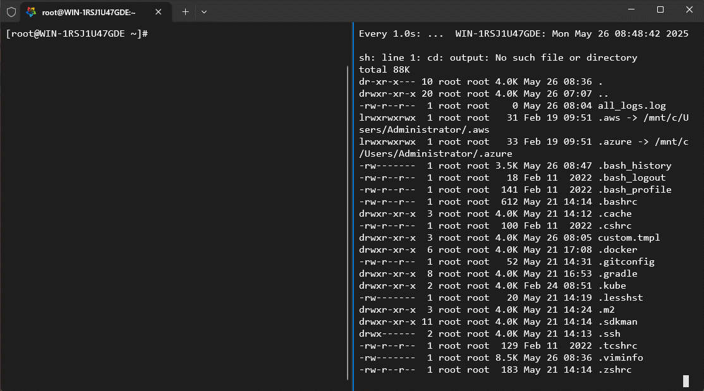

* ③ 将生成的日志从 Linux 中复制到 Windows 环境中：略。

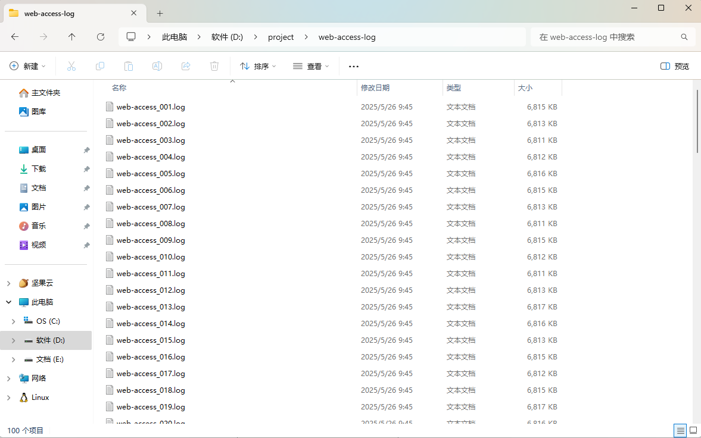

### 1.5.3 串行计算

* 核心思路：每次统计分析一个页面的数据，然后将此页面的数据和上个页面的数据进行合并。


* 示例：

::: code-group

```java [AnalysisTest.java]
package com.analysis;

import java.io.File;
import java.io.IOException;
import java.nio.file.Files;
import java.nio.file.Path;
import java.time.Instant;
import java.time.temporal.ChronoUnit;
import java.util.HashMap;
import java.util.Map;
import java.util.regex.Matcher;
import java.util.regex.Pattern;
import java.util.stream.Collectors;
import java.util.stream.Stream;

import static java.util.function.UnaryOperator.identity;
import static java.util.stream.Collectors.counting;

public class AnalysisTest {

    private static final Pattern regex = Pattern.compile("(\\S+) - \\[(.+)] (.+) (.+)");

    private static final String LOG_PATH = "D:/project/web-access-log";

    private static final int FILES = 100;

    public static void main(String[] args) {
        final Instant before = Instant.now();

        sequence();

        final Instant end = Instant.now();

        final long between = ChronoUnit.MILLIS.between(before, end);

        System.out.println("耗时：" + between + " 毫秒");
    }

    /**
     * 统计单个文件的页面访问次数
     *
     * @param i 文件的编号
     * @return 统计结果
     */
    private static Map<String, Long> one(int i) {
        // 日志文件真实的路径
        String realPath = String.format(LOG_PATH + File.separator + "web-access_%03d.log", i);

        try (Stream<String> lines = Files.lines(Path.of(realPath))) {
            return lines
                    .map(x -> regex.matcher(x))
                    .filter(Matcher::find)
                    .map(x -> x.group(3))
                    .collect(Collectors.groupingBy(identity(), counting()));

        } catch (IOException e) {
            throw new RuntimeException(e);
        }
    }


    public static void sequence() { // [!code highlight]
        Map<String, Long> m0 = new HashMap<>();

        for (int i = 1; i <= FILES; i++) {
            Map<String, Long> m1 = one(i);  // 每次都需要依赖前一次的结果
            m0 = Stream
                    .of(m0, m1)
                    .flatMap(x -> x
                            .entrySet()
                            .stream())
                    .collect(Collectors.groupingBy(Map.Entry::getKey,
                            Collectors.summingLong(Map.Entry::getValue)));
        }

        System.out.println("总数：" + m0.size());
    }

}
```

```txt [cmd 控制台]
总数：4522616
耗时：41144 毫秒
```

:::

### 1.5.4 并行计算

* 核心思路：利用 CompletableFuture 进行每个页面的并行统计，然后一次性进行数据合并。


* 示例：

::: code-group

```java [AnalysisTest.java]
package com.analysis;

import java.io.File;
import java.io.IOException;
import java.nio.file.Files;
import java.nio.file.Path;
import java.time.Instant;
import java.time.temporal.ChronoUnit;
import java.util.ArrayList;
import java.util.HashMap;
import java.util.List;
import java.util.Map;
import java.util.concurrent.CompletableFuture;
import java.util.concurrent.ExecutionException;
import java.util.regex.Matcher;
import java.util.regex.Pattern;
import java.util.stream.Collectors;
import java.util.stream.Stream;

import static java.util.function.UnaryOperator.identity;
import static java.util.stream.Collectors.counting;

public class AnalysisTest {

    private static final Pattern regex = Pattern.compile("(\\S+) - \\[(.+)] (.+) (.+)");

    private static final String LOG_PATH = "D:/project/web-access-log";

    private static final int FILES = 100;

    public static void main(String[] args) throws ExecutionException, InterruptedException {
        final Instant before = Instant.now();

        parallel();

        final Instant end = Instant.now();

        final long between = ChronoUnit.MILLIS.between(before, end);

        System.out.println("耗时：" + between + " 毫秒");
    }

    /**
     * 统计单个文件的页面访问次数
     *
     * @param i 文件的编号
     * @return 统计结果
     */
    private static Map<String, Long> one(int i) {
        // 日志文件真实的路径
        String realPath = String.format(LOG_PATH + File.separator + "web-access_%03d.log", i);

        try (Stream<String> lines = Files.lines(Path.of(realPath))) {
            return lines
                    .map(x -> regex.matcher(x))
                    .filter(Matcher::find)
                    .map(x -> x.group(3))
                    .collect(Collectors.groupingBy(identity(), counting()));

        } catch (IOException e) {
            throw new RuntimeException(e);
        }
    }

    public static void parallel() throws ExecutionException, InterruptedException { // [!code highlight]
        List<CompletableFuture<Map<String, Long>>> completableFutureList = new ArrayList<>();
        for (int i = 1; i <= FILES; i++) {
            int finalI = i;
            CompletableFuture<Map<String, Long>> future = CompletableFuture.supplyAsync( () -> one(finalI));
            completableFutureList.add(future);
        }

        CompletableFuture<Map<String, Long>> f0 = completableFutureList.get(0);
        for (int i = 0; i < completableFutureList.size(); i++) {
            f0 = f0.thenCombine(completableFutureList.get(i), (m0, m1) -> Stream.of(m0, m1).flatMap(x -> x
                    .entrySet()
                    .stream()).collect(Collectors.groupingBy(Map.Entry::getKey,
                    Collectors.summingLong(Map.Entry::getValue))));
        }

        System.out.println("总数：" + f0.get().size());
    }

}
```

```txt [cmd 控制台]
总数：4522616
耗时：42495 毫秒
```

:::

## 1.6 UI  设计

### 1.6.1 概述

* 在 Java 中，Lambda 表达式自 Java 8 引入后，广泛用于简化匿名内部类的语法，特别在 UI 编程中使代码更加简洁和可读。
* 在 Java 的 UI 编程框架中（如 Swing 或 JavaFX），Lambda 表达式主要用于事件处理器（Event Handlers）和回调（Callback）机制。

### 1.6.2 事件监听

* 需求：点击按钮，弹出消息框。

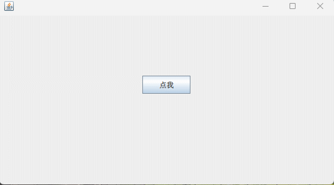


* 示例：

```java {18-24}
package com.github.lambda.jmh;

import javax.swing.*;
import java.awt.*;

public class Test {
    public static void main(String[] args) {
        JFrame jFrame = new JFrame();

        JButton jButton = new JButton("点我");
        // 设置按钮大小
        jButton.setPreferredSize(new Dimension(80, 30));
        // 上边距大点更显居中效果
        jFrame.setLayout(new FlowLayout(FlowLayout.CENTER, 0, 100));
        jFrame.add(jButton);

        // 事件监听
        jButton.addActionListener((e) -> 
                                  JOptionPane
                                  .showMessageDialog(
                                      jFrame, 
                                      "点击了按钮", 
                                      "提示", 
                                      JOptionPane.INFORMATION_MESSAGE));

        jFrame.setVisible(true);
        jFrame.setDefaultCloseOperation(JFrame.EXIT_ON_CLOSE);
        jFrame.setSize(400, 300);
        jFrame.setLocationRelativeTo(null);
    }
}
```

### 1.6.3 回调机制

* 需求：点击按钮，弹出消息框，并于 5 秒内自动关闭。

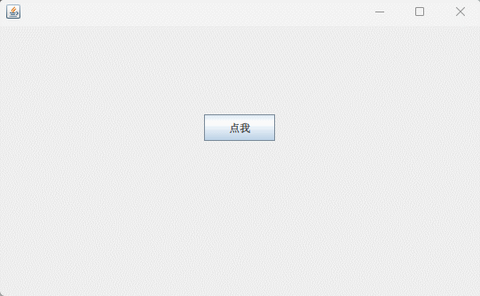


* 示例：

```java {58}
package com.github.lambda.jmh;

import javax.swing.*;
import java.awt.*;

public class Test {
    public static void main(String[] args) {
        JFrame jFrame = new JFrame();

        JButton jButton = new JButton("点我");
        // 设置按钮大小
        jButton.setPreferredSize(new Dimension(80, 30));
        // 上边距大点更显居中效果
        jFrame.setLayout(new FlowLayout(FlowLayout.CENTER, 0, 100));
        jFrame.add(jButton);

        // 事件监听
        jButton.addActionListener((e) -> 
                                  showAutoCloseDialog(
                                      jFrame, 
                                      "点击了按钮", 
                                      "提示", 
                                      5, 
                                      () -> System.out.println("提示框已关闭，执行回调逻辑")));

        jFrame.setVisible(true);
        jFrame.setDefaultCloseOperation(JFrame.EXIT_ON_CLOSE);
        jFrame.setSize(400, 300);
        jFrame.setLocationRelativeTo(null);
    }

    /**
     * 自定义自动关闭的消息框方法
     */
    public static void showAutoCloseDialog(JFrame jFrame, String message, String title, int timeout, Runnable onClose) {
        JDialog dialog = new JDialog(jFrame, title, true);
        dialog.setDefaultCloseOperation(JDialog.DISPOSE_ON_CLOSE);

        JLabel label = new JLabel(message, SwingConstants.CENTER);
        label.setPreferredSize(new Dimension(200, 100));
        dialog
                .getContentPane()
                .add(label);

        dialog.pack();
        dialog.setLocationRelativeTo(jFrame);

        final int[] count = {timeout};
        Timer timer = new Timer(1000, null);
        timer.addActionListener(e -> {
            if (count[0] > 0) {
                label.setText("窗口将在 " + count[0] + " 秒后关闭");
                count[0]--;
            } else {
                timer.stop();
                dialog.dispose();
                if (onClose != null) {
                    onClose.run(); 
                }
            }
        });

        timer.setInitialDelay(0);
        timer.start();

        dialog.setVisible(true);
    }

}
```


# 第二章：实现原理

## 2.1 概述

* 本章将讲解以下知识的实现原理：
  * ① Lambda 表达式。
  * ② 方法引用。
  * ③ 闭包。
  * ④ Stream 流的构建和切分。

## 2.2 Lambda 表达式

### 2.2.1 概述

* Lambda 表达式是一种语法糖，依然会被编译器翻译为类、对象和方法。

### 2.2.2 方法从哪里来？

* 如果编译器发现 Java  代码中出现了 Lambda 表达式，会在当前类中生成 private static 修饰的静态方法，该静态方法的方法体就是 Lambda 的逻辑代码。

* 假设代码是这样的，如下所示：

```java [Test.java]
package com.github.lambda.demo6;

import java.util.function.BinaryOperator;

public class Test {
    public static void main(String[] args) {
        // Lambda 体是 a + b
        BinaryOperator<Integer> lambda = (a, b) -> a + b;
    }
}
```

* 我们可以通过反编译工具 [jadx](https://github.com/skylot/jadx) 来反编译 class 文件，如下所示：

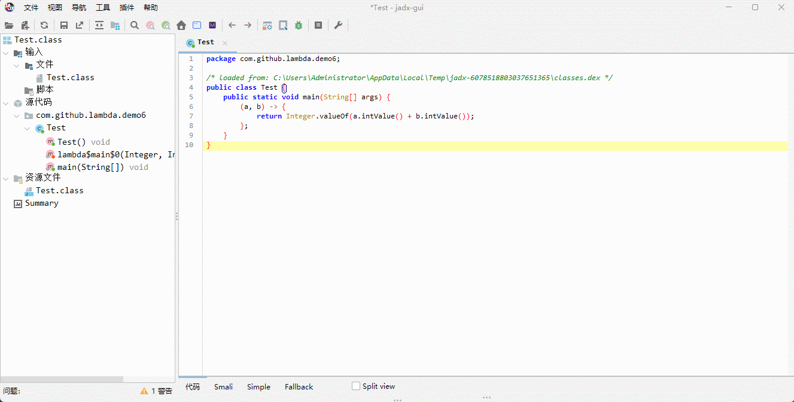

* 我们也可以通过反射去查看是否生成了静态方法，如下所示：

::: code-group

```java [Test.java]
package com.github.lambda.demo6;

import java.lang.reflect.Method;
import java.util.function.BinaryOperator;

public class Test {
    public static void main(String[] args) {
        BinaryOperator<Integer> lambda = (a, b) -> a + b;
        // 反射查看是否生成了静态方法
        final Method[] declaredMethods = Test.class.getDeclaredMethods();
        for (Method declaredMethod : declaredMethods) {
            System.out.println(declaredMethod);
        }
    }
}
```

```txt [cmd 控制台]
private static java.lang.Integer com.github.lambda.demo6.Test.lambda$main$0(java.lang.Integer,java.lang.Integer)
public static void com.github.lambda.demo6.Test.main(java.lang.String[])
```

:::

> [!NOTE]
>
> 通过上面两种方式的验证，编译器在编译含有 Lambda 表达式的代码时，会进行如下的转换：
>
> ::: code-group
>
> ```java [LambdaTest.java]
> package com.github.lambda.demo6;
> 
> import java.util.function.BinaryOperator;
> 
> public class Test {
>     public static void main(String[] args) {
>         // Lambda 体是 a + b
>         BinaryOperator<Integer> lambda = (a, b) -> a + b; // [!code highlight]
>     }
> }
> ```
>
>  ```java [ActualTest.java]
>  package com.github.lambda.demo6;
>  
>  public class Test {
>      public Test() {
>      }
>  
>      private static Integer lambda$main$0(Integer a, Integer b) { // [!code highlight]
>          return Integer.valueOf(a.intValue() + b.intValue());
>      }
>  
>      public static void main(String[] args) {
>          (v0, v1) -> { 
>              return lambda$main$0(v0, v1); // [!code highlight]
>          };
>      }
>  }
>  ```
> ::: 

### 2.2.3 类和对象从哪里来？

* 如果是我们自己实现，那么自定义一个类实现函数式接口，然后手动构建一个对象：

```java
package com.github.lambda.demo6;

import java.util.function.BinaryOperator;

public class Test {
    public static void main(String[] args) {
        BinaryOperator<Integer> lambda = new TestLambda123();

        final Integer apply = lambda.apply(1, 2);
        System.out.println(apply);

    }

    private static Integer lambda$main$1(Integer a, Integer b) { // [!code highlight]
        return Integer.valueOf(a.intValue() + b.intValue());
    }

    static final class TestLambda123 implements BinaryOperator<Integer> { // [!code highlight]
        @Override
        public Integer apply(Integer a, Integer b) {
            return Test.lambda$main$1(a, b);
        }
    }

}
```

* JVM 是在运行期间在内存中动态创建这个类和对象，如果要查看这个类，需要添加 JVM 参数：

> [!NOTE]
>
> * ① 默认情况下，不会在磁盘上生成对应的字节码文件，只会在内存中动态创建这个类和对象。
> * ② 默认情况下，当程序执行完毕，内存中动态创建的类和对象，也随时消失。

```bash
-Djdk.internal.lambda.dumpProxyClasses
```

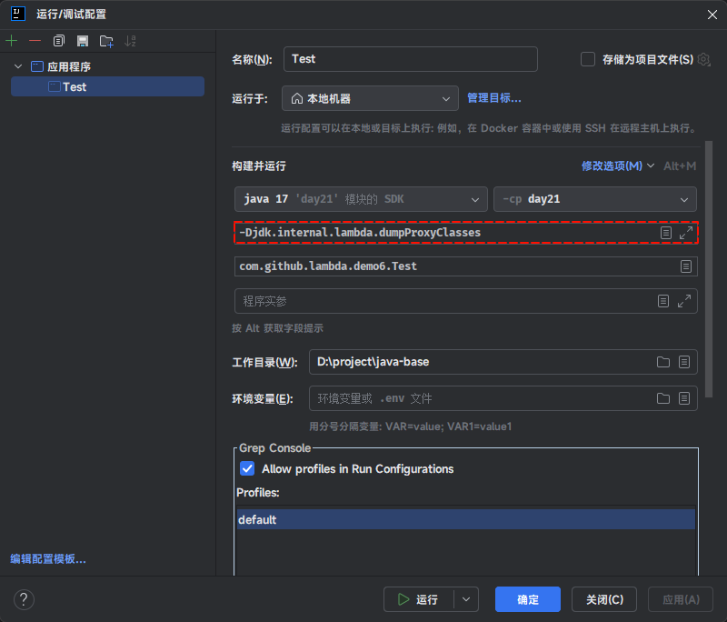

* 在 IDEA 中，重新编译，就可以看到生成的 class 字节码文件，如下所示：

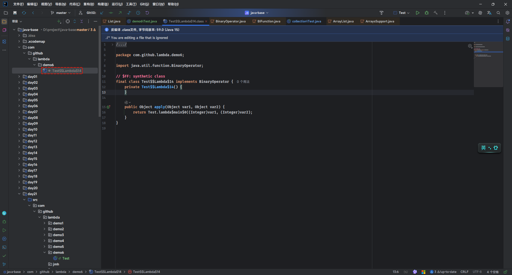

> [!NOTE]
>
> * ① 动态创建的类是有了，动态创建的对象还没看到？
> * ② 动态创建的对象，请看下文（MethodHandle）！！！

## 2.3 MethodHandle（方法句柄）

### 2.3.1 概述

* `句柄`是一个常见的术语，在不同上下文中含义略有不同，但是核心思想是：`句柄是对某个资源或操作的抽象引用，程序可以通过这个引用去操作或访问实际的对象或功能`。

> [!NOTE]
>
> * ① 常见的句柄：
>   * 文件句柄：操作系统返回一个整数，用于代表一个打开的文件，程序可以通过这个句柄来读写文件。
>   * 窗口句柄：Windows 系统中表示一个窗口的唯一标识符，程序可以通过这个句柄来操作窗口。
>   * 数据库连接句柄：表示和数据库的一个连接，用于执行 SQL 语句等。
> * ② “句柄”是一种**间接访问机制** ，它不一定是直接指向内存地址，而是一种安全、可控的引用方式 。

* `MethodHandle`是 JDK7 引入的一种机制，其作用是：`提供一种类型安全且灵活的方式来调用方法、构造函数、字段等`。

> [!NOTE]
>
> * ① MethodHandle（方法句柄）本质上是对某个方法的引用或间接访问方式，可以通过这个引用来动态的调用目标方法。
> * ② 相比传统的 `java.lang.reflect.Method`，`MethodHandle` 更加轻量级、执行效率更高。反射调用需要经过较多的安全检查和参数转换，而 `MethodHandle` 在创建后可以直接调用目标方法，性能更优。
> * ③ `MethodHandle` 是为 JVM 上的动态语言（如 Groovy、JRuby、JavaScript via Nashorn 等）设计的。它支持在运行时进行更灵活的方法绑定和调用。
> * ④ Java 8 的 Lambda 表达式编译后会通过 `invokedynamic` 指令与 `BootstrapMethods` 配合生成 `MethodHandle` 来实现实际调用（重点）。

### 2.3.2 常用 API

* 获取 MethodHandles 查找器：

```java
MethodHandles.Lookup lookup = MethodHandles.lookup();
```

* 获取 MethodHandle 对象：

  * ① 调用虚方法（实例方法，即：非 static、非 private、非 final 修饰的方法）的 MethodHandle 对象 ：

  ```java
  /**
  * @param refc 虚方法所在的类或接口
  * @param name 方法的名称
  * @param type 方法的类型，通过 MethodType.methodType(xx,...) 来描述
  */
  MethodHandle mh = lookup.findVirtual(Class<?> refc, String name, MethodType type)
  ```

  * ② 调用静态方法的 MethodHandle 对象 ：

  ```java
  /**
  * @param refc 虚方法所在的类或接口
  * @param name 方法的名称
  * @param type 方法的类型，通过 MethodType.methodType(xx,...) 来描述
  */
  MethodHandle mh = lookup.findStatic(Class<?> refc, String name, MethodType type)
  ```

  * ③ 调用构造方法的 MethodHandle 对象：

  ```java
  /**
  * @param refc 虚方法所在的类或接口
  * @param type 方法的类型，通过 MethodType.methodType(xx,...) 来描述
  */
  MethodHandle mh = lookup.findConstructor(Class<?> refc, MethodType type)
  ```

  * ④ 调用特殊方法（父类方法等）的 MethodHandle 对象：

  ```java
  /**
  * @param refc 虚方法所在的类或接口
  * @param name 方法的名称
  * @param type 方法的类型，通过 MethodType.methodType(xx,...) 来描述
  * @param specialCaller 调用者的类，用来进行访问权限检查
  */
  MethodHandle mh = lookup.findSpecial(Class<?> refc, String name, MethodType type,
                                          Class<?> specialCaller)
  ```

  * ⑤ 获取属性或设置属性的 MethodHandle 对象：

  ```java
  /**
  * @param refc 虚方法所在的类或接口
  * @param name 方法的名称
  * @param type 方法的类型，通过 MethodType.methodType(xx,...) 来描述
  */
  MethodHandle mh = lookup.findGetter(Class<?> refc, String name, Class<?> type)
  ```

  ```java
  /**
  * @param refc 虚方法所在的类或接口
  * @param name 方法的名称
  * @param type 方法的类型，通过 MethodType.methodType(xx,...) 来描述
  */
  MethodHandle mh = lookup.findSetter(Class<?> refc, String name, Class<?> type)
  ```

* 调用方法：

```java
 Object obj = mh.invoke(Object... args)
```

> [!NOTE]
>
> MethodHandle 的执行权限和上下文有关：
>
> * ① 原本有权限调用的方法，正常能调用，MethodHandle 也可以调用。
> * ② 原本没有权限调用的方法，正常能调用，MethodHandle 也不可以调用。


* 示例：调用静态方法

```java
package com.github.lambda.jmh;

import java.lang.invoke.MethodHandle;
import java.lang.invoke.MethodHandles;
import java.lang.invoke.MethodType;

class Example {

    private int age;

    public static int add(int a, int b) { // [!code highlight]
        return a + b;
    }

    public int getAge() {
        return age;
    }

    public void setAge(int age) {
        this.age = age;
    }

}

public class Test {
    public static void main(String[] args) throws Throwable {
        // 获取方法句柄查找器
        MethodHandles.Lookup lookup = MethodHandles.lookup();
        // 参数：方法返回值类型，参数类型
        MethodType methodType = MethodType.methodType(int.class, int.class, int.class);
        // 获取调用静态方法的 MethodHandle 对象
        MethodHandle mh = lookup.findStatic(Example.class, "add", methodType);
        // 调用静态方法
        int result = (int) mh.invoke(1, 2);
        System.out.println("result = " + result); // result = 3
    }
}
```


* 示例：调用虚方法（实例方法）

```java
package com.github.lambda.jmh;

import java.lang.invoke.MethodHandle;
import java.lang.invoke.MethodHandles;
import java.lang.invoke.MethodType;

class Example {

    private int age;

    public static int add(int a, int b) {
        return a + b;
    }

    public int getAge() {
        return age;
    }

    public void setAge(int age) {
        this.age = age;
    }

    public String show(Integer num) { // [!code highlight]
        return "show" + num;
    }

}

public class Test {
    public static void main(String[] args) throws Throwable {
        // 获取方法句柄查找器
        MethodHandles.Lookup lookup = MethodHandles.lookup();
        // 参数：方法返回值类型，参数类型
        MethodType methodType = MethodType.methodType(String.class, Integer.class);
        // 获取调用实例方法的 MethodHandle 对象
        MethodHandle mh = lookup.findVirtual(Example.class, "show", methodType);
        // 调用实例方法
        String result = (String) mh.invoke(new Example(), 1);
        System.out.println(result); // show1
    }
}
```


* 示例：调用构造方法

```java
package com.github.lambda.jmh;

import java.lang.invoke.MethodHandle;
import java.lang.invoke.MethodHandles;
import java.lang.invoke.MethodType;

class Example {

    private int age;

    public Example() { // [!code highlight]
        System.out.println("无参构造");
    }

    public Example(int age) {
        this.age = age;
        System.out.println("有参构造");
    }

    public static int add(int a, int b) {
        return a + b;
    }

    public int getAge() {
        return age;
    }

    public void setAge(int age) {
        this.age = age;
    }

    public String show(Integer num) {
        return "show" + num;
    }

}

public class Test {
    public static void main(String[] args) throws Throwable {
        // 获取方法句柄查找器
        MethodHandles.Lookup lookup = MethodHandles.lookup();
        // 参数：方法返回值类型，参数类型
        MethodType methodType = MethodType.methodType(void.class);
        // 获取调用构造方法的 MethodHandle 对象
        MethodHandle mh = lookup.findConstructor(Example.class, methodType);
        // 调用无参构造方法
        final Object obj = mh.invoke();
        System.out.println(obj instanceof Example); // true
    }
}
```


* 示例：调用构造方法

```java
package com.github.lambda.jmh;

import java.lang.invoke.MethodHandle;
import java.lang.invoke.MethodHandles;
import java.lang.invoke.MethodType;

class Example {

    private int age;

    public Example() {
        System.out.println("无参构造");
    }

    public Example(int age) { // [!code highlight]
        this.age = age;
        System.out.println("有参构造");
    }

    public static int add(int a, int b) {
        return a + b;
    }

    public int getAge() {
        return age;
    }

    public void setAge(int age) {
        this.age = age;
    }

    public String show(Integer num) {
        return "show" + num;
    }

}

public class Test {
    public static void main(String[] args) throws Throwable {
        // 获取方法句柄查找器
        MethodHandles.Lookup lookup = MethodHandles.lookup();
        // 参数：方法返回值类型，参数类型
        MethodType methodType = MethodType.methodType(void.class, int.class);
        // 获取调用构造方法的 MethodHandle 对象
        MethodHandle mh = lookup.findConstructor(Example.class, methodType);
        // 调用无参构造方法
        final Example example = (Example) mh.invoke(18);
        System.out.println(example.getAge()); // 18
    }
}
```

### 2.3.3 区别

* MethodHandle（方法句柄）VS Reflection（反射）：

| 特性       | MethodHandle（方法句柄）     | Reflection（反射）     |
| ---------- | ---------------------------- | ---------------------- |
| 性能       | 更高（接近直接调用）         | 较低（涉及安全检查等） |
| 类型安全性 | 编译期类型检查               | 运行时检查             |
| 方法组合   | 支持参数变换、适配等         | 不支持                 |
| 应用场景   | lambda、动态语言、高性能调用 | 通用反射调用、框架开发 |

### 2.3.4 Lambda 中的对象从哪里来？

* 假设 Lambda 表达式是这样的，如下所示：

```java
import java.util.function.BinaryOperator;

public class Test {
    public static void main(String[] args) { 
        BinaryOperator<Integer> lambda = (a, b) -> a + b; // [!code highlight]
    }
}    
```

* 我们知道，其会 class 字节码文件中，给我们生成静态方法，如下所示：

```java
import java.util.function.BinaryOperator;

public class Test {
    public static void main(String[] args) { 
        BinaryOperator<Integer> lambda = (a, b) -> a + b; // [!code highlight]
    }

    private static Integer lambda$main$2(Integer a, Integer b) { // [!code highlight]
        return a + b;
    }
}    
```

* 通过给 JVM 添加参数 `-Djdk.internal.lambda.dumpProxyClasses`，我们可以将内存中生成的类保存到磁盘中，如下所示：

```java
package com.github.lambda.demo6;

import java.util.function.BinaryOperator;

public class Test {
    public static void main(String[] args) {
        BinaryOperator<Integer> lambda = (a, b) -> a + b; // [!code highlight]
    }

    private static Integer lambda$main$2(Integer a, Integer b) { // [!code highlight]
        return a + b;
    }

    static final class MyLambda implements BinaryOperator<Integer> { // [!code highlight]
        @Override
        public Integer apply(Integer a, Integer b) {
            return lambda$main$2(a, b);
        }
    }

}
```

* 其实，JVM 内部是通过 `LambdaMetaFactory`的`metafactory()` 来帮我们生成函数对象所需要的类（类似于上面的 MyLambda），其方法参数如下所示：

```java
/** 
* @param caller 调用者的上下文，表示哪个类正在使用这个 Lambda（用于访问权限检查等）
* @param interfaceMethodName 接口（函数式接口）的方法名，如：run、apply
* @param factoryType 创建函数对象工厂的 MethodType，类似于 BinaryOperator factory()
* @param interfaceMethodType 接口的方法类型
* @param implementation 实现方法类型（实际要调用的方法句柄），就是上面的静态方法 lambda$main$2
* @param dynamicMethodType 动态方法类型，函数对象实际的类型
*/
public static CallSite metafactory(
    							   MethodHandles.Lookup caller,
                                   String interfaceMethodName,
                                   MethodType factoryType,
                                   MethodType interfaceMethodType,
                                   MethodHandle implementation,
                                   MethodType dynamicMethodType){
    ...
}
```

* 我们可以手动来模拟 JVM 内存生成函数对象（Lambda 表达式）所需要的类（类似于 MyLambda），如下所示：

```java
package com.github.lambda.demo6;

import java.lang.invoke.*;
import java.util.function.BinaryOperator;

public class Test {
    public static void main(String[] args) throws NoSuchMethodException, IllegalAccessException, LambdaConversionException {
        BinaryOperator<Integer> lambda = (a, b) -> a + b;

        final MethodHandles.Lookup lookup = MethodHandles.lookup();
        // 实现方法类型，就是静态方法 lambda$main$2
        MethodType methodType = MethodType.methodType(Integer.class, Integer.class, Integer.class);
        final MethodHandle lambda$main$2 = lookup
                .findStatic(Test.class, "lambda$main$2", methodType);

        // 内部：生成函数对象所属的类
        final CallSite callSite = LambdaMetafactory.metafactory( // [!code highlight:8]
                lookup,
                "apply", // 接口名，BinaryOperator 的抽象方法
                MethodType.methodType(BinaryOperator.class), // 创建函数对象工厂的 MethodType，类似于 BinaryOperator factory()
                MethodType.methodType(Object.class, Object.class, Object.class), //  接口的方法类型
                lambda$main$2, // 实现方法类型，就是静态方法 lambda$main$2
                MethodType.methodType(Integer.class, Integer.class, Integer.class) // 函数对象实际
        );

        System.out.println(callSite);

    }

    private static Integer lambda$main$2(Integer a, Integer b) {
        return a + b;
    }

    static final class MyLambda implements BinaryOperator<Integer> {
        @Override
        public Integer apply(Integer a, Integer b) {
            return lambda$main$2(a, b);
        }
    }

}
```

* 通过 CallSite 对象的 getTarget() 方法，即：函数对象工厂方法，如下所示：

> [!NOTE]
>
> callSite.getTarget() 实际是调用实现类的构造方法对应的 mh，最后 invoke 返回函数对象。

```java
package com.github.lambda.demo6;

import java.lang.invoke.*;
import java.util.function.BinaryOperator;

public class Test {
    public static void main(String[] args) throws Throwable {
        BinaryOperator<Integer> lambda = (a, b) -> a + b;

        final MethodHandles.Lookup lookup = MethodHandles.lookup();
        // 实现方法类型，就是静态方法 lambda$main$2
        MethodType methodType = MethodType.methodType(Integer.class, Integer.class, Integer.class);
        final MethodHandle lambda$main$2 = lookup
                .findStatic(Test.class, "lambda$main$2", methodType);

        // 内部：生成函数对象所属的类
        final CallSite callSite = LambdaMetafactory.metafactory(
                lookup,
                "apply", // 接口名，BinaryOperator 的抽象方法
                MethodType.methodType(BinaryOperator.class), // 创建函数对象工厂的 MethodType，类似于 BinaryOperator factory()
                MethodType.methodType(Object.class, Object.class, Object.class), //  接口的方法类型
                lambda$main$2, // 实现方法类型，就是静态方法 lambda$main$2
                MethodType.methodType(Integer.class, Integer.class, Integer.class) // 函数对象实际
        );
        // 函数对象工厂方法，用来生产 BinaryOperator 对象的
        // 类似于 BinaryOperator factory(){ return MyLambda()}
        final MethodHandle mh = callSite.getTarget(); // [!code highlight]
    }

    private static Integer lambda$main$2(Integer a, Integer b) {
        return a + b;
    }

    static final class MyLambda implements BinaryOperator<Integer> {
        @Override
        public Integer apply(Integer a, Integer b) {
            return lambda$main$2(a, b);
        }
    }

}
```

* 之后，就可以获取 BinaryOperator 对象了，如下所示：

```java
package com.github.lambda.demo6;

import java.lang.invoke.*;
import java.util.function.BinaryOperator;

public class Test {
    public static void main(String[] args) throws Throwable {
        BinaryOperator<Integer> lambda = (a, b) -> a + b;

        final MethodHandles.Lookup lookup = MethodHandles.lookup();
        // 实现方法类型，就是静态方法 lambda$main$2
        MethodType methodType = MethodType.methodType(Integer.class, Integer.class, Integer.class);
        final MethodHandle lambda$main$2 = lookup
                .findStatic(Test.class, "lambda$main$2", methodType);

        // 内部：生成函数对象所属的类
        final CallSite callSite = LambdaMetafactory.metafactory(
                lookup,
                "apply", // 接口名，BinaryOperator 的抽象方法
                MethodType.methodType(BinaryOperator.class), // 创建函数对象工厂的 MethodType，类似于 BinaryOperator factory()
                MethodType.methodType(Object.class, Object.class, Object.class), //  接口的方法类型
                lambda$main$2, // 实现方法类型，就是静态方法 lambda$main$2
                MethodType.methodType(Integer.class, Integer.class, Integer.class) // 函数对象实际
        );
        // 函数对象工厂方法，用来生产 BinaryOperator 对象的
        final MethodHandle mh = callSite.getTarget();
        // 类似于 new MyLambda()
        BinaryOperator<Integer> invoke = (BinaryOperator<Integer>) mh.invoke(); // [!code highlight]
        System.out.println(invoke.apply(1, 2));

    }

    private static Integer lambda$main$2(Integer a, Integer b) {
        return a + b;
    }

    static final class MyLambda implements BinaryOperator<Integer> {
        @Override
        public Integer apply(Integer a, Integer b) {
            return lambda$main$2(a, b);
        }
    }

}
```

* 但是，JVM 是在什么时候，来通过上面的代码，帮我们我们生成 Lambda 表达式（函数对象）的类和其本身的，如下所示：

```java {10-29}
package com.github.lambda.demo6;

import java.lang.invoke.*;
import java.util.function.BinaryOperator;

public class Test {
    public static void main(String[] args) throws Throwable {
        BinaryOperator<Integer> lambda = (a, b) -> a + b;

        final MethodHandles.Lookup lookup = MethodHandles.lookup();
        // 实现方法类型，就是静态方法 lambda$main$2
        MethodType methodType = MethodType.methodType(Integer.class, Integer.class, Integer.class);
        final MethodHandle lambda$main$2 = lookup
                .findStatic(Test.class, "lambda$main$2", methodType);

        // 内部：生成函数对象所属的类
        final CallSite callSite = LambdaMetafactory.metafactory(
                lookup,
                "apply", // 接口名，BinaryOperator 的抽象方法
                MethodType.methodType(BinaryOperator.class), // 创建函数对象工厂的 MethodType，类似于 BinaryOperator factory()
                MethodType.methodType(Object.class, Object.class, Object.class), //  接口的方法类型
                lambda$main$2, // 实现方法类型，就是静态方法 lambda$main$2
                MethodType.methodType(Integer.class, Integer.class, Integer.class) // 函数对象实际
        );
        // 函数对象工厂方法，用来生产 BinaryOperator 对象的
        final MethodHandle factory = callSite.getTarget();
        // 获取函数对象，类似于 new MyLambda()
        BinaryOperator<Integer> invoke = (BinaryOperator<Integer>) factory.invoke();
        System.out.println(invoke.apply(1, 2));

    }

    private static Integer lambda$main$2(Integer a, Integer b) {
        return a + b;
    }

    static final class MyLambda implements BinaryOperator<Integer> {
        @Override
        public Integer apply(Integer a, Integer b) {
            return lambda$main$2(a, b);
        }
    }

}
```

* 我们可以将上面的模拟代码注释掉，如下所示：

```java
package com.github.lambda.demo6;

import java.util.function.BinaryOperator;

public class Test {
    public static void main(String[] args) throws Throwable {
        BinaryOperator<Integer> lambda = (a, b) -> a + b;

        /*final MethodHandles.Lookup lookup = MethodHandles.lookup();
        // 实现方法类型，就是静态方法 lambda$main$2
        MethodType methodType = MethodType.methodType(Integer.class, Integer.class, Integer.class);
        final MethodHandle lambda$main$2 = lookup
                .findStatic(Test.class, "lambda$main$2", methodType);

        // 内部：生成函数对象所属的类
        final CallSite callSite = LambdaMetafactory.metafactory(
                lookup,
                "apply", // 接口名，BinaryOperator 的抽象方法
                MethodType.methodType(BinaryOperator.class), // 创建函数对象工厂的 MethodType，类似于 BinaryOperator factory()
                MethodType.methodType(Object.class, Object.class, Object.class), //  接口的方法类型
                lambda$main$2, // 实现方法类型，就是静态方法 lambda$main$2
                MethodType.methodType(Integer.class, Integer.class, Integer.class) // 函数对象实际
        );
        // 函数对象工厂方法，用来生产 BinaryOperator 对象的
        final MethodHandle factory = callSite.getTarget();
        // 获取函数对象，类似于 new MyLambda()
        BinaryOperator<Integer> invoke = (BinaryOperator<Integer>) factory.invoke();
        System.out.println(invoke.apply(1, 2));*/

    }

    private static Integer lambda$main$2(Integer a, Integer b) {
        return a + b;
    }

    static final class MyLambda implements BinaryOperator<Integer> {
        @Override
        public Integer apply(Integer a, Integer b) {
            return lambda$main$2(a, b);
        }
    }

}
```

* 重新编译，再反编译，如下所示：

```bash
javap -c -v Test.class
```

* 其反编译的内容，如下所示：

```bash {104,124}
 javap -c -v Test.class
Classfile /D:/project/java-base/out/production/day21/com/github/lambda/demo6/Test.class
  Last modified 2025年5月26日; size 1651 bytes
  SHA-256 checksum 8601fc56cc485a4cec726edd48539c23da22a7b6dbd42f4618acff4f05a7ecda
  Compiled from "Test.java"
public class com.github.lambda.demo6.Test
  minor version: 0
  major version: 61
  flags: (0x0021) ACC_PUBLIC, ACC_SUPER
  this_class: #21                         // com/github/lambda/demo6/Test
  super_class: #2                         // java/lang/Object
  interfaces: 0, fields: 0, methods: 4, attributes: 4
Constant pool:
   #1 = Methodref          #2.#3          // java/lang/Object."<init>":()V
   #2 = Class              #4             // java/lang/Object
   #3 = NameAndType        #5:#6          // "<init>":()V
   #4 = Utf8               java/lang/Object
   #5 = Utf8               <init>
   #6 = Utf8               ()V
   #7 = InvokeDynamic      #0:#8          // #0:apply:()Ljava/util/function/BinaryOperator;
   #8 = NameAndType        #9:#10         // apply:()Ljava/util/function/BinaryOperator;
   #9 = Utf8               apply
  #10 = Utf8               ()Ljava/util/function/BinaryOperator;
  #11 = Methodref          #12.#13.面向对象综合训练        // java/lang/Integer.intValue:()I
  #12 = Class              #14            // java/lang/Integer
  #13.面向对象综合训练 = NameAndType        #15:#16        // intValue:()I
  #14 = Utf8               java/lang/Integer
  #15 = Utf8               intValue
  #16 = Utf8               ()I
  #17 = Methodref          #12.#18        // java/lang/Integer.valueOf:(I)Ljava/lang/Integer;
  #18 = NameAndType        #19:#20        // valueOf:(I)Ljava/lang/Integer;
  #19 = Utf8               valueOf
  #20 = Utf8               (I)Ljava/lang/Integer;
  #21 = Class              #22            // com/github/lambda/demo6/Test
  #22 = Utf8               com/github/lambda/demo6/Test
  #23 = Utf8               Code
  #24 = Utf8               LineNumberTable
  #25 = Utf8               LocalVariableTable
  #26 = Utf8               this
  #27 = Utf8               Lcom/github/lambda/demo6/Test;
  #28 = Utf8               main
  #29 = Utf8               ([Ljava/lang/String;)V
  #30 = Utf8               args
  #31 = Utf8               [Ljava/lang/String;
  #32 = Utf8               lambda
  #33 = Utf8               Ljava/util/function/BinaryOperator;
  #34 = Utf8               LocalVariableTypeTable
  #35 = Utf8               Ljava/util/function/BinaryOperator<Ljava/lang/Integer;>;
  #36 = Utf8               Exceptions
  #37 = Class              #38            // java/lang/Throwable
  #38 = Utf8               java/lang/Throwable
  #39 = Utf8               lambda$main$2
  #40 = Utf8               (Ljava/lang/Integer;Ljava/lang/Integer;)Ljava/lang/Integer;
  #41 = Utf8               a
  #42 = Utf8               Ljava/lang/Integer;
  #43 = Utf8               b
  #44 = Utf8               lambda$main$0
  #45 = Utf8               SourceFile
  #46 = Utf8               Test.java
  #47 = Utf8               NestMembers
  #48 = Class              #49            // com/github/lambda/demo6/Test$MyLambda
  #49 = Utf8               com/github/lambda/demo6/Test$MyLambda
  #50 = Utf8               BootstrapMethods
  #51 = MethodHandle       6:#52          // REF_invokeStatic java/lang/invoke/LambdaMetafactory.metafactory:(Ljava/lang/invoke/MethodHandles$Lookup;Ljava/lang/String;Ljava/lang/invoke/MethodType;Ljava/lang/invoke/MethodType;Ljava/lang/invoke/MethodHandle;Ljava/lang/invoke/MethodType;)Ljava/lang/invoke/CallSite;
  #52 = Methodref          #53.#54        // java/lang/invoke/LambdaMetafactory.metafactory:(Ljava/lang/invoke/MethodHandles$Lookup;Ljava/lang/String;Ljava/lang/invoke/MethodType;Ljava/lang/invoke/MethodType;Ljava/lang/invoke/MethodHandle;Ljava/lang/invoke/MethodType;)Ljava/lang/invoke/CallSite;
  #53 = Class              #55            // java/lang/invoke/LambdaMetafactory
  #54 = NameAndType        #56:#57        // metafactory:(Ljava/lang/invoke/MethodHandles$Lookup;Ljava/lang/String;Ljava/lang/invoke/MethodType;Ljava/lang/invoke/MethodType;Ljava/lang/invoke/MethodHandle;Ljava/lang/invoke/MethodType;)Ljava/lang/invoke/CallSite;
  #55 = Utf8               java/lang/invoke/LambdaMetafactory
  #56 = Utf8               metafactory
  #57 = Utf8               (Ljava/lang/invoke/MethodHandles$Lookup;Ljava/lang/String;Ljava/lang/invoke/MethodType;Ljava/lang/invoke/MethodType;Ljava/lang/invoke/MethodHandle;Ljava/lang/invoke/MethodType;)Ljava/lang/invoke/CallSite;
  #58 = MethodType         #59            //  (Ljava/lang/Object;Ljava/lang/Object;)Ljava/lang/Object;
  #59 = Utf8               (Ljava/lang/Object;Ljava/lang/Object;)Ljava/lang/Object;
  #60 = MethodHandle       6:#61          // REF_invokeStatic com/github/lambda/demo6/Test.lambda$main$0:(Ljava/lang/Integer;Ljava/lang/Integer;)Ljava/lang/Integer;
  #61 = Methodref          #21.#62        // com/github/lambda/demo6/Test.lambda$main$0:(Ljava/lang/Integer;Ljava/lang/Integer;)Ljava/lang/Integer;
  #62 = NameAndType        #44:#40        // lambda$main$0:(Ljava/lang/Integer;Ljava/lang/Integer;)Ljava/lang/Integer;
  #63 = MethodType         #40            //  (Ljava/lang/Integer;Ljava/lang/Integer;)Ljava/lang/Integer;
  #64 = Utf8               InnerClasses
  #65 = Utf8               MyLambda
  #66 = Class              #67            // java/lang/invoke/MethodHandles$Lookup
  #67 = Utf8               java/lang/invoke/MethodHandles$Lookup
  #68 = Class              #69            // java/lang/invoke/MethodHandles
  #69 = Utf8               java/lang/invoke/MethodHandles
  #70 = Utf8               Lookup
{
  public com.github.lambda.demo6.Test();
    descriptor: ()V
    flags: (0x0001) ACC_PUBLIC
    Code:
      stack=1, locals=1, args_size=1
         0: aload_0
         1: invokespecial #1                  // Method java/lang/Object."<init>":()V
         4: return
      LineNumberTable:
        line 5: 0
      LocalVariableTable:
        Start  Length  Slot  Name   Signature
            0       5     0  this   Lcom/github/lambda/demo6/Test;

  public static void main(java.lang.String[]) throws java.lang.Throwable;
    descriptor: ([Ljava/lang/String;)V
    flags: (0x0009) ACC_PUBLIC, ACC_STATIC
    Code:
      stack=1, locals=2, args_size=1
         0: invokedynamic #7,  0              // InvokeDynamic #0:apply:()Ljava/util/function/BinaryOperator;
         5: astore_1
         6: return
      LineNumberTable:
        line 7: 0
        line 30: 6
      LocalVariableTable:
        Start  Length  Slot  Name   Signature
            0       7     0  args   [Ljava/lang/String;
            6       1     1 lambda   Ljava/util/function/BinaryOperator;
      LocalVariableTypeTable:
        Start  Length  Slot  Name   Signature
            6       1     1 lambda   Ljava/util/function/BinaryOperator<Ljava/lang/Integer;>;
    Exceptions:
      throws java.lang.Throwable
}
SourceFile: "Test.java"
NestMembers:
  com/github/lambda/demo6/Test$MyLambda
BootstrapMethods:
  0: #51 REF_invokeStatic java/lang/invoke/LambdaMetafactory.metafactory:(Ljava/lang/invoke/MethodHandles$Lookup;Ljava/lang/String;Ljava/lang/invoke/MethodType;Ljava/lang/invoke/MethodType;Ljava/lang/invoke/MethodHandle;Ljava/lang/invoke/MethodType;)Ljava/lang/invoke/CallSite;
    Method arguments:
      #58 (Ljava/lang/Object;Ljava/lang/Object;)Ljava/lang/Object;
      #60 REF_invokeStatic com/github/lambda/demo6/Test.lambda$main$0:(Ljava/lang/Integer;Ljava/lang/Integer;)Ljava/lang/Integer;
      #63 (Ljava/lang/Integer;Ljava/lang/Integer;)Ljava/lang/Integer;
InnerClasses:
  static final #65= #48 of #21;           // MyLambda=class com/github/lambda/demo6/Test$MyLambda of class com/github/lambda/demo6/Test
  public static final #70= #66 of #68;    // Lookup=class java/lang/invoke/MethodHandles$Lookup of class java/lang/invoke/MethodHandles

```

> [!NOTE]
>
> * ① 底层通过一个名为 invokedynamic 的虚拟机指令，再调用 BootstrapMethods 的 0 位置。
> * ② 通过 LambdaMetafactory.metafactory 帮我们将类生成好，帮我们将函数对象创建好，并将函数对象返回。

## 2.4 方法引用

### 2.4.1 概述

* 方法引用也是一种语法糖，底层依然会被编译器翻译为类、对象和方法。

### 2.4.2 方法从哪里来？

* 和 Lambda 表达式不同的是，方法引用并不需要在类中生成静态方法，而是使用类中已经提供存在的方法：

```java
package com.github.lambda.demo6;

import java.util.function.Function;

public class Test {
    public static void main(String[] args) throws Throwable {
        Function<Student, String> func = Student::getName;
    }

    static class Student {
        private String name;

        // 会利用类中已经存在的方法
        public String getName() { // [!code highlight]
            return name;
        }

        public void setName(String name) {
            this.name = name;
        }
    }

}
```

* 我们可以通过反编译工具 [jadx](https://github.com/skylot/jadx) 来反编译 class 文件，如下所示：

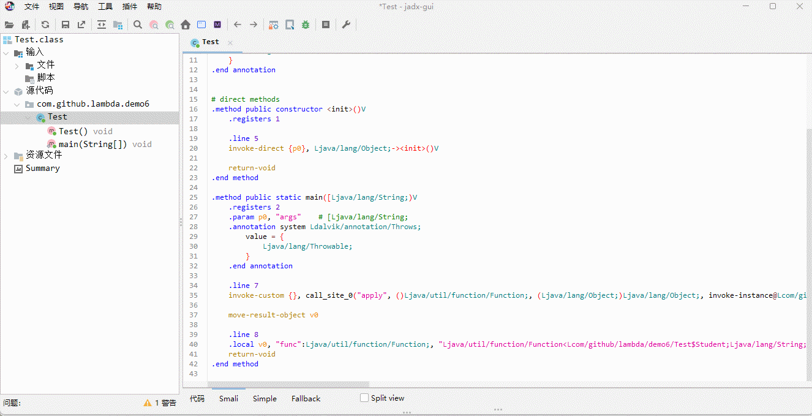

* 我们也可以通过反射去查看是否生成了静态方法，如下所示：

::: code-group

```java [Test.java]
package com.github.lambda.demo6;

import java.lang.reflect.Method;
import java.util.function.BinaryOperator;

public class Test {
    public static void main(String[] args) {
        BinaryOperator<Integer> lambda = (a, b) -> a + b;
        // 反射查看是否生成了静态方法
        final Method[] declaredMethods = Test.class.getDeclaredMethods();
        for (Method declaredMethod : declaredMethods) {
            System.out.println(declaredMethod);
        }
    }
}
```

```txt [cmd 控制台]
public static void com.github.lambda.demo6.Test.main(java.lang.String[]) throws java.lang.Throwable
```

:::

### 2.4.3 类和对象从哪里来？

* JVM 是在运行期间在内存中动态创建这个类和对象，如果要查看这个类，需要添加 JVM 参数：

```bash
-Djdk.internal.lambda.dumpProxyClasses
```


* 在 IDEA 中，重新编译，就可以看到生成的 class 字节码文件，如下所示：

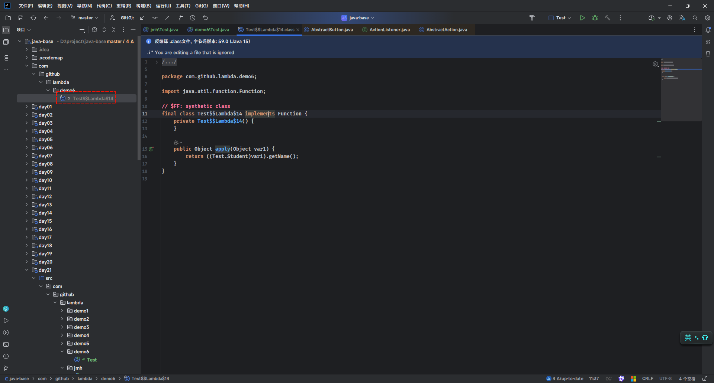

* 那么，动态生成的类的伪代码，就类似于下面的效果：

```java
package com.github.lambda.demo6;

import java.util.function.Function;

public class Test {
    public static void main(String[] args) throws Throwable {
        Function<Student, String> func = Student::getName;
    }

    static final class MethodReference implements Function<Student, String> {
        @Override
        public String apply(Student student) {
            // 直接调用 Student 类中的 getName 方法
            return student.getName(); // [!code highlight]
        }
    }


    static class Student {
        private String name;

        // 会利用类中已经存在的方法
        public String getName() {  // [!code highlight]
            return name;
        }

        public void setName(String name) {
            this.name = name;
        }
    }

}
```

* JVM 内部是通过 `LambdaMetaFactory`的`metafactory()` 来帮我们生成函数对象所需要的类（类似于上面的 MyLambda），其方法参数如下所示：

```java
/** 
* @param caller 调用者的上下文，表示哪个类正在使用这个 Lambda（用于访问权限检查等）
* @param interfaceMethodName 接口（函数式接口）的方法名，如：run、apply
* @param factoryType 创建函数对象工厂的 MethodType，类似于 BinaryOperator factory()
* @param interfaceMethodType 接口的方法类型
* @param implementation 实现方法类型（实际要调用的方法句柄），就是上面的静态方法 lambda$main$2
* @param dynamicMethodType 动态方法类型，函数对象实际的类型
*/
public static CallSite metafactory(
    							   MethodHandles.Lookup caller,
                                   String interfaceMethodName,
                                   MethodType factoryType,
                                   MethodType interfaceMethodType,
                                   MethodHandle implementation,
                                   MethodType dynamicMethodType){
    ...
}
```

* 我们可以手动来模拟 JVM 内存生成方法引用所需要的类（类似于 MethodReference）以及对象，如下所示：

```java
package com.github.lambda.demo6;

import java.lang.invoke.*;
import java.util.function.Function;

public class Test {
    public static void main(String[] args) throws Throwable {
        Function<Student, String> func = Student::getName;

        final MethodHandles.Lookup lookup = MethodHandles.lookup();
        final MethodHandle impl = lookup.findVirtual(Student.class, "getName", MethodType.methodType(String.class));

        final CallSite callSite = LambdaMetafactory.metafactory(
                lookup,
                "apply",
                MethodType.methodType(Function.class),
                MethodType.methodType(Object.class, Object.class),
                impl,
                MethodType.methodType(String.class, Student.class)
        );

        final MethodHandle mh = callSite.getTarget();
        Function<Student, String> fun2 = (Function<Student, String>) mh.invoke();
        final Student student = new Student();
        student.setName("张三");
        System.out.println(fun2.apply(student)); // 张三

    }

    static final class MethodReference implements Function<Student, String> {
        @Override
        public String apply(Student student) {
            return student.getName(); // 直接调用 Student 类中的 getName 方法
        }
    }


    static class Student {
        private String name;

        // 会利用类中已经存在的方法
        public String getName() {
            return name;
        }

        public void setName(String name) {
            this.name = name;
        }
    }

}

```

> [!NOTE]
>
> JVM 就是在运行时通过上面的代码来帮我们生成方法引用所需要的类和对象的。

* 我们需要将自己手动实现的代码，注释掉，如下所示：

```java {9-25}
package com.github.lambda.demo6;

import java.util.function.Function;

public class Test {
    public static void main(String[] args) throws Throwable {
        Function<Student, String> func = Student::getName;

        // final MethodHandles.Lookup lookup = MethodHandles.lookup();
        // final MethodHandle impl = lookup.findVirtual(Student.class, "getName", MethodType.methodType(String.class));
        //
        // final CallSite callSite = LambdaMetafactory.metafactory(
        //         lookup,
        //         "apply",
        //         MethodType.methodType(Function.class),
        //         MethodType.methodType(Object.class, Object.class),
        //         impl,
        //         MethodType.methodType(String.class, Student.class)
        // );
        //
        // final MethodHandle mh = callSite.getTarget();
        // Function<Student, String> fun2 = (Function<Student, String>) mh.invoke();
        // final Student student = new Student();
        // student.setName("张三");
        // System.out.println(fun2.apply(student)); // 张三

    }

    static final class MethodReference implements Function<Student, String> {
        @Override
        public String apply(Student student) {
            return student.getName(); // 直接调用 Student 类中的 getName 方法
        }
    }


    static class Student {
        private String name;

        // 会利用类中已经存在的方法
        public String getName() {
            return name;
        }

        public void setName(String name) {
            this.name = name;
        }
    }

}
```

* 重新编译，再反编译，如下所示：

```bash
javap -c -v Test.class
```

* 其反编译的内容，如下所示：

```txt {94,115}
$ javap -c -v Test.class
Classfile /D:/project/java-base/out/production/day21/com/github/lambda/demo6/Test.class
  Last modified 2025年5月27日; size 1443 bytes
  SHA-256 checksum b4377152f6f17955250530bd000b31f75329c4b7aa7bae7e3b86e670b3c02d20
  Compiled from "Test.java"
public class com.github.lambda.demo6.Test
  minor version: 0
  major version: 61
  flags: (0x0021) ACC_PUBLIC, ACC_SUPER
  this_class: #11                         // com/github/lambda/demo6/Test
  super_class: #2                         // java/lang/Object
  interfaces: 0, fields: 0, methods: 2, attributes: 4
Constant pool:
   #1 = Methodref          #2.#3          // java/lang/Object."<init>":()V
   #2 = Class              #4             // java/lang/Object
   #3 = NameAndType        #5:#6          // "<init>":()V
   #4 = Utf8               java/lang/Object
   #5 = Utf8               <init>
   #6 = Utf8               ()V
   #7 = InvokeDynamic      #0:#8          // #0:apply:()Ljava/util/function/Function;
   #8 = NameAndType        #9:#10         // apply:()Ljava/util/function/Function;
   #9 = Utf8               apply
  #10 = Utf8               ()Ljava/util/function/Function;
  #11 = Class              #12            // com/github/lambda/demo6/Test
  #12 = Utf8               com/github/lambda/demo6/Test
  #13 = Utf8               Code
  #14 = Utf8               LineNumberTable
  #15 = Utf8               LocalVariableTable
  #16 = Utf8               this
  #17 = Utf8               Lcom/github/lambda/demo6/Test;
  #18 = Utf8               main
  #19 = Utf8               ([Ljava/lang/String;)V
  #20 = Utf8               args
  #21 = Utf8               [Ljava/lang/String;
  #22 = Utf8               func
  #23 = Utf8               Ljava/util/function/Function;
  #24 = Utf8               LocalVariableTypeTable
  #25 = Utf8               Ljava/util/function/Function<Lcom/github/lambda/demo6/Test$Student;Ljava/lang/String;>;
  #26 = Utf8               Exceptions
  #27 = Class              #28            // java/lang/Throwable
  #28 = Utf8               java/lang/Throwable
  #29 = Utf8               SourceFile
  #30 = Utf8               Test.java
  #31 = Utf8               NestMembers
  #32 = Class              #33            // com/github/lambda/demo6/Test$Student
  #33 = Utf8               com/github/lambda/demo6/Test$Student
  #34 = Class              #35            // com/github/lambda/demo6/Test$MethodReference
  #35 = Utf8               com/github/lambda/demo6/Test$MethodReference
  #36 = Utf8               BootstrapMethods
  #37 = MethodHandle       6:#38          // REF_invokeStatic java/lang/invoke/LambdaMetafactory.metafactory:(Ljava/lang/invoke/MethodHandles$Lookup;Ljava/lang/String;Ljava/lang/invoke/MethodType;Ljava/lang/invoke/MethodType;Ljava/lang/invoke/MethodHandle;Ljava/lang/invoke/MethodType;)Ljava/lang/invoke/CallSite;
  #38 = Methodref          #39.#40        // java/lang/invoke/LambdaMetafactory.metafactory:(Ljava/lang/invoke/MethodHandles$Lookup;Ljava/lang/String;Ljava/lang/invoke/MethodType;Ljava/lang/invoke/MethodType;Ljava/lang/invoke/MethodHandle;Ljava/lang/invoke/MethodType;)Ljava/lang/invoke/CallSite;
  #39 = Class              #41            // java/lang/invoke/LambdaMetafactory
  #40 = NameAndType        #42:#43        // metafactory:(Ljava/lang/invoke/MethodHandles$Lookup;Ljava/lang/String;Ljava/lang/invoke/MethodType;Ljava/lang/invoke/MethodType;Ljava/lang/invoke/MethodHandle;Ljava/lang/invoke/MethodType;)Ljava/lang/invoke/CallSite;
  #41 = Utf8               java/lang/invoke/LambdaMetafactory
  #42 = Utf8               metafactory
  #43 = Utf8               (Ljava/lang/invoke/MethodHandles$Lookup;Ljava/lang/String;Ljava/lang/invoke/MethodType;Ljava/lang/invoke/MethodType;Ljava/lang/invoke/MethodHandle;Ljava/lang/invoke/MethodType;)Ljava/lang/invoke/CallSite;
  #44 = MethodType         #45            //  (Ljava/lang/Object;)Ljava/lang/Object;
  #45 = Utf8               (Ljava/lang/Object;)Ljava/lang/Object;
  #46 = MethodHandle       5:#47          // REF_invokeVirtual com/github/lambda/demo6/Test$Student.getName:()Ljava/lang/String;
  #47 = Methodref          #32.#48        // com/github/lambda/demo6/Test$Student.getName:()Ljava/lang/String;
  #48 = NameAndType        #49:#50        // getName:()Ljava/lang/String;
  #49 = Utf8               getName
  #50 = Utf8               ()Ljava/lang/String;
  #51 = MethodType         #52            //  (Lcom/github/lambda/demo6/Test$Student;)Ljava/lang/String;
  #52 = Utf8               (Lcom/github/lambda/demo6/Test$Student;)Ljava/lang/String;
  #53 = Utf8               InnerClasses
  #54 = Utf8               Student
  #55 = Utf8               MethodReference
  #56 = Class              #57            // java/lang/invoke/MethodHandles$Lookup
  #57 = Utf8               java/lang/invoke/MethodHandles$Lookup
  #58 = Class              #59            // java/lang/invoke/MethodHandles
  #59 = Utf8               java/lang/invoke/MethodHandles
  #60 = Utf8               Lookup
{
  public com.github.lambda.demo6.Test();
    descriptor: ()V
    flags: (0x0001) ACC_PUBLIC
    Code:
      stack=1, locals=1, args_size=1
         0: aload_0
         1: invokespecial #1                  // Method java/lang/Object."<init>":()V
         4: return
      LineNumberTable:
        line 5: 0
      LocalVariableTable:
        Start  Length  Slot  Name   Signature
            0       5     0  this   Lcom/github/lambda/demo6/Test;

  public static void main(java.lang.String[]) throws java.lang.Throwable;
    descriptor: ([Ljava/lang/String;)V
    flags: (0x0009) ACC_PUBLIC, ACC_STATIC
    Code:
      stack=1, locals=2, args_size=1
         0: invokedynamic #7,  0              // InvokeDynamic #0:apply:()Ljava/util/function/Function;
         5: astore_1
         6: return
      LineNumberTable:
        line 7: 0
        line 27: 6
      LocalVariableTable:
        Start  Length  Slot  Name   Signature
            0       7     0  args   [Ljava/lang/String;
            6       1     1  func   Ljava/util/function/Function;
      LocalVariableTypeTable:
        Start  Length  Slot  Name   Signature
            6       1     1  func   Ljava/util/function/Function<Lcom/github/lambda/demo6/Test$Student;Ljava/lang/String;>;
    Exceptions:
      throws java.lang.Throwable
}
SourceFile: "Test.java"
NestMembers:
  com/github/lambda/demo6/Test$Student
  com/github/lambda/demo6/Test$MethodReference
BootstrapMethods:
  0: #37 REF_invokeStatic java/lang/invoke/LambdaMetafactory.metafactory:(Ljava/lang/invoke/MethodHandles$Lookup;Ljava/lang/String;Ljava/lang/invoke/MethodType;Ljava/lang/invoke/MethodType;Ljava/lang/invoke/MethodHandle;Ljava/lang/invoke/MethodType;)Ljava/lang/invoke/CallSite;
    Method arguments:
      #44 (Ljava/lang/Object;)Ljava/lang/Object;
      #46 REF_invokeVirtual com/github/lambda/demo6/Test$Student.getName:()Ljava/lang/String;
      #51 (Lcom/github/lambda/demo6/Test$Student;)Ljava/lang/String;
InnerClasses:
  static #54= #32 of #11;                 // Student=class com/github/lambda/demo6/Test$Student of class com/github/lambda/demo6/Test
  static final #55= #34 of #11;           // MethodReference=class com/github/lambda/demo6/Test$MethodReference of class com/github/lambda/demo6/Test
  public static final #60= #56 of #58;    // Lookup=class java/lang/invoke/MethodHandles$Lookup of class java/lang/invoke/MethodHandles
```

## 2.5 闭包原理

### 2.5.1 概述

* 所谓的`闭包`就是`闭合`并`封装了外部作用域的变量`，形成了一个完整的执行环境。

> [!NOTE]
>
> - ① `闭`指的是函数对象`捕获（或闭合）其定义时的作用域（词法环境）`，该作用域可能包含了函数体外部的局部变量，即：函数对象将这些变量`包`住了，不让它们随着外部函数结束而消失。
> - ② `包`指的是将这些变量和函数对象一起封装（打包）起来，形成一个完整的执行单位，哪怕外部环境早已结束，它们依然可以一起存活。
> - ③ `闭包`之所以叫“闭包”，是因为它“闭合”了定义时的作用域，把外部变量“打包”在自己的作用域里，即使外部函数早就结束，它仍然能访问这些变量。

### 2.5.2 Java 中的闭包

* 在 Java 中，闭包就是一个`Lambda 表达式`或`方法引用`（函数对象），它可以捕获并使用外部局部变量，即使这些变量不是在它的代码块中定义的。

```java {12}
package com.github.lambda.method1;

import java.util.function.Supplier;

public class Test {

    public static Supplier<String> outer() {
        String name = "abc";

        // Lambda 表达式捕获了外部变量 
        return () -> {
            System.out.println("inner：" + name); 
            return name;
        };
    }
    
    public static void main(String[] args) {
        Supplier<String> inner = outer();
        String str = inner.get();
        System.out.println(str);
    }   
}
```

* 其内存动态图，如下所示：

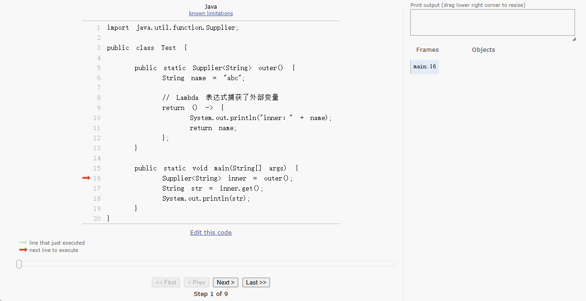

### 2.5.3 闭包原理

#### 2.5.3.1 概述

* 在 Java 中，闭包的底层和 Lambda 表达式以及方法引用一样，都是由方法、类和对象组成。

#### 2.5.3.2 方法从哪里来？

* 闭包底层也会被编译器编译为静态方法或使用已经存在的方法。
* 假设代码是这样的，如下所示：

```java
package com.github.lambda.demo6;

import java.lang.reflect.Method;
import java.util.function.BinaryOperator;

public class Test {
    public static void main(String[] args) throws Throwable {

        int c = 10;
        BinaryOperator<Integer> binaryOperator = (a, b) -> a + b + c;
    }
}
```

* 我们可以通过反射来验证，如下所示：

::: code-group

```java [Test.java]
package com.github.lambda.demo6;

import java.lang.reflect.Method;
import java.util.function.BinaryOperator;

public class Test {
    public static void main(String[] args) throws Throwable {

        int c = 10;
        BinaryOperator<Integer> binaryOperator = (a, b) -> a + b + c;

        // 反射获取所有方法
        final Method[] declaredMethods = Test.class.getDeclaredMethods();
        for (Method declaredMethod : declaredMethods) {
            System.out.println(declaredMethod);
        }
    }

}
```

```txt [cmd 控制台]
private static java.lang.Integer com.github.lambda.demo6.Test.lambda$main$0(int,java.lang.Integer,java.lang.Integer)
public static void com.github.lambda.demo6.Test.main(java.lang.String[]) throws java.lang.Throwable
```

:::

* 其伪代码，就是这样的，如下所示：

```java
package com.github.lambda.demo6;

import java.lang.reflect.Method;
import java.util.function.BinaryOperator;

public class Test {
    public static void main(String[] args) throws Throwable {

        int c = 10;
        BinaryOperator<Integer> binaryOperator = (a, b) -> a + b + c;

        // 反射获取所有方法
        final Method[] declaredMethods = Test.class.getDeclaredMethods();
        for (Method declaredMethod : declaredMethods) {
            System.out.println(declaredMethod);
        }
    }

    /**
     * 伪代码
     */
    private static Integer lambda$main$0(int c, Integer a, Integer b) { // [!code highlight]
        return a + b + c;
    }

}
```

#### 2.5.3.3 类和对象从哪里来？

* JVM 是在运行期间在内存中动态创建这个类和对象，如果要查看这个类，需要添加 JVM 参数：

> [!NOTE]
>
> 在 JVM 运行的时候，通过调用一个名为 invokedynamic 的虚拟机指令并配合 LambdaMetafactory 来生成对应的类以及对象。

```bash
-Djdk.internal.lambda.dumpProxyClasses
```


* 在 IDEA 中，重新编译，就可以看到生成的 class 字节码文件，如下所示：

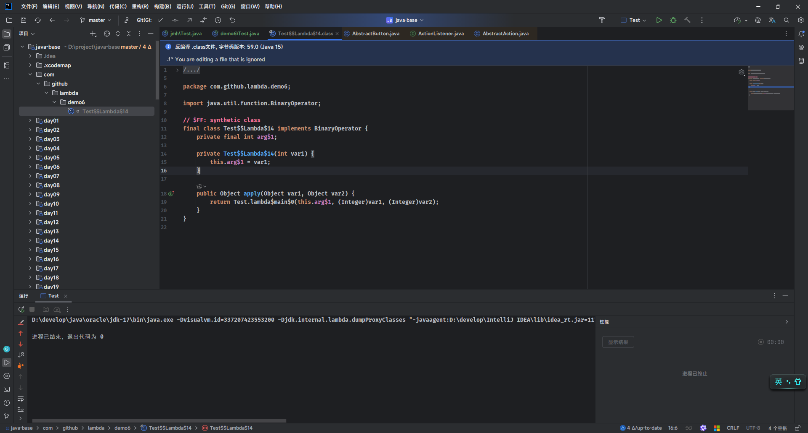

* 在 IDEA 中，我们可以看到对应 class 字节码文件反编译后的类，如下所示：

```java
package com.github.lambda.demo6;

import java.util.function.BinaryOperator;

// $FF: synthetic class
final class Test$$Lambda$14 implements BinaryOperator {
    private final int arg$1; // [!code highlight]

    private Test$$Lambda$14(int var1) { // [!code highlight]
        this.arg$1 = var1;
    }

    public Object apply(Object var1, Object var2) {
        return Test.lambda$main$0(this.arg$1, (Integer)var1, (Integer)var2);
    }
}
```

> [!NOTE]
>
> * ① JVM 内部是将闭包作为所生成类的一个成员变量，并且使用 final 修饰的。
> * ② 这也就意味着该变量是常量，有且仅能被赋值一次。
> * ③ 这也和 Java 中闭包变量的要求相符合，即：必须 `final` 或 `effectively final`。

* 但是，对于静态变量所形成的闭包，是没有这个限制的，如下所示：

```java
package com.github.lambda.demo6;

import java.util.function.BinaryOperator;

public class Test {

    static int c = 10; // [!code highlight]

    public static void main(String[] args) throws Throwable {
        BinaryOperator<Integer> binaryOperator = (a, b) -> a + b + c;
        
    }

}
```

* 其底层的生成的方法（伪代码），如下所示：

```java
package com.github.lambda.demo6;

import java.lang.reflect.Method;
import java.util.function.BinaryOperator;

public class Test {

    static int c = 10;

    public static void main(String[] args) throws Throwable {
        BinaryOperator<Integer> binaryOperator = (a, b) -> a + b + c;

        // 反射获取所有方法
        final Method[] declaredMethods = Test.class.getDeclaredMethods();
        for (Method declaredMethod : declaredMethods) {
            System.out.println(declaredMethod);
        }
    }

    // 伪代码
    private static Integer lambda$main$0(Integer a, Integer b) { // [!code highlight]
        return a + b + c;
    }

}
```

* 局部变量形成的闭包，从语法上是不能访问到类中的成员变量，如下所示：

```java
package com.github.lambda.demo6;

import java.lang.reflect.Method;
import java.util.function.BinaryOperator;

public class Test {
    public static void main(String[] args) throws Throwable {
        int c = 10;
        BinaryOperator<Integer> binaryOperator = (a, b) -> a + b + c;

        // 反射获取所有方法
        final Method[] declaredMethods = Test.class.getDeclaredMethods();
        for (Method declaredMethod : declaredMethods) {
            System.out.println(declaredMethod);
        }
        // ❌ 错误，访问不到 Test$$Lambda$14 中的变量 c
        c = 20; // [!code error]
    }

    // 伪代码
    private static Integer lambda$main$0(int c, Integer a, Integer b) {
        return a + b + c;
    }

    // 伪代码
    final class Test$$Lambda$14 implements BinaryOperator {
        private final int c; // [!code highlight]

        private Test$$Lambda$14(int c) { // [!code highlight]
            this.c = c;
        }

        public Object apply(Object var1, Object var2) {
            return Test.lambda$main$0(this.c, (Integer) var1, (Integer) var2);
        }
    }
}
```

* 静态变量形成的闭包，就没有这个限制，已经从语法上是可以通过类名来访问静态变量的，如下所示：

```java
package com.github.lambda.demo6;

import java.lang.reflect.Method;
import java.util.function.BinaryOperator;

public class Test {

    static int c = 10;

    public static void main(String[] args) throws Throwable {

        BinaryOperator<Integer> binaryOperator = (a, b) -> a + b + c;

        // 反射获取所有方法
        final Method[] declaredMethods = Test.class.getDeclaredMethods();
        for (Method declaredMethod : declaredMethods) {
            System.out.println(declaredMethod);
        }
        // ✅ 正确，可以通过类名来访问静态变量
        c = 20; // [!code highlight]
    }

    // 伪代码
    private static Integer lambda$main$0(Integer a, Integer b) {
        return a + b + c;
    }

    // 伪代码
    final class Test$$Lambda$14 implements BinaryOperator {
        private Test$$Lambda$14() {
        }

        public Object apply(Object var1, Object var2) {
            return Test.lambda$main$0((Integer) var1, (Integer) var2);
        }
    }

}
```

## 2.6 流的构建和切分

### 2.7.1 流的构建

* 在 Java 中，根据已有数据构建 Stream 对象有三种：
  - ① 根据数组构建 Stream 流对象。
  - ② 根据对象构建 Stream 流对象。
  - ③ 根据集合构建 Stream 流对象。

```java
package com.github.lambda.jmh;

import java.util.Arrays;
import java.util.List;
import java.util.stream.Stream;

public class Test {
    public static void main(String[] args) {
        final List<Integer> list = List.of(1, 2, 3, 4, 5, 6, 7, 8, 9);
        Integer[] arr = {1, 2, 3, 4, 5, 6, 7, 8, 9};

        final Stream<Integer> stream1 = list.stream(); // [!code highlight]
        final Stream<Integer> stream2 = Arrays.stream(arr); // [!code highlight]
    }

}
```

* 我们可以查看一下`流构建`的源码，如下所示：

```java 
public interface Collection<E> extends Iterable<E> {  
    
	default Stream<E> stream() {
        return StreamSupport.stream(spliterator(), false); // [!code highlight]
    }
    
    ...
}    
```

```java
public class Arrays { 
	
    public static <T> Stream<T> stream(T[] array) {
        return stream(array, 0, array.length);
    }

  	public static <T> Stream<T> stream(T[] array, int startInclusive, int endExclusive) {
        return StreamSupport.stream(
            spliterator(array, startInclusive, endExclusive), false); // [!code highlight]
    }
    
    ...
}
```

> [!NOTE]
>
> 我们会发现这样的现象：
>
> * ① 都会调用 StreamSupport.stream(xxx) 方法， StreamSupport 是一个工具类。
> * ② 都需要一个 spliterator(array, startInclusive, endExclusive) 参数，其实这就是一个可切分的迭代器。

### 2.7.2 可切分迭代器

#### 2.7.2.1 概述

* `Spliterator` 是 Java 8 引入的一个接口，全称是 **Splitable Iterator（可切分迭代器）**。

```java
public interface Spliterator<T> { 
	
    ...

}
```

* 它的主要作用是为了支持对数据源的**高效并行遍历**，如： `Collection`、`Stream` 或自定义数据结构。

#### 2.7.2.2 获取 Spliterator 对象

* 通过集合对象的 spliterator() 方法获取 Spliterator 对象：

```java
public interface Collection<E> extends Iterable<E> { 
	
    default Spliterator<E> spliterator() {
        return Spliterators.spliterator(this, 0);
    }
    
	...
}
```

* 通过 Arrays 工具类的 spliterator() 方法获取 Spliterator 对象：

```java
public class Arrays {    
    
	public static <T> Spliterator<T> spliterator(T[] array) {
        return Spliterators.spliterator(array,
                                        Spliterator.ORDERED | Spliterator.IMMUTABLE);
    }
    
    ...
}
```


* 示例：

```java
package com.github.lambda.jmh;

import java.util.List;
import java.util.Spliterator;

public class Test {
    public static void main(String[] args) {
        final List<Integer> list = List.of(1, 2, 3, 4, 5, 6, 7, 8, 9);

        final Spliterator<Integer> spliterator = list.spliterator();
        System.out.println("spliterator = " + spliterator);
    }
}
```


* 示例：

```java
package com.github.lambda.jmh;

import java.util.Arrays;
import java.util.List;
import java.util.Spliterator;

public class Test {
    public static void main(String[] args) {
        Integer[] arr = {1, 2, 3, 4, 5, 6, 7, 8, 9};

        final Spliterator<Integer> spliterator = Arrays.spliterator(arr);
        System.out.println("spliterator = " + spliterator);
    }
}
```

#### 2.7.2.3 常用 API

* 尝试处理下一个元素（如果有），处理成功，返回 true；否则，返回 false ：

```java
boolean tryAdvance(Consumer<? super T> action);
```

* 在当前线程中按顺序对每个剩余元素执行消费操作：

```java
default void forEachRemaining(Consumer<? super T> action) {
    do { } while (tryAdvance(action));
}
```

* 尝试将数据源拆分成两部分，返回一个新的 `Spliterator` 用于处理一部分数据，原 `Spliterator` 对象处理另一部分：

```java
Spliterator<T> trySplit();
```


* 示例：

```java
package com.github.lambda.jmh;

import java.util.List;
import java.util.Spliterator;

public class Test {
    public static void main(String[] args) {
        final List<Integer> list = List.of(1, 2, 3, 4, 5, 6, 7, 8, 9);

        final Spliterator<Integer> spliterator = list.spliterator();

        spliterator.tryAdvance(System.out::println); // 1
        spliterator.tryAdvance(System.out::println); // 2
        spliterator.tryAdvance(System.out::println); // 3
        spliterator.tryAdvance(System.out::println); // 4
    }
}
```


* 示例：

::: code-group

```java [Test.java]
package com.github.lambda.jmh;

import java.util.List;
import java.util.Spliterator;

public class Test {
    public static void main(String[] args) {
        final List<Integer> list = List.of(1, 2, 3, 4, 5, 6, 7, 8, 9);

        final Spliterator<Integer> spliterator = list.spliterator();

        while (spliterator.tryAdvance(System.out::println)) ;
    }
}
```

```txt [cmd 控制台]
1
2
3
4
5
6
7
8
9
```

:::


* 示例：

::: code-group

```java [Test.java]
package com.github.lambda.jmh;

import java.util.List;
import java.util.Spliterator;

public class Test {
    public static void main(String[] args) {
        final List<Integer> list = List.of(1, 2, 3, 4, 5, 6, 7, 8, 9);

        final Spliterator<Integer> spliterator = list.spliterator();

        spliterator.tryAdvance(System.out::println); // 1
        spliterator.tryAdvance(System.out::println); // 2
        spliterator.tryAdvance(System.out::println); // 3

        System.out.println("----------------------");

        // 在当前线程中按顺序对每个剩余元素执行消费操作
        spliterator.forEachRemaining(System.out::println);
    }
}
```

```txt [cmd 控制台]
1
2
3
----------------------
4
5
6
7
8
9
```

:::


* 示例：

::: code-group

```java
package com.github.lambda.jmh;

import java.util.List;
import java.util.Spliterator;

public class Test {
    public static void main(String[] args) {
        final List<Integer> list = List.of(1, 2, 3, 4, 5, 6, 7, 8, 9);

        final Spliterator<Integer> sp1 = list.spliterator();
        // 尝试将数据源拆分成两部分：
        // 新的 `Spliterator` 用于处理一部分数据，原 `Spliterator` 对象处理另一部分
        final Spliterator<Integer> sp2 = sp1.trySplit();

        System.out.println("sp1");
        sp1.forEachRemaining(System.out::println);
        System.out.println("----------------------");
        System.out.println("sp2");
        sp2.forEachRemaining(System.out::println);
    }
}
```

```txt [cmd 控制台]
sp1
5
6
7
8
9
----------------------
sp2
1
2
3
4
```

:::


* 示例：

::: code-group

```java
package com.github.lambda.jmh;

import java.util.List;
import java.util.Spliterator;

public class Test {
    public static void main(String[] args) {
        final List<Integer> list = List.of(1, 2, 3, 4, 5, 6, 7, 8, 9);

        final Spliterator<Integer> sp1 = list.spliterator();
        // 尝试将数据源拆分成两部分：
        // 新的 `Spliterator` 用于处理一部分数据，原 `Spliterator` 对象处理另一部分
        final Spliterator<Integer> sp2 = sp1.trySplit();
        // 尝试将数据源拆分成两部分：
        // 新的 `Spliterator` 用于处理一部分数据，原 `Spliterator` 对象处理另一部分
        final Spliterator<Integer> sp3 = sp2.trySplit();

        System.out.println("sp1");
        sp1.forEachRemaining(System.out::println);
        System.out.println("----------------------");
        System.out.println("sp2");
        sp2.forEachRemaining(System.out::println);
        System.out.println("----------------------");
        System.out.println("sp3");
        sp3.forEachRemaining(System.out::println);
    }
}
```

```txt [cmd 控制台]
sp1
5
6
7
8
9
----------------------
sp2
3
4
----------------------
sp3
1
2
```

:::

#### 2.7.2.4 和多线程的结合

* 我们可以利用`多线程`+`可切分迭代器`，来实现并行计算的场景。

> [!NOTE]
>
> * ① 利用可切分迭代器将数据分为多个部分。
> * ② 每个部分都通过一个独立的线程进行处理。
> * ③ 最后将独立处理的结果合并。


* 示例：

::: code-group

```java [Test.java]
package com.github.lambda.jmh;

import java.io.IOException;
import java.util.List;
import java.util.Spliterator;
import java.util.concurrent.CompletableFuture;
import java.util.stream.StreamSupport;

public class Test {
    public static void main(String[] args) throws IOException {
        final List<Integer> list = List.of(1, 2, 3, 4, 5, 6, 7, 8, 9);

        final Spliterator<Integer> sp1 = list.spliterator();
        final Spliterator<Integer> sp2 = sp1.trySplit();
        final Spliterator<Integer> sp3 = sp2.trySplit();

        final CompletableFuture<Integer> com1 = CompletableFuture
                .supplyAsync(() -> {
                    System.out.println("Thread-1: " + Thread
                            .currentThread()
                            .getName());
                    return StreamSupport
                            .stream(sp1, false)
                            .mapToInt(x -> x)
                            .sum();
                });

        final CompletableFuture<Integer> com2 = CompletableFuture.supplyAsync(() -> {
            System.out.println("Thread-2: " + Thread
                    .currentThread()
                    .getName());
            return StreamSupport
                    .stream(sp2, false)
                    .mapToInt(x -> x)
                    .sum();
        });

        final CompletableFuture<Integer> com3 = CompletableFuture.supplyAsync(() -> {
            System.out.println("Thread-3: " + Thread
                    .currentThread()
                    .getName());
            return StreamSupport
                    .stream(sp3, false)
                    .mapToInt(x -> x)
                    .sum();
        });

        com1
                .thenCombine(com2, Integer::sum)
                .thenCombine(com3, Integer::sum)
                .thenAccept(System.out::println); // 45

        // 阻塞 防止 JVM 退出
        System.in.read();
    }
}
```

```txt [cmd 控制台]
Thread-2: ForkJoinPool.commonPool-worker-2
Thread-1: ForkJoinPool.commonPool-worker-1
Thread-3: ForkJoinPool.commonPool-worker-3
45
```

:::

#### 2.7.2.5 总结

* ① `Spliterator` 是一种比 `Iterator` 更适合并行处理的迭代器。
* ② 它可以尝试拆分数据源，为并行计算服务。
* ③ 常用于 Stream API 中，尤其是并行流。

