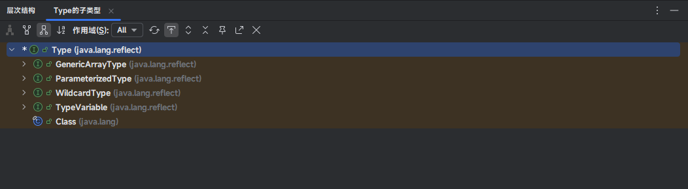

# 第一章：泛型（⭐）

## 1.1 概述

* 泛型（Generics）是在 JDK5 中引入的特性，可以在`编译阶段`约束操作的`数据类型`，并进行检查。
* 泛型的语法：

```java
<数据类型>
```

> [!CAUTION]
>
> 在 Java 中，泛型只支持引用数据类型！！！


* 示例：

```java
package com.github.collection2;

import java.util.ArrayList;
import java.util.List;

public class Test {
    public static void main(String[] args) {
        // 限制 list 集合中只能存储 String，不能存储其它类型的数据
        List<String> list = new ArrayList<>(); // [!code highlight]
        
        list.add("hello");
        list.add("world");
        
        list.forEach(System.out::println);
    }
}
```


* 示例：

```java
package com.github.collection2;

import java.util.ArrayList;
import java.util.List;

public class Test {
    public static void main(String[] args) {
        // 限制 list 集合中只能存储 Integer，不能存储其它类型的数据
        List<Integer> list = new ArrayList<>(); // [!code highlight]

        list.add(1);
        list.add(2);

        list.forEach(System.out::println);
    }
}
```

## 1.2 泛型细节

### 1.2.1 没有泛型时的 Java

* 在 JDK5 之前，由于 Java 还没有引入 `泛型`（Generics），集合类（ `ArrayList`, `HashMap` 等）都是基于 `Object` 类型 来存储元素的。

> [!NOTE]
>
> * ① 这个机制其实非常简单粗暴 —— **“一律当作 Object 存储”**！！！
> * ② 存储元素的时候，默认都是 Object 类型。
> * ③ 读取元素的时候，针对特定类型，需要手动强制类型转换。

> [!CAUTION]
>
> 在没有泛型的时候，会有如下的问题：
>
> * ① 类型不安全 —— 编译器无法检查类型。
> * ② 容易抛出 `ClassCastException`。
> * ③ 可读性和可维护性都很差！！！


* 示例：存储元素的时候，默认都是 Object 类型

```java
package com.github.collection2;

import java.util.ArrayList;
import java.util.Date;
import java.util.List;

public class GenericsTest {
    public static void main(String[] args) {
        List list = new ArrayList();

        list.add(1); // [!code highlight:3]
        list.add("hello");
        list.add(new Date());

        System.out.println(list);
    }
}
```


* 示例：读取元素的时候，针对特定类型，需要手动强制类型转换

```java
package com.github.collection2;

import java.util.ArrayList;
import java.util.Date;
import java.util.List;

public class GenericsTest {
    public static void main(String[] args) {
        List list = new ArrayList();

        list.add(1);
        list.add("hello");
        list.add(new Date());

        System.out.println(list);

        final int num = (int) list.get(0); // [!code highlight:6]
        System.out.println(num);
        final String str = (String) list.get(1);
        System.out.println(str);
        final Date date = (Date) list.get(2);
        System.out.println(date);

    }
}
```


* 示例：泛型的好处

```java
package com.github.collection2;

import java.util.ArrayList;
import java.util.List;

/**
 * Java 在 JDK5 推出了泛型之后，可以在添加数据的时候将类型统一。
 * 而且在获取数据的时候，也不需要进行强转，非常方便。
 */
public class GenericsTest {
    public static void main(String[] args) {
        List<String> list = new ArrayList<>();
        
        // 添加数据的时候将类型统一。
        list.add("1");
        list.add("hello");
        list.add("abc");

        // 在获取数据的时候，也不需要进行强转，非常方便。
        for (String str : list) {
            System.out.println(str);
        }

    }
}
```

### 1.2.2 Java 泛型的本质

* Java 泛型的本质是`类型擦除`（Type Erasure）。换言之，Java 泛型是一个`编译时语法糖`，在编译之后泛型信息会被“擦除”，即：生成的 class （字节码）文件是没有泛型类型信息的。

> [!NOTE]
>
> * ① Java 中的泛型没有运行时信息，主要出于`向后兼容`的考虑。
> * ② Java 泛型是在 JDK5 引入的，如果保留类型信息会导致老的 JVM 无法识别，破坏兼容性。

* 假设代码是这样的，如下所示：

```java
package com.github.collection2;

import java.util.ArrayList;
import java.util.List;

public class GenericsTest {
    public static void main(String[] args) {
        List<String> list = new ArrayList<>();

        // 添加数据的时候将类型统一。
        list.add("1");
        list.add("hello");
        list.add("abc");

        // 在获取数据的时候，也不需要进行强转，非常方便。
        for (String str : list) {
            System.out.println(str);
        }
    }
}
```

* 我们使用反编译工具对其进行反编译，就会发现底层还是会被当做 Object 来存储，如下所示：


* 就像这样，如下所示：


* 当我们获取数据的时候，底层会帮我们进行强转，如下所示：


* 就像这样，如下所示：


### 1.2.3 总结

* ① Java 中的泛型只能是引用数据类型。

> [!NOTE]
>
> 如果是基本数据类型，在进行类型擦除之后，是没有办法`直接`转换 Object 类型！！！

* ② 指定泛型的具体类型后，在传递数据时，可以传入该类类型或其子类类型。

```java
List<Animal> list = new ArrayList<>();

list.add(new Animal());
list.add(new Dog());
list.add(new Cat());
```

* ③ 如果不写泛型，类型默认是 Object。

```java
List list = new ArrayList();

list.add(1);
list.add("hello");
list.add(new Date());
```

## 1.3 泛型的定义格式

### 1.3.1 概述

* 泛型可以在很多地方定义，如：`类后面`（泛型类）、`方法上面`（泛型方法）以及`接口后面`（泛型接口），如下所示：


### 1.3.2 泛型类

* 如果一个类中，某些字段、方法或操作的数据类型在定义时不确定，且希望保持类型安全并支持多种类型时，就可以定义带有泛型的类，即：泛型类。

> [!NOTE]
>
> * ① 操作的数据类型，包括以下几个方面：
>   * 类的字段，即：成员变量。
>   * 方法的参数和返回值。
>   * 方法体内部的局部变量（如果其类型依赖`泛型类`的`类型`）。
>   * 数据结构中的元素，如：`List<T>` 中的 `T`。
> * ② 只有当类中多个字段或多个方法都需要共享同一种泛型类型时，才考虑使用泛型类！！！

* 语法：

```java
权限访问修饰符 class 类名<类型> {
    ...
}
```

> [!NOTE]
>
> * ① ArrayList 底层使用了泛型类，如下所示：
>
> ```java
> public class ArrayList<E> 
>     	extends AbstractList<E>
>         implements List<E>, RandomAccess, Cloneable, java.io.Serializable {
>     
>   	...
> }    
> ```
> * ② 上面的 E 可以理解为变量（类型变量），但是不是用来记录数据的，而是用来记录数据的类型，可以写成：T、E、K、V 等。


* 示例：

::: code-group

```java [MyArrayList.java]
package com.github.collection3;

import java.util.StringJoiner;

public class MyArrayList<E> {
    private final int capacity = 100;
    private final Object[] elementData = new Object[capacity];
    private final StringJoiner joiner = new StringJoiner(", ", "[", "]");
    private int size;

    public boolean add(E e) {
        elementData[size] = e;
        size++;
        return true;
    }

    public E get(int index) {
        return (E) elementData[index];
    }

    public int size() {
        return size;
    }

    @Override
    public String toString() {
        for (int i = 0; i < size; i++) {
            joiner.add(String.valueOf(elementData[i]));
        }
        return joiner.toString();
    }
}
```

```java [Test.java]
package com.github.collection3;

public class Test {
    public static void main(String[] args) {
        MyArrayList<String> list = new MyArrayList<>();
        
        list.add("hello");
        list.add("world");
        list.add("java");

        for (int i = 0; i < list.size(); i++) {
            final String str = list.get(i);
            System.out.println(str);
        }
        
        System.out.println(list);
    }
}
```

```txt [cmd 控制台]
hello
world
java
[hello, world, java]
```

:::

### 1.3.3 泛型方法

* 当方法的参数或返回值类型不确定时，且这个类型只在方法内部使用，不依赖于类的其他成员时，就可以定义带有泛型的方法。

* 语法：

```java
访问修饰符 <T> 返回值类型 方法名(T t);
```

> [!NOTE]
>
> 泛型类和泛型方法的应用场景有所不同：
>
> * ① `泛型方法`：当方法的**参数**或**返回值**的类型不确定时，使用泛型方法。**只需要在方法级别参数化类型**，而不需要影响整个类。
> * ② `泛型类`：当一个类的**多个字段或方法**都需要支持相同类型的不同数据时，才需要定义泛型类。**类级别的类型参数化**通常是为了类中多个成员能够共享相同的泛型类型。


* 示例：

::: code-group

```java [Utils.java]
package com.github.collection2;

public class Utils {
    
    private Utils(){}

    /**
     * 打印数组中的元素
     *
     * @param arr 数组
     * @param <T> 泛型
     */
    public static <T> void printArray(T[] arr) {
        for (T t : arr) {
            System.out.println(t);
        }
    }

    /**
     * 交换数组中指定位置上的元素
     *
     * @param arr 数组
     * @param i   索引
     * @param j   索引
     * @param <T> 泛型
     */
    public static <T> void swap(T[] arr, int i, int j) {
        T temp = arr[i];
        arr[i] = arr[j];
        arr[j] = temp;
    }
}
```

```java [Test.java]
package com.github.collection2;

public class Test {
    public static void main(String[] args) {
        Integer[] arr = {1, 2, 3, 4, 5};

        Utils.printArray(arr);

        System.out.println("---------");

        Utils.swap(arr, 0, arr.length - 1);

        Utils.printArray(arr);
    }
}
```

```txt [cmd 控制台]
1
2
3
4
5
---------
5
2
3
4
1
```

:::

### 1.3.4 泛型接口

* 当一个接口中，类型不确定的时候，就可以使用泛型接口。

* 语法：

```java
权限访问修饰符 interface 类名<类型> {
    ...
}
```

> [!NOTE]
>
> Java 中的 List 接口就是一个泛型接口：
>
> ```java
> public interface List<E> extends Collection<E> { 
> 	...
> }
> ```

* 如何使用一个带泛型的接口，有如下两种方式：
  * ① 实现类给出具体的类型，创建对象的时候不需要确定具体的类型。
  * ② 实现类延续泛型，创建对象的时候需要确定具体的类型。

> [!NOTE]
>
> 应用场景：希望创建一个`与类型无关的、可复用的接口`，而具体的类型由实现类或使用者在使用时决定。


* 示例：实现类给出具体的泛型

::: code-group

```java [MyArrayList2.java]
package com.github.collection3;

import java.util.Collection;
import java.util.Iterator;
import java.util.List;
import java.util.ListIterator;

// MyArrayList2 的类型已经确定，就是 String
public class MyArrayList2 implements List<String> { // [!code highlight]

    @Override
    public int size() {
        return 0;
    }

    @Override
    public boolean isEmpty() {
        return false;
    }

    @Override
    public boolean contains(Object o) {
        return false;
    }

    @Override
    public Iterator<String> iterator() {
        return null;
    }

    @Override
    public Object[] toArray() {
        return new Object[0];
    }

    @Override
    public <T> T[] toArray(T[] a) {
        return null;
    }

    @Override
    public boolean add(String s) { // [!code highlight]
        return false;
    }

    @Override
    public boolean remove(Object o) {
        return false;
    }

    @Override
    public boolean containsAll(Collection<?> c) {
        return false;
    }

    @Override
    public boolean addAll(Collection<? extends String> c) {
        return false;
    }

    @Override
    public boolean addAll(int index, Collection<? extends String> c) {
        return false;
    }

    @Override
    public boolean removeAll(Collection<?> c) {
        return false;
    }

    @Override
    public boolean retainAll(Collection<?> c) {
        return false;
    }

    @Override
    public void clear() {

    }

    @Override
    public String get(int index) {
        return "";
    }

    @Override
    public String set(int index, String element) {
        return "";
    }

    @Override
    public void add(int index, String element) {

    }

    @Override
    public String remove(int index) {
        return "";
    }

    @Override
    public int indexOf(Object o) {
        return 0;
    }

    @Override
    public int lastIndexOf(Object o) {
        return 0;
    }

    @Override
    public ListIterator<String> listIterator() {
        return null;
    }

    @Override
    public ListIterator<String> listIterator(int index) {
        return null;
    }

    @Override
    public List<String> subList(int fromIndex, int toIndex) {
        return List.of();
    }
}
```

```java [Test.java]
package com.github.collection3;

public class Test {
    public static void main(String[] args) {
        
        // 创建对象的时候不需要确定具体的类型
        MyArrayList2 list = new MyArrayList2(); // [!code highlight]

        // ✅ MyArrayList2 中只能存储 String 类型的元素
        list.add("hello"); // [!code highlight]
        
        // ❌ MyArrayList2 中只能存储 String 类型的元素
        list.add(1); // [!code highlight]

    }
}
```

:::


* 示例：实现类延续泛型

::: code-group

```java [MyArrayList2.java]
package com.github.collection3;

import java.util.Collection;
import java.util.Iterator;
import java.util.List;
import java.util.ListIterator;

// MyArrayList2 的类型还不确定，在创建对象的时候给出具体类型
public class MyArrayList2<E> implements List<E> { // [!code highlight]

    @Override
    public int size() {
        return 0;
    }

    @Override
    public boolean isEmpty() {
        return false;
    }

    @Override
    public boolean contains(Object o) {
        return false;
    }

    @Override
    public Iterator<E> iterator() {
        return null;
    }

    @Override
    public Object[] toArray() {
        return new Object[0];
    }

    @Override
    public <T> T[] toArray(T[] a) {
        return null;
    }

    @Override
    public boolean add(E e) { // [!code highlight]
        return false;
    }

    @Override
    public boolean remove(Object o) {
        return false;
    }

    @Override
    public boolean containsAll(Collection<?> c) {
        return false;
    }

    @Override
    public boolean addAll(Collection<? extends E> c) {
        return false;
    }

    @Override
    public boolean addAll(int index, Collection<? extends E> c) {
        return false;
    }

    @Override
    public boolean removeAll(Collection<?> c) {
        return false;
    }

    @Override
    public boolean retainAll(Collection<?> c) {
        return false;
    }

    @Override
    public void clear() {

    }

    @Override
    public E get(int index) {
        return null;
    }

    @Override
    public E set(int index, E element) {
        return null;
    }

    @Override
    public void add(int index, E element) {

    }

    @Override
    public E remove(int index) {
        return null;
    }

    @Override
    public int indexOf(Object o) {
        return 0;
    }

    @Override
    public int lastIndexOf(Object o) {
        return 0;
    }

    @Override
    public ListIterator<E> listIterator() {
        return null;
    }

    @Override
    public ListIterator<E> listIterator(int index) {
        return null;
    }

    @Override
    public List<E> subList(int fromIndex, int toIndex) {
        return List.of();
    }
}

```

```java [Test.java]
package com.github.collection3;

public class Test {
    public static void main(String[] args) {
        
        // 创建对象的时候不需要确定具体的类型 
        MyArrayList2<String> list = new MyArrayList2<>(); // [!code highlight]

        // ✅ 创建 list 对象的时候，已经确定了 MyArrayList2 只能存储 String 元素
        list.add("hello"); // [!code highlight]

        // ❌ 创建 list 对象的时候，已经确定了 MyArrayList2 只能存储 String 元素
        list.add(1); // [!code highlight]

    }
}
```

:::

## 1.4 协变、逆变和不变

### 1.4.1 概述

* `协变`（Covariance） 和 `逆变`（Contravariance） 是描述类型继承关系在复杂类型（泛型、数组、函数参数等）中如何传递的概念。
* 它们的核心在于：`子类型关系在复杂类型中的表现是否与原始类型一致` 。

### 1.4.2 协变

* 如果 A 是 B 的子类，如果 Container(A) 也被认为是 Container(B) 的子类型，这就是协变（协同变化）。

> [!NOTE]
>
> * ① 如果`苹果`（Apple）是`水果`（Fruit），那么`一筐苹果`（`Box<Apple>`）可以当做`一筐水果`（`Box<Fruit>`），这就叫做协变（协同变化）。
> * ② 协变`强调方向一致`，即：在协变中，类型参数允许一种从子类型到父类型的替换关系，如：A -->B ，那么 Container(A) --> Container(B) 。这种由子类型到父类型的传递关系体现了“协变”的数学意思，即：类型参数的继承关系在容器级别也保持不变。
> * ③ 协变`强调一致性和可替换性`：协变强调子类型在能够替换为父类型的上下文中的一致性。在编程中，这允许我们处理更具体的对象（子类型）而无需修改处理这些对象的代码逻辑。这种一致性是“协变”名称的核心。
> * ④ 斜变读取安全，但是写入不安全！！！

* Java 中的`数组`就是典型的`协变`设计，如下所示：

> [!NOTE]
>
> `String`是`Object`的子类型，那么`String[]`也是`Object[]`的子类型。

```java
package com.github.collection3;

import java.util.Arrays;

public class Test {
    public static void main(String[] args) {

        String[] strArr = {"hello", "world", "java"};

        // 协变
        Object[] objArr = strArr; // [!code highlight]

        System.out.println(Arrays.toString(objArr)); // [hello, world, java]
    }

}
```

* 在学习多态的时候，我们就知道，多态的优点是：父类可以用来处理（操作、指向）子类对象。

::: code-group

```java [Animal.java]
package com.github.collection3;

public class Animal {
    String name = "动物";

    public void show() {
        System.out.println("Animal --- show");
    }
}
```

```java [Cat.java]
package com.github.collection3;

public class Cat extends Animal {

    String name = "猫";

    @Override
    public void show() {
        System.out.println("Cat --- show");
    }

    public void catchMouse() {
        System.out.println("猫抓老鼠");
    }

}
```

```java [Dog.java]
package com.github.collection3;

public class Dog extends Animal {

    String name = "狗";

    @Override
    public void show() {
        System.out.println("Dog --- show");
    }

    public void lookHome() {
        System.out.println("狗看家");
    }
}
```

```java [Test.java]
package com.github.collection3;

public class Test {
    public static void main(String[] args) {

        show(new Dog()); // [!code highlight]
        show(new Cat()); // [!code highlight]
        
    }

    // 相当于 Animal animal = new Dog()
    // 相当于 Animal animal = new Cat()
    public static void show(Animal animal) { // [!code highlight]
        animal.show();
    }

}
```

```txt [cmd 控制台]
Dog --- show
Cat --- show
```

:::

* Java 将这种设计理念也扩展到了数组中，使得开发者可以通过较为通用的父类型数组（`Object[]`）来操作子类数组（`String[]`）

::: code-group

```java [Animal.java]
package com.github.collection3;

public class Animal {
    String name = "动物";

    public void show() {
        System.out.println("Animal --- show");
    }
}
```

```java [Cat.java]
package com.github.collection3;

public class Cat extends Animal {

    String name = "猫";

    @Override
    public void show() {
        System.out.println("Cat --- show");
    }

    public void catchMouse() {
        System.out.println("猫抓老鼠");
    }

}
```

```java [Dog.java]
package com.github.collection3;

public class Dog extends Animal {

    String name = "狗";

    @Override
    public void show() {
        System.out.println("Dog --- show");
    }

    public void lookHome() {
        System.out.println("狗看家");
    }
}
```

```java [Test.java]
package com.github.collection3;

public class Test {
    public static void main(String[] args) {
        Dog[] dogs = new Dog[]{new Dog(), new Dog(), new Dog()};

        Cat[] cat2 = new Cat[]{new Cat(), new Cat()};

        show(dogs); // [!code highlight]
        show(cat2); // [!code highlight]
    }

    // 相当于 Animal[] animals = new Dog[]{new Dog(), new Dog(), new Dog()};
    // 相当于 Animal[] animals = new Cat[]{new Cat(), new Cat()};
    public static void show(Animal[] animals) { // [!code highlight]
        for (int i = 0; i < animals.length; i++) {
            Animal animal = animals[i];
            animal.show();
        }
    }
}
```

```txt [cmd 控制台]
Dog --- show
Dog --- show
Dog --- show
Cat --- show
Cat --- show
```

:::

* 在学习多态的时候，我们就知道，多态的弊端是：父类不能调用子类的独有功能的，除非进行强制类型转换。

::: code-group

```java [Animal.java]
package com.github.collection3;

public class Animal {
    String name = "动物";

    public void show() {
        System.out.println("Animal --- show");
    }
}
```

```java [Cat.java]
package com.github.collection3;

public class Cat extends Animal {

    String name = "猫";

    @Override
    public void show() {
        System.out.println("Cat --- show");
    }

    public void catchMouse() {
        System.out.println("猫抓老鼠");
    }

}
```

```java [Dog.java]
package com.github.collection3;

public class Dog extends Animal {

    String name = "狗";

    @Override
    public void show() {
        System.out.println("Dog --- show");
    }

    public void lookHome() {
        System.out.println("狗看家");
    }
}
```

```java [Test.java]
package com.github.collection3;

public class Test {
    public static void main(String[] args) {

        show(new Dog()); // [!code highlight]
        show(new Cat()); // [!code highlight]

    }

    // 相当于 Animal animal = new Dog()
    // 相当于 Animal animal = new Cat()
    public static void show(Animal animal) { // [!code highlight]
        animal.show();
        if (animal instanceof Dog dog) { // [!code highlight]
            dog.lookHome();
        } else if (animal instanceof Cat cat) { // [!code highlight]
            cat.catchMouse();
        }
    }

}
```

```txt [cmd 控制台]
Dog --- show
狗看家
Cat --- show
猫抓老鼠
```

:::

* Java 将这种设计理念也扩展到了数组中，那么我们在调用子类独有功能的时候，也需要继续强制类型转换：

::: code-group

```java [Animal.java]
package com.github.collection3;

public class Animal {
    String name = "动物";

    public void show() {
        System.out.println("Animal --- show");
    }
}
```

```java [Cat.java]
package com.github.collection3;

public class Cat extends Animal {

    String name = "猫";

    @Override
    public void show() {
        System.out.println("Cat --- show");
    }

    public void catchMouse() {
        System.out.println("猫抓老鼠");
    }

}
```

```java [Dog.java]
package com.github.collection3;

public class Dog extends Animal {

    String name = "狗";

    @Override
    public void show() {
        System.out.println("Dog --- show");
    }

    public void lookHome() {
        System.out.println("狗看家");
    }
}
```

```java [Test.java]
package com.github.collection3;

public class Test {
    public static void main(String[] args) {
        Dog[] dogs = new Dog[]{new Dog(), new Dog(), new Dog()};

        Cat[] cat2 = new Cat[]{new Cat(), new Cat()};

        show(dogs); // [!code highlight]
        show(cat2); // [!code highlight]
    }

    // 相当于 Animal[] animals = new Dog[]{new Dog(), new Dog(), new Dog()};
    // 相当于 Animal[] animals = new Cat[]{new Cat(), new Cat()};
    public static void show(Animal[] animals) { // [!code highlight]
        for (int i = 0; i < animals.length; i++) {
            Animal animal = animals[i];
            animal.show();
            if (animal instanceof Dog dog) { // [!code highlight]
                dog.lookHome();
            } else if (animal instanceof Cat cat) { // [!code highlight]
                cat.catchMouse();
            }
        }
    }
}
```

```txt [cmd 控制台]
Dog --- show
狗看家
Dog --- show
狗看家
Dog --- show
狗看家
Cat --- show
猫抓老鼠
Cat --- show
猫抓老鼠
```

:::

* 但是，Java 的这种设计，将多态的扩展到了数组层次，虽然提高了数组的灵活性；但是，也带来了`运行时安全`问题。

> [!NOTE]
>
> * 所谓的灵活性：程序员可以利用协变，在数组中存储多个不同类型的对象，只要它们都是对象的子类。
> * 所谓的运行时安全问题：程序允许通过一个 Animal[] 引用指向 Dog[] 对象，但是在 Animal[] 中插入了 Cat 对象。

```java
package com.github.collection3;

public class Test {
    public static void main(String[] args) {
        
        Animal[] animals = new Dog[3];
        animals[0] = new Dog();
        animals[1] = new Dog();
        animals[2] = new Dog();

        show(animals);
    }

    public static void show(Animal[] animals) {
        // ❌ 会抛出 java.lang.ArrayStoreException
        animals[0] = new Cat(); // [!code error]
        for (int i = 0; i < animals.length; i++) {
            Animal animal = animals[i];
            animal.show();
        }
    }
}
```

> [!NOTE]
>
> 对于协变数组而言，读是安全的，但是写是不安全的。

* 我们可以将一个`Dog[]`当做`Animal[]`来使用，即：Dog[] 中的每个元素都可以是 Animal ，如下所示：

```java
package com.github.collection3;

public class Test {
    public static void main(String[] args) {

        Animal[] animals = new Dog[]{
                new Dog(), new Dog(), new Dog(), new Dog(), new Dog()
        };

        // 没什么问题，animals[0] 实际上就是 new Dog()
        // Animal animal = new Dog();
        Animal animal = animals[0]; // [!code highlight]

        animal.show(); // Dog --- show

    }
}
```

* 但是，写入是不安全的，因为 `Animal[]` 应该允许写入任何 `Animal` 子类（Cat、Dog 等），但是实际上`Animal[]`存储类型是`Dog[]`，是不可以写入`Cat`的，所以 Java 会报 ArrayStoreException 异常。

> [!NOTE]
>
> 类比场景：
>
> * 本来有一个狗窝，装的都是狗（`new Dog[]{...}`），每只狗 100 元。
> * 你告诉我：这个窝里都是动物（`Animal[] animals = dogs`），每只 100 元。
> * 但是，你背着我偷偷在狗窝里塞猫（ `animals[0] = new Cat()`），猫每只 50 元。
> * 然后，将整窝动物卖我（每只 100 元），你觉得我傻（里面又不都是狗）？

```java
package com.github.collection3;

public class Test {
    public static void main(String[] args) {

        Animal[] animals = new Dog[]{
                new Dog(), new Dog(), new Dog(), new Dog(), new Dog()
        };

        // 没什么问题，animals[0] 实际上就是 new Dog()
        // Animal animal = new Dog();
        Animal animal = animals[0]; // [!code highlight]

        animal.show(); // Dog --- show

        // 写操作
        // 编译不会报错，但是运行会报错 ArrayStoreException
        animals[0] = new Cat(); // [!code error]

        // 即使上面的代码不报错，将会出现 Cat --- show，这就造成了类型错误
        animals[0].show(); // [!code highlight]

    }
}
```

### 1.4.3 逆变

* 如果 A 是 B 的子类，如果 Container(B) 是 Container(A) 的子类型，这就是逆变。

> [!NOTE]
>
> * ① 如果你会处理水果，那么你应该也会处理苹果，这就叫做逆变。
> * ② 逆变`强调反向替换关系`：逆变允许从父类型到子类型的替换关系。这对于函数参数尤其重要，因为一个能够接受父类类型的操作自然能接受其所有子类。
> * ③ 逆变写入安全，但是读取不安全！！！

* Java 中的`方法重写`就是典型的`逆变`：

> [!NOTE]
>
> * ① 只有被添加到虚方法表中的方法才能被重写！！！
> * ② 子类重写父类方法时，返回值类型必须小于等于父类。

::: code-group

```java [Animal.java]
public class Animal {
    
    public Animal getAnimal() {
        System.out.println("Animal 的 getAnimal 方法");
        return new Animal();
    }
}
```

```java [Dog.java]
public class Dog extends Animal {
    // ✅ 以下代码是正确的
    @Override
    public Dog getAnimal() { 
        System.out.println("Dog 的 getAnimal 方法");
        return new Dog();
    }
}
```

```java [Test.java]
public class Test {
    public static void main(String[] args) {
        Animal animal = new Animal();
        // 父类引用指向子类对象
        Animal animal2 = new Dog();

        // 类似于 Animal a1 = new Animal();
        Animal a1 = animal.getAnimal();
        // 类似于 Animal a2 = new Dog();
        Animal a2 = animal2.getAnimal();

        System.out.println(a1 instanceof Animal); // true
        System.out.println(a2 instanceof Dog); // true
    }
}
```

:::

### 1.4.4 不变

* 如果 A 是 B 的子类，如果 Container(A) 不是 Container(B) 的子类型或 Container(B) 不是 Container(A) 的子类型，这就是不变。

> [!NOTE]
>
> * ① 不变的类型必须完全匹配，不能替代。
> * ② 不变适合类型完全一致的读写操作，即：读写都安全。

* Java 中的`泛型`就是典型的`不变`：

```java
package com.github.collection3;

import java.util.ArrayList;
import java.util.List;

public class Test {
    public static void main(String[] args) {

        List<String> list = new ArrayList<>();
        
        // 写的时候是 String
        list.add("hello"); // [!code highlight]
        list.add("world");

        // 读的时候是 String
        for (String str : list) { // [!code highlight]
            System.out.println(str);
        }
    }
}
```

* Java 中的泛型都是协变，如下所示：

```java
package com.github.collection3;

import java.util.ArrayList;
import java.util.List;

public class Test {
    public static void main(String[] args) {

        List<String> list = new ArrayList<>();

        // 写的时候是 String
        list.add("hello");
        list.add("world");

        // 读的时候是 String
        for (String str : list) {
            System.out.println(str);
        }
        
        // 错误 ❌
        List<Object> list2 = list; // [!code error]
    }
}
```

### 1.4.5 总结

* `协变数组`是早期 Java 为了保证灵活性和向后兼容性的设计选择，但由于安全性问题在现代开发中不推荐。
* `Java 泛型的不变性`则是为了提供更好的编译时安全性和简化代码复杂性，避免潜在的运行时错误。这种设计反映了对现代软件开发中安全性和可靠性的高度重视。

## 1.5 泛型的高级特性

### 1.5.1 概述

* 在 Java 中泛型在运行时是被`类型擦除`的，但是通过 `Type` 相关接口可以``部分恢复泛型信息`，特别是在字段、方法、父类等位置。



* Java 通过了四种核心接口来描述泛型结构：

| 接口名              | 示例               | 描述                                 |
| ------------------- | ------------------ | ------------------------------------ |
| `GenericArrayType`  | `T[]`              | 泛型数组                             |
| `ParameterizedType` | `List<String>`     | 参数化类型（带泛型参数）             |
| `TypeVariable`      | `<T>`              | 类型变量（声明在类或方法上的  `T` ） |
| `WildcardType`      | `? extends Number` | 通配符类型                           |

### 1.5.2 类型变量

#### 1.5.2.1 概述

* 类型变量（`<T>`中的 `T`）通常出现在`类`、`方法`、`接口`处，我们也称这些`类`、`接口`或`方法`是`泛型类`、`泛型方法`或`泛型接口`。

> [!NOTE]
>
> * ① T 是类型变量，由调用者决定它是什么类型。并且，编译器会推断出具体的类型。
> * ② 类型变量适用于自定义泛型类、泛型接口以及泛型方法，控制输入输出的一致性。


* 示例：泛型类

```java
public class MyArrayList<E> {
    ...
}
```


*   示例：泛型方法

```java
public class Utils {
    
    private Utils(){}

    /**
     * 打印数组中的元素
     *
     * @param arr 数组
     * @param <T> 泛型
     */
    public static <T> void printArray(T[] arr) {
        for (T t : arr) {
            System.out.println(t);
        }
    }
}
```


* 示例：泛型接口

```java
public interface List<E> extends Collection<E> { 
	...
}
```

#### 1.5.2.2 类型上限

* 在 Java 中，类型变量可以有上限，但是不能有下限。
* 类型变量可以通过 `extends` 指定上限：

```java
// T 只能是 Number 的子类，例如 Integer, Double 等
class Box<T extends Number> {
    
}
```

* 类型变量可以通过 `extends` 并结合`&`指定多个上限（多重上限）：

```java
// T 必须是 Number 的子类，并且实现了 Comparable 接口
class Box<T extends Number & Comparable<T>> {
    
}
```

> [!CAUTION]
>
> * ① 在多重上限中，类（`Number`）必须放在最前面，后面的都是接口！！！
> * ② 如果在声明 `<类型变量>` 时没有指定任何上限，则默认上限是 java.lang.Object 。


* 示例：

::: code-group

```java [SumTools.java]
package com.github.collection3;

import java.math.BigDecimal;
import java.math.BigInteger;

public class SumTools<T extends Number & Comparable<T>> {

    private final T t1;

    private final T t2;

    public SumTools(T t1, T t2) {
        this.t1 = t1;
        this.t2 = t2;
    }

    public T getSum() {
        if (this.t1 instanceof Integer i1 && this.t2 instanceof Integer i2) {
            return (T) Integer.valueOf(i1 + i2);
        }
        if (this.t1 instanceof Double d1 && this.t2 instanceof Double d2) {
            return (T) Double.valueOf(d1 + d2);
        }
        if (this.t1 instanceof Float f1 && this.t2 instanceof Float f2) {
            return (T) Float.valueOf(f1 + f2);
        }
        if (this.t1 instanceof Long l1 && this.t2 instanceof Long l2) {
            return (T) Long.valueOf(l1 + l2);
        }
        if (this.t1 instanceof Short s1 && this.t2 instanceof Short s2) {
            return (T) Short.valueOf((short) (s1 + s2));
        }
        if (this.t1 instanceof Byte b1 && this.t2 instanceof Byte b2) {
            return (T) Byte.valueOf((byte) (b1 + b2));
        }
        if (this.t1 instanceof BigInteger b1 && this.t2 instanceof BigInteger b2) {
            return (T) b1.add(b2);
        }
        if (this.t1 instanceof BigDecimal b1 && this.t2 instanceof BigDecimal b2) {
            return (T) b1.add(b2);
        }
        throw new UnsupportedOperationException("不支持该操作");
    }


}
```

```java [Test.java]
package com.github.collection3;

public class Test {
    public static void main(String[] args) {

        SumTools<Integer> sumTools = new SumTools<>(1, 2);
        Integer sum = sumTools.getSum();
        System.out.println("sum = " + sum); // sum = 3
    }
}
```

:::

### 1.5.3 类型通配符

#### 1.5.3.1 概述

* 如果一个`方法`的`类型参数`需要进行限制，就需要使用到类型通配符。

> [!NOTE]
>
> 类型通配符不仅仅可以应用于泛型方法，也可以应用于泛型类、泛型接口的方法类型声明中，以实现类型的灵活性和兼容性。

#### 1.5.3.2 无界通配符

* 语法：

```java
类名<?> 或 接口名<?>
```

> [!NOTE]
>
> * ① `用途`：允许使用任何类型而不关心具体类型。
> * ② `应用场景`：只需要读取数据，不会向集合中添加任何元素。


* 示例：

```java
package com.github.collection3;

import java.util.List;

public class Test {
    public static void main(String[] args) {

        List<String> list = List.of("a", "b", "c");

        List<Integer> list2 = List.of(1, 2, 3);

        // ✅ 允许使用任何类型而不关心具体类型。
        // 类似于 List<?> list = new ArrayList<String>();
        method(list);
        
        // ✅ 允许使用任何类型而不关心具体类型。
        // 类似于 List<?> list = new ArrayList<String>();
        method(list2);

    }

    public static void method(List<?> list) {
        // 只需要读取数据，不会向集合中添加任何元素。
        for (Object o : list) {
            System.out.println(o);
        }
    }

}
```

#### 1.5.3.3 上限通配符

* 语法：

```java
类名<? extends 上限类型>
```

```java
接口名<? extends 上限类型>
```

> [!NOTE]
>
> - ① `用途`：限制可以使用的类型必须是某个类型的子类（协变）。
> - ② `应用场景`：读取数据时，我们只关心数据的父类特性，而不需要知道确切的子类。

* 准备工作（类继承关系）：

::: code-group

```java [Animal.java]
package com.github.collection3;

public class Animal {
    String name = "动物";

    public void show() {
        System.out.println("Animal --- show");
    }
}
```

```java [Cat.java]
package com.github.collection3;

public class Cat extends Animal {

    String name = "猫";

    @Override
    public void show() {
        System.out.println("Cat --- show");
    }

    public void catchMouse() {
        System.out.println("猫抓老鼠");
    }

}
```

```java [Dog.java]
package com.github.collection3;

public class Dog extends Animal {

    String name = "狗";

    @Override
    public void show() {
        System.out.println("Dog --- show");
    }

    public void lookHome() {
        System.out.println("狗看家");
    }
}
```

```java [HuskyDog.java]
class HuskyDog extends Dog {}
```

```java [TabbyCat.java]
class TabbyCat extends Cat {}
```

:::


* 示例：

```java
package com.github.collection3;

import java.util.List;

public class Test {
    public static void main(String[] args) {
        List<Dog> dogList = List.of(new Dog(), new Dog());
        // ✅ 限定只能是 Dog 或 Dog 的子类，不能是其它类型
        // 类似于 List<? extends Dog> list = new ArrayList<Dog>();
        method(dogList); // [!code highlight]

        List<HuskyDog> dogList2 = List.of(new HuskyDog(), new HuskyDog());
        // ✅ 限定只能是 Dog 或 Dog 的子类，不能是其它类型
        // 类似于 List<? extends Dog> list = new ArrayList<HuskyDog>();
        method(dogList); // [!code highlight]
        
        List<Cat> catList = List.of(new Cat(), new Cat());
        // ❌ 限定只能是 Dog 或 Dog 的子类，不能是其它类型
        // 类似于 List<? extends Dog> list = new ArrayList<Cat>();
        method(catList); // [!code error]

    }

    /**
     * 只能是狗类型
     * 协变，适合读取数据
     */
    public static void method(List<? extends Dog> list) { // [!code highlight]
        for (Dog dog : list) {
            dog.show();
        }

    }
}
```

#### 1.5.3.4 下限通配符

* 语法：

```java
类名<? super 下限类型> 
```

```java
接口名<? super 下限类型>
```

> [!NOTE]
>
> - ① `用途`：限制可以使用的类型必须是某个类型的父类（逆变）。
> - ② `应用场景`：向集合中添加数据时，我们需要保证所写入的数据类型与集合中的类型一致或为其子类。

* 准备工作（类继承关系）：

::: code-group

```java [Animal.java]
package com.github.collection3;

public class Animal {
    String name = "动物";

    public void show() {
        System.out.println("Animal --- show");
    }
}
```

```java [Cat.java]
package com.github.collection3;

public class Cat extends Animal {

    String name = "猫";

    @Override
    public void show() {
        System.out.println("Cat --- show");
    }

    public void catchMouse() {
        System.out.println("猫抓老鼠");
    }

}
```

```java [Dog.java]
package com.github.collection3;

public class Dog extends Animal {

    String name = "狗";

    @Override
    public void show() {
        System.out.println("Dog --- show");
    }

    public void lookHome() {
        System.out.println("狗看家");
    }
}
```

```java [HuskyDog.java]
class HuskyDog extends Dog {}
```

```java [TabbyCat.java]
class TabbyCat extends Cat {}
```

:::


* 示例：

```java
package com.github.collection3;

import java.util.ArrayList;
import java.util.List;

public class Test {
    public static void main(String[] args) {
		// ✅ 限定只能是 Dog 或 Dog 的父类，不能是其它类型
        // 类似于 List<? super Dog> list = new ArrayList<Dog>();
        List<Dog> list = new ArrayList<>();
        method(list); // [!code highlight]
        System.out.println(list);

        // ✅ 限定只能是 Dog 或 Dog 的父类，不能是其它类型
        // 类似于 List<? super Dog> list = new ArrayList<Object>();
        List<Object> list2 = new ArrayList<>();
        method(list2); // [!code highlight]
        System.out.println(list2);

         // ❌ 限定只能是 Dog 或 Dog 的父类，不能是其它类型
        // 类似于 List<? super Dog> list = new ArrayList<Cat>();
        List<Cat> list3 = new ArrayList<>();
        method(list3); // [!code error]
        System.out.println(list3);
    }

    /**
     * 只能是狗类型
     * 逆变，适合写数据
     */
    public static void method(List<? super Dog> list) { // [!code highlight]
        list.add(new Dog());
        list.add(new HuskyDog());
    }

}
```


# 第二章：数据结构（树）

## 2.1 概述

* 之前，我们就学过 Collection 集合的继承体系，如下所示：


* 由于 Collection、List 和 Set 等都是接口（接口是不能实例化的），为了使用集合对象，我们都是通过多态进行实例化子类，如下所示：

```java
List<String> list = new ArrayList<>();
```

```java
List<String> list = new LinkedList<>();
```

```java
Set<String> set = new HashSet<>();
```

```java
Set<String> set = new TreeSet<>();
```

```java
Set<String> set = new LinkedHashSet<>();
```

* 其实，JDK 的开发人员在给上述的实现类命名的时候，都遵循了`见名知意`的规则，如下所示：


* `数组`和`链表`，我们已经非常熟悉了，下面将重点介绍`树`，以便更好地学习 Set 系列集合。

## 2.2 树的概念

* 树（Tree）和链表（Linked）差不多，都只是一种数据结构，如下所示：

> [!NOTE]
>
> * ① 树中的每一个元素，都叫做节点（Node）。
> * ② 每个节点都是一个独立的对象。


## 2.3 树的专业术语

* `节点`（Node）：树的基本元素，每个节点都包含数据和指向其子节点的链接。


* `根节点`（Root Node）：树的起始节点，所有其它节点都是根节点的子节点。


* `父节点`（Parent Node）：节点的上一级节点，每个节点只有一个父节点，根节点没有父节点。

> [!NOTE]
>
> 对于 16 和 20 来说，18 是父节点。


* `子节点`（Child Node）：某个节点的直接后代节点，一个节点可以有多个子节点。

> [!NOTE]
>
> 对于 18 来说，16 是 18 的左子节点，而 20 是 18 的右子节点。


* `节点的内部结构`，即：节点和节点是如何形成这种树形关系的？

```java
class Node<T> {
    Node<T> parent; // 父节点地址
    T value; // 值
    Node<T> left; // 左子节点地址
    Node<T> right; // 右子节点地址
}
```


* `叶子节点`（Leaf Node）：没有子节点的节点，通常是树的最底层节点。


* `兄弟节点`（Sibling Node）：同一个父节点的其它子节点，属于平级节点。

> [!NOTE]
>
> 对于 28 来说，27 和 29 是兄弟节点。


* `子树`（sub tree）：以某个节点为“根节点”（子树的根），由该节点及其所有后代节点构成的局部树结构。

> [!NOTE]
>
> 对于 18 来说，其左子树是：16、15、17，而右子树是 20、19、21。


* `度`（degree）：一个节点的子节点数目。度用于描述节点的分支数量。

> [!NOTE]
>
> * ① “度”是一个简单而直观的术语，表示一个节点的“连接程度”，反映了它在数据结构中与其他节点的关系和影响力。
> * ② 通过度数，可以快速了解一个节点的分支数量、与其他节点的关系密切程度等信息。


* `树高`（Height of Tree）：树的总层数。


## 2.4 二叉树

### 2.4.1 普通二叉树（Binary Tree）

* 普通二叉树对于数据的存储没有任何要求，如下所示：

> [!NOTE]
>
> 特点：普通二叉树中每个节点记录的数据，是没有任何规律可言的！！！


> [!NOTE]
>
> * ① **不具备高效查找、插入、删除等操作的优化**：由于没有排序约束，普通二叉树不能像二叉搜索树那样高效地进行查找、插入和删除操作。
> * ② **无法保证操作时间复杂度**：因为没有排序规则，操作效率不高，在最坏情况下，查找、插入和删除可能需要遍历整个树，导致时间复杂度为 O(n)。

### 2.4.2 二叉搜索树（Binary Search Tree, BST）

* 二叉搜索树（二叉排序树、二叉查找树）是一种特殊的二叉树，如下所示：

> [!NOTE]
>
> 特点：
>
> * ① 每个节点上`最多`有两个子节点。
> * ② 任意节点左子树上的值都`小于`当前节点。
> * ③ 任意节点右子树上的值都`大于`当前节点。
> * ④ 每个节点的左子树和右子树也是二叉搜索树。


## 2.5 二叉搜索树

### 2.5.1 添加节点

* 二叉搜索树具有排序的特点，在添加节点的时候，为了保证树的性质保持不变，需要遵循一些规则。

> [!NOTE]
>
> 添加节点规则（小的存左边、大的存右边，一样的不存）：
>
> * ① 从根节点开始，比较插入节点的值与当前节点的值。
> * ② 如果插入节点的值小于当前节点的值，继续在当前节点的`左子树`插入； 
> * ③ 如果插入节点的值大于当前节点的值，继续在当前节点的`右子树`插入；
> * ④ 重复上述步骤，直到找到一个空的位置（即没有左子节点或右子节点的位置）为止。


### 2.5.2 查找节点

* 二叉搜索树的查找操作是基于其性质来进行的，即：对于任意一个节点 `node`，其左子树中的所有节点值都小于 `node.val`，右子树中的所有节点值都大于 `node.val`。

> [!NOTE]
>
> 给定一个值 `target`，从根节点开始比较：
>
> - 如果 `target == node.val`，则找到目标；
> - 如果 `target < node.val`，则递归/迭代去左子树查找；
> - 如果 `target > node.val`，则递归/迭代去右子树查找；
> - 如果遍历到空节点，表示树中没有该值。


### 2.5.3 二叉树的遍历方式

* 二叉树有 4 种遍历方式：
  * ① 前序遍历：`当前节点`、左子树、右子树。
  * ② 中序遍历：左子树、`当前节点`、右子树。
  * ③ 后续遍历：左子树、右子树、`当前节点`。
  * ④ 层序遍历：一层一层的去遍历。

* 所谓的`前序遍历`，就是从根节点开始，按照`当前节点`、左子树、右子树的顺序进行遍历。

> [!NOTE]
>
> * ① 对于前序遍历，在左子树和右子树也是按照当前节点、左、右的顺序进行遍历。
> * ② 对于前序遍历，就是`根节点`“在最前面”先访问。


* 所谓的`中序遍历`，就是从最左边节点开始，按照左子树、`当前节点`、右子树的顺序进行遍历。

> [!NOTE]
>
> * ① 对于中序遍历，在左子树和右子树也是按照左、当前节点、右的顺序进行遍历。
> * ② 对于中序遍历，就是`根节点`“在中间”中间访问。
> * ③ `中序遍历`是最常见的二叉搜索树遍历方式，因为结果是从小到大升序的。


* 所谓的`后序遍历`，就是从最左边节点开始，按照左子树、右子树、`当前节点`的顺序进行遍历。

> [!NOTE]
>
> * ① 对于后序遍历，在左子树和右子树也是按照左、右、当前节点的顺序进行遍历。
> * ② 对于后序遍历，就是`根节点`“最后处理”压轴访问。


* 所谓的`层序遍历`，就是从根节点开始，一层一层的遍历。


### 2.5.4 二叉搜索树的弊端

* 在实际应用中，二叉搜索树的高度过高，会影响到查询的效率，极端情况下，会退化为链表。


* 如果一棵树要提高查询效率，左右的高度需要差不多才行，在添加数据的时候，我们需要将其变为左右差不多的树，即：平衡二叉树（AVL 树）。


## 2.6 平衡二叉树（AVL 树）

### 2.6.1 概述

* 平衡二叉树（平衡二叉搜索树）的规则是：`任意节点左右子树高度差不超过 1` 。

> [!NOTE]
>
> 平衡二叉树，并不要求左右子树完全一样！！！


* 示例：二叉搜索树不是平衡二叉树


* 示例：二叉搜索树不是平衡二叉树


* 示例：二叉搜索树是平衡二叉树


* 示例：二叉搜索树是平衡二叉树


### 2.6.2 旋转规则

#### 2.6.2.1 概述

* 平衡二叉树是通过`旋转规则`来保证任意节点左右子树的高度不超过 1 。

#### 2.6.2.2 旋转机制

* 当我们向一棵树中添加了节点之后，其实是通过`旋转机制`来保证树的平衡。


* 旋转机制，分为如下的两种：
  * 左旋：向左旋转🔄，即：逆时针。
  * 右旋：向后旋转🔁，即：顺时针。


* 但是，并不是每次添加节点都会触发旋转机制的，其触发时机是：`当添加一个节点之后，该树不再是平衡二叉树`。

#### 2.6.2.3 左旋（情况一）

* 假设平衡二叉树，刚开始是这样的，如下所示：


* 现在，我们需要添加一个值为 12 的节点，如下所示：


* 因为 7 的左子树的高度是 1 ，而右子树的高度是 3 ，破坏了平衡，将触发`旋转机制`，我们可能理所当然得认为应该左旋，如下所示：

> [!NOTE]
>
> * ① 答案确实应该向左旋转，但是推导过程是错误的。
> * ② 10 的的左子树的高度是 0，右子树的高度是 2，为什么不以 10 为支点旋转，而是以 7 为支点旋转？


* 我们首先需要`确定支点`，即：从添加的节点开始，不断地向父节点找不平衡的节点（左右高度差 >1 的节点）。


* 然后将遇到的第一个不平衡点作为支点，去判断是左旋还是右旋。


* 因为以 10 为支点，右子树比左子树多，所以需要进行左旋操作。


> [!NOTE]
>
> 左旋步骤：
>
> * ① 以不平衡点作为支点。
> * ② 将支点左旋降级，变为左子节点。
> * ③ 晋升原来的右子节点。

#### 2.6.2.4 左旋（情况二）

* 假设平衡二叉树，刚开始是这样的，如下所示：


* 现在，我们需要添加一个值为 12 的节点，如下所示：


* 此时树已经不平衡了，我们首先需要`确定支点`，即：从添加的节点开始，不断地向父节点找不平衡的节点（左右高度差 >1 的节点）。


* 然后将遇到的第一个不平衡点作为支点，去判断是左旋还是右旋。


* 因为以 7 为支点，右子树比左子树多，所以需要进行左旋操作。


> [!NOTE]
>
> 左旋步骤：
>
> * ① 以不平衡点作为支点。
> * ② 将根节点的右侧往左拉。
> * ③ 原先的右子节点变为新的父节点，并将多余的左子节点出让，给已经降级的根节点当右子节点。

#### 2.6.2.5 右旋（情况一）

* 假设平衡二叉树，刚开始是这样的，如下所示：


* 现在，我们需要添加一个值为 1 的节点，如下所示：


* 此时树已经不平衡了，我们首先需要`确定支点`，即：从添加的节点开始，不断地向父节点找不平衡的节点（左右高度差 >1 的节点）。


* 然后将遇到的第一个不平衡点作为支点，去判断是左旋还是右旋。


* 因为以 4 为支点，左子树比右子树多，所以需要进行右旋操作。


> [!NOTE]
>
> 右旋步骤：
>
> * ① 以不平衡点作为支点。
> * ② 将支点右旋降级，变为右子节点。
> * ③ 晋升原来的左子节点。

#### 2.6.2.6 右旋（情况二）

* 假设平衡二叉树，刚开始是这样的，如下所示：


* 现在，我们需要添加一个值为 1 的节点，如下所示：


* 此时树已经不平衡了，我们首先需要`确定支点`，即：从添加的节点开始，不断地向父节点找不平衡的节点（左右高度差 >1 的节点）。


* 然后将遇到的第一个不平衡点作为支点，去判断是左旋还是右旋。


* 因为以 4 为支点，左子树比右子树多，所以需要进行右旋操作。


> [!NOTE]
>
> 右旋步骤：
>
> * ① 以不平衡点作为支点。
> * ② 将根节点的左侧往右拉。
> * ③ 原先的左子节点变为新的父节点，并将多余的右子节点出让，给已经降级的根节点当左子节点。

### 2.6.3 旋转的 4 种情况

#### 2.6.3.1 概述

* 之前学习的左旋和右旋，仅仅是两种平衡的手段而已。
* 什么时候会触发左旋？什么时候会触发右旋？在添加节点的时候，会遇到以下四种情况：
  * 左左。
  * 左右。
  * 右右。
  * 右左。

#### 2.6.3.2 左左

* 所谓的`左左`，就是`当根节点的左子树的左子树有节点插入，将会导致二叉树不平衡`。

> [!NOTE]
>
> 左左的情况，需要触发一次右旋，才能将二叉树重新平衡。

* 假设二叉树是这样的，如下所示：


* 那么，根节点的左子树就是这样，如下所示：

> [!NOTE]
>
> 对于 7 来说，其左子树是 4、2、5 。


* 那么，根节点的左子树的左子树就是这样，如下所示：

> [!NOTE]
>
> * ① 对于 4 来说，其左子树是 2 。
> * ② 对于 7 来说，其左子树是 4、2、5 。
> * ③ 对于 7 来说，其左子树的左子树就是 2 。


* 当根节点的左子树的左子树有节点插入，即：2 的后面有节点插入，就会导致不平衡。


* 其实，如果插入的节点是 3 ，也会导致不平衡。


* 这正是`当根节点的左子树的左子树有节点插入，将会导致二叉树不平衡`。


* 根据之前的方法，我们需要找到支点，即：从添加的节点开始，不断地向父节点找不平衡的节点（左右高度差 >1 的节点）。

> [!NOTE]
>
> 支点就是 7 ，因为 7 的左子树的高度是 3，而右子树的高度是 1 ，不符合规则。


* 在这种情况下，不管我们是添加 1 还是添加 3 ，只需要一次右旋，就可以让二叉树重新平衡。


#### 2.6.3.3 左右

* 所谓的`左右`，就是`当根节点的左子树的右子树有节点插入，将会导致二叉树不平衡`。

> [!NOTE]
>
> 左右的情况，需要触发二次右旋，才能将二叉树重新平衡。

* 假设二叉树是这样的，如下所示：


* 那么，根节点的左子树就是这样，如下所示：

> [!NOTE]
>
> 对于 7 来说，其左子树是 4、2、5 。


* 那么，根节点的左子树的右子树就是这样，如下所示：

> [!NOTE]
>
> * ① 对于 4 来说，其右子树是 5 。
> * ② 对于 7 来说，其左子树是 4、2、5 。
> * ③ 对于 7 来说，其左子树的右子树就是 5 。


* 当根节点的左子树的左子树有节点插入，即：5 的后面有节点插入，就会导致不平衡。

> [!NOTE]
>
> 这正是`当根节点的左子树的右子树有节点插入，将会导致二叉树不平衡`。


* 根据之前的方法，我们需要找到支点，即：从添加的节点开始，不断地向父节点找不平衡的节点（左右高度差 >1 的节点）。

> [!NOTE]
>
> 支点就是 7 ，因为 7 的左子树的高度是 3，而右子树的高度是 1 ，不符合规则。


* 但是，右旋一次真的能让树重新平衡吗？


* 其实，从结果上看，我们知道，右旋一次并不能让树重新平衡。

> [!NOTE]
>
> 产生了新的支点，支点是 4 ，因为 4 的左子树的高度是 1，而右子树的高度是 3 ，不符合规则。


* 此时，我们先将这棵树归位，如下所示：


* 首先，我们先将 7 的左子树进行局部左旋，如下所示：


* 局部左旋的动态示意图，如下所示：


* 其实，是将左右的情况，先变为左左，如下所示：


* 然后再整体进行右旋，此时就能让树再次平衡。


#### 2.6.3.4 右右

* 所谓的`右右`，就是`当根节点的右子树的右子树有节点插入，将会导致二叉树不平衡`。

> [!NOTE]
>
> 右右的情况，需要触发一次左旋，才能将二叉树重新平衡。

* 假设二叉树是这样的，如下所示：


* 那么，根节点的右子树就是这样，如下所示：

> [!NOTE]
>
> 对于 7 来说，其右子树是 10、9、11。


* 那么，根节点的右子树的右子树就是这样，如下所示：

> [!NOTE]
>
> * ① 对于 10 来说，其右子树是 11 。
> * ② 对于 7 来说，其右子树是 10、9、11 。
> * ③ 对于 7 来说，其右子树的右子树就是 11 。


* 当根节点的右子树的右子树有节点插入，即：11 的后面有节点插入，就会导致不平衡。


* 根据之前的方法，我们需要找到支点，即：从添加的节点开始，不断地向父节点找不平衡的节点（左右高度差 >1 的节点）。

> [!NOTE]
>
> 支点就是 7 ，因为 7 的左子树的高度是 1，而右子树的高度是 3 ，不符合规则。


* 在这种情况下，只需要一次左旋，就可以让二叉树重新平衡。


#### 2.6.3.5 右左

* 所谓的`右左`，就是`当根节点的右子树的左子树有节点插入，将会导致二叉树不平衡`。

> [!NOTE]
>
> 右左的情况，需要触发二次右旋，才能将二叉树重新平衡。

* 假设二叉树是这样的，如下所示：


* 那么，根节点的右子树就是这样，如下所示：

> [!NOTE]
>
> 对于 7 来说，其右子树是 10、9、11 。


* 那么，根节点的左子树的左子树就是这样，如下所示：

> [!NOTE]
>
> - ① 对于 10 来说，其左子树是 9。
> - ② 对于 7 来说，其右子树是 10、9、11 。
> - ③ 对于 7 来说，其右子树的左子树就是 9 。


* 当根节点的右子树的左子树有节点插入，即：9 的后面有节点插入，就会导致不平衡。

> [!NOTE]
>
> 这正是`当根节点的右子树的左子树有节点插入，将会导致二叉树不平衡`。


* 根据之前的方法，我们需要找到支点，即：从添加的节点开始，不断地向父节点找不平衡的节点（左右高度差 >1 的节点）。

> [!NOTE]
>
> 支点就是 7 ，因为 7 的左子树的高度是 1，而右子树的高度是 3 ，不符合规则。


* 但是，左旋一次真的能让树重新平衡吗？


* 其实，从结果上看，我们知道，左旋一次并不能让树重新平衡。

> [!NOTE]
>
> 产生了新的支点，支点是 10 ，因为 4 的左子树的高度是 3，而右子树的高度是 1 ，不符合规则。


* 此时，我们先将这棵树归位，如下所示：


* 首先，我们先将 7 的右子树进行局部右旋，如下所示：


* 局部右旋的动态示意图，如下所示：


* 其实，是将右左的情况，先变为右右，如下所示：


* 然后再整体进行左旋，此时就能让树再次平衡。


#### 2.6.3.6 总结

* 二叉搜索树转平衡二叉树（平衡二叉搜索树）的四种情况：

| 情况 | 步骤                               |
| ---- | ---------------------------------- |
| 左左 | 一次右旋                           |
| 左右 | 先局部左旋（转为左左），再整体右旋 |
| 右右 | 一次左旋                           |
| 右左 | 先局部右旋（转为右右），再整体左旋 |

## 2.7 红黑树（Red Black Tree）

### 2.7.1 概述

* 红黑树是一种自平衡的二叉查找树，是计算机科学中用到的一种数据结构。
* 1972 年出现，当时被称之为平衡二叉 B 树。1978 年被修改为如今的“红黑树”。


* 它是一种特殊的二叉查找树，红黑树的每一个节点上都有`存储位`表示节点的颜色。
* `每个节点可以是红或黑`，红黑树`不是高度平衡的`，它的平衡是通过`红黑规则`进行实现的。

### 2.7.2 平衡二叉树 VS 红黑树

* 平衡二叉树：
  * 高度平衡。
  * 当左右子树的高度差超过 1 的时候，通过旋转保持平衡。

> [!NOTE]
>
> * ① 平衡二叉树比普通的二叉搜索树的查找效率高。
> * ② 平衡二叉树有一个小小的弊端：在添加节点的时候，会造成添加节点的时间浪费，即：只要左右子树的高度差超过 1 的时候，就需要通过旋转保持平衡（强迫症）。

* 红黑树：
  * 是一个二叉搜索树，但是不是高度平衡的。
  * 条件是`特有的红黑规则`，即：不符合红黑规则，才进行旋转或者进行一些其他的操作。

> [!NOTE]
>
> * ① 红黑树的规则要比平衡二叉树的规则（左右子树的高度差超过 1 的时候，通过旋转保持平衡）要松一些。
> * ② 在红黑树中，有的节点的左右子树的高度可能会超过 1 ，只需要满足特有的红黑规则。

### 2.7.3 红黑规则

* ① 每个节点只能是红色或黑色的。


* ② 根节点必须是黑色。


* ③ 如果一个节点没有子节点或者父节点，则该节点相应的指针属性值为 Nil，这些 Nil 视为叶节点，每个叶节点（Nil）是黑色的。

> [!NOTE]
>
> * ① 在红黑树中，`Nil 节点`（即空节点或叶节点）是非常重要的概念。它们实际上并不存储数据，而是作为树的虚拟叶子节点存在，用来表示某个节点的子节点不存在。根节点如果没有子节点，则它的子节点指针指向一个黑色的 Nil 节点。
> * ② `根节点`如果没有子节点，则它的子节点指针指向一个黑色的Nil节点。
> * ③ `每个非根节点的子节点`，如果某个节点没有子节点，那么它的左右子节点都指向 Nil ，这些Nil节点是黑色的。


* ④ 如果某一个节点是红色，那么它的子节点必须是黑色（不能出现两个红色节点相连的情况）。


* ⑤ 对于每个节点，从该节点到其所有后代叶节点的简单路径上，均包含相同数目的黑色节点。


### 2.7.4 添加节点效率问题

#### 2.7.4.1 概述

* `添加节点默认颜色`：在红黑树中，添加节点是红色，效率是最高的。

#### 2.7.4.2 添加节点是黑色

* 假设刚开始的节点是 20（黑色），那么红黑树就是这样的，如下所示：


* 现在我们添加了第二个节点 18（黑色），那么红黑树就是这样的，如下所示：

> [!NOTE]
>
> * ① 如果 18 是黑色，将会违背红黑树的规则，即：对于每个节点，从该节点到其所有后代叶节点的简单路径上，均包含相同数目的黑色节点。
> * ② 20 到左 Nil 的简单路径上有 2 个黑色节点；但是，20 到右 Nil 的简单路径上有 1 个黑色节点。


* 现在我们添加了第二个节点 18（红色），那么红黑树就是这样的，如下所示：

> [!NOTE]
>
> * ① 如果 18 是红色，将不会违背红黑树的规则，即：对于每个节点，从该节点到其所有后代叶节点的简单路径上，均包含相同数目的黑色节点。
> * ② 20 到左 Nil 的简单路径上有 1 个黑色节点；20 到右 Nil 的简单路径上有 1 个黑色节点。


* 如果我们添加了第三个节点 23（黑色），那么红黑树就是这样的，如下所示：

> [!NOTE]
>
> * ① 如果 23 是黑色，将会违背红黑树的规则，即：对于每个节点，从该节点到其所有后代叶节点的简单路径上，均包含相同数目的黑色节点。
> * ② 20 到左 Nil 的简单路径上有 1 个黑色节点；但是，20 到右 Nil 的简单路径上有 2 个黑色节点。


* 如果我们添加了第三个节点 23（红色），那么红黑树就是这样的，如下所示：

> [!NOTE]
>
> * ① 如果 23 是红色，将不会违背红黑树的规则，即：对于每个节点，从该节点到其所有后代叶节点的简单路径上，均包含相同数目的黑色节点。
> * ② 20 到左 Nil 的简单路径上有 1 个黑色节点；20 到右 Nil 的简单路径上有 1 个黑色节点。


> [!NOTE]
>
> 添加三个黑色节点，我们需要调整两次。

#### 2.7.4.3 添加节点是红色

* 假设刚开始的节点是 20（红色），那么红黑树就是这样的，如下所示：


* 违反了`根节点必须是黑色`，所以需要调整一次，如下所示：


* 继续添加两个节点 18 和 23，都是红色，如下所示：


> [!NOTE]
>
> 添加三个红色节点，我们需要调整一次。

### 2.7.5 添加节点规则

#### 2.7.5.1 概述

* 红黑树在添加节点的时候，会有很多种情况会违背红黑树规则。

> [!NOTE]
>
> * ① 每个节点只能是红色或黑色的。
> * ② 根节点必须是黑色。
> * ③ 如果一个节点没有子节点或者父节点，则该节点相应的指针属性值为 Nil，这些 Nil 视为叶节点，每个叶节点（Nil）是黑色的。
> * ④ 如果某一个节点是红色，那么它的子节点必须是黑色（不能出现两个红色节点相连的情况）。
> * ⑤ 对于每个节点，从该节点到其所有后代叶节点的简单路径上，均包含相同数目的黑色节点。
> * ⑥ 新添加的节点，默认是红色，效率最高。

* 我们需要学习添加节点的规则，如下所示：


> [!NOTE]
>
> 准备的数据是：20、18、23、22、17、24、19 。

#### 2.7.5.2 规则一

* 添加节点规则：`如果是根节点，直接变为黑色`。
* 对于 20 来说，因为要添加是根节点，直接变为黑色，如下所示：


* 其完整动态图，如下所示：


#### 2.7.5.3 规则二

* 添加节点规则：`如果是非根节点，且父节点是黑色，不需要任何操作`。
* 对于 18 和 23 来说，不是根节点，且父节点 20 是黑色，那么不需要任何操作。


* 其完整动态图，如下所示：


#### 2.7.5.4 规则三

* 添加节点规则：`如果是非根节点，且父节点是红色，叔叔也是红色`，需要做如下的操作：
  * ① 将父节点设置为黑色，将叔叔节点设置为黑色。
  * ② 将祖父节点设置为红色。
  * ③ 如果祖父是根节点，再将根节点变为黑色。
  * ④ 如果祖父是非根节点，将祖父设置为当前节点再进行其他判断。
* 对于 22 来说，应该作为 23 的左节点，如下所示：


> [!NOTE]
>
> * ① 违背了红黑规则，即：如果某一个节点是红色，那么它的子节点必须是黑色（不能出现两个红色节点相连的情况）。
> * ② 23 和 22 都是红色节点，并且出现了红色节点相连的情况。

* 因为 22 的父节点 23 是红色，而 22 的叔叔节点 18 也是红色，就需要做如下的设置：

> [!NOTE]
>
> * ① 将父节点设置为黑色，将叔叔节点设置为黑色。
> * ② 将祖父节点设置为红色。
> * ③ 如果祖父是根节点，再将根节点变为黑色。
> * ④ 如果祖父是非根节点，将祖父设置为当前节点再进行其他判断。


* 其完整动态图，如下所示：


#### 2.7.5.5 规则二

* 添加节点规则：`如果是非根节点，且父节点是黑色，不需要任何操作`。
* 对于 17 来说，不是根节点，且父节点 18 是黑色，那么不需要任何操作。


* 其完整动态图，如下所示：


#### 2.7.5.6 规则二

* 添加节点规则：`如果是非根节点，且父节点是黑色，不需要任何操作`。
* 对于 24 和 19 来说，不是根节点，且父节点 18 和 23 是黑色，那么不需要任何操作。


* 其完整动态图，如下所示：


#### 2.7.5.7 规则三

* 添加节点规则：`如果是非根节点，且父节点是红色，叔叔也是红色`，需要做如下的操作：
  * ① 将父节点设置为黑色，将叔叔节点设置为黑色。
  * ② 将祖父节点设置为红色。
  * ③ 如果祖父是根节点，再将根节点变为黑色。
  * ④ 如果祖父是非根节点，将祖父设置为当前节点再进行其他判断。

* 如果现在要添加的节点是 15 ，应该作为 17 的左节点，如下所示：


> [!NOTE]
>
> * ① 违背了红黑规则，即：如果某一个节点是红色，那么它的子节点必须是黑色（不能出现两个红色节点相连的情况）。
> * ② 17 和 15 都是红色节点，并且出现了红色节点相连的情况。

* 因为 15 的父节点 17 是红色，而 15 的叔叔节点 19 也是红色，就需要做如下的设置：

> [!NOTE]
>
> * ① 将父节点设置为黑色，将叔叔节点设置为黑色。
> * ② 将祖父节点设置为红色。
> * ③ 如果祖父是根节点，再将根节点变为黑色。
> * ④ 如果祖父是非根节点，将祖父设置为当前节点再进行其他判断。


* 其完整动态图，如下所示：


#### 2.7.5.8 规则四

* 添加节点规则：`如果是非根节点，且父节点是红色，叔叔是黑色，当前节点是父节点的左孩子`，需要做如下的操作：

  * ① 将父节点设置为黑色。

  * ② 将祖父节点设置为红色。

  * ③ 以祖父作为支点进行右旋。

* 如果现在要添加的节点是 14 ，应该作为 15 的左节点，如下所示：


> [!NOTE]
>
> * ① 违背了红黑规则，即：如果某一个节点是红色，那么它的子节点必须是黑色（不能出现两个红色节点相连的情况）。
> * ② 15 和 14 都是红色节点，并且出现了红色节点相连的情况。

* 因为 14 的父节点 15 是红色，而 14 的叔叔节点 Nil 是黑色，并且 14 是父节点 15 的左孩子，就需要做如下的设置：

> [!NOTE]
>
> * ① 将父节点设置为黑色。
>
> * ② 将祖父节点设置为红色。
>
> * ③ 以祖父作为支点进行右旋。


* 其完整动态图，如下所示：


#### 2.7.5.9 规则五

* 添加节点规则：`如果是非根节点，且父节点是红色，叔叔是黑色，当前节点是父节点的右孩子`，需要做如下设置：

> [!NOTE]
>
> 只需要将父节点作为当前节点并左旋，再进行判断。

* 如果现在要添加的节点是不是 14，而是 16 ，应该作为 15 的右节点，如下所示：


> [!NOTE]
>
> * ① 违背了红黑规则，即：如果某一个节点是红色，那么它的子节点必须是黑色（不能出现两个红色节点相连的情况）。
> * ② 15 和 16 都是红色节点，并且出现了红色节点相连的情况。

* 因为 16 的父节点 15 是红色，而 16 的叔叔节点 Nil 是黑色，并且 16 是父节点 15 的右孩子，需要做如下的设置：

> [!NOTE]
>
> 只需要将父节点作为当前节点并左旋，再进行判断。


* 其完整动态图，如下所示：


