# 第一章：Set 接口（⭐）

## 1.1 概述

* Collection 接口是 List、Set 接口的父接口，该接口中定义的方法既可以用于操作 List 集合，也可以用于操作 Set 集合。

> [!NOTE]
>
> JDK 不提供此接口的任何直接实现，而是提供更具体的子接口（如：List 、Set 等）实现。

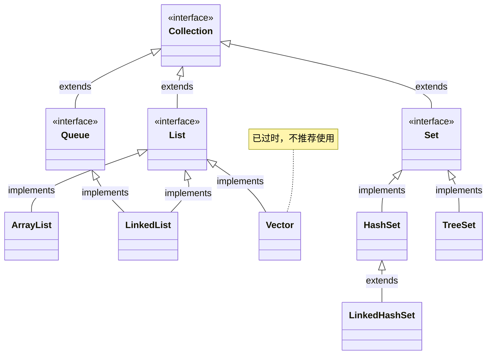

> [!NOTE]
>
> * List 系列集合的特点：添加的元素是有序、可重复、有索引。
>   * `有序`，即：存取元素的顺序一致。
>   * `重复`，即：集合中的元素可以重复。
>   * `有索引`，即：提供获取索引的方法（可以使用普通的 for 循环遍历，也可以通过索引来获取元素）。
> * Set 系列集合的特点：添加的元素是无序、不重复、无索引。
>   * `无序`，即：存取元素的顺序不一致。
>   * `不重复`，即：集合中的元素不能重复（可以利用这个特性去除重复元素）。
>   * `无索引`，即：没有提供获取索引的方法（不能使用普通的 for 循环遍历，也不能通过索引来获取元素）。

## 1.2 Set 系列集合的实现类

* Set 系列集合的类继承体系，如下所示：

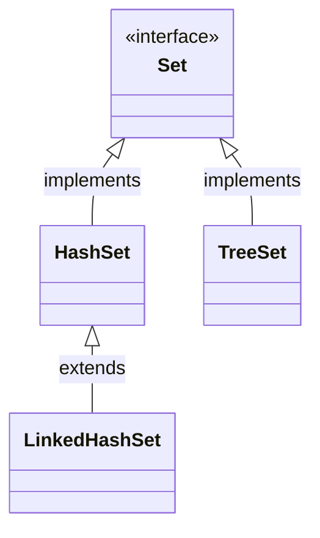

* Set 系列集合的实现类的特点：
  * ① HashSet：无序、不重复、无索引。
  * ② LinkedHashSet：`有序`、不重复、无索引。
  * ③ TreeSet：`可排序`、不重复、无索引。

## 1.3 常用 API

* 由于`Set`接口继承`Collection`接口，`Set`系列集合的`API`和`Collection`接口保持一致。

| Set 接口常用 API 功能描述 | API 方法签名                                                 |
| ------------------------- | ------------------------------------------------------------ |
| 添加元素                  | `boolean add(E e);`<br>`boolean addAll(Collection<? extends E> c);` |
| 删除元素                  | `boolean remove(Object o);`<br/>`boolean removeAll(Collection<?> c);`<br/>`default boolean removeIf(Predicate<? super E> filter) {}` |
| 清空集合                  | `void clear();`                                              |
| 判断                      | `boolean isEmpty();`<br/>`boolean contains(Object o);`<br/>`boolean containsAll(Collection<?> c);` |
| 获取集合中元素的个数      | `int size();`                                                |
| 交集                      | `boolean retainAll(Collection<?> c);`                        |
| 转数组                    | `Object[] toArray();`<br/>`<T> T[] toArray(T[] a);`<br/>`default <T> T[] toArray(IntFunction<T[]> generator) {}` |
| 遍历方式                  | `迭代器遍历`<br>`增强 for 遍历`<br/>`Lambda 表达式遍历`      |

> [!NOTE]
>
> * ① 当我们向 Set 系列集合添加元素的时候，如果要添加的元素在集合中不存在，方法返回 true ，表示添加成功。
> * ② 如果要添加的元素在集合中已经存在，方法返回 false，表示添加失败，因为 Set 系列集合是不允许元素重复的。
> * ③  在实际开发中，我们通常不会关心`add()`方法或`addAll()`方法的返回值。


* 示例：迭代器遍历

::: code-group

```java [Test.java]
package com.github.collection3;

import java.util.HashSet;
import java.util.Iterator;
import java.util.Set;

public class Test {
    public static void main(String[] args) {
        // 创建一个 Set 集合对象
        Set<Integer> set = new HashSet<>();
        // 向集合中添加元素
        set.add(1);
        set.add(2);
        set.add(3);
        set.add(1);
        // 遍历集合
        Iterator<Integer> it = set.iterator(); // [!code highlight:5]
        while (it.hasNext()) {
            int num = it.next();
            System.out.println(num);
        }
    }
}
```

```txt [cmd 控制台]
1
2
3
```

:::


* 示例：增强 for 遍历

::: code-group

```java [Test.java]
package com.github.collection3;

import java.util.HashSet;
import java.util.Set;

public class Test {
    public static void main(String[] args) {
        // 创建一个 Set 集合对象
        Set<Integer> set = new HashSet<>();
        // 向集合中添加元素
        set.add(1);
        set.add(2);
        set.add(3);
        set.add(1);
        // 遍历集合
        for (int num : set) { // [!code highlight:3]
            System.out.println(num);
        }
    }
}
```

```txt [cmd 控制台]
1
2
3
```

:::


* 示例：Lambda 表达式遍历

::: code-group

```java [Test.java]
package com.github.collection3;

import java.util.HashSet;
import java.util.Set;

public class Test {
    public static void main(String[] args) {
        // 创建一个 Set 集合对象
        Set<Integer> set = new HashSet<>();
        // 向集合中添加元素
        set.add(1);
        set.add(2);
        set.add(3);
        set.add(1);
        // 遍历集合
        set.forEach(System.out::println); // [!code highlight]
    }
}
```

```txt [cmd 控制台]
1
2
3
```

:::


# 第二章：HashSet 和 LinkedHashSet（⭐）

## 2.1 HashSet

### 2.1.1 概述

* HashSet 是 Set 接口的典型实现，大多数时候使用 Set 集合的时候都使用这个实现类。 

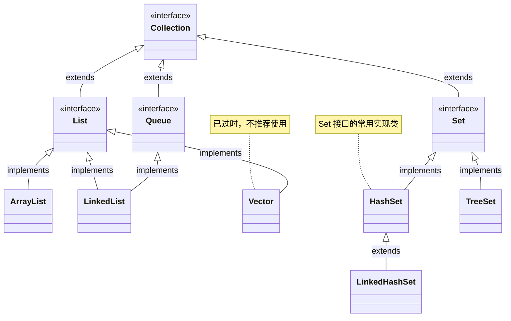


* HashSet 底层原理：
  * ① HashSet 集合底层采取的是`哈希表`来存储数据的。
  * ② 哈希表是一种对于增删改查的性能都非常好的数据结构。

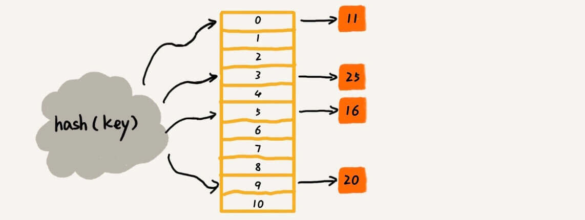

* 哈希表的组成：
  * ① JDK8 之前：`数组+链表`。
  * ② JDK8 之后：`数组+链表+红黑树`。

### 2.1.2 哈希值

#### 2.1.2.1 概述

* 在`哈希表`中有一个非常重要的值叫做`哈希值`，其是哈希表中的灵魂所在。

> [!NOTE]
>
> * ① `哈希值`是数据（对象）的`整数`表现形式！！！
> * ② 在 Java 中，集合存储的数据（元素）都是对象（引用数据类型）。

* 哈希表的底层就是数组，如下所示：


* 当我们要添加一个数据，它不是从 0 索引开始依次往后进行存储的，而是通过公式计算出该数据（对象）在数组中索引：

> [!NOTE]
>
> 计算数据（对象）在数组中存储位置（索引）的公式：int index = (数组长度 -1) & 哈希值。


* 既然是根据下面的公式，计算出数据（对象）在数组中的索引：

```txt
int index = (数组长度 -1) & 哈希值
```

> [!NOTE]
>
> * ① 我们需要将`数据（对象）`变为整数（哈希值），这样上面的等式才能成立！！！

* 在 Java 中，`哈希值`是通过`hashCode()`方法计算出来的 int 类型的数据。而 Java 中的顶级父类 Object 类就有该方法的具体实现，如下所示：

```java
package java.lang;

public class Object {
    
    // 计算对象的 hashCode，返回值是 int 类型
 	public native int hashCode(); // [!code highlight]
    
    ...
}    
```

> [!NOTE]
>
> * ① 默认情况下，hashCode() 方法返回的是对象的地址值。
> * ② 在实际开发中，我们经常需要重写 hashCode() 方法，利用对象内部的属性来计算哈希值。

#### 2.1.2.2 特点

* ① 如果没有重写 hashCode() 方法，不同的对象计算出来的`哈希值`是不同的。

::: code-group

```java [Student.java]
package com.github.collection3;

public class Student {
    private Integer id;
    private String name;
    private Integer age;

    public Student(Integer id, String name, Integer age) {
        this.id = id;
        this.name = name;
        this.age = age;
    }

    public Integer getId() {
        return id;
    }

    public void setId(Integer id) {
        this.id = id;
    }

    public String getName() {
        return name;
    }

    public void setName(String name) {
        this.name = name;
    }

    public Integer getAge() {
        return age;
    }

    public void setAge(Integer age) {
        this.age = age;
    }

    @Override
    public String toString() {
        return "Student{" +
                "id=" + id +
                ", name='" + name + '\'' +
                ", age=" + age +
                '}';
    }
}
```

```java [Test.java]
package com.github.collection3;

public class Test {
    public static void main(String[] args) {
        Student s1 = new Student(1, "张三", 18);
        Student s2 = new Student(1, "张三", 18);

        System.out.println(s1.hashCode()); // 990368553
        System.out.println(s2.hashCode()); // 1096979270
        System.out.println(s1.hashCode() == s2.hashCode()); // false
    }
}
```

:::

* ② 如果已经重写 hashCode() 方法，不同的对象，只要属性值相同，计算出来的`哈希值`就应该是一样的。

::: code-group

```java [Student.java]
package com.github.collection3;

import java.util.Objects;

public class Student {
    private Integer id;
    private String name;
    private Integer age;

    public Student(Integer id, String name, Integer age) {
        this.id = id;
        this.name = name;
        this.age = age;
    }

    public Integer getId() {
        return id;
    }

    public void setId(Integer id) {
        this.id = id;
    }

    public String getName() {
        return name;
    }

    public void setName(String name) {
        this.name = name;
    }

    public Integer getAge() {
        return age;
    }

    public void setAge(Integer age) {
        this.age = age;
    }

    @Override
    public boolean equals(Object o) { // [!code highlight:7]
        if (o == null || getClass() != o.getClass()) return false;
        Student student = (Student) o;
        return Objects.equals(getId(), student.getId())
                && Objects.equals(getName(), student.getName())
                && Objects.equals(getAge(), student.getAge());
    }

    @Override
    public int hashCode() { // [!code highlight:3]
        return Objects.hash(getId(), getName(), getAge());
    }

    @Override
    public String toString() {
        return "Student{" +
                "id=" + id +
                ", name='" + name + '\'' +
                ", age=" + age +
                '}';
    }
}
```

```java [Test.java]
package com.github.collection3;

public class Test {
    public static void main(String[] args) {
        Student s1 = new Student(1, "张三", 18);
        Student s2 = new Student(1, "张三", 18);

        System.out.println(s1.hashCode()); // 24052329
        System.out.println(s2.hashCode()); // 24052329
        System.out.println(s1.hashCode() == s2.hashCode()); // true
    }
}
```

:::

* ③ 在小概率情况下，不同属性值或者不同地址值计算出来的哈希值可能一样（哈希碰撞）。

> [!NOTE]
>
> * ① 在 Java 中，int 的取值范围是`[-2³¹,2³¹ - 1]`，即：`-21亿 ~ +21亿`。
> * ② 如果我在 Java 中创建 50 亿个对象，那么至少有 8 亿对象的哈希值是一样的，即：`50-(21-(-21))=8`亿。
> * ③ 哈希碰撞有可能发生，但是几率不高！！！

```java
package com.github.collection3;

public class Test {
    public static void main(String[] args) {
        // String 在 Java 中也是对象
        // "abc" 和 "acD" 虽然是不同的对象，但是它们的哈希值是相同的
        System.out.println("abc".hashCode()); // 96354
        System.out.println("acD".hashCode()); // 96354
        System.out.println("abc".hashCode() == "acD".hashCode()); // true
    }
}
```

### 2.1.3 底层原理

* ① 当我们创建一个 HashSet 集合对象的时候，如下所示：

```java
Set<String> set = new HashSet<>();
```

* 其背后会创建一个默认长度`16`，默认加载因子`0.75`的数组，数组名是`table`，如下所示：


* ② 当我们向 HashSet 集合中添加元素的时候，

```java
set.add("abc");
```

* 其背后会根据`元素`的`哈希值`和`数组的长度`，计算出`元素`在数组中要存储的`位置`（索引）：

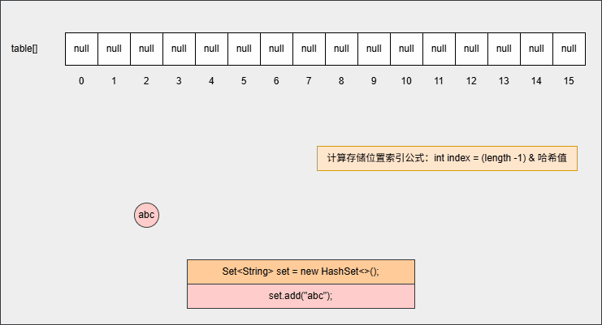

* ③ 为什么计算索引的公式是 `int index = (length -1) & 哈希值`？

```txt
假设数组的长度是 16，那么 length - 1 = 15，其二进制是 0000 0000 0000 1111 
如果对象的哈希值是 123456，其二进制就是 0011 0000 0011 1001 

   0000 0000 0000 1111
&  0011 0000 0011 1001
---------------------
   0000 0000 0000 1001

而 0000 0000 0000 1001 对应的十进制是 9 ，正好在 0 - 15 之间，即：数组的索引范围
任意数据的二进制和 0000 0000 0000 1111 与的结果，都是保留低 4 位，恰好在数组索引范围 
```

* ④ 判断当前位置是否为 null ，如果是 null 直接存入。


* ⑤ 此时，继续添加元素，如下所示：

```java
set.add("bcd");
```

* 其背后会重复 ②、③ 、④ 步骤，如下所示：

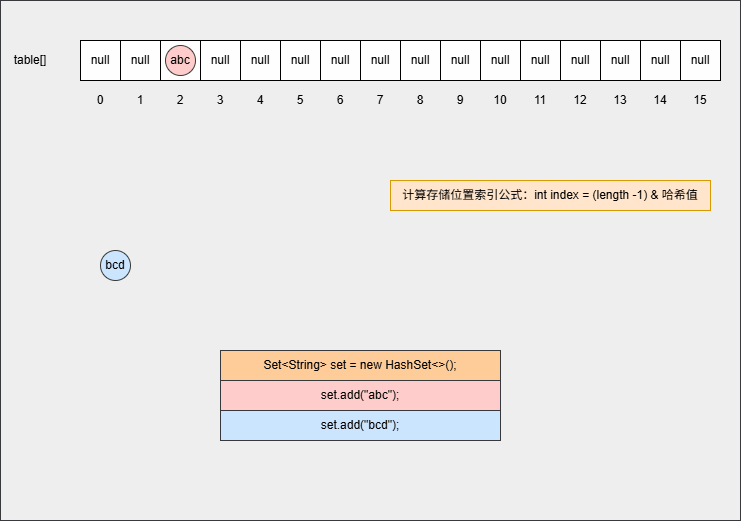

* ⑥ 此时，继续添加元素，如下所示：

```java
set.add("bcd");
set.add("acD");
```

* 其背后会重复 ②、③ 步骤，但是如果位置不是 null ，则表明该位置有元素，就需要调用 equals() 方法比较属性值。

> [!NOTE]
>
> * ① equals() 方法的结果：如果一样，直接丢弃。如果不一样，就存入到数组中，形成链表。
> * ② 为什么还需要调用 equals() 方法来判断？因为有小概率情况会出现哈希碰撞，即：两个不同的对象其哈希值是相同的，如：`"abc"` 和 `"aCD"`，在这种情况下，就需要调用 equals() 方法比较其内部属性值。

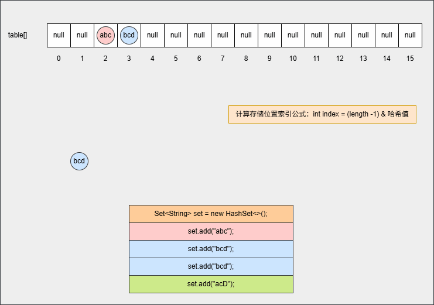

* ⑦ 如果位置不为 null，并且调用 equals() 方法比较属性值，其结果是 false ，JDK 各个版本的操作是不一样的：

> [!NOTE]
>
> * ① 调用 equals() 方法比较属性值，其结果是 false，表示要添加的元素和指定位置上的元素不一样。
> * ② JDK8 之前：新元素添加到数组中，老元素挂在新元素的下面。


* ⑧ 如果位置不为 null，并且调用 equals() 方法比较属性值，其结果是 false ，JDK 各个版本的操作是不一样的：

> [!NOTE]
>
> * ① 调用 equals() 方法比较属性值，其结果是 false，表示要添加的元素和指定位置上的元素不一样。
> * ② JDK8 之后：新元素直接挂到老元素下面。


* ⑨ 此时，继续添加元素，如下所示：

```java
set.add("bCc");
set.add("bDD");
set.add("abc");
```

* 其背后会重复 ②、③ 步骤，但是如果位置不是 null ，则表明该位置有元素，就需要调用 equals() 方法比较属性值。

> [!NOTE]
>
> * ① equals() 方法的结果：如果一样，直接丢弃。如果不一样，就存入到数组中，形成链表。
> * ② 为什么还需要调用 equals() 方法来判断？因为有小概率情况会出现哈希碰撞，即：两个不同的对象其哈希值是相同的，如：`"abc"` 和 `"aCD"`，在这种情况下，就需要调用 equals() 方法比较其内部属性值。


* ⑩ 此时，继续添加元素，如下所示：

```java
set.add("???");
...
set.add("???");
```

* 当数组中的元素的个数增加到 `16 * 0.75 = 12` ，此时数组会扩容为原来的 2 倍，如下所示：

> [!NOTE]
>
> 新数组的长度就是 16 * 2 = 32 。

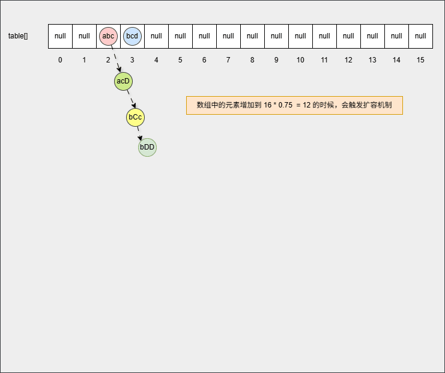

* ⑪ 但是，如果链表长度 > 8 并且数组长度 >= 64 时，链表就会自动转成红黑树，以便提高查找的效率。

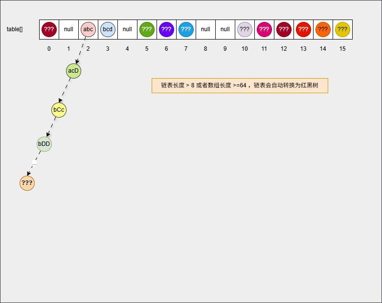

> [!NOTE]
>
> 总结：
>
> * ① 创建一个默认长度是 16，默认加载因子是 0.75 的数组，数组名是 table 。
> * ② 根据元素的`哈希值`和数组的`长度`计算出要存入的位置。
> * ③ 判断当前位置是否为 null，如果是 null ，直接存入。
> * ④ 判断当前位置是否为 null，如果不是 null，则表示当前位置有元素，就需要调用 equals 方法比较属性值。
> * ⑤ 如果一样，则不存；如果不一样，就需要存入数组，形成链表。
>   * JDK8 之前，新元素存入到数组中，老元素挂在新元素下面。
>   * JDK8 之后，新元素直接挂在老元素下面。
> * ⑥ 在 JDK8 之后，如果链表长度 > 8 并且数组长度 >= 64 时，链表就会自动转成红黑树，以便提高查找的效率。
> * ⑦ 如果集合中存储的是自定义对象，必须重写 hashCode() 方法和 equals() 方法。
> * ⑧ 如果 String、Integer 等 JDK 内置的引用数据类型，是不需要重写 hashCode() 方法和 equals() 方法（JDK 开发人员已经帮助我们重写好了）。

### 2.1.4 灵魂拷问

#### 2.1.4.1 问题一

* 【问】HashSet 为什么存和取的顺序不一样？
* 【答】HashSet 存储数据的时候，是根据元素的 hashCode() 方法和 equals() 方法进行存储的，即：添加元素是不一定从数组 0 索引开始存储。

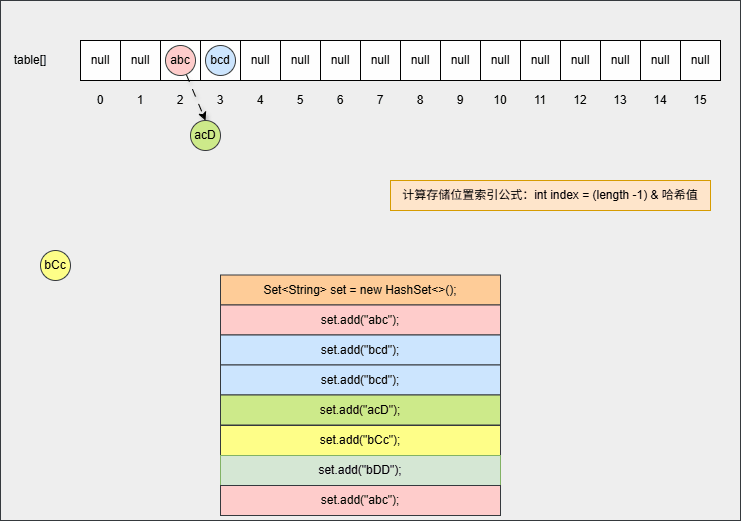

* 【答】HashSet 遍历数据的时候，是从数组的 0 索引开始的，一条链表一条链表地去遍历。

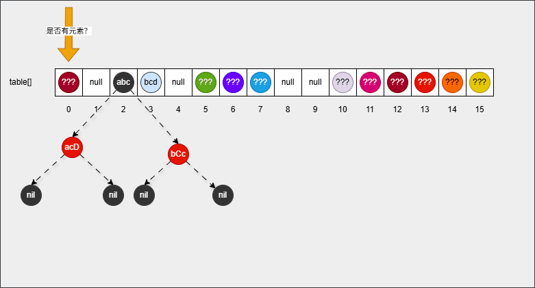

#### 2.1.4.2 问题二

* 【问】HashSet 为什么没有索引？
* 【答】HashSet 的底层是`数组+链表+红黑树`，那么如何定义谁是 0 索引，谁又是 1 索引？数组确实是有索引的；但是，数组相同索引处可能有多个元素（链表或红黑树），这么多元素共用一个索引，也不太合适，所以 HashSet 就取消了索引机制。


#### 2.1.4.3 问题三

* 【问】HashSet 是利用什么机制来保证数据唯一，即：不重复？
* 【答】HashSet 是根据根据元素的 hashCode() 方法（获取哈希值，确定在数组中的存储位置）和 equals() 方法（判断对象内部的属性值是否相同）来保证数据唯一。

### 2.1.5 综合练习

* 需求：创建一个存储学生对象的集合，并存储多个学生对象，并在控制台遍历该集合。

> [!NOTE]
>
> 如果学生对象的成员变量都相同，我们才认为是同一个学生。


* 示例：

::: code-group

```java [Student.java]
package com.github.collection3;

import java.util.Objects;

public class Student {
    private Integer id;
    private String name;
    private Integer age;

    public Student(Integer id, String name, Integer age) {
        this.id = id;
        this.name = name;
        this.age = age;
    }

    public Integer getId() {
        return id;
    }

    public void setId(Integer id) {
        this.id = id;
    }

    public String getName() {
        return name;
    }

    public void setName(String name) {
        this.name = name;
    }

    public Integer getAge() {
        return age;
    }

    public void setAge(Integer age) {
        this.age = age;
    }

    @Override
    public boolean equals(Object o) {
        if (o == null || getClass() != o.getClass()) return false;
        Student student = (Student) o;
        return Objects.equals(getId(), student.getId())
                && Objects.equals(getName(), student.getName())
                && Objects.equals(getAge(), student.getAge());
    }

    @Override
    public int hashCode() {
        return Objects.hash(getId(), getName(), getAge());
    }

    @Override
    public String toString() {
        return "Student{" +
                "id=" + id +
                ", name='" + name + '\'' +
                ", age=" + age +
                '}';
    }
}
```

```java [Test.java]
package com.github.collection3;

import java.util.HashSet;
import java.util.Set;

public class Test {
    public static void main(String[] args) {
        Set<Student> set = new HashSet<>();

        set.add(new Student(1, "张三", 18));
        set.add(new Student(1, "张三", 18));
        set.add(new Student(2, "李四", 19));
        set.add(new Student(2, "李四", 20));
        set.add(new Student(3, "王五", 19));
        set.add(new Student(4, "赵六", 25));
        set.add(new Student(5, "田七", 19));
        set.add(new Student(6, "王八", 32));

        set.forEach(System.out::println);

    }

}
```

```txt [cmd 控制台]
Student{id=5, name='田七', age=19}
Student{id=1, name='张三', age=18}
Student{id=2, name='李四', age=20}
Student{id=3, name='王五', age=19}
Student{id=2, name='李四', age=19}
Student{id=4, name='赵六', age=25}
Student{id=6, name='王八', age=32}
```

:::

## 2.2 LinkedHashSet

### 2.2.1 概述

* LinkedHashSet 是 HashSet 的子类，其常用 API 和 HashSet 相同。

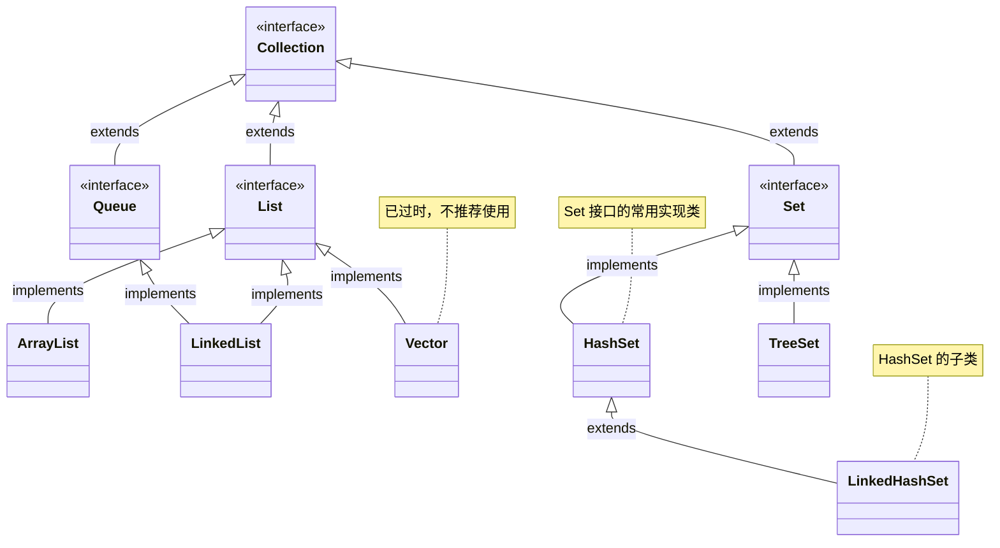

* LinkedHashSet  的特点是：
  * `有序`，即：存取元素的顺序一致。
  * `不重复`，即：集合中的元素不能重复（可以利用这个特性去除重复元素）。
  * `无索引`，即：没有提供获取索引的方法（不能使用普通的 for 循环遍历，也不能通过索引来获取元素）。
* LinkedHashSet 底层原理：采取的是`哈希表`来存储数据的，但是每个元素又额外维护了一个双链表的机制来记录存储的顺序。

> [!NOTE]
>
> * ① HashSet 是无序的，因为底层就只是哈希表，而哈希表决定了其存储元素和取出元素的顺序不一致。
> * ② LinkedHashSet 是有序的，虽然底层也是采取哈希表，但是哈希表中的每个元素额外维护了一个双链表，用来记录存储的顺序。

### 2.2.2 底层原理

* ① 当我们创建一个 HashSet 集合对象的时候，如下所示：

```java
Set<String> set = new LinkedHashSet<>();
```

* 其背后会创建一个默认长度`16`，默认加载因子`0.75`的数组，数组名是`table`，如下所示：


* ② 当我们向集合中添加元素的时候：

```java
set.add("???");

...
    
set.add("???");    
```

* 其底层原理和 HashSet 相同，都会调用 hashCode() 方法计算出哈希值，然后通过`int index = (length -1) & 哈希值`公式，计算出在数组中的存入位置，并判断指定位置是否有数据：如果没有，直接插入；如果有， 再调用 equals() 方法判断对象的内部属性值是否相同，如果相同，则不存入，如果不相同，则形成链表结构等，如下所示：

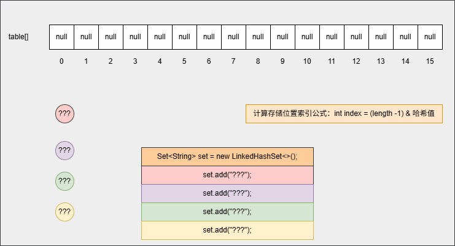

* 但是，在向集合中添加第一个元素的时候，其底层还会维护一个双向链表，如下所示：

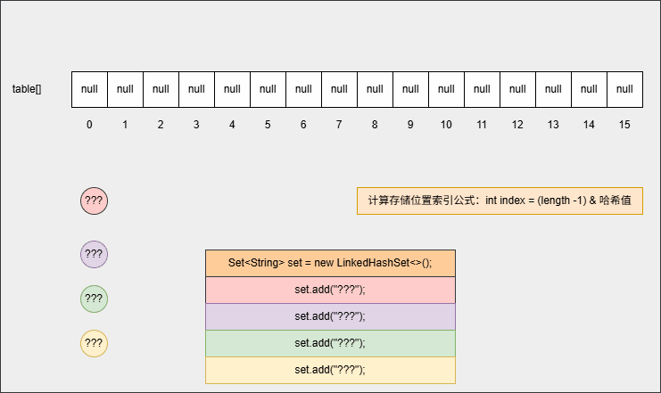

* ③ 当我们打印集合或者遍历集合中元素的时候，如下所示：

```java
set.forEach(System.out::println);
```

* 如果是 HashSet ，需要从数组 0 索引处依次向后遍历；但是，对于 LinkedHashset 只需要遍历双向链表，即：从头节点开始依次遍历到尾节点，如下所示：

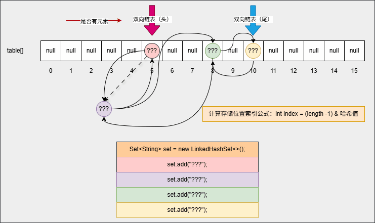

### 2.2.3 综合练习

* 需求：创建一个存储学生对象的集合，并存储多个学生对象，并在控制台遍历该集合。

> [!NOTE]
>
> 如果学生对象的成员变量都相同，我们才认为是同一个学生。


* 示例：

::: code-group

```java [Student.java]
package com.github.collection3;

import java.util.Objects;

public class Student {
    private Integer id;
    private String name;
    private Integer age;

    public Student(Integer id, String name, Integer age) {
        this.id = id;
        this.name = name;
        this.age = age;
    }

    public Integer getId() {
        return id;
    }

    public void setId(Integer id) {
        this.id = id;
    }

    public String getName() {
        return name;
    }

    public void setName(String name) {
        this.name = name;
    }

    public Integer getAge() {
        return age;
    }

    public void setAge(Integer age) {
        this.age = age;
    }

    @Override
    public boolean equals(Object o) {
        if (o == null || getClass() != o.getClass()) return false;
        Student student = (Student) o;
        return Objects.equals(getId(), student.getId())
                && Objects.equals(getName(), student.getName())
                && Objects.equals(getAge(), student.getAge());
    }

    @Override
    public int hashCode() {
        return Objects.hash(getId(), getName(), getAge());
    }

    @Override
    public String toString() {
        return "Student{" +
                "id=" + id +
                ", name='" + name + '\'' +
                ", age=" + age +
                '}';
    }
}
```

```java [Test.java]
package com.github.collection3;

import java.util.LinkedHashSet;
import java.util.Set;

public class Test {
    public static void main(String[] args) {
        Set<Student> set = new LinkedHashSet<>();

        set.add(new Student(1, "张三", 18));
        set.add(new Student(1, "张三", 18));
        set.add(new Student(2, "李四", 19));
        set.add(new Student(2, "李四", 20));
        set.add(new Student(3, "王五", 19));
        set.add(new Student(4, "赵六", 25));
        set.add(new Student(5, "田七", 19));
        set.add(new Student(6, "王八", 32));

        set.forEach(System.out::println);

    }

}
```

```txt [cmd 控制台]
Student{id=1, name='张三', age=18}
Student{id=2, name='李四', age=19}
Student{id=2, name='李四', age=20}
Student{id=3, name='王五', age=19}
Student{id=4, name='赵六', age=25}
Student{id=5, name='田七', age=19}
Student{id=6, name='王八', age=32}
```

:::

## 2.3 总结

* HashSet 和 LinkedHashSet 的特点和原理，如下所示：

| Set 集合      | 特点                 | 底层原理                                     |
| ------------- | -------------------- | -------------------------------------------- |
| HashSet       | 无序、不重复、无索引 | 底层基于哈希表                               |
| LinkedHashSet | 有序、不重复、无索引 | 底层基于哈希表；但是，使用双链表记录添加顺序 |

* 在实际开发中，如果需要数据去重，如何选择？
  * ① 默认情况下，选择 HashSet。
  * ② 如果需要数据去重并且存取有序，就需要采用 LinkedHashSet 。


# 第三章：TreeSet（⭐）

## 3.1 概述

* TreeSet 和 HashSet 一样，都是 Set 接口实现类，其常用 API 和 HashSet 相同。

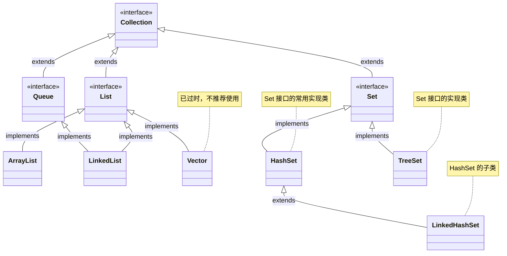

* TreeSet 的特点：
  * `可排序`，即：可以给元素进行排序。
  * `不重复`，即：集合中的元素不能重复（可以利用这个特性去除重复元素）。
  * `无索引`，即：没有提供获取索引的方法（不能使用普通的 for 循环遍历，也不能通过索引来获取元素）。

> [!NOTE]
>
> `可排序`指的是可以给 TreeSet  集合中的元素进行排序，默认是由小到大排序的。

* TreeSet 集合底层是基于`红黑树`的数据结构实现排序的，增删改查性能都很好。

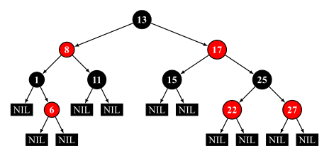

## 3.2 TreeSet 集合默认的排序规则

* ① 对于数值类型，如：Integer、Double 等，默认是按照从小到大的顺序进行排序的。


* ② 对于字符和字符串类型，如：Character、String 等，默认是按照字符在 ASCII 码表（Unicode 值）中的数字升序进行排序的。

> [!NOTE]
>
> * ① 如果是多个字符组成的字符串，和字符串的长度无关，会从首字母开始依次向后比。
> * ② "qwer"、"cd"、"aaa"、"ab"、"aba" -->  "aaa"、"ab"、"aba"、"cd"、"qwer"。


## 3.3 TreeSet 的排序方式

* 方式一：自然排序（默认排序）：JavaBean 需要需要实现 Comparable 接口，并重写 compareTo() 抽象方法。

> [!NOTE]
>
> * ① TreeSet 会调用集合元素的 compareTo(Object obj) 方法来比较元素之间的大小关系，然后将集合元素按升序（默认情况）排列。
> * ② 对于 JDK 很多内置的 JavaBean，JDK 的开发人员已经帮我们实现了 Comparable 接口，并重写 compareTo() 抽象方法。
>
> | 类型                           | 描述                                               |
> | ------------------------------ | -------------------------------------------------- |
> | BigDecimal、Integer、Double 等 | 按照它们对应的数值大小进行比较。                   |
> | Character                      | 按照字符的 Unicode 值进行比较。                    |
> | Boolean                        | true 对应的包装类实例大于 false 对应的包装类实例。 |
> | String                         | 按照字符串中字符的 Unicode 值进行比较。            |
> | Date 等                        | 后面的时间、日期比前面的时间、日期大。             |
>
> * ③ 对于自定义引用数据类型（JavaBean ），必须手动实现 Comparable 接口，并重写 compareTo() 抽象方法。

* 方式二：自定义排序：创建 TreeSet 对象的时候，传递比较器 Comparator 指定规则。

> [!NOTE]
>
> TreeSet 会调用 Comparator 的 compare(T o1,T o2) 方法来进行元素之间的大小比较。

> [!IMPORTANT]
>
> 默认使用第一种，如果第一种不能满足当前要求，就使用第二种！！！

## 3.4 底层红黑树演示

* ① 假设对应的代码，如下所示：

::: code-group

```java [Student.java]
package com.github.collection3;

import java.util.Objects;

public class Student implements Comparable<Student> { // [!code highlight]
    private Integer id;
    private String name;
    private Integer age;

    public Student(Integer id, String name, Integer age) {
        this.id = id;
        this.name = name;
        this.age = age;
    }

    public Integer getId() {
        return id;
    }

    public void setId(Integer id) {
        this.id = id;
    }

    public String getName() {
        return name;
    }

    public void setName(String name) {
        this.name = name;
    }

    public Integer getAge() {
        return age;
    }

    public void setAge(Integer age) {
        this.age = age;
    }

    @Override
    public boolean equals(Object o) {
        if (o == null || getClass() != o.getClass()) return false;
        Student student = (Student) o;
        return Objects.equals(getId(), student.getId())
                && Objects.equals(getName(), student.getName())
                && Objects.equals(getAge(), student.getAge());
    }

    @Override
    public int hashCode() {
        return Objects.hash(getId(), getName(), getAge());
    }

    @Override
    public String toString() {
        return "Student{" +
                "id=" + id +
                ", name='" + name + '\'' +
                ", age=" + age +
                '}';
    }

    /**
    * 负数：认为要添加的元素是小的，存左边
    * 正数：认为要添加的元素是大的，存右边
    * 0 ：认为要添加的元素已经存在，舍弃（也可以认为覆盖）
    */
    @Override
    public int compareTo(Student o) { // [!code highlight:5]
        // this 是当前要添加的元素
        // o 是已经在红黑树中存在的元素
        return this.age - o.age;               
    }
}
```

```java [Test.java]
package com.github.collection3;

import java.util.Set;
import java.util.TreeSet;

public class Test {
    public static void main(String[] args) {
        // 创建三个学生对象
        Student s1 = new Student(1, "zhangsan", 23);
        Student s2 = new Student(2, "lisi", 24);
        Student s3 = new Student(3, "wangwu", 25);
        // 创建 Set 集合
        Set<Student> set = new TreeSet<>();
		// 向集合中添加元素
        set.add(s3);
        set.add(s2);
        set.add(s1);
		// 遍历集合
        set.forEach(System.out::println);
    }
}
```

```txt [cmd 控制台]
Student{id=1, name='zhangsan', age=23}
Student{id=2, name='lisi', age=24}
Student{id=3, name='wangwu', age=25}
```

:::

* ② 当我们创建三个学生对象的时候，并创建集合对象的时候：

```java
// 创建三个学生对象
Student s1 = new Student(1, "zhangsan", 23);
Student s2 = new Student(2, "lisi", 24);
Student s3 = new Student(3, "wangwu", 25);
// 创建 Set 集合
Set<Student> set = new TreeSet<>();
```

* 其内存动态图，如下所示：


* ③ 当我们向集合对象中添加第一个元素，如下所示：

```java
set.add(s3);
```

* 其内存动态图，如下所示：

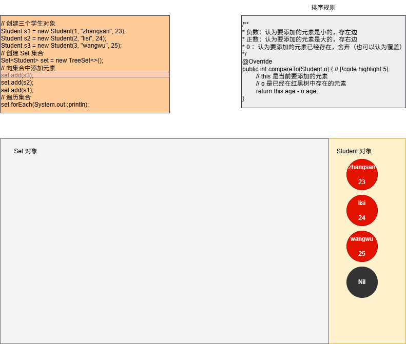

* ④ 当我们向集合中添加第二个元素，如下所示：

```java
set.add(s2);
```

* 其内存动态图，如下所示：

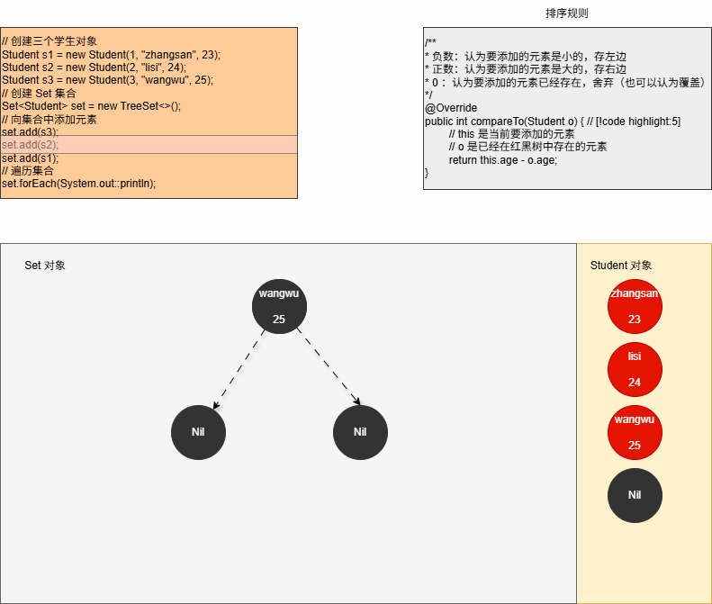

* ⑤ 当我们向集合中添加第三个元素，如下所示：

```java
set.add(s1);
```

* 其内存动态图，如下所示：

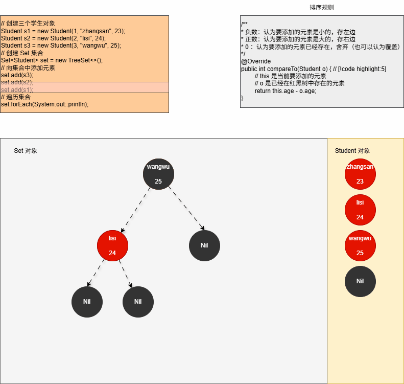

* ⑥ 修改 Student.java 中的 compareTo() 方法，增加日志来证明上述的推断，如下所示：

::: code-group

```java [Student.java]
package com.github.collection3;

import java.util.Objects;

public class Student implements Comparable<Student> {
    private Integer id;
    private String name;
    private Integer age;

    public Student(Integer id, String name, Integer age) {
        this.id = id;
        this.name = name;
        this.age = age;
    }

    public Integer getId() {
        return id;
    }

    public void setId(Integer id) {
        this.id = id;
    }

    public String getName() {
        return name;
    }

    public void setName(String name) {
        this.name = name;
    }

    public Integer getAge() {
        return age;
    }

    public void setAge(Integer age) {
        this.age = age;
    }

    @Override
    public boolean equals(Object o) {
        if (o == null || getClass() != o.getClass()) return false;
        Student student = (Student) o;
        return Objects.equals(getId(), student.getId())
                && Objects.equals(getName(), student.getName())
                && Objects.equals(getAge(), student.getAge());
    }

    @Override
    public int hashCode() {
        return Objects.hash(getId(), getName(), getAge());
    }

    @Override
    public String toString() {
        return "Student{" +
                "id=" + id +
                ", name='" + name + '\'' +
                ", age=" + age +
                '}';
    }

    @Override
    public int compareTo(Student o) { // [!code highlight:7]
        System.out.println("---------------- 开始 ---------------  ");
        System.out.println("this：" + this);
        System.out.println("o：" + o);
        System.out.println("---------------- 结束 ---------------  ");
        return this.age - o.age;
    }
}

```

```java [Test.java]
package com.github.collection3;

import java.util.Set;
import java.util.TreeSet;

public class Test {
    public static void main(String[] args) {
        // 创建三个学生对象
        Student s1 = new Student(1, "zhangsan", 23);
        Student s2 = new Student(2, "lisi", 24);
        Student s3 = new Student(3, "wangwu", 25);
        // 创建 Set 集合
        Set<Student> set = new TreeSet<>();
        // 向集合中添加元素
        set.add(s3);
        set.add(s2);
        set.add(s1);
        // 遍历集合
        set.forEach(System.out::println);
    }
}
```

```txt [cmd 控制台]
---------------- 开始 ---------------  
this：Student{id=3, name='wangwu', age=25}
o：Student{id=3, name='wangwu', age=25}
---------------- 结束 ---------------  
---------------- 开始 ---------------  
this：Student{id=2, name='lisi', age=24}
o：Student{id=3, name='wangwu', age=25}
---------------- 结束 ---------------  
---------------- 开始 ---------------  
this：Student{id=1, name='zhangsan', age=23}
o：Student{id=3, name='wangwu', age=25}
---------------- 结束 ---------------  
---------------- 开始 ---------------  
this：Student{id=1, name='zhangsan', age=23}
o：Student{id=2, name='lisi', age=24}
---------------- 结束 ---------------  
Student{id=1, name='zhangsan', age=23}
Student{id=2, name='lisi', age=24}
Student{id=3, name='wangwu', age=25}
```

:::

## 3.5 综合练习

* 需求：向 TreeSet 中存储整数并进行排序。


* 示例：

::: code-group

```java [Test.java]
package com.github.collection3;

import java.util.Set;
import java.util.TreeSet;

public class Test {
    public static void main(String[] args) {
        Set<Integer> set = new TreeSet<>();

        set.add(5);
        set.add(4);
        set.add(1);
        set.add(3);
        set.add(2);

        set.forEach(System.out::println);

    }
}
```

```txt [cmd 控制台]
1
2
3
4
5
```

:::

## 3.6 综合练习

* 需求：创建 TreeSet 集合对象，并添加 3 个学生对象。

> [!NOTE]
>
> * ① 学生对象属性：id、姓名、年龄。
> * ② 要求按照学生的年龄进行排序，如果年龄相同则按照姓名进行排序。


* 示例：

::: code-group

```java [Student.java]
package com.github.collection3;

import java.util.Objects;

public class Student implements Comparable<Student> { // [!code highlight]
    private Integer id;
    private String name;
    private Integer age;

    public Student(Integer id, String name, Integer age) {
        this.id = id;
        this.name = name;
        this.age = age;
    }

    public Integer getId() {
        return id;
    }

    public void setId(Integer id) {
        this.id = id;
    }

    public String getName() {
        return name;
    }

    public void setName(String name) {
        this.name = name;
    }

    public Integer getAge() {
        return age;
    }

    public void setAge(Integer age) {
        this.age = age;
    }

    @Override
    public boolean equals(Object o) {
        if (o == null || getClass() != o.getClass()) return false;
        Student student = (Student) o;
        return Objects.equals(getId(), student.getId())
                && Objects.equals(getName(), student.getName())
                && Objects.equals(getAge(), student.getAge());
    }

    @Override
    public int hashCode() {
        return Objects.hash(getId(), getName(), getAge());
    }

    @Override
    public String toString() {
        return "Student{" +
                "id=" + id +
                ", name='" + name + '\'' +
                ", age=" + age +
                '}';
    }

    @Override
    public int compareTo(Student o) { // [!code highlight:5]
        return !this.age.equals(o.age)
                ? Integer.compare(this.age, o.age)
                : this.name.compareTo(o.name);
    }
}
```

```java [Test.java]
package com.github.collection3;

import java.util.Set;
import java.util.TreeSet;

public class Test {
    public static void main(String[] args) {
        Set<Student> set = new TreeSet<>();

        Student s1 = new Student(1, "张三", 18);
        Student s2 = new Student(2, "李四", 36);
        Student s3 = new Student(3, "王五", 35);
        Student s4 = new Student(4, "赵六", 24);
        Student s5 = new Student(5, "田七", 40);
        Student s6 = new Student(6, "王八", 18);

        set.add(s1);
        set.add(s2);
        set.add(s3);
        set.add(s4);
        set.add(s5);
        set.add(s6);

        set.forEach(System.out::println);
    }
}
```

```txt [cmd 控制台]
Student{id=1, name='张三', age=18}
Student{id=6, name='王八', age=18}
Student{id=4, name='赵六', age=24}
Student{id=3, name='王五', age=35}
Student{id=2, name='李四', age=36}
Student{id=5, name='田七', age=40}
```

:::

## 3.7 综合练习

* 需求：创建 TreeSet 对象，向其中存入 `"c"`、`"ab"`、`"df"`、`"qwer"`。

> [!NOTE]
>
> * ① 默认按照长度进行排序，如果一样长，则按照首字母进行排序。
> * ② 最好采用自定义排序，因为我们没有办法去修改 String 内部的源码，进行去修改其内部的规则。


* 示例：

::: code-group

```java [Test.java]
package com.github.collection3;

import java.util.Set;
import java.util.TreeSet;

public class Test {
    public static void main(String[] args) {
        Set<String> set = new TreeSet<>((s1, s2) -> {

            int result = s1.length() - s2.length();

            if (result == 0) {
                return s1.compareTo(s2);
            }
            return result;
        });

        set.add("c");
        set.add("ab");
        set.add("df");
        set.add("qwer");

        set.forEach(System.out::println);

    }
}
```

```txt [cmd 控制台]
c
ab
df
qwer
```

:::

## 3.8 总结

* TreeSet 的特点和原理，如下所示：

| Set 集合 | 特点                   | 底层原理                               |
| -------- | ---------------------- | -------------------------------------- |
| TreeSet  | 可排序、不重复、无索引 | 底层基于红黑树进行排序，增删改查性能好 |

* TreeSet 的自定义排序有几种方式？
  * ① 默认排序（自然排序）：Javabean 类实现 Comparable 接口，指定比较规则。
  * ② 自定义排序：创建集合时，自定义 Comparator 比较器对象，指定比较规则。

* 方法返回值的特点：
  * ① 负数：表示当前要添加的元素是小的，存左边。
  * ② 正数：表示当前要添加的元素是大的，存右边。
  * ③ 0：表示当期要添加的元素已经存在，舍弃（覆盖）。

## 3.9 实际开发，如何选择？

* ① 如果想要集合中的元素是`可重复`的？

> [!NOTE]
>
> 请使用 ArrayList 集合，基于数组（使用最多）。

* ② 如果想要集合中的元素是`可重复`的，而且`增删操作明显多于查询`？

> [!NOTE]
>
> 请使用 LinkedList 集合，基于链表。

* ③ 如果想要对集合元素`去重`（去除重复元素，保证集合中元素唯一）？

> [!NOTE]
>
> 请使用 HashSet  集合，基于哈希表（使用最多）。

* ④ 如果想要对集合元素`去重`，并且保证`存取顺序`？

> [!NOTE]
>
> 请使用 LinkedHashSet 集合，基于哈希表和双向链表，效率低于 HashSet。

* ⑤ 如果相对集合中的元素进行`排序`：

> [!NOTE]
>
> * ① 请使用 TreeSet 集合，基于红黑树。
> * ② 也可以使用 List 集合实现排序（jdk8+ 新增 `sort(Comparator<? super E> c)` 方法）。


# 第四章：源码分析

## 4.1 概述

* HashSet、LinkedHashSet 以及 TreeSet 的底层实现都是 Map 集合。
* 如果想要研究源码，还需要先学习 Map 集合。

## 4.2 HashSet 

* 我们可以查看 HashSet  的源码，如下所示：

```java
public class HashSet<E>
    extends AbstractSet<E>
    implements Set<E>, Cloneable, java.io.Serializable {
    
    private transient HashMap<E,Object> map;
    
    public HashSet() {
        map = new HashMap<>(); // [!code highlight]
    }
    
    public HashSet(Collection<? extends E> c) {
        map = new HashMap<>(Math.max((int) (c.size()/.75f) + 1, 16)); // [!code highlight]
        addAll(c);
    }
    
    ...
    
}    
```

## 4.3 LinkedHashSet 

*  我们可以查看 LinkedHashSet 的源码，如下所示：

::: code-group

```java [LinkedHashSet.java]
public class LinkedHashSet<E>
    extends HashSet<E>
    implements Set<E>, Cloneable, java.io.Serializable {
    
    public LinkedHashSet() {
        super(16, .75f, true); // [!code highlight]
    }
    
    ...
    
}    
```

```java [HashSet.java]
public class HashSet<E>
    extends AbstractSet<E>
    implements Set<E>, Cloneable, java.io.Serializable {  
	
    HashSet(int initialCapacity, float loadFactor, boolean dummy) { // [!code highlight]
        map = new LinkedHashMap<>(initialCapacity, loadFactor);
    }
    
    ...
    
}     
```

:::

## 4.4 TreeSet

* 我们可以查看 TreeSet 的源码，如下所示：

```java
public class TreeSet<E> extends AbstractSet<E>
    implements NavigableSet<E>, Cloneable, java.io.Serializable {

	public TreeSet() {
        this(new TreeMap<>()); // [!code highlight]
    }
    
    ...
}
```

