# 第一章：集合体系结构

## 1.1 概述

- 集合是 Java 提供的一种容器，可以用来存储多个数据。集合的本质是用来`存储对象`。

> [!NOTE]
>
> - 【问】：集合只能用来存储对象？为什么也可以存储基本数据类型？
> - 【答】：在 JDK5 的时候，新增了一个特性：自动装箱和自动拆箱。换言之，向集合中添加基本类型数据的时候，会先转换为对应的包装类型对象，然后在进行存储。

- 集合和数组都是容器，它们之间的区别？
  - ① 数组的长度是固定的，集合的长度是可变的。
  - ② 数组中可以存储基本类型的数据，也可以存储对象；但是，集合中只能存储对象。

## 1.2 集合体系结构

* Java 中的集合主要分为两大类：

  * ① Collection（单列集合）：在添加数据的时候，一次只能添加一个数据，如：`脉动`、`康师傅`、`奥利奥`等。

  * ② Map（双列集合）：在添加数据的时候，一次需要添加一对数据，如：`脉动:5元`、`康师傅:12元`、`奥利奥:8.5元`。


* Java 集合框架图，如下所示：

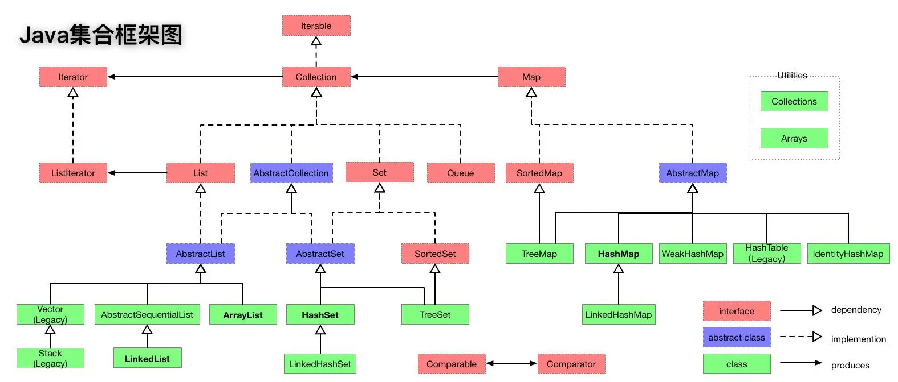

## 1.3 专业名词

* 在 Map 集合中一次可以添加一对数据，如：商品名称 (name) 和商品价格 (price) ：


* 在 Map 集合中，对于商品名称(name），我们称为`key`(键）；对于商品价格(price），我们称为`value`(值）：

> [!NOTE]
>
> * ① 在 Map 中，`key`(键)是`不能`重复的，`value`(值)是`可以`重复的。
> * ② 在 Map 中，`key`(键)和`value`(值)是`一一对应`的关系，即：每个`key`(键)只能对应自己的`value`(值)。


* 在 Map 中，每对`key`(键)和`value`(值)，我们称为`键值对`(键值对对象，Entry 对象)：


## 1.4 双列集合的特点

* ① 双列集合中一次需要存储一对数据，分别是键和值。
* ② 双列集合中，键是不能重复的，而值是可以重复的。
* ③ 双列集合中，键和值是一一对应的关系，每个键只能找到自己对应的值。
* ④ `键+值`这个整体，我们称之为`键值对`（键值对对象，Entry 对象）。


# 第二章：Map 接口（⭐）

## 2.1 概述

* 在双列集合中，Map 接口是它们的顶层接口，如下所示：

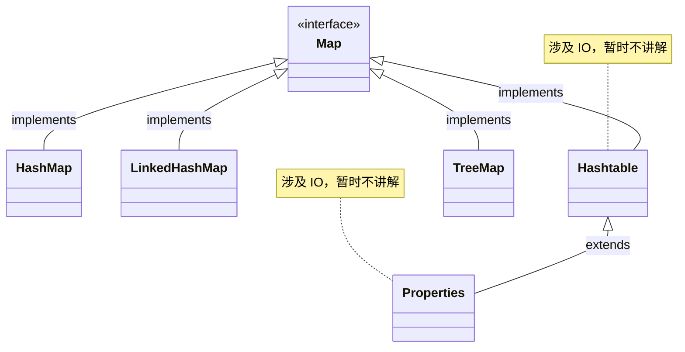

* Map 系列集合的实现类的特点：
  * ① HashMap：无序、不重复、无索引。
  * ② LinkedHashMap：`有序`、不重复、无索引。
  * ③ TreeMap：`可排序`、不重复、无索引。

## 2.2 常用 API

### 2.3.1 概述

* 在 Map 接口中定义了所有双列集合中共性的方法，即：我们只需要学习 Map 接口中的 API 。

### 2.3.2 添加元素

* 将指定的 key-value 添加到 Map 集合中：

```java
V put(K key, V value);
```

> [!NOTE]
>
> * ① 如果 Map 中不存在指定的 key，则直接将 key-value 添加到 Map 中，并返回 null。
> * ② 如果 Map 中已经存在指定的 key，会将原先的 key-value 覆盖掉（新值替换旧值），并将原先的 value 返回。
> * ③ 在实际开发中，我们通常并不会关心 put() 方法的返回值。

* 将另一个 Map 集合的元素全部添加到该 Map 集合中：

```java
void putAll(Map<? extends K, ? extends V> m);
```


* 示例：

::: code-group

```java [Test.java]
package com.github.collection3;

import java.util.HashMap;
import java.util.Map;

public class Test {
    public static void main(String[] args) {
        // 创建 Map 集合
        Map<String, String> map = new HashMap<>();
        // 添加元素
        map.put("郭靖", "黄蓉");
        map.put("杨过", "小龙女");
        map.put("杨康", "穆念慈");
        map.put("张无忌", "赵敏");
        map.put("萧峰", "阿朱");
        map.put("令狐冲", "任盈盈");
        map.put("袁承志", "夏青青");
        // 打印 Map 集合中的元素
        map.forEach((key, value) -> System.out.println(key + ":" + value));
    }
}
```

```txt [cmd 控制台]
令狐冲:任盈盈
杨过:小龙女
杨康:穆念慈
袁承志:夏青青
萧峰:阿朱
郭靖:黄蓉
张无忌:赵敏
```

:::


* 示例：

::: code-group

```java [Test.java]
package com.github.collection3;

import java.util.HashMap;
import java.util.Map;

public class Test {
    public static void main(String[] args) {
        // 创建 Map 集合
        Map<String, String> map = new HashMap<>();
        // 添加元素
        map.put("郭靖", "黄蓉");
        map.put("杨过", "小龙女");
        map.put("杨康", "穆念慈");
        map.put("张无忌", "赵敏");
        map.put("萧峰", "阿朱");
        map.put("令狐冲", "任盈盈");
        map.put("袁承志", "夏青青");
        // 创建另一个 Map 集合
        Map<String, String> map2 = new HashMap<>();
        map2.put("陈家洛", "香香公主");
        map2.put("余鱼同", "霍青桐");
        map2.put("袁冠", "冯杏儿");
        map2.put("李文秀", "苏普");
        map2.put("狄云", "水笙");
        // 添加 map2 的元素
        map.putAll(map2);
        // 打印集合中的元素
        map.forEach((key, value) -> System.out.println(key + ":" + value));
    }
}
```

```txt [cmd 控制台]
令狐冲:任盈盈
杨过:小龙女
陈家洛:香香公主
杨康:穆念慈
狄云:水笙
余鱼同:霍青桐
袁承志:夏青青
李文秀:苏普
萧峰:阿朱
郭靖:黄蓉
张无忌:赵敏
袁冠:冯杏儿
```

:::

### 2.3.3 集合中元素的个数

* 返回集合中元素的个数：

```java
int size();
```


* 示例：

```java
package com.github.collection3;

import java.util.HashMap;
import java.util.Map;

public class Test {
    public static void main(String[] args) {
        // 创建 Map 集合
        Map<String, String> map = new HashMap<>();
        // 添加元素
        map.put("郭靖", "黄蓉");
        map.put("杨过", "小龙女");
        map.put("杨康", "穆念慈");
        map.put("张无忌", "赵敏");
        map.put("萧峰", "阿朱");
        map.put("令狐冲", "任盈盈");
        map.put("袁承志", "夏青青");
        // 创建另一个 Map 集合
        Map<String, String> map2 = new HashMap<>();
        map2.put("陈家洛", "香香公主");
        map2.put("余鱼同", "霍青桐");
        map2.put("袁冠", "冯杏儿");
        map2.put("李文秀", "苏普");
        map2.put("狄云", "水笙");
        // 打印集合中的元素的个数
        System.out.println(map.size()); // 7
        System.out.println(map2.size()); // 5
    }
}
```

### 2.3.4 清空集合

* 将集合中的元素清空：

```java
void clear();
```


* 示例：

```java
package com.github.collection3;

import java.util.HashMap;
import java.util.Map;

public class Test {
    public static void main(String[] args) {
        Map<String, String> map = new HashMap<>();

        map.put("郭靖", "黄蓉");
        map.put("杨过", "小龙女");
        map.put("杨康", "穆念慈");
        map.put("张无忌", "赵敏");
        map.put("萧峰", "阿朱");
        map.put("令狐冲", "任盈盈");
        map.put("袁承志", "夏青青");

        System.out.println(map.size()); // 7

        // 清空集合
        map.clear();

        System.out.println(map.size()); // 0

    }
}
```

### 2.3.4 判断方法

* 判断当前集合是否为空（没有元素）：

```java
boolean isEmpty();
```

* 判断当前集合是否包含指定的 key ：

```java
boolean containsKey(Object key);
```

* 判断当前集合是否包含指定的 value ：

```java
boolean containsValue(Object value);
```


* 示例：

```java
package com.github.collection3;

import java.util.HashMap;
import java.util.Map;

public class Test {
    public static void main(String[] args) {
        Map<String, String> map = new HashMap<>();

        map.put("郭靖", "黄蓉");
        map.put("杨过", "小龙女");
        map.put("杨康", "穆念慈");
        map.put("张无忌", "赵敏");
        map.put("萧峰", "阿朱");
        map.put("令狐冲", "任盈盈");
        map.put("袁承志", "夏青青");

        System.out.println(map.isEmpty()); // false

        map.clear();

        System.out.println(map.isEmpty()); // true

    }
}
```


* 示例：

```java
package com.github.collection3;

import java.util.HashMap;
import java.util.Map;

public class Test {
    public static void main(String[] args) {
        Map<String, String> map = new HashMap<>();

        map.put("郭靖", "黄蓉");
        map.put("杨过", "小龙女");
        map.put("杨康", "穆念慈");
        map.put("张无忌", "赵敏");
        map.put("萧峰", "阿朱");
        map.put("令狐冲", "任盈盈");
        map.put("袁承志", "夏青青");

        System.out.println(map.containsKey("郭靖")); // true
        System.out.println(map.containsKey("黄蓉")); // false
    }
}
```


* 示例：

```java
package com.github.collection3;

import java.util.HashMap;
import java.util.Map;

public class Test {
    public static void main(String[] args) {
        Map<String, String> map = new HashMap<>();

        map.put("郭靖", "黄蓉");
        map.put("杨过", "小龙女");
        map.put("杨康", "穆念慈");
        map.put("张无忌", "赵敏");
        map.put("萧峰", "阿朱");
        map.put("令狐冲", "任盈盈");
        map.put("袁承志", "夏青青");

        System.out.println(map.containsValue("郭靖")); // false
        System.out.println(map.containsValue("黄蓉")); // true
    }
}
```

### 2.3.5 根据 key 获取 value

* 根据指定的 key 获取对应的 value ，如果不存在 key，则返回 null ：

```java
V get(Object key);
```

* 根据指定的 key 获取对应的 value ，如果不存在 key，则返回默认值：

```java
default V getOrDefault(Object key, V defaultValue);
```


* 示例：

```java
package com.github.collection3;

import java.util.HashMap;
import java.util.Map;

public class Test {
    public static void main(String[] args) {
        Map<String, String> map = new HashMap<>();

        map.put("郭靖", "黄蓉");
        map.put("杨过", "小龙女");
        map.put("杨康", "穆念慈");
        map.put("张无忌", "赵敏");
        map.put("萧峰", "阿朱");
        map.put("令狐冲", "任盈盈");
        // map.put("袁承志", "夏青青");

        System.out.println(map.get("郭靖")); // 黄蓉
        System.out.println(map.get("袁承志")); // null
    }
}
```


* 示例：

```java
package com.github.collection3;

import java.util.HashMap;
import java.util.Map;

public class Test {
    public static void main(String[] args) {
        Map<String, String> map = new HashMap<>();

        map.put("郭靖", "黄蓉");
        map.put("杨过", "小龙女");
        map.put("杨康", "穆念慈");
        map.put("张无忌", "赵敏");
        map.put("萧峰", "阿朱");
        map.put("令狐冲", "任盈盈");
        // map.put("袁承志", "夏青青");

        System.out.println(map.getOrDefault("郭靖", "")); // 黄蓉
        System.out.println(map.getOrDefault("袁承志", "夏青青")); // 夏青青
    }
}
```

### 2.3.6 删除元素

* 根据指定的 key 删除 Map 中的元素（key-value）：

```java
V remove(Object key);
```


* 示例：

```java
package com.github.collection3;

import java.util.HashMap;
import java.util.Map;

public class Test {
    public static void main(String[] args) {
        Map<String, String> map = new HashMap<>();

        map.put("郭靖", "黄蓉");
        map.put("杨过", "小龙女");
        map.put("杨康", "穆念慈");
        map.put("张无忌", "赵敏");
        map.put("萧峰", "阿朱");
        map.put("令狐冲", "任盈盈");
        map.put("袁承志", "夏青青");

        System.out.println(map.size()); // 7

        map.remove("袁承志");

        System.out.println(map.size()); // 6
    }
}
```

## 2.3 遍历方式

### 2.3.1 键找值

* 返回所有的键：

```java
Set<K> keySet();
```

* 根据键找值：

```java
V get(Object key);
```

```java
/**
* 如果键存在，则返回对应的 value
* 如果键不存在，则返回指定的默认值
*/
default V getOrDefault(Object key, V defaultValue) {
    ...
}
```

> [!NOTE]
>
> ::: details 点我查看 核心思路
>
> 
>
> :::


* 示例：

::: code-group

```java [Test.java]
package com.github.collection3;

import java.util.HashMap;
import java.util.Map;
import java.util.Set;

public class Test {
    public static void main(String[] args) {
        Map<String, String> map = new HashMap<>();

        map.put("郭靖", "黄蓉");
        map.put("杨过", "小龙女");
        map.put("杨康", "穆念慈");
        map.put("张无忌", "赵敏");
        map.put("萧峰", "阿朱");
        map.put("令狐冲", "任盈盈");
        map.put("袁承志", "夏青青");
        
        // 遍历：键 --> 值
        Set<String> set = map.keySet();
        for (String key : set) {
            System.out.println(key + "--->" + map.get(key));
        }
    }
}
```

```txt [cmd 控制台]
令狐冲--->任盈盈
杨过--->小龙女
杨康--->穆念慈
袁承志--->夏青青
萧峰--->阿朱
郭靖--->黄蓉
张无忌--->赵敏
```

:::

### 2.3.2 键值对

* 返回所有的 Entry 对象：

```java
Set<Map.Entry<K, V>> entrySet();
```

> [!NOTE]
>
> ::: details 点我查看 核心思路
>
> 
>
> :::


* 示例：

::: code-group

```java [Test.java]
package com.github.collection3;

import java.util.HashMap;
import java.util.Map;
import java.util.Set;

public class Test {
    public static void main(String[] args) {
        Map<String, String> map = new HashMap<>();

        map.put("郭靖", "黄蓉");
        map.put("杨过", "小龙女");
        map.put("杨康", "穆念慈");
        map.put("张无忌", "赵敏");
        map.put("萧峰", "阿朱");
        map.put("令狐冲", "任盈盈");
        map.put("袁承志", "夏青青");

        // 遍历：键值对
        Set<Map.Entry<String, String>> entries = map.entrySet();
        for (Map.Entry<String, String> entry : entries) {
            System.out.println(entry.getKey() + "-->" + entry.getValue());
        }
    }
}
```

```txt [cmd 控制台]
令狐冲--->任盈盈
杨过--->小龙女
杨康--->穆念慈
袁承志--->夏青青
萧峰--->阿朱
郭靖--->黄蓉
张无忌--->赵敏
```

:::

### 2.3.3 Lambda 表达式

* 直接通过 Lambda 表达式遍历：

```java
default void forEach(BiConsumer<? super K, ? super V> action) { // [!code focus]
    Objects.requireNonNull(action);
    for (Map.Entry<K, V> entry : entrySet()) {
        K k;
        V v;
        try {
            k = entry.getKey();
            v = entry.getValue();
        } catch (IllegalStateException ise) {
            // this usually means the entry is no longer in the map.
            throw new ConcurrentModificationException(ise);
        }
        action.accept(k, v);
    }
} // [!code focus]
```


* 示例：

::: code-group

```java [Test.java]
package com.github.collection3;

import java.util.HashMap;
import java.util.Map;

public class Test {
    public static void main(String[] args) {
        // 创建 Map 集合
        Map<String, String> map = new HashMap<>();
        // 添加元素
        map.put("郭靖", "黄蓉");
        map.put("杨过", "小龙女");
        map.put("杨康", "穆念慈");
        map.put("张无忌", "赵敏");
        map.put("萧峰", "阿朱");
        map.put("令狐冲", "任盈盈");
        map.put("袁承志", "夏青青");
        // 打印 Map 集合中的元素
        map.forEach((key, value) -> System.out.println(key + ":" + value));
    }
}
```

```txt [cmd 控制台]
令狐冲:任盈盈
杨过:小龙女
杨康:穆念慈
袁承志:夏青青
萧峰:阿朱
郭靖:黄蓉
张无忌:赵敏
```

:::

## 2.4 综合练习

* 需求：某个班级 80 个学生，现在需要组成秋游活动，班长提供了四个景点依次是（A、B、C、D），每个学生只能选择一个景点，请统计出最终哪个景点想去的人数最多。

> [!NOTE]
>
> 思路：创建 Map 集合，`每个景点`和`投票次数`组成一个元素，如下所示：
>
> 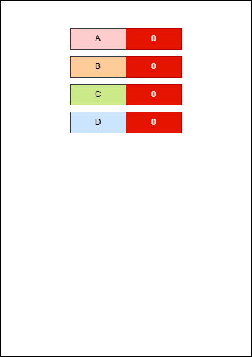


* 示例：

::: code-group

```java [Test.java]
package com.github.collection3;

import java.security.SecureRandom;
import java.util.*;

public class Test {
    public static void main(String[] args) {
        /* 生成学生们的投票 */
        String[] arr = new String[]{"A", "B", "C", "D"};
        List<String> voteList = new ArrayList<>();
        Random random = new SecureRandom();
        for (int i = 0; i < 80; i++) {
            // 获取随机索引
            int index = random.nextInt(arr.length);
            // 获取投票
            String vote = arr[index];
            // 保存起来
            voteList.add(vote);
        }
        // 创建集合对象
        Map<String, Integer> map = new HashMap<>();
        // 添加景点以及次数
        for (String str : arr) {
            map.put(str, 0); // [!code highlight]
        }
        // 遍历学生们的投票
        for (String vote : voteList) {
            // 获取投票景点
            Integer count = map.get(vote);
            // 计数器+1
            count++;
            // 保存到 Map 中
            map.put(vote, count);
        }

        // 打印每个景点的投票次数
        map.forEach((k, v) -> System.out.println(k + " : " + v));

        // 获取投票次数最多的景点
        String maxVote = Collections
                .max(map.entrySet(), Comparator.comparingInt(Map.Entry::getValue))
                .getKey();
        System.out.println("投票次数最多的景点：" + maxVote);
    }
}
```

```txt [cmd 控制台]
A : 19
B : 21
C : 24
D : 16
投票次数最多的景点：C
```

:::

## 2.5 综合练习

* 需求：某个班级 80 个学生，现在需要组成秋游活动，班长提供了四个景点依次是（A、B、C、D），每个学生只能选择一个景点，请统计出最终哪个景点想去的人数最多。

> [!NOTE]
>
> * ① 之前在遍历投票结果之前，就已经给每个景点设置了次数为 0 ，虽然可以实现效果；但是，如果某些景点，一个同学都没投票，我们依然需要在 Map 中给其添加，效率有点低。
> * ② 改进方案：遍历同学的投票结果，如果景点在 map 中不存在，则设置为 1 ；否则，就获取该景点的次数，自增，然后再覆盖。


* 示例：

::: code-group

```java [Test.java]
package com.github.collection3;

import java.util.*;

public class Test {
    public static void main(String[] args) {
        /* 生成学生们的投票 */
        String[] arr = new String[]{"A", "B", "C", "D"};
        List<String> voteList = new ArrayList<>();
        Random random = new Random();
        for (int i = 0; i < 80; i++) {
            // 获取随机索引
            int index = random.nextInt(arr.length);
            // 获取投票
            String vote = arr[index];
            // 保存起来
            voteList.add(vote);
        }
        // 创建集合对象
        Map<String, Integer> map = new HashMap<>();

        // 遍历学生们的投票
        for (String vote : voteList) { // [!code highlight:9]
            if (map.containsKey(vote)) { // 如果存在
                Integer count = map.get(vote);
                count++;
                map.put(vote, count);
            } else { // 如果不存在
                map.put(vote, 1);
            }
        }

        // 打印每个景点的投票次数
        map.forEach((k, v) -> System.out.println(k + " : " + v));

        // 获取投票次数最多的景点
        String maxVote = Collections
                .max(map.entrySet(), Comparator.comparingInt(Map.Entry::getValue))
                .getKey();
        System.out.println("投票次数最多的景点：" + maxVote);
    }
}
```

```txt [cmd 控制台]
A : 24
B : 17
C : 18
D : 21
投票次数最多的景点：A
```

:::

## 2.6 综合练习

* 需求：某个班级 80 个学生，现在需要组成秋游活动，班长提供了四个景点依次是（A、B、C、D），每个学生只能选择一个景点，请统计出最终哪个景点想去的人数最多。

> [!NOTE]
>
> * ① 之前的方案：遍历同学的投票结果，如果景点在 map 中不存在，则设置为 1 ；否则，就获取该景点的次数，自增，然后再覆盖。
> * ② 改进方案：遍历同学的投票结果，如果景点在 map 中不存在，返回 0，并设置为 1 ；否则，就获取该景点的次数，自增，然后再覆盖。


* 示例：

::: code-group

```java [Test.java]
package com.github.collection3;

import java.util.*;

public class Test {
    public static void main(String[] args) {
        /* 生成学生们的投票 */
        String[] arr = new String[]{"A", "B", "C", "D"};
        List<String> voteList = new ArrayList<>();
        Random random = new Random();
        for (int i = 0; i < 80; i++) {
            // 获取随机索引
            int index = random.nextInt(arr.length);
            // 获取投票
            String vote = arr[index];
            // 保存起来
            voteList.add(vote);
        }
        // 创建集合对象
        Map<String, Integer> map = new HashMap<>();

        // 遍历学生们的投票
        for (String vote : voteList) { // [!code highlight:3]
            map.put(vote, map.getOrDefault(vote, 0) + 1);
        }

        // 打印每个景点的投票次数
        map.forEach((k, v) -> System.out.println(k + " : " + v));

        // 获取投票次数最多的景点
        String maxVote = Collections
                .max(map.entrySet(), Comparator.comparingInt(Map.Entry::getValue))
                .getKey();
        System.out.println("投票次数最多的景点：" + maxVote);
    }
}
```

```txt [cmd 控制台]
A : 24
B : 17
C : 18
D : 21
投票次数最多的景点：A
```

:::

## 2.7 综合练习

* 需求：某个班级 80 个学生，现在需要组成秋游活动，班长提供了四个景点依次是（A、B、C、D），每个学生只能选择一个景点，请统计出最终哪个景点想去的人数最多。

> [!NOTE]
>
> * ① 之前的方案：遍历同学的投票结果，如果景点在 map 中不存在，返回 0，并设置为 1 ；否则，就获取该景点的次数，自增，然后再覆盖。
> * ② 改进方案：遍历同学的投票结果，如果景点在 map 中不存在，设置为 1 ；否则，就获取该景点的次数，自增，然后再覆盖。


* 示例：

::: code-group

```java [Test.java]
package com.github.collection3;

import java.util.*;

public class Test {
    public static void main(String[] args) {
        /* 生成学生们的投票 */
        String[] arr = new String[]{"A", "B", "C", "D"};
        List<String> voteList = new ArrayList<>();
        Random random = new Random();
        for (int i = 0; i < 80; i++) {
            // 获取随机索引
            int index = random.nextInt(arr.length);
            // 获取投票
            String vote = arr[index];
            // 保存起来
            voteList.add(vote);
        }
        // 创建集合对象
        Map<String, Integer> map = new HashMap<>();

        // 遍历学生们的投票
        for (String vote : voteList) { // [!code highlight:3]
            // 如果 Map 中没有该元素，则设置为 1
            // 如果 Map 中已经有了该元素，则在上一次的基础上累加
            map.merge(vote, 1, Integer::sum);
        }

        // 打印每个景点的投票次数
        map.forEach((k, v) -> System.out.println(k + " : " + v));

        // 获取投票次数最多的景点
        String maxVote = Collections
                .max(map.entrySet(), Comparator.comparingInt(Map.Entry::getValue))
                .getKey();
        System.out.println("投票次数最多的景点：" + maxVote);
    }
}
```

```txt [cmd 控制台]
A : 18
B : 25
C : 18
D : 19
投票次数最多的景点：B
```

:::


# 第三章：双列集合的特点

## 3.1 概述

* 在双列集合中，Map 接口是它们的顶层接口，如下所示：


* Map 系列集合的实现类的特点：
  * ① HashMap：无序、不重复、无索引。
  * ② LinkedHashMap：`有序`、不重复、无索引。
  * ③ TreeMap：`可排序`、不重复、无索引。

> [!NOTE]
>
> 在实际开发中，`HashMap`是 Map 体系中使用最多的集合实现！！！

## 3.2 HashMap

### 3.2.1 概述

* HashMap 是 Map 接口的一个实现类。
* 我们不需要额外学习 HashMap 中的特有方法，直接使用 Map 中的方法就可以了。
* HashMap 的特点是由`键`决定的：
  * `无序`：存和取的顺序有可能不一样。
  * `不重复`：HashMap 中的键是不能重复的。
  * `无索引`：不能通过索引获取集合中的元素。

* HashMap 的底层原理和 HashSet 的底层原理是一样的，都是`哈希表`结构。

> [!NOTE]
>
> * ① 在 JDK8 之前，HashMap 的底层是`数组+链表`。
> * ② 在 JDK8 之后，为了提高性能，增加了`红黑树`，即：HashMap 的底层是`数组+链表+红黑树`。

::: code-group

```java [HashSet.java]
public class HashSet<E>
    extends AbstractSet<E>
    implements Set<E>, Cloneable, java.io.Serializable {
 	
    public HashSet() {
        map = new HashMap<>(); // [!code highlight]
    }
    
    public HashSet(Collection<? extends E> c) {
        map = new HashMap<>(Math.max((int) (c.size()/.75f) + 1, 16)); // [!code highlight]
        addAll(c);
    }
    
    ...
}    
```

```java [HashMap.java]
public class HashMap<K,V> extends AbstractMap<K,V>
    implements Map<K,V>, Cloneable, Serializable {
    
    ...
        
}
```

:::

### 3.2.2 底层原理

* ① 当我们创建`Map`集合对象的时候，会设置默认加载因子为`0.75`：

> [!NOTE]
>
> 默认加载因子决定了底层数组的扩容机制！！！

```java
// 底层仅仅设置默认加载因子为 0.75，并没有创建数组
Map<String, String> map = new HashMap<>();
```

* 其内存动态图，如下所示：


* ② 当我们向集合中添加第一个元素时：

```java
map.put("???","???");  
```

* 其会在底层创建一个默认长度是`16`的数组，数组名是`table`：


* put 方法会在底层将`键值对`（键值对对象）封装为`Entry`对象：


* 然后利用`键`(key)来计算`哈希值`(hash)：

> [!CAUTION]
>
> 通过`键`(key)来计算`哈希值`(hash)，和`值`(value)没有任何关系！！！


* 并利用下面的公式，计算出在数组中的存储位置（索引）：

```txt
计算存储位置索引公式：int index = (length -1) & 哈希值
```


* 如果存储位置为`null`（存储位置没有元素），那么就将当前元素添加进去：

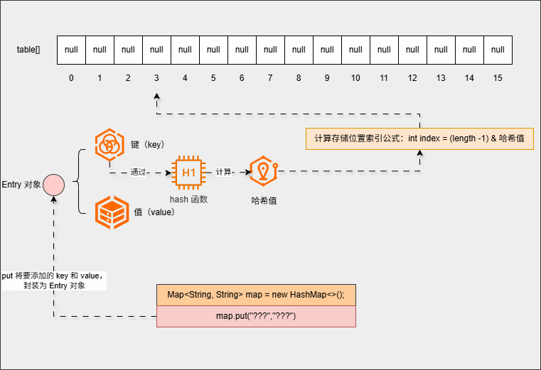

* ③ 继续添加元素：

```java
map.put("???","???");  
```

* 底层不会再创建数组，而是直接将`键值对`（键值对对象）封装为`Entry`对象：


* 然后利用`键`(key)来计算`哈希值`(hash)：

> [!CAUTION]
>
> 通过`键`(key)来计算`哈希值`(hash)，和`值`(value)没有任何关系！！！


* 并利用下面的公式，计算出在数组中的存储位置（索引）：

```txt
计算存储位置索引公式：int index = (length -1) & 哈希值
```


* 如果存储位置不为`null`（存储位置有元素），就需要调用`equals()`方法比较属性值：

> [!NOTE]
>
> equals() 比较的是`键`(key)的属性值，和`值`(value)没有任何关系！！！


* 如果相等，直接覆盖（新元素覆盖老元素）：

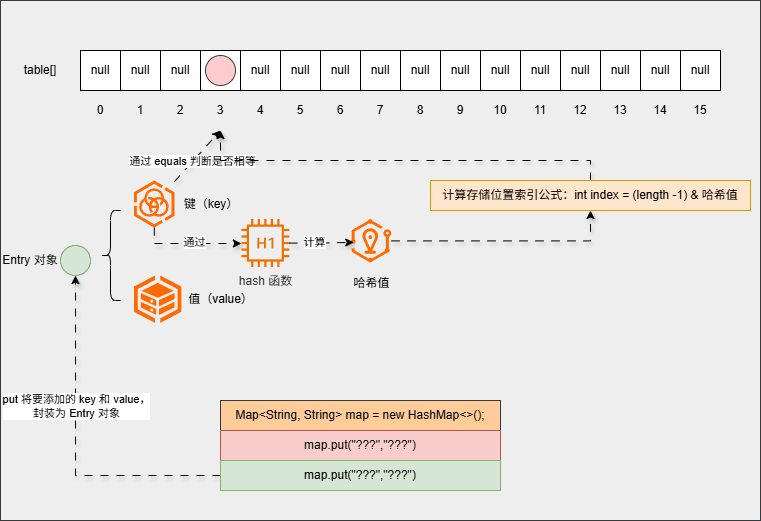

* 如果不相等，则形成链表（新元素挂在老元素的下面）：


* ④ 继续添加元素：

```java
map.put("???","???");  
...    
map.put("???","???");      
```

* 底层会重复之前的步骤：

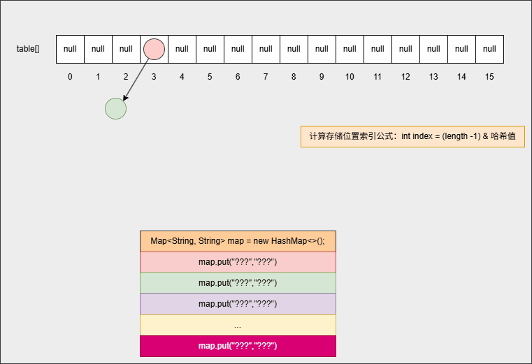

* ⑤ 为了提高查询性能，如果满足以下的情况，将自动转为红黑树：

```txt
链表长度 > 8 && 数组长度 >=64 ，链表将自动转为红黑树
```

* 其内存动态图，如下所示：

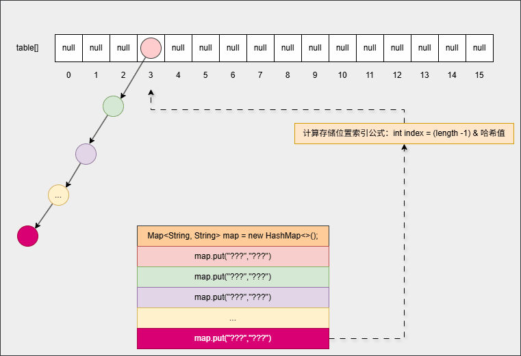

### 3.2.3 总结

* ① HashMap 的底层是`哈希表`结构。
* ② 依赖`hashCode()`方法和`equals()`方法来保证`键`(key)的唯一。
* ③ 如果`键`(key)是自定义对象，`需要`重写`hashCode()`方法和`equals()`方法。

> [!NOTE]
>
> * ① 如果`键`(key)是 JDK 内置的引用数据类型，`不需要`重写`hashCode()`方法和`equals()`方法。
> * ② 像`Integer`等 JDK 内置的引用数据类型，JDK 开发人员已经重写了`hashCode()`方法和`equals()`方法。

* ④ 如果`值`(value)是自定义对象，`不需要`重写`hashCode()`方法和`equals()`方法。

### 3.2.4 综合练习

* 需求：创建一个 HashMap 集合，键是学生对象（Student），值是籍贯（String）。

> [!NOTE]
>
> * ① 存储三个键值对元素，并遍历 Map 集合。
> * ② 如果 id、姓名、年龄一样，就认为是同一个学生。


* 示例：

::: code-group

```java [Student.java]
package com.github.collection3;

import java.util.Objects;

public class Student {
    private Integer id;
    private String name;
    private Integer age;

    public Student(Integer id, String name, Integer age) {
        this.id = id;
        this.name = name;
        this.age = age;
    }

    public Integer getId() {
        return id;
    }

    public void setId(Integer id) {
        this.id = id;
    }

    public String getName() {
        return name;
    }

    public void setName(String name) {
        this.name = name;
    }

    public Integer getAge() {
        return age;
    }

    public void setAge(Integer age) {
        this.age = age;
    }

    @Override
    public boolean equals(Object o) { // [!code highlight:7]
        if (o == null || getClass() != o.getClass()) return false;
        Student student = (Student) o;
        return Objects.equals(getId(), student.getId())
                && Objects.equals(getName(), student.getName())
                && Objects.equals(getAge(), student.getAge());
    }

    @Override
    public int hashCode() { // [!code highlight:3]
        return Objects.hash(getId(), getName(), getAge());
    }

    @Override
    public String toString() {
        return "{" +
                "id=" + id +
                ", name='" + name + '\'' +
                ", age=" + age +
                '}';
    }
}
```

```java [Test.java]
package com.github.collection3;

import java.util.HashMap;
import java.util.Map;

public class Test {
    public static void main(String[] args) {
        Student s1 = new Student(1, "张三", 18);
        Student s2 = new Student(1, "张三", 18);
        Student s3 = new Student(2, "李四", 18);
        Student s4 = new Student(2, "李四", 19);
        Student s5 = new Student(3, "王五", 25);
        Student s6 = new Student(4, "赵六", 35);
        Student s7 = new Student(5, "田七", 18);

        Map<Student, String> map = new HashMap<>();

        map.put(s1, "江苏");
        map.put(s2, "北京");
        map.put(s3, "上海");
        map.put(s4, "天津");
        map.put(s5, "重庆");
        map.put(s6, "西安");
        map.put(s7, "鹤岗");

        map.forEach((k, v) -> System.out.println(k + " --> " + v));
    }
}
```

```txt [cmd 控制台]
{id=5, name='田七', age=18} --> 鹤岗
{id=4, name='赵六', age=35} --> 西安
{id=1, name='张三', age=18} --> 北京
{id=2, name='李四', age=18} --> 上海
{id=2, name='李四', age=19} --> 天津
{id=3, name='王五', age=25} --> 重庆
```

:::

## 3.3 LinkedHashMap

### 3.3.1 概述

* LinkedHashMap 是 HashMap 的子类。
* 我们不需要额外学习 LinkedHashMap 中的特有方法，直接使用 Map 中的方法就可以了。
* LinkedHashMap 的特点是由`键`决定的：
  * `有序`：存和取的顺序一样。
  * `不重复`：HashMap 中的键是不能重复的。
  * `无索引`：不能通过索引获取集合中的元素。

* LinkedHashMap 的底层原理和 HashMap 的底层原理是一样的，都是`哈希表`结构。但是，每个键值对元素额外多了一个`双向链表`的机制记录存储的顺序。

### 3.3.2 底层原理

* ① 当我们创建`Map`集合对象的时候，会设置默认加载因子为`0.75` ：

> [!NOTE]
>
> 默认加载因子决定了底层数组的扩容机制！！！

```java
// 底层仅仅设置默认加载因子为 0.75，并没有创建数组
Map<String, String> map = new LinkedHashMap<>();
```

* 其内存动态图，如下所示：


* ② 当我们向集合中添加第一个元素时：

```java
map.put("???","???");
```

* 其会在底层创建一个默认长度是`16`的数组，数组名是`table`：


* put 方法会在底层将`键值对`（键值对对象）封装为`Entry`对象：


- 然后利用`键`(key)来计算`哈希值`(hash)：

> [!CAUTION]
>
> 通过`键`(key)来计算`哈希值`(hash)，和`值`(value)没有任何关系！！！


* 并利用下面的公式，计算出在数组中的存储位置（索引）：

```txt
计算存储位置索引公式：int index = (length -1) & 哈希值
```


* 如果存储位置为`null`（存储位置没有元素），那么就将当前元素添加进去：

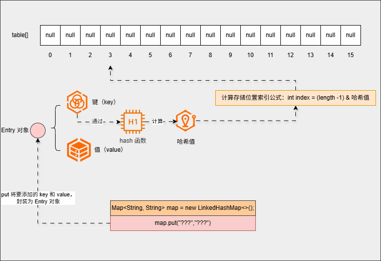

* 并且底层会维护一个双链链表结构，当前元素是双向链表的头节点：


- ③ 继续添加元素：

```java
map.put("???","???");
```

* 底层不会再创建数组，而是直接将`键值对`（键值对对象）封装为`Entry`对象：


* 然后利用`键`(key)来计算`哈希值`(hash)：

> [!CAUTION]
>
> 通过`键`(key)来计算`哈希值`(hash)，和`值`(value)没有任何关系！！！


* 并利用下面的公式，计算出在数组中的存储位置（索引）：

```txt
计算存储位置索引公式：int index = (length -1) & 哈希值
```


* 如果存储位置为`null`（存储位置没有元素），那么就将当前元素添加进去：

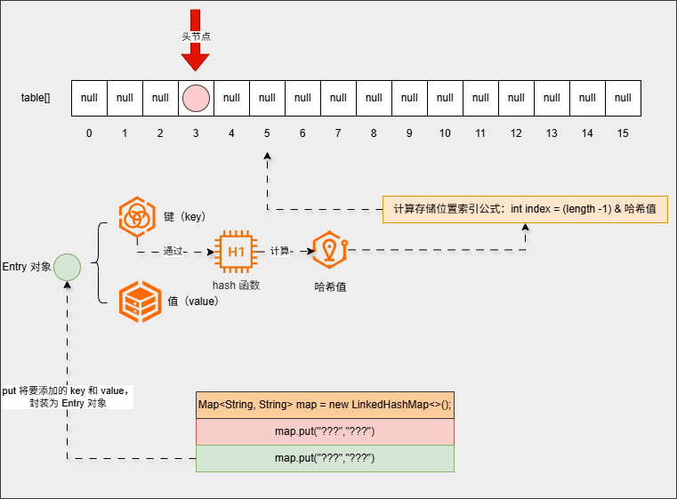

* 并且第一个元素会记录第二个元素的地址，并且第二个元素也会记录第一个元素的地址（双向链表）：

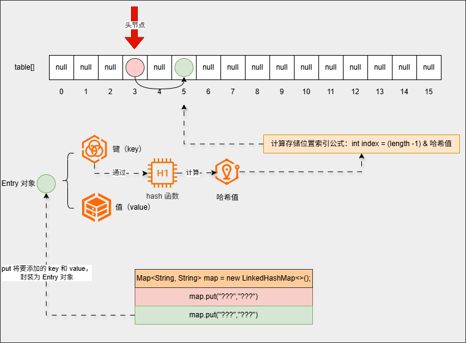

* ④ 继续添加元素：

```java
map.put("???","???");  
...    
map.put("???","???");
```

* 底层会重复之前的步骤：

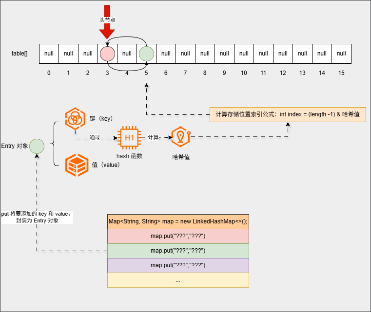

* ⑤ 遍历的时候，只需要遍历双向链表就可以了：

```java
 map.forEach((k, v) -> System.out.println(k + " --> " + v));
```

* 其内存动态图，如下所示：

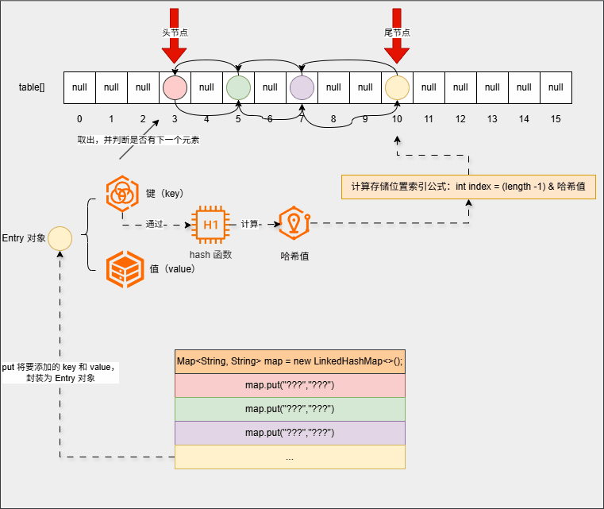

### 3.3.3 总结

* LinkedHashMap 的特点是由`键`决定的：
  * `有序`：存和取的顺序一样。
  * `不重复`：HashMap 中的键是不能重复的。
  * `无索引`：不能通过索引获取集合中的元素。

* LinkedHashMap 的底层原理和 HashMap 的底层原理是一样的，都是`哈希表`结构。但是，每个键值对元素额外多了一个`双向链表`的机制记录存储的顺序。

### 3.3.4 综合练习

* 需求：创建一个 LinkedHashMap 集合，键是学生对象（Student），值是籍贯（String）。

> [!NOTE]
>
> * ① 存储三个键值对元素，并遍历 Map 集合。
> * ② 如果 id、姓名、年龄一样，就认为是同一个学生。


* 示例：

::: code-group

```java [Student.java]
package com.github.collection3;

import java.util.Objects;

public class Student {
    private Integer id;
    private String name;
    private Integer age;

    public Student(Integer id, String name, Integer age) {
        this.id = id;
        this.name = name;
        this.age = age;
    }

    public Integer getId() {
        return id;
    }

    public void setId(Integer id) {
        this.id = id;
    }

    public String getName() {
        return name;
    }

    public void setName(String name) {
        this.name = name;
    }

    public Integer getAge() {
        return age;
    }

    public void setAge(Integer age) {
        this.age = age;
    }

    @Override
    public boolean equals(Object o) { // [!code highlight:7]
        if (o == null || getClass() != o.getClass()) return false;
        Student student = (Student) o;
        return Objects.equals(getId(), student.getId())
                && Objects.equals(getName(), student.getName())
                && Objects.equals(getAge(), student.getAge());
    }

    @Override
    public int hashCode() { // [!code highlight:3]
        return Objects.hash(getId(), getName(), getAge());
    }

    @Override
    public String toString() {
        return "{" +
                "id=" + id +
                ", name='" + name + '\'' +
                ", age=" + age +
                '}';
    }
}
```

```java [Test.java]
package com.github.collection3;

import java.util.LinkedHashMap;
import java.util.Map;

public class Test {
    public static void main(String[] args) {
        Student s1 = new Student(1, "张三", 18);
        Student s2 = new Student(1, "张三", 18);
        Student s3 = new Student(2, "李四", 18);
        Student s4 = new Student(2, "李四", 19);
        Student s5 = new Student(3, "王五", 25);
        Student s6 = new Student(4, "赵六", 35);
        Student s7 = new Student(5, "田七", 18);


        Map<Student, String> map = new LinkedHashMap<>();

        map.put(s1, "江苏");
        map.put(s2, "北京");
        map.put(s3, "上海");
        map.put(s4, "天津");
        map.put(s5, "重庆");
        map.put(s6, "西安");
        map.put(s7, "鹤岗");

        map.forEach((k, v) -> System.out.println(k + " --> " + v));
    }
}
```

```txt [cmd 控制台]
{id=1, name='张三', age=18} --> 北京
{id=2, name='李四', age=18} --> 上海
{id=2, name='李四', age=19} --> 天津
{id=3, name='王五', age=25} --> 重庆
{id=4, name='赵六', age=35} --> 西安
{id=5, name='田七', age=18} --> 鹤岗
```

:::

## 3.4 TreeMap

### 3.4.1 概述

* TreeMap 和 TreeSet 底层原理是一样的，都是`红黑树`结构。
* TreeMap 的特点是由`键`决定的：
  * `可排序`：对键进行排序。
  * `不重复`：HashMap 中的键是不能重复的。
  * `无索引`：不能通过索引获取集合中的元素。

> [!NOTE]
>
> 默认情况下，是按照键的从小到大的顺序进行排序的，也可以自己规定键的排序规则（JDK 内置的类）。

* TreeMap 支持两种排序规则：
  * 默认排序（自然排序）：实现 Comparable 接口，指定比较规则。
  * 自定义排序：创建集合的时候，传递 Comparator 比较器对象，指定比较规则。

> [!NOTE]
>
> * ① 对于 JDK 内置的类，基本上都实现了 Comparable 接口，即：自然排序。
> * ② 对于自定义类，需要手动实现自然排序或自定义排序。

### 3.4.2 基本使用

* 需求：创建一个 TreeMap 集合，键是 id（Integer），值是商品名称（String）。

> [!NOTE]
>
> * ① 要求按照 id 进行升序排序。
> * ② 要求按照 id 进行降序排序。
> * ③ Integer 默认就是升序排序。


* 示例：按照 id 进行升序排序

::: code-group

```java [Test.java]
package com.github.collection3;

import java.util.TreeMap;

public class Test {
    public static void main(String[] args) {
        TreeMap<Integer, String> map = new TreeMap<>();

        map.put(5, "小龙女");
        map.put(3, "穆念慈");
        map.put(4, "郭靖");
        map.put(2, "杨康");
        map.put(6, "郭靖");
        map.put(1, "袁承志");

        map.forEach((k, v) -> System.out.println(k + " --> " + v));
    }
}
```

```txt [cmd 控制台]
1 --> 袁承志
2 --> 杨康
3 --> 穆念慈
4 --> 郭靖
5 --> 小龙女
6 --> 郭靖
```

:::


* 示例：按照 id 进行降序排序

::: code-group

```java [Test.java]
package com.github.collection3;

import java.util.Comparator;
import java.util.TreeMap;

public class Test {
    public static void main(String[] args) {
        TreeMap<Integer, String> map = new TreeMap<>(Comparator.reverseOrder());

        map.put(5, "小龙女");
        map.put(3, "穆念慈");
        map.put(4, "郭靖");
        map.put(2, "杨康");
        map.put(6, "郭靖");
        map.put(1, "袁承志");

        map.forEach((k, v) -> System.out.println(k + " --> " + v));
    }
}
```

```txt [cmd 控制台]
6 --> 郭靖
5 --> 小龙女
4 --> 郭靖
3 --> 穆念慈
2 --> 杨康
1 --> 袁承志
```

:::

### 3.4.3 基本使用

* 需求：创建一个 TreeMap 集合，键是学生（Student），值是籍贯（String）。

> [!NOTE]
>
> 按照学生年龄升序排序，如果年龄一样按照姓名进行排序。


* 示例：

::: code-group

```java [Student.java]
package com.github.collection3;

public class Student implements Comparable<Student> {
    private Integer id;
    private String name;
    private Integer age;

    public Student(Integer id, String name, Integer age) {
        this.id = id;
        this.name = name;
        this.age = age;
    }

    public Integer getId() {
        return id;
    }

    public void setId(Integer id) {
        this.id = id;
    }

    public String getName() {
        return name;
    }

    public void setName(String name) {
        this.name = name;
    }

    public Integer getAge() {
        return age;
    }

    public void setAge(Integer age) {
        this.age = age;
    }

    @Override
    public String toString() {
        return "{" +
                "id=" + id +
                ", name='" + name + '\'' +
                ", age=" + age +
                '}';
    }

    /**
     * 
     * this 是当前要添加的元素
     * o 是红黑树中已经存在的元素
     * @return 0 表示添加的元素和已经存在的元素相同，舍弃
     *         正数 表示添加的元素大于已经存在的元素，存右边
     *         负数 添加的元素小于已经存在的元素，存左边
     */
    @Override
    public int compareTo(Student o) { // [!code highlight:7]
        int ageComparison = this.getAge().compareTo(o.getAge());
        if (ageComparison != 0) {
            return ageComparison;
        }
        return this.getName().compareTo(o.getName());
    }
}
```

```java [Test.java]
package com.github.collection3;

import java.util.Map;
import java.util.TreeMap;

public class Test {
    public static void main(String[] args) {
        Student s1 = new Student(5, "张三", 18);
        Student s2 = new Student(4, "李四", 54);
        Student s3 = new Student(3, "王五", 38);
        Student s4 = new Student(1, "赵六", 19);
        Student s5 = new Student(2, "田七", 25);
        Student s6 = new Student(6, "王八", 35);
        Student s7 = new Student(7, "孙九", 18);

        Map<Student, String> map = new TreeMap<>();

        map.put(s1, "江苏");
        map.put(s2, "北京");
        map.put(s3, "上海");
        map.put(s4, "天津");
        map.put(s5, "重庆");
        map.put(s6, "西安");
        map.put(s7, "鹤岗");

        map.forEach((k, v) -> System.out.println(k + " --> " + v));
    }
}
```

```txt [cmd 控制台]
{id=7, name='孙九', age=18} --> 鹤岗
{id=5, name='张三', age=18} --> 江苏
{id=1, name='赵六', age=19} --> 天津
{id=2, name='田七', age=25} --> 重庆
{id=6, name='王八', age=35} --> 西安
{id=3, name='王五', age=38} --> 上海
{id=4, name='李四', age=54} --> 北京
```

:::


### 3.4.4 综合练习

* 需求：字符串是`“aababcabcdabcde”`，请统计字符串中每一个字符出现的次数。

> [!NOTE]
>
> 输出结果格式是：`a(5) b(4) c(3) d(2) e(1)` 。


* 示例：

::: code-group

```java [Test.java]
package com.github.collection3;

import java.util.TreeMap;
import java.util.stream.Collectors;

public class Test {
    public static void main(String[] args) {
        String str = "aababcabcdabcde";

        TreeMap<Character, Integer> map = new TreeMap<>();

        // 将字符串转换为字符数组
        char[] arr = str.toCharArray();

        // 遍历字符数组，并进行统计
        for (char c : arr) {
            map.merge(c, 1, Integer::sum);
        }

        // 获取结果
        String result = map
                .entrySet()
                .stream()
                .map(entry -> entry.getKey() + "(" + entry.getValue() + ")")
                .collect(Collectors.joining(" "));
        System.out.println(result);

    }
}
```

```txt [cmd 控制台]
a(5) b(4) c(3) d(2) e(1)
```

:::


# 第四章：源码解析

## 4.1 IDEA 如何查看源码？


## 4.2 HashMap


## 4.3 TreeMap

