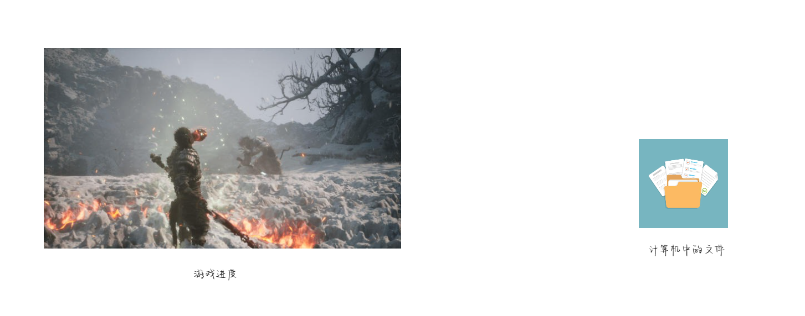
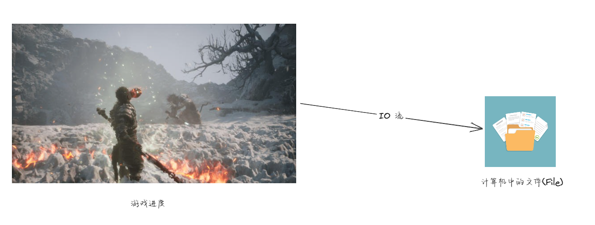
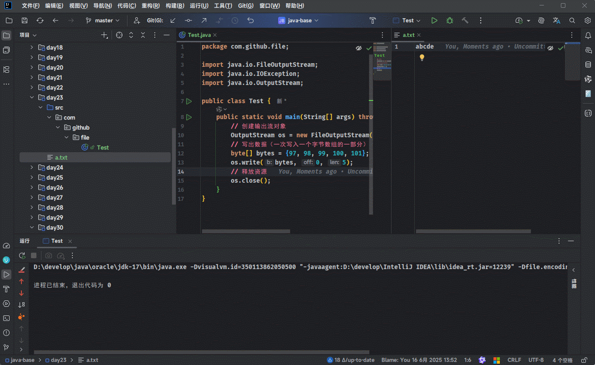
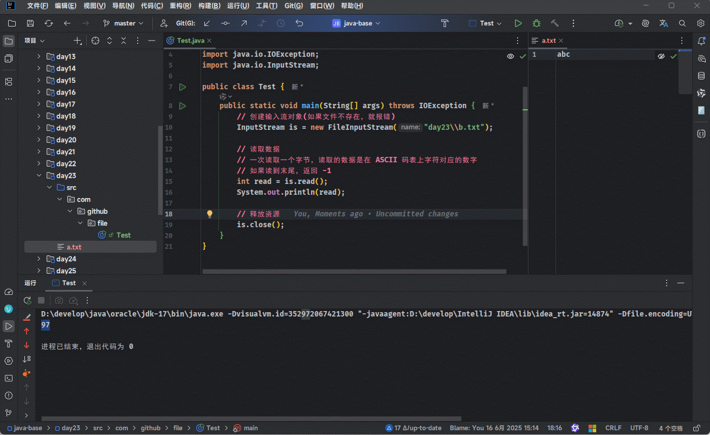
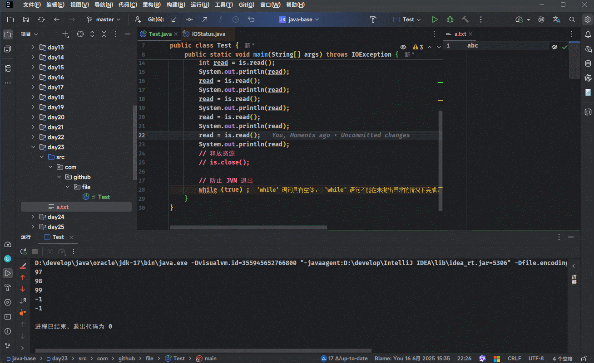

# 第一章：前言

## 1.1 为什么要学习 File 和 IO 流？

* 假设我们现在正在玩《黑悟空》游戏：


* 突然，这个时候，我们需要上厕所（很急）：

> [!NOTE]
>
> 网络烂梗：我知道你很急，但你先别急；我都不急，你急什么？


* 此时，我们非常希望能将当前游戏的进度保存下来，以便下次读档继续玩（不想从头再玩）：

> [!NOTE]
>
> * ① 游戏的进度是保存在内存中的，而内存是不能永久化存储数据的，一旦程序停止，数据丢失。
> * ② 为了解决这个问题，游戏就需要提供`存档`功能和`读档`功能：
>   * 存档：就是将游戏的进度（数据）保存到文件中，以便可以永久化存储数据。
>   * 读档：就是从文件中恢复游戏的进度（数据），这样下次就可以接着上次的进度继续玩。



* 这个背后就涉及到了两个知识点：
  * 文件在哪里（文件的位置）？
  * 如何传输数据（如何将数据保存到文件中，如何从文件中读取数据）？

> [!NOTE]
>
> * ① 在 Java 中，如何传输数据，需要使用 IO 流技术（存储和读取数据的解决方案）。
> * ② 在 Java 中，文件的位置（文件的路径），需要使用到 File 类。



## 1.2 学习 File 和 IO 流的意义

* ① `程序与外部数据的交互`：程序的运行往往需要依赖外部数据（用户输入、配置文件、日志文件等），而 IO 操作是程序读取和写入这些数据的唯一途径。
* ② `持久化存储`：程序运行时的数据通常存储在内存中，但断电或程序关闭后会丢失。通过 IO 操作将数据写入文件或数据库，可以实现数据的持久化存储。
* ③ `系统功能的基础`：许多系统级功能（日志记录、文件管理、网络通信）都依赖 IO 操作，如：Web 服务器需要读取静态文件、接收客户端请求并返回响应。
* ④ `提升程序的灵活性和可维护性`：通过读取配置文件或命令行参数，程序可以在不修改代码的情况下调整行为，从而提高灵活性和可维护性。


# 第二章：File（⭐）

## 2.1 概述

* FIle 类的对象就表示一个路径，可以是`文件`的路径，也可以是`目录`的路径。

> [!NOTE]
>
> * ① File 类是用于操作`本地文件系统`的资源（文件或目录），即：只能处理 `file://` 协议的 URI。
> * ② File 类并不能处理网络上的资源，如：`https://xxx`。

* File 类的对象表示的路径，可以是存在的，也可以是不存在的。

## 2.2 创建 File 对象

* File 类提供了一系列的重载构造方法用于创建 File 对象：

| 构造方法                                    | 说明                                               |
| ------------------------------------------- | -------------------------------------------------- |
| `public File(String pathname){}`            | 根据文件路径创建 File 对象                         |
| `public File(File parent,String child){}`   | 根据父路径对应的文件对象和子路径字符串创建文件对象 |
| `public File(String parent,String child){}` | 根据父路径字符串和子路径字符串创建文件对象         |

> [!NOTE]
>
> * ① 之所以创建 File 对象，是因为 File 对象身上有我们想要的方法。
> * ② 对于 Java 而言，字符串路径仅仅只是字符串而已（和 "abc" 没什么区别），不能和本地文件系统上的文件产生联系！！！
> * ③ 对于 Java 而言，只有将字符串路径转换为 File 对象之后，此时的字符串路径才是真实的文件路径。


* 示例：

```java
package com.github.file;

import java.io.File;

public class Test {
    public static void main(String[] args) {

        // 字符串路径
        String pathName = "D:\\develop\\apache-maven-3.9.9\\README.txt";

        // 将字符串表示的路径，变为 File 对象
        File file = new File(pathName);

        System.out.println(file);
    }
}
```


* 示例：

```java
package com.github.file;

import java.io.File;

public class Test {
    public static void main(String[] args) {

        /* 字符串路径 */
        // 父路径
        String parentPath = "D:\\develop\\apache-maven-3.9.9";
        // 子路径
        String child = "README.txt";

        // 将字符串表示的路径，变为 File 对象
        File file = new File(parentPath, child);

        System.out.println(file);
    }
}
```


* 示例：

```java
package com.github.file;

import java.io.File;

public class Test {
    public static void main(String[] args) {

        /* 字符串路径 */
        // 父路径
        String parentPath = "D:\\develop\\apache-maven-3.9.9";
        // 子路径
        String child = "README.txt";

        // 将字符串表示的路径，变为 File 对象
        File file = new File(new File(parentPath), child);

        System.out.println(file);
    }
}
```

## 2.3 常用 API

### 2.3.1 判断系列

* 判断 File 对象表示的文件（目录）是否可读、可写、可执行：

```java
public boolean canRead() {}
```

```java
public boolean canWrite() {}
```

```java
public boolean canExecute() {}
```

* 判断 File 对象表示的文件（目录）是否是文件还是目录：

```java
public boolean isFile() {}
```

```java
public boolean isDirectory() {}
```

* 判断 File 对象表示的文件（目录）是否存在：

```java
public boolean exists() {}
```


* 示例：

```java
package com.github.file;

import java.io.File;

public class Test {
    public static void main(String[] args) {
        /* 字符串路径 */
        String parentPath = "D:\\develop\\apache-maven-3.9.9";
        String child = "README.txt";

        // 将字符串表示的路径，变为 File 对象
        File file = new File(new File(parentPath), child);

        // 判断系列的方法
        System.out.println(file.canRead()); // true
        System.out.println(file.canWrite()); // true
        System.out.println(file.canExecute()); // true
        System.out.println("--------------------------");
        System.out.println(file.isFile()); // true
        System.out.println(file.isDirectory()); // false
        System.out.println("--------------------------");
        System.out.println(file.exists()); // true
    }
}
```

### 2.3.2 获取系列

* 获取文件的大小：

```java
public long length() {}
```

> [!NOTE]
>
> * ① 该方法只能获取单个文件的大小（单位是 B（字节）），不能获取文件夹的大小。
> * ② 如果想要获取文件夹的大小，需要遍历文件夹下的所有文件，并就每个文件的大小累加起来。

* 获取文件或目录的绝对路径：

```java
public String getAbsolutePath() {}
```

* 获取构造方法中的路径：

```java
public String getPath() {}
```

* 获取名称：

```java
public String getName() {}
```

> [!NOTE]
>
> * ① 如果是文件，包含文件名（`README`）和后缀名（`.md`），即：`README.md`。
> * ② 如果是目录，就是目录名。

* 获取文件最后修改时间（毫秒值）：

```java
public long lastModified() {}
```


* 示例：

```java
package com.github.file;

import java.io.File;

public class Test {
    public static void main(String[] args) {
        /* 字符串路径 */
        String parentPath = "D:\\develop\\apache-maven-3.9.9";
        String child = "README.txt";

        // 将字符串表示的路径，变为 File 对象
        File file = new File(new File(parentPath), child);

        // 获取系列方法
        // 只能获取单个文件的大小，单位是 B（字节）
        System.out.println(file.length()); // 1279
        // 不能获取文件夹的大小，不同操作系统上的行为可能不一致
        System.out.println(new File(parentPath).length()); // 4096
    }
}
```


* 示例：

```java
package com.github.file;

import java.io.File;

public class Test {
    public static void main(String[] args) {
        /* 字符串路径 */
        String parentPath = "D:\\develop\\apache-maven-3.9.9";
        String child = "README.txt";

        // 将字符串表示的路径，变为 File 对象
        File file = new File(new File(parentPath), child);

        // 获取系列方法 
        // 可以获取文件的绝对路径  D:\develop\apache-maven-3.9.9\README.txt
        System.out.println(file.getAbsolutePath()); 
        // 可以获取目录的绝对路径 D:\develop\apache-maven-3.9.9
        System.out.println(new File(parentPath).getAbsolutePath());
    }
}
```


* 示例：

```java
package com.github.file;

import java.io.File;

public class Test {
    public static void main(String[] args) {
        /* 字符串路径 */
        String parentPath = "D:\\develop\\apache-maven-3.9.9";
        String child = "README.txt";

        // 将字符串表示的路径，变为 File 对象
        File file = new File(new File(parentPath), child);

        // 获取系列方法
        // 获取构造方法中的路径 D:\develop\apache-maven-3.9.9\README.txt
        System.out.println(file.getPath());
        // 获取构造方法中的路径 D:\develop\apache-maven-3.9.9
        System.out.println(new File(parentPath).getPath()); // apache-maven-3.9.9
    }
}
```


* 示例：

```java
package com.github.file;

import java.io.File;

public class Test {
    public static void main(String[] args) {
        /* 字符串路径 */
        String parentPath = "D:\\develop\\apache-maven-3.9.9";
        String child = "README.txt";

        // 将字符串表示的路径，变为 File 对象
        File file = new File(new File(parentPath), child);

        // 获取系列方法
        // 可以获取名称，如果是文件，就包括文件名和后缀名
        System.out.println(file.getName()); // README.txt
        // 可以获取名称，如果是目录，就是目录名
        System.out.println(new File(parentPath).getName()); // apache-maven-3.9.9
    }
}
```


* 示例：

```java
package com.github.file;

import java.io.File;
import java.time.Instant;
import java.time.LocalDateTime;
import java.time.ZoneId;
import java.time.format.DateTimeFormatter;

public class Test {

    static DateTimeFormatter df = DateTimeFormatter.ofPattern("yyyy-MM-dd HH:mm:ss");

    public static void main(String[] args) {
        /* 字符串路径 */
        String parentPath = "D:\\develop\\apache-maven-3.9.9";
        String child = "README.txt";

        // 将字符串表示的路径，变为 File 对象
        File file = new File(new File(parentPath), child);

        // 获取系列方法
        System.out.println(file.lastModified()); // 1723596528000
        final LocalDateTime localDateTime = LocalDateTime.ofInstant(
            Instant.ofEpochMilli(file.lastModified()), ZoneId.systemDefault());
        System.out.println(df.format(localDateTime)); // 2024-08-14 08:48:48
    }
}
```

### 2.3.3 创建系列

* 创建一个空的文件：

```java
public boolean createNewFile() throws IOException {}
```

> [!NOTE]
>
> * ① 细节 1：
>   * 如果当前路径表示的文件是不存在的，则创建成功，返回 true 。
>   * 如果当前路径表示的文件是存在的，则创建失败，返回 false。
> * ② 细节 2：如果当前路径的父路径是不存在的，方法会抛出 IOException 异常。
> * ③ 细节 3：该方法只能创建文件，不能创建文件夹；如果路径中不包含后缀名，那么创建的就是一个没有后缀名的文件。

* 创建单级文件夹（不常用）：

```java
public boolean mkdir() {}
```

> [!NOTE]
>
> * ① 细节 1：在 Windows 中，文件夹中是不能包含同名的文件或文件夹的。
> * ② 细节 2：该方法只能创建单级文件夹，不能创建多级文件夹。

* 创建多级文件夹（单级文件夹，常用）：

```java
public boolean mkdirs() {}
```


* 示例：如果当前路径表示的文件是不存在的，则 createNewFile() 创建成功，返回 true


::: code-group

```java [Test.java]
package com.github.file;

import java.io.File;
import java.io.IOException;

public class Test {
    public static void main(String[] args) throws IOException {
        File file = new File("a.txt");
        boolean newFile = file.createNewFile();
        System.out.println(newFile); // true
    }
}
```

```md:img [cmd 控制台]

```

:::


* 示例：如果当前路径表示的文件是不存在的，则 createNewFile() 创建失败，返回 false

::: code-group

```java [Test.java]
package com.github.file;

import java.io.File;
import java.io.IOException;

public class Test {
    public static void main(String[] args) throws IOException {
        File file = new File("a.txt");
        boolean newFile = file.createNewFile();
        System.out.println(newFile); // false
    }
}
```

```md:img [cmd 控制台]

```

:::


* 示例：如果当前路径中的父路径是不存在的，则 createNewFile() 会抛出异常

::: code-group

```java [Test.java]
package com.github.file;

import java.io.File;
import java.io.IOException;

public class Test {
    public static void main(String[] args) throws IOException {
        File file = new File("aaa/a.txt"); // [!code highlight]
        // ❌ 由于父路径不存在，将会抛出异常
        boolean newFile = file.createNewFile(); // [!code error]
        System.out.println(newFile); // false
    }
}
```

```md:img [cmd 控制台]

```

:::


* 示例：createNewFile() 方法只能创建文件，不能创建文件夹

::: code-group

```java [Test.java]
package com.github.file;

import java.io.File;
import java.io.IOException;

public class Test {
    public static void main(String[] args) throws IOException {
        // 如果路径中不包含后缀名，那么创建的就是一个没有后缀名的文件
        File file = new File("abc"); 
        boolean newFile = file.createNewFile(); 
        System.out.println(newFile); 
    }
}
```

```md:img [cmd 控制台]

```

:::


* 示例：mkdir() 方法只能创建单级文件夹

::: code-group

```java [Test.java]
package com.github.file;

import java.io.File;

public class Test {
    public static void main(String[] args) {
        File file = new File("aaa");
        boolean b = file.mkdir();
        System.out.println(b);
    }
}
```

```md:img [cmd 控制台]

```

:::


* 示例：mkdir() 方法不能创建多级文件夹

::: code-group

```java [Test.java]
package com.github.file;

import java.io.File;

public class Test {
    public static void main(String[] args) {
        File file = new File("aaa/abc/ccc");
        boolean b = file.mkdir();
        System.out.println(b);
    }
}
```

```md:img [cmd 控制台]

```

:::


* 示例：mkdirs() 可以创建多级文件夹

::: code-group

```java [Test.java]
package com.github.file;

import java.io.File;

public class Test {
    public static void main(String[] args) {
        File file = new File("aaa/abc/ccc");
        boolean b = file.mkdirs();
        System.out.println(b);
    }
}
```

```md:img [cmd 控制台]

```

:::

### 2.3.4 删除系列

* 删除文件（空文件夹）：

```java
public boolean delete() {}
```

> [!CAUTION]
>
> * ① delete 方法默认只能删除文件和空文件夹！！！
> * ② delete 方法是直接删除，并不走回收站！！！
> * ③ 如果想实现删除文件夹，需要从最里面的文件夹一层一层向外删除子文件夹中的所有内容，最后再删除自己（递归）！！！


* 示例：删除文件

::: code-group

```java [Test.java]
package com.github.file;

import java.io.File;
import java.io.IOException;

public class Test {
    public static void main(String[] args) throws IOException {
        File file = new File("aaa");
        boolean b = file.delete();
        System.out.println(b);
    }
}
```

```md:img [cmd 控制台]

```

:::


* 示例：删除空目录

::: code-group

```java [Test.java]
package com.github.file;

import java.io.File;
import java.io.IOException;

public class Test {
    public static void main(String[] args) throws IOException {
        File file = new File("abc/bca/ccc");
        boolean b = file.delete();
        System.out.println(b);
    }
}
```

```md:img [cmd 控制台]

```

:::


* 示例：不能删除有内容的文件夹

::: code-group

```java [Test.java]
package com.github.file;

import java.io.File;
import java.io.IOException;

public class Test {
    public static void main(String[] args) throws IOException {
        File file = new File("abc");
        boolean b = file.delete();
        System.out.println(b);
    }
}
```

```md:img [cmd 控制台]

```

:::

### 2.3.5 获取并遍历系列

* 获取当前路径下的所有内容（文件和文件夹）：

```java
public File[] listFiles() {}
```

> [!CAUTION]
>
> * 细节：
>   * 当调用者 File 表示的路径不存在时，返回 null。
>   * 当调用者 File 表示的路径是文件时，返回 null。
>   * 当调用者 FIle 表示的路径是一个空文件时，返回一个长度为 0 的数组。
>   * 当调用者 File 表示的路径是一个有内容的文件夹时，将里面所有文件（包含隐藏文件）和文件夹的路径放在 File 数组中并返回。
>   * 当调用者 File 表示的路径需要访问权限时，返回 null。
> * 解决 null 问题（空指针异常）：直接调用 `Objects.requireNonNullElse(files, new File[0])`方法，即：如果 files 返回 null ，就转换为一个长度为 0 的数组。


* 示例：

::: code-group

```java [Test.java]
package com.github.file;

import java.io.File;
import java.io.IOException;

public class Test {
    public static void main(String[] args) throws IOException {
        File file = new File("abc");
        boolean b = file.delete();
        System.out.println(b);
    }
}
```

```md:img [cmd 控制台]

```

:::


* 示例：

::: code-group

```java [Test.java]
package com.github.file;

import java.io.File;
import java.io.IOException;
import java.util.Objects;

public class Test {
    public static void main(String[] args) throws IOException {
        File file = new File("abc");
        File[] files = file.listFiles();
        for (File f : Objects.requireNonNullElse(files, new File[0])) {
            System.out.println(f.getName());
        }
    }
}
```

```md:img [cmd 控制台]

```

:::

### 2.3.6 所有获取并遍历系列

* 列出可用的文件系统根：

```java
public static File[] listRoots() {}
```

> [!NOTE]
>
> * 对于 Windows 系统而言，所谓的文件系统根，就是盘符，如：C 盘、D 盘、E 盘等（有几个盘符就有几个文件系统根）。
> * 对于 Linux 系统而言，所谓的文件系统根，就是 `/` 。

* 获取当前路径下所有内容（文件和文件夹）的名称（不常用）：

```java
public String[] list() {}
```

* 利用文件名过滤器获取当前路径下所有内容（文件和文件夹）的名称（不常用）：

```java
public String[] list(FilenameFilter filter) {}
```

* 获取当前路径下所有内容（文件和文件夹，常用）：

```java
public File[] listFiles() {}
```

* 利用文件过滤器获取当前路径下所有内容（文件和文件夹，常用）：

```java
public File[] listFiles(FileFilter filter) {}
```

* 利用文件过滤名获取当前路径下所有内容（文件和文件夹，常用）：

```java
public File[] listFiles(FilenameFilter filter) {}
```


* 示例：

::: code-group

```java [Test.java]
package com.github.file;

import java.io.File;
import java.io.IOException;

public class Test {
    public static void main(String[] args) throws IOException {
        final File[] files = File.listRoots();
        for (File file : files) {
            System.out.println(file.getPath());
        }
    }
}
```

```md:img [cmd 控制台]

```

:::


* 示例：

::: code-group

```java [Test.java]
package com.github.file;

import java.io.File;
import java.io.IOException;
import java.util.Objects;

public class Test {
    public static void main(String[] args) throws IOException {
        File file = new File("abc");

        File[] files = file.listFiles(f -> f
                .getName()
                .endsWith(".jpg"));
        for (File f : Objects.requireNonNullElse(files, new File[0])) {
            System.out.println(f);
        }
    }
}
```

```md:img [cmd 控制台]

```

:::

## 2.4 综合练习

### 2.4.1 综合练习一

* 需求：在当前项目中的 aaa 文件夹下创建一个 a.txt 的文件。


* 示例：

::: code-group

```java [Test.java]
package com.github.file;

import java.io.File;
import java.io.IOException;

public class Test {
    public static void main(String[] args) throws IOException {
        File file = new File("aaa/a.txt");
        boolean newFile = file.createNewFile();
        System.out.println(newFile ? "创建成功" : "创建失败");
    }
}
```

```md:img [cmd 控制台]

```

:::

### 2.4.2 综合练习二

* 需求：定义一个方法，用于寻找某一个文件夹中，是否有以 avi 结尾的小电影。

> [!NOTE]
>
> 暂时不需要考虑子文件夹，即：
>
> - [x] aaa
> - [ ] ~~aaa/bbb~~
> - [ ] ~~aaa/bbb/ccc~~


* 示例：

::: code-group

```java [Test.java]
package com.github.file;

import java.io.File;
import java.io.IOException;
import java.util.Objects;

public class Test {
    public static void main(String[] args) throws IOException {
        File file = new File("aaa/ccc");
        System.out.println(isExistAVI(file) ? "存在" : "不存在");
    }

    public static boolean isExistAVI(File src) {
        // 判断参数
        if (null == src || !src.exists() || src.isFile()) {
            return false;
        }
        // 获取当前路径下的所有内容
        File[] files = src.listFiles();
        // 遍历数组
        for (File file : Objects.requireNonNullElse(files, new File[0])) {
            if (file.isFile() && file.getName().endsWith(".avi")) {
                return true;
            }
        }
        return false;
    }
}
```

```md:img [cmd 控制台]

```

:::

### 2.4.3 综合练习三

* 需求：定义一个方法，用于寻找某一个文件夹中，所有以 avi 结尾的小电影。

> [!NOTE]
>
> 需要考虑子文件夹，即：
>
> - [x] aaa
> - [x] aaa/bbb
> - [x] aaa/bbb/ccc


* 示例：

::: code-group

```java [Test.java]
package com.github.file;

import java.io.File;
import java.io.IOException;
import java.util.ArrayList;
import java.util.List;
import java.util.Objects;

public class Test {
    public static void main(String[] args) throws IOException {
        File file = new File("aaa");
        System.out.println(findAVI(file).size());
    }

    public static List<File> findAVI(File src) {
        List<File> resultList = new ArrayList<>();
        // 判断参数
        if (null == src || !src.exists() || src.isFile()) {
            return resultList;
        }
        // 获取当前路径下的所有内容
        File[] files = src.listFiles();
        // 遍历数组
        for (File file : Objects.requireNonNullElse(files, new File[0])) {
            // 如果是文件，并且是 avi 文件，则添加到结果列表中
            if (file.isFile() && file.getName().endsWith(".avi")) {
                resultList.add(file);
            } else { 
                // 如果是文件夹，则递归调用 findAVI 方法
                // 再次调用本方法的时候，参数一定是 src 的次一级路径，即：file
                resultList.addAll(findAVI(file));
            }
        }
        return resultList;
    }
}
```

```md:img [cmd 控制台]

```

:::

### 2.4.4 综合练习四

* 需求：定义一个方法，删除一个多级文件夹。

> [!NOTE]
>
> 需要使用递归来实现！！！


* 示例：

::: code-group

```java [Test.java]
package com.github.file;

import java.io.File;
import java.io.IOException;
import java.util.Objects;

public class Test {
    public static void main(String[] args) throws IOException {
        File file = new File("aaa/bbb/eeee");
        remove(file);
    }

    public static void remove(File src) {
        // 判断参数
        if (null == src || !src.exists() || src.isFile()) {
            return;
        }
        // 获取当前路径下的所有内容
        File[] files = src.listFiles();
        // 遍历数组
        for (File file : Objects.requireNonNullElse(files, new File[0])) {
            // 如果是文件，就删除
            if (file.isFile()) {
                System.out.println(file.getPath());
                file.delete();
            } else { // 如果是文件夹，则递归调用 findAVI 方法
                remove(file);
            }
        }
        // 最后需要删除自己
        src.delete();
    }
}
```

```md:img [cmd 控制台]

```

:::

### 2.4.5 综合练习五

* 需求：统计一个文件夹中每种文件的个数并打印。

> [!NOTE]
>
> 需要使用递归来实现！！！


* 示例：

::: code-group

```java [Test.java]
package com.github.collection3;

import java.io.File;
import java.util.HashMap;
import java.util.Map;
import java.util.Objects;

public class Test {

    public static void main(String[] args) {
        File src = new File("D:\\src");
        long total = getLen(src);
        System.out.println("文件大小为: " + total);

        Map<String, Long> map = analyze(src);
        map.forEach((k, v) -> System.out.println(k + ": " + v));

    }

    public static Long getLen(File src) {
        Long total = 0L;
        File[] files = src.listFiles();
        for (File file : Objects.requireNonNullElse(files, new File[0])) {
            if (file.isFile()) {
                total += file.length();
            } else {
                total += getLen(file);
            }
        }
        return total;
    }

    public static Map<String, Long> analyze(File src) {
        Map<String, Long> map = new HashMap<>();
        File[] files = src.listFiles();
        for (File file : Objects.requireNonNullElse(files, new File[0])) {
            if (file.isFile()) {
                String name = file.getName();
                String suffix = name.substring(name.lastIndexOf(".") + 1);
                map.merge(suffix, 1L, Long::sum);
            } else {
                Map<String, Long> map2 = analyze(file);
                map2.forEach((key, value) -> map.merge(key, value, Long::sum));
            }
        }
        return map;
    }
    
}
```

```md:img [cmd 控制台]

```

:::


# 第三章：IO 流（⭐）

## 3.1 概述

### 3.1.1 简介

- I/O 是 Input 和 Output 的缩写，IO 技术是非常实用的技术，用于 `处理设备之间的数据传输` ，如：读写文件、网络通讯等。

> [!NOTE]
>
> IO 流是存储数据和读取数据的解决方案！！！

- 因为 IO 流和 File 息息相关；所以，我们有必要先回顾 File 。

### 3.1.2 File 和 IO 流

* File 是用来表示系统中`文件`或者文件夹的路径。我们可以利用 File 完成以下功能：
  * ① 获取文件信息（大小、文件名、最后修改时间）。
  * ② 判断文件的类型（文件还是文件夹）。
  * ③ 创建文件或文件夹。
  * ④ 删除文件或文件夹。
  * ⑤ ....

> [!CAUTION]
>
> * File 类只能对文件文本进行操作，并不能读写文件里面存储的数据！！！
> * 如果要进行读写数据，必须要使用 IO 流技术。

* IO 流是用来读写文件中的数据（可以读写文件，或网络中的数据...）。
* 其中，IO 流可以将程序中的数据保存（写出）到本地文件中，我们称之为：`写`（Output，写出数据）。


* 其中，IO 流可以将本地文件中的数据读取（加载）到程序中，我们称之为：`读`（Input，读取数据）。


* 在 IO 流中，是以`程序`作为参照物来看读写的方向的。

> [!NOTE]
>
> * ① 是程序在读取文件中的数据，也是程序在向文件中写出数据。
> * ② 因为程序是运行在内存中，所以也可以将`内存`作为参照物来看读写的方向的。


### 3.1.3 IO 流分类

* 在 Java 中，IO 流有很多很多种（BIO，Blocking I/O，阻塞式 I/O），如下所示：

> [!NOTE]
>
> 在 Java 中，IO 流的模型分为以下几种：
>
> | 名称 | 全称             | 中文含义   | 模型类型   |
> | ---- | ---------------- | ---------- | ---------- |
> | BIO  | Blocking I/O     | 阻塞式 I/O | 同步阻塞   |
> | NIO  | Non-blocking I/O | 非阻塞 I/O | 同步非阻塞 |
> | AIO  | Asynchronous I/O | 异步 I/O   | 异步非阻塞 |
> 
> 目前，我们学习的是 BIO，即：阻塞式 I/O，至于什么是阻塞式 I/O，在多线程和网络编程那边讲解！！！

```txt
├─📄 Bits.java
├─📄 BufferedInputStream.java
├─📄 BufferedOutputStream.java
├─📄 BufferedReader.java
├─📄 BufferedWriter.java
├─📄 ByteArrayInputStream.java
├─📄 ByteArrayOutputStream.java
├─📄 CharArrayReader.java
├─📄 CharArrayWriter.java
├─📄 CharConversionException.java
...
├─📄 DataOutput.java
├─📄 DataOutputStream.java
├─📄 DefaultFileSystem.java
├─📄 DeleteOnExitHook.java
├─📄 EOFException.java
├─📄 ExpiringCache.java
├─📄 Externalizable.java
...
├─📄 FileCleanable.java
├─📄 FileDescriptor.java
├─📄 FileFilter.java
├─📄 FileInputStream.java
├─📄 FilenameFilter.java
├─📄 FileNotFoundException.java
├─📄 FileOutputStream.java
...
```

> [!NOTE]
>
> 为了更好的学习 IO 流，我们有必要先对它们进行分类，即：先有一个整体的认识，再一个个的学习。

* 根据`流的方向`，我们可以将 IO 流，做如下的分类：


* 根据`操作文件的类型`，我们可以将 IO 流，做如下的分类：

> [!NOTE]
>
> * ① 字节流可以操作所有类型的文件，包括：图片文件、文本文件、音频文件以及视频文件等等。
> * ② 字符流可以操作文本类型的文件。


* 对于纯文本文件，最简单的判断方式：使用 Windows 自带的记事本软件。

> [!NOTE]
>
> * ① 如果某个文件，Windows 自带的记事本软件能打开，显示出来不乱码，就是纯文本文件。
> * ② 如果某个文件，Windows 自带的记事本软件能打开；但是，显示出来乱码，就不是纯文本文件。


## 3.2 IO 流体系

* IO 流按照`操作文件的类型`进行分类，可以分为`字节流`和`字符流`：


* 以`字节流`为例，按照`流的方向`进行分类，可以分为`字节输入流`和`字节输出流`：


* 以`字符流`为例，按照`流的方向`进行分类，可以分为`字符输入流`和`字符输出流`：


* 但是，InputStream、OutputStream、Reader 以及 Writer 都是抽象类，是不能实例化的：

> [!NOTE]
>
> ::: code-group
>
> ```java [InputStream.java]
> public abstract class InputStream implements Closeable {}
> ```
>
> ```java [OutputStream.java]
> public abstract class OutputStream implements Closeable, Flushable {}
> ```
>
> ```java [Reader.java]
> public abstract class Reader implements Readable, Closeable {}
> ```
>
> ```java [Writer.java]
> public abstract class Writer implements Appendable, Closeable, Flushable {}
> ```
>
> :::


> [!NOTE]
>
> 为了创建流的实例（对象），我们还需要它们的子类！！！

* 以字节输入流（InputStream）为例，其子类是 FileInputStream，如下所示：


* 以字节输出流（OutputStream）为例，其子类是 FileOutputStream，如下所示：


* 同理，字符输入流（Reader）和字符输出流（Writer）的继承体系就是这样，如下所示：


# 第四章：基本字节流（⭐）

## 4.1 概述

* 基本字节流有两种：FileOutputStream 和 FileInputStream。

## 4.2 FileOutputStream

### 4.2.1 概述

* FileOutputStream 是操作本地文件的字节输出流，可以将程序中的数据写出到本地文件中。

### 4.2.2 操作步骤

* ① 创建字节输出流对象。

```java 
public class FileOutputStream extends OutputStream {
    
    public FileOutputStream(String name) throws FileNotFoundException {
        ...
    }
    
    ...
}
```

* ② 写数据。

```java 
public class FileOutputStream extends OutputStream {
    
    public void write(int b) throws IOException {
        ...
    }
    
    ...
}
```

* ③ 释放资源。

```java 
public class FileOutputStream extends OutputStream {
    
    public void close() throws IOException {
        ...
    }
    
    ...
}
```

> [!NOTE]
>
> * ① 暂时不要写中文，至于原因，后文再解释！！！
> * ② Java 中提供了获取字符的 Unicode 编码的方法，以十进制数字返回：
>
> ```java
> public final class Character 
>     implements java.io.Serializable, Comparable<Character>, Constable {
>     
>     public static int codePointAt(CharSequence seq, int index) {
>         ...
>     }
>     ...
> }
> ```


* 示例：

::: code-group

```java [Test.java]
package com.github.file;

import java.io.FileOutputStream;
import java.io.IOException;
import java.io.OutputStream;

public class Test {
    public static void main(String[] args) throws IOException {
        // 创建输出流对象（并指定文件的路径）
        OutputStream os = new FileOutputStream("day23\\a.txt");
        // 写出数据
        os.write(Character.codePointAt("a", 0));
        // 释放资源
        os.close();
    }
}
```

```md:img [cmd 控制台]

```

:::

### 4.2.3 原理

* 电脑硬盘中的的文件非常多，我们的程序是如何知道向那个文件中写入数据的？


* 其实，当我们创建 FileOutputStream 对象的时候，如下所示：

```java
OutputStream os = new FileOutputStream("day23\\a.txt");
```

* Java 程序会根据我们书写的文件路径，和硬盘上的指定文件建立了一个传输数据的通道：


* 当我们调用 write 方法写出数据的时候，如下所示：

```java
os.write(Character.codePointAt("a", 0));
```

* 其实就相当于数据在这个通道中进行传输：


* 当我们调用 close 方法的时候进行资源释放，如下所示：

```java
os.close();
```

* 其实，就相当于将这个通道给砸碎：


### 4.2.4 细节

#### 4.2.4.1 创建字节输出流对象的细节

* ① 参数是字符串表示的路径或者 File 对象都是可以的。

```java [FileOutputStream.java]
public class FileOutputStream extends OutputStream {
    
    /**
    * 如果是字符串表示的路径，底层依然会帮你转换为 File 对象
    */
	public FileOutputStream(String name) throws FileNotFoundException {
        
        this(name != null ? new File(name) : null, false); // [!code highlight]
    }
    
    public FileOutputStream(File file) throws FileNotFoundException {
        this(file, false);
    }
    
    ...
}
```

* ② 如果文件不存在会创建一个新文件；但是，需要确保父级路径是存在的。

::: code-group

```java [Test.java]
package com.github.file;

import java.io.FileOutputStream;
import java.io.IOException;
import java.io.OutputStream;

public class Test {
    public static void main(String[] args) throws IOException {
        // 创建输出流对象（如果文件不存在会创建一个新文件）
        OutputStream os = new FileOutputStream("day23\\a.txt"); // [!code highlight]
        // 写出数据
        os.write(Character.codePointAt("a", 0));
        // 释放资源
        os.close();
    }
}
```

```md:img [cmd 控制台]

```

```java [Test.java]
package com.github.file;

import java.io.FileOutputStream;
import java.io.IOException;
import java.io.OutputStream;

public class Test {
    public static void main(String[] args) throws IOException {
        // 创建输出流对象（如果文件不存在会创建一个新文件）
        // 但是，如果路径中的父级路径不存在，会抛出异常
        OutputStream os = new FileOutputStream("day23\\abc\\a.txt"); // [!code highlight]
        // 写出数据
        os.write(Character.codePointAt("a", 0));
        // 释放资源
        os.close();
    }
}
```

```md:img [cmd 控制台]

```

:::

* ③ 如果文件已经存在，则会清空文件，再写入新的数据。

::: code-group

```java [Test.java]
package com.github.file;

import java.io.FileOutputStream;
import java.io.IOException;
import java.io.OutputStream;

public class Test {
    public static void main(String[] args) throws IOException {
        // 如果文件已经存在，则会清空文件，再写入新的数据
        OutputStream os = new FileOutputStream("day23\\a.txt"); // [!code highlight]
        // 写出数据
        os.write(Character.codePointAt("a", 0));
        // 释放资源
        os.close();
    }
}
```

```md:img [cmd 控制台]

```

:::

#### 4.2.4.2 写数据的细节

* ① write 方法的参数是整数：

```java
public void write(int b) throws IOException {
        ...
}
```

* 计算机底层实际上写到本地文件中的是`整数`在 ASCII 码表上对应的`字符`：

> [!NOTE]
>
> * ① `97` 对应 `'a'` 。
> * ② `65` 对应 `'A'` 。
> * ③ ...


* ② write 方法有三种形式：

| write 格式                                                   | 描述                         |
| ------------------------------------------------------------ | ---------------------------- |
| `public abstract void write(int b) throws ... {};`           | 一次写入一个字节             |
| `public void write(byte b[]) throws ...{}`                   | 一次写入一个字节数组         |
| `public void write(byte b[], int off, int len) throws ...{}` | 一次写入一个字节数组的一部分 |

::: code-group

```java [Test.java]
package com.github.file;

import java.io.FileOutputStream;
import java.io.IOException;
import java.io.OutputStream;

public class Test {
    public static void main(String[] args) throws IOException {
        // 如果文件已经存在，则会清空文件，再写入新的数据
        OutputStream os = new FileOutputStream("day23\\a.txt");
        // 写出数据（一次写入一个字节）
        os.write(97); // [!code highlight]
        // 释放资源
        os.close();
    }
}
```

```md:img [cmd 控制台]

```

```java [Test.java]
package com.github.file;

import java.io.FileOutputStream;
import java.io.IOException;
import java.io.OutputStream;

public class Test {
    public static void main(String[] args) throws IOException {
        // 创建输出流对象
        OutputStream os = new FileOutputStream("day23\\a.txt");
        // 写出数据（一次写入一个字节数组）
        byte[] bytes = {97, 98, 99, 100, 101};
        os.write(bytes); // [!code highlight]
        // 释放资源
        os.close();
    }
}
```

```md:img [cmd 控制台]

```

```java [Test.java]
package com.github.file;

import java.io.FileOutputStream;
import java.io.IOException;
import java.io.OutputStream;

public class Test {
    public static void main(String[] args) throws IOException {
        // 创建输出流对象
        OutputStream os = new FileOutputStream("day23\\a.txt");
        // 写出数据（一次写入一个字节数组的一部分）
        byte[] bytes = {97, 98, 99, 100, 101};
        os.write(bytes, 0, 3); // [!code highlight]
        // 释放资源
        os.close();
    }
}
```

```md:img [cmd 控制台]

```

:::

#### 4.2.4.3 释放资源的细节

* 每次使用完流之后，必须释放资源：

```java
package com.github.file;

import java.io.FileOutputStream;
import java.io.IOException;
import java.io.OutputStream;

public class Test {
    public static void main(String[] args) throws IOException {
        // 创建输出流对象
        OutputStream os = new FileOutputStream("day23\\a.txt");
        // 写出数据（一次写入一个字节数组的一部分）
        byte[] bytes = {97, 98, 99, 100, 101};
        os.write(bytes, 0, 3);
        // 释放资源
        os.close(); // [!code highlight]
    }
}
```

* 但是，如果我不释放资源，其他人在本地是无法操作该文件，因为该文件已经被 Java 占用了：

::: code-group

```java [Test.java] {15}
package com.github.file;

import java.io.FileOutputStream;
import java.io.IOException;
import java.io.OutputStream;

public class Test {
    public static void main(String[] args) throws IOException {
        // 创建输出流对象
        OutputStream os = new FileOutputStream("day23\\a.txt");
        // 写出数据（一次写入一个字节数组的一部分）
        byte[] bytes = {97, 98, 99, 100, 101};
        os.write(bytes, 0, 3);
        // 释放资源
        // os.close();

        // 防止 JVM 退出
        while (true);
    }
}
```

```md:img [cmd 控制台]

```

:::

### 4.2.5 写数据小问题（续写）

* 如果本地文件中已经有数据了，如下所示：


* 现在，每次我重新启动程序的时候，都会清空文件，再写入数据：

::: code-group

```java [Test.java] {15}
package com.github.file;

import java.io.FileOutputStream;
import java.io.IOException;
import java.io.OutputStream;

public class Test {
    public static void main(String[] args) throws IOException {
        // 创建输出流对象
        OutputStream os = new FileOutputStream("day23\\a.txt");
        // 写出数据（一次写入一个字节数组的一部分）
        byte[] bytes = {97, 98, 99, 100, 101};
        os.write(bytes, 0, 5);
        // 释放资源
        os.close();
    }
}
```

```md:img [cmd 控制台]

```

:::

* 但是，我想再次启动程序的时候，不清空文件，而是续写，即：接着之前数据的末尾继续写：



* 此时，就需要使用另一个带有续写开关的构造方法：

```java
/**
* @param append 如果为 true，则追加写；如果为 false，则清空写
*/
public FileOutputStream(String name, boolean append) throws FileNotFoundException {
        this(name != null ? new File(name) : null, append);
}
```

*  那么，代码实现，如下所示：

::: code-group

```java [Test.java] {15}
package com.github.file;

import java.io.FileOutputStream;
import java.io.IOException;
import java.io.OutputStream;

public class Test {
    public static void main(String[] args) throws IOException {
        // 创建输出流对象
        OutputStream os = new FileOutputStream("day23\\a.txt", true); // [!code highlight]
        // 写出数据（一次写入一个字节数组的一部分）
        byte[] bytes = {97, 98, 99, 100, 101};
        os.write(bytes, 0, 5);
        // 释放资源
        os.close();
    }
}
```

```md:img [cmd 控制台]

```

:::

### 4.2.6 写数据小问题（换行写）

* 之前每调用一次 write 方法，都是数据的末尾接着写：


* 现在，我想要的是，每调用一次 write 方法之后换行写，此时就需要增加一个换行符：

> [!NOTE]
>
> * ① 主流操作系统中的换行符：
>
> | 操作系统 | 换行符 |
> | -------- | ------ |
> | Windows  | `\r\n` |
> | Linux    | `\n`   |
> | MacOS    | `\r`   |
>
> * ② Java 中提供了获取当前操作系统的换行符的方法：
>
> ```java
> String lineSeparator = System.lineSeparator();
> ```

::: code-group

```java [Test.java] {15}
package com.github.file;

import java.io.FileOutputStream;
import java.io.IOException;
import java.io.OutputStream;
import java.nio.charset.StandardCharsets;

public class Test {
    public static void main(String[] args) throws IOException {
        // 创建输出流对象
        OutputStream os = new FileOutputStream("day23\\a.txt");
        // 写出数据（一次写入一个字节数组的一部分）
        byte[] bytes = {97, 98, 99, 100, 101};
        os.write(bytes, 0, 5);
        String lineSeparator = System.lineSeparator();
        os.write(lineSeparator.getBytes(StandardCharsets.UTF_8)); // [!code highlight]
        os.write(bytes, 1, 4);
        os.write(lineSeparator.getBytes(StandardCharsets.UTF_8)); // [!code highlight]
        os.write(bytes, 2, 3);
        // 释放资源
        os.close();
    }
}
```

```md:img [cmd 控制台]

```

:::

### 4.2.7 补充

* 有时，我们需要获取字符（'a'）在 ASCII 码表中的数字（97），Java 提供了 codePointAt 方法：

```java
public final class Character 
    implements java.io.Serializable, Comparable<Character>, Constable {

    public static int codePointAt(CharSequence seq, int index) {}

	public static int codePointAt(char[] a, int index) {}

	public static int codePointAt(char[] a, int index, int limit) {}

}
```

* 有时，我们希望根据 ASCII 码表中的数字（97）获取其对应的字符（'a'），Java 提供了

```java
public final class Character 
    implements java.io.Serializable, Comparable<Character>, Constable {

    public static char[] toChars(int codePoint) {}
    
    public static int toChars(int codePoint, char[] dst, int dstIndex) {}

}
```


* 示例：

```java
package com.github.file;

import java.io.IOException;

public class Test {
    public static void main(String[] args) throws IOException {

        int num = Character.codePointAt("a", 0);
        System.out.println(num); // 97

        char[] chars = Character.toChars(num);
        System.out.println(new String(chars)); // a

    }
}
```

## 4.3 FileInputStream

### 4.3.1 概述

* FileInputStream 是操作本地文件的字节输入流，可以将本地文件中的数据读取到程序中。

### 4.3.2 操作步骤

* ① 创建字节输出流对象。

```java
public class FileInputStream extends InputStream {
    
    public FileInputStream(String name) throws FileNotFoundException {
        ...
    }
    
    public FileInputStream(File file) throws FileNotFoundException {
        ...
    }
    
    ...
}
```

* ② 读取数据：

```java 
public class FileInputStream extends InputStream {
    
    // 一次读取一个字节，读取的数据是在 ASCII 码表上字符对应的数字
    // 如果读到末尾，返回 -1
    public int read() throws IOException {
        ...
    }
    
    ...
}
```

* ③ 释放资源：

```java
public class FileInputStream extends InputStream {
    
    public void close() throws IOException {
        ...
    }
    
    ...
}
```


* 示例：

::: code-group

```java [Test.java] {15}
package com.github.file;

import java.io.FileInputStream;
import java.io.IOException;
import java.io.InputStream;

public class Test {
    public static void main(String[] args) throws IOException {
        // 创建输入流对象
        InputStream is = new FileInputStream("day23\\a.txt");

        // 读取数据
        // 一次读取一个字节，读取的数据是在 ASCII 码表上字符对应的数字
        // 如果读到末尾，返回 -1
        int read = is.read();
        System.out.println(read);

        // 释放资源
        is.close();

    }
}
```

```md:img [cmd 控制台]

```

:::

### 4.3.3 原理

* 电脑硬盘中的的文件非常多，我们的程序是如何知道从那个文件中读取数据的？


* 其实，当我们创建 FileInputStream 对象的时候，如下所示：

```java
InputStream is = new FileInputStream("day23\\a.txt");
```

* Java 程序会根据我们书写的文件路径，和硬盘上的指定文件建立了一个传输数据的通道：


* 当我们调用 read 方法读取数据的时候，如下所示

```java
int read = is.read();
System.out.println(read);
```

* 其实就相当于数据在这个通道中进行传输：


* 当我们调用 close 方法的时候进行资源释放，如下所示：

```java
is.close();
```

* 其实，就相当于将这个通道给砸碎：


### 4.3.4 细节

#### 4.3.4.1 创建字节输入流细节

* 如果文件不存在，就报错。

> [!NOTE]
>
> * ① 对于输出流而言，如果文件不存在，则创建。
>
> ::: details 点我查看 原因
>
> * 输出流是将程序中的数据写出到文件中，重要的是`数据`，而`数据`就存在于程序中。
> * 文件不存在，创建一个文件，再写入数据，逻辑没毛病（数据没丢）！！！
>
> :::
>
> * ② 对于输入流而言，如果文件不存在，则报错。
>
> ::: details 点我查看 原因
>
> * 输入流是需要将文件中的数据从`文件`中读取到内存中，虽然`数据`很重要；但是，没有文件，从哪里读？
> * 如果 Java 也设计为：文件不存在，输入流也创建新文件，那么新文件中空数据，没什么意义。
>
> :::

::: code-group

```java [Test.java] {15}
package com.github.file;

import java.io.FileInputStream;
import java.io.IOException;
import java.io.InputStream;

public class Test {
    public static void main(String[] args) throws IOException {
        // 创建输入流对象(如果文件不存在，就报错)
        InputStream is = new FileInputStream("day23\\b.txt"); // [!code highlight]

        // 读取数据
        // 一次读取一个字节，读取的数据是在 ASCII 码表上字符对应的数字
        // 如果读到末尾，返回 -1
        int read = is.read();
        System.out.println(read);

        // 释放资源
        is.close();
    }
}
```

```md:img [cmd 控制台]

```

:::

#### 4.3.4.2 读数据的细节

* ① 一次读取一个字节，读取的是数据在 ASCII 码表上对应的数字：

::: code-group

```java [Test.java] {15}
package com.github.file;

import java.io.FileInputStream;
import java.io.IOException;
import java.io.InputStream;

public class Test {
    public static void main(String[] args) throws IOException {
        // 创建输入流对象
        InputStream is = new FileInputStream("day23\\a.txt");

        // 读取数据
        // 一次读取一个字节，读取的数据是在 ASCII 码表上字符对应的数字
        int read = is.read();
        System.out.println(read);
        read = is.read();
        System.out.println(read);
        read = is.read();
        System.out.println(read);

        // 释放资源
        is.close();
    }
}
```

```md:img [cmd 控制台]

```

:::

* ② 如果读取到文件末尾，就返回 -1 。

> [!NOTE]
>
> 其实，在计算机中，文件末尾 -1 被称为 End of file（EOF，就地文本），在 IOStatus 类中有定义：
>
> ```java
> public final class IOStatus {
> 
>     private IOStatus() { }
> 
>     @Native public static final int EOF = -1;  // End of file
> 	
>     ...
> }  
> ```

::: code-group

```java [Test.java] {15}
package com.github.file;

import java.io.FileInputStream;
import java.io.IOException;
import java.io.InputStream;

public class Test {
    public static void main(String[] args) throws IOException {
        // 创建输入流对象
        InputStream is = new FileInputStream("day23\\a.txt");

        // 读取数据
        // 一次读取一个字节，读取的数据是在 ASCII 码表上字符对应的数字
        int read = is.read();
        System.out.println(read);
        read = is.read();
        System.out.println(read);
        read = is.read();
        System.out.println(read);
        read = is.read();
        System.out.println(read); // -1
        read = is.read();
        System.out.println(read); // -1
        // 释放资源
        is.close();
    }
}
```

```md:img [cmd 控制台]

```

:::

#### 4.3.4.3 释放资源的细节

* 每次使用完流之后，必须释放资源：

```java
package com.github.file;

import java.io.FileInputStream;
import java.io.IOException;
import java.io.InputStream;

public class Test {
    public static void main(String[] args) throws IOException {
        // 创建输入流对象
        InputStream is = new FileInputStream("day23\\a.txt");

        // 读取数据
        // 一次读取一个字节，读取的数据是在 ASCII 码表上字符对应的数字
        int read = is.read();
        System.out.println(read);
        read = is.read();
        System.out.println(read);
        read = is.read();
        System.out.println(read);
        read = is.read();
        System.out.println(read);
        read = is.read();
        System.out.println(read);
        // 释放资源
        is.close(); // [!code highlight]
    }
}
```

* 但是，如果我不释放资源，其他人在本地是无法操作该文件，因为该文件已经被 Java 占用了：

::: code-group

```java [Test.java] {25}
package com.github.file;

import java.io.FileInputStream;
import java.io.IOException;
import java.io.InputStream;

public class Test {
    public static void main(String[] args) throws IOException {
        // 创建输入流对象
        InputStream is = new FileInputStream("day23\\a.txt");

        // 读取数据
        // 一次读取一个字节，读取的数据是在 ASCII 码表上字符对应的数字
        int read = is.read();
        System.out.println(read);
        read = is.read();
        System.out.println(read);
        read = is.read();
        System.out.println(read);
        read = is.read();
        System.out.println(read);
        read = is.read();
        System.out.println(read);
        // 释放资源
        // is.close();

        // 防止 JVM 退出
        while (true) ;
    }
}
```

```md:img [cmd 控制台]

```

:::

### 4.3.5 循环读取数据

* ① 当我们创建字节输入流对象的时候，默认是指向第 1 个数据的：


* ②  每调用一次 read() 方法，就返回指定位置上的数据，并移动指针到下一个位置（如果到了文件末尾，就返回 -1）：


* 示例：

::: code-group

```java [Test.java]
package com.github.file;

import java.io.FileInputStream;
import java.io.IOException;
import java.io.InputStream;

public class Test {
    public static void main(String[] args) throws IOException {
        // 创建输入流对象
        InputStream is = new FileInputStream("day23\\a.txt");

        // 读取数据
        // 一次读取一个字节，读取的数据是在 ASCII 码表上字符对应的数字
        // 读取到文件末尾，返回 -1
        int b;
        while ((b = is.read()) != -1) {
            System.out.println(b);
            System.out.println(Character.toChars(b));
        }

        // 释放资源
        is.close();

    }
}
```

```md:img [cmd 控制台]

```

:::

### 4.3.6 循环读取数据的细节

* 之前，我们是这样循环读取数据的，如下所示：

::: code-group

```java [Test.java]
package com.github.file;

import java.io.FileInputStream;
import java.io.IOException;
import java.io.InputStream;

public class Test {
    public static void main(String[] args) throws IOException {
        // 创建输入流对象
        InputStream is = new FileInputStream("day23\\a.txt");

        // 读取数据
        // 一次读取一个字节，读取的数据是在 ASCII 码表上字符对应的数字
        // 读取到文件末尾，返回 -1
        int b;
        while ((b = is.read()) != -1) {
            System.out.println(b);
            System.out.println(Character.toChars(b));
        }

        // 释放资源
        is.close();

    }
}
```

```md:img [cmd 控制台]

```

:::

* 其内存中的示意图，如下所示：


* 但是，有些同学就不这么写，他一定要调用两次 read() 方法，会发现结果不对，如下所示：

::: code-group

```java [Test.java]
package com.github.file;

import java.io.FileInputStream;
import java.io.IOException;
import java.io.InputStream;

public class Test {
    public static void main(String[] args) throws IOException {
        // 创建输入流对象
        InputStream is = new FileInputStream("day23\\a.txt");

        // 读取数据
        // 一次读取一个字节，读取的数据是在 ASCII 码表上字符对应的数字
        // 读取到文件末尾，返回 -1
        while (is.read() != -1) { // [!code highlight]
            System.out.println(is.read()); // [!code highlight]
        }

        // 释放资源
        is.close();

    }
}
```

```md:img [cmd 控制台]

```

:::

* 其内存中的示意图，如下所示：


## 4.4 拷贝文件

### 4.4.1 概述

* 拷贝文件：通过`字节输入流`将`源文件`的`数据`读取到`程序`中，并通过`字节输出流`将`程序`中的`数据`写出到`目的地文件`中。
* 其动态示意图，如下所示：


### 4.4.2 文件拷贝

* 文件的拷贝（复制），其主要思想是：边读边写，并且先打开的流最后关闭。

> [!NOTE]
>
> * ① 先拷贝小文件。
> * ② 需要统计耗时！！！


* 示例：

::: code-group

```java [Test.java]
package com.github.file;

import java.io.*;

public class Test {
    public static void main(String[] args) throws IOException {
        // 创建字节输入流对象和字节输出流对象，以便关联源文件和目的地文件
        InputStream is = new FileInputStream("day23\\a.txt");
        OutputStream os = new FileOutputStream("day23\\b.txt");

        // 复制文件：边读边写
        int b;
        while ((b = is.read()) != -1) {
            os.write(b);
        }

        // 关闭资源：先开的最后关闭
        os.close();
        is.close();
    }
}
```

```md:img [cmd 控制台]

```

:::


* 示例：

::: code-group

```java [Test.java]
package com.github.file;

import java.io.*;
import java.time.Instant;
import java.time.temporal.ChronoUnit;

public class Test {
    public static void main(String[] args) throws IOException {

        Instant start = Instant.now();

        // 创建字节输入流对象和字节输出流对象，以便关联源文件和目的地文件
        InputStream is = new FileInputStream("day23\\a.txt");
        OutputStream os = new FileOutputStream("day23\\b.txt");

        // 复制文件：边读边写
        int b;
        while ((b = is.read()) != -1) {
            os.write(b);
        }

        // 关闭资源：先开的最后关闭
        os.close();
        is.close();

        Instant now = Instant.now();
        long between = ChronoUnit.MILLIS.between(start, now);
        System.out.printf("耗时：%s ms", between);
    }
}
```

```md:img [cmd 控制台]

```

:::

### 4.4.3 大文件拷贝

#### 4.4.3.1 概述

* 我们可以使用上述复制文件的代码来尝试拷贝大文件，如下所示：

::: code-group

```java [Test.java] {28}
package com.github.file;

import java.io.*;
import java.time.Instant;
import java.time.temporal.ChronoUnit;

public class Test {
    public static void main(String[] args) throws IOException {

        final Instant start = Instant.now();

        // 创建字节输入流对象和字节输出流对象，以便关联源文件和目的地文件
        InputStream is = new FileInputStream("D:\\movie.avi");
        OutputStream os = new FileOutputStream("D:\\movie-copy.avi");

        // 复制文件：边读边写
        int b;
        while ((b = is.read()) != -1) {
            os.write(b);
        }

        // 关闭资源：先开的最后关闭
        os.close();
        is.close();

        final Instant now = Instant.now();
        final long between = ChronoUnit.MILLIS.between(start, now);
        System.out.printf("耗时：%s ms", between); // 耗时：149844 ms
    }
}
```

```md:img [cmd 控制台]

```

:::

> [!NOTE]
>
> 我们会发现速度非常慢，原因就在于复制文件的时候，每次只读写了一个字节！！！

* 一般情况下，我们会将`要拷贝的文件`称为`数据源`，而将`文件拷贝到哪里去`称为`目的地`，并且`程序`是运行在`内存`中的。


* 当我们在代码中创建`字节输入流对象`和`字节输出流对象`的时候，`程序`就和`数据源`以及`目的地`建立了`传输数据`的`通道`：


* 当进行复制文件的时候（边读边写），我们是通过临时变量`b`来记录`当前读取的数据`：


* 在循环中，我们使用`read()`方法`读取数据`时，底层是将`读取到的数据`存储到临时变量`b`中：


* 在循环中，我们使用`write()`方法`写出数据`时，底层是将临时变量`b`中的数据`写到目的地`：


* 就这么不停的读、不停的写，直到拷贝完所有数据为止。

> [!NOTE]
>
> * ① 最大的弊端就在于每次只读写一个字节，太慢了（性能的短板或瓶颈）。
> * ② 如果一个文件是 30 MB，换算为字节是 `30*1024*1024=31457280B `，就需要循环`31457280`多次，能不慢吗？


#### 4.4.3.2 一次读取多个字节

* 既然我们已经知道了性能的短板（瓶颈）就在于每次只读写一个字节，那么我们读写读写多个字节，不就可以提高文件拷贝的速度？
* FileInputStream 提供了多个重载的 read() 方法：

| 方法名称                                               | 描述                   |
| ------------------------------------------------------ | ---------------------- |
| `public abstract int read() throws IOException;`       | 一次读一个字节数据     |
| `public int read(byte[] buffer) throws IOException {}` | 一次读一个字节数组数据 |

> [!CAUTION]
>
> `read(byte[] buffer)`：一次读一个字节数组的数据，每次读取会`尽可能`将数组装满！！！
>
> * ① 如果数组的长度是 2 ，那么该方法一次会尽量读 2 个字节的数据。
> * ② 如果数组的长度是 100 ，那么该方法一次会尽量读 100 个字节的数据。
> * ③ ...
> * ④ 由于数组也会占用内存空间，如果数组的长度很长很长，内存可能会直接溢出。
> * ⑤ 通常情况下，我们都会设置 1024 的整数倍，如：`1024=1KB`、`1024*1024*5=5MB` 。

* 我们可以先将数组（缓冲区）的长度设置为 2 ，来观察效果：

::: code-group

```java [Test.java]
package com.github.file;

import java.io.*;

public class Test {
    public static void main(String[] args) throws IOException {
        // 创建字节输入流对象
        InputStream is = new FileInputStream("day23\\\\a.txt");

        // 创建缓冲区
        byte[] buffer = new byte[2]; // [!code highlight]
        // 读取数据
        // 一次读取多个字节数组，具体读多少，和数组的长度有关
        // 返回值：本次读取到了多少个字节数据，如果返回 -1，表示没有数据了
        int len = is.read(buffer);
        System.out.println(len); // 2
        System.out.println(new String(buffer)); // ab

        // 关闭资源：先开的最后关闭
        is.close();

    }
}
```

```md:img [cmd 控制台]

```

:::

* 多读几次数据，直接读取到文件末尾：

::: code-group

```java [Test.java]
package com.github.file;

import java.io.FileInputStream;
import java.io.IOException;
import java.io.InputStream;

public class Test {
    public static void main(String[] args) throws IOException {
        // 创建字节输入流对象
        InputStream is = new FileInputStream("day23\\\\a.txt");

        // 创建缓冲区
        byte[] buffer = new byte[2]; // [!code highlight]
        // 读取数据
        // 一次读取多个字节数组，具体读多少，和数组的长度有关
        // 返回值：本次读取到了多少个字节数据，如果返回 -1，表示没有数据了
        int len = is.read(buffer);
        System.out.println(len); // 2
        System.out.println(new String(buffer)); // ab

        len = is.read(buffer);
        System.out.println(len); // 2
        System.out.println(new String(buffer)); // cd

        len = is.read(buffer);
        System.out.println(len); // 1
        System.out.println(new String(buffer)); // ???

        // 关闭资源：先开的最后关闭
        is.close();

    }
}
```

```md:img [cmd 控制台]

```

:::

> [!NOTE]
>
> 我们会发现最后一次数据，是不对的，至于原因是什么，接着往下看！！！

* 当代码执行到`创建字节输入流对象`时，就意味着内存和数据源有了一个传输数据的通道：


* 当代码执行到创建缓冲区（字节数组）时，就意味着内存中已经创建了数组对象：


* 当代码执行到读取数据到缓冲区（数组）时：

> [!NOTE]
>
> 底层做了以下两件事：
>
> * ① 将读取到的数据存储到缓冲区中，即：buffer 数组中是`'a'`和`'b'`。
> * ② 读取到了 2 个字节的数据，那么长度 len 就等于 2 ，就意味着内存中有一个临时变量，其值是 2 。


* 同理，读取`'c'`和`'d'`到缓冲区时，也是相同的逻辑：

> [!NOTE]
>
> 底层做了以下两件事：
>
> * ① 将读取到的数据存储到缓冲区中，即：buffer 数组中是`'c'`和`'d'`。
> * ② 读取到了 2 个字节的数据，那么长度 len 就等于 2 ，就意味着内存中有一个临时变量，其值是 2 。


* 但是，当读取了`'e'`的时候，逻辑就和上面没有什么不同：

> [!NOTE]
>
> 底层做了以下两件事：
>
> * ① 将读取到的数据存储到缓冲区中，即：buffer 数组中是`'e'`。
> * ② 读取到了 1 个字节的数据，那么长度 len 就等于 1 ，就意味着内存中有一个临时变量，其值是 1 。


> [!IMPORTANT]
>
> 问题就在于实际只读取了 1 个字节的数据；但是，打印的时候，却将缓冲区中的数据全部输出！！！

* 解决方案很简单，读取多少长度的数据，就从缓冲区到取多少长度的数据。

::: code-group

```java [Test.java] {19,23,27}
package com.github.file;

import java.io.FileInputStream;
import java.io.IOException;
import java.io.InputStream;

public class Test {
    public static void main(String[] args) throws IOException {
        // 创建字节输入流对象
        InputStream is = new FileInputStream("day23\\a.txt");

        // 创建缓冲区
        byte[] buffer = new byte[2];
        // 读取数据
        // 一次读取多个字节数组，具体读多少，和数组的长度有关
        // 返回值：本次读取到了多少个字节数据，如果返回 -1，表示没有数据了
        int len = is.read(buffer);
        System.out.println(len); // 2
        System.out.println(new String(buffer,0,len)); // ab 

        len = is.read(buffer);
        System.out.println(len); // 2
        System.out.println(new String(buffer,0,len)); // cd

        len = is.read(buffer);
        System.out.println(len); // 1
        System.out.println(new String(buffer,0,len)); // e

        // 关闭资源：先开的最后关闭
        is.close();

    }
}
```

```md:img [cmd 控制台]

```

:::

* 和之前一样，我们也可以使用`循环`来读取数据，如下所示：

::: code-group

```java [Test.java] {19,23,27}
package com.github.file;

import java.io.FileInputStream;
import java.io.IOException;
import java.io.InputStream;

public class Test {
    public static void main(String[] args) throws IOException {
        // 创建字节输入流对象
        InputStream is = new FileInputStream("day23\\a.txt");
        // 创建缓冲区
        byte[] buffer = new byte[2];
        // 读取数据
        int len;
        while ((len = is.read(buffer)) != -1) {
            System.out.println(new String(buffer, 0, len));
        }
        // 关闭资源：先开的最后关闭
        is.close();

    }
}
```

```md:img [cmd 控制台]

```

:::

#### 4.4.3.3 大文件拷贝

* 文件的拷贝（复制），其主要思想是：边读边写，并且先打开的流最后关闭。

> [!NOTE]
>
> * ① 使用两种方式来进行文件拷贝。
> * ② 需要统计耗时！！！


* 示例：一次读取一个字节

::: code-group

```java [Test.java]
package com.github.file;

import java.io.*;
import java.time.Instant;
import java.time.temporal.ChronoUnit;

public class Test {
    public static void main(String[] args) throws IOException {

        Instant start = Instant.now();

        // 创建字节输入流对象和字节输出流对象，以便关联源文件和目的地文件
        InputStream is = new FileInputStream("D:\\movie.avi");
        OutputStream os = new FileOutputStream("D:\\movie-copy.avi");

        // 复制文件：边读边写
        int b;
        while ((b = is.read()) != -1) {
            os.write(b);
        }

        // 关闭资源：先开的最后关闭
        os.close();
        is.close();

        Instant now = Instant.now();
        long between = ChronoUnit.MILLIS.between(start, now);
        System.out.printf("耗时：%s ms", between); // 耗时：149844 ms
    }
}
```

```md:img [cmd 控制台]

```

:::


* 示例：一次读取多个字节

::: code-group

```java [Test.java]
package com.github.file;

import java.io.*;
import java.time.Instant;
import java.time.temporal.ChronoUnit;

public class Test {
    public static void main(String[] args) throws IOException {
        Instant start = Instant.now();
        
        // 创建字节输入流对象
        InputStream is = new FileInputStream("D:\\movie.avi");
        OutputStream os = new FileOutputStream("D:\\movie-copy.avi");
        // 创建缓冲区
        byte[] buffer = new byte[1024 * 1024 * 5]; // [!code highlight]
        // 读取数据
        int len;
        while ((len = is.read(buffer)) != -1) {
            os.write(buffer, 0, len);
        }
        // 关闭资源：先开的最后关闭
        os.close();
        is.close();
        
		Instant now = Instant.now();
        long between = ChronoUnit.MILLIS.between(start, now);
        System.out.printf("耗时：%s ms", between); // 耗时：34 ms
    }
}
```

```md:img [cmd 控制台]

```

:::

## 4.5 异常处理

### 4.5.1 概述

* 之前，我们对于异常处理，都是采取的抛出的模型：

```java
package com.github.file;

import java.io.FileOutputStream;
import java.io.IOException;
import java.io.OutputStream;

public class Test {
    public static void main(String[] args) throws IOException { // [!code highlight]
        // 创建输出流对象（并指定文件的路径）
        OutputStream os = new FileOutputStream("day23\\a.txt");
        // 写出数据
        os.write(Character.codePointAt("a", 0));
        // 释放资源
        os.close();
    }
}
```

> [!NOTE]
>
> 采取抛出异常的方式，如果程序出现了问题，就会直接终止！！！

* 为了避免上述的情况，我们就需要手动处理异常，难道直接放到 try 语句块中？

```java
package com.github.file;

import java.io.FileOutputStream;
import java.io.IOException;
import java.io.OutputStream;

public class Test {
    public static void main(String[] args) {
        try { // [!code highlight]
            // 创建输出流对象（并指定文件的路径）
            OutputStream os = new FileOutputStream("day23\\a.txt");
            // 写出数据
            os.write(Character.codePointAt("a", 0));
            // 释放资源
            os.close();
        } catch (IOException e) { // [!code highlight]
            e.printStackTrace();
        } // [!code highlight]
    }
}
```

* 上面的方式是不对的，因为`创建流对象`和`写出数据`都有可能出现异常，导致不能释放资源：

::: code-group

```md:img [异常方式一]

```

```md:img [异常方式二]

```

:::

### 4.5.2 异常处理

* 针对上面的情况，我们可以使用 finally 块来解决：

```java
try {
    
}catch(异常类型 e){
    
}catch(异常类型2 e){
    
}catch(异常类型n e){
    
}finally {
    
}   
```

> [!NOTE]
>
> * ① finally 块中的内容一定会被执行，除非虚拟机停止。
> * ② 有很多情况会导致虚拟机停止，如：使用`kill -9 pid`或者调用`System.exit(0)`。
> * ③ 对于捕获到的异常，我们通常不会处理，而是将异常信息记录到日志中，然后直接向上抛（Spring 框架有全局异常处理器机制，能帮我们统一处理项目中出现的所有异常）；但是，资源必须关闭！！！


* 示例：

```java [Test.java]
package com.github.file;

import java.io.FileOutputStream;
import java.io.IOException;
import java.io.OutputStream;

public class Test {
    public static void main(String[] args) {
        OutputStream os = null;
        try {
            // 创建输出流对象（并指定文件的路径）
            os = new FileOutputStream("day23\\a.txt");
            // 写出数据
            os.write(97);
        } catch (IOException e) {
            e.printStackTrace();
        } finally {
            // 释放资源
            if (null != os) {
                try {
                    os.close();
                } catch (IOException e) {
                    e.printStackTrace();
                }
            }
        }
    }
}
```

### 4.5.3 异常处理新方案（JDK 7、JDK9）

* JDK7 之前，我们需要手动释放资源：

```java
try {
    // 可能出现的异常代码
}catch(异常类名 变量名){
    // 异常处理代码
}finally {
    // 执行所有的资源释放操作
}
```

* JDK7 之后，Java 推出一个名为`AutoCloseable`的接口，这个接口非常有用！！！

> [!NOTE]
>
> * ① 只要流实现了该接口，就可以在特定的情况下自动释放资源，即：不需要再手动释放资源了。
> * ② 所谓的特定的情况：指的就是 try with resources 语法！！！

```java
try (创建流对象1;创建流对象2) {
	 // 可能出现的异常代码
} catch (异常类名 变量名) {
    e.printStackTrace();
}
```

* JDK9 之后，也可以将创建流对象的语句提取到 try 语句之前：

```java
创建流对象1;创建流对象2;
try (流1;流2) {
	 // 可能出现的异常代码
} catch (异常类名 变量名) {
    e.printStackTrace();
}
```


* 示例：JDK7 的异常处理方案

```java
package com.github.file;

import java.io.*;

public class Test {
    public static void main(String[] args) {
        // 创建字节输入流对象
        try (InputStream is = new FileInputStream("D:\\movie.avi");
             OutputStream os = new FileOutputStream("D:\\movie-copy.avi")) {
            // 创建缓冲区
            byte[] buffer = new byte[1024 * 1024 * 5]; // [!code highlight]
            // 读取数据
            int len;
            while ((len = is.read(buffer)) != -1) {
                os.write(buffer, 0, len);
            }
        } catch (FileNotFoundException e) {
            e.printStackTrace();
        } catch (IOException e) {
            e.printStackTrace();
        }

    }
}
```


* 示例：

```java
package com.github.file;

import java.io.*;

public class Test {
    public static void main(String[] args) throws FileNotFoundException {
        // 创建字节输入流对象
        InputStream is = new FileInputStream("D:\\movie.avi");
        OutputStream os = new FileOutputStream("D:\\movie-copy.avi");
        try (is; os) {
            // 创建缓冲区
            byte[] buffer = new byte[1024 * 1024 * 5]; // [!code highlight]
            // 读取数据
            int len;
            while ((len = is.read(buffer)) != -1) {
                os.write(buffer, 0, len);
            }
        } catch (IOException e) {
            e.printStackTrace();
        }

    }
}
```

### 4.5.4 异常处理终究方案

* 在实际开发中，我们会借助 Lombok 的`@Cleanup`注解和`@SneakyThrows`注解来进行异常处理。

> [!NOTE]
>
> * ① `@Cleanup`注解会帮助我们自动进行资源管理，即：帮我们自动调用 close() 方法。
> * ② `@SneakyThrows`注解会帮助我们抛出异常。


* 示例：

::: code-group

```java [Test.java]
package com.github;

import lombok.Cleanup;
import lombok.SneakyThrows;

import java.io.*;

public class Test {
    @SneakyThrows // [!code highlight]
    public static void main(String[] args) {
        // 创建字节输入流对象
        @Cleanup InputStream is = new FileInputStream("D:\\movie.avi"); // [!code highlight]
        @Cleanup OutputStream os = new FileOutputStream("D:\\movie-copy.avi"); // [!code highlight]
        // 创建缓冲区
        byte[] buffer = new byte[1024 * 1024 * 5]; 
        // 读取数据
        int len;
        while ((len = is.read(buffer)) != -1) {
            os.write(buffer, 0, len);
        }
    }
}
```

```java [GenerateTest.java]
package com.github;

import java.io.FileInputStream;
import java.io.FileOutputStream;
import java.io.InputStream;
import java.io.OutputStream;
import java.util.Collections;

public class Test {
    public static void main(String[] args) {
        try {
            InputStream is = new FileInputStream("D:\\movie.avi");

            try {
                OutputStream os = new FileOutputStream("D:\\movie-copy.avi");

                try {
                    byte[] buffer = new byte[5242880];

                    int len;
                    while((len = is.read(buffer)) != -1) {
                        os.write(buffer, 0, len);
                    }
                } finally {
                    if (Collections.singletonList(os).get(0) != null) {
                        os.close();
                    }

                }
            } finally {
                if (Collections.singletonList(is).get(0) != null) {
                    is.close();
                }

            }

        } catch (Throwable $ex) {
            throw $ex;
        }
    }
}
```

:::
