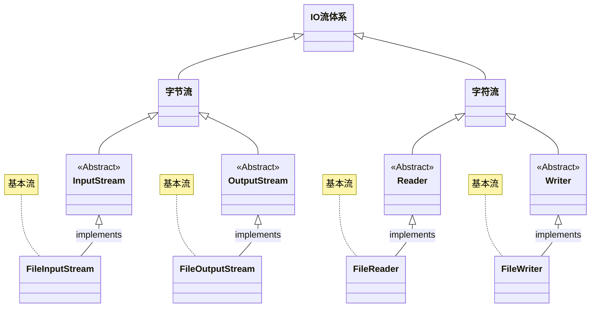

# 第一章：IO 流体系

## 1.1 概述

* 之前，我们已经学习过了 IO 流体系，如下所示：

> [!NOTE]
>
> * ① 在实际开发中，我们经常使用最下面的四个流，即：FileInputStream、FileOutputStream、FileReader 以及 FileWriter 。
> * ② 上述的四个流是 IO 流体系中最基本、最常用的流，我们也称为基本流。

## 1.2 高级流

# 第二章：缓冲流

# 第三章：转换流

# 第四章：序列化流

# 第五章：打印流

# 第六章：压缩流和解压缩流

# 第七章：常用工具包

## 7.1 概述

