# 第一章：IO 流体系

## 1.1 概述

* 之前，我们已经学习过了 IO 流体系，如下所示：

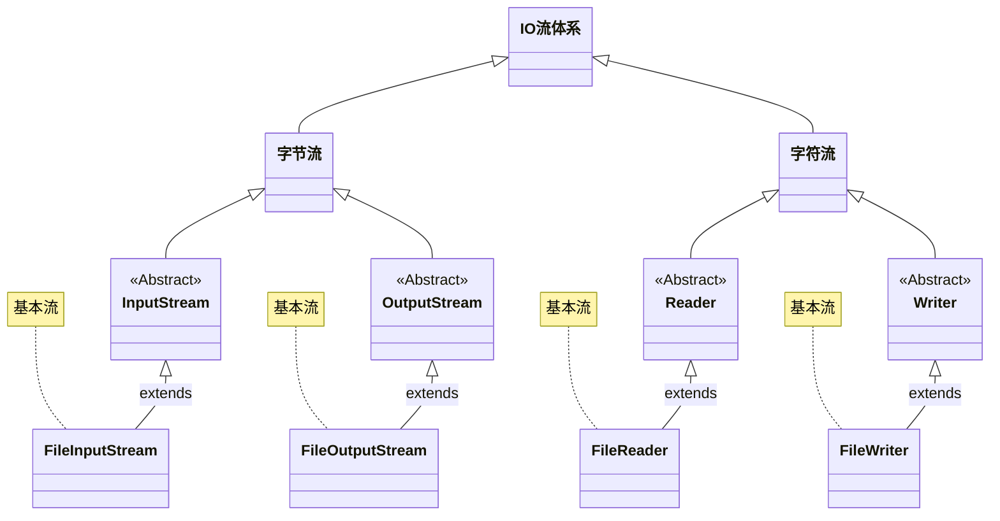
```mermaid
classDiagram
    IO 流体系 <|-- 字节流 
    IO 流体系 <|-- 字符流 
    字节流 <|-- InputStream 
    字节流 <|-- OutputStream 
    字符流 <|-- Reader 
    字符流 <|-- Writer 
    InputStream <|-- FileInputStream :extends
    note for FileInputStream "基本流" 
    OutputStream <|-- FileOutputStream :extends
    note for FileOutputStream "基本流" 
    Reader <|-- FileReader :extends
    note for FileReader "基本流" 
    Writer <|-- FileWriter :extends
    note for FileWriter "基本流" 
    class InputStream{
        <<Abstract>>
    }
    class OutputStream{
        <<Abstract>>
    }
    class Reader{
        <<Abstract>>
    }
    class Writer{
        <<Abstract>>
    }

```

> [!NOTE]
>
> * ① 在实际开发中，我们经常使用最下面的四个流，即：`FileInputStream`、`FileOutputStream`、`FileReader` 以及 `FileWriter` 。
> * ② 上述的四个流是 IO 流体系中最基本、最常用的流，我们也称为基本流。

## 1.2 高级流

* 高级流就是对基本流进行了一层封装，额外增加了一些新的功能，如：基本流操作效率太慢，给它们增加缓冲区。


```mermaid
classDiagram
    IO 流体系 <|-- 字节流 
    IO 流体系 <|-- 字符流 
    字节流 <|-- InputStream 
    字节流 <|-- OutputStream 
    字符流 <|-- Reader 
    字符流 <|-- Writer 
    InputStream <|-- FileInputStream :extends
    note for FileInputStream "基本流" 
    InputStream <|-- BufferedInputStream :extends
    note for BufferedInputStream "高级流" 
    OutputStream <|-- FileOutputStream :extends
    note for FileOutputStream "基本流" 
    OutputStream <|-- BufferedOutputStream :extends
    note for BufferedOutputStream "高级流" 
    Reader <|-- FileReader :extends
    note for FileReader "基本流" 
    Reader <|-- BufferedReader :extends
    note for BufferedReader "高级流"
    Writer <|-- FileWriter :extends
    note for FileWriter "基本流" 
    Writer <|-- BufferedWriter :extends
    note for BufferedReader "高级流"
    class InputStream{
        <<Abstract>>
    }
    class OutputStream{
        <<Abstract>>
    }
    class Reader{
        <<Abstract>>
    }
    class Writer{
        <<Abstract>>
    }

```

* `字节流`的`基本流`是没有缓冲区的，而`字节流`的`缓冲流`提供了缓冲区，所以效率提升的很明显。
* `字符流`的`基本流`本来就有缓冲区，所以`字符流`的`缓冲流`的效率提升的并不是很明显；但是，字符流的缓冲流提供了几个好用的方法。


# 第二章：缓冲流

## 2.1 概述

* 对于`字节流`和`字符流`，Java 都提供了对应的`缓冲流`，每一种`缓冲流`又有`输入`和`输出`之分。

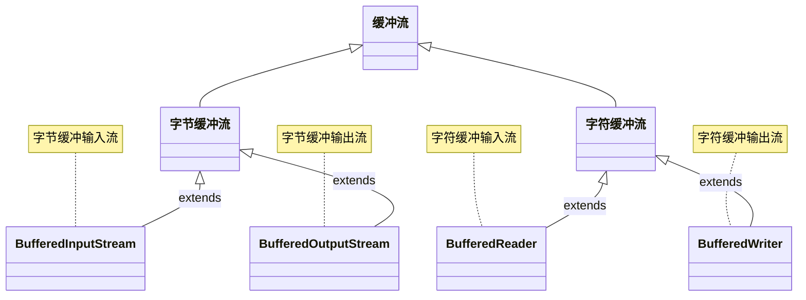
```mermaid
classDiagram
    缓冲流 <|-- 字节缓冲流
    缓冲流 <|-- 字符缓冲流
    字节缓冲流 <|-- BufferedInputStream :extends
    note for BufferedInputStream "字节缓冲输入流"
    字节缓冲流 <|-- BufferedOutputStream :extends
    note for BufferedOutputStream "字节缓冲输出流"
    字符缓冲流 <|-- BufferedReader :extends
    note for BufferedReader "字符缓冲输入流"
    字符缓冲流 <|-- BufferedWriter :extends
    note for BufferedWriter "字符缓冲输出流"
```

* 上述的四个流是`高级流`，是因为其需要依赖`基本流`，即：其是在基本流基础上增加了缓冲区。

::: code-group

```java [BufferedInputStream.java]
public class BufferedInputStream extends FilterInputStream {
    
    public BufferedInputStream(InputStream in) {
        this(in, DEFAULT_BUFFER_SIZE);
    }
    
    ...
}
```

```java [BufferedOutputStream.java]
public class BufferedOutputStream extends FilterOutputStream {
    
    public BufferedOutputStream(OutputStream out) {
        this(out, 8192);
    }
    
    ...
}
```

:::

::: code-group

```java [BufferedReader.java]
public class BufferedReader extends Reader {
    
	public BufferedReader(Reader in) {
        this(in, defaultCharBufferSize);
    }
    
    ...
}
```

```java [BufferedWriter.java]
public class BufferedWriter extends Writer {
    
    public BufferedWriter(Writer out) {
        this(out, defaultCharBufferSize);
    }
    
    ...
}
```

:::

## 2.2 字节缓冲流

### 2.2.1 概述

* `字节缓冲流`分为`字节缓冲输入流`和`字节缓冲输出流`。

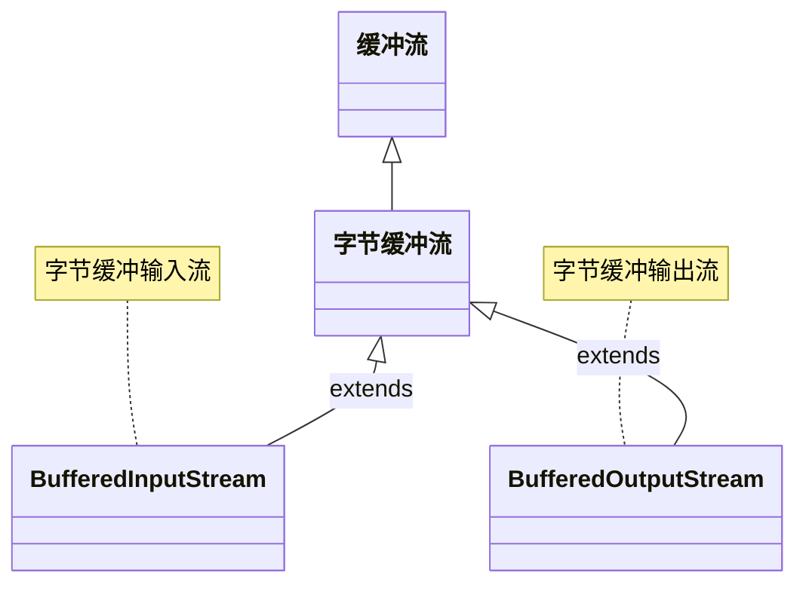
```mermaid
classDiagram
    缓冲流 <|-- 字节缓冲流
    字节缓冲流 <|-- BufferedInputStream :extends
    note for BufferedInputStream "字节缓冲输入流"
    字节缓冲流 <|-- BufferedOutputStream :extends
    note for BufferedOutputStream "字节缓冲输出流"
```

* `字节缓冲流`提高性能的原因：在于底层自带了长度为 `8192` 的缓冲区。

> [!NOTE]
>
> 利用缓冲区一次可以读写 8192 了字节，减少了 IO 操作的次数，从而提高了性能！！！

::: code-group

```java [BufferedInputStream.java]
public class BufferedInputStream extends FilterInputStream {
    
    private static int DEFAULT_BUFFER_SIZE = 8192; // [!code highlight]
    
    protected volatile byte[] buf; // [!code highlight]
    
    public BufferedInputStream(InputStream in) {
        this(in, DEFAULT_BUFFER_SIZE); // [!code highlight]
    }
    
    public BufferedInputStream(InputStream in, int size) {
        super(in);
        if (size <= 0) {
            throw new IllegalArgumentException("Buffer size <= 0");
        }
        buf = new byte[size]; // [!code highlight]
    }
    
}
```

```java [BufferedOutputStream.java]
public class BufferedOutputStream extends FilterOutputStream {
    
    protected byte buf[]; // [!code highlight]
    
    public BufferedOutputStream(OutputStream out) {
        this(out, 8192); // [!code highlight]
    }
    
    public BufferedOutputStream(OutputStream out, int size) {
        super(out);
        if (size <= 0) {
            throw new IllegalArgumentException("Buffer size <= 0");
        }
        buf = new byte[size]; // [!code highlight]
    }
}
```

:::

### 2.2.2 常用 API

* 创建`字节缓冲输入流`或`字节缓冲输出流`的对象：

| 方法名称                                           | 描述                                       |
| -------------------------------------------------- | ------------------------------------------ |
| `public BufferedInputStream(InputStream in){}`     | 将基本流包装为高级流，提高了读取数据的性能 |
| `public BufferedOutputStream(OutputStream out) {}` | 将基本流包装为高级流，提高了写出数据的性能 |

* 写出数据或读取数据：

| 方法名称                                                     | 描述                                     |
| ------------------------------------------------------------ | ---------------------------------------- |
| `public void write(int b) throws IOException {}`             | 一次写一个字节的数据                     |
| `public void write(byte b[], int off, int len) throws IOException {}` | 一次写入一个字节数组的一部分             |
| `public int read() throws IOException {}`                    | 一次读取一个字节的数据                   |
| `public int read(byte b[]) throws IOException {}`            | 一次读取多个字节的数据，并尽量将数组装满 |

* 释放流：

| 方法名称                                    | 描述     |
| ------------------------------------------- | -------- |
| `public void close() throws IOException {}` | 释放资源 |

> [!NOTE]
>
> 只需要关闭最外层的高级流就可以了，内部的基本流会帮我们关闭！！！


* 示例：复制文件

::: code-group

```java [Test.java]
package com.github.io;

import java.io.*;

public class Test {
    public static void main(String[] args) throws IOException {
        // 创建字节缓冲流对象
        BufferedInputStream bis = new BufferedInputStream(
            new FileInputStream("d:\\a.txt"));
        BufferedOutputStream bos = new BufferedOutputStream(
            new FileOutputStream("d:\\b.txt"));

        // 复制文件
        int b;
        while ((b = bis.read()) != -1) {
            bos.write(b);
        }

        // 释放资源
        bos.close();
        bis.close();
    }

}
```

```md:img [cmd 控制台]

```

:::

### 2.2.3 原理

* 当我们在创建`字节缓冲输入流`对象的时候，如下所示：

```java
BufferedInputStream bis = new BufferedInputStream(
    new FileInputStream("d:\\a.txt"));
```

* 相当于 Java 程序（内存）和文件（数据源）之间建立了一个连接的通道：

> [!NOTE]
>
> * ① 在内存中开辟了一个长度为 8192 的字节数组（缓冲区）！！！
> * ② 真正从文件中读取数据的还是基本流 FileInputStream，其会从文件中读取数据，再交给字节缓冲输入流内部的缓冲区中。


* 当我们创建`字节缓冲输出流`对象的时候，如下所示：

```java
BufferedOutputStream bos = new BufferedOutputStream(
    new FileOutputStream("day23\\b.txt"));
```

* 相当于 Java 程序（内存）和文件（目的地）之间建立了一个连接的通道：

> [!NOTE]
>
> * ① 在内存中开辟了一个长度为 8192 的字节数组（缓冲区）！！！
> * ② 真正将数据写出到从文件中的还是基本流 FileOutputStream，会将数据写出到缓冲流的缓冲区中，然后将缓冲区中的数据刷新到文件中。


* 当我们通过循环对数据进行边读编写，如下所示：

```java
int b;
while ((b = bis.read()) != -1) {
    bos.write(b);
}
```

* 相当于内存中有一个临时变量 b，然后从`字节输入流`的缓冲区中将数据复制到临时变量中，再将临时变量中的数据复制到`字节输出流`的缓冲区中。

> [!NOTE]
>
> * ① 基本流会从文件中读取数据，一次性会读取 8192 个字节数据，并存放到字节缓冲输入流缓冲区中。
> * ② 中间变量 b ，就是在两个缓冲区之间不停地搬运数据。
> * ③ 当字节缓冲输出流缓冲区满了，就会将数据交给基本流，让其自动的将数据刷新到文件中。


### 2.2.4 综合练习

* 需求：分别使用`基本流`和`缓冲流`进行大文件的拷贝，并统计各自耗时。


* 示例：

::: code-group

```java [Test.java]
package com.github.io;

import java.io.*;
import java.time.Instant;
import java.time.temporal.ChronoUnit;

public class Test {
    public static void main(String[] args) throws IOException {
        File src = new File("D:\\ProPlus2021Retail.img");
        File dest = new File("D:\\ProPlus2021Retail-base.img");
        File dest2 = new File("D:\\ProPlus2021Retail-gender.img");

        System.out.println(copyFormBase(src, dest)); // 22853
        System.out.println(copyFormGender(src, dest2)); // 5603
    }

    public static long copyFormBase(File src, File dest) {
        Instant start = Instant.now();
        try (
                InputStream fis = new FileInputStream(src);
                OutputStream fos = new FileOutputStream(dest)) {
            byte[] buffer = new byte[1024];
            int len;
            while ((len = fis.read(buffer)) != -1) {
                fos.write(buffer, 0, len);
            }
        } catch (IOException e) {
            e.printStackTrace();
        }

        Instant end = Instant.now();
        return ChronoUnit.MILLIS.between(start, end);
    }


    public static long copyFormGender(File src, File dest) {
        Instant start = Instant.now();
        try (
                BufferedInputStream bis = new BufferedInputStream(
                    new FileInputStream(src));
                BufferedOutputStream bos = new BufferedOutputStream(
                    new FileOutputStream(dest))) {
            byte[] buffer = new byte[1024];
            int len;
            while ((len = bis.read(buffer)) != -1) {
                bos.write(buffer, 0, len);
            }
        } catch (IOException e) {
            e.printStackTrace();
        }

        Instant end = Instant.now();
        return ChronoUnit.MILLIS.between(start, end);
    }

}
```

```md:img [cmd 控制台]
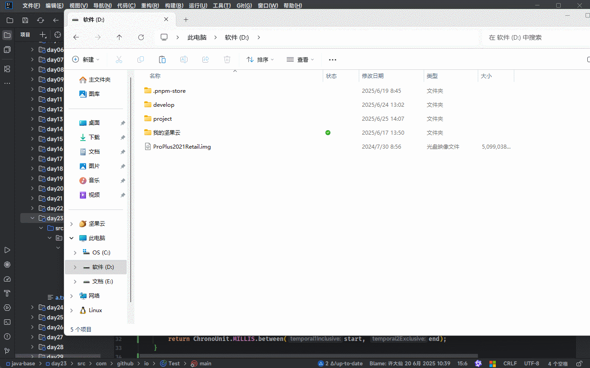
```

:::

## 2.3 字符缓冲流

### 2.3.1 概述

* `字符缓冲流`分为`字符缓冲输入流`和`字符缓冲输出流`。

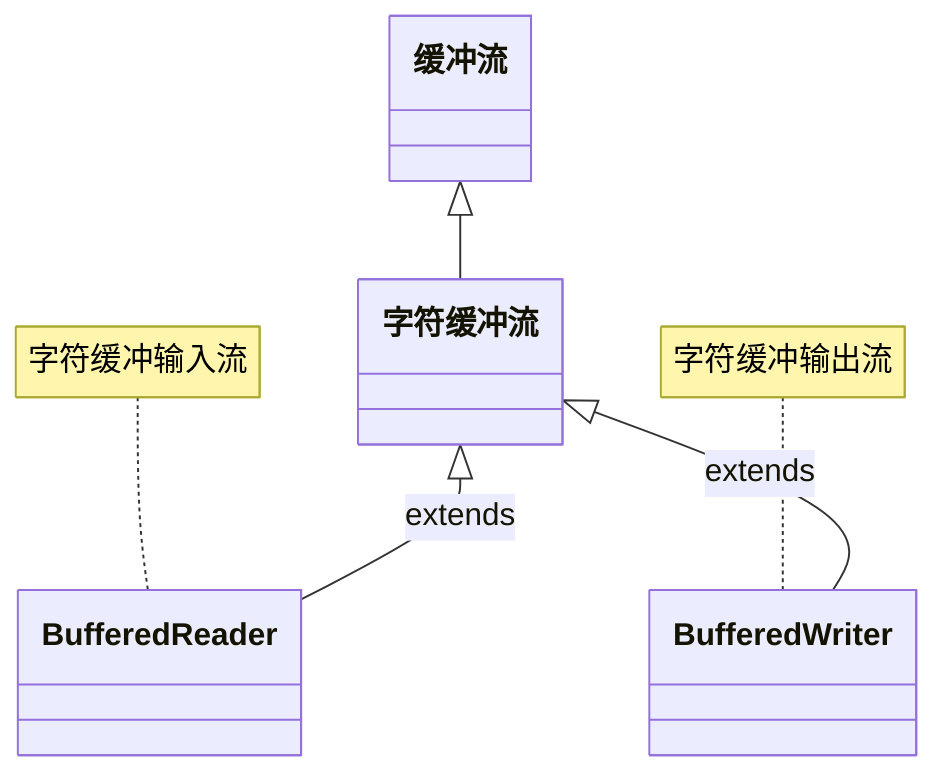
```mermaid
classDiagram
    缓冲流 <|-- 字符缓冲流
    字符缓冲流 <|-- BufferedReader :extends
    note for BufferedReader "字符缓冲输入流"
    字符缓冲流 <|-- BufferedWriter :extends
    note for BufferedWriter "字符缓冲输出流"
```

* 我们知道字符基本流本身就自带了 8192 的缓冲区，所以字符缓冲流的效率提升的并不是很明显。

> [!NOTE]
>
> 利用缓冲区一次可以读写 8192 了字符，减少了 IO 操作的次数，从而提高了性能！！！

::: code-group

```java [BufferedInputStream.java]
public class BufferedReader extends Reader {
    
    private static int defaultCharBufferSize = 8192; // [!code highlight]
    
    private char[] cb; // [!code highlight]
    
    public BufferedReader(Reader in) {
        this(in, defaultCharBufferSize); // [!code highlight]
    }
    
    public BufferedReader(Reader in, int sz) {
        super(in);
        if (sz <= 0)
            throw new IllegalArgumentException("Buffer size <= 0");
        this.in = in;
        cb = new char[sz]; // [!code highlight]
        nextChar = nChars = 0;
    }
    
}
```

```java [BufferedOutputStream.java]
public class BufferedWriter extends Writer { 
    
    private static int defaultCharBufferSize = 8192; // [!code highlight]
    
    private char cb[]; // [!code highlight]
    
    public BufferedWriter(Writer out) {
        this(out, defaultCharBufferSize); // [!code highlight]
    }
    
    public BufferedWriter(Writer out, int sz) {
        super(out);
        if (sz <= 0)
            throw new IllegalArgumentException("Buffer size <= 0");
        this.out = out;
        cb = new char[sz]; // [!code highlight]
        nChars = sz;
        nextChar = 0;
    }
}
```

:::

### 2.3.2 常用 API

* 创建`字符缓冲输入流`或`字符缓冲输出流`的对象：

| 方法名称                               | 描述                                       |
| -------------------------------------- | ------------------------------------------ |
| `public BufferedReader(Reader in) {}`  | 将基本流包装为高级流，提高了读取数据的性能 |
| `public BufferedWriter(Writer out) {}` | 将基本流包装为高级流，提高了写出数据的性能 |

* 写出数据或读取数据：

| 方法名称                                                     | 描述                                                         |
| ------------------------------------------------------------ | ------------------------------------------------------------ |
| `public void write(int c) throws IOException`                | 一次写一个字符的数据                                         |
| `public void write(String str) throws IOException{}`         | 一次写一个字符串的数据                                       |
| `public void write(String str, int off, int len) throws IOException{}` | 一次写一个字符串的数据的一部分                               |
| `public void write(char cbuf[]) throws IOException {}`       | 一次写一个字符数组                                           |
| `public  void write(char cbuf[], int off, int len) throws IOException {}` | 一次写字符数组的一部分                                       |
| `public void newLine() throws IOException {}`                | 跨平台换行【BufferedWriter 特有】                            |
| `public int read() throws IOException{}`                     | 一次读取一个字符的数据                                       |
| `public int read(char[] cbuf) throws IOException{}`          | 一次读取多个字符的数据，并尽量将数组装满                     |
| `public String readLine() throws IOException{}`              | 一次读取一行数据；如果没有数据可读，返回 null【BufferedReader 特有】 |

* 释放资源：

| 方法名称                                    | 描述     |
| ------------------------------------------- | -------- |
| `public void close() throws IOException {}` | 释放资源 |


* 示例：

::: code-group

```java [Test.java]
package com.github.io;

import java.io.BufferedReader;
import java.io.FileReader;
import java.io.IOException;

public class Test {
    public static void main(String[] args) throws IOException {
        // 创建字符缓冲输入流
        BufferedReader reader = new BufferedReader(
            new FileReader("day23\\a.txt"));
        // 读取数据
        String line;
        while ((line = reader.readLine()) != null) {
            System.out.println(line);
        }
        // 释放资源
        reader.close();
    }


}
```

```md:img [cmd 控制台]
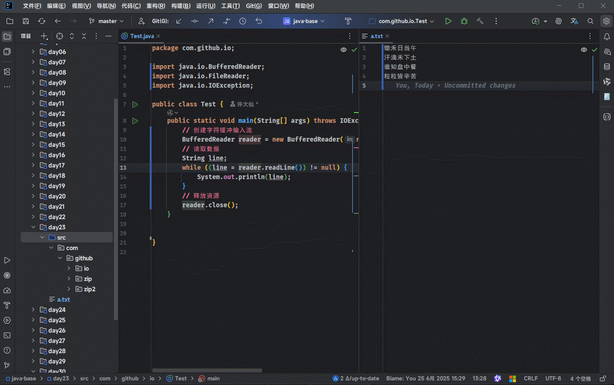
```

:::


* 示例：

::: code-group

```java [Test.java]
package com.github.io;

import java.io.BufferedWriter;
import java.io.FileWriter;
import java.io.IOException;

public class Test {
    public static void main(String[] args) throws IOException {
        // 创建字符缓冲输出流
        BufferedWriter writer = new BufferedWriter(
            new FileWriter("day23\\a.txt", true));
        // 写出数据
        writer.write("呵呵");
        writer.newLine();
        writer.write("哈哈");
        writer.newLine();
        writer.write("嘻嘻");
        writer.newLine();
        // 释放资源
        writer.close();
    }

}
```

```md:img [cmd 控制台]
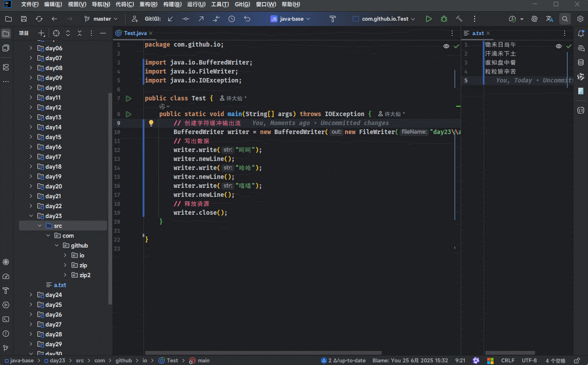
```

:::

### 2.3.3 综合练习

* 需求：复制文本文件。


* 示例：

::: code-group

```java [Test.java]
package com.github.io;

import java.io.BufferedWriter;
import java.io.FileWriter;
import java.io.IOException;

public class Test {
    public static void main(String[] args) throws IOException {
        // 创建字符缓冲输出流
        BufferedWriter writer = new BufferedWriter(
            new FileWriter("day23\\a.txt", true));
        // 写出数据
        writer.write("呵呵");
        writer.newLine();
        writer.write("哈哈");
        writer.newLine();
        writer.write("嘻嘻");
        writer.newLine();
        // 释放资源
        writer.close();
    }

}
```

```md:img [cmd 控制台]
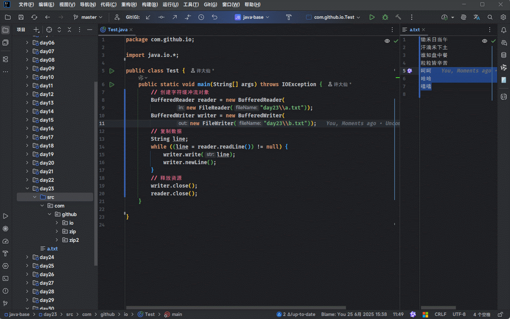
```

:::

## 2.4 综合练习

### 2.4.1 综合练习一

* 需求：四种方式拷贝文件，并统计各自耗时。

> [!NOTE]
>
> * ① 字节流的基本流：一次读取一个字节。
> * ② 字节流的基本流：一次读取一个字节数组。
> * ② 字节流的缓冲流：一次读取一个字节。
> * ③ 字节流的缓冲流：一次读取一个字节数组。


* 示例：

::: code-group

```java [Test.java]
package com.github.io;

import java.io.*;
import java.time.Instant;
import java.time.temporal.ChronoUnit;

public class Test {
    public static void main(String[] args) throws IOException {
        File src = new File("D:\\movie.mp4");
        File dest1 = new File("D:\\movie-1.mp4");
        File dest2 = new File("D:\\movie-2.mp4");
        File dest3 = new File("D:\\movie-3.mp4");
        File dest4 = new File("D:\\movie-4.mp4");

        System.out.println(copyFormBase(src, dest1)); // 118194
        System.out.println(copyFormBase1024(src, dest2)); // 156
        System.out.println(copyFormGender(src, dest3)); // 276
        System.out.println(copyFormGender1024(src, dest4)); // 42

    }


    public static long copyFormBase(File src, File dest) {
        Instant start = Instant.now();
        try (
                InputStream fis = new FileInputStream(src);
                OutputStream fos = new FileOutputStream(dest)) {
            int b;
            while ((b = fis.read()) != -1) {
                fos.write(b);
            }
        } catch (IOException e) {
            e.printStackTrace();
        }

        Instant end = Instant.now();
        return ChronoUnit.MILLIS.between(start, end);
    }

    public static long copyFormBase1024(File src, File dest) {
        Instant start = Instant.now();
        try (
                InputStream fis = new FileInputStream(src);
                OutputStream fos = new FileOutputStream(dest)) {
            byte[] buffer = new byte[1024];
            int len;
            while ((len = fis.read(buffer)) != -1) {
                fos.write(buffer, 0, len);
            }
        } catch (IOException e) {
            e.printStackTrace();
        }

        Instant end = Instant.now();
        return ChronoUnit.MILLIS.between(start, end);
    }

    public static long copyFormGender(File src, File dest) {
        Instant start = Instant.now();
        try (
                BufferedInputStream bis = new BufferedInputStream(
                        new FileInputStream(src));
                BufferedOutputStream bos = new BufferedOutputStream(
                        new FileOutputStream(dest))) {
            int b;
            while ((b = bis.read()) != -1) {
                bos.write(b);
            }
        } catch (IOException e) {
            e.printStackTrace();
        }

        Instant end = Instant.now();
        return ChronoUnit.MILLIS.between(start, end);
    }

    public static long copyFormGender1024(File src, File dest) {
        Instant start = Instant.now();
        try (
                BufferedInputStream bis = new BufferedInputStream(
                        new FileInputStream(src));
                BufferedOutputStream bos = new BufferedOutputStream(
                        new FileOutputStream(dest))) {
            byte[] buffer = new byte[1024];
            int len;
            while ((len = bis.read(buffer)) != -1) {
                bos.write(buffer, 0, len);
            }
        } catch (IOException e) {
            e.printStackTrace();
        }

        Instant end = Instant.now();
        return ChronoUnit.MILLIS.between(start, end);
    }

}
```

```md:img [cmd 控制台]
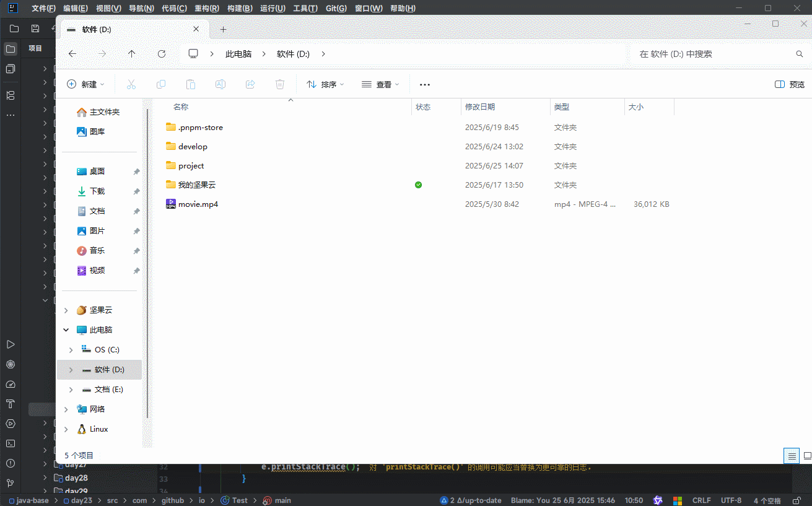
```

:::

### 2.4.2 综合练习二

* 需求：将《出师表》的文章顺序按照从小到大排序，然后再写回到文件中。

> [!NOTE]
>
> 《出师表》文章的内容，如下所示：
>
> ```txt
> 3.侍中、侍郎郭攸之、费祎、董允等，此皆良实，志虑忠纯，是以先帝简拔以遗陛下。愚以为宫中之事，事无大小，悉以咨之，然后施行，必得裨补阙漏，有所广益。
> 8.愿陛下托臣以讨贼兴复之效，不效，则治臣之罪，以告先帝之灵。若无兴德之言，则责攸之、祎、允等之慢，以彰其咎；陛下亦宜自谋，以咨诹善道，察纳雅言，深追先帝遗诏，臣不胜受恩感激。
> 4.将军向宠，性行淑均，晓畅军事，试用之于昔日，先帝称之曰能，是以众议举宠为督。愚以为营中之事，悉以咨之，必能使行阵和睦，优劣得所。
> 2.宫中府中，俱为一体，陟罚臧否，不宜异同。若有作奸犯科及为忠善者，宜付有司论其刑赏，以昭陛下平明之理，不宜偏私，使内外异法也。
> 1.先帝创业未半而中道崩殂，今天下三分，益州疲弊，此诚危急存亡之秋也。然侍卫之臣不懈于内，忠志之士忘身于外者，盖追先帝之殊遇，欲报之于陛下也。诚宜开张圣听，以光先帝遗德，恢弘志士之气，不宜妄自菲薄，引喻失义，以塞忠谏之路也。
> 9.今当远离，临表涕零，不知所言。
> 6.臣本布衣，躬耕于南阳，苟全性命于乱世，不求闻达于诸侯。先帝不以臣卑鄙，猥自枉屈，三顾臣于草庐之中，咨臣以当世之事，由是感激，遂许先帝以驱驰。后值倾覆，受任于败军之际，奉命于危难之间，尔来二十有一年矣。
> 7.先帝知臣谨慎，故临崩寄臣以大事也。受命以来，夙夜忧叹，恐付托不效，以伤先帝之明，故五月渡泸，深入不毛。今南方已定，兵甲已足，当奖率三军，北定中原，庶竭驽钝，攘除奸凶，兴复汉室，还于旧都。此臣所以报先帝而忠陛下之职分也。至于斟酌损益，进尽忠言，则攸之、祎、允之任也。
> 5.亲贤臣，远小人，此先汉所以兴隆也；亲小人，远贤臣，此后汉所以倾颓也。先帝在时，每与臣论此事，未尝不叹息痛恨于桓、灵也。侍中、尚书、长史、参军，此悉贞良死节之臣，愿陛下亲之信之，则汉室之隆，可计日而待也。
> ```


* 示例：

::: code-group

```java [Test.java]
package com.github.io;

import java.io.*;
import java.util.ArrayList;
import java.util.Comparator;
import java.util.List;

public class Test {
    public static void main(String[] args) throws IOException {
        // 将《出师表》读取进来，并保存到 List 集合中
        List<String> resultList = new ArrayList<>();
        BufferedReader reader = new BufferedReader(
                new FileReader("day23\\csb.txt"));

        String line;
        while ((line = reader.readLine()) != null) {
            resultList.add(line);
        }
		reader.close();
        
        // 对 List 集合进行排序
        resultList.sort(Comparator.naturalOrder());

        // 写回到文件中
        BufferedWriter writer = new BufferedWriter(
                new FileWriter("day23\\csb.txt"));

        resultList.forEach(str -> {
            try {
                writer.write(str);
                writer.newLine();
            } catch (IOException e) {
                throw new RuntimeException(e);
            }
        });

        writer.close();
        
    }
}
```

```md:img [cmd 控制台]
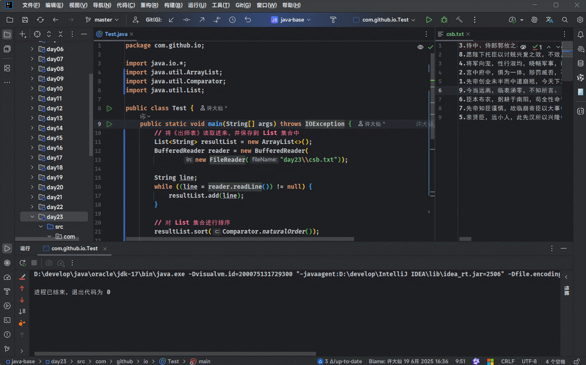
```

:::

### 2.4.3 综合练习三

* 需要：控制软件运行的次数。

> [!NOTE]
>
> * ① 当程序运行超过 3 次的时候给出提示：本软件只能免费使用 3 次，欢迎您注册会员后继续使用～
> * ② 程序运行演示如下：
>   * 第一次运行控制台输出：欢迎使用本软件，第 1 次使用免费～
>   * 第二次运行控制台输出：欢迎使用本软件，第 2 次使用免费～
>   * 第三次运行控制台输出：欢迎使用本软件，第 3 次使用免费～
>   * 第四次及之后运行控制台输出：本软件只能免费使用 3 次，欢迎您注册会员后继续使用～


* 示例：

::: code-group

``` java [Test.java]
package com.github.io;

import java.io.*;

public class Test {
    public static void main(String[] args) throws IOException {
        // 从文件中读取软件运行的次数
        File file = new File("day23\\count.txt");
        if (!file.exists()) {
            BufferedWriter writer = new BufferedWriter(new FileWriter(file));
            writer.write("0");
            writer.flush();
            writer.close();
        }
        BufferedReader reader = new BufferedReader(new FileReader(file));
        String line = reader.readLine();
        reader.close();
        int count = Integer.parseInt(line);
        // 计数+1
        count++;
        if (count <= 3) {
            System.out.println("欢迎使用本软件,第" + count + "次使用免费~");
        } else {
            System.out.println("本软件只能免费使用3次,欢迎您注册会员后继续使用~");
        }
        // 写回去
        BufferedWriter writer = new BufferedWriter(new FileWriter(file));
        writer.write(String.valueOf(count));
        writer.flush();
        writer.close();

    }

}
```

```md:img [cmd 控制台]
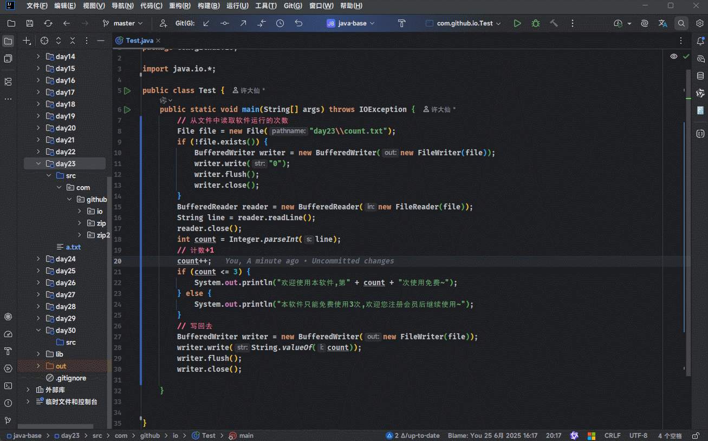
```

:::


# 第三章：转换流

## 3.1 概述


# 第四章：序列化流


# 第五章：打印流


# 第六章：压缩流和解压缩流


# 第七章：常用工具包

## 7.1 概述


