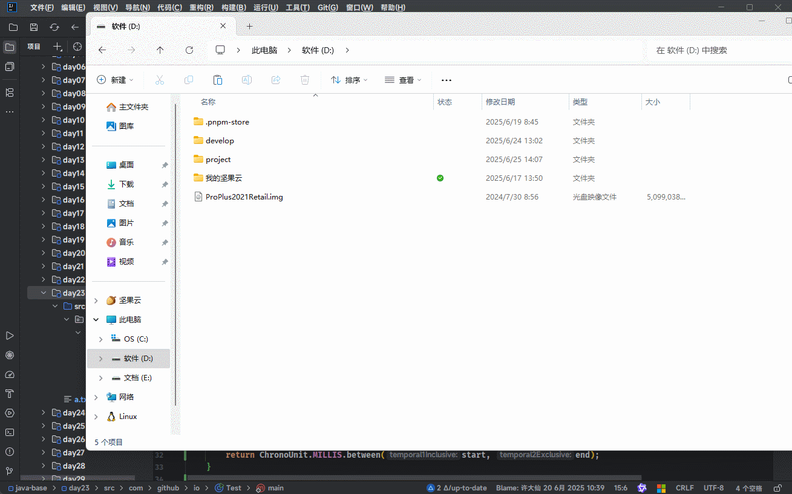

# 第一章：IO 流体系（⭐）

## 1.1 概述

* 之前，我们已经学习过了 IO 流体系，如下所示：


> [!NOTE]
>
> * ① 在实际开发中，我们经常使用最下面的四个流，即：`FileInputStream`、`FileOutputStream`、`FileReader` 以及 `FileWriter` 。
> * ② 上述的四个流是 IO 流体系中最基本、最常用的流，我们也称为基本流。

## 1.2 高级流

* 高级流就是对基本流进行了一层封装，额外增加了一些新的功能，如：基本流操作效率太慢，给它们增加缓冲区。


* `字节流`的`基本流`是没有缓冲区的，而`字节流`的`缓冲流`提供了缓冲区，所以效率提升的很明显。
* `字符流`的`基本流`本来就有缓冲区，所以`字符流`的`缓冲流`的效率提升的并不是很明显；但是，字符流的缓冲流提供了几个好用的方法。


# 第二章：缓冲流（⭐）

## 2.1 概述

* 对于`字节流`和`字符流`，Java 都提供了对应的`缓冲流`，每一种`缓冲流`又有`输入`和`输出`之分。


* 上述的四个流是`高级流`，是因为其需要依赖`基本流`，即：其是在基本流基础上增加了缓冲区。

::: code-group

```java [BufferedInputStream.java]
public class BufferedInputStream extends FilterInputStream {
    
    public BufferedInputStream(InputStream in) {
        this(in, DEFAULT_BUFFER_SIZE);
    }
    
    ...
}
```

```java [BufferedOutputStream.java]
public class BufferedOutputStream extends FilterOutputStream {
    
    public BufferedOutputStream(OutputStream out) {
        this(out, 8192);
    }
    
    ...
}
```

:::

::: code-group

```java [BufferedReader.java]
public class BufferedReader extends Reader {
    
	public BufferedReader(Reader in) {
        this(in, defaultCharBufferSize);
    }
    
    ...
}
```

```java [BufferedWriter.java]
public class BufferedWriter extends Writer {
    
    public BufferedWriter(Writer out) {
        this(out, defaultCharBufferSize);
    }
    
    ...
}
```

:::

## 2.2 字节缓冲流

### 2.2.1 概述

* `字节缓冲流`分为`字节缓冲输入流`和`字节缓冲输出流`。


* `字节缓冲流`提高性能的原因：在于底层自带了长度为 `8192` 的缓冲区。

> [!NOTE]
>
> 利用缓冲区一次可以读写 8192 了字节，减少了 IO 操作的次数，从而提高了性能！！！

::: code-group

```java [BufferedInputStream.java]
public class BufferedInputStream extends FilterInputStream {
    
    private static int DEFAULT_BUFFER_SIZE = 8192; // [!code highlight]
    
    protected volatile byte[] buf; // [!code highlight]
    
    public BufferedInputStream(InputStream in) {
        this(in, DEFAULT_BUFFER_SIZE); // [!code highlight]
    }
    
    public BufferedInputStream(InputStream in, int size) {
        super(in);
        if (size <= 0) {
            throw new IllegalArgumentException("Buffer size <= 0");
        }
        buf = new byte[size]; // [!code highlight]
    }
    
}
```

```java [BufferedOutputStream.java]
public class BufferedOutputStream extends FilterOutputStream {
    
    protected byte buf[]; // [!code highlight]
    
    public BufferedOutputStream(OutputStream out) {
        this(out, 8192); // [!code highlight]
    }
    
    public BufferedOutputStream(OutputStream out, int size) {
        super(out);
        if (size <= 0) {
            throw new IllegalArgumentException("Buffer size <= 0");
        }
        buf = new byte[size]; // [!code highlight]
    }
}
```

:::

### 2.2.2 常用 API

* 创建`字节缓冲输入流`或`字节缓冲输出流`的对象：

| 构造方法                                           | 描述                                       |
| -------------------------------------------------- | ------------------------------------------ |
| `public BufferedInputStream(InputStream in){}`     | 将基本流包装为高级流，提高了读取数据的性能 |
| `public BufferedOutputStream(OutputStream out) {}` | 将基本流包装为高级流，提高了写出数据的性能 |

* 写出数据或读取数据：

| 方法名称                                                     | 描述                                     |
| ------------------------------------------------------------ | ---------------------------------------- |
| `public void write(int b) throws IOException {}`             | 一次写一个字节的数据                     |
| `public void write(byte b[], int off, int len) throws IOException {}` | 一次写入一个字节数组的一部分             |
| `public int read() throws IOException {}`                    | 一次读取一个字节的数据                   |
| `public int read(byte b[]) throws IOException {}`            | 一次读取多个字节的数据，并尽量将数组装满 |

* 释放流：

| 方法名称                                    | 描述     |
| ------------------------------------------- | -------- |
| `public void close() throws IOException {}` | 释放资源 |

> [!NOTE]
>
> 只需要关闭最外层的高级流就可以了，内部的基本流会帮我们关闭！！！


* 示例：复制文件

::: code-group

```java [Test.java]
package com.github.io;

import java.io.*;

public class Test {
    public static void main(String[] args) throws IOException {
        // 创建字节缓冲流对象
        BufferedInputStream bis = new BufferedInputStream(
            new FileInputStream("d:\\a.txt"));
        BufferedOutputStream bos = new BufferedOutputStream(
            new FileOutputStream("d:\\b.txt"));

        // 复制文件
        int b;
        while ((b = bis.read()) != -1) {
            bos.write(b);
        }

        // 释放资源
        bos.close();
        bis.close();
    }

}
```

```md:img [cmd 控制台]

```

:::

### 2.2.3 原理

* 当我们在创建`字节缓冲输入流`对象的时候，如下所示：

```java
BufferedInputStream bis = new BufferedInputStream(
    new FileInputStream("d:\\a.txt"));
```

* 相当于 Java 程序（内存）和文件（数据源）之间建立了一个连接的通道：

> [!NOTE]
>
> * ① 在内存中开辟了一个长度为 8192 的字节数组（缓冲区）！！！
> * ② 真正从文件中读取数据的还是基本流 FileInputStream，其会从文件中读取数据，再交给字节缓冲输入流内部的缓冲区中。


* 当我们创建`字节缓冲输出流`对象的时候，如下所示：

```java
BufferedOutputStream bos = new BufferedOutputStream(
    new FileOutputStream("day23\\b.txt"));
```

* 相当于 Java 程序（内存）和文件（目的地）之间建立了一个连接的通道：

> [!NOTE]
>
> * ① 在内存中开辟了一个长度为 8192 的字节数组（缓冲区）！！！
> * ② 真正将数据写出到从文件中的还是基本流 FileOutputStream，会将数据写出到缓冲流的缓冲区中，然后将缓冲区中的数据刷新到文件中。


* 当我们通过循环对数据进行边读编写，如下所示：

```java
int b;
while ((b = bis.read()) != -1) {
    bos.write(b);
}
```

* 相当于内存中有一个临时变量 b，然后从`字节输入流`的缓冲区中将数据复制到临时变量中，再将临时变量中的数据复制到`字节输出流`的缓冲区中。

> [!NOTE]
>
> * ① 基本流会从文件中读取数据，一次性会读取 8192 个字节数据，并存放到字节缓冲输入流缓冲区中。
> * ② 中间变量 b ，就是在两个缓冲区之间不停地搬运数据。
> * ③ 当字节缓冲输出流缓冲区满了，就会将数据交给基本流，让其自动的将数据刷新到文件中。


### 2.2.4 综合练习

* 需求：分别使用`基本流`和`缓冲流`进行大文件的拷贝，并统计各自耗时。


* 示例：

::: code-group

```java [Test.java]
package com.github.io;

import java.io.*;
import java.time.Instant;
import java.time.temporal.ChronoUnit;

public class Test {
    public static void main(String[] args) throws IOException {
        File src = new File("D:\\ProPlus2021Retail.img");
        File dest = new File("D:\\ProPlus2021Retail-base.img");
        File dest2 = new File("D:\\ProPlus2021Retail-gender.img");

        System.out.println(copyFormBase(src, dest)); // 22853
        System.out.println(copyFormGender(src, dest2)); // 5603
    }

    public static long copyFormBase(File src, File dest) {
        Instant start = Instant.now();
        try (
                InputStream fis = new FileInputStream(src);
                OutputStream fos = new FileOutputStream(dest)) {
            byte[] buffer = new byte[1024];
            int len;
            while ((len = fis.read(buffer)) != -1) {
                fos.write(buffer, 0, len);
            }
        } catch (IOException e) {
            e.printStackTrace();
        }

        Instant end = Instant.now();
        return ChronoUnit.MILLIS.between(start, end);
    }


    public static long copyFormGender(File src, File dest) {
        Instant start = Instant.now();
        try (
                BufferedInputStream bis = new BufferedInputStream(
                    new FileInputStream(src));
                BufferedOutputStream bos = new BufferedOutputStream(
                    new FileOutputStream(dest))) {
            byte[] buffer = new byte[1024];
            int len;
            while ((len = bis.read(buffer)) != -1) {
                bos.write(buffer, 0, len);
            }
        } catch (IOException e) {
            e.printStackTrace();
        }

        Instant end = Instant.now();
        return ChronoUnit.MILLIS.between(start, end);
    }

}
```

```md:img [cmd 控制台]

```

:::

## 2.3 字符缓冲流

### 2.3.1 概述

* `字符缓冲流`分为`字符缓冲输入流`和`字符缓冲输出流`。


* 字符基本流本身就自带了 8192 的缓冲区，所以字符缓冲流的效率提升并不是很明显。

> [!NOTE]
>
> 利用缓冲区一次可以读写 8192 了字符，减少了 IO 操作的次数，从而提高了性能！！！

::: code-group

```java [BufferedInputStream.java]
public class BufferedReader extends Reader {
    
    private static int defaultCharBufferSize = 8192; // [!code highlight]
    
    private char[] cb; // [!code highlight]
    
    public BufferedReader(Reader in) {
        this(in, defaultCharBufferSize); // [!code highlight]
    }
    
    public BufferedReader(Reader in, int sz) {
        super(in);
        if (sz <= 0)
            throw new IllegalArgumentException("Buffer size <= 0");
        this.in = in;
        cb = new char[sz]; // [!code highlight]
        nextChar = nChars = 0;
    }
    
}
```

```java [BufferedOutputStream.java]
public class BufferedWriter extends Writer { 
    
    private static int defaultCharBufferSize = 8192; // [!code highlight]
    
    private char cb[]; // [!code highlight]
    
    public BufferedWriter(Writer out) {
        this(out, defaultCharBufferSize); // [!code highlight]
    }
    
    public BufferedWriter(Writer out, int sz) {
        super(out);
        if (sz <= 0)
            throw new IllegalArgumentException("Buffer size <= 0");
        this.out = out;
        cb = new char[sz]; // [!code highlight]
        nChars = sz;
        nextChar = 0;
    }
}
```

:::

### 2.3.2 常用 API

* 创建`字符缓冲输入流`或`字符缓冲输出流`的对象：

| 方法名称                               | 描述                                       |
| -------------------------------------- | ------------------------------------------ |
| `public BufferedReader(Reader in) {}`  | 将基本流包装为高级流，提高了读取数据的性能 |
| `public BufferedWriter(Writer out) {}` | 将基本流包装为高级流，提高了写出数据的性能 |

* 写出数据或读取数据：

| 方法名称                                                     | 描述                                                         |
| ------------------------------------------------------------ | ------------------------------------------------------------ |
| `public void write(int c) throws IOException`                | 一次写一个字符的数据                                         |
| `public void write(String str) throws IOException{}`         | 一次写一个字符串的数据                                       |
| `public void write(String str, int off, int len) throws IOException{}` | 一次写一个字符串的数据的一部分                               |
| `public void write(char cbuf[]) throws IOException {}`       | 一次写一个字符数组                                           |
| `public  void write(char cbuf[], int off, int len) throws IOException {}` | 一次写字符数组的一部分                                       |
| `public void newLine() throws IOException {}`                | 跨平台换行【BufferedWriter 特有】                            |
| `public int read() throws IOException{}`                     | 一次读取一个字符的数据                                       |
| `public int read(char[] cbuf) throws IOException{}`          | 一次读取多个字符的数据，并尽量将数组装满                     |
| `public String readLine() throws IOException{}`              | 一次读取一行数据；如果没有数据可读，返回 null【BufferedReader 特有】 |

* 释放资源：

| 方法名称                                    | 描述     |
| ------------------------------------------- | -------- |
| `public void close() throws IOException {}` | 释放资源 |


* 示例：

::: code-group

```java [Test.java]
package com.github.io;

import java.io.BufferedReader;
import java.io.FileReader;
import java.io.IOException;

public class Test {
    public static void main(String[] args) throws IOException {
        // 创建字符缓冲输入流
        BufferedReader reader = new BufferedReader(
            new FileReader("day23\\a.txt"));
        // 读取数据
        String line;
        while ((line = reader.readLine()) != null) {
            System.out.println(line);
        }
        // 释放资源
        reader.close();
    }


}
```

```md:img [cmd 控制台]

```

:::


* 示例：

::: code-group

```java [Test.java]
package com.github.io;

import java.io.BufferedWriter;
import java.io.FileWriter;
import java.io.IOException;

public class Test {
    public static void main(String[] args) throws IOException {
        // 创建字符缓冲输出流
        BufferedWriter writer = new BufferedWriter(
            new FileWriter("day23\\a.txt", true));
        // 写出数据
        writer.write("呵呵");
        writer.newLine();
        writer.write("哈哈");
        writer.newLine();
        writer.write("嘻嘻");
        writer.newLine();
        // 释放资源
        writer.close();
    }

}
```

```md:img [cmd 控制台]

```

:::

### 2.3.3 综合练习

* 需求：复制文本文件。


* 示例：

::: code-group

```java [Test.java]
package com.github.io;

import java.io.BufferedWriter;
import java.io.FileWriter;
import java.io.IOException;

public class Test {
    public static void main(String[] args) throws IOException {
        // 创建字符缓冲输出流
        BufferedWriter writer = new BufferedWriter(
            new FileWriter("day23\\a.txt", true));
        // 写出数据
        writer.write("呵呵");
        writer.newLine();
        writer.write("哈哈");
        writer.newLine();
        writer.write("嘻嘻");
        writer.newLine();
        // 释放资源
        writer.close();
    }

}
```

```md:img [cmd 控制台]

```

:::

## 2.4 综合练习

### 2.4.1 综合练习一

* 需求：四种方式拷贝文件，并统计各自耗时。

> [!NOTE]
>
> * ① 字节流的基本流：一次读取一个字节。
> * ② 字节流的基本流：一次读取一个字节数组。
> * ② 字节流的缓冲流：一次读取一个字节。
> * ③ 字节流的缓冲流：一次读取一个字节数组。


* 示例：

::: code-group

```java [Test.java]
package com.github.io;

import java.io.*;
import java.time.Instant;
import java.time.temporal.ChronoUnit;

public class Test {
    public static void main(String[] args) throws IOException {
        File src = new File("D:\\movie.mp4");
        File dest1 = new File("D:\\movie-1.mp4");
        File dest2 = new File("D:\\movie-2.mp4");
        File dest3 = new File("D:\\movie-3.mp4");
        File dest4 = new File("D:\\movie-4.mp4");

        System.out.println(copyFormBase(src, dest1)); // 118194
        System.out.println(copyFormBase1024(src, dest2)); // 156
        System.out.println(copyFormGender(src, dest3)); // 276
        System.out.println(copyFormGender1024(src, dest4)); // 42

    }


    public static long copyFormBase(File src, File dest) {
        Instant start = Instant.now();
        try (
                InputStream fis = new FileInputStream(src);
                OutputStream fos = new FileOutputStream(dest)) {
            int b;
            while ((b = fis.read()) != -1) {
                fos.write(b);
            }
        } catch (IOException e) {
            e.printStackTrace();
        }

        Instant end = Instant.now();
        return ChronoUnit.MILLIS.between(start, end);
    }

    public static long copyFormBase1024(File src, File dest) {
        Instant start = Instant.now();
        try (
                InputStream fis = new FileInputStream(src);
                OutputStream fos = new FileOutputStream(dest)) {
            byte[] buffer = new byte[1024];
            int len;
            while ((len = fis.read(buffer)) != -1) {
                fos.write(buffer, 0, len);
            }
        } catch (IOException e) {
            e.printStackTrace();
        }

        Instant end = Instant.now();
        return ChronoUnit.MILLIS.between(start, end);
    }

    public static long copyFormGender(File src, File dest) {
        Instant start = Instant.now();
        try (
                BufferedInputStream bis = new BufferedInputStream(
                        new FileInputStream(src));
                BufferedOutputStream bos = new BufferedOutputStream(
                        new FileOutputStream(dest))) {
            int b;
            while ((b = bis.read()) != -1) {
                bos.write(b);
            }
        } catch (IOException e) {
            e.printStackTrace();
        }

        Instant end = Instant.now();
        return ChronoUnit.MILLIS.between(start, end);
    }

    public static long copyFormGender1024(File src, File dest) {
        Instant start = Instant.now();
        try (
                BufferedInputStream bis = new BufferedInputStream(
                        new FileInputStream(src));
                BufferedOutputStream bos = new BufferedOutputStream(
                        new FileOutputStream(dest))) {
            byte[] buffer = new byte[1024];
            int len;
            while ((len = bis.read(buffer)) != -1) {
                bos.write(buffer, 0, len);
            }
        } catch (IOException e) {
            e.printStackTrace();
        }

        Instant end = Instant.now();
        return ChronoUnit.MILLIS.between(start, end);
    }

}
```

```md:img [cmd 控制台]

```

:::

### 2.4.2 综合练习二

* 需求：将《出师表》的文章顺序按照从小到大排序，然后再写回到文件中。

> [!NOTE]
>
> 《出师表》文章的内容，如下所示：
>
> ```txt
> 3.侍中、侍郎郭攸之、费祎、董允等，此皆良实，志虑忠纯，是以先帝简拔以遗陛下。愚以为宫中之事，事无大小，悉以咨之，然后施行，必得裨补阙漏，有所广益。
> 8.愿陛下托臣以讨贼兴复之效，不效，则治臣之罪，以告先帝之灵。若无兴德之言，则责攸之、祎、允等之慢，以彰其咎；陛下亦宜自谋，以咨诹善道，察纳雅言，深追先帝遗诏，臣不胜受恩感激。
> 4.将军向宠，性行淑均，晓畅军事，试用之于昔日，先帝称之曰能，是以众议举宠为督。愚以为营中之事，悉以咨之，必能使行阵和睦，优劣得所。
> 2.宫中府中，俱为一体，陟罚臧否，不宜异同。若有作奸犯科及为忠善者，宜付有司论其刑赏，以昭陛下平明之理，不宜偏私，使内外异法也。
> 1.先帝创业未半而中道崩殂，今天下三分，益州疲弊，此诚危急存亡之秋也。然侍卫之臣不懈于内，忠志之士忘身于外者，盖追先帝之殊遇，欲报之于陛下也。诚宜开张圣听，以光先帝遗德，恢弘志士之气，不宜妄自菲薄，引喻失义，以塞忠谏之路也。
> 9.今当远离，临表涕零，不知所言。
> 6.臣本布衣，躬耕于南阳，苟全性命于乱世，不求闻达于诸侯。先帝不以臣卑鄙，猥自枉屈，三顾臣于草庐之中，咨臣以当世之事，由是感激，遂许先帝以驱驰。后值倾覆，受任于败军之际，奉命于危难之间，尔来二十有一年矣。
> 7.先帝知臣谨慎，故临崩寄臣以大事也。受命以来，夙夜忧叹，恐付托不效，以伤先帝之明，故五月渡泸，深入不毛。今南方已定，兵甲已足，当奖率三军，北定中原，庶竭驽钝，攘除奸凶，兴复汉室，还于旧都。此臣所以报先帝而忠陛下之职分也。至于斟酌损益，进尽忠言，则攸之、祎、允之任也。
> 5.亲贤臣，远小人，此先汉所以兴隆也；亲小人，远贤臣，此后汉所以倾颓也。先帝在时，每与臣论此事，未尝不叹息痛恨于桓、灵也。侍中、尚书、长史、参军，此悉贞良死节之臣，愿陛下亲之信之，则汉室之隆，可计日而待也。
> ```


* 示例：

::: code-group

```java [Test.java]
package com.github.io;

import java.io.*;
import java.util.ArrayList;
import java.util.Comparator;
import java.util.List;

public class Test {
    public static void main(String[] args) throws IOException {
        // 将《出师表》读取进来，并保存到 List 集合中
        List<String> resultList = new ArrayList<>();
        BufferedReader reader = new BufferedReader(
                new FileReader("day23\\csb.txt"));

        String line;
        while ((line = reader.readLine()) != null) {
            resultList.add(line);
        }
		reader.close();
        
        // 对 List 集合进行排序
        resultList.sort(Comparator.naturalOrder());

        // 写回到文件中
        BufferedWriter writer = new BufferedWriter(
                new FileWriter("day23\\csb.txt"));

        resultList.forEach(str -> {
            try {
                writer.write(str);
                writer.newLine();
            } catch (IOException e) {
                throw new RuntimeException(e);
            }
        });

        writer.close();
        
    }
}
```

```md:img [cmd 控制台]

```

:::

### 2.4.3 综合练习三

* 需要：控制软件运行的次数。

> [!NOTE]
>
> * ① 当程序运行超过 3 次的时候给出提示：本软件只能免费使用 3 次，欢迎您注册会员后继续使用～
> * ② 程序运行演示如下：
>   * 第一次运行控制台输出：欢迎使用本软件，第 1 次使用免费～
>   * 第二次运行控制台输出：欢迎使用本软件，第 2 次使用免费～
>   * 第三次运行控制台输出：欢迎使用本软件，第 3 次使用免费～
>   * 第四次及之后运行控制台输出：本软件只能免费使用 3 次，欢迎您注册会员后继续使用～


* 示例：

::: code-group

``` java [Test.java]
package com.github.io;

import java.io.*;

public class Test {
    public static void main(String[] args) throws IOException {
        // 从文件中读取软件运行的次数
        File file = new File("day23\\count.txt");
        if (!file.exists()) {
            BufferedWriter writer = new BufferedWriter(new FileWriter(file));
            writer.write("0");
            writer.flush();
            writer.close();
        }
        BufferedReader reader = new BufferedReader(new FileReader(file));
        String line = reader.readLine();
        reader.close();
        int count = Integer.parseInt(line);
        // 计数+1
        count++;
        if (count <= 3) {
            System.out.println("欢迎使用本软件,第" + count + "次使用免费~");
        } else {
            System.out.println("本软件只能免费使用3次,欢迎您注册会员后继续使用~");
        }
        // 写回去
        BufferedWriter writer = new BufferedWriter(new FileWriter(file));
        writer.write(String.valueOf(count));
        writer.flush();
        writer.close();

    }

}
```

```md:img [cmd 控制台]

```

:::


# 第三章：转换流（⭐）

## 3.1 概述

* `转换流`也是一种`高级流`，其是用来包装基本流的，并且转换流也有输入和输出之分。


* 当我们创建转换流对象用来读取数据时，如下所示：

```java
InputStreamReader reader = new InputStreamReader(new FileInputStream("?"));
```

* 其底层是将字节输入流转换为字符输入流（解码）。

> [!NOTE]
>
> * ① 读取数据不会乱码。
> * ② 可以根据指定的字符集一次读取多个字节。


* 当我们创建转换流对象用来写出数据时，如下所示：

```java
OutputStreamWriter writer = new OutputStreamWriter(new FileOutputStream("?"));
```

* 其底层是将字符输出流转换为字节输出流（编码）。

> [!NOTE]
>
> * ① 写出数据不会乱码。
> * ② 可以根据指定的字符集一次写出多个字节。


* 其实，字符流的基本流 FileReader 和 FileWriter 的底层就是转换流：

::: code-group

```java [FileReader.java]
public class FileReader extends InputStreamReader {
    ...
}
```

```java [FileWriter.java]
public class FileWriter extends OutputStreamWriter {
    ...
}
```

:::

## 3.2 应用场景

* 转换流的应用场景：
  * ① 指定字符集进行读写。
  * ② 字节流想要使用字符流中的方法。

> [!NOTE]
>
> 转化流的作用已经不是那么重要了，有如下的几个方面：
>
> * ① 在实际开发中，我们会统一使用 UTF-8 编码来进行开发，如：Tomcat（早期有过一段时间使用 ISO8859-1 编码；但是，现在都统一为 UTF-8 编码）、SpringBoot 等。
> * ② 在 JDK11 的时候，FileReader 和 FileWriter 也增加了指定字符集来进行读写的功能。
> * ③ 在 JDK18 的时候，FileReader 和 FileWriter 不再使用本地字符集（Windows 简体中文，默认是 GBK）来进行读写，而统一采取 UTF-8 来进行读写。

## 3.3 综合练习

### 3.3.1 综合练习一

* 需求：将一个 GBK 编码的文件读取到内存中，不能出现乱码。


* 示例：

::: code-group

```java [Test.java]
package com.github.io;

import java.io.FileInputStream;
import java.io.IOException;
import java.io.InputStreamReader;
import java.nio.charset.Charset;

public class Test {
    public static void main(String[] args) throws IOException {
        // 创建转换流对象
        InputStreamReader reader = new InputStreamReader(
            new FileInputStream("day23\\gbk.txt"), Charset.forName("GBK"));
        // 读取数据
        char[] chars = new char[1024];
        int len;
        while ((len = reader.read(chars)) != -1) {
            System.out.println(new String(chars, 0, len));
        }
        // 释放资源
        reader.close();
    }

}
```

```md:img [cmd 控制台]

```

:::

### 3.3.2 综合练习二

* 需求：将一段中文按照 GBK 的方式写到本地文件中。


::: code-group

```java [Test.java]
package com.github.io;

import java.io.FileOutputStream;
import java.io.IOException;
import java.io.OutputStreamWriter;
import java.nio.charset.Charset;

public class Test {
    public static void main(String[] args) throws IOException {
        // 创建转换流对象
        OutputStreamWriter writer = new OutputStreamWriter(
                new FileOutputStream("day23\\b.txt"), Charset.forName("GBK"));
        // 写出数据
        writer.write("锄禾日当午");
        writer.write("汗滴禾下土");
        writer.write("谁知盘中餐");
        writer.write("粒粒皆辛苦");
        // 释放资源
        writer.close();
    }

}
```

```md:img [cmd 控制台]

```

:::

### 3.3.3 综合练习三

* 需求：将本地文件中的 GBK 文件，转换成 UTF-8 文件。


::: code-group

```java [Test.java]
package com.github.io;

import java.io.*;
import java.nio.charset.Charset;
import java.nio.charset.StandardCharsets;
import java.util.ArrayList;
import java.util.List;

public class Test {
    public static void main(String[] args) throws IOException {
        // 读取数据并保存到内存中
        List<String> result = new ArrayList<>();
        InputStreamReader reader = new InputStreamReader(
                new FileInputStream("day23\\gbk.txt"), Charset.forName("GBK"));
        char[] chars = new char[1024];
        int len;
        while ((len = reader.read(chars)) != -1) {
            result.add(new String(chars, 0, len));
        }
        reader.close();

        // 将内存中的数据，写出到文件中
        OutputStreamWriter writer = new OutputStreamWriter(
                new FileOutputStream("day23\\utf8.txt"), StandardCharsets.UTF_8);
        for (String s : result) {
            writer.write(s);
            writer.write(System.lineSeparator());
        }
        writer.close();
    }

}
```

```md:img [cmd 控制台]

```

:::

### 3.3.4 综合练习四

* 需求：利用字节流读取文件中的数据，每次读取一整行，而且不能出现乱码。

> [!NOTE]
>
> * ① 利用字节流读取文件中的数据，并且不能出现乱码，就可以联想到 InputStreamReader。
> * ② 每次读取一整行，就可以联想到 BufferedReader。


::: code-group

```java [Test.java]
package com.github.io;

import java.io.*;
import java.nio.charset.Charset;
import java.nio.charset.StandardCharsets;
import java.util.ArrayList;
import java.util.List;

public class Test {
    public static void main(String[] args) throws IOException {
        // 读取数据并保存到内存中
        List<String> result = new ArrayList<>();
        InputStreamReader reader = new InputStreamReader(
                new FileInputStream("day23\\gbk.txt"), Charset.forName("GBK"));
        char[] chars = new char[1024];
        int len;
        while ((len = reader.read(chars)) != -1) {
            result.add(new String(chars, 0, len));
        }
        reader.close();

        // 将内存中的数据，写出到文件中
        OutputStreamWriter writer = new OutputStreamWriter(
                new FileOutputStream("day23\\utf8.txt"), StandardCharsets.UTF_8);
        for (String s : result) {
            writer.write(s);
            writer.write(System.lineSeparator());
        }
        writer.close();
    }

}
```

```md:img [cmd 控制台]

```

:::


# 第四章：序列化流

## 4.1 概述

* 序列化流也是高级流，其是用来包装基本流的，并且序列化流是字节流的一种。

> [!NOTE]
>
> * ① 序列化流负责输出数据，即：将 Java 中的对象（内存中的数据）写出到本地文件中。
> * ② 反序列化流负责读取数据，即：将本地文件中的数据读取为 Java 中的对象（内存中的数据）。


## 4.2 序列化流

### 4.2.1 概述

* 序列化流可以将 Java 中的对象（内存中的数据）写到本地文件中。


> [!NOTE]
>
> 实现序列化流的前提条件：JavaBean 需要实现 `java.io.Serializable` 接口。
>

### 4.2.2 步骤

* ① 创建序列化流对象：

| 构造方法                                         | 描述                 |
| ------------------------------------------------ | -------------------- |
| `public ObjectOutputStream(OutputStream out) {}` | 将基本流包装成高级流 |

* ② 写出数据：

| 成员方法                                       | 描述                       |
| ---------------------------------------------- | -------------------------- |
| `public final void writeObject(Object obj){} ` | 将对象序列化后写出到文件中 |

* ③ 关闭流：

| 成员方法                  | 描述     |
| ------------------------- | -------- |
| `public void close()  {}` | 释放资源 |


* 示例：

::: code-group

```java [Student.java]
package com.github.io;

import java.io.Serializable;

public class Student implements Serializable { // [!code highlight]

    private String name;

    private int age;

    public Student(String name, int age) {
        this.name = name;
        this.age = age;
    }

    public String getName() {
        return name;
    }

    public void setName(String name) {
        this.name = name;
    }

    public int getAge() {
        return age;
    }

    public void setAge(int age) {
        this.age = age;
    }

    @Override
    public String toString() {
        return "Student{" +
                "name='" + name + '\'' +
                ", age=" + age +
                '}';
    }
}

```

```java [Test.java]
package com.github.io;

import java.io.FileOutputStream;
import java.io.IOException;
import java.io.ObjectOutputStream;

public class Test {
    public static void main(String[] args) throws IOException {
        // 创建对象
        Student stu = new Student("张三", 18);

        // 创建流对象
        ObjectOutputStream os = new ObjectOutputStream(
            new FileOutputStream("day23\\stu.txt"));

        // 写出数据
        os.writeObject(stu);

        // 释放资源
        os.close();

    }

}
```

```md:img [cmd 控制台]

```

:::

## 4.3 反序列化流

### 4.3.1 概述

* 反序列化流可以将序列化到本地文件中的对象，读取到程序中。


### 4.3.2 步骤

* ① 创建反序列化流对象：

| 构造方法                                       | 描述                 |
| ---------------------------------------------- | -------------------- |
| `public ObjectInputStream(InputStream in)  {}` | 将基本流包装成高级流 |

* ② 写出数据：

| 成员方法                              | 描述                                   |
| ------------------------------------- | -------------------------------------- |
| `public final Object readObject() {}` | 序列化到本地文件中的对象，读取到程序中 |

* ③ 关闭流：

| 成员方法                  | 描述     |
| ------------------------- | -------- |
| `public void close()  {}` | 释放资源 |


* 示例：

::: code-group

```java [Student.java]
package com.github.io;

import java.io.Serializable;

public class Student implements Serializable { // [!code highlight]

    private String name;

    private int age;

    public Student(String name, int age) {
        this.name = name;
        this.age = age;
    }

    public String getName() {
        return name;
    }

    public void setName(String name) {
        this.name = name;
    }

    public int getAge() {
        return age;
    }

    public void setAge(int age) {
        this.age = age;
    }

    @Override
    public String toString() {
        return "Student{" +
                "name='" + name + '\'' +
                ", age=" + age +
                '}';
    }
}
```

```java [Test.java]
package com.github.io;

import java.io.FileInputStream;
import java.io.IOException;
import java.io.ObjectInputStream;

public class Test {
    public static void main(String[] args) throws IOException, ClassNotFoundException {
        // 创建流对象
        ObjectInputStream oi = new ObjectInputStream(
            new FileInputStream("day23\\stu.txt"));

        // 写出数据
        Student student = (Student) oi.readObject();
        System.out.println(student);

        // 释放资源
        oi.close();

    }

}
```

```md:img [cmd 控制台]

```

:::

## 4.4 细节

### 4.4.1 细节一

* `JavaBean`不实现`java.io.Serializable`接口，会出现`NotSerializableException`异常。

> [!NOTE]
>
> 解决方案：让`JavaBean`实现`java.io.Serializable`接口！！！


* 示例：

::: code-group

```java [Student.java]
package com.github.io;


public class Student  { // [!code highlight]

    private String name;

    private int age;

    public Student(String name, int age) {
        this.name = name;
        this.age = age;
    }

    public String getName() {
        return name;
    }

    public void setName(String name) {
        this.name = name;
    }

    public int getAge() {
        return age;
    }

    public void setAge(int age) {
        this.age = age;
    }

    @Override
    public String toString() {
        return "Student{" +
                "name='" + name + '\'' +
                ", age=" + age +
                '}';
    }
}

```

```java [Test.java]
package com.github.io;

import java.io.FileOutputStream;
import java.io.IOException;
import java.io.ObjectOutputStream;

public class Test {
    public static void main(String[] args) throws IOException {
        // 创建对象
        Student stu = new Student("张三", 18);

        // 创建流对象
        ObjectOutputStream os = new ObjectOutputStream(
            new FileOutputStream("day23\\stu.txt"));

        // 写出数据
        os.writeObject(stu);

        // 释放资源
        os.close();

    }

}
```

```md:img [cmd 控制台]

```

:::

### 4.4.2 细节二

* 如果一个类实现了`Serializable`接口，就表明这个类的对象是可序列化的：

```java
public class Student implements Serializable { // [!code highlight]

    private String name;

    private int age;
	
    ...
}   
```

* Java 在底层会根据类的信息，如：类名、包名、成员变量、静态变量、构造方法等生成一个 `serialVersionUID`，在序列化对象的时候，JVM 会将`serialVersionUID` 和类的其他元数据一同写入本地文件中，这个过程是自动的。


* 在反序列化的时候，Java 底层也会将本地文件中的`serialVersionUID`和当前类的字节码文件计算出来的`serialVersionUID`进行比较，如果不匹配，将会报错。


* 我们可以通过`serialver`命令来计算出对应的`serialVersionUID`：

::: code-group

```bash
serialver -classpath D:\project\java-base\out\production\day23 com.github.io.Student
```

```md:img [cmd 控制台]

```

:::

* 我们可以通过反序列化来读取文件中的`serialVersionUID`：

::: code-group

```java [Test.java]
package com.github.io;

import java.io.FileInputStream;
import java.io.IOException;
import java.io.ObjectInputStream;
import java.io.ObjectStreamClass;

public class Test {
    public static void main(String[] args) throws Exception {
        // 创建流对象
        ObjectInputStream oi = new ObjectInputStream(
            new FileInputStream("day23\\stu.txt"));

        // 读取数据
        Object obj = oi.readObject();

        ObjectStreamClass lookup = ObjectStreamClass.lookup(obj.getClass());
        System.out.println(lookup); // 6233301834653560958L

        // 释放资源
        oi.close();

    }

}
```

```md:img [cmd 控制台]

```

:::

* 换言之，只要我们修改了类的信息，Java 底层就会自动计算`serialVersionUID`：


* 在实际开发中，随着业务的发展，我们绝对有可能去修改类的信息，为了避免文件中的版本号和JavaBean中的版本号不匹配而引发错误，我们只需要在类中显示声明`serialVersionUID`，Java 就不会在自动计算，而使用我们自己提供的值。

> [!NOTE]
>
> * ① 如果没有显示声明`serialVersionUID`，Java 会自动计算并存储一个`serialVersionUID`，这个值是基于类的字节码的。
> * ② 如果已经显示声明`serialVersionUID`，Java 就不会自动计算它，只会使用我们提供的值。

::: code-group

```java [Student.java]
package com.github.io;

import java.io.Serializable;

public class Student implements Serializable {

    private static final long serialVersionUID = 1L; // [!code highlight]

    private String name;

    private int age;

    private String sex;

    public Student(String name, int age) {
        this.name = name;
        this.age = age;
    }

    public String getName() {
        return name;
    }

    public void setName(String name) {
        this.name = name;
    }

    public int getAge() {
        return age;
    }

    public void setAge(int age) {
        this.age = age;
    }

    @Override
    public String toString() {
        return "Student{" +
                "name='" + name + '\'' +
                ", age=" + age +
                '}';
    }
}

```

```md:img [cmd 控制台]

```

:::

* 我们可以开启快速生成`serialVersionUID` 的功能：


* 这样，我们在写代码的时候，就可以让 IDEA 帮我们计算`serialVersionUID`了：


## 4.5 综合练习

* 需求：将多个自定义对象序列到文件中，并进行反序列化。

> [!NOTE]
>
> 使用 List 集合存储多个自定义对象，并将 List 集合进行序列化到文件中；同理，反序列化就是相反操作。


* 示例：

::: code-group

```java [Student.java]
package com.github.io;

import java.io.Serializable;

public class Student implements Serializable {

    private String name;

    private int age;

    public Student(String name, int age) {
        this.name = name;
        this.age = age;
    }

    public String getName() {
        return name;
    }

    public void setName(String name) {
        this.name = name;
    }

    public int getAge() {
        return age;
    }

    public void setAge(int age) {
        this.age = age;
    }

    @Override
    public String toString() {
        return "Student{" +
                "name='" + name + '\'' +
                ", age=" + age +
                '}';
    }
}

```

```java [Test.java]
package com.github.io;

import java.io.FileInputStream;
import java.io.FileOutputStream;
import java.io.ObjectInputStream;
import java.io.ObjectOutputStream;
import java.util.ArrayList;
import java.util.List;

public class Test {
    public static void main(String[] args) throws Exception {
        List<Student> list = new ArrayList<>();
        list.add(new Student("张三", 18));
        list.add(new Student("李四", 19));
        list.add(new Student("王五", 20));

        serializable(list);

        List<Student> list2 = deserializable();
        list2.forEach(System.out::println);
    }

    public static void serializable(List<Student> list) {
        try (ObjectOutputStream oos = new ObjectOutputStream(
            new FileOutputStream("student.txt"))) {
            // 将list写入文件
            oos.writeObject(list);
        } catch (Exception e) {
            e.printStackTrace();
        }
    }

    public static List<Student> deserializable() {
        try (ObjectInputStream ois = new ObjectInputStream(
            new FileInputStream("student.txt"))) {
            return (List<Student>) ois.readObject();
        } catch (Exception e) {
            e.printStackTrace();
        }
        return new ArrayList<>();
    }

}
```

```md:img [cmd 控制台]

```

:::

## 4.6 展望

* 由于以下原因，在实际开发中，我们并不建议使用 Java 内置的序列化。
  * ① `安全性差`：Java 序列化允许任意类型反序列化，容易被攻击。
  * ② `性能差`：序列化后的体积大，效率低。
  * ③ `不可控、脆弱`：一个类结构稍微变动就可能导致反序列化失败。
  * ④ `黑盒机制`：对开发者几乎是不可见的魔法，难以调试和管理。

* 我们可以使用其他替代方案：

| 替代方案               | 特点                                            |
| ---------------------- | ----------------------------------------------- |
| Jackson / Gson（JSON） | 简单、可读、安全，适合 Web 应用                 |
| Kryo                   | 高性能二进制序列化，适用于分布式系统，如：Spark |
| Protobuf               | Google 出品，结构清晰、高压缩率、跨语言支持强   |


# 第五章：打印流（⭐）

## 5.1 概述

* 打印流是高级流，其是用来保证基本流的；但是，打印流只能写，不能读。

> [!NOTE]
>
> 打印流只能是输出流！！！


* 其实，我们之前经常使用的`打印语句`就是`字节打印流`：

```java
public final class System {
    
    public static final PrintStream out = null;
    
}
```

## 5.2 特点

* ① 打印流只能操作文件的目的地，不能操作数据源。

* ② 特有的写出方法可以实现，数据原样输出，即：print() 方法或 println() 方法。

* ③ 特有的写出方法，可以实现自动刷新，自动换行，即：println() 方法

## 5.3 字节打印流

* 创建字节打印流对象：

| 构造方法                                                     | 描述                           |
| ------------------------------------------------------------ | ------------------------------ |
| `public PrintStream(OutputStream/File/String) {}`            | 关联字节输出流、文件、文件路径 |
| `public PrintStream(String fileName, Charset charset){}`     | 指定字符编码                   |
| `public PrintStream(OutputStream out, boolean autoFlush) {}` | 自动刷新                       |
| `public PrintStream(OutputStream out, boolean autoFlush, Charset charset) {}` | 指定字符编码且自动刷新         |

> [!NOTE]
>
> 字节流底层没有缓冲区，开不开自动刷新都一样！！！

* 写出数据：

| 成员方法                                                     | 描述                                       |
| ------------------------------------------------------------ | ------------------------------------------ |
| `public void write(int b) {}`                                | 常规方法：规则和之前一样，将指定的字节写出 |
| `public void println(XXX x) {}`                              | 特有方法：打印任意数据，自动刷新，自动换行 |
| `public void print(Xxx b) {}`                                | 特有方法：打印任意数据，不换行             |
| `public PrintStream printf(String format, Object...args) {}` | 特有方法：带有占位符的打印语句，不换行     |

* 关闭流：

| 成员方法                  | 描述     |
| ------------------------- | -------- |
| `public void close()  {}` | 释放资源 |


* 示例：

::: code-group

```java [Test.java]
package com.github.io;

import java.io.FileNotFoundException;
import java.io.FileOutputStream;
import java.io.PrintStream;

public class Test {
    public static void main(String[] args) throws FileNotFoundException {
        // 创建打印流对象
        PrintStream ps = new PrintStream(
                new FileOutputStream("day23\\a.txt"));

        // 写出数据
        ps.write(97);
        ps.println(97);
        ps.print(true);
        ps.println("hello world");
        ps.printf("%s", "呵呵哒");

        // 释放资源
        ps.close();
    }

}
```

```md:img [cmd 控制台]

```

:::

## 5.4 字符打印流

* 创建字节打印流对象：

| 构造方法                                                     | 描述                           |
| ------------------------------------------------------------ | ------------------------------ |
| `public PrintWriter(Writer/File/String) {}`                  | 关联字符输出流、文件、文件路径 |
| `public PrintWriter(String fileName, Charset charset){}`     | 指定字符编码                   |
| `public PrintWriter(Writer out, boolean autoFlush) {}`       | 自动刷新                       |
| `public PrintWriter(Writer out, boolean autoFlush, Charset charset) {}` | 指定字符编码且自动刷新         |

> [!NOTE]
>
> 字符流底层有缓冲区，开不开自动刷新不一样！！！

* 写出数据：

| 成员方法                                                     | 描述                                       |
| ------------------------------------------------------------ | ------------------------------------------ |
| `public void write(int b) {}`                                | 常规方法：规则和之前一样，将指定的字节写出 |
| `public void println(XXX x) {}`                              | 特有方法：打印任意数据，自动刷新，自动换行 |
| `public void print(Xxx b) {}`                                | 特有方法：打印任意数据，不换行             |
| `public PrintStream printf(String format, Object...args) {}` | 特有方法：带有占位符的打印语句，不换行     |

* 关闭流：

| 成员方法                  | 描述     |
| ------------------------- | -------- |
| `public void close()  {}` | 释放资源 |


* 示例：

::: code-group

```java [Test.java]
package com.github.io;

import java.io.FileWriter;
import java.io.IOException;
import java.io.PrintWriter;

public class Test {
    public static void main(String[] args) throws IOException {
        // 创建打印流对象
        PrintWriter ps = new PrintWriter(
                new FileWriter("day23\\a.txt"), true);

        // 写出数据
        ps.write(97);
        ps.println(97);
        ps.println('a');
        ps.print(true);
        ps.println("hello world");
        ps.printf("%s", "你是谁");

        // 释放资源
        ps.close();
    }

}
```

```md:img [cmd 控制台]

```

:::

## 5.5 打印流的应用场景

* 我们之前都是这样使用打印语句的，如下所示：

::: code-group

```java [Test.java]
package com.github.io;

import java.io.IOException;
import java.util.Arrays;

public class Test {
    public static void main(String[] args) throws IOException {
        System.out.println("abc");
        System.out.println(123);
        System.out.println(true);
        System.out.println(Arrays.asList(1, 2, 3));
    }

}
```

```md:img [cmd 控制台]

```

:::

* 其实，之前我们采用的是链式编程，本来应该这样，如下所示：

```java
package com.github.io;

import java.io.IOException;
import java.io.PrintStream;
import java.util.Arrays;

public class Test {
    public static void main(String[] args) throws IOException {

        // 获取打印流的对象，此打印流在 JVM 启动的时候，由 JVM 创建，默认指向控制台
        // 这是一个特殊的打印流，我们通常称为 标准输出流
        PrintStream ps = System.out;

        // 写出数据，自动换行，自动刷新
        ps.println("abc");
        ps.println(123);
        ps.println(true);
        ps.println(Arrays.asList(1, 2, 3));
    }
}
```

* 需要注意的是，这个流是不需要关闭的；如果关闭了，就不能再写出数据了。

::: code-group

```java [Test.java]
package com.github.io;

import java.io.IOException;
import java.io.PrintStream;
import java.util.Arrays;

public class Test {
    public static void main(String[] args) throws IOException {

        // 获取打印流的对象，此打印流在 JVM 启动的时候，由 JVM 创建，默认指向控制台
        // 这是一个特殊的打印流，我们通常称为 标准输出流
        PrintStream ps = System.out;

        ps.println("abc");
        ps.println(123);
        ps.println(true);
        ps.println(Arrays.asList(1, 2, 3));

        ps.close();

        ps.println("我有谁");
    }

}
```

```md:img [cmd 控制台]

```

:::


# 第六章：压缩流和解压缩流（⭐）

## 6.1 概述

* 在现实生活中，如果在网络中我们要传输的数据太大，此时我们就可以先压缩再传输。


* 同理，如果我们接收到一个压缩包，还需要解压（解压缩）才能使用。


## 6.2 IO 体系

* `解压缩流`主要是读取压缩包中的内容，所以它属于`读`，即：输入流。
* `压缩流`主要是将文件中的数据写到压缩包中，属于它属于`写`，即：输出流。


## 6.3 概念区别

* 我们平常所说的`文件压缩`是这样的：右键一个文件 --> 添加到`zip`压缩文件 --> 生成`.zip`文件。


* 其实，在程序中的关注点可能有所不同，对于`文件压缩`我们可以这么理解：


* 我们平常所说的`文件解压`是这样的：右键一个`zip`压缩文件 --> 解压到指定目录 --> 得到新的文件夹。


* 其实，在程序中的关注点可能有所不同，对于`文件解压`我们可以这么理解：


## 6.4 解压缩流

* 对于 Java 的解压缩流而言，压缩包中的每个文件或文件夹本质上都是 ZipEntry 对象：

```txt
├─📦 test.zip --------------- # zip 压缩包
│  ├─📁 a-------------------- # ZipEntry 对象
│  │  ├─📄 a.txt------------- # ZipEntry 对象
│  │  ├─📄 aa.txt------------ # ZipEntry 对象
│  │  └─📄aaa.txt----------- # ZipEntry 对象
│  ├─📁 b-------------------- # ZipEntry 对象
│  │  ├─📄 b.txt------------- # ZipEntry 对象
│  │  └─📄 bbb.txt----------- # ZipEntry 对象
│  ├─📄 wallpaper_10642.webp # ZipEntry 对象
│  ├─📄 wallpaper_18158.webp # ZipEntry 对象
│  └─📄 wallpaper_18555.webp # ZipEntry 对象
```

* 那么，解压的本质：`将每个 ZipEntry 对象，按照层级结构，拷贝到本地另一个文件夹中`。


* 示例：

::: code-group

```java [Test.java]
package com.github.io;

import java.io.File;
import java.io.FileInputStream;
import java.io.FileOutputStream;
import java.io.IOException;
import java.util.zip.ZipEntry;
import java.util.zip.ZipInputStream;

public class Test {
    public static void main(String[] args) throws IOException {
        // 创建一个 File 对象表示压缩包
        File zip = new File("D:\\", "test.zip");
        // 创建一个 File 对象表示解压的目录
        File dir = new File("D:\\", "test");

        unzip(zip, dir);
    }

    /**
     * 解压的本质就是将压缩包中的每个文件或文件夹取出来，按照层次拷贝到目的地目录中
     *
     * @param zip 压缩包
     * @param dir 解压路径
     */
    public static void unzip(File zip, File dir) throws IOException {
        // 创建目的地目录，防止路径不存在
        dir.mkdirs();

        // 创建一个解压流用来读取压缩包中的内容
        ZipInputStream zis = new ZipInputStream(new FileInputStream(zip));

        // 获取压缩流中的每个压缩文件或文件夹，即：ZipEntry 对象
        ZipEntry zipEntry;

        while ((zipEntry = zis.getNextEntry()) != null) {
            // 判断是否是目录还是文件
            if (zipEntry.isDirectory()) {
                // 创建一个目录
                File subDir = new File(dir, zipEntry.getName());
                subDir.mkdirs();
            } else {
                // 复制文件到目的地目录中
                File subFile = new File(dir, zipEntry.getName());
                FileOutputStream fos = new FileOutputStream(subFile);
                byte[] buffer = new byte[1024];
                int len;
                while ((len = zis.read(buffer)) != -1) {
                    fos.write(buffer, 0, len);
                }
                fos.close();
                // 表示压缩包的文件处理完毕
            	zis.closeEntry();
            }
            
        }
        zis.close();
    }

}
```

```md:img [cmd 控制台]

```

:::

## 6.5 压缩流

* 对于 Java 的压缩流而言，每个文件或文件夹本质上都应该是 ZipEntry 对象。

```txt
├─📦 test.zip --------------- # zip 压缩包
│  ├─📁 a-------------------- # ZipEntry 对象
│  │  ├─📄 a.txt------------- # ZipEntry 对象
│  │  ├─📄 aa.txt------------ # ZipEntry 对象
│  │  └─📄aaa.txt----------- # ZipEntry 对象
│  ├─📁 b-------------------- # ZipEntry 对象
│  │  ├─📄 b.txt------------- # ZipEntry 对象
│  │  └─📄 bbb.txt----------- # ZipEntry 对象
│  ├─📄 wallpaper_10642.webp # ZipEntry 对象
│  ├─📄 wallpaper_18158.webp # ZipEntry 对象
│  └─📄 wallpaper_18555.webp # ZipEntry 对象
```

* 那么，压缩的本质：将每一个文件或文件夹看成是 ZipEntry 对象，然后放入到压缩包中。


* 示例：压缩单个文件

::: code-group

```java [Test.java]
package com.github.io;

import java.io.File;
import java.io.FileInputStream;
import java.io.FileOutputStream;
import java.io.IOException;
import java.util.zip.ZipEntry;
import java.util.zip.ZipOutputStream;

public class Test {
    public static void main(String[] args) throws IOException {
        // 创建一个 File 对象表示需要压缩的目录
        File src = new File("D:\\", "test\\a\\a.txt");
        // 创建一个 File 对象表示压缩文件的位置
        File zip = new File("D:\\");
        // 压缩单个文件
        toZip(src, zip);
    }

    /**
     * 压缩单个文件
     *
     * @param src 文件
     * @param zip 压缩包位置
     */
    public static void toZip(File src, File zip) throws IOException {
        // 创建一个压缩流表示压缩包
        ZipOutputStream zos = new ZipOutputStream(new FileOutputStream(new File(zip, "a.zip")));
        // 创建一个 ZipEntry 对象，表示压缩包中的一个文件
        // 如果 ZipEntry 中包含路径，就会一直创建多层目录，如：aaa\a.txt 
        ZipEntry entry = new ZipEntry(src.getName()); 
        // 将文件写入压缩包
        zos.putNextEntry(entry);
        // 创建一个 FileInputStream 对象，用于读取文件
        FileInputStream fis = new FileInputStream(src);
        byte[] buf = new byte[1024];
        int len;
        while ((len = fis.read(buf)) != -1) {
            zos.write(buf, 0, len);
        }
        // 表示压缩包的文件处理问题
        zos.closeEntry();
        // 关闭流
        zos.close();
    }

}

```

```md:img [cmd 控制台]

```

:::


* 示例：压缩目录

::: code-group

```java [Test.java]
package com.github.io;

import java.io.File;
import java.io.FileInputStream;
import java.io.FileOutputStream;
import java.io.IOException;
import java.util.Objects;
import java.util.zip.ZipEntry;
import java.util.zip.ZipOutputStream;

public class Test {
    public static void main(String[] args) throws IOException {
        // 创建一个 File 对象表示需要压缩的目录
        File src = new File("D:\\", "test");
        // 创建一个 File 对象表示压缩文件的位置
        File zip = new File(src.getParentFile(), src.getName() + ".zip");
        System.out.println(zip);
        // 压缩目录
        toZip(src, zip);
    }

    /**
     * 压缩目录
     *
     * @param src 目录
     * @param zip 压缩包位置
     */
    public static void toZip(File src, File zip) throws IOException {
        ZipOutputStream zos = new ZipOutputStream(new FileOutputStream(zip));
        zipDirectory(src, zos, src.getName());
        zos.close();
    }

    /**
     * 作用：获取 src 里面的每一个文件，变成 ZipEntry 对象，放入到压缩包当中
     * 参数一：数据源
     * 参数二：压缩流
     * 参数三：压缩包内部的路径（文件的相对路径）
     */
    private static void zipDirectory(File src, ZipOutputStream zos, String name) throws IOException {
        File[] files = src.listFiles();
        for (File file : Objects.requireNonNullElse(files, new File[0])) {
            if (file.isFile()) {
                ZipEntry entry = new ZipEntry(name + File.separator + file.getName());
                zos.putNextEntry(entry);
                FileInputStream fis = new FileInputStream(file);
                byte[] buffer = new byte[1024];
                int len;
                while ((len = fis.read(buffer)) != -1) {
                    zos.write(buffer, 0, len);
                }
                fis.close();
                zos.closeEntry();
            } else {
                zipDirectory(file, zos, name + File.separator + file.getName());
            }
        }
    }

}
```

```md:img [cmd 控制台]

```

:::


# 第七章：常用工具包（Apache Commons）

## 7.1 概述

* [Commons](https://commons.apache.org/) 是 Apache 开源基金组织提供的工具包，里面有帮助我们提高开发效率的 API 。
* 目前，比较流行的 Commons 工具包，如下所示：

| 工具类名称          | 功能简介                   | 所属 Apache Commons  库 |
| ------------------- | -------------------------- | ----------------------- |
| StringUtils         | 字符串处理工具类           | commons-lang3           |
| NumberUtils         | 数字处理工具类             | commons-lang3           |
| ArrayUtils          | 数组处理工具类             | commons-lang3           |
| RandomUtils         | 随机数生成工具类           | commons-lang3           |
| DateUtils           | 日期处理工具类             | commons-lang3           |
| StopWatch           | 计时器工具类，用于性能测试 | commons-lang3           |
| ClassUtils          | 类与反射相关操作工具类     | commons-lang3           |
| SystemUtils         | 系统属性与环境变量工具类   | commons-lang3           |
| MapUtils            | Map 集合操作工具类         | commons-collections4    |
| BeanUtils           | JavaBean 属性操作工具类    | commons-beanutils       |
| IOUtils / FileUtils | 文件、流、I/O 处理工具类   | commons-io              |

## 7.2 Commons-io

### 7.2.1 概述

* [Commons-io](https://commons.apache.org/proper/commons-io/) 是 Apache 开源基金组织提供的一组有关 IO 操作的开源工具包。
* 如果我们使用 Maven 或 Gradle ，可以复制对应的坐标到项目中：

::: code-group

```xml [Maven]
<dependency>
    <groupId>commons-io</groupId>
    <artifactId>commons-io</artifactId>
    <version>2.19.0</version>
</dependency>
```

```groovy [Gradle]
implementation 'commons-io:commons-io:2.19.0'
```

:::

### 7.2.2 文件（文件夹）常用方法

* 文件（文件夹）常用方法：

| FileUtils 类（文件/文件夹相关）                              | 描述                       |
| ------------------------------------------------------------ | -------------------------- |
| `public static void copyFile(File srcFile, File destFile){}` | 复制文件                   |
| `public static void copyDirectory(File srcDir, File destDir) {}` | 复制文件夹                 |
| `public  static void copyDirectoryToDirectory(File srcDir, File destDir) {}` | 复制文件夹                 |
| `public static void deleteDirectory(File directory) {}`      | 删除文件夹                 |
| `public static void cleanDirectory(File directory) {}`       | 清空文件夹                 |
| `public static String readFileTostring(File file, Charset encoding){}` | 读取文件中的数据变为字符串 |
| `public  static void write(File file, CharSequence data, String encoding) {}` | 写出数据                   |


* 示例：

::: code-group

```java [Test.java]
package com.github.io;

import org.apache.commons.io.FileUtils;

import java.io.File;
import java.io.IOException;

public class Test {
    public static void main(String[] args) throws IOException {
        File src = new File("day23\\a.txt");
        File dest = new File("day23\\b.txt");
        FileUtils.copyFile(src, dest);
    }

}
```

```md:img [cmd 控制台]

```

:::


* 示例：

::: code-group

```java [Test.java]
package com.github.io;

import org.apache.commons.io.FileUtils;

import java.io.File;
import java.io.IOException;
import java.nio.charset.StandardCharsets;

public class Test {
    public static void main(String[] args) throws IOException {
        File src = new File("day23\\a.txt");

        String str = FileUtils.readFileToString(src, StandardCharsets.UTF_8);
        System.out.println(str);
    }

}
```

```md:img [cmd 控制台]

```

:::

### 7.2.3 流相关常用方法

* 流相关常用方法：

| IoUtils类（流相关）                                          | 描述       |
| ------------------------------------------------------------ | ---------- |
| `public static int copy(InputStream input, OutputStream output){}` | 复制文件   |
| `public static int copylarge(Reader input, Writer output){}` | 复制大文件 |
| `public static String readlines(Reader input){}`             | 读取数据   |
| `public static void write(String data, OutputStream output){}` | 写出数据   |


* 示例：

::: code-group

```java [Test.java]
package com.github.io;


import org.apache.commons.io.IOUtils;

import java.io.File;
import java.io.FileInputStream;
import java.io.FileOutputStream;
import java.io.IOException;

public class Test {
    public static void main(String[] args) throws IOException {
        File src = new File("day23\\a.txt");
        File dest = new File("day23\\b.txt");

        IOUtils.copy(new FileInputStream(src), new FileOutputStream(dest));
    }

}
```

```md:img [cmd 控制台]

```

:::
