> [!IMPORTANT]
>
> * ① 学习过 JDK8 的特性，如：Lambda 表达式和 Stream API 等。
> * ② 有一些项目开发经验，才能更好地理解并发编程。
> * ③ 操作系统是 Windows 11 ，并安装有 VMWare WorkStation Pro 17.x。

# 第一章：走进并发编程

## 1.1 为什么要使用并发编程？

* 使用并发编程的主要目的是：`提高程序性能`、`改善用户体验`以及`解决实际业务需求`。
  * ① `高效利用计算资源`：利用多核 CPU，提升性能并减少执行时间，如：视频渲染、大数据处理等任务分散到多个核心进行并行运算。
  * ② `提高程序响应能力`：避免主线程因耗时任务（如 I/O 操作）阻塞，增强用户体验，如：邮件客户端后台加载邮件内容，而用户界面不会卡顿。
  * ③ `提升系统吞吐量`：同时处理多个任务（服务多个用户请求），增加任务完成效率，如：Web 服务器通过线程池或事件循环同时响应成千上万客户端请求。
  * ④ `优化等待资源时间`：执行 I/O 操作时，利用 CPU 执行其他任务，减少资源闲置时间，如：网页爬取中，抓取一个网页时可以同时等待其他网络请求返回。
  * ⑤ `满足复杂系统需求`：某些系统结构天然需要并发设计，分工协作完成任务，如：游戏开发中的渲染和物理计算分开进行，生产者-消费者模型中数据生产和消费并行处理。
  * ⑥ `增强可扩展性和适应未来需求`：系统在更高负载需求或复杂场景下，通过扩展线程或节点资源，保持稳定运行，如：分布式计算框架（Spark、Hadoop）通过并发执行任务，能够适应大规模数据处理场景。

* 虽然并发编程有很多优点，但是它也伴随着一些挑战，如下所示：
  * ① `复杂性增加`：并发程序更难设计和调试，如：可能的死锁、竞态条件等问题。
  * ② `资源消耗`：线程或协程的创建和管理需要额外的资源。 
  * ③ `不确定性`：并发程序的执行顺序不可预测，导致调试和测试更加困难。
  * ④ `同步问题`：访问共享资源时需要同步控制，稍有不慎会引入数据不一致问题。

> [!NOTE]
>
> 总结：
>
> * ① 使用并发编程的主要原因是为了更高效地利用硬件资源、提升性能、增强系统的交互性和响应能力，以及满足复杂任务的解决需求。通过并发编程，可以实现程序更快的运行速度、更多任务的同时执行以及面向未来的扩展能力，特别是在多核、分布式和高并发场景下，它是现代软件开发中的重要手段。
>
> * ② 但是需要注意的是，并发编程带来了复杂性，实施时需要慎重考虑其带来的潜在问题，如：线程安全和资源争用。合理的设计和高效的工具，可以帮助软件开发者更好地进行并发编程。

## 1.2 计算机基本组成

- 计算机（Computer，电脑）是一种能够接收信息和存储信息，按照存储在其内部的程序对海量的数据进行自动、高速地处理，并将处理结果输出的现代化智能电子设备。

> [!NOTE]
>
> 计算机有很多形式，如：台式电脑、笔记本电脑、智能手机、平板电脑以及各种服务器。

- 一个完整的`计算机系统`由`硬件（Hardware）系统`和`软件（Software）系统`两大部分组成。

> [!NOTE]
>
> 硬件和软件共同协作，硬件提供物理运行的基础，软件提供操作和处理的逻辑，计算机最终实现功能，如：数据处理、信息传递和程序执行等。

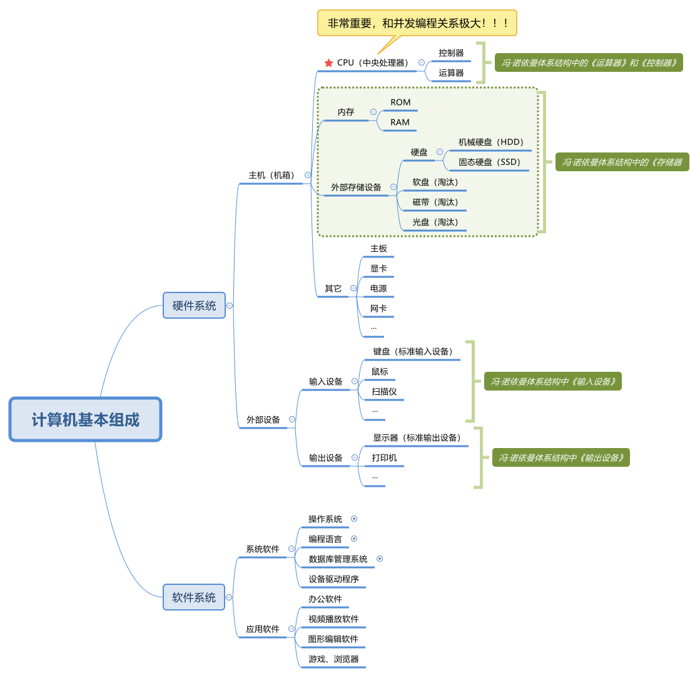

## 1.3 CPU

* CPU（中央处理器，Central Processing Unit）是计算机的核心组件之一，被喻为计算机的大脑。它负责执行指令、处理数据，并控制计算机内其他部件之间的操作和通信。
* CPU 的主要功能是从内存中获取指令并执行它们，根据指令完成算术或逻辑操作，以及协调其他硬件设备完成任务。
* CPU 从逻辑上可以划分为 3 个模块：控制单元（CU）、算术逻辑单元（ALU）以及存储单元（Registers）。

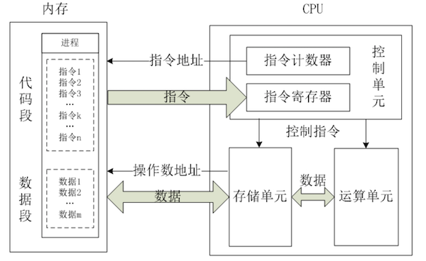

> [!NOTE]
>
> CPU 的运行原理：
>
> * ① 控制单元在时序脉冲的作用下，将指令计数器里所指向的指令地址(这个地址是在内存里的)送到地址总线上去，并由 CPU 将这个地址里的指令读到指令寄存器进行译码。
> * ② 对于执行指令过程中所需要用到的数据，会将数据地址也送到地址总线，然后 CPU 把数据读到 CPU 的内部存储单元(内部寄存器)暂存起来，
> * ③ CPU 命令运算单元对数据进行处理加工。
> * ④ 周而复始重复①②③，一直这样执行下去。

* CPU 的常见厂商，如下所示：
  * 英特尔（Intel）：高性能台式机和服务器 CPU，如：Intel Core i 系列、Xeon 等。
  * AMD：与英特尔竞争的厂商，以 Ryzen 系列和 EPYC 系列著称，主打性价比和多核性能。
  * ARM ：ARM 架构 CPU 被广泛应用于移动设备，如：高通 Snapdragon、苹果 A 系列芯片。
  * 苹果 M 系列：自研的 M 系列芯片，基于 ARM 架构，广泛用于 Mac 和 iPad。
  * ...
* 在微型计算机（个人计算机）中，CPU 是安装在主板上的，有正反之分：

::: code-group

```md:img [主板上的 CPU]
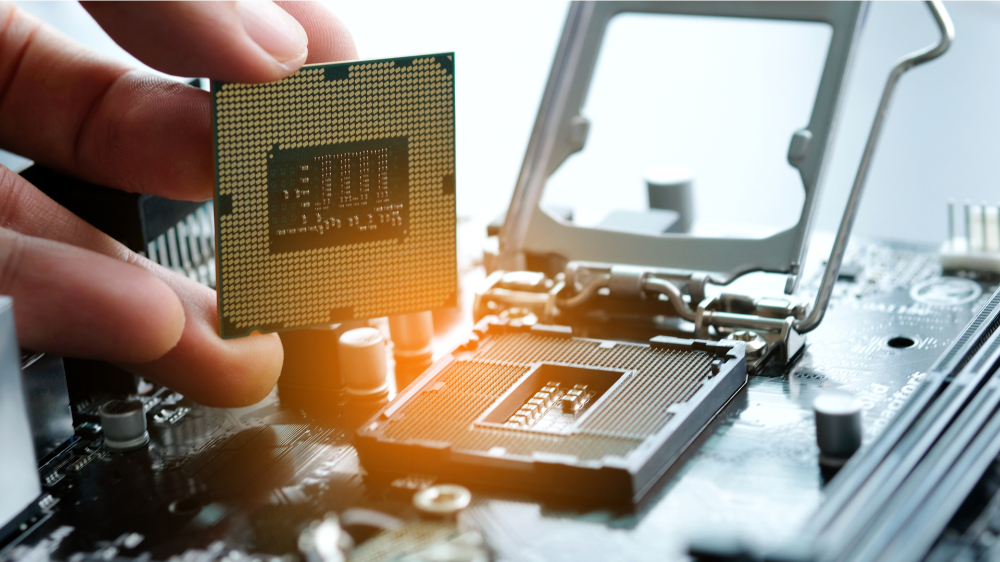
```

```md:img [CPU 的正反面]
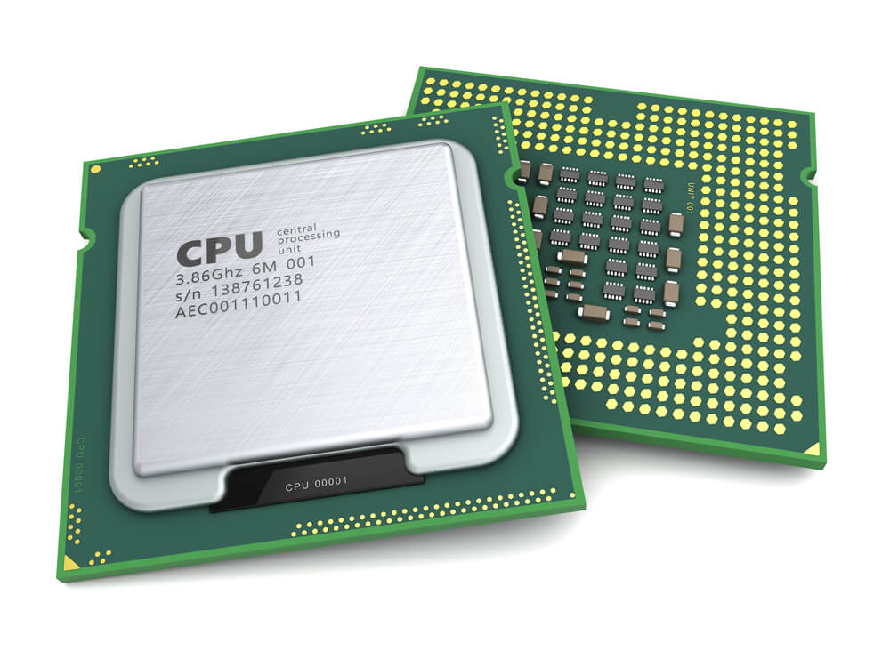
```

:::

## 1.4 CPU 的发展

### 1.4.1 概述

* 最早的计算机使用的是`真空管`，像 ENIAC 这样的机器又大又笨重，它们不仅消耗大量的电力，而且还产生大量的热量。

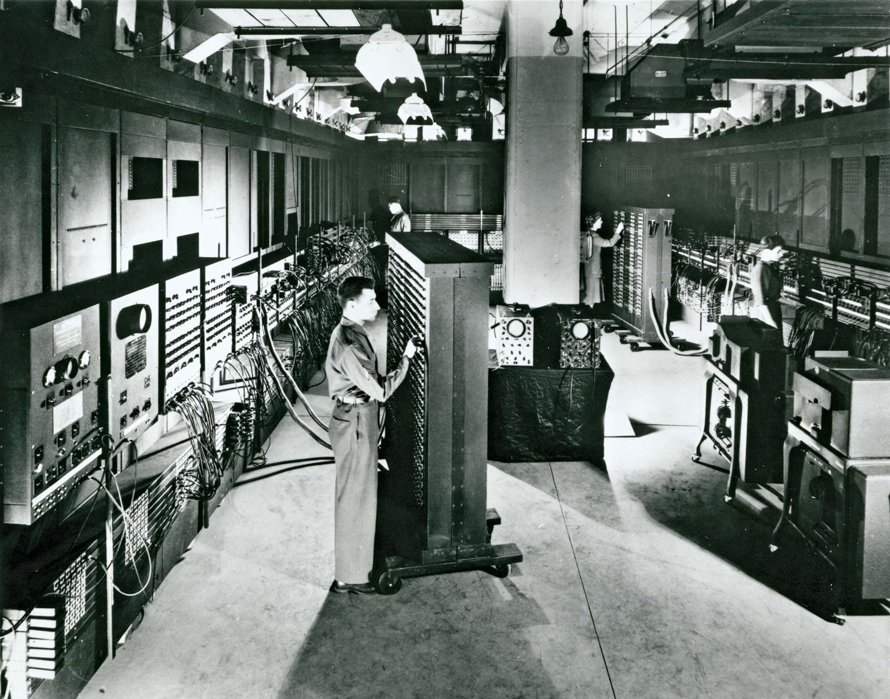

* 20 世纪 40 年代末，`晶体管`的发明彻底改变了 CPU 技术，晶体管取代了真空管，使计算机变得更小、更可靠、更节能。

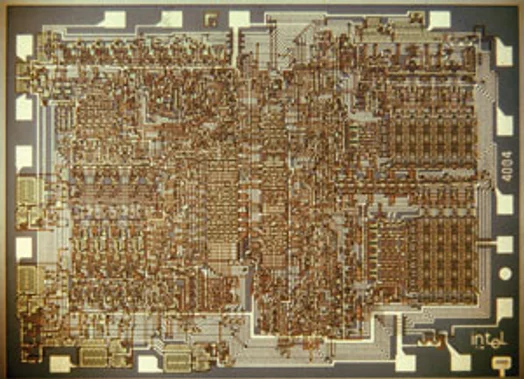

* 20 世纪 60 年代中期，人们开发了集成电路 (IC)，将多个晶体管和其他元件组合在一个计算机芯片上，CPU 变得更小、更快，从而使微处理器出现。

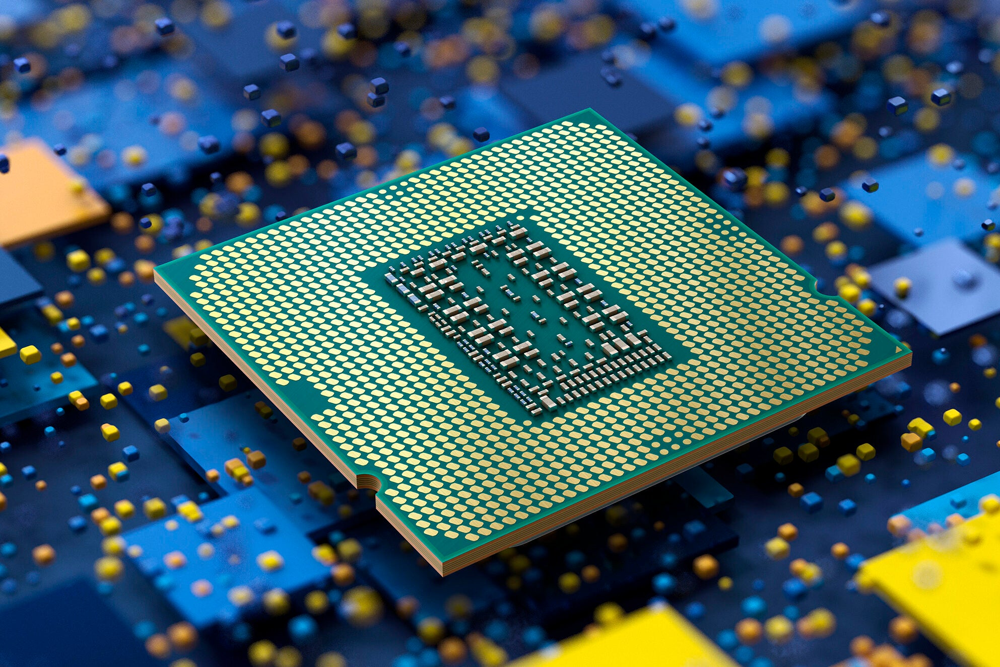

### 1.4.2 摩尔定律

* 1965 年，英特尔创始人之一`戈登·摩尔`提出了指导半导体行业长达半实际之久的摩尔定律：“是集成电路上可容纳的元器件（晶体管）的数量每隔 18 至 24 个月就会增加一倍，性能也将提升一倍”。

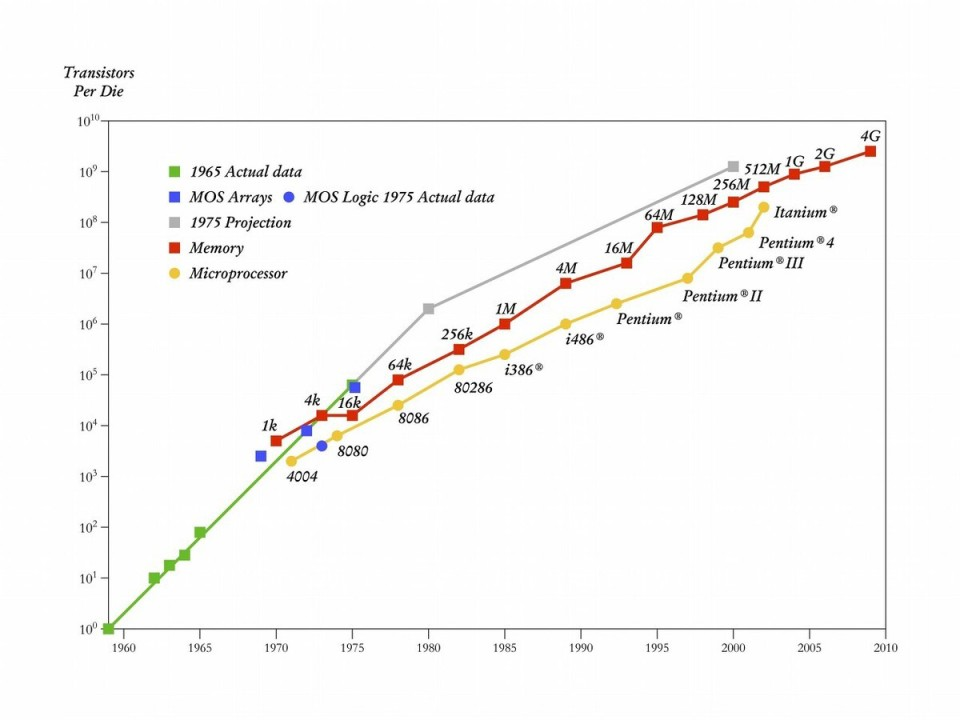

* 但是，随着晶体管密度的增加，进一步提高单核 CPU 性能变得具有挑战性，种种物理限制约束着它的进一步发展，如：当闸极长度足够短的时候，就会发生`量子穿隧效应`，会导致漏电流增加。取而代之的是，CPU 制造商开始使用`多核`处理器架构将多个内核集成到单个芯片上。

### 1.4.3 单核 CPU

* 早期的 CPU 都是一个核心，即：整个处理器只能有一个`运算单元`来执行所有指令。


* 早期的单核 CPU 是可以运行多线程的；但是，是通过操作系统进行时间片调度造成的假象。

> [!NOTE]
>
> 操作系统将时间划分为很小的一段（时间片），操作系统以时间片为单位进行调度，即：同一时刻，只有一个线程（指令流）可以在物理核上运行。


### 1.4.4 多 CPU

* 个人计算机上的主板上只有一个 CPU 插槽，即：只能安装有一个 CPU ，如下所示：

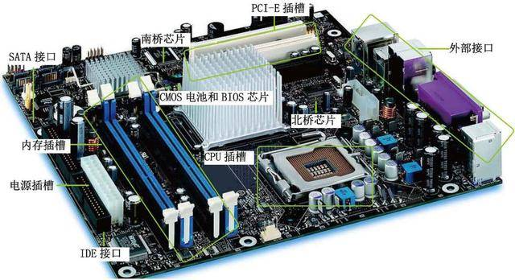

* 但是，服务器的主板上却有很多 CPU 插槽，即：可以安装多个 CPU ，如下所示：

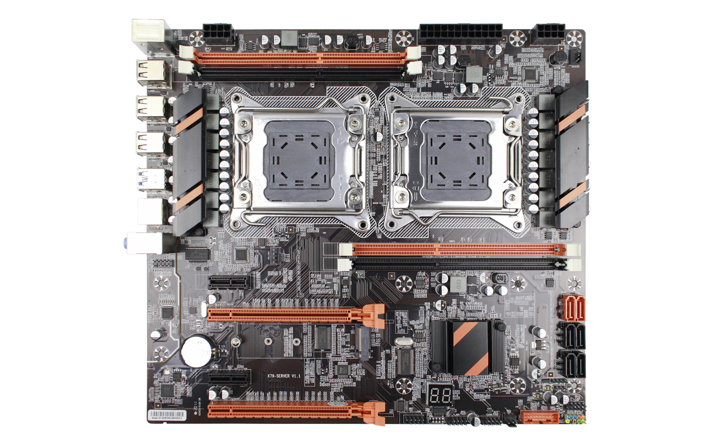

* `多 CPU` 中的每个 CPU 都有自己的核心，即：每个 CPU 都有一个`运算单元`来执行对应的指令。


* `多 CPU` 是可以运行多线程的，即：同一时刻，可以执行多条指令。


### 1.4.5 多核 CPU

* 虽然，`多 CPU`可以在同一时刻，执行多条指令。但是，会有以下的问题：

  * ① 个人计算机只有一个 CPU 插槽，实现不了同一时刻，执行多条指令。
  * ② 服务器虽然有多个 CPU 插槽，但也不能无休止的安装 CPU ，总有极限。

  * 于是，出现了`多核 CPU`，即：一个物理 CPU 内部，封装了多个物理核心，如下所示：

> [!NOTE]
>
> * ① 每个物理核心都有自己的控制单元、存储单元以及运算单元；所以，每个物理核心都可以看成是一个`逻辑 CPU` 。
> * ② 从并行流的角度来讲，`多 CPU` 和`多核 CPU` 都可以在同一时刻，同时执行多条指令。
> * ③ 但是，`多核 CPU` 的性能要高于`多 CPU`，因为`多核 CPU` 内部的物理核心是通过片内总线进行通信的，速度会快于系统总线。


* `多核 CPU`是可以运行多线程的，即：同一时刻，可以执行多条指令。


> [!NOTE]
>
> * ① `多核 CPU`可以使得个人计算机有多个核心，如：2 核、4 核、8 核等，这样即使只有一个 CPU 插槽，也可以使得个人计算机的性能达到服务器的`多 CPU 单核`架构。
> * ② 有些服务器可能有多个 CPU 插槽，在`多核 CPU`的技术下，可以是过去`多 CPU 单核`架构的 2 倍性能。

* 如果要构造 `4` 个逻辑`CPU`的系统，其中一种方案就是使用 `2` 个物理 CPU ，每个物理 CPU 有 `2` 个物理核心。


* 如果要构造 `4` 个逻辑`CPU`的系统，另外一种方案就是使用 `1` 个物理 CPU ，该物理 CPU 有 `4` 个物理核心。


### 1.4.6 超线程技术

* `超线程技术`作用于物理 CPU 内部的`物理核心`上，其实现原理是：一个物理核心内部，会同时包含 2 份控制单元和 2 份存储单元；但是，只有 1 份运算单元。


* 在运行的时候，会有 2 条不同的指令进入`物理核心`：


* 在超线程技术的作用下，一个`物理核心`内部就好像有 2 个`逻辑核心`（逻辑 CPU ）：

> [!NOTE]
>
> * ① 通常情况下，`CPU核心数` 和 `线程数` 是 `1:1` 的关系。
> * ② 在超线程技术的影响下，`CPU核心数` 和 `线程数` 是 `1:2` 的关系。


* 总之，多核 CPU 的硬件发展出现瓶颈后的解决方案，硬件工程师将多个 CPU 物理核心封装到同一个 CPU 中，为了加快 CPU 的速度，更是引入了超线程技术，使得`CPU核心数` 和 `线程数` 是 `1:2` 的关系。

> [!NOTE]
>
> 硬件开发人员的解决方案，导致了软件开发人员不得不面对头疼的并发编程问题，如下所示：
>
> * 如何让多核 CPU 正确的运行？
> * 多线程之间如何保证线程安全，即：保证运算结果不会出现错误。
> * ...

* 这些问题都需要软件开发者来进行考虑和解决，毕竟现在早就进入了多核 CPU 的时代，我们再也不能期望回到单核时代；所以，我们不得不去研究并发编程。

### 1.4.7 阿姆达尔定律

#### 1.4.7.1 概述

* 多核 CPU 的出现，让我们可以采用并行处理程序；但是，并行处理程序能提升多少性能，可以使用`阿姆达尔定律`来进行指导，其是计算机科学界的经验法则，代表了处理器并行运算之后效率提升的能力。

#### 1.4.7.2 数学公式

* 阿姆达尔定律的数学公式，如下所示：

$S = \frac{1}{\left(1 - P\right) + \frac{P}{N}}$

> [!NOTE]
>
> 参数说明：
>
> * `S` 表示性能加速比（Speedup），表示执行任务的处理速度的提高倍数。
> * `P` 表示可以并行化的任务部分的比例，即：并行部分。
> * `1 - P` 表示必须串行执行的任务部分的比例，即：串行部分。
> * `N` 表示参与并行计算的处理单元（核心）数量。

> [!NOTE]
>
> ::: details 点我查看 如何理解
>
> 阿姆达尔定律的基本思想是：`即便你无限增加并行处理的能力，系统性能仍然会受到任务中串行部分的制约`。
>
> * ① `串行部分的限制`：即使一个程序的主要部分可以并行化；但是，如果仍然有某些部分无法并行化（必须串行执行），那么这个串行部分的占比将成为总性能提升的瓶颈。
>   * 如果任务的串行部分占比较大，即 $1 - P$ 较大，那么整体性能提升将非常有限。
>   * 如果任务的串行部分占比很小，即 $1 - P$ 趋近于 0，则性能提升接近并列效率的理论理想值。
> * ② `并行化的收益递减`：随着并行化程度（N，参与计算的核心数）的增加，任务的并行部分 $P$ 会受到核心通信、同步等因素的影响，收益逐渐趋于平缓。理论上，无限增加核心数仍然不能无限提高性能，因为串行部分始终需要时间去完成。
>
> :::


* 示例：假设一个程序的 60% 的代码可以并行化，即： $P = 0.6$，其余 40% 需要串行执行，即： $1 - P = 0.4$，如果我们尝试使用 2 个并行核心（$N = 2$），性能提升约为 1.43 倍

$$
S = \frac{1}{(1 - P) + \frac{P}{N}} = \frac{1}{0.4 + \frac{0.6}{2}} = \frac{1}{0.4 + 0.3} = \frac{1}{0.7} \approx 1.43
$$


* 示例：假设一个程序的 60% 的代码可以并行化，即： $P = 0.6$，其余 40% 需要串行执行，即： $1 - P = 0.4$，如果我们尝试使用 4 个并行核心（$N = 4$），性能提升约为 1.82 倍

$$
S = \frac{1}{0.4 + \frac{0.6}{4}} = \frac{1}{0.4 + 0.15} = \frac{1}{0.55} \approx 1.82
$$

#### 1.4.7.3 应用场景

* ① `并行计算的性能分析`：阿姆达尔定律为系统工程师和架构师提供了计算并行化效率和规划性能优化的方向。例如：在高性能计算（HPC）中，用于预测增加计算节点数量后的性能提升。
* ② `软件和程序优化`：根据阿姆达尔定律，开发人员应更专注于减少程序中的串行部分，因为串行部分不仅直接影响程序效率，还间接降低了并行优化的收益。
* ③ 硬件划分和负载均衡：为解决性能瓶颈，阿姆达尔定律可以帮助系统设计者进行计算资源分配，如：分配更多资源给影响系统性能的串行部分。

#### 1.4.7.4 局限性

* ① `忽略了并行化本身的开销`：并行化任务的过程中，通常会引入额外的开销，如：任务分割、线程同步、通信延迟等。这些开销可能降低实际加速比。
* ② `任务规模未变化`：阿姆达尔定律假设任务的规模固定（即问题大小固定），但在实际应用中，增加计算资源往往会用于处理更大规模的任务。
* ③ `未考虑资源竞争`：系统中的处理单元可能共享内存、I/O 设备等资源，导致资源竞争，这会进一步限制并行效率。


# 第二章：多线程的概念

## 2.1 进程和线程

* `进程`（Process）是计算机中的程序关于某数据集合上的一次运行活动，是系统进行资源分配和调度的基本单位，是操作系统结构的基础。在早期面向进程设计的系统中（早期的 Unix、Linux 2.4 及其之前的版本），进程是程序的基本执行实体。在当代面向线程设计的系统中（现代的操作系统，Linux 2.6 及其之后的版本），进程是线程的容器。

> [!NOTE]
>
> ::: details 点我查看 详细信息
>
> * ① Windows 资源管理器看到的都是进程，进程是操作系统管理的基本单元。
>
> 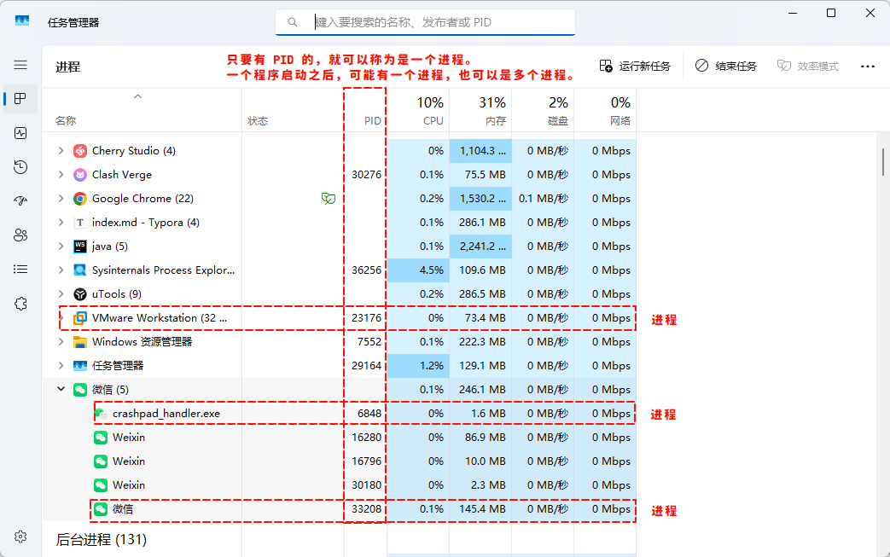
>
> * ② Linux 中，可以使用 `top`、`htop`、`glances`、`ps` 等命令查看进程，进程是操作系统管理的基本单元。
>
> 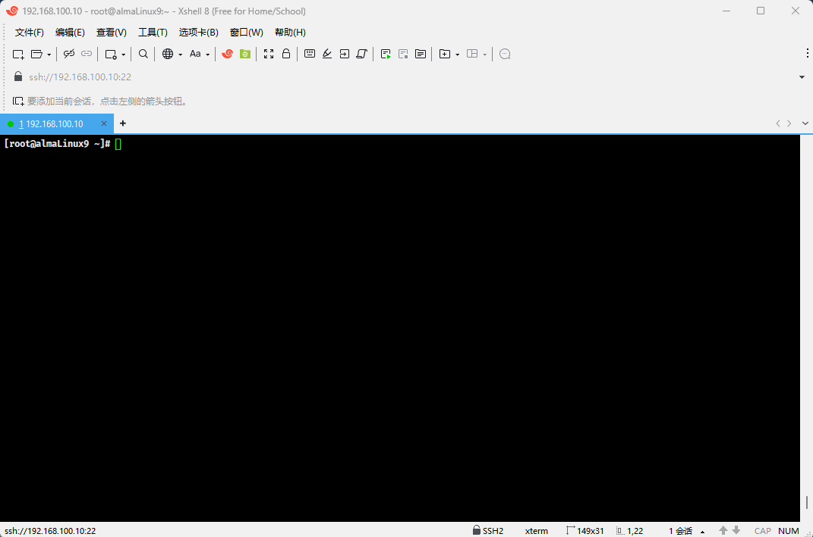
>
> ::: 

* `线程`（Thread）是进程中独立运行的子任务，如：微信是一个进程，里面运行了很多子任务，像聊天信息发送线程、远程视频或语音会议线程、文件上传下载线程等等，这些子任务我们就理解为线程，这些线程可以同时运行，这些子任务同时运行带来的好处就是在同一时间内可以运行多种不同类型的任务。

> [!NOTE]
>
> ::: details 点我查看 详细信息
>
> * ① Windows 中查看线程信息，需要借助 [Process Explorer](https://learn.microsoft.com/zh-cn/sysinternals/downloads/process-explorer) 工具。
>
> 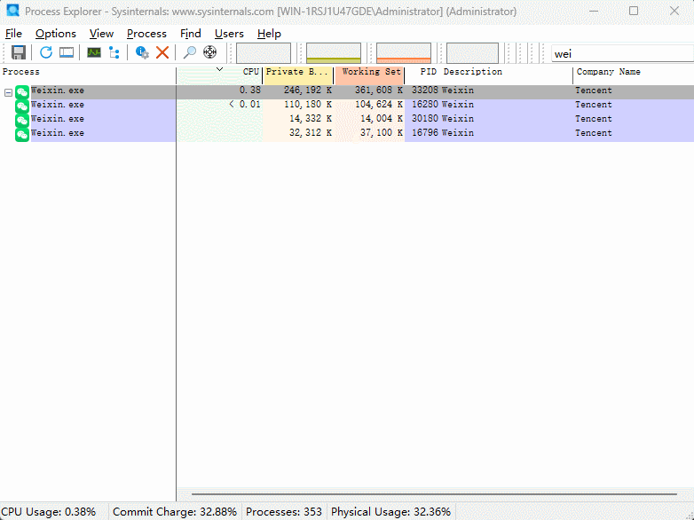
>
> * ② Linux 中，可以使用 `top -H -p <pid>`、`htop`、`glances`  等命令查看线程信息。
>
> 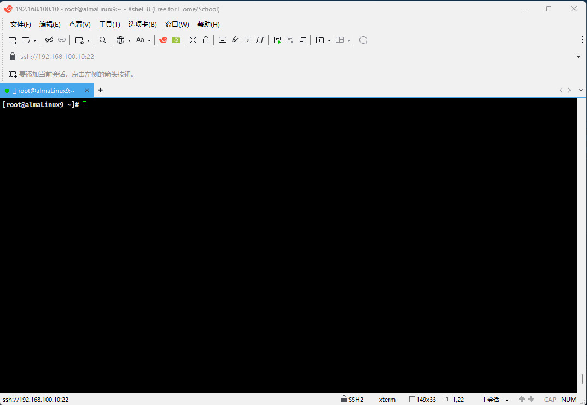
>
> :::

## 2.2 构建 OpenJDK 

### 2.2.1 概述

* OpenJDK  是用 `Java` 和 `C/C++` 混合编写的大型项目:
  * `Java 层` ：`java.lang`, `java.util` 等核心类库是用 Java 写的。
  * `C/C++ 层` ：HotSpot 虚拟机、JNI 实现、平台相关代码等是用 C/C++ 写的。
* 当我们从源码开始构建 OpenJDK  的时候，我们需要一个 Boot JDK（引导 JDK），其作用如下：

> [!NOTE]
>
> * ① 引导 JDK 不是用来运行我们正在构建的新 JDK，而是用于辅助构建过程本身！！！
> * ② 目前 OpenJDK 官方默认构建方式要求有 Boot JDK 。

| 用途                 | 描述                                                         |
| -------------------- | ------------------------------------------------------------ |
| 编译 Java 源码       | 使用`javac`编译 OpenJDK 中的`.java`文件                      |
| 运行注解处理器       | `apt`或`annotation processing`需要运行时支持                 |
| 生成工具类或资源文件 | 某些构建阶段会运行 Java 程序生成`.properties`,`.h`,`.c`文件等 |
| 打包 JAR 文件        | 使用`jar`命令打包类文件和资源                                |
| 运行测试工具         | 构建过程中可能运行一些验证脚本或测试程序                     |

* 引导 JDK 的版本要求：

> [!NOTE]
>
> 对于 `JDK17` 来说 ，我们需要至少一个 `JDK16` 或 `JDK17` 的环境作为引导。

| 正在构建的 JDK 版本 | 推荐使用的 Boot JDK 版本 |
| ------------------- | ------------------------ |
| JDK 8               | JDK 7 或更高             |
| JDK 11              | JDK 10 或更高            |
| JDK 17              | JDK 16 或更高            |
| JDK 21              | JDK 20 或更高            |

* 而对于 C/C++ ，则需要使用 GCC 编译器来编译 C/C++ 源码。

> [!NOTE]
>
> * ① 在 Windows 操作系统中，可以使用 MSYS2 来作为构建环境，因为其支持 Linux 工具集。
> * ② 在 Windows 操作系统中，也可以使用 WSL2 作为构建环境。

### 2.2.2 准备一台 Linux 服务器

* ① 本人在 VMWare 中安装了 AlmaLinux9 ，如下所示：

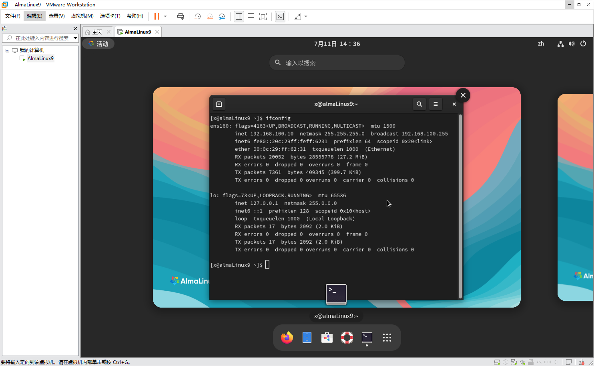

* ② 通过 XShell 远程登录 AlmaLinux9 ：


* ③ 安装必要的工具：

::: code-group

```bash
sudo dnf update -y 
sudo dnf install epel-release -y 
sudo dnf groupinstall "Development Tools" -y
sudo dnf install java-17-openjdk-devel libX11-devel libXext-devel \
    libXrender-devel libXtst-devel libXt-devel cups-devel git gcc \
    freetype-devel alsa-lib-devel zlib-devel openssl-devel \
    autoconf automake libtool python3 unzip zip java-17* \
    libXtst-devel libXt-devel libXrender-devel libXrandr-devel libXi-devel \
    fontconfig-devel tree -y
```

```md:img [cmd 控制台]
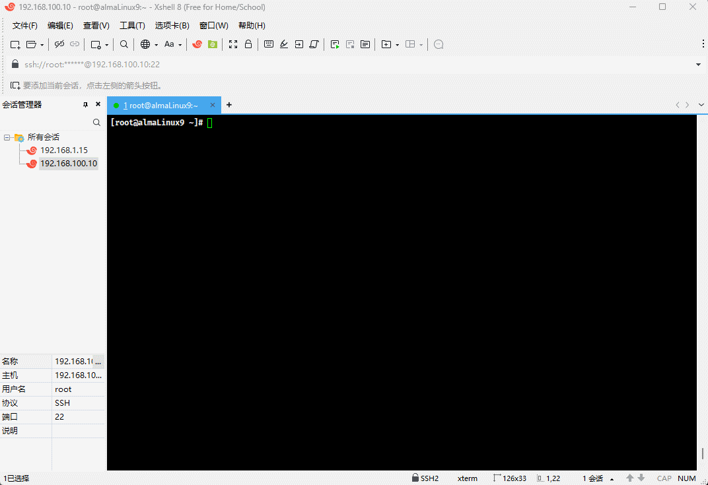
```

:::

### 2.2.3 构建 OpenJDK 

* ① 通过 Git 下载 OpenJDK 的源码：

::: code-group

```bash
git clone git@github.com:openjdk/jdk17u.git --depth=1
```

```md:img [cmd 控制台]

```

:::

* ② 运行 configure 文件：

::: code-group

```bash
cd jdk17u 
bash configure
```

```md:img [cmd 控制台]
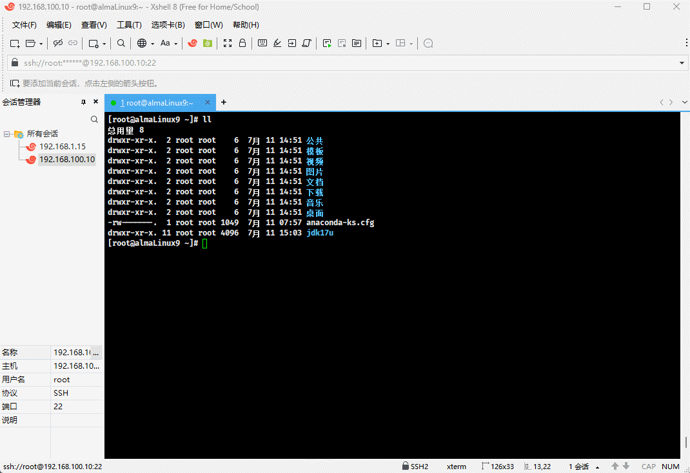
```

:::

* ③ 运行 make ：漫长的等待...

::: code-group

```bash
make images JOBS=$(nproc)
```

```md:img [cmd 控制台]
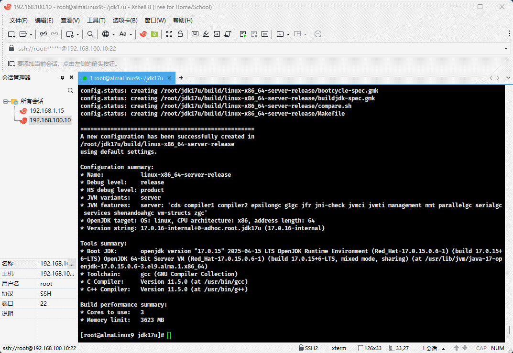
```

:::

* ④ 验证新构建的 JDK ：

::: code-group

```bash
./build/*/images/jdk/bin/java -version
```

```md:img [cmd 控制台]
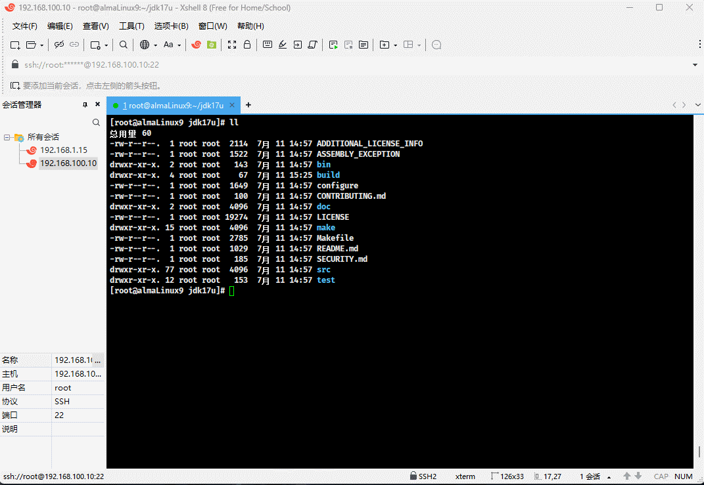
```

:::

* ⑤ 运行基本测试：

::: code-group

```bash
make run-test-tier1
```

```md:img [cmd 控制台]
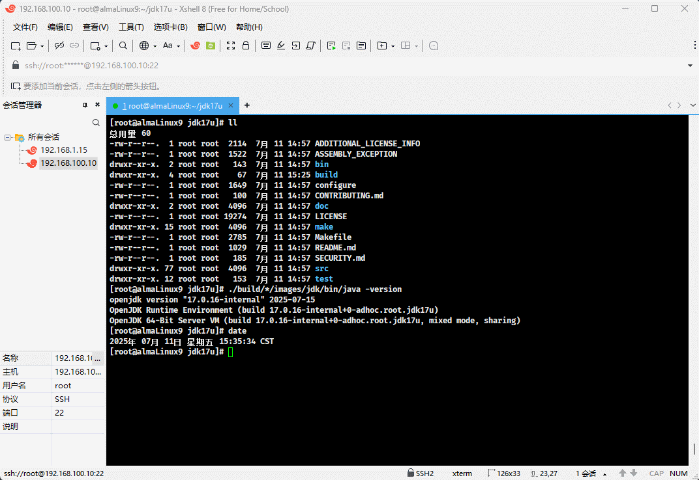
```

:::