# 第一章：常见的成员方法（⭐）

## 1.1 概述

* Thread 类中常见的方法，如下所示：

| 方法                                                       | 描述                                           |
| ---------------------------------------------------------- | ---------------------------------------------- |
| `public final String getName(){}`                          | 返回此线程的名称                               |
| `public final synchronized void setName(String name) {}`   | 设置线程的名称（构造方法也可以）               |
| `public static native Thread currentThread();`             | 获取当前线程的对象                             |
| `public static native void sleep(long millis);`            | 让当前线程休眠，单位是毫秒                     |
| `public final void setPriority(int newPriority) {}`        | 设置线程的优先级                               |
| `public final int getPriority() {}`                        | 获取线程的优先级                               |
| `public final void setDaemon(boolean on) {}`               | 设置当前线程为后台线程（守护线程）             |
| `public final boolean isDaemon() {}`                       | 判断当前线程是否是后台线程                     |
| `public static native void yield();`                       | 设置当前线程为礼让线程（交出 CPU 的执行权）    |
| `public final void join(){}`                               | 设置当前线程为插入线程（加塞线程）             |
| `public final synchronized void join(final long millis){}` | 设置当前线程为插入线程（加塞线程），单位是毫秒 |
| `public ClassLoader getContextClassLoader(){}`             | 获取线程上下文的 ClassLoader                   |
| `public State getState() {}`                               | 返回当前线程的状态                             |
| `public static native boolean holdsLock(Object obj){}`     | 返回当前线程是否持有指定对象的监视器锁         |
| `public void interrupt() {}`                               | 中断当前线程                                   |
| `public boolean isInterrupted() {}`                        | 当前线程是否被中断                             |
| `public synchronized void start() {}`                      | 启动当前线程                                   |
| `public void run() {}`                                     | 线程执行的业务逻辑                             |

## 1.2 概念区别

### 1.2.1 前台进程 VS 后台进程

* 当打开 Windows 任务管理器，会发现进程有`后台进程`和`前台进程（应用）`之分：

> [!NOTE]
>
> * ① 有些资料，会将 `后台进程` 称为 `守护进程`、`常驻进程` 或者 `服务`，英文是 `daemon` 。
> * ② 有些资料，会将 `前台进程` 称为 `非后台进程`、`非守护进程`。

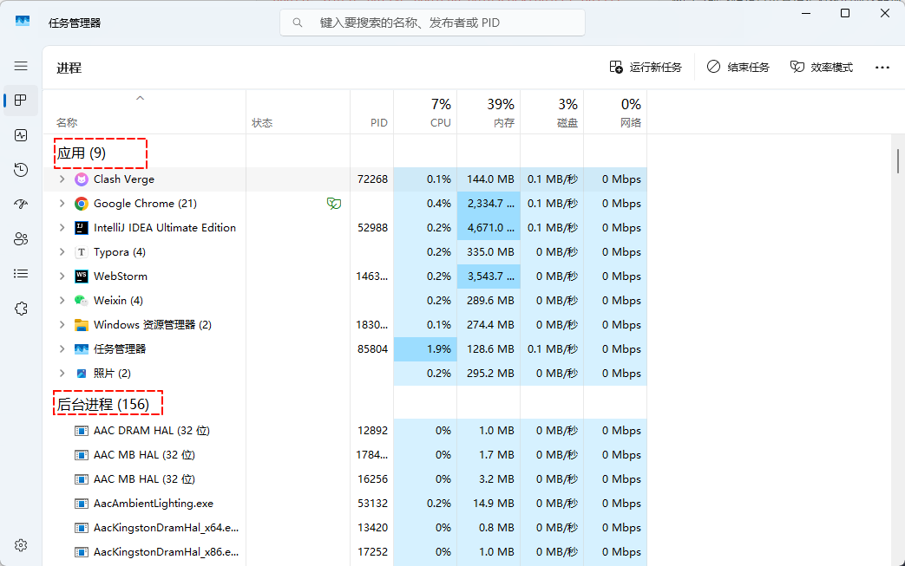

* `前台进程`和`后台进程`的区别，如下所示：

| 区别       | 前台进程                                  | 后台进程                             |
| ---------- | ----------------------------------------- | ------------------------------------ |
| 用户交互   | 直接交互                                  | 在后台运行，不直接与用户交互         |
| 终端占用   | 占用终端或有用户界面                      | 不占用终端，可以独立运行             |
| 启动方式   | 用户主动启动                              | 系统启动或自动启动                   |
| 信号接收   | 前台进程接收终端信号，如：SIGINT, SIGTERM | 后台进程可能忽略某些信号或有特殊处理 |
| 生命周期   | 通常较短                                  | 可能长期运行                         |
| 资源优先级 | 相对较高                                  | 相对较低                             |

> [!NOTE]
>
> * ① 进程可以在`前台`和`后台`之间相互切换。
> * ② `前台进程`和`后台进程`都是进程的不同运行状态：
>   * 本质上都是操作系统进程。
>   * 只是运行环境和交互方式不同而已。
> * ③ 在 Linux 中，后台进程（守护进程）通常以 d 结尾，以便和前台进程区别，如：sshd 等。

* `前台进程`和`后台进程`的应用场景，如下所示：

| 类型     | 应用场景                                |
| -------- | --------------------------------------- |
| 前台进程 | 文本编译器，如：vim、记事本等。         |
|          | 命令行工具，如：grep、ps 等。           |
|          | 交互式应用程序，如：Word、Excel 等。    |
|          | WEB 浏览器，如：Chrome 等。             |
| 后台进程 | Web 服务器，如：Apache、Nginx 等。      |
|          | 数据库服务，如：MySQL、 PostgreSQL 等。 |
|          | 系统守护进程，如：systemd、cron 等。    |
|          | 消息队列服务，如：RabbitMQ、Kafka 等。  |

### 1.2.2 前台线程 VS 后台线程

* `线程`是`进程`中的执行路径，有`前台线程`和`后台线程`之分。

> [!NOTE]
>
> * ① 有些资料，会将 `前台线程` 称为 `用户线程`、`非守护线程` 。
> * ② 有些资料，会将 `后台线程` 称为 `守护线程`。

* `前台线程`和`后台线程`的区别，如下所示：

| 区别             | 前台线程                                                     | 后台线程                                                     |
| ---------------- | ------------------------------------------------------------ | ------------------------------------------------------------ |
| 生命周期         | 决定应用程序的生命周期。<br>只要有一个前台线程在运行，程序就不会退出。<br>需要显式地完成或被终止。 | 依赖于前台线程的存在。<br>当最后一个前台线程结束时，所有后台线程立即终止。<br/>不会阻止程序的正常退出。 |
| 优先级和调度     | 通常具有更高的调度优先级。<br/>获得更多的 CPU 时间片。<br/>系统会优先保证前台线程的执行。 | 优先级相对较低。<br/>在系统资源紧张时可能被暂停或延迟。<br/>为前台线程让出更多资源。 |
| 语言设置方式不同 | 在 Java 中，线程默认就是前台线程                             | 在 Java 中，调用 `setDaemon(true)`设置线程为后台线程         |

* `前台线程`和`后台线程`的应用场景，如下所示：

| 类型     | 应用场景                                                     |
| -------- | ------------------------------------------------------------ |
| 前台线程 | 用户界面处理，如：Android 主线程处理 UI 展示，Swing 事件派发线程。 |
|          | 主要业务逻辑执行，如：Web 服务器处理 HTTP 请求的工作线程。   |
|          | 关键任务处理，如：银行系统的交易处理线程。                   |
|          | 用户交互响应，如：游戏主循环线程，响应玩家操作 。            |
| 后台线程 | 垃圾回收，如： Java 虚拟机中的 GC 线程。                     |
|          | 日志记录，如： Log4j 后台写日志线程。                        |
|          | 定时任务，如：  Quartz 定时任务调度线程。                    |
|          | 后台数据处理，如：Kafka 消费者后台拉取消息线程。             |
|          | 系统监控，如：Prometheus agent 后台采集监控数据线程。        |

## 1.3 线程名称相关方法

* 设置线程名称：

```java
public Thread(String name){}
```

```java
public Thread(Runnable target, String name){}
```

```java
public final synchronized void setName(String name) {}
```

* 获取线程名称：

```java
public final String getName(){}
```


* 示例：获取线程名称

::: code-group

```java [MyThread.java]
package com.github.thread.demo2;

public class MyThread extends Thread {

    @Override
    public void run() {
        for (int i = 0; i < 100; i++) {
            System.out.println(getName() + "@" + i);
        }
    }
}
```

```java [Test.java]
package com.github.thread.demo2;

public class Test {
    public static void main(String[] args) {
        MyThread t = new MyThread();

        t.start();
    }
}
```

```md:img [cmd 控制台]
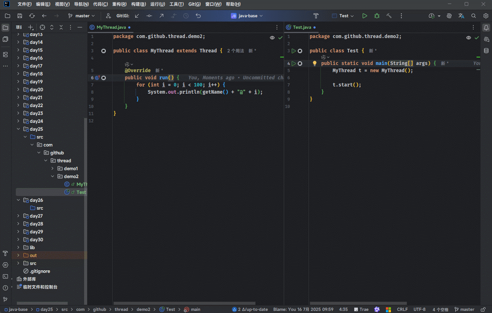
```

:::


* 示例：获取线程名称

::: code-group

```java [Test.java]
package com.github.thread.demo3;

public class Test {
    public static void main(String[] args) {
       Thread t = new Thread(() -> {
           for (int i = 0; i < 100; i++) {
               System.out.println(i);
           }
       });
        String name = t.getName();
        System.out.println("线程名称 = " + name);

        t.start();
    }
}
```

```md:img [cmd 控制台]
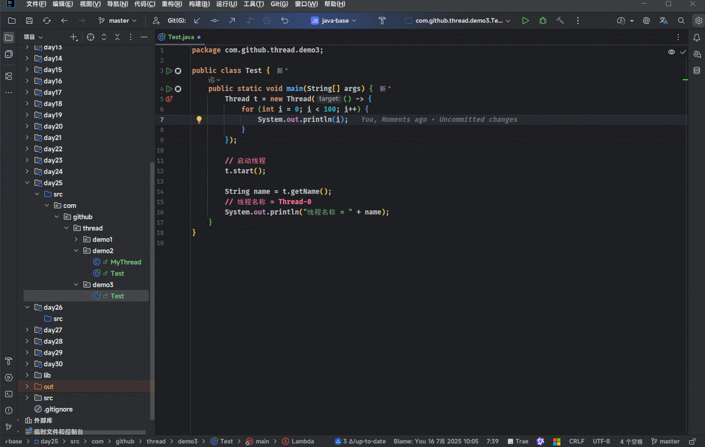
```

:::


* 示例：设置线程名称

::: code-group

```java [Test.java]
package com.github.thread.demo3;

public class Test {
    public static void main(String[] args) {
        Thread t1 = new Thread(() -> {
            for (int i = 0; i < 100; i++) {
                System.out.println(i);
            }
        });

        Thread t2 = new Thread(() -> {
            for (int i = 0; i < 100; i++) {
                System.out.println(i);
            }
        });

        // 设置线程名称
        t1.setName("线程1");
        t2.setName("线程2");

        // 启动线程
        t1.start();
        t2.start();

        String name = t1.getName();
        String name2 = t2.getName();
        // 线程名称1 = 线程1
        System.out.println("线程名称1 = " + name);
        // 线程名称2 = 线程2
        System.out.println("线程名称2 = " + name2);
    }
}
```

```md:img [cmd 控制台]
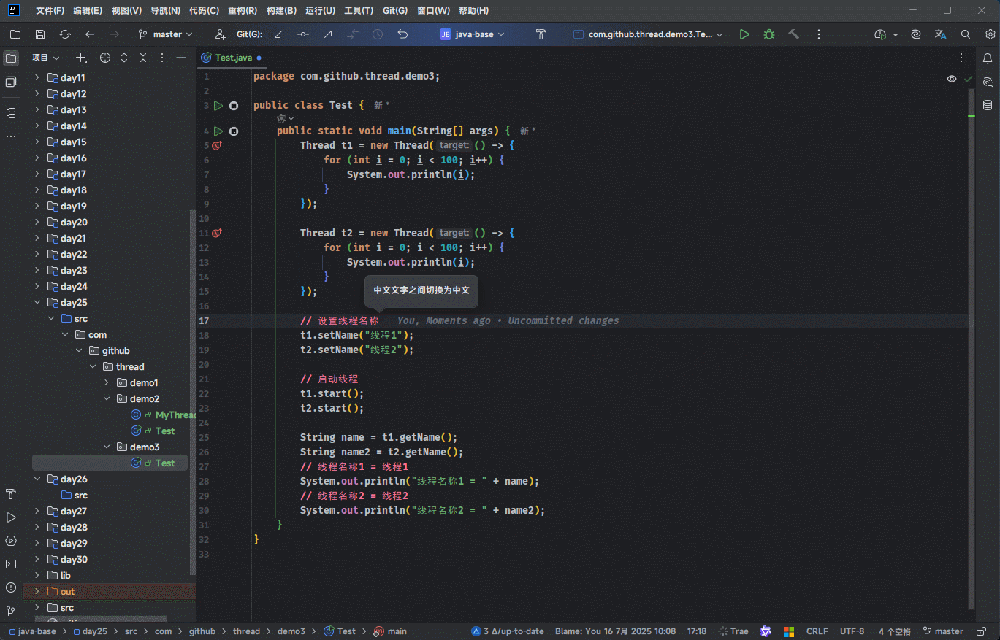
```

:::


* 示例：设置线程名称

::: code-group

```java [Test.java]
package com.github.thread.demo4;

public class Test {
    public static void main(String[] args) {
        Thread t = new Thread(
                () -> {
                    for (int i = 0; i < 100; i++) {
                        System.out.println(i);
                    }
                },
                "自定义线程");

        // 启动线程
        t.start();

        // 获取线程名称
        String name = t.getName();
        System.out.println("线程名称 = " + name);
    }
}
```

```md:img [cmd 控制台]
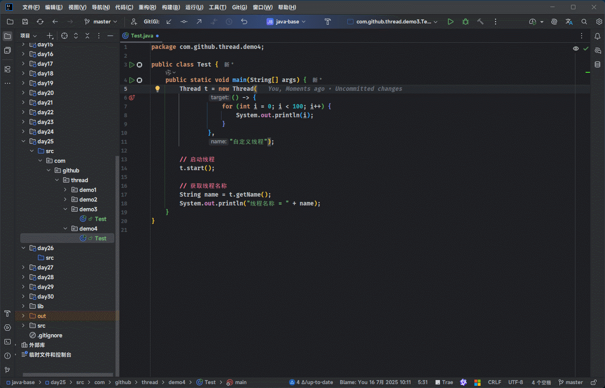
```

:::

## 1.4 当前线程相关方法

* 获取当前线程对象：

```java
public static native Thread currentThread();
```

> [!NOTE]
>
> * ① 当虚拟机启动的时候，会自动启动多条线程，其中有一条线程叫做 main 线程，其作用就是调用 main 方法，并执行里面的代码。
> * ② 在之前，我们写的所有代码，其实都是运行在 main 线程之中的。


* 示例：

::: code-group

```java [Test.java]
package com.github.thread.demo4;

public class Test {
    public static void main(String[] args) {
        System.out.println("main start" + Thread.currentThread().getName());
        // 线程1
        Thread t1 = new Thread(() -> {
            for (int i = 0; i < 100; i++) {
                System.out.println(Thread.currentThread().getName() + " = " + i);
            }
        });

        // 启动线程
        t1.start();

        // 线程2
        Thread t2 = new Thread(() -> {
            for (int i = 0; i < 100; i++) {
                System.out.println(Thread.currentThread().getName() + " = " + i);
            }
        });

        // 启动线程
        t2.start();

        System.out.println("main end" + Thread.currentThread().getName());
    }
}
```

```md:img [cmd 控制台]
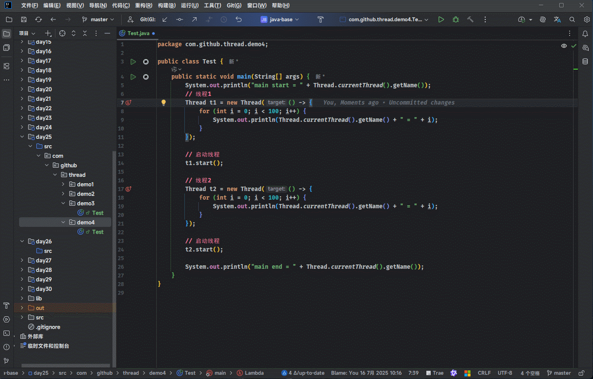
```

:::


* 示例：

::: code-group

```java [MyThread.java]
package com.github.thread.demo5;

public class MyThread extends Thread {

    public MyThread() {
        // MyThread = main
        System.out.println("MyThread = " + Thread.currentThread().getName());
    }

    @Override
    public void run() {
        for (int i = 0; i < 100; i++) {
            System.out.println(getName() + "@" + i);
        }
    }
}
```

```java [Test.java]
package com.github.thread.demo5;

public class Test {
    public static void main(String[] args) {
        System.out.println("main start = " + Thread.currentThread().getName());

        // 线程
        MyThread t = new MyThread();
        // 启动线程
        t.start();

        System.out.println("main end = " + Thread.currentThread().getName());
    }
}
```

```md:img [cmd 控制台]
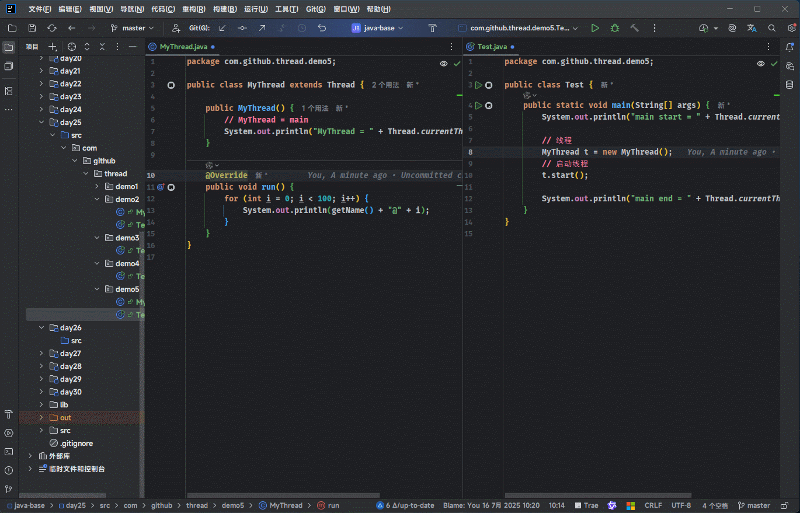
```

:::

## 1.5 线程休眠相关方法

* 让当前线程休眠多少毫秒：

```java
public static native void sleep(long millis) throws InterruptedException;
```

* 让当前线程休眠指定的时间：

```java
TimeUnit.MILLISECONDS.sleep(long timeout) throws InterruptedException;
```

```java
TimeUnit.SECONDS.sleep(long timeout) throws InterruptedException;
```

> [!NOTE]
>
> * ① 那条线程执行了休眠的方法，那么那条线程就会在这里停留指定的时间；当时间到了之后，线程会自动醒来，继续执行下面的方法。 
> * ② `TimeUnit.SECONDS.sleep(timeout)` 就是对 `Thread.sleep(millis)` 的封装。
> * ③ 在实际开发中，推荐使用`TimeUnit.SECONDS.sleep(timeout)`，因为可读性更高！！！


* 示例：

::: code-group

```java [Test.java]
package com.github.thread.demo6;

public class Test {
    public static void main(String[] args) {
        System.out.println("main start = " + Thread.currentThread().getName());

        // 线程
        Thread t = new Thread(() -> {
            System.out.println("t start = " + Thread.currentThread().getName());
            for (int i = 0; i < 100; i++) {
                try {
                    // 当前线程休眠，即：t 线程休眠
                    Thread.sleep(500);
                } catch (InterruptedException e) {
                    throw new RuntimeException(e);
                }
                System.out.println(Thread.currentThread().getName() + " i = " + i);
            }
            System.out.println("t end = " + Thread.currentThread().getName());
        });

        try {
            // 当前线程休眠，即：main 线程休眠
            Thread.sleep(1000);
        } catch (InterruptedException e) {
            throw new RuntimeException(e);
        }

        // 启动线程
        t.start();

        System.out.println("main end = " + Thread.currentThread().getName());
    }
}
```

```md:img [cmd 控制台]
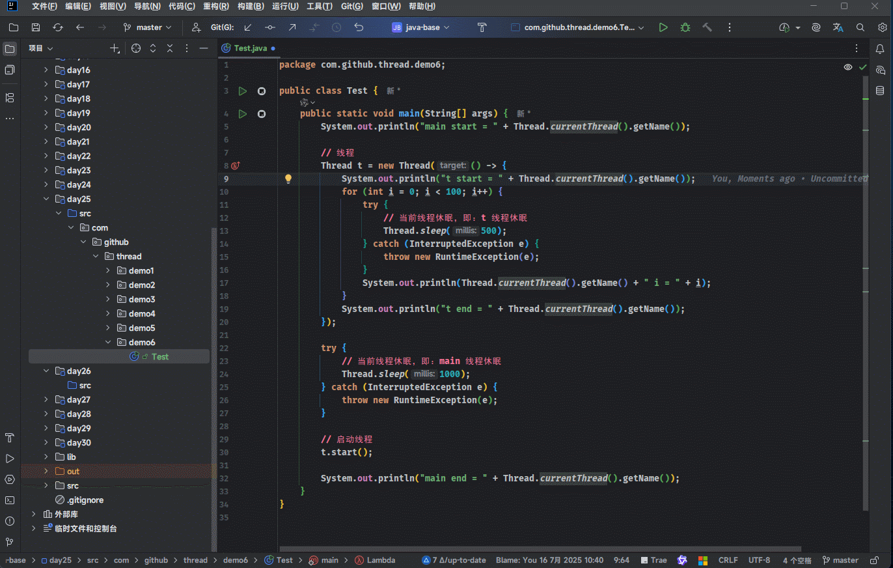
```

:::


* 示例：

::: code-group

```java [Test.java]
package com.github.thread.demo6;

import java.util.concurrent.TimeUnit;

public class Test {
    public static void main(String[] args) {
        System.out.println("main start = " + Thread.currentThread().getName());

        // 线程
        Thread t = new Thread(() -> {
            System.out.println("t start = " + Thread.currentThread().getName());
            for (int i = 0; i < 100; i++) {
                try {
                    // 当前线程休眠，即：t 线程休眠
                    TimeUnit.MILLISECONDS.sleep(500);
                } catch (InterruptedException e) {
                    throw new RuntimeException(e);
                }
                System.out.println(Thread.currentThread().getName() + " i = " + i);
            }
            System.out.println("t end = " + Thread.currentThread().getName());
        });

        try {
            // 当前线程休眠，即：main 线程休眠
            TimeUnit.SECONDS.sleep(1);
        } catch (InterruptedException e) {
            throw new RuntimeException(e);
        }

        // 启动线程
        t.start();

        System.out.println("main end = " + Thread.currentThread().getName());
    }
}

```

```md:img [cmd 控制台]
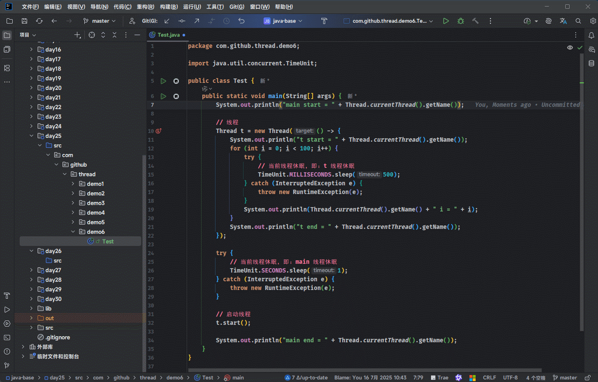
```

:::

## 1.6 线程优先级相关方法（了解）

* 设置线程的优先级：

```java
public final void setPriority(int newPriority) {}
```

* 获取线程的优先级：

```java
public final int getPriority() {}
```

> [!NOTE]
>
> * ① 线程的优先级是 1 - 10 ，线程默认的优先级是 5 ，如下所示：
>
> ```java
> public static final int MIN_PRIORITY = 1;
> public static final int NORM_PRIORITY = 5;
> public static final int MAX_PRIORITY = 10;
> ```
>
> * ② 优先级高的线程通常会比优先级低的线程先被操作系统调度；但是，并不一定！！！
> * ③ 在实际开发中，我们通常不会去设置线程的优先级，因为 Java 中的线程是依靠操作系统的调度器来进行调度的，所谓的优先级只是给操作系统一些建议而已！！！


* 示例：

::: code-group

```java [Test.java]
package com.github.thread.demo7;

public class Test {
    public static void main(String[] args) {
        Thread t1 = new Thread(() -> {
            System.out.println("t1线程：" + Thread.currentThread().getPriority());
        });
        t1.start();

        Thread t2 = new Thread(() -> {
            System.out.println("t2线程：" + Thread.currentThread().getPriority());
        });
        t2.setPriority(10);
        t2.start();
    }
}
```

```md:img [cmd 控制台]
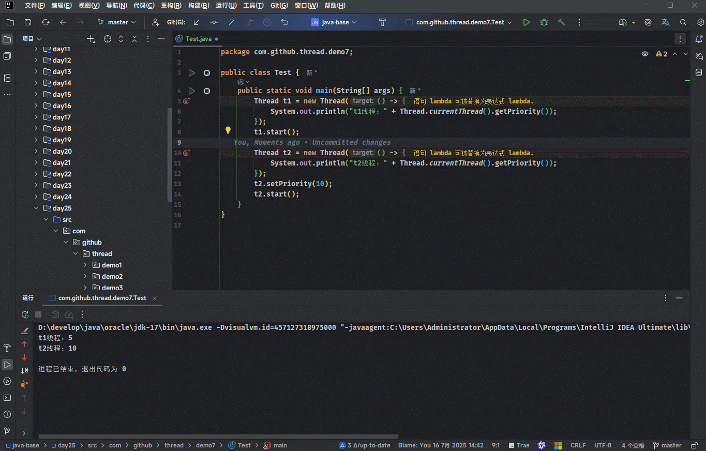
```

:::

## 1.7 守护线程相关方法

* 设置当前线程为守护线程（后台线程）：

```java
public final void setDaemon(boolean on) {}
```

* 判断当前线程是否是守护线程（后台线程）：

```java
public final boolean isDaemon() {}
```

> [!NOTE]
>
> * ① Java 中默认创建的线程是非守护线程（普通线程，用户线程）。
> * ② 如果一个应用中只要有一个普通线程还在运行，应用程序就不会退出；反之，则会退出。
> * ③ 守护线程依赖于普通线程，当最后一个前台线程结束时，所有后台线程立即终止。
> * ④ Java 中的 GC 就是典型的守护线程。


* 示例：普通线程

::: code-group

```java [Test.java]
package com.github.thread.demo8;

import java.util.concurrent.TimeUnit;

/**
 * 如果一个应用中只要有一个普通线程还在运行，应用程序就不会退出；反之，则会退出。
 */
public class Test {
    public static void main(String[] args) {
        System.out.println("main 线程开始：" + Thread.currentThread().getName());

        Thread t1 = new Thread(() -> {
            for (int i = 0; i < 100; i++) {
                try {
                    TimeUnit.MILLISECONDS.sleep(100);
                } catch (InterruptedException e) {
                    throw new RuntimeException(e);
                }
                System.out.println(Thread.currentThread().getName() + ":" + i);
            }
        });
        t1.start();

        System.out.println("main 线程结束：" + Thread.currentThread().getName());
    }
}
```

```md:img [cmd 控制台]
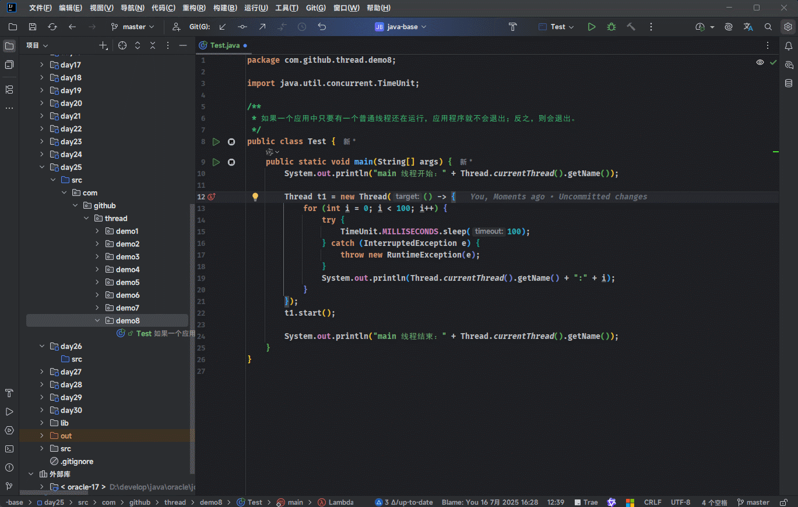
```

:::


* 示例：守护线程

::: code-group

```java [Test.java]
package com.github.thread.demo8;

import java.util.concurrent.TimeUnit;

/**
 * 守护线程依赖于普通线程，当最后一个前台线程结束时，所有后台线程立即终止。
 */
public class Test {
    public static void main(String[] args) {
        System.out.println("main 线程开始：" + Thread.currentThread().getName());

        Thread t1 = new Thread(() -> {
            for (int i = 0; i < 100; i++) {
                try {
                    TimeUnit.MILLISECONDS.sleep(100);
                } catch (InterruptedException e) {
                    throw new RuntimeException(e);
                }
                System.out.println(Thread.currentThread().getName() + ":" + i);
            }
        });
        // 设置为守护线程
        t1.setDaemon(true);
        t1.start();

        System.out.println("main 线程结束：" + Thread.currentThread().getName());
    }
}
```

```md:img [cmd 控制台]
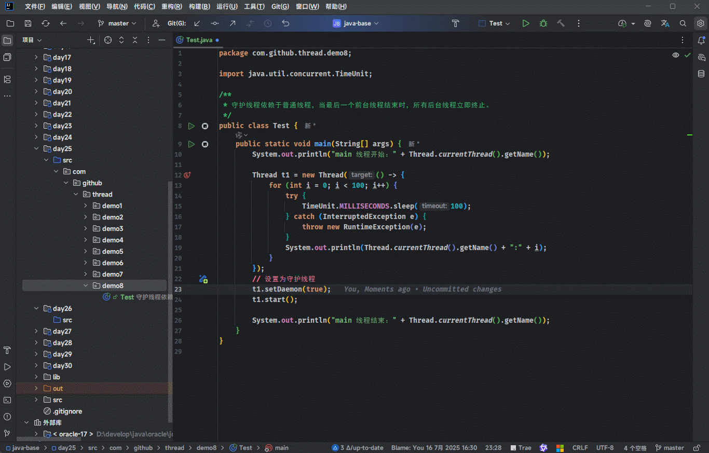
```

:::

## 1.8 礼让线程相关方法（了解）

* 设置当前线程为礼让线程，即：放弃 CPU 的执行权：

```java
public static native void yield();
```

> [!NOTE]
>
> * ① Java 中的线程是映射到操作系统的内核线程，仅仅具备建议权，具体调度依靠的是操作系统内部的调度器。
> * ② yield() 方法和 setPriority() 方法类似也是建议操作系统而已！！！


* 示例：

::: code-group

```java [Test.java]
package com.github.thread.demo8;

import java.util.concurrent.TimeUnit;

/**
 * 守护线程依赖于普通线程，当最后一个前台线程结束时，所有后台线程立即终止。
 */
public class Test {
    public static void main(String[] args) {
        System.out.println("main 线程开始：" + Thread.currentThread().getName());

        Thread t1 = new Thread(() -> {
            for (int i = 0; i < 100; i++) {
                try {
                    TimeUnit.MILLISECONDS.sleep(100);
                } catch (InterruptedException e) {
                    throw new RuntimeException(e);
                }
                System.out.println(Thread.currentThread().getName() + ":" + i);
            }
        });
        // 设置为守护线程
        t1.setDaemon(true);
        t1.start();

        System.out.println("main 线程结束：" + Thread.currentThread().getName());
    }
}
```

```md:img [cmd 控制台]
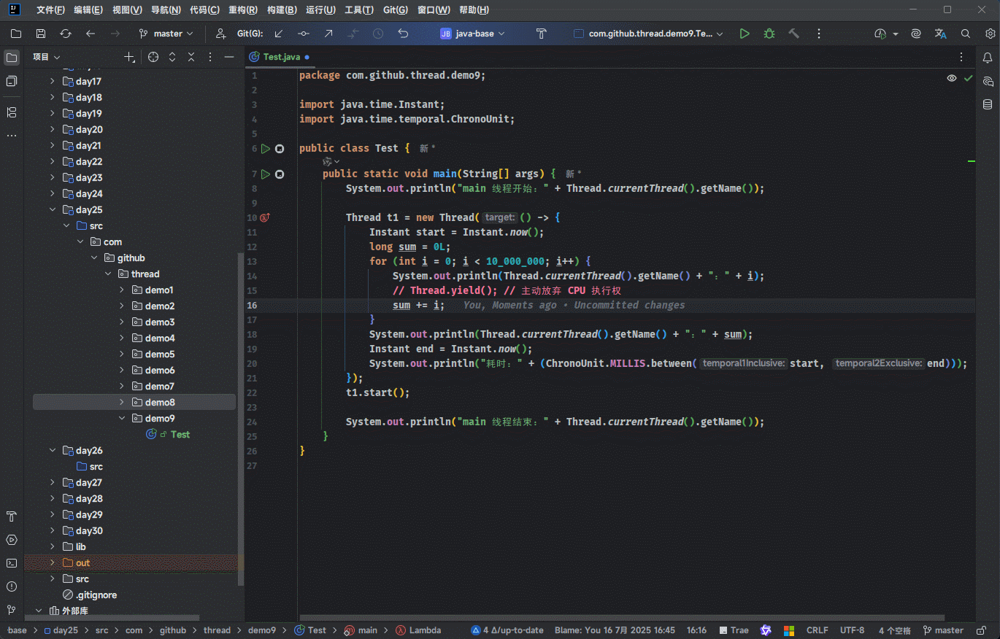
```

:::


# 第二章：