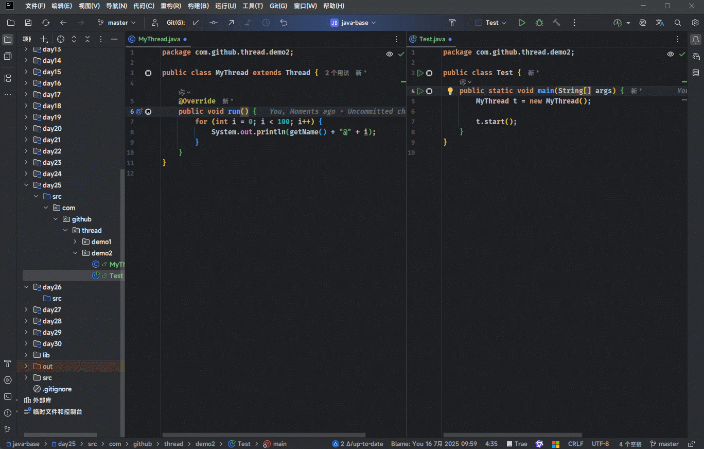
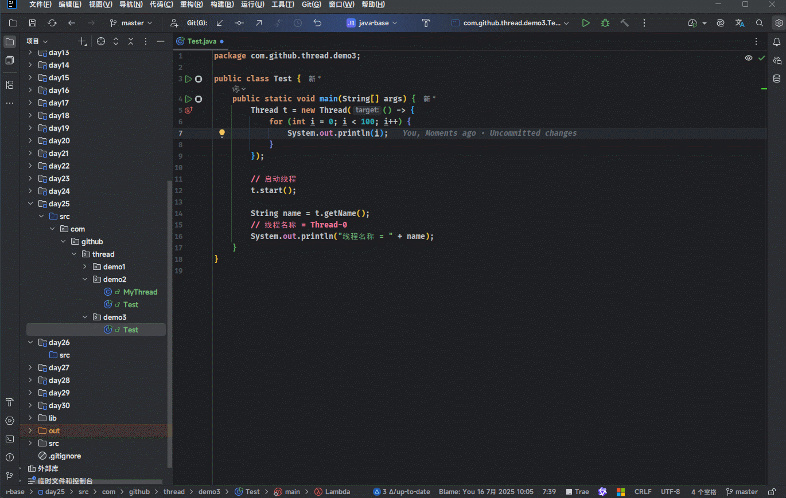
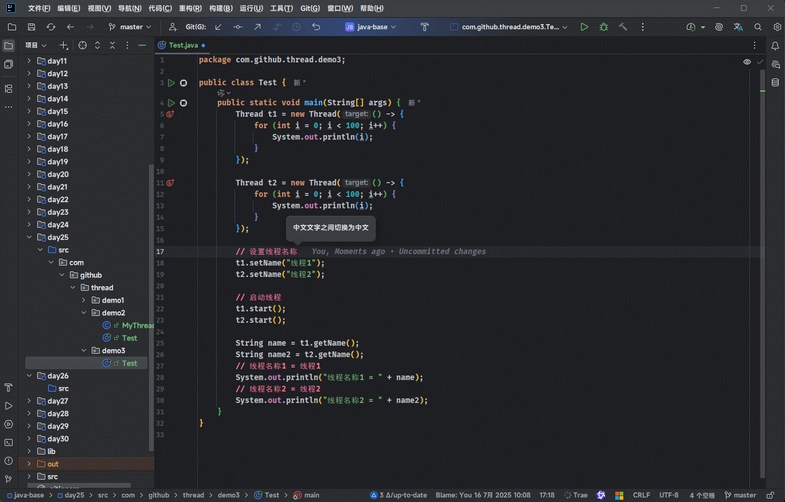
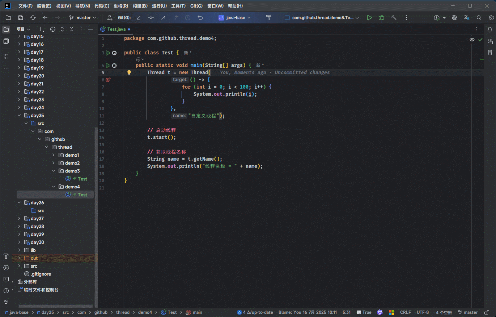
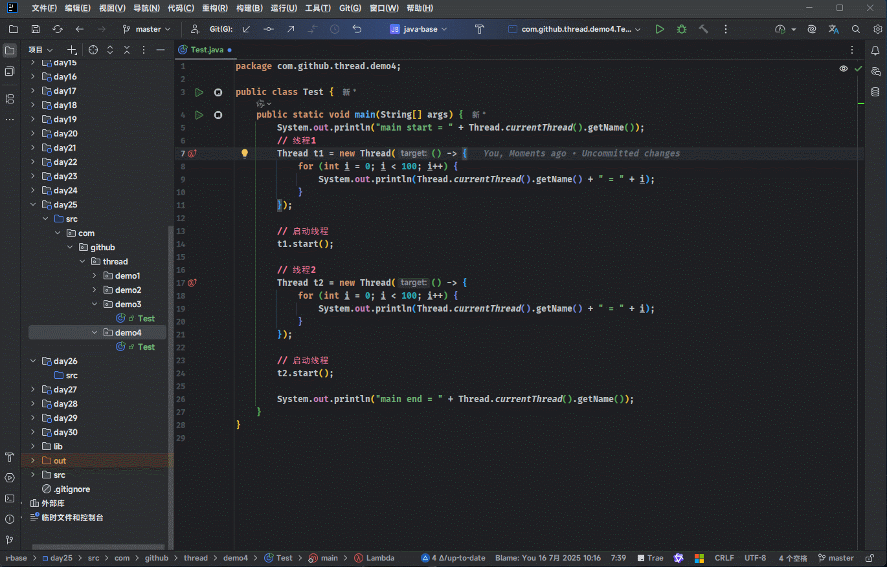
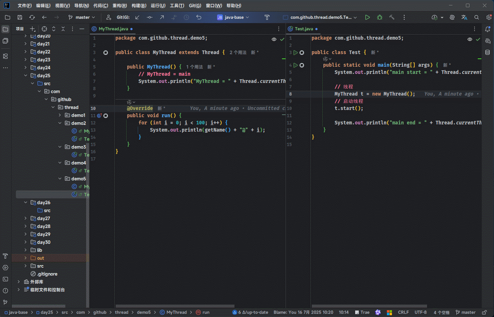
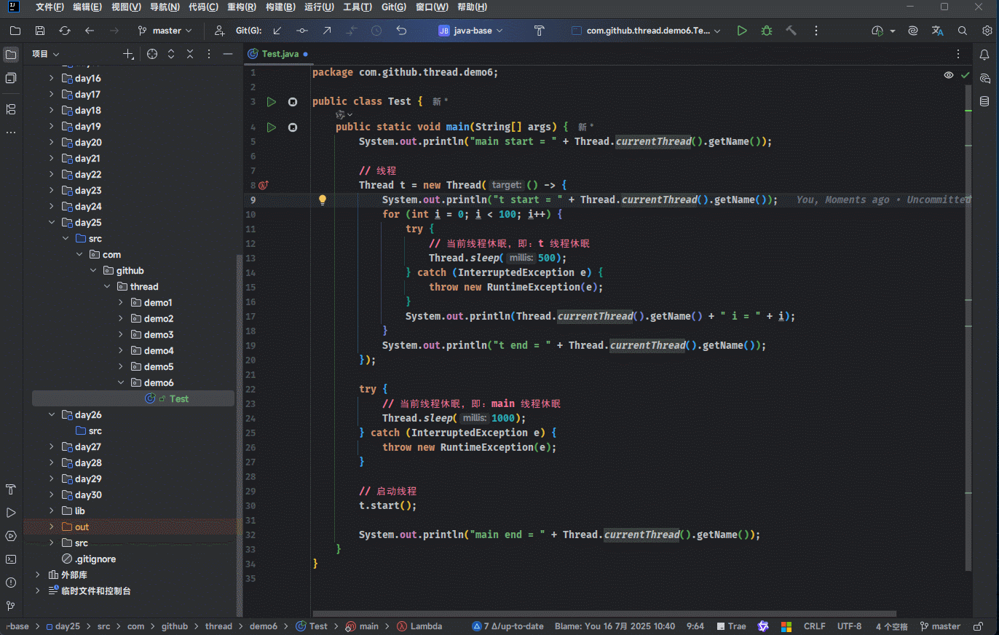
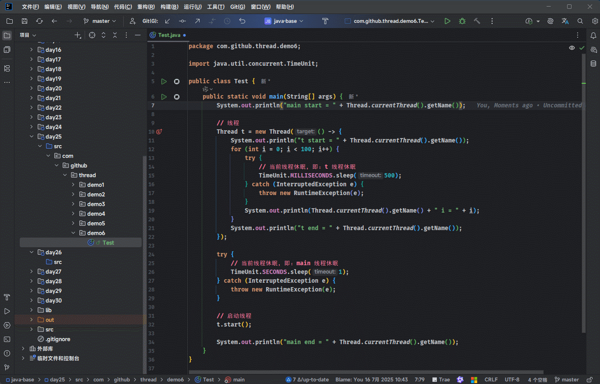

# 第一章：常见的成员方法（⭐）

## 1.1 概述

* Thread 类中常见的方法，如下所示：

| 方法                                                       | 描述                                           |
| ---------------------------------------------------------- | ---------------------------------------------- |
| `public final String getName(){}`                          | 返回此线程的名称                               |
| `public final synchronized void setName(String name) {}`   | 设置线程的名称（构造方法也可以）               |
| `public static native Thread currentThread();`             | 获取当前线程的对象                             |
| `public static native void sleep(long millis);`            | 让当前线程休眠，单位是毫秒                     |
| `public final void setPriority(int newPriority) {}`        | 设置线程的优先级                               |
| `public final int getPriority() {}`                        | 获取线程的优先级                               |
| `public final void setDaemon(boolean on) {}`               | 设置当前线程为后台线程（守护线程）             |
| `public final boolean isDaemon() {}`                       | 判断当前线程是否是后台线程                     |
| `public static native void yield();`                       | 设置当前线程为礼让线程（交出 CPU 的执行权）    |
| `public final void join(){}`                               | 设置当前线程为插入线程（加塞线程）             |
| `public final synchronized void join(final long millis){}` | 设置当前线程为插入线程（加塞线程），单位是毫秒 |
| `public ClassLoader getContextClassLoader(){}`             | 获取线程上下文的 ClassLoader                   |
| `public State getState() {}`                               | 返回当前线程的状态                             |
| `public static native boolean holdsLock(Object obj){}`     | 返回当前线程是否持有指定对象的监视器锁         |
| `public void interrupt() {}`                               | 中断当前线程                                   |
| `public boolean isInterrupted() {}`                        | 当前线程是否被中断                             |
| `public synchronized void start() {}`                      | 启动当前线程                                   |
| `public void run() {}`                                     | 线程执行的业务逻辑                             |

## 1.2 线程名称相关方法

* 设置线程名称：

```java
public Thread(String name){}
```

```java
public Thread(Runnable target, String name){}
```

```java
public final synchronized void setName(String name) {}
```

* 获取线程名称：

```java
public final String getName(){}
```


* 示例：获取线程名称

::: code-group

```java [MyThread.java]
package com.github.thread.demo2;

public class MyThread extends Thread {

    @Override
    public void run() {
        for (int i = 0; i < 100; i++) {
            System.out.println(getName() + "@" + i);
        }
    }
}
```

```java [Test.java]
package com.github.thread.demo2;

public class Test {
    public static void main(String[] args) {
        MyThread t = new MyThread();

        t.start();
    }
}
```

```md:img [cmd 控制台]

```

:::


* 示例：获取线程名称

::: code-group

```java [Test.java]
package com.github.thread.demo3;

public class Test {
    public static void main(String[] args) {
       Thread t = new Thread(() -> {
           for (int i = 0; i < 100; i++) {
               System.out.println(i);
           }
       });
        String name = t.getName();
        System.out.println("线程名称 = " + name);

        t.start();
    }
}
```

```md:img [cmd 控制台]

```

:::


* 示例：设置线程名称

::: code-group

```java [Test.java]
package com.github.thread.demo3;

public class Test {
    public static void main(String[] args) {
        Thread t1 = new Thread(() -> {
            for (int i = 0; i < 100; i++) {
                System.out.println(i);
            }
        });

        Thread t2 = new Thread(() -> {
            for (int i = 0; i < 100; i++) {
                System.out.println(i);
            }
        });

        // 设置线程名称
        t1.setName("线程1");
        t2.setName("线程2");

        // 启动线程
        t1.start();
        t2.start();

        String name = t1.getName();
        String name2 = t2.getName();
        // 线程名称1 = 线程1
        System.out.println("线程名称1 = " + name);
        // 线程名称2 = 线程2
        System.out.println("线程名称2 = " + name2);
    }
}
```

```md:img [cmd 控制台]

```

:::


* 示例：设置线程名称

::: code-group

```java [Test.java]
package com.github.thread.demo4;

public class Test {
    public static void main(String[] args) {
        Thread t = new Thread(
                () -> {
                    for (int i = 0; i < 100; i++) {
                        System.out.println(i);
                    }
                },
                "自定义线程");

        // 启动线程
        t.start();

        // 获取线程名称
        String name = t.getName();
        System.out.println("线程名称 = " + name);
    }
}
```

```md:img [cmd 控制台]

```

:::

## 1.3 当前线程相关方法

* 获取当前线程对象：

```java
public static native Thread currentThread();
```


* 示例：

::: code-group

```java [Test.java]
package com.github.thread.demo4;

public class Test {
    public static void main(String[] args) {
        System.out.println("main start" + Thread.currentThread().getName());
        // 线程1
        Thread t1 = new Thread(() -> {
            for (int i = 0; i < 100; i++) {
                System.out.println(Thread.currentThread().getName() + " = " + i);
            }
        });

        // 启动线程
        t1.start();

        // 线程2
        Thread t2 = new Thread(() -> {
            for (int i = 0; i < 100; i++) {
                System.out.println(Thread.currentThread().getName() + " = " + i);
            }
        });

        // 启动线程
        t2.start();

        System.out.println("main end" + Thread.currentThread().getName());
    }
}
```

```md:img [cmd 控制台]

```

:::


* 示例：

::: code-group

```java [MyThread.java]
package com.github.thread.demo5;

public class MyThread extends Thread {

    public MyThread() {
        // MyThread = main
        System.out.println("MyThread = " + Thread.currentThread().getName());
    }

    @Override
    public void run() {
        for (int i = 0; i < 100; i++) {
            System.out.println(getName() + "@" + i);
        }
    }
}
```

```java [Test.java]
package com.github.thread.demo5;

public class Test {
    public static void main(String[] args) {
        System.out.println("main start = " + Thread.currentThread().getName());

        // 线程
        MyThread t = new MyThread();
        // 启动线程
        t.start();

        System.out.println("main end = " + Thread.currentThread().getName());
    }
}
```

```md:img [cmd 控制台]

```

:::

## 1.4 线程休眠相关方法

* 让当前线程休眠多少毫秒：

```java
public static native void sleep(long millis) throws InterruptedException;
```

* 让当前线程休眠指定的时间：

```java
TimeUnit.MILLISECONDS.sleep(long timeout) throws InterruptedException;
```

```java
TimeUnit.SECONDS.sleep(long timeout) throws InterruptedException;
```

> [!NOTE]
>
> * ① `TimeUnit.SECONDS.sleep(timeout)` 就是对 `Thread.sleep(millis)` 的封装。
> * ② 在实际开发中，推荐使用`TimeUnit.SECONDS.sleep(timeout)`，因为可读性更高！！！


* 示例：

::: code-group

```java [Test.java]
package com.github.thread.demo6;

public class Test {
    public static void main(String[] args) {
        System.out.println("main start = " + Thread.currentThread().getName());

        // 线程
        Thread t = new Thread(() -> {
            System.out.println("t start = " + Thread.currentThread().getName());
            for (int i = 0; i < 100; i++) {
                try {
                    // 当前线程休眠，即：t 线程休眠
                    Thread.sleep(500);
                } catch (InterruptedException e) {
                    throw new RuntimeException(e);
                }
                System.out.println(Thread.currentThread().getName() + " i = " + i);
            }
            System.out.println("t end = " + Thread.currentThread().getName());
        });

        try {
            // 当前线程休眠，即：main 线程休眠
            Thread.sleep(1000);
        } catch (InterruptedException e) {
            throw new RuntimeException(e);
        }

        // 启动线程
        t.start();

        System.out.println("main end = " + Thread.currentThread().getName());
    }
}
```

```md:img [cmd 控制台]

```

:::


* 示例：

::: code-group

```java [Test.java]
package com.github.thread.demo6;

import java.util.concurrent.TimeUnit;

public class Test {
    public static void main(String[] args) {
        System.out.println("main start = " + Thread.currentThread().getName());

        // 线程
        Thread t = new Thread(() -> {
            System.out.println("t start = " + Thread.currentThread().getName());
            for (int i = 0; i < 100; i++) {
                try {
                    // 当前线程休眠，即：t 线程休眠
                    TimeUnit.MILLISECONDS.sleep(500);
                } catch (InterruptedException e) {
                    throw new RuntimeException(e);
                }
                System.out.println(Thread.currentThread().getName() + " i = " + i);
            }
            System.out.println("t end = " + Thread.currentThread().getName());
        });

        try {
            // 当前线程休眠，即：main 线程休眠
            TimeUnit.SECONDS.sleep(1);
        } catch (InterruptedException e) {
            throw new RuntimeException(e);
        }

        // 启动线程
        t.start();

        System.out.println("main end = " + Thread.currentThread().getName());
    }
}

```

```md:img [cmd 控制台]

```

:::

## 1.5 


# 第二章：