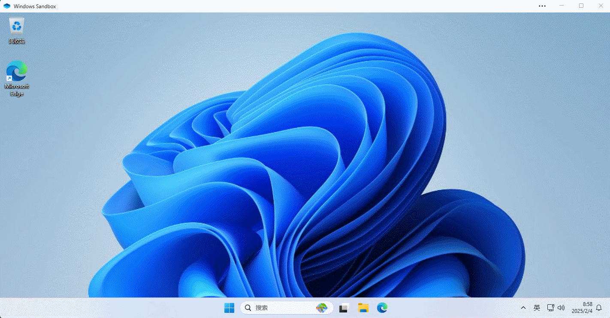
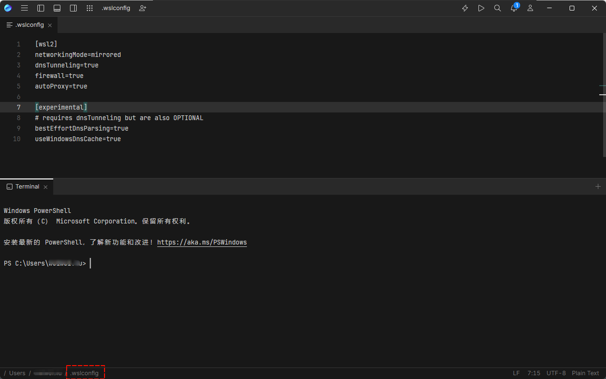
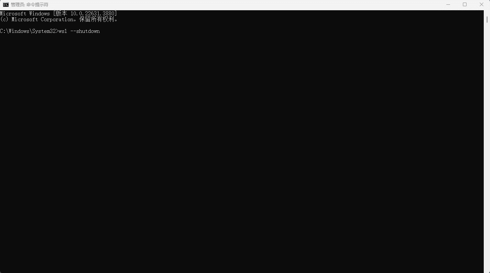
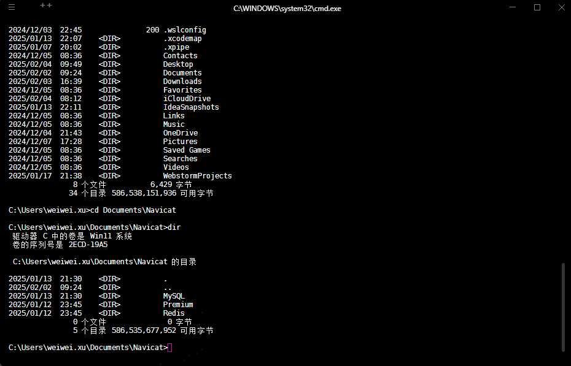

# 第一章：Java 相关概述

## 1.1 Java SE 课程体系介绍

* Java SE 知识图谱，如下所示：


* Java SE 知识模块，如下所示：

  - [x] 第一部分（计算机编程核心语法）：
    - [ ] 数据类型
    - [ ] 运算符
    - [ ] 流程控制语句
    - [ ] 数组
    - [ ] 方法
    - [ ] ...

  - [x] 第二部分（面向对象核心逻辑）：
    - [ ] 类和对象
    - [ ] 封装
    - [ ] 继承
    - [ ] 多态
    - [ ] 抽象
    - [ ] 接口
    - [ ] ...

  - [x] 第三部分（Java SE 核心高级应用）：
    - [ ] API
    - [ ] 集合
    - [ ] IO 流
    - [ ] 多线程
    - [ ] 网络编程
    - [ ] 反射
    - [ ] ...

  - [x] 第四部分（Java 新特性）：
    - [ ] Lambda 表达式
    - [ ] 函数式接口
    - [ ] 新时间日期 API
    - [ ] JDK8 ~ JDK17 新特性
    - [ ] ...

## 1.2 软件和硬件的介绍

### 1.2.1 硬件

* `硬件`是计算机系统中`可触摸的物理部件`，指的是所有实物组件。它包括了计算机的各个硬件设备，如：主板、中央处理器（CPU）、内存、硬盘、显示器、键盘、鼠标等。


* `硬件`被认为是`“硬”`，是因为它在变化或修改方面较`“硬”`或`严格`。
* `硬件`的功能是`执行计算机的基础操作和提供物理接口`，它们通过`电子信号`和`电流`来实现计算、存储和输入输出的任务。

### 1.2.2 软件

* `软件是`指运行在计算机硬件上的`程序`和`应用`，它是计算机的指令集，不能直接触摸或看到，如：操作系统（Windows、MacOS、Linux）、应用程序（Word、Photoshop）以及各种工具和服务。


* `软件`被认为是`“软”`的，是因为它在变化或修改方面容易`更新`或`更改`。
* `软件`的功能是`提供对硬件的控制和利用`，使用户能够通过输入命令和操作界面与计算机交互，实现特定的任务或解决问题。

### 1.2.3 硬件和软件的关系

* `硬件和软件是相辅相成的，谁也离不开谁`。硬件可以认为是“计算机的身体”，而软件可以认为是“计算机的大脑”。
* 硬件通常由软件指示以执行命令或指令。硬件和软件的组合形成可用的计算机系统，尽管存在仅具有硬件组件的其他系统。

## 1.3 计算机语言

### 1.3.1 计算机编程语言

- `人类语言`是人和人之间用于沟通的一种方式，例如：中国人和中国人之间使用普通话沟通，而中国人和美国人交流，则可以使用英语。

> [!NOTE]
>
> - ① 中文有自己的`固定格式`和`固定词汇`（即：`语法规则`），英文也是自己的`固定格式`和`固定词汇`（即：`语法规则`）；同样的道理，法语、韩国等各种`人类语言`都有自己的`固定格式`和`固定词汇`（即：`语法规则`）。
> - ② 在和别的国家的人进行交流的时候，我们必须正确的表达，对方才会理解我们；否则，如果不熟悉对方国家的语言的语法规则，乱用语法规则，可能会贻笑大方，如：中文中的`望其项背`原指看见对方的背影，形容差距不大，能赶上；但是，很多人却认为这是形容遥不可及或难以企及的目标。
> - ③ 就算和本国家的人进行交流的时候，我们也必须正确的表达，对方才会理解我们；否则，如果乱用语法规则，可能也会让对方感觉奇怪，听不懂我们的意思，如：`借我 5000 RMB 买 iphone` 或者 `5000 RMB 我买 iphone 借`。

* `计算机编程语言`是人和计算机交流的方式。人们可以使用`编程语言`对计算机下达`命令（指令）`，让计算机完成人们需要的功能。

> [!NOTE]
>
> - ① 计算机语言也有自己`固定格式`和`固定词汇`（即：`语法规则`），我们必须学习其语法规则，才能控制计算机，让计算机完成我们所需要的功能。
> - ② 计算机语言有很多种，如：C、C++、Java、Go、JavaScript、Python、Scala 等。

### 1.3.2 为什么要学习计算机语言？

* 编程语言到底是什么？编程语言就是由文字和符号组成的，如：

```c
#include <stdio.h> // 这是编译预处理指令

int main() { // 定义主函数

    printf("你好，世界！！！"); // 输出所指定的一行信息

    return 0;  // 函数执行完毕时返回函数值0
}
```

* 编程语言就是用于控制计算机，让其完成我们需要的功能。而我们学习编程语言，其实就是学习这些文字和符号编写的规则。
* 因为 `CPU` 只能识别二进制的指令，而我们`编写`的程序叫做`源代码`，是人类能看懂；但是，计算机却不能识别。那么，我们就需要让计算机能识别我们编写的源程序，就需要将我们编写的源代码交给编译器程序，其会帮助我们将所编写的源代码转换为计算机能够识别的二进制指令。

> [!NOTE]
>
> 编译器就是运行在操作系统之上的程序，其作用就是用来将程序员编写的源代码转换为计算机能够识别的二进制指令。

* 如果我们用 `Java` 语言编写了程序（源代码），那么编写的程序也是不能直接运行的，需要通过 `Java` 语言的编译器将 `Java` 程序编译为计算机能够识别的二进制指令。
* 如果我们用 `Python` 语言编写了程序（源代码），那么编写的程序也是不能直接运行的，需要通过 `Python` 语言的编译器将 `Python` 程序编译为计算机能够识别的二进制指令。
* ……

> [!NOTE]
>
> 总结：无论我们学习任何一门编程语言，想要将程序运行起来，都必须做如下的两件事情：
>
> - ① 学习该语言的文字和符号编写的规则，即：`语法规则`。
> - ② 需要在操作系统上安装对应编程语言的`编译器`程序，将源程序编译为计算机能够识别的二进制指令。

### 1.3.3 计算机语言的发展史

#### 1.3.3.1 机器语言（相当于人类的石器时代）

* 1946 年 2 月 14 日，世界上第一台计算机 `ENIAC` 诞生，使用的是最原始的`穿透卡片`。


* 这种卡片使用的是用`二进制代码`表示的语言，和人类语言差别极大，这种语言就称为`机器语言`，如：

```txt
0000,0000,000000010000 代表 LOAD A, 16
0000,0001,000000000001 代表 LOAD B, 1
0001,0001,000000010000 代表 STORE B, 16
```

* 这种语言本质上是计算机能识别的`唯一语言`，人类很难理解；换言之，当时的程序员 99.9% 都是异类！！！

> [!WARNING]
>
> - ① 不同类型（CPU 架构，如：x86_64、arm 等）的处理器有不同的机器语言指令集，指令集架构（ISA）决定了机器语言的具体形式。
> - ② 换言之，机器语言与特定硬件架构紧密相关，机器语言程序几乎没有可移植性。

#### 1.3.3.2 汇编语言（相当于人类的青铜&铁器时代）

- `汇编语言`使用`助记符`（如：MOV、ADD、SUB）代替二进制操作码，使程序更易于人类编写和理解；因此，`汇编语言`也被称为`符号语言`。


- 汇编语言的`优点`是能编写`高效率`的程序；但是，`缺点`和机器语言没什么不同，汇编语言同样`依赖于具体的计算机架构（面向机器）`，程序不具备跨平台的可移植性。

> [!WARNING]
>
> - ① 汇编语言，目前仍然应用于工业电子编程领域、软件的加密解密、计算机病毒分析等。
> - ② 汇编语言是编程语言的拓荒年代，它非常底层，直接和计算机硬件打交道，开发效率低，学习成本高。

#### 1.3.3.3 高级语言（相当于人类的信息时代）

- `高级语言`是一种`接近于人们使用习惯`的程序设计语言。`它允许程序员使用接近日常英语的指令来编写程序`，程序中的符号和算式也和`日常使用的数学公式`差不多，接近于自然语言和数学语言，容易被人们掌握。


* 高级语言`独立于计算机硬件`，有一定的通用性；计算机不能直接识别和执行用高级语言编写的程序，需要使用`编译器`或`解释器`转换为机器语言，才能被计算机识别和执行。


> [!NOTE]
>
> - ① 普遍使用的高级编程语言，有：C、C++、Java、Python、C#、JavaScript、Go、SQL 等。
> - ② C 语言是“[面向过程](https://zh.wikipedia.org/wiki/过程式编程)”的编程语言，已经脱离了计算机硬件，可以用来设计和开发`中等`规模的程序。
> - ③ Java、C++、Python、C# 等都是“[面向对象](https://zh.wikipedia.org/wiki/面向对象程序设计)”的编程语言（它们在“[面向过程](https://zh.wikipedia.org/wiki/过程式编程)”的基础上又增加了很多概念），可以用来设计和开发`中大型`规模的程序。

#### 1.3.3.4 总结

- 编写语言的对比，如下所示：

| 类别         | 特征                               | 优点                                             | 缺点                                                         | 示例                |
| :----------- | :--------------------------------- | :----------------------------------------------- | :----------------------------------------------------------- | :------------------ |
| **机器语言** | 直接由计算机执行的二进制代码       | 执行速度快                                       | 编写困难，可读性差，与具体硬件强绑定                         | 二进制代码          |
| **汇编语言** | 用助记符代替二进制代码的低级语言   | 相对机器语言更易编写和理解，允许直接控制硬件资源 | 依然需要了解硬件，不够抽象，与具体硬件或平台相关             | MOV，ADD 等助记符   |
| **高级语言** | 接近人类语言，提供了更高层次的抽象 | 易于编写和维护，可移植性好，支持多种编程范式     | 需要通过编译器或解释器转换为机器语言，可能存在一定的性能损失 | C，Java， Python 等 |

> [!IMPORTANT]
>
> - ① 使用机器语言进行编程，对于程序员来说，简直就是噩梦，尤其当功能比较多，程序比较大的时候，不但编写麻烦，需要频繁查询指令手册，而且排查错误非常麻烦，要直接面对一堆二进制数据，想想都令人崩溃（上古程序员，可能真的不是“人”，而是“异类”）。此外，使用二进制指令编程，步骤非常繁琐，要考虑各种边界情况和底层问题，开发效率十分低下。
> - ② 这就倒逼程序员开发出了编程语言，提供自己的生产力，如：汇编语言、C 语言、C++ 语言、Java 语言、Go 语言等等，都是在逐步`提高开发效率`。至此，编程终于不再是只有极客才能做的事情，不怎么了解计算机的初学者在经过一定时间的训练后也可以编写出有模有样的程序。
> - ③ 在实际开发中，随着计算机科学的发展，现代化的高级编程语言，如：C++ 语言、Java 语言、Go 语言等，因其强大的表达能力、良好的可移植性和易用性，成为了日常软件开发的主流选择。

## 1.4 初识 Java 语言

### 1.4.1 Java 生态圈的介绍

* `Java 生态圈`是指围绕 Java 编程语言及其相关技术所形成的一个广泛的、充满活力的软件开发环境和社区。它包含了许多工具、库、框架、平台以及开源项目，旨在提升开发者的工作效率，支持构建跨平台应用，推动技术创新和应用的普及。
* `Java 生态圈`的主要组成部分，如下所示：
  * ① `Java平台（JDK）`：
    * Java Development Kit (JDK)：这是Java开发者的核心工具包，它包含了 Java 语言的编译器、标准类库、调试工具等，开发者用它来编写、编译和执行 Java 程序。
    * ~~Java Runtime Environment (JRE)：JRE 是 Java 程序的运行环境，包含了运行 Java 程序所需的库和虚拟机，但不包括开发工具，如：编译器~~。
    * Java 虚拟机 (JVM)：JVM 是 Java 程序能够实现跨平台的关键，它负责将字节码（Java 程序编译后的代码）转换成平台相关的机器代码。
  * ② `Java 框架和库`：Java的强大之处在于它的丰富的框架和库，以下是一些最为常用的框架和库，如下所示：
    * Spring Framework：一个广泛使用的开源框架，提供了全面的企业级解决方案，涵盖了从依赖注入、事务管理到Web应用开发等各个方面。
    * Hibernate：一个用于简化数据库操作的对象关系映射（ORM）框架，帮助开发者将 Java 对象映射到数据库表。
    * Apache Commons：包含大量的可重用 Java 组件，涵盖了常见的功能，如：文件操作、字符串处理等。
    * ...
  * ③ `Java 开发工具`：Java 生态圈中还包括各种开发工具，帮助开发者提高工作效率，如下所示：
    * IDE（集成开发环境）：
      - IntelliJ IDEA：非常流行的 Java 开发 IDE，拥有强大的代码自动补全、调试功能和插件支持。
      - Eclipse：另一款广泛使用的开源 IDE，支持多种编程语言，尤其适合企业级应用开发。
      - ~~NetBeans：适用于 Java SE 和 Java EE 开发的开源 IDE~~（很少有人使用）。
    * 构建工具：
      - Maven：一个项目管理和构建自动化工具，用于管理项目的依赖关系、构建过程等。
      - Gradle：一个现代化的构建自动化工具，相比 Maven，Gradle 支持更灵活的配置方式，适用于多种项目类型。
  * ④ `Java 社区和开源项目`：Java有一个庞大的开发者社区，各种开源项目在其中蓬勃发展，主要包括：
    * Apache 软件基金会：提供了大量用于 Java 开发的开源项目，如：Apache Tomcat、Apache Kafka、Apache Camel 等。
    * Java 用户组（JUG）：遍布全球的 Java 爱好者和开发者社群，定期举行会议和讨论，推动 Java 技术的传播和发展。
    * GitHub 上的 Java 开源项目：许多 Java 开源项目都托管在 GitHub 上，开发者可以参与贡献、学习新技术或借用已有的代码。
    * ...
  * ⑤ `企业级应用与解决方案`：Java 生态圈不仅仅限于小型应用开发，它在企业级应用中同样占据重要地位。Java EE（企业版）是一个专门用于开发大规模分布式企业级应用的标准，它包括了一些关键技术，如下所示：
    * Servlet & JSP：用于构建 Web 应用。
    * ~~EJB（Enterprise JavaBeans）：用于构建分布式应用，支持事务管理、持久性等。~~
    * ~~JMS (Java Message Service)：用于消息队列，支持异步通信。~~
    * ...
  * ⑥ `大数据与云计算`：Java 在大数据和云计算领域也占有一席之地，以下是一些相关的技术：
    * Hadoop：Java 编写的大数据框架，支持分布式存储与处理。
    * Apache Spark：一个快速的通用计算引擎，支持大规模数据分析。
    * Spring Cloud：用于开发分布式系统的框架，支持微服务架构。
    * Java 与 AWS、Azure 等云平台的集成：Java 应用广泛支持与云服务提供商（Amazon Web Services、Microsoft Azure 等）的集成，支持云端部署和扩展。
    * ...
  * ⑦ `Java 的跨平台特性`：Java 最强大的特点之一就是其跨平台性。只要有 JVM 的地方，Java 应用就能够运行，支持广泛的操作系统，包括 Windows、Linux、MacOS 等。

* `Java 生态圈`凭借其强大的平台、框架和工具，吸引了全球范围的大量开发者与企业使用。无论是小型项目还是企业级应用，Java 都能提供灵活的解决方案。
* 随着云计算、大数据和人工智能等新兴技术的发展，`Java 生态圈`也在不断进化，迎接更多的技术挑战。

### 1.4.2 Java 语言的发展史

* Java 语言自 1995 年由 SUN 公司发布以来，已经经历了多次重要的发展与变革，成为全球最受欢迎的编程语言之一。
* 以下是 Java 语言的发展历程：

::: timeline  初期（1991 年 ~ 1995 年）

- `Java 的起源`：Java 的前身是由 James Gosling、Mike Sheridan 和 Patrick Naughton 等人在 SUN 公司内部开发的一个项目，最初命名为 `Oak`。它的目标是为智能家电设备提供一种简单、可移植的编程语言。
- `改名为 Java`：由于 “Oak” 这个名字已经被注册，最终改为 “Java”，这个名字来自于他们团队喜欢的印尼岛屿 ——— Java 岛上的咖啡。Java 的核心目标是实现`跨平台`功能，使得程序可以在不同的设备和操作系统上运行。

:::

::: timeline  Java 1.0（1996 年 1 月）

- `核心类库`：JDK 1.0 包含了 Java 语言的核心类库，如：集合类、输入输出（I/O）类、AWT（抽象窗口工具包）用于图形用户界面（GUI）开发。
- `首次支持 Java 虚拟机（JVM）`：使得 Java 能够实现跨平台性，能够在不同操作系统中运行。

:::

::: timeline  Java 1.1（1997 年 2 月）

- `事件模型改进`：引入了新的事件模型，改进了 AWT（Abstract Window Toolkit）组件的事件处理。
- `内存管理`：增强了垃圾回收机制，自动内存管理的能力得到了提升。
- `JavaBeans`：引入了 `JavaBeans` 概念，这是一个可重用的软件组件模型。
- `反射 API`：引入了反射 API，允许 Java 程序动态加载类及访问类的属性和方法。

:::

::: timeline  Java 1.2（1998 年 12 月）

- `Java 2 平台`：标志着 Java 进入 “Java 2 时代”，包括：`J2SE`（标准版）、`J2EE`（企业版）、`J2ME`（微型版）三大平台。
- `Swing`：引入了 Swing 图形库，替代 AWT 作为新的 GUI 框架。
- `集合框架`：新增了集合框架，如：`List`、`Set`、`Map`等，大大简化了数据存储和操作。
- `Java Plug-in`：引入了Java Plug-in，使得 Java Applet 能够在 Web 浏览器中运行。

:::

::: timeline  Java 1.3（2000 年 5 月）

- `JavaSound`：引入 JavaSound API，允许开发者在 Java 程序中处理音频和音效。
- `JVM 性能提升`：对 JVM 进行了性能优化，提升了 Java 应用程序的执行效率。
- `RMI（远程方法调用）增强`：对远程方法调用（RMI）进行了增强，使其更加高效和灵活。
- `Java Naming and Directory Interface (JNDI)`：对 JNDI 进行了增强，使得 Java 能够更好地与外部目录服务和命名服务交互。

:::

::: timeline  Java 1.4（2002 年 2 月）

- `Java NIO（New I/O）`：引入了 NIO，支持更高效的 I/O 操作，如：缓冲区、通道和选择器。
- `Logging API`：引入了日志 API（`java.util.logging`），为 Java 程序提供日志记录功能。
- `正则表达式`：Java 1.4 引入了对正则表达式的原生支持，使得字符串模式匹配变得更加简便。
- `XML 支持`：增强了对 XML 的支持，新增了 XML 解析器和相关 API。

:::

::: timeline  Java 5（2004 年 9 月）

- `泛型`：引入了泛型（Generics），使得Java能够支持类型安全的容器。
- `元数据注解`：通过注解（Annotations）支持在代码中添加元数据，以增强代码可读性和可维护性。
- `枚举类型`：Java 1.5 引入了枚举类型，提供了强类型的枚举实现。
- `增强的 for 循环`：增强的 for 循环语法使得遍历数组和集合更加简洁。

::: 

::: timeline  Java 6（2006 年 12 月）

- `性能优化`：Java 6 对 JVM 进行了性能优化，尤其是在启动时间和内存占用方面。
- `Web 服务支持`：增强了对 Web 服务的支持，简化了 Web 服务的开发。
- `Java Compiler API`：引入了 Java 编译器 API，允许开发者在运行时动态编译和执行代码。
- `脚本支持`：引入了对 Java 脚本（JSR 223）支持，可以在 Java 程序中执行脚本语言，如：JavaScript。

::: 

::: timeline  Java 7（2011 年 7 月）

- `字符串改进`：引入了字符串常量池的内部优化，使得字符串的使用更为高效。
- `Switch 语句支持字符串`：Java 7 使得`switch`语句可以直接操作字符串。
- `自动资源管理（ARM）语句`：引入了`try-with-resources`语法，自动关闭资源，如：文件、数据库连接等。
- `NIO 2`：对 NIO 进行了扩展，增强了对文件和文件系统操作的支持。

::: 

::: timeline  Java 8（2014 年 3 月）

- `Lambda 表达式`：引入了 Lambda 表达式，支持函数式编程。
- `Stream API`：引入了 Stream API，提供了用于处理集合的函数式风格方法。
- `新的日期时间 API`：引入了全新的`java.time`日期时间 API ，解决了旧日期时间 API 中的许多问题。
- `默认方法`：允许在接口中定义默认方法，实现多态性。

::: 

::: timeline  Java 9（2017 年 9 月）

- `模块化系统（Project Jigsaw）`：Java 9 引入了模块化系统，使得 Java 应用可以划分为独立的模块，提高了代码的可维护性。
- `JShell`：引入了交互式命令行工具 JShell，支持实时执行 Java 代码片段，便于实验和调试。
- `增强的 JVM`：对 JVM 进行了优化，提升了启动速度和内存占用。
- `增强的 Javadoc` ：Javadoc 支持生成 HTML 5 风格的文档，并增强了搜索功能。

::: 

::: timeline  Java 10（2018 年 3 月）

- `局部变量类型推断（var关键字）`：允许开发者在声明局部变量时省略类型，由编译器推断类型。
- `并行垃圾回收器`：引入了 `G1 垃圾回收器`的进一步优化，提升垃圾回收效率。
- `JVM 控制台命令`：增加了`jcmd`命令的增强，使得开发者可以更灵活地控制和管理 JVM。
- `容器感知`：使 JVM 更好地适配容器环境，特别是在虚拟化和容器化环境中的表现。

::: 

::: timeline  Java 11（2018 年 9 月）

- `长期支持版本（LTS）`：JDK 11 是一个 LTS 版本，意味着将获得长期的支持和维护。
- `HTTP 客户端 API`：引入了标准的 HTTP 客户端 API，用于简化和改进 HTTP 请求的发送与响应处理。
- `新的字符串 API`：提供了更为高效和便捷的字符串处理方法，如：`strip()`, `isBlank()`等。
- `移除 Java EE 和 CORBA 模块`：Java EE 和 CORBA 模块从 JDK 中移除，这些模块不再由 JDK 提供支持。
- `ZGC（Z Garbage Collector）`：实验性引入了 ZGC 垃圾回收器，专为低延迟应用设计。

::: 

::: timeline  Java 12（2019 年 3 月）

- `JVM 常量接口`：允许在接口中使用常量，减少了运行时常量池的冗余。
- `Shenandoah 垃圾回收器`：引入了 Shenandoah 垃圾回收器，优化了 Java 应用的低延迟表现。
- `Switch 表达式（预览）`：引入了更简洁的 `switch` 表达式，允许 `switch` 作为表达式使用，增强了语言表达能力。

::: 

::: timeline  Java 13（2019 年 9 月）

- `文本块（预览）`：引入了多行字符串的支持，使得字符串常量能更优雅地表示多行文本。
- `ZGC 的改进`：改进了 ZGC 垃圾回收器的性能，尤其是在更大堆内存和复杂场景下的表现。

::: 

::: timeline  Java 14（2020 年 3 月）

- `JEP 305: Pattern Matching for instanceof`：允许在`instanceof`检查中直接进行类型转换，简化代码。
- `NVM 支持`：引入对持久化内存的支持，进一步优化内存管理。
- `Java Flight Recorder`：成为开源项目，允许开发者收集 JVM 的运行时数据进行性能分析。

::: 

::: timeline  Java 15（2020 年 9 月）

- `Sealed类（预览）`：允许开发者限制哪些类可以继承当前类，增强了代码的封装性和安全性。
- `垃圾回收器 G1 优化`：对 G1 垃圾回收器的性能进行了改进，减少了 GC 停顿的时间。

::: 

::: timeline  Java 16（2021 年 3 月）

- `JEP 396: Strongly Encapsulate JDK Internals`：彻底封装 JDK 内部 API，进一步增强模块化。
- `JEP 395: Records（预览）`：引入了 Record 类型，简化了数据载体类的定义。
- `JEP 376: ZGC: Concurrent Thread-Stack Processing`：进一步改进 ZGC 垃圾回收器，提升性能和低延迟处理能力。

::: 

::: timeline  Java 17（2021 年 9 月）

- `长期支持版本（LTS）`：JDK 17 是另一个 LTS 版本，提供长期支持。
- `封闭类（Sealed Classes）`：增强了类的封装性，限定哪些类可以继承或实现当前类。
- `增强的 switch 表达式`：`switch`表达式的语法和功能进一步改进，提高了代码可读性。
- `JEP 356: Enhanced Pseudo-Random Number Generators`：增强伪随机数生成器 API ，支持新的随机数算法。

::: 

::: timeline  Java 18（2022 年 3 月）

- `JEP 400: UTF-8 by Default`：JDK 18 默认将 UTF-8 作为字符集进行编码。
- `JEP 408: Simple Web Server`：引入一个简单的 Web 服务器，便于测试和开发应用。
- `JEP 416: Reimplement Core Reflection with Method Handles`：使用 `MethodHandles` 重新实现了核心反射功能，提升性能。

::: 

::: timeline  Java 19（2022 年 9 月）

- `JEP 405: Record Patterns (Preview)`：增强了记录类型的模式匹配能力，简化了代码。
- `JEP 424: Foreign Function & Memory API (Incubator)`：提供了访问外部本地代码和内存的 API ，增强了与 C 和 C++ 等语言的互操作性。

:::

::: timeline  Java 20（2023 年 3 月）

- `JEP 441: Structured Concurrency (Incubator)`：简化多线程编程，使得管理线程更加容易。
- `JEP 439: Generational ZGC`：对 ZGC 进行了代际垃圾回收的增强。

::: 

::: timeline  Java 21（2023 年 9 月）

- `长期支持版本（LTS）`：JDK 21 是 LTS 版本，提供长期支持。
- `增强的封闭类功能`：增强了封闭类的功能，使得 Java 在创建更为安全和可维护的类结构时更加灵活。
- `Pattern Matching 增强`：进一步增强了模式匹配能力，使得代码更加简洁。

::: 

## 1.5 Java 平台的不同版本

### 1.5.1 概述

* Java 在 JDK 1.2 的时候，就分为 `Java SE`（Java Platform, Standard Edition）、`Java ME`（Java Platform, Micro Edition）和 `Java EE`（Java Platform, Enterprise Edition）三个版本，每个版本针对不同的应用场景和开发需求提供不同的功能和支持。

### 1.5.2 Java SE（Standard Edition）

* `定义`：Java SE 是 Java 平台的标准版，提供了 Java 编程语言的核心功能以及开发桌面应用、基本的服务器应用和控制台应用所需的工具和类库。它是 Java 平台的基础。
* `主要特性`：
  * **核心类库**：包括常用的 API，如： `java.lang`、`java.util`、`java.io` 等，提供基本的类库支持。
  * **图形界面**：包括图形用户界面（GUI）工具包，如：`AWT`、`Swing`，使得开发桌面应用成为可能。
  * **JVM 和垃圾回收**：Java SE 提供了 Java 虚拟机（JVM）和内存管理功能，包括垃圾回收（GC）机制，保证 Java 程序的跨平台性。
  * **数据库访问**：通过 JDBC（Java Database Connectivity）API 支持连接、查询和操作关系型数据库。

* `应用场景`：桌面应用、独立应用程序、工具类库、简单的服务器端应用。

> [!WARNING]
>
> * ① Java SE 是基础，学习 Java 必须先学习 Java SE。
> * ② 对于图形界面，Java 并不是强项，C/C++ 才是这方面的王者！！！

### 1.5.3 ~~Java ME（Micro Edition）~~

- `定义`：Java ME 是 Java 平台的微型版，专为嵌入式系统、移动设备、智能卡、物联网设备等资源受限的环境设计。它的目标是让 Java 能够运行在硬件性能较低的设备上。
- `主要特性`：
  - **轻量级 API**：相比 Java SE，Java ME 提供了精简的 API，去除了一些不必要的功能，适应资源有限的设备。
  - **配置和档案**：Java ME 包含了不同的配置（CLDC - Connected Limited Device Configuration）和档案（MIDP - Mobile Information Device Profile），根据不同设备的能力提供不同的功能支持。
  - **内存和性能优化**：Java ME 优化了内存使用和处理速度，确保其能够在低内存和低处理能力的设备上运行。
- `应用场景`：嵌入式设备、功能手机、智能卡、物联网设备等。

> [!WARNING]
>
> * ① Java ME 虽然专为嵌入式系统、移动设备、智能卡、物联网设备等资源受限的环境设计；但是，在实际工作中，在这些场景中却不怎么使用 Java ME 来进行开发，如：手机使用的是 `Andriod` 或 `iOS`。
> * ② 嵌入式系统、智能卡、物联网设备等资源受限的环境，使用的是 `C` 语言来进行开发，因为其性能更好。

### 1.5.4 Java EE（Enterprise Edition）

* `定义`：Java EE 是 Java 平台的企业版，提供了丰富的 API 和技术支持，用于开发企业级应用程序，尤其是用于开发大规模分布式应用、Web 应用和事务处理系统。
* `主要特性`：
  * **Web 应用开发**：提供了 Servlet、JSP（JavaServer Pages）和 JSF（JavaServer Faces）等技术，帮助开发动态网站和 Web 应用。
  * **企业级服务**：包括 ~~EJB（Enterprise JavaBeans）~~、JMS（Java Message Service）等技术，支持事务处理、消息队列和远程调用等功能。
  * **持久化支持**：通过 JPA（Java Persistence API）和 Hibernate 框架，支持对象关系映射（ORM），简化数据库操作。
  * **集成性**：Java EE 提供了一个完整的生态系统，支持与企业中其他系统的集成，如 Web 服务、消息中间件、数据库等。
  * **安全性**：Java EE 提供了集成的安全管理机制，如：认证、授权、加密等。

- `应用场景`：大规模企业应用、分布式系统、Web 应用、云计算平台等。

### 1.5.5 总结

* `Java SE` 是基础版，适合桌面应用和轻量级的应用程序。
* ~~`Java ME` 是轻量版，专门为资源有限的设备和嵌入式系统设计~~。
* `Java EE` 是企业级版，专为大规模的企业级应用和分布式系统提供支持。

## 1.6 什么是软件开发？

### 1.6.1 概述

* `软件开发`是指设计、创建、测试、部署和维护软件应用程序的过程。
* `软件开发`涉及多个阶段和技术，目标是根据用户需求开发出功能齐全、性能稳定且符合规范的软件系统。
* `软件开发`不仅仅是编码，还包括需求分析、系统设计、文档编写、测试、调试等工作。

### 1.6.2 软件开发的主要过程

* 软件开发的主要过程，包括：`需求分析`、`系统设计`、`编码（开发）`、`测试`、`部署和发布`以及`维护和更新`，如下所示：


* 软件开发的主要过程，其具体细节，如下所示：
  * ① `需求分析`：在这一阶段，开发团队与客户或用户紧密合作，收集和确定软件需求。这包括功能需求、性能需求、界面设计需求等，确保开发团队了解软件需要实现的目标。
  * ② `系统设计`：设计阶段主要包括软件架构设计和数据库设计，确定软件系统的整体结构和模块分解。设计阶段的目的是确保软件能够高效、可扩展且符合需求，还会考虑到系统的用户界面、数据存储、安全性等因素。
  * ③ `编码（开发）`：这是软件开发的核心阶段，开发人员根据设计文档使用编程语言（Java、Python、C++ 等）进行实际编程，构建软件的各个模块和功能。
  * ④ `测试`：在开发完成后，软件需要经过各种类型的测试，如：单元测试、集成测试、系统测试和验收测试。测试的目的是发现并修复软件中的 bug 和漏洞，确保软件符合预期的功能和性能要求。
  * ⑤ `部署和发布`：软件经过测试并修复缺陷后，就可以部署到生产环境中，向用户发布。这个过程可能涉及到配置服务器、数据库以及其他硬件设备。
  * ⑥ `维护和更新`：部署后的软件还需要定期维护和更新，以解决用户反馈的 bug，修复安全漏洞，以及根据用户的新需求进行功能扩展。


### 1.6.3 软件开发的模型

* 不同的开发方法论和模型被用于指导软件开发。
* 常见的软件开发模型，如下所示：
  - ① `瀑布模型`：是传统的线性开发过程，每个阶段按顺序完成，不会跳过或回退。
  - ② `敏捷开发`：强调快速迭代和频繁的交付，以应对需求变化，团队通常以小步快跑的方式进行开发。
  - ③ `DevOps`：强调开发与运维团队的紧密合作，通过自动化的部署、监控等手段提高软件的交付速度和稳定性。
  - ④ ...

### 1.6.4 软件开发中的工具

* ① `编程语言`：Java、C、Python、JavaScript 等。
* ② `开发环境`：通常都是 IDE（集成开发环境），如： IntelliJ IDEA、Eclipse、Visual Studio 等。
* ③ `版本控制系统`：Git，用于管理代码的版本变更。
* ④ `数据库管理系统`：MySQL、Oracle、MongoDB 等，用于数据存储和管理。

### 1.6.5 总结

* 软件开发是一个多步骤、跨学科的过程，涉及到需求、设计、编码、测试、部署和维护等多个环节。
* 通过这些步骤，开发团队能够根据用户需求创建、优化和交付软件应用，确保其高效、稳定并能够解决实际问题。


# 第二章：计算机常识

## 2.1 字节（Byte）

### 2.1.1 概述

* 对于`字节（Byte）`，绝大部分人都不会陌生，因为我们经常会和其打交道，如下所示：


* `字节（Byte）`是计算机中数据存储和传输的基本单位（最小计量单位），它通常由 8 个位（bit）组成。

> [!NOTE]
>
> * ① 在生活中，我们经常使用`厘米`（cm）、`米`（m）等作为`长度`的计量单位，使用`秒`（s）、`分钟`（m）、`小时`（h）等作为`时间`的计量单位。
> * ② 只不过，在计算机中，使用`字节`作为计算机中`存储数据`的最小计量单位。

* 位（bit）是信息的最小单位，它只有两种状态（0 或 1）。因此，字节是处理计算机内存和数据交换时的一个重要单位。

### 2.1.2 字节的基本特征

* ① `大小`：一个字节由 8 个位（bit）组成，字节可以表示从 0 到 255（2^8 - 1）之间的整数值。
* ② `存储`：在计算机内存中，字节是数据存储的基本单位。每个字节可以表示一个字符、数字、符号等，如：ASCII 编码表使用一个字节来表示一个字符（字母、数字或标点符号）。
* ③ `数据传输`：网络通信、磁盘存储和内存数据传输通常是按字节为单位进行的。

### 2.1.3 字节和其他单位的关系

* ① `1 字节 = 8 位（bit）`，即：1 B = 8 b。
* ② `1 千字节（KB）= 1024 字节`，即：1 KB = 1024 B。
* ③ `1 兆字节（MB）= 1024 千字节`，即：1 MB = 1024 KB 。
* ④ `1 吉字节（GB）= 1024 兆字节`，即：1 GB = 1024 MB。
* ⑤ ...

### 2.1.4 字节的应用场景

* ① `字符编码`：一个`字节`常用来表示计算机中的字符，特别是在旧的字符编码（ASCII）中。
* ② `内存存储`：计算机内存的大小常用`字节`为单位，如：4GB 的内存表示计算机有 4,294,967,296 字节的内存。
* ③ `文件大小`：操作系统显示文件的大小时，通常以`字节`为基本单位，如：一个文本文件的大小可能是 1 KB（1024 字节）或者几 MB（兆字节）。

## 2.2 常用的 DOS 命令（⭐）

### 2.2.1 概述

* DOS 命令（Disk Operating System Command）是用于操作 DOS（磁盘操作系统）和其衍生系统（Windows 命令行界面）的一组指令。
* 它们通过命令行界面（CLI）进行输入，用来执行各种任务，如：管理文件、操作目录、配置系统设置、诊断硬件问题等。
* DOS 命令是基于文本的，用户通过键盘输入命令来与计算机交互。

### 2.2.2 如何打开 DOS 命令窗口？

* 第一种方法：在 Win11 的`搜索`中，直接输入`cmd`命令，然后`回车`，如下所示：


* 第二种方法：使用`win + r`快捷键，直接输入`cmd`命令，然后`回车`，如下所示：

> [!NOTE]
>
> ::: details 点我查看 `win + r`快捷键
>
> 
>
> :::



### 2.2.3 DOS 命令窗口解析

* ① 命令行提示符：命令提示符是命令窗口中的一部分，表示当前系统状态和用户可以输入命令的位置，它通常会显示计算机的当前目录路径。


* ② 输入命令的区域：在提示符后，用户可以输入 DOS 命令。


* ③ 输出结果区域：当用户输入命令后，命令行界面会显示命令的输出结果，通常为某些操作的执行结果，如：显示目录列表、错误信息等。



### 2.2.4 常用的 DOS 命令

#### 2.2.4.1 切换盘符

* 命令：

```shell
d:
```


* 示例：切换 D 盘

```cmd
d:
```



#### 2.2.4.2 切换到指定的目录

* 命令：

```shell
# cd . 切换到当前目录
# cd .. 切换到上一级目录
cd 指定的目录路径
```


* 示例：切换到指定的目录

```cmd
cd Pictures
```


* 示例：切换到指定的目录

```shell
cd Documents\Navicat
```


* 示例：切换到上一级目录

```cmd
cd ..
```



#### 2.2.4.3 创建新目录

* 命令：

```shell
mkdir 目录名 # 可以是多级目录 a\b\c
```


* 示例：创建一级目录

```cmd
mkdir abc
```


* 示例：创建多级目录

```shell
mkdir abc\cba
```


#### 2.2.4.4 删除空目录

* 命令：

```shell
rmdir 目录名 # 目录需要是空目录
```


* 示例：删除指定的空目录

```cmd
rmdir abc
```


#### 2.2.4.5 清屏

* 命令：

```shell
cls
```


* 示例：

```cmd
cls
```


#### 2.2.4.6 退出命令行窗口

* 命令：

```shell
exit
```


* 示例：

```cmd
exit
```


#### 2.2.4.7 创建文件

* 命令：

```shell
echo "xxx" > 文件名
```


* 示例：创建文件的同时，写入内容

```cmd
echo "abc" > abc.log
```


#### 2.2.4.8 删除文件

* 命令：

```shell
del 文件名
```


* 示例：删除指定的文件

```shell
del abc.log
```


* 示例：批量删除文件

```shell
del *.log
```


