# 第一章：Java 环境的搭建（⭐）

## 1.1 C 语言 VS Java 语言

* C 语言的软件设计思想 VS Java 语言的软件设计思想，如下所示：

> [!NOTE]
>
> - ① Java 语言编写的应用是直接运行在 JVM（Java 虚拟机）上，体现了`分层`的软件设计思想；并且，这种`分层`的软件设计思想给 Java 语言带来了`跨平台性`和`自动内存管理`等方面的功能。
> - ② C 语言编写的应用是直接运行在操作系统之上，其设计哲学是：`简洁、高效、直接控制底层`。


* 虽然 C 语言和 Java 语言有很多相似之处，但在设计理念、运行环境、内存管理等方面有显著差异。

> [!NOTE]
>
> ::: details 点我查看 C 语言和 Java 语言之间的差异
>
> | 对比角度     | C 语言                                                | Java 语言                                               |
> | :----------- | :---------------------------------------------------- | :------------------------------------------------------ |
> | 编译与解释   | 编译型语言，源代码编译为机器码直接执行，效率高。      | 解释与编译结合，源代码编译为字节码，通过 JVM 解释运行。 |
> | 平台依赖性   | 与操作系统和硬件平台紧密结合，跨平台能力较弱。        | 通过 JVM 实现跨平台，"编写一次，到处运行"。             |
> | 内存管理     | 手动管理内存，需显式分配与释放，容易出现内存泄漏。    | 自动垃圾回收，简化内存管理，降低内存泄漏风险。          |
> | 指针         | 支持指针，能直接操作内存，但可能导致安全问题。        | 不支持指针操作，避免内存安全隐患。                      |
> | 编程范式     | 过程化编程，主要通过函数调用组织程序。                | 完全的面向对象编程，一切皆为对象。                      |
> | 异常处理     | 不支持异常处理，错误处理通过返回值或全局变量实现。    | 提供强大的异常处理机制，通过 try-catch-finally 块处理。 |
> | 标准库与生态 | 标准库简洁，需大量使用第三方库开发复杂应用。          | 标准库丰富，拥有庞大生态系统和社区支持。                |
> | 运行时性能   | 直接编译成机器码，性能高，适合高性能要求的场景。      | 运行在虚拟机上，性能稍低，但通过 JIT 等优化提升效率。   |
> | 多线程支持   | 依赖操作系统 API（如：pthread），多线程编程较为复杂。 | 内置多线程支持，提供 Thread 类和并发工具类。            |
> | 应用场景     | 系统级编程，如操作系统、嵌入式系统、驱动程序等。      | 企业级应用、Web 开发、Android 开发、大数据处理等。      |
>
> :::

> [!IMPORTANT]
>
> 总结：
>
> - ① C 语言适合底层编程、系统级开发，性能高、控制力强，但对程序员的要求也更高。
> - ② Java 语言则更适合应用层开发，拥有丰富的库和工具支持，开发效率更高，并且由于自动内存管理和异常处理，编写的代码通常更加安全和健壮。
> - ③ 两者各有优势，选择使用哪种语言应根据项目需求和开发环境来决定。

## 1.2 JDK、JRE 和 JVM

###  1.2.1 JDK

* JDK（Java Development Kit，Java 开发工具包）是用于开发 Java 应用程序的。JDK 是由 JRE（Java Runtime Environment，Java 运行时环境）、编译器（javac）、解释器（java）、调试工具（jdb）以及内存分析工具（jhat）等组成。JDK 负责编译、调试和执行。JDK 和平台相关，应为每个平台都需要不同的 JDK。
* JDK 的工作原理，如下所示：

> [!NOTE]
>
> * ① JDK 中包含了 Java 编译器（javac），该编译器负责将 Java 代码转换为字节码（class）。字节码是 Java 虚拟机（JVM）可以理解的中间码。
> * ② Java 代码由 JVM 执行，JVM 是 JDK 的一部分。
> * ③ 在实际开发中，可以使用 JDK 提供的工具调试 Java 代码中可能存在的错误或 bug 。


* JDK 的架构，如下所示：


### 1.2.2 JRE

* JRE（Java Runtime Environment，Java 运行时环境）可以用来运行 Java 应用程序，它包含了 JVM 和核心类库以及一些其它的文件。
* JRE 的架构，如下所示：


* JRE 的组成，包括：JVM（Java 虚拟机）、部署技术、类加载器子系统、字节码验证器等。

> [!IMPORTANT]
>
> JDK9 之后取消了 JRE 的独立安装，原因如下：
>
> * ① **模块化（JDK 9 之后）**：Java 9 引入了模块化系统，JDK 本身就包含了 JRE，开发者可以根据需要选择所需模块，不再需要单独安装 JRE。
> * ② **简化管理**：过去，JDK 和 JRE 需要分别维护，取消单独的 JRE 可以简化版本管理和更新。
> * ③ **统一工具**：JDK 包含开发工具和运行时环境，开发者和服务器管理员通常都需要完整的 JDK，减少了安装和配置的复杂性。
> * ④ **现代应用需求**：随着云原生、容器化等技术的兴起，JDK 完全可以满足运行时需求，不再需要分开 JDK 和 JRE。

### 1.2.3 JVM 

* JVM（Java Virtual Machine，Java 虚拟机）是 JRE 的一部分。JVM 为 Java 应用程序提供运行时环境的规范。JRE 提供运行 Java 应用程序的资源和库，JVM 是其中负责执行字节码的核心组件。JVM 负责将字节码转换为特定于机器的代码。
* JVM 的架构，如下所示：


* JVM 的工作流程：
  * ① `加载（Loading）`：加载涉及将类的字节码引入内存，这是在 JVM 中执行的第一步。
  * ② `链接（Linking）`：在这里，进行字节码验证。类文件由 JVM 解析，并分为方法、字段等基本元素。验证字节码以防止未经授权的访问并确保内存安全非常重要。
    * `验证（Verification）`：它验证并确保字节码符合 JVM 安全性的结构规则。检查正确的数据类型处理和对对象的有效引用等规则。
    * `准备（Preparation）`：将内存分配给静态字段，并使用默认值初始化它们。它确保可以使用类的静态数据。
    * `解析（Resolution）`：它用于将符号引用解析为具体引用
  * ③ `初始化（Initialization）`：在初始化期间，static 初始值设定项和 static 字段的执行顺序遵循它们在代码中定义的顺序。这是为了确保在投入使用之前正确初始化这些类。

### 1.2.4 总结

* JDK、JRE 和 JVM 之间的区别，如下所示：

| 概念                            | 功能                                                         | 组成                                                         | 用途                                   |
| ------------------------------- | ------------------------------------------------------------ | ------------------------------------------------------------ | -------------------------------------- |
| JDK（Java Development Kit）     | 提供 Java 开发所需的完整工具包，包括开发、编译、调试等工具。 | 包含 JRE（Java 运行环境）和开发工具，如： `javac`（编译器）、`jdb`（调试器）。 | 用于 Java 程序的开发和调试。           |
| JRE（Java Runtime Environment） | 提供运行 Java 程序所需的环境，不包括开发工具。               | 包含 JVM 和 Java 类库。                                      | 用于运行 Java 程序。                   |
| JVM（Java Virtual Machine）     | 执行 Java 字节码的虚拟机，负责将字节码转换为本地机器码并执行。 | 内存管理、垃圾回收、字节码执行等功能。                       | 用于 Java 程序的执行，提供跨平台支持。 |

## 1.3 JDK 的安装和配置

### 1.3.1 手动版

* ① 去 [Oracle](https://www.oracle.com/) 官网下载指定的 JDK 版本：


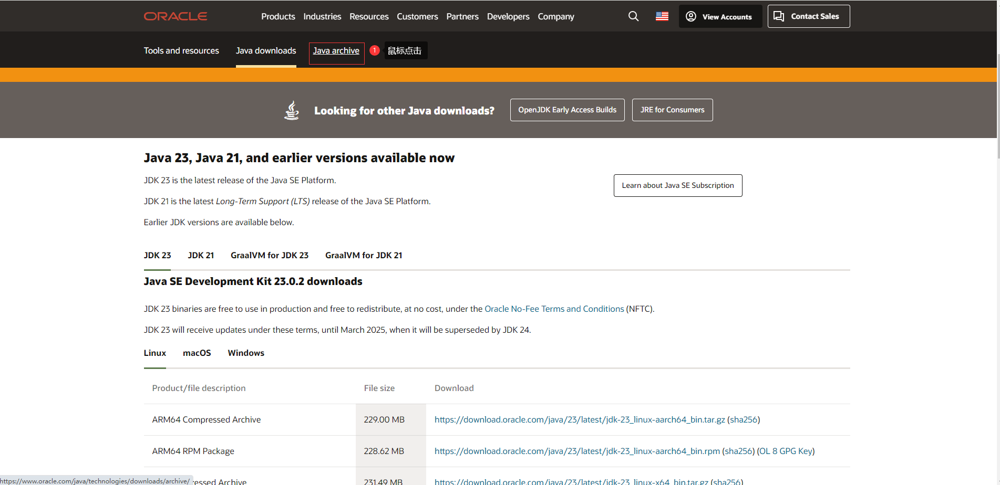

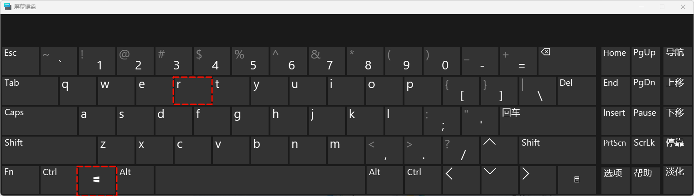

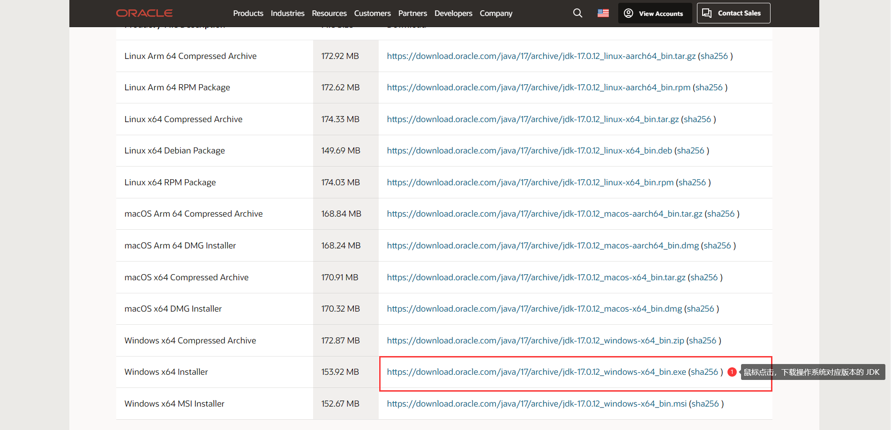

* ② 下一步安装即可：


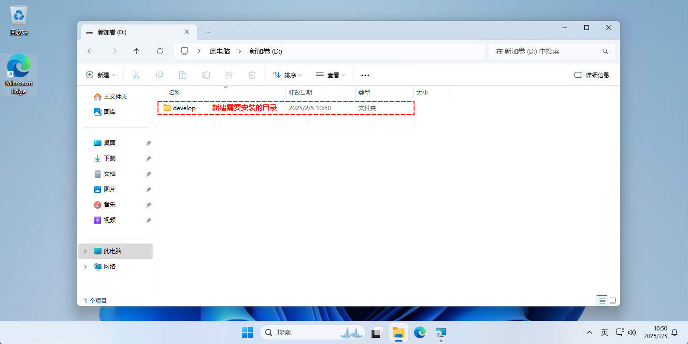


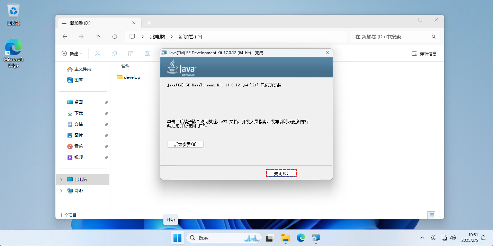

* ③ 测试是否安装或配置成功：

```cmd
javac -version
```


* ④ 去除默认配置的环境变量：

> [!CAUTION]
>
> * ① JDK 17 在默认安装的时候，会将 JDK 的部分开发工具配置到环境变量中；但是，这却并非我们所希望的。
> * ② 我们希望将 JDK 的所有开发工具都配置到环境变量中；此时，就需要在环境变量中将 JDK 默认的配置删除。

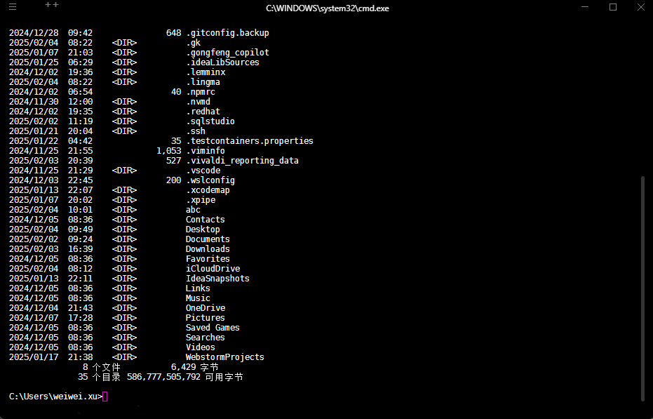

* ⑤ 配置 `JAVA_HOME` 环境变量，对应的值是 `D:\develop\Java\jdk-17`：


* ⑥ 配置 `Path` 环境变量，对应的值是`%JAVA_HOME%\bin`：

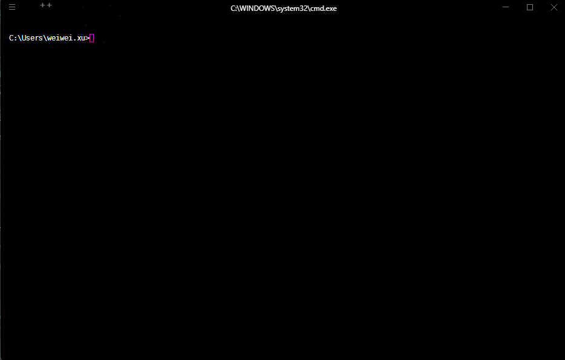

* ⑦ 测试是否安装或配置成功：

```cmd
javac -version
```

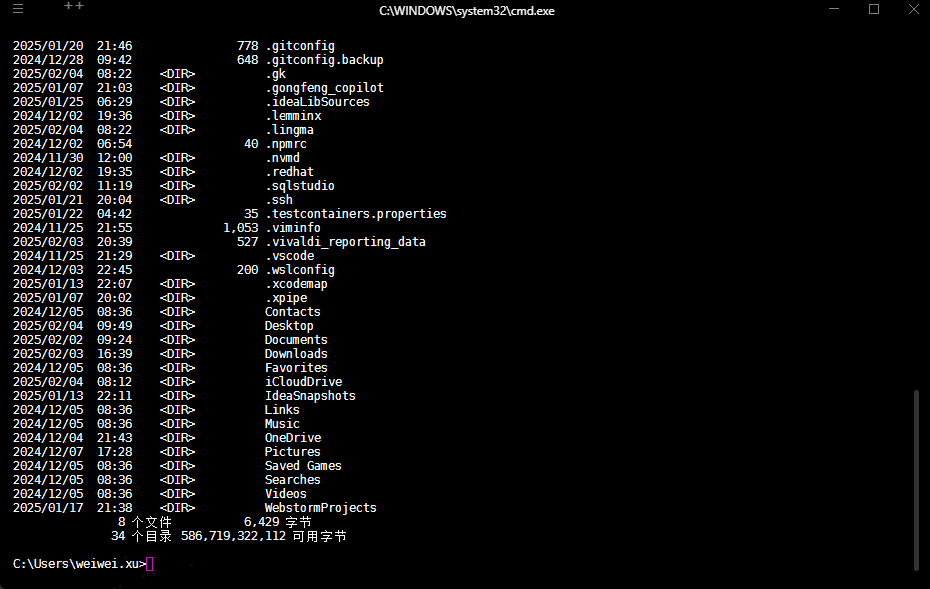

### 1.3.2 自动版

* ① 创建安装的目录：

```cmd
mkdir d:\develop\java\jdk-17
```


* ② 查询 JDK 的版本：

```cmd
winget search jdk
```


* ③ 安装到指定的目录：

```cmd
winget install --id Oracle.JDK.17 -l d:\develop\java\jdk-17
```


* ④ 查看本地是否安装成功：

```cmd
winget list jdk
```


* ⑤ 去除默认配置的环境变量：

> [!CAUTION]
>
> * ① JDK 17 在默认安装的时候，会将 JDK 的部分开发工具配置到环境变量中；但是，这却并非我们所希望的。
> * ② 我们希望将 JDK 的所有开发工具都配置到环境变量中；此时，就需要在环境变量中将 JDK 默认的配置删除。


* ⑤ 配置环境变量：

::: code-group

```cmd [cmd 设置用户环境变量]
:: 设置 JAVA_HOME 环境变量为用户级别
setx JAVA_HOME "D:\develop\java\jdk-17"
:: 更新 PATH 环境变量，添加 JDK 的 bin 目录到 PATH 中（用户级别）
setx Path ^%JAVA_HOME^%"\bin;%Path%"
```

```cmd [cmd 设置系统环境变量]
:: 设置 JAVA_HOME 环境变量为系统级别
setx JAVA_HOME "D:\develop\java\jdk-17" /M
:: 更新 PATH 环境变量，添加 JDK 的 bin 目录到 PATH 中（系统级别）
setx Path ^%JAVA_HOME^%"\bin;%Path%" /M
```

```powershell [powershell 设置用户环境变量]
[System.Environment]::SetEnvironmentVariable('JAVA_HOME', 'D:\develop\java\jdk-17', [System.EnvironmentVariableTarget]::User)
$env:Path += ";%JAVA_HOME%\bin"
[System.Environment]::SetEnvironmentVariable('Path', $env:Path, [System.EnvironmentVariableTarget]::User)
```

```powershell [powershell 设置系统环境变量]
[System.Environment]::SetEnvironmentVariable('JAVA_HOME', 'D:\develop\java\jdk-17', [System.EnvironmentVariableTarget]::Machine)
$env:Path += ";%JAVA_HOME%\bin"
[System.Environment]::SetEnvironmentVariable('Path', $env:Path, [System.EnvironmentVariableTarget]::Machine)
```

:::

> [!CAUTION]
>
> * ① 使用上述命令设置环境变量时，虽然会立即生效，但是仅对新的 cmd 或 powershell 生效，当前打开的 cmd 窗口或 powershell 窗口是不会立即看到更新的环境变量的。
> * ② 请另开一个新的 cmd 窗口或 powershell 窗口去验证是否生效。


* ⑥ 测试是否安装或配置成功：

```cmd
javac -version
```


## 1.4 JDK17 的目录结构说明

* JDK 17 的目录结构基本上与之前的 JDK 版本类似，但随着模块化（JDK 9 引入）和一些组件的精简，目录内容可能有所调整。
* 以下是 JDK 17 目录的常见结构及其作用：

```txt
├─📁 bin------------------------- # 二进制可执行文件目录
│ ├─📄 jar.exe------------------- # Java 归档工具
│ ├─📄 java.exe------------------ # 运行 Java 应用程序
│ ├─📄 javac.exe----------------- # Java 编译器
│ ├─📄 javadoc.exe--------------- # 生成文档
│ └─📄 jdb.exe------------------- # 调试工具
├─📁 conf------------------------ # JDK 相关的配置文件的目录
│ ├─📁 management
│ ├─📁 security
│ ├─📄 logging.properties-------- # 网络配置
│ ├─📄 net.properties
│ └─📄 sound.properties
├─📁 include--------------------- # JNI 相关的头文件的目录
│ ├─📁 win32
│ ├─📄 classfile_constants.h
│ ├─📄 jawt.h
│ ├─📄 jdwpTransport.h
│ ├─📄 jni.h
│ ├─📄 jvmti.h
│ └─📄 jvmticmlr.h
├─📁 jmods----------------------- # JDK 本身的模块，用于自定义 JDK 运行环境
│ ├─📄 java.base.jmod 
│ ├─📄 java.compiler.jmod
│ ├─📄 java.datatransfer.jmod
│ ├─📄 java.desktop.jmod
│ ├─📄 java.instrument.jmod
│ └─📄 java.logging.jmod
├─📁 legal----------------------- # 所有 JDK 组件的许可证文件
├─📁 lib------------------------- # 核心库，关键 JDK 运行库（不直接包含 rt.jar）
│ ├─📁 jfr
│ │ ├─📄 default.jfc
│ │ └─📄 profile.jfc
│ ├─📁 security------------------ # 安全相关
│ ├─📄 classlist----------------- # 预加载类列表
│ ├─📄 ct.sym
│ ├─📄 jvm.lib
│ ├─📄 modules------------------- # JVM 运行时的模块化 class 存储
│ └─📄 psfont.properties.ja
├─📄 LICENSE--------------------- # 开源许可证
├─📄 README---------------------- # 说明文档
└─📄 release--------------------- # 纯文本文件，包含 JDK 版本信息
```


# 第二章：Java 入门程序（⭐）

## 2.1 开发 Java 程序的步骤

* 开发 Java  程序的步骤，如下所示：


* 其具体的步骤，如下所示：
  * ① 编写源代码：将 Java 代码编写到扩展名为 `.java` 的文件中。
  * ② 编译：通过 `javac` 命令对该 Java 源文件（`*.java`）进行编译，生成字节码文件（`*.class`）。
  * ③ 运行：通过 `java` 命令运行生成的字节码文件（`*.class`）。

## 2.2 安装 Notepad++

### 2.2.1 手动版

* ① 去 [Notepad++](https://notepad-plus-plus.org/) 官网下载安装包：

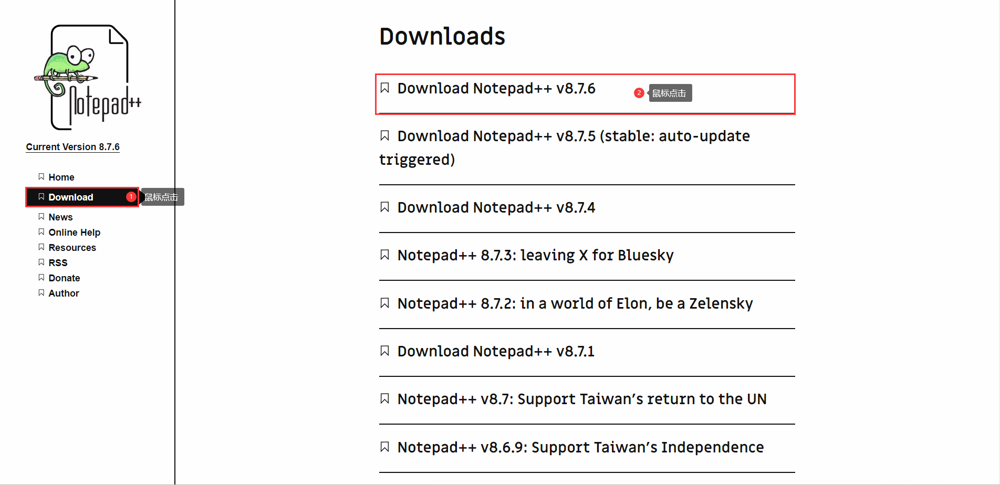


* ② 下一步安装：

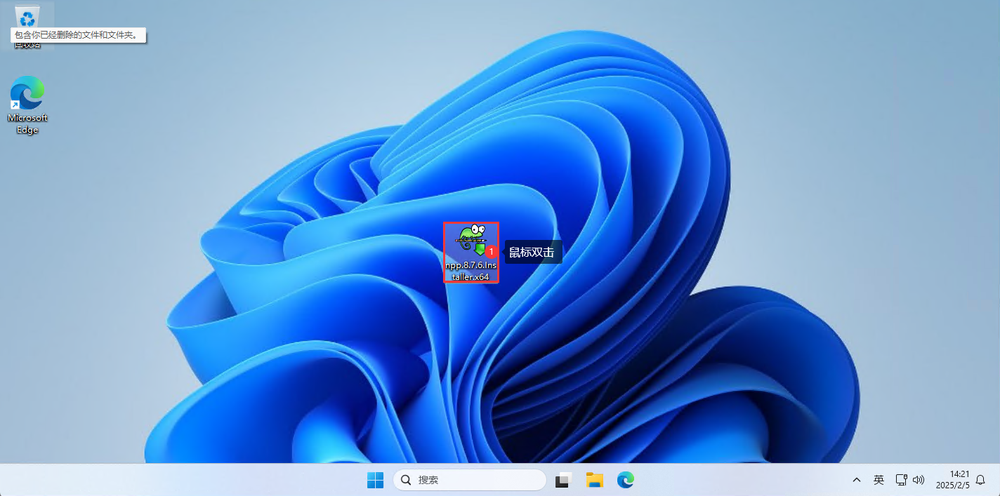

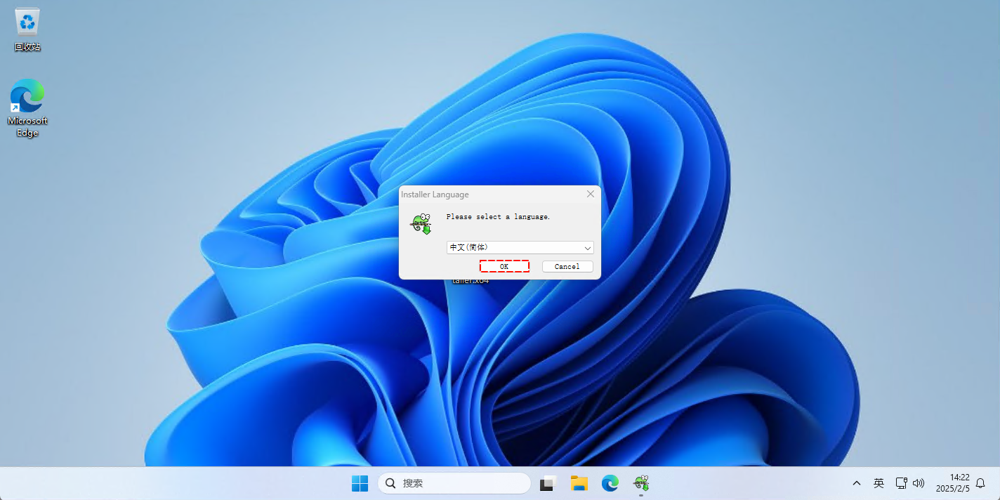


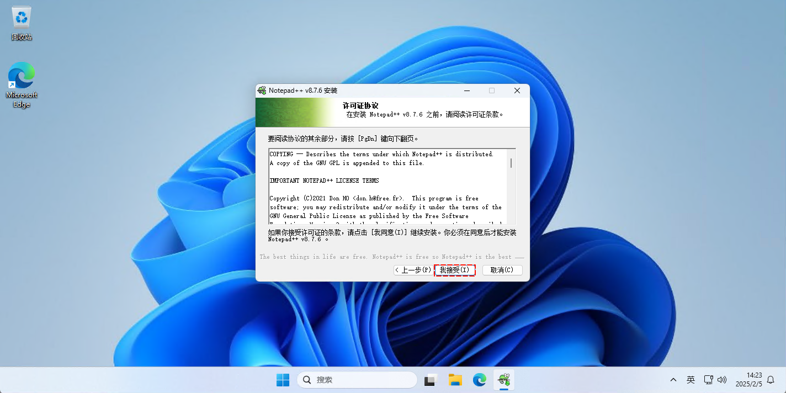


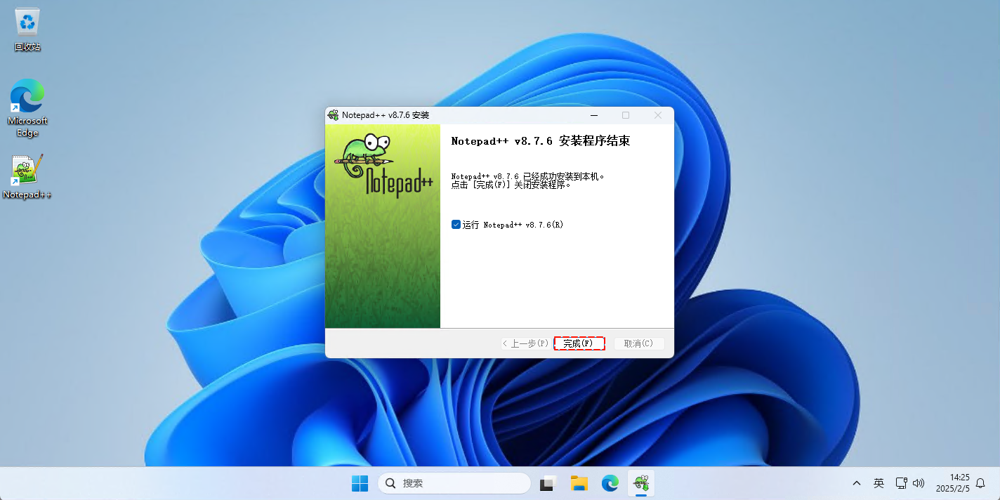

### 2.2.2 自动版

* ① 查询 Notepad++ ：

```cmd
winget search notepadplus
```

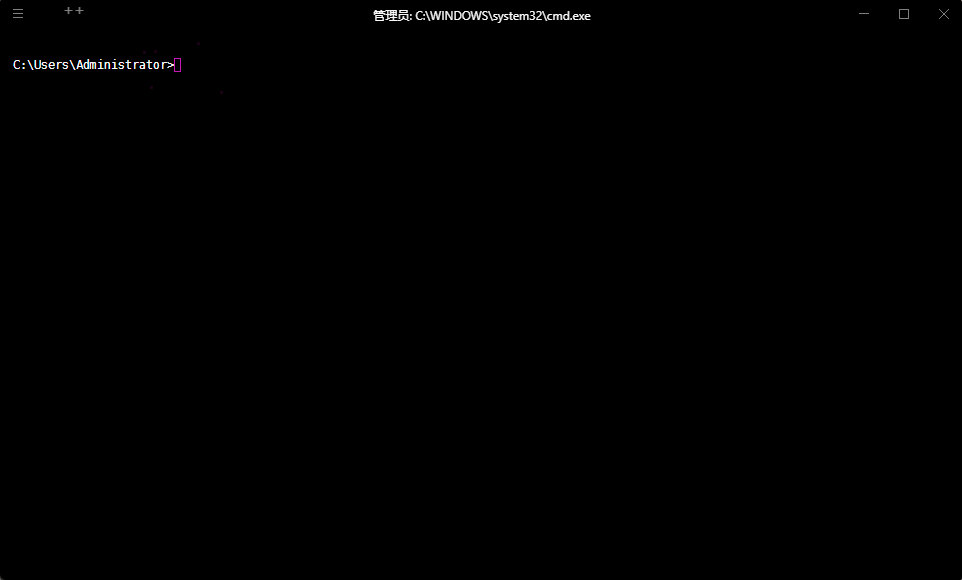

* ② 安装 Notepad++ ：

```cmd
winget install --id Notepad++.Notepad++
```

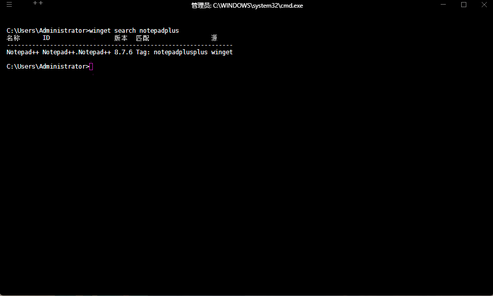

* ③ 查询本地是否安装成功：

```cmd
winget list notepadplus
```


## 2.3 HelloWorld（入门程序）

* ① 使用 `Notepad++` 新建 `HelloWorld.java`文件，并在该文件中编写入门程序：

```java
public class HelloWorld {
	public static void main(String[] args){
		System.out.println("Hello World!!!");
	}
}
```


* ② 使用 `javac` 命令编译 Java 源程序：

```cmd
javac HelloWorld.java
```


* ③ 使用 java 命令执行字节码文件：

```cmd
java HelloWorld
```

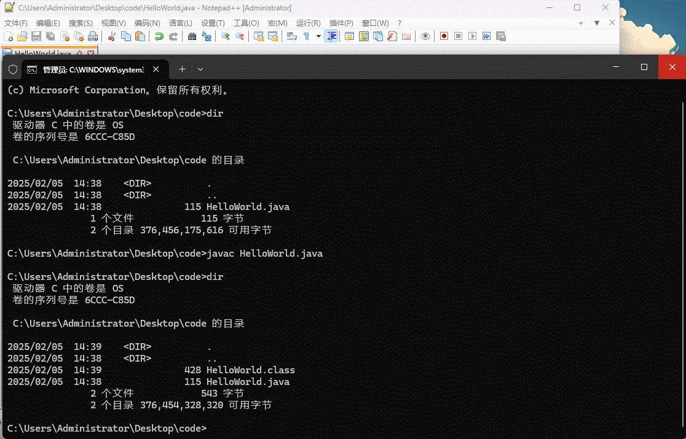

## 2.4 Java 中的注释

### 2.4.1 概述

* 在 Java 中，注释用于向代码添加说明或解释，它们不会被程序编译执行。
* Java 提供了三种类型的注释：单行注释、多行注释和文档注释。

### 2.4.2 单行注释

* 语法：

```java
// 单行注释
```

* 功能：单行注释用于注释掉一行代码，`//` 后面的所有内容都视为注释。


* 示例：

```java {3-4}
public class HelloWorld {
	public static void main(String[] args){
		// 这是一个单行注释
		int a = 5; // 这是行尾注释
	}
}
```

### 2.4.3 多行注释

* 语法：

```java
/*
	多行注释
	多行注释
	...
*/
```

* 功能：多行注释用于注释掉多行代码。它的语法是使用 `/*` 开始，`*/` 结束，注释内容位于这两个符号之间。


* 示例：

```java {3-6}
public class HelloWorld {
	public static void main(String[] args){
		/*
		  这是一个多行注释
		  可以注释多行内容
		*/
		int a = 5;
	}
}
```

### 2.4.5 文档注释

* 语法：

```java
/**
 * ...
 * @param a ...
 * @param b ...
 * @return ...
 */
```

* 功能：文档注释用于生成 API 文档，通常用于类、方法或字段的注释。它的语法是使用 `/**` 开始，`*/` 结束，通常用于为方法或类提供详细描述。

> [!NOTE]
>
> * ① 文档注释通常与 `Javadoc` 工具一起使用。
> * ② `Javadoc` 会自动解析这些文档注释并生成 HTML 格式的 API 文档。


* 示例：

```java {3-8}
public class HelloWorld {
	
	/**
	 * 这是一个方法，用于计算两个数的和。
	 * @param a 第一个数
	 * @param b 第二个数
	 * @return 返回 a 和 b 的和
	 */
	public static int sum(int a, int b) {
		return a + b;
	}
	
	public static void main(String[] args){
		int result = sum(1,2);
		System.out.println(result);
	}
}
```

## 2.5 HelloWorld（入门程序）解析

* 我们可以使用文档注释来对 HelloWorld （入门程序）进行解析。

> [!CAUTION]
>
> * ① 如果类是使用 public 修饰的，类名需要和 Java 源文件的名称保持一致。
> * ② 程序中的标点符号必须是英文的。
> * ③ 不要将 `main` 写成 `mian` ！！！
> * ④ `System` 和 `String` 的首字母 `S` 都需要大写，因为其是类，通常类名遵循大驼峰规则。
> * ⑤ 大括号都是成对出现的，缺一不可
> * ⑥ Java 方法由一条条语句构成，每个语句以 `;` 结束。
> * ⑦ Java 语言严格区分大小写。
> * ⑧ 一个源文件中最多有一个 `public` 类，其它类的个数不限，如果源文件包含一个 `public` 类，则文件名必须按该类名命名。


* 示例：

```java
/**
* public class HelloWorld 是定义一个类
* class：代表的就是类，类是 java 程序最基本的组成单元，所有代码都需要在类中写
* class 后面跟的名字叫做类名，类名要和 java 文件名保持一致
*/
public class HelloWorld {
	/**
	* public static void main(String[] args) 程序的入口
	* JVM 执行的时候，会从 main 方法开始执行
	*/
	public static void main(String[] args){
		/* 输出语句，用于向控制台（终端）输出信息 */
		System.out.println("Hello World!!!");
	}
}
```

## 2.6 源文件名（java 文件名）和类名的一致性问题

* ① 类名并非一定要和 java 文件名一致。但是，如果类名使用 pubilc 修饰，类名必须和 java 文件名保持一致。

```java [HelloWorld2.java]
/**
* public class HelloWorld 是定义一个类
* class：代表的就是类，类是 java 程序最基本的组成单元，所有代码都需要在类中写
* class 后面跟的名字叫做类名，类名要和 java 文件名保持一致
*/
class HelloWorld {
	/**
	* public static void main(String[] args) 程序的入口
	* JVM 执行的时候，会从 main 方法开始执行
	*/
	public static void main(String[] args){
		/* 输出语句，用于向控制台（终端）输出信息 */
		System.out.println("Hello World!!!");
	}
}
```

* ② 一个源文件中是否可以有多个类；但是，一个源文件中有且只能有一个 pubilc 修饰的类。
* ③ main 方法必须写在带 public 的类中。

## 2.7 println 方法和 print 方法的异同点

### 2.7.1 概述

* 在 Java 中，`println()` 和 `print()` 都是 `System.out` 对象的方法，常用于输出信息到控制台。

### 2.7.2 相同点

* ① 输出内容：两者都可以输出任何类型的数据（字符串、数字、对象等）。它们会将指定的内容打印到控制台。
* ② 都是 `System.out` 的方法：这两个方法都属于 `System.out`，`System.out` 是一个 `PrintStream` 对象，提供了多种输出方法。

### 2.7.3 不同点

* ① 换行行为：

| 方法        | 特点                     | 说明                                                         |
| ----------- | ------------------------ | ------------------------------------------------------------ |
| `println()` | 会在输出内容后自动换行。 | 输出完成后光标会移动到下一行的开始位置。                     |
| `print()`   | 不会自动换行。           | 输出内容后光标仍然停留在当前行的末尾，下一次输出会继续在当前行显示。 |

* ② 应用场景：

| 方法        | 应用场景                                                     |
| ----------- | ------------------------------------------------------------ |
| `println()` | 适用于希望输出后换行的场景，如：打印日志、显示结果时，每条信息之间需要分开显示。 |
| `print()`   | 适用于输出时不希望换行的场景，如：在一行内打印多个信息或进度条等。 |

> [!NOTE]
>
> * ① 在实际开发中，其实 `println()` 并不会应用于打印日志，因为我们会使用日志框架，如：Log4j 等，并不会在系统中，直接使用 `println()` 。
> * ② 并且，我们也会搭建日志平台，会通过日志框架将业务过程中产生的日志，定期同步到日志平台中，以便日后分析！！！


* 示例：

```java [HelloWorld.java]
public class HelloWorld {
	public static void main(String[] args){
		System.out.print("Hello, ");
		System.out.print("World! ");
		System.out.println("This is on a new line.");
		System.out.println("This is the second line.");
	}
}
```

```txt [输出结果]
Hello, World! This is on a new line.
This is the second line.
```


