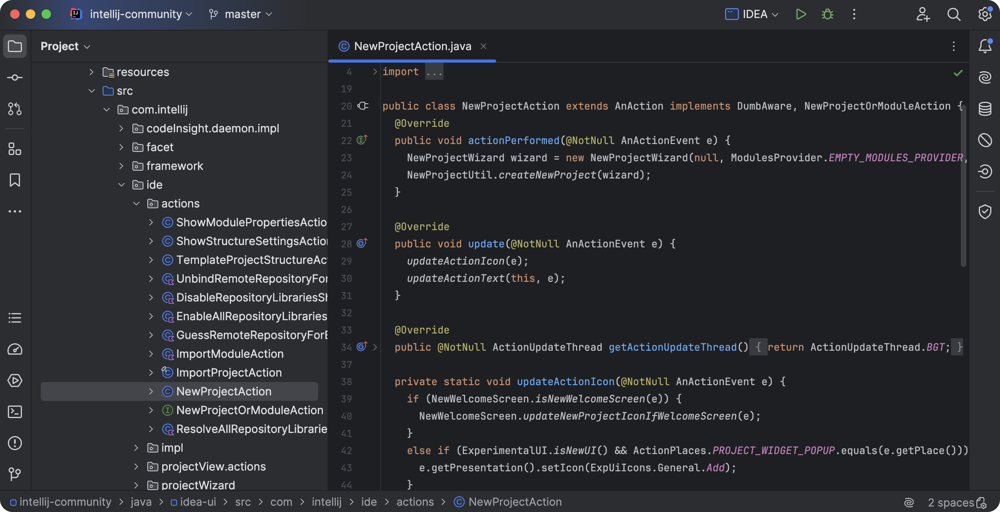

# 第一章：IDEA 介绍

## 1.1 概述

* `IntelliJ IDEA` 是由 JetBrains 开发的一个强大的集成开发环境（IDE），主要用于 Java 开发，但也支持多种编程语言，如： Kotlin、Scala、Python、JavaScript 等。

> [!NOTE]
>
> 官方是对 `IntelliJ IDEA` 的评价是：“The IDE for Professional Development in Java and Kotlin”，即：适用于 Java 和 Kotlin 专业开发的 IDE 。

* `IntelliJ IDEA` 被许多开发者认为是最智能的 Java IDE，拥有丰富的功能和极佳的用户体验。

## 1.2 为什么选择 IntelliJ IDEA？

* ① `智能的代码补全`：`IntelliJ IDEA` 提供强大的代码补全功能，可以自动完成代码、类名、方法名、变量名等。它会根据上下文提示相关的代码，使编程更加高效。
* ② `高效的代码重构工具`：`IntelliJ IDEA` 提供一整套强大的代码重构工具，如：自动重命名、提取方法、引入变量等，能够帮助开发者更好地组织和优化代码。
* ③ `智能的错误检查与提示`：`IntelliJ IDEA` 会在你编写代码的过程中实时分析代码并提供错误提示，甚至能够检测潜在的代码问题，如：空指针引用等。
* ④ `多语言支持`： 除了 Java，`IntelliJ IDEA` 还支持 Kotlin、Scala、Groovy、Python、JavaScript、TypeScript、SQL 等多种语言，适合全栈开发者使用。
* ⑤ `集成的调试工具`： 内置的调试器可以帮助开发者逐步跟踪程序的执行，查看变量值，分析调用栈，进行高效的错误排查。
* ⑥ `版本控制支持`： `IntelliJ IDEA` 原生支持 Git、SVN、Mercurial 等版本控制工具，可以直接在 IDE 内进行代码的提交、合并、拉取等操作。
* ⑦ `优秀的插件生态系统`： JetBrains 提供了丰富的插件市场，你可以根据需要安装插件来扩展 IDE 的功能，如：数据库管理、Docker 集成、Spring Boot 支持等。
* ⑧ `易用的界面和丰富的配置选项`： 界面设计简洁而直观，功能也可高度自定义。无论是配色主题、键盘快捷键，还是 IDE 的各项设置，都可以根据个人习惯进行调整。
* ⑨ `对大型项目的支持`： `IntelliJ IDEA` 在处理大型项目时表现优异，特别是对 Java 项目，能够很好的处理数千个类文件和依赖关系。
* ⑩ `社区版与付费版`： `IntelliJ IDEA` 提供了一个免费的社区版（适用于基本的开发需求），以及功能更全的付费版（适合企业和更复杂的开发需求）。付费版包括对框架（Spring、Java EE）的支持，数据库工具，更多的调试工具等。

# 第二章：安装 IDEA

## 2.1 前提条件

* ① 在本地操作系统中安装了 JDK ：略。
* ② 配置 `JAVA_HOME` 环境变量和 `PATH` 环境变量：略。

## 2.1 手动版

* ① 鼠标双击，进行安装：

