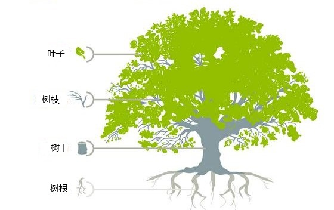

# 第一章：软件设计架构

## 1.1 概述

* `C/S 架构`（Client/Server，客户端/服务器）和 `B/S 架构`（Browser/Server，浏览器/服务器）都属于`软件架构`中比较基础和普遍的模式。
* `C/S 架构`（Client/Server，客户端/服务器）和 `B/S 架构`（Browser/Server，浏览器/服务器）将客户端和服务器分离，通过网络进行数据传输和交互。

## 1.2 B/S 架构

### 1.2.1 概述

* B/S 架构，即：浏览器和服务器架构，客户端通过浏览器访问服务器，无需安装额外软件。

> [!NOTE]
>
> B/S 架构和 C/S 架构并不是完全独立的，不严谨的说：B/S 架构可以看成客户端是"通用浏览器"的 C/S 架构，C/S 架构则是拥有专属"浏览器"的 B/S 架构。

* 在 B/S 架构中，客户端是一个 Web 浏览器（Chrome、Edge），而服务器则是一个 Web 服务器。用户通过浏览器来访问服务器上托管的 Web 页面，并通过 HTTP/HTTPS 通信协议进行交互，如下所示：


* B/S 架构广泛应用于 Web 应用程序，如：电子商务平台、社交媒体网站、企业门户等。

### 1.2.2 优点

* ① 用户仅需要一个可用的、兼容的浏览器即可使用该应用程序。
* ② 用户只要熟练使用浏览器即可，无需额外的学习成本。
* ③ 开发者无需提供全新的客户端，可以更快速的开发和维护应用程序。
* ④ 依赖于浏览器的跨平台性，B/S 架构的应用也就具有了跨平台性。

### 1.2.3 缺点

* ① 受限于浏览器的功能，某些高级和复杂的功能可能难以实现。
* ② 同样受限于浏览器，相比较于 C/S 架构，B/S 架构的应用性能往往更低。

## 1.3 C/S 架构

### 1.3.1 概述

* C/S 架构是指客户端和服务器通过网络相连，客户端软件负责用户交互和部分业务逻辑，服务器负责核心业务逻辑和数据存储。

> [!NOTE]
>
> B/S 架构和 C/S 架构并不是完全独立的，不严谨的说：B/S 架构可以看成客户端是"通用浏览器"的 C/S 架构，C/S 架构则是拥有专属"浏览器"的 B/S 架构。

* 在 C/S 架构中，客户端和服务器是两个独立的组件，它们通过网络进行通信。客户端通常是用户直接操作的应用程序，而服务器则用于处理客户端的请求和提供相应的服务，如下所示：


* C/S 架构广泛应用于需要专属客户端的应用程序，如：桌面应用程序（QQ、WPS 等）、网络游戏、手机 App 等。

### 1.3.2 优点

* ① 高度可定制化的、专属的客户端，功能可以十分强大。
* ② 性能强大，效率更高。

### 1.3.3 缺点

* ① 客户端需要用户单独下载，如果有更新还需要及时下载安装更新。
* ② 专属客户端意味着专属操作，意味着额外的学习成本。
* ③ 专属的客户端意味着跨平台性比较差，可能需要针对不同平台做出不同优化（对于开发者而言，开发的成本高，不便于维护）。

## 1.4 为什么 C/S 架构的应用程序往往功能更强大，性能更强？

* ① `客户端的计算能力`：C/S 架构中的客户端是一个拥有独立计算能力的独立应用程序。而 B/S 架构中的浏览器，相对于专门的客户端应用程序，其计算能力和功能更受限。
* ② `网络传输的影响`：B/S 架构的数据传输通常基于 HTTP/HTTPS 协议，而 C/S 架构可以使用专门优化的协议进行通信，网络延迟更低，数据传输效率更高。
* ③ `资源加载的影响`：一个应用程序程序在运行过程中，总是需要加载一些静态资源的（图片、视频、脚本等）。B/S 架构下，浏览器虽然存在缓存，但依然需要大量从服务器端加载资源，这就带来了性能损耗。而 C/S 架构中的客户端在安装的过程中，就已经将需要的静态资源存在本地了，大多数资源无需从服务端加载。
* ④ `一些其他的优化`：B/S 架构受限于通用浏览器的兼容性，难以做个性化优化。而 C/S 架构中的客户端则可以更好的使用底层 API、硬件等进行优化加速。


# 第二章：软件行业中的各种职业方向

## 2.1 概述

* 在计算机软件的发展过程中，涌现出了各种各样的职业，如：前端工程师、后端工程师、架构师、算法工程师、大数据工程师、运维工程师、嵌入式工程师、底层开发（操作系统、数据库、浏览器、游戏引擎）等。
* 我们知道，在自然界中，树是由`叶子`、`树枝`、`树干`和`树根`组成的，如下所示：



> [!NOTE]
>
> * ① `前端工程师`相当于树的`叶子`部分。
> * ② `后端工程师`相当于树的`树枝`部分。
> * ③ `架构师`相当于树的`树干`部分。
> * ④ `底层开发`相当于树的`树根`部分。

## 2.2 前端工程师

### 2.2.1 B/S 架构中的前端工程师

* 在 B/S 架构应用中，前端主要关注于浏览器端（B 端）显示的页面和可交互的界面，也可以称为 `“WEB 前端”`。
* 常见的 WEB 前端应用有：电商网站、社交媒体网站、企业门户，如下所示：


* WEB 前端涉及到的技术有：`HTML`、`CSS` 和 `JavaScript`（很重要）。

> [!NOTE]
>
> ::: details 点我查看 WEB 前端发展的历史
>
> * ① HTML 是用来做网页的`内容结构`，CSS 是用来做网页的`视觉体验`，而 JavaScript 是用来做网页的`交互处理`。
> * ② 在互联网的早期，网页应用往往前后端不分离，典型的编程语言有 PHP 和 Java（JSP），它们都采取将前端 HTML/JavaScrpit 等代码直接集成到后端代码中的方式来进行开发。这样做的好处是开发效率高，但缺点是可维护性差，适合用于快速开发简单的应用。
> * ③ 随着应用的需求越来越复杂，尤其是移动互联网的崛起，推动了应用的前后端分离，可跨平台的 JavaScript 框架崛起，常用框架和库：React.js、Angular.js、Vue.js 等。
> * ④ ...
>
> :::

* 应用程序越上层，越接近用户，则变动和灵活性越大。

> [!NOTE]
>
> * ① 一方面，直接呈现给用户的部分，会随着审美的变化经常变动。
>* ② 另一方面，应用的更新总是最先体现在前端应用中；换言之，前端知识更新频繁！！！

> [!CAUTION]
>
> 前端开发入门简单，门槛较低，且深度和复杂性确实不及后端开发，相关就业岗位有萎缩的趋势！！！

### 2.2.2 C/S 架构中的前端工程师

* 在 C/S 架构应用中，前端主要关注于客户端应用本身，也可以称为`“客户端开发”`。

> [!NOTE]
>
> ::: details 点我查看 客户端开发的分类
>
> * ① 桌面客户端开发：
>   * QT（C++ 跨平台框架）。
>   * Swift（用于开发 Apple 各种应用的编程语言）。
> * ② 移动客户端开发：
>   * 安卓端：Java（传统的安卓开发语言）、Kotlin（现代的、Google 推荐的 Android 开发语言）。
>   * iOS 端：Swift。
>   * 可跨平台的：React Native、Uniapp 等。
>
> :::

## 2.3 后端工程师

### 2.3.1 概述

* 对于 B/S 架构应用或 C/S 架构应用，后端主要关注于`业务逻辑`和`软件架构`。

### 2.3.2 业务逻辑

* 其中，`业务逻辑`是指系统为了满足特定业务需求所需的操作、流程和规则。这是应用中处理实际业务流程的核心内容，如：对数据的增删改查、计算、数据验证和流程控制等。

> [!NOTE]
>
> `业务逻辑`的主要内容有：
>
> * ① **数据处理**：包括数据的验证、计算、转换以及持久化（存储到数据库）。
> * ② **规则校验**：用户输入的格式和范围校验、权限验证等。
> * ③ **工作流和决策逻辑**：根据特定条件决定流程的下一步操作。
> * ④ **接口调用和集成**：与外部系统或服务进行交互，以获取或提交数据。

> [!NOTE]
>
> ::: details 点我查看 B/S 架构和 C/S 架构中`业务逻辑`的区别
>
> * ① **B/S 架构**：业务逻辑通常完全放在服务器端，浏览器通过 HTTP 请求向服务器发送数据和指令，后端完成所有处理并返回结果。这种模式更易于集中管理和更新，但对服务器的负载压力较大。
> * ② **C/S 架构**：业务逻辑可以部分在客户端实现，部分在服务器实现。客户端可能会负责一些简单的数据处理和校验逻辑，而复杂的处理仍由服务器端完成。这样做可以减轻服务器的压力，但会增加客户端的复杂性。
>
> :::

### 2.3.3 软件架构

* 其中，`软件架构`是指系统的整体设计，描述了系统各个模块如何协同工作。良好的架构可以提高系统的扩展性、可维护性和稳定性。

> [!NOTE]
>
> 常见的`架构模式`：
>
> * ① **MVC（Model-View-Controller）**：将系统分为模型、视图和控制器三部分，常见于 B/S 架构。
> * ② **三层架构（Presentation-Business-Data）**：将系统分为表示层、业务逻辑层和数据层，使得不同层次的功能更清晰，便于管理和扩展。
> * ③ **微服务架构**：将系统划分为多个小型服务，每个服务负责不同的业务功能，适合复杂的大型系统。

> [!NOTE]
>
> :::details 点我查看 B/S 架构和 C/S 架构中`架构模式`的区别
>
> * ① **B/S 架构**：由于前端较轻，主要依赖后端处理和响应，因此常采用 MVC 架构，微服务架构也越来越普遍，用于分离不同的业务功能，提高灵活性和扩展性。
> * ② **C/S 架构**：客户端通常较为“厚”，因此前后端界限较清晰，业务逻辑和 UI 呈现在客户端，服务器主要提供数据和必要的业务支持。C/S 系统常用三层架构和 SOA（面向服务的架构）来提供较高的系统灵活性。
>
> :::

### 2.3.4 综合应用

* 在 B/S 和 C/S 架构中，业务逻辑和软件架构相辅相成。

> [!NOTE]
>
> 设计合理的业务逻辑流程和健壮的架构可以使系统更好地应对不同的业务场景和需求变化：
>
> * **可维护性**：业务逻辑清晰、架构合理，可以降低维护难度，如：在 B/S 架构中，通过服务端更新业务逻辑，所有客户端立即生效。
> * **性能优化**：通过架构优化（负载均衡、缓存策略等），能提升系统在高并发场景下的响应速度。
> * **扩展性**：通过微服务或分布式架构设计，系统可以根据业务发展灵活扩展新的服务或功能模块。

* 在实际应用中，B/S 架构和 C/S 架构的后端设计虽然在部署方式和交互流程上有所差异，但都依赖于合理的业务逻辑和软件架构来满足用户需求和系统要求。

> [!NOTE]
>
> * ① 通常而言，`后端工程师`主要关注于`业务逻辑`，而`架构师`主要关注于`软件架构`。
> * ② 但是，有些`后端工程师`也会关注`软件架构`。

### 2.3.5 后端工程师的其他工作

* 对数据库中的数据进行增删改查操作，处理前端请求，完成与前端的交互，这是后端最常处理的业务逻辑，也是后端程序员最主要的任务之一。
* 但是，后端工程师还负责与其他服务或组件交互（第三方 API 、缓存、消息队列、短信服务等）、身份验证和授权、数据加工计算、安全控制、监控日志、提供 API 、数据备份与恢复等一系列的工作。

> [!NOTE]
>
> 上述的这些东西都是可以沉淀的，并且变化不是很大！！！
>
> * ① 前端由于硬件限制、用户界面的限制、浏览器的限制等等问题通用性是比较差的。
> * ② 后端应用则一般具有很高的通用性：不同的前端应用，无论是手机还是电脑，无论是网页还是桌面应用，都可以共用同一套后端逻辑。这是因为后端主要关注的是业务逻辑和数据处理，而不是用户界面和交互方式。

* 诸如：手机登录 QQ 、微信和电脑登录 QQ、微信，虽然界面、功能、操作逻辑等前端部分大不相同，但仍然都是同一个账号，数据是一样的。
* 诸如：多端互通的游戏，虽然各平台的前端展示可能不同，但所有的游戏数据和逻辑处理都是统一的。

> [!NOTE]
>
> * ① 这种架构的通用性使得后端可以灵活地应对不同平台和设备，从而大大提高了开发效率和系统的可维护性。
> * ② 后端的语言、架构等通常变化比较少，后端程序员也往往有更多的方向、内容去进行提高和沉淀。后端的潜力，往往是比前端大的。
> * ③ 当然后端的技术栈也会更复杂，涉及复杂的后端架构(分布式、微服务架构)，各色中间件，多种解决方案等等。

### 2.3.6 后端领域中目前主流的语言

* ① Java：应用广泛，成熟稳定，是最常用的后端开发语言。尤其是在涉及电商的领域中，高并发场景多、业务变动快、稳定性要求高，延迟性要求低的场合中，Java 是绝对的王者。
* ② Python：以其简洁的语法和数据处理及分析上的能力而受欢迎（人工智能的首选语言）。
* ③ C#：微软的亲儿子，与 Windows 平台有很好的集成和交互（目前，也支持跨平台）。
* ④ Node.js：前后端同时使用 JavaScript 一种语言进行全栈开发。
* ⑤ Golang：一般简称 Go 语言。特别适用于高并发、大流量的场景，作为后起之秀是 Java 的有力竞争者。

## 2.4 底层开发/系统开发

* 底层应用/系统开发主要指的是进行一些系统层面，接近硬件层面的应用开发，如：
  * 数据库。
  * 操作系统。
  * 浏览器。
  * 游戏引擎。
  * 编译器。
  * 硬件驱动
  * ...

> [!NOTE]
>
> 在这些领域，C/C++ 是王者。

* 要想从事这些开发岗位，门槛是非常高的，学习难度很大，需要熟知操作系统原理，以及一些其它软硬件知识。

## 2.5 算法工程师

* 算法岗位在当今的技术领域中是非常重要且需求广泛的，几乎各行各业都需要专业的算法工程师来专注于开发和实现高效的算法来解决复杂的问题。
* 算法工程师在以下领域发挥着核心作用：
  * 大数据
  * 人工智能(人脸识别)
  * 机器学习
  * 云计算
  * ...

* 由于算法岗位的专业性和重要性，算法工程师的薪资普遍很高，而且前景广阔（太卷）。

> [!NOTE]
>
> * ① 算法岗位不以编程语言为核心，而以数学原理为核心，但一般也会要求至少掌握一门编程语言，如：Python(几乎必须掌握)、Java、C++(可以选择)。
> * ② 算法岗位的门槛比较高，需要扎实的数学功底，还需要进行算法体系和代码能力的积累，建议具有良好的相关学历背景的同学从事算法岗位，不推荐野路子半路出家走算法路线。
> * ③ C++ 在算法领域最常见的用途就是图像算法，如：人脸识别，著名的 OpenCV 就是用 C++ 编写的开源视觉库。

## 2.6 嵌入式工程师

* 嵌入式领域是一个专注于开发专用电子系统（嵌入式系统）的技术领域。
* 目前比较热门的嵌入式领域有：
  * ① 物联网（iot）：
    * 典型的智能家居（小米、华为等）。
    * 远程医疗器械、手环、智能穿戴设备。
    * 自动化养殖业、农业。
    * 智慧城市，交管系统、环境监测等。
    * ....
  * ② 汽车领域，车机系统，汽车上的各种电子系统，辅助驾驶，电子刹车系统等等。
  * ③ 工业自动化、机械自动化等等。
  * ④ ...

> [!NOTE]
>
> * ① 嵌入式开发的主导语言就是 C 语言。
> * ② 在进行嵌入式开发的过程中，仅仅会 C 语言是不够的，还需要涉及硬件交互，了解不少硬件、电子、外设协议等知识。


# 第三章：学习建议

## 3.1 如何学习？

* ① 不要关心一些无关紧要的事情，不要做一些学习无关的事情！！！

> [!NOTE]
>
> 适度追剧和玩游戏有益健康；但是，不要过于沉迷！！！

* ② 编程是基于计算机的一门技术（技能），把计算机的使用搞熟练是一个经常被忽略但非常重要的东西。

> [!NOTE]
>
> * ① 知识和技能不一样：知识是指通过学习、经验、观察或研究获得的信息、事实和理论，而技能是指通过实践掌握的执行某种任务的能力。
> * ② 我们可以通过书籍、教学等获取知识（知识是一种认知上的积累）。但是，我们需要实践和反复练习才能掌握技能（技能强调的是理论+实践）。
> * ③ 数学、历史、地理等都是知识；但是，烹饪、驾驶、编程、语言等却是技能。
> * ④ 人生最大的悲哀就在于：投入了大量努力，却走错了路（语言就是一种技能，我们在学习英文的时候，却花费大量时间在练语法；数学就是一种知识，我们在学习数学的时候，通过死记硬背应付考试，而不理解知识的内涵）。
>

> [!NOTE]
>
> ::: details 点我查看 如何快速背单词
>
> 英文单词通常由**前缀**（prefix）、**词根**（root/stem）和**后缀**（suffix）组成。这种结构帮助我们理解单词的含义和功能，也便于构造新词。
>
> * ① **前缀（Prefix）**：前缀是附加在词根前面的部分，用来改变单词的含义。前缀并不改变词性的变化，如：名词变动词，而是给词根添加某种额外的含义或限制。
>
>   ```txt
>   常见前缀及其含义：
>   un-：表示“否定”，如：`happy`（高兴） → `unhappy`（不高兴）
>   re-：表示“重复”或“回到原状”，如：`do`（做） → `redo`（重做）
>   dis-：表示“否定”或“反向”，如：`agree`（同意） → `disagree`（不同意）
>   pre-：表示“在前”或“提前”，如：`view`（看） → `preview`（预览）
>   sub-：表示“下”或“次”，如：`marine`（海洋的） → `submarine`（潜水艇）
>   ```
>
> * ② **词根（Root/Stem）**：词根是单词的核心部分，承载着单词的基本意义。大部分的英语单词都可以追溯到拉丁语、希腊语等语言的词根。通过添加不同的前缀和后缀，可以形成新的单词。
>
>   ```txt
>   act：表示“做，行动”，如：`action`（动作）、`react`（反应）
>   port：表示“携带，运输”，如：`transport`（运输）、`import`（进口）
>   scrib/script：表示“写”，如：`describe`（描述）、`script`（剧本）
>   ```
>
> * ③ **后缀（Suffix）**：后缀是附加在词根后面的部分，通常用来改变单词的词性（如从名词变成形容词或动词），或者表示单词的数量、时态、状态等。
>
>   ```txt
>   常见后缀及其含义：
>   -ly：将形容词变为副词，表示“以某种方式”，如：`quick`（快速的） → `quickly`（快速地）
>   -ness：将形容词变为名词，表示“状态”或“性质”，如：`happy`（高兴的） → `happiness`（幸福）
>   -able/-ible：表示“可以的”，如：`read`（读） → `readable`（可读的）
>   -ment：将动词变为名词，表示“动作或过程的结果”，如：`achieve`（实现） → `achievement`（成就）
>   -er/-or：表示“做某事的人或物”，如：`teach`（教） → `teacher`（教师）
>   ```
>
> 词根+前缀+后缀构成单词的举例：
>
> * Unhappiness：
>
>   ```txt
>   前缀：un-（否定）
>   词根：happy（高兴的）
>   后缀：-ness（名词后缀，表示“状态”）
>   含义：不高兴的状态
>   ```
>
> * Reorganization：
>
>   ```txt
>   前缀：re-（表示“重新”）
>   词根：organ（组织）
>   后缀：-ization（表示“过程或状态”）
>   含义：重新组织
>   ```
>
> * Disagreement：
>
>   ```txt
>   前缀：dis-（否定）
>   词根：agree（同意）
>   后缀：-ment（名词后缀，表示“动作或结果”）
>   含义：不同意
>   ```
>
> 总结：通过前缀、词根和后缀的组合，英语能够形成大量的单词，且具有灵活的表达能力。掌握这些构成单词的基本规律，不仅可以帮助我们扩大词汇量，也能帮助我们更好地理解复杂的单词和词义。例如：假设我们知道 `auto-`（自我、自动）作为前缀、`bio-`（生命）作为词根、`-graphy`（写作）作为后缀，就可以轻松理解单词 `autobiography`（自传）是什么意思。
>
> :::

* ③ 学习 C/C++ 只是过程和手段，不是目的。

> [!NOTE]
>
> * ① 学习 C/C++ 只是过程和手段，我们最终的目的是理解计算机的本质（我们完全可以换一门编程语言来学习）。
> * ② 当我们遇到困境的时候，不妨退后一步想一想，我们的目的是什么。

* ④ 不要钻牛角尖。

> [!NOTE]
>
> * ① 学习是有界限的，适当深度的学习有益身心健康，过度探讨问题浪费时间。
> * ② 学习 C/C++ 和学 PS、AE 等软件的使用没有本质区别，都是学习工具。
> * ③ 对于工具，我们知道它的原理当然会更好，因为这有利于我们更好的使用工具；但是，任何人终究是时间有限的，牛顿都要"站在巨人的肩膀上"，我们更是如此。

* ⑤ 培养自己检索信息的能力，动手能力，编程的思维等。

> [!NOTE]
>
> 追求能力的成长，而不要过分追求代码的结果。

* ⑥ 学习的本质是复读机，不是搞创新，解决一个别人早就解决的问题并没有什么成就感。

> [!NOTE]
>
> 不要浪费时间死磕一个疑问，尽快解决碰到的问题才是上上之选。

* ⑦ 学习技能的目的不是做题，而是利用技术实现需求，完成功能。

> [!NOTE]
>
> * ① 没有人关心我们是如何实现，只关心我们能否利用手上的一切资源去完成对应的需求和功能。
> * ② 技术的学习应该追求广度，等到需要使用某个技术的时候再深入研究它。
> * ③ 学习不要过分扣细节，如果想等到完全搞明白每一个技术细节，再往后学习，这是不可能的。

* ⑧ 学习语言是一个长久的过程，学了忘，忘了再学是很正常的。

> [!NOTE]
>
> * ① 初学者在学习语言，最常碰到的问题，一般都不是看不明白，想不明白，而是：新知识纷沓而来，老的知识还没有完全弄明白。
> * ② 这时不要着急，慢慢学，坚持学，肯定会有拨云见日的一天。
> * ③ 学习不要急于一时，很多知识，可能现在没搞懂，但学到后面可能自然而然就懂了。

* ⑨ 主动学习和专注学习。

> [!NOTE]
>
> * ① 人生的两大悲哀：一是结婚后不谈恋爱，二是毕业后不再学习。
> * ② 想休息就好好休息一下，不要反复横跳浪费时间。专注是学习最好的手段，摸鱼是浪费时间的利器。

* ⑩ 要学会构建自己的圈层，要学会利用别人的经验变成自己的经验。

> [!NOTE]
>
> * ① 朋友真的很重要，而拥有相同目标共同努力过的人天然就是最好的朋友。
> * ② 不要完全相信朋友，边界更重要！！！

## 3.2 实践建议

* ① 不要使用百度搜索引擎。

> [!NOTE]
>
> 慎用简体中文互联网学习知识！！！

* ② 慎用 AI，不要盲目信任。

> [!NOTE]
>
> AI 是工具而非决策者，在许多情况下，AI 的辅助作用应该仅限于提供支持，而非完全替代人类的判断。

* ③ 英语能力是非常重要的。

> [!NOTE]
>
> * ① 当今的科学体系，是西方的现代科学体系，要去知识的源头学习，尽量看英文或中文翻译书籍！！！
> * ② 编程领域，互联网应用乃至于整个计算机科学是建立在英语基础上的。（根本原因）
> * ③ 英文词汇，翻译的不够好，导致很多时候，英文翻译不合适。（“存在即合理”，就是翻译错误，原本应该是“存在是有原因的”。现实生活中，确实存在一些不合理的现象，如：闯红灯，难道闯红灯存在就是合理的？）

* ④ 品味很重要。

> [!NOTE]
>
> * ① 不要看一些垃圾的书籍，如：《21 天 xxx 从入门到精通》、谭浩强同学的《C 语言程序设计》等。
> * ② 尽量看一些经典的书籍，如：《代码整洁之道》、《程序是怎样跑起来的》等。
> * ③ 计算机编程中的品味就是《设计模式》，合理的使用《设计模式》，可以让你的代码有品味！！！

* ⑤ 不要无脑刷算法题，算法在非算法岗位的面试中占比很低。

> [!NOTE]
>
> 在做算法题之前，不如先搞一搞基础的数据结构与算法的实现。

* ⑥ 社招面试的主要目的是评估候选人的专业能力、岗位匹配度和团队适配性，以确保其能够迅速上手工作并为企业创造价值。

> [!NOTE]
>
> 社招面试中问题的占比和重要性：
>
> * ① 项目相关的概念以及知识点（基于什么背景、遇到了什么场景、问题是什么，本人的思路是什么，最后效果怎么样，本人在中间起到了怎样的作用）。
> * ② 数据库、中间件（C++ 比较少）、语言的特性（常用函数库、STL 等）。
> * ③ 计算机网络（特别喜欢问）、系统编程。
> * ④ 数据结构和算法（大公司考的多一些）。
> * ⑤ ...
