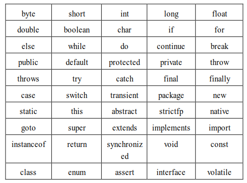
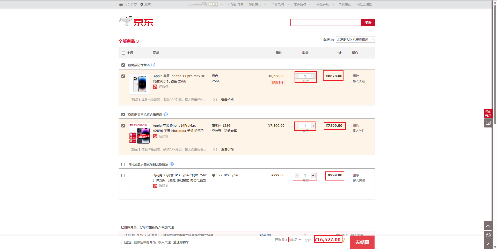

# 第一章：关键字和标识符

## 1.1 关键字

### 1.1.1 概述

* 在 Java 中，关键字是有特定意义的保留字，它们不能用作变量名、方法名或类名。

> [!NOTE]
>
> * ① Java 中的关键字全是小写。
> * ② Java 中的关键字不需要强行记忆，等用到的时候，会自然而然的记住！！！
> * ③ 在高级记事本软件或 IDE（集成开发环境中），关键字非常好区分，因为其都是有特殊颜色的。
>
> ::: details 点我查看 高级记事本软件或 IDE 中 Java 的关键字
>
> ```java
> public class HelloWorld {
> 	public static void main(String[] args){
> 		System.out.println("Hello World!!!");
> 	}
> }
> ```
>
> :::

* Java 的关键字定义了语言的语法和结构，并决定了程序的控制流、数据结构等方面的行为。

### 1.1.2 Java 中的关键字

* 以下是 Java 中的关键字：



> [!IMPORTANT]
>
> * ① `const` 和 `goto` 是保留字，虽然它们可能在当前 JDK 版本中暂时未被使用，但在未来的 JDK 版本中可能会被赋予新的功能。
> * ② `true`、`false` 和 `null` 看起来像关键字，但从技术角度，它们是特殊的布尔值和空值。

## 1.2 标识符

### 1.2.1 概述

* 凡是程序员自己可以命名的部分就是标识符，即：给`类`、`变量`、`方法`等命名的`字符序列`就是`标识符`。

### 1.2.2 标识符的命名规则（必须遵守，强制）

- ① 只能使用 `26` 个英文字母大小写，`0~9` 的数字，下划线 `_` 和美元符号 `$` 。
- ② 不能使用 Java 的关键字或保留字以及特殊值。
- ③ 数字不能开头。
- ④ 不能包含空格。
- ⑤ 严格区分大小写。

> [!CAUTION]
>
> 规则是硬性规定，一旦违反，程序就会在编译过程中报错。


* 示例：合法标识符（✅）

```txt
age, student_1, _tempValue, $result
```


* 示例：不合法标识符（❌）

```txt
1student, @value, #total
```

### 1.2.3 标识符的命名规则（柔性规范，非强制）

- ① 见名知意。 
- ② 类名、接口名等：每个单词的首字母都大写，如：`XxxYyyZxx` 。 
- ③ 变量、方法名等：从第二个单词开始首字母大写，其余字母小写，如：`xxxYyyZzz` 。 
- ④ 包名等：每一个单词都小写，单词之间使用点 `.` 分隔，如：`com.github` 。 
- ⑤ 常量名等：每一个单词都大写，单词之间使用下划线 `_` 分隔，如：`XXX_YYY_ZZZ` 。

> [!CAUTION]
>
> 规范是柔性规范：违反规范，不会导致编译报错，但是如果不遵守基本的规范，可能会被大家鄙视。 


* 示例：符合规范的标识符

```txt
studentName, totalAmount, counterValue
```


# 第二章：常量（⭐）

## 2.1 概述

* 常量指的是在程序执行的过程中，其值不可以发生改变的量。

## 2.2 常量的分类

* 常量的分类，如下所示：


> [!NOTE]
>
> 问：如何理解`"字面值常量"`中的`"字面"`？
>
> 答：`"字面"`就是数据本身，`"字面"`含义就是`数据`；换言之，就是告诉程序员，数据在程序中的书写格式。

> [!CAUTION]
>
> * ① 字符常量，使用单引号（`''`）括起来，必须有且仅能包含一个字符。
> * ② 空常量，不可以在输出语句中直接打印！！！

## 2.3 常量的使用

* ① 整数常量：所有的整数都属于整数常量；但是，如果整数的范围太大，就需要再后面加上`L` ，表示是一个 `long` 类型的常量。
* ② 浮点数常量：所有的浮点数（小数）都属于浮点常量，根据精度的不同，分为单精度浮点常量（需要加上 `F` 作为后缀）和双精度浮点常量（默认，也可以加上 `D` 作为后缀）。
* ③ 字符常量：需要使用单引号（`''`）括起来，单引号中有且仅有一个内容，如：`'a'`、`'1'` 、`'个'` 等。
* ④ 字符串常量：需要使用双引号（`""`）括起来，双引号中的内容任意，如：`""`、`"你好啊"`、`"呵呵哒"` 等。
* ⑤ 布尔常量：只能是 `true` 或 `false` 。
* ⑥ 空常量：就是 `null` ，表示数据不存在。


* 示例：整数常量

```java
package com.github.day02;

/**
 * 整数常量
 */
public class ConstantDemo1 {
    public static void main(String[] args) {

        // 普通整数：正数
        System.out.println(12);
        // 普通整数：负数
        System.out.println(-12);
        // 整数常量默认是 int 类型，如果超过这个范围，需要加 L，转换为 long 类型
        System.out.println(220000000000000000L); 

    }
}
```


* 示例：浮点数常量

```java
package com.github.day02;

/**
 * 浮点数常量
 */
public class ConstantDemo2 {
    public static void main(String[] args) {

        // 单精度浮点类型常量
        System.out.println(3.14F);
        // 双精度浮点类型常量，可以加 d 或 D 。
        // 如果不写，默认就是双精度浮点类型常量
        System.out.println(3.14); 

    }
}
```


* 示例：字符常量

```java
package com.github.day02;

/**
 * 字符常量
 */
public class ConstantDemo4 {
    public static void main(String[] args) {

        System.out.println('a');
        System.out.println('许');
        System.out.println('大');
        System.out.println('仙');
        System.out.println('\t');

    }
}
```


* 示例：字符串常量

```java
package com.github.day02;

/**
 * 字符串常量
 */
public class ConstantDemo3 {
    public static void main(String[] args) {

        // 普通字符串
        System.out.println("HelloWorld");
        // 只包含一个字符的字符串
        System.out.println("a");
        // 空字符串
        System.out.println(""); 

    }
}
```


* 示例：布尔常量

```java
package com.github.day02;

/**
 * 布尔常量
 */
public class ConstantDemo5 {
    public static void main(String[] args) {

        System.out.println(true);
        System.out.println(false);

    }
}
```

## 2.4 常量之间的运算

### 2.4.1 概述

* 在 Java 中，常量之间是可以进行运算的，但是运算的类型取决于常量的类型。

### 2.4.2 整数常量的运算

* Java 支持对`整数常量`进行`加`、`减`、`乘`、`除`、`取模`（取余数）等运算。


* 示例：

```java
package com.github.day02;

/**
 * 整数常量的运算
 */
public class ConstantExe1 {
    public static void main(String[] args) {
        // 加法
        System.out.println(1 + 1);
        // 减法
        System.out.println(1 - 2);
        // 乘法
        System.out.println(2 * 2);
        // 除法
        System.out.println(1 / 2);
        // 取模
        System.out.println(1 % 2);
    }
}
```

### 2.4.3 浮点数常量的运算

* Java 支持对`浮点数常量`进行`加`、`减`、`乘`、`除`、`取模`（取余数）等运算；但是，在进行`除法`的时候，不会截断小数部分。


* 示例：

```java
package com.github.day02;

/**
 * 浮点数常量的运算
 */
public class ConstantExe2 {
    public static void main(String[] args) {
        // 加法
        System.out.println(1 + 1.1); // 2.1
        // 减法
        System.out.println(1 - 2.1); // -1.1
        // 乘法
        System.out.println(2 * 2.1); // 4.2
        // 除法
        System.out.println(1 / 2.0); // 0.5
        // 取模
        System.out.println(1 % 2.0); // 1.0
    }
}
```

### 2.4.4 字符常量的运算

* 在 Java 中，字符常量可以进行数学运算，如：ASCII 码计算。


* 示例：

```java
package com.github.day02;

/**
 * 字符常量的运算
 */
public class ConstantExe3 {
    public static void main(String[] args) {
        // 转换为整数
        System.out.println((int) 'A'); // 65
        // 转换为整数
        System.out.println((int) 'B'); // 66
        // 计算 'B' 和 'A' 之间的距离
        System.out.println('B' - 'A'); // 1
    }
}
```

### 2.4.5 布尔常量的运算

* Java 不能对布尔常量进行运算，但是可以使用逻辑运算符（`&&`、`||`、`!`）进行逻辑运算。


* 示例：

```java
package com.github.day02;

/**
 * 布尔常量的逻辑运算
 */
public class ConstantExe4 {
    public static void main(String[] args) {

        System.out.println(true && true); // true
        System.out.println(true && false); // false
        System.out.println(false && true); // false
        System.out.println(false && false); // false

        System.out.println(true || true); // true
        System.out.println(true || false); // true
        System.out.println(false || true); // true
        System.out.println(false || false); // false

        System.out.println(!true); // false
        System.out.println(!false); // true

    }
}
```

### 2.4.6 字符串常量的运算

* Java 中的字符串常量可以使用 `+` 进行拼接。


* 示例：

```java
package com.github.day02;

/**
 * 字符串常量的拼接
 */
public class ConstantExe5 {
    public static void main(String[] args) {

        System.out.println("hello"); // hello
        System.out.println("world"); // world
        System.out.println("hello" + "world"); // helloworld
    }
}
```

## 2.5 自定义常量

* 在 Java 中，自定义常量通常使用 `final` 关键字来声明，一旦赋值后，其值就无法更改。
* 在 Java 中，自定义常量的标识符一般采用全大写字母命名，并使用下划线分隔单词，如：`MAX_VALUE` 等，这是一种常见的命名约定。


* 示例：

```java
package com.github.day02;

/**
 * 自定义常量
 */
public class MathConstants {
    public static void main(String[] args) {

        final int X = 5;

        System.out.println("X: " + X);
    }
}
```


# 第三章：初识数据类型（⭐）

## 3.1 概述

* Java 中的数据类型分为两大类，如下所示：


## 3.2 基本数据类型

* Java 中的`基本数据类型`是`四类八种`，如下所示：


* 常量整数值： 

  - 赋值给 byte，只要在 byte 范围内即可。

  - 赋值给 short，只要在 short 范围内即可。

  - 赋值给 int，只要在 int 范围内即可。

  - 赋值给 long，在 int 范围内的，可以加 L 也可以不加 L ，会自动升级为 long ，如果数字超过了 int 范围，必须加 L 。

* 浮点常量值：无论多大，如果不加 F，就是 double 类型。


# 第四章：变量（⭐）

## 4.1 程序中变化的数据

- 在生活中，我们使用最多的不是固定的数据，而是会变化的数据：
  - ① 购物车商品的`数量`、`价格`等。
  - ② 一首歌`播放的时间`、`进度条`、`歌词的展示`等。
  - ③ 微信聊天中`消息条数`、`时间`、`语音的长度`、`头像`、`名称`等。
  - ④ 游戏中技能的`冷却时间`、`血量`、`蓝量`、`buff 时间`、`金币的数量`等。
  - ……
- 下图是一个`购物车`中`变化`的`数据`，即：



* 那么，在实际开发中，我们就会使用`变量`来`保存`和`操作`这些`变化`的`数据`。

## 4.2 变量的理解

- 变量的定义：变量是程序中不可或缺的组成单位，最基本的存储单元。其实，变量就是一个存储数据的临时空间，可以向其中存储不同类型的数据，如：整数、小数、字符、字符串等，并且变量中的数据在程序运行的时候可以动态改变。

> [!NOTE]
>
> - `变量`：用来`存储数据`的`容器`。
> - `数据`：可以是一个用来计算的`数字`，如：上文购物车中的`价格`等；也可以是一句话中的`关键词`或`其它任意格式的数据`。
> - 变量的`特别`之处就在于`它存放的数据是可以改变`的。

* 我们可以将`变量`想象为一个`容器`，盒子中`装的`就是我们想要的`数据`，并且我们需要`给`盒子`取`一个`特别的名称`；通过这个`特别的名称`，我们可以`给`盒子`添加数据`或`移除数据`，这个`特别的名称`就是`变量名`。


> [!NOTE]
>
> - ① `变量`是内存中的一个`存储区域`，该区域的数据可以在`同一类型`范围内`不断变化`。
> - ② 通过`变量名`，可以`操作`这块内存区域，向其中`存储数据`或`获取数据`以及`移除数据`。
> - ③ 变量的构成包含三个要素：`数据类型`、`变量名`、`需要存储的数据`。
> - ④ 在生活中，我们会经常说：这件衣服的价格是 `100（整型）` 元，这双鞋子的价格是 `250.5（小数，浮点类型）` 元，`今天天气真好（字符串类型）`之类的话；在计算机科学中，这些都是数据，并且它们是有类型，即：数据类型。（数据类型用于定义变量所能存储的数据的种类以及可以对这些数据进行的操作的一种分类，每种数据类型都有特定的属性和用途，它们决定了变量在内存中如何表示和存储，以及变量可以执行哪些操作）

## 4.3 变量的声明、赋值和使用

* ① 变量的声明语法：

```java
数据类型 变量名;
```

* ② 变量的赋值语法：

```java
变量名 = 值;
```

> [!NOTE]
>
> * ① 我们可以声明变量之后，再给变量赋值，如：`int age; age = 10;`。
> * ② 我们也可以在声明变量的同时，给变量赋值，这称为初始化，如：`int age = 10 ;`。

* ③ 变量的使用：变量在赋值后可以在程序中使用

```java
变量名;
```

> [!CAUTION]
>
> 变量使用的注意事项：
>
> * ① 变量必须先定义（赋值或初始化）再使用。
> * ② 局部变量在使用之前必须先初始化（类属性，会有系统根据其数据类型，自动赋予初始化值）。
> * ③ 变量是有作用域的。
> * ④ 在同一个作用域中不能有同样的变量名；换言之，一个变量在作用域中只能使用一次。


* 示例：变量的声明

```java
package com.github.day02;

public class VariableDemo1 {
    public static void main(String[] args){
        
        // 声明一个变量，名称是 age，其数据类型是 int
        int age; // [!code highlight]
        // 声明一个变量，名称是 name，其数据类型是 String
        String name; // [!code highlight]
        // 声明一个变量，名称是 salary，其数据类型是 double
        double salary; // [!code highlight]
        
    }
}
```


* 示例：变量的赋值

```java
package com.github.day02;

public class VariableDemo1 {
    public static void main(String[] args) {

        // 声明一个变量，名称是 age，其数据类型是 int
        int age;
        // 声明一个变量，名称是 name，其数据类型是 String
        String name;
        // 声明一个变量，名称是 salary，其数据类型是 double
        double salary;

        // 给变量 age 赋值 10
        age = 10; // [!code highlight]
        // 给变量 name 赋值 "张三"
        name = "张三"; // [!code highlight]
        // 给变量 salary 赋值 100
        salary = 10000.0; // [!code highlight]
    }
}
```


* 示例：变量的使用

```java
package com.github.day02;

public class VariableDemo1 {
    public static void main(String[] args) {

        // 声明一个变量，名称是 age，其数据类型是 int
        int age;
        // 声明一个变量，名称是 name，其数据类型是 String
        String name;
        // 声明一个变量，名称是 salary，其数据类型是 double
        double salary;

        // 给变量 age 赋值 10
        age = 10;
        // 给变量 name 赋值 "张三"
        name = "张三";
        // 给变量 salary 赋值 100
        salary = 10000.0;

        // 输出变量 name 的值
        System.out.println("姓名是：" + name); // [!code highlight]
        // 输出变量 age 的值
        System.out.println("年龄是：" + age); // [!code highlight]
        // 输出变量 salary 的值
        System.out.println("工资是：" + salary); // [!code highlight]
    }
}
```


* 示例：变量的初始化

```java
package com.github.day02;

public class VariableDemo2 {
    public static void main(String[] args) {

        // 变量的初始化
        int age = 10; // [!code highlight]
        // 变量的初始化
        String name = "张三"; // [!code highlight]
        // 变量的初始化
        double salary = 10000.0; // [!code highlight]

        // 输出变量 name 的值
        System.out.println("姓名是：" + name);
        // 输出变量 age 的值
        System.out.println("年龄是：" + age);
        // 输出变量 salary 的值
        System.out.println("工资是：" + salary);
    }
}
```

## 4.4 变量的作用域

* 所谓`变量的作用域`就是`变量的有效范围`。

> [!CAUTION]
>
> 变量必须在有效范围内使用；否则，将会编译失败。

* 在 Java 语言中，变量的作用域就是其所在的一组 `{}` 。


* 示例：

```java
public class VariableDemo{
    
    public void method(){
        
        {
            boolean flag = true;
        }
        // ❌ 错误：此处代码有问题，将会编译失败
        System.out.println(flag); // [!code error]
    }
}
```

## 4.5 变量的三要素

### 4.5.1 概述

* 变量的定义语法是这样的，如下所示：

```java
数据类型 变量名 = 值;
```

* 从中，我们可以得知，变量的三要素是`数据类型`、`变量名`和`值`。

### 4.5.2 变量名

* `变量名`是引用`绑定`的值。换言之，在程序中，`变量名`是程序员用来`引用`和`操作`存储在该变量中的数据的`标识符`。

> [!NOTE]
>
> * ① 变量名通常应该具有描述性，符合一定的命名规范（见名知意）。
> * ② 数据类型只在定义变量的时候声明，而且必须声明；在使用变量的时候，就无需再声明，因为此时的数据类型已经确定的。

### 4.5.3 值

* `值`就是变量存储的`实际数据`。

> [!NOTE]
>
> - ① 整型变量的值可能是`10`。
> - ② 字符型变量的值可能是`'A'`。
> - ③ 布尔型变量的值可能是`true`或者`false`。

### 4.5.4 数据类型

* `数据类型`是编程语言中用于规范变量或表达式的性质的一个抽象概念。它确定了所存储数据的形式、大小和布局，并定义了可对该类型数据执行的操作集合。
* 剥离本质，`数据类型`的定义就是：规定了一组合法的数据集合以及针对这组数据集合的合法操作，即：数据类型 = 数据 + 操作。

> [!NOTE]
>
> ::: details 点我查看
>
> * ① `数据的种类`：（编码）：数据类型首先定义了变量能存储什么类型的数据，不同的类型代表着不同的“数据种类”，即：不同的数据类型让我们能够存储和处理不同种类的值，如下所示：
>   - **整型（int）**：用于存储整数，例如 `-1`、`0`、`100` 等。
>   - **浮点型（float 或 double）**：用于存储有小数点的数字，如： `3.14`、`-0.5` 等。
>   - **字符型（char）**：用于存储单个字符，例如 `'A'`、`'b'` 等。
>   - **布尔型（boolean）**：用于存储真（true）或假（false）值，通常用于逻辑判断。
>   - **字符串类型（string）**：用于存储字符的序列，如：`"Hello, World!"`。
> * ② `数据的存储空间`：（内存大小）：数据类型还决定了计算机如何在内存中存储这些数据，不同的数据类型占用的内存空间不同，即：数据类型不仅决定了能存储的数据种类，还影响数据在内存中的存储方式和空间，如下所示：
>   - **整型（int）**：通常占用 4 字节（具体大小取决于系统架构），表示整数。
>   - **字符型（char）**：只占 1 字节，表示一个字符。
>   - **浮点型（float）**：占 4 字节，表示带小数的浮动数。
>   - **浮点型（double）**：占 8 字节，表示高精度的浮动数。
> * ③ 操作方式：：数据类型决定了可以对变量执行哪些操作，每种数据类型都有自己的运算规则和支持的操作，即：不同的数据类型有不同的操作规则，操作方式取决于数据类型的定义，如下所示：
>   - **整型（int）**：支持加法、减法、乘法、除法等常规算术运算。
>   - **浮动型（float 或 double）**：支持加减乘除运算，但会有浮动精度的考虑，还可以进行一些特有的数学运算，如求平方根、对数等。
>   - **字符型（char）**：支持字符的比较（`'A' == 'B'`），可以进行字符的转换（从字符到 ASCII 值的转换）。
>   - **布尔型（boolean）**：常用于逻辑运算，如：与（AND）、或（OR）、非（NOT）等。
>
> :::

* `数据类型`决定了变量可以存储哪类数据（种类），以及计算机如何在内存中存储这些数据（空间）；同时，`数据类型`也决定了我们可以如何操作这些数据（方法和运算规则）。
* 当然，我们可以对`数据类型`进行更进一步的抽象，`数据类型`主要有`限定变量的取值范围`和`限定变量能够执行的操作`的作用。

> [!IMPORTANT]
>
> ::: details 点我查看
>
> - ① 限定变量的取值范围（编码+内存大小）。
>   - `编码`：是指数据如何在计算中表示。不同的数据类型采用不同的编码方式来表示值，如：整数类型（int ）通常采用补码来表示整数（正整数、0 和负整数），浮点类型（float 或 double）采用 IEEE 754 标准进行编码，字符类型（char）在 Java 语言中采用 Unicode 进行编码（在 JDK18 之后，采取 UTF-8 编码），这些数据类型的编码方式不同，导致它们能表示的值的范围和精度不同（32 位的 int 的范围是 `[-2^31,2^31-1]`；而 float 类型则能表示更广泛的数值范围，但是精度和有效位是有限的 ）。
>   - `内存大小`：数据类型的大小决定了在内存中占用的空间，这直接影响到它能够存储的值的大小，如：32 位的 int 占用 4 个字节大小，最多可以表示 `2^32` 个整数，其取值范围是 `[-2^31,2^31-1]`。
>
> - ② 限定变量能够执行的操作。
>   - 对于`int`类型的变量，你可以执行算术运算（加法、减法、乘法等），但不能对其执行字符串操作。
>   - 对于`boolean`类型的变量，你只能执行逻辑操作（`&&`、`||`等），而不能进行算术运算。
>   - 对于`String`类型的变量，你可以执行字符串连接、比较等操作，但不能进行直接的算术运算。
>
> :::

### 4.5.5 变量初始化的底层细节

* 之前，我们给变量进行初始化的时候，是这样的：

```java
int num = 10;
```

* 上述的代码其实透露了三个重要的信息：
  * ① `数据存储在哪里？`
  * ② `数据的长度（范围）是多少？`
  * ③ `数据的处理方式？`

* 其实，编译器对程序编译的时候，是这样做的：
  * ① `编译器在编译的时候，就将变量替换为内存中存储单元的内存地址（知道了你家的门牌号），这样就可以方便的进行存取数据了`（解答了上述的问题 ① ）。
  * ② `变量中其实存储的是初始化值 10 在内存中存储单元的首地址，我们也知道，数据类型 int 的存储空间是 4 个字节，那么根据首地址 + 4 个字节就可以完整的将数据从内存空间中取出来或存进去`（解答了上述的问题 ② ）。
  * ③ `我们知道，数据在计算机底层的存储方式是不一样的，如：整数在计算机底层的存储就是计算机补码的方式，浮点数在计算机底层的存储类似于科学计数法；但是，字符类型在计算机底层的存储和整数以及浮点数完全不同，需要查码表，即：在存储的时候，需要先查询码表，转换为二进制进行存储；在读取的时候，也需要先查询码表，将二进制转换为对应的字符`（解答了上述的问题 ③ ）。

* 所以，程序中的变量在内存中就是这样的，如下所示：


## 4.6 变量声明 VS 变量定义

* 变量声明的语法是：

```java
数据类型 变量名;
```

> [!NOTE]
>
> * ① C/C++ 编程语言，对于变量声明，如：`int age;`，编译器会在内存中开辟一块内存空间，并为其赋值为随机值，这样在调用变量的时候，会产生未定义行为（这也是为什么 C/C++ 被称为内存不安全的原因之一）。
> * ② Java 编程语言，对于变量声明，如：`int age;`，如果没有对变量进行赋值，编译器在编译的时候直接报错，告诉程序员该变量没有进行赋值，从编译期就规避了未定义行为（这也是  Java 被称为内存安全的原因之一）。

* 其在内存中，是这样的，如下所示：


* 变量定义的语言是：

```java
数据类型 变量名;
变量名 = 值;
```

```java
数据类型 变量名 = 值;
```

> [!NOTE]
>
> * ① C/C++ 编程语言，对`变量声明`和`变量定义`，编译器是不同的处理方式；所以，在 C/C++ 中，变量声明和变量定义，是不一样的。
> * ② Java 编程语言，由于编译器的处理，导致了如果不对变量进行赋值，在进行变量调用的时候，在编译期就会报错；所以，对于 Java 程序员而言，`变量声明`和`变量定义`，并没什么区别。


## 4.7 变量的使用场景

* ① 输出打印。

```java {7}
package com.github;

public class VariableDemo3 {
    public static void main(String[] args) {

       int num = 10;
       System.out.println(num); // 10
        
    }
}
```

* ② 参与计算。

```java {8}
package com.github;

public class VariableDemo4 {
    public static void main(String[] args) {

        int a = 10;
        int b = 20;
        System.out.println(a + b); // 30
        
    }
}
```

* ③ 修改记录的值。

```java {9}
package com.github;

public class VariableDemo5 {
    public static void main(String[] args) {

        int num = 10;
        System.out.println(num); // 10

        num = 20;
        System.out.println(num); // 20
        
    }
}
```

## 4.8 变量的注意事项

* ① 变量中只能存在一个值。

```java
package com.github;

public class VariableTest1 {
    public static void main(String[] args) {

        int num = 10;
        System.out.println(num); // 10

        num = 20;
        System.out.println(num); // 20
        
    }
}
```

* ② 变量名在同一作用域内不允许重复定义。

```java
package com.github;

public class VariableTest2 {
    public static void main(String[] args) {

        int num = 10;
        System.out.println(num); 
		
        // ❌ 错误：下面的代码是错误的
        int num = 20; // [!code error]
        System.out.println(num); 
        
    }
}
```

* ③ 一条语句中可以定义多个变量（不常用）。

```java {6}
package com.github;

public class VariableTest3 {
    public static void main(String[] args) {

        int a = 10,b = 20;
        System.out.println(a); // 10
        System.out.println(b); // 20
        
    }
}
```

* ④ 变量在使用之前一定要进行赋值。

```java
package com.github;

public class VariableTest4 {
    public static void main(String[] args) {

        int num;
        // ❌ 错误：以下的代码是错误的
        System.out.println("num = " + num); // [!code error]
        
    }
}
```

* ⑤ 变量只在其作用域范围内有效。

```java
package com.github;

public class VariableTest5 {
    public static void main(String[] args) {

        {
            int num = 10;
            System.out.println("num = " + num);
        }
        
        // ❌ 错误：以下的代码是错误的
        System.out.println("num = " + num); // [!code error]
        
    }
}
```


# 第五章：作业

## 5.1 单选题

* ① 下面关于变量的声明，那个是错误的？

- [ ] A：int x = 5;
- [ ] B：double d = 3.14;
- [ ] C：char c = 'C';
- [x] D：String name = 'Hello World';

> [!NOTE]
>
> * ① 字符常量，使用单引号（`''`）括起来，必须有且仅能包含一个字符。
> * ② 字符串常量，使用双引号（`""`）括起来。

* ② 下面的代码，那个是创建一个变量？

- [x] A：int age = 18;
- [ ] B：age = 20;
- [ ] C：age = "许大仙";
- [ ] D：String name;

> [!NOTE]
>
> 变量定义的语法，如下所示：
>
> ```java
> 数据类型 变量名;
> 变量名 = 值;
> ```
>
> ```java
> 数据类型 变量名 = 值;
> ```

## 5.2 多选题

* ① 下面的变量名，那些是正确的？

- [x] A：mybirthday
- [x] B：myname 
- [ ] C：my name
- [ ] D：my birthday
- [ ] E：1987
- [ ] D："许大仙"

> [!NOTE]
>
> 标识符的命名规则（必须遵守，强制）：
>
> - ① 只能使用 `26` 个英文字母大小写，`0~9` 的数字，下划线 `_` 和美元符号 `$` 。
> - ② 不能使用 Java 的关键字或保留字以及特殊值。
> - ③ 数字不能开头。
> - ④ 不能包含空格。
> - ⑤ 严格区分大小写。

* ② 关于变量的说法，那些是对的？

- [ ] A：一个变量一次可以存储很多种不同的数据。
- [x] B：变量是值的容器，定义变量可以存放值。
- [ ] C：变量可以随时修改存储数据的类型。
- [x] D：定义变量可以帮助我们存储信息，以便后面使用。

## 5.3 代码题

* 需求：请用代码描述下列银行流水变化过程。

> [!NOTE]
>
> * ① 小明账户 bankBalance 初始值有 500.00 元。
> * ② 存入 250 元。
> * ③ 支出 100 元。
> * ④ 打印剩余存款。


* 示例：

```java
package com.github.test;

public class VariableTest2 {
    public static void main(String[] args) {

        // 小明账户 bankBalance 初始值有 500.00 元。
        double bankBalance = 500.00;
        // 存入 250 元
        bankBalance = bankBalance + 250;
        // 支出 100 元。
        bankBalance = bankBalance - 100;
        // 打印剩余存款。
        System.out.println("剩余存款：" + bankBalance + "元");

    }
}
```

