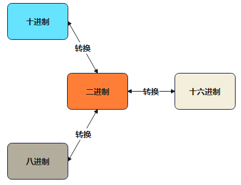
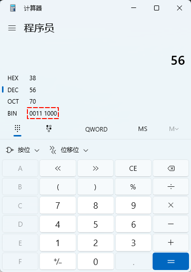
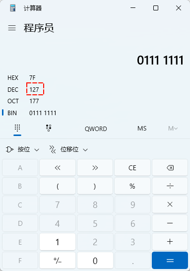
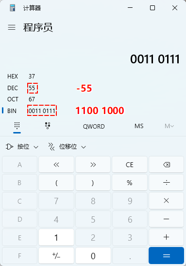
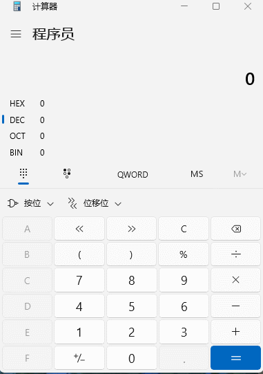

# 第一章：前言

## 1.1 概述

* 计算机的底层只有`二进制`，即计算机中`运算`和`存储`的`所有数据`都需要转换为`二进制`，包括：数字、字符、图片、视频等。


## 1.2 冯·诺依曼体系结构

* 之前，我们也提到现代的计算机（量子计算机除外）几乎都遵循`冯·诺依曼`体系结构，其理论要点如下：
  * ① **存储程序**：`程序指令`和`数据`都存储在计算机的内存中，这使得程序可以在运行时修改。
  * ② **二进制逻辑**：所有数据和指令都以`二进制`形式表示。
  * ③ **顺序执行**：指令按照它们在内存中的顺序执行，但可以有条件地改变执行顺序。
  * ④ **五大部件**：计算机由`运算器`、`控制器`、`存储器`、`输入设备`和`输出设备`组成。
  * ⑤ **指令结构**：指令由操作码和地址码组成，操作码指示要执行的操作，地址码指示操作数的位置。
  * ⑥ **中心化控制**：计算机的控制单元（CPU）负责解释和执行指令，控制数据流。

> [!NOTE]
>
> 冯·诺依曼体系结构决定了计算机为什么只能识别二进制！！！


# 第二章：进制

## 2.1 常见的进制

* 在生活中，我们最为常用的进制就是`十进制`，其规则是`满 10 进 1` ，即：


* 在计算机中，常见的进制有`二进制`、`八进制`和`十六进制`，即：
  * 二进制：只能 0 和 1 ，满 2 进 1 。
  * 八进制：0 ~ 7 ，满 8 进 1 。
  * 十六进制：0 ~ 9 以及 A ~ F ，满 16 进 1 。

> [!NOTE]
>
> * ① 在十六进制中，除了 `0` 到 `9` 这十个数字之外，还引入了字母，以便表示超过 `9` 的值。
> * ② 其中，字母 `A` 对应十进制的 `10` ，字母 `B` 对应十进制的 `11` ，字母 `C` 对应十进制的 `12`，字母 `D` 对应十进制的 `13`，字母 `E` 对应十进制的 `14`，字母 `F` 对应十进制的 `15`。

* 进制的换算举例，如下所示：

| 十进制 | 二进制 | 八进制 | 十六进制 |
| ------ | ------ | ------ | -------- |
| 0      | 0      | 0      | 0        |
| 1      | 1      | 1      | 1        |
| 2      | 10     | 2      | 2        |
| 3      | 11     | 3      | 3        |
| 4      | 100    | 4      | 4        |
| 5      | 101    | 5      | 5        |
| 6      | 110    | 6      | 6        |
| 7      | 111    | 7      | 7        |
| 8      | 1000   | 10     | 8        |
| 9      | 1001   | 11     | 9        |
| 10     | 1010   | 12     | a 或 A   |
| 11     | 1011   | 13     | b 或 B   |
| 12     | 1100   | 14     | c 或 C   |
| 13     | 1101   | 15     | d 或 D   |
| 14     | 1110   | 16     | e 或 E   |
| 15     | 1111   | 17     | f 或 F   |
| 16     | 10000  | 20     | 10       |
| ...    | ...    | ...    | ...      |

* 二进制和十六进制的关系：十六进制是以 16 为基数的进制系统，16 在二进制中表示为 ( 2^4 )，即：一个十六进制可以表示 4 位二进制。

> [!NOTE]
>
> 十六进制的范围是：0 ~ F （0 ~ 15）对应的二进制数的范围是：0000 ~ 1111 （0 ~ 15）。

* 每个十六进制数都可以映射到一个唯一的 4 位二进制数，即：

| 十六进制 | 二进制 |
| -------- | ------ |
| 0        | 0000   |
| 1        | 0001   |
| 2        | 0010   |
| 3        | 0011   |
| 4        | 0100   |
| 5        | 0101   |
| 6        | 0110   |
| 7        | 0111   |
| 8        | 1000   |
| 9        | 1001   |
| A        | 1010   |
| B        | 1011   |
| C        | 1100   |
| D        | 1101   |
| E        | 1110   |
| F        | 1111   |

>[!NOTE]
>
>由此可见，每个十六进制数字确实由 4 位二进制数表示。

* 二进制和八进制的关系：八进制是以 8 为基数的进制系统，8 在二进制中表示为 ( 2^3 )；即：一个八进制位可以表示 3 个二进制位。

> [!NOTE]
>
> 八进制的范围是：0 ~ 7 对应的二进制数的范围是：000 ~ 111。

* 每个八进制数位都可以映射到一个唯一的 3 位二进制数，即：

| 八进制 | 二进制 |
| ------ | ------ |
| 0      | 000    |
| 1      | 001    |
| 2      | 010    |
| 3      | 011    |
| 4      | 100    |
| 5      | 101    |
| 6      | 110    |
| 7      | 111    |

> [!NOTE]
>
> 由此可见，每个八进制数字确实由 3 位二进制数表示。

## 2.2 Java 语言中如何表示不同进制的整数？

* 规则如下：
  * 在 Java  语言中，如果是`二进制`（字面常量），则需要在二进制整数前加上 `0b` 或 `0B` 。
  * 在 Java  语言中，如果是`八进制`（字面常量），则需要在八进制整数前加上 `0` 。
  * 在 Java  语言中，如果是`十进制`（字面常量），正常数字表示即可。
  * 在 Java  语言中，如果是`十六进制`（字面常量），则需要在十六进制整数前加上 `0x`或`0X` 。


* 示例：

```c
package com.github.day03;

public class BaseDemo {

    public static void main(String[] args) {

        // 二进制整数
        int num = 0b1010;

        // 十进制整数（默认）
        int num2 = 10;

        // 八进制整数
        int num3 = 012;

        // 十六进制整数
        int num4 = 0xA;

        System.out.println(num); // 10
        System.out.println(num2); // 10
        System.out.println(num3); // 10
        System.out.println(num4); // 10
    }
}
```

## 2.3 输出格式

* 在 Java 中，我们可以通过 `Integer` 类中的`静态方法`将`十进制整数`转换为`二进制整数`、`八进制整数`以及`十六进制整数`。

```java
// 将十进制整数转换为二进制整数
public static String toBinaryString(int i);
```

```java
// 将十进制整数转换为八进制整数
public static String toOctalString(int i);
```

```java
// 将十进制整数转换为十六进制整数
public static String toHexString(int i);
```


* 示例：

```c
package com.github.day03;

public class BaseDemo2 {

    public static void main(String[] args) {

        int num = 10;

        // 10 对应的二进制是：1010
        System.out.println(num + " 对应的二进制是：" + Integer.toBinaryString(num));
        // 10 对应的八进制是：12
        System.out.println(num + " 对应的八进制是：" + Integer.toOctalString(num));
        // 10 对应的十六进制是：a
        System.out.println(num + " 对应的十六进制是：" + Integer.toHexString(num));
    }
}
```


* 示例：

```java
package com.github.day03;

public class BaseDemo2 {

    public static void main(String[] args) {

        int num = 10;

        // 10 对应的二进制是：0b1010
        System.out.printf(num + " 对应的二进制是：0b%s\n", Integer.toBinaryString(num));
        // 10 对应的八进制是：012
        System.out.printf(num + " 对应的八进制是：0%s\n", Integer.toOctalString(num));
        // 10 对应的十六进制是：0xa
        System.out.printf(num + " 对应的十六进制是：0x%s\n", Integer.toHexString(num));
    }
}
```


# 第三章：进制的运算规则

## 3.1 概述

* `十进制`的运算规则：
  * 逢`十`进`一`（针对加法而言）。
  * 借`一`当`十`（针对减法而言）。
* `二进制`的运算规则：
  * 逢`二`进`一`（针对加法而言）。
  * 借`一`当`二`（针对减法而言）。
* `八进制`的运算规则：
  * 逢`八`进`一`（针对加法而言）。
  * 借`一`当`八`（针对减法而言）。
* `十六进制`的运算规则：
  * 逢`十六`进`一`（针对加法而言）。
  * 借`一`当`十六`（针对减法而言）。

## 3.2 二进制的运算

### 3.2.1 二进制加法

* 二进制加法举例，如下所示：

```txt
1 + 0 = 1
1 + 1 = 10
11 + 10 = 101
111 + 111 = 1110
```

* 其对应的图示，如下所示：


### 3.2.2 二进制减法

* 二进制减法举例，如下所示：

```txt
1 - 0 = 1
10 - 1 = 1
101 - 11 = 10
1100 - 111 = 101
```

* 其对应的图示，如下所示：


## 3.3 八进制的运算

### 3.3.1 八进制加法

* 八进制加法举例，如下所示：

```txt
3 + 4 = 7
5 + 6 = 13
75 + 42 = 137
2427 + 567 = 3216
```

* 其对应的图示，如下所示：


### 3.3.2 八进制减法

* 八进制减法举例，如下所示：

```txt
6 - 4 = 2
52 - 27 = 33
307 - 141 = 146
7430 - 1451 = 5757
```

* 其对应的图示，如下所示：


## 3.4 十六进制的运算

### 3.4.1 十六进制加法

* 十六进制加法举例，如下所示：

```txt
6 + 7 = D
18 + BA = D2
595 + 792 = D27
2F87 + F8A = 3F11
```

* 其对应的图示，如下所示：


### 3.4.2 十六进制减法

* 十六进制减法举例，如下所示：

```txt
D - 3 = A
52 - 2F = 23
E07 - 141 = CC6
7CA0 - 1CB1 = 5FEF
```

* 其对应的图示，如下所示：


# 第四章：进制的转换

## 4.1 概述

* 不同进制的转换，如下所示：



* 在计算机中，数据是从右往左的方式排列的；其中，最右边的是低位，最左边的是高位，即：


## 4.2 二进制和十进制的转换

### 4.2.1 二进制转换为十进制

* 规则：从最低位开始，将每个位上的数提取出来，乘以 2 的 （位数 - 1 ）次方，然后求和。

> [!NOTE]
>
> * ① 在学术界，将这种计算规则，称为`位权相加法`。
> * ② `八进制转换为十进制`、`十六进制转换为十进制`和`二进制转换为十进制`的算法相同！！！


* 示例：十进制转十进制


* 示例：二进制转十进制


### 4.2.2 十进制转换二进制

* 规则：将该数不断除以 2 ，直到商为 0 为止，然后将每步得到的余数倒过来，就是对应的二进制。

> [!NOTE]
>
> * ① 在学术界，将这种计算规则，称为`短除法`或`连续除2取余法`。
> * ② 很好理解，只有不断地除以 2 ，就能保证最大的数字不超过 2 ，这不就是二进制（只能有 0 或 1）吗？
> * ③ `八进制转换为二进制`、`十六进制转换为二进制`和`十进制转换为二进制`的算法相同！！！


* 示例：十进制转十进制


* 示例：十进制转二进制


### 4.2.3 二进制转八进制

* 规则：从右向左，每 3 位二进制就是一个八进制，不足补 0（分组转换法）。


* 示例：011 101 001 -> 351


### 4.2.4 二进制转十六进制

* 规则：从右向左，每 4 位二进制就是一个十六进制，不足补 0（分组转换法）。


* 示例：1110 1001 -> 0xE9


# 第五章：原码、反码和补码

## 5.1 概述

* 在计算机中，`无符号位`的`整数`，如：unsinged int 等，在计算机底层存储的是`二进制编码`。

> [!NOTE]
>
> * ① 所谓`无符号位`的`整数`，就是对应`数学`中的`自然数`（0 和正整数），即：`[0,+∞]`。
> * ② C/C++ 语言中，存在`无符号整数`和`有符号整数`；但是，Java 等语言中，只存在`有符号整数`。

* 在计算机中，`有符号位`的`整数`，如：int 等，在计算机底层存储的是`补码`。

> [!NOTE]
>
> * ① 所谓`有符号位`的`整数`，就是对应`数学`中的`整数`（正整数、0 和负整数），即：`[-∞,+∞]`。
>
> * ② C/C++ 语言中，存在`无符号整数`和`有符号整数`；但是，Java 等语言中，只存在`有符号整数`。

## 5.2 机器数和真值

* 机器数：一个数在计算机的存储形式是二进制，我们称这些二进制数为机器数。机器数可以是有符号的，用机器数的最高位来存放符号位，`0` 表示正数，`1` 表示负数。

> [!IMPORTANT]
>
> * ① 这里讨论的适用于`有符号位`的整数，如：int 等。
> * ② 这里讨论的不适用于`无符号位`的整数，即：unsinged int 等。


* 真值（数据位）：因为机器数带有符号位，所以机器数的形式值不等于其真实表示的值（真值），以机器数 1000 0001 为例，其真正表示的值（首位是符号位）为 -1，而形式值却是 129 ，因此将带有符号位的机器数的真正表示的值称为机器数的真值。

> [!IMPORTANT]
>
> * ① 这里讨论的适用于`有符号位`的整数，如：int 等。
> * ② 这里讨论的不适用于`无符号位`的整数，即：unsinged int 等。


## 5.3 原码

* 原码的表示与机器数真值表示的一样，即用第一位表示符号，其余位表示数值。
* 原码的规则：

> [!NOTE]
>
> * 正数的`原码`是它本身对应的二进制数，符号位是 0 。
> * 负数的`原码`是它本身绝对值对应的二进制数，但是符号位是 1 。

* `+1` 的原码，使用 `16` 位二进数来表示，就是：

| 十进制数 | 原码（16位二进制数）  |
| -------- | --------------------- |
| +1       | `0`000 0000 0000 0001 |

* `-1` 的原码，使用 `16` 位二进数来表示，就是：

| 十进制数 | 原码（16位二进制数）  |
| -------- | --------------------- |
| -1       | `1`000 0000 0000 0001 |

> [!IMPORTANT]
>
> * ① 按照原码的规则，会出现 `+0` 和 `-0` 的情况，即：`0`000 0000 0000 0001（+0）、`1`000 0000 0000 0001（-0），显然不符合实际情况。
>* ② 所以，计算机底层虽然存储和计算的都是二进数，但显然不是原码。

## 5.4 反码

* 反码的规则：


> [!NOTE]
>
> * 正数的`反码`和它的`原码`相同。
> * 负数的`反码`是在其`原码`的基础上，符号位不变，其余各位取反。

* `+1` 的反码，使用 `16` 位二进数来表示，就是：

| 十进制数 | 原码（16位二进制数）  | 反码（16位二进制数）  |
| -------- | --------------------- | --------------------- |
| +1       | `0`000 0000 0000 0001 | `0`000 0000 0000 0001 |

* `-1` 的反码，使用 `16` 位二进数来表示，就是：

| 十进制数 | 原码（16位二进制数）  | 反码（16位二进制数）  |
| -------- | --------------------- | --------------------- |
| -1       | `1`000 0000 0000 0001 | `1`111 1111 1111 1110 |

> [!IMPORTANT]
>
> * ① 按照反码的规则，如果是 `+0`，对应的原码是 `0`000 0000 0000 0000；那么，其反码还是 `0`000 0000 0000 0000；如果是 `-0`，对应的原码是 `1`000 0000 0000 0000，其反码是 `1`111 1111 1111 1111，显然不符合实际情况。
>* ② 所以，计算机底层虽然存储和计算的都是二进数，但显然不是反码。

## 5.5 补码

* 补码的规则：


> [!NOTE]
>
> * 正数的`补码`和它的`原码`相同。
> * 负数的`补码`是在其`反码`的基础上 + 1 。

* `+1` 的补码，使用 `16` 位二进数来表示，就是：

| 十进制数 | 原码（16位二进制数）  | 反码（16位二进制数）  | 补码（16位二进制数）  |
| -------- | --------------------- | --------------------- | --------------------- |
| +1       | `0`000 0000 0000 0001 | `0`000 0000 0000 0001 | `0`000 0000 0000 0001 |

* `-1` 的补码，使用 `16` 位二进数来表示，就是：

| 十进制数 | 原码（16位二进制数）  | 反码（16位二进制数）  | 补码（16位二进制数）  |
| -------- | --------------------- | --------------------- | --------------------- |
| -1       | `1`000 0000 0000 0001 | `1`111 1111 1111 1110 | `1`111 1111 1111 1111 |

* 如果 `0` ，按照 `+0` 的情况进行处理，如下所示：


* 如果 `0` ，按照 `-0` 的情况进行处理，如下所示：


* `+1` 和 `-1` 的`原码`和`补码`的转换过程，如下所示：


> [!IMPORTANT]
>
> * ① 补码表示法解决了`原码`和`反码`存在的`两种`零（`+0` 和 `-0`）的问题，即：在补码表示法中，只有`一个`零，即 `0000 0000`。
>* ②补码使得`加法运算`和`减法运算`可以统一处理，通过将减法运算`转换`为加法运算，可以简化硬件设计，提高了运算效率。
> * ③ 计算机底层`存储`和`计算`的都是`二进数的补码`。换言之，当`读取`整数的时候，需要采用`逆向`的转换，即：将补码转换为原码。正数的原码、反码、补码都是一样的，三码合一。负数的补码转换为原码的方法就是先减去 `1` ，得到反码，再按位取反，得到原码（符号位是不能借位的）。

## 5.6 总结

* ① 计算机底层`存储`和`计算`的都是`二进数的补码`。换言之，当`读取`整数的时候，需要采用`逆向`的转换，即：将补码转换为原码。
* ② 正数的原码、反码和补码都是一样的，三码合一。
* ③ 负数的反码是在其原码的基础上，按位取反（0 变 1 ，1 变 0 ），符号位不变；负数的补码是其反码 + 1 。
* ④ 0 的补码是 0 。
* ⑤ 负数的补码转换为原码的方法就是先减去 `1` ，得到反码，再按位取反，得到原码（符号位是不能借位的）。


# 第六章：计算机底层为什么使用补码？

## 6.1 概述

* `加法`和`减法`是计算机中最基本的运算，计算机时时刻刻都离不开它们，所以它们由硬件直接支持。为了提高加法和减法的运行效率，硬件电路必须设计得尽量简单。
* 对于有符号位的数字来说，内存需要区分符号位和数值位：对于人类来说，很容易识别（最高位是 0 还是 1）；但是，对于计算机来说，需要设计专门的电路，这无疑增加了硬件的复杂性，增加了计算时间。如果能将符号位和数值位等同起来，让它们一起参与运算，不再加以区分，这样硬件电路就可以变得非常简单。
* 此外，加法和减法也可以合并为一种运算，即：加法运算。换言之，减去一个数就相当于加上这个数的相反数，如：`5 - 3` 相当于 `5 +（-3）`，`10 -（-9）`相当于 `10 + 9` 。
* 如果能够实现上述的两个目标，那么只需要设计一种简单的、不用区分符号位和数值位的加法电路，就能同时实现加法运算和减法运算，而且非常高效。其实，这两个目标已经实现了，真正的计算机的硬件电路就是这样设计的。
* 但是，简化硬件电路是有代价的，这个代价就是`有符号数`在存储和读取的时候都要继续转换。这也是对于有符号数的运算来说，计算机底层为什么使用`补码`的原因所在。

## 6.2 补码到底是如何简化硬件电路的？

* 假设 6 和 18 都是 short 类型，现在我们要计算 `6 - 18` 的结果，根据运算规则，它等价于 `6 +（-18）`。如果按照采用`原码`来计算，那么运算过程是这样的，如下所示：

> [!NOTE]
>
> 直接使用原码表示整数，让符号位也参与运算，那么对于减法来说，结果显然是不正确的。


* 于是，人们开始继续探索，不断试错，终于设计出了`反码`，如下所示：

> [!NOTE]
>
> 直接使用反码表示整数，让符号位也参与运算，对于 6 +（-18）来说，结果貌似正确。


* 如果我们将`被减数`和`减数`对调一下，即：计算 `18 - 6` 的结果，也就是 `18 +（-6）`的结果，继续采用`反码`来进行运算，如下所示：

> [!NOTE]
>
> * ① 6 - 18，即：6+（-18），如果采用`反码`计算，结果是正确的；但是，18 - 6，即：18 +（-6），如果采用`反码`计算，结果相差 1 。 
> * ② 可以推断：如果按照`反码`来计算，小数 - 大数，结果正确；而大数 - 小数，结果相差 1 。


* 对于这个相差的 `1` 必须进行纠正，但是又不能影响`小数-大数`的结果。于是，人们又绞尽脑汁设计出了`补码`，给`反码`打了一个`“补丁”`，终于把相差的 `1` 给纠正过来了。那么，`6 - 18` 按照`补码`的运算过程，如下所示：


* 那么，`18 - 6` 按照`补码`的运算过程，如下所示：


> [!IMPORTANT]
>
> 总结：采用`补码`的形式正好将相差的 `1`纠正过来，也没有影响到小数减大数，这个“补丁”非常巧妙。
>
> * ① 小数减去大数，结果为负，之前（负数从反码转换为补码需要 +1）加上的 1 ，后来（负数从补码转换为反码要 -1）还需要减去，正好抵消掉，所以不会受到影响。
> * ② 大数减去小数，结果为正，之前（负数从反码转换为补码需要 +1）加上的 1 ，后来（正数的补码和反码相同，从补码转换为反码不用 -1）就没有再减去，不能抵消掉，这就相当于给计算结果多加了一个 1。
>
> `补码`这种天才般的设计，一举达成了之前加法运算和减法运算提到的两个目标，简化了硬件电路。

## 6.3 问题抛出

* 在 C 语言中，对于`有符号位`的整数，是使用 `0` 作为正数，`1` 作为负数，来表示`符号位`，并使用`数据位`来表示的是数据的`真值`，如下所示：

```c
int a = 10;
int b = -10;
```


* 但是，对于`无符号位`的整数而言，是`没有`符号位和数据位，即：没有原码、反码、补码的概念。无符号位的整数的数值都是直接使用二进制来表示的（也可以理解为，对于无符号位的整数，计算机底层存储的就是其原码），如下所示：

```c
unsigned int a = 10;
// 其实是不对的，因为无符号位只能是自然数；但是，C 语言就是这么坑爹！！！
unsigned int b = -10; // [!code error]
```


* 这就是导致了一个结果就是：如果我定义一个`有符号`的负数，却让其输出`无符号`，必然造成结果不对，如下所示：

```c
#include <stdio.h>

char *getBinary(int num) {
    static char binaryString[33];
    int         i, j;

    for (i = sizeof(num) * 8 - 1, j = 0; i >= 0; i--, j++) {
        const int bit   = (num >> i) & 1;
        binaryString[j] = bit + '0';
    }

    binaryString[j] = '\0';
    return binaryString;
}

int main() {

    // 禁用 stdout 缓冲区
    setbuf(stdout, NULL);

    int num = -10;
    printf("b=%s\n", getBinary(num)); // b=11111111111111111111111111110110
    printf("b=%d\n", num);            // b=-10
    printf("b=%u\n", num);            // b=4294967286

    return 0;
}
```

* 其实，C 语言的底层逻辑很简单，C 语言压根不关心你定义的是`有符号数`还是`无符号数`，它只关心内存（如果定义的是有符号数，那就按照有符号数的规则来存储；如果定义的是无符号数，那就按照无符号数的规则来存储）。换言之，有符号数可以按照无符号数的规则来输出，无符号数也可以按照有符号数的规则来输出，至于输出结果对不对，那是程序员的事情，和 C 语言没有任何关系。

> [!IMPORTANT]
>
> * ① 实际开发中，`printf` 函数中的常量、变量或表达式，需要和格式占位符一一对应；否则，将会出现数据错误的现象。
> * ② 正因为上述的原因，很多现代化的编程语言，如：Java 等，直接取消了无符号的概念。但是，很多数据库是使用 C 语言开发的，如：MySQL 等，就提供了创建数据表的字段为无符号类型的功能，即：`UNSIGNED`（正整数） ，不要感觉困惑！！！
> * ③ 对于 `1000 0000 …… 0000 0000` 这个特殊的补码，无法按照上述的方法转换为原码，所以计算机直接规定这个补码对应的值就是 `-2³¹`。


# 第七章：位权相加法

## 7.1 概述

* 在上文，在提起`二进制转换为十进制`的时候，我们就提到了`位权相加法`，例如：`1011 --> 11`。

 

## 7.2 无符号位整数的位权相加法

* 在计算机中，`无符号位`的`整数`，如：unsinged int 等，在计算机底层存储的是`二进制编码`。
* 对于一个`无符号整数`，在计算机底层存储的`二进制`是 $b_{n-1}b_{n-2} \ldots b_1b_0$；那么，其对应的`十进制`是 $b_{n-1} \cdot 2^{n-1} + b_{n-2} \cdot 2^{n-2} + \ldots + b_1 \cdot 2^1 + b_0 \cdot 2^0$。


* 示例：1010 1010 -> 170

```txt
1010 1010 = 1×2⁷ + 1×2⁵ + 1×2³ + 1×2¹ = 170
```

## 7.3 有符号位整数的位权相加法

* 在计算机中，`有符号位`的`整数`，如：int 等，在计算机底层存储的是`补码`。
* 对于一个`有符号整数`，在计算机底层存储的`二进制`是 $b_{n-1}b_{n-2} \ldots b_1b_0$；那么，其对应的`十进制`是 $(-1)^{b_{n-1}} \cdot b_{n-1} \cdot 2^{n-1} + b_{n-2} \cdot 2^{n-2} + b_{n-3} \cdot 2^{n-3} + \dots + b_1 \cdot 2^1 + b_0 \cdot 2^0$。


* 示例：0010 1010 --> 42 

```txt
0010 1010 = 1×2⁵ + 1×2³ + 1×2¹ = 42
```


* 示例：1010 1010 --> -86

```txt
1010 1010 = -1×2⁷ + 1×2⁵ + 1×2³ + 1×2¹ = -86
```

## 7.4 有符号位整数的三个特性

* ① 对于一个 `8` 位的`有符号位整数`，其最大的负数 `-1` ，在计算机底层的补码是 `1111 1111` 。

```txt
  1111 1111 
= -1×2⁷ + 1×2⁶ + 1×2⁵ + 1×2⁴ + 1×2³ + 1×2² + 1×2¹ + 1×2⁰
= -1×2⁷ + 1×2⁶ + 1×2⁵ + 1×2⁴ + 1×2³ + 1×2² + 1×2¹ + 1×2⁰ + 1×2⁰ - 1×2⁰
= -1×2⁷ + 1×2⁶ + 1×2⁵ + 1×2⁴ + 1×2³ + 1×2² + 1×2¹ + 1×2¹ - 1×2⁰
= -1×2⁷ + 1×2⁶ + 1×2⁵ + 1×2⁴ + 1×2³ + 1×2² + 1×2² - 1×2⁰
= -1×2⁷ + 1×2⁶ + 1×2⁵ + 1×2⁴ + 1×2³ + 1×2³ - 1×2⁰
= -1×2⁷ + 1×2⁶ + 1×2⁵ + 1×2⁴ + 1×2⁴ - 1×2⁰
= -1×2⁷ + 1×2⁶ + 1×2⁵ + 1×2⁵ - 1×2⁰
= -1×2⁷ + 1×2⁶ + 1×2⁶ - 1×2⁰
= -1×2⁷ + 1×2⁷ - 1×2⁰
= -1
```

* ② x + (-x) = 10000 ... 0000 。其中，x 是自然数，如：1、2 等；10000 ... 0000 中有 n 个 0 ，1 会溢出，会被丢弃。

```txt
问：如果一个有符号数，在计算机中的存储是 1101 0100（补码） ，求其相反数的二进制表示？
答：从右往左数，第一个为 1 的数，保留下来（100），其余按位取反，即：0010 1100
```

* ③ x + (~x) = 1111 ... 1111 = -1 。其中，1111 ... 1111 有 n 个 1 ，就是 -1 。


# 第八章：从设计者的角度看原码、反码和补码

## 8.1 概述

* `原码`、`反码`和`补码`的`计算方式`，我们已经有所了解了。

> [!NOTE]
>
> * 原码：十进制数据的二进制表现形式，最左边的是符号位，0 为正，1 为负。
> * 反码：正数的反码是其本身，负数的反码是符号位保持不变，其余位取反。
> * 补码：正数的补码是其本身，负数的补码是在其反码的基础上 + 1 。

* 但是，如果你还是感觉很模糊，不妨看看下面的内容，或许会让你有所感悟！！！

## 8.2 原码

### 8.2.1 概述

* 原码就是十进制数据的二进制表现形式，最左边的是符号位，0 为正，1 为负。

* 假设一个整数是 `56`，那么其原码就是 `0011 1000`，如下所示：



* `字节（Byte）`是计算机中数据存储和传输的基本单位（最小计量单位），它通常由 8 个位（bit）组成。


### 8.2.2 最大值

* 按照原码的表示形式，1 个字节的最大值，在计算机底层就应该是 `0111 1111` ，如下所示：


* 按照原码的表示形式，1 个字节的最大值，转换为十进制就应该是：`127` ，如下所示：

> [!NOTE]
>
> 手动计算的技巧：0111 1111 = 1000 0000 - 1 = 2⁷ - 1 = 128 -1 = +127 。



### 8.2.3 最小值

* 按照原码的表示形式，1 个字节的最小值，在计算机底层就应该是 `1111 1111` ，如下所示：

> [!NOTE]
>
> * ① 如果1 个字节的最小值，在计算机底层是 `1000 0000` ，那么转换为十进制整数，就是 `- 0` ，而在数学中，没有 `- 0` 的概念，或者可以认为 `- 0` 就是 `0` 。
> * ② 所以，按照原码的表示形式，1 个字节的最小值，在计算机底层就应该是 `1111 1111`。


* 按照原码的表示形式，1 个字节的最小值，转换为十进制就应该是：`-127` 。

> [!NOTE]
>
> * ① 手动计算的技巧：1111 1111 ，抛开符号位去计算，即：0111 1111 = 1000 0000 - 1 = 2⁷ - 1 = 128 -1 = +127 。
>
> * ② 因为 1111 1111 中的符号位是 1 ，所以最终结果是 -127 。

### 8.2.4 原码的数值计算

* 在原码中，如果是`正数`的话，计算不会有问题，如下所示：

> [!NOTE]
>
> * ① 0000 0000 + 1 = 0000 0001 = 1 ，计算机底层计算结果和数学结果一致。
> * ② 0000 0001 + 1 = 0000 0010 = 2，计算机底层计算结果和数学结果一致。
> * ③ ...
> * ④ 0111 1110 + 1 = 0111 1111 = 127，计算机底层计算结果和数学结果一致。


* 在原码中，如果是`负数`的话，计算会有问题，如下所示：

> [!NOTE]
>
> * ① 1000 0000 + 1 = 1000 0001 = -1（计算机底层结果值），而 -0 + 1 = 1 （数学结果）。
> * ② 1000 0001 + 1 = 1000 0010 = -2（计算机底层结果值），而 -1 + 1 = 0 （数学结果）。
> * ③ ...
> * ④ 1111 1110 + 1 = 1111 1111 = -127（计算机底层结果值），而 -126 + 1 = -125 （数学结果）。


### 8.2.5 原码的弊端

* 我们可以结合`数轴`来理解，以 `1000 0000 + 1` 为例，如下所示：

 

* 我们可以结合`数轴`来理解，以 `1000 0001 + 1` 为例，如下所示：


### 8.2.6 结论

* 如果利用`原码`对`正数`进行`计算`，`结果是不会有问题的`。
* 如果利用`原码`对`负数`进行`计算`，`结果就会出错`，即：实际运算的结果，和我们预期的结果是相反的。

> [!NOTE]
>
> 方向不对，努力白费，对于负数，只要在计算的时候，将方向改变不就可以了吗？
>
> 

## 8.3 反码

### 8.3.1 概述

* 为了解决`原码不能计算负数`的问题，`反码`出现了。
* 反码的规则，如下所示：
  * ① `正数`的`反码`和它的`原码`相同。
  * ② `负数`的`反码`是在其`原码`的基础上，符号位不变，其余各位取反。

* 假设一个整数是 `-56`，那么其原码就是 `1011 1000`，如下所示：


* 其反码就是 `1100 0111`，如下所示：


### 8.3.2 反码的数值计算

* 如果一个整数是 `-56` ，其原码就是 `1011 1000`，其反码就是 `1100 0111`，如下所示：


* 如果 `-56 + 1` ，其结果应该是 `-55` ，其反码，如下所示：


* 我们也可以用`计算器`来验证 `-55` 的反码，如下所示：



### 8.3.3 反码的数值计算

* 从上面的答案来说，好像`反码`计算`负数`是没什么问题的；我们可以再次验证一下其它的负数。
* `-1 ~ -7` 的`原码和反码表`，如下所示：


* 以 `-4` 为例，如果按照`原码`来计算，`-4 - 1 = 1000 0100 - 1 = 1000 0011 = -3`，结果是`不对`的，如下所示：


* 以 `-4` 为例，如果按照`原码`来计算，`-4 + 1 = 1000 0100 + 1 = 1000 0101 = -5`，结果是`不对`的，如下所示：


* 以 `-4` 为例，如果按照`反码`来计算，`-4 - 1 = 1111 1011 - 1 = 1111 1010 = -5`，结果是`正确`的，如下所示：


* 以 `-4` 为例，如果按照`反码`来计算，`-4 + 1 = 1111 1011 + 1 = 1111 1100 = -3`，结果是`正确`的，如下所示：


### 8.3.4 反码的弊端

* 以 `-1` 为例，如果按照`反码`来计算，`-1 - 1 = 1111 1110 - 1 = 1111 1101 = -2`，结果是`正确`的，如下所示：


* 以 `-1` 为例，如果按照`反码`来计算，`-1 + 1 = 1111 1110 + 1 = 1111 1111 = -0`，结果好像`正确`？如下所示：


* 以 `-1` 为例，如果按照`反码`来计算，`-1 + 2 = 1111 1110 + 10 = 0000 0000 = 0`，结果是`不对`的，如下所示：


### 8.3.5 结论

* 负数运算的时候，如果结果`不跨 0` ，则没有任何问题；但是如果结果`跨 0` ，和实际结果会有 1 的偏差，因为在反码中有 +0 和 -0 的情况（原码中也有）。

## 8.4 补码

### 8.4.1 概述

* 为了解决`反码`计算负数，结果`跨 0` ，实际结果不对的情况，`补码`出现了。
* 其规则，如下所示：
  * ① 正数的`补码`和它的`原码`相同。
  * ② 负数的`补码`是在其`反码`的基础上 + 1 。

* 原码、反码和补码表，如下所示：


> [!NOTE]
>
> 正是这种 `+1` 的技巧，一举消除了 `+0` 和 `-0` 的情况，并也间接的解决了反码在计算负数时，结果超过 `0` 的范围，计算结果和实际结果差 1 的情况。

### 8.4.2 补码的数值计算

* 以 `-4` 为例，如果按照`补码`来计算，`-4 + 3 = 1111 1100 + 0000 0011 = 1111 1111 = -1`，结果是`正确`，如下所示：


* 我们可以使用`计算器`来验证，如下所示：



* 以 `-4` 为例，如果按照`补码`来计算，`-4 + 4 = 1111 1100 + 0000 0100 = 0000 0000 = 0`，结果是`正确`，如下所示：


* 我们可以使用`计算器`来验证，如下所示：


### 8.4.3 特殊情况

* 因为`补码`是在`反码`的基础上 `+ 1` 得到的，所以 `-127` 的补码是 `1000 0001`，如下所示：


* 因为一个字节是 8 bit，而 8 bit 可能表示 2^8 = 256 个数字，正数是 0 ~ 127 共 128 个，而负数到目前为止只有 127 个，此时一共 255 个数字；所以，计算机规定 1000 0000 就是 -128 的补码，这样就可以表示 256 个数字了，如下所示：


### 8.4.4 结论

* 对于`整数`而言，在计算机中`存储`和`计算`都是以`补码`的形式进行的。
