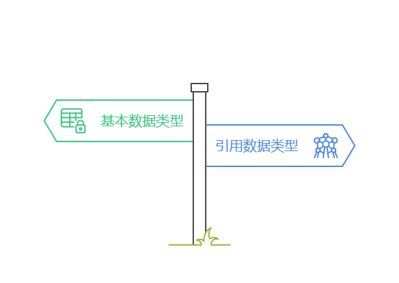

> [!IMPORTANT]
>
> 本文只会讲解基本数据类型，对于引用数据类型，后文会一一讲解。


# 第一章：Java 中的数据类型

## 1.1 概述

* 在 Java 中，数据类型分为两大类：`基本数据类型`和`引用数据类型`，如下所示：



* 其中，`基本数据类型`有 `4` 类 `8` 种：整型（byte、short、int、long）、浮点型（float、double）、字符型（char）和布尔型（boolean）。
* 其中，`引用数据类型`有 `5` 种：类、数组、接口、枚举、注解。

## 1.2 基本数据类型

* Java 中的`基本数据类型`是`四类八种`，如下所示：


# 第二章：整数类型（⭐）

## 2.1 概述

* `整数类型`可以简称为`整型`，就是用来存储整数值的，如：12、20、50 等。
* Java 中的`整数类型`，如下所示：

| 数据类型    | 关键字  | 内存占用（字节） | 取值范围          |
| ----------- | ------- | ---------------- | ----------------- |
| byte        | `byte`  | 1                | -128 到 127       |
| short       | `short` | 2                | -32,768 到 32,767 |
| int（默认） | `int`   | 4                | -2³¹ 到 2³¹ - 1   |
| long        | `long`  | 8                | -2⁶³ 到 2⁶³ - 1   |

* Java 中的整数类型的应用场景，如下所示：

| 数据类型    | 应用场景                                                     |
| ----------- | ------------------------------------------------------------ |
| byte        | 适用于节省内存的场景，适合小范围的整数值。                   |
| short       | 适合一些需要比 byte 更大范围的整数，但仍然需要节省内存的情况。 |
| int（默认） | 最常用的整数类型，适用于大多数需要存储整数的场景。           |
| long        | 适用于需要存储非常大的整数值的场景。                         |

> [!CAUTION]
>
> * ① 默认情况下，`整数常量`被视为 `int` 类型，如果超出了 `int` 类型，就需要使用 `long` 类型。
> * ② `long` 类型的常量通常需要加 `L` 后缀。

## 2.2 应用示例

* 示例：

```java
package com.github;

public class IntDemo {
    public static void main(String[] args){
        // byte
        byte b = 127;
        System.out.println("byte: " + b);
        // short
        short s = 32767;
        System.out.println("short: " + s);
        // int
        int i = 2147483647;
        System.out.println("int: " + i);
        // long
        long l = 9223372036854775807L;
        System.out.println("long: " + l);
    }
}
```

## 2.3 整数类型的取值范围

* 对于`基本数据类型`中的`整数类型`，Java 提供了对应的`包装类`，如下所示：

| 基本数据类型 | 包装类型（引用数据类型） |
| ------------ | ------------------------ |
| byte         | Byte                     |
| short        | Short                    |
| int          | Integer                  |
| long         | Long                     |

* 并在对应的`包装类`中提供了获取`最大值`和`最小值`的方法，如下所示：

::: code-group

```java [Byte.java]
public final class Byte extends Number 
    	implements Comparable<Byte>, Constable {
    // 获取最小值
    public static final byte MIN_VALUE = -128;
    // 获取最大值
	public static final byte MAX_VALUE = 127;
    // 其余略
    ...
}    
```

```java [Short.java]
public final class Short extends Number 
    	implements Comparable<Short>, Constable {
    // 获取最小值
    public static final short MIN_VALUE = -32768;
    // 获取最大值
	public static final short MAX_VALUE = 32767;
    // 其余略
    ...
}    
```
```java [Integer.java]
public final class Integer extends Number
        implements Comparable<Integer>, Constable, ConstantDesc {
    // 获取最小值
    public static final int MIN_VALUE = 0x80000000;
    // 获取最大值
	public static final int MAX_VALUE = 0x7fffffff;
    // 其余略
    ...
}    
```
```java [Long.java]
public final class Long extends Number
        implements Comparable<Long>, Constable, ConstantDesc {
    // 获取最小值
    public static final long MIN_VALUE = 0x8000000000000000L;
    // 获取最大值
	public static final long MAX_VALUE = 0x7fffffffffffffffL;
    // 其余略
    ...
}    
```

:::


* 示例：

```java
package com.github;

public class IntDemo2 {
    public static void main(String[] args) {

        byte byteMin = Byte.MIN_VALUE;
        byte byteMax = Byte.MAX_VALUE;
        // byte: [-128 , 127]
        System.out.println("byte: [" + byteMin + " , " + byteMax + "]");

        short shortMin = Short.MIN_VALUE;
        short shortMax = Short.MAX_VALUE;
        // short: [-32768 , 32767]
        System.out.println("short: [" + shortMin + " , " + shortMax + "]");

        int intMin = Integer.MIN_VALUE;
        int intMax = Integer.MAX_VALUE;
        // int: [-2147483648 , 2147483647]
        System.out.println("int: [" + intMin + " , " + intMax + "]");

        long longMin = Long.MIN_VALUE;
        long longMax = Long.MAX_VALUE;
        // long: [-9223372036854775808 , 9223372036854775807]
        System.out.println("long: [" + longMin + " , " + longMax + "]");
    }
}
```


# 第三章：数值溢出（⭐）

## 3.1 概述

- 在生活中，如果一个容器的容量是固定的，我们不停的向其中注入水，那么当容器中充满水之后，再继续注入，水就会从杯子中溢出来，如下所示：


* 在程序中也是一样的，各种整数类型在内存中占用的存储单元是不同的，如：short 在内存中占用 2 个字节的存储单元，int 在内存中占用 4 个字节的存储单元。这也就意味着，各种整数类型只能存储有限的数值，当数值过大或多小的时候，超出的部分就会被直接截掉，那么数值就不能被正确的存储，我们就将这种现象就称为`溢出`（overflow）。

> [!NOTE]
>
> - 如果这个数目前是`最大值`，再进行`加法`计算，数据就会超过该类型能够表示的最大值，叫做`上溢出`（如果最大值 + 1 会“绕回”到最小值）。
> - 如果这个数目前是`最小值`，再进行`减法`计算，数据就会超过该类型能够表示的最小值， 叫做`下溢出`（如果最小值 - 1 会“绕回”到最大值）。

> [!IMPORTANT]
>
> - ① 在 C 语言中，程序产生数值溢出的时候，并不会引发错误而使程序自动停止，这是因为计算机底层是采用二进制补码的运算规则进行处理的（很多编程语言也是这样处理的，如：Java 等）。
> - ② 但是，这可能会导致不可预料的后果，如：1996 年的亚利安 5 号运载火箭爆炸、2004 年的 Comair 航空公司航班停飞事故。
> - ③ 在实际开发中，编程时要特别注意，以避免数值溢出问题，特别是在涉及大数或小数的运算（特指整数）。

## 3.2 有符号整数的取值范围

- 在 Java 语言中，`有符号数`（signed 类型）在计算机底层是以`补码`的形式存储的（计算的时候，也是以补码的形式进行计算的，并且符号位参与计算）；但是，在读取的时候，需要采用`逆向`的转换，即：将补码转换为原码。

> [!IMPORTANT]
>
> 在 Java  语言中，有符号整数，最高位是符号位，用于表示正负数。

* 以 `byte` 类型为例，它的取值范围，如下所示：

| 补码          | 反码      | 原码      | 值       |
| :------------ | :-------- | :-------- | :------- |
| 1111 1111     | 1111 1110 | 1000 0001 | -1       |
| 1111 1110     | 1111 1101 | 1000 0010 | -2       |
| 1111 1101     | 1111 1100 | 1000 0011 | -3       |
| ...           | ...       | ...       | ...      |
| 1000 0011     | 1000 0010 | 1111 1101 | -125     |
| 1000 0010     | 1000 0001 | 1111 1110 | -126     |
| 1000 0001     | 1000 0000 | 1111 1111 | -127     |
| **1000 0000** | **---**   | **---**   | **-128** |
| 0111 1111     | 0111 1111 | 0111 1111 | 127      |
| 0111 1110     | 0111 1110 | 0111 1110 | 126      |
| 0111 1101     | 0111 1101 | 0111 1101 | 125      |
| ...           | ...       | ...       | ...      |
| 0000 0010     | 0000 0010 | 0000 0010 | 2        |
| 0000 0001     | 0000 0001 | 0000 0001 | 1        |
| 0000 0000     | 0000 0000 | 0000 0000 | 0        |

- 从上面的列表中，我们可以得知，`byte` 类型的取值范围是：`[-2⁸, 2⁸ - 1]`，即：`[-128, 127]`。
- 对于 `-128` 而言，它的补码是 `1000 0000`，是无法按照传统的补码表示法来计算原码的，因为在补码转换到反码的时候需要 `-1` ，而 `1000 0000 - 1`需要向高位借 `1` ，而最高位是符号位是不能借的，这就非常矛盾。

> [!IMPORTANT]
>
> 计算机规定，`1000 0000` 这个特殊的补码就表示 `-128` 。

- 但是，为什么偏偏是 `-128` ，而不是其它数字？是因为 `-128`使得 `byte` 类型的取值范围保持连贯，中间没有“空隙”。如果我们按照传统的方式来计算：

  - ① 原码：在原码表示法中，-128 的数据位是 `1000 0000`，但是 `byte`的数据位只有 `7` 位，那么最高位 `1` 就变为了符号位，剩下的数据位就是 `000 0000`；所以，`-128` 的原码就是 `1000 0000`。
  - ② 反码：对数据位取反，-128 的反码就是：`1111 1111` 。
  - ③ 补码：在反码的基础上 `+1`，得到 `1000 0000`，是因为符号位被覆盖了，补码最终依然是 `1000 0000`。

> [!NOTE]
>
> `-128` 从原码转换到补码的过程中，符号位被 `1` 覆盖了两次，而负数的符号位本来就是 `1`，被 `1` 覆盖多少次也不会影响到数字的符号。

- 虽然从 `1000 0000` 这个补码推算不出 `-128`，但是从 `-128` 却能推算出 `1000 0000` 这个补码，即：有符号数在存储之前先要转换为补码。

> [!IMPORTANT]
>
> - ① 通过这种方式，`-128` 就成为了补码的最小值 `1000 0000`，而这个值不会与其他任何正数或负数的补码冲突。
>   - 如果采用`原码`存储，那么将会出现 `+0` 和 `-0` 的情况，即：`0000 0000`、`1000 0000`，这样在取值范围内，就存在两个相同的值，多此一举。
>   - 如果采用`原码`存储，最大值不变是 `127` ，但是最小值只能存储到 `-127` ，不能存储到 `-128`，因为 `-128` 的原码是 `1000 0000`，和 `-0` 的原码冲突。
> - ② 这就是补码系统的强大之处，它能让整数的范围连贯，并且实现了加法和减法的统一处理。
> - ③ 按照上述的方法，我们可以很容易得计算出：
>   - `char`（1 个字节） 的取值范围是：`[-2⁸, 2⁸ - 1]`。
>   - `short`（2 个字节）的取值范围是：`[-2¹⁶, 2¹⁶ - 1]`。
>   - `int`（4 个字节）的取值范围是：`[-2³², 2³² - 1]`。
>   - `long`（8 个字节）的取值范围是：`[-2⁶⁴, 2⁶⁴ - 1]`。

## 3.3 数值溢出

- 对于`有符号`的数值溢出：
  - 当数据到达最大值的时候，再 `+1` 就会回到有符号数的最小值。
  - 当数据达到最小值的时候，再 `-1` 就会回到有符号数的最大值。
- `有符号`整数`数值上溢出`的原理，如下所示：


- `有符号`整数`数值下溢出`的原理，如下所示：


* 示例：

```java
package com.github;

public class IntDemo3 {
    public static void main(String[] args) {

        int intMin = Integer.MIN_VALUE;
        int intMax = Integer.MAX_VALUE;
        // int: [-2147483648 , 2147483647]
        System.out.println("int: [" + intMin + " , " + intMax + "]");

        // 上溢出
        intMin = intMax + 1;
        // intMin = -2147483648
        System.out.println("intMin = " + intMin);

        // 下溢出
        intMax = intMin - 1;
        // intMax = 2147483647
        System.out.println("intMax = " + intMax);
    }
}
```

## 3.4 如何解决数值溢出问题？

### 3.4.1 使用 BigInteger 或 BigDecimal（推荐）

* Java 提供了 `BigInteger` 和 `BigDecimal` 类来处理超出 `int` 和 `long` 范围的整数或浮动数字。

::: code-group

```java [BigInteger.java]
public class BigInteger extends Number 
    	implements Comparable<BigInteger> {
    // 加法
    public BigInteger add(BigInteger val) {...}
    // 减法
    public BigInteger subtract(BigInteger val) {...}
    // 乘法
    public BigInteger multiply(BigInteger val)  {...}  
    // 其余略
    ...    
}    
```

```java [BigDecimal.java]
public class BigDecimal extends Number 
    	implements Comparable<BigDecimal> {
    // 加法
    public BigDecimal add(BigDecimal augend) {...}
    // 减法
    public BigDecimal subtract(BigDecimal subtrahend) {...}
    // 乘法
    public BigDecimal multiply(BigDecimal multiplicand) {...}    
    // 其余略
    ...    
}    
```

:::

* 这些类支持任意精度的数值运算，可以防止溢出。


* 示例：

```java
package com.github;

import java.math.BigInteger;

public class IntDemo4 {
    public static void main(String[] args) {

        BigInteger intMin = new BigInteger(String.valueOf(Integer.MIN_VALUE));
        BigInteger intMax = new BigInteger(String.valueOf(Integer.MAX_VALUE));
        // int: [-2147483648 , 2147483647]
        System.out.println("int: [" + intMin + " , " + intMax + "]");

        BigInteger one = new BigInteger(String.valueOf(1));

        // 处理上溢出
        BigInteger newValue = intMax.add(one);
        // newValue = 2147483648
        System.out.println("newValue = " + newValue);

        // 处理上溢出
        newValue = intMin.subtract(one);
        // newValue = -2147483649
        System.out.println("newValue = " + newValue);
    }
}
```

### 3.4.2 使用 Math 类提供的方法来检查溢出

* 在某些情况下，我们不希望将基本数据类型（如：int 等）转换为 `BigInteger` 来进行处理，此时就可以使用 Java 提供的 `Math` 类中的 `addExact()`、`subtractExact()` 或 `multiplyExact()` 等静态方法，如下所示：

```java [Math.java]
public final class Math { 
    // 加法
	public static long addExact(long x, long y) {...}
    // 减法
    public static long subtractExact(long x, long y) {...}
    // 乘法
    public static long multiplyExact(long x, int y)  
    ...
}
```

* 在使用上述方法的时候，如果发生溢出就会抛出 `ArithmeticException` 异常。


* 示例：

```java
package com.github;

public class IntDemo5 {
    public static void main(String[] args) {

        int max = Integer.MAX_VALUE;
        int one = 1;

        try {
            int result = Math.addExact(max, one);
            System.out.println("result = " + result);
        } catch (ArithmeticException e) {
            System.out.println("上溢出：" + e.getMessage());
        }
    }
}
```


# 第四章：浮点类型（⭐）

## 4.1 概述

- 在生活中，我们除了使用`整数`，如：18、25 之外，还会使用到`小数`，如：3.1415926、6.18 等，`小数`在计算机中也被称为`浮点数`（和底层存储有关）。
- `整数`在计算机底层的存储被称为`定点存储`，如下所示：


- `小数`在计算机底层的存储被称为`浮点存储`，如下所示：


> [!NOTE]
>
> - ① 计算机底层就是采取类似科学计数法的形式来存储小数的，而科学计数法的表现就是这样的，如：3.12 * 10^-2 ；其中，10 是基数，-2 是指数，而 3.12 是尾数。
> - ② 因为尾数区的内存空间的宽度不同，导致了小数的精度也不相同，所以小数在计算机中也称为浮点数。

* Java 中的`浮点类型`，如下所示：

| 数据类型       | 关键字   | 内存占用（字节） | 取值范围                                  |
| -------------- | -------- | ---------------- | ----------------------------------------- |
| float          | `float`  | 4                | ±1.4E-45 到 ±3.4E38（约 7 位有效数字）    |
| double（默认） | `double` | 8                | ±4.9E-324 到 ±1.8E308（约 15 位有效数字） |

> [!CAUTION]
>
> * ① Java 中的浮点类型的字面量值默认是 double 类型，如：`double num = 3.14;`，如果希望是 float 类型，可以在字面量后面添加 L 后缀，如：`float num = 3.14f;`.
> * ② 几乎所有的编程语言对于浮点类型都采用的是 IE754 标准，该标准对于浮点类型的处理并不是很精确。
> * ③ 在实际开发中，对于需要高精度数值运算的场景，建议使用 `BigDecimal` 类。

## 4.2 应用示例

* 示例：

```java
package com.github;

public class FloatDemo1 {
    public static void main(String[] args) {

        float f1 = 3.14f;
        System.out.println("f1 = " + f1);

        double d1 = 3.14;
        System.out.println("d1 = " + d1);
    }
}

```

## 4.3 浮点类型的取值范围

* 对于`基本数据类型`中的`浮点类型`，Java 提供了对应的`包装类`，如下所示：

| 基本数据类型 | 包装类型（引用数据类型） |
| ------------ | ------------------------ |
| float        | Float                    |
| double       | Double                   |

* 并在对应的`包装类`中提供了获取`最大值`和`最小值`的方法，如下所示：

::: code-group

```java [Float.java]
public final class Float extends Number
        implements Comparable<Float>, Constable, ConstantDesc {
    // 获取最小值
    public static final float MIN_VALUE = 0x0.000002P-126f;
    // 获取最大值
	public static final float MAX_VALUE = 0x1.fffffeP+127f;
    // 其余略
    ...
}    
```

```java [Double.java]
public final class Double extends Number
        implements Comparable<Double>, Constable, ConstantDesc {
    // 获取最小值
    public static final double MIN_VALUE = 0x0.0000000000001P-1022;
    // 获取最大值
	public static final double MAX_VALUE = 0x1.fffffffffffffP+1023;
    // 其余略
    ...
}    
```

:::


* 示例：

```java
package com.github;

public class FloatDemo2 {
    public static void main(String[] args) {

        float minValue = Float.MIN_VALUE;
        float maxValue = Float.MAX_VALUE;
        // float : [1.4E-45,3.4028235E38]
        System.out.println("float : [" + minValue + "," + maxValue + "]");

        double minValue2 = Double.MIN_VALUE;
        double maxValue2 = Double.MAX_VALUE;
        // double : [4.9E-324,1.7976931348623157E308]
        System.out.println("double : [" + minValue2 + "," + maxValue2 + "]");
    }
}
```


# 第五章：字符类型（⭐）

## 5.1 概述

- 在生活中，我们会经常说：今天天气真 `好`，我的性别是 `女`，我今年 `10` 岁等。
- 像这类数据，在 java 语言中就可以用`字符类型`（char）来表示。
- `字符类型`表示`单`个字符，使用单引号（`''`）括起来，如：`'1'`、`'A'`、`'&'`。

> [!NOTE]
>
> * ① Java 是支持 Unicode 编码集的，即：Java 中的字符类型也可以表示汉字，如：`'我'` 、`'你'` 等。
> * ② Unicode 是什么，将在后文讲解，此处暂且不表！！！

## 5.2 应用示例

* 示例：

```java
package com.github;

public class CharDemo1 {
    public static void main(String[] args) {

        char a = 'A';
        System.out.println("a = " + a); // a = A

        char b = '你';
        System.out.println("b = " + b); // b = 你
    }
}
```

## 5.3 字符常量的表示形式

* ① 一个字符，如：`'A'`、`'我'`。
* ② 转义字符：将一个字符通过在前面添加 `\` 符号，让它从自己原本的含义，转变为新的含义。

| 转义字符 | 描述            |
| -------- | --------------- |
| `\n`     | 换行            |
| `\r`     | 回车            |
| `\t`     | tab键           |
| `\\`     | `\`             |
| `\"`     | `"`             |
| `\'`     | `'`             |
| `\b`     | 删除键backspace |

- ③ `\u` 字符的 Unicode 编码值的十六进制，如：`'\u8bb8'` 代表了许。
- ④ 直接给 char 类型变量赋值十进制的 0~65536 之间的 Unicode 编码值。例如：`'a'` 的编码值是 97 。


* 示例：

::: code-group

```java [CharDemo.java]
package com.github;

public class CharDemo {
    public static void main(String[] args) {

        char a = 'A';
        // a = A
        System.out.println("a = " + a);

        char b = '\u8bb8';
        // b = 你
        System.out.println("b = " + b);

        char c = '\n';
        System.out.println("c = " + c);

        char d = 97;
        System.out.println("d = " + d);
    }
}
```

```txt [输出结果]
a = A
b = 许
c = 

d = a
```

:::

# 第六章：布尔类型（⭐）

## 6.1 概述

* 布尔值用于表示 true（真）、false（假）两种状态，通常用于逻辑运算和条件判断。

## 6.2 应用示例

* 示例：

```java
package com.github;

public class BooleanDemo {
    public static void main(String[] args) {

        boolean flag = true;
        System.out.println("flag = " + flag); // flag = true
        flag = false;
        System.out.println("flag = " + flag); // flag = false
    }
}
```


# 第七章：数据类型转换（⭐）

## 7.1 概述

- 在 Java 语言编程中，经常需要对不同类型的数据进行运算，运算前需要先转换为同一类型，再运算。
- 为了解决数据类型不一致的问题，需要对数据的类型进行转换。

## 7.2 什么时候发生数据类型转换？

* ① 等号左右两边数据类型不一致。
* ② 不同数据类型的数据做运算。

## 7.3 自动类型转换（隐式转换）

### 7.3.1 赋值时的自动类型转换

* 在赋值运算中，如果取值范围小的数据类型赋值给取值范围大的数据类型，就会发生自动类型转换（小 --> 大）。


* 转换方向：


* 示例：

```java
package com.github;

public class ConvertDemo {

    public static void main(String[] args) {

        /*
         * 等号右边的 100 是整数，默认是 int 类型。
         * 等号左边是 long 类型的变量
         *
         * 将取值范围小的数据类型赋值给取值范围大的数据类型,发生了自动类型转换
         */
        long num = 100;

        System.out.println("num = " + num); // num = 100
    }
}
```


* 示例：

```java
package com.github;

public class ConvertDemo2 {

    public static void main(String[] args) {

        /*
         * 等号右边的 'A' 是字符，默认是 char 类型。
         * 等号左边是 long 类型的变量
         *
         * 将取值范围小的数据类型赋值给取值范围大的数据类型,发生了自动类型转换
         */
        char c = 'A';
        long num = c;

        System.out.println("num = " + num); // num = 65
    }
}
```

### 7.3.2 运算时的自动类型转换

* 在运算过程中，取值范围小的数据类型和取值范围大的数据类型一起做运算，运算前会发生自动类型转换（小 --> 大），然后再运算。


> [!NOTE]
>
> 自动类型转换不会出现精度损失，但是可能会出现[数据溢出](./#第三章-数值溢出-⭐)！！！


* 示例：

```java
package com.github;

public class ConvertDemo2 {

    public static void main(String[] args) {

        int i = 100;
        double d = 3.4;
        // double = int（double） + double
        double result = i + d;
        System.out.println("result = " + result); // result = 103.4
    }
}
```

### 7.3.3 自动类型转换的底层细节

#### 7.3.3.1 正数

* 假设自动类型转换的代码，如下所示：

```java
byte b = 10;
int num = b;
```

* 其在计算机底层就是这样的，如下所示：


#### 7.3.3.2 负数

* 假设自动类型转换的代码，如下所示：

```java
byte b = -10;
int num = b;
```

* 其在计算机底层就是这样的，如下所示：


## 7.4 强制类型转换

### 7.4.1 概述

* 在赋值运算中，如果取值范围大的数据类型赋值给取值范围小的数据类型，就需要进行强制类型转换（大 --> 小）。


* 语法：

```java
 取值范围小的数据类型 变量名 = (取值范围小的数据类型)取值范围大的数据类型的值;
```

> [!NOTE]
>
> 强制类型转换可能会出现数据精度损失或数据溢出！！！


* 示例：

```java
package com.github;

public class ConvertDemo2 {

    public static void main(String[] args) {

        // 强制类型转换，损失精度
        int i = (int) 3.14; 
        // i = 3
        System.out.println("i = " + i);
    }
}
```


* 示例：

```java
package com.github;

public class ConvertDemo2 {

    public static void main(String[] args) {

        // 强制类型转换，数据溢出
        int i = 200;
        byte b = (byte) i;
        System.out.println("b = " + b); // 溢出 -56 
    }
}
```

### 7.4.2 强制类型转换的底层细节

#### 7.4.2.1 正数（在被强转类型范围内）

* 假设强制类型转换的代码，如下所示：

```java
int b = 10;
byte num = (byte)b; // 10
```

* 其在计算机底层就是这样的，如下所示：


#### 7.4.2.2 负数（在被强转类型范围内）

* 假设强制类型转换的代码，如下所示：

```java
int b = -10;
byte num = (byte)b; // -10
```

* 其在计算机底层就是这样的，如下所示：


#### 7.4.2.3 不在被强转类型范围内

* 假设强制类型转换的代码，如下所示：

```java
int b = 200;
byte num = (byte)b; // -56 
```

* 其在计算机底层就是这样的，如下所示：


## 7.5 数据类型转换的注意事项

* ① 对于 byte、short ，如果等号右边是整数常量，不超出 byte 和 short 的范围，不需要我们自己强转，JVM 会在底层帮助我们自动转换（自动类型转换）。

```java
byte b = 1;
short s = 128;
```

* ② byte、short 、char 等如果参与计算，会自动提升为 int 类型。

```java
char c1 = '0';
char c2 = 'A';
int num = c1 + c2;
```


# 第八章：字符串（⭐）

## 8.1 概述

- 但是，在生活中，也许会听到：`你是好人，只是现阶段，我想学习`、`好的啊，我们在一起`等。
- 像这类数据，在 Java 语言中就可以用`字符串`（String）来表示。

> [!CAUTION]
>
> * ① Java 中的 String 不是基本数据类型，而是引用数据类型！！！
> * ② Java 中的 String 只是在使用方式和基本数据类型类似，但是其是引用数据类型！！！

- `字符串类型`表示`多`个字符的集合，使用双引号（`""`）括起来，如：`"1"`、`"我们"`。

## 8.2 应用示例

* 示例：

```java
package com.github;

public class StringDemo1 {
    public static void main(String[] args) {

        String str = "hello";

        System.out.println("str = " + str); // str = hello
    }
}
```

## 8.3 字符串类型的注意事项

* ① 任意数据类型的数据和 String 类型进行`+`运算的时候，结果一定是 String 类型。

```java 
package com.github;

public class StringDemo2 {
    public static void main(String[] args) {

        String str = "hello";

        String result = 1 + str; // [!code highlight]
        System.out.println("result = " + result); // result = 1hello

        result = str + 1; // [!code highlight]
        System.out.println("result = " + result); // result = hello1
    }
}
```

* ② String 类型是不能强制类型转换为其他类型的。

```java
package com.github;

public class StringDemo1 {
    public static void main(String[] args) {

        String str = "123";

        // ❌ 错误：不可转换的类型；无法将 'java.lang.String' 转换为 'int'
        int num = (int)str; // [!code error]

        System.out.println("num = " + num);
    }
}
```

```java
package com.github;

public class StringDemo1 {
    public static void main(String[] args) {

        String str = "123";

        // ✅ 以下代码是正确的
        int num = Integer.parseInt(str); // [!code highlight]

        System.out.println("num = " + num);
    }
}
```


# 第九章：作业

## 9.1 单选题

* int 和 float 的区别是什么？

- [ ] A：int 和 float 没有什么区别。
- [ ] B：int 是变量，而 float 是方法。
- [x] C：int 是用来存储整数变量的数据类型，而 float 是用来存储小数变量的数据类型。
- [ ] D：int 类型的数据需要使用双引号（""）括起来。

## 9.2 代码题

### 9.2.1 题目 1

* 需求：定义字符串类型的变量 name、字符串类型的变量 birthday、整数类型的变量 age  以及 float 类型的变量 money 。


* 示例：

```java
package com.github.test;

public class VariableTest3 {
    public static void main(String[] args) {

        // 字符串类型的变量 name
        String name = "许大仙";
        System.out.println("name = " + name);

        // 字符串类型的变量 birthday
        String birthday = "1999-01-01";
        System.out.println("birthday = " + birthday);

        // 整数类型的变量 age
        int age = 18;
        System.out.println("age = " + age);

        // 小数类型的变量 money
        float money = 3.14F;
        System.out.println("money = " + money);

    }
}
```

### 9.2.2 题目 2

* 需求：使用变量描述一个人的信息，如：姓名、年龄、性别、身高、体重等。


* 示例：

```java
package com.github.day02;

/**
 * 使用变量表示一个人的信息，如：姓名、年龄、性别、身高、体重等。
 */
public class Exe1 {
    public static void main(String[] args) {

        // 姓名
        String name = "张三";

        // 年龄
        int age = 18;

        // 性别
        char gender = '男';

        // 身高
        double height = 1.75;

        // 体重
        double weight = 80.0;

        System.out.println("姓名：" + name); // 姓名：张三
        System.out.println("年龄：" + age); // 年龄：18
        System.out.println("性别：" + gender); // 性别：男
        System.out.println("身高：" + height); // 身高：1.75
        System.out.println("体重：" + weight); // 体重：80.0
    }
}
```

