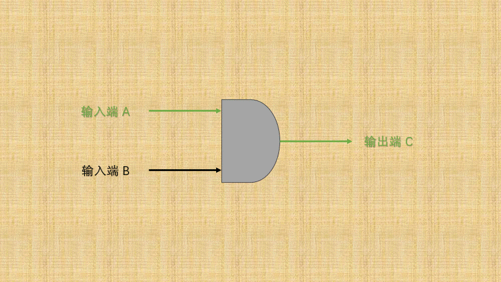

# 第一章：前言

## 1.1 运算符、表达式和操作数

* `运算符`就是对`常量`或`变量`进行`操作`的`符号`，如下所示：


* `表达式`是由`变量`、`常量`和`运算符`组成的序列，表达式一定具有`值`，如下所示：

> [!NOTE]
>
> * ① 表达式可以非常简单，如：一个单独的常量或变量。
> * ② 表达式可以非常复杂，如：包含多个运算符或函数调用的结合。
> * ③ 表达式的作用就是计算值，如：赋值、函数调用等。
> * ④ 判断表达式的最简单方法：拿一个变量去接收表达式（值），看是否成立？（因为表达式的作用就是计算值）
>   * 如：`int num = 10;` 中的 `10` 就是`表达式`。
>   * 如：`int num = a + b;` 中的 `a+b` 就是`表达式`。
>   * 如：`int num = sum(1,2);` 中的 `sum(1,2)` 就是`表达式`。
>   * 如：`int num = sum(a,b);` 中的 `sum(a,b)` 就是`表达式`。
>   * ...


* `操作数`指的是`参与运算`的`值`或者`对象`，如下所示：


* `语句`是代码中一个完整的、可以执行的`步骤`。

> [!NOTE]
>
> * ① 语句要么以 `;` 分号简单结尾，即：简单语句；要么以 `{}` 代码块结尾，即：复合语句。
> * ② 语句的作用复杂多样，常用于构建程序逻辑，如：循环语句、条件判断语句、跳转语句。
> * ③ 很多人也会将`语句`称为`结构`，如：循环结构、分支结构。

* 在 Java 语言中，语句和表达式没有明显的绝对界限，它们之间的关系是：
  * ① 表达式可以构成语句：许多语句都是由表达式构成的，例如：赋值语句 `a = 5;` 中，`a = 5` 是表达式，整个 `a = 5;` 则是语句。
  * ② 语句可以包含表达式：流程控制语句，如： `if`、`while` 等，通常在判断条件中包含表达式，条件表达式会返回一个值（真或假），决定是否执行某段代码。

> [!NOTE]
>
> * ① 区分`语句`和`表达式`最明显的领域，应该属于前端 JavaScript 框架中的 React。
> * ② 在 React 中，其明确要求`JSX`必须是`表达式`，而不能是`语句`。
>
> ::: details 点我查看
>
> ```jsx {14}
> import React from 'react'
> 
> function Greeting(props) {
>     let element;
>     // 这是一个语句块，使用 if 语句来决定渲染的内容
>     if (props.isLoggedIn) {
>       element = <h1>Welcome back!</h1>;
>     } else {
>       element = <h1>Please sign up.</h1>;
>     }
>     // JSX 是表达式，最终返回由语句决定的 JSX 结构
>     return (
>       <div> 
>           { element } 
>       </div>
>     );
> }
> 
> export default Greeting;
> ```
> :::

## 1.2 运算符的分类

* 在`表达式`中，最重要、最核心的就是`连接`表达式中`常量`和`变量`的`运算符`。
* 在 Java 语言中，根据`操作数`的`个数`，可以将运算符分为：

| 运算符类别               | 描述                          | 范例            |
| ------------------------ | ----------------------------- | --------------- |
| 一元运算符（一目运算符） | 只需要` 1` 个操作数的运算符。 | `+1`            |
| 二元运算符（二目运算符） | 只需要` 2` 个操作数的运算符。 | `a + b`         |
| 三元运算符（三目运算符） | 只需要` 3` 个操作数的运算符。 | `a > b ? a : b` |

* 在 Java 语言中，根据`功能`，可以将运算符分为：

| 运算符类别               | 描述                                                       | 常见的运算符                                                 |
| ------------------------ | ---------------------------------------------------------- | ------------------------------------------------------------ |
| 算术运算符               | 用于进行基本的数学运算的运算符。                           | `+`、`-`、`*`、`/`、`%`、`++`、`--`                          |
| 关系运算符（比较运算符） | 用于比较两个值之间的大小或相等性的运算符。                 | `==`、`!=`、`<`、`>`、`<=`、`>=`                             |
| 逻辑运算符               | 用于执行布尔逻辑操作的运算符，通常用于分支结构和循环结构。 | `&`、`\|`、`&&`、`\|\|`、`!`                                 |
| 赋值运算符               | 用于给变量赋值，或通过某种操作更新变量的值的运算符。       | `=`、`+=`、`-=`、`*=`、`/=`、`%=`、`<<=`、`>>=`、`&=`、`^=`、`\|=` |
| 位运算                   | 用于对整数的二进制位进行操作的运算符。                     | `&`、`\|`、`^`、`~`、`<<`、`>>`、`>>>`                       |
| 三元运算符               | 简化条件判断的运算符，用于根据条件选择两个值中的一个。     | `?:`                                                         |

> [!NOTE]
>
> 掌握一个运算符，需要关注以下几个方面：
>
> * ① 运算符的含义。
> * ② 运算符操作数的个数。
> * ③ 运算符所组成的表达式。
> * ④ 运算符有无副作用，即：运算后是否会修改操作数的值。

## 1.3 优先级和结合性（⭐）

### 1.3.1 概述

* 在数学中，如果一个表达式是 `a + b * c` ，我们知道其运算规则就是：先算`乘除`再算`加减`。
* Java 语言中也是一样，先算乘法再算加减，即：Java  语言中`乘除`的运算符比`加减`的运算符要`高`。

### 1.3.2 优先级和结合性

* `优先级`和`结合性`的定义，如下所示：
  * ① 所谓的`优先级`：就是当多个运算符出现在同一个表达式中时，先执行哪个运算符。
  * ② 所谓的`结合性`：就是当多个相同优先级的运算符出现在同一个表达式中的时候，是从左到右运算，还是从右到左运算。
    * `左结合性`：具有`相同优先级`的运算符将`从左到右`（➡️）进行计算。
    * `右结合性`：具有`相同优先级`的运算符将`从右到左`（⬅️）进行计算。

> [!NOTE]
>
> `优先级`和`结合性`，到底怎么看？
>
> * ① 先看`优先级`。
> * ② 如果`优先级`相同，再看`结合性`。

* Java 语言中运算符和结合性的列表，如下所示：


> [!CAUTION]
>
> * ① 不要过多的依赖运算符的优先级来控制表达式的执行顺序，这样可读性太差，尽量`使用小括号来控制`表达式的执行顺序。
> * ② 不要把一个表达式写得过于复杂，如果一个表达式过于复杂，则把它`分成几步`来完成。
> * ③ 运算符优先级不用刻意地去记忆，总体上：一元运算符 > 算术运算符 > 关系运算符 > 逻辑运算符 > 三元运算符 > 赋值运算符 > 逗号运算符。


# 第二章：算术运算符（⭐）

## 2.1 概述

* 算术运算符是对数值类型的变量进行运算的，如下所示：

| 运算符 | 描述         | 操作数个数 | 组成的表达式的值         | 副作用 |
| ------ | ------------ | ---------- | ------------------------ | ------ |
| `+`    | 正号         | 1          | 操作数本身               | ❎      |
| `-`    | 负号         | 1          | 操作数符号取反           | ❎      |
| `+`    | 加号         | 2          | 两个操作数之和           | ❎      |
| `-`    | 减号         | 2          | 两个操作数之差           | ❎      |
| `*`    | 乘号         | 2          | 两个操作数之积           | ❎      |
| `/`    | 除号         | 2          | 两个操作数之商           | ❎      |
| `%`    | 取模（取余） | 2          | 两个操作数相除的余数     | ❎      |
| `++`   | 自增         | 1          | 操作数自增前或自增后的值 | ✅      |
| `--`   | 自减         | 1          | 操作数自减前或自减后的值 | ✅      |

> [!NOTE]
>
> ::: details 点我查看 自增和自减详解
>
> * ① 自增、自减运算符可以写在操作数的前面也可以写在操作数后面，不论前面还是后面，对操作数的副作用是一致的。
>* ② 自增、自减运算符在前在后，对于表达式的值是不同的。 如果运算符在前，表达式的值是操作数自增、自减之后的值；如果运算符在后，表达式的值是操作数自增、自减之前的值。
> * ③ `变量前++`：变量先自增 1 ，然后再运算；`变量后++`：变量先运算，然后再自增 1 。
> * ④ `变量前--`：变量先自减 1 ，然后再运算；`变量后--`：变量先运算，然后再自减 1 。
> * ⑤ 对于 `i++` 或 `i--` ，各种编程语言的用法和支持是不同的，例如：C/C++、Java 等完全支持，Python 压根一点都不支持，Go 语言虽然支持 `i++` 或 `i--` ，却只支持这些操作符作为独立的语句，并且不能嵌入在其它的表达式中。
> 
> :::

## 2.2 应用示例

* 示例：正号和负号

```java
package com.github;

public class ArithmeticDemo1 {
    public static void main(String[] args) {
        int x = 12;
        int x1 = -x, x2 = +x;

        int y = -67;
        int y1 = -y, y2 = +y;

        // 输出结果
        System.out.println("x1=" + x1 + "，x2=" + x2); // x1=-12，x2=12
        System.out.println("y1=" + y1 + "，y2=" + y2); // y1=67，y2=-67
    }
}
```


* 示例：加、减、乘、除、取模

```java
package com.github;

public class ArithmeticDemo2 {
    public static void main(String[] args) {
        int a = 5;
        int b = 2;

        // 输出加法结果
        System.out.println(a + " + " + b + " = " + (a + b)); // 5 + 2 = 7
        // 输出减法结果
        System.out.println(a + " - " + b + " = " + (a - b)); // 5 - 2 = 3
        // 输出乘法结果
        System.out.println(a + " × " + b + " = " + (a * b)); // 5 × 2 = 10
        // 输出除法结果（注意：在 Java 中，整数相除会得到整数结果）
        System.out.println(a + " / " + b + " = " + (a / b)); // 5 / 2 = 2
        // 输出取余（模）结果
        System.out.println(a + " % " + b + " = " + (a % b)); // 5 % 2 = 1
    }
}
```


* 示例：取模

```java
package com.github;

/**
 * 取模（运算结果的符号与被模数，也就是第一个操作数相同）
 */
public class ArithmeticDemo3 {
    public static void main(String[] args) {
        int res1 = 10 % 3;
        System.out.println("10 % 3 = " + res1); // 10 % 3 = 1

        int res2 = -10 % 3;
        System.out.println("-10 % 3 = " + res2); // -10 % 3 = -1

        int res3 = 10 % -3;
        System.out.println("10 % -3 = " + res3); // 10 % -3 = 1

        int res4 = -10 % -3;
        System.out.println("-10 % -3 = " + res4); // -10 % -3 = -1
    }
}
```


* 示例：自增和自减

```java
package com.github;

public class ArithmeticDemo4 {
    public static void main(String[] args) {
        int i1 = 10, i2 = 20;
        int i = i1++; // 后缀自增
        System.out.println("i = " + i); // i = 10
        System.out.println("i1 = " + i1); // i1 = 11

        i = ++i1; // 前缀自增
        System.out.println("i = " + i); // i = 12
        System.out.println("i1 = " + i1); // i1 = 12

        i = i2--; // 后缀自减
        System.out.println("i = " + i); // i = 20
        System.out.println("i2 = " + i2); // i2 = 19

        i = --i2; // 前缀自减
        System.out.println("i = " + i); // i = 18
        System.out.println("i2 = " + i2); // i2 = 18
    }
}
```


* 示例：

```java
package com.github.study;

/**
 * 随意给出一个整数，打印显示它的个位数，十位数，百位数的值。
 */
public class ArithmeticDemo5 {
    public static void main(String[] args) {
        int num = 153;

        // 提取百位、十位和个位
        int ge = num % 10;
        int shi = num / 10 % 10;
        int bai = num / 100 % 10;

        // 输出结果
        System.out.println("百位为：" + bai);
        System.out.println("十位为：" + shi);
        System.out.println("个位为：" + ge);
    }
}
```


# 第三章：关系运算符（⭐）

## 3.1 概述

* 常见的关系运算符（比较运算符），如下所示：

| 运算符 | 描述     | 操作数个数 | 组成的表达式的值 | 副作用 |
| ------ | -------- | ---------- | ---------------- | ------ |
| `==`   | 相等     | 2          | true 或 false    | ❎      |
| `!=`   | 不相等   | 2          | true 或 false    | ❎      |
| `<`    | 小于     | 2          | true 或 false    | ❎      |
| `>`    | 大于     | 2          | true 或 false    | ❎      |
| `<=`   | 小于等于 | 2          | true 或 false    | ❎      |
| `>=`   | 大于等于 | 2          | true 或 false    | ❎      |

> [!NOTE]
>
> * ① 不要将 `==` 写成 `=`，`==` 是比较运算符，而 `=` 是赋值运算符。
> * ②  `>=` 或 `<=`含义是：只需要满足 `大于或等于`、`小于或等于`其中一个条件，结果就返回真。

## 3.2 应用示例

* 示例：

```java
package com.github;

public class CompareDemo {
    public static void main(String[] args) {
        int a = 8;
        int b = 7;

        // a > b 的结果是：true
        System.out.println("a > b 的结果是：" + (a > b)); 
        // a >= b 的结果是：true
        System.out.println("a >= b 的结果是：" + (a >= b)); 
        // a < b 的结果是：false
        System.out.println("a < b 的结果是：" + (a < b)); 
        // a <= b 的结果是：false
        System.out.println("a <= b 的结果是：" + (a <= b)); 
        // a == b 的结果是：false
        System.out.println("a == b 的结果是：" + (a == b)); 
        // a != b 的结果是：true
        System.out.println("a != b 的结果是：" + (a != b)); 
    }
}
```


# 第四章：逻辑运算符（⭐）

## 4.1 概述

* 常见的逻辑运算符，如下所示：

| 运算符 | 描述             | 操作数个数 | 组成的表达式的值 | 副作用 |
| ------ | ---------------- | ---------- | ---------------- | ------ |
| `&`    | 逻辑与           | 2          | true 或 false    | ❎      |
| `\|`   | 逻辑与           | 2          | true 或 false    | ❎      |
| `&&`   | 逻辑与（短路与） | 2          | true 或 false    | ❎      |
| `\|\|` | 逻辑或（短路或） | 2          | true 或 false    | ❎      |
| `!`    | 逻辑非           | 2          | true 或 false    | ❎      |

* 逻辑运算符提供逻辑判断功能，用于构建更复杂的表达式，如下所示：

| a     | b     | a && b | a \|\| b | !a    |
| ----- | ----- | ------ | -------- | ----- |
| true  | true  | true   | true     | false |
| true  | false | false  | true     | false |
| false | true  | false  | true     | true  |
| false | false | false  | false    | true  |

> [!NOTE]
>
> ::: details 点我查看 逻辑运算符详解
>
> * ① 逻辑运算符的理解：
>   * `&`或`&&` 的理解就是：`两边条件，同时满足`。
>   * `|`或`||`的理解就是：`两边条件，二选一`。
>   * `!` 的理解就是：`条件取反`。
> * ②  短路现象：
>   * 对于 `a && b` 操作来说，当 a 为假(或 0 )时，因为 `a && b` 结果必定为 0，所以不再执行表达式 b。
>   * 对于 `a || b` 操作来说，当 a 为真(或非 0 )时，因为 `a || b` 结果必定为 1，所以不再执行表达式 b。
> 
> :::

## 4.2 应用示例

* 示例：

```java
package com.github;

public class LogicDemo {
    public static void main(String[] args) {
        int a = 10;
        int b = -1;
        if (a > b) {
            System.out.println("a > b");
        } else {
            System.out.println("a <= b");
        }
    }
}
```


* 示例：

```java
package com.github;

public class LogicDemo2 {
    public static void main(String[] args) {
        int i = 0;
        int j = 10;

        // 短路现象：在逻辑与 (&&) 运算符中，左侧条件为 false 时，右侧条件不会被计算
        if (i != 0 && j++ > 0) {
            System.out.println("床前明月光"); // 这行代码不会执行
        } else {
            System.out.println("我叫郭德纲");
        }

        // 输出 j 的值
        System.out.println(j); // 10
    }
}
```


* 示例：

```java
package com.github;

public class LogicDemo3 {
    public static void main(String[] args) {
        int i = 1;
        int j = 10;

        // 短路现象：在逻辑或 (||) 运算符中，左侧条件为 true 时，右侧条件不会被计算
        if (i != 0 || j++ > 0) {
            System.out.println("床前明月光"); // 这行代码会被执行
        } else {
            System.out.println("我叫郭德纲"); // 这行代码不会被执行
        }

        // 输出 j 的值
        System.out.println(j); // 10
    }
}
```


# 第五章：赋值运算符（⭐）

## 5.1 概述

* 常见的赋值运算符，如下所示：

| 运算符 | 描述         | 操作数个数 | 组成的表达式的值 | 副作用 |
| ------ | ------------ | ---------- | ---------------- | ------ |
| `=`    | 赋值         | 2          | 左边操作数的值   | ✅      |
| `+=`   | 相加赋值     | 2          | 左边操作数的值   | ✅      |
| `-=`   | 相减赋值     | 2          | 左边操作数的值   | ✅      |
| `*=`   | 相乘赋值     | 2          | 左边操作数的值   | ✅      |
| `/=`   | 相除赋值     | 2          | 左边操作数的值   | ✅      |
| `%=`   | 取余赋值     | 2          | 左边操作数的值   | ✅      |
| `<<=`  | 左移赋值     | 2          | 左边操作数的值   | ✅      |
| `>>=`  | 右移赋值     | 2          | 左边操作数的值   | ✅      |
| `&=`   | 按位与赋值   | 2          | 左边操作数的值   | ✅      |
| `^=`   | 按位异或赋值 | 2          | 左边操作数的值   | ✅      |
| `\|=`  | 按位或赋值   | 2          | 左边操作数的值   | ✅      |

> [!NOTE]
>
> * ① 赋值运算符的第一个操作数（左值）必须是变量的形式，第二个操作数可以是任何形式的表达式。
> * ② 赋值运算符的副作用针对第一个操作数。
> * ③ 我们也称 `=`为简单赋值，而其余称为复合赋值，如：`+=`。 

## 5.2 应用示例

* 示例：

```java
package com.github;

public class EqualDemo {
    public static void main(String[] args) {
        // 使用加法赋值运算符
        int a = 3;
        a += 3; // a = a + 3
        System.out.println("a = " + a); // a = 6

        // 使用减法赋值运算符
        int b = 3;
        b -= 3; // b = b - 3
        System.out.println("b = " + b); // b = 0

        // 使用乘法赋值运算符
        int c = 3;
        c *= 3; // c = c * 3
        System.out.println("c = " + c); // c = 9

        // 使用除法赋值运算符
        int d = 3;
        d /= 3; // d = d / 3
        System.out.println("d = " + d); // d = 1

        // 使用取余赋值运算符
        int e = 3;
        e %= 3; // e = e % 3
        System.out.println("e = " + e); // e = 0
    }
}
```


# 第六章：位运算符

## 6.1 概述

* Java 语言提供了一些位运算符，能够让我们操作二进制位（bit）。
* 常见的位运算符，如下所示。

| 运算符 | 描述       | 操作数个数 | 运算规则                                                     | 副作用 |
| ------ | ---------- | ---------- | ------------------------------------------------------------ | ------ |
| `&`    | 按位与     | 2          | 两个二进制位都为 1 ，结果为 1 ，否则为 0                     | ❎      |
| `\|`   | 按位或     | 2          | 两个二进制位只要有一个为 1（包含两个都为 1 的情况），结果为 1 ，否则为 0 | ❎      |
| `^`    | 按位异或   | 2          | 两个二进制位一个为 0 ，一个为 1 ，结果为 1，否则为 0         | ❎      |
| `~`    | 按位取反   | 2          | 将每一个二进制位变成相反值，即：0 变成 1 ， 1 变成 0         | ❎      |
| `<<`   | 左移       | 2          | 将一个数的各个二进制位全部左移指定的位数，左边的二进制位丢弃，右边补 0 | ❎      |
| `>>`   | 右移       | 2          | 将一个数的各个二进制位全部右移指定的位数，正数左补 0，负数左补 1，右边丢弃 | ❎      |
| `>>>`  | 无条件右移 | 2          | 将一个数的各个二进制位全部右移指定的位数，不管正数还是负数，一律补 0 ，右边丢弃 | ❎      |

> [!NOTE]
>
> * ① 操作数在进行`位运算`的时候，以它的补码形式计算！！！
> * ② Java 语言中的`位运算符`，分为如下的两类：
>   * `按位运算符`：按位与（`&`）、按位或（`|`）、按位异或（`^`）、按位取反（`~`）。
>   * `移位运算符`：左移（`<<`）、右移（`>>`）、无条件右移（`>>>`）。

## 6.2 输出二进制位

* 在 Java 中，我们可以通过 `Integer` 类中的`静态方法`将`十进制整数`转换为`二进制整数`。

```java
// 将十进制整数转换为二进制整数
public static String toBinaryString(int i);
```


* 示例：

```java
package com.github;

public class BaseDemo2 {

    public static void main(String[] args) {

        int num = 10;

        // 10 对应的二进制是：1010
        System.out.println(num +"对应的二进制是"+ Integer.toBinaryString(num));
    }
}
```

## 6.3 按位与运算符

### 6.3.1 概述

* 按位与 `&` 的运算规则是：如果二进制对应的位上都是 1 才是 1 ，否则为 0 ，即：
  * `1 & 1` 的结果是 `1` 。
  * `1 & 0` 的结果是 `0` 。
  * `0 & 1` 的结果是 `0` 。
  * `0 & 0` 的结果是 `0` 。

### 6.3.2 理解

* ① `按位与`背后就是`电路设计`中的`与门电路`，如下所示：


* ② 如果将`开关`的`连通`和`断开`称为`输入端`，而`灯泡`的`连通`（亮）和`断开`（暗）称为`输出端`，并将整个电路都封装到一个图形中；那么，`与门电路`就是这样的，如下所示：


* ③ 可以将电路的`连通`使用数字 `1` 表示，电路的`断开`使用数字 `0` 那么，`与门电路`就是这样的，如下所示：


* ④ `位与`运算就类似数学中的`交集`，如下所示：


### 6.3.3 应用示例

* 示例：`9 & 7 = 1`


* 示例：`-9 & 7 = 7`


## 6.4 按位或运算符

### 6.4.1 概述

* 按位或 `|` 的运算规则是：如果二进制对应的位上只要有 1 就是 1 ，否则为 0 ，即：
  * `1 | 1` 的结果是 `1` 。
  * `1 | 0` 的结果是 `1` 。
  * `0 | 1` 的结果是 `1` 。
  * `0 | 0` 的结果是 `0` 。

### 6.4.2 理解

* ① `按位或`背后就是`电路设计`中的`或门电路`，如下所示：


* ② 如果将`开关`的`连通`和`断开`称为`输入端`，而`灯泡`的`连通`（亮）和`断开`（暗）称为`输出端`，并将整个电路都封装到一个图形中；那么，`或门电路`就是这样的，如下所示：


* ③ 可以将电路的`连通`使用数字 `1` 表示，电路的`断开`使用数字 `0` 表示；那么，`或门电路`就是这样的，如下所示：


* ④ `位或`运算就类似数学中的`并集`，如下所示：


### 6.4.3 应用示例

* 示例：`9 | 7 = 15`


* 示例：`-9 | 7 = -9`


## 6.5 按位异或运算符

### 6.5.1 概述

* 按位异或 `^` 的运算规则是：如果二进制对应的位上一个为 1 一个为 0 就为 1 ，否则为 0 ，即：
  * `1 ^ 1` 的结果是 `0` 。
  * `1 ^ 0` 的结果是 `1` 。
  * `0 ^ 1` 的结果是 `1` 。
  * `0 ^ 0` 的结果是 `0` 。

> [!NOTE]
>
> 按位异或的应用场景：
>
> * ① 交换两个数值：异或操作可以在不使用临时变量的情况下交换两个变量的值。
> * ② 加密或解密：异或操作用于简单的加密和解密算法。
> * ③ 错误检测和校正：异或操作可以用于奇偶校验位的计算和检测错误（RAID-3 以及以上）。
> * ……

> [!NOTE]
>
> 按位异或的一些**特性**：
>
> * ① **恒等性**（异或 0 等于本身）：a ^ 0 = a
> * ② **自反性（归零性）**（异或自己等于 0）：a ^ a = 0 。
> * ③ **交换性**：a ^ b = b ^ a。
> * ④ **结合性**： (a ^ b) ^ c = a ^ (b ^ c) 。 
> * ⑤ **对合性**：a ^ b ^ b = a ^ 0 = a 。 

### 6.5.2 理解

* ① `按位异或`背后就是`电路设计`中的`异或门电路`，如下所示：


* ② 如果将`开关`的`连通`和`断开`称为`输入端`，而`灯泡`的`连通`（亮）和`断开`（暗）称为`输出端`，并将整个电路都封装到一个图形中；那么，`异或门电路`就是这样的，如下所示：



* ③ 可以将电路的`连通`使用数字 `1` 表示，电路的`断开`使用数字 `0` 表示；那么，`异或门电路`就是这样的，如下所示：


* ④ `位或`运算就类似数学中的`差集`，如下所示：


### 6.5.3 应用示例

* 示例：`9 ^ 7 = 14`


* 示例：`-9 ^ 7 = -16`


## 6.6 按位取反运算符

### 6.6.1 概述

* 按位取反（`~`）运算规则：如果二进制对应的位上是 1，结果为 0；如果是 0 ，则结果为 1 。
  * `~0` 的结果是 `1` 。
  * `~1` 的结果是 `0` 。

### 6.6.2 应用示例

* 示例：`~9 = -10`


* 示例：`~-9 = 8`


## 6.7 移位运算符

### 6.7.1 左移运算符

* 在一定范围内，数据每向左移动一位，相当于原数据 × 2（正数、负数都适用）。


* 示例：`3 << 4 = 48` （3 × 2^4）

 


* 示例：`-3 << 4 = -48` （-3 × 2 ^4）


###  6.7.2 右移运算符

* 在一定范围内，数据每向右移动一位，相当于原数据 ÷ 2（正数、负数都适用）。

> [!NOTE]
>
> * ① 如果不能整除，则向下取整。
> * ② 将一个数的各个二进制位全部右移指定的位数，正数左补 0，负数左补 1，右边丢弃。


* 示例：`69 >> 4 = 4` （69 ÷ 2^4 ） 


* 示例：`-69 >> 4 = -5` （-69 ÷ 2^4 ）


## 6.8 异或运算符的特性

### 6.8.1 恒等性

* 如果一个`数`和 `0` 进行`异或`运算，结果还是这个`数`本身，即：`a ^ 0 = a` 。


* 示例：`1101 0010 ^ 0 = 1101 0010`


### 6.8.2 自反性（归零性）

* 如果一个`数`和其`本身`进行`异或`运算，结果是 `0` ，即：`a ^ a = 0`。


* 示例：`1101 0010 ^ 1101 0010 = 0000 0000`


### 6.8.3 交换性

* 对于任意的两个数 `a` 和 `b` 在进行`异或`运算的时候，`交换顺序并不影响结果`，即：`a ^ b = b ^ a` 。


* 示例：`1101 0010 ^ 1001 1010 = 0100 1000`


* 示例：`1001 1010 ^ 1101 0010 = 0100 1000`


### 6.8.4 结合性

* 对于任意的三个数`a`、`b`和`c`在进行`异或`运算的时候，`交换顺序并不影响结果`，即：`(a^b)^c = a^(b^c)` 。


* 示例：`1101 0010 ^ 0100 1000 ^ 1011 0010 = 0010 1000`


* 示例：`0100 1000 ^ 1011 0010 ^ 1101 0010  = 0010 1000`


### 6.8.5 对合性

* 对于任意的两个数`a`和`b`，进行两次`异或`运算，结果会恢复到原来的数值，即：`a^b^b = a` 。

> [!NOTE]
>
> * ① `a ^ b ^ b = a` --> `a ^ b ^ b` --> `a ^ (b ^ b)` --> `a ^ 0` --> `a`。
> * ② `a ^ b ^ a = b` --> `b ^ a ^ a` --> `b ^ (a ^ a)` --> `b ^ 0` --> `b`。

> [!IMPORTANT]
>
> `异或运算`可以很好地应用于是`加密算法`和`数据校验`等领域，我们可以利用`异或运算`的`对合性`对`数据`进行`加密`和`解密`，如：在加密过程中，使用一个`密钥`对`数据`进行`异或运算`；再使用`相同的密钥`对`加密之后的结果`进行`异或运算`，就能够恢复原数据（`对称加密`）。


* 示例：`1011 0111 ^ 0101 1000 ^ 0101 1000 =  1011 0111`


## 6.9 经典面试题

### 6.9.1 面试题 1

* 需求：判断一个整数是否为奇数？

> [!NOTE]
>
> * ① 从`数学`角度讲，如果一个数 `num` ，满足 `num % 2 != 0` 的条件，就说明该数是一个奇数；否则，该数是一个偶数。
> * ② 从`计算机底层`角度讲，一个有符号整数，在计算机底层存储的`二进制`是 $b_{n-1}b_{n-2} \ldots b_1b_0$；那么，其对应的`十进制`是 $(-1)^{b_{n-1}} \cdot b_{n-1} \cdot 2^{n-1} + b_{n-2} \cdot 2^{n-2} + b_{n-3} \cdot 2^{n-3} + \dots + b_1 \cdot 2^1 + b_0 \cdot 2^0$，如果对应的十进制最后一位$b_0 \cdot 2^0$是奇数，则说明该数为奇数（和 `0x1` 进行按位与运算）；否则，该数是一个偶数。


* 示例：数学角度方式

```java
package com.github;

public class XorDemo1 {
    /**
     * 判断一个数是否为奇数
     */
    public static boolean isOdd(int num) {
        return num % 2 != 0; // [!code highlight]
    }

    public static void main(String[] args) {
        int num = -10;

        // -10 是奇数：false
        System.out.println(num + " 是奇数：" + isOdd(num));

        num = -3;
        // -3 是奇数：true
        System.out.println(num + " 是奇数：" + isOdd(num));
    }
}
```


* 示例：计算机底层角度方式

```java
package com.github;

/**
 * 数学角度
 */
public class XorDemo1 {
    /**
     * 判断一个数是否为奇数
     */
    public static boolean isOdd(int num) {
        return (num & 0x1) == 1; // [!code highlight]
    }

    public static void main(String[] args) {
        int num = -10;

        // -10 是奇数：false
        System.out.println(num + " 是奇数：" + isOdd(num));

        num = -3;
        // -3 是奇数：true
        System.out.println(num + " 是奇数：" + isOdd(num));
    }
}

```

### 6.9.2 面试题 2

* 需求：如何判断一个非 0 的整数是否是 2 的幂（1、2、4、8、16）？

> [!NOTE]
>
> * ① 从`数学角度`讲，如果一个整数 num 可以被 2 整数，就让 num 除以 2 （假设 num = 2 ，那么 num /= 2 ，则 num = 1）...，如果最后 num = 1 ，则说明整数 num 是 2 的幂；否则，该整数 num 不是 2 的幂。
> * ② 从`计算机底层`角度讲，如果一个整数 num 是 2 的幂，那么它的二进制表示中只有一个是 1 ，其余都是 0 ，如：1（0001）、2（0010）、4（0100）、8（1000），我们可以得到一个规律：如果 num 和 num - 1 进行`按位与`运算，结果为 0 ；那么，该整数 num 就是 2 的幂；否则，该整数 num 不是 2 的幂。


* 示例：数学角度方式

```java {8-14}
package com.github;

public class XorDemo2 {
    /**
     * 判断一个非 0 的整数是否是 2 的幂
     */
    public static boolean isPowOfTwo(int num) {
        if (num <= 0) {
            return false;
        }
        while (num % 2 == 0) {
            num /= 2;
        }
        return num == 1;
    }

    public static void main(String[] args) {

        int num = 1;
        // 1 是 2 的幂：true
        System.out.println(num + " 是 2 的幂：" + isPowOfTwo(num));

        num = 2;
        // 2 是 2 的幂：true
        System.out.println(num + " 是 2 的幂：" + isPowOfTwo(num));

        num = 3;
        // 3 不是 2 的幂：false
        System.out.println(num + " 是 2 的幂：" + isPowOfTwo(num));

        num = 4;
        // 4 是 2 的幂：true
        System.out.println(num + " 是 2 的幂：" + isPowOfTwo(num));
    }
}
```


* 示例：计算机底层角度方式

```java
package com.github;

public class XorDemo2 {
    /**
     * 判断一个非 0 的整数是否是 2 的幂
     */
    public static boolean isPowOfTwo(int num) {
        if (num <= 0) {
            return false;
        }

        return (num & (num - 1)) == 0; // [!code highlight]
    }

    public static void main(String[] args) {

        int num = 1;
        // 1 是 2 的幂：true
        System.out.println(num + " 是 2 的幂：" + isPowOfTwo(num));

        num = 2;
        // 2 是 2 的幂：true
        System.out.println(num + " 是 2 的幂：" + isPowOfTwo(num));

        num = 3;
        // 3 不是 2 的幂：false
        System.out.println(num + " 是 2 的幂：" + isPowOfTwo(num));

        num = 4;
        // 4 是 2 的幂：true
        System.out.println(num + " 是 2 的幂：" + isPowOfTwo(num));
    }
}
```

### 6.9.3 面试题 3 

* 需求：给定一个值不为 0 的整数，请找出值为 1 的最低有效位（Least Significant Bit，LSB）。

> [!NOTE]
>
> * ① 假设该值是 24 ，其对应的二进制是 0001 1000，则值为 1 的最低有效位是 2^3，即：8 。
> * ② x + (-x) = 10000 ... 0000 。其中，x 是自然数，如：1、2 等；10000 ... 0000 中有 n 个 0 ，1 会溢出，会被丢弃，即：
>
> ::: details 点我查看
>
> ```txt
> 问：如果一个有符号数，在计算机中的存储是 1101 0100（补码） ，求其相反数的二进制表示？
> 答：从右往左数，第一个为 1 的数，保留下来（100），其余按位取反，即：0010 1100
> ```
>
> :::
>
> * ③ x & -x 的结果就是最低有效位，即：
>
> ::: details 点我查看
>
> ```txt
>  x = 1101 0100
> -x = 0010 1100
>  & -------------
>      0000 0100
> ```
> :::


* 示例：

```java
package com.github;

public class XorDemo3 {
    /**
     * 要找出一个不为 0 的整数值为 1 的最低有效位
     */
    public static int findLowestSetBit(int num) {
        int x = 0x1; // 1, 2, 4, 8, ...
        while ((num & x) == 0) {
            x <<= 1;
        }
        return x;
    }

    public static void main(String[] args) {
        int num = 24;

        // 24 的最低有效位是：8
        System.out.println("24 的最低有效位是：" + findLowestSetBit(num));
    }
}
```


* 示例：

```java
package com.github;

public class XorDemo3 {
    /**
     * 要找出一个不为 0 的整数值为 1 的最低有效位
     */
    public static int findLowestSetBit(int num) {
        return num & -num; // [!code highlight]
    }

    public static void main(String[] args) {
        int num = 24;

        // 24 的最低有效位是：8
        System.out.println("24 的最低有效位是：" + findLowestSetBit(num));
    }
}
```

### 6.9.4 面试题 4

* 需求：给定两个不同的整数 a 和 b ，请交换它们两个的值。

> [!NOTE]
>
> * ① 借用第三个变量充当临时容器，来实现需求。
> * ② 借用`按位异或运算符`的对合性，即：`a^b^b = a` 。


* 示例：

```java {12-14}
package com.github;

public class XorDemo4 {
    public static void main(String[] args) {
        int a = 10;
        int b = 20;

        // a = 10, b = 20
        System.out.println("a = " + a + ", b = " + b);

        // 交换 a 和 b 的值
        int temp = a;
        a = b;
        b = temp;

        // a = 20, b = 10
        System.out.println("a = " + a + ", b = " + b);
    }
}

```


* 示例：

```java {12-14}
package com.github;

public class XorDemo4 {
    public static void main(String[] args) {
        int a = 10;
        int b = 20;

        // a = 10, b = 20
        System.out.println("a = " + a + ", b = " + b);

        // 使用异或交换 a 和 b 的值
        a = a ^ b; // a = a0 ^ b0
        b = a ^ b; // b = a0 ^ b0 ^ b0 = a0
        a = a ^ b; // a = a0 ^ b0 ^ a0 = b0

        // a = 20, b = 10
        System.out.println("a = " + a + ", b = " + b);
    }
}
```

### 6.9.5 面试题 5

* 需求：给出一个非空整数数组 nums，除了某个元素只出现 1 次以外，其余每个元素均出现 2 次，请找出那个只出现 1 次的元素。

> [!NOTE]
>
> * ① 如果 nums = [1,4,2,1,2]，那么只出现 1 次的元素就是 4 。
> * ② 借用`按位异或运算符`的`恒等性`，即：`a ^ 0 = a`，和`按位异或运算符`的`自反性`（归零性），即：`a ^ a = 0`。


* 示例：

```java {14-20}
package com.github;

public class XorDemo5 {
    /**
     * 任何数与 0 异或等于其本身，任何数与其自身异或等于 0。
     * 因此，数组中成对出现的数字将通过异或运算抵消为 0，
     * 最终剩下的结果就是唯一出现一次的数字。
     *
     * @param arr
     * @param len
     * @return
     */
    public static int findOnly(int[] arr, int len) {
        int singleNum = 0;

        for (int i = 0; i < len; ++i) {
            singleNum ^= arr[i];
        }

        return singleNum;
    }

    public static void main(String[] args) {
        int[] nums = {1, 4, 2, 1, 2};

        int num = findOnly(nums, nums.length);

        System.out.println(num); // 4
    }
}
```

### 6.9.6 面试题 6

* 需求：给出一个非空整数数组 nums；其中，恰好有两个元素只出现 1 次，其余所有元素均出现 2 次，请找出只出现 1 次的两个元素。

> [!NOTE]
>
> * ① 如果 nums = [1,2,1,3,2,5]，那么只出现 2 次的元素就是 [3,5] 或 [5,3] 。
>
> * ② 思路（假设这两个元素是 a 和 b）：
>
>   * 核心思路就是分区：
>
>   ```txt
>   a(3),2,2...
>   b(5),1,1...
>   ```
>
>   * 对数组中的所有元素进行异或运算（xor），得到两个只出现一次的元素的异或结果（成对出现的元素的异或结果为 0 ，所以最终的结果就是这两个只出现一次的元素的异或结果），即：a ^ b = xor（不为 0）。
>   * 因为 a 和 b 不同，那么 a 和 b 的二进制补码，至少有一位是不同的，即：a ^ b 至少有一位是 1 （xor 至少有一位是 1）。
>   * 根据`面试题 3` LSB 找出值为 1 的最低有效位，即：LSB = xor & (-xor)，并且 LSB 是 2 的幂（a 和 b 在这一位上是不同的，也就意味着根据 LSB 可以将所有元素分区）。


* 示例：

```java
package com.github;

public class XorDemo6 {
    /**
     * 要找出一个不为 0 的整数值为 1 的最低有效位
     * @param num
     * @return
     */
    public static int findLowestSetBit(int num) {
        return num & -num;
    }

    public static void main(String[] args) {
        int[] nums = {1, 2, 1, 3, 2, 5};

        int len = nums.length;

        int xor = 0;
        for (int i = 0; i < len; ++i) {
            xor ^= nums[i];
        }

        // xor = a ^ b
        System.out.println("xor = " + xor);

        // a 和 b 在这一位上是不同的
        int lsb = findLowestSetBit(xor);

        System.out.println("lsb = " + lsb);

        // 根据这一位将所有元素分类
        int a = 0, b = 0;
        for (int i = 0; i < len; ++i) {
            if ((nums[i] & lsb) != 0) { // 1
                a ^= nums[i];
            } else { // 0
                b ^= nums[i];
            }
        }

        // a = 3, b = 5
        System.out.println("a = " + a + ", b = " + b);
    }
}
```


# 第七章：三元运算符（⭐）

## 7.1 概述

* 语法：

```c
条件表达式 ? 表达式1 : 表达式2 ;
```

> [!NOTE]
>
> * ① 如果条件表达式为 true，则整个表达式的值是表达式 1 。
> * ② 如果条件表达式为 false，则整个表达式的值是表达式 2 。

## 7.2 应用示例

* 示例：

```java
package com.github;

public class ThreeDemo {
    public static void main(String[] args) {
        int m = 110;
        int n = 20;
        int max = m >= n ? m : n;

        // 110 和 20 中的最大值是：110
        System.out.println(m + " 和 " + n + " 中的最大值是：" + max);
    }
}
```

