# 第一章：IDEA 介绍

## 1.1 概述

* `IntelliJ IDEA` 是由 JetBrains 开发的一个强大的集成开发环境（IDE），主要用于 Java 开发，但也支持多种编程语言，如： Kotlin、Scala、Python、JavaScript 等。

> [!NOTE]
>
> 官方对 `IntelliJ IDEA` 的评价是：“The IDE for Professional Development in Java and Kotlin”，即：适用于 Java 和 Kotlin 专业开发的 IDE 。

* `IntelliJ IDEA` 被许多开发者认为是最智能的 Java IDE，拥有丰富的功能和极佳的用户体验。


## 1.2 为什么选择 IntelliJ IDEA？

* ① `智能的代码补全`：`IntelliJ IDEA` 提供强大的代码补全功能，可以自动完成代码、类名、方法名、变量名等。它会根据上下文提示相关的代码，使编程更加高效。
* ② `高效的代码重构工具`：`IntelliJ IDEA` 提供一整套强大的代码重构工具，如：自动重命名、提取方法、引入变量等，能够帮助开发者更好地组织和优化代码。
* ③ `智能的错误检查与提示`：`IntelliJ IDEA` 会在你编写代码的过程中实时分析代码并提供错误提示，甚至能够检测潜在的代码问题，如：空指针引用等。
* ④ `多语言支持`： 除了 Java，`IntelliJ IDEA` 还支持 Kotlin、Scala、Groovy、Python、JavaScript、TypeScript、SQL 等多种语言，适合全栈开发者使用。
* ⑤ `集成的调试工具`： 内置的调试器可以帮助开发者逐步跟踪程序的执行，查看变量值，分析调用栈，进行高效的错误排查。
* ⑥ `版本控制支持`： `IntelliJ IDEA` 原生支持 Git、SVN、Mercurial 等版本控制工具，可以直接在 IDE 内进行代码的提交、合并、拉取等操作。
* ⑦ `优秀的插件生态系统`： JetBrains 提供了丰富的插件市场，你可以根据需要安装插件来扩展 IDE 的功能，如：数据库管理、Docker 集成、Spring Boot 支持等。
* ⑧ `易用的界面和丰富的配置选项`： 界面设计简洁而直观，功能也可高度自定义。无论是配色主题、键盘快捷键，还是 IDE 的各项设置，都可以根据个人习惯进行调整。
* ⑨ `对大型项目的支持`： `IntelliJ IDEA` 在处理大型项目时表现优异，特别是对 Java 项目，能够很好的处理数千个类文件和依赖关系。
* ⑩ `社区版与付费版`： `IntelliJ IDEA` 提供了一个免费的社区版（适用于基本的开发需求），以及功能更全的付费版（适合企业和更复杂的开发需求）。付费版包括对框架（Spring、Java EE）的支持，数据库工具，更多的调试工具等。


# 第二章：安装 IDEA（⭐）

## 2.1 前提条件

* ① 在本地操作系统中安装了 `JDK` ：略。
* ② 配置 `JAVA_HOME` 环境变量和 `PATH` 环境变量：略。

## 2.2 安装 IDEA

### 2.2.1 手动版

* ① 鼠标双击，进行安装：


* ② 下一步安装：


* ③ 点击`否，我会在之后重新启动`：


### 2.2.2 自动版

* ① 创建 IDEA 安装的目录：

```cmd
mkdir D:\develop\idea
```

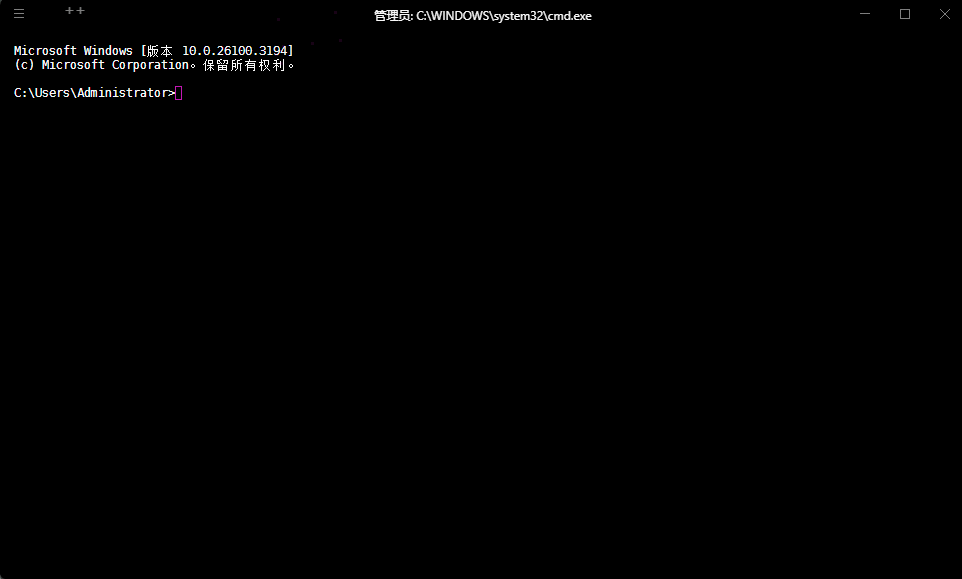

* ② 查询 IDEA ：

```cmd
winget search idea
```

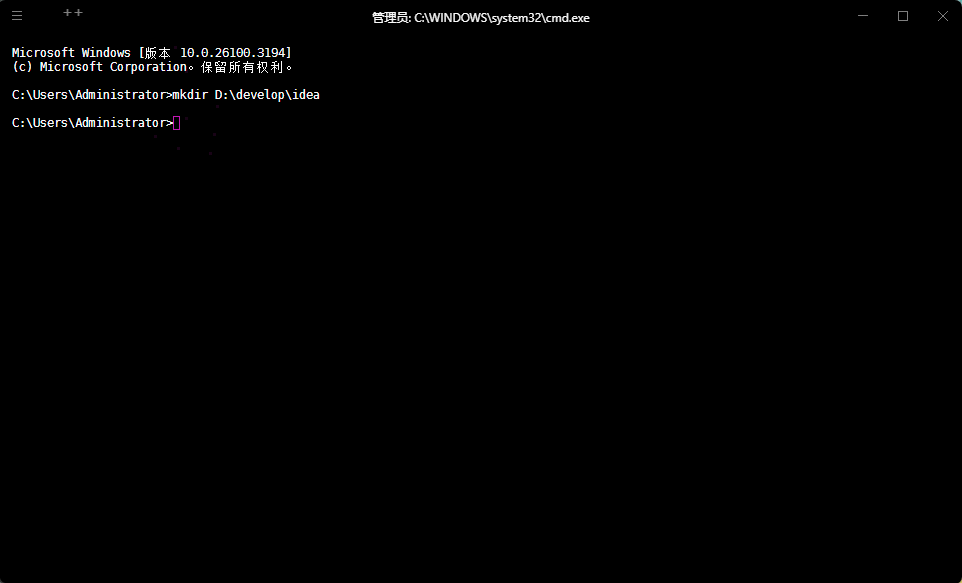

* ③ 安装 IDEA ：

```cmd
winget install --id JetBrains.IntelliJIDEA.Ultimate -l D:\develop\idea
```

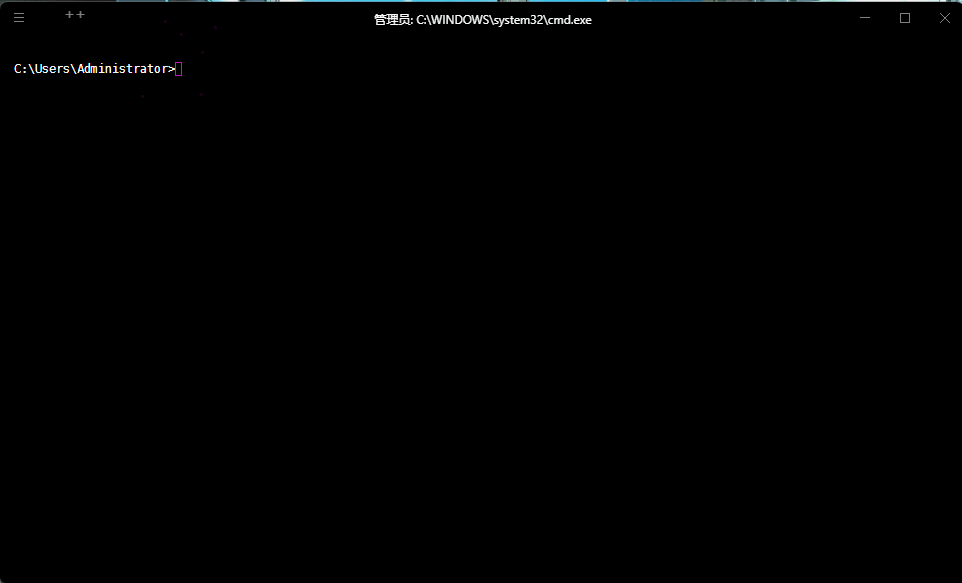


# 第三章：配置 IDEA（⭐）

## 3.1 打开 IDEA

* 手动版安装 IDEA 之后，鼠标双击，打开 IDEA：


* 自动版安装 IDEA ，需要在`开始 --> 全部`或 `开始（搜索）`中找到 IDEA，然后打开 IDEA ：

> [!NOTE]
>
> 通过 winget 安装 IDEA，默认是不会在桌面帮助我们生成快捷方式！！！


## 3.2 配置文件编码

* ① `自定义 --> 所有设置`：

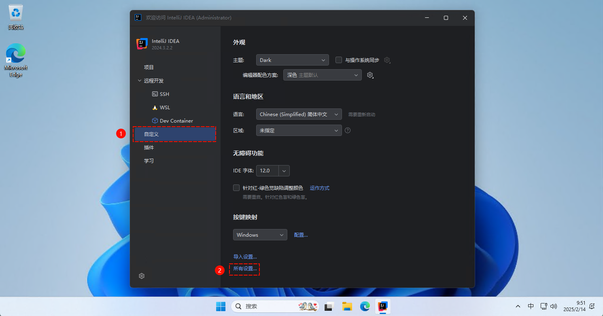

* ② `编辑器 --> 文件编码`：

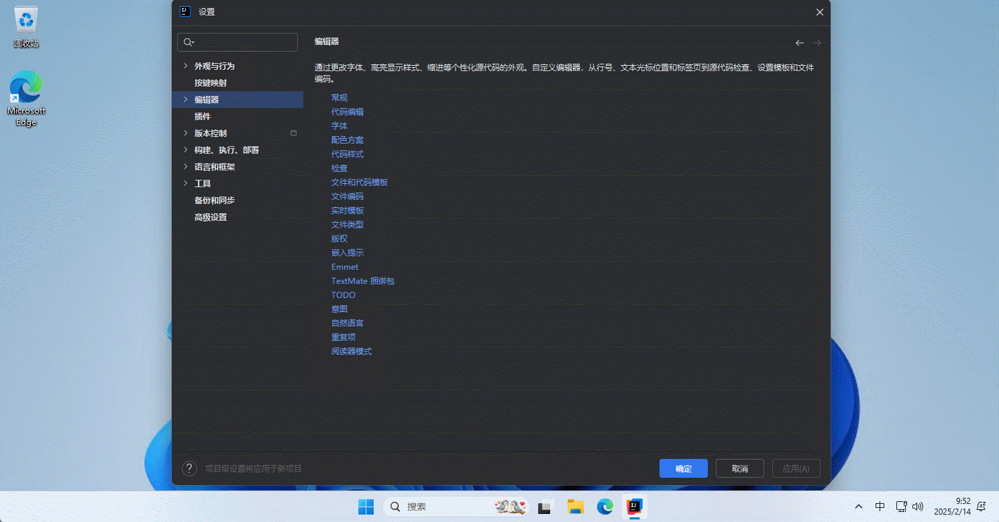

## 3.3 配置外观

### 3.3.1 配置外观字体（可选）

* ① 下载[小米字体](https://hyperos.mi.com/font/zh/details/sc/)：

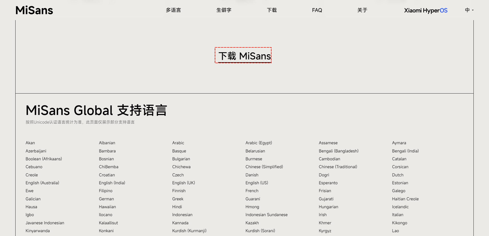

* ② 解压并安装：


* ③ IDEA 配置外观字体：

> [!NOTE]
>
> IDEA 需要退出，再重新打开，目的是让 IDEA 加载到刚才安装的小米字体。

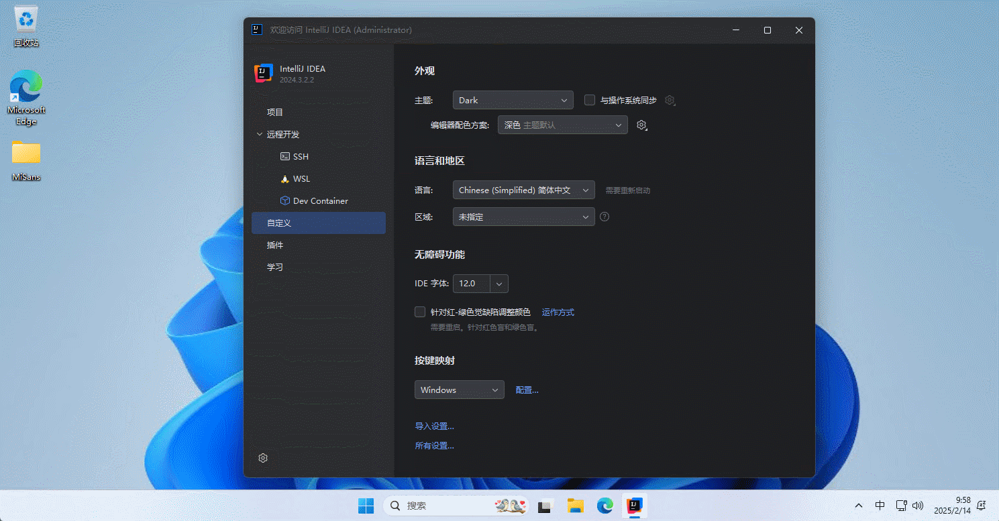

### 3.3.2 配置外观（UI 选项）

* ① `自定义 --> 所有设置`：


* ② `外观 --> UI 选项`：

> [!NOTE]
>
> 勾选`UI 选项`中的以下选项，其余默认：
>
> - [x] 紧凑模式。
> - [x] 在单独的工具栏中显示主菜单。

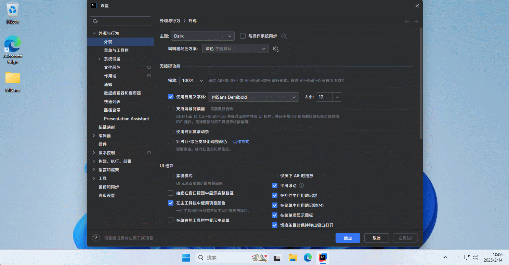

### 3.3.3 配置外观（系统设置）

* ① `自定义 --> 所有设置`：


* ② `外观 --> 系统设置`：

> [!NOTE]
>
> 勾选`系统设置`中的以下选项，其余默认：
>
> - [ ] 退出 IDE 之前确认。
> - [ ] 启动时重新打开项目。
> - [x] 如果 IDE 空闲则保存文件 15 秒。

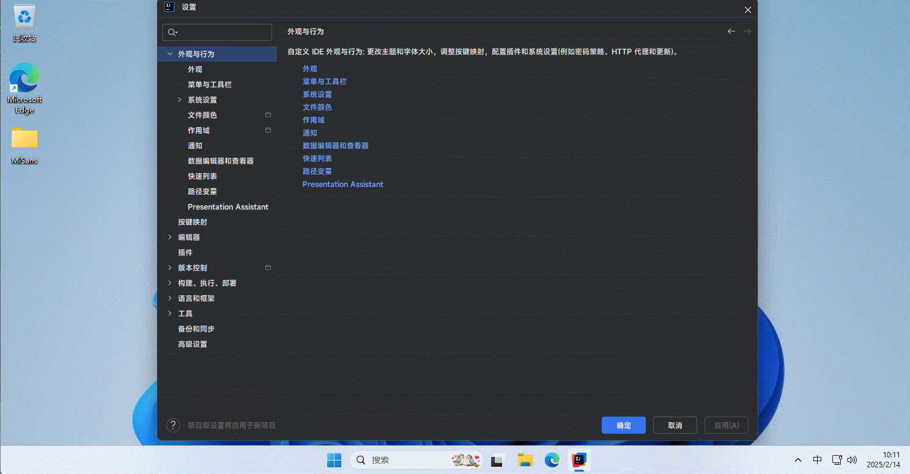

## 3.4 配置编辑器（常规）

### 3.4.1 配置编辑器（自动导入）

* ① `自定义 --> 所有设置`：


* ② `编辑器 --> 常规 --> 自动导入`：全勾选

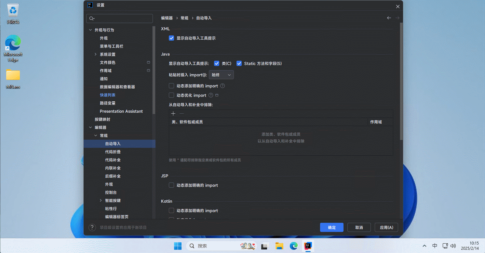

### 3.4.2 配置编辑器（代码折叠）

* ① `自定义 --> 所有设置`：


* ② `编辑器 --> 常规 --> 代码折叠`：

> [!NOTE]
>
> 勾选`代码折叠`中的以下选项，其余默认：
>
> - [ ] 一行方法

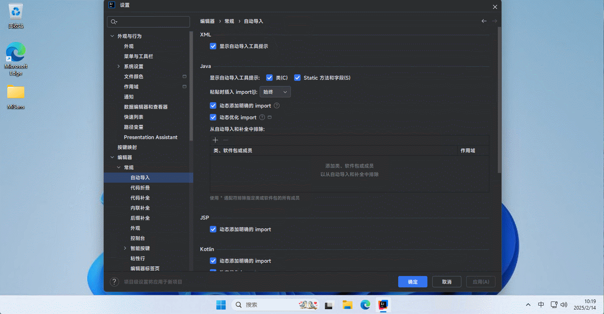

### 3.4.3 配置编辑器（代码补全）

* ① `自定义 --> 所有设置`：


* ② `编辑器 --> 常规 --> 代码补全`：

> [!NOTE]
>
> 勾选`代码补全`中的以下选项，其余默认：
>
> - [ ] 区分大小写
>
> - [x] 以下时间后显示文档弹出窗口 500 毫秒

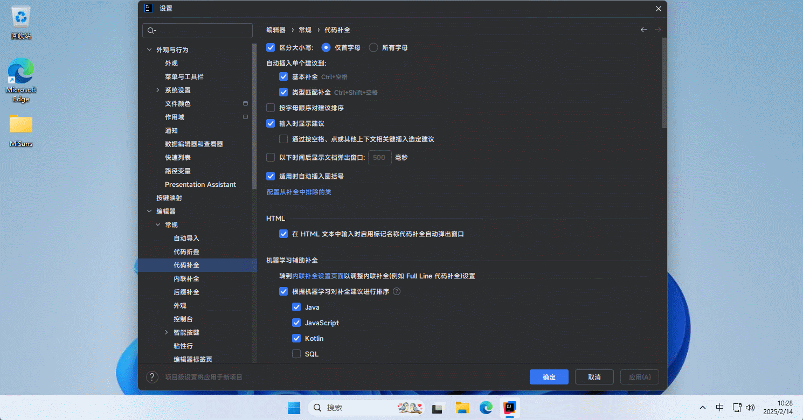

### 3.4.4 配置编辑器（代码补全）

* ① `自定义 --> 所有设置`：


* ② `编辑器 --> 常规 --> 代码补全`：

> [!NOTE]
>
> 勾选`代码补全`中的以下选项，其余默认：
>
> 机器学习辅助补全
>
> - [x] 根据机器学习对补全建议进行排序
>   - [x] Java
>   - [x] JavaScript
>   - [x] Kotlin
>   - [x] SQL
>   - [x] Shell 脚本
>   - [x] TypeScript
> - [x] 在补全弹出窗口中标记位置更改
> - [x] 在补全弹出窗口中标记最相关的条目


### 3.4.5 配置编辑器（代码补全）

* ① `自定义 --> 所有设置`：


* ② `编辑器 --> 常规 --> 代码补全`：

> [!NOTE]
>
> 勾选`代码补全`中的以下选项，其余默认：
>
> JavaScript
>
> - [ ] 仅基于类型补全
> - [x] 为可 null 类型建议包含可选链接的条目
> - [x] 在重写补全中展开方法体
> - [x] 建议变量和形参名称
> - [x] 为类字段建议名称
> - [x] 为建议的形参名称添加类型注解


### 3.4.6 配置编辑器（代码补全）

* ① `自定义 --> 所有设置`：


* ② `编辑器 --> 常规 --> 代码补全`：

> [!NOTE]
>
> 勾选`代码补全`中的以下选项，其余默认：
>
> 形参信息
>
> - [x] 补全时显示形参名称提示
> - [x] 以下时间后显示形参信息弹出窗口 1000 毫秒
> - [x] 显示完整的方法签名

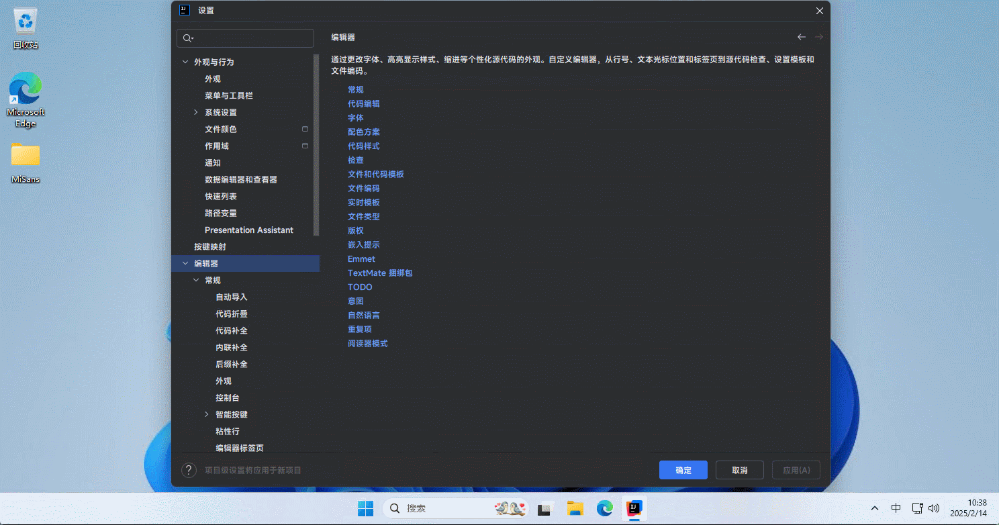

### 3.4.7 配置编辑器（外观）

* ① `自定义 --> 所有设置`：


* ② `编辑器 --> 常规 --> 外观`：

> [!NOTE]
>
> 勾选`外观`中的以下选项，其余默认：
>
> - [x] 显示方法分隔符

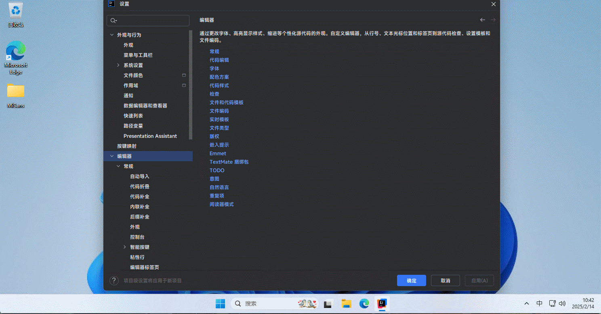

### 3.4.8 配置编辑器（编辑器标签页）

* ① `自定义 --> 所有设置`：


* ② `编辑器 --> 常规 --> 编辑器标签页`：

> [!NOTE]
>
> 勾选`编辑器标签页`中的以下选项，其余默认：
>
> - [x] 多行（在以下位置显示标签页）

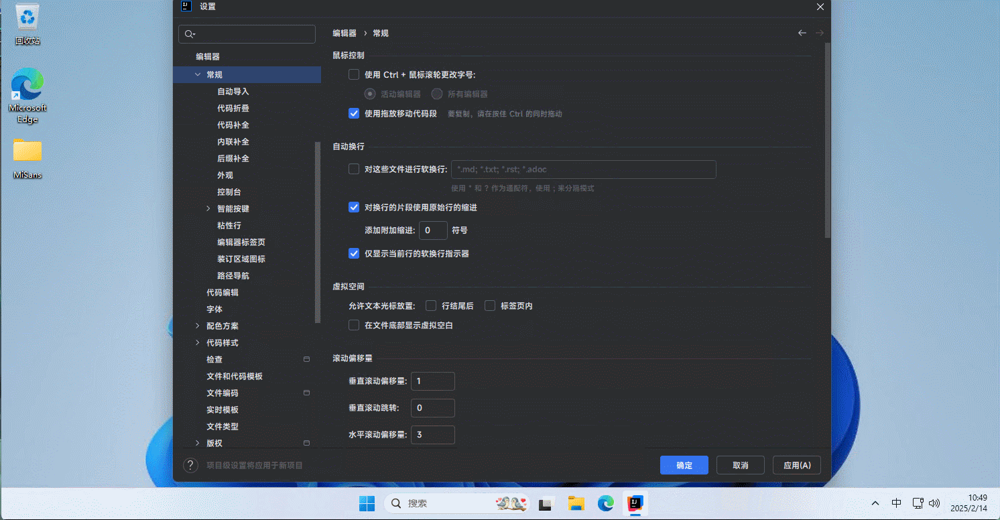

## 3.5 配置编辑器（字体，可选）

* ① `自定义 --> 所有设置`：


* ② `编辑器 --> 字体`：

> [!NOTE]
>
> * ① 字体：`Fira Code`。
>
> * ② 主要粗细：`Bold`。
> * ③ 加粗：`Bold`。
> * ④ 回滚字体：`SimHei`。


## 3.6 配置编辑器（配色方案，可选）

* ① `自定义 --> 所有设置`：


* ② `编辑器 --> 配色方案 --> 语言默认设置`：

> [!NOTE]
>
> * ① 行注释：`FB7299`。
> * ② 块注释：`FB7299`。
> * ③ 文档注释：`3CB371`。

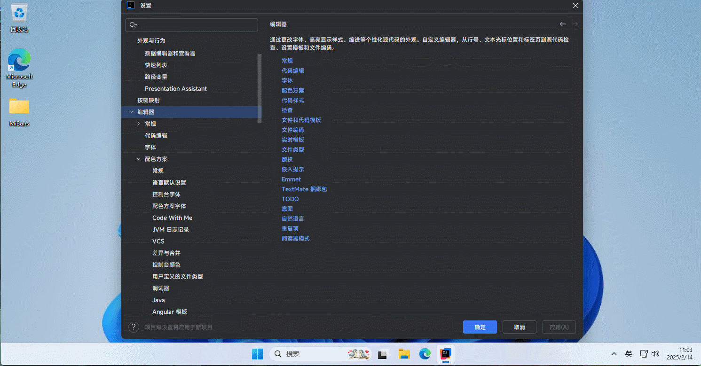

## 3.7 配置编辑器（嵌入提示，可选）

* ① `自定义 --> 所有设置`：


* ② `编辑器 --> 嵌入提示`：全部勾选

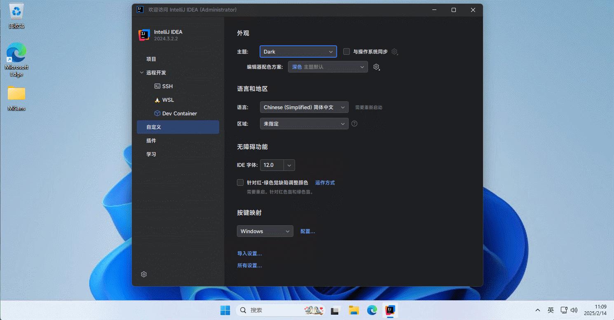

## 3.8 配置高级设置

* ① `自定义 --> 所有设置`：


* ② `高级设置 --> 工具窗口`：

> [!NOTE]
>
> 勾选`工具窗口`中的以下选项，其余默认：
>
> - [x] 始终显示工具窗口标题图标

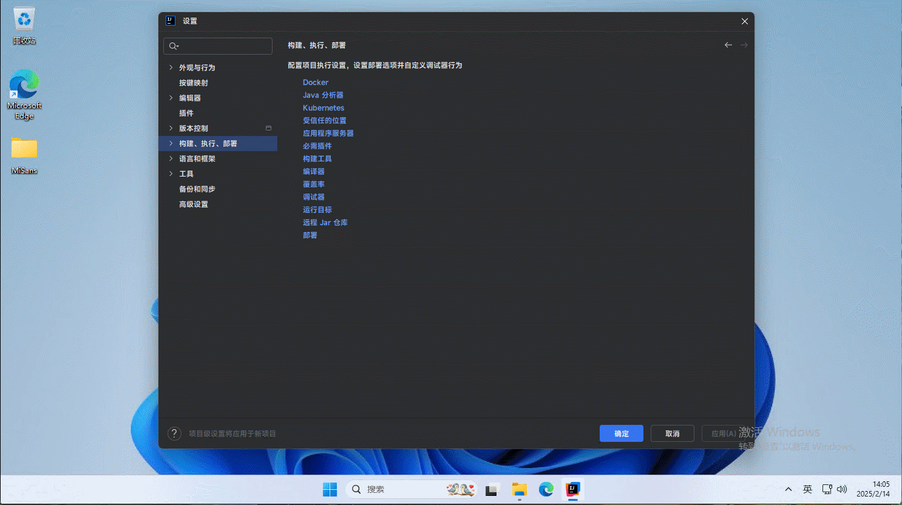


# 第四章：IDEA 项目结构（⭐）

## 4.1 概述

* 在 IDEA 中，`项目`（project）、`模块`（module）以及`包`（project）是三个非常重要的概念，它们是构建和组织代码的基础。

> [!NOTE]
>
> * ① 这三个概念，本质上就是为了对所创建的文件夹做出约定（约定大于配置），这样大家可以协同开发，减少沟通的成本。
> * ② 现代化的软件开发，讲究的不是单枪作战，而是协同开发；所以，项目的目录结构划分很重要。
>
> ::: details 点我查看 Vue3 的项目结构
>
> ```shell
> micro-vue/                   # 项目名
> ├── node_modules/            # 项目依赖包
> ├── public/                  # 静态资源文件夹
> │   ├── index.html           # 入口 HTML 文件
> │   └── favicon.ico          # 网站图标
> ├── src/                     # 源代码文件夹
> │   ├── assets/              # 静态资源，如图片、字体、样式等
> │   ├── components/          # 可复用的 Vue 组件
> │   ├── views/               # 页面级别的 Vue 组件
> │   ├── router/              # Vue Router 配置
> │   ├── store/               # Pinia 状态管理
> │   │   └── useStore.js      # Pinia store 相关文件
> │   ├── App.vue              # 根组件
> │   ├── main.js              # 入口 JavaScript 文件
> │   └── style/               # 全局样式（如 CSS 或 SCSS 文件）
> ├── .gitignore               # Git 忽略文件
> ├── package.json             # 项目描述文件，包含项目依赖、脚本命令等
> ├── vite.config.js           # Vite 配置文件
> └── package-lock.json        # 依赖锁文件
> ```
>
> :::

* 理解`项目`（project）、`模块`（module）以及`包`（project）将有助于高效地管理和开发项目；它们之间的关系，如下所示：


## 4.2 项目（Project）

* `定义`：项目是在 IntelliJ IDEA 中创建的工作空间，是开发的顶层结构。一个项目包含了所有与开发相关的文件、资源和设置，它是开发的整体容器。
* `功能`：
  * 一个项目可以包含多个模块。
  * 项目设置（如 SDK、依赖、构建工具）会影响项目中的所有模块。
  * 项目可以包括代码、配置文件、资源文件、库等。
* `项目中的内容`：项目一般包括源代码文件（ `.java` 文件）、资源文件、第三方库、配置文件（ `pom.xml` 或 `build.gradle`）等。
* `举例`：一个 Web 应用程序的项目，可能包含前端和后端代码，并且会用到数据库配置和其他资源。


* 示例：IDEA 创建项目（空项目）

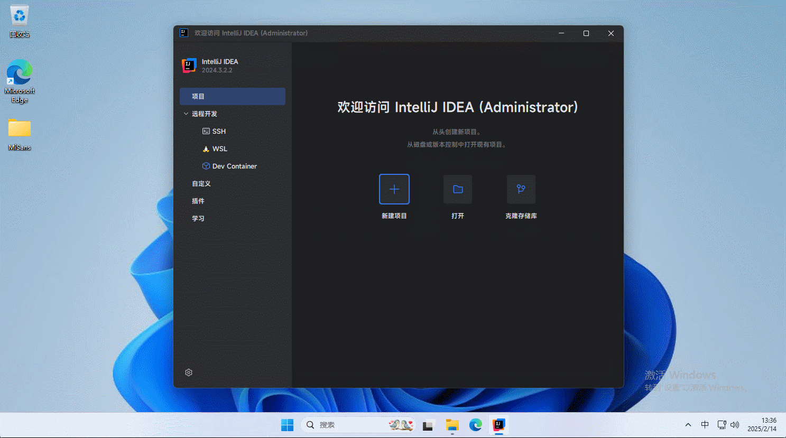

## 4.3 模块（Module）

- `定义`：模块是 IntelliJ IDEA 中项目的子单元，它帮助你将大项目分成更小的、独立的部分。每个模块可以有自己的源代码、资源、配置文件等。模块是项目的逻辑组成部分，可以进行独立的构建和测试。
- `功能`：
  - 每个模块可以使用不同的 SDK，如： Java 8、Java 11、Kotlin 等。
  - 可以设置模块的依赖，模块之间可以相互引用。
  - 每个模块可以有自己的编译设置和输出目录。
- `模块类型`：
  - Java 模块：包含 Java 源代码和相关资源。
  - Web 模块：用于开发 Web 应用程序的模块。
  - Android 模块：用于开发 Android 应用的模块。
  - 库模块：通常用于创建共享代码库，可以被其他模块引用。
  - ...
- `举例`：在一个电商系统的项目中，可能有多个模块：用户模块、商品模块、支付模块等。


* 示例：IDEA 创建模块（以 `day-xxx` 命名）

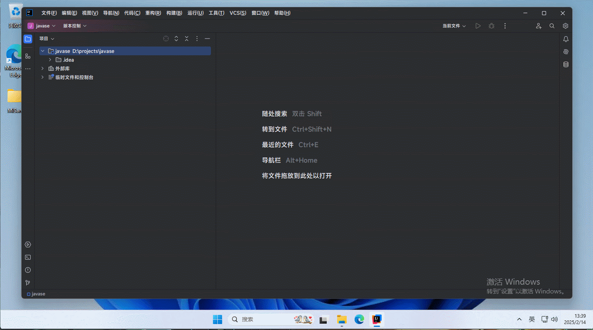


* 示例：IDEA 创建模块（以 `day-xxx` 命名）

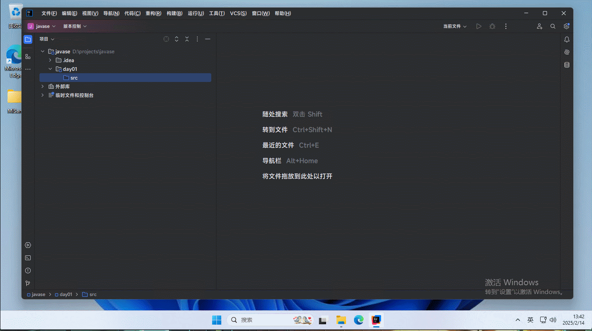

## 4.4 包（Package）

- `定义`：包是 Java 中的一个命名空间，用于组织类和其他 Java 类型。包帮助开发者更好地组织代码，避免命名冲突。包是模块内的目录结构，用于存放 Java 类。
- `功能`：
  - 包提供了命名空间的功能，可以帮助分类和管理代码。
  - 每个 Java 类文件都属于某个包，包名通常与文件夹的路径相对应。
  - 包的结构可以是多级的，形成层次化的目录结构。
- `包的使用`：包帮助你把相关的类组织在一起，便于代码管理和维护。
- `举例`：如果有一个类 `UserService.java`，通常它会放在 `com.ecommerce.user` 包下，而类 `ProductService.java` 可能会放在 `com.ecommerce.product` 包中。


* 示例：IDEA 创建包，并在包中写 Java 代码

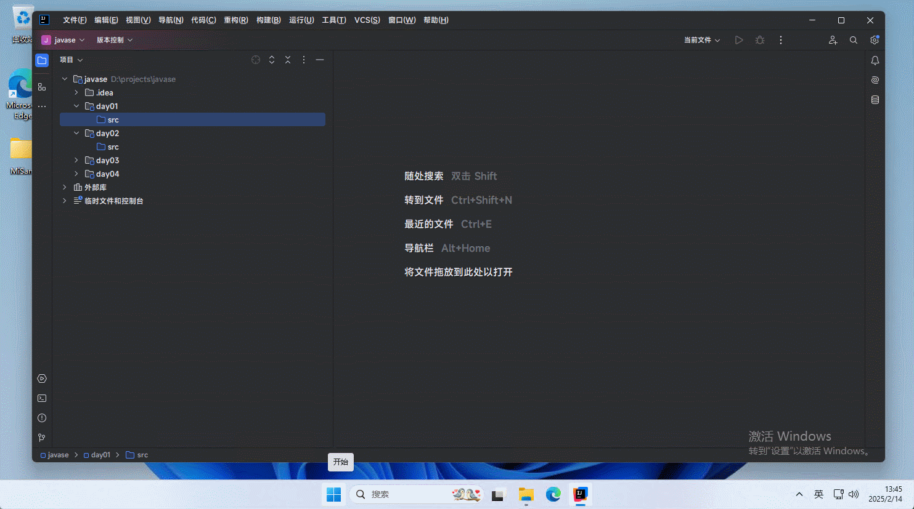


# 第五章：IDEA 的初步使用（⭐）

## 5.1 新建类

* 在指定的`包名`（package），通过`鼠标右键`，新建`类`文件：

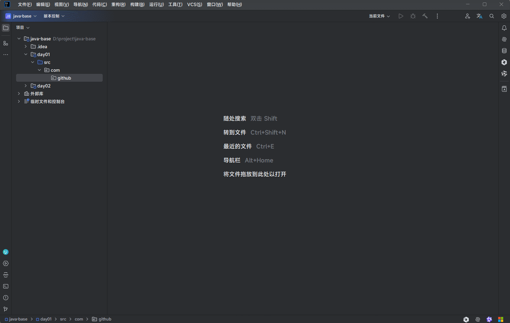

## 5.2 新建 main 方法

* 可以通过 `psvm` 或 `main` 快速编写 main 方法：

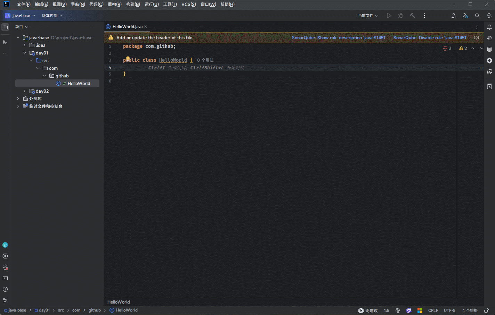

## 5.3 执行 Java 程序

* 在 main 方法处的▶️，通过`鼠标左键`，执行 main 方法：


