# 第一章： 字符集和字符集编码

## 1.1 概述

* 字符集和字符集编码（简称编码）计算机系统中处理文本数据的两个基本概念，它们密切相关但又有区别。
* 字符集（Character Set）是一组字符的集合，其中每个字符都被分配了一个`唯一的编号`（通常是数字）。字符可以是字母、数字、符号、控制代码（如换行符）等。`字符集定义了可以表示的字符的范围`，但它并不直接定义如何将这些字符存储在计算机中。

> [!NOTE]
>
> ASCII（美国信息交换标准代码）是最早期和最简单的字符集之一，它只包括了英文字母、数字和一些特殊字符，共 128 个字符。每个字符都分配给了一个从 0 到 127 的数字。

* 字符集编码（Character Encoding，简称编码）是一种方案或方法，`它定义了如何将字符集中的字符转换为计算机存储和传输的数据（通常是一串二进制数字）`。简而言之，编码是字符到二进制数据之间的映射规则。

> [!NOTE]
>
> ASCII 编码方案定义了如何将 ASCII 字符集中的每个字符表示为 7 位的二进制数字。例如：大写字母`'A'`在 ASCII 编码中表示为二进制的`1000001`，十进制的 `65` 。

* `字符集`和`字符集编码`之间的关系如下：


* Linux 中安装帮助手册：

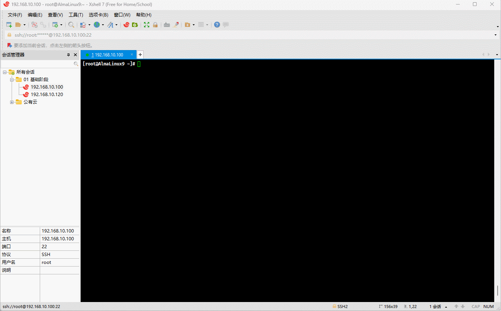

## 1.2 ASCII 编码

* 从`冯·诺依曼`体系结构中，我们知道，计算机中所有的`数据`和`指令`都是以`二进制`的形式表示的；所以，计算机中对于文本数据的数据也是以二进制来存储的，那么对应的流程如下：


* 我们知道，计算机是上个世纪 60 年代在美国研制成功的，为了实现字符和二进制的转换，美国就制定了一套字符编码，即英语字符和二进制位之间的关系，即 ASCII （American Standard Code for Information Interchange）编码：
  - ASCII 编码只包括了英文字符、数字和一些特殊字符，一共 128 个字符，并且每个字符都分配了唯一的数字，范围是 0 - 127。
  - ASCII 编码中的每个字符都使用 7 位的二进制数字表示；但是，计算机中的存储的最小单位是 1 B = 8 位，那么最高位统一规定为 0 。

> [!NOTE]
>
> - ① 其实，早期是没有字符集的概念的，只是后来为了解决乱码问题，而产生了字符集的概念。
> - ② 对于英文体系来说，`a-zA-Z0-9`以及一些`特殊字符`一共 `128` 就可以满足实际存储需求；所以，在也是为什么 ASCII 码使用 7 位二进制（2^7 = 128 ）来存储的。

* 在操作系统中，就内置了对应的编码表，Linux 也不例外；可以使用如下的命令查看：

```shell
man ascii
```

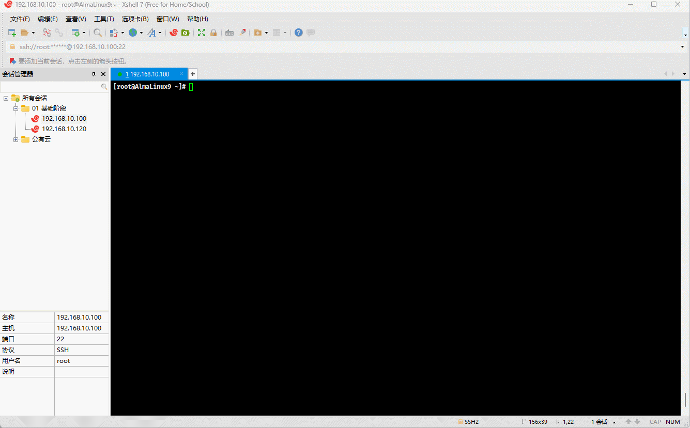

* 其对应的 ASCII 编码表，如下所示：


* 但是，随着计算机的发展，计算机开始了东征之路，由美国传播到东方：


- 先是传播到了欧洲，欧洲在兼容 ASCII 编码的基础上，推出了 ISO8859-1 编码，即：
  - ISO8859-1 编码包括基本的拉丁字母表、数字、标点符号，以及西欧语言中特有的一些字符，如：法语中的 `è`、德语中的 `ü` 等。
  - ISO 8859-1 为每个字符分配一个单字节（8 位）编码，意味着它可以表示最多 256 （2^8）个不同的字符（编号从 0 到 255）。
  - ISO 8859-1 的前 128 个字符与 ASCII 编码完全一致，这使得 ASCII 编码的文本可以无缝转换为 ISO 8859-1 编码。


- 计算机继续传播到了亚洲，亚洲（双字节）各个国家分别给出了自己国家对应的字符集编码，如：
  - 日本推出了 Shift-JIS 编码：
    - 单字节 ASCII 范围：0 - 127。
    - 双字节范围：
      - 第一个字节：129 - 159 和 224 - 239 。
      - 第二个字节：64 - 126 和 128 - 252 。
  - 韩国推出了 EUC-KR 编码：
    - 单字节 ASCII 范围：0 - 127。
    - 双字节范围：从 41281 - 65278。
  - 中国推出了 GBK 编码：
    - 单字节 ASCII 范围：0 - 127。
    - 双字节范围：33088 - 65278 。

> [!NOTE]
>
> - ① 通过上面日本、韩国、中国的编码十进制范围，我们可以看到，虽然这些编码系统在技术上的编码范围存在重叠（特别是在高位字节区域），但因为它们各自支持的字符集完全不同，所以实际上它们并不直接冲突。
> - ② 但是，如果一个中国人通过 GBK 编码写的文章，通过邮件发送给韩国人，因为韩国和中国在字符集编码上的高位字节有重叠部分，必然会造成歧义。

## 1.3 Unicode 编码

- 在 Unicode 之前，世界上存在着数百种不同的编码系统，每一种编码系统都是为了支持特定语言或一组语言的字符集。这些编码系统，包括：ASCII、ISO 8859 系列、GBK、Shift-JIS、EUC-KR 等，它们各自有不同的字符范围和编码方式。这种多样性虽然在局部范围内解决了字符表示的问题，但也带来了以下几个方面的挑战：
  - `编码冲突`：由于不同的编码系统可以为相同的字节值分配不同的字符，因此在不同编码之间转换文本时，如果没有正确处理编码信息，就很容易产生乱码。这种编码冲突在尝试处理多种语言的文本时尤为突出。
  - `编码的复杂性`：随着全球化的发展，软件和系统需要支持越来越多的语言，这就要求开发者和系统同时处理多种不同的编码系统。这不仅增加了开发和维护的复杂性，而且也增加了出错的风险。
  - `资源限制`：在早期计算机技术中，内存和存储资源相对有限。不同的编码标准要求系统存储多套字符集数据，这无疑增加了对有限资源的消耗。
  - ……
- 针对上述的种种问题，为了推行全球化，Unicode 应运而生，Unicode 的核心规则和设计原则是建立一个全球统一的字符集，使得世界上所有的文字和符号都能被唯一地识别和使用，无论使用者位于何地或使用何种语言。这套规则包括了字符的编码、表示、处理和转换机制，旨在确保不同系统和软件间能够无缝交换和处理文本数据。
  - `通用字符集 (UCS)`：Unicode 为每一个字符分配一个唯一的编号（称为`“码点”`）。这些码点被组织在一个统一的字符集中，官方称之为 “通用字符集”（Universal Character Set，UCS）。码点通常表示为 `U+` 后跟一个十六进制数，例如：`U+0041` 代表大写的英文字母 `“A”`。
  - `编码平面和区段`：Unicode 码点被划分为多个 “平面（Planes）”，每个平面包含 65536（16^4）个码点。目前，Unicode定义了 17 个平面（从 0 到16），每个平面被分配了一个编号，从 “基本多文种平面（BMP）” 的 0 开始，到 16 号平面结束。这意味着 Unicode 理论上可以支持超过 110万（17*65536）个码点。

- Unicode 仅仅只是字符集，给每个字符设置了唯一的数字编号而已，却没有给出这些数字编号实际如何存储，可以通过如下命令查看：


- 为了在计算机系统中表示 Unicode 字符，定义了几种编码方案，这些方案包括 UTF-8、UTF-16 和 UTF-32 等。
  - **UTF-8**：使用 1 - 4 个字节表示每个 Unicode 字符，兼容 ASCII，是网络上最常用的编码。
  - **UTF-16**：使用 2 - 4 个字节表示每个 Unicode 字符，适合于需要经常处理基本多文种平面之外字符的应用。
  - **UTF-32**：使用固定的 4 个字节表示每个 Unicode 字符，简化了字符处理，但增加了存储空间的需求。

> [!NOTE]
>
> * ① 只有 UTF-8 兼容 ASCII，UTF-32 和 UTF-16 都不兼容 ASCII，因为它们没有单字节编码。
>
> ::: details 点我查看
>
> * UTF-8 使用尽量少的字节来存储一个字符，不但能够节省存储空间，而且在网络传输时也能节省流量，所以很多纯文本类型的文件，如：各种编程语言的源文件、各种日志文件和配置文件等以及绝大多数的网页，如：百度、新浪、163 等都采用 UTF-8 编码。但是，UTF-8 的缺点是效率低，不但在存储和读取时都要经过转换，而且在处理字符串时也非常麻烦。例如：要在一个 UTF-8 编码的字符串中找到第 10 个字符，就得从头开始一个一个地检索字符，这是一个很耗时的过程，因为 UTF-8 编码的字符串中每个字符占用的字节数不一样，如果不从头遍历每个字符，就不知道第 10 个字符位于第几个字节处，就无法定位。不过，随着算法的逐年精进，UTF-8 字符串的定位效率也越来越高了，往往不再是槽点了。
> * UTF-32 是“以空间换效率”，正好弥补了 UTF-8 的缺点，UTF-32 的优势就是效率高：UTF-32 在存储和读取字符时不需要任何转换，在处理字符串时也能最快速地定位字符。例如：在一个 UTF-32 编码的字符串中查找第 10 个字符，很容易计算出它位于第 37 个字节处，直接获取就行，不用再逐个遍历字符了，没有比这更快的定位字符的方法了。但是，UTF-32 的缺点也很明显，就是太占用存储空间了，在网络传输时也会消耗很多流量。我们平常使用的字符编码值一般都比较小，用一两个字节存储足以，用四个字节简直是暴殄天物，甚至说是不能容忍的，所以 UTF-32 在应用上不如 UTF-8 和 UTF-16 广泛。
>
> * UTF-16 可以看做是 UTF-8 和 UTF-32 的折中方案，它平衡了存储空间和处理效率的矛盾。对于常用的字符，用两个字节存储足以，这个时候 UTF-16 是不需要转换的，直接存储字符的编码值即可。
>
> :::
>
> * ② 总而言之，**UTF-8** 编码兼容性强，适合大多数应用，特别是英文文本处理。**UTF-16** 编码适合处理大量亚洲字符，但在处理英文或其他拉丁字符时相对浪费空间。**UTF-32**编码简单直接，但非常浪费空间，适合需要固定字符宽度的特殊场景。
> * ③ 在实际应用中，UTF-8 通常是最常用的编码方式，因为它在兼容性和空间效率之间提供了良好的平衡。

> [!IMPORTANT]
>
> * ① Windows 内核、.NET Framework、Java String 内部采用的都是 `UTF-16` 编码，主要原因是为了在兼顾字符处理效率的同时，能够有效处理多种语言的字符集，即：历史遗留问题、兼容性要求和多语言支持的需要。
> * ② 不过，UNIX 家族的操作系统（Linux、Mac OS、iOS 等）内核都采用 `UTF-8` 编码，主要是为了兼容性和灵活性，因为 UTF-8 编码可以无缝处理 ASCII 字符，同时也能够支持多字节的 Unicode 字符，即：为了最大限度地兼容 ASCII，同时保持系统的简单性、灵活性和效率。

- `Unicode 字符集`和对应的`UTF-8 字符编码`之间的关系，如下所示：


>[!NOTE]
>
>`宽字符`和`窄字符`是编程和计算机系统中对字符类型的一种分类，主要用于描述字符在内存中的表示形式及其与编码方式的关系。
>
>* ① `窄字符`通常指使用单个字节（8 位）来表示的字符。在许多传统的编码系统中，窄字符通常代表 ASCII 字符或其它单字节字符集中的字符。换言之，`窄字符`适合处理简单的单字节字符集，如：ASCII，适用于处理西方语言的应用。
>* ② `宽字符`指使用多个字节（通常是两个或更多）来表示的字符。这些字符通常用于表示比 ASCII 范围更广的字符集，如 Unicode 字符。换言之，`宽字符`适合处理多字节字符集，如：UTF-32、UTF-16 等，适用于需要处理多种语言和符号的国际化应用。
>
>在现代编程中，`窄字符`通常与 `UTF-8` 编码关联，特别是在处理文本输入、输出和网络传输时。尽管 `UTF-8` 是变长编码，由于其高效的空间利用和对 `ASCII` 的优化，通常与`窄字符`概念关联。而`宽字符`通常与 `UTF-16` 编码或 `UTF-32`编码关联，这些编码使用更大的固定或半固定长度来表示字符，适合处理更大的字符集。


# 第二章： WSL2 中设置默认编码为中文

## 2.1 概述

* 查看 WSL2 的 Linux 发行版的默认编码：

```shell
echo $LANG
```

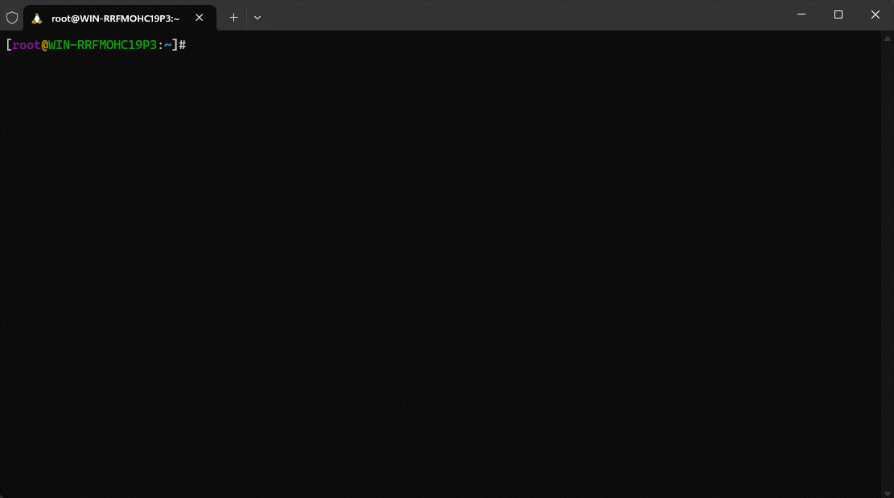

> [!NOTE]
>
> `C.UTF-8` 是一种字符编码设置，结合了 `C` 区域设定和 `UTF-8` 字符编码。
>
> * ① **C 区域设定**：这是一个标准的、最小化的区域设置，通常用于系统默认的语言环境。`C` 区域设定下，所有字符都被认为是 ASCII 字符集的一部分，这意味着仅支持基本的英文字符和符号。在 `C` 区域设定中，字符串的排序和比较是基于简单的二进制值比较，这与本地化的语言设置相比相对简单。
> * ② **UTF-8 编码**：UTF-8 是一种变长的字符编码方式，可以编码所有的 Unicode 字符。它是一种广泛使用的字符编码，能够支持多种语言和符号。每个 UTF-8 字符可以由1到4个字节表示，这使得它兼容 ASCII（对于标准 ASCII 字符，UTF-8 只使用一个字节）。
>
> 因此，`C.UTF-8` 结合了 `C` 区域设定和 UTF-8 字符编码的优势。使用 `C.UTF-8` 时，系统默认语言环境保持简单和高效，同时支持更广泛的字符集，特别是多语言和非英语字符。这样可以在需要兼容性的同时，提供对全球化字符的支持。

## 2.2 AlmaLinux9 设置默认编码

* ① 搜索中文语言包：

```shell
dnf search locale zh
```

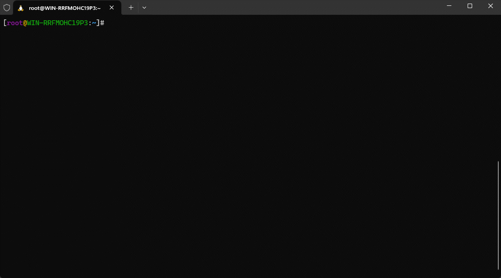

* ② 安装中文语言包：

```shell
dnf -y install glibc-langpack-zh
```

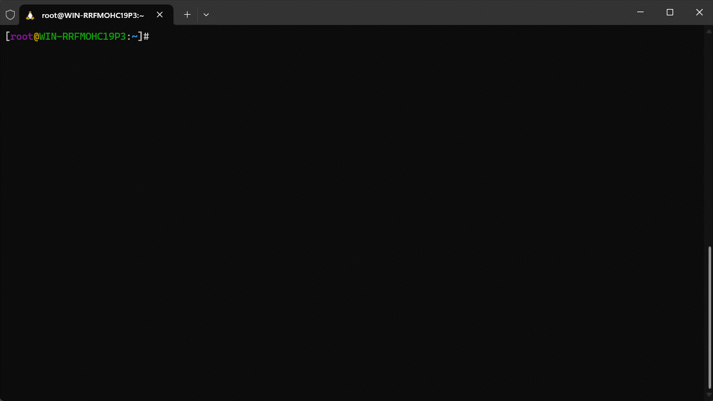

* ③ 切换语言环境为中文：

```shell
localectl set-locale LANG=zh_CN.UTF-8
```

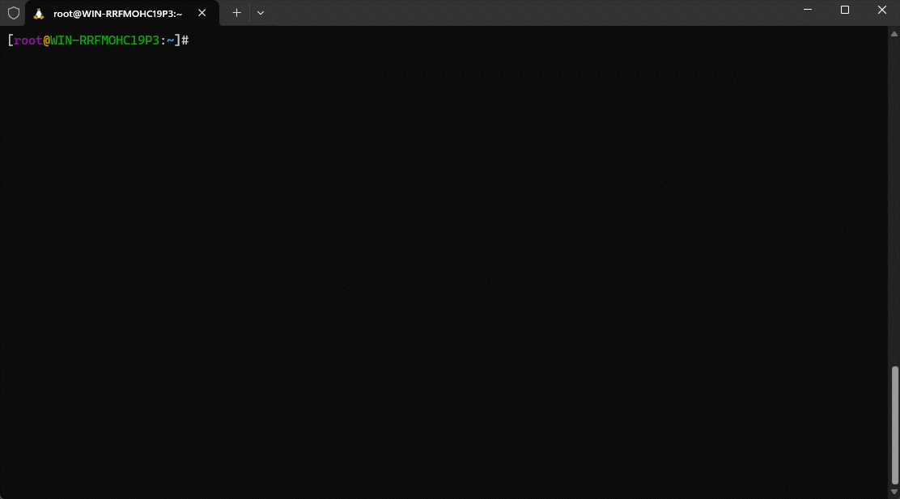

* ④ 手动加载配置文件，使其生效：

```shell
source /etc/locale.conf
```

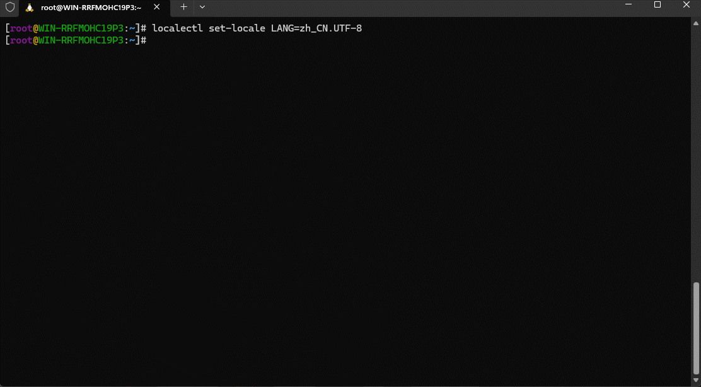

## 2.3 Ubuntu 22.04 设置默认编码

* ① 安装中文语言包：

```shell
apt update -y && apt install language-pack-zh-hans -y
```

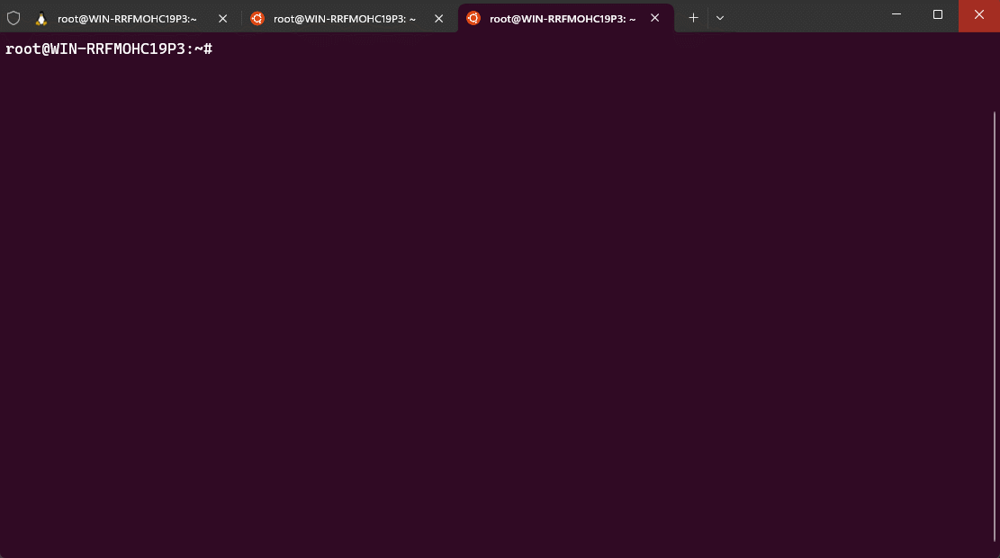

* ② 切换环境为中文：

```shell
update-locale LANG=zh_CN.UTF-8 LANGUAGE=zh_CN:zh
```

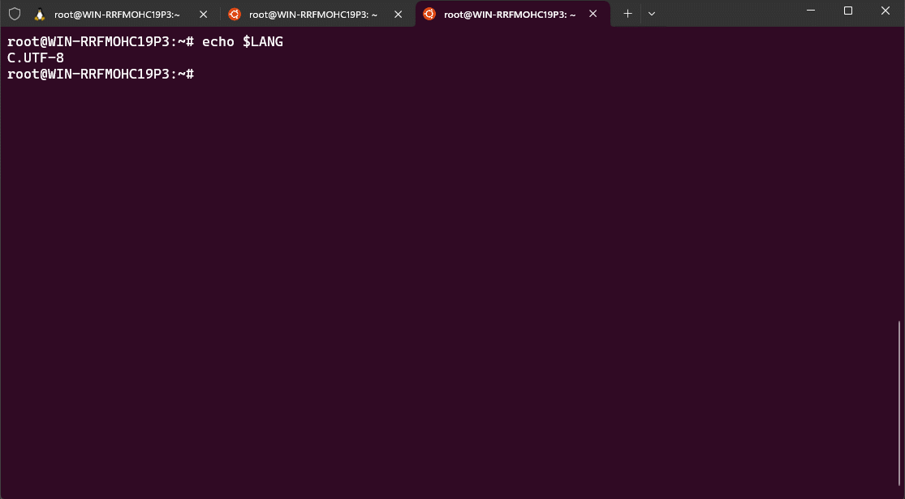

* ③ 手动加载配置文件，使其生效：

```shell
source /etc/default/locale
```

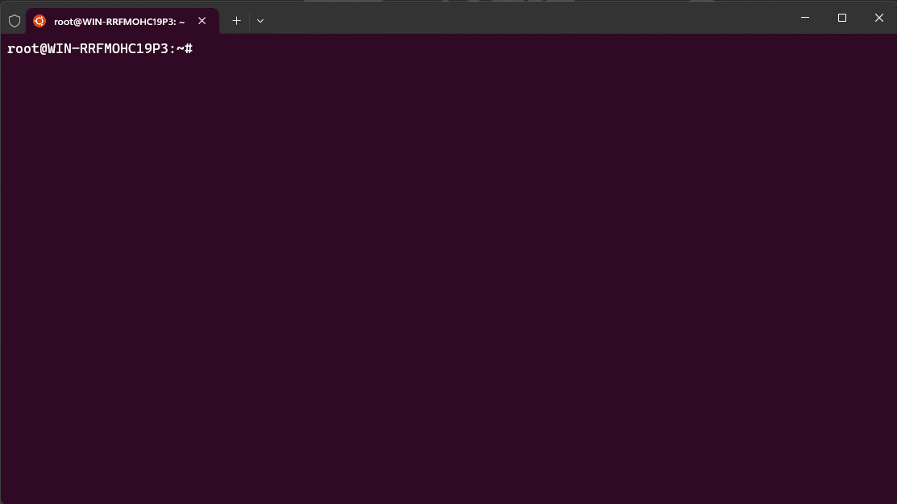


# 第三章：计算机的存储规则（⭐）

## 3.1 概述

* 在计算机中，通常有三种常见的数据：`文本`（Text）、`图片`（Image）和`声音`（Sound），如下所示：

> [!NOTE]
>
> 视频就是很多图片和声音的结合体而已！！！

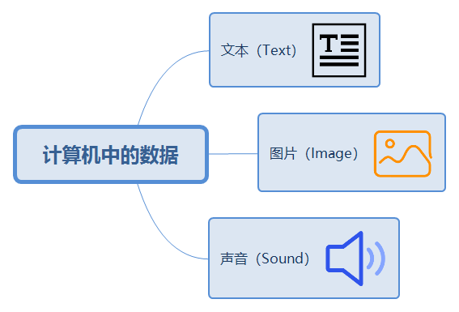

* 并且，`文本`是由`数字`、`字母`和`汉字`组成，如下所示：

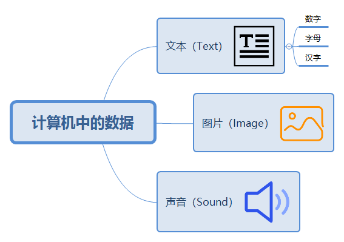


## 3.2 计算机中文本数据的存储

* 在计算机中，任何数据都是以二进制的形式进行存储，文本数据也不例外。
* 其中，`数字`中的`整数`采用的是`计算机补码`，而`数字`中的`小数`采取的是 `IE754 标准`。
* 其中，`字母`采取的是`ASCII 编码`或 `Unicode 编码`（UTF-8、UTF-16、UTF-32）。
* 其中，`汉字`采取的是`GBK 编码`或 `Unicode 编码`（UTF-8、UTF-16、UTF-32）

## 3.3 计算机中图片数据的存储

### 3.3.1 概述

* `图片`在计算机中分为：`黑白图`、`灰度图`和`彩色图`，如下所示：

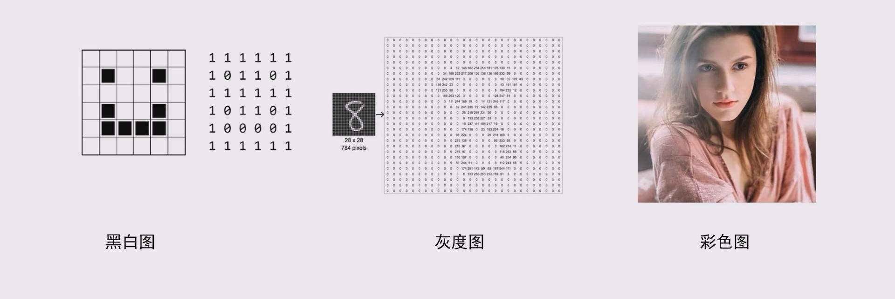

* `图片`的存储，还需要涉及显示器的三个知识点：`分辨率`、`像素`和`三原色`。

> [!NOTE]
>
> * ① `分辨率`：分辨率指的是显示设备或图像的清晰度，通常用宽度和高度的像素数表示，如：1920x1080 就是一种常见的分辨率，表示图像的宽度有 1920 个像素，高度有 1080 个像素。分辨率越高，图像就越清晰。
>
> ::: details 点我查看 分辨率
>
> 
>
> :::
>
> * ② `像素`：像素是图像的基本单元，通常是显示设备屏幕上的一个小点。每个像素通常由红、绿、蓝三种颜色的光点组成，组合这些光点可以表现出不同的颜色和亮度。图像的质量和清晰度与像素的数量密切相关。
>
> ::: details 点我查看 像素
>
> 
>
> :::
>
> * ③ `三原色`：三原色指的是组成所有颜色的基本颜色。对于显示设备来说，通常使用`红色（Red）`、`绿色（Green）`和`蓝色（Blue）`作为三原色，合称为 RGB 颜色模型。通过调节这三种颜色的亮度，可以混合出各种不同的颜色。这也是为什么显示器、电视屏幕等设备使用 RGB 来显示色彩的原因。
>
> ::: details 点我查看 三原色
>
> 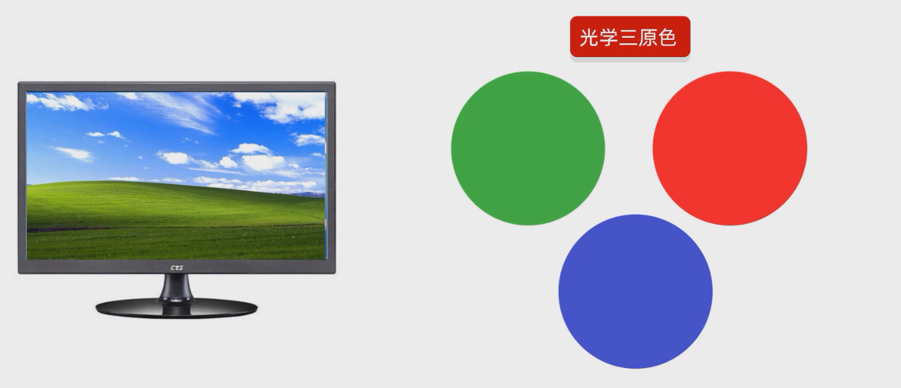
>
> :::

### 3.3.2 黑白图

* 定义：黑白图（二值图像）指图像中只有两种颜色：黑和白，通常用 `0` 和 `1` 来表示，如下所示：

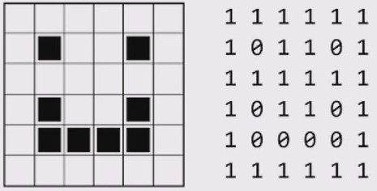

* 应用场景：黑白图像常用于一些简单的图像处理任务，如：文档扫描、条形码识别、图像二值化等。

<xgplayer url="/image/bin-image.mp4" poster="/image/bin-image.png" />

### 3.3.3 灰度图

* 定义：灰度图像是指图像中每个像素包含的颜色信息是不同强度的灰色，介于纯黑（0）和纯白（255）之间。灰度图的每个像素值通常用 `8 位（0-255）`来表示，从完全黑（0）到完全白（255），中间是不同强度的灰色，如下所示：

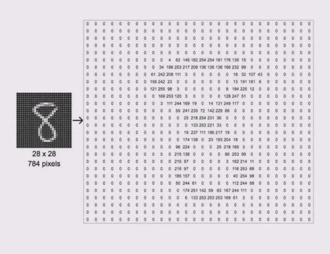

* 应用场景：灰度图像在图像处理、计算机视觉和医学影像中有广泛应用，它能够保留较多的亮度信息，但不包含色彩（色相）信息。


### 3.3.4 彩色图

- 定义：彩色图像是指图像中每个像素包含了`红色（R）`、`绿色（G）`和`蓝色（B）`的颜色信息，这三种颜色的不同组合形成了丰富的色彩。这通常使用 `RGB 颜色模型`来表示每个像素的颜色信息，如下所示：

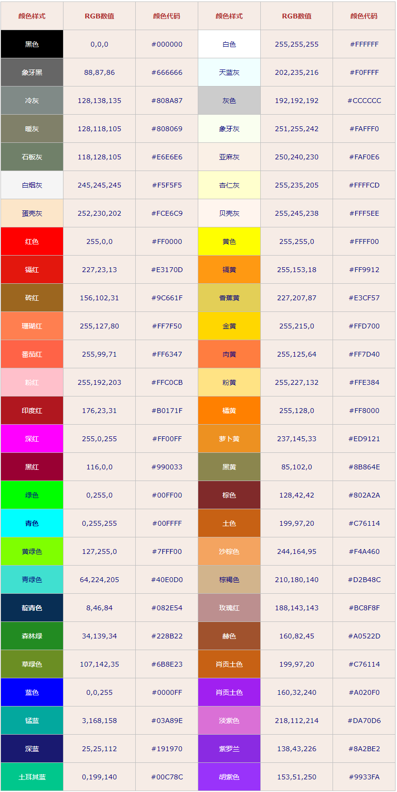

- 用途：彩色图像应用广泛，几乎所有的日常照片、视频以及大部分的图形设计都使用彩色图像。它能够传达更多的信息和情感，因为人类视觉系统对颜色的感知非常敏感。


## 3.4 计算机中声音数据的存储

* 计算机中`声音`数据的存储一般通过将`声音信号`数字化并以`数字`形式保存，如下所示：

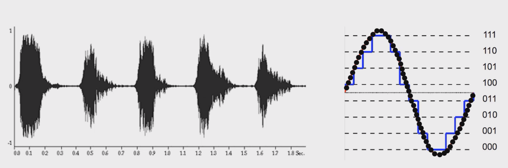

* 整个过程涉及到`采样`、`量化`、`编码`以及`存储`等过程。

> [!NOTE]
>
> * ① **采样（Sampling）**： 采样是将连续的声音信号转化为离散的数字信号。即在固定的时间间隔内记录声音信号的幅度值。采样的频率（采样率）决定了每秒钟采样的次数，常见的音频采样率有 44.1 kHz（CD音质）或 48 kHz等。采样率越高，声音的还原度越高，但文件大小也越大。
> * ② **量化（Quantization）**： 量化是将每个采样值映射到离散的数值范围内，通常是将模拟信号的幅度值转换为数字信号。量化的精度通常由比特深度（Bit Depth）来决定，常见的比特深度有 8位、16位、24位等。比特深度越大，表示的精度越高，声音质量越好，但文件的大小也更大。
> * ③ **编码（Encoding）**： 编码是将采样和量化后的数据进行压缩和编码，生成计算机能够处理的音频文件格式。常见的音频文件格式包括：
>   - **未压缩格式**：如 WAV、AIFF等，这些文件保留了所有的音频数据，因此音质较好，但文件较大。
>   - **压缩格式**：如 MP3、AAC等，这些格式通过丢弃一些人耳不易察觉的声音信息来减少文件大小，但会牺牲一定的音质。
> * ④ **存储**： 存储音频数据时，计算机将其保存为文件，并在需要时通过音频播放器或处理软件读取。音频文件的大小通常与采样率、比特深度以及是否使用压缩格式有关。一般来说，未压缩的音频文件比较大，而压缩后的音频文件则较小。


# 第四章：Java 中的编码（⭐）

## 4.1 概述

* 如果你和别人交流 Java，当提及 Java 的编码的时候，别人一定会和你说 Java 的默认字符集是 Unicode；但是，我们也知道 Unicode 字符集的实现（字符编码标准），有很多种，如：UTF-8、UTF-16 以及 UTF-32 等；那么，Java 中的字符编码到底是什么？

> [!NOTE]
>
> * ① **Unicode** 是一种字符集标准，目的是为全球所有语言的字符提供一个唯一的编码，涵盖了几乎所有的字符，包括常见的英语字符、汉字、符号等。Unicode 为每个字符分配了一个唯一的编码点。
> * ② **UTF-8**、**UTF-16**、**UTF-32** 是 Unicode 的具体编码方式。它们都是将 Unicode 编码点转换为字节序列的不同方法：
>   - **UTF-8**：变长编码方式，每个字符使用 1 到 4 个字节来表示，兼容 ASCII。
>   - **UTF-16**：每个字符使用 2 或 4 个字节，通常以两字节为主。
>   - **UTF-32**：每个字符固定使用 4 个字节。

## 4.2 常见操作系统默认编码

### 4.2.1 Windows

* 首先说明一点，Windows 内核采用的是 UTF-16 编码，一方面是为了支持多语言（英文、中文、日文等），一方面是因为当时的计算机的性能远远不如今天，如果采取 UTF-8 编码（非定长编码），会消耗操作系统的性能；如果采取是 UTF-32 编码，将会占用更多的存储空间，考虑到种种因素，WIndows 的内核选择了 UTF-16 编码。

> [!NOTE]
>
> 为了支持更多的字符集和国际化需求，微软在Windows NT （1993 年）系列开始决定使用 Unicode 来统一字符表示，于是 UTF-16 成为了默认的编码。

* 在 Windows 7 （简体中文）操作系统（2009-10-22 正式发布）上，控制台采取的是 GBK 编码，而文件编码也采取的是 GBK ，如下所示：

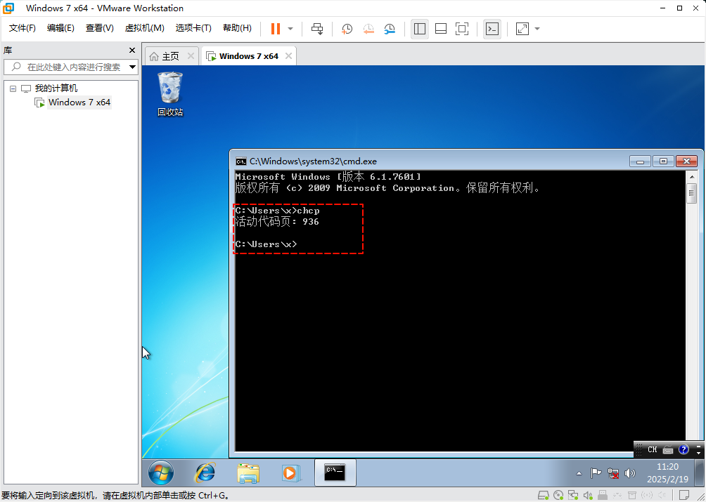

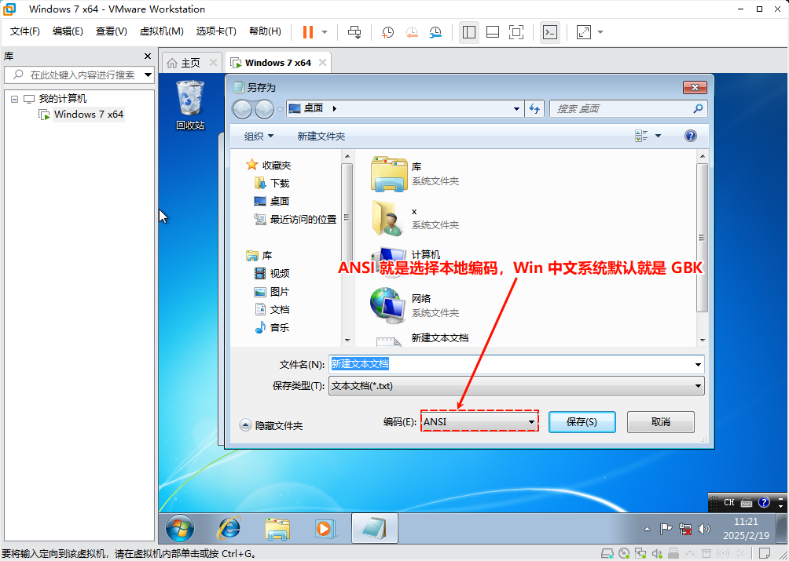

* 但是，随着时间的推移，硬件的性能越来越强大，由于历史遗留问题，Windows 的内核依然是 UTF-16 编码；但是，控制台虽然依然是 GBK 编码，文件编码却早已改为了 UTF-8 编码，如下所示：

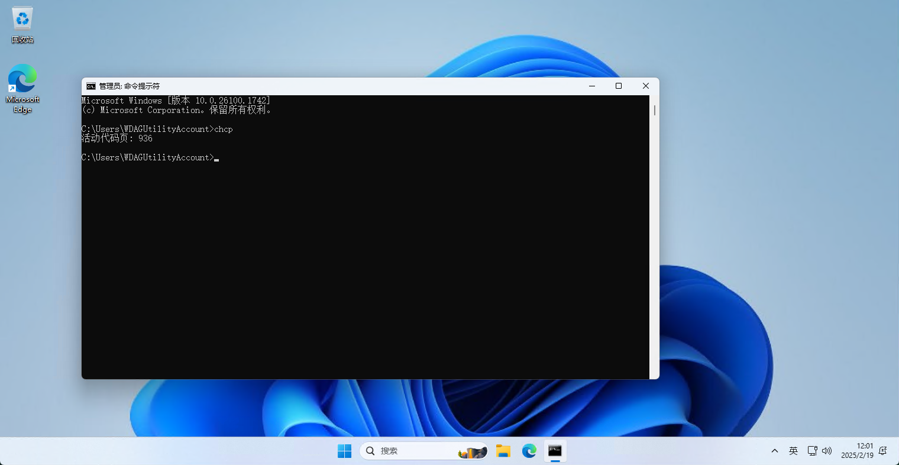

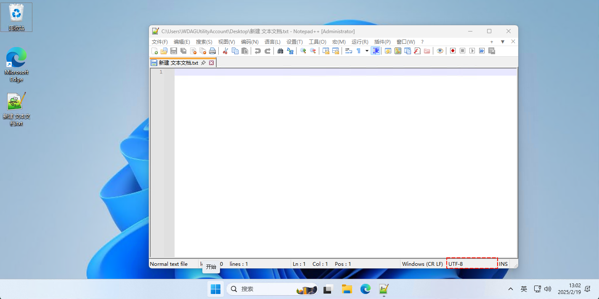

### 4.2.2 Linux

* Linux 默认就是 `UTF-8` 编码，如下所示：

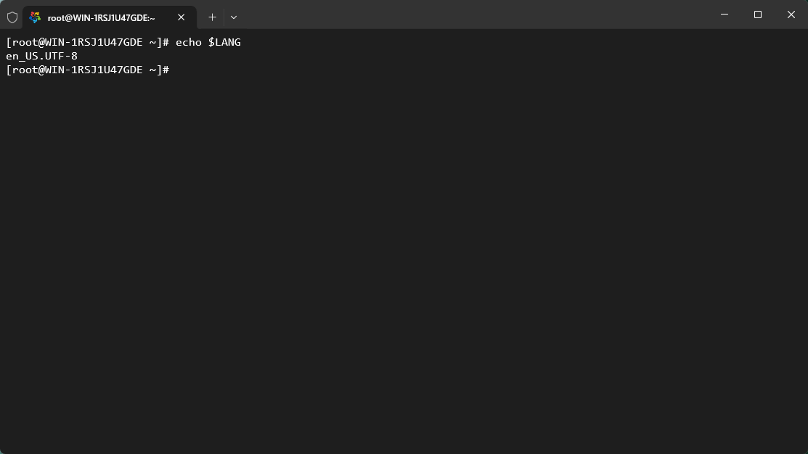

## 4.3 JDK 18 之前

### 4.3.1 概述

* Java 是在 1996 年的时候发布的第一个版本，Unicode 已经成为一种广泛支持的字符集，而 UTF-16 已被认为是处理 Unicode 字符的标准方式之一。
* Java 设计者选择使用 UTF-16，是为了确保与 Unicode 标准的兼容性，且这种选择在当时广泛被其他操作系统（Windows NT）采用。

### 4.3.2 字符串编码

* Java 中的字符串在内存中的表示是 UTF-16 编码，即：Java 中的 `String` 类是基于 `UTF-16` 编码来存储字符的。


* 示例：

```java {42}
/**
 * The {@code String} class represents character strings. All
 * string literals in Java programs, such as {@code "abc"}, are
 * implemented as instances of this class.
 * <p>
 * Strings are constant; their values cannot be changed after they
 * are created. String buffers support mutable strings.
 * Because String objects are immutable they can be shared. For example:
 * <blockquote><pre>
 *     String str = "abc";
 * </pre></blockquote><p>
 * is equivalent to:
 * <blockquote><pre>
 *     char data[] = {'a', 'b', 'c'};
 *     String str = new String(data);
 * </pre></blockquote><p>
 * Here are some more examples of how strings can be used:
 * <blockquote><pre>
 *     System.out.println("abc");
 *     String cde = "cde";
 *     System.out.println("abc" + cde);
 *     String c = "abc".substring(2, 3);
 *     String d = cde.substring(1, 2);
 * </pre></blockquote>
 * <p>
 * The class {@code String} includes methods for examining
 * individual characters of the sequence, for comparing strings, for
 * searching strings, for extracting substrings, and for creating a
 * copy of a string with all characters translated to uppercase or to
 * lowercase. Case mapping is based on the Unicode Standard version
 * specified by the {@link java.lang.Character Character} class.
 * <p>
 * The Java language provides special support for the string
 * concatenation operator (&nbsp;+&nbsp;), and for conversion of
 * other objects to strings. For additional information on string
 * concatenation and conversion, see <i>The Java Language Specification</i>.
 *
 * <p> Unless otherwise noted, passing a {@code null} argument to a constructor
 * or method in this class will cause a {@link NullPointerException} to be
 * thrown.
 *
 * <p>A {@code String} represents a string in the UTF-16 format
 * in which <em>supplementary characters</em> are represented by <em>surrogate
 * pairs</em> (see the section <a href="Character.html#unicode">Unicode
 * Character Representations</a> in the {@code Character} class for
 * more information).
 * Index values refer to {@code char} code units, so a supplementary
 * character uses two positions in a {@code String}.
 * <p>The {@code String} class provides methods for dealing with
 * Unicode code points (i.e., characters), in addition to those for
 * dealing with Unicode code units (i.e., {@code char} values).
 *
 * <p>Unless otherwise noted, methods for comparing Strings do not take locale
 * into account.  The {@link java.text.Collator} class provides methods for
 * finer-grain, locale-sensitive String comparison.
 *
 * @implNote The implementation of the string concatenation operator is left to
 * the discretion of a Java compiler, as long as the compiler ultimately conforms
 * to <i>The Java Language Specification</i>. For example, the {@code javac} compiler
 * may implement the operator with {@code StringBuffer}, {@code StringBuilder},
 * or {@code java.lang.invoke.StringConcatFactory} depending on the JDK version. The
 * implementation of string conversion is typically through the method {@code toString},
 * defined by {@code Object} and inherited by all classes in Java.
 *
 * @author  Lee Boynton
 * @author  Arthur van Hoff
 * @author  Martin Buchholz
 * @author  Ulf Zibis
 * @see     java.lang.Object#toString()
 * @see     java.lang.StringBuffer
 * @see     java.lang.StringBuilder
 * @see     java.nio.charset.Charset
 * @since   1.0
 * @jls     15.18.1 String Concatenation Operator +
 */

public final class String
    implements java.io.Serializable, Comparable<String>, CharSequence,
               Constable, ConstantDesc {
	...               
}                   
```

### 4.3.3 文件编码

* 默认情况下，对于文件，Java 使用的是`平台默认`的编码，即：在 `Windows` 上通常是 `GBK`，而在 `Linux` 上通常是 `UTF-8` 。
* 当然，我们在使用 `InputStreamReader` 或 `OutputStramWriter` 等类的时候，也可以手动指定编码。


* 示例：

```java {5}
/**
 * Reads text from character files using a default buffer size. Decoding from bytes
 * to characters uses either a specified {@linkplain java.nio.charset.Charset charset}
 * or the platform's
 * {@linkplain java.nio.charset.Charset#defaultCharset() default charset}.
 *
 * <p>
 * The {@code FileReader} is meant for reading streams of characters. For reading
 * streams of raw bytes, consider using a {@code FileInputStream}.
 *
 * @see InputStreamReader
 * @see FileInputStream
 *
 * @author      Mark Reinhold
 * @since       1.1
 */
public class FileReader extends InputStreamReader {
    ...
}
```


* 示例：

```java {6,61}
/**
 * An InputStreamReader is a bridge from byte streams to character streams: It
 * reads bytes and decodes them into characters using a specified {@link
 * java.nio.charset.Charset charset}.  The charset that it uses
 * may be specified by name or may be given explicitly, or the platform's
 * {@link Charset#defaultCharset() default charset} may be accepted.
 *
 * <p> Each invocation of one of an InputStreamReader's read() methods may
 * cause one or more bytes to be read from the underlying byte-input stream.
 * To enable the efficient conversion of bytes to characters, more bytes may
 * be read ahead from the underlying stream than are necessary to satisfy the
 * current read operation.
 *
 * <p> For top efficiency, consider wrapping an InputStreamReader within a
 * BufferedReader.  For example:
 *
 * <pre>
 * BufferedReader in
 *   = new BufferedReader(new InputStreamReader(anInputStream));
 * </pre>
 *
 * @see BufferedReader
 * @see InputStream
 * @see java.nio.charset.Charset
 *
 * @author      Mark Reinhold
 * @since       1.1
 */

public class InputStreamReader extends Reader {

    private final StreamDecoder sd;

    /**
     * Creates an InputStreamReader that uses the
     * {@link Charset#defaultCharset() default charset}.
     *
     * @param  in   An InputStream
     *
     * @see Charset#defaultCharset()
     */
    public InputStreamReader(InputStream in) {
        super(in);
        sd = StreamDecoder.forInputStreamReader(in, this,
                Charset.defaultCharset()); // ## check lock object
    }

    /**
     * Creates an InputStreamReader that uses the named charset.
     *
     * @param  in
     *         An InputStream
     *
     * @param  charsetName
     *         The name of a supported
     *         {@link java.nio.charset.Charset charset}
     *
     * @throws     UnsupportedEncodingException
     *             If the named charset is not supported
     */
    public InputStreamReader(InputStream in, String charsetName)
        throws UnsupportedEncodingException
    {
        super(in);
        if (charsetName == null)
            throw new NullPointerException("charsetName");
        sd = StreamDecoder.forInputStreamReader(in, this, charsetName);
    }
    
    ...   

}    
```

## 4.4 JDK 18 之后

* 在 JDK18 之后，Java 开始使用 UTF-8 作为默认的字符集，而不再根据操作系统的默认编码来决定。这是为了确保跨平台的一致性，减少因字符编码不一致而导致的问题。

* 这个变化始于 [JEP 400: UTF-8 by Default](https://openjdk.org/jeps/400)，它在 JDK 18 版本中被正式引入并生效。

