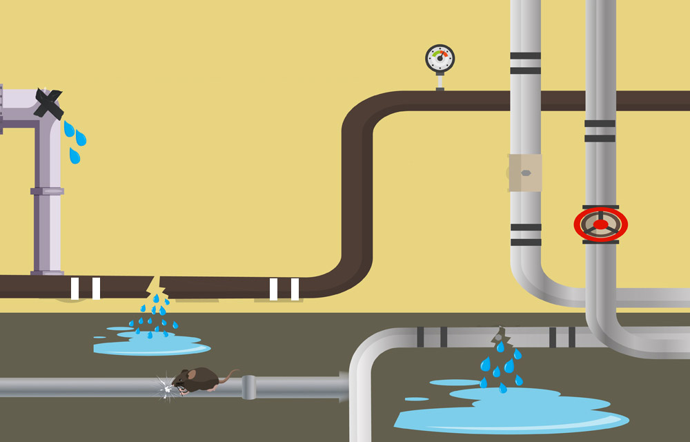
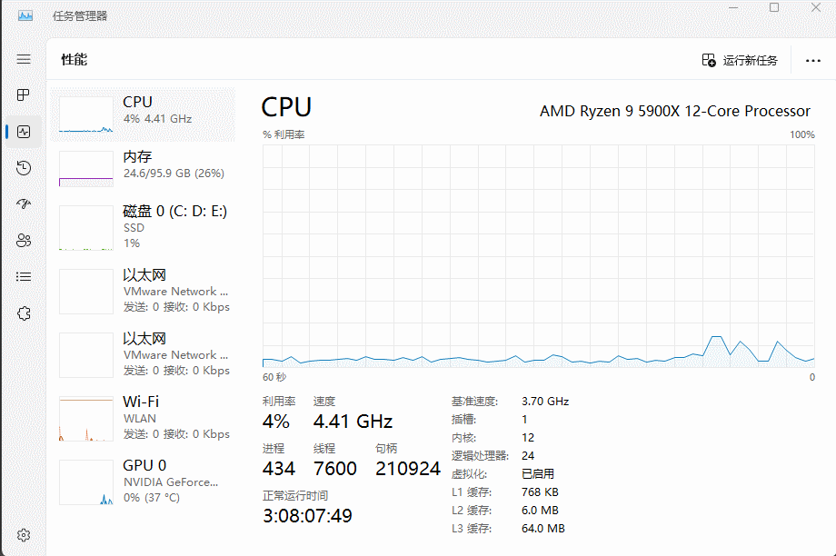

# 第一章：内存泄漏（Memory Leak）

## 1.1 概述

* 有没有过这样的日子，总感觉我们的电脑，不是一个尖端的设备，而像一只疲惫的蜗牛。它在缓慢的爬行，并试图背着重重的楼房去跑马拉松，如下所示：


> [!NOTE]
>
> * ① 儿歌《蜗牛与黄鹂鸟》的歌词的主旨是想通过蜗牛与黄鹂鸟的对话，表达了努力和坚持的重要性，即使速度慢，只要坚定地往前走，总会达到目标。
>
> ::: details 点我查看《蜗牛与黄鹂鸟》的歌词
>
> * 阿门阿前一棵葡萄树。
> * 阿嫩阿嫩绿地刚发芽。
> * 蜗牛背着那重重的壳呀。
> * 一步一步地往上爬。
> * 阿树阿上两只黄鹂鸟。
> * 阿嘻阿嘻哈哈在笑它。
> * 葡萄成熟还早得很哪。
> * 现在上来干什么。
> * 阿黄阿黄鹂儿不要笑。
> * 等我爬上它就成熟了。
>
> :::
>
> * ② 但是，也从侧面说明了蜗牛的速度真的很慢。

* 亦或者，我们的电脑就像一个蹒跚学步的孩子在发脾气，我们多么希望她们耐心点，并配合我们。可是，她们总是拒绝和我们合作，如下所示：


* 如果这些场景，你都感觉很熟悉，那么你很有可能就是`内存泄漏`的受害者。

> [!NOTE]
>
> * ① `内存泄漏`虽然不可见，但是它会悄悄的蚕食计算机的性能，让曾经快速的系统变成一台陈旧的机器。
> * ② 最为糟糕的时，和留下明显迹象的`漏水`不同，`内存泄漏`是不可见的，这使得它们难以识别，甚至难以修复。也正是因为这个特点，让开发人员和计算机用户都感觉头疼。

## 1.2 什么是内存泄漏？

* 我们可以将我们的计算机想象成一个繁华的城市，城市的`道路`就代表着计算器的`内存`（计算机的内存是有限的，普遍的家用个人台式机电脑最多只支持 `4` 根内存条。如果是 `DDR4` 的话，最多也就支持 `128` GB。就算是服务器，也不是无穷无尽的），在其上运行的`程序`就像`车辆`一样，每辆车都执行各自的任务，如下所示：

> [!NOTE]
>
> * ① 操作系统或计算机允许程序自己分配内存，并自由使用。并且，当程序执行完自己的任务之后，还可以释放掉内存，将内存还给操作系统或计算机。
> * ② 需要说明的是，并不是程序结束运行，才会释放掉内存：在 C/C++ 等语言中，是可以在程序执行完任务之后，由程序员手动释放之前申请的内存，即：调用释放内存的函数。而 Java 等 GC 的编程语言，会由 GC 帮助程序员释放内存，当然从理论上讲会有稍许停顿。但是，像 Java 语言中的 ZGC 现在已经可以控制在 10ms 了，人几乎感觉不到！！！
> * ③ 所谓的`分配内存`，就是程序向计算机或操作系统，申请一块内存空间，然后自己使用。
> * ④ 所谓的`释放内存`，就是程序告诉计算机或操作系统，不再需要使用之前申请的内存空间，那么就可以将之前申请的内存空间，归还给操作系统或计算机，让其它的程序使用。
> * ⑤ 上面例子中的`程序`就像`车辆`一样，每辆车都执行各自的任务，类似于程序在执行的时候，向操作系统申请自己的内存空间，并完成自己的任务。


* 但是，如果有些车辆在完成自己的任务之后，就决定无限期的停在路上，而不是离开。那么，可以想象到的是，随着时间的推移，这些停放的汽车就会开始阻塞城市的道路，减慢交通速度，如下所示：


> [!NOTE]
>
> * ① 需要说明的是，道路或网络的利用率并非越高越好。
> * ② 如果使用 D0 表示道路或网络空闲时的时延（数据包（或车辆）几乎没有排队，时延 D0 只是基本的传输或行驶时间），而 D 表示道路或网络当前的时延（数据包（或车辆）可能需要排队，这导致了额外的时延，时延 D 是包含了排队时间的总时延），那么在理想的条件下，可以使用如下的表达式来表示 D、D0 以及道路或网络利用率 U 之间的关系，即：$U = \frac{D - D_0}{D}$，经过换算一下，其结果就是：$D = \frac{D_0}{1 - U}$。
> * ③ 显而易见，道路或网络利用率并不是越大越好，过高的道路或网络利用率会产生非常大的时延。

* 由此可见，在极端情况下，这座城市甚至可能陷入停顿。

> [!NOTE]
>
> 这实际上就是`内存泄漏`对计算机的影响，即：
>
> * ① 程序可能会变慢，甚至崩溃，特别是在长时间运行的程序中。
> * ② `内存泄漏`会逐渐耗尽系统内存，造成资源浪费，并导致系统性能下降。

* 再或者，在生活中，我们必然需要用水，如果规定每个人一个月的用水量不能超过 `10t`，那么三口之间每个月的用水量就不能超过 `30t`。假设，由于水管老化或小动物（老鼠）的影响，而导致家中的水管产生轻微的破损，产生漏水的现象，如下所示：



* 那么，家中隐藏的漏水问题在很长一段时间内是不会被注意到的。亦或者，假设每个人的用水量都没有限制，那么如果要用到 `30t` ，必然会比之前没有漏水的时候，产生的水费也要多很多。

> [!IMPORTANT]
>
> 官方定义：`内存泄漏`是指计算机程序无意中消耗的一种特定类型的内存，其中程序无法释放不再需要或使用的内存（这种内存虽然不再被程序使用，但仍然占据着系统资源），进而导致这些内存无法被系统或其他程序再次使用，随着时间的推荐，会逐渐耗尽系统内存，并最终导致系统性能下降。

## 1.3 什么会触发内存泄漏？

* 导致`内存泄漏`的原因很多，具体取决于编程语言、平台和特定的应用程序场景。

> [!NOTE]
>
> ::: details 点我查看，一些导致`内存泄漏`最常见的原因
>
> * ① **未关闭的资源**：未能关闭文件、数据库连接或网络套接字等资源可能会导致`内存泄漏`。如果这些资源保持打开状态，可能会随着时间的推移而累积并消耗大量内存。
> * ② **未释放的对象引用**：保留不再需要的对象引用可以防止垃圾回收器（在具有它们的语言中）回收内存。
> * ③ **循环引用**：在某些语言中，两个相互引用的对象可能会导致两个对象都无法被垃圾回收的情况，即使程序的其他部分没有引用它们。
> * ④ **静态集合**：使用随时间增长而从未清除的静态数据结构可能会导致`内存泄漏`。例如：将元素添加到静态列表而不删除它们可能会导致列表无限增长。
> * ⑤ **事件侦听器**：不分离事件侦听器或回调可能会导致`内存泄漏`，尤其是在 Web 浏览器等环境中。如果对象已附加到事件但不再使用，则不会对其进行垃圾回收，因为该事件仍包含对它的引用。
> * ⑥ **中间件和第三方库**：有时，`内存泄漏`的原因可能不在于应用程序代码，而在于它使用的中间件或第三方库。这些组件中的错误或低效代码可能会导致`内存泄漏`。
> * ⑦ **内存管理不当**：在开发人员手动管理内存的语言，如： C、C++ 中，使用后未能释放内存或使用 “悬空指针” 可能会导致泄漏。
> * ⑧ **内存碎片**：虽然不是传统意义上的泄漏，但碎片会导致内存使用效率低下。随着时间的推移，内存分配之间的小间隙会累积，从而难以分配更大的内存块。
> * ⑨ **孤立线程**：生成但未正确终止的线程可能会消耗内存资源。这些孤立线程会随着时间的推移而累积，尤其是在长时间运行的应用程序中。
> * ⑩ **缓存过度使用**：在没有适当驱逐策略的情况下实施缓存机制可能会导致内存无限消耗，尤其是在缓存无限增长的情况下。
>
> :::

* 在 C 语言中，可以使用 `while` 循环并结合 `malloc` 函数来实现一个内存泄漏的例子，即：

```c
#include <stdbool.h>
#include <stdlib.h>

int main() {
    while (true) {    // 死循环
        malloc(1024); // 分配1024个字节的内存
    }
    return 0;
}
```

* 如果我们在 Windows 上运行该程序，就可以打开 Windows 的任务管理器（快捷键是`Ctrl + Shift + ESC`），将会发现内存的使用率在飙升。当然，稍等片刻后程序会被终止，是因为 Windows  的内存管理机制，发现我们的程序占用内存太多，会让它崩溃，防止系统卡死（其它的操作系统也有相应的措施）。



## 1.4 内存泄漏会导致什么后果？

* ① `内存使用量增加`：随着泄漏和释放的内存越来越多，整体系统内存使用量会增加。这会减少可用于其他进程和应用程序的内存，从而降低系统速度。
* ② `增加分页`：随着`内存泄漏`的累积，系统可能会开始将内存内容交换到磁盘以释放 RAM，从而导致更多的磁盘 I/O。这会导致性能降低，因为磁盘操作比内存操作慢得多。
* ③ `内存不足错误`：如果`内存泄漏`足够多，系统最终可能会完全耗尽可用内存。这可能会导致崩溃、内存分配失败和程序终止。
* ④ `资源争用`：较高的内存使用率还会导致对缓存和资源（如：CPU 时间等）的更多争用，因为系统尝试管理有限的资源。这会进一步降低性能。
* ⑤ `应用程序不稳定`：随着内存使用量随着时间的推移而增长，存在`内存泄漏`的应用程序可能会遇到崩溃、意外行为和间歇性故障。这会导致不稳定和可靠性问题。
* ⑥ `安全风险`：`内存泄漏`会使数据在内存中的延迟时间超过预期。此数据可能包含密码、密钥或其他敏感信息，如果恶意软件或攻击者访问这些信息，则会带来安全风险。

## 1.5 检测内存泄漏的工具或技术

* ① `分析工具`：
  * ① Valgrind：用于构建动态分析工具的检测框架，最有名的 Memcheck 的套件，可以检测 C 和 C++ 程序中的内存泄漏。
  * ② Java VisualVM：适用于 Java 应用程序的监控、故障排除和分析工具。
  * ③ .NET Memory Profiler：用于查找内存泄漏并优化 .NET 应用程序中的内存使用的工具。
  * ④ Golang pprof：该工具可让您收集 Go 程序的 CPU 配置文件、跟踪和堆配置文件。
* ② `浏览器开发工具`：Chrome、Firefox 和 Edge 等现代 Web 浏览器附带内置的开发人员工具，可帮助识别 Web 应用程序中的内存泄漏，尤其是 JavaScript 中的内存泄漏。
* ③ `静态分析`：Lint、SonarQube 或 Clang Static Analyzer 等工具可以扫描代码以识别可能导致内存泄漏的模式。
* ④ `自动化测试`：将内存泄漏检测整合到自动化测试中有助于在开发周期的早期捕获泄漏，如：JUnit（适用于 Java）或 pytest（适用于 Python）等工具可以与内存分析工具集成，以自动执行此过程。
* ⑤ `堆分析`：检查应用程序的堆转储，可以深入了解正在消耗内存的对象，如：Eclipse MAT（内存分析器工具）或 Java 堆分析工具 （jhat）等工具可以协助进行此分析。
* ⑥ `指标`：实施指标来监控一段时间内的内存使用情况，有助于识别导致内存消耗增加的模式或特定操作，如：Prometheus 和 Grafana 等。
* ⑦ `第三方库和中间件`：一些第三方解决方案提供内置的内存泄漏检测功能。如果我们怀疑这些组件可能是泄漏源，则必须查看与这些组件相关的文档或论坛。
* ⑧ `手动代码审查`：有时，识别内存泄漏的最佳方法是对代码进行彻底的手动审查，尤其是在分配和释放内存的区域中。
* ⑨ `压力测试`：在高负载或长时间运行应用程序，有助于暴露在正常情况下可能不明显的内存泄漏。

## 1.6 如何避免内存泄漏？

* ① `及时释放内存`：在程序中，确保在不再需要使用内存时及时释放它。
* ② `智能指针`：使用智能指针来帮助在 C++ 等编程语言中进行自动内存管理。
* ③ `将编程语言与垃圾回收器一起使用`：内存分配和释放由 Python 和 Java 等编程语言自动处理，这些语言包含内置的垃圾收集系统。
* ④ `利用内存管理策略`： 有效的内存管理可以防止内存泄漏。这包括始终监控我们的软件使用了多少内存，并了解何时分配和取消分配内存，即：检测内存泄漏的工具或技术。

## 1.7 总结

* `内存泄漏`是由于未释放不再使用的内存，导致内存资源逐渐减少，但不会立即导致程序崩溃，而是`长时间`运行后可能出现性能问题或最终崩溃。


# 第二章：内存溢出（Out Of Memory，OOM）

## 2.1 概述

* 首先，说明一点，在国内的很多文章中，都将 `Out Of Memory（OOM）`翻译为 `内存溢出`，但是本人认为翻译为`内存不足`更为贴切。
* 在生活中，我们在使用计算机的时候，可能会遇到打开视频网站的时候，视频网站崩溃了，并且在浏览器上显示报错信息`Error Code Out Of Memory`，如下所示：


* 当然，我们在使用微软办公套件，如：Outlook 的时候，可能也会遇到系统提示 `Out Of Memory`，如下所示：


* 亦或者，我们在打游戏的时候，会遇到系统提示 `Out Of Memory`，如下所示：


* 上述的种种情景，都表明了内存溢出（内存不足，OOM）是`立即显现`的问题，尤其是当系统无法分配足够内存时，会直接导致程序崩溃或异常。

> [!NOTE]
>
> * ① 内存泄漏是一种`逐渐积累`的问题，会耗尽系统内存，可能最终导致内存不足（理解：站着茅坑不拉稀，最终可能导致可用的茅坑越来越少，后面的人就只能等着o(╥﹏╥)o）。
> * ② 内存溢出（不足）是一种`立即显现`的问题，当系统无法分配足够内存时，会`直接`导致程序崩溃或异常（理解：大象塞进冰箱，冰箱不是无限大，最终可能导致大象身体的一部分露出来，这不就`溢出`吗？换言之，就是冰箱（内存）的容量有限啊，`不`能满`足`实际需要）。

> [!IMPORTANT]
>
> 官方定义：当计算机没有足够的内存来执行操作或运行应用程序时，会发生内存不足 （OOM） 错误。此内存可以是`物理 RAM`（随机存取内存） 或`虚拟内存`，它使用磁盘空间扩展物理内存。当系统耗尽可用内存时，它无法再满足`内存分配`请求，从而导致 OOM 错误。此错误表示除非释放或添加内存，否则系统无法处理进一步的需求。

## 2.2 什么会触发内存溢出？

* 导致`内存溢出`的原因很多，具体取决于编程语言、平台和特定的应用程序场景。
* 以下是一些导致`内存溢出`最常见的原因：
  * ① `无限循环或递归`：如果程序中的循环或递归没有正确终止条件，可能会一直运行，消耗掉所有可用内存。
  * ② `内存泄漏`：程序不断分配内存而不释放，最终导致可用内存耗尽。这通常是因为程序在使用完某些数据后，没有正确地释放相关的内存。
  * ③ `处理大数据集`：如果程序试图一次性加载或处理一个超大的数据集，而该数据集的大小超过了系统的可用内存，这可能会导致内存溢出。
  * ④ `资源过度分配`：一些程序在运行时，可能会为某些资源（如缓存、临时数据）分配过多的内存，导致整体系统内存不足。
  * ⑤ `错误的内存管理`：在手动管理内存的编程语言中（如：C 或 C++），如果程序错误地管理内存（如：重复释放、未释放或非法访问内存），也可能引发内存泄漏，进而导致内存溢出。
  * ⑥ `并发操作`：如果多个进程或线程并发地进行大量内存分配操作，且这些操作没有得到有效控制，也可能导致系统内存被耗尽。
  * ⑦ `外部库或工具的 Bug`：使用的第三方库或工具中存在内存管理相关的 bug，也可能导致内存溢出。

## 2.3 如何避免内存溢出？

* ① `优化数据处理`：
  * 分块处理大数据集：如果需要处理大数据集，可以将数据分块处理，而不是一次性加载整个数据集到内存中。例如：处理大型文件时，可以逐行读取或分批读取。
  * 使用流式处理：对于需要处理大量数据的操作，可以采用流式处理（streaming），这样只保留当前处理的部分数据在内存中，而非全部数据。
* ② `管理对象生命周期`：
  * 及时释放不再使用的对象：在使用动态分配内存的编程语言（如：C++、C#、Java 等）时，确保在对象不再需要时及时释放内存。即使在使用垃圾回收机制的语言（如：Java、Python），也要尽量避免保留对不必要对象的引用，以便垃圾回收器可以及时清理它们。
  * 使用智能指针或自动内存管理：在手动管理内存的编程语言中，使用智能指针（如：C++中的`std::unique_ptr`或`std::shared_ptr`）来自动管理内存，减少内存泄漏的风险。
* ③ `优化算法`：
  * 选择更高效的算法：对于需要大量计算或数据处理的任务，选择内存占用更少的算法。例如：尽量使用原地（in-place）算法，它们不需要额外的内存空间。
  * 减少冗余数据：避免在内存中存储冗余数据，尽可能在计算过程中利用已有的数据结构，避免重复分配相同的数据。
* ④ `监控和调试`：
  * 使用内存分析工具：在开发过程中，使用内存分析工具（如：Valgrind、VisualVM、Py-Spy 等）来监控程序的内存使用情况，查找和修复内存泄漏或不必要的内存分配。
  * 设置内存使用限制：在某些环境中，可以设置程序的最大内存使用量，这样当程序达到内存限制时，可以捕捉并处理内存溢出的情况。
* ⑤ `避免无限循环和递归`：
  - 设置循环或递归的终止条件：确保所有循环和递归都有明确的终止条件，避免因逻辑错误导致无限执行，从而耗尽内存。
  - 使用尾递归优化：在支持尾递归优化的语言中，尽量使用尾递归，以减少递归调用带来的内存消耗。
* ⑥ `并发编程中的内存管理`：
  * 控制并发操作的内存分配：在并发编程中，尽量避免多个线程或进程同时大量分配内存。可以通过任务分配、锁机制等方式合理控制并发操作的内存使用。
  * 避免死锁：确保在并发编程中避免死锁情况，因为死锁可能会导致内存资源无法被释放，从而引发内存溢出。
* ⑦  `使用适当的数据结构`：
  * 选择合适的数据结构：根据需要选择内存效率更高的数据结构。例如，使用数组而不是链表来存储连续的数据，使用哈希表来提高查找效率等。
  * 避免不必要的缓存：在程序中使用缓存时，确保缓存的大小是合理的，并且有清理机制，防止缓存占用过多内存。

## 2.4 避免内存溢出的最佳实践

* 避免内存溢出通常需要良好的内存管理实践，如：优化数据处理算法、合理控制资源分配、以及定期检查和释放不再使用的内存。

## 2.5 总结

* `内存溢出`则是由于内存资源耗尽，程序试图分配新内存时失败，通常会导致程序的`立即`崩溃或异常终止。


# 第三章：内存泄漏 VS 内存溢出

## 3.1 概述

* `内存泄漏`是由于未释放不再使用的内存导致内存资源逐渐减少，但不会立即导致程序崩溃，而是长时间运行后可能出现性能问题或最终崩溃。
* `内存溢出`则是由于内存资源耗尽，程序试图分配新内存时失败，通常会导致程序的立即崩溃或异常终止。

> [!NOTE]
>
> * ① `内存泄漏`和`内存溢出`都与内存管理不当有关，但它们发生的机制和直接影响是不同的。
> * ② 避免`内存泄漏`和`内存溢出`都是编写高效、可靠软件的重要方面。

## 3.2 内存泄漏和内存溢出的联系和区别

> [!IMPORTANT]
>
> `内存泄漏`和`内存溢出`之间并不是必然的因果关系，而是两者可能会相互影响。
* ① `内存泄漏`导致`内存溢出`的可能性：
  * 如果一个程序长期运行并且持续发生`内存泄漏`，未被释放的内存会慢慢积累，最终占用系统的大部分内存资源。如果`内存泄漏`严重到占用了所有可用内存，那么程序就会因为无法再分配新的内存，而出现`内存溢出`（Out of Memory）的情况。
  * 因此，`内存泄漏`可以**间接**地导致`内存溢出`，特别是在长时间运行的程序或系统中。
* ②  `内存泄漏`和`内存溢出`的区别：
  * `内存泄漏`是指程序持续占用内存却不释放，导致可用内存逐渐减少。这种情况可能会在`长时间`内不显现问题，特别是如果程序只泄漏了少量内存。
  * `内存溢出`则是一个更`急剧`的问题，它通常在程序尝试分配超过系统可用内存的大块内存时`立刻`发生，导致程序崩溃或异常终止。
* ③ 不必然性：
  * 一个程序可能会发生`内存泄漏`，但因为泄漏的内存量很小，系统资源丰富，所以在短时间内不会出现`内存溢出`。
  * `内存溢出`也可以在没有`内存泄漏`的情况下发生，如：一个程序需要处理非常大的数据集，直接导致内存不足。
> [!IMPORTANT]
>
> * ① `内存泄漏`有可能会在长时间积累后导致`内存溢出`，但这并不是必然的。
> * ② `内存溢出`可以在多种情况下发生，而`内存泄漏`只是其中可能的一个诱因。
> * ③ 因此，虽然`内存泄漏`可能最终引发`内存溢出`，但两者之间并非每次都是直接关联的。


