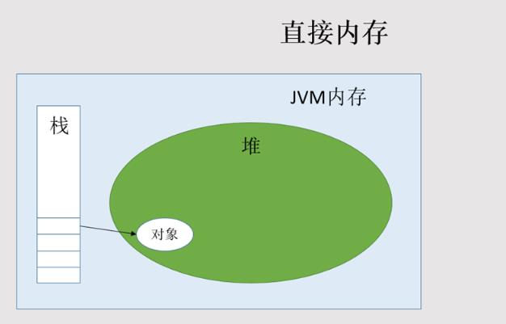
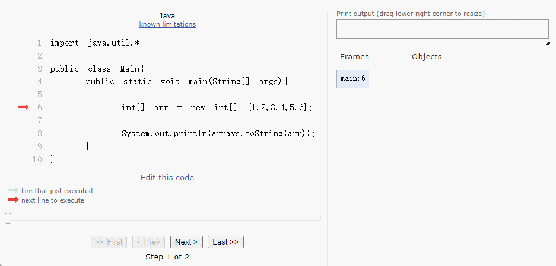

# 第一章：数组的概念

## 1.1 为什么需要数组？

### 1.1.1 需求分析 1

* 需要统计某公司 50 个员工的工资情况，例如：计算平均工资、最高工资等。如果使用之前的知识，我们需要声明 50 个变量来分别记录每位员工的工资，即：

```java
package com.github.study;

import java.util.Scanner;

public class ArrayDemo1 {
    public static void main(String[] args) {
        Scanner scanner = new Scanner(System.in);

        System.out.print("请输入第 1 个员工的工资："); // [!code focus]
        double salary1 = scanner.nextDouble(); // [!code focus]

        System.out.print("请输入第 2 个员工的工资："); // [!code focus]
        double salary2 = scanner.nextDouble(); // [!code focus]

        System.out.print("请输入第 3 个员工的工资："); // [!code focus]
        double salary3 = scanner.nextDouble(); // [!code focus]

		...   
            
        scanner.close();
    }
}
```

* 这样会感觉特别机械和麻烦（全是复制（Ctrl + c）和粘贴（Ctrl + v），CV 大法）；此时，我们就可以将所有的`数据`全部存储到一个`容器（数组）`中进行统一管理，并进行其它的操作，如：求最值、求平均值等，如下所示：

```java {13-16}
package com.github.study;

import java.util.Scanner;

public class ArrayDemo2 {
    public static void main(String[] args) {
        Scanner scanner = new Scanner(System.in);

        // 定义数组
        double[] arr = new double[50];

        // 使用 for 循环向数组中添加每个员工的工资
        for (int i = 0; i < arr.length; i++) {  
            System.out.print("请输入第 " + (i + 1) + " 个员工的工资："); 
            arr[i] = scanner.nextDouble(); 
        }

        // 其余的业务处理，如：求最值、求平均值等。
		...
            
        scanner.close();
    }
}
```

### 1.1.2 需求分析 2

* 在现实生活中，我们会使用很多 APP 或微信小程序等，即：


* 同样的道理，如果我们使用变量来存储每个商品信息，那么就需要非常多的变量；但是，如果我们将这些`商品信息`都存储到一个`容器（数组）`中，进行统一管理；那么，之后的数据处理将会非常方便。

### 1.1.3 容器的概念

* `生活中的容器`：水杯（装水、饮料的容器）、衣柜（装衣服等物品的容器）、集装箱（装货物等物品的容器）。


* `程序中的容器`：将多个数据存储到一起，并且每个数据称为该容器中的元素。


## 1.2 什么是数组？

* 数组（Array）是将多个`相同数据类型`的`数据`按照一定的顺序排序的`集合`，并使用一个`标识符`命名，以及通过`编号（索引，亦称为下标）`的方式对这些数据进行统一管理。


* 上述的`定义`描述了`数组`的`核心特性`：
  * ① `聚合数据类型`（构造类型）：数组能够存储多个元素，它是一种聚合数据类型。
  * ② `数据类型一致性`：数组中的所有元素都必须具有相同的数据类型。
  * ③ `有序存储`：每个元素在数组中都有唯一的编号，这个编号的最小值是 0 ，最大值是数组长度 - 1 。这些编号也被称为数组的索引或下标。

> [!CAUTION]
>
> * ① 数组是一种特殊的聚合变量，它可以存储多个同类型的元素，而这些元素可以通过索引或下标进行访问。
> * ② 数组本身是一个容器，而数组中的每个元素可以是`基本数据类型变量`或`引用数据类型变量`。
> * ③ 数组既可以存储基本数据类型的元素，如：int、float ；也可以存储引用数据类型的元素，如：数组、枚举。

## 1.3 数组的相关概念

* `数组名`：本质上是一个标识符常量，命名需要符合标识符规则和规范。
* `元素`：同一个数组中的元素必须是相同的数据类型。
* `索引（下标）`：从 0 开始的连续数字。
* `数组的长度`：就是元素的个数。

## 1.4 数组的数据结构和优缺点

### 1.4.1 线性表和数组

* 可能很多人没有学习过《数据结构和算法》，那么我们需要先明确《数据结构和算法》中的两个核心概念：

> [!NOTE]
>
> * ① `逻辑结构`：描述数据元素之间的`逻辑关系`。
>   
>   ::: details 点我查看 常见的逻辑结构
>   
>   * 线性表：元素之间是一对一的关系。
>   * 树形结构：一个层次结构的节点集合，其中 n （n ≥ 0）个节点有明确的上下级关系。
>   
>   :::
> * ② `物理结构`：描述数据元素是如何在存储介质（如：硬盘、内存等）上的物理存储。
>
>   ::: details 点我查看 常见的物理结构
>
>   * 数组：线性表的一种常见的物理实现，要求元素在内存中连续存储。
>   * 链表：线性表的另外一种常见的物理实现，元素在内存中可以不连续；但是，要求每个元素指向一个元素，形成链式结构。
>
>   :::

* 基于上述的背景知识，数组需要一块连续的内存空间来存储元素（假设是 int 类型的数组），如下所示：


### 1.4.2 随机访问和非随机访问

#### 1.4.2.1 概述

* `随机访问`和`非随机访问`，通常用于描述计算机存储系统的访问方式，尤其是在内存和存储设备（硬盘等）中。

#### 1.4.2.2 随机访问（Random Access）

* `随机访问`指的是在存储设备中可以`直接访问`任何存储位置，而不必按照顺序访问。
* 它的关键特点就在于：访问存储器中的任意数据所花费的时间是恒定的，与数据的位置无关。其主要应用于随机存取存储器（RAM），如：内存（DRAM）和寄存器（SRAM）。

> [!NOTE]
>
> * ① 之所以称为“随机访问”，是因为系统可以在存储单元中“随机”选择并直接访问任何位置的数据，而不需要依次扫描。
> * ② 相对于“非随机访问”，随机访问大大提升了效率，尤其是在需要频繁获取特定数据的场景中。
> * ③ 随机访问的时间复杂度是 `O(1)`，而非随机访问的时间复杂度是 `O(n)`。

* 随机访问的特点，如下所示：
  * ① 访问速度快，能在相同的时间内访问任意位置。
  * ② 支持高效的读取和写入操作。
  * ③ 常用于内存（如：RAM），需要频繁读取和写入数据。

#### 1.4.2.3 非随机访问（顺序访问，Sequential Access）

* `非随机访问`指的是只能按照数据的存储顺序`依次`访问某些存储设备。它意味着访问某一特定位置的数据之前，必须首先访问存储在前面的数据。

> [!NOTE]
>
> * ① `磁带`就是一个典型的非随机访问设备。如果你想读取位于中间的数据，你必须从头开始读，直到到达所需的位置。
> * ② `光盘存储设备`，如：CD、DVD 等，尽管某些情况下可以随机访问，但其读取数据的方式更接近顺序访问，特别是在读取大块连续数据时表现更佳。
> * ③ `机械硬盘（HDD）`虽然支持随机访问，但由于其机械特性（磁头移动和磁盘旋转），顺序读取的效率更高。

* 非随机访问的特点，如下所示：
  * ① 访问速度较慢，因为需要按照顺序依次读取数据。
  * ② 适合数据量大、连续读取的场景。
  * ③ 常用于磁带存储或其他大容量存储设备。

### 1.4.3 数组的优点

* 数组的优点就在于可以实现随机访问，而其关键就在于`数据结构的连续内存分配`以及`固定的元素大小`：
  * `连续的内存分配`：当声明一个数组的时候，如：`int[] arr = new int[10];`，在程序运行的时候，操作系统会为该数组分配 `10` 个连续存储 int 的空间。因为，我们将有一块连续的空间，每个 int 元素都紧密地排列在一起。
  * `固定的元素大小`：数组中的每个元素都具有相同的大小，如：`int[] arr = new int[10];`中的每个 `int` 元素都占用 `4` 个字节的内存空间。

> [!NOTE]
>
> 上述两点，意味着数组中元素的内存地址，是均匀并可以连续计算的，这是实现随机访问必不可少的前提。

* 在了解上述的前提下，我们还需要了解两个概念：`基地址`和`偏移量`。我们想要随机访问数组中的某个元素，就需要知道目标元素的地址，其公式是：`[目标元素的地址] = 数组基地址 + 偏移量`。

> [!NOTE]
>
> * ① 数组基地址：就是数组首元素的地址，也是数组变量的地址（数组名在内存中就代表该数组的基地址）。
> * ② 偏移量：指的是目标元素地址和首元素地址的字节差值（字节差值 = 目标元素的下标(index) × 每个元素在内存中占用的字节大小(sizeof(element))）。

* 那么，目标元素地址的`寻址公式`就是这样的（假设基地址是 base_address，目标元素的地址 address ），如下所示：

```
address(arr[i]) = base_address(arr[0]) + index * sizeof(element);
```

* 那么，我们就可以通过该`寻址公式`，计算数组中任意元素的地址，如下所示：


* 所以，当我们使用 `arr[3]` 这样的语法访问数组中的元素的时候，程序会直接访问 `0x7fffffffd4fc`这个内存地址，来获取对应的内存空间中存储的值或向该内存地址所代表的内存空间设置值，而不需要再查找或遍历，效率非常高。

### 1.4.4 数组的缺点

* 数组通过基地址和下标，使用简单的寻址公式，实现了高效的随机访问。为了维持这种高效访问方式，数组在其结构和存储元素上都有明确的要求：

> [!NOTE]
>
> * ① `连续内存存储`：为确保可以直接计算每个元素的地址，数组必须占据一段连续的内存空间。
> * ② `统一的元素数据类型`：数组中的所有元素必须具有相同的数据类型，以保证每个元素的内存大小是固定的，从而保证了固定的地址偏移。

* 所以，我们可以推导出数组的缺点：

> [!NOTE]
>
> * ① `高内存要求`：数组需要一段连续的内存空间，这意味为了分配数组，系统必须找到足够大的单一连续内存块。尤其对于大型数组而言，这可能导致内存不足分配失败等问题。
> * ② `固定大小`：一旦创建了一个数组，它的大小就是固定的、不可改变的。这意味着数组不能动态地调整长度，使得其灵活性受到限制，这是数组最主要的缺点之一。
> * ③ `单一数据类型限制`：所有存储在数组中的元素都必须是同一数据类型，限制了它能存储的数据种类。

### 1.4.5 数组元素下标为什么从 0 开始？

* 虽然 C 语言并非首个采用从 0 开始的数组下标设计的语言，但由于其广泛的影响，许多后续的编程语言（Java 等）基本沿用了这一设计。
* 采取这样的设计，主要原因是为了`简化偏移量的计算，从而提高数组的效率`，即：
  * 如果从 0 开始作为数组的下标，那么下标值可以直接用于计算偏移量。反之，如果从 1 开始，那么每次寻址都需要额外执行一个减法操作（即数组下标减 1）。
  
  ```txt
  address(arr[i]) = base_address(arr[0]) + (index - 1) * sizeof(element);
  ```
  
  * 简而言之，以 0 为数组下标的起始值，可以避免额外的减法运算，从而提高数组元素访问的效率。

> [!NOTE]
>
> * ① `数组`的这种设计和`计算机补码`的思想是差不多的，就是为了减少减法操作。
> * ② 数组元素的下标从 0 开始，就是为了减少一次减法操作，大大提高了数组元素访问的效率。


# 第二章：数组的操作（⭐）

## 2.1 数组的定义

### 2.1.1 声明

* 语法：

```java
数据类型[] 数组名; // 推荐用法
```

```java
数据类型 数组名[]; // 类似于 C 语言的语法，在 Java 中不太推荐
```

> [!CAUTION]
>
> * ① `数据类型`：表示数组中每个元素的数据类型，即：规定了数组能存储什么类型的元素（数据）。
> * ② `数组名`：必须符合标识符规则和规范。
> * ③ `方括号`：表示定义的是一个数组，而不是普通的变量或类等。


* 示例：

```java
package com.github.study;

public class ArrayDemo4 {
    public static void main(String[] args) {

        // 声明一个 int 类型的数组
        int[] arr;

        // 声明一个 double 类型的数组
        double[] arr2;

        // 声明一个 char 类型的数组
        char[] arr3;

        // 声明一个 String 类型的数组
        String[] arr4;

    }
}
```

### 2.1.2 数组的静态初始化

#### 2.1.2.1 完整格式

* 语法：

```java
数据类型[] 数组名;
数组名 = new 数据类型[]{元素1,元素2,...};
```

```java
数据类型[] 数组名 = new 数据类型[]{元素1,元素2,...};
```

> [!CAUTION]
>
> * ① `new` 就是给数组在堆内存中开辟了一片空间。
> * ② 前后的数据类型需要保持一致，如：`int[] arr = new int[]{1,2,3}`。
> * ③ `大括号{}` 中保存的是数组初始化的元素，并且多个元素之间使用`逗号,`隔开。
> * ④ 数组一旦创建之后，其长度就不能发生改变。


* 示例：

```java
package com.github.study;

public class ArrayDemo5 {
    public static void main(String[] args) {

        /*
        * 声明一个 int 类型的数组，并将其初始化。
        * 其中数组中的元素是 1、2、3
        */
        int[] arr = new int[]{1, 2, 3};

        /*
         * 声明一个 double 类型的数组，并将其初始化。
         * 其中数组中的元素是 1.1、1.2、1.3
         */
        double[] arr2 = new double[]{1.1, 2.2, 3.3};

        /*
         * 声明一个 char 类型的数组，并将其初始化。
         * 其中数组中的元素是 a、b、c
         */
        char[] arr3 = new char[]{'a', 'b', 'c'};

        /*
         * 声明一个 String 类型的数组，并将其初始化。
         * 其中数组中的元素是 hello、world
         */
        String[] arr4 = new String[]{"hello", "world"};

    }
}
```

#### 2.1.2.2 简化格式

* 语法：

```java
数据类型[] 数组名 = {元素1,元素2,...};
```

> [!CAUTION]
>
> * ① 必须在一个语句中完成，不能分开两个语句写！！！
> * ② `数组静态初始化简化格式`只是`数组静态初始化完整格式`的语法糖而已，背后的原理是一样的！！！


* 示例：

```java
package com.github.study;

public class ArrayDemo6 {
    public static void main(String[] args) {

        /*
         * 声明一个 int 类型的数组，并将其初始化。
         * 其中数组中的元素是 1、2、3
         */
        int[] arr = {1, 2, 3};

        /*
         * 声明一个 double 类型的数组，并将其初始化。
         * 其中数组中的元素是 1.1、1.2、1.3
         */
        double[] arr2 = {1.1, 2.2, 3.3};

        /*
         * 声明一个 char 类型的数组，并将其初始化。
         * 其中数组中的元素是 a、b、c
         */
        char[] arr3 = {'a', 'b', 'c'};

        /*
         * 声明一个 String 类型的数组，并将其初始化。
         * 其中数组中的元素是 hello、world
         */
        String[] arr4 = {"hello", "world"};

    }
}
```

#### 2.1.2.3 应用示例

* 需求：定义一个数组，要求存储 5 个学生的年龄。

> [!NOTE]
>
> 思路分析：
>
> * ① 数组中的元素是什么类型？`int` 类型。
> * ② 可以使用`数组的静态初始化语法`创建数组并初始化。


* 示例：

```java
package com.github.test;

/**
 * 定义一个数组，要求存储 5 个学生的年龄。
 */
public class ArrayTest2 {
    public static void main(String[] args) {
        
        // 数组静态初始化的完整格式
        // 编译器会根据数组初始化元素的个数确定数组的长度
        int[] ageArr = new int[]{18,19,20,21,22}; // [!code highlight]
        
    }
}
```


* 示例：

```java
package com.github.test;

/**
 * 定义一个数组，要求存储 5 个学生的年龄。
 */
public class ArrayTest2 {
    public static void main(String[] args) {
        
        // 数组静态初始化的简化格式
        // 编译器会根据数组初始化元素的个数确定数组的长度
        int[] ageArr = {18,19,20,21,22}; // [!code highlight]
    
    }
}
```

#### 2.1.2.4 应用示例

* 需求：定义一个数组，要求存储 5 个学生的姓名。

> [!NOTE]
>
> 思路分析：
>
> * ① 数组中的元素是什么类型？`String` 类型。
> * ② 可以使用`数组的静态初始化语法`创建数组并初始化。


* 示例：

```java
package com.github.test;

/**
 * 定义一个数组，要求存储 5 个学生的姓名。
 */
public class ArrayTest3 {
    public static void main(String[] args) {
        
        // 数组静态初始化的完整格式
        // 编译器会根据数组初始化元素的个数确定数组的长度
        String[] names = new String[]{"张三","李四","王五","赵六","孙七"}; // [!code highlight]

    }
}
```


* 示例：

```java
package com.github.test;

/**
 * 定义一个数组，要求存储 5 个学生的姓名。
 */
public class ArrayTest4 {
    public static void main(String[] args) {

        // 数组静态初始化的简化格式
        // 编译器会根据数组初始化元素的个数确定数组的长度
        String[] names = {"张三","李四","王五","赵六","孙七"}; // [!code highlight]

    }
}
```

#### 2.1.2.5 应用示例

* 需求：定义一个数组，要求存储 5 个学生的身高。

> [!NOTE]
>
> 思路分析：
>
> * ① 数组中的元素是什么类型？`double` 类型。
> * ② 可以使用`数组的静态初始化语法`创建数组并初始化。


* 示例：

```java
package com.github.test;

/**
 * 定义一个数组，要求存储 5 个学生的身高。
 */
public class ArrayTest5 {
    public static void main(String[] args) {

        // 数组静态初始化的完整格式
        // 编译器会根据数组初始化元素的个数确定数组的长度
        double[] names = new double[]{1.70,1.68,1.75,1.69,1.80}; // [!code highlight]

    }
}
```


* 示例：

```java
package com.github.test;

/**
 * 定义一个数组，要求存储 5 个学生的身高。
 */
public class ArrayTest6 {
    public static void main(String[] args) {

        // 数组静态初始化的简化格式
        // 编译器会根据数组初始化元素的个数确定数组的长度
        double[] names = {1.71, 1.68, 1.75, 1.69, 1.80}; // [!code highlight]

    }
}
```

### 2.1.3 数组的动态初始化

* 语法：

```java
数据类型[] 数组名;
数组名 = new 数据类型[数组的长度];
```

```java
数据类型[] 数组名 = new 数据类型[数组的长度]; // 推荐写法
```

> [!NOTE]
>
> * ① `数组的长度`：表示数组中最多只能存储多少个元素，如：int[] arr = new int[3] 表示数组最多只能存储 3 个元素。
> * ② `数组动态初始化的时候，会给数组中的元素赋值`，其规则如下：
>
> | 数据类型 | 默认初始化值 |
> | -------- | ------------ |
> | 整数类型 | 0            |
> | 小数类型 | 0.0          |
> | 布尔类型 | false        |
> | 字符类型 | '\u0000'     |
> | 引用类型 | null         |


* 示例：

```java
package com.github.study;

public class ArrayDemo7 {
    public static void main(String[] args) {

        /*
         * 定义一个长度为 5 的 int 类型的数组
         */
        int[] arr = new int[5];

        /*
         * 定义一个长度为 10 的 double 类型的数组
         */
        double[] arr2 = new double[10];

        /*
         * 定义一个长度为 8 的 char 类型的数组
         */
        char[] arr3 = new char[8];

        /*
         * 定义一个长度为 2 的 String 类型的数组
         */
        String[] arr4 = new String[2];

    }
}
```

### 2.1.4 数组变量的三要素

* 假设一个数组的定义，如下所示：

```java
int[] arr = new int[5];
```

* 那么，数组变量的三要素，如下所示：

> [!NOTE]
>
> - ① 变量名：`arr` ，数组变量的标识符，用于在代码中引用数组。。
> - ② 数据类型：`int []`，数组中元素的数据类型。
>
> ::: details 点我查看 数据类型的作用
>
> - ① 限定变量的取值范围：
>   - 对于`基本数据类型`，如：int 等，是通过`编码`和`内存大小`。
>   - 对于`数组`，如：int[] arr = new int[5] 等，是通过`内存布局`和`内存大小`。
> - ② 限定变量能够执行的操作：
>   - 普通数据类型的变量，可以进行`赋值操作`、`算术运算`、`关系运算`、`逻辑运算`、`位运算`、`自增自减运算`。
>   - 引用数据类型的变量，可以进行`赋值操作`、`方法调用`、`关系运算`。
>   - 数组类型的变量，可以进行`声明数组操作`、`初始化数组`、`访问数组元素`、`修改数组元素`、`数组遍历`、`多维数组（二维数组）`等。
>
> :::
>
> - ③ 值：方法体内部中数组中元素的值（局部变量数组）。

### 2.1.5 数组两种初始化方式的区别

#### 2.1.5.1 概述

* `数组静态初始化`就是在定义数组的时候，直接给出数组中具体的元素（系统会根据数组中具体元素的个数，推断出数组的长度），如下所示：

```java
int[] arr = new int[]{1,2,3,4,5};
```

* `数组动态初始化`就是在定义数组的时候，没有直接给出数组中具体的元素，而是只指定了数组的长度（由系统给出默认初始化值），如下所示：

```java
int[] arr = new int[5]; // int 类型数组的默认初始化值是 0 
```

#### 2.1.5.2 应用场景

* ① 如果已经明确了元素的个数，但是不明确具体的数据，推荐使用`数组动态初始化`，如下所示：

```java
package com.github.study;

import java.util.Scanner;

// 使用数组来存储 50 个员工的工资
public class ArrayDemo2 {
    public static void main(String[] args) {
        Scanner scanner = new Scanner(System.in);

        // 定义数组
        double[] arr = new double[50]; // [!code highlight]

        // 使用 for 循环向数组中添加每个员工的工资
        for (int i = 0; i < arr.length; i++) {
            System.out.print("请输入第 " + (i + 1) + " 个员工的工资：");
            arr[i] = scanner.nextDouble();
        }

        // 其余的业务处理，如：求最值、求平均值等。
		...
            
        scanner.close();
    }
}
```

* ② 如果已经明确了要操作的数据，推荐使用`数组静态初始化`，如下所示：

```java
package com.github.study;

// 将全班的学生成绩存储到数组中，已知学生的成绩是 66,77,88,99,100
public class ArrayDemo2 {
    public static void main(String[] args) {
       
       // 定义数组
       int[] arr = {66,77,88,99,100};  // [!code highlight]

    }
}
```

## 2.2 数组元素赋值

* 语法：

```java
数组名[索引|下标] = 值;
```

> [!NOTE]
>
> * ① `索引(下标)` ：每一个存储到数组的元素，都会自动的拥有一个编号，从 0 开始，这个自动编码就称为数组的索引（ index ），可以通过数组的索引访问到数组中的元素。
> * ② `索引的取值范围是`：`[0,arr.lenght-1]`。


* 示例：

```java
package com.github.study;

public class ArrayDemo10 {
    public static void main(String[] args) {

        int[] arr = new int[5];

        // 给数组中的元素赋值
        arr[0] = 10;
        arr[1] = 20;
        arr[2] = 30;
        arr[3] = 40;
        arr[4] = 50;

    }
}
```

## 2.3 访问数组元素

* 语法：

```java
数组名[索引|下标];
```

> [!NOTE]
>
> * ① `索引(下标)` ：每一个存储到数组的元素，都会自动的拥有一个编号，从 0 开始，这个自动编码就称为数组的索引（ index ），可以通过数组的索引访问到数组中的元素。
> * ② `索引的取值范围是`：`[0,arr.lenght-1]`。


* 示例：

```java
package com.github.study;

public class ArrayDemo7 {
    public static void main(String[] args) {

        int[] arr = new int[5];

        // 直接打印输出数组中的元素，即：访问数组元素
        System.out.println("arr[0] = " + arr[0]); // arr[0] = 0
        System.out.println("arr[1] = " + arr[1]); // arr[1] = 0
        System.out.println("arr[2] = " + arr[2]); // arr[2] = 0
        System.out.println("arr[3] = " + arr[3]); // arr[3] = 0
        System.out.println("arr[4] = " + arr[4]); // arr[4] = 0

    }
}
```


* 示例：

```java
package com.github.study;

public class ArrayDemo9 {
    public static void main(String[] args) {

        int[] arr = new int[5];

        // 使用变量接收数组中的元素，即：访问数组元素
        int arr0 = arr[0];
        int arr1 = arr[1];
        int arr2 = arr[2];
        int arr3 = arr[3];
        int arr4 = arr[4];

        // 打印输出变量中的值
        System.out.println("arr[0] = " + arr0); // arr[0] = 0
        System.out.println("arr[1] = " + arr1); // arr[1] = 0
        System.out.println("arr[2] = " + arr2); // arr[2] = 0
        System.out.println("arr[3] = " + arr3); // arr[3] = 0
        System.out.println("arr[4] = " + arr4); // arr[4] = 0

    }
}
```


* 示例：

```java
package com.github.study;

public class ArrayDemo10 {
    public static void main(String[] args) {

        int[] arr = new int[5];

        // 给数组中的元素赋值
        arr[0] = 10;
        arr[1] = 20;
        arr[2] = 30;
        arr[3] = 40;
        arr[4] = 50;

        // 使用变量接收数组中的元素，即：访问数组元素
        int arr0 = arr[0];
        int arr1 = arr[1];
        int arr2 = arr[2];
        int arr3 = arr[3];
        int arr4 = arr[4];
        
         // 打印输出变量中的值
        System.out.println("arr[0] = " + arr0); // arr[0] = 10
        System.out.println("arr[1] = " + arr1); // arr[1] = 20
        System.out.println("arr[2] = " + arr2); // arr[2] = 30
        System.out.println("arr[3] = " + arr3); // arr[3] = 40
        System.out.println("arr[4] = " + arr4); // arr[4] = 50

    }
}
```

## 2.4 数组常见问题

### 2.4.1 数组索引越界异常

* 数组索引越界异常（ArrayIndexOutOfBoundsException）：数组下标必须在指定范围内使用，超出范围视为越界。


> [!NOTE]
>
> * ① C 语言是不会做数组下标越界的检查，并且编译器也不会报错；但是，编译器不报错，并不意味着程序就是正确！
> * ② 在其它高级编程语言，如：Java、JavaScript、Rust 等，如果出现数组越界访问，在代码运行的时候，编译器是会直接报错或抛出异常！！！


* 示例：

```java
package com.github.study;

public class ArrayDemo11 {
    public static void main(String[] args) {

        int[] arr = new int[5];

        // 给数组中的元素赋值
        arr[0] = 10;
        arr[1] = 20;
        arr[2] = 30;
        arr[3] = 40;
        arr[4] = 50;
        // ❌ 错误：数组越界 
        // java.lang.ArrayIndexOutOfBoundsException: Index 5 out of bounds for length 5
        arr[5] = 60; // [!code error]

        System.out.println("arr[0] = " + arr[0]); // arr[0] = 10
        System.out.println("arr[1] = " + arr[1]); // arr[1] = 20
        System.out.println("arr[2] = " + arr[2]); // arr[2] = 30
        System.out.println("arr[3] = " + arr[3]); // arr[3] = 40
        System.out.println("arr[4] = " + arr[4]); // arr[4] = 50

    }
}
```


* 示例：

```java
package com.github.study;

public class ArrayDemo11 {
    public static void main(String[] args) {

        int[] arr = new int[5];

        // 给数组中的元素赋值
        arr[0] = 10;
        arr[1] = 20;
        arr[2] = 30;
        arr[3] = 40;
        arr[4] = 50;

        System.out.println("arr[0] = " + arr[0]); // arr[0] = 10
        System.out.println("arr[1] = " + arr[1]); // arr[1] = 20
        System.out.println("arr[2] = " + arr[2]); // arr[2] = 30
        System.out.println("arr[3] = " + arr[3]); // arr[3] = 40
        System.out.println("arr[4] = " + arr[4]); // arr[4] = 50
        // ❌ 错误：数组越界 
        // java.lang.ArrayIndexOutOfBoundsException: Index 5 out of bounds for length 5
        System.out.println("arr[4] = " + arr[5]); // [!code error]

    }
}
```

### 2.4.2 空指针异常

* 空指针异常（NullPointerException）：数组没有在堆上开辟内存空间，我们却试图访问堆内存空间中的值。


* 示例：

```java
package com.github.study;

public class ArrayTest11 {
    public static void main(String[] args) {
        int[] arr = null;
        // ❌ 错误：Exception in thread "main" java.lang.NullPointerException
        System.out.println(arr[0]); // [!code error]
    }
}
```

## 2.5 计算数组的长度

* 在 Java 中，对于数组的长度，有一个内置属性 length ，如下所示：

```java
arr.length; // 数组的长度
```


* 示例：

```java
package com.github.study;

public class ArrayDemo11 {
    public static void main(String[] args) {

        int[] arr = new int[5];

        int len = arr.length;

        System.out.println("len = " + len); // len = 5

    }
}
```

## 2.6 遍历数组

* 遍历数组是指按顺序逐个访问数组中的每个元素，并对每个元素执行特定操作的过程。
* `遍历数组`的目的是`访问数组中的每个元素`，以便进行`读取`、`修改`或`其他`操作，并不仅仅是打印数组中的元素。

> [!NOTE]
>
> 在实际开发中，通常会使用`循环结构（for、while、do...while）`来遍历数组。


* 示例：

```java {12-14}
package com.github.study;

public class ArrayDemo11 {
    public static void main(String[] args) {

        int[] arr = {1, 2, 3, 4, 5};

        // 数组的长度
        int len = arr.length;

        // 遍历数组
        for (int i = 0; i < len; i++) {
            System.out.println(arr[i]);
        }

    }
}
```

## 2.7 数组应用案例

### 2.7.1 应用示例

* 需求：计算数组中所有元素的和以及平均数。


* 示例：

```java
package com.github.test;

/**
 * 计算数组中所有元素的和以及平均数。
 */
public class ArrayTest5 {
    public static void main(String[] args) {

        int[] arr = {12, 2, 31, 24, 15, 36, 67, 108, 29, 51};

        int sum = 0;

        for (int i = 0; i < arr.length; i++) {
            sum += arr[i];
        }

        double avg = (double) sum / arr.length;

        // 数组中所有元素的和为：375
        System.out.println("数组中所有元素的和为：" + sum);
        // 数组中所有元素的平均数为：37.5
        System.out.println("数组中所有元素的平均数为：" + avg);

    }
}
```

### 2.7.2 应用示例

* 需求：计算数组的最值（最大值和最小值）。

> [!NOTE]
>
> * ① 假设数组中的第 0 个元素是最大值或最小值，并使用变量 max 或 min 保存。
>* ② 遍历数组中的每个元素：
>   * 如果有元素比最大值还要大，就让变量 max 保存最大值。
>   * 如果有元素比最小值还要小，就让变量 min 保存最小值。


* 示例：

```java
package com.github.test;

/**
 * 计算数组的最值（最大值和最小值）
 */
public class ArrayTest6 {
    public static void main(String[] args) {

        int[] arr = {12, 2, 31, 24, 15, 36, 67, 108, 29, 51};

        // 最大值
        int max = arr[0];

        // 最小值
        int min = arr[0];

        // 遍历获取最大值和最小值
        for (int i = 1; i < arr.length; i++) {
            if (arr[i] > max) {
                max = arr[i];
            }

            if (arr[i] < min) {
                min = arr[i];
            }
        }

        // 数组中最大值为：108
        System.out.println("数组中最大值为：" + max);
        // 数组中最小值为：2
        System.out.println("数组中最小值为：" + min);
    }
}
```

### 2.7.3 应用示例

* 需求：统计数组中某个元素出现的次数，要求：使用无限循环，如果输入的数字是 0 ，就退出。


* 示例：

```java
package com.github.test;

import java.util.Scanner;

/**
 * 统计数组中某个元素出现的次数，要求：使用无限循环，如果输入的数字是 0 ，就退出。
 */
public class ArrayTest7 {
    public static void main(String[] args) {
        Scanner sc = new Scanner(System.in);

        int[] arr = {12, 2, 31, 24, 2, -36, 67, 108, 29, 51};

        while (true){
            System.out.print("请输入一个数字：");
            int num = sc.nextInt();
            if (num == 0){
                break;
            }
            int count = 0;
            for (int i = 0; i < arr.length; i++) {
                if (num == arr[i]){
                    count++;
                }
            }
            System.out.println("数字 " + num + " 出现了 " + count + " 次");
        }

        sc.close();
    }
}
```

### 2.7.4 应用示例

* 需求：将数组 a 中的全部元素复制到数组 b 中。


* 示例：

```java
package com.github.test;

import java.util.Arrays;

/**
 * 将数组 a 中的全部元素复制到数组 b 中。
 */
public class ArrayTest8 {
    public static void main(String[] args) {


        int[] a = {12, 2, 31, 24, 2, -36, 67, 108, 29, 51};

        int[] b = new int[a.length];

        // 数组复制
        for (int i = 0; i < a.length; i++) {
            b[i] = a[i];
        }

        // 打印数组
        // a = [12, 2, 31, 24, 2, -36, 67, 108, 29, 51]
        System.out.println("a = " + Arrays.toString(a));
        // b = [12, 2, 31, 24, 2, -36, 67, 108, 29, 51]
        System.out.println("b = " + Arrays.toString(b));

    }
}
```

### 2.7.5 应用示例

* 需求：数组对称位置的元素互换。

> [!NOTE]
>
> 假设数组一共有 10 个元素，那么：
>
> *  a[0] 和 a[9] 互换。
> * a[1] 和 a[8] 互换。
> * ...
> 
> 规律就是 `a[i] <--互换--> arr[arr.length -1 -i]`


* 示例：

```java
package com.github.test;

import java.util.Arrays;

/**
 * 数组对称位置的元素互换。
 */
public class ArrayTest9 {
    public static void main(String[] args) {

        int[] arr = {12, 2, 31, 24, 2, -36, 67, 108, 29, 51};

        // 原先的数组：[12, 2, 31, 24, 2, -36, 67, 108, 29, 51]
        System.out.println("原先的数组："+ Arrays.toString(arr));

        // 进行数组对称位置元素的互换
        for (int i = 0; i < arr.length / 2; i++) {
            int temp = arr[i];
            arr[i] = arr[arr.length - 1 - i];
            arr[arr.length - 1 - i] = temp;
        }

        // 交换之后的数组：[51, 29, 108, 67, -36, 2, 24, 31, 2, 12]
        System.out.println("交换之后的数组："+ Arrays.toString(arr));
    }
}
```

### 2.7.6 应用示例

* 需求：将数组中的最大值移动到数组的最末尾。

> [!NOTE]
>
> 从数组的下标 `0` 开始依次遍历到 `length - 1` ：
>
> * ① 如果 `i` 下标当前的值比 `i+1` 下标的值大，则交换。
> * ② 否则，就不交换。


* 示例：

```java
package com.github.test;

import java.util.Arrays;

/**
 * 将数组中的最大值移动到数组的最末尾。
 */
public class ArrayTest10 {
    public static void main(String[] args) {

        int[] arr = {12, 2, 31, 24, 2, -36, 67, 108, 29, 51};

        // 原先的数组：[12, 2, 31, 24, 2, -36, 67, 108, 29, 51]
        System.out.println("原先的数组：" + Arrays.toString(arr));

        // 移动最大值到数组的最后一个位置
        for (int i = 0; i < arr.length - 1; i++) {
            if (arr[i] > arr[i + 1]) {
                int temp = arr[i];
                arr[i] = arr[i + 1];
                arr[i + 1] = temp;
            }
        }

        // 移动之后的数组：[2, 12, 24, 2, -36, 31, 67, 29, 51, 108]
        System.out.println("移动之后的数组："+ Arrays.toString(arr));
    }
}
```

### 2.7.7 应用示例

* 需求：实现冒泡排序，即将数组的元素从小到大排列。

> [!NOTE]
>
> * ① 一层循环，能实现最大值移动到数组的最后。
> * ② 二层循环（控制内部循环数组的长度）就能实现将数组的元素从小到大排序。


* 示例：

```java
package com.github.test;

import java.util.Arrays;

/**
 * 实现冒泡排序，即将数组的元素从小到大排列。
 */
public class ArrayTest11 {
    public static void main(String[] args) {

        int[] arr = {12, 2, 31, 24, 2, -36, 67, 108, 29, 51};

        // 原先的数组：[12, 2, 31, 24, 2, -36, 67, 108, 29, 51]
        System.out.println("原先的数组：" + Arrays.toString(arr));

        // 冒泡排序
        for (int j = 0; j < arr.length - 1; j++) {
            for (int i = 0; i < arr.length - 1 - j; i++) {
                if (arr[i] > arr[i + 1]) {
                    int temp = arr[i];
                    arr[i] = arr[i + 1];
                    arr[i + 1] = temp;
                }
            }
        }

        // 排序之后的数组：[-36, 2, 2, 12, 24, 29, 31, 51, 67, 108]
        System.out.println("排序之后的数组："+ Arrays.toString(arr));
    }
}
```

### 2.7.8 应用示例

* 需求：数组中的元素是从小到大排列的，现在要求根据指定的元素获取其在数组中的位置。

> [!NOTE]
>
> 二分查找（折半查找）的前提条件是：数组中的元素必须是`有序`的（从小到大或从大到小）。其基本步骤，如下所示：
>
> * ① 确定初始范围：定义数组的起始索引 `min = 0` 和结束索引 `max = len - 1` 。
> * ② 计算中间索引：在每次迭代中，计算中间位置 `mid = (min + right) / 2`。
> * ③ 比较中间值：
>   * 如果`目标值`比 `arr[mid]` 小，则继续在`左`半部分查找，那么 `min` 不变，而`max = mid - 1` 。
>   * 如果`目标值`比 `arr[mid]` 大，则继续在`右`半部分查找，那么 `max` 不变，而`min = mid + 1` 。
>   * 如果`目标值`和 `arr[mid]` 相等，则找到了目标，返回该索引。
> * ④ 结束条件：当 `min > max` 的时候，表示查找范围为空，即：元素不存在，返回 `-1`。


* 示例：

```java
package com.github.test;

import java.util.Arrays;

/**
 * 二分查找。
 */
public class ArrayTest12 {
    public static void main(String[] args) {

        int[] arr = {1, 2, 3, 4, 5, 6};

        System.out.println(search(arr, 4)); // 3
    }

    public static int search(int[] arr, int num) {
        int min = 0;
        int max = arr.length - 1;
        while (min <= max) {
            int mid = (min + max) / 2;
            if (num < arr[mid]) { // 说明要查找的数据在左半边
                max = mid - 1;
            } else if (num > arr[mid]) { // 说明要查找的数据在右半边
                min = mid + 1;
            } else { // 说明找到了
                return mid;
            }
        }
        return -1;
    }
}
```


# 第三章：数组的内存分析（⭐）

## 3.1 Java 内存分配

* 在计算机中，每一个正在运行的应用（程序，软件）都是需要占用一块内存区域，Java 应用（Java 应用跑在 JVM 之上）也不例外，如下所示：


* 为了更好的利用内存区域，JVM 将其分为了 5 个部分，即：`本地方法栈`、`寄存器`、`栈`、`方法区`和`堆`（每个部分都有其各自的功能），如下所示：


* 在 JDK 7 之前，JVM 中的`堆`和`方法区`是连在一起的（在物理内存中也是连在一起的，即：一块连续的内存空间），如下所示：


* 但是，这种设计并不是很好，在 JDK 8 的时候，取消了方法区，新增了元空间，并将原先方法区中的很多功能进行拆分，有的功能放到了堆中，有的功能放到了元空间中，如下所示：

> [!NOTE]
>
> JDK 7 中设计不好的原因是：方法区（永久代）使用的是虚拟机的内存，当加载过多的类，非常容易导致内存溢出，如：`OutOfMemoryError: PermGen space` 。


* 但是，为了方便理解，我们依然会使用 JDK7 之前的 JVM 内存区域来讲解，如下所示：

> [!NOTE]
>
> * ① **本地方法栈**：用于执行本地方法（Native Methods），是 Java 外部代码执行的栈空间。
> * ② **寄存器**：硬件存储器，用于存储运算临时数据，提高计算效率。
> * ③ `栈`：用于存储方法的局部变量、操作数、栈帧等，和方法的调用生命周期密切相关。
> * ④ **方法区**：存储类的元数据、常量池等信息，类和方法的静态数据存储区域。
> * ⑤ `堆`：存储对象和数组，是 JVM 管理的最大内存区域，涉及对象的创建和垃圾回收。


## 3.2 Java 中的栈和堆

### 3.2.1 栈

* `栈的作用`：栈主要用于存储方法的局部变量、操作数和执行时的中间结果。在每个线程中，JVM 会为该线程分配一块栈内存。每当一个方法被调用时，JVM 会为该方法创建一个栈帧，将方法的局部变量、返回地址等信息存储在栈帧中；当方法执行完毕时，栈帧会被销毁。
* `栈的特点`：
  * ① 每个线程都有自己的栈。
  * ② 方法调用时入栈，方法返回时出栈。
  * ③ 栈内存较小，受大小限制，栈溢出通常是由于递归调用过深等问题。

* 栈的动画，如下所示：


### 3.2.2 堆

- `堆的作用`：堆是 JVM 中最大的内存区域，主要用于存储对象实例和数组。所有的对象和数组都分配在堆内存中。堆内存的大小通常可以通过 `-Xms` 和 `-Xmx` 参数进行设置。垃圾回收器会定期清理堆中的无用对象。
- `堆的特点`：
  - 堆是 JVM 中唯一一个共享区域，所有线程都可以访问堆中的对象。
  - 堆内存的管理与垃圾回收紧密相关，GC 会回收不再被引用的对象。
- 堆的动画，如下所示：



## 3.3 Java 中基本数据类型的内存分配

* 在实际开发中，我们会经常在方法中使用基本数据类型的变量，即：局部变量，如下所示：

```java {4-6}
public class Main{
    public static void main(String[] args){
        
        int a = 10;
        int b = 10;
        int c = a + b;
        
     	System.out.println(c);   
    }
}
```

* 其在内存中的图示，如下所示：


## 3.4 Java 中引用数据类型的内存分配

### 3.4.1 概述

* 目前而言，只需要记住，一旦在代码中看到 new 关键字，就意味着 Java 会在`堆`中开辟空间来存储对象或数组。

### 3.4.2 数组静态初始化

* 如果已经明确了要操作的数据，推荐使用`数组静态初始化`，如下所示：

```java {6}
import java.util.*;

public class Main{
    public static void main(String[] args){
        
        int[] arr = new int[] {1,2,3,4,5,6};
        
        System.out.println(Arrays.toString(arr));
    }
}
```

* 其在内存中的图示，如下所示：



### 3.4.3 数组动态初始化

* 如果已经明确了元素的个数，但是不明确具体的数据，推荐使用`数组动态初始化`，如下所示：

```java {7,10}
import java.util.*;

public class Main{
    public static void main(String[] args){
        
        // 在栈中保存一个引用而已，其值是 null
        int[] arr; 
        
        // 在堆中开辟内存空间，并进行初始化，将堆内存地址赋值给 arr 变量
        arr = new int[5]; 
        
        // 通过 arr 对堆中数组进行赋值
        for (int i = 0; i < arr.length; i++) {
            arr[i] = i;
        }
        
        System.out.println(Arrays.toString(arr));
    }
}
```

* 其在内存中的图示，如下所示：


### 3.4.4 复杂数组的内存分配

* 在实际开发中，我们会给数组中的元素赋值，以及获取数组中的元素，如下所示：

```java {7,25}
import java.util.Arrays;

public class ArrayTest {
    public static void main(String[] args){

        // 定义第一个数组
        int[] arr1 = new int[3];

        System.out.println("arr1 = " + arr1);

        // 获取数组中的元素
        System.out.println("arr1[0] = " + arr1[0]);
        System.out.println("arr1[1] = " + arr1[1]);
        System.out.println("arr1[2] = " + arr1[2]);

        // 修改数组中的元素
        arr1[0] = 100;
        arr1[1] = 200;
        arr1[2] = 300;

        // 打印数组中的元素
        System.out.println(Arrays.toString(arr1));

        // 定义第二个数组
        int[] arr2 = {10, 20, 30};

        System.out.println("arr2 = " + Arrays.toString(arr2));

        // 修改数组中的元素
        arr2[0] = 100;
        arr2[1] = 200;
        arr2[2] = 300;

        // 打印数组中的元素
        System.out.println("arr2 = " + Arrays.toString(arr2));

    }
}
```

* 其在内存中的图示，如下所示：


### 3.4.5 复杂数组的内存分配

* 在实际开发中，有时我们会使用两个数组变量来引用同一个数组对象，如下所示：

```java {7,25}
import java.util.Arrays;

public class ArrayTest {
    public static void main(String[] args){

        // 定义第一个数组
        int[] arr1 = new int[3];

        System.out.println("arr1 = " + arr1);

        // 获取数组中的元素
        System.out.println("arr1[0] = " + arr1[0]);
        System.out.println("arr1[1] = " + arr1[1]);
        System.out.println("arr1[2] = " + arr1[2]);

        // 修改数组中的元素
        arr1[0] = 100;
        arr1[1] = 200;
        arr1[2] = 300;

        // 打印数组中的元素
        System.out.println(Arrays.toString(arr1));

        // 将 arr1 数组的地址赋值给 arr2
        int[] arr2 = arr1;

        System.out.println("arr2 = " + Arrays.toString(arr2));

        // 修改数组中的元素
        arr2[0] = 500;
        arr2[1] = 600;
        arr2[2] = 700;

        // 打印数组中的元素
        System.out.println("arr1 = " + Arrays.toString(arr1));
        System.out.println("arr2 = " + Arrays.toString(arr2));

    }
}
```

* 其在内存中的图示，如下所示：


# 第四章：多维数组（⭐）

## 4.1 概述

* 我们在`数学`、`物理`和`计算机科学`等学科中学习过`一维坐标`、`二维坐标`以及`三维坐标`。

* 其中，`一维坐标`通常用于描述在线段或直线上的点的位置。

> [!NOTE]
>
> ::: details 点我查看 一维坐标的主要应用
>
> * **数轴**：一维坐标可以用来表示数轴上的数值位置，这在基础数学和初等代数中非常常见。
>
> 
>
> * **时间轴**：时间可以看作是一维的，它可以用一维坐标表示，例如：秒、分钟、小时等。
>
> 
>
> * **统计数据**：一维坐标常用于表示单变量的数据集，如：测量身高、体重、温度等。
>
> 
>
> :::

* 其中，`二维坐标`用于描述平面上的点的位置。

> [!NOTE]
>
> ::: details 点我查看 二维坐标的主要应用
>
> * **几何学**：在几何学中，二维坐标用于表示平面图形的顶点、边和面积等。
>
> 
>
> * **地图和导航**：地理坐标系统（经纬度）使用二维坐标来表示地球表面的任意位置。
>
> 
>
> * **图形设计和计算机图形学**：二维坐标在绘制图形、设计图案和用户界面中非常重要。
>
> 
>
> * **物理学**：二维运动和场，例如：在描述物体在平面上的运动轨迹时使用二维坐标。
>
> 
>
> :::

* 其中，`三维坐标`用于描述空间中点的位置。

> [!NOTE]
>
> ::: details 点我查看 三维坐标的主要应用
>
> * **几何学**：三维坐标在空间几何中用于表示立体图形的顶点、边、面和体积。
>
> 
>
> * **计算机图形学**：三维建模和动画需要使用三维坐标来创建和操控虚拟对象。
>
> 
>
> * **工程和建筑设计**：在设计建筑物、机械部件和其他工程项目时，使用三维坐标来精确定位和规划。
>
> 
>
> * **物理学**：三维空间中的力、运动和场，例如：描述物体在空间中的位置和运动轨迹。
>
> 
>
> :::


* 总而言之，一维坐标、二维坐标和三维坐标，在不同的领域中各有其重要的应用，从基础数学到高级科学和工程技术，它们帮助我们更好地理解和描述世界的结构和行为。

## 4.2 二维数组的定义

### 4.2.1 声明

* 语法：

```java
数据类型[][] 数组名; // 推荐用法
```

```java
数据类型[] 数组名[];
```

```java
数据类型 数组名[][];
```


* 示例：

```java
package com.github.study;

public class ArrayDemo7 {
    public static void main(String[] args) {

        /*
         * 声明一个 int 类型的二维数组
         */
        int[][] arr;

        /*
         * 声明一个 double 类型的二维数组
         */
        double[][] arr2;

        /*
         * 声明一个 char 类型的二维数组
         */
        char[][] chs;

        /*
         * 声明一个 String 类型的二维数组
         */
        String[][] str;

    }
}
```

### 4.2.2 数组的静态初始化

#### 4.2.2.1 完整格式

* 语法：

```java
数据类型[][] 数组名;
数组名 = new 数据类型[][]{{元素11,元素12,...},{元素21,元素22,...},...};
```

```java
数据类型[][] 数组名 = new 数据类型[][]{{元素11,元素12,...},...};
```


* 示例：

```java
package com.github.study;

public class ArrayDemo8 {
    public static void main(String[] args) {

        /*
         * 声明一个 int 类型的二维数组，并将其初始化
         */
        int[][] arr = new int[][]{{11,12},{21,22}};

        /*
         * 声明一个 double 类型的二维数组，并将其初始化
         */
        double[][] arr2 = new double[][]{{11.1,12.2},{21.1,22.2}};

        /*
         * 声明一个 char 类型的二维数组，并将其初始化
         */
        char[][] chs = new char[][]{{'a','b'},{'c','d'}};

        /*
         * 声明一个 String 类型的二维数组，并将其初始化
         */
        String[][] str = new String[][]{{"hello","world"},{"java","python"}};

    }
}
```

#### 4.2.2.2 简化格式

* 语法：

```java
数据类型[][] 数组名 = {{元素11,元素12,...},{元素21,元素22,...},...};
```


* 示例：

```java
package com.github.study;

public class ArrayDemo8 {
    public static void main(String[] args) {

        /*
         * 声明一个 int 类型的二维数组，并将其初始化
         */
        int[][] arr = {{11,12},{21,22}};

        /*
         * 声明一个 double 类型的二维数组，并将其初始化
         */
        double[][] arr2 = {{11.1,12.2},{21.1,22.2}};

        /*
         * 声明一个 char 类型的二维数组，并将其初始化
         */
        char[][] chs = {{'a','b'},{'c','d'}};

        /*
         * 声明一个 String 类型的二维数组，并将其初始化
         */
        String[][] str = {{"hello","world"},{"java","python"}};

    }
}
```

### 4.2.3 数组的动态初始化

* 语法：

```java
数据类型[][] 数组名;
数组名 = new 数据类型[一维数组的个数|行][一维数组的元素个数|列];
```

```java
数据类型[][] 数组名 = new 数据类型[一维数组的个数|行][一维数组的元素个数|列];
```


* 示例：

```java
package com.github.study;

public class ArrayDemo7 {
    public static void main(String[] args) {

        /*
         * 定义一个 2 * 5 的 int 类型的二维数组
         */
        int[][] arr = new int[2][5];

        /*
         * 定义一个 3 * 4 的 double 类型的二维数组
         */
        double[][] arr2 = new double[3][4];

        /*
         * 定义一个 1 * 5 的 char 类型的二维数组
         */
        char[][] chs = new char[1][5];

        /*
         * 定义一个 2 * 1 的 String 类型的二维数组
         */
        String[][] str = new String[2][1];

    }
}
```

## 4.3 二维数组的理解

### 4.3.1 概述

* 二维数组，就是一维数组的一维数组，即：二维数组的元素是一维数组。
* 假设二维数组的定义是这样的，如下所示：

```java
int[][] arr = new int[3][4]
```

* 其在内存中的图示，如下所示：


* 假设二维数组的定义是这样的，如下所示：

```java
int[][] arr = new int[3][];

arr[0] = new int[2];
arr[1] = new int[3];
arr[2] = new int[4];
```

* 其在内存中的图示，如下所示：


### 4.3.2 二维数组的内存分析

#### 4.3.2.1 二维数组的静态初始化

* 和`一维数组`类似，如果已经明确了要操作的数据，推荐使用`数组静态初始化`，如下所示：

```java
import java.util.*;

public class Main{
    public static void main(String[] args){
        
        int[][] arr = new int[][] {{11,12,13},{21,22,23},{31,32,33}};
        
        System.out.println(Arrays.deepToString(arr));
    }
}
```

* 其在内存中的图示，如下所示：


#### 4.3.2.2 二维数组的静态初始化

* 和`一维数组`类似，如果已经明确了要操作的数据，推荐使用`数组静态初始化`，如下所示：

```java
import java.util.*;

public class Main{
    public static void main(String[] args){
        
        int[][] arr = new int[][] {
            {11,12,13},
            {21,22,23,24},
            {31,32,33,34,35}
        };
        
        System.out.println(Arrays.deepToString(arr));
    }
}
```

* 其在内存中的图示，如下所示：


#### 4.3.2.3 二维数组的动态初始化

* 和`一维数组`类似，如果已经明确了元素的个数，但是不明确具体的数据，推荐使用`数组动态初始化`，如下所示：

```java
import java.util.Arrays;

public class ArrayTest {
    public static void main(String[] args){

        // 定义第一个数组
        int[][] arr = new int[3][2];

        System.out.println("arr = " + arr);

        // 获取数组中的元素
        System.out.println("arr[0][0] = " + arr[0][0]);
        System.out.println("arr[0][1] = " + arr[0][1]);
        System.out.println("arr[1][0] = " + arr[1][0]);
        System.out.println("arr[1][1] = " + arr[1][1]);
        System.out.println("arr[2][0] = " + arr[2][0]);
        System.out.println("arr[2][1] = " + arr[2][1]);

        // 修改数组中的元素
        arr[0][0] = -10;
        arr[0][1] = 20;
        arr[1][0] = -30;
        arr[1][1] = 40;
        arr[2][0] = -50;
        arr[2][1] = 60;

        // 打印数组中的元素
        System.out.println(Arrays.deepToString(arr));
    }
}
```

* 其在内存中的图示，如下所示：


#### 4.3.2.4 二维数组的动态初始化

* 和`一维数组`类似，如果已经明确了元素的个数，但是不明确具体的数据，推荐使用`数组动态初始化`，如下所示：

```java
import java.util.Arrays;

public class ArrayTest {
    public static void main(String[] args){

        // 定义第一个数组
        int[][] arr = new int[3][];

        System.out.println("arr = " + arr);

        arr[0] = new int[2];
        arr[1] = new int[3];
        arr[2] = new int[4];
        
        // 获取数组中的元素
        System.out.println("arr[0][0] = " + arr[0][0]);
        System.out.println("arr[0][1] = " + arr[0][1]);
        System.out.println("arr[1][0] = " + arr[1][0]);
        System.out.println("arr[1][1] = " + arr[1][1]);
        System.out.println("arr[1][2] = " + arr[1][2]);
        System.out.println("arr[2][0] = " + arr[2][0]);
        System.out.println("arr[2][1] = " + arr[2][1]);
        System.out.println("arr[2][2] = " + arr[2][2]);
        System.out.println("arr[2][3] = " + arr[2][3]);

        // 修改数组中的元素
        arr[0][0] = -10;
        arr[0][1] = 20;
        arr[1][0] = -30;
        arr[1][1] = 40;
        arr[1][2] = -50;
        arr[2][0] = 60;
        arr[2][1] = -70;
        arr[2][2] = 80;
        arr[2][3] = -90;

        // 打印数组中的元素
        System.out.println(Arrays.deepToString(arr));
    }
}
```

* 其在内存中的图示，如下所示：


## 4.4 二维数组的遍历

* 遍历数组是指按顺序逐个访问数组中的每个元素，并对每个元素执行特定操作的过程。
* `遍历数组`的目的是`访问数组中的每个元素`，以便进行`读取`、`修改`或`其他`操作，并不仅仅是打印数组中的元素。

> [!NOTE]
>
> 在实际开发中，通常会使用`循环结构（for、while、do...while）`来遍历数组。


* 示例：

```java
public class ArrayDemo7 {
    public static void main(String[] args) {

        // 定义二维数组
        int[][] arr = new int[3][2];

        // 给数组中的元素赋值
        int count = 1;
        for (int i = 0; i < arr.length; i++) {
            for (int j = 0; j < arr[i].length; j++) {
                arr[i][j] = count++;
            }
        }

        // 遍历数组中的元素
        for (int i = 0; i < arr.length; i++) {
            for (int j = 0; j < arr[i].length; j++) {
                System.out.print(arr[i][j] + "\t");
            }
            System.out.println();
        }

    }
}
```

## 4.5 二维数组的应用案例

* 需求：计算出每个季度的总营业额和全年的总营业额。

> [!NOTE]
>
> 某个商城每个季度的营业额（单位是万），如下所示：
>
> | 季度     | 营业额     |
> | -------- | ---------- |
> | 第一季度 | 22，66，44 |
> | 第二季度 | 77，33，88 |
> | 第三季度 | 25，45，65 |
> | 第四季度 | 11，66，99 |


* 示例：

```java
public class ArrayTest13 {
    public static void main(String[] args) {

        // 某个商城每个季度的营业额
        int[][] arr = {
            {22, 66, 44}, 
            {77, 33, 88}, 
            {25, 45, 65}, 
            {11, 66, 99}
        };

        // 遍历二维数组，计算每个季度的总营业额以及全年的总营业额
        int total = 0;
        for (int i = 0; i < arr.length; i++) {
            int sum = 0;
            for (int j = 0; j < arr[i].length; j++) {
                sum += arr[i][j];
                total += arr[i][j];
            }
            System.out.println("第 " + (i + 1) + " 季度的总营业额是：" + sum);
        }

        System.out.println("全年总营业额是：" + total);

    }
}
```


