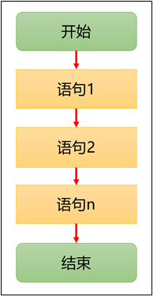
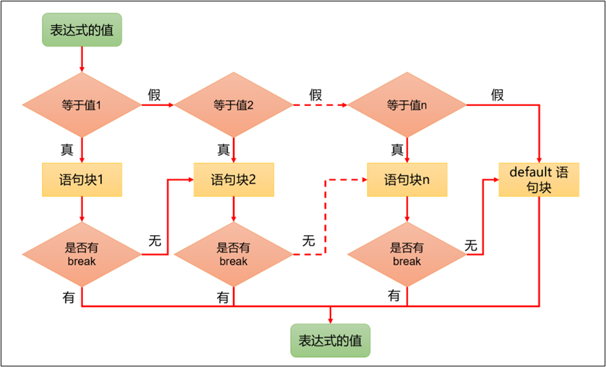
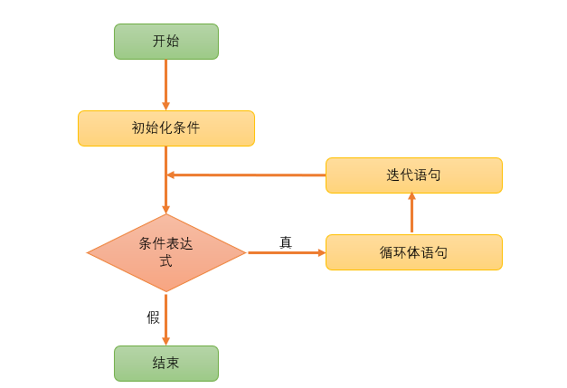
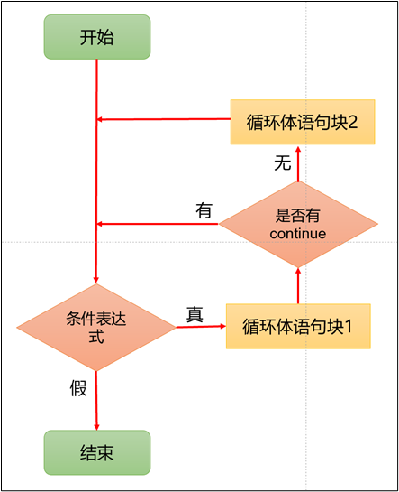

# 第一章：概述

## 1.1 定义

* `流程控制结构`是用来控制程序中`各语句执行顺序`的语句，并且可以将语句组合成能`完成一定功能`的`小逻辑模块`。

* 在程序设计中规定了`三种`流程结构，如下所示：
  * `顺序结构`：程序从上到下逐行执行，中间没有任何判断和跳转。
  * `分支结构`：根据条件，有选择的执行某段代码。在 Java 语言中，有 `if...else` 和 `switch...case` 两种分支语句。
  * `循环结构`：根据循环条件，重复性的执行某段代码。在 Java 语言中，有 `for`、`while`、`do...while` 三种循环结构。

## 1.2 类比生活

* 在生活中的`洗衣工厂`，就包含了上述的三种流程结构，如下所示：


# 第二章：标准输入和标准输出

## 2.1 概述

* 在计算机中，所谓的`标准输入`和`标准输出`都是以计算机（CPU 和内存）为主体而言的，即：

> [!NOTE]
>
> - ① 输入：从输入设备(键盘、鼠标、扫描仪)向计算机输入数据。
> - ② 输出：从计算机向外部输出设备(显示器、打印机)输出数据。


## 2.2 标准输出

* 在 Java 中，提供了 `System.out` 对象的 `println()` 方法用于向控制台输出信息，如下所示：

```java {19-30}
public final class System {
    /**
     * The "standard" output stream. This stream is already
     * open and ready to accept output data. Typically this stream
     * corresponds to display output or another output destination
     * specified by the host environment or user. The encoding used
     * in the conversion from characters to bytes is equivalent to
     * {@link Console#charset()} if the {@code Console} exists,
     * {@link Charset#defaultCharset()} otherwise.
     * <p>
     * For simple stand-alone Java applications, a typical way to write
     * a line of output data is:
     * <blockquote><pre>
     *     System.out.println(data)
     * </pre></blockquote>
     * <p>
     * See the {@code println} methods in class {@code PrintStream}.
     *
     * @see     java.io.PrintStream#println()
     * @see     java.io.PrintStream#println(boolean)
     * @see     java.io.PrintStream#println(char)
     * @see     java.io.PrintStream#println(char[])
     * @see     java.io.PrintStream#println(double)
     * @see     java.io.PrintStream#println(float)
     * @see     java.io.PrintStream#println(int)
     * @see     java.io.PrintStream#println(long)
     * @see     java.io.PrintStream#println(java.lang.Object)
     * @see     java.io.PrintStream#println(java.lang.String)
     * @see     Console#charset()
     * @see     Charset#defaultCharset()
     */
    public static final PrintStream out = null;
 	
    // 其余略
    
    ...
        
}   
```


* 示例：

```java
package com.github.com.github;

public class IOTest {
    public static void main(String[] args) {
        System.out.println("整数：" + 1);
        System.out.println("浮点数：" + 3.14);
        System.out.println("字符：" + '我');
        System.out.println("布尔值：" + true);
        System.out.println("字符串：" + "是什么？");
    }
}
```

## 2.3 标准输入

* 在 Java 中，通过 `Scanner` 对象的 `nextXxx()` 方法来接收键盘录入的数据（标准输入）。

* 其步骤如下：

  * ① 导包：目的就是为了让 Java 知道 Scanner 类在哪里。

  ```java
  // 导包的动作必须在类定义的上边
  import java.util.Scanner; 
  ```

  * ② 创建对象：目的就是为了使用 Scanner 类。

  ```java
  // sc 是对象名，只要符合标识符的强制规则和规范即可。
  Scanner sc = new Scanner(System.in);
  ```

  * ③ 接收数据：

  ```java
  int num = sc.nextInt(); // 获取整数
  ```

  ```java
  String name = sc.next(); // 获取字符串，遇到空格和换行就结束录入
  ```

  ```java
  String name = sc.nextLine(); // 获取字符串，遇到换行就结束录入
  ```

  ```java
  double height = sc.nextDouble(); // 获取小数
  ```

  ```java
  ...
  ```

  * ④ 关闭资源：

  ```java
  sc.close(); // 因为 sc 是流对象，需要关闭
  ```


* 示例：

```java
// 导包
import java.util.Scanner;

public class IOTest {
    public static void main(String[] args) {
        // 创建 Scanner 对象
        Scanner sc = new Scanner(System.in);

        System.out.print("姓名：");
        String name = sc.nextLine();
        System.out.print("年龄：");
        int age = sc.nextInt();
        System.out.print("身高：");
        double height = sc.nextDouble();
        System.out.print("体重：");
        double weight = sc.nextDouble();

        System.out.println("----------------------");

        System.out.println("姓名是：" + name);
        System.out.println("年龄是：" + age);
        System.out.println("身高是：" + height);
        System.out.println("体重是：" + weight);

        // 关闭资源
        sc.close();
    }
}
```

## 2.4 注意事项

* ① 不需要太深入学习 Java 中的标准输入和标准输出，只需要了解一下！！！

> [!NOTE]
>
> 其实，对于标准输入和标准输出，每种语言都有提供，如：
>
> * ① C 语言的标准输入和标准输出。
>
> ::: details 点我查看
>
> ```c {7}
> #include <stdio.h>
> 
> int main() {
>     
>     int num;
>     // 标准输入
>     scanf("%d", &num);
>     
>     return 0;
> }
> ```
>
> ```c {7}
> #include <stdio.h>
> 
> int main() {
>     
>     int num = 10;
>     // 标准输出
>     printf("%d\n", num);
>     
>     return 0;
> }
> ```
>
> :::
>
> * ② Java 语言的标准输入和标准输出。
>
> ::: details 点我查看
>
> ```java {8}
> import java.util.Scanner;
> 
> public class Main {
>     public static void main(String[] args) {
>     
>         Scanner scanner = new Scanner(System.in);
>         // 标准输入
>         int num = scanner.nextInt();
>  
>     }
> }
> ```
>
> ```java {8}
> import java.util.Scanner;
> 
> public class Main {
>     public static void main(String[] args) {
>         
>         int num = 10;
>         // 标准输出
>         System.out.println(num);
>         
>     }
> }
> ```
>
> :::
>
> * ③ Python 语言的标准输入和标准输出。
>
> ::: details 点我查看
>
> ```python
> # 标准输入
> num = int(input())
> ```
>
> ```python
> # 标准输出
> print(num)
> ```
>
> :::

* ② 在实际开发中，我们并不会经常使用标准输入和标准输出。

> [!NOTE]
>
> 在实际开发中，我们通常会提供人性化的交互方式，如：GUI 以及自然语言方式。
>
> ::: details 点我查看
>
> 
>
> :::

* ③ 目前学习各种语言的标准输入和标准输出，主要是为了训练逻辑思维、编程语言的语法以及屏蔽其它的干扰（图形化界面，即：GUI）。
* ④ 在实际开发中，我们在进行项目开发的时候，会将项目中的日志通过`日志代理（agent）`推送到`日志平台`，如下所示：

> [!NOTE]
>
> `日志平台`能够帮助企业更高效地管理和分析日志数据，提升系统的稳定性、安全性和合规性，降低故障排查的难度，是现代 IT 运维和开发中不可或缺的重要工具。
>
> ::: details 点我查看
>
> * ① **集中化管理**：日志平台可以将不同系统、应用程序、服务器等产生的日志集中在一起，进行统一管理。这样，管理员可以通过一个平台来查看和分析所有日志，提升管理效率。
> * ② **监控与报警**：日志平台通常会结合实时监控，自动分析日志内容并生成告警。例如：出现特定的错误或异常时，日志平台可以立即通知相关人员，便于及时处理和修复问题。
> * ③ **故障排查**：通过日志平台，开发人员和运维人员可以快速定位问题和故障的根源。平台中通常会提供强大的搜索功能，可以根据日志的内容、时间、级别等信息进行精确查询，帮助排查系统异常。
> * ④ **数据分析与报表**：日志平台可以对日志数据进行汇总和分析，生成可视化的报表和统计图表，帮助企业更好地理解系统的运行状态、性能瓶颈、用户行为等，从而做出优化决策。
> * ⑤ **合规性与审计**：日志是很多行业合规性要求的基础，例如：金融、医疗等行业都要求系统生成详细的操作日志以备审计。日志平台可以帮助企业保存这些日志，并提供审计功能。
> * ⑥ **安全分析**：通过对日志的分析，日志平台能够帮助发现潜在的安全威胁或攻击行为。例如：通过分析系统登录、文件访问等日志，能够发现异常的访问模式，及时采取安全措施。
> * ⑦ **历史数据存储与查询**：日志平台通常具备高效的存储能力，能够处理大量日志数据，并提供历史查询功能。无论是短期的调试需求，还是长期的数据存档需求，日志平台都可以提供支持。
>
> :::


# 第三章：顺序结构

## 3.1 概述

* 程序从上到下逐行地执行，表达式语句都是顺序执行的，并且上一行对某个变量的修改对下一行会产生影响。



## 3.2 应用示例

* 示例：

```java
public class Main {
    public static void main(String[] args) {
        
        int x = 1;
        int y = 2;
        
        System.out.println("x = " + x); // x = 1
        System.out.println("y = " + y); // y = 2

        // 对 x 和 y 的值进行修改
        x++;
        y = 2 * x + y;
        x = x * 10;

        System.out.println("x = " + x); // x = 20
        System.out.println("y = " + y); // y = 6
    }
}
```


# 第四章：分支结构（⭐）

## 4.1 概述

* 根据特定条件执行不同的代码块，从而实现灵活的程序控制和更复杂的逻辑。

## 4.2 单分支结构

### 4.2.1 概述

* 语法：

```java
if(条件表达式){
    语句;
}
```

> [!NOTE]
>
> * ① 当条件表达式为真（true），会执行代码块中的语句。
> * ② 当条件表达式为假（false），不会执行代码块中的语句。

* 流程图，如下所示：


### 4.2.2 应用示例

* 需求：成年人心率的正常范围是每分钟 60~100 次。体检时，如果心率不在此范围内，则提示需要做进一步的检查。


* 示例：

```java
import java.util.Scanner;

public class Main {
    public static void main(String[] args) {        
        Scanner scanner = new Scanner(System.in);
        
        // 输入心率
        System.out.print("请输入您的心率：");
        int heartBeats = scanner.nextInt();

        // 判断心率是否在正常范围内
        if (heartBeats < 60 || heartBeats > 100) {
            System.out.println("您的心率不在正常范围内，请做进一步的检查。");
        }

        // 输出体检结束
        System.out.println("体检结束！！！");

        // 关闭 Scanner
        scanner.close();
    }
}
```

### 4.2.3 应用示例

* 需求：根据年龄判断，如果是未成年人，则提示 "未成年人请在家长陪同下访问！" 。


* 示例：

```java
import java.util.Scanner;

public class Main {
    public static void main(String[] args) { 
        Scanner scanner = new Scanner(System.in);

        // 输入年龄
        System.out.print("请输入你的年龄：");
        int age = scanner.nextInt();

        // 判断是否为未成年人
        if (age < 18) {
            System.out.println("未成年人请在家长陪同下访问！");
        }

        // 输出欢迎信息
        System.out.println("欢迎继续访问！");

        // 关闭 Scanner
        scanner.close();
    }
}
```

## 4.3 双分支结构

### 4.3.1 概述

* 语法：

```java
if(条件表达式) { 
  	语句块1;
}else {
  	语句块2;
}
```

> [!NOTE]
>
> * ① 当条件表达式为真（true），执行代码块 1 中的语句
> * ② 当条件表达式为假（false），执行代码块 2 中的语句。

* 流程图，如下所示：


### 4.3.2 应用示例

* 需求：判断一个整数，是奇数还是偶数。


* 示例：

```java
import java.util.Scanner;

public class Main {
    public static void main(String[] args) {
        Scanner scanner = new Scanner(System.in);

        // 输入一个整数
        System.out.print("请输入一个整数：");
        int num = scanner.nextInt();

        // 判断是否为偶数或奇数
        if (num % 2 == 0) {
            System.out.println(num + " 是偶数");
        } else {
            System.out.println(num + " 是奇数");
        }

        // 关闭 Scanner
        scanner.close();
    }
}
```

### 4.3.3 应用示例

* 需求：输入年龄，如果大于18岁，则输出 "你年龄大于18，要对自己的行为负责!"；否则，输出 "你的年龄不大这次放过你了。"


* 示例：

```java
import java.util.Scanner;

public class Main {
    public static void main(String[] args) {
        Scanner scanner = new Scanner(System.in);

        // 输入年龄
        System.out.print("请输入年龄：");
        int age = scanner.nextInt();

        // 判断年龄
        if (age > 18) {
            System.out.println("你年龄大于18，要对自己的行为负责!");
        } else {
            System.out.println("你的年龄不大，这次放过你了!");
        }

        // 关闭 Scanner
        scanner.close();
    }
}
```

### 4.3.4 应用示例

* 需求：判定某个年份是否为闰年？

>[!NOTE]
>
>* ①  year 是 400 的整倍数： year%400==0
>* ② 能被 4 整除，但不能被 100 整除：year % 4 == 0 && year % 100 != 0


* 示例：

```java
import java.util.Scanner;

public class Main {
    public static void main(String[] args) {
        Scanner scanner = new Scanner(System.in);

        // 输入年份
        System.out.print("请输入年份：");
        int year = scanner.nextInt();

        // 判断是否为闰年
        if (year % 400 == 0 || (year % 4 == 0 && year % 100 != 0)) {
            System.out.println(year + " 是闰年");
        } else {
            System.out.println(year + " 不是闰年");
        }

        // 关闭 Scanner
        scanner.close();
    }
}
```

## 4.4 多重分支结构

### 4.4.1 概述

* 语法：

```java
if (条件表达式1) {
  	语句块1;
} else if (条件表达式2) {
  	语句块2;
}
...
} else if (条件表达式n) {
 	语句块n;
} else {
  	语句块n+1;
}
```

> [!NOTE]
>
> * ① 首先判断关系表达式 1 的结果是`真`（true）还是`假`（false）：
>   * 如果为真，就执行语句块 1，然后结束当前多分支。
>   * 如果是假，就继续判断条件表达式 2，看其结果是真还是假。
>   * 如果是真，就执行语句块 2，然后结束当前多分支。
>   * 如果是假，就继续判断条件表达式…看其结果是真还是假。
>   * ...
>   *  如果没有任何关系表达式为真，就执行语句块 n+1，然后结束当前多分支。
> * ② 当条件表达式之间是`互斥`（彼此之间没有交集）关系时，条件判断语句及执行语句间顺序无所谓。
> * ③ 当条件表达式之间是`包含`关系时，必须`小上大下 / 子上父下`，否则范围小的条件表达式将不可能被执行。
> * ④ 当 if-else 结构是多选一的时候，最后的 else 是可选的，可以根据需要省略。
> * ⑤ 如果语句块中只有一条执行语句的时候，`{}`是可以省略的；但是，强烈建议保留！！！

* 流程图，如下所示：


### 4.4.2 应用示例

* 需求：张三参加考试，他和父亲达成协议，如果成绩不到 60 分没有任何奖励；如果成绩 60分（含）到 80 分，奖励一个肉夹馍；如果成绩 80 分（含）到 90 分，奖励一个 ipad；如果成绩 90 分及以上，奖励一部华为 mate60 pro 。 


* 示例：

```java
import java.util.Scanner;

public class Main {
    public static void main(String[] args) {
        Scanner scanner = new Scanner(System.in);

        // 输入分数
        System.out.print("请输入分数：");
        int score = scanner.nextInt();

        // 容错：分数不可能小于 0 或大于 100
        if (score < 0 || score > 100) {
            System.out.println("输入的分数有误！");
            return;
        }

        // 判断分数对应的奖励
        if (score >= 90) {
            System.out.println("奖励你一部华为 mate60 pro");
        } else if (score >= 80) {
            System.out.println("奖励你一个 ipad");
        } else if (score >= 60) {
            System.out.println("奖励你一个肉夹馍");
        } else {
            System.out.println("你的成绩不及格，没有任何奖励！");
        }

        // 关闭 Scanner
        scanner.close();
    }
}
```

### 4.4.3 应用示例

* 需求：判断水的温度，如果大于 95℃，则打印 "开水"；如果大于 70℃ 且小于等于 95℃，则打印 "热水"；如果大于 40℃ 且小于等于 70℃，则打印 "温水"；如果小于等于 40℃，则打印 "凉水"。


* 示例：

```java
import java.util.Scanner;

public class Main {
    public static void main(String[] args) {
        Scanner scanner = new Scanner(System.in);

        // 输入水的温度
        System.out.print("请输入水的温度：");
        int temperature = scanner.nextInt();

        // 判断水的温度类别
        if (temperature > 95) {
            System.out.println("开水");
        } else if (temperature > 70 && temperature <= 95) {
            System.out.println("热水");
        } else if (temperature > 40 && temperature <= 70) {
            System.out.println("温水");
        } else {
            System.out.println("凉水");
        }

        // 关闭 Scanner
        scanner.close();
    }
}

```

## 4.5 多重分支结构 switch

### 4.5.1 概述

* 语法：

```java
switch(表达式){
	case 常量值1: 
        语句块1;
        //break;
	case 常量值2: 
        语句块2;
        //break;
	...
     
	case 常量值n: 
        语句块n; 
        //break;
	[default: 
        语句块n+1;
    ]
}
```

> [!NOTE]
>
> * ① switch 后面表达式的值必须是一个`整型`（byte、short、char、int）、`枚举`、`字符串`。
> * ② case 后面的值必须是常量，不能是变量。
> * ③ default 是可选的，当没有匹配的 case 的时候，就执行 default 。
> * ④ break 语句可以使程序跳出 switch 语句块，如果没有 break，会执行下一个 case 语句块，直到遇到 break 或者执行到 switch 结尾，这个现象称为穿透。

* 流程图，如下所示：



### 4.5.2 应用示例

* 需求：编写一个程序，该程序可以接收一个字符，比如：a、b、c、d；其中， a 表示星期一，b 表示星期二…，根据用户的输入显示相应的信息，要求使用 switch 语句。


* 示例：

```java
import java.util.Scanner;

public class Main {

    public static void main(String[] args) {
        // 创建 Scanner 对象来读取输入
        Scanner scanner = new Scanner(System.in);

        // 输入一个字符
        System.out.print("请输入一个字符（a、b、c、d）：");
        char chs = scanner.next().charAt(0);

        // 使用 switch 语句判断字符并输出结果
        switch (chs) {
            case 'a':
                System.out.println("今天是星期一");
                System.out.println("窗前明月光");
                break;
            case 'b':
                System.out.println("今天是星期二");
                System.out.println("疑是地上霜");
                break;
            case 'c':
                System.out.println("今天是星期三");
                System.out.println("举头望明月");
                break;
            case 'd':
                System.out.println("今天是星期四");
                System.out.println("低头思故乡");
                break;
            default:
                System.out.println("输入错误！");
                break;
        }

        // 关闭 Scanner
        scanner.close();
    }
}
```

### 4.5.3 应用示例

* 需求：编写程序，输入月份，输出该月份有多少天。

> [!NOTE]
>
> * ① 1 月、3 月、5 月、7月、8 月、10 月、12 月有 31 天。
> * ② 4 月、6 月、9 月、11 月有 30 天。
> * ③ 2 月有 28 天或 29 天。


* 示例：

```java
import java.util.Scanner;

public class Main {

    public static void main(String[] args) {
        // 创建 Scanner 对象来读取输入
        Scanner scanner = new Scanner(System.in);

        // 输入月份
        System.out.print("请输入月份 (1-12)：");
        int month = scanner.nextInt();

        // 使用 switch 语句判断月份天数
        switch (month) {
            case 1:
            case 3:
            case 5:
            case 7:
            case 8:
            case 10:
            case 12:
                System.out.printf("%d 月有 31 天\n", month);
                break;
            case 4:
            case 6:
            case 9:
            case 11:
                System.out.printf("%d 月有 30 天\n", month);
                break;
            case 2:
                System.out.printf("%d 月有 28 天或 29 天\n", month);
                break;
            default:
                System.out.println("输入错误！");
                break;
        }

        // 关闭 Scanner
        scanner.close();
    }
}
```

### 4.5.4 switch 和 if else if 的比较

* ① 如果判断条件是判等，而且符合整型、枚举类型，虽然两个语句都可以使用，建议使用 swtich 语句。
* ② 如果判断条件是区间判断，大小判断等，使用 if...else...if。

## 4.6 嵌套分支

### 4.6.1 概述

* 嵌套分支是指，在一个分支结构中又嵌套了另一个分支结构，里面的分支的结构称为内层分支，外面的分支结构称为外层分支。

> [!TIP]
>
> 嵌套分支层数不宜过多，最多不要超过 3 层！！！

### 4.6.2 应用示例

* 需求：根据淡旺季的月份和年龄，打印票价。

> [!NOTE]
>
> * ① 4 -10 是旺季：
>   * 成人（18-60）：60 。
>   * 儿童（<18）：半价。
>   * 老人（>60）：1/3 。
> * ② 其余是淡季：
>   * 成人：40。
>   * 其他：20。


* 示例：

```java
import java.util.Scanner;

public class Main {

    public static void main(String[] args) {
        // 创建 Scanner 对象来读取输入
        Scanner scanner = new Scanner(System.in);

        // 输入月份
        System.out.print("请输入月份 (1-12)：");
        int month = scanner.nextInt();

        // 输入年龄
        System.out.print("请输入年龄：");
        int age = scanner.nextInt();

        // 初始票价
        double price = 60;

        // 旺季
        if (month >= 4 && month <= 10) {
            if (age < 18) {
                price /= 2;
            } else if (age > 60) {
                price /= 3;
            }
        } else {
            if (age >= 18) {
                price = 40;
            } else {
                price = 20;
            }
        }

        // 输出票价
        System.out.printf("票价: %.2f\n", price);

        // 关闭 Scanner
        scanner.close();
    }
}
```


# 第五章：随机数

## 5.1 概述

* 所谓的随机数就是没有规则，并且不能预测的一些数字，也称为真随机数。程序中也是可以产生随机数的，但是是通过一些固定规则产生的，称为伪随机数。
* 常见的伪随机数（线性同余方程，LCG）的公式，如下所示：

$X_{n+1} = (a \cdot X_n + b) \mod m$

* 其中，X 是伪随机序列，a 是乘数（通常选择一个大于 0 的常数，典型值有 1664525），b 是增量（选择一个大于 0 的常数，典型值有 1013904223）， m 是模数（ 通常选择一个大的常数，常见值有 ( 2^{32} ) ，即 4294967296））。

> [!NOTE]
>
> 假设 a = 31 ，b =  13 ，m = 100 ；那么，伪随机数的公式就是 `X_{n+1} = (31 × X_n + 13) % 100 `。
>
> * 如果 `X_{n}` = 1 ，那么 `X_{n+1}` = 44 。
> * 如果 `X_{n}` = 44 ，那么 `X_{n+1}` = 77 。
> * 如果 `X_{n}` = 77 ，那么 `X_{n+1}` = 0 。
> * ...
>
> 最后，将得到 44、77、0、13、16、9 、92、65、28 ... ，其中 1 也称为初始种子（随机数种子）。

* 对应的工作原理，如下所示：
  * ① 设置初始种子（X_0）：
    * 种子值是算法生成随机数序列的起点。
    * 不同的种子值会产生不同的随机数序列。
  * ② 递归生成随机数：
    * 从初始种子开始，通过公式不断生成新的随机数。
    * 每次迭代都使用前一次生成的随机数作为输入。

## 5.2 应用示例

### 5.2.1 通过 `Math.random()`

* 通过 Math.random() 生成随机数：

```java
double randomValue = Math.random(); // 生成一个 [0.0, 1.0) 范围的随机数
```


* 示例：

```java
public class Main {
    public static void main(String[] args) {
        // 生成一个 [0.0, 1.0) 范围的随机数
        double randomValue = Math.random();
        System.out.println("随机数 (0.0 到 1.0)：" + randomValue);
    }
}
```

### 5.2.2 使用 `Random` 类

* `Random` 类是 `java.util` 包中的一个类，它提供了更强大的随机数生成能力，支持生成不同类型的随机数，包括：整数、浮点数、布尔值等。


* 示例：

```java
import java.util.Random;

public class Main {
    public static void main(String[] args) {
        Random random = new Random();

        // 生成一个随机整数
        int randomInt = random.nextInt();
        System.out.println("随机整数：" + randomInt);

        // 生成一个指定范围内的随机整数 [0, 100)
        int randomIntInRange = random.nextInt(100); // 范围是 [0, 100)
        System.out.println("随机整数 (0 到 99)：" + randomIntInRange);

        // 生成一个布尔值
        boolean randomBool = random.nextBoolean();
        System.out.println("随机布尔值：" + randomBool);

        // 生成一个随机浮点数
        float randomFloat = random.nextFloat();
        System.out.println("随机浮点数 (0.0 到 1.0)：" + randomFloat);
    }
}
```


* 示例：

```java
import java.util.Random;

public class Main {
    public static void main(String[] args) {
        Random random = new Random();

        // 生成一个范围在 [1, 100) 的随机整数
        int randomIntInRange = random.nextInt(100) + 1; // [1, 100)
        System.out.println("随机整数 (1 到 100)：" + randomIntInRange);
    }
}
```

### 5.2.3 使用 `ThreadLocalRandom` 类

* `ThreadLocalRandom` 是在 Java 7 中引入的，它是为多线程环境设计的，避免了多线程中共享 `Random` 实例时的性能瓶颈。

> [!NOTE]
>
> 通常在多线程环境中使用 `ThreadLocalRandom` 比 `Random` 更高效。


* 示例：

```java
import java.util.concurrent.ThreadLocalRandom;

public class Main {
    public static void main(String[] args) {
        // 生成一个指定范围内的随机整数 (0 到 99]
        int randomInt = ThreadLocalRandom.current().nextInt(100); 
        System.out.println("随机整数 (0 到 99)：" + randomInt);

        // 生成一个随机浮点数 (0.0 到 1.0)
        double randomDouble = ThreadLocalRandom.current().nextDouble();
        System.out.println("随机浮点数 (0.0 到 1.0)：" + randomDouble);
    }
}
```

### 5.2.4 使用 `SecureRandom` 类

* `SecureRandom` 类提供了强加密的随机数生成器，它适用于安全敏感的场景，例如：生成密码、加密密钥等。


* 示例：

```java
import java.security.SecureRandom;

public class Main {
    public static void main(String[] args) {
        SecureRandom secureRandom = new SecureRandom();

        // 生成一个随机整数
        int randomInt = secureRandom.nextInt();
        System.out.println("安全随机整数：" + randomInt);

        // 生成一个随机浮点数 (0.0 到 1.0)
        double randomDouble = secureRandom.nextDouble();
        System.out.println("安全随机浮点数 (0.0 到 1.0)：" + randomDouble);
    }
}
```


# 第六章：循环结构（⭐）

## 6.1 概述

* 定义：在某些条件满足的情况下，反复执行特定代码的功能。

> [!NOTE]
>
> 循环结构的特点：
>
> * ① 重复的做某件事情。
> * ② 具有明确的开始和停止标记。

> [!NOTE]
>
> ::: details 点我查看 循环结构在生活中的场景
>
> * ① 当按下开关按钮的时候，电风扇开始工作，叶子一直重复的转动，即：循环开始，并重复做某件事情。
> * ② 当再次按下开关按钮的时候，电风扇停止工作，即：循环结束。
>
> 
>
> :::

## 6.2 for 循环

### 6.2.1 概述

* 语法：

```java
for(初始化条件①;循环条件表达式②;迭代语句④){
    循环体语句③
}
```

> [!NOTE]
>
> * ① 初始化条件，用于初始化循环变量，只会执行一次，且循环开始前就执行（可以声明多个变量，但是必须是同一类型，用逗号 `,` 隔开）。
> * ② 循环条件表达式每次循环都执行，同 while 循环一样，每次先判断后执行循环体语句。
> * ③ 迭代语句每次循环都执行，在大括号中循环体语句之后执行（如果有多个变量更新，用逗号 `,` 隔开）。

* 流程图，如下所示：



> [!NOTE]
>
> 执行过程是：① --> ② --> ③ --> ④ --> ② --> ③ --> ④ --> ... --> ② 。

### 6.2.2 应用示例

* 需求：输出 5 行 `Hello World!` 。


* 示例：

```java
public class Main {
    public static void main(String[] args) {
        // 使用循环打印 "Hello World!" 5 次
        for (int i = 1; i <= 5; ++i) {
            System.out.println("Hello World!");
        }
    }
}
```

### 6.2.3 应用示例

* 需求：求 1 ~ 100 之内所有偶数的和，以及偶数的个数。


* 示例：

```java
public class Main {
    public static void main(String[] args) {
        int sum = 0;
        int count = 0;

        // 循环遍历 1 到 100 之间的所有整数
        for (int i = 1; i <= 100; i++) {
            if (i % 2 == 0) { // 判断是否为偶数
                sum += i;
                count++;
            }
        }

        // 打印偶数的和与个数
        System.out.println("1 ~ 100 中的所有偶数的和为: " + sum);
        System.out.println("1 ~ 100 中的所有偶数的个数为: " + count);
    }
}
```

### 6.2.4 应用示例

* 需求：输出所有的水仙花数，所谓水仙花数是指一个 3 位数，其各个位上数字立方和等于其本身，例如：`153 = 1×1×1 + 3×3×3 + 5×5×5`。


* 示例：

```java
public class Main {
    public static void main(String[] args) {
        int count = 0;

        // 遍历 100 到 999 之间的所有三位数
        for (int i = 100; i <= 999; i++) {
            // 获取个位、十位和百位
            int ge = i % 10;
            int shi = i / 10 % 10;
            int bai = i / 100;

            // 判定是否为水仙花数
            if (ge * ge * ge + shi * shi * shi + bai * bai * bai == i) {
                System.out.println("水仙花数：" + i);
                count++;
            }
        }

        // 打印水仙花数总个数
        System.out.println("水仙花数总个数：" + count);
    }
}
```

### 6.2.5 应用示例

* 需求：将 1 ~ 10 倒序输出，如：10 、9 、8 ...


* 示例：

```java
public class Main {
    public static void main(String[] args) {
        // 从 10 到 0 倒序打印
        for (int i = 10; i >= 0; i--) {
            System.out.print(i + " ");
        }
    }
}
```

### 6.2.6 应用示例

* 需求：输入两个正整数 m 和 n ，求其最大公约数和最小公倍数，例如：12 和 20 的最大公约数是 4 ，最小公倍数是 60 。

> [!NOTE]
>
> * 如果数 a 能被数 b 整除，且结果是整数，那么 a 就叫做 b 的倍数，b 就叫做 a 的约数（因数）。
> * 如果一个整数同时是几个整数的约数，则称该整数为这些整数的公约数；其中，数值最大的称为最大公约数。
> * 如果一个整数同时为两个或多个整数的倍数的数，则称该整数为这些整数的公倍数；其中，数值最小的称为最小公倍数。


* 示例：

```java
public class Main {
    public static void main(String[] args) {
        int m = 12, n = 20;

        // 取出两个数中的较小值
        int min = (m < n) ? m : n;

        // 找最大公约数
        for (int i = min; i >= 1; i--) {
            if (m % i == 0 && n % i == 0) {
                System.out.println("最大公约数是：" + i); // 公约数
                break; // 跳出当前循环结构
            }
        }

        // 取出两个数中的较大值
        int max = (m > n) ? m : n;

        // 找最小公倍数
        for (int i = max; i <= m * n; i++) {
            if (i % m == 0 && i % n == 0) {
                System.out.println("最小公倍数是：" + i); // 公倍数
                break; // 跳出当前循环结构
            }
        }
    }
}
```

## 6.3 while 循环

### 6.3.1 概述

* 语法：

```java
初始化条件①；
while (循环条件语句②) {
    循环体语句③；
    迭代语句④；
}
```

> [!NOTE]
>
> * ①当循环条件表达式成立（true），就执行循环体语句，直到条件不成立（false）停止循环。
> * ②  为避免死循环，循环条件表达式不能永远成立，且随着循环次数增加，应该越来越趋向于不成立。
> * ③ for 循环和 while 循环`可以相互转换`，二者没有性能上的差别。
> * ④ for 循环与 while 循环的区别：`初始化条件部分的作用域不同`。

* 流程图，如下所示：


> [!NOTE]
>
> 执行过程是：① --> ② --> ③ --> ④ --> ② --> ③ --> ④ --> ... --> ② 。

### 6.3.2 应用示例

* 需求：输出 5 行 `Hello World!` 。


* 示例：

```java
public class Main {
    public static void main(String[] args) {
        int i = 1;
        
        // 使用 while 循环打印 "Hello World!" 5 次
        while (i <= 5) {
            System.out.println("Hello World!");
            i++;
        }
    }
}
```

### 6.3.3 应用示例

* 需求：求 1 ~ 100 之内所有偶数的和，以及偶数的个数。


* 示例：

```java
public class Main {
    public static void main(String[] args) {
        int sum = 0;
        int count = 0;

        int i = 1;
        // 使用 while 循环遍历 1 到 100
        while (i <= 100) {
            if (i % 2 == 0) {
                sum += i;    // 累加偶数
                count++;     // 统计偶数个数
            }
            i++;
        }

        // 输出偶数的和与个数
        System.out.println("1 ~ 100 中的所有偶数的和为: " + sum);
        System.out.println("1 ~ 100 中的所有偶数的个数为: " + count);
    }
}
```

### 6.3.4 应用示例

* 需求：世界最高山峰是珠穆朗玛峰，它的高度是 8848.86 米，假如我有一张足够大的纸，它的厚度是 0.1 毫米。请问，我折叠多少次，可以折成珠穆朗玛峰的高度?


* 示例：

```java
public class Main {
    public static void main(String[] args) {
        // 折叠的次数
        int count = 0;

        // 珠峰的高度，单位为毫米
        int zfHeight = 8848860;

        // 每次折叠的高度，单位为毫米
        double paperHeight = 0.1;

        // 通过折叠纸张，使其高度达到或超过珠峰高度
        while (paperHeight <= zfHeight) {
            count++;
            paperHeight *= 2;  // 每次折叠纸张高度翻倍
        }

        // 输出折叠次数和最终纸张的高度
        System.out.println("需要折叠 " + count + " 次，才能得到珠峰的高度。");
        System.out.println("折纸的高度为 " + paperHeight / 1000 + " 米，超过了珠峰的高度");
    }
}
```

### 6.3.5 应用示例

* 需求：给出一个整数 n ，判断该整数是否是 2 的幂次方。如果是，就输出 yes ；否则，输出 no 。

> [!NOTE]
>
> 思路：
>
> * ① 2^ 0 = 1 ，2^1 = 2 ，2^2 = 4，2^3 = 8，2^4 = 16，2^5 = 32 ...，规律：每一个数字都是前一个数字的 2 倍（任意一个数字，不断的除以 2 ，最终看结果是否是数字 1 ）。
> * ② 循环终止条件：
>   * 结果是 1 的时候，就可以结束，输出 yes 。
>   * 如果除以 2 的时候，无法被 2 整数，也可以结束，输出 no ，如： 100 / 2 = 50，50 / 2 = 25 。


* 示例：

```java
import java.util.Scanner;
public class Main {

    public static void main(String[] args) {
        Scanner scanner = new Scanner(System.in);

        System.out.print("请输入一个整数：");
        int n = scanner.nextInt();

        // 判断 n 是否是 2 的幂
        while (n > 1 && n % 2 == 0) {
            n /= 2;
        }

        // 如果 n 最终为 1，说明原数是 2 的幂
        if (n == 1) {
            System.out.println("yes");
        } else {
            System.out.println("no");
        }

        scanner.close();
    }
}
```

### 6.3.6 应用示例

* 需求：整数反转，如：123 --> 321 。

> [!NOTE]
>
> 思路：从右边开始，依次获取每一位数字，再拼接起来。


* 示例：

```java
import java.util.Scanner;

public class Main {
    public static void main(String[] args) {
        Scanner scanner = new Scanner(System.in);

        System.out.print("请输入一个整数：");
        int num = scanner.nextInt();
        int original = num;
        int rev = 0;

        // 从右边开始，依次获取每个数字，然后拼接到 rev 中
        // 循环结束的条件是 num == 0
        while (num != 0) {
            // 获取 num 右边的第一位数字
            int temp = num % 10;
            // 去掉最后一位数字
            num /= 10;
            // 将 temp 拼接到 rev 的后面
            rev = rev * 10 + temp;
        }

        // 输出反转结果
        System.out.println(original + " 的反转是 " + rev);

        scanner.close();
    }
}
```

## 6.4 do-while 循环

### 6.4.1 概述

* 语法：

```java
①初始化部分;
do{
	③循环体部分
	④迭代部分
}while(②循环条件部分); 
```

> [!NOTE]
>
> * ① `do{} while();`最后有一个分号。
> * ② do-while 结构的循环体语句是至少会执行一次，这个和 for 、while 是不一样的。
> * ③ 循环的三个结构 for、while、do-while 三者是可以相互转换的。

* 流程图，如下所示：


> [!NOTE]
>
> 执行过程是：① --> ③ --> ④ --> ② --> ③ --> ④ --> ② --> ... --> ② 。

### 6.4.2 应用示例

* 需求：求 1 ~ 100 之内所有偶数的和，以及偶数的个数。

```java
public class Main {
    public static void main(String[] args) {
        int sum = 0;
        int count = 0;

        int i = 1;
        do {
            if (i % 2 == 0) {
                sum += i;
                count++;
            }
            i++;
        } while (i <= 100);

        System.out.println("1 ~ 100 中的所有偶数的和为: " + sum);
        System.out.println("1 ~ 100 中的所有偶数的个数为: " + count);
    }
}
```

### 6.4.3 应用示例

* 需求：实现 ATM 取款机功能。


* 示例：

```java
import java.util.Scanner;

public class ATM {
    public static void main(String[] args) {
        Scanner scanner = new Scanner(System.in);

        // 账户余额
        double balance = 0.0;
        // 客户选择
        int selection;
        // 存款金额
        double addMoney;
        // 取款金额
        double minusMoney;
        // 退出标识
        boolean exitFlag = false;

        do {
            System.out.println("=========ATM========");
            System.out.println("\t1、存款");
            System.out.println("\t2、取款");
            System.out.println("\t3、显示余额");
            System.out.println("\t4、退出");
            System.out.print("请选择(1-4)：");

            selection = scanner.nextInt();

            switch (selection) {
                case 1:
                    System.out.printf("您当前的余额是: %.2f\n", balance);
                    System.out.print("请输入存款金额：");
                    addMoney = scanner.nextDouble();
                    balance += addMoney;
                    System.out.printf("存款成功，您当前的余额是：%.2f\n", balance);
                    break;
                case 2:
                    System.out.printf("您当前的余额是: %.2f\n", balance);
                    System.out.print("请输入取款金额：");
                    minusMoney = scanner.nextDouble();
                    if (minusMoney > balance) {
                        System.out.println("余额不足，取款失败。");
                    } else {
                        balance -= minusMoney;
                        System.out.printf("取款成功，您的余额为：%.2f\n", balance);
                    }
                    break;
                case 3:
                    System.out.printf("您的账户余额为：%.2f\n", balance);
                    break;
                case 4:
                    exitFlag = true;
                    System.out.println("欢迎下次再来。");
                    break;
                default:
                    System.out.println("输入有误，请重新输入。");
                    break;
            }

        } while (!exitFlag);

        scanner.close();
    }
}
```

## 6.5 嵌套循环

### 6.5.1 概述

* 所谓的嵌套循环，是指一个循环结构 A 的循环体是另一个循环结构 B 。例如：for 循环里面还有一个for 循环，就是嵌套循环。
* 语法：

```java
for(初始化语句①; 循环条件语句②; 迭代语句⑦) {
    for(初始化语句③; 循环条件语句④; 迭代语句⑥) {
      	循环体语句⑤;
    }
}
```

* 其中，for 、while 、do-while 均可以作为外层循环或内层循环。


> [!NOTE]
>
> * ① 实际上，嵌套循环就是将内层循环当成外层循环的循环体。当只有内层循环的循环条件为 false ，才会完全跳出内层循环，才可结束外层的当次循环，开始下一次循环。 
> * ② 假设外层循环次数为 m 次，内层循环次数为 n 次，则内层循环体实际上需要执行 m × n 次。 
> * ③ 从二维图形的角度看，外层循环控制`行数`，内层循环控制`列数`。
> * ④ 实际开发中，我们最多见到的嵌套循环是两层，一般不会出现超过三层的嵌套循环。如果将要出现，一定要停下来重新梳理业务逻辑，重新思考算法的实现，控制在三层以内；否则，可读性会很差。

### 6.5.2 应用示例

* 需求：打印 5 行 `*` ，要求每行 6 个 `*` 。


* 示例：

```java
public class Main {
    public static void main(String[] args) {
        for (int i = 1; i <= 5; ++i) {
            for (int j = 1; j < 6; ++j) {
                System.out.print("* ");
            }
            System.out.println();
        }
    }
}
```

### 6.5.3 应用示例

* 需求：打印 5 行直角三角形。


* 示例：

```java
public class Main {
    public static void main(String[] args) {
        for (int i = 1; i <= 5; ++i) {
            for (int j = 1; j <= i; ++j) {
                System.out.print("* ");
            }
            System.out.println();
        }
    }
}
```

### 6.5.4 应用示例

* 需求：打印 5 行倒直角三角形。


* 示例：

```java
public class Main {
    public static void main(String[] args) {
        for (int i = 1; i <= 5; ++i) {
            for (int j = 1; j <= 6 - i; ++j) {
                System.out.print("* ");
            }
            System.out.println();
        }
    }
}
```

### 6.5.5 应用示例

* 需求：打印 9 `×` 9 乘法表。 


* 示例：

```java
public class Main {
    public static void main(String[] args) {
        for (int i = 1; i <= 9; ++i) {
            for (int j = 1; j <= i; ++j) {
                System.out.print(i + " × " + j + " = " + (i * j) + " ");
            }
            System.out.println();
        }
    }
}
```

## 6.6 无限循环

### 6.6.1 概述

* 语法：

```java
while(true){
    ...
}
```

```java
for(;;){
    ...
}
```

> [!NOTE]
>
> * ① 在开发中，有的时候并不确定需要循环多少次，就需要根据循环体内部的某些条件，来控制循环的结束（break）。
> * ② 如果上述的循环结构不能终止，就会构成死循环；所以，在实际开发中，要避免出现死循环！！！

### 6.6.2 应用示例

* 需求：从键盘读入个数不确定的整数，并判断读入的正数和负数的个数，输入为  0 时结束程序。


* 示例：

```java
import java.util.Scanner;

public class Main {
    public static void main(String[] args) {
        // 创建 Scanner 对象用于读取输入
        Scanner scanner = new Scanner(System.in);

        // 记录输入的整数
        int num;
        // 记录正数个数
        int positiveCount = 0;
        // 记录负数个数
        int negativeCount = 0;

        // 无限循环，直到输入 0
        while (true) {
            System.out.print("请输入一个整数：");
            num = scanner.nextInt();

            if (num > 0) {
                positiveCount++;
            } else if (num < 0) {
                negativeCount++;
            } else {
                System.out.println("程序结束！");
                break;
            }
        }

        // 输出正数和负数的个数
        System.out.println("正数的个数：" + positiveCount);
        System.out.println("负数的个数：" + negativeCount);
        
        // 关闭 scanner 对象
        scanner.close();
    }
}
```

## 6.7 跳转控制语句

### 6.7.1 break

* break 的使用场景：break 语句用于终止某个语句块的执行，用在 switch 语句或者循环语句中。

> [!NOTE]
>
> break 一旦执行，就结束(或跳出)当前循环结构；并且，此关键字的后面，不能声明其它语句。

* 流程图，如下所示：


* 示例：打印 0 ~ 10 ，如果遇到 `3` ，就停止打印

```java
public class Main {
    public static void main(String[] args) {
        
        // 使用 for 循环
        for (int i = 0; i < 10; ++i) {
            if (i == 3) {
                break;  // 跳出循环
            }
            System.out.println(i);  // 输出 i 的值
        }

        // 输出程序结束信息
        System.out.println("程序结束！");
    }
}
```


* 示例：编写程序，要求输入一个数字，判断该数字是否是质数

```java
import java.util.Scanner;

public class Main {
    public static void main(String[] args) {
        Scanner scanner = new Scanner(System.in);

        boolean isFlag = false;
        int num = 0;

        do {
            System.out.print("请输入一个整数（必须大于 1 ）：");
            num = scanner.nextInt();

            if (num <= 1) {
                System.out.println("输入的数字不是合法，请重新输入！！！");
                isFlag = true;
            } else {
                isFlag = false;
            }

        } while (isFlag);

        boolean isPrime = true;
        for (int i = 2; i < num; i++) {
            if (num % i == 0) {
                isPrime = false;
                break;
            }
        }

        if (isPrime) {
            System.out.println(num + " 是一个质数");
        } else {
            System.out.println(num + " 不是一个质数");
        }

        System.out.println("程序结束！");
        
        scanner.close();
    }
}
```

### 6.7.2 continue

* continue 的使用场景：continue 语句用于结束本次循环，继续执行下一次循环。

> [!NOTE]
>
> continue 一旦执行，就结束(或跳出)当次循环结构；并且，此关键字的后面，不能声明其它语句。


* 流程图，如下所示：




* 示例：打印 0 ~ 10 ，如果遇到 `3` ，就继续下一次打印

```java
public class Main {
    public static void main(String[] args) {

        for (int i = 0; i < 10; ++i) {
            if (i == 3) {
                continue;
            }
            System.out.println(i);
        }

        System.out.println("程序结束！");
    }
}
```


* 示例：输出 100 以内（包括 100）的数字，跳过那些 7 的倍数或包含 7 的数字

```java
public class Main {
    public static void main(String[] args) {

        for (int i = 1; i <= 100; i++) {
            if (i % 7 == 0 || i % 10 == 7 || i / 10 == 7) {
                continue;
            }
            System.out.print(i + " ");
        }

        System.out.println("程序结束！");
    }
}
```

### 6.7.3 return 

* return ：并非专门用于结束循环的，它的功能是结束一个方法。当一个方法执行到一个 return 语句的时候，这个方法将被结束。 

> [!NOTE]
>
>  和 break 和 continue 不同的是，return 直接结束整个方法，不管这个 return 处于多少层循环之内。 


* 示例：

```java
public class Main {
    public static void main(String[] args) {

        for (int i = 1; i <= 100; i++) {
            // 如果 i 是 7 的倍数，或者末尾是 7，或者十位是 7，则退出程序
            if (i % 7 == 0 || i % 10 == 7 || i / 10 == 7) {
                return; // 结束整个 main 方法
            }
            System.out.print(i + " ");
        }

        System.out.println("程序结束！");
    }
}
```

