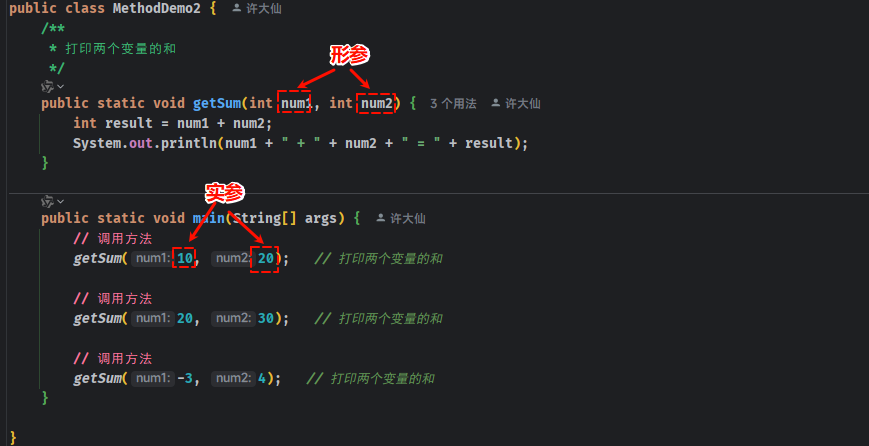
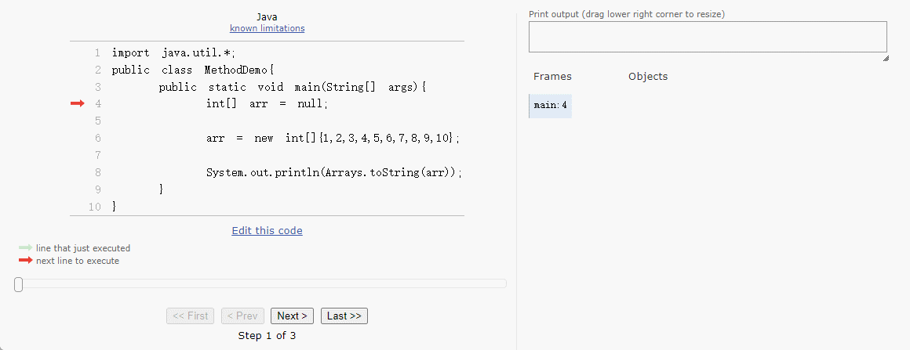
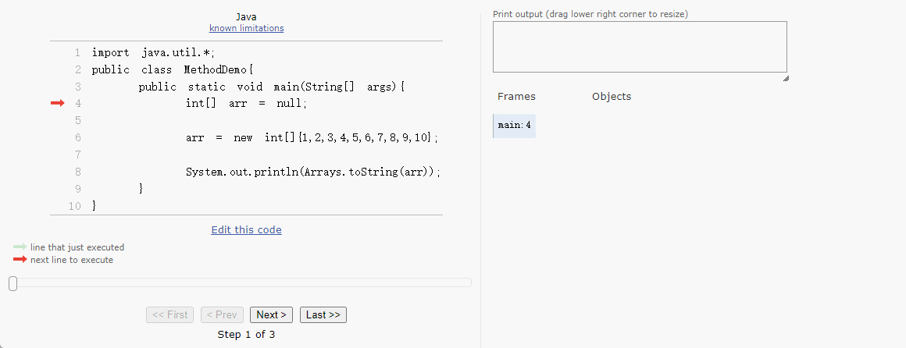

# 第一章：方法的基本概念

## 1.1 为什么需要方法？

* 我们小时候，可能玩过类似`《街头霸王》`或`《拳皇》`这样的游戏，如下所示：


* 在这些游戏中，假设角色的`出拳`、`出脚`、`跳跃`等动作都需要编写 50 - 80 行的代码。

> [!NOTE]
>
> - ① 或许，你会感觉每种角色`出拳`、`出脚`、`跳跃`等动作是不一样的，其背后的代码逻辑也应该是不一样的。
> - ② 其实，`出拳`、`出脚`、`跳跃`等动作只是 `UI` 方面的效果，这些动作背后对应的代码逻辑都是一样的（无非就是增减血量、增减蓝而已），不同的只是接收的参数！！！

- 如果我们在角色每次`出拳`、`出脚`、`跳跃`的地方都`重复的编写`这 50 - 80 的代码，这样程序就会编写很`臃肿`，`可读性`也非常`差`，如下所示：


- 为了解决代码`重复编写`的问题，我们可以将角色`出拳`、`出脚`、`跳跃`等动作的代码`提取`出来，放到一个 `{}`（代码块） 中，并为这个代码块起个名字。这样就可以在角色进行`出拳`、`出脚`、`跳跃`等动作的地方，通过这个`名字`来调用这个 `{}` 中的代码，如下所示：


> [!IMPORTANT]
>
> - ① 提取出来的代码可以看做是程序中定义的一个`方法`，程序在需要`出拳`、`出脚`、`跳跃`等地方调用该`方法`即可。
> - ② `方法`只有`调用`的时候才会`执行`其内部的逻辑，不调用不执行！！！
> - ③ 将特定功能的代码封装为`方法`的好处： `实现代码重用`，`减少冗余`，`简化代码` 。

## 1.2 什么是方法？

### 1.2.1 方法的概念

* `方法`（method）是程序中最小的执行单元，即：`方法`是一种可以`重复使用`的`代码块`，用于执行特定的任务或操作。

> [!NOTE]
>
> 方法中的代码，要么全部执行，要么全部不执行！！！

* 之前，我们学习的入门程序中就有方法的身影 --- main 方法，如下所示：

```java {3-6}
public class HelloWorld {
    
    public static void main(){ 
        System.out.println("Hello World!!!");
        System.out.println("Hello World!!!");
    }
    
}
```

* 当然，之后我们也会学习`如何自定义方法`以及`如何调用自定义方法`，如下所示：

```java {3-6,8-11,15-16,18-19}
public class Main {
    
    // 自定义方法
    public static void eat(){ 
       System.out.println("吃饭~");
    }
    
    // 自定义方法
    public static void sleep(){
       System.out.println("睡觉~");
    }
    
    public static void main(){ 
        
        // 调用自定义方法
        eat();
        
        // 调用自定义方法
        sleep();
        
        System.out.println("Hello World!!!");
        System.out.println("Hello World!!!");
    }
}
```

### 1.2.2 方法的作用

- ① `封装功能`：将一个完整的功能封装成方法，提高代码的结构化和复用性。
- ② `代码模块化`：将程序按照功能拆分成若干模块单元，有助于降低复杂度。
- ③ `增强可维护性`：如果需要修改某项功能，只需要调整对应的方法代码。
- ④ `隔离细节`：通过方法调用可以隐藏实现细节，只关心输入输出。


# 第二章：方法的基本语法（⭐）

## 2.1 概述

* `方法`分为`方法定义`和`方法调用`。
* 将一些代码打包在一起的过程就称为`方法定义`。
* 方法定义后并不能直接运行的，需要手动调用才能执行，该过程称为`方法调用`。

## 2.2 最简单的方法定义和调用

### 2.2.1 语法

* 方法定义语法：

```java
public static void 方法名(){
    // 方法体;
}
```

* 方法调用语法：

```java
方法名();
```

> [!CAUTION]
>
> 方法需要先定义再调用，否则程序将会报错！！！


* 示例：

```java
package com.github.study;

public class MethodDemo1 {

    /**
     * 最简单的方法定义
     */
    public static void playGame() {
        System.out.println("① 选择游戏");
        System.out.println("② 安装和启动游戏");
        System.out.println("③ 创建或登录账号");
        System.out.println("④ 了解游戏");
        System.out.println("⑤ 开始游戏");
        System.out.println("⑥ 提升技能和装备（适用于某些游戏）");
        System.out.println("⑦ 社交互动（如果游戏支持）");
        System.out.println("⑧ 保存进度：定期保存游戏进度，避免意外丢失数据");
        System.out.println("⑨ 结束游戏：当完成当前目标或想要休息时，安全退出游戏");
    }

    public static void main(String[] args) {
        // 最简单的方法调用
        playGame();

        System.out.println("------------------------------------");

        // 最简单的方法调用
        playGame();
    }

}
```

### 2.2.2 应用示例

* 需求：要求定义一个方法，在方法内部打印女朋友的所有信息。


* 示例：

```java
package com.github.test;

public class MethodTest1 {
    /**
     * 打印个人信息
     */
    public static void printGFMessage() {
        System.out.println("国籍：非洲");
        System.out.println("姓名：如花");
        System.out.println("年龄：16 岁");
        System.out.println("性别：女");
        System.out.println("身高：1.65 米");
        System.out.println("体重：100 公斤");
    }

    public static void main(String[] args) {
        // 调用方法
        printGFMessage();
    }
}
```

### 2.2.3 应用示例

* 需求：定义一个方法，在方法内部定义两个变量，并打印这两个变量的和。


* 示例：

```java
package com.github.test;

public class MethodTest2 {
    /**
     * 打印两个变量的和
     */
    public static void getSum() {
        int num1 = 10;
        int num2 = 20;
        int result = num1 + num2;
        System.out.println(num1 + " + " + num2 + " = " + result);
    }

    public static void main(String[] args) {
        // 调用方法
        getSum();
    }
}
```

## 2.3 带参数的方法定义和调用

### 2.3.1 语法

* 方法定义语法：

```java
public static void 方法名(数据类型1 参数1,数据类型2 参数2,...){
    // 方法体;
}
```

* 方法调用语法：

```java
方法名(实参1,实参2,...);
```

> [!CAUTION]
>
> * ① 方法需要先定义再调用，否则程序将会报错！！！
> * ② 方法调用的时候，`实参的类型和数量`必须和`方法定义中小括号内的变量的类型和数量`一一对应，否则程序将会报错！！！


* 示例：

```java
package com.github.study;

public class MethodDemo2 {
    /**
     * 打印两个变量的和
     */
    public static void getSum(int num1, int num2) {
        int result = num1 + num2;
        System.out.println(num1 + " + " + num2 + " = " + result);
    }

    public static void main(String[] args) {
        // 调用方法
        getSum(10, 20);

        // 调用方法
        getSum(20, 30);

        // 调用方法
        getSum(-3, 4);
    }

}
```

### 2.3.2 形参和实参

* 形参（形式参数）：是指`方法定义`中的参数。
* 实参（实际参数）：是指`方法调用`中的参数。



### 2.3.3 应用示例

* 需求：定义一个方法，求长方形的周长，将结果在方法中进行打印。


* 示例：

```java
package com.github.test;

public class MethodTest3 {
    /**
     * 求矩形的周长
     *
     * @param length 矩形的长
     * @param wide   矩形的宽
     */
    public static void getPerimeter(double length, double wide) {
        // 周长
        double result = (length + wide) * 2;

        System.out.println("矩形的周长为：" + result);
    }

    public static void main(String[] args) {
        // 调用方法
        getPerimeter(1, 2);
    }
}
```

### 2.3.4 应用示例

* 需求：定义一个方法，求圆的面积，将结果在方法中进行打印。


* 示例：

```java
package com.github.test;

public class MethodTest4 {
    /**
     * 求圆的面积
     *
     * @param r 半径
     */
    public static void getArea(double r) {
        // 周长
        double area = Math.PI * r * r;

        System.out.println("圆的面积是：" + area);
    }

    public static void main(String[] args) {
        // 调用方法
        getArea(2);
    }
}
```

## 2.4 带返回值的方法定义和调用

### 2.4.1 语法

* 方法定义语法：

```java
public static 返回值类型 方法名(数据类型1 参数1,数据类型2 参数2,...){
    // 方法体;
    return 返回值;
}
```

* 方法调用语法：

```java
返回值类型 变量 = 方法名(实参1,实参2,...);
```

> [!CAUTION]
>
> * ① 方法需要先定义再调用，否则程序将会报错！！！
> * ② 方法调用的时候，`实参的类型和数量`必须和`方法定义中小括号内的变量的类型和数量`一一对应，否则程序将会报错！！！


* 示例：

```java
package com.github.study;

public class MethodDemo3 {
    /**
     * 计算两个变量的和
     *
     * @param num1 变量
     * @param num2 变量
     * @return 变量的和
     */
    public static int getSum(int num1, int num2) {
        return num1 + num2;
    }

    public static void main(String[] args) {
        // 调用方法
        int sum = getSum(10, 20);
        System.out.println("sum = " + sum);

        // 调用方法
        sum = getSum(20, 30);
        System.out.println("sum = " + sum);

        // 调用方法
        sum = getSum(-3, 30);
        System.out.println("sum = " + sum);
    }

}
```

### 2.4.2 应用示例

* 需求：定义方法，比较两个长方形的面积。


* 示例：

```java
package com.github.test;

public class MethodTest5 {

    /**
     * 计算矩形的面积
     *
     * @param length 长
     * @param width  宽
     * @return 面积
     */
    public static double getArea(double length, double width) {
        return length * width;
    }

    /**
     * 比较两个矩形的面积
     *
     * @param area1 面积1
     * @param area2 面积2
     * @return true：面积1大，false：面积2大
     */
    public static boolean compareArea(double area1, double area2) {
        return area1 > area2;
    }

    public static void main(String[] args) {

        double area1 = getArea(3, 4);
        double area2 = getArea(5, 6);
        boolean result = compareArea(area1, area2);
        System.out.println(result ? "长方形1的面积大" : "长发形2的面积大");

    }
}
```

## 2.5 方法的注意事项

* ① 方法不调用不执行。

```java
public class Main{
    public static void main(String[] args){
        // 只定义不调用，方法是不会执行的。
    }
    
    public static void play(){
        System.out.println("玩游戏~");
    }
}
```

* ② 方法和方法之间是平级关系，不能互相嵌套定义。

```java
public class Main{
    public static void main(String[] args){
        // ❌ 错误：在 Java 中方法是不能嵌套定义的
        public static void play(){ // [!code error]
            System.out.println("玩游戏~"); // [!code error]
        } // [!code error]
    }
}
```

* ③ 方法的编写顺序和执行顺序是没有关系的。

```java
public class Main{
    public static void main(String[] args){
        play2();
        play1();
    }
    
    public static void play1(){
        System.out.println("玩游戏~");
    }
    public static void play2(){
        System.out.println("玩游戏~");
    }
}
```

* ④ 方法的返回值类型如果是 void ，则表示该方法没有返回值，此时就可以省略 return 语句。如果一定要写 return 语句，return 关键字后面是不能加具体的数据。

```java
public class Main{
    public static void main(String[] args){
        // 只定义不调用，方法是不会执行的。
        play(2);
    }
    
    public static void play(int num){
        if(num == 2){
            return;
        }
        System.out.println("玩游戏~");
    }
}
```

* ⑤ return 语句的后面是不能编写其他的代码的，因为永远执行不到，属于无效的代码。

```java
public class Main{
    public static void main(String[] args){
        // 只定义不调用，方法是不会执行的。
        play(2);
    }
    
    public static void play(int num){
        if(num == 2){
            return;
            // ❌ 错误：return 语句的后面是不能编写其他的代码的
            System.out.println("玩游戏~"); // [!code error]
        }
        System.out.println("玩游戏~");
    }
}
```


# 第三章：方法重载（⭐）

## 3.1 概述

* 在同一个类中，定义了多个`同名的方法`，这些同名的方法具有相同的功能。
* 每个方法具有`不同`的`参数类型`或`参数个数`，这些同名的方法，就构成了重载关系。

> [!NOTE]
>
> 方法重载：在同一个类中，方法名相同，参数不同（个数不同、类型不同、顺序不同）的方法，和返回值无关！！！

* 方法重载的好处：使用方法重载，可以为编程带来方便，让方法的调用者，在调用方法的时候，不需要为了相似的功能去查阅文档，查找各种不同的方法名，降低学习成本，提高开发效率，如：`System.out.println()` 方法就是典型的方法重载。

```java
public void print(boolean b){}
```

```java
public void print(char c){}
```

```java
...
```

```java
public void println(Object x){}
```

## 3.2 应用示例

* 需求：要求获取两个数（整数或小数）的和。


* 示例：

```java
package com.github.study;

public class MethodDemo4 {
    /**
     * 计算两个变量的和
     *
     * @param num1 变量
     * @param num2 变量
     * @return 变量的和
     */
    public static int getSum(int num1, int num2) {
        return num1 + num2;
    }

    /**
     * 计算两个变量的和
     *
     * @param num1 变量
     * @param num2 变量
     * @return 变量的和
     */
    public static double getSum(double num1, double num2) {
        return num1 + num2;
    }

    public static void main(String[] args) {
        // 调用方法
        int sum = getSum(10, 20);
        System.out.println("sum = " + sum);

        // 调用方法
        double sum2 = getSum(20.1, 30.2);
        System.out.println("sum2 = " + sum2);
    }

}
```

## 3.3 应用示例

* 需求：使用方法重载的思想，设计比较两个整数是否相同的方法，需要覆盖 byte、short、int 和 long 类型。


* 示例：

```java
package com.github.study;

public class MethodDemo5 {
    
    public static boolean compare(byte num1, byte num2) {
        return num1 == num2;
    }

    public static boolean compare(short num1, short num2) {
        return num1 == num2;
    }

    public static boolean compare(int num1, int num2) {
        return num1 == num2;
    }

    public static boolean compare(long num1, long num2) {
        return num1 == num2;
    }

    public static void main(String[] args) {
        // 调用方法
        boolean compare = compare(1, 1);
        System.out.println("compare = " + compare);

        // 调用方法
        compare = compare(1L, 1L);
        System.out.println("compare = " + compare);
    }

}
```


# 第四章：方法练习

## 4.1 数组遍历

* 需求：设计一个方法用于数组遍历，要求将遍历的结果显示在一行，如：[11,22,33,44,55] 。


* 示例：

```java
package com.github.test;

public class MethodTest6 {

    /**
     * 设计一个方法用于数组遍历，要求将遍历的结果显示在一行，如：[11,22,33,44,55] 。
     *
     * @param arr 数组
     */
    public static void printArray(int[] arr) {
        System.out.print("[");
        for (int i = 0; i < arr.length; i++) {
            if (i == arr.length - 1) {
                System.out.print(arr[i]);
                break;
            }
            System.out.print(arr[i] + ",");
        }
        System.out.println("]");
    }

    public static void main(String[] args) {

        int[] arr = {11, 22, 33, 44, 55};

        printArray(arr);
    }
}
```

## 4.2 数组最大值

* 需求：设计一个方法，用于求数组的最大值，并将最大值返回。


* 示例：

```java
package com.github.test;

public class MethodTest7 {

    /**
     * 设计一个方法求数组的最大值，并将最大值返回。
     *
     * @param arr 数组
     */
    public static int max(int[] arr) {
        int max = arr[0];
        for (int i = 0; i < arr.length; i++) {
            if (arr[i] > max) {
                max = arr[i];
            }
        }
        return max;
    }

    public static void main(String[] args) {

        int[] arr = {11, 22, 33, 44, 55};

        System.out.println("max(arr) = " + max(arr));
    }
}
```

## 4.3 判断数组中元素是否存在

* 需求：设计一个方法，用于判断数组中的某个元素是否存在，如果存在就返回该元素的索引，如果不存在就返回 -1 。


* 示例：

```java
package com.github.test;

public class MethodTest8 {

    /**
     * 定义一个方法判断数组中的某个元素是否存在?
     * 如果存在就返回该元素的索引，如果不存在就返回 -1 。
     *
     * @param arr 数组
     */
    public static int indexOf(int[] arr, int num) {
        int result = -1;
        for (int i = 0; i < arr.length; i++) {
            if (arr[i] == num) {
                return i;
            }
        }
        return result;
    }

    public static void main(String[] args) {

        int[] arr = {11, 22, 33, 44, 55};

        System.out.println("indexOf(arr,11) = " + indexOf(arr, 11));
        System.out.println("indexOf(arr,100) = " + indexOf(arr, 100));
    }
}
```

## 4.4 复制数组

* 需求：定义一个方法 `copyOfRange(int[] arr,int from,int to)` 。

> [!NOTE]
>
> * ① 将数组 arr 中的元素从索引 from （包含 from）开始，到索引 to 结束（不包含 to）的元素复制到新数组中。
> * ② 将新数组返回。


* 示例：

```java
package com.github.test;

import java.util.Arrays;

public class MethodTest9 {

    /**
     * 将数组 arr 中的元素从索引 from （包含 from）开始，
     * 到索引 to 结束（不包含 to）的元素复制到新数组中。
     * 将新数组返回。
     *
     * @param arr 数组
     */
    public static int[] copyOfRange(int[] arr, int from, int to) {
        int[] newArr = new int[to - from];
        // 定义伪索引
        int index = 0;
        for (int i = from; i < to; i++) {
            newArr[index++] = arr[i];
        }
        return newArr;
    }

    public static void main(String[] args) {

        int[] arr = {1, 2, 3, 4, 5, 6, 7, 8};

        int[] newArr = copyOfRange(arr, 2, 5);

        System.out.println("newArr = " + Arrays.toString(newArr));

    }
}
```


# 第五章：方法的内存分析（⭐）

## 5.1 方法调用的基本内存原理

* 假设正在执行的代码，如下所示：

```java
public class MethodDemo {
    public static void main(String[] args){
        int num = 100;
        System.out.println("num = " + num);
    }
}
```

* 由于代码中没有 new 关键字，就意味着不会在堆中开辟内存空间。而方法（main 方法也是方法）被调用之后就会进栈执行，方法（main 方法也是方法）执行完毕之后就会弹栈（出栈），如下所示：

> [!NOTE]
>
> * ① 程序开始运行的时候，会执行 main 方法，此时 main 方法就会进栈，当执行 `int num = 100;`的时候，就会在栈中开辟一个名为 num 的内存空间，并给其赋值为 100，然后让输出语句打印 num 内存空间的值。
> * ② 当 main 方法执行完毕之后，会弹栈，此时栈中 num 内存空间也随之消失。
> * ③ 不要觉得`进栈`和`弹栈`很神奇，底层实现很简单，就是通过两个 SP 寄存器移动来实现的！！！


* 上面的代码非常简单，现在我们将代码复杂一点，如下所示：

```java
public class MethodDemo {
    public static void main(String[] args){
        eat();
    }
    public static void eat(){
        study();
        System.out.println("吃饭(*^▽^*)");
        sleep();
    }
    public static void sleep(){
        System.out.println("睡觉o(*￣︶￣*)o");
    }
    public static void study(){
        System.out.println("学习^_^");
    }
}
```

* 由于代码中没有 new 关键字，就意味着不会在堆中开辟内存空间。而方法（main 方法也是方法）被调用之后就会进栈执行，方法（main 方法也是方法）执行完毕之后就会弹栈（出栈），如下所示：

> [!NOTE]
>
> 每个方法都会有进栈和弹栈的操作，即：方法开始执行的时候进栈，方法执行完毕的时候弹栈。


## 5.2 基本数据类型 VS 引用数据类型

### 5.2.1 概述

* 在 Java 中，基本数据类型是 4 类 8 种，如下所示：


* 除了上述的基本数据类型，其余的都是引用数据类型，如：类、数组、接口、枚举和注解等。

### 5.2.2 基本数据类型的内存分析

* 假设正在运行的代码，如下所示：

```java
public class MethodDemo{
    public static void main(String[] args){
        int num = 10;
        double d = 3.14;
        char c = 'A';
        boolean b = false;
        
        System.out.println(num);
        System.out.println(d);
        System.out.println(c);
        System.out.println(b);
    }
}
```

* 其内存图示，如下所示：

> [!IMPORTANT]
>
> `基本数据类型`的变量中存储的是`真实的数据`！！！


### 5.2.3 引用数据类型的内存分析

* 假设正在运行的代码，如下所示：

```java
import java.util.*;
public class MethodDemo{
    public static void main(String[] args){
        int[] arr = null;
        
        arr = new int[]{1,2,3,4,5,6,7,8,9,10};
        
        System.out.println(Arrays.toString(arr));
    }
}
```

* 其内存图示，如下所示：

> [!IMPORTANT]
>
> `引用数据类型`的变量中存储的是`引用（堆中对象的地址值）`！！！



### 5.2.4 从内存角度解释基本数据类型和引用数据类型

#### 5.2.4.1 基本数据类型

* 基本数据类型的变量：其`数据值`是`存储`在`自己的内存空间`的，如下所示：

```java
public class MethodDemo{
    public static void main(String[] args){
        int num = 10;
        double d = 3.14;
        char c = 'A';
        boolean b = false;
        
        System.out.println(num);
        System.out.println(d);
        System.out.println(c);
        System.out.println(b);
    }
}
```

* 其内存图示，如下所示：


* 基本数据类型的特点是：赋值给其他变量，赋值的也是真实的值，如果修改其他变量的值，是不会影响自身变量中保存的值，如下所示：

```java
public class MethodDemo{
    public static void main(String[] args){
        int num = 10;
        int num2 = num;
        System.out.println(num2);
        
        num2 = 20; // [!code highlight]
        
        System.out.println(num);
        System.out.println(num2);
    }
}
```

* 其内存图示，如下所示：


#### 5.2.4.2 引用数据类型

* 引用数据类型的变量：其`数据值`是`存储`在`堆空间`中的，`自己空间`中`存储`的是`引用`（堆中对象的地址值），如下所示：

```java
import java.util.*;

public class MethodDemo{
    public static void main(String[] args){
        int[] arr = null;
        
        arr = new int[]{1,2,3,4,5,6,7,8,9,10};
        
        System.out.println(Arrays.toString(arr));
    }
}
```

* 其内存图示，如下所示：



* 引用数据类型的特点是：赋值给其他变量，赋值的是引用（堆中对象的地址值），如果修改其他变量对应堆中对象的数据，是会影响自身变量对应堆中对象的数据，如下所示：

```java
import java.util.*;

public class MethodDemo{
    public static void main(String[] args){
        int[] arr = null;
        
        arr = new int[]{1,2,3,4,5,6,7,8,9,10};
        
        System.out.println(Arrays.toString(arr));
        
        int[] arr2 = arr; // [!code highlight]
        
        for(int i = 0;i<arr2.length;i++){
            arr2[i] *= 10;
        }
        System.out.println(Arrays.toString(arr));
        System.out.println(Arrays.toString(arr2));
    }
}
```

* 其内存图示，如下所示：


## 5.3 方法传递基本数据类型的内存原理

* 假设代码中的方法传递的是基本类型的参数，如下所示：

```java
public class MethodDemo6 {

    public static void change(int num) {
        num = 200;
    }

    public static void main(String[] args) {

        int num = 10;
        System.out.println("调用 change 之前，num = " + num);

        change(num); // [!code highlight]

        System.out.println("调用 change 之后，num = " + num);

    }

}
```

* 其内存图示，如下所示：

> [!IMPORTANT]
>
> * ① 方法传递基本类型数据的时候，传递的是真实的数据，形参的改变，不会影响到实际参数的值。
> * ② Java 中的方法传递参数的方式是`值传递`，如果参数是基本数据类型，传递的是真实的值；如果参数是引用数据类型，传递的是引用（堆中对象的地址）。


* 如果想让方法修改真实的数据，就需要修改代码，让方法将处理之后的数据返回，并重新赋值给变量，如下所示：

```java
public class MethodDemo6 {

    public static int change(int num) { // [!code highlight]
        num = 200;
        return num; // [!code highlight]
    }

    public static void main(String[] args) {

        int num = 10;
        System.out.println("调用 change 之前，num = " + num);

        num = change(num); // [!code highlight]

        System.out.println("调用 change 之后，num = " + num);

    }
}
```

* 其内存图示，如下所示：


## 5.4 方法传递引用数据类型的内存原理

* 假设代码中的方法传递的是引用类型的参数，如下所示：

```java
import java.util.*;

public class MethodDemo6 {

    public static void change(int[] arr) {
        for (int i = 0; i < arr.length; i++) {
            arr[i] *= 10;
        }
    }

    public static void main(String[] args) {

        int[] arr = {1, 2, 3, 4, 5, 6, 7, 8};
        System.out.println("调用 change 之前，arr = " + Arrays.toString(arr));

        change(arr); // [!code highlight]

        System.out.println("调用 change 之后，arr = " + Arrays.toString(arr));

    }

}
```

* 其内存图示，如下所示：

> [!IMPORTANT]
>
> * ① 方法传递引用类型数据的时候，传递的是引用（堆中对象的地址），形参的改变，会影响到实际参数的值。
> * ② Java 中的方法传递参数的方式是`值传递`，如果参数是基本数据类型，传递的是真实的值；如果参数是引用数据类型，传递的是引用（堆中对象的地址）。


# 第六章：作业

## 6.1 卖飞机票

* 需求：机票的价格按照淡季旺季、头等舱和经济舱收费，请输入机票原价、月份和头等舱或经济舱，输出机票的价格。

> [!NOTE]
>
> 机票价格计算规则：
>
> * ① 旺季（5 月 - 10 月）头等舱 9 折，经济舱 8.5 折。
> * ② 淡季（11 月 - 来年 4 月）头等舱 7 折，经济舱 6.5 折


* 示例：

```java
package com.github;

import java.util.Scanner;

public class TicketDemo {
    public static void main(String[] args) {
        Scanner input = new Scanner(System.in);

        System.out.print("请输入机票原价：");
        double price = input.nextDouble();

        System.out.print("请输入月份：");
        int month = input.nextInt();

        System.out.print("请输入头等舱（0）/经济舱（1）：");
        int seatType = input.nextInt();

        double discount = getDiscount(price, month, seatType);
        System.out.println("打折之后的机票价格 = " + discount);

        input.close();
    }

    /**
     * 计算机票的价格
     *
     * @param price    原价
     * @param month    月份
     * @param seatType 座位类型
     * @return 打折后的机票价格
     */
    public static double getDiscount(double price, int month, int seatType) {
        if (month < 0 || month > 12) {
            throw new IllegalArgumentException("月份输入有误！");
        }
        if (seatType != 0 && seatType != 1) {
            throw new IllegalArgumentException("座位类型输入有误！");
        }
        double discount;
        if (month >= 5 && month <= 10) {
            discount = (seatType == 0) ? 0.9 : 0.85;
        } else {
            discount = (seatType == 0) ? 0.7 : 0.65;
        }
        return price * discount;
    }

}
```

## 6.2 找素数

* 需求：判断 101 - 200 之间有多少个质数，并输出所有的质数。

> [!NOTE]
>
> 在大于 1 的自然数中，除了 1 和它自身外，不能被其他自然数整除的数叫做质数。


* 示例：

```java
package com.github;

import java.util.Scanner;

public class PrimeNumDemo {
    public static void main(String[] args) {
        Scanner input = new Scanner(System.in);

        System.out.print("请输入范围的最小值：");
        int min = input.nextInt();

        System.out.print("请输入范围的最大值：");
        int max = input.nextInt();

        int count = 0;

        for (int i = min; i <= max; i++) {
            if (isPrime(i)) {
                System.out.println(i);
                count++;
            }
        }

        System.out.println("[" + min + "," + max + "] " +
                "范围内共有 " + count + " 个质数");

        input.close();
    }

    /**
     * 判断一个数是否为质数
     *
     * @param num 大于 1 的自然数
     * @return true 表示是质数，false 表示不是质数
     */
    public static boolean isPrime(int num) {
        if (num <= 1) {
            return false;
        }
        boolean flag = true;
        for (int i = 2; i <= num - 1; i++) {
            if (num % i == 0) {
                flag = false;
                break;
            }
        }
        return flag;
    }

}
```

## 6.3 开发验证码

* 需求：定义一个方法实现随机产生一个 5 位的验证码。

> [!NOTE]
>
> * 验证码图示，如下所示：
>
> 
>
> * 验证码格式：
>
>   * ① 长度为 5。
>
>   * ② 前四位是大写字母或小写字母。
>
>   * ③ 最后一位是数字。


* 示例：

```java
package com.github;

import java.security.SecureRandom;

public class VerifyCodeDemo {

    private static final SecureRandom random = new SecureRandom();

    private static final String LETTERS = "abcdefghijklmnopqrstuvwxyz"
            + "ABCDEFGHIJKLMNOPQRSTUVWXYZ";

    public static void main(String[] args) {
        String code = generateCode();
        System.out.println("code = " + code);
    }

    /**
     * 生成验证码，验证码格式：
     * ① 长度为 5。
     * ② 前四位是大写字母或小写字母。
     * ③ 最后一位是数字。
     *
     * @return 验证码
     */
    private static String generateCode() {
        StringBuilder sb = new StringBuilder();
        for (int i = 0; i < 4; i++) {
            int index = random.nextInt(LETTERS.length());
            sb.append(LETTERS.charAt(index));
        }
        sb.append(random.nextInt(10));
        return sb.toString();
    }

}
```

## 6.4 数组元素的复制

* 需求：将一个数组的元素复制到另一个新的数组中。


* 示例：

```java
package com.github;

import java.util.Arrays;

public class ArrayDemo {
    public static void main(String[] args) {
        int[] arr = {1, 2, 3, 4, 5};
        int[] newArr = copy(arr);
        System.out.println(arr == newArr);
        System.out.println("arr = " + Arrays.toString(arr));
        System.out.println("newArr = " + Arrays.toString(newArr));
    }

    /**
     * 将一个数组复制到另一个数组中
     *
     * @param arr 旧数组
     * @return 新数组
     */
    public static int[] copy(int[] arr) {
        int[] newArr = new int[arr.length];
        System.arraycopy(arr, 0, newArr, 0, arr.length);
        return newArr;
    }
}
```

## 6.5 评委打分

* 需求：在唱歌比赛中，有 6 名评委给选手打分，分数范围是 [0－100] 之间的整数。

> [!NOTE]
>
> 选手的最后得分为：去掉最高分、最低分后的 4 个评委的平均分，请完成上述过程并计算出选手的得分。


* 示例：

```java
package com.github;

import java.security.SecureRandom;
import java.util.Arrays;

public class SongDemo {

    private static final SecureRandom random = new SecureRandom();

    public static void main(String[] args) {
        int[] arr = generateScores();
        System.out.println("评委打分数组 = " + Arrays.toString(arr));

        arr = calculateFinalScores(arr);
        System.out.println("去掉最高分和最低分的打分数组 = " + Arrays.toString(arr));

        double score = calculateFinalScore(arr);
        System.out.println("最后得分 = " + score);
    }

    /**
     * 生成评委打分
     *
     * @return 分数 [0, 100]
     */
    public static int generateScore() {
        return random.nextInt(101);
    }

    /**
     * 生成评委打分数组
     *
     * @return 数组
     */
    public static int[] generateScores() {
        int[] scores = new int[6];
        for (int i = 0; i < scores.length; i++) {
            scores[i] = generateScore();
        }
        return scores;
    }

    /**
     * 去掉最高分和最低分的打分数组
     *
     * @param scores 打分数组
     * @return 过滤后的打分数组
     */
    public static int[] calculateFinalScores(int[] scores) {
        if (scores.length < 6) {
            throw new IllegalArgumentException("评分数组长度必须至少为6");
        }
        Arrays.sort(scores);
        int[] finalScores = new int[4];
        System.arraycopy(scores, 1, finalScores, 0, finalScores.length);
        return finalScores;
    }


    /**
     * 获取最后得分
     *
     * @param scores 评委打分数组
     * @return 最后得分
     */
    public static double calculateFinalScore(int[] scores) {
        return Arrays
                .stream(scores)
                .average()
                .orElse(Double.NaN);
    }

}
```

## 6.6 数字加密

* 需求：某系统的数字密码（大于 0），如：1983，采用加密的方式进行传输。

> [!NOTE]
>
> 加密规则：先得到每位数，然后每位数都 +5 ，再对 10 取余，最后将所有数字反转，得到一串新数。
>
> |      | 1    | 9    | 8    | 3    |
> | ---- | ---- | ---- | ---- | ---- |
> | +5   | 6    | 14   | 13   | 8    |
> | %10  | 6    | 4    | 3    | 8    |
> | 反转 | 8    | 3    | 4    | 6    |
> 
> 思路：将 1983 进行拆分，放到数组中进行操作。


* 示例：

```java
package com.github;

public class PasswordDemo {
    
    public static void main(String[] args) {
        int num = 1983;
        int encrypt = encrypt(num);
        System.out.println("encrypt = " + encrypt);
    }

    /**
     * 加密
     *
     * @param num 数字
     * @return 加密后的数字
     */
    public static int encrypt(int num) {
        int[] arr = split(num);
        // 每位数都 +5 ，再对 10 取余
        for (int i = 0; i < arr.length; i++) {
            arr[i] += 5;
            arr[i] %= 10;
        }
        // 反转数组
        reverse(arr);
        // 将数组拼接成数字
        return append(arr);
    }

    /**
     * 将数组拼接成数字
     *
     * @param arr 数组
     * @return 数字
     */
    public static int append(int[] arr) {
        int num = 0;
        for (int i = 0; i < arr.length; i++) {
            num = num * 10 + arr[i];
        }
        return num;
    }


    /**
     * 反转数组
     *
     * @param arr 数组
     */
    public static void reverse(int[] arr) {
        for (int i = 0; i < arr.length / 2; i++) {
            int temp = arr[i];
            arr[i] = arr[arr.length - 1 - i];
            arr[arr.length - 1 - i] = temp;
        }
    }

    /**
     * 将数字拆分成数组
     *
     * @param num 数字
     * @return 数组
     */
    public static int[] split(int num) {
        int[] arr = new int[count(num)];
        // 将数字拆分放到数组中
        for (int i = 0; i < arr.length; i++) {
            arr[i] = num % 10;
            num = num / 10;
        }
        // 反转数组
        reverse(arr);
        // 返回数组
        return arr;
    }

    /**
     * 获取数字的位数
     *
     * @param num 数字
     * @return 位数
     */
    public static int count(int num) {
        int count = 0;
        while (num != 0) {
            num = num / 10;
            count++;
        }
        return count;
    }

}
```

## 6.7 数字解密

* 需求：将上述的数字加密之后再进行解密。

> [!NOTE]
>
> 思路：
>
> 


* 示例：

```java
package com.github;

import java.util.Arrays;

public class PasswordDemo2 {
    public static void main(String[] args) {
        int num = 8346;
        int result = decrypt(num);
        System.out.println("result = " + result);
    }

    /**
     * 数字解密
     *
     * @param num 加密数字
     * @return 解密数字
     */
    public static int decrypt(int num) {
        int[] arr = split(num);
        // 对数组中的元素进行反转
        reverse(arr);
        // %10 的逆操作
        for (int i = 0; i < arr.length; i++) {
            if (arr[i] >= 0 && arr[i] <= 4) {
                arr[i] += 10;
            }
        }
        // +5 的逆操作
        for (int i = 0; i < arr.length; i++) {
            arr[i] -= 5;
        }
        // 将数组拼接返回
        return append(arr);
    }

    /**
     * 将数组拼接成数字
     *
     * @param arr 数组
     * @return 数字
     */
    public static int append(int[] arr) {
        int num = 0;
        for (int i = 0; i < arr.length; i++) {
            num = num * 10 + arr[i];
        }
        return num;
    }

    /**
     * 反转数组
     *
     * @param arr 数组
     */
    public static void reverse(int[] arr) {
        for (int i = 0; i < arr.length / 2; i++) {
            int temp = arr[i];
            arr[i] = arr[arr.length - 1 - i];
            arr[arr.length - 1 - i] = temp;
        }
    }

    /**
     * 将数字拆分成数组
     *
     * @param num 数字
     * @return 数组
     */
    public static int[] split(int num) {
        int[] arr = new int[count(num)];
        // 将数字拆分放到数组中
        for (int i = 0; i < arr.length; i++) {
            arr[i] = num % 10;
            num = num / 10;
        }
        // 反转数组
        reverse(arr);
        // 返回数组
        return arr;
    }

    /**
     * 获取数字的位数
     *
     * @param num 数字
     * @return 位数
     */
    public static int count(int num) {
        int count = 0;
        while (num != 0) {
            num = num / 10;
            count++;
        }
        return count;
    }

}

```

## 6.8 抢红包

* 需求：一个大 V 直播抽奖，奖品是现金红包，分别有 `{2,588,888,1000,10000}` 五个奖金。请使用代码模拟抽奖，
  打印出每个奖项，奖项的出现顺序要随机且不重复。

> [!NOTE]
>
> 打印的效果，如下所示：
>
> 
>
> 思路：
>
> * ① 创建一个新的数组，用来保存抽中的奖金，刚开始数组是空的。
> * ② 根据随机索引从原先的数组中获取元素，去新数组中判断元素是否存在。
> * ③ 如果元素不存在，则保存元素到新数组中。
> * ④ 最后，打印新数组中的元素就可以了。 


* 示例：

```java
package com.github;

import java.util.Random;

public class GuessDemo {
    public static void main(String[] args) {
        Random random = new Random();

        // 奖金红包数组
        int[] arr = {2, 588, 888, 1000, 10000};

        // 抽中的奖金红包数组
        int[] guess = new int[arr.length];

        int index = 0;
        do {
            int i = random.nextInt(arr.length);
            if (!contains(guess, arr[i])) {
                guess[index++] = arr[i];
            }
        } while (index != arr.length);

        for (int i = 0; i < guess.length; i++) {
            System.out.println(guess[i] + " 元的奖金被抽出");
        }
    }

    /**
     * 判断数组中是否包含某个元素
     *
     * @param arr 数组
     * @param num 元素
     * @return true/false
     */
    public static boolean contains(int[] arr, int num) {
        for (int i = 0; i < arr.length; i++) {
            if (arr[i] == num) {
                return true;
            }
        }
        return false;
    }

}
```


