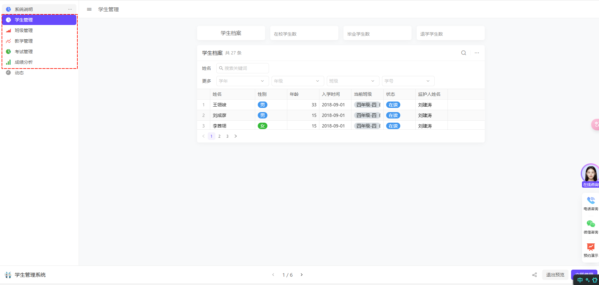
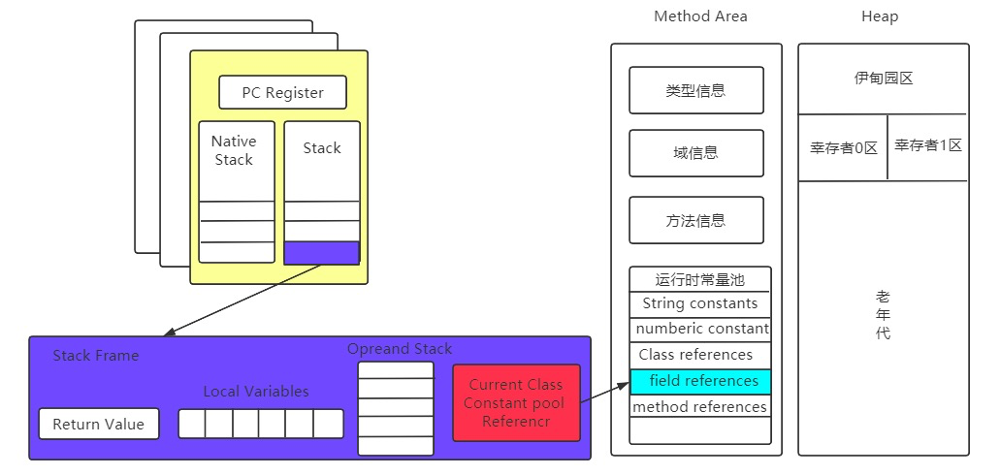
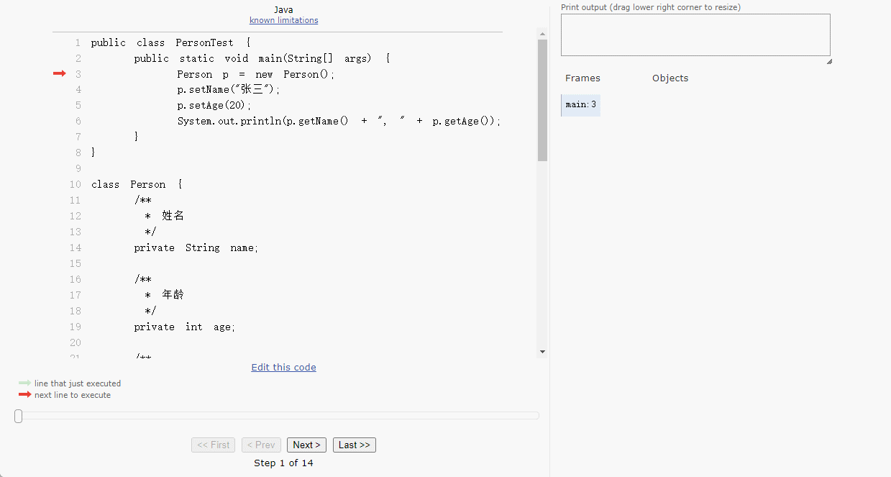

# 第一章：面向对象的概念

## 1.1 概述

* 所谓的`面向对象编程`，难道是这样，如下所示：


* 其实，不然，`面向对象编程`只是一种编程的思想而已，即：指导程序员如何写代码。

> [!NOTE]
>
> 维基百科：
>
> * **面向对象编程**（英语：Object-oriented programming，[缩写](https://zh.wikipedia.org/wiki/缩写)：OOP）是种具有[物件](https://zh.wikipedia.org/wiki/对象_(计算机科学))概念的[程式设计典范](https://zh.wikipedia.org/wiki/编程范型)，同时也是一种程式开发的抽象方针。它可能包含[资料](https://zh.wikipedia.org/wiki/数据)、[特性](https://zh.wikipedia.org/wiki/特性_(计算机科学))、[程式码](https://zh.wikipedia.org/wiki/源代码)与[方法](https://zh.wikipedia.org/wiki/方法_(電腦科學))。对象则指的是[类别](https://zh.wikipedia.org/wiki/类_(计算机科学))（class）的实例。它将[对象](https://zh.wikipedia.org/wiki/物件_(電腦科學))作为[程序](https://zh.wikipedia.org/wiki/计算机程序)的基本单元，将程序和[数据](https://zh.wikipedia.org/wiki/数据)[封装](https://zh.wikipedia.org/wiki/封裝_(物件導向程式設計))其中，以提高软件的重用性、灵活性和扩展性，物件里的程序可以访问及经常修改物件相关连的资料。在物件导向程式编程里，电脑程式会被设计成彼此相关的物件[[1\]](https://zh.wikipedia.org/zh-hans/面向对象程序设计#cite_note-1)[[2\]](https://zh.wikipedia.org/zh-hans/面向对象程序设计#cite_note-2)。
> * **面向对象程序设计**可以看作一种在程序中包含各种独立而又互相调用的对象的思想，这与传统的思想刚好相反：传统的程序设计主张将程序看作一系列[函数](https://zh.wikipedia.org/wiki/函数)的集合，或者直接就是一系列对电脑下达的指令。面向对象程序设计中的每一个对象都应该能够接受数据、处理数据并将数据传达给其它对象，因此它们都可以被看作一个小型的“机器”，即对象。目前已经被证实的是，面向对象程序设计推广了程序的灵活性和可维护性，并且在大型项目设计中广为应用。此外，支持者声称面向对象程序设计要比以往的做法更加便于学习，因为它能够让人们更简单地设计并维护程序，使得程序更加便于分析、设计、理解。反对者在某些领域对此予以否认。

* 官方的定义总是这么抽象以及晦涩难懂，我们可以适当简化一下：
  * `面向对象编程`中的`面向`就是`拿`、`找`或`指挥`。
  * `面向对象编程`中的`对象`就是`能干活的东西`。
  * `面向对象编程`就是`当我们在实际开发中，需要实现某个功能的时候，我们并不是自己从头到尾完整的实现一遍，而是让能干活的东西帮我们完成，即：指挥对象去干活`。

> [!NOTE]
>
> ::: details 点我查看 面向对象在生活中例子
>
> 
>
> :::

* 在之前，我们会在程序中使用`Scanner`对象和`System.out`对象，以便实现`标准输入`和`标准输出`功能，如下所示：

```java
import java.util.*;

public class Main {
    public static void main(String[] args){
        // input 就是对象，通过它我们可以在控制台中输入数据，以便执行之后的逻辑
        Scanner input = new Scanner(System.in);
        
        // System.out 也是对象，通过它我们可以将数据输出到终端中
        System.out.print("请输入您的年龄：")
        
        int age = input.nextInt();
        System.out.println("您的年龄是："+age)
        
        ...
        
        input.close;
    }
}
```

* 在之前，我们会在程序中使用`Random`对象，以便实现`随机数`功能，如下所示：

```java
package com.github;

import java.util.Random;

public class Main {
    public static void main(String[] args) {
        // 通过 Random 对象获取随机数
        Random random = new Random();

        // 获取 [0, 100) 区间内的随机数
        int i = random.nextInt(100);

        System.out.println("i = " + i);
    }
}
```

## 1.2 为什么需要使用面向对象编程？

* 在生活中，随着科技的发展，如果要`洗衣服`，我们都是让`洗衣机`来帮我们`洗衣服`（指挥洗衣机洗衣服）的，如下所示：


* 在生活中，随着科技的发展，如果要`扫地`或`拖地`，我们都是让`扫地机器人`来帮我们`扫地`或`拖地`（指挥扫地机器人扫地）的，如下所示：


* 在生活中，随着科技的发展，如果要购物，我们都是使用`手机`打开`购物 app`来`购物`的（指挥手机打开购物软件进行购物），如下所示：


* ...

> [!NOTE]
>
> 在生活中，如果我们需要做某件事情，我们都是通过某种工具或某个东西来帮助我们完成某件事情。

* 在程序中，也不例外，如果我们要实现某些功能，我们可以指挥一个个的对象，让它们去帮我们实现各个功能，即：面向对象编程。

::: code-group

```java [ScannerTest.java]
import java.util.*;

public class ScannerTest {
    public static void main(String[] args){
        // input 就是对象，通过它我们可以在控制台中输入数据，以便执行之后的逻辑
        Scanner input = new Scanner(System.in);
        
        // System.out 也是对象，通过它我们可以将数据输出到终端中
        System.out.print("请输入您的年龄：")
        
        int age = input.nextInt();
        System.out.println("您的年龄是："+age)
        
        ...
        
        input.close;
    }
}
```

```java [RandomTest.java]
import java.util.Random;

public class RandomTest {
    public static void main(String[] args) {
        // 通过 Random 对象获取随机数
        Random random = new Random();

        // 获取 [0, 100) 区间内的随机数
        int i = random.nextInt(100);

        System.out.println("i = " + i);
    }
}
```

:::

## 1.3 面向对象编程需要学习什么？

* ① 学习获取已有对象并使用。

```java
package com.github;

import java.util.Random;

public class Main {
    public static void main(String[] args) {
        // 通过 Random 对象获取随机数
        Random random = new Random();

        // 获取 [0, 100) 区间内的随机数
        int i = random.nextInt(100);

        System.out.println("i = " + i);
    }
}
```

* ② 学习如何自己设计对象并使用。

```java
package com.github;

public class RandomTest {
    public static void main(String[] args) {
        // 创建对象
        Person p = new Person();
        /*设置属性和调用方法*/
        p.name = "郭德纲";
        p.age = 40;
        p.sayHello();
    }
}

/*定义类*/
class Person {
    String name;
    int age;

    public void sayHello() {
        System.out.println("Hello, I'm " + name + ", " + age + " years old.");
    }
}
```


# 第二章：设计对象并使用（⭐）

## 2.1 类和对象

### 2.1.1 概述

* 对象是一个又一个能帮助我们解决问题的东西，但是这些东西并不是凭空出现的，如下所示：


* 在我们制造对象的时候，需要根据设计图才能制造出来，如下所示：


### 2.1.2 类和对象的概念

* 类（设计图）：是对象共同特征的描述，如：洗衣机图纸、扫地机器人图纸以及手机图纸。
* 对象：是真实存在的具体的东西，如：洗衣机、扫地机器人以及手机。

> [!CAUTION]
>
> * ① 在 Java 中，必须先设计类，才能获取对象！！！
> * ② 在 Java 中，使用 `class` 关键字来定义类，使用 `new 类名();` 来创建对象。


### 2.1.3 类的定义语法

* 语法：

```java
public class 类名 {
    ① 成员变量(代表属性，一般是名词)
    ② 成员方法(代表行为，一般是动词)
    ③ 构造器（后面学习）
    ④ 代码块（后面学习）
    ⑤ 内部类（后面学习）    
}
```

> [!NOTE]
>
> * ① `成员变量`，也称为`属性`，通常是名字，如：手机型号、手机颜色、手机价格等。
> * ② `成员方法`，也称为`行为`，通常是动词，如：打电话、接电话、发送短信、购物等。


* 示例：

```java
/**
 * 创建一个手机类
 */
public class Phone {
    /* 成员变量，即：属性 */

    // 品牌
    String brand;
    // 价格
    double price;

    /* 成员方法，即：行为 */

    /**
     * 打电话
     */
    public void call() {
        System.out.println("打电话");
    }

    /**
     * 玩游戏
     */
    public void play() {
        System.out.println("玩游戏");
    }
}
```

### 2.1.4 对象的定义语法

* 语法：

```java
类名 对象名 = new 类名(); 
```

> [!NOTE]
>
> 每调用一次 new 关键字，就创建一个新的对象！！！


* 示例：

```java
public class PhoneTest {
    public static void main(String[] args) {

        // 创建对象
        Phone p = new Phone();

        // 创建对象
        Phone p2 = new Phone();
        
    }
}
```

### 2.1.5 对象的使用语法

* 访问属性（给属性赋值）：

```java
对象名.成员变量 = xxx; // 给属性赋值
数据类型 变量名 = 对象名.成员变量; // 访问属性
```

* 访问行为：

```java
对象名.方法名();
```


* 示例：

```java
public class PhoneTest {
    public static void main(String[] args) {

        // 创建对象
        Phone p = new Phone();
        // 给对象属性赋值
        p.brand = "苹果";
        p.price = 8888.88;
        // 访问对象属性
        System.out.println(p.brand);
        System.out.println(p.price);
        // 调用对象方法
        p.call();
        p.play();

        System.out.println("--------------------");

        // 创建对象
        Phone p2 = new Phone();
        // 给对象属性赋值
        p2.brand = "华为";
        p2.price = 6666.66;
        // 访问对象属性
        System.out.println(p2.brand);
        System.out.println(p2.price);
        // 调用对象方法
        p2.call();
        p2.play();

    }
}
```

## 2.2 类的注意事项

* ① 用来描述一类事物的类，专业说法是 `JavaBean 类`。

> [!NOTE]
>
> * ① 在 JavaBean 类中，是不写 main 方法的。
> * ② JavaBean 类还有其它特点，后面讲解。
> * ③ JavaBean 在实际开发中非常常见，尤其是在 Web 应用、Spring 框架和数据库交互中被广泛使用。

```java
/**
 * 创建一个手机类
 */
public class Phone {
    /* 成员变量，即：属性 */

    // 品牌
    String brand;
    // 价格
    double price;

    /* 成员方法，即：行为 */

    /**
     * 打电话
     */
    public void call() {
        System.out.println("打电话");
    }

    /**
     * 玩游戏
     */
    public void play() {
        System.out.println("玩游戏");
    }
}
```

* ② 之前，我们编写的含有 main 方法的类，叫做`测试类`。并且，我们可以在测试类中创建 JavaBean 类的对象并进行赋值调用。

> [!CAUTION]
>
> 在实际开发中，一个项目（单体项目）或模块（微服务项目中的模块），只能有一个含有 main 方法的类，以便 JVM 找到程序的入口。
>
> ::: details 点我查看
>
> ```java
> package com.example.demo;
> 
> import org.springframework.boot.SpringApplication;
> import org.springframework.boot.autoconfigure.SpringBootApplication;
> import org.springframework.web.bind.annotation.GetMapping;
> import org.springframework.web.bind.annotation.RequestParam;
> import org.springframework.web.bind.annotation.RestController;
> 
> @SpringBootApplication
> @RestController  
> public class DemoApplication {
> 
>     public static void main(String[] args) {
>         SpringApplication.run(DemoApplication.class, args);
>     }
> 
>     
>     @GetMapping("/hello")
>     public String sayHello(
>         @RequestParam(value = "name", defaultValue = "World") String name) {
>         return "Hello, " + name + "!";
>     }
> }
> ```
>
> :::

```java
public class PhoneTest {
    public static void main(String[] args) {

        // 创建对象
        Phone p = new Phone();

        // 创建对象
        Phone p2 = new Phone();
        
    }
}
```

* ③ 类名首字母建议大写，见名知意，即：遵循大驼峰命名规范。

```java
public class Phone {}
```

* ④ 一个 Java 文件可以定义多个 class 类，但是有且仅有一个类是 public 修饰的，且 public 修饰的类必须和源文件名相同。

> [!TIP]
>
> 在实际开发中，一个 Java 文件中只定义一个 class 类，并且使用 public 修饰。

* ⑤ 类中成员变量的完整定义格式是：`访问修饰符 数据类型 变量名 = 初始化值;`，通常是不需要指定初始化值的，由系统给出默认初始化值。

> [!NOTE]
>
> * ① 访问修饰符，后面讲解。
> * ② 对象成员变量的默认初始化值，如下所示：
>
> | 数据类型 | 默认初始化值 |
> | :------- | :----------- |
> | 整数类型 | 0            |
> | 小数类型 | 0.0          |
> | 布尔类型 | false        |
> | 字符类型 | '\u0000'     |
> | 引用类型 | null         |

## 2.3 应用示例

* 需求：编写女朋友类，创建女朋友类的对象，给女朋友的属性赋值并调用女朋友类中的方法。


* 示例：

::: code-group

```java [GirlFriend.java]
/**
 * 女朋友类
 */
public class GirlFriend {
    // 属性
    String name;
    int age;
    String gender;
    double height;
    double weight;

    public void eat() {
        System.out.println("吃东西");
    }

    public void sleep() {
        System.out.println("睡觉");
    }

    public void play() {
        System.out.println("打游戏");
    }

    public void study() {
        System.out.println("学习");
    }
}
```

```java [GirlFriendTest.java]
/**
 * 测试类
 */
public class GirlFriendTest {
    public static void main(String[] args) {
        GirlFriend gf = new GirlFriend();

        // 给对象属性赋值
        gf.name = "小花";
        gf.age = 18;
        gf.gender = "女";
        gf.height = 1.75;
        gf.weight = 50.0;

        // 访问对象属性
        System.out.println("姓名：" + gf.name);
        System.out.println("年龄：" + gf.age);
        System.out.println("性别：" + gf.gender);
        System.out.println("身高：" + gf.height);
        System.out.println("体重：" + gf.weight);

        System.out.println("-------------------");

        // 调用对象方法
        gf.eat();
        gf.sleep();
        gf.play();
        gf.study();
    }
}
```

:::

## 2.4 实际开发中类的设计

* 在实际开发中，先分析需求中有几类事物，如下所示：



* 根据事物，创建对应的类，如下所示：

::: code-group

```java [Student.java]
/**
 * 学生类
 */
public class Student {
    
}
```

```java [ClassRoom.java]
/**
 * 班级类
 */
public class ClassRoom {
    
}
```

```java [Teach.java]
/**
 * 教学类
 */
public class Teach {
    
}
```

```java [Exam.java ]
/**
 * 考试类
 */
public class Exam {
    
}
```

```java [Grade.java]
/**
 * 成绩类
 */
public class Grade {
    
}
```

:::

* 以学生类为例，通过`名词提炼法`，抽取出`类`的`属性`，如下所示：


* 在对应的类中，编写相应的属性，如下所示：

```java [Student.java]
import java.time.LocalDateTime;
/**
 * 学生类
 */
public class Student {
    // 姓名
    String name;
    // 性别
    char gender;
    // 年龄
    int age;
    // 入学时间
    LocalDateTime enrollmentTime;
    // 当前班级
    String classRoom;
    // 当前状态
    String state;
    // 监护人姓名
    String guardianName;

}
```

* 以学生类为例，通过`动词提炼法`（查看页面中的按钮），抽取出`类`的`方法`，如下所示：


* 在对应的类中，编写相应的方法，如下所示：

```java [Student.java]
import java.time.LocalDateTime;
/**
 * 学生类
 */
public class Student {
    // 姓名
    String name;
    // 性别
    char gender;
    // 年龄
    int age;
    // 入学时间
    LocalDateTime enrollmentTime;
    // 当前班级
    String classRoom;
    // 当前状态
    String state;
    // 监护人姓名
    String guardianName;

    /**
     * 根据姓名查询学生
     *
     * @param name 姓名
     * @return 学生信息
     */
    public Student search(String name) {
        if (this.name.equals(name)) {
            return this;
        } else {
            return null;
        }
    }

}
```


# 第三章：封装（⭐）

## 3.1 概述

* 假设在一个需求中有多个事物，有的行为我们并不能确定到底归属于那个类，比如：人画圆。


* 我们是将`画圆`这个行为，写到`人`这个类中，还是写到`圆`这个类中？

::: code-group

```java [Person.java]
public class Person {
    
    public void draw(){
        System.out.println("画圆");
    }
}
```

```java [Circle.java]
public class Circle {
    
    public void draw(){
        System.out.println("画圆");
    }
}
```

:::

* 此时，就需要使用到我们将要学习的知识 --- 面向对象的三大特征之一（封装）。

## 3.2 封装的概念

### 3.2.1 概述

* 面向对象的三大特征是：`封装`、继承和多态，如下所示：


* `封装`就是告诉我们，在拿到需求之后，`如何正确地设计对象的属性和方法`。

### 3.2.2 举例

* 假设现在有一个需求：定义一个类用来描述人。

> [!NOTE]
>
> * 其中，人的属性有姓名、年龄。
> * 其中，人的行为有吃饭、睡觉。

* 上面的需求非常简单，无非就是要求我们，定义一个 Person 类，并在类中编写属性和行为。

```java [Person.java]
public class Person{
    String name;
    int age;
    
    public void eat() {
        System.out.println("吃东西");
    }

    public void sleep() {
        System.out.println("睡觉");
    }
}
```

* 在实际开发中，需求往往不会这么简单，经常会涉及到多个对象，如：人画圆（需要针对这个需求进行面向对象设计）。


* 由于上述的需求，涉及到两个事物，所以我们理所当然地应该定义两个类，如下所示：

::: code-group

```java [Person.java]
public class Person {
    
}
```

```java [Circle.java]
public class Circle {
    
}
```

:::

* 由于`画圆`是属于行为，我们就需要定义一个`方法`来表示画圆这个行为，如下所示：

```java
public void draw(){
    System.out.println("画圆");
}
```

* 很多人可能会这么认为，既然是`人画圆`，当然`画圆`这个`行为`就应该写在`人`这个类中了，如下所示：

```java [Person.java]
public class Person {
    public void draw(){ // [!code error]
    	System.out.println("画圆"); // [!code error]
	} // [!code error]
}
```

* 其实，这种想法是错误的，`画圆`这个行为应该写到`圆`这个类中，如下所示：

```java [Circle.java]
public class Circle {
    public void draw(){ // [!code highlight]
    	System.out.println("画圆"); // [!code highlight]
	} // [!code highlight]
}
```

> [!IMPORTANT]
>
> 封装的一个重要原则：对象代表什么，就应该封装对应的数据，并提供数据对应的行为。

* 既然，我们使用一个`类`来代表`圆`，那么就会设计一些`属性`来封装`圆`的`一些信息`，如：`半径`。并且，`画圆`这个行为是需要根据`半径`来画的，如下所示：

```java [Circle.java]
public class Circle {
    
    // 半径
    double radius;
    
    public void draw(){ // [!code highlight]
    	System.out.println("根据半径"+radius+"画一个圆"); // [!code highlight]
	} // [!code highlight]
}
```

> [!IMPORTANT]
>
> * ① 和面向过程的编程思想不同，面向对象编程最为核心的就是：指挥对象做某件事情。
> * ② 人画圆，在面向对象中，其实就是`人`指挥`圆`去`画圆`，即：`圆`提供`画圆`的`功能`，让人去调用，以实现画圆这件事情；换言之，如果圆没有提供画圆的功能，人是不能是实现画圆这个需求的。

### 3.2.3 举例

* 假设现在有一个需求：人关门，如下所示：


* 由于上述的需求，涉及到两个事物，所以我们理所当然地应该定义两个类，如下所示：

::: code-group

```java [Person.java]
public class Person {
    
}
```

```java [Door.java]
public class Door {
    
}
```

:::

* 由于`关门`是属于行为，我们就需要定义一个`方法`来表示关门这个行为，如下所示：

```java
public void close(){
    System.out.println("关门");
}
```

* 很多人可能会这么认为，既然是`人关门`，当然`关门`这个`行为`就应该写在`人`这个类中了，如下所示：

```java [Person.java]
public class Person {
    public void close(){ // [!code error]
    	System.out.println("关门"); // [!code error]
	} // [!code error]
}
```

* 其实，这种想法是错误的，`关门`这个行为应该写到`门`这个类中，如下所示：

```java [Circle.java]
public class Door {
    public void close(){ // [!code highlight]
    	System.out.println("关门"); // [!code highlight]
	} // [!code highlight]
}
```

> [!IMPORTANT]
>
> 封装的一个重要原则：对象代表什么，就应该封装对应的数据，并提供数据对应的行为。

* 既然，我们使用一个`类`来代表`门`，那么就会设计一些`属性`来封装`门`的`一些信息`，如：`门的状态`。并且，`关门`这个行为是需要根据`门的状态`来画的，如下所示：

> [!NOTE]
>
> * ① 在这个需求中，人只是给门一个作用力（调用门提供的关门方法），然后门就自己关上了。
>
> * ② 从另外的角度看，如果门坏了，即使人给的作用力再大，也无济于事，因为门因为不能提供关门的功能而导致门不会关上。

```java {5-9}
public class Door {
    // 门的状态数据
    boolean flag = true;
    
    public void close(){ 
        if(flag){
            System.out.println("关门"); 
        }
	} 
}
```

## 3.3 封装的好处

* ① `保护数据`：防止外部直接修改对象的状态
* ② `提高代码的可维护性`：避免外部直接依赖内部实现
* ③ `增强代码的复用性`：通过公共接口提供统一的访问方式。

## 3.4 如何实现封装？

* ① 使用 `private` 关键字限制字段的访问。

> [!NOTE]
>
> * `private` 是一个权限访问修饰符，`private` 可以修饰成员（成员变量或成员方法）。
> * 被 `private` 修饰的成员只能在本类中才能访问。

* ② 提供 `public` 方法（Getter 和 Setter）控制访问权限。

> [!NOTE]
>
> * Setter 方法，即：setXxx(xxx) 给成员变量赋值，即：用于供外部修改。
> * Getter 方法，即：getXxx() 对外提供成员变量的值，即：用于供外部访问。


* 示例：

::: code-group

```java [Person.java]
public class Person {
    // 私有变量，外部无法直接访问
    private String name;
    private int age;

    // 公共的 getter 方法
    public String getName() {
        return name;
    }

    // 公共的 setter 方法
    public void setName(String n) {
        name = n;
    }

    public int getAge() {
        return age;
    }

    public void setAge(int a) {
        if (a > 0) { // 简单的数据验证
            age = a;
        } else {
            System.out.println("年龄不能为负数！");
        }
    }
}
```

```java [PersonRightTest.java]
public class PersonRightTest {
    public static void main(String[] args){
        Person p = new Person();
        p.setAge(18); // [!code highlight]
        System.out.println(p.getAge()); // 18
    }
}
```

```java [PersonErrorTest.java]
public class PersonErrorTest {
    public static void main(String[] args){
        Person p = new Person();
        // 会在控制台输出"年龄不能为负数！"
        p.setAge(-18); // [!code highlight]
        System.out.println(p.getAge()); // 0
    }
}
```

:::

## 3.5 就近原则和 this 关键字

### 3.5.1 概述

* 之前，我们的代码是这样的，如下所示：

::: code-group

```java [Person.java]{12,20}
public class Person {
    // 私有变量，外部无法直接访问
    private String name;
    private int age;

    // 公共的 getter 方法
    public String getName() {
        return name;
    }

    // 公共的 setter 方法
    public void setName(String n) {
        name = n;
    }

    public int getAge() {
        return age;
    }

    public void setAge(int a) {
        if (a > 0) { // 简单的数据验证
            age = a;
        } else {
            System.out.println("年龄不能为负数！");
        }
    }
}
```

```java [PersonTest.java]
public class PersonTest {
    public static void main(String[] args){
        Person p = new Person();
        p.setName("如花");
        System.out.println(p.getName());
        p.setAge(18); 
        System.out.println(p.getAge()); 
    }
}
```

:::

* 我们会发现 `setName()` 和 `setAge()` 中的参数是 `n` 和 `a`，这不符合我们的命名规范（标识符需要见名知意）。于是，我们就将代码修改一下，如下所示：

::: code-group

```java [Person.java]{12,20}
public class Person {
    // 私有变量，外部无法直接访问
    private String name;
    private int age;

    // 公共的 getter 方法
    public String getName() {
        return name;
    }

    // 公共的 setter 方法
    public void setName(String name) {
        name = name;
    }

    public int getAge() {
        return age;
    }

    public void setAge(int age) {
        if (age > 0) { // 简单的数据验证
            age = age;
        } else {
            System.out.println("年龄不能为负数！");
        }
    }
}
```

```java [PersonTest.java]
public class PersonTest {
    public static void main(String[] args){
        Person p = new Person();
        p.setName("如花");
        System.out.println(p.getName());
        p.setAge(18); 
        System.out.println(p.getAge()); 
    }
}
```

:::

* 当我们在测试类中运行的时候，会发现结果并非我们预期的那样，如下所示：

```txt [输出结果]
null
0
```

### 3.5.2 成员变量和局部变量

* `成员变量（实例变量）`：定义在类内部，但是在方法外部，属于类的对象。

```java {4}
public class Person {
    
    // 成员变量
    private int age;
    
    public void method(){
        int age = 10; 
        System.out.println(age);  // 10
    }
}
```

* `局部变量`：定义在方法、构造方法或代码块内部，仅在其作用范围内可用。

```java {9，10}
public class Person {
    
    // 成员变量
    private int age;
    
    /**
    * @param num 局部变量
    */
    public void method(int num){
        int age = 10; // 局部变量
        System.out.println(age);  // 10
    }
}
```


### 3.5.3 就近原则

* 所谓的`就近原则`就是`谁离我近，我就用谁`。


* 示例：

```java {7,10}
public class Person {
    
    // 成员变量
    private int age;
    
    public void method(){
        int age = 10; 
        // 对于输出语句而言，局部变量 age 比成员变量 age 近。
        // 根据就近原则，将使用局部变量，所以结果是 10
        System.out.println(age);  // 10
    }
}
```


* 示例：

```java {9,12}
public class Person {
    
    // 成员变量
    private int age;
    
    /**
    * @param age 局部变量
    */
    public void method(int age){
        // 对于输出语句而言，局部变量 age 比成员变量 age 近。
        // 根据就近原则，将使用局部变量，所以结果是 10
        System.out.println(age);  // 10
    }
}
```


* 示例：

```java {4,10}
public class Person {
    
    // 成员变量
    private int age;
    
    public void method(){
        // int age = 10; 
        // 对于输出语句而言，此时没有局部变量 age
        // 根据就近原则，将使用成员变量，所以结果是 0
        System.out.println(age);  // 0
    }
}
```

### 3.5.4 this 关键字

* 当`方法`的`参数`或者`局部变量`和`类`的`成员变量`同名的时候，可以使用 `this` 来区分它们。

> [!NOTE]
>
> `this` 引用的是当前对象的成员变量。


* 示例：

```java {4,12}
public class Person {
    
    // 成员变量
    private int age;
    
    public void method(){
        int age = 10; 
        // 对于输出语句而言，局部变量 age 比成员变量 age 近。
        // 根据就近原则，将使用局部变量，所以结果本来应该是 10 。
        // 但是，使用了 this 关键字，而 this 引用的是当前对象的成员变量。
        // 而 int 类型的成员变量默认是 0 ，所以输出结果是 0 。
        System.out.println(this.age);  // 0
    }
}
```


* 示例：

::: code-group

```java [Person.java] {2,4,10,18}
public class Person {
    private String name;
    private int age;

    public String getName() {
        return name;
    }

    public void setName(String name) {
        this.name = name;
    }

    public int getAge() {
        return age;
    }

    public void setAge(int age) {
        this.age = age;
    }
}
```

```java [PersonTest.java]
public class PersonTest {
    public static void main(String[] args) {
        Person p = new Person();
        p.setName("如花");
        System.out.println(p.getName()); // 如花
        p.setAge(18);
        System.out.println(p.getAge()); // 18
    }
}
```

:::

## 3.6 IDEA 使用技巧

* 对于 `setXxx()` 或 `getXxx()` 方法，在 IDEA 中，可以通过`Alt + Insert`快捷键一键生成。


* 示例：

```java
public class Person {
    private String name;
    private int age;
}
```


## 3.7 坑

* 在`《阿里巴巴 Java 编码规范》`中，`禁止` POJO 类中的任何`布尔类型`的`变量`，前面加 `is` 前缀。

> [!CAUTION]
>
> * ① POJO 类中的任何布尔类型的变量，都不要加 is 前缀，否则部分框架解析会引起序列化错误。
> * ② 定义为布尔类型 boolean isDeleted 的字段，它的 getter 方法也是 isDeleted()，部分框架在反向解析时，“误以为”对应的字段名称是 deleted，导致字段获取不到，得到意料之外的结果或抛出异常。


* 示例：

```java
public class Person {
    private String name;
    private int age;
    // ❌ 错误：任何布尔类型的变量，都不要加 is 前缀，部分框架解析会引起序列化错误
    private boolean isDeleted;
}
```


# 第四章：构造方法（⭐）

## 4.1 概述

* 构造方法（构造器、构造函数）的作用：在创建对象的时候，给成员变量进行初始化（赋值）。
* 在之前，我们创建对象是这样的，如下所示：

```java
public class PersonTest {
    public static void main(String[] args) {
        // new Person() 调用的是空参的构造方法
        Person p = new Person();
    }
}
```

## 4.2 构造方法的语法

* 语法：

```java
public class 类名 {
    
    访问修饰符 类名(数据类型 参数1,数据类型 参数2,...){
        // 方法体
    }
    
    // 其余略
}
```

> [!CAUTION]
>
> * 特点：
>   * ① 构造方法的方法名和类名相同，大小写也需保持一致。
>   * ② 没有返回值类型，甚至连 void 也没有。
>   * ③ 没有具体的返回值，即：不能由 return 携带结果数据。
> * 执行时机：
>   * ① 创建对象的时候由虚拟机调用，不能手动调用构造方法。
>   * ② 每创建一次对象，就会调用一次构造方法。


* 示例：

::: code-group

```java [Person.java]{15,23-26}
public class Person {
    /**
     * 姓名
     */
    private String name;

    /**
     * 年龄
     */
    private int age;

    /**
     * 空参构造方法
     */
    public Person() {}

    /**
     * 全参（全部参数）构造方法
     *
     * @param name 姓名
     * @param age  年龄
     */
    public Person(String name, int age) {
        this.name = name;
        this.age = age;
    }

    public String getName() {
        return name;
    }

    public void setName(String name) {
        this.name = name;
    }

    public int getAge() {
        return age;
    }

    public void setAge(int age) {
        this.age = age;
    }
}
```

```java [PersonTest.java] {4,9}
public class PersonTest {
    public static void main(String[] args) {
        // new Person() 中的 Person() 调用无参构造方法
        Person p = new Person();
        System.out.println(p.getName()); // null
        System.out.println(p.getAge()); // 0

        // new Person("张三", 20) 中的 Person("张三", 20) 调用全参构造方法
        Person p2 = new Person("张三", 20);
        System.out.println(p2.getName()); // 张三
        System.out.println(p2.getAge()); // 20
    }
}
```

:::

## 4.3 构造方法的注意事项

### 4.3.1 构造方法的定义

* ① 如果类中没有提供构造方法（无参构造方法或有参构造方法），那么 JVM 会帮助我们创建一个无参的构造方法。

::: code-group

```java [Person.java] {12-13}
public class Person {
    /**
     * 姓名
     */
    private String name;

    /**
     * 年龄
     */
    private int age;

	// 没有提供无参构造方法，JVM 会帮我们创建无参构造方法
    // public Person() {}

    public String getName() {
        return name;
    }

    public void setName(String name) {
        this.name = name;
    }

    public int getAge() {
        return age;
    }

    public void setAge(int age) {
        this.age = age;
    }
}
```

```java [PersonTest.java] {5}
public class PersonTest {
    public static void main(String[] args) {
        // new Person() 中的 Person() 调用无参构造方法
        // Person 没有提供无参构造方法，JVM 会帮我们创建无参构造方法
        Person p = new Person();
    }
}
```

:::

* ② 如果类中有提供构造方法（无参构造方法或有参构造方法），那么 JVM 不会帮助我们创建一个无参的构造方法。

::: code-group

```java [Person.java] {18-21}
public class Person {
    /**
     * 姓名
     */
    private String name;

    /**
     * 年龄
     */
    private int age;

    /**
     * 全参（全部参数）构造方法
     *
     * @param name 姓名
     * @param age  年龄
     */
    public Person(String name, int age) {
        this.name = name;
        this.age = age;
    }

    public String getName() {
        return name;
    }

    public void setName(String name) {
        this.name = name;
    }

    public int getAge() {
        return age;
    }

    public void setAge(int age) {
        this.age = age;
    }
}
```

```java [PersonErrorTest.java] 
public class PersonErrorTest {
    public static void main(String[] args) {
        // ❌ 错误：由于我们已经提供了构造方法，JVM 不会帮助我们创建一个无参的构造方法
        // new Person() 中的 Person() 调用无参构造方法
        Person p = new Person(); // [!code error]
        System.out.println(p.getName()); // null
        System.out.println(p.getAge()); // 0
    }
}
```

```java [PersonRightTest.java]
public class PersonRightTest {
    public static void main(String[] args) {
        // new Person("张三", 20) 中的 Person("张三", 20) 调用全参构造方法
        Person p2 = new Person("张三", 20); // [!code highlight]
        System.out.println(p2.getName()); // 张三
        System.out.println(p2.getAge()); // 20
    }
}
```

:::

* ③ 如果类中有提供构造方法（无参构造方法或有参构造方法），但是还需要调用无参构造方法，就需要在类中手动实现无参构造方法。

::: code-group

```java [Person.java] {15,23-26}
public class Person {
    /**
     * 姓名
     */
    private String name;

    /**
     * 年龄
     */
    private int age;

    /**
     * 空参构造方法
     */
    public Person() {}

    /**
     * 全参（全部参数）构造方法
     *
     * @param name 姓名
     * @param age  年龄
     */
    public Person(String name, int age) {
        this.name = name;
        this.age = age;
    }

    public String getName() {
        return name;
    }

    public void setName(String name) {
        this.name = name;
    }

    public int getAge() {
        return age;
    }

    public void setAge(int age) {
        this.age = age;
    }
}
```

```java [PersonTest.java] {4,9}
public class PersonTest {
    public static void main(String[] args) {
        // new Person() 中的 Person() 调用无参构造方法
        Person p = new Person();
        System.out.println(p.getName()); // null
        System.out.println(p.getAge()); // 0

        // new Person("张三", 20) 中的 Person("张三", 20) 调用全参构造方法
        Person p2 = new Person("张三", 20);
        System.out.println(p2.getName()); // 张三
        System.out.println(p2.getAge()); // 20
    }
}
```

:::

### 4.3.2 构造方法的重载

* 普通方法的重载：在同一个类中，方法名相同，参数不同（个数不同、类型不同、顺序不同）的方法，和返回值无关。
* 构造方法的重载：在同一个类中，参数不同（个数不同、类型不同、顺序不同）的构造方法，因为构造方法和类名相同，并且构造方法没有返回值。


* 示例：

```java 
public class Person {
    
    private String name;
    private int age;

    public Person() {}

    public Person(String name) { // [!code highlight]
        this.name = name;
    }

    public Person(int age) { // [!code highlight]
        this.age = age;
    }

    public Person(String name, int age) { // [!code highlight]
        this.name = name;
        this.age = age;
    }

    public Person(int age, String name) { // [!code highlight]
        this.age = age;
        this.name = name;
    }
}
```

### 4.3.3 推荐的使用方式

* ① 在实际开发中，我们往往既会提供无参构造方法，也会提供有参构造方法。
* ② 很多框架会要求我们提供无参构造方法，以便其内部进行反射实例化，至于反射是什么，后面讲解。


* 示例：

```java {15,23}
public class Person {
    /**
     * 姓名
     */
    private String name;

    /**
     * 年龄
     */
    private int age;

    /**
     * 空参构造方法
     */
    public Person() {}

    /**
     * 全参（全部参数）构造方法
     *
     * @param name 姓名
     * @param age  年龄
     */
    public Person(String name, int age) {
        this.name = name;
        this.age = age;
    }

    public String getName() {
        return name;
    }

    public void setName(String name) {
        this.name = name;
    }

    public int getAge() {
        return age;
    }

    public void setAge(int age) {
        this.age = age;
    }
}
```

## 4.4 IDEA 使用技巧

* 对于构造方法，在 IDEA 中，可以通过`Alt + Insert`快捷键一键生成。


* 示例：

```java
public class Person {
    private String name;
    private int age;
}
```


# 第五章：标准的 JavaBean

## 5.1 概述

* JavaBean 是一种符合特定编写规范的 Java 类，通常用于封装数据、实现对象属性的访问和修改。
* JavaBean 广泛应用于 Java 的应用开发，特别是在数据库交互、表单处理、以及 MVC 架构（Spring 框架等）。

## 5.2 JavaBean 的要求

* ① 类名需要见名知意。
* ② 成员变量需要使用 private 关键字修饰，即：属性私有化。
* ③ JavaBean 中的属性必须通过公共的 getter 方法和 setter 方法进行访问或修改：
  * setter 方法：用来设置属性值，命名格式是 `setPropertyName()`。
  * getter 方法：用来读取属性值，命名格式是 `getPropertyName()`。

> [!CAUTION]
>
> 如果属性是布尔类型，禁止使用 `isXxx` 的形式。

* ④ 需要提供至少 2 个构造方法：
  * 无参构造方法。
  * 全参构造方法。
* ⑤ ~~实现序列化接口（非强制），即：JavaBean 通常实现 `Serializable` 接口，这样可以将 JavaBean 对象序列化为字节流，便于网络传输或存储到文件~~。

> [!CAUTION]
>
> * ① 已经有 JEP 提议，将序列化删除，因为其不安全以及性能较差等原因。
> * ② 现在跨语言数据交换的方案，并不是 Java 内置的序列化方式，而是 JSON 等其它格式。


* 示例：

```java
public class Person {
    
    private String name;
    private int age;

    public Person() {}

    public Person(String name, int age) {
        this.name = name;
        this.age = age;
    }

    public String getName() {
        return name;
    }

    public void setName(String name) {
        this.name = name;
    }

    public int getAge() {
        return age;
    }

    public void setAge(int age) {
        this.age = age;
    }
}
```

## 5.3 IDEA 使用技巧

* 构造方法、Setter 方法以及 Getter 方法，在 IDEA 中，可以通过`Alt + Insert`快捷键一键生成。


* 示例：

```java
public class Person {
    
    private String name;
    private int age;

}   
```


## 5.4 应用示例

* 需求：定义一个`注册功能`的标准 JavaBean。


* 示例：

```java
public class User {

    // 用户名
    private String username;

    // 密码
    private String password;

    // 确认密码
    private String confirmPassword;

    // 邮箱
    private String email;

    // 性别
    private char gender;

    // 年龄
    private int age;

    // 空参构造方法
    public User() {}

    // 全参构造方法
    public User(String username, String password, 
                String confirmPassword, String email, 
                char gender, int age) {
        this.username = username;
        this.password = password;
        this.confirmPassword = confirmPassword;
        this.email = email;
        this.gender = gender;
        this.age = age;
    }

    public String getUsername() {
        return username;
    }

    public void setUsername(String username) {
        this.username = username;
    }

    public String getPassword() {
        return password;
    }

    public void setPassword(String password) {
        this.password = password;
    }

    public String getConfirmPassword() {
        return confirmPassword;
    }

    public void setConfirmPassword(String confirmPassword) {
        this.confirmPassword = confirmPassword;
    }

    public String getEmail() {
        return email;
    }

    public void setEmail(String email) {
        this.email = email;
    }

    public char getGender() {
        return gender;
    }

    public void setGender(char gender) {
        this.gender = gender;
    }

    public int getAge() {
        return age;
    }

    public void setAge(int age) {
        this.age = age;
    }
}
```

## 5.5 Lombok 介绍

* 可能你会觉得标准的 JavaBean ，非常繁琐，都是样板代码；即使，在 IDEA 的帮助下，也感觉代码很长且都是机械重复的工作。
* 其实，在实际开发中，我们可以通过 Lombok 来简化 Java 代码的编写。其解决了开发者在编写 Java 代码时常见的重复性工作问题，让代码更加简洁和易读。


* 示例：

```java
import lombok.AllArgsConstructor;
import lombok.Data;
import lombok.NoArgsConstructor;

@Data
@NoArgsConstructor
@AllArgsConstructor
public class User {

    // 用户名
    private String username;

    // 密码
    private String password;

    // 确认密码
    private String confirmPassword;

    // 邮箱
    private String email;

    // 性别
    private char gender;

    // 年龄
    private int age;
}
```


# 第六章：对象内存分析（⭐）

## 6.1 Java 内存分配

* 在计算机中，每一个正在运行的应用（程序，软件）都是需要占用一块内存区域，Java 应用（Java 应用跑在 JVM 之上）也不例外，如下所示：


* 为了更好的利用内存区域，JVM 将其分为了 5 个部分，即：`本地方法栈`、`寄存器`、`栈`、`方法区`和`堆`（每个部分都有其各自的功能），如下所示：


* 在 JDK 7 之前，JVM 中的`堆`和`方法区`是连在一起的（在物理内存中也是连在一起的，即：一块连续的内存空间），如下所示：


* 但是，这种设计并不是很好，在 JDK 8 的时候，取消了方法区，新增了元空间，并将原先方法区中的很多功能进行拆分，有的功能放到了堆中，有的功能放到了元空间中，如下所示：

> [!NOTE]
>
> JDK 7 中设计不好的原因是：方法区（永久代）使用的是虚拟机的内存，当加载过多的类，非常容易导致内存溢出，如：`OutOfMemoryError: PermGen space` 。


- 但是，为了方便理解，我们依然会使用 JDK7 之前的 JVM 内存区域来讲解，如下所示：

> [!NOTE]
>
> - ① **本地方法栈**：用于执行本地方法（Native Methods），是 Java 外部代码执行的栈空间。
> - ② **寄存器**：硬件存储器，用于存储运算临时数据，提高计算效率。
> - ③ `栈`：用于存储方法的局部变量、操作数、栈帧等，和方法的调用生命周期密切相关。
> - ④ `方法区`：存储类的元数据、常量池等信息，类和方法的静态数据存储区域。
> - ⑤ `堆`：存储对象和数组，是 JVM 管理的最大内存区域，涉及对象的创建和垃圾回收。


## 6.2 Java 中的栈、堆和方法区

### 6.2.1 栈

- `栈的作用`：栈主要用于存储方法的局部变量、操作数和执行时的中间结果。在每个线程中，JVM 会为该线程分配一块栈内存。每当一个方法被调用时，JVM 会为该方法创建一个栈帧，将方法的局部变量、返回地址等信息存储在栈帧中；当方法执行完毕时，栈帧会被销毁。
- `栈的特点`：
  - **存储数据**：局部变量、方法调用时的数据存储（如基本数据类型、对象的引用等）。
  - **存储顺序**：栈是一个先进后出的数据结构，当方法被调用时，栈会推入新的栈帧，方法结束时栈帧会被弹出。
  - **内存管理**：栈的内存是由 JVM 自动分配和释放的，不需要开发者手动管理。
  - **线程私有**：每个线程有自己的栈空间，线程之间的栈互不干扰。
- 栈的动画，如下所示：


### 6.2.2 堆

- `堆的作用`：堆是 JVM 中最大的内存区域，主要用于存储对象实例和数组。所有的对象和数组都分配在堆内存中。堆内存的大小通常可以通过 `-Xms` 和 `-Xmx` 参数进行设置。垃圾回收器会定期清理堆中的无用对象。
- `堆的特点`：
  - **存储数据**：堆主要存储对象实例（包括类的实例和数组）。这些对象通过`new`关键字在堆中创建。
  - **动态分配**：堆内存的分配和回收是由 JVM 的垃圾回收机制自动管理的。
  - **共享**：堆内存是所有线程共享的，所以需要通过一些机制（如锁）来保证线程安全。
  - **GC 管理**：堆是垃圾回收的主要区域，当对象不再被引用时，JVM 会通过垃圾回收机制回收堆中的内存。
- 堆的动画，如下所示：


### 6.2.3 方法区

* `方法区的作用`：方法区是 JVM 内存的一部分，用于存储类的元数据，如：类的结构（字段、方法）、常量池、静态变量等。
* `方法区的特点`：
  * **存储数据**：方法区存储与类相关的信息，例如类的结构（如字段和方法）、常量池（存储字面量和符号引用）和静态变量。
  * **JVM 实现**：在 JVM 规范中，方法区的实现并不固定，它可以作为堆的一部分（HotSpot VM 将方法区称为 Metaspace）。方法区的内存管理有时通过 GC 进行回收，但与堆的回收不同。
  * **全局共享**：方法区是 JVM 中所有线程共享的，它存储类的结构信息，因此所有的线程都能访问这些信息。
* 方法区的动画，如下所示：



## 6.3 一个对象的内存图

* 当在测试类中执行如下代码的时候，如下所示：

```java
Person p = new Person(); // 调用无参构造方法
```

```java
Person p2 = new Person("张三", 20); // 调用全参构造方法
```

* 会在内存中执行以下的步骤，如下所示：

> [!NOTE]
>
> * ① 将 class 文件（字节码文件）加载到方法区中。
>
> * ② 在栈中声明局部变量。
>
> * ③ 在堆中开辟一个内存空间（对象）。
>
> * ④ 对堆中对象的属性进行默认初始化。
>
> * ⑤ 对堆中对象的属性进行显示初始化。
>
> * ⑥ 对堆中对象的属性进行构造方法初始化。
>
> * ⑦ 将堆中对象的地址值赋值给左边的局部变量。

* 假设代码是这样的，如下所示：

::: code-group

```java [Person.java]
public class Person {
    String name = "呵呵哒"; // 显示初始化

    int age = 18; // 显示初始化

    public Person() {}

    public Person(String name, int age) {
        this.name = name;
        this.age = age;
    }

    public void study(){
        System.out.println("好好学习"); 
    }
}
```

```java [PersonTest.java]
public class PersonTest {
  public static void main(String[] args) {
        Person p = new Person();
        System.out.println(p);
        System.out.println(p.name);
        System.out.println(p.age);
      
        System.out.println("--------------");
        
        p.name = "张三";
        p.age = 20;
        System.out.println(p.name);
        System.out.println(p.age);
        
        System.out.println("--------------");
        p.study();
  }
}
```

:::

* 其在内存中的动态图，如下所示：


## 6.4 两个对象的内存图

* 当在测试类中执行如下代码的时候，如下所示：

```java
Person p = new Person(); // 调用无参构造方法
```

```java
Person p2 = new Person("张三", 20); // 调用全参构造方法
```

* 会在内存中执行以下的步骤，如下所示：

> [!NOTE]
>
> * ① 将 class 文件（字节码文件）加载到方法区中。
>
> * ② 在栈中声明局部变量。
>
> * ③ 在堆中开辟一个内存空间（对象）。
>
> * ④ 对堆中对象的属性进行默认初始化。
>
> * ⑤ 对堆中对象的属性进行显示初始化。
>
> * ⑥ 对堆中对象的属性进行构造方法初始化。
>
> * ⑦ 将堆中对象的地址值赋值给左边的局部变量。

* 假设代码是这样的，如下所示：

::: code-group

```java [Person.java]
public class Person {
    String name = "呵呵哒"; // 显示初始化

    int age = 18; // 显示初始化

    public Person() {}

    public Person(String name, int age) {
        this.name = name;
        this.age = age;
    }

    public void study(){
        System.out.println("好好学习"); 
    }
}
```

```java [PersonTest.java]
public class PersonTest {
  public static void main(String[] args) {
        Person p = new Person();
        System.out.println(p);
        System.out.println(p.name);
        System.out.println(p.age);
        p.name = "张三";
        p.age = 20;
        System.out.println(p.name);
        System.out.println(p.age);
        p.study();
      
        System.out.println("--------------");
        Person p2 = new Person();
        System.out.println(p2);
        System.out.println(p2.name);
        System.out.println(p2.age);
        p2.name = "李四";
        p2.age = 32;
        System.out.println(p2.name);
        System.out.println(p2.age);
        p2.study();      
  }
}
```

:::

* 其在内存中的动态图，如下所示：


## 6.5 两个变量指向同一个对象的内存图

* 当在测试类中执行如下代码的时候，如下所示：

```java
Person p = new Person(); // 调用无参构造方法
```

```java
Person p2 = new Person("张三", 20); // 调用全参构造方法
```

* 会在内存中执行以下的步骤，如下所示：

> [!NOTE]
>
> * ① 将 class 文件（字节码文件）加载到方法区中。
>
> * ② 在栈中声明局部变量。
>
> * ③ 在堆中开辟一个内存空间（对象）。
>
> * ④ 对堆中对象的属性进行默认初始化。
>
> * ⑤ 对堆中对象的属性进行显示初始化。
>
> * ⑥ 对堆中对象的属性进行构造方法初始化。
>
> * ⑦ 将堆中对象的地址值赋值给左边的局部变量。

* 假设代码是这样的，如下所示：

::: code-group

```java [Person.java]
public class Person {
    String name = "呵呵哒"; // 显示初始化

    int age = 18; // 显示初始化

    public Person() {}

    public Person(String name, int age) {
        this.name = name;
        this.age = age;
    }

    public void study(){
        System.out.println("好好学习"); 
    }
}
```

```java [PersonTest.java]
public class PersonTest {
  public static void main(String[] args) {
        Person p = new Person();
        p.name = "张三";
        p.age = 20;
        System.out.println(p.name);
        System.out.println(p.age);
        p.study();
      
        System.out.println("--------------");
        Person p2 = p;
        p2.name = "李四";
        p2.age = 32;
        System.out.println(p2.name);
        System.out.println(p2.age);
        p2.study();      
  }
}
```

:::

* 其在内存中的动态图，如下所示：


## 6.6 this 的内存原理

### 6.6.1 this 的作用

* this 的作用是用来区分`局部变量`和`成员变量`，如下所示：

```java
public class Person {
    private int age; // 成员变量
    
    public void method(){
        int age; // 局部变量
        System.out.println(age); // 打印局部变量
        System.out.println(this.age); // 打印成员变量
    }
}
```

### 6.6.2 this 的本质

* this 的本质是：所在方法调用者的地址，如下所示：

::: code-group

```java [Person.java]
public class Person {
    /**
     * 姓名
     */
    private String name;

    /**
     * 年龄
     */
    private int age;

    /**
     * 空参构造方法
     */
    public Person() {}

    /**
     * 全参构造方法
     *
     * @param name 姓名
     * @param age  年龄
     */
    public Person(String name, int age) {
        this.name = name;
        this.age = age;
    }

    public String getName() {
        return name;
    }

    public void setName(String name) {
        this.name = name;
    }

    public int getAge() {
        return age;
    }

    public void setAge(int age) {
        this.age = age;
    }
}
```

```java [PersonTest.java]
public class PersonTest {
    public static void main(String[] args) {
        Person p = new Person();
        p.setName("张三");
        p.setAge(20);
        System.out.println(p.getName() + ", " + p.getAge());
    }
}
```

:::

* 其在内存中的动态图，如下所示：



## 6.7 基本数据类型 VS 引用数据类型

### 6.7.1 概述

* 在 Java 中，基本数据类型是 4 类 8 种，如下所示：


* 除了上述的基本数据类型，其余的都是引用数据类型，如：类、数组、接口、枚举和注解等。

### 6.7.2 基本数据类型的内存分析

* 假设正在运行的代码，如下所示：

```java
public class MethodDemo{
    public static void main(String[] args){
        int num = 10;
        double d = 3.14;
        char c = 'A';
        boolean b = false;
        
        System.out.println(num);
        System.out.println(d);
        System.out.println(c);
        System.out.println(b);
    }
}
```

* 其内存图示，如下所示：

> [!IMPORTANT]
>
> `基本数据类型`的变量中存储的是`真实的数据`！！！


### 6.7.3 引用数据类型的内存分析

* 假设正在运行的代码，如下所示：

```java
import java.util.*;
public class MethodDemo{
    public static void main(String[] args){
        int[] arr = null;
        
        arr = new int[]{1,2,3,4,5,6,7,8,9,10};
        
        System.out.println(Arrays.toString(arr));
    }
}
```

* 其内存图示，如下所示：

> [!IMPORTANT]
>
> `引用数据类型`的变量中存储的是`引用（堆中对象的地址值）`！！！


### 6.7.4 从内存角度解释基本数据类型和引用数据类型

#### 6.7.4.1 基本数据类型

* 基本数据类型的变量：其`数据值`是`存储`在`自己的内存空间`的，如下所示：

```java
public class MethodDemo{
    public static void main(String[] args){
        int num = 10;
        double d = 3.14;
        char c = 'A';
        boolean b = false;
        
        System.out.println(num);
        System.out.println(d);
        System.out.println(c);
        System.out.println(b);
    }
}
```

* 其内存图示，如下所示：


* 基本数据类型的特点是：赋值给其他变量，赋值的也是真实的值，如果修改其他变量的值，是不会影响自身变量中保存的值，如下所示：

```java
public class MethodDemo{
    public static void main(String[] args){
        int num = 10;
        int num2 = num;
        System.out.println(num2);
        
        num2 = 20; // [!code highlight]
        
        System.out.println(num);
        System.out.println(num2);
    }
}
```

* 其内存图示，如下所示：


#### 6.7.4.2 引用数据类型

* 引用数据类型的变量：其`数据值`是`存储`在`堆空间`中的，`自己空间`中`存储`的是`引用`（堆中对象的地址值），如下所示：

```java
import java.util.*;

public class MethodDemo{
    public static void main(String[] args){
        int[] arr = null;
        
        arr = new int[]{1,2,3,4,5,6,7,8,9,10};
        
        System.out.println(Arrays.toString(arr));
    }
}
```

* 其内存图示，如下所示：


* 引用数据类型的特点是：赋值给其他变量，赋值的是引用（堆中对象的地址值），如果修改其他变量对应堆中对象的数据，是会影响自身变量对应堆中对象的数据，如下所示：

```java
import java.util.*;

public class MethodDemo{
    public static void main(String[] args){
        int[] arr = null;
        
        arr = new int[]{1,2,3,4,5,6,7,8,9,10};
        
        System.out.println(Arrays.toString(arr));
        
        int[] arr2 = arr; // [!code highlight]
        
        for(int i = 0;i<arr2.length;i++){
            arr2[i] *= 10;
        }
        System.out.println(Arrays.toString(arr));
        System.out.println(Arrays.toString(arr2));
    }
}
```

* 其内存图示，如下所示：


# 第七章：成员变量和局部变量（⭐）

## 7.1 概述

* 在 Java 中，`成员变量`和 `局部变量`是两种不同的变量类型，它们的作用域、存储位置和生命周期都不同。

## 7.2 成员变量 VS 局部变量

### 7.2.1 定义位置

* `成员变量（实例变量）`：定义在类内部，但是在方法外部，属于类的对象。

```java {4}
public class Person {
    
    // 成员变量
    private int age;
    
    public void method(){
        int age = 10; 
        System.out.println(age);  // 10
    }
}
```

* `局部变量`：定义在方法、构造方法或代码块内部，仅在其作用范围内可用。

```java {9，10}
public class Person {
    
    // 成员变量
    private int age;
    
    /**
    * @param num 局部变量
    */
    public void method(int num){
        int age = 10; // 局部变量
        System.out.println(age);  // 10
    }
}
```

### 7.2.2 作用域

* `成员变量`的作用范围是整个类，可以被类中的所有方法使用。

```java 
public class ScopeExample {
    int memberVar = 100; // 成员变量

    public void testMethod() {
        int localVar = 50; // 局部变量
        System.out.println(localVar); // 可以访问局部变量
    }

    public void anotherMethod() {
        // ❌ 错误：无法访问 testMethod() 中的局部变量
        System.out.println(localVar); // [!code error]
        // ✅ 可以访问成员变量
        System.out.println(memberVar); // [!code highlight]
    }
}
```

* `局部变量`只在定义它的方法或代码块中有效，一旦方法执行完毕，该变量就被销毁。

```java
public class ScopeExample {
    int memberVar = 100; // 成员变量

    public void testMethod() {
        int localVar = 50; // 局部变量
        System.out.println(localVar); // 可以访问局部变量
    }

    public void anotherMethod() {
        // ❌ 错误：无法访问 testMethod() 中的局部变量
        System.out.println(localVar); // [!code error]
        // ✅ 可以访问成员变量
        System.out.println(memberVar); // [!code highlight]
    }
}
```

### 7.2.3 存储位置

* `成员变量`是存储在堆中的，因为其属于对象。
* `局部变量`是存储在栈中的，方法执行完毕后就会被销毁。

### 7.2.4 默认值

* 成员变量是会被赋默认值。

```java
public class DefaultValueExample {
    // 默认值为 0
    int memberVar;  // [!code highlight]

    public void method() {
        int localVar; 
        // ❌ 编译错误：局部变量未初始化
        System.out.println(localVar); // [!code error]
    }
}
```

* `局部变量`不会被自动初始化，使用前必须显示赋值，否则会编译失败。

```java
public class DefaultValueExample {
    // 默认值为 0
    int memberVar;  // [!code highlight]

    public void method() {
        int localVar; 
        // ❌ 编译错误：局部变量未初始化
        System.out.println(localVar); // [!code error]
    }
}
```

### 7.2.5 修饰符的使用

* `成员变量`**可以**使用 `private`、`public`、`protected`、`static`、`final` 等修饰符。

```java
public class ModifierExample {
    // ✅ 成员变量可以使用访问修饰符
    private int memberVar = 10;  // [!code highlight]

    public void method() {
        // ❌ 局部变量不能使用访问修饰符
        private int localVar = 5; // [!code error]
        // ✅ 但可以用 final 修饰
        final int localVar = 5; // [!code highlight]
    }
}
```

* `局部变量`**不能**使用访问修饰符（`private`、`public` 等），但可以使用 `final`。

```java
public class ModifierExample {
    // ✅ 成员变量可以使用访问修饰符
    private int memberVar = 10;  // [!code highlight]

    public void method() {
        // ❌ 局部变量不能使用访问修饰符
        private int localVar = 5; // [!code error]
        // ✅ 但可以用 final 修饰
        final int localVar = 5; // [!code highlight]
    }
}
```

### 7.2.6 生命周期

* `成员变量`随着对象的创建而存在，随着对象被垃圾回收而销毁。

```java
public class LifecycleExample {
    // 成员变量，生命周期与对象相同
    int memberVar = 10;  // [!code highlight]

    public void method() {
        // 局部变量，方法执行完就销毁
        int localVar = 20; 
    }

    public static void main(String[] args) {
        // 创建对象
        LifecycleExample obj = new LifecycleExample(); 
        // 调用方法，局部变量 localVar 仅在这里生效
        obj.method(); 
    } 
}
```

* `局部变量`在方法执行时创建，方法执行完毕后销毁。

```java
public class LifecycleExample {
    // 成员变量，生命周期与对象相同
    int memberVar = 10; 

    public void method() {
        // 局部变量，方法执行完就销毁
        int localVar = 20;  // [!code highlight]
    }

    public static void main(String[] args) {
        // 创建对象
        LifecycleExample obj = new LifecycleExample(); 
        // 调用方法，局部变量 localVar 仅在这里生效
        obj.method(); 
    } 
}
```

