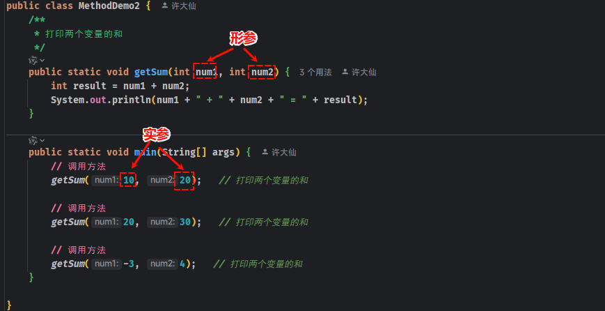
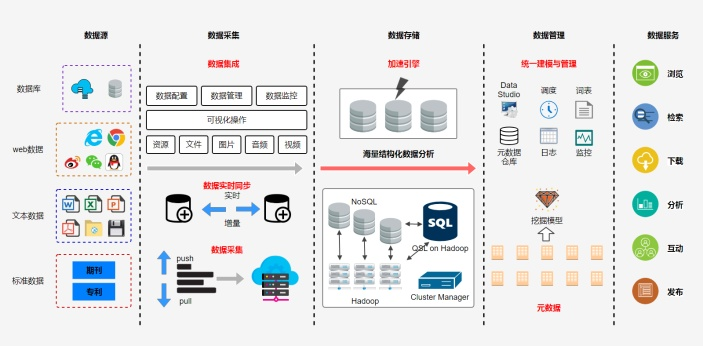
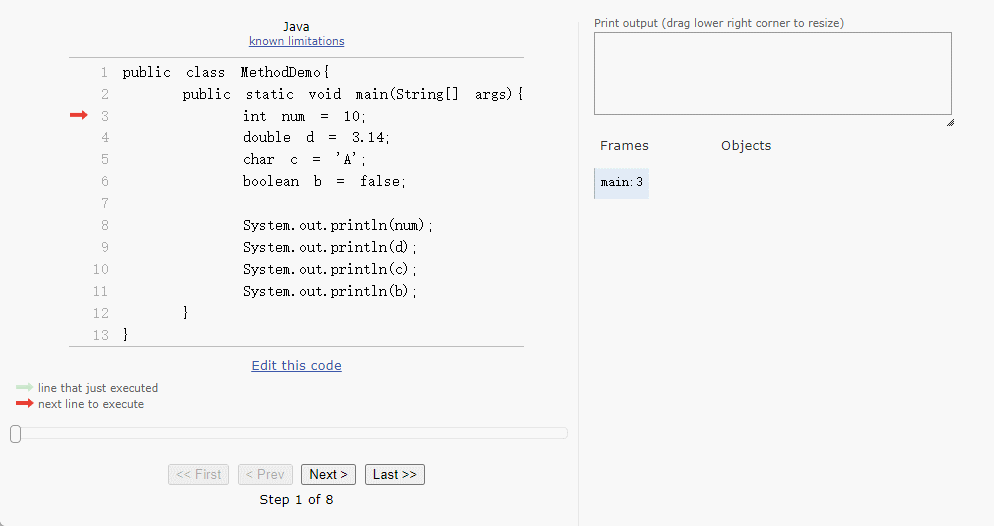
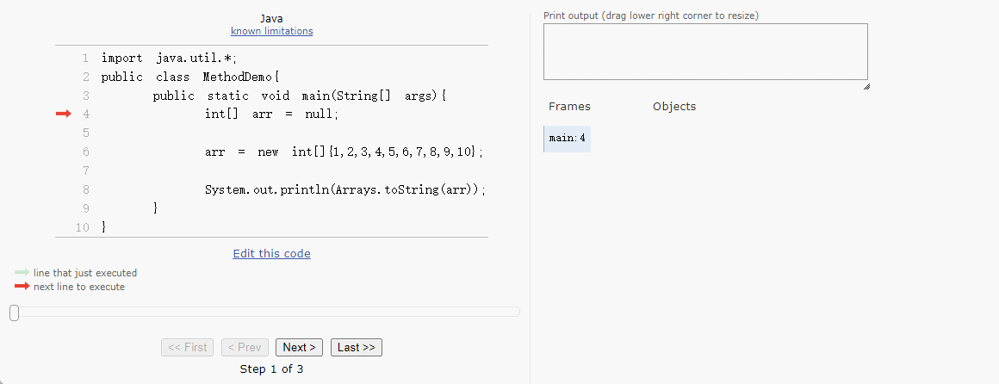
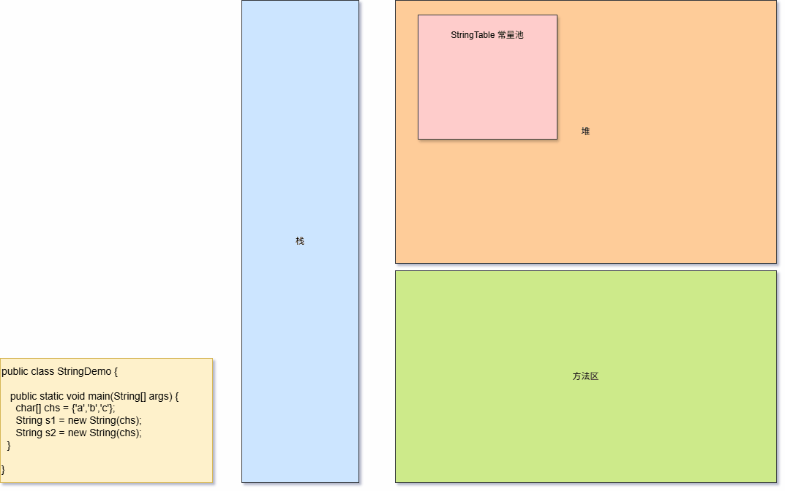
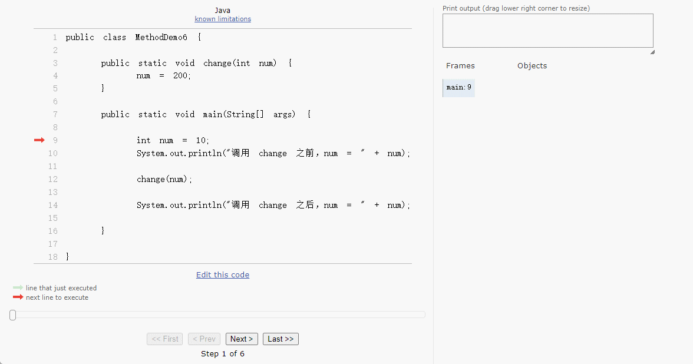
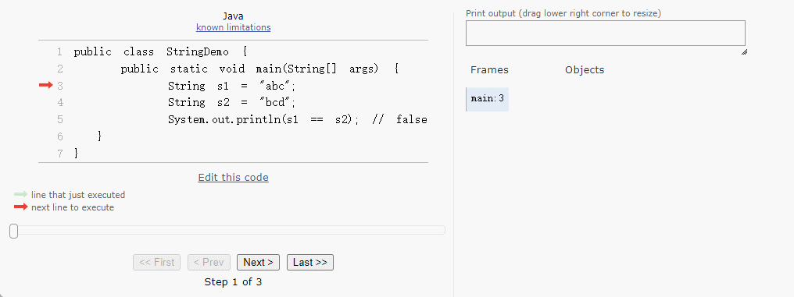
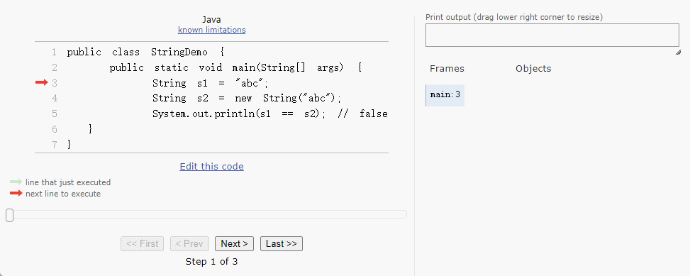
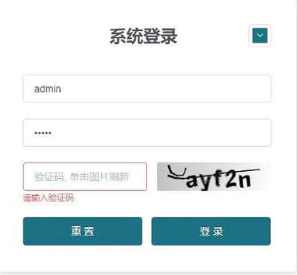

# 第一章：API 和 API 帮助文档

## 1.1 概述

* 之前我们已经学习过了面向对象了。并且我们知道，面向对象具体就是两个部分：
  * ① `如何使用别人已经写好的东西`。
  * ② `我们自己如何设计一个类，并使用`。
* 之前，我们都是学习`自己如何设计一个类，并使用`。但是，不可能所有的功能都是我们自己去手动实现，这样效率太低。

> [!NOTE]
>
> * ① 为了降低开发的难度，Java 官方将一些常用的功能进行了封装，并形成 API 供我们调用。
> * ② 有的时候，我们需要实现一些功能，Java 官方并没有实现，如：通过 Java 代码去操作 Word、Excel 等，这个时候就需要调用一些第三方库提供的 API，如：Apache POI 等。

* 之后，在学习和工作的时候，我们也需要学习`如何使用别人已经写好的东西`。

## 1.2 ISA、ABI 和 API

* ISA 、ABI 和 API 的参考模型，如下所示：


* 在底层，硬件模型以指令集架构 （ISA） 表示，该架构定义了处理器、寄存器、存储器和中断管理的指令集。ISA 是硬件和软件之间的接口，对于操作系统 （OS） 开发人员 （System ISA） 和直接管理底层硬件的应用程序 （User ISA） 的开发人员来说非常重要。

> [!NOTE]
>
> - ① ISA 是计算机体系结构中定义的一组指令，它规定了处理器能够执行的操作。ISA 包括指令的编码、寄存器的使用、内存访问模式等。不同的处理器可能有不同的 ISA，例如：x86、ARM、MIPS 等。
> - ② 在设计一个新的操作系统时，开发者需要确保操作系统能够支持特定的 ISA ，以便在特定的硬件上运行。例如：如果操作系统旨在运行在 ARM 架构的处理器上，那么它必须能够理解和执行 ARM ISA 定义的指令集。

* 应用程序二进制接口 （ABI） 将`操作系统层`与由操作系统管理的`应用程序`和`库`分开。ABI 涵盖了低级数据类型、对齐方式和调用约定等详细信息，并定义了可执行程序的格式。系统调用在此级别定义。此接口允许应用程序和库在实现相同 ABI 的操作系统之间移植。

> [!NOTE]
>
> - ① ABI 是指在二进制级别上，应用程序与操作系统、库或应用程序的不同部分之间的接口。它定义了数据类型的大小、布局、对齐方式，以及函数调用的约定（如参数如何传递、返回值如何处理等）。ABI 确保了编译后的二进制文件能够在特定的操作系统和硬件平台上正确地运行。
> - ② 在 windows 上的应用程序的运行格式是：`PE`（portable executable）格式、`.dll` （dynamic link library）格式和 `.lib` 格式；而在 Linux 上的应用程序的运行格式是：`ELF`（executable and linking format）格式、`.so` （shared object）格式和 `.a` 格式。
> - ③ 在 Linux 中可以通过 `file /bin/ls` 命令查看指定可执行应用程序的 ABI 格式；从而也可以论证，在 Windows 上可以运行的程序，在 Linux 上运行不了。
> - ④ 当开发者在 Linux 系统上编写 C 语言程序，并使用特定的编译器（如：GCC）编译时，编译器会遵循 Linux 平台的 ABI 规范来生成二进制文件。这样，生成的可执行文件就可以在任何遵循相同 ABI 规范的 Linux 系统上运行。
> - ⑤ 如果一个应用程序需要跨平台（操作系统）运行，就需要使用`一套代码，多平台编译`的方式（针对 C 或 C++ 等），即：相同的源代码，在不同平台（操作系统）上使用特定平台的编译器（如：GCC）来分别编译成符合自己平台的 ABI 规范的二进制文件。

* 最高级别的抽象由应用程序编程接口 （API） 表示，它将`应用程序`连接到`库`或`底层操作系统`。

> [!NOTE]
>
> - ① API 是一组预定义的函数、协议和工具，用于构建软件和应用程序。API 允许不同的软件系统相互交互，它定义了软件组件之间如何相互通信。API 可以是库、框架、协议或服务。
> - ② 在 Web 开发中，开发者可能会使用 JavaScript 的 Fetch API 来与服务器进行通信，获取数据或提交表单。这个 API 提供了一种标准化的方式来发送 HTTP 请求和处理响应，而不需要开发者关心底层的网络协议细节。

## 1.3 API

* `API`（`A`pplication `P`rogramming `I`nterface）：应用程序编程接口。

> [!NOTE]
>
> API 的简单理解：API 就是别人已经写好的东西，我们不需要自己编写，直接使用。（无情的调参侠）

* `Java API`：指的是 JDK 中提供的各种功能的 Java 类。

> [!NOTE]
>
> * ① Java API（应用程序编程接口）是 Java 编程语言提供的一组预定义的类、接口、方法和工具，它们用于帮助开发人员快速构建应用程序。
> * ② Java API 是 Java 平台的重要组成部分，提供了大量的功能模块，开发人员可以直接使用这些模块来避免重复造轮子。
> * ③ Java API 涵盖了广泛的领域，包括输入/输出、网络、数据库连接、图形用户界面等。
> * ④ 这些类将底层的实现封装起来，我们并不需要关心这些类是如何实现的，只需要学习如何使用这些类。

* `第三方 API`：指的是开源组织或个人提供用于实现特定功能的 Java 类，如：Apache 的 POI 。

## 1.4 API 帮助文档

* Java 本身提供的 API 实在是太多太多，如果每个类，我们都需要背诵并记忆，那么我们想哭的心都有，如下所示：


* 为了帮助开发人员（程序员）能快速的搜索、了解以及学习的 Java 中的 API，Java 提供了文档，如下所示：

> [!NOTE]
>
> Java 中的`API 帮助文档`是通过`java doc`工具根据`文档注释`来生成的！！！


# 第二章：String 介绍（⭐）

## 2.1 概述

* 在 Java 中，字符串字面量是使用`""`包裹的，如下所示：

```java
String str = "abc";
```

```java
String str = "你好啊";
```

* 在 Java 中，字符串和任意数据类型的数据（常量或变量）进行相加，其实是拼接操作，结果是一个新的字符串，如下所示：

```java
String str = "abc";
String str2 = "abc" + 1;
```

```java
String str = "abc";
String str2 = 'c' + "abc";
```

## 2.2 字符串的应用场景

* ① `用户的输入和输出处理`：用户在界面、命令行或网页中输入的数据通常是字符串，需要进行读取、处理和显示。



* ② `文本数据处理`：对文章、日志、配置文件等文本进行读取、解析、提取关键字、格式化等操作。



## 2.3 字符串需要学习的内容

* ① 掌握字符串的一些常见操作：String、StringBuilder、StringBuffer、StringJoiner、Pattern、Matcher。
* ② 掌握分析问题、解决问题的能力，以解决实际开发中的常见问题。
* ③ 学习字符串相关的底层原理，以便处理开发中的一些复杂问题。


# 第三章：package 和 import （⭐）

## 3.1 package 关键字

* `package` 用于将类、接口等 Java 文件组织成不同的命名空间，从而避免命名冲突。
* 语法：

```java
package 顶级包名.子包名;
```

> [!NOTE]
>
> * ① `package` 帮助代码更有条理，尤其是在大型项目中。每个 Java 类文件可以声明一个包。
> * ② `package` 对应于文件系统的目录，package 语句中，用 `.` 来指明包（目录）的层次。
> * ③ `package` 语句作为 Java 源文件的第一条语句，指明该文件中定义的类所在的包。
> * ④ 如果没有显式声明 `package`，默认的包是 `default`，但这不推荐在实际开发中使用。
> * ⑤ 包通常用小写单词标识，通常使用所在公司域名的倒置，比如：`com.github.xxx` 。

> [!NOTE]
>
> ::: details 点我查看 大型项目中的 `package`
>
> 
>
> :::


* 示例：

```java {1}
package com.github.model;

public class Student {
    
    String name;
    int age;
    char gender;

    public void study() {
        System.out.println("学习使我快乐");
    }
}
```

## 3.2 import 关键字

* `import` 用于引入其他包中的类或接口，这样就可以在当前类中使用它们而不需要写全类的完整路径。
* 语法：

```java
import 顶级包名.子包名.类;
```

> [!NOTE]
>
> * ① `import` 语句使得代码更加简洁，避免每次使用类时都要写完整的类路径。
> * ② `import` 语句通常放在类文件的最上方，在 `package` 声明之后，类声明之前。
> * ③ `import java.util.Scanner` ：只引入一个类，使用其类名即可。
> * ④ `import java.util.*`：使用 `*` 来引入包中的所有类，但这种做法不推荐，因为它会引入所有类，可能影响性能，也不清楚具体引入了哪些类。
> * ⑤ 对于 `java.lang.*` 下的类，是不需要使用 import 导入， 因为 Java 已经默认帮我们导入了。
> * ⑥ 在实际开发中，无需担心，我们都是通过 `IDEA` ，让其帮助我们自动导入包。


* 示例：

```java {1}
import java.util.Scanner;

public class IOTest {
    public static void main(String[] args) {
        // 创建 Scanner 对象
        Scanner sc = new Scanner(System.in);

        System.out.print("姓名：");
        String name = sc.nextLine();
        System.out.print("年龄：");
        int age = sc.nextInt();
        System.out.print("身高：");
        double height = sc.nextDouble();
        System.out.print("体重：");
        double weight = sc.nextDouble();

        System.out.println("----------------------");

        System.out.println("姓名是：" + name);
        System.out.println("年龄是：" + age);
        System.out.println("身高是：" + height);
        System.out.println("体重是：" + weight);

        // 关闭资源
        sc.close();
    }
}
```


# 第四章：String（⭐）

## 4.1 概述

* 在 Java 中，String 类是定义在 java.lang 包下的，如下所示：

```java 
package java.lang;  // [!code focus]

public final class String
    implements java.io.Serializable, Comparable<String>, CharSequence,
               Constable, ConstantDesc {
    ...               
}
```

* 在 Java 中，所有的`字符串字面量`都是 String 类的`对象`，如下所示：

```java
String str = "abc";
```

```java
String str2 = "1";
```

* 在 JDK9 之后，String 对象内部的字符串内容是存储在一个 byte 数组中。

```java
public final class String
    implements java.io.Serializable, Comparable<String>, CharSequence,
               Constable, ConstantDesc {

    @Stable
    private final byte[] value; // [!code focus]
    
    ...               
 }                  
```

## 4.2 String 的特点

* ① String 是使用 final 修饰的，意味着我们不能继承 String。

::: code-group

```java [正例]
public class Demo {
    public static void main(String[] args){
        // 以下代码是正确的
        String str = "abc"; // [!code highlight]
    }
}
```

```java [反例]
 // 以下代码是错误的
public class String2 extends String { // [!code error]
    
}
```

:::

* ② String 的内容是不会发生改变的，它的值在创建之后就不能发生改变。

> [!NOTE]
>
> 如果进行字符串拼接操作，就会产生一个新的字符串对象！！！

```java
String str = "abc";
String str2 = str + 1 ; // 新的 String 实例
```

## 4.3 创建 String 对象的两种方式

* ① `直接赋值`：类似于普通基本数据类型变量的写法（语法糖），如：`String str = "xxx"` 。
* ② `new 构造方法`：

| String 类的构造方法              | 描述                             |
| -------------------------------- | -------------------------------- |
| public String() {}               | 创建空白字符串，不包含任何内容   |
| public String(String original){} | 根据传入的字符串，创建字符串对象 |
| public String(char value[]) {}   | 根据字符数组，创建字符串对象     |
| public String(byte[] bytes){}    | 根据字节数组，创建字符串对象     |

> [!NOTE]
>
> * ① 在实际开发中，使用最多的是`直接赋值`的写法。
> * ② 但是，有的时候，我们也需要将`字符数组`或`字节数组`，转换为字符串对象；此时，就需要使用`new 构造方法`的形式。


* 示例：直接赋值

```java
package com.github.demo;
 
public class StringDemo1 {
    public static void main(String[] args) {
       
        String s1 = "hello";
        System.out.println("s1 = " + s1);     
    }
}
```


* 示例：new 构造方法

```java
package com.github.demo;

// new 构造方法
public class StringDemo1 {
    public static void main(String[] args) {        
        
        // 空参构造，创建一个空白的字符串对象
        String s2 = new String();
        System.out.println("s2 = " + s2);
        
        // 传递一个字符串，根据传递的字符串内容创建一个新的字符串对象
        String s3 = new String("world");
        System.out.println("s3 = " + s3);
        
        // 传递一个字节数组，根据字节数组的内容创建一个新的字符串对象
        byte[] bytes = {97,98,99,100};
        String s4 = new String(bytes);
        System.out.println("s4 = " + s4);
        
        // 传递一个字符数组，根据字符数组的内容创建一个新的字符串对象
        char[] chs = {'a','b','c'};
        String s5 = new String(chs);
        System.out.println("s5= " + s5);        
    }
}
```

## 4.4 创建 String 对象背后的原理

### 4.4.1 Java 中的内存分配

* 为了更好的管理内存，JVM 将内存分为了`本地方法栈`、`寄存器`、`栈`、`方法区`和`堆`，如下所示：

> [!NOTE]
>
> - ① ~~**本地方法栈**：用于执行本地方法（Native Methods），是 Java 外部代码执行的栈空间。~~
> - ② ~~**寄存器**：硬件存储器，用于存储运算临时数据，提高计算效率。~~
> - ③ `栈`：用于存储方法的局部变量、操作数、栈帧等，和方法的调用生命周期密切相关，即：方法运行的时候进栈，方法执行完毕之后出栈。
> - ④ `方法区`：存储类的元数据、常量池等信息，类和方法的静态数据存储区域。
> - ⑤ `堆`：存储对象和数组，是 JVM 管理的最大内存区域，涉及对象的创建和垃圾回收。


* 为了更方便的管理字符串，Java 设计了 StringTable（字符串常量池），只有直接赋值的方式创建的字符串才会创建到该常量池中，并且在 JDK7 之后该字符串常量池是在方法区中的，如下所示：

> [!NOTE]
>
> 如果使用 `new 构造方法`创建的字符串还是在堆中。


* 但是，这种设计并不是很好，在 JDK 8 的时候，取消了方法区，新增了元空间，并将原先方法区中的很多功能进行拆分，有的功能放到了堆中，有的功能放到了元空间中，同时字符串常量池也从方法区移动到了堆中，如下所示：

> [!NOTE]
>
> JDK 7 中设计不好的原因是：方法区（永久代）使用的是虚拟机的内存，当加载过多的类，非常容易导致内存溢出，如：`OutOfMemoryError: PermGen space` 。


### 4.4.2 直接赋值方法的内存分配

* 假设要运行的代码，如下所示：

```java
public class StringDemo {
  public static void main(String[] args) {  
    String s1 = "abc";
    String s2 = "abc";	
  }
}
```

* 其在内存中的动态图，如下所示：

> [!NOTE]
>
> 使用`直接赋值`的方式创建字符串，系统会检查该`字符串`在`字符串常量池`中是否存在？
>
> * ① 存在：直接复用之前在`字符串常量池`中创建的字符串。
> * ② 不存在：在`字符串常量池`中创建新的字符串。



* 其完成的内存动态图，如下所示：


### 4.4.3 new 构造方法的内存分配

* 假设要运行的代码，如下所示：

```java
public class StringDemo {
  public static void main(String[] args) {  
     char[] chs = {'a','b','c'};
     String s1 = new String(chs);
     String s2 = new String(chs);
  }
}
```

* 其在内存中的动态图，如下所示：



* 其完整的内存动态图，如下所示：



## 4.5 字符串内容比较

### 4.5.1 概述

* 之前，我们可以通过 `==` 来判断字符串是否相等，如下所示：

```java
public class StringDemo {
    public static void main(String[] args) {  
        String s1 = "abc";
        String s2 = "abc";
        System.out.println(s1 == s2); // true
  }
}
```

* 其在内存中的动态图，如下所示：

> [!NOTE]
>
> * ① 如果是基本数据类型，`==` 比较的是数据值。
> * ② 如果是引用数据类型，`==` 比较的是对象的地址（只有两个字符串变量都指向字符串的常量对象时，才会返回 true ）。 



* 之前，我们可以通过 `==` 来判断字符串是否相等，如下所示：

```java
public class StringDemo {
    public static void main(String[] args) {  
        String s1 = "abc";
        String s2 = "bcd";
        System.out.println(s1 == s2); // false
  }
}
```

* 其在内存中的动态图，如下所示：

> [!NOTE]
>
> * ① 如果是基本数据类型，`==` 比较的是数据值。
> * ② 如果是引用数据类型，`==` 比较的是对象的地址（只有两个字符串变量都指向字符串的常量对象时，才会返回 true ）。 



* 但是，如果 String 创建的方式不一样，我们通过 `==` 来判断字符串是否相等，得到的结果可能并非我们所预期的（因为我们想要的是如果字符串内容相等，就认为是一样的），如下所示：

```java
public class StringDemo {
    public static void main(String[] args) {  
        String s1 = "abc";
        String s2 = new String("abc");
        System.out.println(s1 == s2); // false
  }
}
```

* 其在内存中的动态图，如下所示：

> [!NOTE]
>
> * ① 如果是基本数据类型，`==` 比较的是数据值。
> * ② 如果是引用数据类型，`==` 比较的是对象的地址（只有两个字符串变量都指向字符串的常量对象时，才会返回 true ）。 



### 4.5.2 字符串内容相等比较（区分大小写）

* 在 Java 中，字符串内容相等的比较需要使用 equals() 方法，并且 equals() 方法区分大小写。

```java
public boolean equals(Object anObject) { // [!code focus]
    if (this == anObject) {
        return true;
    }
    return (anObject instanceof String aString)
            && (!COMPACT_STRINGS || this.coder == aString.coder)
            && StringLatin1.equals(value, aString.value);
} // [!code focus]
```


* 示例：

```java
package com.github.demo;

public class StringDemo {
    public static void main(String[] args) {
        String s1 = "abc";
        String s2 = new String("abc");
        System.out.println(s1.equals(s2)); // true
    }
}
```

### 4.5.3 字符串内容相等比较（忽略大小写）

* 在 Java 中，字符串内容相等的比较（忽略大小写）需要使用 equalsIgnoreCase() 方法。

```java
public boolean equalsIgnoreCase(String anotherString) { // [!code focus]
    return (this == anotherString) ? true
            : (anotherString != null)
            && (anotherString.length() == length())
            && regionMatches(true, 0, anotherString, 0, length());
} // [!code focus]
```


* 示例：

```java
package com.github.demo;

public class StringDemo {
    public static void main(String[] args) {
        String s1 = "abc";
        String s2 = new String("Abc");
        System.out.println(s1.equalsIgnoreCase(s2)); // true
    }
}
```


* 示例：

```java
package com.github.demo;

import java.util.Scanner;

public class StringDemo {
    public static void main(String[] args) {
        Scanner input = new Scanner(System.in);
        System.out.print("请输入一个字符串："); // abc
        String str = input.next(); // new 出来的
        System.out.println("您输入的字符串是：" + str);
        String str2 = "abc";
        System.out.println(str == str2); // false
    }
}
```

### 4.5.4 字符串内容大小比较（区分大小写）

* 在 Java 中，字符串内容大小的比较需要使用 compareTo() 方法，并且 compareTo() 方法是按照字符的 Unicode 编码值进行比较大小，严格区分大小写。

```java
public int compareTo(String anotherString) { // [!code focus]
    byte v1[] = value;
    byte v2[] = anotherString.value;
    byte coder = coder();
    if (coder == anotherString.coder()) {
        return coder == LATIN1 ? StringLatin1.compareTo(v1, v2)
                               : StringUTF16.compareTo(v1, v2);
    }
    return coder == LATIN1 ? StringLatin1.compareToUTF16(v1, v2)
                           : StringUTF16.compareToLatin1(v1, v2);
 } // [!code focus]
```

> [!NOTE]
>
> * ① 字典顺序，也称为词典顺序或字母顺序，是指字符串按照字符在 Unicode 编码中的顺序进行比较。比较过程从两个字符串的第一个字符开始，逐个比较对应位置的字符。
>
> * ② str1.compareTo(str2) 有 3 种结果：
>
>   * 0：str1 在字典顺序中等于 str2。
>
>   * 0 ：str1 在字典顺序中大于 str2。
>
>   * <0 ：str1 在字典顺序中小于 str2。


* 示例：

```java
package com.github.demo;

public class StringDemo3 {
    public static void main(String[] args) {
        String str1 = "abc";
        String str2 = "bcd";
        System.out.println(str1.compareTo(str2)); // -1
    }
}
```

### 4.5.5 字符串内容大小比较（不区分大小写）

* 在 Java 中，字符串内容大小的比较（忽略大小写）需要使用 compareToIgnoreCase() 方法，并且 compareToIgnoreCase() 方法是按照字符的 Unicode 编码值进行比较大小。

```java
public int compareToIgnoreCase(String str) {  // [!code focus]
    return CASE_INSENSITIVE_ORDER.compare(this, str);
} // [!code focus]

public static final Comparator<String> CASE_INSENSITIVE_ORDER
                                         = new CaseInsensitiveComparator();

    private static class CaseInsensitiveComparator
            implements Comparator<String>, java.io.Serializable {
        // use serialVersionUID from JDK 1.2.2 for interoperability
        @java.io.Serial
        private static final long serialVersionUID = 8575799808933029326L;

        public int compare(String s1, String s2) {
            byte v1[] = s1.value;
            byte v2[] = s2.value;
            byte coder = s1.coder();
            if (coder == s2.coder()) {
                return coder == LATIN1 ? StringLatin1.compareToCI(v1, v2)
                                       : StringUTF16.compareToCI(v1, v2);
            }
            return coder == LATIN1 ? StringLatin1.compareToCI_UTF16(v1, v2)
                                   : StringUTF16.compareToCI_Latin1(v1, v2);
        }

        /** Replaces the de-serialized object. */
        @java.io.Serial
        private Object readResolve() { return CASE_INSENSITIVE_ORDER; }
 }
```


* 示例：

```java
package com.github.demo;

public class StringDemo3 {
    public static void main(String[] args) {
        String str1 = "abc";
        String str2 = "bcd";
        System.out.println(str1.compareToIgnoreCase(str2)); // -1
    }
}
```

## 4.6 静态方法

* String 提供了静态方法 valueOf ，可以将任意数据类型转换为 String 类型。

::: code-group

```java [Object --> String]
public static String valueOf(Object obj) { // [!code focus]
   return (obj == null) ? "null" : obj.toString();
} // [!code focus]
```

```java [char[] --> String]
public static String valueOf(char data[]) { // [!code focus]
    return new String(data);
} // [!code focus]
public static String valueOf(char data[], int offset, int count) { // [!code focus]
    return new String(data, offset, count);
} // [!code focus]
```

```java [基本数据类型 --> String]
public static String valueOf(boolean b) { // [!code focus]
    return b ? "true" : "false";
} // [!code focus]
public static String valueOf(char c) { // [!code focus]
    if (COMPACT_STRINGS && StringLatin1.canEncode(c)) {
        return new String(StringLatin1.toBytes(c), LATIN1);
    }
    return new String(StringUTF16.toBytes(c), UTF16);
} // [!code focus]
public static String valueOf(long l) { // [!code focus]
    return Long.toString(l);
} // [!code focus]
public static String valueOf(long l) { // [!code focus]
    return Long.toString(l);
} // [!code focus]
public static String valueOf(float f) { // [!code focus]
    return Float.toString(f);
} // [!code focus]
public static String valueOf(double d) { // [!code focus]
    return Double.toString(d);
} // [!code focus]
```

:::


* 示例：

```java
package com.github.demo;

import java.util.Map;

public class StringDemo5 {
    public static void main(String[] args) {
        Map<String,Object> map = Map.of("name","张三","age",18,"sex","男");
        String str = String.valueOf(map);
        // str = {sex=男, age=18, name=张三}
        System.out.println("str = " + str);
    }
}
```


* 示例：

```java
package com.github.demo;

public class StringDemo6 {
    public static void main(String[] args) {
        char[] chs = {'a', 'b', 'c', 'd', 'e', 'f'};
        String str = String.valueOf(chs);
        // str = abcdef
        System.out.println("str = " + str);
        str = String.valueOf(chs, 2, 3);
        // str = cde
        System.out.println("str = " + str);
    }
}
```


* 示例：

```java
package com.github.demo;

public class StringDemo7 {
    public static void main(String[] args) {
        String str = String.valueOf(true);
        // String.valueOf(true) = true
        System.out.println("String.valueOf(true) = " + str);
        str = String.valueOf(1);
        // String.valueOf(1) = 1
        System.out.println("String.valueOf(1) = " + str);
        str = String.valueOf('a');
        // String.valueOf('a') = a
        System.out.println("String.valueOf('a') = " + str);
    }
}
```

## 4.7 空字符串比较

### 4.7.1 概述

* 在 Java 中，空字符串就是 `""`，即：长度为 0 的字符串。

### 4.7.2 判断空字符串

#### 4.7.2.1 字符串长度

* 如果字符串的长度为 0 ，那么它就是空字符串。

```java
public int length(){}
```

> [!NOTE]
>
> JDK 1.6 在 String 类中提供了 `isEmpty` 方法，用来判断字符串是否是空字符串，如下所示：
>
> ```java
> public boolean isEmpty() {
>     return value.length == 0;
> }
> ```


* 示例：

```java
package com.github.demo;

public class StringDemo8 {
    public static void main(String[] args) {
        String str = "";
        System.out.println(str.length() == 0); // true
    }
}
```


* 示例：

```java
package com.github.demo;

public class StringDemo8 {
    public static void main(String[] args) {
        String str = "";
        System.out.println(str.isEmpty()); // true
    }
}
```

#### 4.7.2.2 isEmpty() VS isBlank()

* isEmpty() 用于检查字符串是否为空，即：字符串的长度是否为 0 。

```java
public boolean isEmpty() {
    return value.length == 0;
}
```

* isBlank() 用于检查字符串是否为空，或者只包含空白字符，如：空格、制表符、换行符：

```java
public boolean isBlank() {
    return indexOfNonWhitespace() == length();
}
private int indexOfNonWhitespace() {
    return isLatin1() ? StringLatin1.indexOfNonWhitespace(value)
                      : StringUTF16.indexOfNonWhitespace(value);
}
```

> [!NOTE]
>
> 在实际开发中，我们使用 `isBlank()` 方法居多！！！


* 示例：

```java
package com.github.demo;

public class StringDemo8 {
    public static void main(String[] args) {
        String str = "";
        System.out.println(str.isEmpty());  // 输出 true

        str = "hello";
        System.out.println(str.isEmpty());  // 输出 false

    }
}
```


* 示例：

```java
package com.github.demo;

public class StringDemo8 {
    public static void main(String[] args) {
        String str = "   ";  // 包含空格
        System.out.println(str.isBlank());  // 输出 true

        str = "";
        System.out.println(str.isBlank());  // 输出 true

        str = "hello";
        System.out.println(str.isBlank());  // 输出 false

    }
}
```

#### 4.7.2.3 实际开发技巧

* 实际开发中，并不能保证 String 一定不为 null ，如果为 null ，并调用了 String 的方法，将会产生 NullPointerException 。


* 示例：

```java
package com.github.demo;

public class StringDemo8 {
    public static void main(String[] args) {
        String str = null;
        boolean b = isBlank(str);
        System.out.println("b = " + b);
    }

    /**
     * 判断字符串是否为空或包含空白字符
     * @param str 字符串
     * @return true：为空或包含空白字符，false：不为空或不包含空白字符
     */
    public static boolean isBlank(String str) {
        return str == null || str.isBlank();
    }
}
```

## 4.8 字符串的常用方法

### 4.8.1 系列 1

#### 4.8.1.1 判断字符串内容是否为空

* 判断字符串是否为空，即：字符串的长度是否为 0 。

```java
public boolean isEmpty() { // [!code focus]
    return value.length == 0;
} // [!code focus]
```

* 判断检查字符串是否为空，或者只包含空白字符，如：空格、制表符、换行符：

```java
public boolean isBlank() { // [!code focus]
    return indexOfNonWhitespace() == length();
} // [!code focus]
private int indexOfNonWhitespace() {
    return isLatin1() ? StringLatin1.indexOfNonWhitespace(value)
                      : StringUTF16.indexOfNonWhitespace(value);
}
```

> [!NOTE]
>
> 在实际开发中，我们使用 `isBlank()` 方法居多！！！


* 示例：

```java
package com.github.demo;

public class StringDemo8 {
    public static void main(String[] args) {
        String str = "";
        System.out.println(str.isEmpty());  // 输出 true

        str = "hello";
        System.out.println(str.isEmpty());  // 输出 false

    }
}
```


* 示例：

```java
package com.github.demo;

public class StringDemo8 {
    public static void main(String[] args) {
        String str = "   ";  // 包含空格
        System.out.println(str.isBlank());  // 输出 true

        str = "";
        System.out.println(str.isBlank());  // 输出 true

        str = "hello";
        System.out.println(str.isBlank());  // 输出 false

    }
}
```

#### 4.8.1.2 拼接字符串

* 拼接其它字符串，相当于 `+` ：

```java
public String concat(String str) { // [!code focus]
    if (str.isEmpty()) {
        return this;
    }
    return StringConcatHelper.simpleConcat(this, str);
} // [!code focus]
```

> [!NOTE]
>
> * ① 功能上不如 `+` 强大，`+` 可以拼接各种数据类型的数据，而 `concat` 只能拼接字符串。
> * ② 在实际开发中，使用 `StringBuilder` 居多！！！


* 示例：

```java
package com.github.demo;

public class StringDemo8 {
    public static void main(String[] args) {
        String str = "Hello ";
        String result = str.concat("World");
        System.out.println("result = " + result); // result = Hello World
    }
}
```

#### 4.8.1.3 比较字符串内容

* 比较字符串内容（区分大小写）：

```java
public boolean equals(Object anObject) { // [!code focus]
    if (this == anObject) {
        return true;
    }
    return (anObject instanceof String aString)
            && (!COMPACT_STRINGS || this.coder == aString.coder)
            && StringLatin1.equals(value, aString.value);
} // [!code focus]
```

> [!NOTE]
>
> 如果`str1.equals(str2)`中的`str1`是`null`，会产生`NullPointerException`，可以使用 `Objects.equals(str1,str2)` 来代替！！！

* 比较字符串内容（不区分大小写）：

```java
public boolean equalsIgnoreCase(String anotherString) { // [!code focus]
    return (this == anotherString) ? true
            : (anotherString != null)
            && (anotherString.length() == length())
            && regionMatches(true, 0, anotherString, 0, length());
} // [!code focus]
```

* 比较字符串内容（区分大小写）：

```java
public final class Objects { // [!code focus]
    public static boolean equals(Object a, Object b) { // [!code focus]
        return (a == b) || (a != null && a.equals(b));
    } // [!code focus]
} // [!code focus]
```

> [!NOTE]
>
> 如果`str1.equals(str2)`中的`str1`是`null`，会产生`NullPointerException`，可以使用 `Objects.equals(str1,str2)` 来代替！！！


* 示例：

```java
package com.github.demo;

public class StringDemo8 {
    public static void main(String[] args) {
        String str = "hello";
        String str2 = "Hello";

        System.out.println(str.equals(str2)); // false
        System.out.println(str.equalsIgnoreCase(str2)); // true
    }
}
```


* 示例：

```java
package com.github.demo;

import java.util.Objects;

public class StringDemo8 {
    public static void main(String[] args) {
        String str = null;
        String str2 = "hello";
        String str3 = "hello";

        System.out.println(Objects.equals(str, str2)); // false
        System.out.println(Objects.equals(str2, str3)); // true
    }
}
```

#### 4.8.1.4 比较字符串大小

* 比较字符串大小（区分大小写），按照 Unicode 编码值比较大小：

```java
public int compareTo(String anotherString) { // [!code focus]
    byte v1[] = value;
    byte v2[] = anotherString.value;
    byte coder = coder();
    if (coder == anotherString.coder()) {
        return coder == LATIN1 ? StringLatin1.compareTo(v1, v2)
                               : StringUTF16.compareTo(v1, v2);
    }
    return coder == LATIN1 ? StringLatin1.compareToUTF16(v1, v2)
                           : StringUTF16.compareToLatin1(v1, v2);
 } // [!code focus]
```

* 比较字符串大小（不区分大小写），按照 Unicode 编码值比较大小：

```java
public int compareToIgnoreCase(String str) { // [!code focus]
    return CASE_INSENSITIVE_ORDER.compare(this, str);
} // [!code focus]

public static final Comparator<String> CASE_INSENSITIVE_ORDER
                                     = new CaseInsensitiveComparator();

/**
 * CaseInsensitiveComparator for Strings.
 */
private static class CaseInsensitiveComparator
        implements Comparator<String>, java.io.Serializable {
    // use serialVersionUID from JDK 1.2.2 for interoperability
    @java.io.Serial
    private static final long serialVersionUID = 8575799808933029326L;

    public int compare(String s1, String s2) {
        byte v1[] = s1.value;
        byte v2[] = s2.value;
        byte coder = s1.coder();
        if (coder == s2.coder()) {
            return coder == LATIN1 ? StringLatin1.compareToCI(v1, v2)
                                   : StringUTF16.compareToCI(v1, v2);
        }
        return coder == LATIN1 ? StringLatin1.compareToCI_UTF16(v1, v2)
                               : StringUTF16.compareToCI_Latin1(v1, v2);
    }

    /** Replaces the de-serialized object. */
    @java.io.Serial
    private Object readResolve() { return CASE_INSENSITIVE_ORDER; }
}
```


* 示例：

```java
package com.github.demo;

public class StringDemo8 {
    public static void main(String[] args) {
        String str1 = "hello";
        String str2 = "Hello";

        System.out.println(str1.compareTo(str2)); // 32
        System.out.println(str1.compareToIgnoreCase(str2)); // 0
    }
}
```

#### 4.8.1.5 转换大小写

* 将字符串中的字母转换为大写字母：

```java
public String toUpperCase() { // [!code focus] 
    return toUpperCase(Locale.getDefault());
} // [!code focus]
```

* 将字符串中的字母转换小写字母：

```java
public String toLowerCase() { // [!code focus] 
    return toLowerCase(Locale.getDefault());
} // [!code focus] 
```


* 示例：

```java
package com.github.demo;

public class StringDemo8 {
    public static void main(String[] args) {
        String str = "Hello";
        System.out.println(str.toUpperCase()); // HELLO
        System.out.println(str.toLowerCase()); // hello
    }
}
```

#### 4.8.1.6 去掉前后空白

* 将字符串的前后空白去掉：

```java
public String trim() { // [!code focus]
    String ret = isLatin1() ? StringLatin1.trim(value)
                            : StringUTF16.trim(value);
    return ret == null ? this : ret;
} // [!code focus]
```


* 示例：

```java
package com.github.demo;

public class StringDemo8 {
    public static void main(String[] args) {
        String str = " Hello1 111 ";
        System.out.println(str.trim()); // Hello1 111
    }
}
```

### 4.8.2 系列 2 ：查找

* 字符串中是否包含子串（推荐）：

```java
public boolean contains(CharSequence s) { // [!code focus]
    return indexOf(s.toString()) >= 0;
} // [!code focus]
```

* 从前往后查找字符串中的子串，如果有，返回第一次出现的下标；否则，返回 -1 ：

```java
public int indexOf(String str) { // [!code focus]
    byte coder = coder();
    if (coder == str.coder()) {
        return isLatin1() ? StringLatin1.indexOf(value, str.value)
                          : StringUTF16.indexOf(value, str.value);
    }
    if (coder == LATIN1) {  // str.coder == UTF16
        return -1;
    }
    return StringUTF16.indexOfLatin1(value, str.value);
} // [!code focus]
```

* 从后往前查找字符串中的子串，如果有，返回第一次出现的下标；否则，返回 -1 ：

```java
public int lastIndexOf(String str) { // [!code focus]
    return lastIndexOf(str, length());
} // [!code focus]
```


* 示例：

```java
package com.github.demo;

public class StringDemo8 {
    public static void main(String[] args) {
        String str = "Hello world Hello World";
        String str2 = "world";
        System.out.println(str.contains(str2)); // true

        int index = str.indexOf(str2);
        System.out.println(index); // 6

        int index2 = str.lastIndexOf(str2);
        System.out.println(index2); // 6
    }
}
```

### 4.8.3 系列 3 ：字符串截取

* 返回一个新的字符串，它是此字符串的从 `beginIndex` 开始截取到最后的一个子字符串：

```java
public String substring(int beginIndex) { // [!code focus]
    return substring(beginIndex, length());
} // [!code focus]
```

* 返回一个新字符串，它是此字符串从 `beginIndex` 开始截取到 `endIndex` (不包含)的一个子字符串：

```java
public String substring(int beginIndex, int endIndex) { // [!code focus]
    int length = length();
    checkBoundsBeginEnd(beginIndex, endIndex, length);
    if (beginIndex == 0 && endIndex == length) {
        return this;
    }
    int subLen = endIndex - beginIndex;
    return isLatin1() ? StringLatin1.newString(value, beginIndex, subLen)
                      : StringUTF16.newString(value, beginIndex, subLen);
} // [!code focus]
```


* 示例：

```java
package com.github.demo;

public class StringDemo8 {
    public static void main(String[] args) {
        String str = "Java is a good computer language";

        System.out.println(str.substring(5)); // is a good computer language
        System.out.println(str.substring(5, 11)); // is a g
    }
}
```

### 4.8.4 系列 4 ：字符相关

* 返回 index 位置的字符：

```java
public char charAt(int index) { // [!code focus]
    if (isLatin1()) {
        return StringLatin1.charAt(value, index);
    } else {
        return StringUTF16.charAt(value, index);
    }
} // [!code focus]
```

* 将字符串转换为一个新的字符数组返回：

```java
public char[] toCharArray() { // [!code focus]
    return isLatin1() ? StringLatin1.toChars(value)
                      : StringUTF16.toChars(value);
} // [!code focus]
```


* 示例：

```java
package com.github.demo;

import java.util.Arrays;

public class StringDemo8 {
    public static void main(String[] args) {
        // 将首字母变为大写
        String str = "hello World";
        str = Character.toUpperCase(str.charAt(0)) + str.substring(1);
        System.out.println("str = " + str); // Hello World

        // 将字符串中的字符按照大小顺序排列
        String str2 = "helloworldjava";
        char[] chars = str2.toCharArray();
        Arrays.sort(chars);
        // [a, a, d, e, h, j, l, l, l, o, o, r, v, w]
        System.out.println("chars = " + Arrays.toString(chars)); 
    }
}
```

### 4.8.5 系列 5 ：编码和解码

* 编码，将字符串转换为字节数组：

```java
public byte[] getBytes(Charset charset) { // [!code focus]
    if (charset == null) throw new NullPointerException();
    return encode(charset, coder(), value);
 } // [!code focus]
```

```java
public byte[] getBytes() { // [!code focus]
    return encode(Charset.defaultCharset(), coder(), value);
} // [!code focus]
```

* 解码，将字节数组转换为字符串：

```java
public String(byte bytes[], Charset charset) { // [!code focus]
    this(bytes, 0, bytes.length, charset);
} // [!code focus]
```

```java
public String(byte[] bytes) { // [!code focus]
    this(bytes, 0, bytes.length);
} // [!code focus]
```


* 示例：

```java
package com.github.demo;

import java.nio.charset.StandardCharsets;

public class StringDemo8 {
    public static void main(String[] args) {
        String str = "我爱中国";
        // 编码
        byte[] bytes = str.getBytes(StandardCharsets.UTF_8);
        // 解码
        String result = new String(bytes, StandardCharsets.UTF_8);
        // 我爱中国
        System.out.println(result); 
    }
}
```

### 4.8.6 系列 6 ：开头和结尾

* 是否以指定字符串开头：

```java
public boolean startsWith(String prefix) { // [!code focus]
    return startsWith(prefix, 0);
} // [!code focus]
```

* 是否以指定字符串结尾：

```java
public boolean endsWith(String suffix) { // [!code focus]
    return startsWith(suffix, length() - suffix.length());
} // [!code focus]
```


* 示例：

```java
package com.github.demo;

public class StringDemo8 {
    public static void main(String[] args) {
        String str = "我爱中国，我喜欢Java语言，但是我的英语不咋的";
        System.out.println(str.startsWith("我")); // true
        System.out.println(str.startsWith("我爱")); // true
        System.out.println(str.startsWith("我爱中国")); // true

        System.out.println(str.endsWith("不咋的")); // true
        System.out.println(str.endsWith("咋的")); // true
        System.out.println(str.endsWith("的")); // true
    }
}
```

### 4.8.7 系列 7 ：正则表达式

#### 4.8.7.1 概述

* 正则表达式：用来专门处理字符串的技术。 

| 字符类      | 描述                                    |
| ----------- | --------------------------------------- |
| `[abc]`     | 只能是 a 或 b 或 c                      |
| `[^abc]`    | 除了 a 、b 、c 以外的任意一个字符       |
| `[a-zA-Z]`  | 必须是 a - z ，A - Z 中的任意一个字符   |
| `[^a-zA-Z]` | 除了 a - z ，A - Z 中的任意任意一个字符 |

| 数字类   | 描述                             |
| -------- | -------------------------------- |
| `[0-9]`  | 只能是 0 和 9 之间的任意一个数字 |
| `\d`     | 等同于 `[0-9]`                   |
| `[^0-9]` | 除了 0 和 9 之间的任意一个数字   |
| `\D`     | 等同于 `[^0-9]`                  |

| 预定义字符类 | 描述                   |
| ------------ | ---------------------- |
| `.`          | 匹配所有字符           |
| `\d`         | 等同于 `[0-9]`         |
| `\D`         | 等同于 `[^0-9]`        |
| `\w`         | 等同于 `[a-zA-Z_0-9]`  |
| `\W`         | 等同于 `[^a-zA-Z_0-9]` |

| 边界匹配器 | 描述     |
| ---------- | -------- |
| `^`        | 行的开头 |
| `$`        | 行的结尾 |

| 数量类   | 描述                                            |
| -------- | ----------------------------------------------- |
| `X?`     | X 字符最多只能出现一次（ 0 次或 1 次）          |
| `X*`     | X 字符可以出现 0 次、1 次或多次                 |
| `X+`     | X 字符可以出现 1 次或多次                       |
| `X{n}`   | X 字符只能出现 n 次                             |
| `X{n*,}` | X 字符至少出现 n 次（在数学中表示 `[n,+∞)` ）   |
| `X{n,m}` | X 字符只能出现 n 到 m 次（在数学中表示 [n,m] ） |

* 常用正则表达式：

| 常用正则表达式                                               | 描述                                                         |
| ------------------------------------------------------------ | ------------------------------------------------------------ |
| `^[a-zA-Z]\w{5,15}$`                                         | 验证用户名和密码，并要求第一个字符为字母，一共 6-16 位字母数字下划线组成 |
| `^(\d{3,4}-)\d{7,8}$`                                        | 验证电话号码                                                 |
| `^\(13[0-9]\|14[5\|7]\|15[0-9]\|15[1-3]\|15[5-9]\|18[0-9]\|18[1-3]\|18[5-9]\)\d\{8\}$ ` | 验证手机号码                                                 |
| `^\w+([-+.]\w+)*@\w+([-.]\w+)*.\w+([-.]\w+)*$`               | 验证电子邮箱                                                 |
| `(\^\d\{15}\$)\|(\^\d\{18}\$)\|(\^\d\{17\}(\d\|X\|x)\$)`     | 验证身份证号码                                               |
| `^[A-Za-z0-9]+$`                                             | 只能输入由数字和 26 个英文字母组成的字符串                   |
| `^[0-9]+(\.\[0-9\]+){0,1}$`                                  | 整数或小数                                                   |
| `[\u4e00-\u9fa5]`                                            | 中文字符                                                     |
| `^(\[1-9\][0-9]*)+(.[0-9]{1,2})?$`                           | 金额校验（非零开头的最多带 2 位小数的数字）                  |

#### 4.7.8.2 字符串是否匹配

* 字符串是否匹配指定的正则表达式：

```java
public boolean matches(String regex) { // [!code focus]
    return Pattern.matches(regex, this);
} // [!code focus]
```


* 示例：

```java
package com.github.demo;

public class StringDemo8 {
    public static void main(String[] args) {
        String iphone = "13800138000";
        boolean matches = iphone.matches("^1[3-9]\\d{9}$");
        System.out.println("matches = " + matches);
    }
}
```

#### 4.7.8.3 替换

* 替换（不支持正则）：

```java
public String replace(CharSequence target, CharSequence replacement) { // [!code focus]
    String trgtStr = target.toString();
    String replStr = replacement.toString();
    int thisLen = length();
    int trgtLen = trgtStr.length();
    int replLen = replStr.length();

    if (trgtLen > 0) {
        if (trgtLen == 1 && replLen == 1) {
            return replace(trgtStr.charAt(0), replStr.charAt(0));
        }

        boolean thisIsLatin1 = this.isLatin1();
        boolean trgtIsLatin1 = trgtStr.isLatin1();
        boolean replIsLatin1 = replStr.isLatin1();
        String ret = (thisIsLatin1 && trgtIsLatin1 && replIsLatin1)
                ? StringLatin1.replace(value, thisLen,
                                       trgtStr.value, trgtLen,
                                       replStr.value, replLen)
                : StringUTF16.replace(value, thisLen, thisIsLatin1,
                                      trgtStr.value, trgtLen, trgtIsLatin1,
                                      replStr.value, replLen, replIsLatin1);
        if (ret != null) {
            return ret;
        }
        return this;

    } else { // trgtLen == 0
        int resultLen;
        try {
            resultLen = Math.addExact(thisLen, Math.multiplyExact(
                    Math.addExact(thisLen, 1), replLen));
        } catch (ArithmeticException ignored) {
            throw new OutOfMemoryError("Required length exceeds implementation limit");
        }

        StringBuilder sb = new StringBuilder(resultLen);
        sb.append(replStr);
        for (int i = 0; i < thisLen; ++i) {
            sb.append(charAt(i)).append(replStr);
        }
        return sb.toString();
    }
} // [!code focus]
```

* 替换匹配到的第一个（支持正则）：

```java
public String replaceFirst(String regex, String replacement) { // [!code focus]
    return Pattern.compile(regex).matcher(this).replaceFirst(replacement);
} // [!code focus]
```

* 替换所有匹配部分（支持正则）：

```java
public String replaceAll(String regex, String replacement) { // [!code focus]
    return Pattern.compile(regex).matcher(this).replaceAll(replacement);
} // [!code focus]
```


* 示例：

```java
package com.github.demo;

public class StringDemo8 {
    public static void main(String[] args) {
        String str = "hello22world.java;234";
        // 将其中的非字母替换掉
        String s = str.replaceAll("[^a-zA-Z]", "");
        System.out.println("s = " + s);
    }
}
```

#### 4.7.8.4 拆分

* 按照正则将字符串进行拆分：

```java
public String[] split(String regex) { // [!code focus]
    return split(regex, 0);
} // [!code focus]
```


* 示例：

```java
package com.github.demo;

import java.util.Arrays;

public class StringDemo8 {
    public static void main(String[] args) {
        String str = "张三.23|李四.24|王五.25";
        // 按照|拆分
        String regex = "\\|";
        String[] split = str.split(regex);
        for (String s : split) {
            // 按照.进行拆分
            String[] str2 = s.split("\\.");
            System.out.println(Arrays.toString(str2));
        }
    }
}
```

## 4.9 String 和基本数据类型的转换

### 4.9.1 String --> 基本数据类型

* 将 `String` 转换为`基本数据类型`需要使用对应包装类的 `parseXxx()` 方法，如：`Integer.parseInt()` 用于将字符串转换为 `int`。

```java
public static int parseInt(String s) throws NumberFormatException { // [!code focus]
    return parseInt(s,10);
} // [!code focus]
```

```java
public static double parseDouble(String s) throws NumberFormatException { // [!code focus]
    return FloatingDecimal.parseDouble(s);
} // [!code focus]
```

```java
public static boolean parseBoolean(String s) { // [!code focus]
    return "true".equalsIgnoreCase(s);
} // [!code focus]
```

```java
public static long parseLong(String s) throws NumberFormatException { // [!code focus]
    return parseLong(s, 10);
} // [!code focus]
```

```java
public static float parseFloat(String s) throws NumberFormatException { // [!code focus]
    return FloatingDecimal.parseFloat(s);
} // [!code focus]
```

```java
public static byte parseByte(String s) throws NumberFormatException { // [!code focus]
    return parseByte(s, 10);
} // [!code focus]
```

```java
public static short parseShort(String s) throws NumberFormatException { // [!code focus]
    return parseShort(s, 10);
} // [!code focus]
```

> [!NOTE]
>
> 当字符串的内容不能被解析为目标数据类型时，会抛出异常！！！


* 示例：

```java
package com.github.demo4;

public class StringDemo1 {
    public static void main(String[] args) {
        String str = "1234";
        int num = Integer.parseInt(str);
        System.out.println("num = " + num);
    }
}
```

### 4.9.2 基本数据类型 --> String

* String 提供了静态方法 `valueOf(xxx)` ，可以将任意数据类型转换为 String 类型。

::: code-group

```java [Object --> String]
public static String valueOf(Object obj) { // [!code focus]
   return (obj == null) ? "null" : obj.toString();
} // [!code focus]
```

```java [char[] --> String]
public static String valueOf(char data[]) { // [!code focus]
    return new String(data);
} // [!code focus]
public static String valueOf(char data[], int offset, int count) { // [!code focus]
    return new String(data, offset, count);
} // [!code focus]
```

```java [基本数据类型 --> String]
public static String valueOf(boolean b) { // [!code focus]
    return b ? "true" : "false";
} // [!code focus]
public static String valueOf(char c) { // [!code focus]
    if (COMPACT_STRINGS && StringLatin1.canEncode(c)) {
        return new String(StringLatin1.toBytes(c), LATIN1);
    }
    return new String(StringUTF16.toBytes(c), UTF16);
} // [!code focus]
public static String valueOf(long l) { // [!code focus]
    return Long.toString(l);
} // [!code focus]
public static String valueOf(long l) { // [!code focus]
    return Long.toString(l);
} // [!code focus]
public static String valueOf(float f) { // [!code focus]
    return Float.toString(f);
} // [!code focus]
public static String valueOf(double d) { // [!code focus]
    return Double.toString(d);
} // [!code focus]
```

:::


* 示例：

```java
package com.github.demo4;

public class StringDemo2 {
    public static void main(String[] args) {
        int num = 10;
        String str = String.valueOf(num);
        System.out.println("str = " + str);
    }
}
```

## 4.10 String 和字节数组的相互转换

### 4.10.1 String --> 字节数组

* 通过 String 类的 `getBytes()` 方法可以将 String 转换为字节数组。

```java
public byte[] getBytes() { // [!code focus]
    return encode(Charset.defaultCharset(), coder(), value);
} // [!code focus]
```

```java
public byte[] getBytes(Charset charset) { // [!code focus]
    if (charset == null) throw new NullPointerException();
    return encode(charset, coder(), value);
 } // [!code focus]
```


* 示例：

```java
package com.github.demo4;

import java.nio.charset.StandardCharsets;

public class StringDemo3 {
    public static void main(String[] args) {
        String str = "Hello World";
        byte[] bytes = str.getBytes();
        System.out.println(new String(bytes));

        byte[] byte2 = str.getBytes(StandardCharsets.UTF_8);
        System.out.println(new String(byte2, StandardCharsets.UTF_8));
    }
}
```

### 4.10.2 字节数组 --> String

* 通过 String 类的`String(xxx)`构造方法可以将字节数组转换为字符串：

```java
public String(byte[] bytes) { // [!code focus]
    this(bytes, 0, bytes.length);
} // [!code focus]
```

```java
public String(byte[] bytes, int offset, int length) { // [!code focus]
    this(bytes, offset, length, Charset.defaultCharset());
} // [!code focus]
```


* 示例：

```java
package com.github.demo4;

public class StringDemo4 {
    public static void main(String[] args) {
        byte[] bytes = {97,98,99,100};
        String string = new String(bytes);
        System.out.println("string = " + string);
    }
}
```

## 4.11 String 和字符数组的相互转换

### 4.11.1 String --> 字符数组

* 通过 String 类的 `getChars()` 或 `toCharArray()` 方法可以将 String 转换为字符数组。

```java
public char[] toCharArray() {  // [!code focus]
    return isLatin1() ? StringLatin1.toChars(value)
                      : StringUTF16.toChars(value);
} // [!code focus]
```

```java
public void getChars(int srcBegin, int srcEnd, char dst[], int dstBegin) { // [!code focus]
    checkBoundsBeginEnd(srcBegin, srcEnd, length());
    checkBoundsOffCount(dstBegin, srcEnd - srcBegin, dst.length);
    if (isLatin1()) {
        StringLatin1.getChars(value, srcBegin, srcEnd, dst, dstBegin);
    } else {
        StringUTF16.getChars(value, srcBegin, srcEnd, dst, dstBegin);
    }
} // [!code focus]
```


* 示例：

```java
package com.github.demo4;

public class StringDemo5 {
    public static void main(String[] args) {
        String str = "我很好";
        char[] chs = new char[str.length()];
        str.getChars(0, str.length(), chs, 0);
        System.out.println(new String(chs));
    }
}
```


* 示例：

```java
package com.github.demo4;

public class StringDemo5 {
    public static void main(String[] args) {
        String str = "我很好";
        char[] chs = str.toCharArray();
        System.out.println(new String(chs));
    }
}
```

### 4.11.2 字符数组 --> String

* 通过 String 类的`String(xxx)`构造方法可以将字符数组转换为字符串：

```java
public String(char value[]) { // [!code focus]
    this(value, 0, value.length, null);
} // [!code focus]
```

```java
public String(char value[], int offset, int count) { // [!code focus]
    this(value, offset, count, rangeCheck(value, offset, count));
} // [!code focus]
```


* 示例：

```java
package com.github.demo4;

public class StringDemo5 {
    public static void main(String[] args) {
        String str = "我很好";
        char[] chs = str.toCharArray();
        System.out.println(new String(chs));
    }
}
```

# 第五章：作业

## 5.1 用户登录

* 需求：已知正确的用户名和密码，请使用程序模拟用户登录。

> [!NOTE]
>
> 总共给 3 次试错机会，并且登录成功之后，需要给出相应的提示。


* 示例：

```java
package com.github.test;

import java.util.Scanner;

public class StringDemo2 {
    public static void main(String[] args) {
        Scanner input = new Scanner(System.in);
        // 正确的用户名和密码
        String rightUsername = "admin";
        String rightPassword = "123456";
        // 用户登录逻辑
        int count = 3;
        int originCount = count;
        do {
            System.out.print("请输入用户名：");
            String username = input.next();
            System.out.print("请输入密码：");
            String password = input.next();
            if (username.equals(rightUsername) 
                && password.equals(rightPassword)) {
                System.out.println("登录成功");
                break;
            }
            count--;
            if (count > 0) {
                System.out.println("登录失败，请重新输入，还剩下" 
                                   + (count) + "次机会！");
            } else {
                System.out.println("登录失败，您已经输错" 
                                   + originCount + "次了");
            }
        } while (count > 0);
    }
}
```

## 5.2 遍历字符串

* 需求：键盘录入一个字符串，实现在控制台遍历字符串并输出每个字符。

> [!NOTE]
>
> * 根据索引返回字符：
>
> ```java
> public char charAt(int index) {}
> ```
>
> * 返回字符串的长度：
>
> ```java
> public int length() {}
> ```


* 示例：

```java
package com.github.test2;

import java.util.Scanner;

public class StringTest2 {
    public static void main(String[] args) {
        Scanner sc = new Scanner(System.in);
        System.out.print("请输入一个字符串：");
        String str = sc.next();
        // 遍历字符串，获取每个字符
        for (int i = 0; i < str.length(); i++) {
            char c = str.charAt(i);
            System.out.println(c);
        }
        sc.close();
    }
}
```

## 5.3 统计字符个数

* 需求：键盘录入一个字符串，统计该字符串中大写字母字符、小写字母字符以及数字字符出现的次数（不考虑其他字符）。


* 示例：

```java
package com.github.test;

import java.util.Scanner;

public class StringTest3 {
    public static void main(String[] args) {
        Scanner sc = new Scanner(System.in);
        System.out.print("请输入一个字符串：");
        String str = sc.next();
        // 遍历字符串，进行字符个数统计
        int majusculeCount = 0;
        int minusculeCount = 0;
        int digitCount = 0;
        for (int i = 0; i < str.length(); i++) {
            char c = str.charAt(i);
            if (c >= 'A' && c <= 'Z') {
                majusculeCount++;
            } else if (c >= 'a' && c <= 'z') {
                minusculeCount++;
            } else if (c >= '0' && c <= '9') {
                digitCount++;
            }
        }
        System.out.println("大写字母个数：" + majusculeCount);
        System.out.println("小写字母个数：" + minusculeCount);
        System.out.println("数字个数：" + digitCount);
        sc.close();
    }
}
```

## 5.4 字符串拼接

* 需求：定义一个方法，将 int 数组中的数据按照指定的格式拼接成一个字符串返回。

> [!NOTE]
>
> * ① 假设数组是 `int[] arr = {1,2,3};`，调用该方法后的输出结果是 ：`[1,2,3]`。
> * ② 其实，Java 中的 `Arrays.toString(arr)` 底层就是这种逻辑。


* 示例：

```java
package com.github.test;

public class StringTest4 {
    public static void main(String[] args) {
        int[] arr = {1, 2, 3, 4, 5};
        String s = printArray(arr);
        System.out.println("s = " + s);
    }

    /**
     * 打印数组
     * @param arr 数组
     * @return 数组字符串
     */
    public static String printArray(int[] arr) {
        if (arr == null) {
            return "null";
        }
        if (arr.length == 0) {
            return "[]";
        }
        String str = "[";
        for (int i = 0; i < arr.length; i++) {
            if (i == arr.length - 1) {
                str += arr[i];
                break;
            }
            str += arr[i] + ",";
        }
        str += "]";
        return str;
    }
}
```

## 5.5 字符串反转

* 需求：定义一个方法，将字符串进行反转。

> [!NOTE]
>
> * ① 字符串转换为字符数组：
>
> ```java
> public char[] toCharArray() {}
> ```
>
> * ② 将字符数组中的元素进行反转，再转换为字符串。


* 示例：

```java
package com.github.test;

public class StringTest5 {
    public static void main(String[] args) {
        String str = "abc";
        String reverse = reverse(str);
        System.out.println("reverse = " + reverse);
    }

    /**
     * 反转字符串
     * @param str 字符串
     * @return 字符串
     */
    public static String reverse(String str) {
        char[] chs = str.toCharArray();
        for (int i = 0, j = chs.length; i < j; i++, j--) {
            char temp = chs[i];
            chs[i] = chs[j - 1];
            chs[j - 1] = temp;
        }
        return String.valueOf(chs);
    }
}
```

## 5.6 金额转换

* 需求：将发票上的数字（2135）转换为大写（`零`佰`零`拾`零`万`贰`仟`壹`佰`叁`拾`伍`元）。



> [!NOTE]
>
> * ① String 有一个 format 的方法，如下所示：
>
> ```java
> public static String format(String format, Object... args){}
> ```
>
> * ② 将数字（2135）拆分为数组（`int[] arr = {2,1,3,5}`）和 `String[] MONEY_UNIT = {"佰", "拾", "万", "仟", "佰", "拾", "元"}`的长度进行比较：如果不够，前面补零；如果超了，直接报错。


* 示例：

```java
package com.github.test;

import java.util.Arrays;

public class StringTest6 {
    public static String[] MONEY_UNIT = {"佰", "拾", "万", "仟", "佰", "拾", "元"};
    public static String[] RMB_UNIT = {"零", "壹", "贰", "叁", "肆", "伍", "陆", "柒", "捌", "玖"};

    public static void main(String[] args) {
        int num = 2135;
        String digits = convert(num);
        System.out.println(digits);
    }

    /**
     * 金额转换
     * @param num 数字
     * @return 字符串
     */
    public static String convert(int num) {
        String format = getFormat();
        System.out.println("format = " + format);
        String[] rmb = convertRMB(num, MONEY_UNIT.length);
        System.out.println("rmb = " + Arrays.toString(rmb));
        return String.format(format, Arrays.stream(rmb).toArray());
    }

    /**
     * 获取 format 的字符串
     * @return 字符串
     */
    public static String getFormat() {
        String format = "";
        for (int i = 0; i < MONEY_UNIT.length; i++) {
            format += "%s" + MONEY_UNIT[i];
        }
        return format;
    }

    /**
     * 判断数字的位数
     * @param num 数字
     * @return 位数
     */
    public static int count(int num) {
        int count = 0;
        while (num != 0) {
            num = num / 10;
            count++;
        }
        return count;
    }

    /**
     * 将数字转换为 RMB
     * @param num 数字
     * @param maxLength 最大位数
     * @return RMB
     */
    public static String[] convertRMB(int num, int maxLength) {
        int[] digits = getDigits(num, maxLength);
        String[] money = new String[digits.length];
        for (int i = 0; i < digits.length; i++) {
            money[i] = RMB_UNIT[digits[i]];
        }
        return money;
    }

    /**
     * 将数字转换为数组
     * @param num 数字
     * @return 数组
     */
    public static int[] getDigits(int num, int maxLength) {
        int[] digits = new int[count(num)];
        for (int i = 0; i < digits.length; i++) {
            digits[i] = num % 10;
            num = num / 10;
        }
        // 将数组反转
        reverse(digits);
        // 判断位数
        if (digits.length > maxLength) {
            throw new RuntimeException("数字位数超过最大位数");
        }
        // 前面补零
        if (digits.length < maxLength) {
            int[] newDigits = new int[maxLength];
            System.arraycopy(digits, 0, newDigits, maxLength - digits.length, digits.length);
            return newDigits;
        }
        return digits;
    }

    /**
     * 数组反转
     * @param chs 数组
     */
    public static void reverse(int[] chs) {
        for (int i = 0, j = chs.length; i < j; i++, j--) {
            int temp = chs[i];
            chs[i] = chs[j - 1];
            chs[j - 1] = temp;
        }
    }
}
```

## 5.7 手机号屏蔽

* 需求：将手机号中间的 4 个号码进行屏蔽，如：`13115899468` --> `131****9468`。


* 示例：

```java
package com.github.test;

public class StringTest7 {

    public static void main(String[] args) {
        String phone = "13115899468";
        String convert = convert(phone);
        System.out.println("convert = " + convert);
    }

    /**
     * 手机号屏蔽
     * @param phone 手机号码
     * @return 屏蔽后的手机号码
     */
    public static String convert(String phone) {
        return phone.replaceAll("(\\d{3})\\d{4}(\\d{4})", "$1****$2");
    }
}
```

## 5.8 敏感词替换

* 需求：将一些敏感词替换为 `*`，如：`这里有一些敏感词，比如：傻瓜和笨蛋。` --> `这里有一些敏感词，比如：**和**。`。


* 示例：

```java
package com.github.test;

public class StringTest8 {

    public static void main(String[] args) {
        String text = "这里有一些敏感词，比如：傻瓜和笨蛋。";
        String[] sensitiveWords = {"傻瓜", "笨蛋"};
        String replacement = "*";
        String result = replaceSensitiveWords(text, sensitiveWords, replacement);
        System.out.println("result = " + result);
    }

    /**
     * 敏感词替换
     * @param text 文本
     * @param sensitiveWords 敏感词
     * @param replacement 替换字符
     * @return 替换之后的文本
     */
    public static String replaceSensitiveWords(String text, 
                                               String[] sensitiveWords, 
                                               String replacement) {
        for (int i = 0; i < sensitiveWords.length; i++) {
            String word = sensitiveWords[i];
            if (text.contains(word)) {
                text = text.replaceAll(word, replacement.repeat(word.length()));
            }
        }
        return text;
    }
}
```

