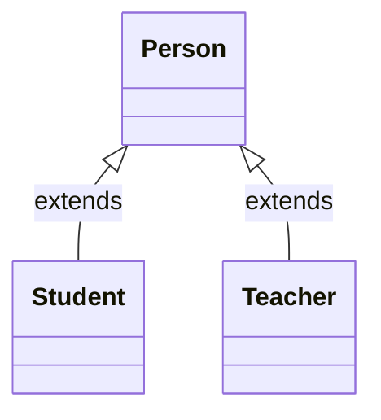
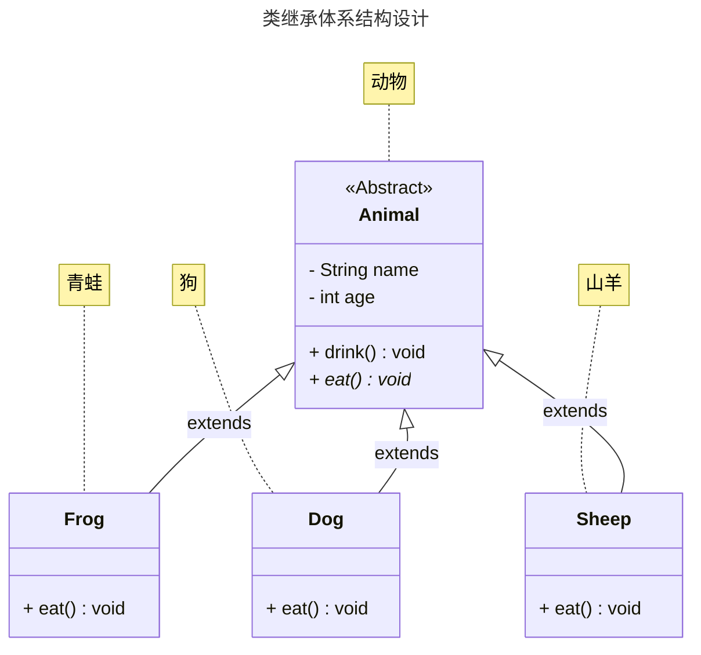
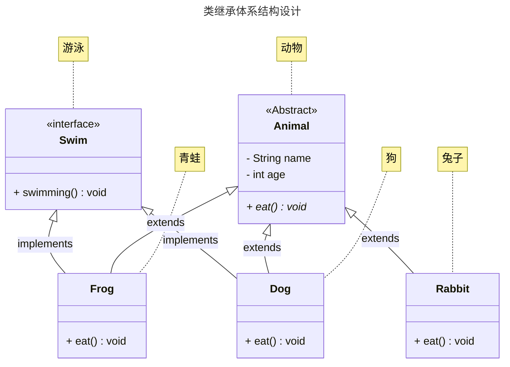
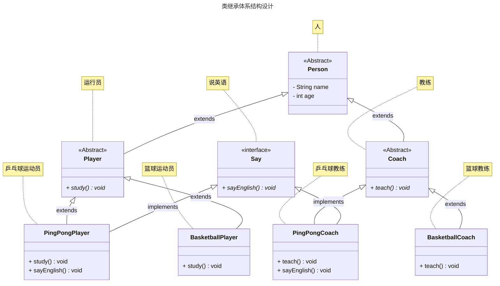

# 第一章：抽象类（⭐）

## 1.1 概述

### 1.1.1 引入

- 面向对象的三大特征：`封装`、`继承`和`多态`。之前，我们已经学习过了`封装`和`继承`以及`多态`。
- 其实，`抽象类`也是属于面向对象中的知识点。
- 所有的技术，都是为了解决问题而出现的，`抽象类`也不例外。
- 下面，我们将一起推导一下，`抽象类`为什么出现？

### 1.1.2 封装

* `封装就是对象代表什么，就得封装对应的数据，并提供数据对应的行为`。
* 有了封装之后，我们就可以将一些零散的数据以及对应的行为封装为一个整体，这个整体就是我们所说的对象，如下所示：


* 其代码实现，如下所示：

::: code-group

```java [Student.java]
public class Student {
    /**
     * 姓名
     */
    private String name;
    /**
     * 年龄
     */
    private int age;
    /**
     * 性别
     */
    private String gender;

    public Student() {}

    public Student(String name, int age, String gender) {
        this.name = name;
        this.age = age;
        this.gender = gender;
    }

    public String getName() {
        return name;
    }

    public void setName(String name) {
        this.name = name;
    }

    public int getAge() {
        return age;
    }

    public void setAge(int age) {
        this.age = age;
    }

    public String getGender() {
        return gender;
    }

    public void setGender(String gender) {
        this.gender = gender;
    }
    
    /**
     * 吃饭
     */
    public void eat() {
        System.out.println(this.name + "正在吃饭~");
    }

    /**
     * 睡觉
     */
    public void sleep() {
        System.out.println(this.name + "正在睡觉~");
    }

    @Override
    public String toString() {
        return "Student{" 
            + "name='" + name + '\'' 
            + ", age=" + age 
            + ", gender='" + gender 
            + '\'' + '}';
    }
}
```

```java {4-7} [StudentTest.java]
public class StudentTest {
    public static void main(String[] args) {

        Student s1 = new Student("张三", 18, "男");
        Student s2 = new Student("李四", 25, "女");
        Student s3 = new Student("王五", 30, "男");
        Student s4 = new Student("赵六", 35, "女");

    }
}
```

:::

* 以后我们面向的就是这个对象的整体，而不是一些零散的数据，如下所示：


* 其代码实现，如下所示：

::: code-group

```java [Student.java]
public class Student {
    /**
     * 姓名
     */
    private String name;
    /**
     * 年龄
     */
    private int age;
    /**
     * 性别
     */
    private String gender;

    public Student() {}

    public Student(String name, int age, String gender) {
        this.name = name;
        this.age = age;
        this.gender = gender;
    }

    public String getName() {
        return name;
    }

    public void setName(String name) {
        this.name = name;
    }

    public int getAge() {
        return age;
    }

    public void setAge(int age) {
        this.age = age;
    }

    public String getGender() {
        return gender;
    }

    public void setGender(String gender) {
        this.gender = gender;
    }
    
    /**
     * 吃饭
     */
    public void eat() {
        System.out.println(this.name + "正在吃饭~");
    }

    /**
     * 睡觉
     */
    public void sleep() {
        System.out.println(this.name + "正在睡觉~");
    }

    @Override
    public String toString() {
        return "Student{" 
            + "name='" + name + '\'' 
            + ", age=" + age 
            + ", gender='" + gender 
            + '\'' + '}';
    }
}
```

```java [StudentUtil.java]
public class StudentUtil {

    /**
    * 打印学生的信息
    */
    public static void printInfo(Student stu){
        // 通过 getter 方法获取属性
        System.out.println(stu.getName());
        System.out.println(stu.getAge());
        System.out.println(stu.getGender());
        // 也可以调用其他行为
        stu.eat();
        stu.sleep();
    }
}
```

:::

### 1.1.3 继承

- 如果类似的`JavaBean`也来越多，就会造成`代码膨胀`，如下所示：


* 其代码实现，如下所示：

::: code-group

```java [Student.java]
public class Student {
    /**
     * 姓名
     */
    private String name;
    /**
     * 年龄
     */
    private int age;
    /**
     * 性别
     */
    private String gender;

    public Student() {}

    public Student(String name, int age, String gender) {
        this.name = name;
        this.age = age;
        this.gender = gender;
    }

    public String getName() {
        return name;
    }

    public void setName(String name) {
        this.name = name;
    }

    public int getAge() {
        return age;
    }

    public void setAge(int age) {
        this.age = age;
    }

    public String getGender() {
        return gender;
    }

    public void setGender(String gender) {
        this.gender = gender;
    }

    /**
     * 吃饭
     */
    public void eat() {
        System.out.println(this.name + "正在吃饭~");
    }

    /**
     * 睡觉
     */
    public void sleep() {
        System.out.println(this.name + "正在睡觉~");
    }

    @Override
    public String toString() {
        return "Student{" 
            + "name='" + name + '\'' 
            + ", age=" + age 
            + ", gender='" + gender + '\'' + '}';
    }
}
```

```java [Teacher.java]
public class Teacher {
    /**
     * 姓名
     */
    private String name;
    /**
     * 年龄
     */
    private int age;
    /**
     * 性别
     */
    private String gender;

    public Student() {}

    public Student(String name, int age, String gender) {
        this.name = name;
        this.age = age;
        this.gender = gender;
    }

    public String getName() {
        return name;
    }

    public void setName(String name) {
        this.name = name;
    }

    public int getAge() {
        return age;
    }

    public void setAge(int age) {
        this.age = age;
    }

    public String getGender() {
        return gender;
    }

    public void setGender(String gender) {
        this.gender = gender;
    }

    /**
     * 吃饭
     */
    public void eat() {
        System.out.println(this.name + "正在吃饭~");
    }

    /**
     * 睡觉
     */
    public void sleep() {
        System.out.println(this.name + "正在睡觉~");
    }

    @Override
    public String toString() {
        return "Teacher{" 
            + "name='" + name + '\'' 
            + ", age=" + age 
            + ", gender='" + gender + '\'' + '}';
    }
}
```

```java [PersonUtil.java]
public class PersonUtil {

    /**
     * 打印学生的信息
     * @param stu 学生对象
     */
    public static void printInfo(Student stu) {
        System.out.println(stu.getName());
        System.out.println(stu.getAge());
        System.out.println(stu.getGender());
    }

    /**
     * 打印老师的信息
     * @param tea 老师对象
     */
    public static void printInfo(Teacher tea) {
        System.out.println(tea.getName());
        System.out.println(tea.getAge());
        System.out.println(tea.getGender());
    }
}

```

:::

* 此时，我们就可以将`相同的属性`和`相同的行为`抽取到一个`父类`中，`子类`只需要`继承`父类（子类可以有自己独有的属性和行为），如下所示：


* 其代码实现，如下所示：

::: code-group

```java [Person.java]
public class Person {
    /**
     * 姓名
     */
    private String name;
    /**
     * 年龄
     */
    private int age;
    /**
     * 性别
     */
    private String gender;

    public Person() {}

    public Person(String name, int age, String gender) {
        this.name = name;
        this.age = age;
        this.gender = gender;
    }

    public String getName() {
        return name;
    }

    public void setName(String name) {
        this.name = name;
    }

    public int getAge() {
        return age;
    }

    public void setAge(int age) {
        this.age = age;
    }

    public String getGender() {
        return gender;
    }

    public void setGender(String gender) {
        this.gender = gender;
    }

    public void eat() {
        System.out.println(this.name + "正在吃饭~");
    }

    public void sleep() {
        System.out.println(this.name + "正在睡觉~");
    }
}
```

```java [Student.java]
public class Student extends Person { // [!code highlight]

    private double score;

    public Student() {}

    public Student(String name, int age, String gender, double score) {
        super(name, age, gender);
        this.score = score;
    }

    public double getScore() {
        return score;
    }

    public void setScore(double score) {
        this.score = score;
    }

    @Override
    public String toString() {
        return "Student{} " + super.toString();
    }
}
```

```java [Teacher.java]
public class Teacher extends Person { // [!code highlight]

    private double salary;

    public Teacher() {}

    public Teacher(String name, int age, String gender, double salary) {
        super(name, age, gender);
        this.salary = salary;
    }

    public double getSalary() {
        return salary;
    }

    public void setSalary(double salary) {
        this.salary = salary;
    }

    @Override
    public String toString() {
        return "Teacher{" + "salary=" + salary + "} " + super.toString();
    }
}
```

```java [PersonUtil.java]
public class PersonUtil {

    /**
     * 打印人类的信息
     * @param p 人类对象
     */
    public static void printInfo(Person p) {
        System.out.println(p.getName());
        System.out.println(p.getAge());
        System.out.println(p.getGender());
    }

}
```

:::

### 1.1.4 多态

* 多态，从字面意思来看，就是指对象的多种形态，如下所示：



* 之前，我们创建对象是这样的，即：将 Student 对象赋值给 Student 类型的变量，如下所示：

```java
Student s = new Student(); // Student 对象是学生形态
```

* 有了多态之后，我们创建对象可以这样，即：将 Student 对象赋值给 Person 类型的变量，如下所示：

```java
Person p = new Student(); // Student 对象是人的形态
```

* 此时，学生对象就有了两种形态，如下所示：

```java
Student s = new Student(); // Student 对象是学生形态

Person p = new Student(); // Student 对象是人的形态
```

### 1.1.5 抽象类

* 如果在上述的继承体系中，学生和老师都有`work()`方法，那么我们就可以将该方法抽取到父类中，如下所示：


* 每个子类工作的内容是不一样的，如：`学生的工作是学习，老师的工作是教学`，当我们将`work()`方法抽取到父类中就不太好编写其方法体，难道写`学生的工作是学习`？


* 每个子类工作的内容是不一样的，如：`学生的工作是学习，老师的工作是教学`，当我们将`work()`方法抽取到父类中就不太好编写其方法体，难道写`老师的工作是教学`？


> [!NOTE]
>
> 其实，上述的方案是不行的：
>
> * ① 如果你在父类中的`work()`方法中写`学生的工作是学习`，那么老师会继承该方法，和实际需求不符合。
> * ② 如果你在父类中的`work()`方法中写`老师的工作是教学`，那么学生会继承该方法，和实际需求不符合。

* 之前，我们是在父类中的`work()`方法写`工作`，然后让子类重写了`work()`方法，如下所示：


* 但是，这样会产生一个弊端：我们并不能约束子类一定去重写这个方法，如：学生类中可以写`study()`方法，而老师类中可以写`working()`方法，如下所示：


* 此时，抽象类就出现了，即：抽象类就可以用来约束子类必须去实现抽象方法，如下所示：

> [!NOTE]
>
> * ① 如果一个方法抽取到父类中，不确定方法体，那么该方法就不需要写方法体，该方法可以使用`abstract`关键字修饰，即：抽象方法，如：`public abstract void work();`。
> * ② 如果一个类中有抽象方法，那么该类必须是抽象类，使用`abstract`关键字修饰，如：`public abstract class Person{}`。


## 1.2 抽象类和抽象方法

### 1.2.1 概述

* `抽象方法`：将`共性`的`行为`（方法）抽取到父类之后，由于灭个子类执行的内容是不一样的；所以，在父类中是不能确定`具体的方法体`，该方法就可以定义为抽象方法。
* `抽象类`：如果一个`类中存在抽象方法`，那么该类就`必须声明为抽象类`。

### 1.2.2 抽象方法

* 语法：

```java
权限访问修饰符 abstract 返回值类型 方法名(形参列表);
```

> [!NOTE]
>
> 使用`abstract` 关键字修饰方法，该方法就成了抽象方法，抽象方法只包含一个方法名，而没有方法体。


* 示例：

```java
public abstract class Person {
    
    public abstract void work(); // [!code highlight]
    
}
```

### 1.2.3 抽象类

* 语法：

```java
public abstract class 类名字 { 
  
}
```

> [!NOTE]
>
> * ① 如果一个类包含抽象方法，那么该类必须是抽象类。
> * ② 抽象类不一定有抽象方法，但是有抽象方法的类必须定义成抽象类。

> [!CAUTION]
>
> 【Java 规范】抽象类命名通常使用`Abstract`或`Base`开头；异常类命名使用`Exception`结尾，测试类命名以它要测试的类的名称开始，以`Test`结尾。


* 示例：

```java
public abstract class Person { // [!code highlight]
    
    public void eat(){
        System.out.println("吃饭");
    }
    
}
```


* 示例：

```java
public abstract class Person { // [!code highlight]
    
    public void eat(){
        System.out.println("吃饭");
    }
    public abstract void work(); 
    
}
```

### 1.2.4 抽象类的使用

* 继承抽象类的子类`必须重写父类所有的抽象方法`；否则，该子类也必须声明为抽象类。


* 示例：

::: code-group

```java [Person.java]
package com.github;

public abstract class Person {

    private String name;

    private int age;

    public Person() {}

    public Person(String name, int age) {
        this.name = name;
        this.age = age;
    }

    public String getName() {
        return name;
    }

    public void setName(String name) {
        this.name = name;
    }

    public int getAge() {
        return age;
    }

    public void setAge(int age) {
        this.age = age;
    }


    public void eat() {
        System.out.println("吃饭");
    }

    public void sleep() {
        System.out.println("睡觉");
    }

    // 抽象方法
    public abstract void work();

    @Override
    public String toString() {
        return "Person{" +
                "name='" + name + '\'' +
                ", age=" + age +
                '}';
    }
}
```

```java [Student.java]
package com.github;

public class Student extends Person{

    public Student() {}

    public Student(String name, int age) {
        super(name, age);
    }

    @Override
    public void work() {
        System.out.println("学生的工作是学习");
    }
}
```

```java [Teacher.java]
package com.github;

public class Teacher extends Person{

    public Teacher() {}

    public Teacher(String name, int age) {
        super(name, age);
    }

    @Override
    public void work() {
        System.out.println("老师的工作是教学");
    }
}
```

```java [Test.java]
package com.github;

public class Test {
    public static void main(String[] args) {
        Person p1 = new Student("张三", 18);
        p1.work();
        p1.eat();
        p1.sleep();
        System.out.println("p1 = " + p1);

        System.out.println("-------------------");

        Person p2 = new Teacher("李四", 28);
        p2.work();
        p2.eat();
        p2.sleep();
        System.out.println("p2 = " + p2);

    }
}
```

```txt [cmd 控制台]
学生的工作是学习
吃饭
睡觉
p1 = Person{name='张三', age=18}
-------------------
老师的工作是教学
吃饭
睡觉
p2 = Person{name='李四', age=28}
```

:::

## 1.3 抽象类和抽象方法的注意事项

* ① 抽象类不能实例化，即：抽象类不能创建对象。

> [!NOTE]
>
> 理解：假设创建了抽象类的对象，调用抽象的方法，而抽象方法没有具体的方法体，没有意义。

* ② 抽象类中不一定有抽象方法，有抽象方法的类一定是抽象类。

> [!NOTE]
>
> 理解：未包含抽象方法的抽象类，目的就是不想让调用者创建该类对象，通常用于某些特殊的类结构设计。

* ③ 抽象类可以有构造方法、实例方法和静态方法。

> [!NOTE]
>
> 理解：子类的构造方法中，有默认的 super()，需要访问父类构造方法。

* ④ 抽象类的子类，要么重写抽象类中的所有抽象方法，要么本身也是抽象类。

> [!NOTE]
>
> 理解：假设不重写所有抽象方法，则类中可能包含抽象方法。那么创建对象后，调用抽象的方法，没有意义。

* ⑤ 抽象类存在的意义是为了被子类继承。

> [!NOTE]
>
> 理解：抽象类中已经实现的是模板中确定的成员，抽象类不确定如何实现的定义成抽象方法，交给具体的子类去实现。

## 1.4 应用示例

* 需求：编写带有抽象类的标准 JavaBean 类。

| 动物       | 属性       | 行为         |
| ---------- | ---------- | ------------ |
| 青蛙 Frog  | 名字、年龄 | 吃虫子、喝水 |
| 狗 Dog     | 名字、年龄 | 吃骨头、喝水 |
| 山羊 Sheep | 名字、年龄 | 吃草、喝水   |




* 示例：

::: code-group

```java [Animal.java]
package com.github.demo2;

public abstract class Animal {

    private String name;

    private int age;


    public Animal() {}

    public Animal(String name, int age) {
        this.name = name;
        this.age = age;
    }

    public String getName() {
        return name;
    }

    public void setName(String name) {
        this.name = name;
    }

    public int getAge() {
        return age;
    }

    public void setAge(int age) {
        this.age = age;
    }


    public void drink(){
        System.out.println("喝水");
    }


    public abstract void eat();

    @Override
    public String toString() {
        return "Animal{" +
                "name='" + name + '\'' +
                ", age=" + age +
                '}';
    }
}
```

```java [Frog.java]
package com.github.demo2;

public class Frog extends Animal{

    public Frog() {}

    public Frog(String name, int age) {
        super(name, age);
    }

    @Override
    public void eat() {
        System.out.println("吃虫子");
    }
}
```

```java [Dog.java]
package com.github.demo2;

public class Dog extends Animal {

    public Dog() {}

    public Dog(String name, int age) {
        super(name, age);
    }

    @Override
    public void eat() {
        System.out.println("吃骨头");
    }
}
```

```java [Sheep.java]
package com.github.demo2;

public class Sheep extends Animal{

    public Sheep() {}

    public Sheep(String name, int age) {
        super(name, age);
    }

    @Override
    public void eat() {
        System.out.println("吃草");
    }
}
```

```java [Test.java]
package com.github.demo2;

public class Test {
    public static void main(String[] args) {
        Animal animal = new Frog("青蛙--呱呱", 2);
        animal.eat();
        animal.drink();
        System.out.println("animal = " + animal);

        System.out.println("------------------");

        Animal animal2 = new Dog("小狗--汪汪", 5);
        animal2.eat();
        animal2.drink();
        System.out.println("animal2 = " + animal2);

        System.out.println("------------------");

        Animal animal3 = new Sheep("山羊--洋洋", 9);
        animal3.eat();
        animal3.drink();
        System.out.println("animal3 = " + animal3);
    }
}
```

```txt [cmd 控制台]
吃虫子
喝水
animal = Animal{name='青蛙--呱呱', age=2}
------------------
吃骨头
喝水
animal2 = Animal{name='小狗--汪汪', age=5}
------------------
吃草
喝水
animal3 = Animal{name='山羊--洋洋', age=9}
```

:::

## 1.5 抽象类在实际开发中的意义

### 1.5.1 概述

* 抽象类存在的意义是为了被子类继承，否则抽象类将毫无意义。
* 抽象类可以强制让子类，一定要按照规定的格式进行重写。

### 1.5.2 疑惑？

* 将子类中共性的内容抽取到父类之后，由于方法体不确定，需要定义为抽象，子类必须重写抽象类中的所有抽象方法。
* 如果不将方法抽取到父类，直接在子类中写岂不是可以节约代码？


* 示例：

::: code-group

```java
package com.github.demo1;

public class Person {

    private String name;

    private int age;

    public Person() {
    }

    public Person(String name, int age) {
        this.name = name;
        this.age = age;
    }

    public String getName() {
        return name;
    }

    public void setName(String name) {
        this.name = name;
    }

    public int getAge() {
        return age;
    }

    public void setAge(int age) {
        this.age = age;
    }


    public void eat() {
        System.out.println("吃饭");
    }

    public void sleep() {
        System.out.println("睡觉");
    }

    @Override
    public String toString() {
        return "Person{" +
                "name='" + name + '\'' +
                ", age=" + age +
                '}';
    }
}
```

```java [Student.java]
package com.github.demo1;

public class Student extends Person {

    public Student() {
    }

    public Student(String name, int age) {
        super(name, age);
    }

    public void work() {
        System.out.println("学生的工作是学习");
    }
}
```

```java [Teacher.java]
package com.github.demo1;

public class Teacher extends Person {

    public Teacher() {
    }

    public Teacher(String name, int age) {
        super(name, age);
    }

    public void work() {
        System.out.println("老师的工作是教学");
    }
}
```

```java [Test.java]
package com.github.demo1;

public class Test {
    public static void main(String[] args) {
        Student p1 = new Student("张三", 18);
        p1.work();
        p1.eat();
        p1.sleep();
        System.out.println("p1 = " + p1);

        System.out.println("-------------------");

        Teacher p2 = new Teacher("李四", 28);
        p2.work();
        p2.eat();
        p2.sleep();
        System.out.println("p2 = " + p2);

    }
}
```

:::

### 1.5.3 问题

* 不将方法抽取到父类，直接在子类中写虽然看似可以节约代码；但是，会造成调用者在调用的时候，无法确定方法名（需要强制类型转换，非常麻烦）。


* 示例：

::: code-group

```java
package com.github.demo1;

public class Person {

    private String name;

    private int age;

    public Person() {
    }

    public Person(String name, int age) {
        this.name = name;
        this.age = age;
    }

    public String getName() {
        return name;
    }

    public void setName(String name) {
        this.name = name;
    }

    public int getAge() {
        return age;
    }

    public void setAge(int age) {
        this.age = age;
    }


    public void eat() {
        System.out.println("吃饭");
    }

    public void sleep() {
        System.out.println("睡觉");
    }

    @Override
    public String toString() {
        return "Person{" +
                "name='" + name + '\'' +
                ", age=" + age +
                '}';
    }
}
```

```java [Student.java]
package com.github.demo1;

public class Student extends Person {

    public Student() {
    }

    public Student(String name, int age) {
        super(name, age);
    }

    public void study() {
        System.out.println("学生的工作是学习");
    }
}
```

```java [Teacher.java]
package com.github.demo1;

public class Teacher extends Person {

    public Teacher() {
    }

    public Teacher(String name, int age) {
        super(name, age);
    }

    public void working() {
        System.out.println("老师的工作是教学");
    }
}
```

```java {9-16} [Test.java]
package com.github.demo1;

public class Test {
    public static void main(String[] args) {        
        show(new Student("张三", 18));
        show(new Teacher("李四", 28));
    }
    
    public static void show(Person p){
        System.out.println(p.getName() + "---" + p.getAge());
        if(p instanceof Student stu){
            stu.study();
        }else if(p instanceof Teacher tea){
            tea.working();
        }
    }
}
```

:::

### 1.5.4 解决

* 抽象类可以强制让子类，一定要按照规定的格式进行重写。


* 示例：

::: code-group

```java [Person.java]
package com.github;

public abstract class Person {

    private String name;

    private int age;

    public Person() {}

    public Person(String name, int age) {
        this.name = name;
        this.age = age;
    }

    public String getName() {
        return name;
    }

    public void setName(String name) {
        this.name = name;
    }

    public int getAge() {
        return age;
    }

    public void setAge(int age) {
        this.age = age;
    }


    public void eat() {
        System.out.println("吃饭");
    }

    public void sleep() {
        System.out.println("睡觉");
    }

    // 抽象方法
    public abstract void work();

    @Override
    public String toString() {
        return "Person{" +
                "name='" + name + '\'' +
                ", age=" + age +
                '}';
    }
}
```

```java [Student.java]
package com.github;

public class Student extends Person{

    public Student() {}

    public Student(String name, int age) {
        super(name, age);
    }

    @Override
    public void work() {
        System.out.println("学生的工作是学习");
    }
}
```

```java [Teacher.java]
package com.github;

public class Teacher extends Person{

    public Teacher() {}

    public Teacher(String name, int age) {
        super(name, age);
    }

    @Override
    public void work() {
        System.out.println("老师的工作是教学");
    }
}
```

```java {9-12} [Test.java]
package com.github.demo1;

public class Test {
    public static void main(String[] args) {
        show(new Student("张三", 18));
        show(new Teacher("李四", 28));
    }

    public static void show(Person p){
        System.out.println(p.getName() + "---" + p.getAge());
        p.work();
    }
}
```

:::

# 第二章：接口（⭐）

## 2.1 概述

* 假设有如下的继承体系：


* 我们可以将`共性`的部分抽取到父类中，如下所示：


* 现在，我们需要增加`游泳`的行为，难道也添加到父类中，如下所示：


* 其实，这是非常不合理的，因为只有`青蛙`才会游泳，而`兔子`和`狗`是不会游泳的。难道将`游泳`写在青蛙类中，如下所示：


* 如果此时，增加了`鱼`，并且`鱼`也有`游泳`的功能，难道也将`游泳`写在`鱼`类中，如下所示：


* 但是，这样会有一个弊端：我们无法限制子类中方法的书写格式，如下所示：


* 此时，接口就出现了，即：接口就可以用来约束实现类必须去实现抽象方法，如下所示：


* 但是，并不意味着所有的方法都需要抽取到接口中，比如：青蛙可以跳跃，而鱼不可以，我们只需要抽取共性的规则，如下所示：


> [!NOTE]
>
> 综上所述：当我们需要给多个类同时去定义规则的时候，就需要用到接口，即：接口就是一种规则。

## 2.2 抽象类 VS 接口

* 抽象类更多的是用来父类中，在抽象共性方法的时候，当方法体不一样，就可以写成抽象方法，而抽象方法所在的类就是抽象类。

> [!NOTE]
>
> 在下面的继承体系中，Animal 动物，我们就可以将其定义为抽象类，此时的抽象类就表示一类事物，即：表示动物这一类事物。


* 而接口不是表示一类事物，接口就是一种规则，它侧重于行为的抽象。

> [!NOTE]
>
> 青蛙可以有游泳的行为，鱼也可以有游泳的行为，而学生和老师也可以有游泳的行为。


## 2.3 接口

* 语法：

```java
public interface 接口名 {
    // ① 静态常量
    // ② 抽象方法
    // ③ 默认方法
    // ④ 静态方法
    // ⑤ 私有方法
}
```

> [!NOTE]
>
> * ① 接口和抽象类一样，不能实例化。
> * ② 接口和类之间是实现关系，使用`implements`关键字表示，如：`public class Frog implements Run {}`。
> * ③ 接口的子类（实现类），要么重写接口中的所有抽象方法，要么自身是抽象类。
> * ④ 接口和接口之间是继承的关系，如：`public interface A extends B {}` 。


* 示例：

::: code-group

```java [Fly.java]
public interface Fly {

    void fly();
}
```

```java [Bird.java]
public class Bird implements Fly {
    @Override
    public void fly() {
        System.out.println("小鸟在飞");
    }
}
```

```java [SuperMan.java]
public class SuperMan implements Fly {
    @Override
    public void fly() {
        System.out.println("超人在飞");
    }
}
```

```java [Test.java]
public class Test {
    public static void main(String[] args) {
        Fly bird = new Bird();
        bird.fly();

        System.out.println("-----------------");

        Fly superman = new SuperMan();
        superman.fly();
    }
}
```

:::

## 2.4 JDK 8 之前接口中的成员

### 2.4.1 概述

* JDK 8 之前接口中只允许出现：成员变量和成员方法，没有构造方法。
* 其中，`成员变量`是`公共的静态常量`，默认修饰符是：`public static final`。
* 其中，`成员方法`是`公共的抽象方法`，默认修饰符是：`public abstract`。

### 2.4.2 IDEA 验证

* 我们可以在 IDEA 中，通过`JclassLib`插件来验证`接口`中的`公共静态常量`，如下所示：


* 我们可以在 IDEA 中，通过`JclassLib`插件来验证`接口`中的`公共抽象方法`，如下所示：


### 2.4.3 接口中成员的思考？

* 【问】为什么接口中只能声明公共的静态常量？
* 【答】因为接口是标准规范，那么在规范中需要声明一些底线边界值，当实现者在实现这些规范的时候，不能随意的去修改和触碰这些底线边界值，否则就有 `危险` ，如：USB 1.0 规范中规定最大传输速率是 1.5 Mbps ，最大输出电流是 5V/500 mA 。 USB 3.0 规范中规定最大传输速率是5Gbps (500MB/s) ，最大输出电流是 5V/900 mA 。 


* 【问】为什么 JDK 8 之前，只允许出现公共的默认方法？
* 【答】因为接口是代表行为标准，它只规定方法的 `签名` ，方法 = 方法头 + 方法体；其中，方法头又称为方法签名，方法签名 = `修饰符 返回值类型 方法名(形参列表);` ，而方法体是 `{ // 执行逻辑 }`；换言之，方法签名已经提供了功能的描述信息，调用者无需关注具体的方法实现细节。

## 2.5 应用示例

* 需求：编写带有接口和抽象类的标准 JavaBean 类。

| 动物        | 属性       | 行为         |
| ----------- | ---------- | ------------ |
| 青蛙 Frog   | 名字、年龄 | 吃虫子、蛙泳 |
| 狗 Dog      | 名字、年龄 | 吃骨头、狗刨 |
| 兔子 Rabbit | 名字、年龄 | 吃胡萝卜     |




* 示例：

::: code-group

```java [Animal.java]
package com.github.demo3;

public abstract class Animal {

    private String name;

    private int age;


    public Animal() {}

    public Animal(String name, int age) {
        this.name = name;
        this.age = age;
    }

    public String getName() {
        return name;
    }

    public void setName(String name) {
        this.name = name;
    }

    public int getAge() {
        return age;
    }

    public void setAge(int age) {
        this.age = age;
    }

    public abstract void eat();

    @Override
    public String toString() {
        return "Animal{" +
                "name='" + name + '\'' +
                ", age=" + age +
                '}';
    }
}
```

```java [Swim.java]
package com.github.demo3;

public interface Swim {

    void swimming();

}
```

:::


* 示例：

::: code-group

```java [Frog.java]
package com.github.demo3;

public class Frog extends Animal implements Swim{

    public Frog() {}

    public Frog(String name, int age) {
        super(name, age);
    }

    @Override
    public void eat() {
        System.out.println("吃虫子");
    }

    @Override
    public void swimming() {
        System.out.println("蛙泳");
    }
}
```

```java [Dog.java]
package com.github.demo3;

public class Dog extends Animal implements Swim{

    public Dog() {}

    public Dog(String name, int age) {
        super(name, age);
    }

    @Override
    public void eat() {
        System.out.println("吃骨头");
    }

    @Override
    public void swimming() {
        System.out.println("狗刨");
    }
}
```

```java [Rabbit.java]
package com.github.demo3;

public class Rabbit extends Animal {

    public Rabbit() {}

    public Rabbit(String name, int age) {
        super(name, age);
    }

    @Override
    public void eat() {
        System.out.println("吃胡萝卜");
    }
}
```

```java [Test.java]
package com.github.demo3;

public class Test {
    public static void main(String[] args) {
        Frog frog = new Frog("青蛙--呱呱", 2);
        frog.eat();
        frog.swimming();
        System.out.println("frog = " + frog);

        System.out.println("------------------");

        Dog dog = new Dog("小狗--汪汪", 5);
        dog.eat();
        dog.swimming();
        System.out.println("dog = " + dog);

        System.out.println("------------------");

        Rabbit rabbit = new Rabbit("兔子--兔兔", 9);
        rabbit.eat();
        System.out.println("rabbit = " + rabbit);
    }
}
```

```txt [cmd 控制台]
吃虫子
蛙泳
frog = Animal{name='青蛙--呱呱', age=2}
------------------
吃骨头
狗刨
dog = Animal{name='小狗--汪汪', age=5}
------------------
吃胡萝卜
rabbit = Animal{name='兔子--兔兔', age=9}
```

:::

## 2.6 接口和类之间的关系

### 2.6.1 类和类之间的关系

* 类和类之间，是`继承`的关系，可以是单继承，不能多继承，但是可以多层继承。


* 示例：类和类之间，可以是单继承

::: code-group

```java [Animal.java]
public class Animal {}
```

```java [Dog.java]
public class Dog extends Animal {} // [!code highlight]
```

:::


* 示例：类和类之间，可以是多层继承

::: code-group

```java [Animal.java]
public class Animal {}
```

```java [Dog.java]
public class Dog extends Animal {} // [!code highlight]
```

```java [Husky.java]
public class Husky extends Dog {} // [!code highlight]
```

:::

### 2.6.2 类和接口之间的关系

* 类和接口之间是`实现`的关系，可以是单实现，也可以是多实现，甚至可以在继承一个类的同时实现多个接口。


* 示例：类和接口之间，可以是单实现

::: code-group

```java [Fly.java]
public interface Fly {

    void fly();
}
```

```java [Bird.java]
public class Bird implements Fly { // [!code highlight]
    @Override
    public void fly() {
        System.out.println("小鸟在飞");
    }
}
```

:::


* 示例：类和接口之间，可以是多实现

::: code-group

```java [Fly.java]
public interface Fly {

    void fly();
}
```

```java [Jump.java]
public interface Jump {

    void jump();
}
```

```java [Bird.java]
public class Bird implements Fly,Jump { // [!code highlight]
    @Override
    public void jump() {
        System.out.println("小鸟在跳");
    }
    
    @Override
    public void fly() {
        System.out.println("小鸟在飞");
    }
}
```

:::


* 示例：实现类可以继承一个类的同时，实现多个接口

::: code-group

```java [Animal.java]
public abstract class Animal {
    
    // 吃饭
    public abstract void eat();
}
```

```java [Fly.java]
public interface Fly {

    void fly();
}
```

```java [Jump.java]
public interface Jump {

    void jump();
}
```

```java [Bird.java]
public class Bird extends Animal implements Fly,Jump { // [!code highlight]
    @Override
    public void eat() {
        System.out.println("小鸟吃虫子");
    }
    
    @Override
    public void jump() {
        System.out.println("小鸟在跳");
    }
    
    @Override
    public void fly() {
        System.out.println("小鸟在飞");
    }
}
```

:::

### 2.6.3 接口和接口之间的关系

* 接口和接口之间是继承关系，可以是单继承，也可以是多继承。


* 示例：接口和接口之间，可以是单继承

::: code-group

```java
public interface Printable {
    void print();
}
```

```java
public interface Displayable extends Printable { // [!code highlight]
    void display();
}
```

```java [Printer.java]
public class Printer implements Displayable {
    @Override
    public void print() {
        System.out.println("Printing...");
    }

    @Override
    public void display() {
        System.out.println("Displaying...");
    }
}
```

:::


* 示例：接口和接口之间，可以是多继承

::: code-group

```java
public interface Printable {
    void print();
}
```

```java [Showable.java]
public interface Showable {
    void show();
}
```

```java [Displayable.java]
public interface Displayable extends Printable,Showable { // [!code highlight]
    void display();
}
```

```java [Printer.java]

public class Printer implements Displayable {
    @Override
    public void print() {
        System.out.println("Printing...");
    }
    
    @Override
    public void show() {
        System.out.println("Showing...");
    }
    
    @Override
    public void display() {
        System.out.println("Displaying...");
    }
}
```

:::

## 2.8 应用示例

* 需求：编写带有接口和抽象类的标准 JavaBean 类。

| 动物                           | 属性       | 行为               |
| ------------------------------ | ---------- | ------------------ |
| 乒乓球运动员（PingPongPlayer） | 名字、年龄 | 学打乒乓球、说英语 |
| 篮球运动员（BasketballPlayer） | 名字、年龄 | 学打篮球           |
| 乒乓球教练（PingPongCoach）    | 名字、年龄 | 教打乒乓球、说英语 |
| 篮球教练（BasketballCoach）    | 名字、年龄 | 教打篮球           |




* 示例：

::: code-group

```java [Person.java]
package com.github.demo4;

public abstract class Person {

    private String name;

    private int age;

    public Person() {
    }

    public Person(String name, int age) {
        this.name = name;
        this.age = age;
    }

    public String getName() {
        return name;
    }

    public void setName(String name) {
        this.name = name;
    }

    public int getAge() {
        return age;
    }

    public void setAge(int age) {
        this.age = age;
    }

    @Override
    public String toString() {
        return "Person{" +
                "name='" + name + '\'' +
                ", age=" + age +
                '}';
    }
}
```

```java [Player.java]
package com.github.demo4;

public abstract class Player extends Person{

    public Player() {}

    public Player(String name, int age) {
        super(name, age);
    }

    public abstract void study();
}
```

```java [Coach.java]
package com.github.demo4;

public abstract class Coach extends Person{

    public Coach() {}

    public Coach(String name, int age) {
        super(name, age);
    }

    public abstract void teach();
}
```

```java [Say.java]
package com.github.demo4;

public interface Say {
    
    void sayEnglish();
}
```

:::


* 示例：

::: code-group

```java [PingPongPlayer.java]
package com.github.demo4;

public class PingPongPlayer extends Player implements Say{

    public PingPongPlayer() {}

    public PingPongPlayer(String name, int age) {
        super(name, age);
    }

    @Override
    public void study() {
        System.out.println("学打乒乓球");
    }

    @Override
    public void sayEnglish() {
        System.out.println("说英语");
    }
}
```

```java [PingPongCoach.java]
package com.github.demo4;

public class PingPongCoach extends Coach implements Say{

    public PingPongCoach() {}

    public PingPongCoach(String name, int age) {
        super(name, age);
    }

    @Override
    public void teach() {
        System.out.println("教打乒乓球");
    }

    @Override
    public void sayEnglish() {
        System.out.println("说英语");
    }
}
```

:::


* 示例：

::: code-group

```java [BasketballPlayer.java]
package com.github.demo4;

public class BasketballPlayer extends Player{

    public BasketballPlayer() {}

    public BasketballPlayer(String name, int age) {
        super(name, age);
    }

    @Override
    public void study() {
        System.out.println("学打篮球");
    }
}
```

```java [BasketballCoach.java]
package com.github.demo4;

public class BasketballCoach extends Coach{

    public BasketballCoach() {}

    public BasketballCoach(String name, int age) {
        super(name, age);
    }

    @Override
    public void teach() {
        System.out.println("教打篮球");
    }
}
```

:::


* 示例：

::: code-group

```java [Test.java]
package com.github.demo4;

public class Test {
    public static void main(String[] args) {
        PingPongPlayer pingPongPlayer = new PingPongPlayer("张三", 18);
        pingPongPlayer.sayEnglish();
        pingPongPlayer.study();
        System.out.println("pingPongPlayer = " + pingPongPlayer);

        System.out.println("-------------------");

        PingPongCoach pingPongCoach = new PingPongCoach("李四", 19);
        pingPongCoach.sayEnglish();
        pingPongCoach.teach();
        System.out.println("pingPongCoach = " + pingPongCoach);

        System.out.println("-------------------");

        BasketballPlayer basketballPlayer = new BasketballPlayer("王五", 20);
        basketballPlayer.study();
        System.out.println("basketballPlayer = " + basketballPlayer);

        System.out.println("-------------------");

        BasketballCoach basketballCoach = new BasketballCoach("赵六", 24);
        basketballCoach.teach();
        System.out.println("basketballCoach = " + basketballCoach);

    }
}
```

```txt [cmd 控制台]
说英语
学打乒乓球
pingPongPlayer = Person{name='张三', age=18}
-------------------
说英语
教打乒乓球
pingPongCoach = Person{name='李四', age=19}
-------------------
学打篮球
basketballPlayer = Person{name='王五', age=20}
-------------------
教打篮球
basketballCoach = Person{name='赵六', age=24}
```

:::

## 2.9 JDK 8 接口中的成员

### 2.9.1 概述

* JDK 8 的新特性：接口中可以定义有方法体的方法，即：默认方法和静态方法。
* JDK 9 的新特性：接口中可以定义私有方法。

### 2.9.2 解释为什么 JDK8 中出现默认方法？

* 项目刚开始创建的时候，`架构师`创建了一个接口并在接口中创建了一个抽象方法，让子类去实现该接口并重写抽象方法，如下所示：


* 随着项目的开发，V1.0 成功上线了。此时，V2.0 的需求随之而来，为了实现需求，架构师一口气（不喘气）地在接口中增加 10 个抽象方法，按照 JDK8 之前的用法，所有的子类都必须重写接口中的所有抽象方法，如下所示：


* 但是，此时`实习生小A` 和`实现生小B` 说了：“老大，你这些抽象方法也太多了吧，都不一定要使用到，我们改起来，太痛苦，我们拒绝”，如下所示：


* 此时，`架构师`想到了一个设计模式：适配器模式，于是就和实习生说：“你们现在不要实现我这个接口了，你们是继承我的抽象类，你们根据需要重写对应的方法就可以了”，如下所示：


* 随着项目的开发，V2.0 成功上线了。突然，有一天，`实习生小A`突然对`架构师`说：“老大，我们的 JDK 版本都 17 了，JDK8 中的方法早就有方法体了（默认方法），我们可以不用适配器模式了，直接采用 JDK8 中的默认方法，岂不很优雅”，如下所示：


> [!NOTE]
>
> 综上所述：JDK8 中之所以允许定义默认方法，就是为了解决接口升级的问题，即：为了兼容 JDK8 之前的代码。

> [!IMPORTANT]
>
> * ① 在 JDK 设计者开发 JDK8 的时候，如果直接在 JDK 中的接口中添加抽象方法，按照 JDK 原先的设计，就需要在这些接口的实现类都重写抽象方法（工作量太大），为了保持和旧版本代码的兼容，只能在接口中添加默认方法，如：JDK8 中对 Collection 、List 、Comparator 等接口都提供了丰富的默认方法。
> * ② 如果在多个实现类中发现重写接口的抽象方法的逻辑都是类似的，此时就应该将该抽象方法设计为默认方法更为合适，这样实现类可以根据需求选择是否去重写默认方法。

### 2.9.3 默认方法

* 语法：

```java
public interface 接口名 {
    
    default 返回值类型 方法名(参数列表){
        ...
    }
}
```

> [!CAUTION]
>
> * ① 默认方法的权限修饰符是`public`；换言之，即使你不写，Java 也会帮你写上。
> * ② 默认方法不是抽象方法，不会强制子类必须重写默认方法；但是，如果子类重写默认方法，在重写的时候，需要去掉`default`关键字。
> * ③ 默认方法中的`public`可以省略；但是，`default`不可以省略。
> * ④ 如果实现了多个接口，多个接口中存在相同名字的默认方法，子类必须对该方法进行重写。
> * ⑤ 对于接口中的抽象方法、默认方法，只能通过实现类对象才可以调用。


* 示例：

::: code-group

```java [Fly.java]
package com.github.demo5;

public interface Fly {

    void fly();

    default void addOil(){ // [!code highlight]
        System.out.println("加油");
    }

}
```

```java [Bird.java]
package com.github.demo5;

public class Bird implements Fly {
    @Override
    public void fly() {
        System.out.println("小鸟在飞");
    }
}
```

```java [Plane.java]
package com.github.demo5;

public class Plane implements Fly {
    @Override
    public void fly() {
        System.out.println("飞机在飞");
    }

    @Override
    public void addOil() { // [!code highlight]
        System.out.println("飞机加航空煤油");
    }
}
```

```java [Test.java]
package com.github.demo5;

public class Test {
    public static void main(String[] args) {
        Fly bird = new Bird();
        bird.fly();

        System.out.println("-----------------");

        Fly plane = new Plane();
        plane.fly();
        plane.addOil();
    }
}
```

```txt [cmd 控制台]
小鸟在飞
-----------------
飞机在飞
飞机加航空煤油
```

:::

### 2.9.4 默认方法冲突问题

#### 2.9.4.1 亲爹原则

* 如果一个类，既继承了一个父类，又实现了若干个接口，并且父类中的成员方法和接口中的默认方法重名，子类将采用`就近原则`执行父类中的成员方法。

> [!NOTE]
>
> ::: details 点我查看 具体细节
>
> * ① `当子类遇到方法签名冲突时，优先级顺序是`：
>   * **子类自身定义的方法:** 如果子类自己定义了与父类或接口相同签名的方法，那么子类方法优先级最高，会覆盖父类和接口的方法。
>   * **父类方法:** 如果子类没有定义，并且父类存在与接口方法相同签名的方法，那么 **父类的方法会优先于接口的默认方法**，即所谓的"就近原则"。
>   * **接口默认方法 (如果只有一个接口提供该方法):** 如果父类没有该方法，但只有一个接口提供了同名默认方法，那么子类会继承并使用该接口的默认方法。
>   * **接口默认方法冲突 (如果有多个接口提供同名默认方法):** 如果多个接口提供了同名默认方法，并且父类没有该方法，子类必须**显式地覆盖**该方法，并指明要调用哪个接口的默认方法，否则会产生编译错误。
> * ② `“就近原则”在这里实际上体现的是继承体系的优先级`：
>   * **类继承** 的优先级高于 **接口实现**。
>   * **类继承体系中，越靠近子类的祖先类，优先级越高。**
> * ③ `之所以这么设计，主要为了解决菱形继承(Diamond Problem) 的潜在问题，并保持类继承体系的清晰性和可预测性`：
>   * **避免菱形继承的歧义：** 如果允许接口的默认方法优先于父类的方法，可能会导致菱形继承场景下方法调用的歧义性，难以确定最终执行哪个实现。
>   * **保持类继承体系的中心地位：** 类继承通常被视为更重要的 "is-a" 关系，父类定义了子类的基本行为和状态。优先选择父类的方法，保持了类继承体系的权威性和一致性。
>   * **接口主要用于定义契约：** 接口更多地是用于定义一组规范和契约，而不是提供核心实现。默认方法的引入是为了在不破坏现有接口兼容性的前提下，为接口增加一些通用功能。因此，默认方法的优先级相对较低。
>
> :::


* 示例：

::: code-group

```java [A.java]
package com.github.demo6;

public interface A {

    default void method(){
        System.out.println("A 接口中的 method 方法");
    }
}
```

```java [B.java]
package com.github.demo6;

public class B {

    public void method() {
        System.out.println("B 类中的 method 方法");
    }
}
```

```java [C.java]
package com.github.demo6;

public class C extends B implements A {

}
```

```java [Test.java]
package com.github.demo6;

public class Test {
    public static void main(String[] args) {
        C c = new C();
        c.method();
    }
}
```

```txt [cmd 控制台]
B 类中的 method 方法
```

:::

#### 2.9.4.2 必须选择

* 当一个类同时实现多个接口，而多个接口中包含方法签名相同的默认方法时，必须进行重写，否则编译报错。
* 在重写的方法中，可以选择使用 `接口名.super.方法名` 的方法选择保留哪个接口中的默认方法，也可以选择完全自己重写。

> [!NOTE]
>
> ::: details 点我查看 具体细节
>
> `接口名.super.方法名()` 这种语法是为了`明确地指定要调用哪个接口的默认方法实现`。
>
> * ① `super` 关键字的传统含义 (类继承中)：在传统的类继承中，`super` 关键字用于调用 **父类** 的成员 (方法或属性)。  `super.methodName()`  意味着 "调用父类中定义的 `methodName()` 方法"。  它指向的是**直接父类**。
> * ② 接口的默认方法和多接口实现带来的新问题：当一个类实现多个接口，并且这些接口中存在同名默认方法时，传统的 `super` 关键字就变得 **不明确** 了。  `super.methodName()`  在这种情况下，编译器无法知道你想调用哪个接口的默认方法，因为：
>   * **接口之间没有像类那样的 "父子" 关系。** 接口是平级的，都是类实现的契约。
>   * **`super` 本身默认指向父类，但在接口上下文中，没有直接的 "接口父类" 的概念。**
> * ③ `接口名.super.方法名()`  语法被引入，正是为了 **解决在多接口实现场景下 `super` 关键字的歧义性**。
>   * **显式指定接口:** `接口名` 部分明确地告诉编译器，你要调用的默认方法是来自哪个接口的。
>   * **仍然使用 `super` 的概念:** `super` 关键字在这里仍然保留了 "调用父类 (或者说，接口作为父类契约) 的实现" 的含义，但被限定在了指定的 `接口名` 的上下文中。
>   * **消除歧义:** 通过 `接口名.super.方法名()`，你可以清晰地选择要调用 `InterfaceA` 的默认方法，还是 `InterfaceB` 的默认方法，从而避免了编译错误和运行时困惑。
> * ④ 我们可以把 `接口名.super` 理解为一种 **限定作用域** 的方式，用于在接口的 "命名空间" 中访问 `super`。 就像在访问静态成员时，你需要使用类名或接口名来限定作用域一样。  `接口名.super`  将 `super` 的作用域限定在了指定的接口内部，让你能够访问该接口提供的默认实现。
>
> :::


* 示例：

::: code-group

```java [A.java]
package com.github.demo6;

public interface A {

    default void method() {
        System.out.println("今天晚上陪我吃饭");
    }
}
```

```java [B.java]
package com.github.demo6;

public interface B {

    default void method() {
        System.out.println("今天晚上陪我逛街");
    }
}
```

```java [C.java]
package com.github.demo6;

public class C implements A, B {
    @Override
    public void method() {
        // 选择保留其中一个，通过“接口名.super.方法名"的方法选择保留哪个接口的默认方法。
        A.super.method();
    }
}
```

```java [D.java]
package com.github.demo6;

public class D implements A, B {
    @Override
    public void method() {
        System.out.println("滚，写代码，它不香吗？");
    }
}
```

```java [Test.java]
package com.github.demo6;

public class Test {
    public static void main(String[] args) {
        C c = new C();
        c.method(); // 今天晚上陪我吃饭

        System.out.println("----------");

        D d = new D();
        d.method(); // 滚，写代码，它不香吗？
    }
}
```

```txt [cmd 控制台]
今天晚上陪我吃饭
----------
滚，写代码，它不香吗？
```

:::

### 2.9.5 静态方法

* 语法：

```java
public interface 接口名 {
    
    static 返回值类型 方法名(参数列表){
        ...
    }
}
```

> [!CAUTION]
>
> * ① 静态方法的权限修饰符是`public`；换言之，即使你不写，Java 也会帮你写上。
> * ②  静态方法只能通过`接口名`调用，不能通过`实现类类名`或`实现类对象`调用。
> * ③ 静态方法中的`public`可以省略；但是，`static`不可以省略。


* 示例：

::: code-group

```java [LiveAble.java]
package com.github.demo7;

public interface LiveAble {

    /**
     * 喝水
     */
    static void drink() {
        System.out.println("喝水");
    }

    /**
     * 呼吸
     */
    void breathe();

    /**
     * 吃饭
     */
    void eat();

    /**
     * 睡觉
     */
    default void sleep() {
        System.out.println("静止不动");
    }
}
```

```java [Animal.java]
package com.github.demo7;

public class Animal implements LiveAble {
    @Override
    public void breathe() {
        System.out.println("吸入氧气呼出二氧化碳");
    }

    @Override
    public void eat() {
        System.out.println("吃东西");
    }

    @Override
    public void sleep() {
        System.out.println("闭上眼睛睡觉");
    }
}
```

```java [Plant.java]
package com.github.demo7;

public class Plant implements LiveAble {
    @Override
    public void breathe() {
        System.out.println("吸入二氧化碳呼出氧气");
    }

    @Override
    public void eat() {
        System.out.println("吸收营养");
    }
}
```

```java [Test.java]
package com.github.demo7;

public class Test {
    public static void main(String[] args) {
        LiveAble.drink();

        System.out.println("-------------------");

        Animal animal = new Animal();
        animal.breathe();
        animal.eat();
        animal.sleep();

        System.out.println("-------------------");

        Plant plant = new Plant();
        plant.breathe();
        plant.sleep();
        plant.eat();
    }
}
```

```txt [cmd 控制台]
喝水
-------------------
吸入氧气呼出二氧化碳
吃东西
闭上眼睛睡觉
-------------------
吸入二氧化碳呼出氧气
静止不动
吸收营养
```

:::

### 2.9.6 解释为什么 JDK8 中出现静态方法？

* 在 JDK8 之前的类库设计中，有很多`Collection/Collections` 、`Path/Paths`这样成对的接口和类，如下所示：

> [!NOTE]
>
> 像`Collections`和`Paths`类中的方法都是静态方法，而这样的静态方法都是为了前面的接口服务的，和之前我们自定义的 Java 工具类的作用是类似的，早期 SUN 工程师就是推荐这么设计。

::: code-group

```java [Collection.java]
package java.util;

import java.util.*;
/**
* @since 1.2
*/
public interface Collection<E> extends Iterable<E> { 

	int size();
    
    boolean isEmpty();
    
    default <T> T[] toArray(IntFunction<T[]> generator) {
        return toArray(generator.apply(0));
    }
    
    // 其余略
}
```

```java [Collections.java]
package java.util;

import java.io.*;
import java.util.*;

/**
* @since 1.2
*/
public class Collections {
    
    private Collections() {}
    
    public static <T extends Comparable<? super T>> void sort(List<T> list) {
        list.sort(null);
    }
    
    // 其余略
    
}    
```

```java [Path.java]
package java.nio.file;

import java.io.*;
import java.nio.*;
import java.util.*;

/**
* @since 1.7
*/
public interface Path
    extends Comparable<Path>, Iterable<Path>, Watchable {

	int size();
    
    boolean isEmpty();
    
    FileSystem getFileSystem();
    
    // 其余略
}
```

```java [Paths.java]
package java.nio.file;

import java.nio.file.spi.FileSystemProvider;
import java.net.URI;

/**
* @since 1.7
*/
public final class Paths {
    private Paths() { }
    
    private Collections() {}
    
    public static Path get(String first, String... more) {
        return Path.of(first, more);
    }
    
    // 其余略
    
}    
```

:::

* 但是，到了 JDK8 的时候，Oracle 工程师觉得这样实在太繁琐，会造成 JDK 内部的工具类膨胀，所以将静态方法也加入接口，这样接口从单纯的`规范`变为了`规范+辅助工具`，如下所示：

```java
package java.nio.file;

import java.io.*;
import java.nio.*;
import java.util.*;

/**
* @since 1.7
*/
public interface Path
    extends Comparable<Path>, Iterable<Path>, Watchable {
    
    private Collections() {}
    
    /**
    * @since 11
    */
    public static Path of(String first, String... more) {
        ...
    }
    
    /**
    * @since 11
    */
    public static Path of(URI uri) {
        ...
    }
    
    // 其余略
    
}    
```

## 2.10 JDK 9 接口中的成员

### 2.10.1 概述

* JDK8 中的默认方法和静态方法有了具体的方法体，那么就有可能出现多个默认方法或多个静态方法中有相同的代码，为了复用这些代码，JDK9 就在接口中提供了私有方法。

> [!NOTE]
>
> 这些相同的代码只对接口提供服务，并不需要让实现类访问！！！


### 2.10.2 私有方法

* 接口默认方法中的相同代码，可以抽取到私有方法中：

```java
private 返回值类型 方法名(参数列表) {}
```

* 接口静态方法中的相同代码，可以抽取到静态私有方法中：

```java
private static void 方法名(参数列表) {}
```


* 示例：

::: code-group

```java [LiveAble.java]
package com.github.demo7;

public interface LiveAble {

    /**
     * 喝水
     */
    static void drink() {
        System.out.println("喝水");
    }

    /**
     * 呼吸
     */
    void breathe();

    /**
     * 吃饭
     */
    void eat();

    /**
     * 睡觉
     */
    default void sleep() {
        System.out.println("静止不动");
    }

    /**
     * 开始
     */
    static void start(){
        System.out.println("start");
        log(); // [!code highlight]
    }

    private static void log() { // [!code highlight]
        System.out.println("log ...");
    }

    /**
     * 开始
     */
    static void end(){ 
        System.out.println("end");
        log(); // [!code highlight]
    }

}
```

```java [Animal.java]
package com.github.demo7;

public class Animal implements LiveAble {
    @Override
    public void breathe() {
        System.out.println("吸入氧气呼出二氧化碳");
    }

    @Override
    public void eat() {
        System.out.println("吃东西");
    }

    @Override
    public void sleep() {
        System.out.println("闭上眼睛睡觉");
    }
}
```

```java [Plant.java]
package com.github.demo7;

public class Plant implements LiveAble {
    @Override
    public void breathe() {
        System.out.println("吸入二氧化碳呼出氧气");
    }

    @Override
    public void eat() {
        System.out.println("吸收营养");
    }
}
```

```java [Test.java]
package com.github.demo7;

public class Test {
    public static void main(String[] args) {
        LiveAble.drink();
        LiveAble.start();
        LiveAble.end();

        System.out.println("-------------------");

        Animal animal = new Animal();
        animal.breathe();
        animal.eat();
        animal.sleep();

        System.out.println("-------------------");

        Plant plant = new Plant();
        plant.breathe();
        plant.sleep();
        plant.eat();
    }
}
```

```txt [cmd 控制台]
喝水
start
log ...
end
log ...
-------------------
吸入氧气呼出二氧化碳
吃东西
闭上眼睛睡觉
-------------------
吸入二氧化碳呼出氧气
静止不动
吸收营养
```

:::


