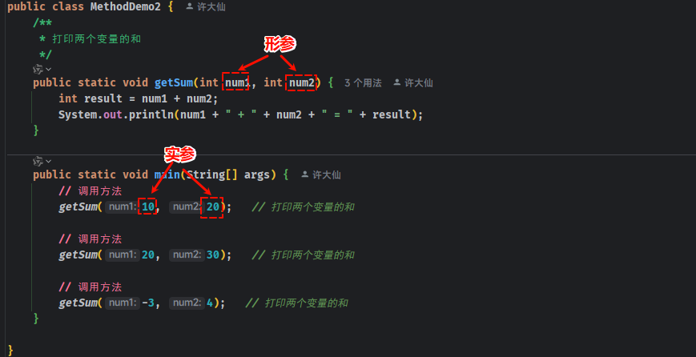

# 第一章：方法的基本概念

## 1.1 为什么需要方法？

* 我们小时候，可能玩过类似`《街霸》`或`《拳皇》`这样的游戏，如下所示：


* 在这些游戏中，假设角色的`出拳`、`出脚`、`跳跃`等动作都需要编写 50 - 80 行的代码。

> [!NOTE]
>
> - ① 或许，你会感觉每种角色`出拳`、`出脚`、`跳跃`等动作是不一样的，其背后的代码逻辑也应该是不一样的。
> - ② 其实，`出拳`、`出脚`、`跳跃`等动作只是 `UI` 方面的效果，这些动作背后对应的代码逻辑都是一样的（无非就是增减血量、增减蓝而已），不同的只是接收的参数！！！

- 如果我们在角色每次`出拳`、`出脚`、`跳跃`的地方都`重复的编写`这 50 - 80 的代码，这样程序就会编写很`臃肿`，`可读性`也非常`差`，如下所示：


- 为了解决代码`重复编写`的问题，我们可以将角色`出拳`、`出脚`、`跳跃`等动作的代码`提取`出来，放到一个 `{}`（代码块） 中，并为这个代码块起个名字。这样就可以在角色进行`出拳`、`出脚`、`跳跃`等动作的地方，通过这个`名字`来调用这个 `{}` 中的代码，如下所示：


> [!IMPORTANT]
>
> - ① 提取出来的代码可以看做是程序中定义的一个`方法`，程序在需要`出拳`、`出脚`、`跳跃`等地方调用该`方法`即可。
> - ② `方法`只有`调用`的时候才会`执行`其内部的逻辑，不调用不执行！！！
> - ③ 将特定功能的代码封装为`方法`的好处： `实现代码重用`，`减少冗余`，`简化代码` 。

## 1.2 什么是方法？

### 1.2.1 方法的概念

* `方法`（method）是程序中最小的执行单元，即：`方法`是一种可以`重复使用`的`代码块`，用于执行特定的任务或操作。

> [!NOTE]
>
> 方法中的代码，要么全部执行，要么全部不执行！！！

* 之前，我们学习的入门程序中就有方法的身影 --- main 方法，如下所示：

```java {3-6}
public class HelloWorld {
    
    public static void main(){ 
        System.out.println("Hello World!!!");
        System.out.println("Hello World!!!");
    }
    
}
```

* 当然，之后我们也会学习`如何自定义方法`以及`如何调用自定义方法`，如下所示：

```java {3-6,8-11,15-16,18-19}
public class Main {
    
    // 自定义方法
    public static void eat(){ 
       System.out.println("吃饭~");
    }
    
    // 自定义方法
    public static void sleep(){
       System.out.println("睡觉~");
    }
    
    public static void main(){ 
        
        // 调用自定义方法
        eat();
        
        // 调用自定义方法
        sleep();
        
        System.out.println("Hello World!!!");
        System.out.println("Hello World!!!");
    }
}
```

### 1.2.2 方法的作用

- ① `封装功能`：将一个完整的功能封装成方法，提高代码的结构化和复用性。
- ② `代码模块化`：将程序按照功能拆分成若干模块单元，有助于降低复杂度。
- ③ `增强可维护性`：如果需要修改某项功能，只需要调整对应的方法代码。
- ④ `隔离细节`：通过方法调用可以隐藏实现细节，只关心输入输出。


# 第二章：方法的基本语法（⭐）

## 2.1 概述

* `方法`分为`方法定义`和`方法调用`。
* 其中， 将一些代码打包在一起的过程就称为`方法定义`。
* 其中，方法定义后并不能直接运行的，需要手动调用才能执行，该过程称为`方法调用`（不调用，不执行）。

## 2.2 最简单的方法定义和调用

### 2.2.1 语法

* 方法定义语法：

```java
public static void 方法名(){
    // 方法体;
}
```

* 方法调用语法：

```java
方法名();
```

> [!CAUTION]
>
> 方法需要先定义再调用，否则程序将会报错！！！


* 示例：

```java
package com.github.study;

public class MethodDemo1 {

    /**
     * 最简单的方法定义
     */
    public static void playGame() {
        System.out.println("① 选择游戏");
        System.out.println("② 安装和启动游戏");
        System.out.println("③ 创建或登录账号");
        System.out.println("④ 了解游戏");
        System.out.println("⑤ 开始游戏");
        System.out.println("⑥ 提升技能和装备（适用于某些游戏）");
        System.out.println("⑦ 社交互动（如果游戏支持）");
        System.out.println("⑧ 保存进度：定期保存游戏进度，避免意外丢失数据");
        System.out.println("⑨ 结束游戏：当完成当前目标或想要休息时，安全退出游戏");
    }

    public static void main(String[] args) {
        // 最简单的方法调用
        playGame();

        System.out.println("------------------------------------");

        // 最简单的方法调用
        playGame();
    }

}
```

### 2.2.2 应用示例

* 需求：要求定义一个方法，在方法内部打印女朋友的所有信息。


* 示例：

```java
package com.github.test;

public class MethodTest1 {
    /**
     * 打印个人信息
     */
    public static void printGFMessage() {
        System.out.println("国籍：非洲");
        System.out.println("姓名：如花");
        System.out.println("年龄：16 岁");
        System.out.println("性别：女");
        System.out.println("身高：1.65 米");
        System.out.println("体重：100 公斤");
    }

    public static void main(String[] args) {
        // 调用方法
        printGFMessage();
    }
}
```

### 2.2.3 应用示例

* 需求：定义一个方法，在方法内部定义两个变量，并打印这两个变量的和。


* 示例：

```java
package com.github.test;

public class MethodTest2 {
    /**
     * 打印两个变量的和
     */
    public static void getSum() {
        int num1 = 10;
        int num2 = 20;
        int result = num1 + num2;
        System.out.println(num1 + " + " + num2 + " = " + result);
    }

    public static void main(String[] args) {
        // 调用方法
        getSum();
    }
}
```

## 2.3 带参数的方法定义和调用

### 2.3.1 语法

* 方法定义语法：

```java
public static void 方法名(数据类型1 参数1,数据类型2 参数2,...){
    // 方法体;
}
```

* 方法调用语法：

```java
方法名(实参1,实参2,...);
```

> [!CAUTION]
>
> * ① 方法需要先定义再调用，否则程序将会报错！！！
> * ② 方法调用的时候，`实参的类型和数量`必须和`方法定义中小括号内的变量的类型和数量`一一对应，否则程序将会报错！！！


* 示例：

```java
package com.github.study;

public class MethodDemo2 {
    /**
     * 打印两个变量的和
     */
    public static void getSum(int num1, int num2) {
        int result = num1 + num2;
        System.out.println(num1 + " + " + num2 + " = " + result);
    }

    public static void main(String[] args) {
        // 调用方法
        getSum(10, 20);

        // 调用方法
        getSum(20, 30);

        // 调用方法
        getSum(-3, 4);
    }

}
```

### 2.3.2 形参和实参

* 形参（形式参数）：是指`方法定义`中的参数。
* 实参（实际参数）：是指`方法调用`中的参数。



### 2.3.3 应用示例

* 需求：定义一个方法，求长方形的周长，将结果在方法中进行打印。


* 示例：

```java
package com.github.test;

public class MethodTest3 {
    /**
     * 求矩形的周长
     *
     * @param length 矩形的长
     * @param wide   矩形的宽
     */
    public static void getPerimeter(double length, double wide) {
        // 周长
        double result = (length + wide) * 2;

        System.out.println("矩形的周长为：" + result);
    }

    public static void main(String[] args) {
        // 调用方法
        getPerimeter(1, 2);
    }
}
```

### 2.3.4 应用示例

* 需求：定义一个方法，求圆的面积，将结果在方法中进行打印。


* 示例：

```java
package com.github.test;

public class MethodTest4 {
    /**
     * 求圆的面积
     *
     * @param r 半径
     */
    public static void getArea(double r) {
        // 周长
        double area = Math.PI * r * r;

        System.out.println("圆的面积是：" + area);
    }

    public static void main(String[] args) {
        // 调用方法
        getArea(2);
    }
}
```

## 2.4 带返回值的方法定义和调用

### 2.4.1 语法

* 方法定义语法：

```java
public static 返回值类型 方法名(数据类型1 参数1,数据类型2 参数2,...){
    // 方法体;
    return 返回值;
}
```

* 方法调用语法：

```java
返回值类型 变量 = 方法名(实参1,实参2,...);
```

> [!CAUTION]
>
> * ① 方法需要先定义再调用，否则程序将会报错！！！
> * ② 方法调用的时候，`实参的类型和数量`必须和`方法定义中小括号内的变量的类型和数量`一一对应，否则程序将会报错！！！


* 示例：

```java
package com.github.study;

public class MethodDemo3 {
    /**
     * 计算两个变量的和
     *
     * @param num1 变量
     * @param num2 变量
     * @return 变量的和
     */
    public static int getSum(int num1, int num2) {
        return num1 + num2;
    }

    public static void main(String[] args) {
        // 调用方法
        int sum = getSum(10, 20);
        System.out.println("sum = " + sum);

        // 调用方法
        sum = getSum(20, 30);
        System.out.println("sum = " + sum);

        // 调用方法
        sum = getSum(-3, 30);
        System.out.println("sum = " + sum);
    }

}
```

### 2.4.2 应用示例

* 需求：定义方法，比较两个长方形的面积。


* 示例：

```java
package com.github.test;

public class MethodTest5 {

    /**
     * 计算矩形的面积
     *
     * @param length 长
     * @param width  宽
     * @return 面积
     */
    public static double getArea(double length, double width) {
        return length * width;
    }

    /**
     * 比较两个矩形的面积
     *
     * @param area1 面积1
     * @param area2 面积2
     * @return true：面积1大，false：面积2大
     */
    public static boolean compareArea(double area1, double area2) {
        return area1 > area2;
    }

    public static void main(String[] args) {

        double area1 = getArea(3, 4);
        double area2 = getArea(5, 6);
        boolean result = compareArea(area1, area2);
        System.out.println(result ? "长方形1的面积大" : "长发形2的面积大");

    }
}
```

## 2.5 方法的注意事项

* ① 方法不调用不执行。

```java
public class Main{
    public static void main(String[] args){
        // 只定义不调用，方法是不会执行的。
    }
    
    public static void play(){
        System.out.println("玩游戏~");
    }
}
```

* ② 方法和方法之间是平级关系，不能互相嵌套定义。

```java
public class Main{
    public static void main(String[] args){
        // 下面的代码是错误的，在 Java 中方法是不能嵌套定义的
        public static void play(){ // [!code error]
            System.out.println("玩游戏~"); // [!code error]
        } // [!code error]
    }
}
```

* ③ 方法的编写顺序和执行顺序是没有关系的。

```java
public class Main{
    public static void main(String[] args){
        play2();
        play1();
    }
    
    public static void play1(){
        System.out.println("玩游戏~");
    }
    public static void play2(){
        System.out.println("玩游戏~");
    }
}
```

* ④ 方法的返回值类型如果是 void ，则表示该方法没有返回值，此时就可以省略 return 语句。如果一定要写 return 语句，return 关键字后面是不能加具体的数据。

```java
public class Main{
    public static void main(String[] args){
        // 只定义不调用，方法是不会执行的。
        play(2);
    }
    
    public static void play(int num){
        if(num == 2){
            return;
        }
        System.out.println("玩游戏~");
    }
}
```

* ⑤ return 语句的后面是不能编写其他的代码的，因为永远执行不到，属于无效的代码。

```java
public class Main{
    public static void main(String[] args){
        // 只定义不调用，方法是不会执行的。
        play(2);
    }
    
    public static void play(int num){
        if(num == 2){
            return;
            // 下面的代码是错误的
            System.out.println("玩游戏~"); // [!code error]
        }
        System.out.println("玩游戏~");
    }
}
```


# 第三章：方法重载（⭐）

## 3.1 概述

* 在同一个类中，定义了多个`同名的方法`，这些同名的方法具有相同的功能。
* 每个方法具有`不同`的`参数类型`或`参数个数`，这些同名的方法，就构成了重载关系。

> [!NOTE]
>
> 方法重载：在同一个类中，方法名相同，参数不同（个数不同、类型不同、顺序不同）的方法，和返回值无关！！！

* 方法重载的好处：使用方法重载，可以为编程带来方便，让方法的调用者，在调用方法的时候，不需要为了相似的功能去查阅文档，查找各种不同的方法名，降低学习成本，提高开发效率，如：`System.out.println()` 方法就是典型的方法重载。

```java
public void print(boolean b){}
```

```java
public void print(char c){}
```

```java
...
```

```java
public void println(Object x){}
```

## 3.2 应用示例

* 需求：要求获取两个数（整数或小数）的和。


* 示例：

```java
package com.github.study;

public class MethodDemo4 {
    /**
     * 计算两个变量的和
     *
     * @param num1 变量
     * @param num2 变量
     * @return 变量的和
     */
    public static int getSum(int num1, int num2) {
        return num1 + num2;
    }

    /**
     * 计算两个变量的和
     *
     * @param num1 变量
     * @param num2 变量
     * @return 变量的和
     */
    public static double getSum(double num1, double num2) {
        return num1 + num2;
    }

    public static void main(String[] args) {
        // 调用方法
        int sum = getSum(10, 20);
        System.out.println("sum = " + sum);

        // 调用方法
        double sum2 = getSum(20.1, 30.2);
        System.out.println("sum2 = " + sum2);
    }

}
```

## 3.3 应用示例

* 需求：使用方法重载的思想，设计比较两个整数是否相同的方法，需要覆盖 byte、short、int 和 long 类型。


* 示例：

```java
package com.github.study;

public class MethodDemo5 {
    public static boolean compare(byte num1, byte num2) {
        return num1 == num2;
    }

    public static boolean compare(short num1, short num2) {
        return num1 == num2;
    }

    public static boolean compare(int num1, int num2) {
        return num1 == num2;
    }

    public static boolean compare(long num1, long num2) {
        return num1 == num2;
    }

    public static void main(String[] args) {
        // 调用方法
        boolean compare = compare(1, 1);
        System.out.println("compare = " + compare);

        // 调用方法
        compare = compare(1L, 1L);
        System.out.println("compare = " + compare);
    }

}
```


# 第四章：综合练习（⭐）

