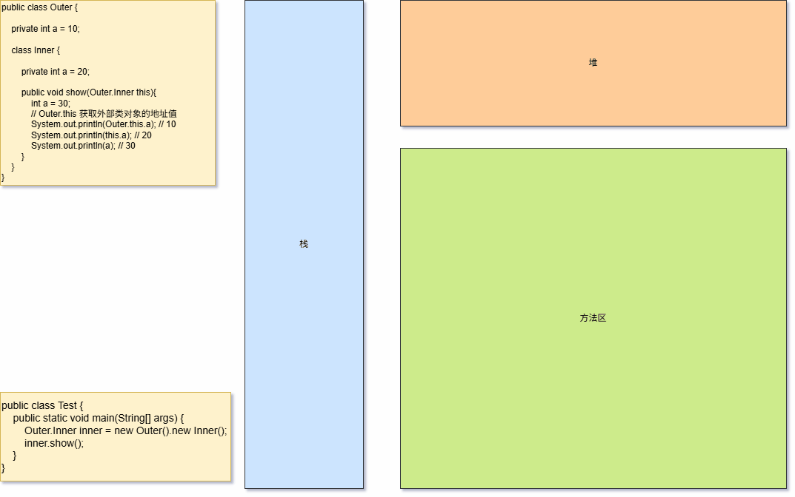
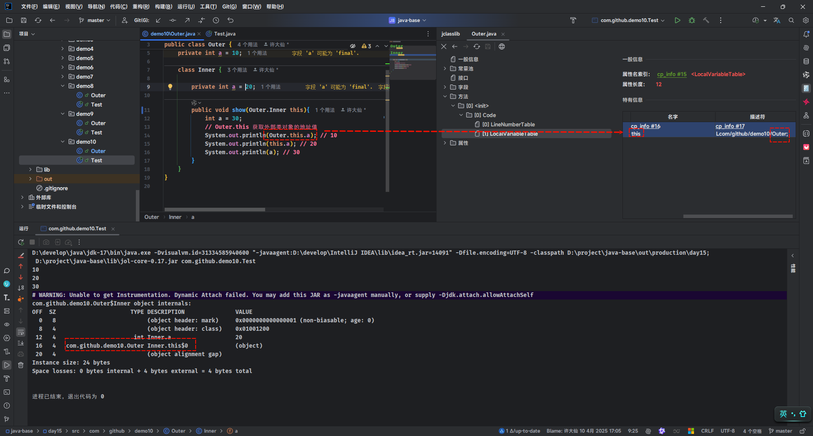
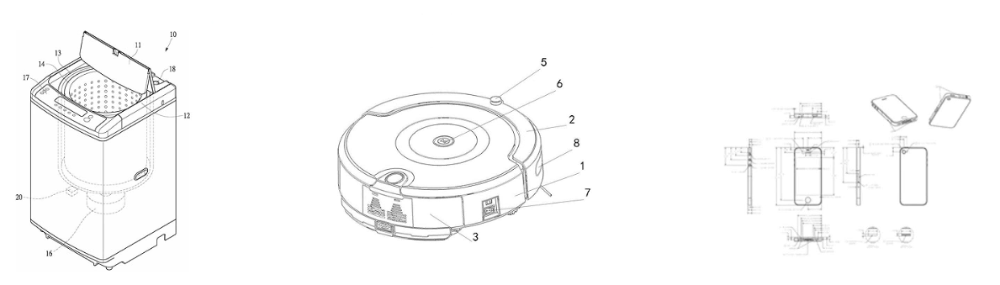
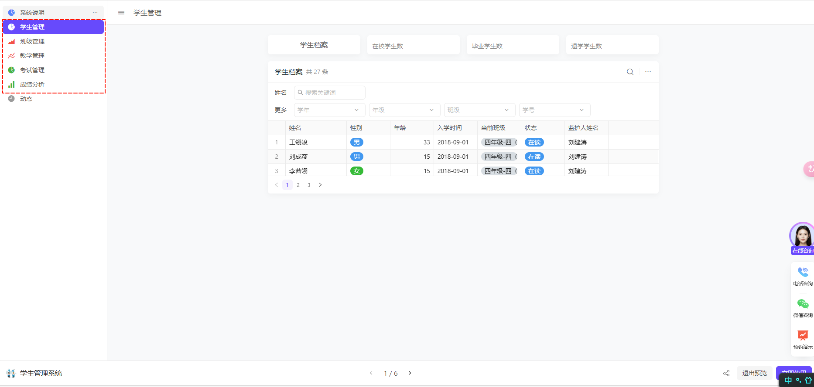
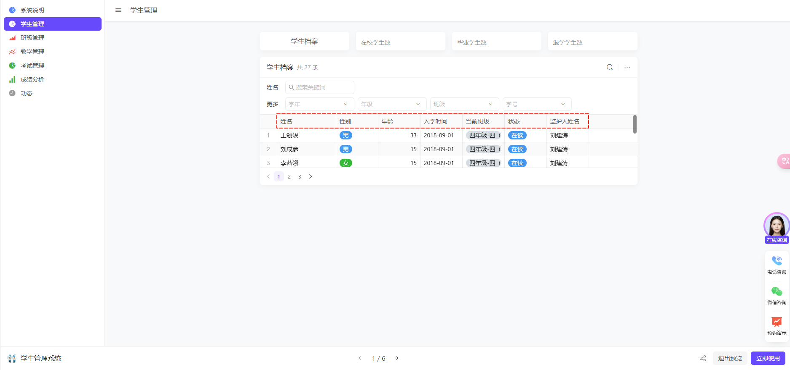
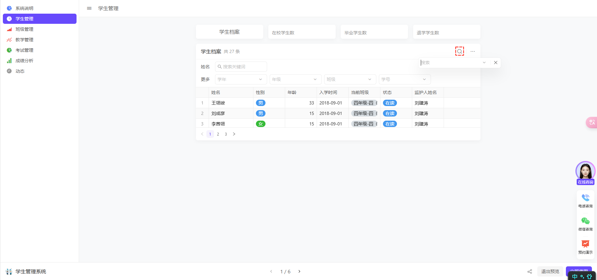
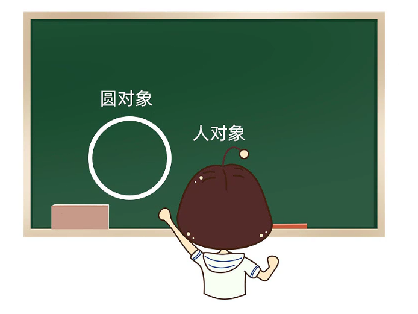
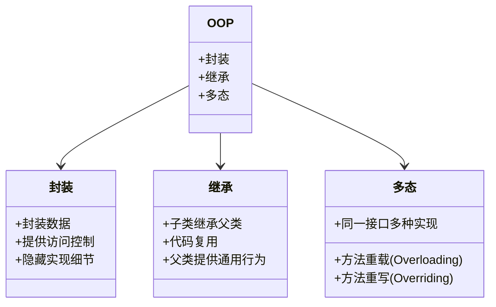

# 第一章：面向对象的概念

## 1.1 概述

* 所谓的`面向对象编程`，难道是这样，如下所示：


* 其实，不然，`面向对象编程`只是一种编程的思想而已，即：指导程序员如何写代码。

> [!NOTE]
>
> 维基百科：
>
> * **面向对象编程**（英语：Object-oriented programming，[缩写](https://zh.wikipedia.org/wiki/缩写)：OOP）是种具有[物件](https://zh.wikipedia.org/wiki/对象_(计算机科学))概念的[程式设计典范](https://zh.wikipedia.org/wiki/编程范型)，同时也是一种程式开发的抽象方针。它可能包含[资料](https://zh.wikipedia.org/wiki/数据)、[特性](https://zh.wikipedia.org/wiki/特性_(计算机科学))、[程式码](https://zh.wikipedia.org/wiki/源代码)与[方法](https://zh.wikipedia.org/wiki/方法_(電腦科學))。对象则指的是[类别](https://zh.wikipedia.org/wiki/类_(计算机科学))（class）的实例。它将[对象](https://zh.wikipedia.org/wiki/物件_(電腦科學))作为[程序](https://zh.wikipedia.org/wiki/计算机程序)的基本单元，将程序和[数据](https://zh.wikipedia.org/wiki/数据)[封装](https://zh.wikipedia.org/wiki/封裝_(物件導向程式設計))其中，以提高软件的重用性、灵活性和扩展性，物件里的程序可以访问及经常修改物件相关连的资料。在物件导向程式编程里，电脑程式会被设计成彼此相关的物件[[1\]](https://zh.wikipedia.org/zh-hans/面向对象程序设计#cite_note-1)[[2\]](https://zh.wikipedia.org/zh-hans/面向对象程序设计#cite_note-2)。
> * **面向对象程序设计**可以看作一种在程序中包含各种独立而又互相调用的对象的思想，这与传统的思想刚好相反：传统的程序设计主张将程序看作一系列[函数](https://zh.wikipedia.org/wiki/函数)的集合，或者直接就是一系列对电脑下达的指令。面向对象程序设计中的每一个对象都应该能够接受数据、处理数据并将数据传达给其它对象，因此它们都可以被看作一个小型的“机器”，即对象。目前已经被证实的是，面向对象程序设计推广了程序的灵活性和可维护性，并且在大型项目设计中广为应用。此外，支持者声称面向对象程序设计要比以往的做法更加便于学习，因为它能够让人们更简单地设计并维护程序，使得程序更加便于分析、设计、理解。反对者在某些领域对此予以否认。

* 官方的定义总是这么抽象以及晦涩难懂，我们可以适当简化一下：
  * `面向对象编程`中的`面向`就是`拿`或`找`。
  * `面向对象编程`中的`对象`就是`能干活的东西`。
  * `面向对象编程`就是`当我们在实际开发中，需要实现某个功能的时候，我们并不是自己从头到尾完整的实现一遍，而是让能干活的东西帮我们完成，即：指挥对象去干活`。

> [!NOTE]
>
> ::: details 点我查看 面向对象在生活中例子
>
> 
>
> :::

* 在之前，我们会在程序中使用`Scanner`对象和`System.out`对象，以便实现`标准输入`和`标准输出`功能，如下所示：

```java
import java.util.*;

public class Main {
    public static void main(String[] args){
        // input 就是对象，通过它我们可以在控制台中输入数据，以便执行之后的逻辑
        Scanner input = new Scanner(System.in);
        
        // System.out 也是对象，通过它我们可以将数据输出到终端中
        System.out.print("请输入您的年龄：")
        
        int age = input.nextInt();
        System.out.println("您的年龄是："+age)
        
        ...
        
        input.close;
    }
}
```

* 在之前，我们会在程序中使用`Random`对象，以便实现`随机数`功能，如下所示：

```java
package com.github;

import java.util.Random;

public class Main {
    public static void main(String[] args) {
        // 通过 Random 对象获取随机数
        Random random = new Random();

        // 获取 [0, 100) 区间内的随机数
        int i = random.nextInt(100);

        System.out.println("i = " + i);
    }
}
```

## 1.2 为什么需要使用面向对象编程？

* 在生活中，随着科技的发展，如果要`洗衣服`，我们都是让`洗衣机`来帮我们`洗衣服`（指挥洗衣机洗衣服）的，如下所示：


* 在生活中，随着科技的发展，如果要`扫地`或`拖地`，我们都是让`扫地机器人`来帮我们`扫地`或`拖地`（指挥扫地机器人扫地）的，如下所示：



* 在生活中，随着科技的发展，如果要购物，我们都是使用`手机`打开`购物 app`来`购物`的（指挥手机打开购物软件进行购物），如下所示：



* ...

> [!NOTE]
>
> 在生活中，如果我们需要做某件事情，我们都是通过某种工具或某个东西来帮助我们完成某件事情。

* 在程序中，也不例外，如果我们要实现某些功能，我们可以指挥一个个的对象，让它们去帮我们实现各个功能，即：面向对象编程。

::: code-group

```java [ScannerTest.java]
import java.util.*;

public class ScannerTest {
    public static void main(String[] args){
        // input 就是对象，通过它我们可以在控制台中输入数据，以便执行之后的逻辑
        Scanner input = new Scanner(System.in);
        
        // System.out 也是对象，通过它我们可以将数据输出到终端中
        System.out.print("请输入您的年龄：")
        
        int age = input.nextInt();
        System.out.println("您的年龄是："+age)
        
        ...
        
        input.close;
    }
}
```

```java [RandomTest.java]
import java.util.Random;

public class RandomTest {
    public static void main(String[] args) {
        // 通过 Random 对象获取随机数
        Random random = new Random();

        // 获取 [0, 100) 区间内的随机数
        int i = random.nextInt(100);

        System.out.println("i = " + i);
    }
}
```

:::

## 1.3 面向对象编程需要学习什么？

* ① 学习获取已有对象并使用。

```java
package com.github;

import java.util.Random;

public class Main {
    public static void main(String[] args) {
        // 通过 Random 对象获取随机数
        Random random = new Random();

        // 获取 [0, 100) 区间内的随机数
        int i = random.nextInt(100);

        System.out.println("i = " + i);
    }
}
```

* ② 学习如何自己设计对象并使用。

```java
package com.github;

public class RandomTest {
    public static void main(String[] args) {
        // 创建对象
        Person p = new Person();
        /*设置属性和调用方法*/
        p.name = "郭德纲";
        p.age = 40;
        p.sayHello();
    }
}

/*定义类*/
class Person {
    String name;
    int age;

    public void sayHello() {
        System.out.println("Hello, I'm " + name + ", " + age + " years old.");
    }
}
```


# 第二章：设计对象并使用（⭐）

## 2.1 类和对象

### 2.1.1 概述

* 对象是一个又一个能帮助我们解决问题的东西，但是这些东西并不是凭空出现的，如下所示：


* 在我们制造对象的时候，需要根据设计图才能制造出来，如下所示：



### 2.1.2 类和对象的概念

* 类（设计图）：是对象共同特征的描述，如：洗衣机图纸、扫地机器人图纸以及手机图纸。
* 对象：是真实存在的具体的东西，如：洗衣机、扫地机器人以及手机。

> [!CAUTION]
>
> * ① 在 Java 中，必须先设计类，才能获取对象！！！
> * ② 在 Java 中，使用 `class` 关键字来定义类，使用 `new 类名();` 来创建对象。


### 2.1.3 类的定义语法

* 语法：

```java
public class 类名 {
    ① 成员变量(代表属性，一般是名词)
    ② 成员方法(代表行为，一般是动词)
    ③ 构造器（后面学习）
    ④ 代码块（后面学习）
    ⑤ 内部类（后面学习）    
}
```

> [!NOTE]
>
> * ① `成员变量`，也称为`属性`，通常是名字，如：手机型号、手机颜色、手机价格等。
> * ② `成员方法`，也称为`行为`，通常是动词，如：打电话、接电话、发送短信、购物等。


* 示例：

```java
/**
 * 创建一个手机类
 */
public class Phone {
    /* 成员变量，即：属性 */

    // 品牌
    String brand;
    // 价格
    double price;

    /* 成员方法，即：行为 */

    /**
     * 打电话
     */
    public void call() {
        System.out.println("打电话");
    }

    /**
     * 玩游戏
     */
    public void play() {
        System.out.println("玩游戏");
    }
}
```

### 2.1.4 对象的定义语法

* 语法：

```java
类名 对象名 = new 类名(); 
```

> [!NOTE]
>
> 每调用一次 new 关键字，就创建一个新的对象！！！


* 示例：

```java
public class PhoneTest {
    public static void main(String[] args) {

        // 创建对象
        Phone p = new Phone();

        // 创建对象
        Phone p2 = new Phone();
        
    }
}
```

### 2.1.5 对象的使用语法

* 访问属性（给属性赋值）：

```java
对象名.成员变量 = xxx; // 给属性赋值
数据类型 变量名 = 对象名.成员变量; // 访问属性
```

* 访问行为：

```java
对象名.方法名();
```


* 示例：

```java
public class PhoneTest {
    public static void main(String[] args) {

        // 创建对象
        Phone p = new Phone();
        // 给对象属性赋值
        p.brand = "苹果";
        p.price = 8888.88;
        // 访问对象属性
        System.out.println(p.brand);
        System.out.println(p.price);
        // 调用对象方法
        p.call();
        p.play();

        System.out.println("--------------------");

        // 创建对象
        Phone p2 = new Phone();
        // 给对象属性赋值
        p2.brand = "华为";
        p2.price = 6666.66;
        // 访问对象属性
        System.out.println(p2.brand);
        System.out.println(p2.price);
        // 调用对象方法
        p2.call();
        p2.play();

    }
}
```

## 2.2 类的注意事项

* ① 用来描述一类事物的类，专业描述是 `JavaBean 类`。

> [!NOTE]
>
> * ① 在 JavaBean 类中，是不写 main 方法的。
> * ② JavaBean 类还有其它特点，后面讲解。
> * ③ JavaBean 在实际开发中非常常见，尤其是在 Web 应用、Spring 框架和数据库交互中被广泛使用。

```java
/**
 * 创建一个手机类
 */
public class Phone {
    /* 成员变量，即：属性 */

    // 品牌
    String brand;
    // 价格
    double price;

    /* 成员方法，即：行为 */

    /**
     * 打电话
     */
    public void call() {
        System.out.println("打电话");
    }

    /**
     * 玩游戏
     */
    public void play() {
        System.out.println("玩游戏");
    }
}
```

* ② 之前，我们编写的含有 main 方法的类，叫做`测试类`。并且，我们可以在测试类中创建 JavaBean 类的对象并进行赋值和调用。

> [!CAUTION]
>
> 在实际开发中，一个项目（单体项目）或模块（微服务项目中的模块），只能有一个含有 main 方法的类，以便 JVM 找到程序的入口。
>
> ::: details 点我查看
>
> ```java
> package com.example.demo;
> 
> import org.springframework.boot.SpringApplication;
> import org.springframework.boot.autoconfigure.SpringBootApplication;
> import org.springframework.web.bind.annotation.GetMapping;
> import org.springframework.web.bind.annotation.RequestParam;
> import org.springframework.web.bind.annotation.RestController;
> 
> @SpringBootApplication
> @RestController  
> public class DemoApplication {
> 
>     public static void main(String[] args) {
>         SpringApplication.run(DemoApplication.class, args);
>     }
> 
>     
>     @GetMapping("/hello")
>     public String sayHello(
>         @RequestParam(value = "name", defaultValue = "World") String name) {
>         return "Hello, " + name + "!";
>     }
> }
> ```
>
> :::

```java
public class PhoneTest {
    public static void main(String[] args) {

        // 创建对象
        Phone p = new Phone();

        // 创建对象
        Phone p2 = new Phone();
        
    }
}
```

* ③ 类名首字母建议大写，见名知意，即：遵循大驼峰命名规范。

```java
public class Phone {}
```

* ④ 一个 Java 文件可以定义多个 class 类，但是有且仅有一个是 public 修饰的，且 public 修饰的类必须和源文件名相同。

> [!TIP]
>
> 在实际开发中，一个 Java 文件中只定义一个 class 类，并且使用 public 修饰。

* ⑤ 类中成员变量的完整定义格式是：`访问修饰符 数据类型 变量名 = 初始化值;`，通常是不需要指定初始化值的，由系统给出默认初始化值。

> [!NOTE]
>
> * ① 访问修饰符，后面讲解。
> * ② 对象成员变量的默认初始化值，如下所示：
>
> | 数据类型 | 默认初始化值 |
> | :------- | :----------- |
> | 整数类型 | 0            |
> | 小数类型 | 0.0          |
> | 布尔类型 | false        |
> | 字符类型 | '\u0000'     |
> | 引用类型 | null         |

## 2.3 应用示例

* 需求：编写女朋友类，创建女朋友类的对象，给女朋友的属性赋值并调用女朋友类中的方法。


* 示例：

::: code-group

```java [GirlFriend.java]
/**
 * 女朋友类
 */
public class GirlFriend {
    // 属性
    String name;
    int age;
    String gender;
    double height;
    double weight;

    public void eat() {
        System.out.println("吃东西");
    }

    public void sleep() {
        System.out.println("睡觉");
    }

    public void play() {
        System.out.println("打游戏");
    }

    public void study() {
        System.out.println("学习");
    }
}
```

```java [GirlFriendTest.java]
/**
 * 测试类
 */
public class GirlFriendTest {
    public static void main(String[] args) {
        GirlFriend gf = new GirlFriend();

        // 给对象属性赋值
        gf.name = "小花";
        gf.age = 18;
        gf.gender = "女";
        gf.height = 1.75;
        gf.weight = 50.0;

        // 访问对象属性
        System.out.println("姓名：" + gf.name);
        System.out.println("年龄：" + gf.age);
        System.out.println("性别：" + gf.gender);
        System.out.println("身高：" + gf.height);
        System.out.println("体重：" + gf.weight);

        System.out.println("-------------------");

        // 调用对象方法
        gf.eat();
        gf.sleep();
        gf.play();
        gf.study();
    }
}
```

:::

## 2.4 实际开发中类的设计

* 在实际开发中，先分析需求中有几类事物，如下所示：



* 根据事物，创建对应的类，如下所示：

::: code-group

```java [Student.java]
/**
 * 学生类
 */
public class Student {
    
}
```

```java [ClassRoom.java]
/**
 * 班级类
 */
public class ClassRoom {
    
}
```

```java [Teach.java]
/**
 * 教学类
 */
public class Teach {
    
}
```

```java [Exam.java ]
/**
 * 考试类
 */
public class Exam {
    
}
```

```java [Grade.java]
/**
 * 成绩类
 */
public class Grade {
    
}
```

:::

* 以学生类为例，通过`名词提炼法`，抽取出`类`的`属性`，如下所示：



* 在对应的类中，编写相应的属性，如下所示：

```java [Student.java]
import java.time.LocalDateTime;
/**
 * 学生类
 */
public class Student {
    // 姓名
    String name;
    // 性别
    char gender;
    // 年龄
    int age;
    // 入学时间
    LocalDateTime enrollmentTime;
    // 当前班级
    String classRoom;
    // 当前状态
    String state;
    // 监护人姓名
    String guardianName;

}
```

* 以学生类为例，通过`动词提炼法`（查看页面中的按钮），抽取出`类`的`方法`，如下所示：



* 在对应的类中，编写相应的方法，如下所示：

```java [Student.java]
import java.time.LocalDateTime;
/**
 * 学生类
 */
public class Student {
    // 姓名
    String name;
    // 性别
    char gender;
    // 年龄
    int age;
    // 入学时间
    LocalDateTime enrollmentTime;
    // 当前班级
    String classRoom;
    // 当前状态
    String state;
    // 监护人姓名
    String guardianName;

    /**
     * 根据姓名查询学生
     *
     * @param name 姓名
     * @return 学生信息
     */
    public Student search(String name) {
        if (this.name.equals(name)) {
            return this;
        } else {
            return null;
        }
    }

}
```


# 第三章：封装

## 3.1 概述

* 假设在一个需求中有多个事物，有的行为我们并不能确定到底归属于那个类，比如：人画圆。



* 我们是将`画圆`这个行为，写到`人`这个类中，还是写到`圆`这个类中？

::: code-group

```java [Person.java]
public class Person {
    
    public void draw(){}
}
```

```java [Circle.java]
public class Circle {
    
    public void draw(){}
}
```

:::

* 此时，就需要使用到我们将要学习的知识 --- 面向对象的三大特征之一（封装）。

## 3.2 概念

* 面向对象的三大特征是：`封装`、继承和多态，如下所示：


```mermaid
classDiagram
    class OOP {
        +封装
        +继承
        +多态
    }

    class 封装 {
        +封装数据
        +提供访问控制
        +隐藏实现细节
    }

    class 继承 {
        +子类继承父类
        +代码复用
        +父类提供通用行为
    }

    class 多态 {
        +方法重载 (Overloading)
        +方法重写 (Overriding)
        +同一接口多种实现
    }

    OOP --> 封装
    OOP --> 继承
    OOP --> 多态

```

* `封装`就是告诉我们，在拿到需求之后，`如何正确的设计对象的属性和方法`。
* 假设现在有一个需求，如下所示：

> [!NOTE]
>
> * 需求：定义一个类用来描述人。
> * 其中，人的属性有姓名、年龄。
> * 其中，人的行为有吃饭、睡觉。

* 上面的需求非常简单，无非就是要求我们，定义一个 Person 类，并在类中编写属性和行为。

```java [Person.java]
public class Person{
    String name;
    int age;
    
    public void eat() {
        System.out.println("吃东西");
    }

    public void sleep() {
        System.out.println("睡觉");
    }
}
```

* 在实际开发中，往往需求不会这么简单，如：人画圆。

> [!NOTE]
>
> 需求：人画圆，需要针对这个需求进行面向对象设计。

* 由于上述的需求，涉及到两个事物，所以我们理所当然地应该定义两个类，如下所示：

::: code-group

```java [Person.java]
public class Person {
    
}
```

```java [Circle.java]
public class Circle {
    
}
```

:::

* 由于画圆是属于行为，我们就需要定义一个方法来表示画圆这个行为，如下所示：

```java
public void draw(){
    System.out.println("画圆");
}
```

* 很多人可能这么认为，既然是人画圆，当然就应该写在人这个类中了，如下所示：

```java [Person.java]
public class Person {
    public void draw(){ // [!code error]
    	System.out.println("画圆"); // [!code error]
	} // [!code error]
}
```

* 其实，不然，画圆这个行为就应该写到圆这个类中，如下所示：

```java [Circle.java]
public class Circle {
    public void draw(){ // [!code highlight]
    	System.out.println("画圆"); // [!code highlight]
	} // [!code highlight]
}
```

> [!IMPORTANT]
>
> 封装中的一个原则：对象代表什么，就应该封装对应的数据，并提供数据对应的行为。

* 既然，我们使用一个类来代表一个圆，那么就会设计一些属性来封装圆的一些信息，如：半径。此时，画圆这个行为就需要根据半径来画，如下所示：

```java [Circle.java]
public class Circle {
    
    // 半径
    double radius;
    
    public void draw(){ // [!code highlight]
    	System.out.println("根据半径"+radius+"画一个圆"); // [!code highlight]
	} // [!code highlight]
}
```


# 第四章：对象的内存分析


# 第五章：成员变量和局部变量


# 第六章：构造方法
