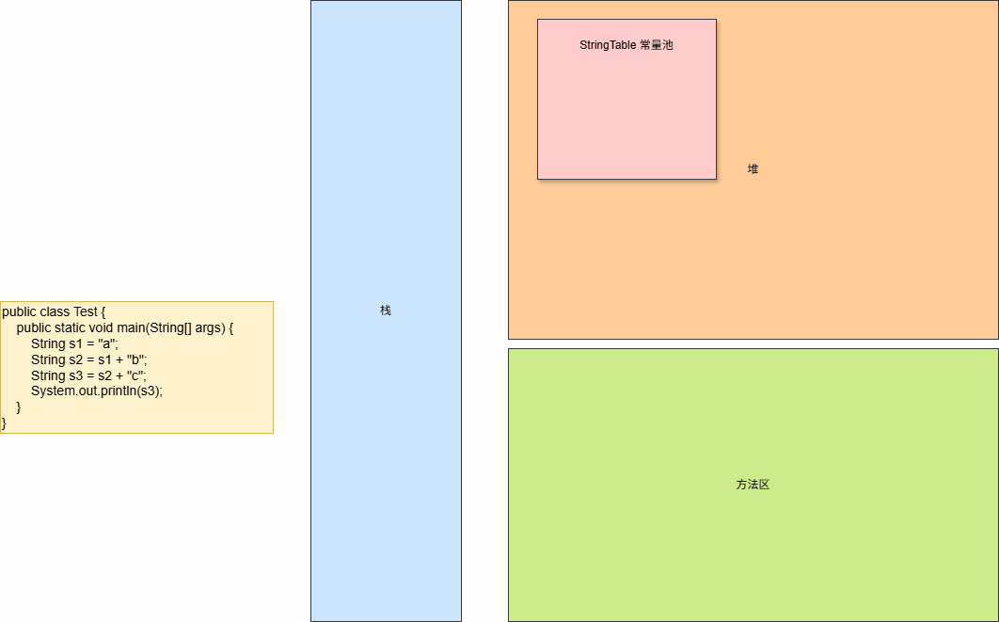
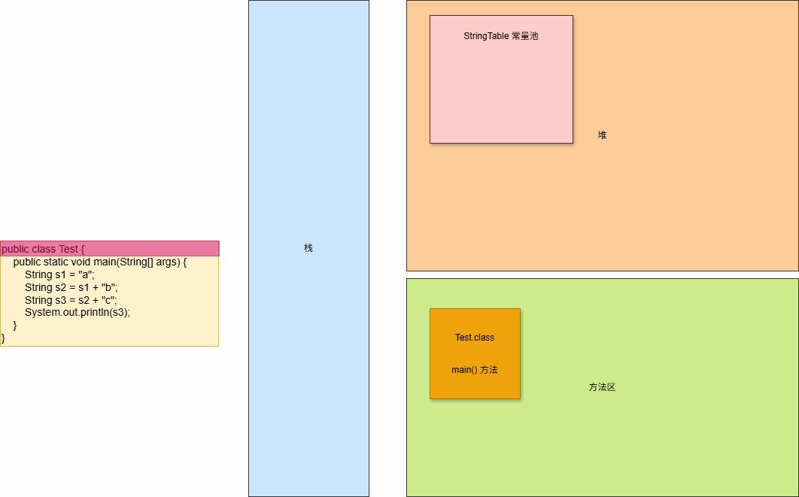

# 第一章：StringBuilder（⭐）

## 1.1 概述

* 因为 String 对象是不可变的对象，虽然可以共享常量对象，但是对于频繁字符串的修改和拼接操作，效率极低。
* 因此，Java 在 java.lang 包中提供了可变字符序列 StringBuilder 和 StringBuffer ，其目的就是为了提高字符串的操作效率。

> [!NOTE]
>
> * ① StringBuilder 是线程不安全的。
> * ② StringBuffer 是线程安全的。


## 1.2 StringBuilder 的构造方法

* StringBuilder 提供了 3 个常用的构造方法来创建 StringBuilder 对象，如下所示：

| 构造方法                                 | 描述                                         |
| ---------------------------------------- | -------------------------------------------- |
| public StringBuilder(){}                 | 创建一个空白的可变字符串对象，不包含任何内容 |
| public StringBuilder(String str){}       | 根据字符串的内容，创建可变字符串对象         |
| public StringBuilder(CharSequence seq){} | 根据字符序列对象，创建可变字符串对象         |

> [!NOTE]
>
> * ① StrringBuilder 和 StringBuffer 是 CharSequence  的子类。
> * ② 可以通过 `public StringBuilder(CharSequence seq){}`实现将 StringBuffer  转换为 StrringBuilder 。


* 示例：

```java
package com.github.demo2;

public class StringBuilderDemo1 {
    public static void main(String[] args) {
        // 创建一个空白的可变字符串对象
        StringBuilder str = new StringBuilder();

        // 根据字符数组创建一个可变字符串对象
        StringBuilder str2 = new StringBuilder("abc");
        
        // 根据字符序列创建一个可变字符串对象
        StringBuilder str3 = new StringBuilder(new StringBuffer("abc"));
    }
}
```

## 1.3 StringBuilder 的常用方法

### 1.3.1 字符串

* `StringBuilder`支持将内部维护的数据以`字符串`的形式返回：

```java
public String toString(){}
```


* 示例：

```java
package com.github.demo2;

public class StringBuilderDemo1 {
    public static void main(String[] args) {
        // 创建一个空白的可变字符串对象
        StringBuilder sb1 = new StringBuilder();
        String str = sb1.toString();
        System.out.println("str = " + str);

        // 根据字符数组创建一个可变字符串对象
        StringBuilder sb2 = new StringBuilder("abc");
        str = sb2.toString();
        System.out.println("str = " + str);

        // 根据字符序列创建一个可变字符串对象
        StringBuilder sb3 = new StringBuilder(new StringBuffer("abc"));
        str = sb3.toString();
        System.out.println("str = " + str);
    }
}
```

### 1.3.2 拼接

* StringBuilder 支持拼接各种数据类型的数据，并且支持链接调用。

```java
public StringBuilder append(Object obj) {}
```

```java
public StringBuilder append(String str) {}
```

```java
public StringBuilder append(StringBuffer sb) {}
```

```java
public StringBuilder append(CharSequence s) {}
```

```java
public StringBuilder append(CharSequence s, int start, int end) {}
```

```java
public StringBuilder append(char[] str) {}
```

```java
public StringBuilder append(char[] str, int offset, int len) {}
```

```java
public StringBuilder append(boolean b) {}
```

```java
public StringBuilder append(char c) {}
```

```java
public StringBuilder append(int i) {}
```

```java
public StringBuilder append(long lng) {}
```

```java 
public StringBuilder append(float f) {}
```

```java 
public StringBuilder append(double d) {}
```


* 示例：

```java
package com.github.demo2;

import java.util.HashMap;

public class StringBuilderDemo2 {
    public static void main(String[] args) {
        StringBuilder sb = new StringBuilder();
        sb.append(1);
        sb.append('a');
        sb.append(1.1f);
        sb.append(3.14);
        sb.append(new HashMap<>());
        String str = sb.toString();
        System.out.println(str);
    }
}
```

### 1.3.3 插入（了解）

* StringBuilder 支持在 index 位置插入数据。

```java
public StringBuilder insert(int index, char[] str, int offset,int len) {}
```

```java
public StringBuilder insert(int offset, Object obj) {}
```

```java
public StringBuilder insert(int offset, String str) {}
```

```java
public StringBuilder insert(int offset, char[] str) {}
```

```java
public StringBuilder insert(int dstOffset, CharSequence s) {}
```

```java
public StringBuilder insert(int dstOffset, CharSequence s,
                            int start, int end) {}
```

```java
public StringBuilder insert(int offset, boolean b) {}
```

```java
public StringBuilder insert(int offset, char c) {}
```

```java
public StringBuilder insert(int offset, int i) {}
```

```java
public StringBuilder insert(int offset, long l) {}
```

```java
public StringBuilder insert(int offset, float f) {}
```

```java
public StringBuilder insert(int offset, double d) {{}
```


* 示例：

```java
package com.github.demo2;

import java.util.HashMap;

public class StringBuilderDemo2 {
    public static void main(String[] args) {
        StringBuilder sb = new StringBuilder();
        sb.append(1);
        sb.append('a');
        sb.append(1.1f);
        sb.append(3.14);
        sb.append(new HashMap<>());
        // 在 index 位置插入数据
        sb.insert(2, "呵呵哒");
        String str = sb.toString();
        System.out.println(str);
    }
}
```

### 1.3.4 删除（了解）

* StringBuilder 支持删除`指定范围`以及`指定索引位置上`的数据。

```java
public StringBuilder delete(int start, int end) {}
```

```java
public StringBuilder deleteCharAt(int index) { }
```


* 示例：

```java
package com.github.demo2;

public class StringBuilderDemo2 {
    public static void main(String[] args) {
        StringBuilder sb = new StringBuilder("Hello World");
        // 删除指定范围的数据
        sb.delete(1, 3);
        String str = sb.toString(); // Hlo World
        System.out.println(str);
    }
}
```


* 示例：

```java
package com.github.demo2;

public class StringBuilderDemo3 {
    public static void main(String[] args) {
        StringBuilder sb = new StringBuilder("Hello World");
        // 删除指定索引位置上的数据
        sb.deleteCharAt(1);
        String str = sb.toString(); // Hllo World
        System.out.println(str);
    }
}
```

### 1.3.5 反转

* StringBuilder 支持反转内部维护的数据。

```java
public StringBuilder reverse() {}
```


* 示例：

```java
package com.github.demo2;

public class StringBuilderDemo4 {
    public static void main(String[] args) {
        StringBuilder sb = new StringBuilder("Hello World");
        sb.reverse();
        String str = sb.toString(); // dlroW olleH
        System.out.println(str);
    }
}
```

### 1.3.6 替换（了解）

* StringBuilder 支持替换指定范围内的字符序列。

```java
public StringBuilder replace(int start, int end, String str) {}
```


* 示例：

```java
package com.github.demo2;

public class StringBuilderDemo6 {
    public static void main(String[] args) {
        StringBuilder sb = new StringBuilder("Hello World");
        String str = "123";
        sb.replace(1, 1 + str.length(), str);
        System.out.println(sb); // H123o World
    }
}
```

### 1.3.7 查找（了解）

* StringBuilder 支持查找`指定字符串`在`字符序列`中的位置。

```java
public int indexOf(String str) {}
```

```java
public int indexOf(String str, int fromIndex) {}
```

```java
public int lastIndexOf(String str) {}
```

```java
public int lastIndexOf(String str, int fromIndex) {}
```


* 示例：

```java
package com.github.demo2;

public class StringBuilderDemo7 {
    public static void main(String[] args) {
        StringBuilder sb = new StringBuilder("Hello World");
        String str = "o";
        int index = sb.indexOf(str);
        System.out.println(index); // 4
    }
}
```

### 1.3.8 截取子串（了解）

* StringBuilder 支持截取指定范围内的字符串。

```java
public String substring(int start) {}
```

```java
public String substring(int start, int end) {}
```


* 示例：

```java
package com.github.demo2;

public class StringBuilderDemo8 {
    public static void main(String[] args) {
        StringBuilder sb = new StringBuilder("Hello World");
        String str = sb.substring(1, 5); // ello
        System.out.println(str); 
    }
}
```

## 1.4 应用示例

### 1.4.1 对称字符串

* 需求：键盘接受一个字符串，程序判断出该字符串是否是对称字符串。


* 示例：

```java
package com.github.demo2;

import java.util.Scanner;

/**
 * 判断一个数是否是对称字符串，即：121 = 121
 */
public class StringBuilderDemo5 {
    public static void main(String[] args) {
        Scanner input = new Scanner(System.in);
        System.out.print("请输入数字：");
        String str = input.next();
        String reverse = new StringBuilder(str).reverse().toString();
        if (str.equals(reverse)) {
            System.out.println(str + "是对称字符串");
        } else {
            System.out.println(str + "不是对称字符串");
        }
    }
}
```

### 1.4.2 拼接字符串

* 需求：定义一个方法，把 int 数组中的数据按照指定的格式拼接成一个字符串返回。

> [!NOTE]
>
> 假设数组是 `int[] arr = {1,2,3};`，方法执行后的输出结果是 `[1, 2, 3]`。


* 示例：

```java
package com.github.demo2;

public class StringBuilderDemo7 {
    public static void main(String[] args) {
        //1.定义数组
        int[] arr = {1,2,3};

        //2.调用方法把数组变成字符串
        String str = arrToString(arr);

        System.out.println(str);

    }

    public static String arrToString(int[] arr){
        StringBuilder sb = new StringBuilder();
        sb.append("[");

        for (int i = 0; i < arr.length; i++) {
            if(i == arr.length - 1){
                sb.append(arr[i]);
            }else{
                sb.append(arr[i]).append(", ");
            }
        }
        sb.append("]");

        return sb.toString();
    }
}
```


# 第二章：StringJoiner（⭐）

## 2.1 概述

* `StringJoiner` 是 Java 8 引入的一个类，用于简化字符串的连接操作。
* 它特别适合在需要将多个字符串合并成一个字符串的场景中，尤其是当字符串之间需要有特定的分隔符时。
* 它提供了更灵活的方式来拼接字符串，并且可以自动处理分隔符的添加。

## 2.2 构造方法

* StringJoiner 提供了 2 个常用的构造方法来创建 StringJoiner 对象，如下所示：

| 构造方法                                                     | 描述                   |
| ------------------------------------------------------------ | ---------------------- |
| public StringJoiner(CharSequence delimiter) {}               | 指定分隔符             |
| public StringJoiner(CharSequence delimiter,  CharSequence prefix, CharSequence suffix)  {} | 指定分隔符、前缀和后缀 |


* 示例：

```java
package com.github.demo3;

import java.util.StringJoiner;

public class StringJoinerDemo1 {
    public static void main(String[] args) {
        StringJoiner sf = new StringJoiner("");
        
        StringJoiner sf2 = new StringJoiner(",", "[", "]");
    }
}
```

## 2.3 StringJoiner 常用方法

### 2.3.1 字符串

* `StringJoiner`支持将内部维护的数据以`字符串`的形式返回：

```java
public String toString() {}
```


* 示例：

```java
package com.github.demo3;

import java.util.StringJoiner;

public class StringJoinerDemo1 {
    public static void main(String[] args) {
        StringJoiner sf = new StringJoiner(",", "[", "]");
        String str = sf.toString();
        System.out.println("str = " + str); // str = []
    }
}
```

### 2.3.2 添加元素

* `StringJoiner` 支持添加元素，并支持链式调用：

```java
public StringJoiner add(CharSequence newElement) {}
```


* 示例：

```java
package com.github.demo3;

import java.util.StringJoiner;

public class StringJoinerDemo1 {
    public static void main(String[] args) {
        StringJoiner sf = new StringJoiner(",", "[", "]");
        // 添加元素
        sf.add("a");
        sf.add("b");
        sf.add("c").add("hello world");
        String str = sf.toString();
        System.out.println("str = " + str); // str = [a,b,c,hello world]
    }
}
```

### 2.3.3 合并

* StringJoiner 支持合并 StringJoiner 对象：

```java
public StringJoiner merge(StringJoiner other) {}
```


* 示例：

```java
package com.github.demo3;

import java.util.StringJoiner;

public class StringJoinerDemo1 {
    public static void main(String[] args) {
        StringJoiner sf = new StringJoiner(",", "[", "]");
        sf.add("1").add("2").add("3");
        StringJoiner sf2 = new StringJoiner(",", "[", "]");
        sf2.add("a").add("b").add("c");

        // 合并
        sf.merge(sf2);

        String str = sf.toString();
        System.out.println("str = " + str); // str = [1,2,3,a,b,c]
    }
}

```

## 2.4 应用示例

* 需求：定义一个方法，把 int 数组中的数据按照指定的格式拼接成一个字符串返回。

> [!NOTE]
>
> 假设数组是 `int[] arr = {1,2,3};`， 方法执行后的输出结果是 `[1, 2, 3]`。


* 示例：

```java
package com.github.demo3;

import java.util.StringJoiner;

public class StringJoinerDemo1 {
    public static void main(String[] args) {
        int [] arr = {1, 2, 3};
        String str = arrToString(arr);
        System.out.println("str = " + str);
    }


    public static String arrToString(int[] arr){
        StringJoiner joiner = new StringJoiner(",", "[", "]");
        for (int i = 0; i < arr.length; i++) {
            joiner.add(String.valueOf(arr[i]));
        }
        return joiner.toString();
    }
}
```


# 第三章：String 底层原理

## 3.1 字符串存储的内存原理

* `直接赋值`会复用字符串常量池中的字符串。

```java
package com.github.demo5;

public class StringDemo {
    public static void main(String[] args) {
        String s1 = "Hello";
        String s2 = "Hello";
        System.out.println(s1 == s2); // true
    }
}
```


* `new 构造方法`不会复用字符串常量池中的字符串，而是在堆中开辟一个新的对象。

```java
package com.github.demo5;

public class StringDemo {
    public static void main(String[] args) {
        String s1 = "Hello";
        String s2 = new String("Hello");
        System.out.println(s1 == s2); // false
    }
}
```


## 3.2 == 的含义

* 对于基本数据类型的变量，`==` 比较的是`真实值`。

```java
package com.github.demo5;

public class StringDemo {
    public static void main(String[] args) {
        int num1 = 10;
        int num2 = 10;
        System.out.println(num1 == num2);
    }
}
```


* 对于引用数据类型的变量，`==` 比较的是`引用（堆中对象的地址值）`。

```java
package com.github.demo5;

public class StringDemo {
    public static void main(String[] args) {
        String s1 = "Hello";
        String s2 = new String("Hello");
        System.out.println(s1 == s2); // false
    }
}
```


## 3.3 字符串拼接的底层原理

### 3.3.1 等号的右边没有变量

* 如果字符串拼接的代码（等号右边没有变量），如下所示：

```java
public class Test {
    public static void main(String[] args) {
    	String str = "a" + "b" + "c";
        System.out.println(str);
    }
}
```

* `如果字符串拼接的时候没有变量，即：都是字符串，就会触发字符串的优化机制，在编译的时候就已经是最终的结果`。


* 其实，我们可以通过 IDEA 自带的反编译功能，来查看字符串的优化机制，如下所示：


### 3.3.2 等号的右边有变量

* 如果字符串拼接的代码（等号右边有变量），如下所示：

```java
public class Test {
    public static void main(String[] args) {
        String s1 = "a";
        String s2 = s1 + "b";
        String s3 = s2 + "c";
        System.out.println(s3);
    }
}
```

* 在 JDK8 之前，底层是通过 `StringBuilder` 来提高效率的，如下所示：


* 其内存动态图，如下所示：

> [!NOTE]
>
> * ① 在 JDK8 之前，系统会在底层自动创建一个 StringBuilder 对象，然后再调用其 append() 方法完成拼接。拼接完毕之后，再调用 toString() 方法将其转换为 String 类型，而 toString() 方法底层是直接 new String()  ，产生了一个新的字符串对象。
>
> * ② 在 JDK8 之前，字符串变量和字符串常量进行拼接，一个 `+` 会在堆内存中产生两个对象。



* 在 JDK8 之后，系统会预估`字符串拼接`之后的总大小，将要拼接的内容放到数组中，此时也是产生了一个新的字符串。


* 其内存动态图，如下所示：

> [!NOTE]
>
> 在 JDK8 之后，系统会会预估`字符串拼接`之后的总大小，将要拼接的内容放到数组中，也是产生了一个新的字符串。




# 第四章：作业

## 4.1 罗马数字

* 需求：键盘录入一个字符串（长度小于等于 9，只能是数字），并将内容变为罗马数字。

> [!NOTE]
>
> * ① 阿拉伯数字和罗马数字的对比关系，如下所示：
>
> | 阿拉伯数字 | 罗马数字 |
> | ---------- | -------- |
> | 1          | I        |
> | 2          | II       |
> | 3          | III      |
> | 4          | IV       |
> | 5          | V        |
> | 6          | VI       |
> | 7          | VII      |
> | 8          | VIII     |
> | 9          | IX       |
>
> * ② 罗马数字中没有`0`，如果键盘录入的数字包含`0`，可以变为`"0"`。 


* 示例：

```java
package com.github.test2;

import java.util.Scanner;

public class RomanNumeralTest {
    public static final String[] ROMAN_NUMERAL_ARRAY = 
                 {"0", "I", "II", "III", "IV", "V", "VI", "VII", "VIII", "IX"};

    public static void main(String[] args) {
        Scanner input = new Scanner(System.in);
        String str;
        do {
            System.out.print("请输入字符串（长度小于等于 9 ，并且只能是数字）：");
            str = input.next();
        } while (str.length() > 9 || !str.matches("[0-9]+"));

        String roman = toRoman(str);
        System.out.println("roman = " + roman);

        input.close();
    }

    /**
     * 将包含 0-9 的字符串转换为罗马数字
     * @param str 包含 0-9 的字符串
     * @return 罗马数字字符串
     */
    public static String toRoman(String str) {
        StringJoiner sj = new StringJoiner(" ");
        for (int i = 0; i < str.length(); i++) {
            char ch = str.charAt(i);
            int index = Integer.parseInt(String.valueOf(ch));
            String roman = ROMAN_NUMERAL_ARRAY[index];
            sj.add(roman);
        }
        return sj.toString();
    }
}
```

## 4.2 调整字符串

* 需求：给定两个字符串 A 和 B ，A 的旋转操作就是将 A 最左边的字符移动到最右边，如：A = "abcde"，移动一次之后的结果就是 "bcdea"，如果在若干次调整操作之后，A 能变为 B ，那么就返回 true；否则，返回 false。


* 示例：

```java
package com.github.test2;

public class StringDemoTest {
    public static void main(String[] args) {
        String strA = "abcde";
        String strB = "cdeab";

        boolean rotate = isRotateEquals(strA, strB);
        System.out.println("rotate = " + rotate);
    }

    /**
     * 每调用一次，就将最左侧的字符移动到字符串的最后面
     * @param str 循转前的字符串
     * @return 旋转后的字符串
     */
    public static String rotate(String str) {
        return str.substring(1) + str.charAt(0);
    }

    /**
     * 判断旋转之后是否相等
     * @param strA 字符串 A
     * @param strB 字符串 B
     * @return true/false
     */
    public static boolean isRotateEquals(String strA, String strB) {
        for (int i = 0; i < strA.length(); i++) {
            strA = rotate(strA);
            if (strA.equals(strB)) {
                return true;
            }
        }
        return false;
    }
}
```

## 4.3 打乱字符串

* 需求：键盘输入任意字符串，打乱里面的内容。


* 示例：

```java
package com.github.test2;

import java.security.SecureRandom;
import java.util.Random;
import java.util.Scanner;

public class StringDemoTest2 {
    public static final Random RANDOM = new SecureRandom();

    public static void main(String[] args) {
        Scanner input = new Scanner(System.in);
        System.out.print("请输入字符串：");
        String str = input.next();
        System.out.println("之前字符串 = " + str);
        str = randomString(str);
        System.out.println("随机字符串 = " + str);
        input.close();
    }

    /**
     * 随机字符串
     * @param str 字符串
     * @return 随机字符串
     */
    public static String randomString(String str) {
        char[] chs = str.toCharArray();
        for (int i = 0; i < chs.length; i++) {
            // 获取随机索引
            int index = RANDOM.nextInt(chs.length);
            // 将 chs[i] 和 chs[index] 交换
            char temp = chs[i];
            chs[i] = chs[index];
            chs[index] = temp;
        }
        return String.valueOf(chs);
    }
}
```

## 4.4 验证码

* 需求：定义一个方法实现随机产生一个 5 位的验证码。

> [!NOTE]
>
> 验证码格式：
>
> - ① 长度为 5。
> - ② 四位字母和一位数字，数字可以在任意位置。


* 示例：

```java
package com.github.test2;

import java.security.SecureRandom;
import java.util.Random;

public class RandomCodeTest {
    private static final Random RANDOM = new SecureRandom();
    private static final String LETTERS = "abcdefghijklmnopqrstuvwxyz" 
        + "ABCDEFGHIJKLMNOPQRSTUVWXYZ";

    public static void main(String[] args) {
        String code = generate5Code();
        System.out.println("code = " + code);
    }

    /**
     * 生成验证码
     * @param length 长度，不能超过 53
     * @return 验证码
     */
    public static String generateCode(int length) {
        if (length < 5 || length > 52) {
            throw new RuntimeException("验证码长度错误，范围是 [5,52] ");
        }
        StringBuilder sb = new StringBuilder();
        for (int i = 0; i < length - 1; i++) {
            // 获取随机索引
            int index = RANDOM.nextInt(LETTERS.length());
            // 存放到字符数组中
            sb.append(LETTERS.charAt(index));
        }
        sb.append(RANDOM.nextInt(10));
        return randomString(sb.toString());
    }

    /**
     * 生成验证码
     * @return 5 位验证码
     */
    public static String generate5Code() {
        return generateCode(5);
    }

    /**
     * 随机字符串
     * @param str 字符串
     * @return 随机字符串
     */
    public static String randomString(String str) {
        char[] chs = str.toCharArray();
        for (int i = 0; i < chs.length; i++) {
            // 获取随机索引
            int index = RANDOM.nextInt(chs.length);
            // 将 chs[i] 和 chs[index] 交换
            char temp = chs[i];
            chs[i] = chs[index];
            chs[index] = temp;
        }
        return String.valueOf(chs);
    }
}
```

