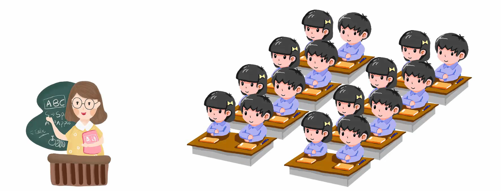
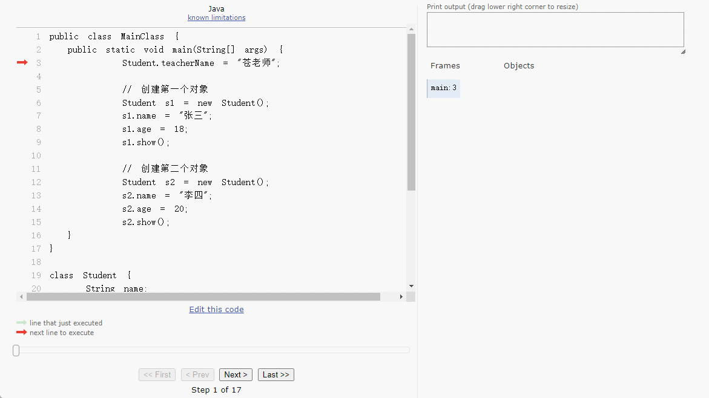
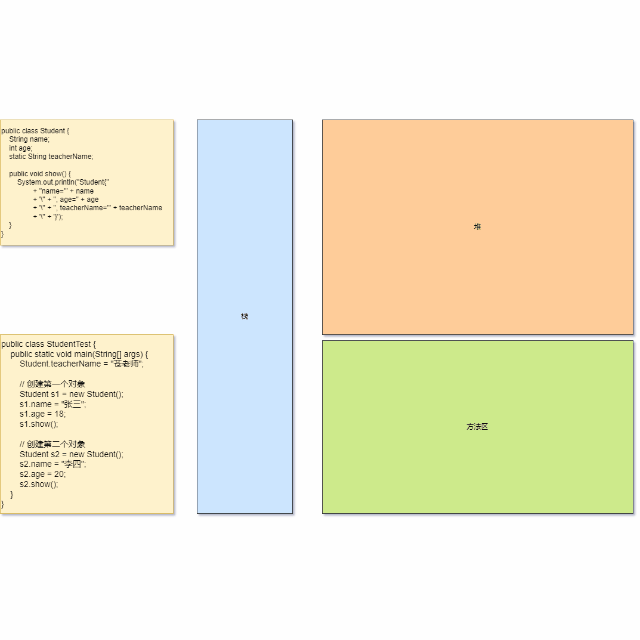
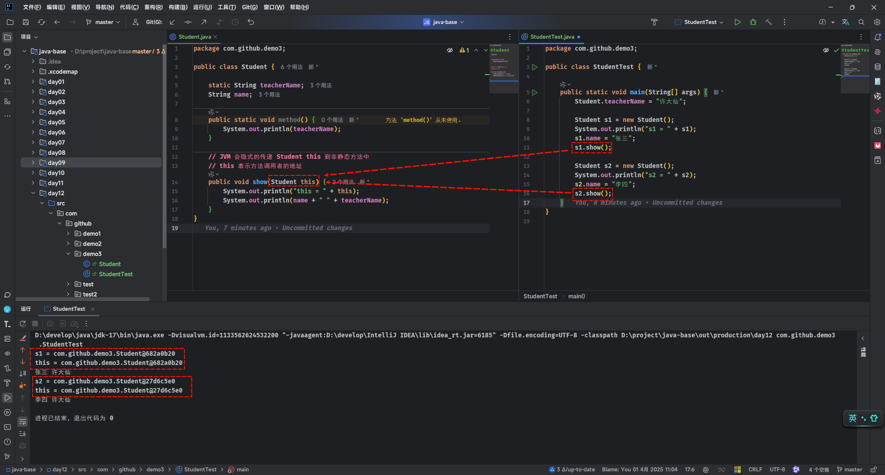
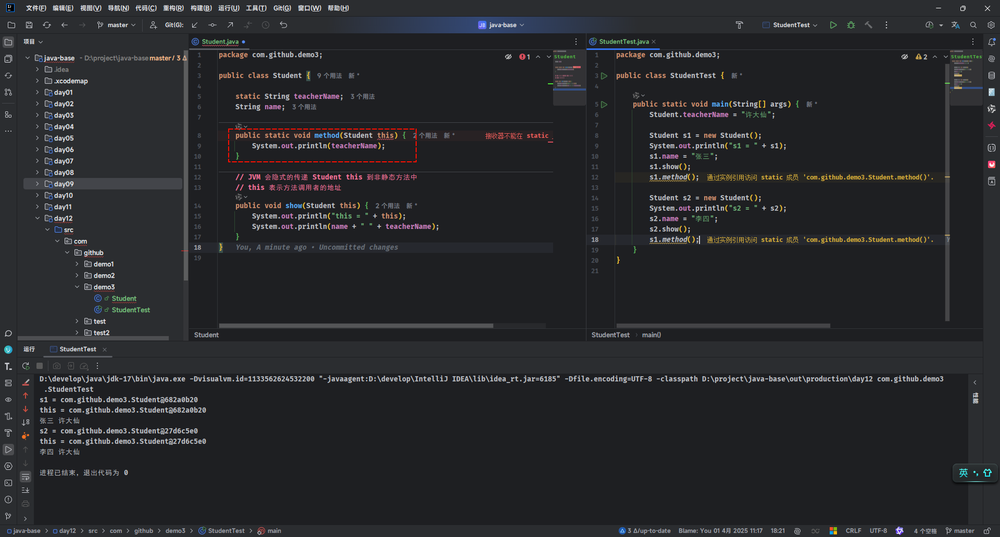
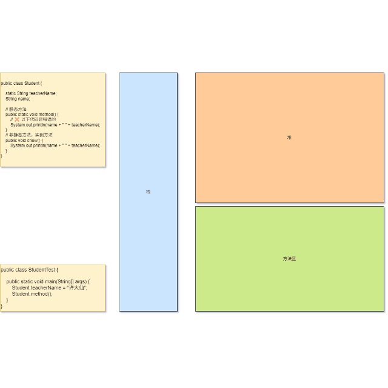
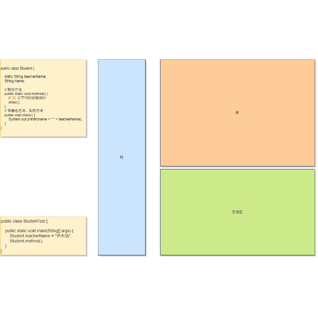
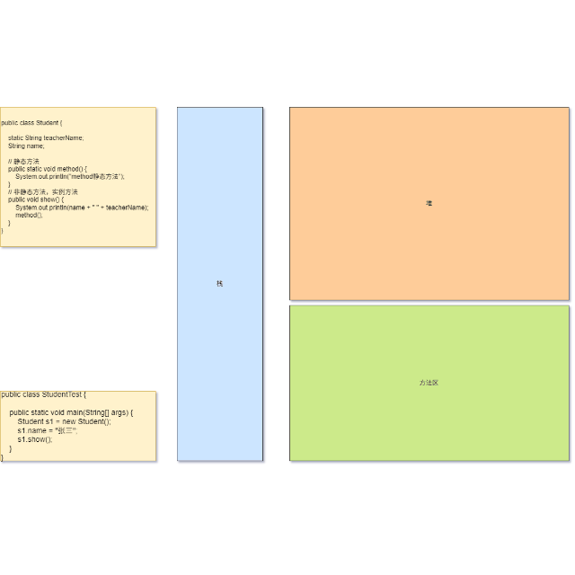
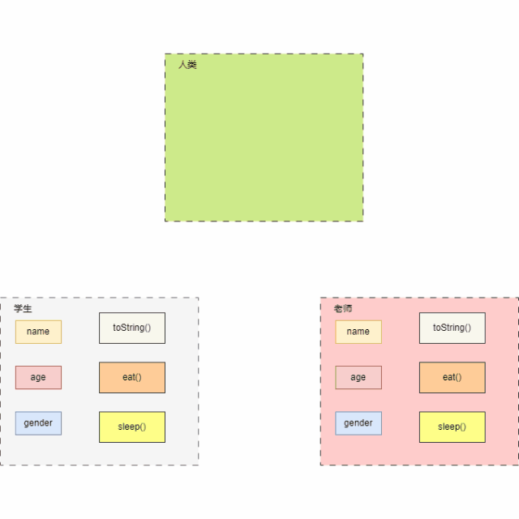

# 第一章：static（⭐）

## 1.1 概述

* 假设一个班的学生正在上课，如下所示：




* 针对上述的场景，现在需要实现这样的需求：`要求写一个 JavaBean 类去描述这个班级的学生`。

> [!NOTE]
>
> * ① 学生的属性：姓名、年龄和性别。
> * ② 学生的行为：学习。


* 示例：

::: code-group

```java [Student.java]
package com.github.demo1;

public class Student {
    /**
     * 姓名
     */
    private String name;
    /**
     * 年龄
     */
    private int age;
    /**
     * 性别
     */
    private String gender;

    public Student() {}

    public Student(String name, int age, String gender) {
        this.name = name;
        this.age = age;
        this.gender = gender;
    }

    public String getName() {
        return name;
    }

    public void setName(String name) {
        this.name = name;
    }

    public int getAge() {
        return age;
    }

    public void setAge(int age) {
        this.age = age;
    }

    public String getGender() {
        return gender;
    }

    public void setGender(String gender) {
        this.gender = gender;
    }

    /**
     * 学习
     */
    public void study() {
        System.out.println(this.name + "正在学习~");
    }

    @Override
    public String toString() {
        return "Student{" + "name='" 
                + name + '\'' + ", age=" 
                + age + ", gender='" 
                + gender + '\'' + '}';
    }
}
```

```java [StudentTest.java]
package com.github.demo1;

public class StudentTest {
    public static void main(String[] args) {
        // 创建第一个对象
        Student s1 = new Student("张三", 18, "男");
        s1.study();
        System.out.println("s1 = " + s1);

        // 创建第二个对象
        Student s2 = new Student("李四", 20, "女");
        s2.study();
        System.out.println("s2 = " + s2);
    }
}
```

```txt [cmd 控制台]
张三正在学习~
s1 = Student{name='张三', age=18, gender='男'}
李四正在学习~
s2 = Student{name='李四', age=20, gender='女'}
```

:::


* 但是，上述的代码实现并不知道学生的老师到底是谁？此时的需求：`要求写一个 JavaBean 类去描述这个班级的学生，并知道学生的老师是谁？`。

> [!NOTE]
>
> * ① 学生的属性：姓名、年龄、性别、老师。
> * ② 学生的行为：学习。


* 示例：

::: code-group

```java {54-56,58-60} [Student.java]
package com.github.demo1;

public class Student {
    /**
     * 姓名
     */
    private String name;
    /**
     * 年龄
     */
    private int age;
    /**
     * 性别
     */
    private String gender;

    /**
     * 老师姓名
     */
    public String teacherName; // [!code highlight]

    public Student() {}

    public Student(String name, int age, String gender) {
        this.name = name;
        this.age = age;
        this.gender = gender;
    }

    public String getName() {
        return name;
    }

    public void setName(String name) {
        this.name = name;
    }

    public int getAge() {
        return age;
    }

    public void setAge(int age) {
        this.age = age;
    }

    public String getGender() {
        return gender;
    }

    public void setGender(String gender) {
        this.gender = gender;
    }

    public String getTeacherName() {
        return teacherName;
    }

    public void setTeacherName(String teacherName) {
        this.teacherName = teacherName;
    }

    /**
     * 学习
     */
    public void study() {
        System.out.println(this.name + "正在学习~");
    }

    @Override
    public String toString() {
        return "Student{"
                + "name='" + name
                + '\'' + ", age=" + age
                + ", gender='" + gender
                + '\'' + ", teacherName='" + teacherName // [!code highlight]
                + '\'' + '}';
    }
}
```

```java [StudentTest.java]
package com.github.demo1;

public class StudentTest {
    public static void main(String[] args) {
        // 创建第一个对象
        Student s1 = new Student("张三", 18, "男");
        s1.study();
        s1.setTeacherName("苍老师"); // [!code highlight]
        System.out.println("s1 = " + s1);

        // 创建第二个对象
        Student s2 = new Student("李四", 20, "女");
        s2.study();
        s2.setTeacherName("苍老师"); // [!code highlight]
        System.out.println("s2 = " + s2);
    }
}
```

```txt [cmd 控制台]
张三正在学习~
s1 = Student{name='张三', age=18, gender='男', teacherName='苍老师'}
李四正在学习~
s2 = Student{name='李四', age=20, gender='女', teacherName='苍老师'}
```

:::


* 上述的代码虽然实现了需求；但是，我们会发现，我们需要给每个学生都设置一个老师，这样貌似有点不合理？

> [!NOTE]
>
> 一个班学生的老师应该是共享的，即：只需要设置一次，所有的学生就可以共享这个老师！！！


* 示例：

::: code-group

```java {53-55,57-59} [Student.java]
package com.github.demo1;

public class Student {
    /**
     * 老师姓名
     */
    public static String teacherName; // [!code highlight]
    /**
     * 姓名
     */
    private String name;
    /**
     * 年龄
     */
    private int age;
    /**
     * 性别
     */
    private String gender;

    public Student() {}

    public Student(String name, int age, String gender) {
        this.name = name;
        this.age = age;
        this.gender = gender;
    }

    public String getName() {
        return name;
    }

    public void setName(String name) {
        this.name = name;
    }

    public int getAge() {
        return age;
    }

    public void setAge(int age) {
        this.age = age;
    }

    public String getGender() {
        return gender;
    }

    public void setGender(String gender) {
        this.gender = gender;
    }

    public String getTeacherName() {
        return teacherName;
    }

    public void setTeacherName(String teacherName) {
        Student.teacherName = teacherName;
    }

    /**
     * 学习
     */
    public void study() {
        System.out.println(this.name + "正在学习~");
    }

    @Override
    public String toString() {
        return "Student{"
                + "name='" + name
                + '\'' + ", age=" + age
                + ", gender='" + gender
                + '\'' + ", teacherName='" + teacherName // [!code highlight]
                + '\'' + '}';
    }
}

```

```java [StudentTest.java]
package com.github.demo1;

public class StudentTest {
    public static void main(String[] args) {
        // 创建第一个对象
        Student s1 = new Student("张三", 18, "男");
        s1.study();
        s1.setTeacherName("苍老师"); // [!code highlight]
        System.out.println("s1 = " + s1);

        // 创建第二个对象
        Student s2 = new Student("李四", 20, "女");
        s2.study();
        System.out.println("s2 = " + s2);
    }
}
```

```txt [cmd 控制台]
张三正在学习~
s1 = Student{name='张三', age=18, gender='男', teacherName='苍老师'}
李四正在学习~
s2 = Student{name='李四', age=20, gender='女', teacherName='苍老师'}
```

:::


* 示例：

::: code-group

```java {53-55,57-59} [Student.java]
package com.github.demo1;

public class Student {
    /**
     * 老师姓名
     */
    public static String teacherName; // [!code highlight]
    /**
     * 姓名
     */
    private String name;
    /**
     * 年龄
     */
    private int age;
    /**
     * 性别
     */
    private String gender;

    public Student() {}

    public Student(String name, int age, String gender) {
        this.name = name;
        this.age = age;
        this.gender = gender;
    }

    public String getName() {
        return name;
    }

    public void setName(String name) {
        this.name = name;
    }

    public int getAge() {
        return age;
    }

    public void setAge(int age) {
        this.age = age;
    }

    public String getGender() {
        return gender;
    }

    public void setGender(String gender) {
        this.gender = gender;
    }

    public String getTeacherName() {
        return teacherName;
    }

    public void setTeacherName(String teacherName) {
        Student.teacherName = teacherName;
    }

    /**
     * 学习
     */
    public void study() {
        System.out.println(this.name + "正在学习~");
    }

    @Override
    public String toString() {
        return "Student{"
                + "name='" + name
                + '\'' + ", age=" + age
                + ", gender='" + gender
                + '\'' + ", teacherName='" + teacherName // [!code highlight]
                + '\'' + '}';
    }
}

```

```java {10} [StudentTest.java]
package com.github.demo1;

public class StudentTest {
    public static void main(String[] args) {
        Student.teacherName = "苍老师"; // [!code highlight]

        // 创建第一个对象
        Student s1 = new Student("张三", 18, "男");
        s1.study();
        // s1.setTeacherName("苍老师"); 
        System.out.println("s1 = " + s1);

        // 创建第二个对象
        Student s2 = new Student("李四", 20, "女");
        s2.study();
        System.out.println("s2 = " + s2);
    }
}
```

```txt [cmd 控制台]
张三正在学习~
s1 = Student{name='张三', age=18, gender='男', teacherName='苍老师'}
李四正在学习~
s2 = Student{name='李四', age=20, gender='女', teacherName='苍老师'}
```

:::

## 1.2 static 关键字

* `static`表示`静态`，是`Java`中的一个`关键字`，可以修饰`成员变量`、`成员方法`、`方法块`和`内部类`。

> [!NOTE]
>
> `方法块`和`内部类`，暂且不表，后续讲解！！！

* `静态变量`：被`static`修饰的`成员变量`。

> [!NOTE]
>
> 特点：
>
> * ① `被该类所有对象共享`。
> * ② `不属于对象，而是属于类`。
> * ③ `随着类的加载而加载，优先于对象存在`。
>
> 调用方式：
>
> * ① `类名调用（推荐）`。
> * ② 对象名调用。

* `静态方法`：被`static`修饰的`成员方法`。

> [!NOTE]
>
> 特点：
>
> * ① 通常用在`测试类`和`工具类`中。
> * ② JavaBean 类中很少使用，除非涉及到一些设计模式。
>
> 调用方式：
>
> * ① `类名调用（推荐）`。
> * ② 对象名调用。

## 1.3 静态变量

### 1.3.1 内存图

* 假设代码是这样的，如下所示：

::: code-group

```java [Student.java]
public class Student {
    String name;
    int age;
    static String teacherName;
    
    public void show() {
        System.out.println("Student{"
                + "name='" + name
                + '\'' + ", age=" + age
                + '\'' + ", teacherName='" + teacherName 
                + '\'' + '}');
    }
}
```

```java [StudentTest.java]
public class StudentTest {
    public static void main(String[] args) {
        Student.teacherName = "苍老师"; // [!code highlight]

        // 创建第一个对象
        Student s1 = new Student();
        s1.name = "张三";
        s1.age = 18;
        s1.show();

        // 创建第二个对象
        Student s2 = new Student();
        s2.name = "李四";
        s2.age = 20;
        s2.show();
    }
}
```

:::

* 其内存动态图，如下所示：



* 其完整内存动态图，如下所示：



### 1.3.2 应用示例

* 需求：请说出以下属性（学生的属性）是否可以被定义为静态。

- [ ] 学生的姓名：`name`。
- [ ] 学生的年龄：`age`。
- [x] 学生的老师：`teacherName`。
- [ ] 学生的水杯：`cup`。
- [ ] 学生的女朋友：`GirlFirendName`。

> [!NOTE]
>
> * ① 核心思路：只需要抓住是否可以`共享`就可以了。
>
> * ② 解析思路：具体分析具体分析，如果属性可以共享，就可以使用 static 修饰；否则，不可以使用 static 修饰。


* 示例：一个班的学生老师

```java
public class Student {
    /**
     * 一个班的学生老师姓名
     */
    public static String teacherName; // [!code highlight]
    /**
     * 姓名
     */
    private String name;
    /**
     * 年龄
     */
    private int age;
    /**
     * 性别
     */
    private String gender;

    /**
     * 水杯
     */
    private String cup;

    /**
     * 女朋友
     */
    private String girlFriendName;
	
    // 其余略
}    
```


* 示例：私人家教老师

```java
public class Student {
    /**
     * 私人家教老师姓名
     */
    private String teacherName; // [!code highlight]
    /**
     * 姓名
     */
    private String name;
    /**
     * 年龄
     */
    private int age;
    /**
     * 性别
     */
    private String gender;

    /**
     * 水杯
     */
    private String cup;

    /**
     * 女朋友
     */
    private String girlFriendName;
	
    // 其余略
}    
```

## 1.4 静态方法（工具类）

### 1.4.1 概述

* 工具类就是帮助我们做一些事情，但是不描述任何事物的类。
* `JavaBean  类`、`测试类`和`工具类`的区别，如下所示：

| 类型         | 描述                                                         | 举例                                                     |
| ------------ | ------------------------------------------------------------ | -------------------------------------------------------- |
| JavaBean  类 | 用来描述一类事物的类。                                       | Student<br/>Teacher<br/>Dog<br/>Cat<br/>                 |
| 测试类       | 用来检查其他类是否书写正确，带有 main 方法的类，是程序的入口。 | StudentTest<br/>TeacherTest<br/>DogTest<br/>CatTest<br/> |
| 工具类       | 不是用来描述一类事物的，而是帮助我们做一些事情的类。         | Math<br/>Arrays<br/>                                     |

### 1.4.2 工具类编写规则

* ① 类名需要见名知意。

::: code-group

```java [Math.java]
public class Math {
    
}
```

```java [ArrayUtil.java]
public class ArrayUtil {
    
}
```

:::

* ② 私有化构造方法。

```java
public class ArrayUtil {
    
    private ArrayUtil(){} // [!code highlight]

}
```

* ③ 方法定义为静态，即：对外提供静态方法：

```java
public class ArrayUtil {
    
    private ArrayUtil(){} 
    
    public static int getMax(...) {} // [!code highlight]
    
    public static int getMin(...) {} // [!code highlight]
    
    public static int getSum(...) {} // [!code highlight]
    
    public static int getAvg(...) {} // [!code highlight]

}
```

### 1.4.3 应用示例

* 需求：按照要求编写一个数组的工具类 ArrayUtil。

> [!NOTE]
>
> * ① 提供一个工具类方法 `String toString(int[] arr)` ，用于返回整数数组的内容（字符串格式类似 [10，20，50，34，100]（只考虑整数数组，且只考虑一维数组））。
> * ② 提供这样一个工具方法 `double getAvg(int[] arr)`，用于返回平均分（只考虑浮点型数组，且只考虑一维数组）。
> * ③ 定义一个测试类 `ArrayUtilTest` ，调用该工具类的工具方法，并返回结果。


* 示例：

::: code-group

```java [ArrayUtil.java]
package com.github.test;

import java.util.StringJoiner;

public class ArrayUtil {

    private ArrayUtil() {}

    /**
     * 打印数组中的元素
     * @param arr 数组
     */
    public static String toString(int[] arr) {
        StringJoiner stringJoiner = new StringJoiner(", ", "[", "]");
        for (int i = 0; i < arr.length; i++) {
            stringJoiner.add(String.valueOf(arr[i]));
        }
        return stringJoiner.toString();
    }

    /**
     * 求平均值
     * @param arr 数组
     * @return 平均值
     */
    public static double getAvg(int[] arr) {
        int sum = 0;
        for (int i = 0; i < arr.length; i++) {
            sum += arr[i];
        }
        return (double) sum / arr.length;
    }
}
```

```java [ArrayUtilTest.java]
package com.github.test;

public class ArrayUtilTest {
   public static void main(String[] args){
       int[] arr = {10,20,50,34,100};

       ArrayUtil.printArr(arr);

       double avg = ArrayUtil.getAvg(arr);
       System.out.println("avg = " + avg);
   }
}
```

:::

### 1.4.4 应用示例

* 需求：定义一个工具类，用于获取集合中最大学生的年龄。

> [!NOTE]
>
> 学生属性：name、age 和 gender。


* 示例：

::: code-group

```java [Student.java]
package com.github.test2;

public class Student {
    /**
     * 姓名
     */
    private String name;
    /**
     * 年龄
     */
    private int age;
    /**
     * 性别
     */
    private String gender;

    public Student() {}

    public Student(String name, int age, String gender) {
        this.name = name;
        this.age = age;
        this.gender = gender;
    }

    public String getName() {
        return name;
    }

    public void setName(String name) {
        this.name = name;
    }

    public int getAge() {
        return age;
    }

    public void setAge(int age) {
        this.age = age;
    }

    public String getGender() {
        return gender;
    }

    public void setGender(String gender) {
        this.gender = gender;
    }

    @Override
    public String toString() {
        return "Student{" 
                + "name='" + name + '\'' 
                + ", age=" + age 
                + ", gender='" 
                + gender + '\'' + '}';
    }
}
```

```java [StudentUtil.java]
package com.github.test2;

import java.util.List;
import java.util.Objects;

public class StudentUtil {

    private StudentUtil() {}

    /**
     * 获取集合中学生年龄的最大值
     * @param studentList 学生集合
     * @return 年龄的最大值
     */
    public static int getMaxAge(List<Student> studentList) {

        Objects.requireNonNull(studentList, "studentList 不能为空");

        int maxAge = studentList.get(0).getAge();

        for (Student student : studentList) {
            int age = student.getAge();
            if (maxAge < age) {
                maxAge = age;
            }
        }

        return maxAge;
    }
}
```

```java [StudentTest.java]
package com.github.test2;

import java.util.ArrayList;
import java.util.List;

public class StudentTest {
    public static void main(String[] args) {
        List<Student> studentList = new ArrayList<>();

        Student s1 = new Student("张三", 18, "男");
        Student s2 = new Student("李四", 25, "女");
        Student s3 = new Student("王五", 30, "男");
        Student s4 = new Student("赵六", 35, "女");

        studentList.add(s1);
        studentList.add(s2);
        studentList.add(s3);
        studentList.add(s4);

        int maxAge = StudentUtil.getMaxAge(studentList);
        System.out.println("maxAge = " + maxAge);
    }
}
```

```txt [cmd 控制台]
maxAge = 35
```

:::

## 1.5 注意事项

### 1.5.1 静态方法中不能出现 this 关键字

#### 1.5.1.1 概述

* 静态方法中`不能`出现 this 关键字。换言之，非静态方法中`可以`出现 this 关键字。

#### 1.5.1.2 应用示例

* 示例：

::: code-group

```java [Student.java]
public class Student {

    static String teacherName;
    String name;

    // 静态方法
    public static void method() {
        System.out.println(teacherName);
    }
	
    // 非静态方法，实例方法
    public void show() {
        System.out.println(name + " " + teacherName);
    }
}
```

```java [StudentTest.java]
public class StudentTest {

    public static void main(String[] args) {
        Student.teacherName = "许大仙";

        Student s1 = new Student();
        s1.name = "张三";
        s1.show();

        Student s2 = new Student();
        s2.name = "李四";
        s2.show();
    }
}
```

:::

#### 1.5.1.3 执行过程

* 当`实例对象调用实例方法`的时候，如下所示：

```java
public class StudentTest {

    public static void main(String[] args) {
        Student.teacherName = "许大仙";

        Student s1 = new Student();
        System.out.println("s1 = " + s1);
        s1.name = "张三";
        s1.show(); // [!code highlight]

        Student s2 = new Student();
        System.out.println("s2 = " + s2);
        s2.name = "李四";
        s2.show(); // [!code highlight]
    }
}
```

* 其实，JVM 会自动地隐式将`Student this`作为`参数`传递给实例方法`show()`，如下所示：

```java
public class Student {

    static String teacherName;
    String name;

    public static void method() {
        System.out.println(teacherName);
    }

    // ✅ 以下代码是正确的
    // JVM 会隐式的传递 Student this 到非静态方法中
    // this 表示方法调用者的地址
    public void show(Student this) {  // [!code highlight]
        System.out.println("this = " + this);
        System.out.println(name + " " + teacherName);
    }
}
```

* 我们可以在 IDEA 中进行查看，如下所示：



* 但是，JVM 不会自动地隐式将`Student this`作为`参数`传递给静态方法`method()`，如下所示：

```java
public class Student {

    static String teacherName;
    String name;

    // ❌ 以下代码是错误的
    public static void method(Student this) { // [!code error]
        System.out.println(teacherName);
    }

    // JVM 会隐式的传递 Student this 到非静态方法中
    // this 表示方法调用者的地址
    public void show(Student this) {
        System.out.println("this = " + this);
        System.out.println(name + " " + teacherName);
    }
}
```

* 我们可以在 IDEA 中进行查看，如下所示：



### 1.5.2 静态方法，只能访问静态

#### 1.5.2.1 概述

* 静态方法`只能`访问静态变量和静态方法，`不可以`访问非静态成员变量和非静态成员方法。

#### 1.5.2.2 静态方法不能访问非静态成员变量

* 示例：

::: code-group

```java [Student.java]
public class Student {

    static String teacherName;
    String name;

    // 静态方法
    public static void method() {
        // ❌ 以下代码是错误的
        System.out.println(name + " " + teacherName); // [!code error]
    }
	
    // 非静态方法，实例方法
    public void show() {
        System.out.println(name + " " + teacherName);
    }
}
```

```java [StudentTest.java]
public class StudentTest {

    public static void main(String[] args) {
        Student.teacherName = "许大仙";
        Student.method();
    }
}
```

:::

* 其内存的动态图，如下所示：



#### 1.5.2.3 静态方法不能访问非静态成员方法

* 示例：

::: code-group

```java [Student.java]
public class Student {

    static String teacherName;
    String name;

    // 静态方法
    public static void method() {
        // ❌ 以下代码是错误的
        show(); // [!code error]
    }
	
    // 非静态方法，实例方法
    public void show() {
        System.out.println(name + " " + teacherName);
    }
}
```

```java [StudentTest.java]
public class StudentTest {

    public static void main(String[] args) {
        Student.teacherName = "许大仙";
        Student.method();
    }
}
```

:::

* 其内存的动态图，如下所示：



### 1.5.3 非静态方法，可以访问所有

#### 1.5.3.1 概述

* 非静态方法`可以`访问静态变量和静态方法，`也可以`访问非静态成员变量和非静态成员方法。

#### 1.5.3.2 非静态方法，可以访问所有

* 示例：

::: code-group

```java [Student.java]
public class Student {

    static String teacherName;
    String name;

    // 静态方法
    public static void method() {
        System.out.println("method静态方法");
    }
	
    // 非静态方法，实例方法
    public void show() {
        System.out.println(name + " " + teacherName);
        method();
    }
}
```

```java [StudentTest.java]
public class StudentTest {

    public static void main(String[] args) {
        Student s1 = new Student();
        s1.name = "张三";
        s1.show();
    }
}
```

:::

* 其动态内存图，如下所示：



## 1.6 重新认识 main 方法

* 很早之前，我们就接触到了 main 方法，如下所示：

```java
public class Helloworld {
    public static void main(String[] args) { // [!code highlight]
		System.out.println("HelloWorld");
    }
}
```

* 其中，`public` 表示权限，由于 main 方法被 JVM 调用，所以访问权限必须足够大。
* 其中，`static` 表示 main 方法被 JVM 调用，不需要创建对象，直接类名访问。

> [!NOTE]
>
> * ① 因为 main 方法是 static 的，所以在 main 方法中调用其他方法也必须是 static 的。
> * ② 因为 main 方法是 static 的，如果在 main 方法中调用实例方法，必须通过 `new 对象.实例方法()` 。

* 其中，`void` 表示 main 方法被 JVM 调用的时候，不需要给 JVM 返回值。
* 其中，`main` 是一个通用的名称，虽然不是关键字，但是被 JVM 识别。

* 其中，`String[] args` 是以前用于接收键盘录入数据的；但是，现在已经很少使用了。


# 第二章：继承（⭐）

##  2.1 概述

### 2.1.1 引入

* 面向对象的三大特征：`封装`、`继承`和`多态`。之前，我们已经学习过了封装，本次将学习`继承`。
* 所有的技术，都是为了解决问题而出现的，继承也不例外。
* 下面，我们将一起推导一下，继承为什么出现？

### 2.1.2 封装

* `封装就是对象代表什么，就得封装对应的数据，并提供数据对应的行为`。
* 有了封装之后，我们就可以将一些零散的数据以及对应的行为封装为一个整体，这个整体就是我们所说的对象，如下所示：


* 其代码实现，如下所示：

::: code-group

```java [Student.java]
public class Student {
    /**
     * 姓名
     */
    private String name;
    /**
     * 年龄
     */
    private int age;
    /**
     * 性别
     */
    private String gender;

    public Student() {}

    public Student(String name, int age, String gender) {
        this.name = name;
        this.age = age;
        this.gender = gender;
    }

    public String getName() {
        return name;
    }

    public void setName(String name) {
        this.name = name;
    }

    public int getAge() {
        return age;
    }

    public void setAge(int age) {
        this.age = age;
    }

    public String getGender() {
        return gender;
    }

    public void setGender(String gender) {
        this.gender = gender;
    }
    
    /**
     * 吃饭
     */
    public void eat() {
        System.out.println(this.name + "正在吃饭~");
    }

    /**
     * 睡觉
     */
    public void sleep() {
        System.out.println(this.name + "正在睡觉~");
    }

    @Override
    public String toString() {
        return "Student{" 
            + "name='" + name + '\'' 
            + ", age=" + age 
            + ", gender='" + gender 
            + '\'' + '}';
    }
}
```

```java {4-7} [StudentTest.java]
public class StudentTest {
    public static void main(String[] args) {

        Student s1 = new Student("张三", 18, "男");
        Student s2 = new Student("李四", 25, "女");
        Student s3 = new Student("王五", 30, "男");
        Student s4 = new Student("赵六", 35, "女");

    }
}
```

:::

* 以后我们面向的就是这个对象的整体，而不是一些零散的数据，如下所示：


* 其代码实现，如下所示：

::: code-group

```java [Student.java]
public class Student {
    /**
     * 姓名
     */
    private String name;
    /**
     * 年龄
     */
    private int age;
    /**
     * 性别
     */
    private String gender;

    public Student() {}

    public Student(String name, int age, String gender) {
        this.name = name;
        this.age = age;
        this.gender = gender;
    }

    public String getName() {
        return name;
    }

    public void setName(String name) {
        this.name = name;
    }

    public int getAge() {
        return age;
    }

    public void setAge(int age) {
        this.age = age;
    }

    public String getGender() {
        return gender;
    }

    public void setGender(String gender) {
        this.gender = gender;
    }
    
    /**
     * 吃饭
     */
    public void eat() {
        System.out.println(this.name + "正在吃饭~");
    }

    /**
     * 睡觉
     */
    public void sleep() {
        System.out.println(this.name + "正在睡觉~");
    }

    @Override
    public String toString() {
        return "Student{" 
            + "name='" + name + '\'' 
            + ", age=" + age 
            + ", gender='" + gender 
            + '\'' + '}';
    }
}
```

```java [StudentUtil.java]
public class StudentUtil {

    /**
    * 打印学生的信息
    */
    public static void printInfo(Student stu){
        System.out.println(stu.getName());
        System.out.println(stu.getAge());
        System.out.println(stu.getGender());
    }
}
```

:::

### 2.1.3 继承

* 如果类似的`JavaBean`也来越多，就会造成`代码膨胀`，如下所示：


* 其代码实现，如下所示：

::: code-group

```java [Student.java]
public class Student {
    /**
     * 姓名
     */
    private String name;
    /**
     * 年龄
     */
    private int age;
    /**
     * 性别
     */
    private String gender;

    public Student() {}

    public Student(String name, int age, String gender) {
        this.name = name;
        this.age = age;
        this.gender = gender;
    }

    public String getName() {
        return name;
    }

    public void setName(String name) {
        this.name = name;
    }

    public int getAge() {
        return age;
    }

    public void setAge(int age) {
        this.age = age;
    }

    public String getGender() {
        return gender;
    }

    public void setGender(String gender) {
        this.gender = gender;
    }

    /**
     * 吃饭
     */
    public void eat() {
        System.out.println(this.name + "正在吃饭~");
    }

    /**
     * 睡觉
     */
    public void sleep() {
        System.out.println(this.name + "正在睡觉~");
    }

    @Override
    public String toString() {
        return "Student{" 
            + "name='" + name + '\'' 
            + ", age=" + age 
            + ", gender='" + gender + '\'' + '}';
    }
}
```

```java [Teacher.java]
public class Teacher {
    /**
     * 姓名
     */
    private String name;
    /**
     * 年龄
     */
    private int age;
    /**
     * 性别
     */
    private String gender;

    public Student() {}

    public Student(String name, int age, String gender) {
        this.name = name;
        this.age = age;
        this.gender = gender;
    }

    public String getName() {
        return name;
    }

    public void setName(String name) {
        this.name = name;
    }

    public int getAge() {
        return age;
    }

    public void setAge(int age) {
        this.age = age;
    }

    public String getGender() {
        return gender;
    }

    public void setGender(String gender) {
        this.gender = gender;
    }

    /**
     * 吃饭
     */
    public void eat() {
        System.out.println(this.name + "正在吃饭~");
    }

    /**
     * 睡觉
     */
    public void sleep() {
        System.out.println(this.name + "正在睡觉~");
    }

    @Override
    public String toString() {
        return "Teacher{" 
            + "name='" + name + '\'' 
            + ", age=" + age 
            + ", gender='" + gender + '\'' + '}';
    }
}
```

```java [PersonUtil.java]
public class PersonUtil {

    /**
     * 打印学生的信息
     * @param stu 学生对象
     */
    public static void printInfo(Student stu) {
        System.out.println(stu.getName());
        System.out.println(stu.getAge());
        System.out.println(stu.getGender());
    }

    /**
     * 打印老师的信息
     * @param tea 老师对象
     */
    public static void printInfo(Teacher tea) {
        System.out.println(tea.getName());
        System.out.println(tea.getAge());
        System.out.println(tea.getGender());
    }
}

```

:::

* 此时，我们就可以将`相同的属性`和`相同的行为`抽取到一个`父类`中，`子类`只需要`继承`父类（子类可以有自己独有的属性和行为），如下所示：


* 其代码实现，如下所示：

::: code-group

```java [Person.java]
public class Person {
    /**
     * 姓名
     */
    private String name;
    /**
     * 年龄
     */
    private int age;
    /**
     * 性别
     */
    private String gender;

    public Person() {}

    public Person(String name, int age, String gender) {
        this.name = name;
        this.age = age;
        this.gender = gender;
    }

    public String getName() {
        return name;
    }

    public void setName(String name) {
        this.name = name;
    }

    public int getAge() {
        return age;
    }

    public void setAge(int age) {
        this.age = age;
    }

    public String getGender() {
        return gender;
    }

    public void setGender(String gender) {
        this.gender = gender;
    }

    public void eat() {
        System.out.println(this.name + "正在吃饭~");
    }

    public void sleep() {
        System.out.println(this.name + "正在睡觉~");
    }
}
```

```java [Student.java]
public class Student extends Person { // [!code highlight]

    private double score;

    public Student() {}

    public Student(String name, int age, String gender, double score) {
        super(name, age, gender);
        this.score = score;
    }

    public double getScore() {
        return score;
    }

    public void setScore(double score) {
        this.score = score;
    }

    @Override
    public String toString() {
        return "Student{} " + super.toString();
    }
}
```

```java [Teacher.java]
public class Teacher extends Person { // [!code highlight]

    private double salary;

    public Teacher() {}

    public Teacher(String name, int age, String gender, double salary) {
        super(name, age, gender);
        this.salary = salary;
    }

    public double getSalary() {
        return salary;
    }

    public void setSalary(double salary) {
        this.salary = salary;
    }

    @Override
    public String toString() {
        return "Teacher{" + "salary=" + salary + "} " + super.toString();
    }
}
```

```java [PersonUtil.java]
public class PersonUtil {

    /**
     * 打印人类的信息
     * @param p 人类对象
     */
    public static void printInfo(Person p) {
        System.out.println(p.getName());
        System.out.println(p.getAge());
        System.out.println(p.getGender());
    }

}
```

:::

## 2.2 Java 中继承语法

* 语法：

```java
public class 父类 {
    ...
}
```

```java
public class 子类 extends 父类 {
     ...
}
```

> [!CAUTION]
>
> Java 是单继承的，一个类只能继承一个直接父类，跟现实世界很像，但是 Java 中的子类是更加强大的。

> [!NOTE]
>
> 继承的好处：
>
> * ① 可以将多个字类中重复的代码抽取到父类中，提高代码的复用性。
> * ② 子类可以在父类的基础上，增加其他的功能，使得子类更加强大。


* 示例：

::: code-group

```java [Person.java]
public class Person {
    /**
     * 姓名
     */
    private String name;
    /**
     * 年龄
     */
    private int age;
    /**
     * 性别
     */
    private String gender;

    public Person() {}

    public Person(String name, int age, String gender) {
        this.name = name;
        this.age = age;
        this.gender = gender;
    }

    public String getName() {
        return name;
    }

    public void setName(String name) {
        this.name = name;
    }

    public int getAge() {
        return age;
    }

    public void setAge(int age) {
        this.age = age;
    }

    public String getGender() {
        return gender;
    }

    public void setGender(String gender) {
        this.gender = gender;
    }

    public void eat() {
        System.out.println(this.name + "正在吃饭~");
    }

    public void sleep() {
        System.out.println(this.name + "正在睡觉~");
    }
}
```

```java [Student.java]
public class Student extends Person { // [!code highlight]

}
```

```java [Teacher.java]
public class Teacher extends Person { // [!code highlight]

    private double salary;

    public Teacher() {}

    public Teacher(String name, int age, String gender, double salary) {
        super(name, age, gender);
        this.salary = salary;
    }

    public double getSalary() {
        return salary;
    }

    public void setSalary(double salary) {
        this.salary = salary;
    }

    @Override
    public String toString() {
        return "Teacher{" + "salary=" + salary + "} " + super.toString();
    }
}
```

:::

## 2.3 什么时候使用继承？

* `当类和类之间，存在相同的内容（共性），并满足子类是父类的一种，就可以考虑使用继承来优化代码`。


* 示例：学生 --> 人类，老师 --> 人类



## 2.4 继承的特点

### 2.4.1 特点 1

* Java 只支持单继承，即：一个子类只能继承一个父类。

> [!NOTE]
>
> 生活举例：在生活中，一个儿子只能有一个父亲！！！


* 示例：

```java 
class Person {}

// ✅ 以下代码是正确的
class Student extends Person {} // [!code highlight]
```

### 2.4.2 特点 2

* Java 不支持多继承，即：一个子类不能同时继承多个父类。

> [!NOTE]
>
> 生活举例：在生活中，一个儿子只能有一个亲父亲！！！


* 示例：

```java
class Person1 {}

class Person2 {}

// ❌ 以下代码是错误的
class Son extends Person1,Person2{} // [!code error]
```

### 2.4.3 特点 3

* Java 支持多层继承，即：`子类 A`继承`父类 B`，`父类 B`继承`父类 C`。

> [!NOTE]
>
> 生活举例：在生活中，儿子可以继承父亲（直接父类），父亲也可以继承爷爷（直接父类），即：儿子间接地继承爷爷（间接父类）。


* 示例：

```java
class GrandFather {}

// ✅ 以下代码是正确的
class Father extends GrandFather {} // [!code highlight]

// ✅ 以下代码是正确的
class Son extends Father {} // [!code highlight]
```

### 2.4.4 特点 4 

* Java 中的每一个类都直接或间接地继承 Object 类。


* 示例：

```java
public class Student { // extends Object 
    
}
```


* 示例：

```java
public class Person { // extends Object 

}    
```

```java
public class Student extends Person {
    
}
```

## 2.5 应用示例

* 需求：现在有 4 种动物（布偶猫、中国狸花猫、哈士奇、泰迪），要求按照继承的思想进行继承体系的设计（只考虑行为，不考虑属性）。

| 动物                       | 行为                     |
| -------------------------- | ------------------------ |
| 布偶猫（Ragdolls）         | 吃饭、喝水、抓老鼠       |
| 中国狸花猫（ChineseLiHua） | 吃饭、喝水、抓老鼠       |
| 哈士奇（Husky）            | 吃饭、喝水、看家、拆家   |
| 泰迪（Teddy）              | 吃饭、喝水、看家、蹭一蹭 |

> [!NOTE]
>
> ::: details 点我查看 类继承体系设计
>
> ```mermaid
> ---
> title: 类继承体系设计
> ---
> classDiagram
> 	 note for Animal "动物"
>         Animal <|-- Cat : extends
>         Animal <|-- Dog : extends
>         Animal: + eat()
>         Animal: + drink()
>         note for Cat "猫"
>         Cat <|-- Ragdolls : extends
>         note for Ragdolls "布偶猫"
>         Cat <|-- ChineseLiHua : extends
>         note for ChineseLiHua "中国狸花猫"
>      Cat: + catchMouse()
>      note for Dog "狗"
>      Dog: + lookHome()
>      Dog <|-- Husky : extends
>      note for Husky "哈士奇"
>      Dog <|-- Teddy : extends
>      note for Teddy "泰迪"
>      Husky: + tearDown()
>      Teddy: + rub()
> ```
>
> :::


* 示例：动物、猫和狗

::: code-group

```java [Animal.java]
package com.github.test3;

/**
 * 动物
 */
public class Animal {

    public void eat() {
        System.out.println("吃饭");
    }

    public void drink() {
        System.out.println("喝水");
    }
}
```

```java [Cat.java]
package com.github.test3;

/**
 * 猫
 */
public class Cat extends Animal {

    public void catchMouse() {
        System.out.println("抓老鼠~");
    }
}
```

```java [Dog.java]
package com.github.test3;

/**
 * 狗
 */
public class Dog extends Animal {

    public void lookHome() {
        System.out.println("看家~");
    }
}
```

:::


* 示例：布偶猫、中国狸花猫、哈士奇和泰迪

::: code-group

```java [Ragdolls.java]
package com.github.test3;

/**
 * 布偶猫
 */
public class Ragdolls extends Cat {}
```

```java [ChineseLiHua.java]
package com.github.test3;

/**
 * 中国狸花猫
 */
public class ChineseLiHua extends Cat {}
```

```java [Husky.java]
package com.github.test3;

/**
 * 哈士奇
 */
public class Husky extends Dog {

    public void tearDown() {
        System.out.println("拆家");
    }
}
```

```java [Teddy.java]
package com.github.test3;

/**
 * 泰迪
 */
public class Teddy extends Dog {

    public void rub() {
        System.out.println("蹭一蹭");
    }
}
```

:::

## 2.6 子类到底可以继承父类中的哪些内容？

### 2.6.1 概述

* 之前，我们已经学过类的定义语法，如下所示：

```java
public class 类名 {
    ① 成员变量(代表属性，一般是名词)
    ② 成员方法(代表行为，一般是动词)
    ③ 构造方法(在创建对象的时候，给成员变量进行初始化（赋值）)
    ④ 代码块(后面学习)
    ⑤ 内部类(后面学习)    
}
```

* 到目前为止，我们已经学习了类的成员变量、成员方法和构造方法，如下所示：

```java
public class 类名 {
    ① 成员变量(代表属性，一般是名词)
    ② 成员方法(代表行为，一般是动词)
    ③ 构造方法(在创建对象的时候，给成员变量进行初始化（赋值）)
}
```

* 在 Java 中，对于类中成员变量、成员方法以及构造方法等，可以使用不同的`权限修饰符`来进行修饰；并且，我们可以将`权限修饰符`大致分为两类：

| 权限修饰符 | 描述                       |
| ---------- | -------------------------- |
| 非私有     | public、default、protected |
| 私有       | private                    |

* 不同的权限修饰符修饰类中成员（父类），会对继承（子类）造成影响，如下所示：

| 类型     | 访问修饰符                          | 影响                                          |
| -------- | ----------------------------------- | --------------------------------------------- |
| 构造方法 | 非私有权限修饰符<br>私有权限修饰符  | 子类无法继承<br/>子类无法继承                 |
| 成员变量 | 非私有权限修饰符<br/>私有权限修饰符 | 子类可以继承<br/>子类可以继承（无法直接使用） |
| 成员方法 | 非私有权限修饰符<br/>私有权限修饰符 | 子类可以继承<br/>子类无法继承                 |

### 2.6.2 构造方法是否可以被子类继承？

* 假设构造方法是可以继承的，如下所示：

::: code-group

```java [Fu.java]
public class Fu {
    
    String name;
    
    int age;
    
    public Fu(){}
    
    public Fu(String name,int age){
        this.name = name;
        this.age = age;
    }
}
```

```java [Zi.java]
public class Zi extends Fu {
    
    
}
```

:::

* 那么，继承之后的代码就应该是这样的，如下所示：

::: code-group

```java [Fu.java]
public class Fu {
    
    String name;
    
    int age;
    
    public Fu(){}
    
    public Fu(String name,int age){
        this.name = name;
        this.age = age;
    }
}
```

```java [Zi.java]
public class Zi extends Fu {
    
    public Fu(){} // [!code highlight]
    
    public Fu(String name,int age){ // [!code highlight]
        this.name = name; // [!code highlight]
        this.age = age; // [!code highlight]
    } // [!code highlight]    
}
```

:::

* 但是，这样就违背了构造方法的定义规则，即：构造方法需要和类名保持一致，如下所示：

```java [Zi.java]
public class Zi extends Fu {
    
    // ❌ 以下代码是错误的
    public Fu(){} // [!code error]
    
    // ❌ 以下代码是错误的
    public Fu(String name,int age){ // [!code error]
        this.name = name; // [!code error]
        this.age = age; // [!code error]
    } // [!code error]  
}
```

* 综上所述：`父类的构造方法是不能被子类继承的`。

### 2.6.3 成员变量是否可以被子类继承？

#### 2.6.3.1 概述

* 不管父类的成员变量是`私有权限修饰符`还是`非私有权限修饰符`修饰，子类都可以继承。

> [!NOTE]
>
> 如果父类的成员变量是`私有权限修饰符`修饰，子类继承过来的成员变量不能直接使用（除非通过对应的 setter 或 getter 方法）。


* 示例：父类的成员变量是`非私有权限修饰符`修饰

::: code-group

```java [Fu.java]
public class Fu {
    String name; // [!code highlight]
    int age; // [!code highlight]
}
```

```java [Zi.java]
public class Zi extends Fu {}
```

```java [Test.java]
public class Test {
    public static void main(String[] args) {
        Fu fu = new Fu();
        fu.name = "小头爸爸";
        fu.age = 40;
        System.out.println(fu.name + " " + fu.age);

        Zi zi = new Zi();
        zi.name = "大头儿子";
        zi.age = 15;
        System.out.println(zi.name + " " + zi.age);
    }
}
```

:::


* 示例：父类的成员变量是`私有权限修饰符`修饰

::: code-group

```java [Fu.java]
public class Fu {
    private String name; // [!code highlight]
    private int age; // [!code highlight]

    public String getName() {
        return name;
    }

    public void setName(String name) {
        this.name = name;
    }

    public int getAge() {
        return age;
    }

    public void setAge(int age) {
        this.age = age;
    }
}
```

```java [Zi.java]
public class Zi extends Fu {}
```

```java [Test.java]
public class Test {
    public static void main(String[] args) {
        Fu fu = new Fu();
        fu.setName("小头爸爸");
        fu.setAge(40);
        System.out.println(fu.getName() + " " + fu.getAge());

        Zi zi = new Zi();
        zi.setName("大头儿子");
        zi.setAge(15);
        System.out.println(zi.getName() + " " + zi.getAge());
    }
}
```

:::

#### 2.6.3.2 内存图（父类的成员变量是`非私有权限修饰符`修饰）

* 假设代码是这样的，如下所示：

::: code-group

```java [Fu.java]
public class Fu {
    String name; 
    int age; 
}
```

```java [Zi.java]
public class Zi extends Fu {
    String game;
}
```

```java [Test.java]
public class Test {
    public static void main(String[] args) {
        Zi zi = new Zi();
        zi.name = "张三";
        zi.age = 15;
        zi.game = "王者荣耀";
        System.out.println(zi.name + " " + zi.age + " " + zi.game);
    }
}
```

:::

* 其内存动态图，如下所示：


* 其完整内存动态图，如下所示：


#### 2.6.3.3 内存图（父类的成员变量是`私有权限修饰符`修饰）


## 2.7 继承中成员变量、成员方法和构造方法的特点


## 2.8 this 和 super 的使用总结


# 第三章：作业

