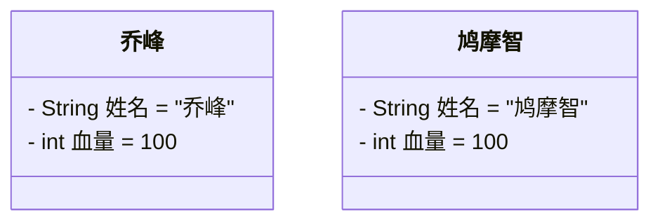
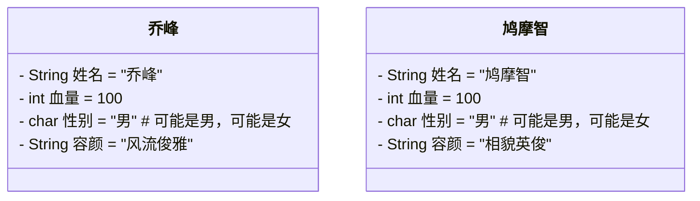

# 第一章：文字版格斗游戏（回合制）

## 1.1 简单需求

### 1.1.1 概述

* 格斗游戏，每个游戏角色的姓名、血量都是不一样的。在选定人物（角色）的时候（new 对象的时候），这些信息就应该被确定下来。
* 人物的角色，如下所示：



* 当游戏开始启动的时候，需要模拟回合制格斗游戏，如下所示：

```txt
乔峰举起拳头打了鸠摩智一下，造成了 XX 点伤害，鸠摩智还剩下 XXX 点血。
鸠摩智举起拳头打了鸠摩智一下，造成了 XX 点伤害，乔峰还剩下 XXX 点血。
乔峰举起拳头打了鸠摩智一下，造成了 XX 点伤害，鸠摩智还剩下 XXX 点血。
鸠摩智举起拳头打了鸠摩智一下，造成了 XX 点伤害，乔峰还剩下 XXX 点血。

...
乔峰 K.O 鸠摩智
```

* 如果你不了解回合制游戏，那么请看下面的`大话西游`，其就是典型的回合制游戏，如下所示：


### 1.1.2 需求分析和需求实现

* 首先，我们需要创建两个角色对象，如下所示：

```java
Role r1 = new Role("乔峰",100);
```

```java
Role r2 = new Role("鸠摩智",100);
```

* 然后，我们需要拿 r1 攻击 r2 以及拿 r2 攻击 r1，如下所示：

```java
r1.attack(r2);
```

```java
r2.attack(r1);
```

* 所以，Role 类中一定需要提供攻击的方法，如下所示：

```java
public void attack(Role role) {
    // 计算造成的伤害
    int currentAttack = RANDOM.nextInt(10) + 1;
    // 计算剩余的血量
    int remainBlood = role.blood - currentAttack;
    // 判断剩余的血量是否小于0，如果小于 0 ，就赋值为 0 
    remainBlood = Math.max(remainBlood, 0);
    // 设置剩余的血量
    role.setBlood(remainBlood);
    // 打印输出
    System.out.printf(
            "%s举起拳头打了%s一下，造成了%d点伤害，%s还剩下%d点血。\n", 
        this.name, role.name, currentAttack, role.name, remainBlood);
}
```


* 示例：

::: code-group

```java [Role.java]
import java.security.SecureRandom;

public class Role {
    // 随机对象
    public static final SecureRandom RANDOM = new SecureRandom();
    // 姓名
    private String name;
    // 血量
    private int blood = 100;

    public Role() {}

    public Role(String name, int blood) {
        this.name = name;
        this.blood = blood;
    }

    public Role(String name) {
        this.name = name;
    }

    public void attack(Role role) {
        // 计算造成的伤害
        int currentAttack = RANDOM.nextInt(20) + 1;
        // 计算剩余的血量
        int remainBlood = role.blood - currentAttack;
        // 判断剩余的血量是否小于0，如果小于 0 ，就赋值为 0 
        remainBlood = Math.max(remainBlood, 0);
        // 设置剩余的血量
        role.setBlood(remainBlood);
        // 打印输出
        System.out.printf(
                "%s举起拳头打了%s一下，造成了%d点伤害，%s还剩下%d点血。\n", 
            this.name, role.name, currentAttack, role.name, remainBlood);
    }

    public String getName() {
        return name;
    }

    public void setName(String name) {
        this.name = name;
    }

    public int getBlood() {
        return blood;
    }

    public void setBlood(int blood) {
        this.blood = blood;
    }
}
```

```java [GameTest.java]
public class GameTest {
    public static void main(String[] args) {
        // 创建第一个角色
        Role role1 = new Role("乔峰");
        // 创建第二个角色
        Role role2 = new Role("鸠摩智");

        while (true) {
            // r1 开始攻击 r2
            role1.attack(role2);
            // 判断 r2 是否死亡
            if (role2.getBlood() <= 0) {
                System.out.printf("%s K.O %s\n", 
                                  role1.getName(), role2.getName());
                break;
            }
            // r2 开始攻击 r1
            role2.attack(role1);
            // 判断 r1 是否死亡
            if (role1.getBlood() <= 0) {
                System.out.printf("%s K.O %s\n", 
                                  role2.getName(), role1.getName());
                break;
            }
        }
    }
}
```

```txt[cmd 控制台]
乔峰举起拳头打了鸠摩智一下，造成了3点伤害，鸠摩智还剩下97点血。
鸠摩智举起拳头打了乔峰一下，造成了14点伤害，乔峰还剩下86点血。
乔峰举起拳头打了鸠摩智一下，造成了9点伤害，鸠摩智还剩下88点血。
鸠摩智举起拳头打了乔峰一下，造成了5点伤害，乔峰还剩下81点血。
乔峰举起拳头打了鸠摩智一下，造成了2点伤害，鸠摩智还剩下86点血。
鸠摩智举起拳头打了乔峰一下，造成了6点伤害，乔峰还剩下75点血。
乔峰举起拳头打了鸠摩智一下，造成了2点伤害，鸠摩智还剩下84点血。
鸠摩智举起拳头打了乔峰一下，造成了19点伤害，乔峰还剩下56点血。
乔峰举起拳头打了鸠摩智一下，造成了4点伤害，鸠摩智还剩下80点血。
鸠摩智举起拳头打了乔峰一下，造成了10点伤害，乔峰还剩下46点血。
乔峰举起拳头打了鸠摩智一下，造成了7点伤害，鸠摩智还剩下73点血。
鸠摩智举起拳头打了乔峰一下，造成了16点伤害，乔峰还剩下30点血。
乔峰举起拳头打了鸠摩智一下，造成了7点伤害，鸠摩智还剩下66点血。
鸠摩智举起拳头打了乔峰一下，造成了1点伤害，乔峰还剩下29点血。
乔峰举起拳头打了鸠摩智一下，造成了12点伤害，鸠摩智还剩下54点血。
鸠摩智举起拳头打了乔峰一下，造成了5点伤害，乔峰还剩下24点血。
乔峰举起拳头打了鸠摩智一下，造成了18点伤害，鸠摩智还剩下36点血。
鸠摩智举起拳头打了乔峰一下，造成了11点伤害，乔峰还剩下13点血。
乔峰举起拳头打了鸠摩智一下，造成了9点伤害，鸠摩智还剩下27点血。
鸠摩智举起拳头打了乔峰一下，造成了3点伤害，乔峰还剩下10点血。
乔峰举起拳头打了鸠摩智一下，造成了4点伤害，鸠摩智还剩下23点血。
鸠摩智举起拳头打了乔峰一下，造成了7点伤害，乔峰还剩下3点血。
乔峰举起拳头打了鸠摩智一下，造成了15点伤害，鸠摩智还剩下8点血。
鸠摩智举起拳头打了乔峰一下，造成了19点伤害，乔峰还剩下0点血。
鸠摩智 K.O 乔峰
```

:::

## 1.2 复杂需求

### 1.2.1 概述

* 格斗游戏，每个游戏角色的姓名、血量都是不一样的。在选定人物（角色）的时候（new 对象的时候），这些信息就应该被确定下来。

* 人物的角色，如下所示：



* 其中，男女的容颜，如下所示：

```java
String[] boyfaces 
   = {"风流俊雅","气宇轩昂","相貌英俊","五官端正","相貌平平","一塌糊涂","面目狰狞"};
```

```java
String[] girlfaces 
   = {"美奂绝伦","沉鱼落雁","婷婷玉立","身材娇好","相貌平平","相貌简陋","惨不忍睹"};
```

* 当游戏开始启动的时候，需要模拟回合制格斗游戏，如下所示：

```txt
乔峰使出了一招【背心钉】，转到对方的身后，一掌向鸠摩智背心的灵台穴拍去。结果给鸠摩智造成一处伤。
鸠摩智使出了一招【游空探爪】，飞起身形自半空中变掌为抓锁向乔峰。结果乔峰退了半步，毫发无损。
...
乔峰 K.O 鸠摩智
```

* 其中，他们之间的武功招式（每次格斗的时候，从数组中随机选择一个武功），如下所示：

```java
 String[] attacksDesc = {
    "%s使出了一招【背心钉】，转到对方的身后，一掌向%s背心的灵台穴拍去。",
    "%s使出了一招【游空探爪】，飞起身形自半空中变掌为抓锁向%s。",
    "%s大喝一声，身形下伏，一招【劈雷坠地】，捶向%s双腿。",
    "%s运气于掌，一瞬间掌心变得血红，一式【掌心雷】，推向%s。",
    "%s阴手翻起阳手跟进，一招【没遮拦】，结结实实的捶向%s。",
    "%s上步抢身，招中套招，一招【劈挂连环】，连环攻向%s。"
};
```

```java
String[] beWoundedDesc = {
    "结果%s退了半步，毫发无损。",
    "结果给%s造成一处瘀伤。",
    "结果一击命中，%s痛得弯下腰。",
    "结果%s痛苦地闷哼了一声，显然受了点内伤。",
    "结果%s摇摇晃晃，一跤摔倒在地。",
    "结果%s脸色一下变得惨白，连退了好几步。",
    "结果『轰』的一声，%s口中鲜血狂喷而出。",
    "结果%s一声惨叫，像滩软泥般塌了下去。"
};
```

### 1.2.2 需求分析和需求实现

* 首先，我们需要创建两个角色对象，如下所示：

```java
Role r1 = new Role("乔峰",100,"男","风流俊雅");
```

```java
Role r2 = new Role("鸠摩智",100,"男","气宇轩昂");
```

* 然后，我们需要拿 r1 攻击 r2 以及拿 r2 攻击 r1，如下所示：

```java
r1.attack(r2);
```

```java
r2.attack(r1);
```

* 所以，Role 类中一定需要提供攻击的方法，如下所示：

```java
public void attack(Role role) {
    // ① 计算造成的伤害
    int currentAttack = RANDOM.nextInt(20) + 1;
    // ② 输出攻击者的攻击描述
    String format = attacksDesc[RANDOM.nextInt(attacksDesc.length)] + "❌造成了%d点伤害。";
    System.out.printf(format, this.name, role.name, currentAttack);
    // ③ 计算剩余的血量
    int remainBlood = role.blood - currentAttack;
    // ④ 判断剩余的血量是否小于0
    remainBlood = Math.max(remainBlood, 0);
    // ⑤ 设置剩余的血量
    role.setBlood(remainBlood);
    // 打印输出
    // System.out.printf(
    //         "%s举起拳头打了%s一下，造成了%d点伤害，%s还剩下%d点血。\n", this.name, role.name, currentAttack, role.name, remainBlood);
    // ⑥ 输出受击者的受击描述
    format = beWoundedDesc[RANDOM.nextInt(beWoundedDesc.length)] + "✅还剩下%d点血。" + "\n";
    System.out.printf(format, role.name, remainBlood);
}
```


* 示例：

::: code-group

```java [Role.java]
import java.security.SecureRandom;

public class Role {
    // 随机值
    public static final SecureRandom RANDOM = new SecureRandom();
    // 男生脸
    private final String[] boyFaces = {"风流俊雅", "气宇轩昂", "相貌英俊", "五官端正", "相貌平平", "一塌糊涂", "面目狰狞"};
    // 女生脸
    private final String[] girlFaces = {"美奂绝伦", "沉鱼落雁", "婷婷玉立", "身材娇好", "相貌平平", "相貌简陋", "惨不忍睹"};
    // 攻击描述
    private final String[] attacksDesc = {
        "%s使出了一招【背心钉】，转到对方的身后，一掌向%s背心的灵台穴拍去。",
        "%s使出了一招【游空探爪】，飞起身形自半空中变掌为抓锁向%s。",
        "%s大喝一声，身形下伏，一招【劈雷坠地】，捶向%s双腿。",
        "%s运气于掌，一瞬间掌心变得血红，一式【掌心雷】，推向%s。",
        "%s阴手翻起阳手跟进，一招【没遮拦】，结结实实的捶向%s。",
        "%s上步抢身，招中套招，一招【劈挂连环】，连环攻向%s。"
    };
    // 受伤描述
    private final String[] beWoundedDesc = {
        "结果%s退了半步，毫发无损。",
        "结果给%s造成一处瘀伤。",
        "结果一击命中，%s痛得弯下腰。",
        "结果%s痛苦地闷哼了一声，显然受了点内伤。",
        "结果%s摇摇晃晃，一跤摔倒在地。",
        "结果%s脸色一下变得惨白，连退了好几步。",
        "结果『轰』的一声，%s口中鲜血狂喷而出。",
        "结果%s一声惨叫，像滩软泥般塌了下去。"
    };

    // 姓名
    private String name;
    // 血量
    private int blood = 100;
    // 性别
    private char gender;
    // 容颜
    private String face;

    public Role() {}

    public Role(String name, int blood, char gender) {
        this.name = name;
        this.blood = blood;
        this.gender = gender;
        switch (gender) {
            case '男':
                this.setFace(boyFaces[RANDOM.nextInt(boyFaces.length)]);
                break;
            case '女':
                this.setFace(girlFaces[RANDOM.nextInt(girlFaces.length)]);
                break;
            default:
                this.setFace("不明~");
        }
    }

    public void attack(Role role) {
        // ① 计算造成的伤害
        int currentAttack = RANDOM.nextInt(20) + 1;
        // ② 总血量
        int totalBlood = role.blood;
        // ② 输出攻击者的攻击描述
        String format = attacksDesc[RANDOM.nextInt(attacksDesc.length)] + "❌造成了%d点伤害。";
        System.out.printf(format, this.name, role.name, currentAttack);
        // ③ 计算剩余的血量
        int remainBlood = role.blood - currentAttack;
        // ④ 判断剩余的血量是否小于0
        remainBlood = Math.max(remainBlood, 0);
        // ⑤ 设置剩余的血量
        role.setBlood(remainBlood);
        // 打印输出
        // System.out.printf(
        //         "%s举起拳头打了%s一下，造成了%d点伤害，%s还剩下%d点血。\n", this.name, role.name, currentAttack, role.name, remainBlood);
        // ⑥ 输出受击者的受击描述
        double bloodPercentage = (double) remainBlood / totalBlood;
        int beWoundedIndex = (int) (beWoundedDesc.length * (1.0 - bloodPercentage));
        beWoundedIndex = Math.min(beWoundedIndex, beWoundedDesc.length - 1);
        format = beWoundedDesc[beWoundedIndex] + "✅还剩下%d点血。" + "\n";
        System.out.printf(format, role.name, remainBlood);
    }

    public String getName() {
        return name;
    }

    public void setName(String name) {
        this.name = name;
    }

    public int getBlood() {
        return blood;
    }

    public void setBlood(int blood) {
        this.blood = blood;
    }

    public char getGender() {
        return gender;
    }

    public void setGender(char gender) {
        this.gender = gender;
    }

    public String getFace() {
        return face;
    }

    public void setFace(String face) {
        this.face = face;
    }

    @Override
    public String toString() {
        return String.format("姓名：%s\t血量：%d\t性别：%c\t容颜：%s", name, blood, gender, face);
    }
}
```

```java [GameTest.java]
public class GameTest {
    public static void main(String[] args) {

        // 创建第一个角色
        Role role1 = new Role("乔峰", 100, '男');
        // 创建第二个角色
        Role role2 = new Role("鸠摩智", 100, '男');
        // 打印出角色信息
        System.out.println(role1);
        System.out.println(role2);

        while (true) {
            // r1 开始攻击 r2
            role1.attack(role2);
            // 判断 r2 是否死亡
            if (role2.getBlood() <= 0) {
                System.out.printf("%s K.O %s\n", role1.getName(), role2.getName());
                break;
            }
            // r2 开始攻击 r1
            role2.attack(role1);
            // 判断 r1 是否死亡
            if (role1.getBlood() <= 0) {
                System.out.printf("%s K.O %s\n", role2.getName(), role1.getName());
                break;
            }
        }
    }
}
```

```txt[cmd 控制台]
姓名：乔峰	血量：100	性别：男	容颜：面目狰狞
姓名：鸠摩智	血量：100	性别：男	容颜：相貌平平
乔峰上步抢身，招中套招，一招【劈挂连环】，连环攻向鸠摩智。❌造成了9点伤害。结果鸠摩智退了半步，毫发无损。✅还剩下91点血。
鸠摩智使出了一招【背心钉】，转到对方的身后，一掌向乔峰背心的灵台穴拍去。❌造成了16点伤害。结果给乔峰造成一处瘀伤。✅还剩下84点血。
乔峰上步抢身，招中套招，一招【劈挂连环】，连环攻向鸠摩智。❌造成了16点伤害。结果给鸠摩智造成一处瘀伤。✅还剩下75点血。
鸠摩智运气于掌，一瞬间掌心变得血红，一式【掌心雷】，推向乔峰。❌造成了7点伤害。结果乔峰退了半步，毫发无损。✅还剩下77点血。
乔峰使出了一招【游空探爪】，飞起身形自半空中变掌为抓锁向鸠摩智。❌造成了17点伤害。结果给鸠摩智造成一处瘀伤。✅还剩下58点血。
鸠摩智大喝一声，身形下伏，一招【劈雷坠地】，捶向乔峰双腿。❌造成了7点伤害。结果乔峰退了半步，毫发无损。✅还剩下70点血。
乔峰上步抢身，招中套招，一招【劈挂连环】，连环攻向鸠摩智。❌造成了9点伤害。结果给鸠摩智造成一处瘀伤。✅还剩下49点血。
鸠摩智运气于掌，一瞬间掌心变得血红，一式【掌心雷】，推向乔峰。❌造成了18点伤害。结果一击命中，乔峰痛得弯下腰。✅还剩下52点血。
乔峰使出了一招【背心钉】，转到对方的身后，一掌向鸠摩智背心的灵台穴拍去。❌造成了10点伤害。结果给鸠摩智造成一处瘀伤。✅还剩下39点血。
鸠摩智大喝一声，身形下伏，一招【劈雷坠地】，捶向乔峰双腿。❌造成了15点伤害。结果一击命中，乔峰痛得弯下腰。✅还剩下37点血。
乔峰阴手翻起阳手跟进，一招【没遮拦】，结结实实的捶向鸠摩智。❌造成了13点伤害。结果一击命中，鸠摩智痛得弯下腰。✅还剩下26点血。
鸠摩智运气于掌，一瞬间掌心变得血红，一式【掌心雷】，推向乔峰。❌造成了15点伤害。结果乔峰痛苦地闷哼了一声，显然受了点内伤。✅还剩下22点血。
乔峰使出了一招【背心钉】，转到对方的身后，一掌向鸠摩智背心的灵台穴拍去。❌造成了15点伤害。结果鸠摩智摇摇晃晃，一跤摔倒在地。✅还剩下11点血。
鸠摩智大喝一声，身形下伏，一招【劈雷坠地】，捶向乔峰双腿。❌造成了18点伤害。结果『轰』的一声，乔峰口中鲜血狂喷而出。✅还剩下4点血。
乔峰阴手翻起阳手跟进，一招【没遮拦】，结结实实的捶向鸠摩智。❌造成了15点伤害。结果鸠摩智一声惨叫，像滩软泥般塌了下去。✅还剩下0点血。
乔峰 K.O 鸠摩智
```

:::


# 第二章：对象数组练习

## 2.1 对象数组 1

* 需求：定义数组，并存储 3 个商品对象。

> [!NOTE]
>
> * ① 商品的属性：id、名称、价格、库存。
> * ② 创建 3 个商品对象，并将商品对象存入到数组中。
> * ③ 遍历对象数组。


* 示例：

::: code-group

```java [Product.java]
public class Product {
    
    // id
    private int id;
    
    // 名称
    private String name;
    
    // 价格
    private double price;
    
    // 库存
    private int count;

    public Product() {}

    public Product(int id, String name, double price, int count) {
        this.id = id;
        this.name = name;
        this.price = price;
        this.count = count;
    }

    public int getId() {
        return id;
    }

    public void setId(int id) {
        this.id = id;
    }

    public String getName() {
        return name;
    }

    public void setName(String name) {
        this.name = name;
    }

    public double getPrice() {
        return price;
    }

    public void setPrice(double price) {
        this.price = price;
    }

    public int getCount() {
        return count;
    }

    public void setCount(int count) {
        this.count = count;
    }

    @Override
    public String toString() {
        return "Product{" + "id=" + id 
            + ", name='" + name + '\'' 
            + ", price=" + price 
            + ", count=" + count + '}';
    }
}
```

```java [ProductTest.java]
public class ProductTest {
    public static void main(String[] args) {
        // 创建对象数组
        Product[] arr = new Product[3];
        // 创建商品对象
        Product p1 = new Product(1, "华为手机", 5999, 100);
        Product p2 = new Product(2, "华为平板", 3999, 100);
        Product p3 = new Product(3, "华为耳机", 199, 100);
        // 将商品对象放入数组中
        arr[0] = p1;
        arr[1] = p2;
        arr[2] = p3;
        // 遍历对象数组
        for (int i = 0; i < arr.length; i++) {
            Product p = arr[i];
            System.out.println(p);
        }
    }
}
```

```txt [cmd 控制台]
Product{id=1, name='华为手机', price=5999.0, count=100}
Product{id=2, name='华为平板', price=3999.0, count=100}
Product{id=3, name='华为耳机', price=199.0, count=100}
```

:::

## 2.2 对象数组 2

* 需求：定义数组，并存储 3 辆汽车对象。

> [!NOTE]
>
> * ① 汽车的属性：品牌、价格、颜色。
> * ② 创建 3 个汽车对象，数据通过键盘录入，并将汽车对象存储到数组中。
> * ③ 遍历对象数组。


* 示例：

::: code-group

```java [Car.java]
public class Car {
    
    // 品牌
    private String brand;

    // 价格
    private double price;

    // 颜色
    private String color;

    public Car(String brand, double price, String color) {
        this.brand = brand;
        this.price = price;
        this.color = color;
    }

    public Car() {}

    public String getBrand() {
        return brand;
    }

    public void setBrand(String brand) {
        this.brand = brand;
    }

    public double getPrice() {
        return price;
    }

    public void setPrice(double price) {
        this.price = price;
    }

    public String getColor() {
        return color;
    }

    public void setColor(String color) {
        this.color = color;
    }

    @Override
    public String toString() {
        return "Car {" + "brand='" + brand+ '\'' 
            + ", price=" + price 
            + ", color='" + color + '\'' + '}';
    }
}
```

```java [CarTest.java]
import java.util.Scanner;

public class CarTest {
    public static void main(String[] args) {
        // 创建键盘录入对象
        Scanner input = new Scanner(System.in);
        // 创建 3 辆车的数组
        Car[] car = new Car[3];
        // 键盘录入，创建汽车对象，并将汽车对象存储到数组中
        for (int i = 0; i < car.length; i++) {
            System.out.print("请输入第 " + (i + 1) + " 辆车的品牌：");
            String brand = input.next();
            System.out.print("请输入第 " + (i + 1) + " 辆车的价格：");
            double price = input.nextDouble();
            System.out.print("请输入第 " + (i + 1) + " 辆车的颜色：");
            String color = input.next();
            // 将 Car 对象放入数组中
            car[i] = new Car(brand, price, color);
        }
        // 打印数组
        for (int i = 0; i < car.length; i++) {
            System.out.println(car[i]);
        }
        // 关闭输入流
        input.close();
    }
}
```

```txt [cmd 控制台]
Car {brand='宝马', price=100000.25, color='红色'}
Car {brand='奔驰', price=350000.25, color='黑色'}
Car {brand='皇马', price=9.9, color='白色'}
```

:::

## 2.3 对象数组 3

* 需求：定义数组，存储 4 个女朋友对象。

> [!NOTE]
>
> * ① 女朋友的属性：姓名、年龄、性别、爱好。
> * ② 计算出四女朋友的平均年龄。
> * ③ 统计年龄比平均值低的女朋友有几个？并把她们的所有信息打印出来。


* 示例：

::: code-group

```java [GirlFriend.java]
public class GirlFriend {

    // 姓名
    private String name;

    // 年龄
    private int age;

    // 性别
    private char gender;

    // 爱好
    private String hobby;

    public GirlFriend() {}

    public GirlFriend(String name, int age, char gender, String hobby) {
        this.name = name;
        this.age = age;
        this.gender = gender;
        this.hobby = hobby;
    }

    public String getName() {
        return name;
    }

    public void setName(String name) {
        this.name = name;
    }

    public int getAge() {
        return age;
    }

    public void setAge(int age) {
        this.age = age;
    }

    public char getGender() {
        return gender;
    }

    public void setGender(char gender) {
        this.gender = gender;
    }

    public String getHobby() {
        return hobby;
    }

    public void setHobby(String hobby) {
        this.hobby = hobby;
    }

    @Override
    public String toString() {
        return "GirlFriend{" + "name='"
                + name + '\'' + ", age="
                + age + ", gender="
                + gender + ", hobby='"
                + hobby + '\'' + '}';
    }
}
```

```java [GirlFriendTest.java]
public class GirlFriendTest {
    public static void main(String[] args) {
        // 定义数组对象
        GirlFriend[] gf = new GirlFriend[4];
        // 创建 4 个女朋友对象
        GirlFriend g1 = new GirlFriend("小红", 18, '女', "唱歌");
        GirlFriend g2 = new GirlFriend("小花", 19, '女', "打游戏");
        GirlFriend g3 = new GirlFriend("小绿", 20, '女', "看电影");
        GirlFriend g4 = new GirlFriend("小黄", 21, '女', "看电影");
        // 将 4 个女朋友对象放入数组中
        gf[0] = g1;
        gf[1] = g2;
        gf[2] = g3;
        gf[3] = g4;
        // 计算出女朋友的平均年龄
        double avgAge = avgAge(gf);
        System.out.println("平均年龄：" + avgAge);
        // 统计年龄比平均值低的女朋友有几个
        int count = lessAvgAgeCount(gf, avgAge);
        System.out.println("年龄比平均值低的女朋友有：" + count + " 个");
        // 打印年龄比平均值低的女朋友
        GirlFriend[] result = lessAvgAge(gf, avgAge, count);
        for (int i = 0; i < result.length; i++) {
            System.out.println(result[i]);
        }
    }

    /**
     * 计算平均年龄
     * @param gf 女朋友对象数组
     * @return 平均年龄
     */
    public static double avgAge(GirlFriend[] gf) {
        double sum = 0;
        for (int i = 0; i < gf.length; i++) {
            sum += gf[i].getAge();
        }
        return sum / gf.length;
    }

    /**
     * 计算年龄比平均值低的女朋友的数量
     * @param gf 女朋友对象数组
     * @param avgAge 平均值
     * @return 数量
     */
    public static int lessAvgAgeCount(GirlFriend[] gf, double avgAge) {
        int count = 0;
        for (int i = 0; i < gf.length; i++) {
            if (gf[i].getAge() < avgAge) {
                count++;
            }
        }
        return count;
    }

    /**
     * 返回年龄比平均值低的女朋友
     * @param gf 女朋友对象数组
     * @param avgAge 平均值
     * @param count 数量
     * @return 女朋友对象数组
     */
    public static GirlFriend[] lessAvgAge(GirlFriend[] gf, double avgAge, int count) {

        GirlFriend[] result = new GirlFriend[count];

        for (int i = 0, j = 0; i < gf.length; i++) {
            if (gf[i].getAge() < avgAge) {
                result[j++] = gf[i];
            }
        }

        return result;
    }
}
```

```txt [cmd 控制台]
平均年龄：19.5
年龄比平均值低的女朋友有：2 个
GirlFriend{name='小红', age=18, gender=女, hobby='唱歌'}
GirlFriend{name='小花', age=19, gender=女, hobby='打游戏'}
```

:::

## 2.4 对象数组 4

* 需求：定义数组，存储 3 个学生对象作为初识数据，学生对象的学号、姓名各不相同。

> [!NOTE]
>
> * ① 学生的属性：学号，姓名，年龄。
> * ② 再次添加一个学生的对象，并在添加的时候进行学号的唯一性判断。
> * ③ 添加完毕之后，遍历所有学生信息。
> * ④ 通过 id 删除学生信息：如果存在，则删除；如果不存在，则提示删除失败。
> * ⑤ 删除完毕之后，遍历所有学生信息。
> * ⑥ 查询 id 为 2 的学生，如果存在，就将其年龄 +1 岁。


* 示例：

::: code-group

```java [Student.java]
public class Student {

    private int id;

    private String name;

    private int age;

    public Student() {}

    public Student(int id, String name, int age) {
        this.id = id;
        this.name = name;
        this.age = age;
    }

    public int getId() {
        return id;
    }

    public void setId(int id) {
        this.id = id;
    }

    public String getName() {
        return name;
    }

    public void setName(String name) {
        this.name = name;
    }

    public int getAge() {
        return age;
    }

    public void setAge(int age) {
        this.age = age;
    }

    @Override
    public String toString() {
        return "Student{" + "id=" + id + 
            ", name='" + name + '\'' + ", age=" + age + '}';
    }
}
```

```java [StudentTest.java]
public class StudentTest {
    public static void main(String[] args) {
        // 创建一个对象数组
        Student[] arr = new Student[3];

        // 创建三个学生对象
        Student s1 = new Student(1, "林青霞", 30);
        Student s2 = new Student(2, "张曼玉", 35);
        Student s3 = new Student(3, "王祖蓝", 40);

        // 把学生对象作为元素赋值给数组
        arr[0] = s1;
        arr[1] = s2;
        arr[2] = s3;

        // 遍历数组
        printArray(arr);

        // 添加元素
        Student s4 = new Student(4, "刘意", 28);
        arr = add(arr, s4);

        // 遍历数组
        printArray(arr);

        // 通过 id 删除学生信息，如果存在，则删除；否则，则提示删除失败
        delete(arr, 10);

        // 遍历数组
        printArray(arr);

        // 修改信息
        edit(arr, 3);

        // 遍历数组
        printArray(arr);
    }

    /**
     * 判断数组中是否包含指定的元素
     * @param arr 数组
     * @param id 指定的元素
     * @return true 包含，false 不包含
     */
    public static boolean contains(Student[] arr, int id) {
        for (int i = 0; i < arr.length; i++) {
            if (arr[i] != null && arr[i].getId() == id) {
                return true;
            }
        }
        return false;
    }

    /**
     * 添加元素到数组中
     * @param arr 数组
     * @param s 要添加的元素
     * @return 返回添加后的数组
     */
    public static Student[] add(Student[] arr, Student s) {
        if (contains(arr, s.getId())) {
            System.out.println("当前id重复，请修改id后在添加");
        } else {
            // 添加数组元素
            arr = append(arr, s);
        }
        return arr;
    }

    /**
     * 打印数组中的元素
     * @param arr 数组
     */
    public static void printArray(Student[] arr) {
        for (int i = 0; i < arr.length; i++) {
            System.out.println(arr[i]);
        }
        System.out.println("======================================");
    }

    /**
     * 判断数组中元素的个数
     * @param arr 数组
     * @return 数组中元素的个数
     */
    public static int count(Student[] arr) {
        int count = 0;
        for (int i = 0; i < arr.length; i++) {
            if (arr[i] != null) {
                count++;
            }
        }
        return count;
    }

    public static Student[] append(Student[] arr, Student s) {
        int count = count(arr);
        if (count == arr.length) {
            // 数组已经存满，需要进行扩容
            Student[] newArr = new Student[arr.length + 1];
            // 把原数组中的元素复制到新数组中
            System.arraycopy(arr, 0, newArr, 0, arr.length);
            // 把新元素赋值到新数组中
            newArr[arr.length] = s;
            // 把新数组赋值给原数组
            arr = newArr;
        } else {
            // 数组没有存满，直接添加即可
            arr[count] = s;
        }

        return arr;
    }

    /**
     * 根据 id 删除信息
     * @param arr 数组
     * @param id id
     */
    public static void delete(Student[] arr, int id) {
        if (!contains(arr, id)) {
            System.out.println("id不存在，删除失败");
        }
        for (int i = 0; i < arr.length; i++) {
            if (null != arr[i] && arr[i].getId() == id) {
                arr[i] = null;
            }
        }
    }

    /**
     * 修改用户信息
     * @param arr 数组
     * @param id id
     */
    public static void edit(Student[] arr, int id) {
        if (!contains(arr, id)) {
            System.out.println("id不存在，修改失败");
        }
        for (int i = 0; i < arr.length; i++) {
            if (null != arr[i] && arr[i].getId() == id) {
                arr[i].setAge(arr[i].getAge() + 1);
            }
        }
    }
}
```

```txt [cmd 控制台]
Student{id=1, name='林青霞', age=30}
Student{id=2, name='张曼玉', age=35}
Student{id=3, name='王祖蓝', age=40}
======================================
Student{id=1, name='林青霞', age=30}
Student{id=2, name='张曼玉', age=35}
Student{id=3, name='王祖蓝', age=40}
Student{id=4, name='刘意', age=28}
======================================
id不存在，删除失败
Student{id=1, name='林青霞', age=30}
Student{id=2, name='张曼玉', age=35}
Student{id=3, name='王祖蓝', age=40}
Student{id=4, name='刘意', age=28}
======================================
Student{id=1, name='林青霞', age=30}
Student{id=2, name='张曼玉', age=35}
Student{id=3, name='王祖蓝', age=41}
Student{id=4, name='刘意', age=28}
======================================
```

:::

