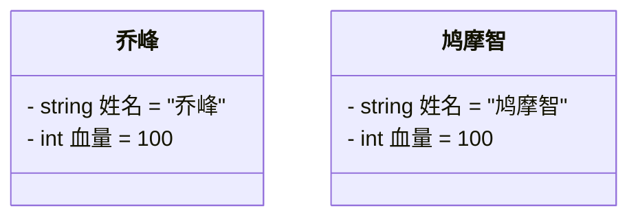
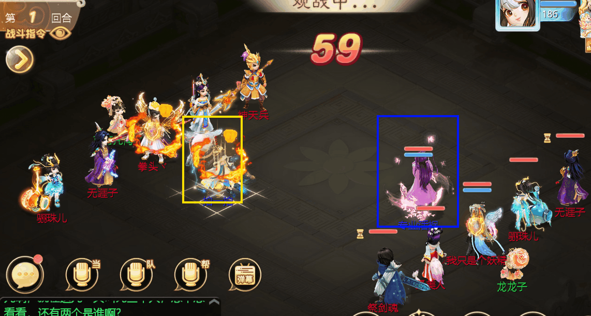
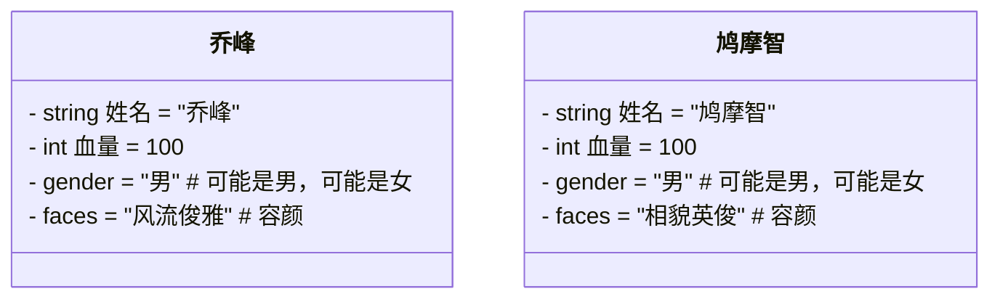

# 第一章：文字版格斗游戏（回合制）

## 1.1 简单需求

### 1.1.1 概述

* 格斗游戏，每个游戏角色的姓名、血量都是不一样的。在选定人物（角色）的时候（new 对象的时候），这些信息就应该被确定下来。
* 人物的角色，如下所示：


```mermaid
classDiagram
    class 乔峰 {
        - string 姓名 = "乔峰"
        - int 血量 = 100
    }
    class 鸠摩智 {
        - string 姓名 = "鸠摩智"
        - int 血量 = 100
    }
```

* 当游戏开始启动的时候，需要模拟回合制格斗游戏，如下所示：

```txt
乔峰举起拳头打了鸠摩智一下，造成了 XX 点伤害，鸠摩智还剩下 XXX 点血。
鸠摩智举起拳头打了鸠摩智一下，造成了 XX 点伤害，乔峰还剩下 XXX 点血。
乔峰举起拳头打了鸠摩智一下，造成了 XX 点伤害，鸠摩智还剩下 XXX 点血。
鸠摩智举起拳头打了鸠摩智一下，造成了 XX 点伤害，乔峰还剩下 XXX 点血。

...
乔峰 K.O. 鸠摩智
```

* 如果你不了解回合制游戏，那么请看下面的`大话西游`，其就是典型的回合制游戏，如下所示：



### 1.1.2 需求分析和需求实现

* 首先，我们需要创建两个角色对象，如下所示：

```java
Role r1 = new Role("乔峰",100);
```

```java
Role r2 = new Role("鸠摩智",100);
```

* 然后，我们需要拿 r1 攻击 r2 以及拿 r2 攻击 r1，如下所示：

```java
r1.attack(r2);
```

```java
r2.attack(r1);
```

* 所以，Role 类中一定需要提供攻击的方法，如下所示：

```java
public void attack(Role role) {
    // 计算造成的伤害
    int currentAttack = RANDOM.nextInt(10) + 1;
    // 计算剩余的血量
    int remainBlood = role.blood - currentAttack;
    // 判断剩余的血量是否小于0，如果小于 0 ，就赋值为 0 
    remainBlood = Math.max(remainBlood, 0);
    // 设置剩余的血量
    role.setBlood(remainBlood);
    // 打印输出
    System.out.printf(
            "%s举起拳头打了%s一下，造成了%d点伤害，%s还剩下%d点血。\n", 
        this.name, role.name, currentAttack, role.name, remainBlood);
}
```


* 示例：

::: code-group

```java [Role.java]
import java.security.SecureRandom;

public class Role {
    // 随机对象
    public static final SecureRandom RANDOM = new SecureRandom();
    // 姓名
    private String name;
    // 血量
    private int blood = 100;

    public Role() {}

    public Role(String name, int blood) {
        this.name = name;
        this.blood = blood;
    }

    public Role(String name) {
        this.name = name;
    }

    public void attack(Role role) {
        // 计算造成的伤害
        int currentAttack = RANDOM.nextInt(20) + 1;
        // 计算剩余的血量
        int remainBlood = role.blood - currentAttack;
        // 判断剩余的血量是否小于0，如果小于 0 ，就赋值为 0 
        remainBlood = Math.max(remainBlood, 0);
        // 设置剩余的血量
        role.setBlood(remainBlood);
        // 打印输出
        System.out.printf(
                "%s举起拳头打了%s一下，造成了%d点伤害，%s还剩下%d点血。\n", 
            this.name, role.name, currentAttack, role.name, remainBlood);
    }

    public String getName() {
        return name;
    }

    public void setName(String name) {
        this.name = name;
    }

    public int getBlood() {
        return blood;
    }

    public void setBlood(int blood) {
        this.blood = blood;
    }
}
```

```java [GameTest.java]
public class GameTest {
    public static void main(String[] args) {
        // 创建第一个角色
        Role role1 = new Role("乔峰");
        // 创建第二个角色
        Role role2 = new Role("鸠摩智");

        while (true) {
            // r1 开始攻击 r2
            role1.attack(role2);
            // 判断 r2 是否死亡
            if (role2.getBlood() <= 0) {
                System.out.printf("%s K.O %s\n", 
                                  role1.getName(), role2.getName());
                break;
            }
            // r2 开始攻击 r1
            role2.attack(role1);
            // 判断 r1 是否死亡
            if (role1.getBlood() <= 0) {
                System.out.printf("%s K.O %s\n", 
                                  role2.getName(), role1.getName());
                break;
            }
        }
    }
}
```

```txt[cmd 控制台]
乔峰举起拳头打了鸠摩智一下，造成了3点伤害，鸠摩智还剩下97点血。
鸠摩智举起拳头打了乔峰一下，造成了14点伤害，乔峰还剩下86点血。
乔峰举起拳头打了鸠摩智一下，造成了9点伤害，鸠摩智还剩下88点血。
鸠摩智举起拳头打了乔峰一下，造成了5点伤害，乔峰还剩下81点血。
乔峰举起拳头打了鸠摩智一下，造成了2点伤害，鸠摩智还剩下86点血。
鸠摩智举起拳头打了乔峰一下，造成了6点伤害，乔峰还剩下75点血。
乔峰举起拳头打了鸠摩智一下，造成了2点伤害，鸠摩智还剩下84点血。
鸠摩智举起拳头打了乔峰一下，造成了19点伤害，乔峰还剩下56点血。
乔峰举起拳头打了鸠摩智一下，造成了4点伤害，鸠摩智还剩下80点血。
鸠摩智举起拳头打了乔峰一下，造成了10点伤害，乔峰还剩下46点血。
乔峰举起拳头打了鸠摩智一下，造成了7点伤害，鸠摩智还剩下73点血。
鸠摩智举起拳头打了乔峰一下，造成了16点伤害，乔峰还剩下30点血。
乔峰举起拳头打了鸠摩智一下，造成了7点伤害，鸠摩智还剩下66点血。
鸠摩智举起拳头打了乔峰一下，造成了1点伤害，乔峰还剩下29点血。
乔峰举起拳头打了鸠摩智一下，造成了12点伤害，鸠摩智还剩下54点血。
鸠摩智举起拳头打了乔峰一下，造成了5点伤害，乔峰还剩下24点血。
乔峰举起拳头打了鸠摩智一下，造成了18点伤害，鸠摩智还剩下36点血。
鸠摩智举起拳头打了乔峰一下，造成了11点伤害，乔峰还剩下13点血。
乔峰举起拳头打了鸠摩智一下，造成了9点伤害，鸠摩智还剩下27点血。
鸠摩智举起拳头打了乔峰一下，造成了3点伤害，乔峰还剩下10点血。
乔峰举起拳头打了鸠摩智一下，造成了4点伤害，鸠摩智还剩下23点血。
鸠摩智举起拳头打了乔峰一下，造成了7点伤害，乔峰还剩下3点血。
乔峰举起拳头打了鸠摩智一下，造成了15点伤害，鸠摩智还剩下8点血。
鸠摩智举起拳头打了乔峰一下，造成了19点伤害，乔峰还剩下0点血。
鸠摩智 K.O 乔峰
```

:::

## 1.2 复杂需求

### 1.2.1 概述

* 格斗游戏，每个游戏角色的姓名、血量都是不一样的。在选定人物（角色）的时候（new 对象的时候），这些信息就应该被确定下来。

* 人物的角色，如下所示：


```mermaid
classDiagram
    class 乔峰 {
        - string 姓名 = "乔峰"
        - int 血量 = 100
        - gender = "男" # 可能是男，可能是女
        - faces = "风流俊雅" # 容颜
    }
    class 鸠摩智 {
        - string 姓名 = "鸠摩智"
        - int 血量 = 100
        - gender = "男" # 可能是男，可能是女
        - faces = "相貌英俊" # 容颜
    }
```

* 其中，男女的容颜，如下所示：

```java
String[] boyfaces = {"风流俊雅","气宇轩昂","相貌英俊","五官端正","相貌平平","一塌糊涂","面目狰狞"}
```

```java
String[] girlfaces = {"美奂绝伦","沉鱼落雁","婷婷玉立","身材娇好","相貌平平","相貌简陋","惨不忍睹"};
```

* 当游戏开始启动的时候，需要模拟回合制格斗游戏，如下所示：

```txt
乔峰使出了一招【背心钉】，转到对方的身后，一掌向鸠摩智背心的灵台穴拍去。结果给鸠摩智造成一处伤。
鸠摩智使出了一招【游空探爪】，飞起身形自半空中变掌为抓锁向乔峰。结果乔峰退了半步，毫发无损。
...
乔峰 K.O. 鸠摩智
```

* 其中，他们之间的武功招式（每次格斗的时候，从数组中随机选择一个武功），如下所示：

```java
 String[] attacksDesc = {
    "%s使出了一招【背心钉】，转到对方的身后，一掌向%s背心的灵台穴拍去。",
    "%s使出了一招【游空探爪】，飞起身形自半空中变掌为抓锁向%s。",
    "%s大喝一声，身形下伏，一招【劈雷坠地】，捶向%s双腿。",
    "%s运气于掌，一瞬间掌心变得血红，一式【掌心雷】，推向%s。",
    "%s阴手翻起阳手跟进，一招【没遮拦】，结结实实的捶向%s。",
    "%s上步抢身，招中套招，一招【劈挂连环】，连环攻向%s。"
};
```

```java
String[] beWoundedDesc = {
    "结果%s退了半步，毫发无损。",
    "结果给%s造成一处瘀伤。",
    "结果一击命中，%s痛得弯下腰。",
    "结果%s痛苦地闷哼了一声，显然受了点内伤。",
    "结果%s摇摇晃晃，一跤摔倒在地。",
    "结果%s脸色一下变得惨白，连退了好几步。",
    "结果『轰』的一声，%s口中鲜血狂喷而出。",
    "结果%s一声惨叫，像滩软泥般塌了下去。"
};
```

### 1.2.2 需求分析和需求实现

* 首先，我们需要创建两个角色对象，如下所示：

```java
Role r1 = new Role("乔峰",100,"男","风流俊雅");
```

```java
Role r2 = new Role("鸠摩智",100,"男","气宇轩昂");
```

* 然后，我们需要拿 r1 攻击 r2 以及拿 r2 攻击 r1，如下所示：

```java
r1.attack(r2);
```

```java
r2.attack(r1);
```

* 所以，Role 类中一定需要提供攻击的方法，如下所示：

```java
public void attack(Role role) {
    // ① 计算造成的伤害
    int currentAttack = RANDOM.nextInt(20) + 1;
    // ② 输出攻击者的攻击描述
    String format = attacksDesc[RANDOM.nextInt(attacksDesc.length)] + "❌造成了%d点伤害。";
    System.out.printf(format, this.name, role.name, currentAttack);
    // ③ 计算剩余的血量
    int remainBlood = role.blood - currentAttack;
    // ④ 判断剩余的血量是否小于0
    remainBlood = Math.max(remainBlood, 0);
    // ⑤ 设置剩余的血量
    role.setBlood(remainBlood);
    // 打印输出
    // System.out.printf(
    //         "%s举起拳头打了%s一下，造成了%d点伤害，%s还剩下%d点血。\n", this.name, role.name, currentAttack, role.name, remainBlood);
    // ⑥ 输出受击者的受击描述
    format = beWoundedDesc[RANDOM.nextInt(beWoundedDesc.length)] + "✅还剩下%d点血。" + "\n";
    System.out.printf(format, role.name, remainBlood);
}
```


* 示例：

::: code-group

```java [Role.java]
import java.security.SecureRandom;

public class Role {
    // 随机值
    public static final SecureRandom RANDOM = new SecureRandom();
    // 男生脸
    private final String[] boyFaces = {"风流俊雅", "气宇轩昂", "相貌英俊", "五官端正", "相貌平平", "一塌糊涂", "面目狰狞"};
    // 女生脸
    private final String[] girlFaces = {"美奂绝伦", "沉鱼落雁", "婷婷玉立", "身材娇好", "相貌平平", "相貌简陋", "惨不忍睹"};
    // 攻击描述
    private final String[] attacksDesc = {
        "%s使出了一招【背心钉】，转到对方的身后，一掌向%s背心的灵台穴拍去。",
        "%s使出了一招【游空探爪】，飞起身形自半空中变掌为抓锁向%s。",
        "%s大喝一声，身形下伏，一招【劈雷坠地】，捶向%s双腿。",
        "%s运气于掌，一瞬间掌心变得血红，一式【掌心雷】，推向%s。",
        "%s阴手翻起阳手跟进，一招【没遮拦】，结结实实的捶向%s。",
        "%s上步抢身，招中套招，一招【劈挂连环】，连环攻向%s。"
    };
    // 受伤描述
    private final String[] beWoundedDesc = {
        "结果%s退了半步，毫发无损。",
        "结果给%s造成一处瘀伤。",
        "结果一击命中，%s痛得弯下腰。",
        "结果%s痛苦地闷哼了一声，显然受了点内伤。",
        "结果%s摇摇晃晃，一跤摔倒在地。",
        "结果%s脸色一下变得惨白，连退了好几步。",
        "结果『轰』的一声，%s口中鲜血狂喷而出。",
        "结果%s一声惨叫，像滩软泥般塌了下去。"
    };

    // 姓名
    private String name;
    // 血量
    private int blood = 100;
    // 性别
    private char gender;
    // 容颜
    private String face;

    public Role() {}

    public Role(String name, int blood, char gender) {
        this.name = name;
        this.blood = blood;
        this.gender = gender;
        switch (gender) {
            case '男':
                this.setFace(boyFaces[RANDOM.nextInt(boyFaces.length)]);
                break;
            case '女':
                this.setFace(girlFaces[RANDOM.nextInt(girlFaces.length)]);
                break;
            default:
                this.setFace("不明~");
        }
    }

    public void attack(Role role) {
        // ① 计算造成的伤害
        int currentAttack = RANDOM.nextInt(20) + 1;
        // ② 总血量
        int totalBlood = role.blood;
        // ② 输出攻击者的攻击描述
        String format = attacksDesc[RANDOM.nextInt(attacksDesc.length)] + "❌造成了%d点伤害。";
        System.out.printf(format, this.name, role.name, currentAttack);
        // ③ 计算剩余的血量
        int remainBlood = role.blood - currentAttack;
        // ④ 判断剩余的血量是否小于0
        remainBlood = Math.max(remainBlood, 0);
        // ⑤ 设置剩余的血量
        role.setBlood(remainBlood);
        // 打印输出
        // System.out.printf(
        //         "%s举起拳头打了%s一下，造成了%d点伤害，%s还剩下%d点血。\n", this.name, role.name, currentAttack, role.name, remainBlood);
        // ⑥ 输出受击者的受击描述
        double bloodPercentage = (double) remainBlood / totalBlood;
        int beWoundedIndex = (int) (beWoundedDesc.length * (1.0 - bloodPercentage));
        beWoundedIndex = Math.min(beWoundedIndex, beWoundedDesc.length - 1);
        format = beWoundedDesc[beWoundedIndex] + "✅还剩下%d点血。" + "\n";
        System.out.printf(format, role.name, remainBlood);
    }

    public String getName() {
        return name;
    }

    public void setName(String name) {
        this.name = name;
    }

    public int getBlood() {
        return blood;
    }

    public void setBlood(int blood) {
        this.blood = blood;
    }

    public char getGender() {
        return gender;
    }

    public void setGender(char gender) {
        this.gender = gender;
    }

    public String getFace() {
        return face;
    }

    public void setFace(String face) {
        this.face = face;
    }

    @Override
    public String toString() {
        return String.format("姓名：%s\t血量：%d\t性别：%c\t容颜：%s", name, blood, gender, face);
    }
}
```

```java [GameTest.java]
public class GameTest {
    public static void main(String[] args) {

        // 创建第一个角色
        Role role1 = new Role("乔峰", 100, '男');
        // 创建第二个角色
        Role role2 = new Role("鸠摩智", 100, '男');
        // 打印出角色信息
        System.out.println(role1);
        System.out.println(role2);

        while (true) {
            // r1 开始攻击 r2
            role1.attack(role2);
            // 判断 r2 是否死亡
            if (role2.getBlood() <= 0) {
                System.out.printf("%s K.O %s\n", role1.getName(), role2.getName());
                break;
            }
            // r2 开始攻击 r1
            role2.attack(role1);
            // 判断 r1 是否死亡
            if (role1.getBlood() <= 0) {
                System.out.printf("%s K.O %s\n", role2.getName(), role1.getName());
                break;
            }
        }
    }
}
```

```txt[cmd 控制台]
姓名：乔峰	血量：100	性别：男	容颜：面目狰狞
姓名：鸠摩智	血量：100	性别：男	容颜：相貌平平
乔峰上步抢身，招中套招，一招【劈挂连环】，连环攻向鸠摩智。❌造成了9点伤害。结果鸠摩智退了半步，毫发无损。✅还剩下91点血。
鸠摩智使出了一招【背心钉】，转到对方的身后，一掌向乔峰背心的灵台穴拍去。❌造成了16点伤害。结果给乔峰造成一处瘀伤。✅还剩下84点血。
乔峰上步抢身，招中套招，一招【劈挂连环】，连环攻向鸠摩智。❌造成了16点伤害。结果给鸠摩智造成一处瘀伤。✅还剩下75点血。
鸠摩智运气于掌，一瞬间掌心变得血红，一式【掌心雷】，推向乔峰。❌造成了7点伤害。结果乔峰退了半步，毫发无损。✅还剩下77点血。
乔峰使出了一招【游空探爪】，飞起身形自半空中变掌为抓锁向鸠摩智。❌造成了17点伤害。结果给鸠摩智造成一处瘀伤。✅还剩下58点血。
鸠摩智大喝一声，身形下伏，一招【劈雷坠地】，捶向乔峰双腿。❌造成了7点伤害。结果乔峰退了半步，毫发无损。✅还剩下70点血。
乔峰上步抢身，招中套招，一招【劈挂连环】，连环攻向鸠摩智。❌造成了9点伤害。结果给鸠摩智造成一处瘀伤。✅还剩下49点血。
鸠摩智运气于掌，一瞬间掌心变得血红，一式【掌心雷】，推向乔峰。❌造成了18点伤害。结果一击命中，乔峰痛得弯下腰。✅还剩下52点血。
乔峰使出了一招【背心钉】，转到对方的身后，一掌向鸠摩智背心的灵台穴拍去。❌造成了10点伤害。结果给鸠摩智造成一处瘀伤。✅还剩下39点血。
鸠摩智大喝一声，身形下伏，一招【劈雷坠地】，捶向乔峰双腿。❌造成了15点伤害。结果一击命中，乔峰痛得弯下腰。✅还剩下37点血。
乔峰阴手翻起阳手跟进，一招【没遮拦】，结结实实的捶向鸠摩智。❌造成了13点伤害。结果一击命中，鸠摩智痛得弯下腰。✅还剩下26点血。
鸠摩智运气于掌，一瞬间掌心变得血红，一式【掌心雷】，推向乔峰。❌造成了15点伤害。结果乔峰痛苦地闷哼了一声，显然受了点内伤。✅还剩下22点血。
乔峰使出了一招【背心钉】，转到对方的身后，一掌向鸠摩智背心的灵台穴拍去。❌造成了15点伤害。结果鸠摩智摇摇晃晃，一跤摔倒在地。✅还剩下11点血。
鸠摩智大喝一声，身形下伏，一招【劈雷坠地】，捶向乔峰双腿。❌造成了18点伤害。结果『轰』的一声，乔峰口中鲜血狂喷而出。✅还剩下4点血。
乔峰阴手翻起阳手跟进，一招【没遮拦】，结结实实的捶向鸠摩智。❌造成了15点伤害。结果鸠摩智一声惨叫，像滩软泥般塌了下去。✅还剩下0点血。
乔峰 K.O 鸠摩智
```

:::


# 第二章：对象数组练习

## 2.1 对象数组 1

* 需求：定义数组存储 3 个商品对象。

> [!NOTE]
>
> * ① 商品的属性：商品 id、商品名称、商品价格、商品库存。
> * ② 创建三个商品对象，并将商品对象存入到数组中。
> * ③ 遍历对象数组。


* 示例：

::: code-group

```java [Product.java]
public class Product {
    private int id;
    private String name;
    private double price;
    private int count;

    public Product() {}

    public Product(int id, String name, double price, int count) {
        this.id = id;
        this.name = name;
        this.price = price;
        this.count = count;
    }

    public int getId() {
        return id;
    }

    public void setId(int id) {
        this.id = id;
    }

    public String getName() {
        return name;
    }

    public void setName(String name) {
        this.name = name;
    }

    public double getPrice() {
        return price;
    }

    public void setPrice(double price) {
        this.price = price;
    }

    public int getCount() {
        return count;
    }

    public void setCount(int count) {
        this.count = count;
    }

    @Override
    public String toString() {
        return "Product{" + "id=" + id + ", name='" + name + '\'' + ", price=" + price + ", count=" + count + '}';
    }
}
```

```java [ProductTest.java]
public class ProductTest {
    public static void main(String[] args) {
        // 创建对象数组
        Product[] arr = new Product[3];
        // 创建商品对象
        Product p1 = new Product(1, "华为手机", 5999, 100);
        Product p2 = new Product(2, "华为平板", 3999, 100);
        Product p3 = new Product(3, "华为耳机", 199, 100);
        // 将商品对象放入数组中
        arr[0] = p1;
        arr[1] = p2;
        arr[2] = p3;
        // 遍历对象数组
        for (int i = 0; i < arr.length; i++) {
            Product p = arr[i];
            System.out.println(p);
        }
    }
}
```

```txt [cmd 控制台]
Product{id=1, name='华为手机', price=5999.0, count=100}
Product{id=2, name='华为平板', price=3999.0, count=100}
Product{id=3, name='华为耳机', price=199.0, count=100}
```

:::


# 第三章：购物车

