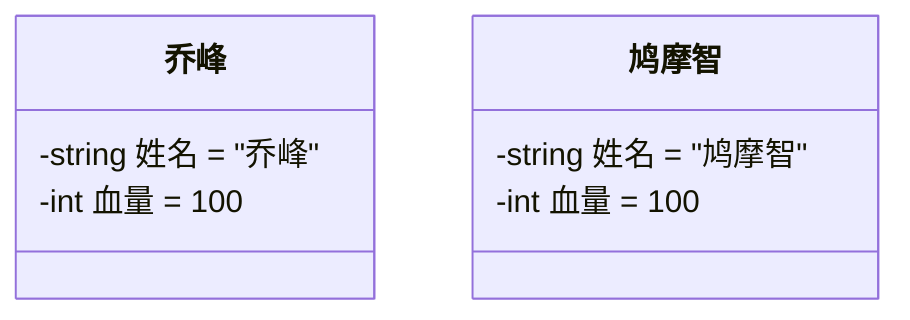

# 第一章：文字版格斗游戏（回合制）

## 1.1 概述

* 格斗游戏，每个游戏角色的姓名、血量都是不一样的。在选定人物（角色）的时候（new 对象的时候），这些信息就应该被确定下来。
* 人物的角色，如下所示：


```mermaid
classDiagram
    class 乔峰 {
        -string 姓名 = "乔峰"
        -int 血量 = 100
    }
    class 鸠摩智 {
        -string 姓名 = "鸠摩智"
        -int 血量 = 100
    }
```

* 当游戏开始启动的时候，需要模拟回合制格斗游戏，如下所示：

```txt
乔峰举起拳头打了鸠摩智一下，造成了 XX 点伤害，鸠摩智还剩下 XXX 点血。
鸠摩智举起拳头打了鸠摩智一下，造成了 XX 点伤害，乔峰还剩下 XXX 点血。
乔峰举起拳头打了鸠摩智一下，造成了 XX 点伤害，鸠摩智还剩下 XXX 点血。
鸠摩智举起拳头打了鸠摩智一下，造成了 XX 点伤害，乔峰还剩下 XXX 点血。

...
乔峰 K.O. 鸠摩智
```

## 1.2 需求分析

* 首先，我们需要创建两个角色对象，如下所示：

```java
Role r1 = new Role();
```

```java
Role r2 = new Role();
```

* 然后，我们需要拿 r1 攻击 r2 以及拿 r2 攻击 r1，如下所示：

```java
r1.attack(r2);
```

```java
r2.attack(r1);
```

* 所以，Role 类中一定需要提供攻击的方法，如下所示：

```java
public void attack(Role role) {
    // 计算造成的伤害
    int currentAttack = RANDOM.nextInt(10) + 1;
    // 计算剩余的血量
    int remainBlood = role.blood - currentAttack;
    // 判断剩余的血量是否小于0，如果小于 0 ，就赋值为 0 
    remainBlood = Math.max(remainBlood, 0);
    // 设置剩余的血量
    role.setBlood(remainBlood);
    // 打印输出
    System.out.printf(
            "%s举起拳头打了%s一下，造成了%d点伤害，%s还剩下%d点血。\n", 
        this.name, role.name, currentAttack, role.name, remainBlood);
}
```


* 示例：

::: code-group

```java [Role.java]
import java.security.SecureRandom;

public class Role {
    // 随机对象
    public static final SecureRandom RANDOM = new SecureRandom();
    // 姓名
    private String name;
    // 血量
    private int blood = 100;

    public Role() {}

    public Role(String name, int blood) {
        this.name = name;
        this.blood = blood;
    }

    public Role(String name) {
        this.name = name;
    }

    public void attack(Role role) {
        // 计算造成的伤害
        int currentAttack = RANDOM.nextInt(10) + 1;
        // 计算剩余的血量
        int remainBlood = role.blood - currentAttack;
        // 判断剩余的血量是否小于0，如果小于 0 ，就赋值为 0 
        remainBlood = Math.max(remainBlood, 0);
        // 设置剩余的血量
        role.setBlood(remainBlood);
        // 打印输出
        System.out.printf(
                "%s举起拳头打了%s一下，造成了%d点伤害，%s还剩下%d点血。\n", 
            this.name, role.name, currentAttack, role.name, remainBlood);
    }

    public String getName() {
        return name;
    }

    public void setName(String name) {
        this.name = name;
    }

    public int getBlood() {
        return blood;
    }

    public void setBlood(int blood) {
        this.blood = blood;
    }
}

```

```java [RoleTest.java]
public class RoleTest {
    public static void main(String[] args) {
        // 创建第一个角色
        Role role1 = new Role("乔峰");
        // 创建第二个角色
        Role role2 = new Role("鸠摩智");

        while (true) {
            // r1 开始攻击 r2
            role1.attack(role2);
            // 判断 r2 是否死亡
            if (role2.getBlood() <= 0) {
                System.out.printf("%s K.O %s\n", 
                                  role1.getName(), role2.getName());
                break;
            }
            // r2 开始攻击 r1
            role2.attack(role1);
            // 判断 r1 是否死亡
            if (role1.getBlood() <= 0) {
                System.out.printf("%s K.O %s\n", 
                                  role2.getName(), role1.getName());
                break;
            }
        }
    }
}
```

:::


# 第二章：对象数组练习


# 第三章：购物车

