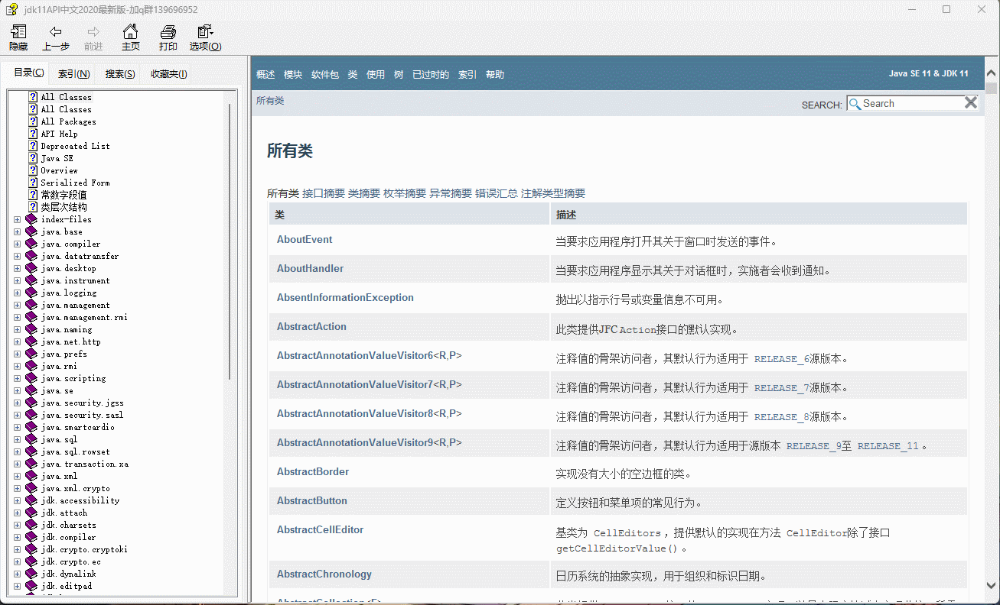
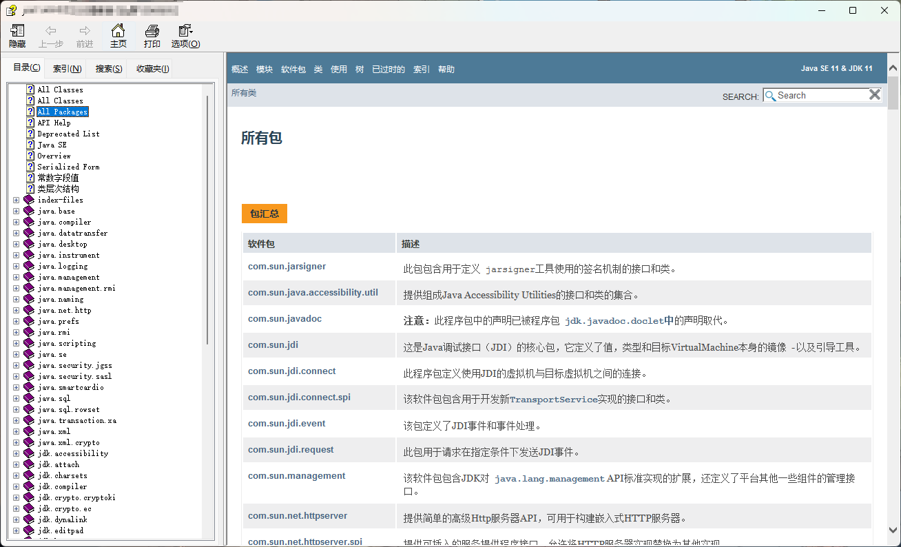
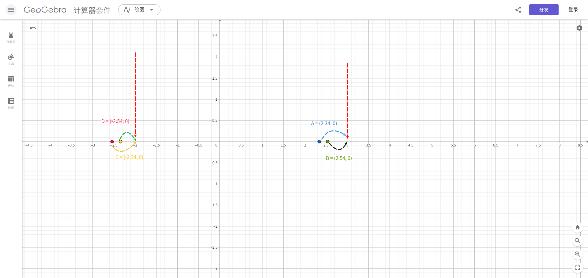
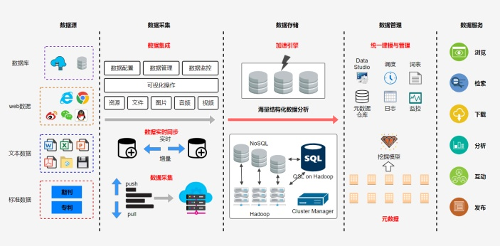
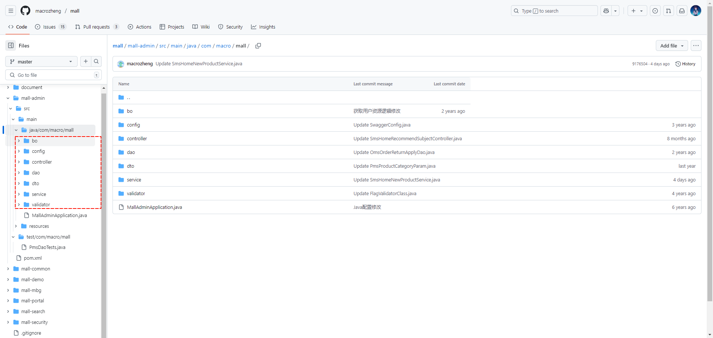

# 第一章：API 和 API 帮助文档

## 1.1 概述

* 之前我们已经学习过了面向对象了。并且我们知道，面向对象具体就是两个部分：
  * ① `如何使用别人已经写好的东西`。
  * ② `我们自己如何设计一个类，并使用`。
* 之前，我们都是学习`自己如何设计一个类，并使用`。但是，不可能所有的功能都是我们自己去手动实现，这样效率太低。

> [!NOTE]
>
> * ① 为了降低开发的难度，Java 官方将一些常用的功能进行了封装，并形成 API 供我们调用。
> * ② 有的时候，我们需要实现一些功能，Java 官方并没有实现，如：通过 Java 代码去操作 Word、Excel 等，这个时候就需要调用一些第三方库提供的 API，如：Apache POI 等。

* 我们也需要学习`如何使用别人已经写好的东西`。

## 1.2 ISA、ABI 和 API

* ISA 、ABI 和 API 的参考模型，如下所示：


* 在底层，硬件模型以指令集架构 （ISA） 表示，该架构定义了处理器、寄存器、存储器和中断管理的指令集。ISA 是硬件和软件之间的接口，对于操作系统 （OS） 开发人员 （System ISA） 和直接管理底层硬件的应用程序 （User ISA） 的开发人员来说非常重要。

> [!NOTE]
>
> - ① ISA 是计算机体系结构中定义的一组指令，它规定了处理器能够执行的操作。ISA 包括指令的编码、寄存器的使用、内存访问模式等。不同的处理器可能有不同的 ISA，例如：x86、ARM、MIPS 等。
> - ② 在设计一个新的操作系统时，开发者需要确保操作系统能够支持特定的 ISA ，以便在特定的硬件上运行。例如：如果操作系统旨在运行在 ARM 架构的处理器上，那么它必须能够理解和执行 ARM ISA 定义的指令集。

* 应用程序二进制接口 （ABI） 将`操作系统层`与由操作系统管理的`应用程序`和`库`分开。ABI 涵盖了低级数据类型、对齐方式和调用约定等详细信息，并定义了可执行程序的格式。系统调用在此级别定义。此接口允许应用程序和库在实现相同 ABI 的操作系统之间移植。

> [!NOTE]
>
> - ① ABI 是指在二进制级别上，应用程序与操作系统、库或应用程序的不同部分之间的接口。它定义了数据类型的大小、布局、对齐方式，以及函数调用的约定（如参数如何传递、返回值如何处理等）。ABI 确保了编译后的二进制文件能够在特定的操作系统和硬件平台上正确地运行。
> - ② 在 windows 上的应用程序的运行格式是：`PE`（portable executable）格式、`.dll` （dynamic link library）格式和 `.lib` 格式；而在 Linux 上的应用程序的运行格式是：`ELF`（executable and linking format）格式、`.so` （shared object）格式和 `.a` 格式。
> - ③ 在 Linux 中可以通过 `file /bin/ls` 命令查看指定可执行应用程序的 ABI 格式；从而也可以论证，在 Windows 上可以运行的程序，在 Linux 上运行不了。
> - ④ 当开发者在 Linux 系统上编写 C 语言程序，并使用特定的编译器（如：GCC）编译时，编译器会遵循 Linux 平台的 ABI 规范来生成二进制文件。这样，生成的可执行文件就可以在任何遵循相同 ABI 规范的 Linux 系统上运行。
> - ⑤ 如果一个应用程序需要跨平台（操作系统）运行，就需要使用`一套代码，多平台编译`的方式（针对 C 或 C++ 等），即：相同的源代码，在不同平台（操作系统）上使用特定平台的编译器（如：GCC）来分别编译成符合自己平台的 ABI 规范的二进制文件。

* 最高级别的抽象由应用程序编程接口 （API） 表示，它将`应用程序`连接到`库`或`底层操作系统`。

> [!NOTE]
>
> - ① API 是一组预定义的函数、协议和工具，用于构建软件和应用程序。API 允许不同的软件系统相互交互，它定义了软件组件之间如何相互通信。API 可以是库、框架、协议或服务。
> - ② 在 Web 开发中，开发者可能会使用 JavaScript 的 Fetch API 来与服务器进行通信，获取数据或提交表单。这个 API 提供了一种标准化的方式来发送 HTTP 请求和处理响应，而不需要开发者关心底层的网络协议细节。

## 1.3 API

* `API`（`A`pplication `P`rogramming `I`nterface）：应用程序编程接口。

> [!NOTE]
>
> API 的简单理解：API 就是别人已经写好的东西，我们不需要自己编写，直接使用。（无情的调参侠）

* `Java API`：指的是 JDK 中提供的各种功能的 Java 类。

> [!NOTE]
>
> * ① Java API（应用程序编程接口）是 Java 编程语言提供的一组预定义的类、接口、方法和工具，它们用于帮助开发人员快速构建应用程序。
> * ② Java API 是 Java 平台的重要组成部分，提供了大量的功能模块，开发人员可以直接使用这些模块来避免重复造轮子。
> * ③ Java API 涵盖了广泛的领域，包括输入/输出、网络、数据库连接、图形用户界面等。
> * ④ 这些类将底层的实现封装起来，我们并不需要关心这些类是如何实现的，只需要学习如何使用这些类。

* `第三方 API`：指的是开源组织或个人提供用于实现特定功能的 Java 类，如：Apache 的 POI 。

## 1.4 API 帮助文档

* Java 本身提供的 API 实在是太多太多，如果每个类，我们都需要背诵并记忆，那么我们想哭的心都有，如下所示：



* 为了帮助开发人员（程序员）能快速的搜索、了解以及学习的 Java 中的 API，Java 提供了文档，如下所示：

> [!NOTE]
>
> Java 中的`API 帮助文档`是通过`java doc`工具根据`文档注释`来生成的！！！




# 第二章：String 介绍（⭐）

## 2.1 概述

* 在 Java 中，字符串字面量是使用 `""` 包裹的，如下所示：

```java
String str = "abc";
```

```java
String str = "你好啊";
```

* 在 Java 中，字符串和任意类型的数据（常量或变量）进行拼接，结果是一个新的字符串，如下所示：

```java
String str = "abc";
String str2 = "abc" + 1;
```

```java
String str = "abc";
String str2 = 'c' + "abc";
```

## 2.2 字符串的应用场景

* ① `用户的输入和输出处理`：用户在界面、命令行或网页中输入的数据通常是字符串，需要进行读取、处理和显示。



* ② `文本数据处理`：对文章、日志、配置文件等文本进行读取、解析、提取关键字、格式化等操作。



## 2.3 字符串需要学习的内容

* ① 掌握字符串的一些常见操作：String、StringBuilder、StringBuffer、StringJoiner、Pattern、Matcher。
* ② 掌握分析问题、解决问题的能力，以解决实际开发中的常见问题。
* ③ 学习字符串相关的底层原理，以便处理开发中的一些复杂问题。

## 2.4 package 关键字和 import 关键字

### 2.4.1 package 关键字

* `package` 用于将类、接口等 Java 文件组织成不同的命名空间，从而避免命名冲突。
* 语法：

```java
package 顶级包名.子包名;
```

> [!NOTE]
>
> * ① `package` 帮助代码更有条理，尤其是在大型项目中。每个 Java 类文件可以声明一个包。
> * ② `package` 对应于文件系统的目录，package 语句中，用 `.` 来指明包（目录）的层次。
> * ③ `package` 语句作为 Java 源文件的第一条语句，指明该文件中定义的类所在的包。
> * ④ 如果没有显式声明 `package`，默认的包是 `default`，但这不推荐在实际开发中使用。
> * ⑤ 包通常用小写单词标识，通常使用所在公司域名的倒置，比如：`com.github.xxx` 。

> [!NOTE]
>
> ::: details 点我查看 大型项目中的 `package`
>
> 
>
> :::


* 示例：

```java {1}
package com.github.model;

public class Student {
    
    String name;
    int age;
    char gender;

    public void study() {
        System.out.println("学习使我快乐");
    }
}
```

### 2.4.2 import 关键字

* `import` 用于引入其他包中的类或接口，这样就可以在当前类中使用它们而不需要写全类的完整路径。
* 语法：

```java
import 顶级包名.子包名.类;
```

> [!NOTE]
>
> * ① `import` 语句使得代码更加简洁，避免每次使用类时都要写完整的类路径。
> * ② `import` 语句通常放在类文件的最上方，在 `package` 声明之后，类声明之前。
> * ③ `import java.util.Scanner` ：只引入一个类，使用其类名即可。
> * ④ `import java.util.*`：使用 `*` 来引入包中的所有类，但这种做法不推荐，因为它会引入所有类，可能影响性能，也不清楚具体引入了哪些类。
> * ⑤ 在实际开发中，无需担心，我们都是通过 `IDEA` ，让其帮助我们自动导入包。


* 示例：

```java {1}
import java.util.Scanner;

public class IOTest {
    public static void main(String[] args) {
        // 创建 Scanner 对象
        Scanner sc = new Scanner(System.in);

        System.out.print("姓名：");
        String name = sc.nextLine();
        System.out.print("年龄：");
        int age = sc.nextInt();
        System.out.print("身高：");
        double height = sc.nextDouble();
        System.out.print("体重：");
        double weight = sc.nextDouble();

        System.out.println("----------------------");

        System.out.println("姓名是：" + name);
        System.out.println("年龄是：" + age);
        System.out.println("身高是：" + height);
        System.out.println("体重是：" + weight);

        // 关闭资源
        sc.close();
    }
}
```


# 第三章：String（⭐）