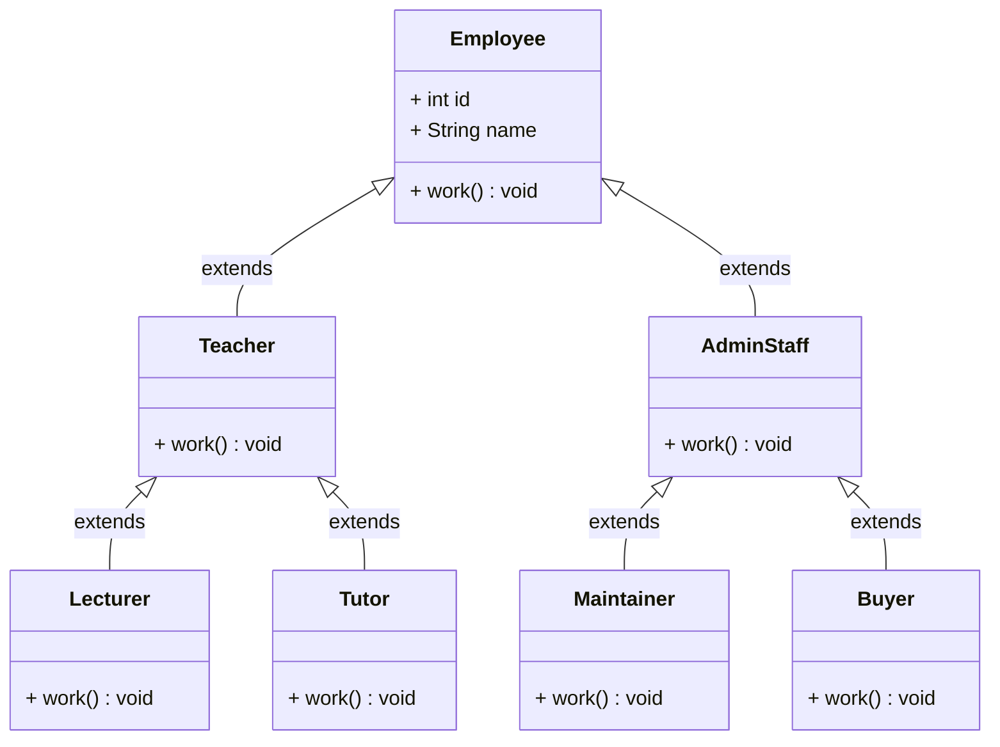
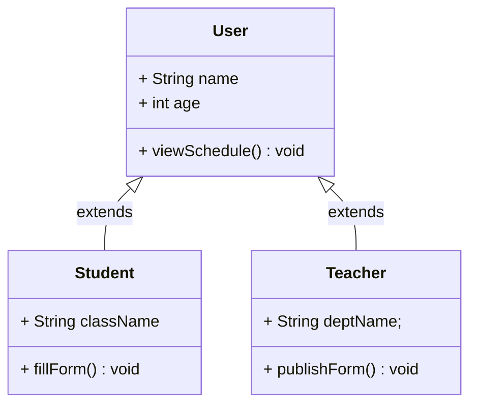
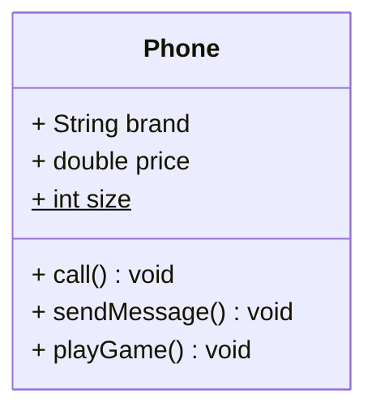
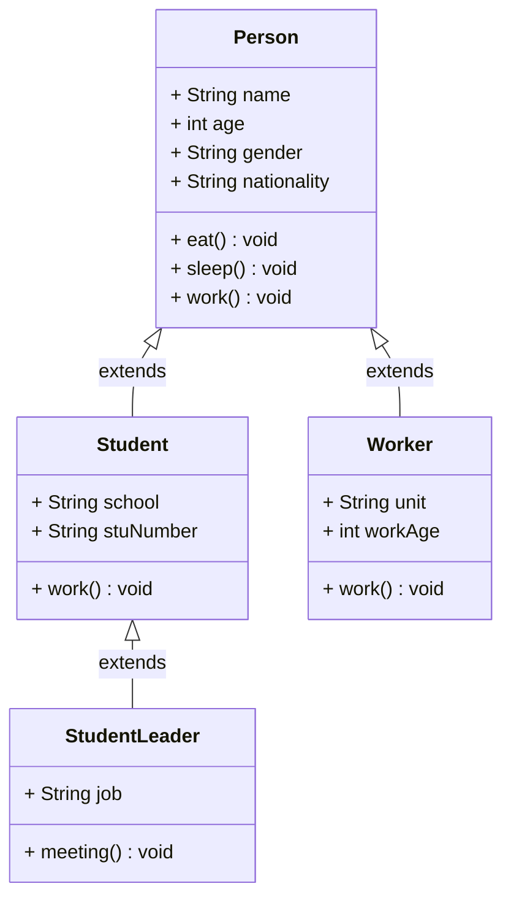
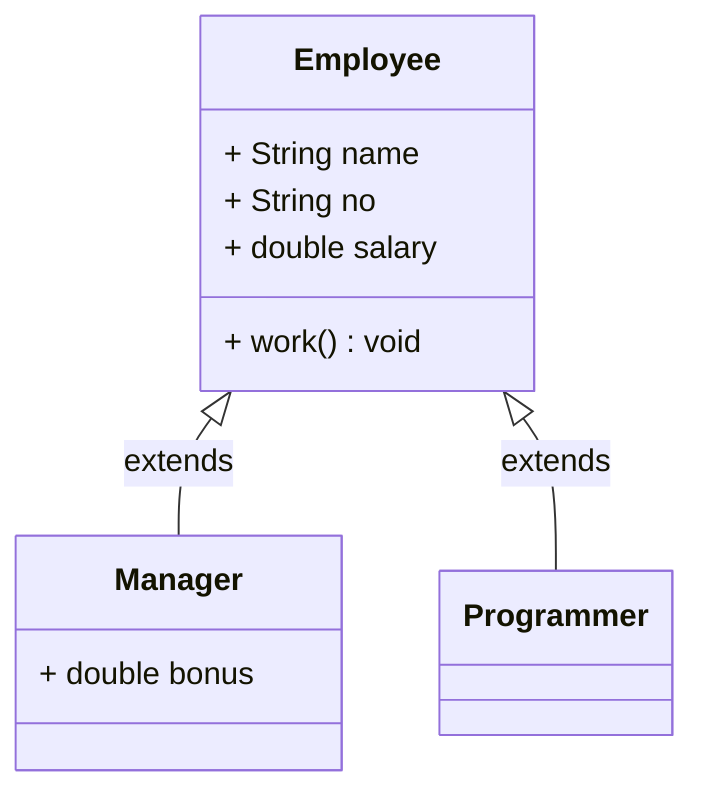

# 第一章：题目 1

## 1.1 概述

* 某大型教育集团有很多员工（Employee），根据工作内容的不同分为教研部员工（Teacher）和行政部员工（AdminStaff）。
* 其中，教研部根据教学的不同，教研部员工（Teacher）又分为讲师（Lecturer）和助教（Tutor）。
* 其中，行政部根据负责事项不同，行政部员工（AdminStaff）又分为维护专员（Maintainer）和采购专员（Buyer）。
* 其中，公司中的每一个员工都有自己编码、姓名和其负责的工作。
* 其中，公司中的每一个员工都有工作的功能；但是，具体的工作内容又不一样。

## 1.2 类图

* 其类继承体系设计，如下所示：



## 1.3 应用示例

* 示例：

::: code-group

```java [Employee.java]
public class Employee {

    private int id;

    private String name;

    public Employee() {}

    public Employee(int id, String name) {
        this.id = id;
        this.name = name;
    }

    public int getId() {
        return id;
    }

    public void setId(int id) {
        this.id = id;
    }

    public String getName() {
        return name;
    }

    public void setName(String name) {
        this.name = name;
    }

    /**
     * 工作
     */
    public void work() {
        System.out.println(this.name + "正在工作~");
    }

    @Override
    public String toString() {
        return "Employee{" + "id=" + id + ", name='" + name + '\'' + '}';
    }
}
```

```java [Teacher.java]
public class Teacher extends Employee {

    public Teacher() {}

    public Teacher(int id, String name) {
        super(id, name);
    }

    @Override
    public void work() {
        System.out.println(this.getName() + "正在教学~");
    }

    @Override
    public String toString() {
        return "Teacher{} " + super.toString();
    }
}

```

```java [AdminStaff.java]
public class AdminStaff extends Employee {

    public AdminStaff() {}

    public AdminStaff(int id, String name) {
        super(id, name);
    }

    @Override
    public void work() {
        System.out.println(this.getName() + "正在做行政工作~");
    }

    @Override
    public String toString() {
        return "AdminStaff{} " + super.toString();
    }
}
```

:::


* 示例：

::: code-group

```java [Lecturer.java]
public class Lecturer extends Teacher {

    public Lecturer() {}

    public Lecturer(int id, String name) {
        super(id, name);
    }

    @Override
    public void work() {
        System.out.println(this.getName() + "正在讲课，备课~");
    }

    @Override
    public String toString() {
        return "Lecturer{} " + super.toString();
    }
}
```

```java [Tutor.java]
public class Tutor extends Teacher {

    public Tutor() {}

    public Tutor(int id, String name) {
        super(id, name);
    }

    @Override
    public void work() {
        System.out.println(this.getName() + "正在辅导学生，批改作业~");
    }

    @Override
    public String toString() {
        return "Tutor{} " + super.toString();
    }
}
```

```java [Maintainer.java]
public class Maintainer extends AdminStaff {

    public Maintainer() {}

    public Maintainer(int id, String name) {
        super(id, name);
    }

    @Override
    public void work() {
        System.out.println(this.getName() + "正在设备维护，环境维护~");
    }

    @Override
    public String toString() {
        return "Maintainer{} " + super.toString();
    }
}
```

```java [Buyer.java]
public class Buyer extends AdminStaff {

    public Buyer() {}

    public Buyer(int id, String name) {
        super(id, name);
    }

    @Override
    public void work() {
        System.out.println(this.getName() + "采购教学用品，采购办公用品~");
    }

    @Override
    public String toString() {
        return "Buyer{} " + super.toString();
    }
}
```

```java [Test.java]
public class Test {
    public static void main(String[] args) {

        Lecturer lecturer = new Lecturer(1, "张三");
        lecturer.work();
        System.out.println("lecturer = " + lecturer);

        Tutor tutor = new Tutor(2, "李四");
        tutor.work();
        System.out.println("tutor = " + tutor);

        Maintainer maintainer = new Maintainer(3, "王五");
        maintainer.work();
        System.out.println("maintainer = " + maintainer);

        Buyer buyer = new Buyer(4, "赵六");
        buyer.work();
        System.out.println("buyer = " + buyer);
    }
}
```

:::


# 第二章：题目 2

## 2.1 概述

* 某大型教育集团的教学资源管理系统中，存在学生和老师角色。
* 其中，学生的属性和行为有：姓名、年龄、所在班级、查看课表（viewSchedule）、填写听课反馈（fillForm）。
* 其中，老师的属性和行为有：姓名、年龄、所在部门、查看课表（viewSchedule）、发布问题（publishForm）。

## 2.2 类图

* 其类继承体系设计，如下所示：



## 2.3 应用示例

* 示例：

::: code-group

```java [User.java]
public class User {

    private String name;

    private int age;

    public User() {}

    public User(String name, int age) {
        this.name = name;
        this.age = age;
    }

    public int getAge() {
        return age;
    }

    public void setAge(int age) {
        this.age = age;
    }

    public String getName() {
        return name;
    }

    public void setName(String name) {
        this.name = name;
    }

    /**
     * 查看课表
     */
    public void viewSchedule() {
        System.out.println(this.getName() + "正在查看课表~");
    }

    @Override
    public String toString() {
        return "User{" + "name='" + name + '\'' + ", age=" + age + '}';
    }
}

```

```java [Teacher.java]
public class Teacher extends User {

    private String deptName;

    public Teacher() {}

    public Teacher(String name, int age, String deptName) {
        super(name, age);
        this.deptName = deptName;
    }

    /**
     * 发布问题
     */
    public void publishForm() {
        System.out.println(this.getName() + "正在发布问题~");
    }

    @Override
    public String toString() {
        return "Teacher{" + "className='" + deptName + '\'' + "} " + super.toString();
    }
}
```

```java [Student.java]
public class Student extends User {

    private String className;

    public Student() {}

    public Student(String name, int age, String className) {
        super(name, age);
        this.className = className;
    }

    /**
     * 填写听课反馈
     */
    public void fillForm() {
        System.out.println(this.getName() + "正在填写听课反馈~");
    }

    @Override
    public String toString() {
        return "Student{" + "className='" + className + '\'' + "} " + super.toString();
    }
}
```

```java [Test.java]
public class Test {
    public static void main(String[] args){
        Teacher teacher = new Teacher("张三", 38, "数学部");
        teacher.publishForm();
        System.out.println("teacher = " + teacher);

        Student student = new Student("李四", 20, "一年级 1 班");
        student.fillForm();
        System.out.println("student = " + student);
    }
}
```

:::


# 第三章：题目 3

## 3.1 概述

* 通过代码描述手机类（Phone）以及在测试类中创建手机对象（phone）。
* 其中，手机类（Phone）的属性有：品牌（brand）、价格（price）。
* 其中，手机类（Phone）的行为有：打电话（call）、发短信（sendMessage）、玩游戏（playGame）。
* 其中，每个手机都有屏幕尺寸（size）属性，并且假设所有手机的屏幕尺寸都是 6 。

> [!NOTE]
>
> 可以将 size 定义为静态属性！！！

## 3.2 类图

* 其类继承体系设计，如下所示：



## 3.3 应用示例

* 示例：

::: code-group

```java [Phone.java]
public class Phone {

    public static int size;
    private String brand;
    private double price;

    public Phone() {}

    public Phone(String brand, double price) {
        this.brand = brand;
        this.price = price;
    }

    public String getBrand() {
        return brand;
    }

    public void setBrand(String brand) {
        this.brand = brand;
    }

    public double getPrice() {
        return price;
    }

    public void setPrice(double price) {
        this.price = price;
    }

    public void call() {
        System.out.println("打电话");
    }

    public void sendMessage() {
        System.out.println("发短信");
    }

    public void playGame() {
        System.out.println("玩游戏");
    }

    @Override
    public String toString() {
        return "Phone{" 
            + "brand='" + brand + '\'' 
            + ", price=" + price + '\'' 
            + ", size=" + size + '}';
    }
}
```

```java [Test.java]
public class Test {
    public static void main(String[] args) {
        Phone.size = 6;

        Phone iphone = new Phone("苹果14", 4999);
        iphone.call();
        iphone.sendMessage();
        iphone.playGame();
        System.out.println("iphone = " + iphone);

        Phone xiaomi = new Phone("小米6", 3999);
        xiaomi.call();
        xiaomi.sendMessage();
        xiaomi.playGame();
        System.out.println("xiaomi = " + xiaomi);
    }
}
```

:::


# 第四章：题目 4

## 4.1 概述

* 定义 Person 类，其中属性有：姓名（name）、性别（gender）、年龄（age）以及国籍（nationality），其中方法有：吃饭（eat）、睡觉（sleep）以及工作（work）。
* 定义 Student 类，继承 Person 类，增加属性：学校（school）和学号（stuNumber），并重写方法工作（work，学生的工作是学习)。
* 定义 StudentLeader 类，继承 Student 类，增加属性：职务（job），并增加方法：开会（meeting）。
* 定义 Worker 类，继承 Person 类，增加属性：单位（unit）和工龄（workAge），并重写方法工作（work，工人的工作是盖房子)。
* 编写测试类分别对上述 3 类具体人物进行测试。

## 4.2 类图

* 其类继承体系设计，如下所示：



## 4.3 应用示例

* 示例：

::: code-group

```java [Person.java]
public class Person {

    private String name;

    private int age;

    private String gender;

    private String nationality;

    public Person() {}

    public Person(String name, int age, String gender, String nationality) {
        this.name = name;
        this.age = age;
        this.gender = gender;
        this.nationality = nationality;
    }

    public void eat() {
        System.out.println("吃饭");
    }

    public void sleep() {
        System.out.println("睡觉");
    }

    public void work() {
        System.out.println("工作");
    }

    public String getName() {
        return name;
    }

    public void setName(String name) {
        this.name = name;
    }

    public int getAge() {
        return age;
    }

    public void setAge(int age) {
        this.age = age;
    }

    public String getGender() {
        return gender;
    }

    public void setGender(String gender) {
        this.gender = gender;
    }

    public String getNationality() {
        return nationality;
    }

    public void setNationality(String nationality) {
        this.nationality = nationality;
    }

    @Override
    public String toString() {
        return "Person{" + "name='"
                + name + '\'' + ", age="
                + age + ", gender='"
                + gender + '\'' + ", nationality='"
                + nationality + '\'' + '}';
    }
}
```

```java [Student.java]
public class Student extends Person {

    private String school;

    private String stuNumber;

    public Student() {}

    public Student(String name, int age, String gender, String nationality, String school, String stuNumber) {
        super(name, age, gender, nationality);
        this.school = school;
        this.stuNumber = stuNumber;
    }

    public String getSchool() {
        return school;
    }

    public void setSchool(String school) {
        this.school = school;
    }

    public String getStuNumber() {
        return stuNumber;
    }

    public void setStuNumber(String stuNumber) {
        this.stuNumber = stuNumber;
    }

    @Override
    public void work() {
        System.out.println("学生需要学习!");
    }

    @Override
    public String toString() {
        return "Student{" + "school='" + school + '\'' + ", stuNumber='" + stuNumber + '\'' + "} " + super.toString();
    }
}
```

```java [StudentLeader.java]
public class StudentLeader extends Student {

    private String job;

    public StudentLeader() {}

    public StudentLeader(
            String name, int age, String gender, String nationality, String school, String stuNumber, String job) {
        super(name, age, gender, nationality, school, stuNumber);
        this.job = job;
    }

    public void meeting() {
        System.out.println("学生干部喜欢开会!");
    }

    public String getJob() {
        return job;
    }

    public void setJob(String job) {
        this.job = job;
    }

    @Override
    public String toString() {
        return "StudentLeader{" + "job='" + job + '\'' + "} " + super.toString();
    }
}
```

```java [Worker.java]
public class Worker extends Person {

    private String unit;

    private int workAge;

    public Worker() {}

    public Worker(String name, int age, String gender, String nationality, String unit, int workAge) {
        super(name, age, gender, nationality);
        this.unit = unit;
        this.workAge = workAge;
    }

    public String getUnit() {
        return unit;
    }

    public void setUnit(String unit) {
        this.unit = unit;
    }

    public int getWorkAge() {
        return workAge;
    }

    public void setWorkAge(int workAge) {
        this.workAge = workAge;
    }

    @Override
    public void work() {
        System.out.println("工人的工作是盖房子!");
    }

    @Override
    public String toString() {
        return "Worker{" + "unit='" + unit + '\'' + ", workAge=" + workAge + "} " + super.toString();
    }
}
```

```java [Test.java]
public class Test {
    public static void main(String[] args) {
        Student student = new Student("张三", 8, "男", "中国", "北京小学", "001");
        student.eat();
        student.work();
        student.sleep();
        System.out.println("student = " + student);

        Worker worker = new Worker("李四", 29, "男", "中国", "某建筑公司", 3);
        worker.eat();
        worker.sleep();
        worker.work();
        System.out.println("worker = " + worker);

        StudentLeader studentLeader = new StudentLeader("王五", 9, "女", "中国", "北京小学", "001", "学生会主席");
        studentLeader.eat();
        studentLeader.work();
        studentLeader.sleep();
        studentLeader.meeting();
        System.out.println("studentLeader = " + studentLeader);
    }
}
```

:::


# 第五章：题目 5

## 5.1 概述

* 定义 Manager（项目经理类）， 其中属性有：姓名（name）、工号（no）、工资（salary）以及奖金（bonus），其中方法有：工作（work）。
* 定义 Programmer（程序员类），其中属性有：姓名（name）、工号（no）、工资（salary），其中方法有：工作（work）。
* 向上抽取一个父类，让这两个类都继承这个父类，共有的属性写在父类中，子类重写父类中的方法。
* 编写测试类分别对上述 2 类具体人物进行测试。

## 5.2 类图

* 其类继承体系设计，如下所示：



## 5.3 应用示例

* 示例：

::: code-group

```java [Employee.java]
public class Employee {

    private String name;

    private String no;

    private double salary;

    public Employee() {}

    public Employee(String no, String name, double salary) {
        this.no = no;
        this.name = name;
        this.salary = salary;
    }

    public String getName() {
        return name;
    }

    public void setName(String name) {
        this.name = name;
    }

    public String getNo() {
        return no;
    }

    public void setNo(String no) {
        this.no = no;
    }

    public double getSalary() {
        return salary;
    }

    public void setSalary(double salary) {
        this.salary = salary;
    }

    public void work() {
        System.out.println("工作");
    }

    @Override
    public String toString() {
        return "Employee{" + "name='" + name + '\'' + ", no='" + no + '\'' + ", salary=" + salary + '}';
    }
}
```

```java [Manager.java]
public class Manager extends Employee {

    private double bonus;

    public Manager() {}

    public Manager(String no, String name, double salary, double bonus) {
        super(no, name, salary);
        this.bonus = bonus;
    }

    public double getBonus() {
        return bonus;
    }

    public void setBonus(double bonus) {
        this.bonus = bonus;
    }

    @Override
    public void work() {
        System.out.println("项目经理在管理项目~");
    }

    @Override
    public String toString() {
        return "Manager{" + "bonus=" + bonus + "} " + super.toString();
    }
}
```

```java [Programmer.java]
public class Programmer extends Employee {

    public Programmer() {}

    public Programmer(String no, String name, double salary) {
        super(no, name, salary);
    }

    @Override
    public void work() {
        System.out.println("程序员在写代码~");
    }

    @Override
    public String toString() {
        return "Programmer{} " + super.toString();
    }
}
```

```java [Test.java]
public class Test {
    public static void main(String[] args){
        Manager manager = new Manager("001", "张三", 5000, 10000);
        manager.work();
        System.out.println("manager = " + manager);

        Programmer programmer = new Programmer("002","李四",4000);
        programmer.work();
        System.out.println("programmer = " + programmer);
    }
}
```

:::


