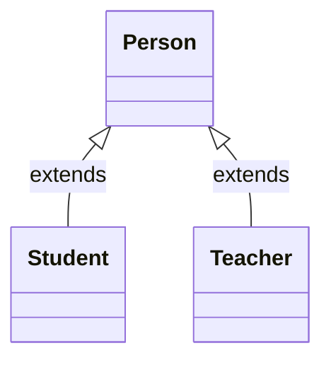
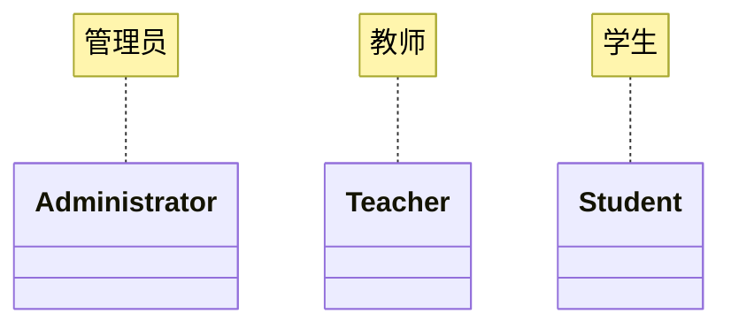
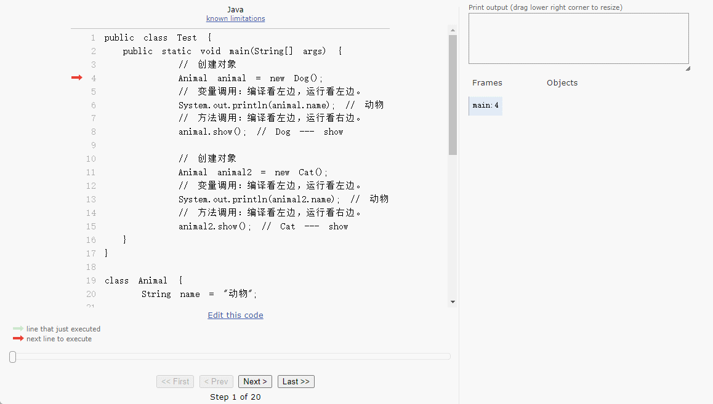
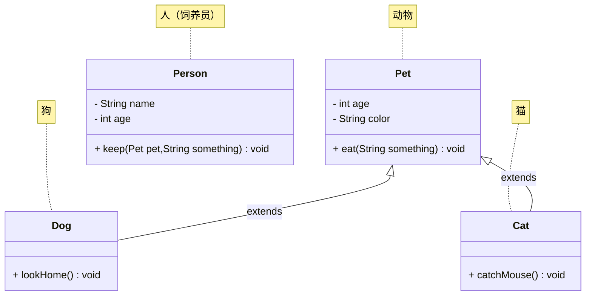

# 第一章：多态（⭐）

## 1.1 概述

### 1.1.1 引入

- 面向对象的三大特征：`封装`、`继承`和`多态`。之前，我们已经学习过了`封装`和`继承`，本次将学习`多态`。
- 所有的技术，都是为了解决问题而出现的，`多态`也不例外。
- 下面，我们将一起推导一下，`多态`为什么出现？

### 1.1.2 封装

* `封装就是对象代表什么，就得封装对应的数据，并提供数据对应的行为`。
* 有了封装之后，我们就可以将一些零散的数据以及对应的行为封装为一个整体，这个整体就是我们所说的对象，如下所示：


* 其代码实现，如下所示：

::: code-group

```java [Student.java]
public class Student {
    /**
     * 姓名
     */
    private String name;
    /**
     * 年龄
     */
    private int age;
    /**
     * 性别
     */
    private String gender;

    public Student() {}

    public Student(String name, int age, String gender) {
        this.name = name;
        this.age = age;
        this.gender = gender;
    }

    public String getName() {
        return name;
    }

    public void setName(String name) {
        this.name = name;
    }

    public int getAge() {
        return age;
    }

    public void setAge(int age) {
        this.age = age;
    }

    public String getGender() {
        return gender;
    }

    public void setGender(String gender) {
        this.gender = gender;
    }
    
    /**
     * 吃饭
     */
    public void eat() {
        System.out.println(this.name + "正在吃饭~");
    }

    /**
     * 睡觉
     */
    public void sleep() {
        System.out.println(this.name + "正在睡觉~");
    }

    @Override
    public String toString() {
        return "Student{" 
            + "name='" + name + '\'' 
            + ", age=" + age 
            + ", gender='" + gender 
            + '\'' + '}';
    }
}
```

```java {4-7} [StudentTest.java]
public class StudentTest {
    public static void main(String[] args) {

        Student s1 = new Student("张三", 18, "男");
        Student s2 = new Student("李四", 25, "女");
        Student s3 = new Student("王五", 30, "男");
        Student s4 = new Student("赵六", 35, "女");

    }
}
```

:::

* 以后我们面向的就是这个对象的整体，而不是一些零散的数据，如下所示：


* 其代码实现，如下所示：

::: code-group

```java [Student.java]
public class Student {
    /**
     * 姓名
     */
    private String name;
    /**
     * 年龄
     */
    private int age;
    /**
     * 性别
     */
    private String gender;

    public Student() {}

    public Student(String name, int age, String gender) {
        this.name = name;
        this.age = age;
        this.gender = gender;
    }

    public String getName() {
        return name;
    }

    public void setName(String name) {
        this.name = name;
    }

    public int getAge() {
        return age;
    }

    public void setAge(int age) {
        this.age = age;
    }

    public String getGender() {
        return gender;
    }

    public void setGender(String gender) {
        this.gender = gender;
    }
    
    /**
     * 吃饭
     */
    public void eat() {
        System.out.println(this.name + "正在吃饭~");
    }

    /**
     * 睡觉
     */
    public void sleep() {
        System.out.println(this.name + "正在睡觉~");
    }

    @Override
    public String toString() {
        return "Student{" 
            + "name='" + name + '\'' 
            + ", age=" + age 
            + ", gender='" + gender 
            + '\'' + '}';
    }
}
```

```java [StudentUtil.java]
public class StudentUtil {

    /**
    * 打印学生的信息
    */
    public static void printInfo(Student stu){
        System.out.println(stu.getName());
        System.out.println(stu.getAge());
        System.out.println(stu.getGender());
    }
}
```

:::

### 1.1.3 继承

- 如果类似的`JavaBean`也来越多，就会造成`代码膨胀`，如下所示：


* 其代码实现，如下所示：

::: code-group

```java [Student.java]
public class Student {
    /**
     * 姓名
     */
    private String name;
    /**
     * 年龄
     */
    private int age;
    /**
     * 性别
     */
    private String gender;

    public Student() {}

    public Student(String name, int age, String gender) {
        this.name = name;
        this.age = age;
        this.gender = gender;
    }

    public String getName() {
        return name;
    }

    public void setName(String name) {
        this.name = name;
    }

    public int getAge() {
        return age;
    }

    public void setAge(int age) {
        this.age = age;
    }

    public String getGender() {
        return gender;
    }

    public void setGender(String gender) {
        this.gender = gender;
    }

    /**
     * 吃饭
     */
    public void eat() {
        System.out.println(this.name + "正在吃饭~");
    }

    /**
     * 睡觉
     */
    public void sleep() {
        System.out.println(this.name + "正在睡觉~");
    }

    @Override
    public String toString() {
        return "Student{" 
            + "name='" + name + '\'' 
            + ", age=" + age 
            + ", gender='" + gender + '\'' + '}';
    }
}
```

```java [Teacher.java]
public class Teacher {
    /**
     * 姓名
     */
    private String name;
    /**
     * 年龄
     */
    private int age;
    /**
     * 性别
     */
    private String gender;

    public Student() {}

    public Student(String name, int age, String gender) {
        this.name = name;
        this.age = age;
        this.gender = gender;
    }

    public String getName() {
        return name;
    }

    public void setName(String name) {
        this.name = name;
    }

    public int getAge() {
        return age;
    }

    public void setAge(int age) {
        this.age = age;
    }

    public String getGender() {
        return gender;
    }

    public void setGender(String gender) {
        this.gender = gender;
    }

    /**
     * 吃饭
     */
    public void eat() {
        System.out.println(this.name + "正在吃饭~");
    }

    /**
     * 睡觉
     */
    public void sleep() {
        System.out.println(this.name + "正在睡觉~");
    }

    @Override
    public String toString() {
        return "Teacher{" 
            + "name='" + name + '\'' 
            + ", age=" + age 
            + ", gender='" + gender + '\'' + '}';
    }
}
```

```java [PersonUtil.java]
public class PersonUtil {

    /**
     * 打印学生的信息
     * @param stu 学生对象
     */
    public static void printInfo(Student stu) {
        System.out.println(stu.getName());
        System.out.println(stu.getAge());
        System.out.println(stu.getGender());
    }

    /**
     * 打印老师的信息
     * @param tea 老师对象
     */
    public static void printInfo(Teacher tea) {
        System.out.println(tea.getName());
        System.out.println(tea.getAge());
        System.out.println(tea.getGender());
    }
}

```

:::

* 此时，我们就可以将`相同的属性`和`相同的行为`抽取到一个`父类`中，`子类`只需要`继承`父类（子类可以有自己独有的属性和行为），如下所示：


* 其代码实现，如下所示：

::: code-group

```java [Person.java]
public class Person {
    /**
     * 姓名
     */
    private String name;
    /**
     * 年龄
     */
    private int age;
    /**
     * 性别
     */
    private String gender;

    public Person() {}

    public Person(String name, int age, String gender) {
        this.name = name;
        this.age = age;
        this.gender = gender;
    }

    public String getName() {
        return name;
    }

    public void setName(String name) {
        this.name = name;
    }

    public int getAge() {
        return age;
    }

    public void setAge(int age) {
        this.age = age;
    }

    public String getGender() {
        return gender;
    }

    public void setGender(String gender) {
        this.gender = gender;
    }

    public void eat() {
        System.out.println(this.name + "正在吃饭~");
    }

    public void sleep() {
        System.out.println(this.name + "正在睡觉~");
    }
}
```

```java [Student.java]
public class Student extends Person { // [!code highlight]

    private double score;

    public Student() {}

    public Student(String name, int age, String gender, double score) {
        super(name, age, gender);
        this.score = score;
    }

    public double getScore() {
        return score;
    }

    public void setScore(double score) {
        this.score = score;
    }

    @Override
    public String toString() {
        return "Student{} " + super.toString();
    }
}
```

```java [Teacher.java]
public class Teacher extends Person { // [!code highlight]

    private double salary;

    public Teacher() {}

    public Teacher(String name, int age, String gender, double salary) {
        super(name, age, gender);
        this.salary = salary;
    }

    public double getSalary() {
        return salary;
    }

    public void setSalary(double salary) {
        this.salary = salary;
    }

    @Override
    public String toString() {
        return "Teacher{" + "salary=" + salary + "} " + super.toString();
    }
}
```

```java [PersonUtil.java]
public class PersonUtil {

    /**
     * 打印人类的信息
     * @param p 人类对象
     */
    public static void printInfo(Person p) {
        System.out.println(p.getName());
        System.out.println(p.getAge());
        System.out.println(p.getGender());
    }

}
```

:::

### 1.1.4 多态

* 多态，从字面意思来看，就是指对象的多种形态，如下所示：



* 之前，我们创建对象是这样的，即：将 Student 对象赋值给 Student 类型的变量，如下所示：

```java
Student s = new Student(); // Student 对象是学生形态
```

* 有了多态之后，我们创建对象可以这样，即：将 Student 对象赋值给 Person 类型的变量，如下所示：

```java
Person p = new Student(); // Student 对象是人的形态
```

* 此时，学生对象就有了两种形态，如下所示：

```java
Student s = new Student(); // Student 对象是学生形态

Person p = new Student(); // Student 对象是人的形态
```

## 1.2 什么时候使用多态？

* 在实际生活中，我们经常会遇到各类管理系统，如：学生管理系统、教务管理系统等，如下所示：


* 在这些系统中，假设有三个角色，如下所示：



* 每一个角色在使用系统之前，都需要注册账号。而注册账号的功能，其实就对应了一个方法，并且注册的方法形参写什么类型比较好，如下所示：

```java
public class UserController {
    
    public void register(???){ // [!code focus]
        
        // 其余略，注册的业务逻辑
    }
    
}
```

* 如果我们将注册的方法写成 Student 类型，那么该方法就不能处理 Teacher 类型或 Administrator 类型，如下所示：

```java
public class UserController {
    
    public void register(Student stu){ // [!code focus]
        
        // 其余略，注册的业务逻辑
    }
    
}
```

* 如果我们将注册的方法写成 Teacher 类型，那么该方法就不能处理 Student 类型或 Administrator 类型，如下所示：

```java
public class UserController {
    
    public void register(Teacher tea){ // [!code focus]
        
        // 其余略，注册的业务逻辑
    }
    
}
```

* ...
* 如果要实现上述的需求，就需要写 3 个注册的重载方法，实现太臃肿了，如下所示：

```java
public class UserController {
    
    public void register(Student stu){ // [!code focus]
        
        // 其余略，注册的业务逻辑
    }
    public void register(Teacher tea){ // [!code focus]
        
        // 其余略，注册的业务逻辑
    }
    public void register(Administrator admin){ // [!code focus]
        
        // 其余略，注册的业务逻辑
    }
    
}
```

* 但是，这种设计方案并不优雅，可扩展性也比较差（现在需要增加一个辅导员的角色，我们只能再添加一个注册方法，会造成代码膨胀），如下所示：

```java
public class UserController {
    
    public void register(Student stu){ // [!code focus]
        
        // 其余略，注册的业务逻辑
    }
    public void register(Teacher tea){ // [!code focus]
        
        // 其余略，注册的业务逻辑
    }
    public void register(Administrator admin){ // [!code focus]
        
        // 其余略，注册的业务逻辑
    }
    public void register(Instructor instr){ // [!code focus]
        
        // 其余略，注册的业务逻辑
    }
    
}
```

* 其实，我们需要的是一个通用的注册方法，该方法既能接收老师，又能接收学生，还能接收其他角色，那么我们就将注册的形参设置为老师、学生和其他角色的父类 Person ，如下所示：

```java
public class UserController {
    
    public void register(Person p){ // [!code focus]
        
        // 其余略，注册的业务逻辑
    }
    
}
```

* 然后老师、学生以及其他学生继承 Person 类就可以了，如下所示：

::: code-group

```java [Teacher.java]
public class Teacher extends Person {}
```

```java [Student.java]
public class Student extends Person {}
```

```java [Student.java]
public class Administrator extends Person {}
```

```java [Instructor.java]
public class Instructor extends Person {}
```

:::

* 当注册老师、学生、管理员以及辅导员的时候，就非常方便，如下所示：

```java {3-7}
public class UserController {
    
    // Person p = new Teacher() 
    // Person p = new Student()
    // Person p = new Administrator()
    // Person p = new Instructor()
    public void register(Person p){ 
        
        // 其余略，注册的业务逻辑
    }
    
}
```

* 更重要的是，如果在 register 注册方法里面，我们用对象调用其他方法，只要子类重写了该方法，多态可以根据传递对象的不同，调用不同的重写方法，如下所示：

```java 
public class UserController {
    
    public void register(Person p){ 
        // 根据传递对象的不同，调用不同的 show 方法
        p.show(); // [!code highlight]
    }
    
}
```

## 1.3 多态

* 语法：

```java
父类类型 变量名 = 子类对象。
```

> [!NOTE]
>
> * ① 多态的概念：多态就是同种类型的对象，表现出不同的形态。
> * ② 多态的前提：
>   * 类之间要存在继承或实现关系。
>   * 父类引用指向子类对象，如：`Fu f = new Zi();`，父类引用就是等号左边父类类型的变量，指向就是 `=` 号，而子类对象就是等号右边 new 出来的对象。
>   * 需要有方法重写。
> * ③ 多态的好处：
>   * 使用父类型作为形参，可以接收所有子类对象。
>   * 体现了多态的扩展性和可维护性。


* 示例：

::: code-group

```java [Person.java]
public class Person {

    private String name;

    private int age;

    public Person() {}

    public Person(String name, int age) {
        this.name = name;
        this.age = age;
    }

    public void show() {
        System.out.println(this.getName() + "，" + this.getAge());
    }

    public String getName() {
        return name;
    }

    public void setName(String name) {
        this.name = name;
    }

    public int getAge() {
        return age;
    }

    public void setAge(int age) {
        this.age = age;
    }
}
```

```java [Student.java]
public class Student extends Person {

    public Student() {}

    public Student(String name, int age) {
        super(name, age);
    }

    @Override
    public void show() {
        System.out.println("学生的信息为：" + this.getName() + "，" + this.getAge());
    }
}
```

```java [Teacher.java]
public class Teacher extends Person {

    public Teacher() {}

    public Teacher(String name, int age) {
        super(name, age);
    }

    @Override
    public void show() {
        System.out.println("老师的信息为：" + this.getName() + "，" + this.getAge());
    }
}
```

```java [Administrator.java]
public class Administrator extends Person {

    public Administrator() {}

    public Administrator(String name, int age) {
        super(name, age);
    }

    @Override
    public void show() {
        System.out.println("管理员的信息为：" + this.getName() + "，" + this.getAge());
    }
}
```

```java [Test.java]
public class Test {
    public static void main(String[] args) {

        register(new Student("张三", 18));
        register(new Teacher("王建国", 50));
        register(new Administrator("管理员", 19));
    }

    /**
     * 注册的方法
     * @param p Person 实例
     */
    public static void register(Person p) {
        p.show();
    }
}
```

:::

## 1.4 多态调用成员的特点

### 1.4.1 概述

* 变量调用：编译看左边，运行看左边。

> [!NOTE]
>
> * ① 编译看左边：javac 编译代码的时候，会看左边的父类中有没有这个变量？如果有，编译成功；如果没有，编译失败。
> * ② 运行看左边：java 运行代码的时候，实际获取的是左边父类成员变量的值。

* 方法调用：编译看左边，运行看右边。

> [!NOTE]
>
> * ① 编译看左边：javac 编译代码的时候，会看左边的父类中有没有这个方法？如果有，编译成功；如果没有，编译失败。
> * ② 运行看右边：java 运行代码的时候，实际运行的是右边子类重写的成员方法。

### 1.4.2 如何理解？

* 假设代码是这样的，如下所示：

::: code-group

```java [Animal.java]
public class Animal {
    
    String name = "动物";

    public void show() {
        System.out.println("Animal --- show");
    }
}
```

```java [Dog.java]
public class Dog extends Animal {

    String name = "狗";

    @Override
    public void show() {
        System.out.println("Dog --- show");
    }
}
```

```java [Cat.java]
public class Cat extends Animal {

    String name = "猫";

    @Override
    public void show() {
        System.out.println("Cat --- show");
    }
}
```

```java [Test.java]
public class Test {
    public static void main(String[] args) {
        // 创建对象
        Animal animal = new Dog();
        // 变量调用：编译看左边，运行看左边。
        System.out.println(animal.name); // 动物
        // 方法调用：编译看左边，运行看右边。
        animal.show(); // Dog --- show

        // 创建对象
        Animal animal2 = new Cat();
        // 变量调用：编译看左边，运行看左边。
        System.out.println(animal2.name); // 动物
        // 方法调用：编译看左边，运行看右边。
        animal2.show(); // Cat --- show
    }
}
```

:::

* 对于多态，如下所示：

```java
Animal animal = new Dog();
```

* 那么，现在通过 animal 调用变量和方法，而 animal 是 Animal 类型的，默认会从 Animal 这个类中寻找。
* 对于成员变量，在子类对象中，会将父类的成员变量也继承下来；换言之，子类对象中，有`父：name` 和 `子：name`，而 animal 的类型是父类型 Animal ，所以 animal.name 当然获取的是父类的 name。

> [!NOTE]
>
> ::: details 点我查看 借助 JOL 工具查看对象信息
>
> ```java {14} [Test.java]
> public class Test {
>     public static void main(String[] args) {
>         // 创建对象
>         Animal animal = new Dog();
>         System.out.println(animal.name); // 动物
>         animal.show(); // Dog --- show
> 
>         // 创建对象
>         Animal animal2 = new Cat();
>         System.out.println(animal2.name); // 动物
>         animal2.show(); // Cat --- show
> 
>         // 将对象在内存中的结构打印出来
>         System.out.println(ClassLayout.parseInstance(animal).toPrintable());
>     }
> }
> ```
>
> ```txt {10-11} [cmd 控制台]
> 动物
> Dog --- show
> 动物
> Cat --- show
> # WARNING: Unable to get Instrumentation. Dynamic Attach failed. You may add this JAR as -javaagent manually, or supply -Djdk.attach.allowAttachSelf
> com.github.demo2.Dog object internals:
> OFF  SZ               TYPE DESCRIPTION               VALUE
>   0   8                    (object header: mark)     0x0000000000000001 (non-biasable; age: 0)
>   8   4                    (object header: class)    0x01001410
>  12   4   java.lang.String Animal.name               (object)
>  16   4   java.lang.String Dog.name                  (object)
>  20   4                    (object alignment gap)    
> Instance size: 24 bytes
> Space losses: 0 bytes internal + 4 bytes external = 4 bytes total
> ```
>
> :::

* 对于成员方法，如果子类对方法进行了重写，本质上就是对虚方法表中继承父类的方法进行了覆盖，当调用 animal.show() 的时候，当然调用的是子类重写的方法。

### 1.4.3 演示

* 假设代码是这样的，如下所示：

::: code-group

```java [Animal.java]
public class Animal {
    
    String name = "动物";

    public void show() {
        System.out.println("Animal --- show");
    }
}
```

```java [Dog.java]
public class Dog extends Animal {

    String name = "狗";

    @Override
    public void show() {
        System.out.println("Dog --- show");
    }
}
```

```java [Cat.java]
public class Cat extends Animal {

    String name = "猫";

    @Override
    public void show() {
        System.out.println("Cat --- show");
    }
}
```

```java [Test.java]
public class Test {
    public static void main(String[] args) {
        // 创建对象
        Animal animal = new Dog();
        // 变量调用：编译看左边，运行看左边。
        System.out.println(animal.name); // 动物
        // 方法调用：编译看左边，运行看右边。
        animal.show(); // Dog --- show

        // 创建对象
        Animal animal2 = new Cat();
        // 变量调用：编译看左边，运行看左边。
        System.out.println(animal2.name); // 动物
        // 方法调用：编译看左边，运行看右边。
        animal2.show(); // Cat --- show
    }
}
```

:::

* 其内存动态图，如下所示：



* 其完整内存动态图，如下所示：


## 1.5 多态的优势

* ① 在多态的形式下，右边对象可以实现解耦合，便于扩展和维护。

```java {1}
Person p = new Student(); // 之后需求发生变更，变为 new Teacher(); 

p.work(); // 业务逻辑发生改变的时候，后续代码无需修改
```

* ② 定义方法的时候，使用父类型作为参数，可以接收所有子类对象，体现多态的扩展性和可维护性。

::: code-group

```java [Animal.java]
public class Animal {
    
    String name = "动物";

    public void show() {
        System.out.println("Animal --- show");
    }
}
```

```java [Dog.java]
public class Dog extends Animal {

    String name = "狗";

    @Override
    public void show() {
        System.out.println("Dog --- show");
    }
}
```

```java [Cat.java]
public class Cat extends Animal {

    String name = "猫";

    @Override
    public void show() {
        System.out.println("Cat --- show");
    }
}
```

```java {7-9} [Test.java]
public class Test {
    public static void main(String[] args) {
        show(new Dog());
        show(new Cat());
    }

    public static void show(Animal animal) {
        animal.show();
    }
}
```

:::

## 1.6 多态的弊端

### 1.6.1 概述

* 不能调用子类的特有功能。


* 示例：

::: code-group

```java [Animal.java]
public class Animal {

    public void eat() {
        System.out.println("动物吃东西");
    }
}
```

```java [Dog.java]
public class Dog extends Animal {
    @Override
    public void eat() {
        System.out.println("狗吃骨头");
    }

    public void lookHome() {
        System.out.println("狗看家");
    }
}
```

```java [Cat.java]
public class Cat extends Animal {

    @Override
    public void eat() {
        System.out.println("猫吃鱼");
    }

    public void catchMouse() {
        System.out.println("猫抓老鼠");
    }
}
```

```java {7-9} [Test.java]
public class Test {
    public static void main(String[] args) {
        Animal animal = new Dog();
        animal.eat();

        // ❌ 以下代码是错误的
        // 不能调用子类特有的功能
        // 当调用成员方法的时候，编译看左边，运行看右边
        // 当编译的时候，会先检查左边的父类中有没有这个方法；如果没有，直接编译失败
        animal.lookHome(); // [!code error]
    }
}
```

:::

### 1.6.2 解决方案

* 使用`强制类型转换`将`父类型引用`转换真正的`子数据类型`，从而解决多态不能调用子类独有功能的弊端。
* 语法：

```java
子类数据类型 对象名 = (子类数据类型)父类引用。
```


* 示例：强制类型转换

::: code-group

```java [Animal.java]
public class Animal {

    public void eat() {
        System.out.println("动物吃东西");
    }
}
```

```java [Dog.java]
public class Dog extends Animal {
    @Override
    public void eat() {
        System.out.println("狗吃骨头");
    }

    public void lookHome() {
        System.out.println("狗看家");
    }
}
```

```java [Cat.java]
public class Cat extends Animal {

    @Override
    public void eat() {
        System.out.println("猫吃鱼");
    }

    public void catchMouse() {
        System.out.println("猫抓老鼠");
    }
}
```

```java  [Test.java]
public class Test {
    public static void main(String[] args) {
        Animal animal = new Dog();
        animal.eat();

        // ❌ 以下代码是错误的
        // 不能调用子类特有的功能
        // 当调用成员方法的时候，编译看左边，运行看右边
        // 当编译的时候，会先检查左边的父类中有没有这个方法；如果没有，直接编译失败
        // animal.lookHome();
        
        // animal 实际的类型是 Dog ，再强制转换为 Dog 就可以了
        // 细节：转换的时候不能瞎转，如果转成其他类型，就会运行失败
        Dog dog = (Dog)animal; // [!code highlight]
        dog.lookHome();
    }
}
```

:::

### 1.6.3 终究方案

* 可以使用 instanceof 关键字解决转换类型和真实对象类型不一致问题。
* 语法：

```java
if(父类型引用 instanceof 子数据类型 子类型引用) {
    ...
}
```


* 示例：

::: code-group

```java [Animal.java]
public class Animal {

    public void eat() {
        System.out.println("动物吃东西");
    }
}
```

```java [Dog.java]
public class Dog extends Animal {
    @Override
    public void eat() {
        System.out.println("狗吃骨头");
    }

    public void lookHome() {
        System.out.println("狗看家");
    }
}
```

```java [Cat.java]
public class Cat extends Animal {

    @Override
    public void eat() {
        System.out.println("猫吃鱼");
    }

    public void catchMouse() {
        System.out.println("猫抓老鼠");
    }
}
```

```java {13,15} [Test.java]
public class Test {
    public static void main(String[] args) {
        Animal animal = new Dog();
        animal.eat();

        // 不能调用子类特有的功能
        // 当调用成员方法的时候，编译看左边，运行看右边
        // 当编译的时候，会先检查左边的父类中有没有这个方法；如果没有，直接编译失败
        // animal.lookHome();

        // animal 实际的类型是 Dog ，再强制转换为 Dog 就可以了
        // 可以使用 instanceof 来避免强制类型转换可能会出现的错误
        if (animal instanceof Dog dog) {
            dog.lookHome();
        } else if (animal instanceof Cat cat) {
            cat.catchMouse();
        }
    }
}
```

:::

## 1.7 应用示例

* 需求：定义狗类、猫类以及人类，并写对应的测试方法。




* 示例：

::: code-group

```java [Pet.java]
public class Pet {

    private int age;

    private String color;

    public Pet() {}

    public Pet(int age, String color) {
        this.age = age;
        this.color = color;
    }

    public void eat(String something) {
        System.out.println("吃" + something);
    }

    public int getAge() {
        return age;
    }

    public void setAge(int age) {
        this.age = age;
    }

    public String getColor() {
        return color;
    }

    public void setColor(String color) {
        this.color = color;
    }

}
```

```java [Cat.java]
public class Cat extends Pet {

    public Cat() {}

    public Cat(int age, String color) {
        super(age, color);
    }

    public void catchMouse() {
        System.out.printf("%d岁的%s的猫抓老鼠\n", this.getAge(), this.getColor());
    }

    @Override
    public void eat(String something) {
        System.out.printf("%d岁的%s的猫眯着眼睛侧着头吃%s\n", this.getAge(), this.getColor(), something);
    }
}
```

```java [Dog.java]
public class Dog extends Pet {

    public Dog() {}

    public Dog(int age, String color) {
        super(age, color);
    }

    public void lookHome() {
        System.out.printf("%d岁的%s的狗看家\n", this.getAge(), this.getColor());
    }

    @Override
    public void eat(String something) {
        System.out.printf("%d岁的%s的狗两只前腿死死的抱住%s猛吃\n", this.getAge(), this.getColor(), something);
    }
}
```

```java [Person.java]
public class Person {
    private String name;

    private int age;

    public Person() {}

    public Person(String name, int age) {
        this.name = name;
        this.age = age;
    }

    public String getName() {
        return name;
    }

    public void setName(String name) {
        this.name = name;
    }

    public int getAge() {
        return age;
    }

    public void setAge(int age) {
        this.age = age;
    }

    public void keep(Pet pet, String something) {
        System.out.printf("年龄为%d的%s养了一只", this.getAge(), this.getName());
        if (pet instanceof Cat cat) {
            System.out.printf("%s的%d岁的猫\n", cat.getColor(), cat.getAge());
            pet.eat(something);
            cat.catchMouse();
        } else if (pet instanceof Dog dog) {
            System.out.printf("%s的%d岁的狗\n", dog.getColor(), dog.getAge());
            pet.eat(something);
            dog.lookHome();
        }
        System.out.println();
    }
}
```

```java [Test.java]
public class Test {
    public static void main(String[] args) {
        Person person = new Person("老王", 30);
        person.keep(new Dog(2, "黑颜色"), "骨头");

        Person person2 = new Person("老李", 25);
        person2.keep(new Cat(3, "灰颜色"), "鱼");
    }
}
```

```txt [cmd 控制台]
年龄为30的老王养了一只黑颜色的2岁的狗
2岁的黑颜色的狗两只前腿死死的抱住骨头猛吃
2岁的黑颜色的狗看家

年龄为25的老李养了一只灰颜色的3岁的猫
3岁的灰颜色的猫眯着眼睛侧着头吃鱼
3岁的灰颜色的猫抓老鼠
```

:::


# 第二章：包、final（⭐）

## 2.1 包

### 2.1.1 概述

* 在 java 中，包（package）就是文件夹，就是用来管理各种不同功能的 Java 类，方便后期代码维护。

### 2.1.2 包名的规则

* `公司域名反写+ 包的作用`，需要全部英文小写，见名知意。


* 示例：

```java
package com.github.demo1; 
```

### 2.1.3 全类名

* 在使用的时候，我们需要使用`包名.类名`的形式，即：全类名（全限定名）。


* 示例：

```java
package com.github.demo2; 

public class Test {
    public static void main(String[] args) {

        register(new Student("张三", 18));

    }

    /**
     * 注册的方法
     * @param p Person 实例
     */
    public static void register(com.github.demo1.Person p) { // [!code highlight]
        p.show();
    }
}
```

### 2.1.4 import

* 使用全类名的方式实在太繁琐了，于是 Java 提供了`import 包名.类名`的方式来简化书写。在类中，就可以使用类名而不是全限定名。
* 语法：

```java
import 包名.类名;
```

> [!CAUTION]
>
> * ① 如果导入包中的多个类，可以使用 `*` 简化书写，如：`import java.util.*;`。
> * ② 并不是所有的情况都需要导入，规则如下：
>   * 使用同一个包中的类时，不需要导包。
>   * 使用`java.lang`中的类时，不需要导包。
>   * 如果同时使用两个包中的同名类，需要使用全限定名。
>   * 其它情况都需要导包。
> * ③ 在实际开发中，我们都是写类名，让 IDEA 自动帮助我们导包。


* 示例：

```java
package com.github.demo2;

import com.github.demo1.Person; // [!code highlight]

public class Test {
    public static void main(String[] args) {

        register(new Student("张三", 18));

    }

    /**
     * 注册的方法
     * @param p Person 实例
     */
    public static void register(Person p) { // [!code highlight]
        p.show();
    }
}
```

## 2.2 final

### 2.2.1 概述

* `final`翻译为中文就是`最终的`，一旦在代码中使用 final 进行修饰，就表示最终的，不可被改变的。
* `final`可以修饰`方法`、`类`和`变量`。

### 2.2.2 final 修饰方法

* 如果使用 final 修饰某个方法，则表示该方法是最终方法，不可以被重写。


* 示例：正例

::: code-group

```java [Fu.java]
package com.github.demo4;

public class Fu {

    public void show() {
        System.out.println("Fu --- show");
    }
}
```

```java [Zi.java]
package com.github.demo4;

public class Zi extends Fu {

    // ✅ 以下代码是正确的
    @Override
    public void show() { // [!code highlight]
        System.out.println("Zi --- show");
    }
}
```

:::


* 示例：反例

::: code-group

```java [Fu.java]
package com.github.demo4;

public class Fu {

    public void show() {
        System.out.println("Fu --- show");
    }
}
```

```java [Zi.java]
package com.github.demo4;

public class Zi extends Fu {

    // ❌ 以下代码是错误的
    @Override
    public void show() { // [!code error]
        System.out.println("Zi --- show");
    }
}
```

:::

### 2.2.3 final 修饰类

* 如果使用 final 修饰某个类，则表示该类是最终类，不可以被继承。


* 示例：正例

::: code-group

```java [Fu.java]
package com.github.demo4;

public class Fu {
	
}
```

```java [Zi.java]
package com.github.demo4;

// ✅ 以下代码是正确的
public class Zi extends Fu { // [!code highlight]
	
}
```

:::


* 示例：反例

::: code-group

```java [Fu.java]
package com.github.demo4;

public final class Fu {
	
}
```

```java [Zi.java]
package com.github.demo4;

// ❌ 以下代码是错误的
public class Zi extends Fu { // [!code error]
	
}
```

:::

### 2.2.4 final 修饰变量

* 如果使用 final 修饰某个变量（常量），则表示该常量只能被赋值一次。

> [!CAUTION]
>
> * ① 在实际开发中，常量通常作为系统的配置信息，方便维护，提高可读性。
> * ② 常量的命名规范 --- 大驼峰，即：`XXXX_XXXX` ，如：`PI`，`MAX_VALUE` 等。
> * ③ 如果`final`修饰的变量是基本数据类型，那么变量存储的`数据值`是不能发生改变的。
> * ④ 如果`final`修饰的变量是引用数据类型，那么变量存储的`地址值`是不能发生改变的，对象内部是可以发生改变的。


* 示例：正例

```java [Fu.java]
package com.github.demo4;

public class Test {
    public static void main(String[] args) {
       final int num = 10;
       // ✅ 以下代码是正确的
       System.out.println("num = " + num); // [!code highlight]
    }
}
```


* 示例：反例

```java [Zi.java]
package com.github.demo4;

public class Test {
    public static void main(String[] args) {
       final int num = 10;
       System.out.println("num = " + num);
       // ❌ 以下代码是错误的
       num = 20; // [!code error]
    }
}
```


# 第三章：权限修饰符、代码块（⭐）


