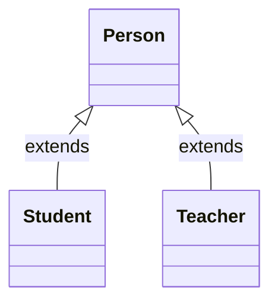
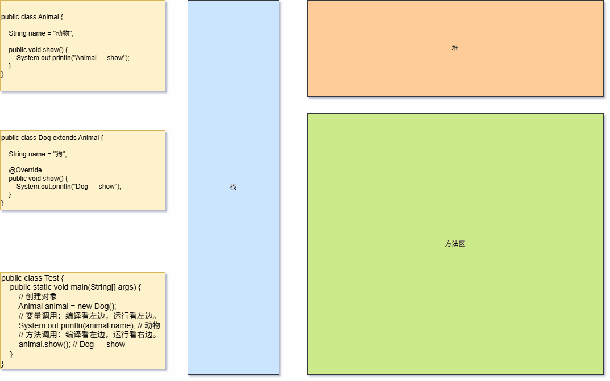
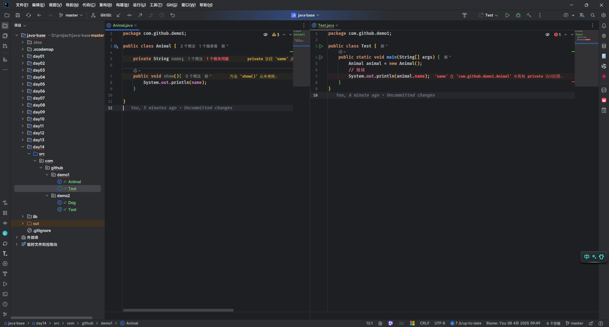
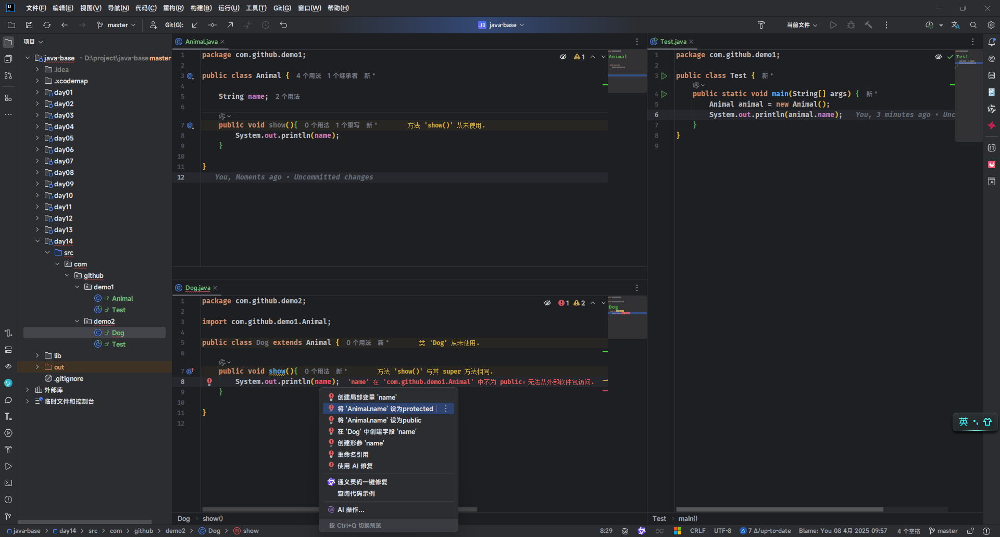
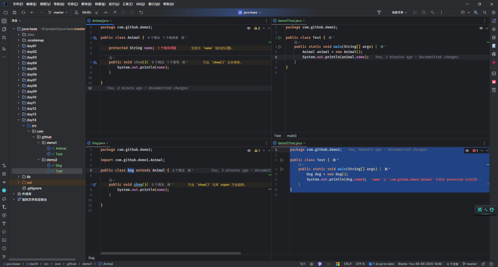
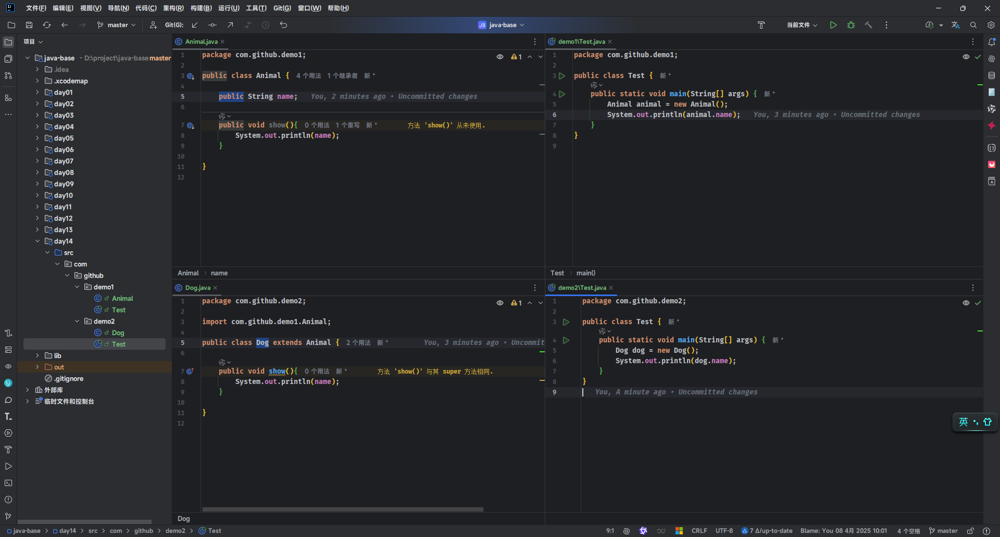

# 第一章：多态（⭐）

## 1.1 概述

### 1.1.1 引入

- 面向对象的三大特征：`封装`、`继承`和`多态`。之前，我们已经学习过了`封装`和`继承`，本次将学习`多态`。
- 所有的技术，都是为了解决问题而出现的，`多态`也不例外。
- 下面，我们将一起推导一下，`多态`为什么出现？

### 1.1.2 封装

* `封装就是对象代表什么，就得封装对应的数据，并提供数据对应的行为`。
* 有了封装之后，我们就可以将一些零散的数据以及对应的行为封装为一个整体，这个整体就是我们所说的对象，如下所示：


* 其代码实现，如下所示：

::: code-group

```java [Student.java]
public class Student {
    /**
     * 姓名
     */
    private String name;
    /**
     * 年龄
     */
    private int age;
    /**
     * 性别
     */
    private String gender;

    public Student() {}

    public Student(String name, int age, String gender) {
        this.name = name;
        this.age = age;
        this.gender = gender;
    }

    public String getName() {
        return name;
    }

    public void setName(String name) {
        this.name = name;
    }

    public int getAge() {
        return age;
    }

    public void setAge(int age) {
        this.age = age;
    }

    public String getGender() {
        return gender;
    }

    public void setGender(String gender) {
        this.gender = gender;
    }
    
    /**
     * 吃饭
     */
    public void eat() {
        System.out.println(this.name + "正在吃饭~");
    }

    /**
     * 睡觉
     */
    public void sleep() {
        System.out.println(this.name + "正在睡觉~");
    }

    @Override
    public String toString() {
        return "Student{" 
            + "name='" + name + '\'' 
            + ", age=" + age 
            + ", gender='" + gender 
            + '\'' + '}';
    }
}
```

```java {4-7} [StudentTest.java]
public class StudentTest {
    public static void main(String[] args) {

        Student s1 = new Student("张三", 18, "男");
        Student s2 = new Student("李四", 25, "女");
        Student s3 = new Student("王五", 30, "男");
        Student s4 = new Student("赵六", 35, "女");

    }
}
```

:::

* 以后我们面向的就是这个对象的整体，而不是一些零散的数据，如下所示：


* 其代码实现，如下所示：

::: code-group

```java [Student.java]
public class Student {
    /**
     * 姓名
     */
    private String name;
    /**
     * 年龄
     */
    private int age;
    /**
     * 性别
     */
    private String gender;

    public Student() {}

    public Student(String name, int age, String gender) {
        this.name = name;
        this.age = age;
        this.gender = gender;
    }

    public String getName() {
        return name;
    }

    public void setName(String name) {
        this.name = name;
    }

    public int getAge() {
        return age;
    }

    public void setAge(int age) {
        this.age = age;
    }

    public String getGender() {
        return gender;
    }

    public void setGender(String gender) {
        this.gender = gender;
    }
    
    /**
     * 吃饭
     */
    public void eat() {
        System.out.println(this.name + "正在吃饭~");
    }

    /**
     * 睡觉
     */
    public void sleep() {
        System.out.println(this.name + "正在睡觉~");
    }

    @Override
    public String toString() {
        return "Student{" 
            + "name='" + name + '\'' 
            + ", age=" + age 
            + ", gender='" + gender 
            + '\'' + '}';
    }
}
```

```java [StudentUtil.java]
public class StudentUtil {

    /**
    * 打印学生的信息
    */
    public static void printInfo(Student stu){
        System.out.println(stu.getName());
        System.out.println(stu.getAge());
        System.out.println(stu.getGender());
    }
}
```

:::

### 1.1.3 继承

- 如果类似的`JavaBean`也来越多，就会造成`代码膨胀`，如下所示：


* 其代码实现，如下所示：

::: code-group

```java [Student.java]
public class Student {
    /**
     * 姓名
     */
    private String name;
    /**
     * 年龄
     */
    private int age;
    /**
     * 性别
     */
    private String gender;

    public Student() {}

    public Student(String name, int age, String gender) {
        this.name = name;
        this.age = age;
        this.gender = gender;
    }

    public String getName() {
        return name;
    }

    public void setName(String name) {
        this.name = name;
    }

    public int getAge() {
        return age;
    }

    public void setAge(int age) {
        this.age = age;
    }

    public String getGender() {
        return gender;
    }

    public void setGender(String gender) {
        this.gender = gender;
    }

    /**
     * 吃饭
     */
    public void eat() {
        System.out.println(this.name + "正在吃饭~");
    }

    /**
     * 睡觉
     */
    public void sleep() {
        System.out.println(this.name + "正在睡觉~");
    }

    @Override
    public String toString() {
        return "Student{" 
            + "name='" + name + '\'' 
            + ", age=" + age 
            + ", gender='" + gender + '\'' + '}';
    }
}
```

```java [Teacher.java]
public class Teacher {
    /**
     * 姓名
     */
    private String name;
    /**
     * 年龄
     */
    private int age;
    /**
     * 性别
     */
    private String gender;

    public Student() {}

    public Student(String name, int age, String gender) {
        this.name = name;
        this.age = age;
        this.gender = gender;
    }

    public String getName() {
        return name;
    }

    public void setName(String name) {
        this.name = name;
    }

    public int getAge() {
        return age;
    }

    public void setAge(int age) {
        this.age = age;
    }

    public String getGender() {
        return gender;
    }

    public void setGender(String gender) {
        this.gender = gender;
    }

    /**
     * 吃饭
     */
    public void eat() {
        System.out.println(this.name + "正在吃饭~");
    }

    /**
     * 睡觉
     */
    public void sleep() {
        System.out.println(this.name + "正在睡觉~");
    }

    @Override
    public String toString() {
        return "Teacher{" 
            + "name='" + name + '\'' 
            + ", age=" + age 
            + ", gender='" + gender + '\'' + '}';
    }
}
```

```java [PersonUtil.java]
public class PersonUtil {

    /**
     * 打印学生的信息
     * @param stu 学生对象
     */
    public static void printInfo(Student stu) {
        System.out.println(stu.getName());
        System.out.println(stu.getAge());
        System.out.println(stu.getGender());
    }

    /**
     * 打印老师的信息
     * @param tea 老师对象
     */
    public static void printInfo(Teacher tea) {
        System.out.println(tea.getName());
        System.out.println(tea.getAge());
        System.out.println(tea.getGender());
    }
}

```

:::

* 此时，我们就可以将`相同的属性`和`相同的行为`抽取到一个`父类`中，`子类`只需要`继承`父类（子类可以有自己独有的属性和行为），如下所示：


* 其代码实现，如下所示：

::: code-group

```java [Person.java]
public class Person {
    /**
     * 姓名
     */
    private String name;
    /**
     * 年龄
     */
    private int age;
    /**
     * 性别
     */
    private String gender;

    public Person() {}

    public Person(String name, int age, String gender) {
        this.name = name;
        this.age = age;
        this.gender = gender;
    }

    public String getName() {
        return name;
    }

    public void setName(String name) {
        this.name = name;
    }

    public int getAge() {
        return age;
    }

    public void setAge(int age) {
        this.age = age;
    }

    public String getGender() {
        return gender;
    }

    public void setGender(String gender) {
        this.gender = gender;
    }

    public void eat() {
        System.out.println(this.name + "正在吃饭~");
    }

    public void sleep() {
        System.out.println(this.name + "正在睡觉~");
    }
}
```

```java [Student.java]
public class Student extends Person { // [!code highlight]

    private double score;

    public Student() {}

    public Student(String name, int age, String gender, double score) {
        super(name, age, gender);
        this.score = score;
    }

    public double getScore() {
        return score;
    }

    public void setScore(double score) {
        this.score = score;
    }

    @Override
    public String toString() {
        return "Student{} " + super.toString();
    }
}
```

```java [Teacher.java]
public class Teacher extends Person { // [!code highlight]

    private double salary;

    public Teacher() {}

    public Teacher(String name, int age, String gender, double salary) {
        super(name, age, gender);
        this.salary = salary;
    }

    public double getSalary() {
        return salary;
    }

    public void setSalary(double salary) {
        this.salary = salary;
    }

    @Override
    public String toString() {
        return "Teacher{" + "salary=" + salary + "} " + super.toString();
    }
}
```

```java [PersonUtil.java]
public class PersonUtil {

    /**
     * 打印人类的信息
     * @param p 人类对象
     */
    public static void printInfo(Person p) {
        System.out.println(p.getName());
        System.out.println(p.getAge());
        System.out.println(p.getGender());
    }

}
```

:::

### 1.1.4 多态

* 多态，从字面意思来看，就是指对象的多种形态，如下所示：



* 之前，我们创建对象是这样的，即：将 Student 对象赋值给 Student 类型的变量，如下所示：

```java
Student s = new Student(); // Student 对象是学生形态
```

* 有了多态之后，我们创建对象可以这样，即：将 Student 对象赋值给 Person 类型的变量，如下所示：

```java
Person p = new Student(); // Student 对象是人的形态
```

* 此时，学生对象就有了两种形态，如下所示：

```java
Student s = new Student(); // Student 对象是学生形态

Person p = new Student(); // Student 对象是人的形态
```

## 1.2 什么时候使用多态？

* 在实际生活中，我们经常会遇到各类管理系统，如：学生管理系统、教务管理系统等，如下所示：


* 在这些系统中，假设有三个角色，如下所示：

```mermaid
classDiagram
	 note for Administrator "管理员"	
     class Administrator {
     
     }
     note for Teacher "教师"	
     class Teacher {
     
     }
     note for Student "学生"
     class Student {
     
     }
```



* 每一个角色在使用系统之前，都需要注册账号。而注册账号的功能，其实就对应了一个方法，并且注册的方法形参写什么类型比较好，如下所示：

```java
public class UserController {
    
    public void register(???){ // [!code focus]
        
        // 其余略，注册的业务逻辑
    }
    
}
```

* 如果我们将注册的方法写成 Student 类型，那么该方法就不能处理 Teacher 类型或 Administrator 类型，如下所示：

```java
public class UserController {
    
    public void register(Student stu){ // [!code focus]
        
        // 其余略，注册的业务逻辑
    }
    
}
```

* 如果我们将注册的方法写成 Teacher 类型，那么该方法就不能处理 Student 类型或 Administrator 类型，如下所示：

```java
public class UserController {
    
    public void register(Teacher tea){ // [!code focus]
        
        // 其余略，注册的业务逻辑
    }
    
}
```

* ...
* 如果要实现上述的需求，就需要写 3 个注册的重载方法，实现太臃肿了，如下所示：

```java
public class UserController {
    
    public void register(Student stu){ // [!code focus]
        
        // 其余略，注册的业务逻辑
    }
    public void register(Teacher tea){ // [!code focus]
        
        // 其余略，注册的业务逻辑
    }
    public void register(Administrator admin){ // [!code focus]
        
        // 其余略，注册的业务逻辑
    }
    
}
```

* 但是，这种设计方案并不优雅，可扩展性也比较差（现在需要增加一个辅导员的角色，我们只能再添加一个注册方法，会造成代码膨胀），如下所示：

```java
public class UserController {
    
    public void register(Student stu){ // [!code focus]
        
        // 其余略，注册的业务逻辑
    }
    public void register(Teacher tea){ // [!code focus]
        
        // 其余略，注册的业务逻辑
    }
    public void register(Administrator admin){ // [!code focus]
        
        // 其余略，注册的业务逻辑
    }
    public void register(Instructor instr){ // [!code focus]
        
        // 其余略，注册的业务逻辑
    }
    
}
```

* 其实，我们需要的是一个通用的注册方法，该方法既能接收老师，又能接收学生，还能接收其他角色，那么我们就将注册的形参设置为老师、学生和其他角色的父类 Person ，如下所示：

```java
public class UserController {
    
    public void register(Person p){ // [!code focus]
        
        // 其余略，注册的业务逻辑
    }
    
}
```

* 然后老师、学生以及其他学生继承 Person 类就可以了，如下所示：

::: code-group

```java [Teacher.java]
public class Teacher extends Person {}
```

```java [Student.java]
public class Student extends Person {}
```

```java [Student.java]
public class Administrator extends Person {}
```

```java [Instructor.java]
public class Instructor extends Person {}
```

:::

* 当注册老师、学生、管理员以及辅导员的时候，就非常方便，如下所示：

```java {3-7}
public class UserController {
    
    // Person p = new Teacher() 
    // Person p = new Student()
    // Person p = new Administrator()
    // Person p = new Instructor()
    public void register(Person p){ 
        
        // 其余略，注册的业务逻辑
    }
    
}
```

* 更重要的是，如果在 register 注册方法里面，我们用对象调用其他方法，只要子类重写了该方法，多态可以根据传递对象的不同，调用不同的重写方法，如下所示：

```java 
public class UserController {
    
    public void register(Person p){ 
        // 根据传递对象的不同，调用不同的 show 方法
        p.show(); // [!code highlight]
    }
    
}
```

## 1.3 多态

* 语法：

```java
父类类型 变量名 = 子类对象。
```

> [!NOTE]
>
> * ① 多态的概念：多态就是同种类型的对象，表现出不同的形态。
> * ② 多态的前提：
>   * 类之间要存在继承或实现关系。
>   * 父类引用指向子类对象，如：`Fu f = new Zi();`，父类引用就是等号左边父类类型的变量，指向就是 `=` 号，而子类对象就是等号右边 new 出来的对象。
>   * 需要有方法重写。
> * ③ 多态的好处：
>   * 使用父类型作为形参，可以接收所有子类对象。
>   * 体现了多态的扩展性和可维护性。


* 示例：

::: code-group

```java [Person.java]
public class Person {

    private String name;

    private int age;

    public Person() {}

    public Person(String name, int age) {
        this.name = name;
        this.age = age;
    }

    public void show() {
        System.out.println(this.getName() + "，" + this.getAge());
    }

    public String getName() {
        return name;
    }

    public void setName(String name) {
        this.name = name;
    }

    public int getAge() {
        return age;
    }

    public void setAge(int age) {
        this.age = age;
    }
}
```

```java [Student.java]
public class Student extends Person {

    public Student() {}

    public Student(String name, int age) {
        super(name, age);
    }

    @Override
    public void show() {
        System.out.println("学生的信息为：" + this.getName() + "，" + this.getAge());
    }
}
```

```java [Teacher.java]
public class Teacher extends Person {

    public Teacher() {}

    public Teacher(String name, int age) {
        super(name, age);
    }

    @Override
    public void show() {
        System.out.println("老师的信息为：" + this.getName() + "，" + this.getAge());
    }
}
```

```java [Administrator.java]
public class Administrator extends Person {

    public Administrator() {}

    public Administrator(String name, int age) {
        super(name, age);
    }

    @Override
    public void show() {
        System.out.println("管理员的信息为：" + this.getName() + "，" + this.getAge());
    }
}
```

```java [Test.java]
public class Test {
    public static void main(String[] args) {

        register(new Student("张三", 18));
        register(new Teacher("王建国", 50));
        register(new Administrator("管理员", 19));
    }

    /**
     * 注册的方法
     * @param p Person 实例
     */
    public static void register(Person p) {
        p.show();
    }
}
```

:::

## 1.4 多态调用成员的特点

### 1.4.1 概述

* 变量调用：编译看左边，运行看左边。

> [!NOTE]
>
> * ① 编译看左边：javac 编译代码的时候，会看左边的父类中有没有这个变量？如果有，编译成功；如果没有，编译失败。
> * ② 运行看左边：java 运行代码的时候，实际获取的是左边父类成员变量的值。

* 方法调用：编译看左边，运行看右边。

> [!NOTE]
>
> * ① 编译看左边：javac 编译代码的时候，会看左边的父类中有没有这个方法？如果有，编译成功；如果没有，编译失败。
> * ② 运行看右边：java 运行代码的时候，实际运行的是右边子类重写的成员方法。

### 1.4.2 如何理解？

* 假设代码是这样的，如下所示：

::: code-group

```java [Animal.java]
public class Animal {
    
    String name = "动物";

    public void show() {
        System.out.println("Animal --- show");
    }
}
```

```java [Dog.java]
public class Dog extends Animal {

    String name = "狗";

    @Override
    public void show() {
        System.out.println("Dog --- show");
    }
}
```

```java [Cat.java]
public class Cat extends Animal {

    String name = "猫";

    @Override
    public void show() {
        System.out.println("Cat --- show");
    }
}
```

```java [Test.java]
public class Test {
    public static void main(String[] args) {
        // 创建对象
        Animal animal = new Dog();
        // 变量调用：编译看左边，运行看左边。
        System.out.println(animal.name); // 动物
        // 方法调用：编译看左边，运行看右边。
        animal.show(); // Dog --- show

        // 创建对象
        Animal animal2 = new Cat();
        // 变量调用：编译看左边，运行看左边。
        System.out.println(animal2.name); // 动物
        // 方法调用：编译看左边，运行看右边。
        animal2.show(); // Cat --- show
    }
}
```

:::

* 对于多态，如下所示：

```java
Animal animal = new Dog();
```

* 那么，现在通过 animal 调用变量和方法，而 animal 是 Animal 类型的，默认会从 Animal 这个类中寻找。
* 对于成员变量，在子类对象中，会将父类的成员变量也继承下来；换言之，子类对象中，有`父：name` 和 `子：name`，而 animal 的类型是父类型 Animal ，所以 animal.name 当然获取的是父类的 name。

> [!NOTE]
>
> ::: details 点我查看 借助 JOL 工具查看对象信息
>
> ```java {14} [Test.java]
> public class Test {
>     public static void main(String[] args) {
>         // 创建对象
>         Animal animal = new Dog();
>         System.out.println(animal.name); // 动物
>         animal.show(); // Dog --- show
> 
>         // 创建对象
>         Animal animal2 = new Cat();
>         System.out.println(animal2.name); // 动物
>         animal2.show(); // Cat --- show
> 
>         // 将对象在内存中的结构打印出来
>         System.out.println(ClassLayout.parseInstance(animal).toPrintable());
>     }
> }
> ```
>
> ```txt {10-11} [cmd 控制台]
> 动物
> Dog --- show
> 动物
> Cat --- show
> # WARNING: Unable to get Instrumentation. Dynamic Attach failed. You may add this JAR as -javaagent manually, or supply -Djdk.attach.allowAttachSelf
> com.github.demo2.Dog object internals:
> OFF  SZ               TYPE DESCRIPTION               VALUE
>   0   8                    (object header: mark)     0x0000000000000001 (non-biasable; age: 0)
>   8   4                    (object header: class)    0x01001410
>  12   4   java.lang.String Animal.name               (object)
>  16   4   java.lang.String Dog.name                  (object)
>  20   4                    (object alignment gap)    
> Instance size: 24 bytes
> Space losses: 0 bytes internal + 4 bytes external = 4 bytes total
> ```
>
> :::

* 对于成员方法，如果子类对方法进行了重写，本质上就是对虚方法表中继承父类的方法进行了覆盖，当调用 animal.show() 的时候，当然调用的是子类重写的方法。

### 1.4.3 演示

* 假设代码是这样的，如下所示：

::: code-group

```java [Animal.java]
public class Animal {
    
    String name = "动物";

    public void show() {
        System.out.println("Animal --- show");
    }
}
```

```java [Dog.java]
public class Dog extends Animal {

    String name = "狗";

    @Override
    public void show() {
        System.out.println("Dog --- show");
    }
}
```

```java [Cat.java]
public class Cat extends Animal {

    String name = "猫";

    @Override
    public void show() {
        System.out.println("Cat --- show");
    }
}
```

```java [Test.java]
public class Test {
    public static void main(String[] args) {
        // 创建对象
        Animal animal = new Dog();
        // 变量调用：编译看左边，运行看左边。
        System.out.println(animal.name); // 动物
        // 方法调用：编译看左边，运行看右边。
        animal.show(); // Dog --- show

        // 创建对象
        Animal animal2 = new Cat();
        // 变量调用：编译看左边，运行看左边。
        System.out.println(animal2.name); // 动物
        // 方法调用：编译看左边，运行看右边。
        animal2.show(); // Cat --- show
    }
}
```

:::

* 其内存动态图，如下所示：


* 其完整内存动态图，如下所示：



## 1.5 多态的优势

* ① 在多态的形式下，右边对象可以实现解耦合，便于扩展和维护。

```java {1}
Person p = new Student(); // 之后需求发生变更，变为 new Teacher(); 

p.work(); // 业务逻辑发生改变的时候，后续代码无需修改
```

* ② 定义方法的时候，使用父类型作为参数，可以接收所有子类对象，体现多态的扩展性和可维护性。

::: code-group

```java [Animal.java]
public class Animal {
    
    String name = "动物";

    public void show() {
        System.out.println("Animal --- show");
    }
}
```

```java [Dog.java]
public class Dog extends Animal {

    String name = "狗";

    @Override
    public void show() {
        System.out.println("Dog --- show");
    }
}
```

```java [Cat.java]
public class Cat extends Animal {

    String name = "猫";

    @Override
    public void show() {
        System.out.println("Cat --- show");
    }
}
```

```java {7-9} [Test.java]
public class Test {
    public static void main(String[] args) {
        show(new Dog());
        show(new Cat());
    }

    public static void show(Animal animal) {
        animal.show();
    }
}
```

:::

## 1.6 多态的弊端

### 1.6.1 概述

* 不能调用子类的特有功能。


* 示例：

::: code-group

```java [Animal.java]
public class Animal {

    public void eat() {
        System.out.println("动物吃东西");
    }
}
```

```java [Dog.java]
public class Dog extends Animal {
    @Override
    public void eat() {
        System.out.println("狗吃骨头");
    }

    public void lookHome() {
        System.out.println("狗看家");
    }
}
```

```java [Cat.java]
public class Cat extends Animal {

    @Override
    public void eat() {
        System.out.println("猫吃鱼");
    }

    public void catchMouse() {
        System.out.println("猫抓老鼠");
    }
}
```

```java {7-9} [Test.java]
public class Test {
    public static void main(String[] args) {
        Animal animal = new Dog();
        animal.eat();

        // ❌ 以下代码是错误的
        // 不能调用子类特有的功能
        // 当调用成员方法的时候，编译看左边，运行看右边
        // 当编译的时候，会先检查左边的父类中有没有这个方法；如果没有，直接编译失败
        animal.lookHome(); // [!code error]
    }
}
```

:::

### 1.6.2 解决方案

* 使用`强制类型转换`将`父类型引用`转换真正的`子数据类型`，从而解决多态不能调用子类独有功能的弊端。
* 语法：

```java
子类数据类型 对象名 = (子类数据类型)父类引用。
```


* 示例：强制类型转换

::: code-group

```java [Animal.java]
public class Animal {

    public void eat() {
        System.out.println("动物吃东西");
    }
}
```

```java [Dog.java]
public class Dog extends Animal {
    @Override
    public void eat() {
        System.out.println("狗吃骨头");
    }

    public void lookHome() {
        System.out.println("狗看家");
    }
}
```

```java [Cat.java]
public class Cat extends Animal {

    @Override
    public void eat() {
        System.out.println("猫吃鱼");
    }

    public void catchMouse() {
        System.out.println("猫抓老鼠");
    }
}
```

```java  [Test.java]
public class Test {
    public static void main(String[] args) {
        Animal animal = new Dog();
        animal.eat();

        // ❌ 以下代码是错误的
        // 不能调用子类特有的功能
        // 当调用成员方法的时候，编译看左边，运行看右边
        // 当编译的时候，会先检查左边的父类中有没有这个方法；如果没有，直接编译失败
        // animal.lookHome();
        
        // animal 实际的类型是 Dog ，再强制转换为 Dog 就可以了
        // 细节：转换的时候不能瞎转，如果转成其他类型，就会运行失败
        Dog dog = (Dog)animal; // [!code highlight]
        dog.lookHome();
    }
}
```

:::

### 1.6.3 终究方案

* 可以使用 instanceof 关键字解决转换类型和真实对象类型不一致问题。
* 语法：

```java
if(父类型引用 instanceof 子数据类型 子类型引用) {
    ...
}
```


* 示例：

::: code-group

```java [Animal.java]
public class Animal {

    public void eat() {
        System.out.println("动物吃东西");
    }
}
```

```java [Dog.java]
public class Dog extends Animal {
    @Override
    public void eat() {
        System.out.println("狗吃骨头");
    }

    public void lookHome() {
        System.out.println("狗看家");
    }
}
```

```java [Cat.java]
public class Cat extends Animal {

    @Override
    public void eat() {
        System.out.println("猫吃鱼");
    }

    public void catchMouse() {
        System.out.println("猫抓老鼠");
    }
}
```

```java {13,15} [Test.java]
public class Test {
    public static void main(String[] args) {
        Animal animal = new Dog();
        animal.eat();

        // 不能调用子类特有的功能
        // 当调用成员方法的时候，编译看左边，运行看右边
        // 当编译的时候，会先检查左边的父类中有没有这个方法；如果没有，直接编译失败
        // animal.lookHome();

        // animal 实际的类型是 Dog ，再强制转换为 Dog 就可以了
        // 可以使用 instanceof 来避免强制类型转换可能会出现的错误
        if (animal instanceof Dog dog) {
            dog.lookHome();
        } else if (animal instanceof Cat cat) {
            cat.catchMouse();
        }
    }
}
```

:::

## 1.7 应用示例

* 需求：定义狗类、猫类以及人类，并写对应的测试方法。

```mermaid
classDiagram
	 Pet <|-- Dog : extends
	 Pet <|-- Cat : extends
	 note for Pet "宠物"	
     class Pet {
        - int age
        - String color
        
        + eat(String something) void
     }
     note for Dog "狗"	
     class Dog {
     	+ lookHome() void
     }
     note for Cat "猫"
     class Cat {
        + catchMouse() void
     }
     note for Person "人（饲养员）"	
     class Person {
           - String name
           - int age
           
           + keep(Pet pet,String something) void
     }
```




* 示例：

::: code-group

```java [Pet.java]
public class Pet {

    private int age;

    private String color;

    public Pet() {}

    public Pet(int age, String color) {
        this.age = age;
        this.color = color;
    }

    public void eat(String something) {
        System.out.println("吃" + something);
    }

    public int getAge() {
        return age;
    }

    public void setAge(int age) {
        this.age = age;
    }

    public String getColor() {
        return color;
    }

    public void setColor(String color) {
        this.color = color;
    }

}
```

```java [Cat.java]
public class Cat extends Pet {

    public Cat() {}

    public Cat(int age, String color) {
        super(age, color);
    }

    public void catchMouse() {
        System.out.printf("%d岁的%s的猫抓老鼠\n", this.getAge(), this.getColor());
    }

    @Override
    public void eat(String something) {
        System.out.printf("%d岁的%s的猫眯着眼睛侧着头吃%s\n", this.getAge(), this.getColor(), something);
    }
}
```

```java [Dog.java]
public class Dog extends Pet {

    public Dog() {}

    public Dog(int age, String color) {
        super(age, color);
    }

    public void lookHome() {
        System.out.printf("%d岁的%s的狗看家\n", this.getAge(), this.getColor());
    }

    @Override
    public void eat(String something) {
        System.out.printf("%d岁的%s的狗两只前腿死死的抱住%s猛吃\n", this.getAge(), this.getColor(), something);
    }
}
```

```java [Person.java]
public class Person {
    private String name;

    private int age;

    public Person() {}

    public Person(String name, int age) {
        this.name = name;
        this.age = age;
    }

    public String getName() {
        return name;
    }

    public void setName(String name) {
        this.name = name;
    }

    public int getAge() {
        return age;
    }

    public void setAge(int age) {
        this.age = age;
    }

    public void keep(Pet pet, String something) {
        System.out.printf("年龄为%d的%s养了一只", this.getAge(), this.getName());
        if (pet instanceof Cat cat) {
            System.out.printf("%s的%d岁的猫\n", cat.getColor(), cat.getAge());
            pet.eat(something);
            cat.catchMouse();
        } else if (pet instanceof Dog dog) {
            System.out.printf("%s的%d岁的狗\n", dog.getColor(), dog.getAge());
            pet.eat(something);
            dog.lookHome();
        }
        System.out.println();
    }
}
```

```java [Test.java]
public class Test {
    public static void main(String[] args) {
        Person person = new Person("老王", 30);
        person.keep(new Dog(2, "黑颜色"), "骨头");

        Person person2 = new Person("老李", 25);
        person2.keep(new Cat(3, "灰颜色"), "鱼");
    }
}
```

```txt [cmd 控制台]
年龄为30的老王养了一只黑颜色的2岁的狗
2岁的黑颜色的狗两只前腿死死的抱住骨头猛吃
2岁的黑颜色的狗看家

年龄为25的老李养了一只灰颜色的3岁的猫
3岁的灰颜色的猫眯着眼睛侧着头吃鱼
3岁的灰颜色的猫抓老鼠
```

:::


# 第二章：包（⭐）

## 2.1 概述

* 在 java 中，包（package）就是文件夹，就是用来管理各种不同功能的 Java 类，方便后期代码维护。

## 2.2 包名的规则

* `公司域名反写+ 包的作用`，需要全部英文小写，见名知意。


* 示例：

```java
package org.apache.dubbo.rpc; 
```


* 示例：

```java
package org.apache.dubbo.remoting;
```

## 2.3 全类名

* 在使用的时候，我们需要使用`包名.类名`的形式，即：全类名（全限定名）。


* 示例：

```java
package com.github.demo2; 

public class Test {
    public static void main(String[] args) {

        register(new Student("张三", 18));

    }

    /**
     * 注册的方法
     * @param p Person 实例
     */
    public static void register(com.github.demo1.Person p) { // [!code highlight]
        p.show();
    }
}
```

## 2.4 import

* 使用全类名的方式实在太繁琐了，于是 Java 提供了`import 包名.类名`的方式来简化书写。在类中，就可以使用类名而不是全限定名。
* 语法：

```java
import 包名.类名;
```

> [!CAUTION]
>
> * ① 如果导入包中的多个类，可以使用 `*` 简化书写，如：`import java.util.*;`。
> * ② 并不是所有的情况都需要导入，规则如下：
>   * 使用同一个包中的类时，不需要导包。
>   * 使用`java.lang`中的类时，不需要导包。
>   * 如果同时使用两个包中的同名类，需要使用全限定名。
>   * 其它情况都需要导包。
> * ③ 在实际开发中，我们都是写类名，让 IDEA 自动帮助我们导包。


* 示例：

```java
package com.github.demo2;

import com.github.demo1.Person; // [!code highlight]

public class Test {
    public static void main(String[] args) {

        register(new Student("张三", 18));

    }

    /**
     * 注册的方法
     * @param p Person 实例
     */
    public static void register(Person p) { // [!code highlight]
        p.show();
    }
}
```


# 第三章：final（⭐）

## 3.1 概述

* `final`翻译为中文就是`最终的`，一旦在代码中使用 final 进行修饰，就表示最终的，不可被改变的。
* `final`可以修饰`方法`、`类`和`变量`，如下所示：

| final          | 描述                                     |
| -------------- | ---------------------------------------- |
| final 修饰类   | 表示该类是最终类，不可以被继承。         |
| final 修饰方法 | 表示该方法是最终方法，不可以被重写。     |
| final 修饰变量 | 表示该变量（常量），有且仅能被赋值一次。 |

## 3.2 final 修饰方法

* 如果使用 final 修饰某个方法，则表示该方法是最终方法，不可以被重写。


* 示例：正例

::: code-group

```java [Fu.java]
public class Fu {

    public void show() { // [!code highlight]
        System.out.println("Fu --- show");
    }
}
```

```java [Zi.java]
public class Zi extends Fu {

    // ✅ 以下代码是正确的
    @Override
    public void show() { // [!code highlight]
        System.out.println("Zi --- show");
    }
}
```

:::


* 示例：反例

::: code-group

```java [Fu.java]
public class Fu {

    public final void show() { // [!code highlight]
        System.out.println("Fu --- show");
    }
}
```

```java [Zi.java]
public class Zi extends Fu {

    // ❌ 以下代码是错误的
    @Override
    public void show() { // [!code error]
        System.out.println("Zi --- show");
    }
}
```

:::

## 3.3 final 修饰类

* 如果使用 final 修饰某个类，则表示该类是最终类，不可以被继承。

> [!NOTE]
>
> 查询 JDK 的 API，就会发现 String、Math 以及 Scanner 等都是使用 final 修饰，目的就是让我们使用，而不是继承并改变它们。
>
> ::: code-group
>
> ```java [String.java]
> public final class String
>     implements java.io.Serializable, Comparable<String>, CharSequence,
>                Constable, ConstantDesc {
>       // 其余略            
> }
> ```
>
> ```java [Math.java]
> public final class Math { 
> 	// 其余略 
> }
> ```
>
> ```java [Scanner.java]
> public final class Scanner implements Iterator<String>, Closeable { 
> 	// 其余略 
> }
> ```
>
> :::


* 示例：正例

::: code-group

```java [Fu.java]
public class Fu { // [!code highlight]
	
}
```

```java [Zi.java]
// ✅ 以下代码是正确的
public class Zi extends Fu { // [!code highlight]
	
}
```

:::


* 示例：反例

::: code-group

```java [Fu.java]
public final class Fu { // [!code highlight]
	
}
```

```java [Zi.java]
// ❌ 以下代码是错误的
public class Zi extends Fu { // [!code error]
	
}
```

:::

## 3.4 final 修饰局部变量

* 如果使用 final 修饰某个局部变量（常量），则表示该常量只能被赋值一次，不能再更改。

> [!CAUTION]
>
> * ① 在实际开发中，常量通常作为系统的配置信息，方便维护，提高可读性。
> * ② 常量的命名规范 --- 大驼峰，即：`XXXX_XXXX` ，如：`PI`，`MAX_VALUE` 等。
> * ③ 如果`final`修饰的变量（常量）是基本数据类型，那么变量存储的`数据值`是不能发生改变的。
> * ④ 如果`final`修饰的变量（常量）是引用数据类型，那么变量存储的`地址值`是不能发生改变的，对象内部是可以发生改变的。


* 示例：正例

```java
public class Test {
    public static void main(String[] args) {
       // ✅ 以下代码是正确的
       final int num = 10; // [!code highlight]
       System.out.println("num = " + num); 
    }
}
```


* 示例：正例

```java {5}
public class Test {
    public static void main(String[] args) {
        for (int i = 0; i < 10; i++) {
            // ✅ 以下代码是正确的
            final int num = 10; // 因为每次循环，都是一个新的变量 num 
            System.out.println("num = " + num);
        }
    }
}
```


* 示例：反例

```java
public class Test {
    public static void main(String[] args) {
       final int num = 10;
       System.out.println("num = " + num);
       // ❌ 以下代码是错误的
       num = 20; // [!code error]
    }
}
```


* 示例：反例

```java
public class Test {
    public static void main(String[] args) {
        final int num = 0 ;
        for (int i = 0; i < 10; i++) {
            // ❌ 以下代码是错误的
            num = 10; // [!code error]
            System.out.println("num = " + num);
        }
    }
}
```

## 3.5 final 修饰成员变量

* final 修饰成员变量涉及到初始化的问题，初始化的方式有`显示初始化`和`构造方法初始化`，只能选择其中的一个。

* 显示初始化（在定义成员变量的时候，立即赋值，常用）：

```java
public class Student {
    final int num = 10; // [!code highlight]
}
```

* 构造方法初始化（在构造方法中赋值一次，不常用）：

```java
public class Student {
    final int num ; // [!code highlight]

    public Student() {
        this.num = 20; // [!code highlight]
    }

    public Student(String name) {
        this.num = 20; // [!code highlight]
    }
}
```

> [!CAUTION]
>
> 如果有多个构造方法，每个构造方法中都需要赋值一次！！！


* 示例：

```java
public class Constants {
    // 静态常量，声明时初始化
    public static final double PI = 3.14159; 
}
```


# 第四章：权限修饰符（⭐）

## 4.1 概述

* `权限修饰符`是用来控制一个成员能够被访问的范围。
* `权限修饰符`可以修饰成员变量、方法、构造方法和内部类。

```java
// public 权限修饰符
public class Student {
    // private 权限修饰符
    private String name;
    // private 权限修饰符
    private int age;
    
    // 其余略
}
```

## 4.2 权限修饰符的分类

* Java 提供了`四种权限修饰符`，如下所示：
  * ① public：公共的，所有地方都可以访问。
  * ② protected：受保护的，本地、本包或其他包中的子类都可以访问。
  * ③ 默认（没有修饰符，有些资料会使用 default 代替）：空着不写，本类、本包可以访问。
  * ④ private：私有的，当前类可以访问。
* Java 中`四种权限修饰符`的访问范围比较：`private < 默认 < protected < public` 。

| 权限修饰符       | 同一个类中 | 同一个包中的其他类 | 不同包下的子类 | 不同包下的无关类 |
| ---------------- | ---------- | ------------------ | -------------- | ---------------- |
| private          | ✅          |                    |                |                  |
| 默认（空着不写） | ✅          | ✅                  |                |                  |
| protected        | ✅          | ✅                  | ✅              |                  |
| public           | ✅          | ✅                  | ✅              | ✅                |

> [!NOTE]
>
> 在实际工作中，如果没有特殊考虑，建议如下的权限设置：
>
> * ① 成员变量使用`private`，隐藏细节。
> * ② 构造方法使用`public`，方便创建对象。
> * ③ 成员方法使用`public`，方便调用方法。

## 4.3 演示

### 4.3.1 项目结构

* 演示的项目结构，如下所示：

```txt
📁 com/
  └─📁 github/
    ├─📁 demo1/
    │ ├─📄 Animal.java
    │ └─📄 Test.java
    └─📁 demo2/
      ├─📄 Dog.java
      └─📄 Test.java
```

### 4.3.2 演示 private

* 假设代码是这样的，如下所示：

::: code-group

```java [Animal.java]
package com.github.demo1;

public class Animal {

    private String name; // [!code highlight]

    public void show(){
        // ✅ 以下代码是正确的
        System.out.println(name); // [!code highlight]
    }

}
```

```java [Test.java]
package com.github.demo1;

public class Test {
    public static void main(String[] args) {
        Animal animal = new Animal();
        // ❌ 以下代码是错误的
        System.out.println(animal.name); // [!code error]
    }
}
```

:::

* 在 IDEA 中的结果，如下所示：



### 4.3.3 演示默认

* 假设代码是这样的，如下所示：

::: code-group

```java [Animal.java]
package com.github.demo1;

public class Animal {

    String name; // [!code highlight]

    public void show(){
        // ✅ 以下代码是正确的
        System.out.println(name); // [!code highlight]
    }

}
```

```java [Test.java]
package com.github.demo1;

public class Test {
    public static void main(String[] args) {
        Animal animal = new Animal();
        // ✅ 以下代码是正确的
        System.out.println(animal.name); // [!code highlight]
    }
}
```

```java [Dog.java]
package com.github.demo2;

import com.github.demo1.Animal;

public class Dog extends Animal {

    public void show(){
        // ❌ 以下代码是错误的
        System.out.println(name); // [!code error]
    }

}
```

:::

* 在 IDEA 中的结果，如下所示：



### 4.3.4 演示 protected

* 假设代码是这样的，如下所示：

::: code-group

```java [Animal.java]
package com.github.demo1;

public class Animal {

    protected String name; // [!code highlight]

    public void show(){
        // ✅ 以下代码是正确的
        System.out.println(name); // [!code highlight]
    }

}
```

```java [Test.java]
package com.github.demo1;

public class Test {
    public static void main(String[] args) {
        Animal animal = new Animal();
        // ✅ 以下代码是正确的
        System.out.println(animal.name); // [!code highlight]
    }
}
```

```java [Dog.java]
package com.github.demo2;

import com.github.demo1.Animal;

public class Dog extends Animal {

    public void show(){
        // ✅ 以下代码是正确的
        System.out.println(name); // [!code highlight]
    }

}
```

```java [Test.java]
package com.github.demo2;

public class Test {
    public static void main(String[] args) {
        Dog dog = new Dog();
        // ❌ 以下代码是错误的
        System.out.println(dog.name); // [!code error]
    }
}
```

:::

* 在 IDEA 中的结果，如下所示：



### 4.3.5 演示 public

* 假设代码是这样的，如下所示：

::: code-group

```java [Animal.java]
package com.github.demo1;

public class Animal {

    public String name; // [!code highlight]

    public void show(){
        // ✅ 以下代码是正确的
        System.out.println(name); // [!code highlight]
    }

}
```

```java [Test.java]
package com.github.demo1;

public class Test {
    public static void main(String[] args) {
        Animal animal = new Animal();
        // ✅ 以下代码是正确的
        System.out.println(animal.name); // [!code highlight]
    }
}
```

```java [Dog.java]
package com.github.demo2;

import com.github.demo1.Animal;

public class Dog extends Animal {

    public void show(){
        // ✅ 以下代码是正确的
        System.out.println(name); // [!code highlight]
    }

}
```

```java [Test.java]
package com.github.demo2;

public class Test {
    public static void main(String[] args) {
        Dog dog = new Dog();
        // ✅ 以下代码是正确的
        System.out.println(dog.name); // [!code highlight]
    }
}
```

:::

* 在 IDEA 中的结果，如下所示：




# 第五章：代码块

## 5.1 概述

* 如果在代码中加上 `{}` ，就是代码块，并且代码块构成了一个作用域，如下所示：

```java {4-7}
public class Test {
    public static void main(String[] args) { 
    
        { // 代码块
            int num = 10;
            System.out.println(dog.name);
        } // 代码块
    
    }
}
```

* 在 Java 中，根据代码块出现的位置不同，可以将代码块分为三类：
  * ① 局部代码块。
  * ② 构造代码块。
  * ③ 静态代码块。

## 5.2 局部代码块

* `局部代码块`中的`局部`表示的是`方法`，而`代码块`表示的是`{}`，所以`局部代码块`就是`方法中的{}` 。

> [!NOTE]
>
> 变量的作用范围是在所属`{}`范围内有效；所以，局部代码块的作用就是提前结束变量的生命周期。


* 示例：

```java
public class Test {
    public static void main(String[] args) {
        int outerVar = 10; // 在方法外部声明的变量

        { // 局部代码块开始
            int innerVar = 20; 
            // 可以访问外部变量
            System.out.println("局部代码块内部 - outerVar: " + outerVar); 
             // 可以访问内部变量
            System.out.println("局部代码块内部 - innerVar: " + innerVar);
        } // 局部代码块结束
        
		// 可以访问外部变量
        System.out.println("方法外部 - outerVar: " + outerVar); 
        // ❌ 以下代码是错误的
        // 无法访问局部代码块内部变量
        System.out.println("方法外部 - innerVar: " + innerVar); // [!code error]
    }
}
```

## 5.3 构造代码块

* 构造代码块是写在类中，方法之外的代码块，使用`{}`包裹。
* 构造代码块在构造方法之前执行，并且每次创建对象时都会执行。 它可以用来提取多个构造方法中重复的初始化代码，简化代码。

> [!NOTE]
>
> 在构造代码块中可以做一些通用的准备工作，如：打印日志、设置默认值等。


* 示例：

::: code-group

```java [Student.java]
package com.github.demo3;

public class Student {

    private String name;

    { // 构造代码块开始
        System.out.println("构造代码块执行了!");
        name = "呵呵哒";
    } // 构造代码块结束

    public Student() {
        System.out.println("无参构造方法执行了");
    }

    public Student(String name) {
        System.out.println("有参构造方法执行了");
        this.name = name;
    }

    public String getName() {
        return name;
    }

    public void setName(String name) {
        this.name = name;
    }
}

```

```java [Test.java]
package com.github.demo3;

public class Test {
    public static void main(String[] args) {
        Student student = new Student();
        System.out.println(student.getName());

        System.out.println("---------------");

        Student student2 = new Student("张三");
        System.out.println(student2.getName());
    }
}
```

```txt [cmd 控制台]
构造代码块执行了!
无参构造方法执行了
呵呵哒
---------------
构造代码块执行了!
有参构造方法执行了
张三
```

:::

## 5.4 静态代码块（⭐）

* 静态代码块：直接写在类中，方法之外的代码块，用花括号`{}`包围，并且使用 `static` 关键字修饰。
* 静态代码块在`类加载`时执行，并且`只执行一次`。 无论创建多少个对象，或者不创建对象，静态代码块都只会在类加载时执行一次。
* 静态代码块是类加载时执行，而构造代码块和构造方法是对象创建时执行。 因此，静态代码块的执行顺序总是优先于构造代码块和构造方法。

> [!NOTE]
>
> 静态代码块非常适合在类加载时执行一些只需要执行一次的系统级别的初始化操作，如：加载配置文件、初始化数据库连接池、注册 JDBC 驱动程序、加载本地库等。


* 示例：

::: code-group

```java [Student.java]
package com.github.demo3;

public class Student {
    // 静态变量
    private static String staticVar;

    static { // 静态代码块开始
        System.out.println("静态代码块执行了!");
        staticVar = "静态变量初始值";
    } // 静态代码块结束

    private String name;


    {
        System.out.println("构造代码块执行了!");
        name = "呵呵哒";
    }

    public Student() {
        System.out.println("无参构造方法执行了");
    }

    public Student(String name) {
        System.out.println("有参构造方法执行了");
        this.name = name;
    }

    public String getName() {
        return name;
    }

    public void setName(String name) {
        this.name = name;
    }

    public static void printStaticVar() {
        System.out.println("静态变量: " + staticVar);
    }
}
```

```java [Test.java]
package com.github.demo3;

public class Test {
    public static void main(String[] args) {
        Student.printStaticVar();

        System.out.println("---------------");

        Student student = new Student();
        System.out.println(student.getName());

        System.out.println("---------------");

        Student student2 = new Student("张三");
        System.out.println(student2.getName());
    }
}
```

```txt [cmd 控制台]
静态代码块执行了!
静态变量: 静态变量初始值
---------------
构造代码块执行了!
无参构造方法执行了
呵呵哒
---------------
构造代码块执行了!
有参构造方法执行了
张三
```

:::

