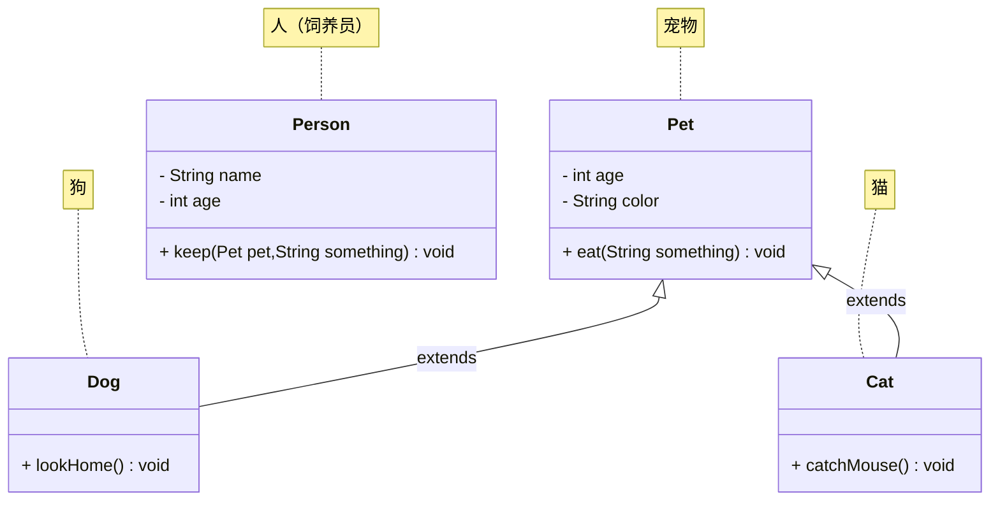

# 第一章：问答题

## 1.1 题目 1


# 第二章：代码题

## 2.1 概述

* 需求：定义狗类、猫类以及人类，并写对应的测试方法。



## 2.2 应用示例

* 示例：

::: code-group

```java [Pet.java]
public class Pet {

    private int age;

    private String color;

    public Pet() {}

    public Pet(int age, String color) {
        this.age = age;
        this.color = color;
    }

    public void eat(String something) {
        System.out.println("吃" + something);
    }

    public int getAge() {
        return age;
    }

    public void setAge(int age) {
        this.age = age;
    }

    public String getColor() {
        return color;
    }

    public void setColor(String color) {
        this.color = color;
    }

}
```

```java [Cat.java]
public class Cat extends Pet {

    public Cat() {}

    public Cat(int age, String color) {
        super(age, color);
    }

    public void catchMouse() {
        System.out.printf("%d岁的%s的猫抓老鼠\n", this.getAge(), this.getColor());
    }

    @Override
    public void eat(String something) {
        System.out.printf("%d岁的%s的猫眯着眼睛侧着头吃%s\n", this.getAge(), this.getColor(), something);
    }
}
```

```java [Dog.java]
public class Dog extends Pet {

    public Dog() {}

    public Dog(int age, String color) {
        super(age, color);
    }

    public void lookHome() {
        System.out.printf("%d岁的%s的狗看家\n", this.getAge(), this.getColor());
    }

    @Override
    public void eat(String something) {
        System.out.printf("%d岁的%s的狗两只前腿死死的抱住%s猛吃\n", this.getAge(), this.getColor(), something);
    }
}
```

```java [Person.java]
public class Person {
    private String name;

    private int age;

    public Person() {}

    public Person(String name, int age) {
        this.name = name;
        this.age = age;
    }

    public String getName() {
        return name;
    }

    public void setName(String name) {
        this.name = name;
    }

    public int getAge() {
        return age;
    }

    public void setAge(int age) {
        this.age = age;
    }

    public void keep(Pet pet, String something) {
        System.out.printf("年龄为%d的%s养了一只", this.getAge(), this.getName());
        if (pet instanceof Cat cat) {
            System.out.printf("%s的%d岁的猫\n", cat.getColor(), cat.getAge());
            pet.eat(something);
            cat.catchMouse();
        } else if (pet instanceof Dog dog) {
            System.out.printf("%s的%d岁的狗\n", dog.getColor(), dog.getAge());
            pet.eat(something);
            dog.lookHome();
        }
        System.out.println();
    }
}
```

```java [Test.java]
public class Test {
    public static void main(String[] args) {
        Person person = new Person("老王", 30);
        person.keep(new Dog(2, "黑颜色"), "骨头");

        Person person2 = new Person("老李", 25);
        person2.keep(new Cat(3, "灰颜色"), "鱼");
    }
}
```

```txt [cmd 控制台]
年龄为30的老王养了一只黑颜色的2岁的狗
2岁的黑颜色的狗两只前腿死死的抱住骨头猛吃
2岁的黑颜色的狗看家

年龄为25的老李养了一只灰颜色的3岁的猫
3岁的灰颜色的猫眯着眼睛侧着头吃鱼
3岁的灰颜色的猫抓老鼠
```

:::