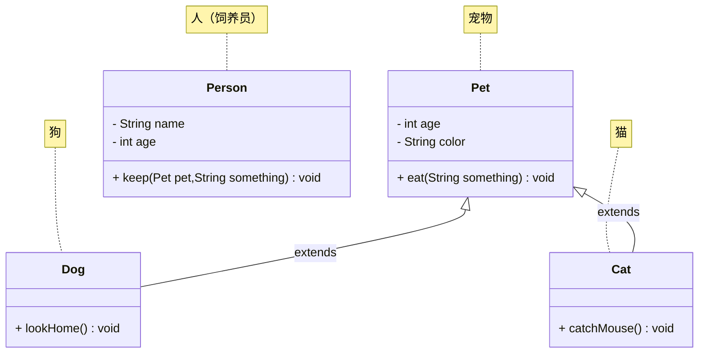

# 第一章：问答题

## 1.1 题目 1

* 问：什么是多态？
* 答：多态，从字面意思来看，就是指对象的多种形态。


* 问：使用多态的条件是什么？
* 答：类之间要存在继承或实现关系、父类引用指向子类对象以及需要有方法重写。

## 1.2 题目 2

* 问：使用多态特性，带来了什么样的好处？
* 答：可扩展性和可维护性，代码重用性、灵活性和解耦合、抽象性。

> [!NOTE]
>
> ::: details 点我查看 具体细节
>
> * ① 可扩展性和可维护性：
>   * 增加新的子类，不影响现有代码：当需要添加新的功能或类型时，只需要创建新的子类并实现相应的方法，而无需修改已有的使用父类引用的代码。这极大地提高了代码的扩展性。
>   * 代码结构更清晰，易于维护：多态将不同的实现细节隐藏在不同的子类中，使得代码结构更模块化，更易于理解和维护。
> * ② 代码重用性：
>   * 编写更通用的代码：可以使用父类类型编写通用的算法或框架，这些算法或框架可以处理各种不同的子类对象，而无需针对每个子类编写不同的代码。
>   * 提高代码复用率： 父类的方法可以被多个子类继承和重用。
> * ③ 灵活性和解耦合：
>   * 降低类之间的依赖关系：使用父类引用，使得代码依赖于抽象的父类，而不是具体的子类。这降低了类之间的耦合度，提高了代码的灵活性。
>   * 运行时动态绑定：多态的实现是基于运行时动态绑定或延迟绑定。这意味着在程序运行时才能确定具体调用哪个子类的方法。这使得程序更加灵活。
> * ④ 抽象性（关注抽象，而非具体实现）：多态允许程序员关注接口 (父类或接口)，而无需关心具体的实现细节 (子类)。这提高了编程的抽象层次。
>
> :::

## 1.3 题目 3

* 问：使用多态特性，注意什么样的弊端？  
* 答：性能开销、增加代码的复杂性、可能破坏封装性以及类型转换的风险。

> [!NOTE]
>
> ::: details 点我查看 具体细节
>
> * ① 性能开销：多态的实现依赖于运行时动态绑定，这意味着在程序运行时需要进行方法查找和调用，这会带来一定的性能开销，相比于静态方法调用，可能会略微降低执行效率。但是，通常情况下，这种开销是可以忽略不计的，除非在性能极其敏感的场景下。
> * ② 增加代码的复杂性：
>   * 理解多态概念的难度：对于初学者来说，理解多态的概念，特别是方法重写和动态绑定，可能需要一定的学习成本。
>   * 代码阅读和维护的难度：当继承层次结构非常复杂时，理解代码的执行流程和查找具体执行的方法可能会变得更加困难，尤其是在大型项目中。
> * ③ 可能破坏封装性：
>   * 子类对父类的依赖：子类继承父类，意味着子类依赖于父类的实现细节。如果父类的实现发生改变，可能会影响到子类，甚至可能需要修改子类代码。
>   * 不恰当的继承关系：如果设计不当，滥用继承可能会导致继承层次结构混乱，增加代码的维护难度，甚至破坏封装性。 应遵循 "is-a" 原则，确保继承关系是合理的。
> * ④ 类型转换的风险：当使用父类引用指向子类对象时，如果需要调用子类特有的方法或属性，需要进行向下转型。 向下转型是不安全的，如果类型转换失败 (尝试将 `Animal` 引用转换为 `Cat` 引用，但实际对象是 `Dog`)，会抛出 `ClassCastException` 异常。
>
> :::

## 1.4 题目 4 

* 问：关于多态的弊端我们如何解决？
* 答：合理设计继承结构、良好的代码风格和文档、谨慎使用向下转换、性能优化以及接口的使用。

> [!NOTE]
>
> ::: details 点我查看 具体细节
>
> * ① 合理设计继承结构：
>   * 遵循 "is-a" 原则：确保继承关系是逻辑合理的，子类确实是父类的一种特殊类型。
>   * 避免过度深的继承层次：过深的继承层次会增加代码的复杂性和维护难度。 尽量保持继承层次的简洁。
>   * 优先考虑组合 (Composition) 而不是继承 (Inheritance) (在某些情况下)：在某些场景下，组合可能比继承更灵活、更易于维护。 如果 "has-a" 关系比 "is-a" 关系更自然，可以考虑使用组合。
> * ② 良好的代码风格和文档：
>   * 清晰的命名：使用具有描述性的类名、方法名和变量名，提高代码的可读性。
>   * 详细的注释：为复杂的继承结构和多态代码添加注释，解释其设计意图和实现细节。
>   * 代码规范：遵循统一的代码规范，例如：缩进、格式化等，提高代码的可读性。
> * ③ 谨慎使用向下转型：
>   * 使用 `instanceof` 运算符进行类型检查：在进行向下转型之前，使用 `instanceof` 运算符检查对象的实际类型，避免 `ClassCastException` 异常。
>   * 尽量避免频繁的向下转型：如果需要频繁进行向下转型，可能说明代码设计存在问题，应该考虑重新设计继承结构或使用其他设计模式。
> * ④ 性能优化（在必要时）：
>   * 避免不必要的动态绑定：对于不需要多态特性的方法，可以使用 `final` 关键字修饰，使其成为静态绑定，提高性能。
>   * 代码分析和性能测试：如果性能成为瓶颈，可以使用性能分析工具 (profiler) 来定位性能瓶颈，并进行针对性的优化。
> * ⑤ 接口的使用：
>   * 使用接口代替抽象类 (在适当的情况下)：接口提供了比抽象类更松耦合的抽象方式。 类可以实现多个接口，而只能继承一个类。 接口更侧重于定义行为规范，更灵活。
>   * 面向接口编程：提倡面向接口编程，而不是面向具体实现编程。 通过接口引用来操作对象，降低类之间的耦合度，提高代码的灵活性和可维护性。
>
> :::

## 1.5 题目 5 

* 问：在 A 包中我要同时使用 B 包下的 Student 和 C 包下的 Student 类，该如何使用？
* 答：使用完全限定名。

## 1.6 题目 6

* 问：final 修饰类，修饰方法，修饰变量的特点。
* 答：final 修饰类，表示该类是最终类，不可以被继承。final 修饰方法，表示该方法是最终方法，不可以被重写。final 修饰变量，表示该变量（常量），有且仅能被赋值一次。


# 第二章：代码题

## 2.1 概述

* 需求：定义狗类、猫类以及人类，并写对应的测试方法。



## 2.2 应用示例

* 示例：

::: code-group

```java [Pet.java]
public class Pet {

    private int age;

    private String color;

    public Pet() {}

    public Pet(int age, String color) {
        this.age = age;
        this.color = color;
    }

    public void eat(String something) {
        System.out.println("吃" + something);
    }

    public int getAge() {
        return age;
    }

    public void setAge(int age) {
        this.age = age;
    }

    public String getColor() {
        return color;
    }

    public void setColor(String color) {
        this.color = color;
    }

}
```

```java [Cat.java]
public class Cat extends Pet {

    public Cat() {}

    public Cat(int age, String color) {
        super(age, color);
    }

    public void catchMouse() {
        System.out.printf("%d岁的%s的猫抓老鼠\n", this.getAge(), this.getColor());
    }

    @Override
    public void eat(String something) {
        System.out.printf("%d岁的%s的猫眯着眼睛侧着头吃%s\n", this.getAge(), this.getColor(), something);
    }
}
```

```java [Dog.java]
public class Dog extends Pet {

    public Dog() {}

    public Dog(int age, String color) {
        super(age, color);
    }

    public void lookHome() {
        System.out.printf("%d岁的%s的狗看家\n", this.getAge(), this.getColor());
    }

    @Override
    public void eat(String something) {
        System.out.printf("%d岁的%s的狗两只前腿死死的抱住%s猛吃\n", this.getAge(), this.getColor(), something);
    }
}
```

```java [Person.java]
public class Person {
    private String name;

    private int age;

    public Person() {}

    public Person(String name, int age) {
        this.name = name;
        this.age = age;
    }

    public String getName() {
        return name;
    }

    public void setName(String name) {
        this.name = name;
    }

    public int getAge() {
        return age;
    }

    public void setAge(int age) {
        this.age = age;
    }

    public void keep(Pet pet, String something) {
        System.out.printf("年龄为%d的%s养了一只", this.getAge(), this.getName());
        if (pet instanceof Cat cat) {
            System.out.printf("%s的%d岁的猫\n", cat.getColor(), cat.getAge());
            pet.eat(something);
            cat.catchMouse();
        } else if (pet instanceof Dog dog) {
            System.out.printf("%s的%d岁的狗\n", dog.getColor(), dog.getAge());
            pet.eat(something);
            dog.lookHome();
        }
        System.out.println();
    }
}
```

```java [Test.java]
public class Test {
    public static void main(String[] args) {
        Person person = new Person("老王", 30);
        person.keep(new Dog(2, "黑颜色"), "骨头");

        Person person2 = new Person("老李", 25);
        person2.keep(new Cat(3, "灰颜色"), "鱼");
    }
}
```

```txt [cmd 控制台]
年龄为30的老王养了一只黑颜色的2岁的狗
2岁的黑颜色的狗两只前腿死死的抱住骨头猛吃
2岁的黑颜色的狗看家

年龄为25的老李养了一只灰颜色的3岁的猫
3岁的灰颜色的猫眯着眼睛侧着头吃鱼
3岁的灰颜色的猫抓老鼠
```

:::