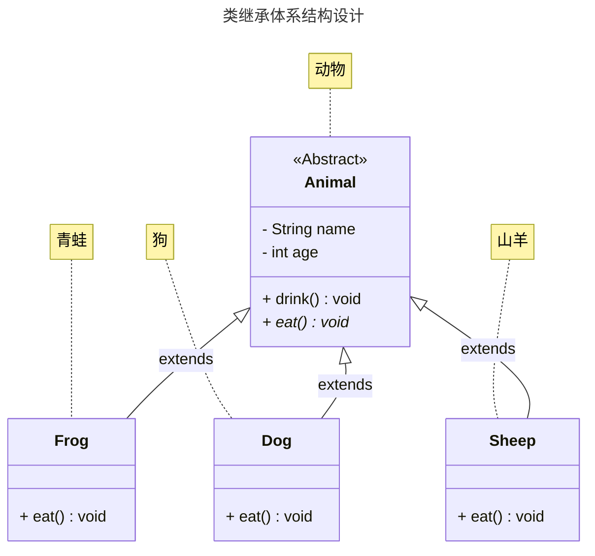
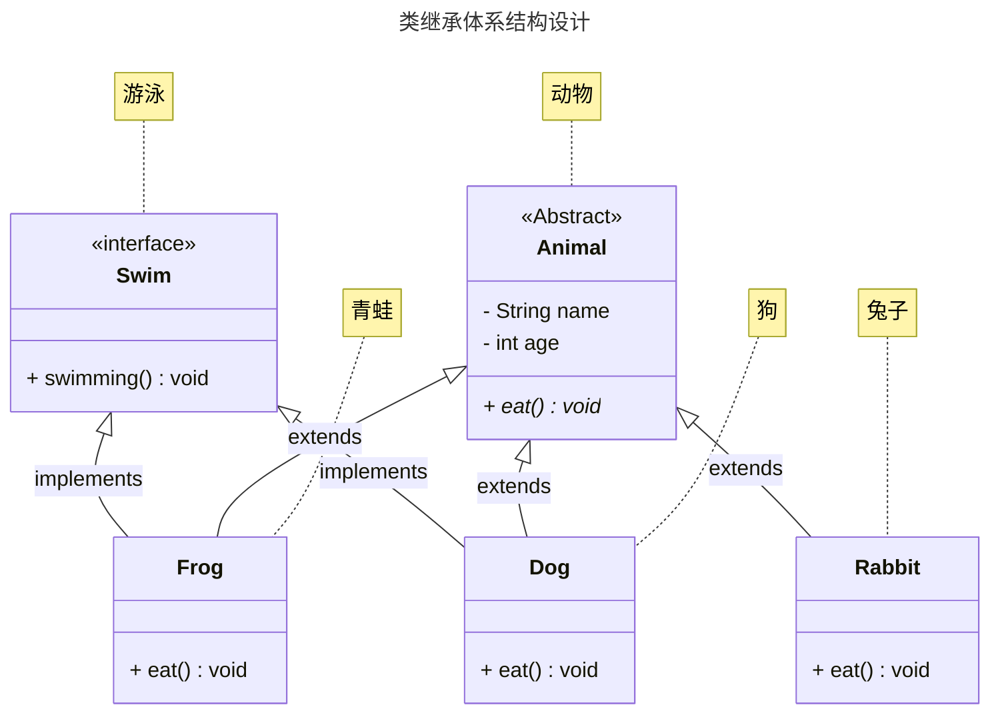
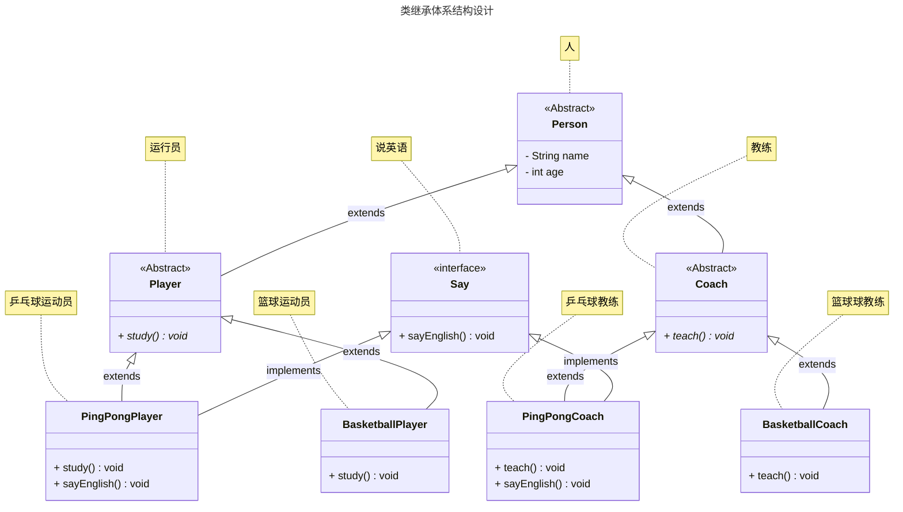

# 第一章：抽象类（⭐）

## 1.1 概述

### 1.1.1 引入

- 面向对象的三大特征：`封装`、`继承`和`多态`。之前，我们已经学习过了`封装`和`继承`以及`多态`。
- 其实，`抽象类`也是属于面向对象中的知识点。
- 所有的技术，都是为了解决问题而出现的，`抽象类`也不例外。
- 下面，我们将一起推导一下，`抽象类`为什么出现？

### 1.1.2 封装

* `封装就是对象代表什么，就得封装对应的数据，并提供数据对应的行为`。
* 有了封装之后，我们就可以将一些零散的数据以及对应的行为封装为一个整体，这个整体就是我们所说的对象，如下所示：


* 其代码实现，如下所示：

::: code-group

```java [Student.java]
public class Student {
    /**
     * 姓名
     */
    private String name;
    /**
     * 年龄
     */
    private int age;
    /**
     * 性别
     */
    private String gender;

    public Student() {}

    public Student(String name, int age, String gender) {
        this.name = name;
        this.age = age;
        this.gender = gender;
    }

    public String getName() {
        return name;
    }

    public void setName(String name) {
        this.name = name;
    }

    public int getAge() {
        return age;
    }

    public void setAge(int age) {
        this.age = age;
    }

    public String getGender() {
        return gender;
    }

    public void setGender(String gender) {
        this.gender = gender;
    }
    
    /**
     * 吃饭
     */
    public void eat() {
        System.out.println(this.name + "正在吃饭~");
    }

    /**
     * 睡觉
     */
    public void sleep() {
        System.out.println(this.name + "正在睡觉~");
    }

    @Override
    public String toString() {
        return "Student{" 
            + "name='" + name + '\'' 
            + ", age=" + age 
            + ", gender='" + gender 
            + '\'' + '}';
    }
}
```

```java {4-7} [StudentTest.java]
public class StudentTest {
    public static void main(String[] args) {

        Student s1 = new Student("张三", 18, "男");
        Student s2 = new Student("李四", 25, "女");
        Student s3 = new Student("王五", 30, "男");
        Student s4 = new Student("赵六", 35, "女");

    }
}
```

:::

* 以后我们面向的就是这个对象的整体，而不是一些零散的数据，如下所示：


* 其代码实现，如下所示：

::: code-group

```java [Student.java]
public class Student {
    /**
     * 姓名
     */
    private String name;
    /**
     * 年龄
     */
    private int age;
    /**
     * 性别
     */
    private String gender;

    public Student() {}

    public Student(String name, int age, String gender) {
        this.name = name;
        this.age = age;
        this.gender = gender;
    }

    public String getName() {
        return name;
    }

    public void setName(String name) {
        this.name = name;
    }

    public int getAge() {
        return age;
    }

    public void setAge(int age) {
        this.age = age;
    }

    public String getGender() {
        return gender;
    }

    public void setGender(String gender) {
        this.gender = gender;
    }
    
    /**
     * 吃饭
     */
    public void eat() {
        System.out.println(this.name + "正在吃饭~");
    }

    /**
     * 睡觉
     */
    public void sleep() {
        System.out.println(this.name + "正在睡觉~");
    }

    @Override
    public String toString() {
        return "Student{" 
            + "name='" + name + '\'' 
            + ", age=" + age 
            + ", gender='" + gender 
            + '\'' + '}';
    }
}
```

```java [StudentUtil.java]
public class StudentUtil {

    /**
    * 打印学生的信息
    */
    public static void printInfo(Student stu){
        // 通过 getter 方法获取属性
        System.out.println(stu.getName());
        System.out.println(stu.getAge());
        System.out.println(stu.getGender());
        // 也可以调用其他行为
        stu.eat();
        stu.sleep();
    }
}
```

:::

### 1.1.3 继承

- 如果类似的`JavaBean`也来越多，就会造成`代码膨胀`，如下所示：


* 其代码实现，如下所示：

::: code-group

```java [Student.java]
public class Student {
    /**
     * 姓名
     */
    private String name;
    /**
     * 年龄
     */
    private int age;
    /**
     * 性别
     */
    private String gender;

    public Student() {}

    public Student(String name, int age, String gender) {
        this.name = name;
        this.age = age;
        this.gender = gender;
    }

    public String getName() {
        return name;
    }

    public void setName(String name) {
        this.name = name;
    }

    public int getAge() {
        return age;
    }

    public void setAge(int age) {
        this.age = age;
    }

    public String getGender() {
        return gender;
    }

    public void setGender(String gender) {
        this.gender = gender;
    }

    /**
     * 吃饭
     */
    public void eat() {
        System.out.println(this.name + "正在吃饭~");
    }

    /**
     * 睡觉
     */
    public void sleep() {
        System.out.println(this.name + "正在睡觉~");
    }

    @Override
    public String toString() {
        return "Student{" 
            + "name='" + name + '\'' 
            + ", age=" + age 
            + ", gender='" + gender + '\'' + '}';
    }
}
```

```java [Teacher.java]
public class Teacher {
    /**
     * 姓名
     */
    private String name;
    /**
     * 年龄
     */
    private int age;
    /**
     * 性别
     */
    private String gender;

    public Student() {}

    public Student(String name, int age, String gender) {
        this.name = name;
        this.age = age;
        this.gender = gender;
    }

    public String getName() {
        return name;
    }

    public void setName(String name) {
        this.name = name;
    }

    public int getAge() {
        return age;
    }

    public void setAge(int age) {
        this.age = age;
    }

    public String getGender() {
        return gender;
    }

    public void setGender(String gender) {
        this.gender = gender;
    }

    /**
     * 吃饭
     */
    public void eat() {
        System.out.println(this.name + "正在吃饭~");
    }

    /**
     * 睡觉
     */
    public void sleep() {
        System.out.println(this.name + "正在睡觉~");
    }

    @Override
    public String toString() {
        return "Teacher{" 
            + "name='" + name + '\'' 
            + ", age=" + age 
            + ", gender='" + gender + '\'' + '}';
    }
}
```

```java [PersonUtil.java]
public class PersonUtil {

    /**
     * 打印学生的信息
     * @param stu 学生对象
     */
    public static void printInfo(Student stu) {
        System.out.println(stu.getName());
        System.out.println(stu.getAge());
        System.out.println(stu.getGender());
    }

    /**
     * 打印老师的信息
     * @param tea 老师对象
     */
    public static void printInfo(Teacher tea) {
        System.out.println(tea.getName());
        System.out.println(tea.getAge());
        System.out.println(tea.getGender());
    }
}

```

:::

* 此时，我们就可以将`相同的属性`和`相同的行为`抽取到一个`父类`中，`子类`只需要`继承`父类（子类可以有自己独有的属性和行为），如下所示：


* 其代码实现，如下所示：

::: code-group

```java [Person.java]
public class Person {
    /**
     * 姓名
     */
    private String name;
    /**
     * 年龄
     */
    private int age;
    /**
     * 性别
     */
    private String gender;

    public Person() {}

    public Person(String name, int age, String gender) {
        this.name = name;
        this.age = age;
        this.gender = gender;
    }

    public String getName() {
        return name;
    }

    public void setName(String name) {
        this.name = name;
    }

    public int getAge() {
        return age;
    }

    public void setAge(int age) {
        this.age = age;
    }

    public String getGender() {
        return gender;
    }

    public void setGender(String gender) {
        this.gender = gender;
    }

    public void eat() {
        System.out.println(this.name + "正在吃饭~");
    }

    public void sleep() {
        System.out.println(this.name + "正在睡觉~");
    }
}
```

```java [Student.java]
public class Student extends Person { // [!code highlight]

    private double score;

    public Student() {}

    public Student(String name, int age, String gender, double score) {
        super(name, age, gender);
        this.score = score;
    }

    public double getScore() {
        return score;
    }

    public void setScore(double score) {
        this.score = score;
    }

    @Override
    public String toString() {
        return "Student{} " + super.toString();
    }
}
```

```java [Teacher.java]
public class Teacher extends Person { // [!code highlight]

    private double salary;

    public Teacher() {}

    public Teacher(String name, int age, String gender, double salary) {
        super(name, age, gender);
        this.salary = salary;
    }

    public double getSalary() {
        return salary;
    }

    public void setSalary(double salary) {
        this.salary = salary;
    }

    @Override
    public String toString() {
        return "Teacher{" + "salary=" + salary + "} " + super.toString();
    }
}
```

```java [PersonUtil.java]
public class PersonUtil {

    /**
     * 打印人类的信息
     * @param p 人类对象
     */
    public static void printInfo(Person p) {
        System.out.println(p.getName());
        System.out.println(p.getAge());
        System.out.println(p.getGender());
    }

}
```

:::

### 1.1.4 多态

* 多态，从字面意思来看，就是指对象的多种形态，如下所示：


* 之前，我们创建对象是这样的，即：将 Student 对象赋值给 Student 类型的变量，如下所示：

```java
Student s = new Student(); // Student 对象是学生形态
```

* 有了多态之后，我们创建对象可以这样，即：将 Student 对象赋值给 Person 类型的变量，如下所示：

```java
Person p = new Student(); // Student 对象是人的形态
```

* 此时，学生对象就有了两种形态，如下所示：

```java
Student s = new Student(); // Student 对象是学生形态

Person p = new Student(); // Student 对象是人的形态
```

### 1.1.5 抽象类

* 如果在上述的继承体系中，学生和老师都有`work()`方法，那么我们就可以将该方法抽取到父类中，如下所示：


* 每个子类工作的内容是不一样的，如：`学生的工作是学习，老师的工作是教学`，当我们将`work()`方法抽取到父类中就不太好编写其方法体，难道写`学生的工作是学习`？


* 每个子类工作的内容是不一样的，如：`学生的工作是学习，老师的工作是教学`，当我们将`work()`方法抽取到父类中就不太好编写其方法体，难道写`老师的工作是教学`？


> [!NOTE]
>
> 其实，上述的方案是不行的：
>
> * ① 如果你在父类中的`work()`方法中写`学生的工作是学习`，那么老师会继承该方法，和实际需求不符合。
> * ② 如果你在父类中的`work()`方法中写`老师的工作是教学`，那么学生会继承该方法，和实际需求不符合。

* 之前，我们是在父类中的`work()`方法写`工作`，然后让子类重写了`work()`方法，如下所示：


* 但是，这样会产生一个弊端：我们并不能约束子类一定去重写这个方法，如：学生类中可以写`study()`方法，而老师类中可以写`working()`方法，如下所示：


* 此时，抽象类就出现了，即：抽象类就可以用来约束子类必须去实现抽象方法，如下所示：

> [!NOTE]
>
> * ① 如果一个方法抽取到父类中，不确定方法体，那么该方法就不需要写方法体，该方法可以使用`abstract`关键字修饰，即：抽象方法，如：`public abstract void work();`。
> * ② 如果一个类中有抽象方法，那么该类必须是抽象类，使用`abstract`关键字修饰，如：`public abstract class Person{}`。


## 1.2 抽象类和抽象方法

### 1.2.1 概述

* `抽象方法`：将`共性`的`行为`（方法）抽取到父类之后，由于灭个子类执行的内容是不一样的；所以，在父类中是不能确定`具体的方法体`，该方法就可以定义为抽象方法。
* `抽象类`：如果一个`类中存在抽象方法`，那么该类就`必须声明为抽象类`。

### 1.2.2 抽象方法

* 语法：

```java
权限访问修饰符 abstract 返回值类型 方法名(形参列表);
```

> [!NOTE]
>
> 使用`abstract` 关键字修饰方法，该方法就成了抽象方法，抽象方法只包含一个方法名，而没有方法体。


* 示例：

```java
public abstract class Person {
    
    public abstract void work(); // [!code highlight]
    
}
```

### 1.2.3 抽象类

* 语法：

```java
public abstract class 类名字 { 
  
}
```

> [!NOTE]
>
> * ① 如果一个类包含抽象方法，那么该类必须是抽象类。
> * ② 抽象类不一定有抽象方法，但是有抽象方法的类必须定义成抽象类。

> [!CAUTION]
>
> 【Java 规范】抽象类命名通常使用`Abstract`或`Base`开头；异常类命名使用`Exception`结尾，测试类命名以它要测试的类的名称开始，以`Test`结尾。


* 示例：

```java
public abstract class Person { // [!code highlight]
    
    public void eat(){
        System.out.println("吃饭");
    }
    
}
```


* 示例：

```java
public abstract class Person { // [!code highlight]
    
    public void eat(){
        System.out.println("吃饭");
    }
    public abstract void work(); 
    
}
```

### 1.2.4 抽象类的使用

* 继承抽象类的子类`必须重写父类所有的抽象方法`；否则，该子类也必须声明为抽象类。


* 示例：

::: code-group

```java [Person.java]
package com.github;

public abstract class Person {

    private String name;

    private int age;

    public Person() {}

    public Person(String name, int age) {
        this.name = name;
        this.age = age;
    }

    public String getName() {
        return name;
    }

    public void setName(String name) {
        this.name = name;
    }

    public int getAge() {
        return age;
    }

    public void setAge(int age) {
        this.age = age;
    }


    public void eat() {
        System.out.println("吃饭");
    }

    public void sleep() {
        System.out.println("睡觉");
    }

    // 抽象方法
    public abstract void work();

    @Override
    public String toString() {
        return "Person{" +
                "name='" + name + '\'' +
                ", age=" + age +
                '}';
    }
}
```

```java [Student.java]
package com.github;

public class Student extends Person{

    public Student() {}

    public Student(String name, int age) {
        super(name, age);
    }

    @Override
    public void work() {
        System.out.println("学生的工作是学习");
    }
}
```

```java [Teacher.java]
package com.github;

public class Teacher extends Person{

    public Teacher() {}

    public Teacher(String name, int age) {
        super(name, age);
    }

    @Override
    public void work() {
        System.out.println("老师的工作是教学");
    }
}
```

```java [Test.java]
package com.github;

public class Test {
    public static void main(String[] args) {
        Person p1 = new Student("张三", 18);
        p1.work();
        p1.eat();
        p1.sleep();
        System.out.println("p1 = " + p1);

        System.out.println("-------------------");

        Person p2 = new Teacher("李四", 28);
        p2.work();
        p2.eat();
        p2.sleep();
        System.out.println("p2 = " + p2);

    }
}
```

```txt [cmd 控制台]
学生的工作是学习
吃饭
睡觉
p1 = Person{name='张三', age=18}
-------------------
老师的工作是教学
吃饭
睡觉
p2 = Person{name='李四', age=28}
```

:::

## 1.3 抽象类和抽象方法的注意事项

* ① 抽象类不能实例化，即：抽象类不能创建对象。

> [!NOTE]
>
> 理解：假设创建了抽象类的对象，调用抽象的方法，而抽象方法没有具体的方法体，没有意义。

* ② 抽象类中不一定有抽象方法，有抽象方法的类一定是抽象类。

> [!NOTE]
>
> 理解：未包含抽象方法的抽象类，目的就是不想让调用者创建该类对象，通常用于某些特殊的类结构设计。

* ③ 抽象类可以有构造方法、实例方法和静态方法。

> [!NOTE]
>
> 理解：子类的构造方法中，有默认的 super()，需要访问父类构造方法。

* ④ 抽象类的子类，要么重写抽象类中的所有抽象方法，要么本身也是抽象类。

> [!NOTE]
>
> 理解：假设不重写所有抽象方法，则类中可能包含抽象方法。那么创建对象后，调用抽象的方法，没有意义。

* ⑤ 抽象类存在的意义是为了被子类继承。

> [!NOTE]
>
> 理解：抽象类中已经实现的是模板中确定的成员，抽象类不确定如何实现的定义成抽象方法，交给具体的子类去实现。

## 1.4 应用示例

* 需求：编写带有抽象类的标准 JavaBean 类。

| 动物       | 属性       | 行为         |
| ---------- | ---------- | ------------ |
| 青蛙 Frog  | 名字、年龄 | 吃虫子、喝水 |
| 狗 Dog     | 名字、年龄 | 吃骨头、喝水 |
| 山羊 Sheep | 名字、年龄 | 吃草、喝水   |




* 示例：

::: code-group

```java [Animal.java]
package com.github.demo2;

public abstract class Animal {

    private String name;

    private int age;


    public Animal() {}

    public Animal(String name, int age) {
        this.name = name;
        this.age = age;
    }

    public String getName() {
        return name;
    }

    public void setName(String name) {
        this.name = name;
    }

    public int getAge() {
        return age;
    }

    public void setAge(int age) {
        this.age = age;
    }


    public void drink(){
        System.out.println("喝水");
    }


    public abstract void eat();

    @Override
    public String toString() {
        return "Animal{" +
                "name='" + name + '\'' +
                ", age=" + age +
                '}';
    }
}
```

```java [Frog.java]
package com.github.demo2;

public class Frog extends Animal{

    public Frog() {}

    public Frog(String name, int age) {
        super(name, age);
    }

    @Override
    public void eat() {
        System.out.println("吃虫子");
    }
}
```

```java [Dog.java]
package com.github.demo2;

public class Dog extends Animal {

    public Dog() {}

    public Dog(String name, int age) {
        super(name, age);
    }

    @Override
    public void eat() {
        System.out.println("吃骨头");
    }
}
```

```java [Sheep.java]
package com.github.demo2;

public class Sheep extends Animal{

    public Sheep() {}

    public Sheep(String name, int age) {
        super(name, age);
    }

    @Override
    public void eat() {
        System.out.println("吃草");
    }
}
```

```java [Test.java]
package com.github.demo2;

public class Test {
    public static void main(String[] args) {
        Animal animal = new Frog("青蛙--呱呱", 2);
        animal.eat();
        animal.drink();
        System.out.println("animal = " + animal);

        System.out.println("------------------");

        Animal animal2 = new Dog("小狗--汪汪", 5);
        animal2.eat();
        animal2.drink();
        System.out.println("animal2 = " + animal2);

        System.out.println("------------------");

        Animal animal3 = new Sheep("山羊--洋洋", 9);
        animal3.eat();
        animal3.drink();
        System.out.println("animal3 = " + animal3);
    }
}
```

```txt [cmd 控制台]
吃虫子
喝水
animal = Animal{name='青蛙--呱呱', age=2}
------------------
吃骨头
喝水
animal2 = Animal{name='小狗--汪汪', age=5}
------------------
吃草
喝水
animal3 = Animal{name='山羊--洋洋', age=9}
```

:::

## 1.5 抽象类在实际开发中的意义

### 1.5.1 概述

* 抽象类存在的意义是为了被子类继承，否则抽象类将毫无意义。
* 抽象类可以强制让子类，一定要按照规定的格式进行重写。

### 1.5.2 疑惑？

* 将子类中共性的内容抽取到父类之后，由于方法体不确定，需要定义为抽象，子类必须重写抽象类中的所有抽象方法。
* 如果不将方法抽取到父类，直接在子类中写岂不是可以节约代码？


* 示例：

::: code-group

```java
package com.github.demo1;

public class Person {

    private String name;

    private int age;

    public Person() {
    }

    public Person(String name, int age) {
        this.name = name;
        this.age = age;
    }

    public String getName() {
        return name;
    }

    public void setName(String name) {
        this.name = name;
    }

    public int getAge() {
        return age;
    }

    public void setAge(int age) {
        this.age = age;
    }


    public void eat() {
        System.out.println("吃饭");
    }

    public void sleep() {
        System.out.println("睡觉");
    }

    @Override
    public String toString() {
        return "Person{" +
                "name='" + name + '\'' +
                ", age=" + age +
                '}';
    }
}
```

```java [Student.java]
package com.github.demo1;

public class Student extends Person {

    public Student() {
    }

    public Student(String name, int age) {
        super(name, age);
    }

    public void work() {
        System.out.println("学生的工作是学习");
    }
}
```

```java [Teacher.java]
package com.github.demo1;

public class Teacher extends Person {

    public Teacher() {
    }

    public Teacher(String name, int age) {
        super(name, age);
    }

    public void work() {
        System.out.println("老师的工作是教学");
    }
}
```

```java [Test.java]
package com.github.demo1;

public class Test {
    public static void main(String[] args) {
        Student p1 = new Student("张三", 18);
        p1.work();
        p1.eat();
        p1.sleep();
        System.out.println("p1 = " + p1);

        System.out.println("-------------------");

        Teacher p2 = new Teacher("李四", 28);
        p2.work();
        p2.eat();
        p2.sleep();
        System.out.println("p2 = " + p2);

    }
}
```

:::

### 1.5.3 问题

* 不将方法抽取到父类，直接在子类中写虽然看似可以节约代码；但是，会造成调用者在调用的时候，无法确定方法名（需要强制类型转换，非常麻烦）。


* 示例：

::: code-group

```java
package com.github.demo1;

public class Person {

    private String name;

    private int age;

    public Person() {
    }

    public Person(String name, int age) {
        this.name = name;
        this.age = age;
    }

    public String getName() {
        return name;
    }

    public void setName(String name) {
        this.name = name;
    }

    public int getAge() {
        return age;
    }

    public void setAge(int age) {
        this.age = age;
    }


    public void eat() {
        System.out.println("吃饭");
    }

    public void sleep() {
        System.out.println("睡觉");
    }

    @Override
    public String toString() {
        return "Person{" +
                "name='" + name + '\'' +
                ", age=" + age +
                '}';
    }
}
```

```java [Student.java]
package com.github.demo1;

public class Student extends Person {

    public Student() {
    }

    public Student(String name, int age) {
        super(name, age);
    }

    public void study() {
        System.out.println("学生的工作是学习");
    }
}
```

```java [Teacher.java]
package com.github.demo1;

public class Teacher extends Person {

    public Teacher() {
    }

    public Teacher(String name, int age) {
        super(name, age);
    }

    public void working() {
        System.out.println("老师的工作是教学");
    }
}
```

```java {9-16} [Test.java]
package com.github.demo1;

public class Test {
    public static void main(String[] args) {        
        show(new Student("张三", 18));
        show(new Teacher("李四", 28));
    }
    
    public static void show(Person p){
        System.out.println(p.getName() + "---" + p.getAge());
        if(p instanceof Student stu){
            stu.study();
        }else if(p instanceof Teacher tea){
            tea.working();
        }
    }
}
```

:::

### 1.5.4 解决

* 抽象类可以强制让子类，一定要按照规定的格式进行重写。


* 示例：

::: code-group

```java [Person.java]
package com.github;

public abstract class Person {

    private String name;

    private int age;

    public Person() {}

    public Person(String name, int age) {
        this.name = name;
        this.age = age;
    }

    public String getName() {
        return name;
    }

    public void setName(String name) {
        this.name = name;
    }

    public int getAge() {
        return age;
    }

    public void setAge(int age) {
        this.age = age;
    }


    public void eat() {
        System.out.println("吃饭");
    }

    public void sleep() {
        System.out.println("睡觉");
    }

    // 抽象方法
    public abstract void work();

    @Override
    public String toString() {
        return "Person{" +
                "name='" + name + '\'' +
                ", age=" + age +
                '}';
    }
}
```

```java [Student.java]
package com.github;

public class Student extends Person{

    public Student() {}

    public Student(String name, int age) {
        super(name, age);
    }

    @Override
    public void work() {
        System.out.println("学生的工作是学习");
    }
}
```

```java [Teacher.java]
package com.github;

public class Teacher extends Person{

    public Teacher() {}

    public Teacher(String name, int age) {
        super(name, age);
    }

    @Override
    public void work() {
        System.out.println("老师的工作是教学");
    }
}
```

```java {9-12} [Test.java]
package com.github.demo1;

public class Test {
    public static void main(String[] args) {
        show(new Student("张三", 18));
        show(new Teacher("李四", 28));
    }

    public static void show(Person p){
        System.out.println(p.getName() + "---" + p.getAge());
        p.work();
    }
}
```

:::

# 第二章：接口（⭐）

## 2.1 概述

* 假设有如下的继承体系：


* 我们可以将`共性`的部分抽取到父类中，如下所示：


* 现在，我们需要增加`游泳`的行为，难道也添加到父类中，如下所示：


* 其实，这是非常不合理的，因为只有`青蛙`才会游泳，而`兔子`和`狗`是不会游泳的。难道将`游泳`写在青蛙类中，如下所示：


* 如果此时，增加了`鱼`，并且`鱼`也有`游泳`的功能，难道也将`游泳`写在`鱼`类中，如下所示：


* 但是，这样会有一个弊端：我们无法限制子类中方法的书写格式，如下所示：


* 此时，接口就出现了，即：接口就可以用来约束实现类必须去实现抽象方法，如下所示：


* 但是，并不意味着所有的方法都需要抽取到接口中，比如：青蛙可以跳跃，而鱼不可以，我们只需要抽取共性的规则，如下所示：


> [!NOTE]
>
> 综上所述：当我们需要给多个类同时去定义规则的时候，就需要用到接口，即：接口就是一种规则。

## 2.2 抽象类 VS 接口

* 抽象类更多的是用来父类中，在抽象共性方法的时候，当方法体不一样，就可以写成抽象方法，而抽象方法所在的类就是抽象类。

> [!NOTE]
>
> 在下面的继承体系中，Animal 动物，我们就可以将其定义为抽象类，此时的抽象类就表示一类事物，即：表示动物这一类事物。


* 而接口不是表示一类事物，接口就是一种规则，它侧重于行为的抽象。

> [!NOTE]
>
> 青蛙可以有游泳的行为，鱼也可以有游泳的行为，而学生和老师也可以有游泳的行为。


## 2.3 接口

* 语法：

```java
public interface 接口名 {
    // ① 静态常量
    // ② 抽象方法
    // ③ 默认方法
    // ④ 静态方法
    // ⑤ 私有方法
}
```

> [!NOTE]
>
> * ① 接口和抽象类一样，不能实例化。
> * ② 接口和类之间是实现关系，使用`implements`关键字表示，如：`public class Frog implements Run {}`。
> * ③ 接口的子类（实现类），要么重写接口中的所有抽象方法，要么自身是抽象类。
> * ④ 接口和接口之间是继承的关系，如：`public interface A extends B {}` 。


* 示例：

::: code-group

```java [Fly.java]
public interface Fly {

    void fly();
}
```

```java [Bird.java]
public class Bird implements Fly {
    @Override
    public void fly() {
        System.out.println("小鸟在飞");
    }
}
```

```java [SuperMan.java]
public class SuperMan implements Fly {
    @Override
    public void fly() {
        System.out.println("超人在飞");
    }
}
```

```java [Test.java]
public class Test {
    public static void main(String[] args) {
        Fly bird = new Bird();
        bird.fly();

        System.out.println("-----------------");

        Fly superman = new SuperMan();
        superman.fly();
    }
}
```

:::

## 2.4 JDK 7 之前接口中的成员


## 2.5 应用示例

* 需求：编写带有接口和抽象类的标准 JavaBean 类。

| 动物        | 属性       | 行为         |
| ----------- | ---------- | ------------ |
| 青蛙 Frog   | 名字、年龄 | 吃虫子、蛙泳 |
| 狗 Dog      | 名字、年龄 | 吃骨头、狗刨 |
| 兔子 Rabbit | 名字、年龄 | 吃胡萝卜     |




* 示例：

::: code-group

```java [Animal.java]
package com.github.demo3;

public abstract class Animal {

    private String name;

    private int age;


    public Animal() {}

    public Animal(String name, int age) {
        this.name = name;
        this.age = age;
    }

    public String getName() {
        return name;
    }

    public void setName(String name) {
        this.name = name;
    }

    public int getAge() {
        return age;
    }

    public void setAge(int age) {
        this.age = age;
    }

    public abstract void eat();

    @Override
    public String toString() {
        return "Animal{" +
                "name='" + name + '\'' +
                ", age=" + age +
                '}';
    }
}
```

```java [Swim.java]
package com.github.demo3;

public interface Swim {

    void swimming();

}
```

:::


* 示例：

::: code-group

```java [Frog.java]
package com.github.demo3;

public class Frog extends Animal implements Swim{

    public Frog() {}

    public Frog(String name, int age) {
        super(name, age);
    }

    @Override
    public void eat() {
        System.out.println("吃虫子");
    }

    @Override
    public void swimming() {
        System.out.println("蛙泳");
    }
}
```

```java [Dog.java]
package com.github.demo3;

public class Dog extends Animal implements Swim{

    public Dog() {}

    public Dog(String name, int age) {
        super(name, age);
    }

    @Override
    public void eat() {
        System.out.println("吃骨头");
    }

    @Override
    public void swimming() {
        System.out.println("狗刨");
    }
}
```

```java [Rabbit.java]
package com.github.demo3;

public class Rabbit extends Animal {

    public Rabbit() {}

    public Rabbit(String name, int age) {
        super(name, age);
    }

    @Override
    public void eat() {
        System.out.println("吃胡萝卜");
    }
}
```

```java [Test.java]
package com.github.demo3;

public class Test {
    public static void main(String[] args) {
        Frog frog = new Frog("青蛙--呱呱", 2);
        frog.eat();
        frog.swimming();
        System.out.println("frog = " + frog);

        System.out.println("------------------");

        Dog dog = new Dog("小狗--汪汪", 5);
        dog.eat();
        dog.swimming();
        System.out.println("dog = " + dog);

        System.out.println("------------------");

        Rabbit rabbit = new Rabbit("兔子--兔兔", 9);
        rabbit.eat();
        System.out.println("rabbit = " + rabbit);
    }
}
```

```txt [cmd 控制台]
吃虫子
蛙泳
frog = Animal{name='青蛙--呱呱', age=2}
------------------
吃骨头
狗刨
dog = Animal{name='小狗--汪汪', age=5}
------------------
吃胡萝卜
rabbit = Animal{name='兔子--兔兔', age=9}
```

:::

## 2.6 接口和类之间的关系


> * ① 接口和类的实现关系，可以是单实现，也可以是多实现。
>
> ```java
> interface B {}
> interface C {}
> public class A implements B,C {}
> ```
>
> * ② 实现类可以继承一个类的同时，实现多个接口。
>
> ```java
> interface C {}
> interface D {}
> class B {}
> public class A extends B implements C,D {}
> ```
>
> * ③ 接口和接口之间是继承关系，可以是单继承，也可以是多继承。
>
> ```java
> interface B {}
> interface C {}
> public interface A extends B,C {}
> ```

## 2.8 应用示例

* 需求：编写带有接口和抽象类的标准 JavaBean 类。

| 动物                           | 属性       | 行为               |
| ------------------------------ | ---------- | ------------------ |
| 乒乓球运动员（PingPongPlayer） | 名字、年龄 | 学打乒乓球、说英语 |
| 篮球运动员（BasketballPlayer） | 名字、年龄 | 学打篮球           |
| 乒乓球教练（PingPongCoach）    | 名字、年龄 | 教打乒乓球、说英语 |
| 篮球教练（BasketballCoach）    | 名字、年龄 | 教打篮球           |




* 示例：

::: code-group

```java [Person.java]
package com.github.demo4;

public abstract class Person {

    private String name;

    private int age;

    public Person() {
    }

    public Person(String name, int age) {
        this.name = name;
        this.age = age;
    }

    public String getName() {
        return name;
    }

    public void setName(String name) {
        this.name = name;
    }

    public int getAge() {
        return age;
    }

    public void setAge(int age) {
        this.age = age;
    }

    @Override
    public String toString() {
        return "Person{" +
                "name='" + name + '\'' +
                ", age=" + age +
                '}';
    }
}
```

```java [Player.java]
package com.github.demo4;

public abstract class Player extends Person{

    public Player() {}

    public Player(String name, int age) {
        super(name, age);
    }

    public abstract void study();
}
```

```java [Coach.java]
package com.github.demo4;

public abstract class Coach extends Person{

    public Coach() {}

    public Coach(String name, int age) {
        super(name, age);
    }

    public abstract void teach();
}
```

```java [Say.java]
package com.github.demo4;

public interface Say {
    
    void sayEnglish();
}
```

:::


* 示例：

::: code-group

```java [PingPongPlayer.java]
package com.github.demo4;

public class PingPongPlayer extends Player implements Say{

    public PingPongPlayer() {}

    public PingPongPlayer(String name, int age) {
        super(name, age);
    }

    @Override
    public void study() {
        System.out.println("学打乒乓球");
    }

    @Override
    public void sayEnglish() {
        System.out.println("说英语");
    }
}
```

```java [PingPongCoach.java]
package com.github.demo4;

public class PingPongCoach extends Coach implements Say{

    public PingPongCoach() {}

    public PingPongCoach(String name, int age) {
        super(name, age);
    }

    @Override
    public void teach() {
        System.out.println("教打乒乓球");
    }

    @Override
    public void sayEnglish() {
        System.out.println("说英语");
    }
}
```

:::


* 示例：

::: code-group

```java [BasketballPlayer.java]
package com.github.demo4;

public class BasketballPlayer extends Player{

    public BasketballPlayer() {}

    public BasketballPlayer(String name, int age) {
        super(name, age);
    }

    @Override
    public void study() {
        System.out.println("学打篮球");
    }
}
```

```java [BasketballCoach.java]
package com.github.demo4;

public class BasketballCoach extends Coach{

    public BasketballCoach() {}

    public BasketballCoach(String name, int age) {
        super(name, age);
    }

    @Override
    public void teach() {
        System.out.println("教打篮球");
    }
}
```

:::


* 示例：

::: code-group

```java [Test.java]
package com.github.demo4;

public class Test {
    public static void main(String[] args) {
        PingPongPlayer pingPongPlayer = new PingPongPlayer("张三", 18);
        pingPongPlayer.sayEnglish();
        pingPongPlayer.study();
        System.out.println("pingPongPlayer = " + pingPongPlayer);

        System.out.println("-------------------");

        PingPongCoach pingPongCoach = new PingPongCoach("李四", 19);
        pingPongCoach.sayEnglish();
        pingPongCoach.teach();
        System.out.println("pingPongCoach = " + pingPongCoach);

        System.out.println("-------------------");

        BasketballPlayer basketballPlayer = new BasketballPlayer("王五", 20);
        basketballPlayer.study();
        System.out.println("basketballPlayer = " + basketballPlayer);

        System.out.println("-------------------");

        BasketballCoach basketballCoach = new BasketballCoach("赵六", 24);
        basketballCoach.teach();
        System.out.println("basketballCoach = " + basketballCoach);

    }
}
```

```txt [cmd 控制台]
说英语
学打乒乓球
pingPongPlayer = Person{name='张三', age=18}
-------------------
说英语
教打乒乓球
pingPongCoach = Person{name='李四', age=19}
-------------------
学打篮球
basketballPlayer = Person{name='王五', age=20}
-------------------
教打篮球
basketballCoach = Person{name='赵六', age=24}
```

:::


# 第三章：内部类