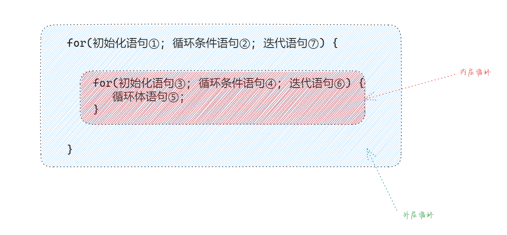
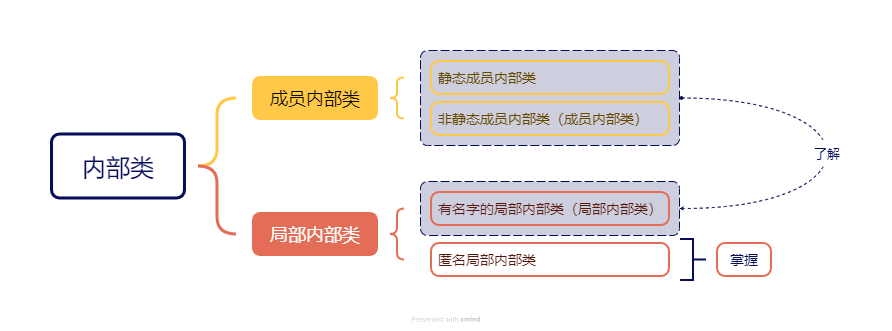

# 第一章：前言

## 1.1 概述

* 之前，我们学过类的定义，如下所示：

```java
public class 类名 {
    ① 成员变量(代表属性，一般是名词)
    ② 成员方法(代表行为，一般是动词)
    ③ 构造器
    ④ 代码块
    ⑤ 内部类（后面学习）    
}
```

* 到目前为止，我们已经学习过了`类`的`成员变量`、`成员方法`、`构造器`以及`代码块`，接下来我们将学习`类`的`内部类`。

## 1.2 什么是内部类 

### 1.2.1 回顾嵌套循环

* 所谓的嵌套循环，是指一个循环结构 A 的循环体是另一个循环结构 B 。例如：for 循环里面还有一个for 循环，就是嵌套循环。
* 语法：

```java
for(初始化语句①; 循环条件语句②; 迭代语句⑦) {
    for(初始化语句③; 循环条件语句④; 迭代语句⑥) {
      	循环体语句⑤;
    }
}
```

- 其中，for 、while 、do-while 均可以作为外层循环或内层循环。



> [!NOTE]
>
> - ① 实际上，嵌套循环就是将内层循环当成外层循环的循环体。当只有内层循环的循环条件为 false ，才会完全跳出内层循环，才可结束外层的当次循环，开始下一次循环。
> - ② 假设外层循环次数为 m 次，内层循环次数为 n 次，则内层循环体实际上需要执行 m × n 次。
> - ③ 从二维图形的角度看，外层循环控制`行数`，内层循环控制`列数`。
> - ④ 实际开发中，我们最多见到的嵌套循环是两层，一般不会出现超过三层的嵌套循环。如果将要出现，一定要停下来重新梳理业务逻辑，重新思考算法的实现，控制在三层以内；否则，可读性会很差。


* 示例：

```java
public class Main {
    public static void main(String[] args) {
        for (int i = 1; i <= 5; ++i) { // 外层循环
            for (int j = 1; j < 6; ++j) { // 内层循环
                System.out.print("* ");
            }
            System.out.println();
        }
    }
}
```

### 1.2.2 内部类的概念

* 所谓的内部类，就是在一个类的里面，再定义一个类，这个类被称为内部类。

> [!NOTE]
>
> 在 Java 中，允许一个类`Inner`的定义在另一个类`Outer`的内部，类`Inner`就被称为`内部类`，而类`Outer`就被称为`外部类`。

```java
public class Outer  { // 外部类
    
    public class Inner { // 内部类
        
    }
}
```


# 第二章：为什么要学习内部类？

## 2.1 概述

* 内部类表示的事物是外部类的一部分，内部类单独出现没有任何意义，如：汽车的`发送机`、人的`心脏`等。

## 2.2 应用示例

* 需求：写一个 JavaBean 类用来描述汽车。

> [!NOTE]
>
> 属性：汽车的品牌、车龄、颜色、发动机的品牌以及发动机的使用年限。


* 示例：

```java
public class Car {
    
    String carName;
    
    int carAge;
    
    String carColor;
    
    // 不太好，显得太分散了（发动机应该是整体）
    String engineName;
    
    // 不太好，显得太分散了（发动机应该是整体）
    int engineAge;
}
```


* 示例：内部类表示的事物是外部类的一部分，内部类单独出现没有任何意义

```java
public class Car { // 外部类

    String carName;

    int carAge;

    String carColor;

    // 非常棒，很好地显示了发送机是个整体，并且依赖于汽车，是汽车的一部分
    class Engine { // 内部类
        
        String engineName;

        int engineAge;
    }
}
```

## 2.3 特点

* ① 内部类可以直接访问外部类的成员，包括私有成员。
* ② 外部类要想访问内部类的成员，必须创建对象。


* 示例：内部类可以直接访问外部类的成员，包括私有成员

```java {19-24}
package com.github.demo8;

public class Car {

    String carName;

    int carAge;

    String carColor;

    class Engine {

        String engineName;

        int engineAge;

        // 内部类可以直接访问外部类的成员，包括私有成员。
        public void show(){ 
            System.out.println(engineName);
            System.out.println(engineAge);

            System.out.println(carName);
            System.out.println(carAge);
            System.out.println(carColor);
        }
    }
}
```


* 示例：外部类要想访问内部类的成员，必须创建对象

```java {15-18}
package com.github.demo8;

public class Car {

    String carName;

    int carAge;

    String carColor;

    // 外部类要想访问内部类的成员，必须创建对象
    public void show(Car this){
        // this 表示调用者的地址
        System.out.println(this.carName);
        // 此时，show 方法中没有 Engine 对象，所以要创建对象
        Engine engine = new Engine();
        System.out.println(engine.engineName);
        System.out.println(engine.engineAge);
        engine.show();
    }
    
    class Engine {

        String engineName;

        int engineAge;

        // 内部类可以直接访问外部类的成员，包括私有成员。
        public void show(){
            System.out.println(engineName);
            System.out.println(engineAge);

            System.out.println(carName);
            System.out.println(carAge);
            System.out.println(carColor);
        }
    }
}
```

## 2.4 JDK 中的内部类

* JDK 中的 ArrayList 类中就有内部类的身影。


* 示例：

```java
public class ArrayList<E> extends AbstractList<E>
        implements List<E>, RandomAccess, Cloneable, java.io.Serializable {   
    
	public Iterator<E> iterator() {
        // 外部类要想访问内部类的成员，必须创建对象。
        return new Itr();
    }

    /**
     * 内部类
     */
    private class Itr implements Iterator<E> { // [!code highlight]
        int cursor;       // index of next element to return
        int lastRet = -1; // index of last element returned; -1 if no such
        int expectedModCount = modCount;

        // prevent creating a synthetic constructor
        Itr() {}

        public boolean hasNext() {
            return cursor != size;
        }

        @SuppressWarnings("unchecked")
        public E next() {
            checkForComodification();
            int i = cursor;
            if (i >= size)
                throw new NoSuchElementException();
            Object[] elementData = ArrayList.this.elementData;
            if (i >= elementData.length)
                throw new ConcurrentModificationException();
            cursor = i + 1;
            return (E) elementData[lastRet = i];
        }

        public void remove() {
            if (lastRet < 0)
                throw new IllegalStateException();
            checkForComodification();

            try {
                ArrayList.this.remove(lastRet);
                cursor = lastRet;
                lastRet = -1;
                expectedModCount = modCount;
            } catch (IndexOutOfBoundsException ex) {
                throw new ConcurrentModificationException();
            }
        }

        @Override
        public void forEachRemaining(Consumer<? super E> action) {
            Objects.requireNonNull(action);
            final int size = ArrayList.this.size;
            int i = cursor;
            if (i < size) {
                final Object[] es = elementData;
                if (i >= es.length)
                    throw new ConcurrentModificationException();
                for (; i < size && modCount == expectedModCount; i++)
                    action.accept(elementAt(es, i));
                // update once at end to reduce heap write traffic
                cursor = i;
                lastRet = i - 1;
                checkForComodification();
            }
        }

        final void checkForComodification() {
            if (modCount != expectedModCount)
                throw new ConcurrentModificationException();
        }
    }
    
    // 其余略
}    
```


# 第三章：内部类

## 3.1 内部类的分类

* 根据内部类`声明位置`的不同，可以将内部类分为如下两类：



## 3.2 成员内部类（非静态成员内部类）

### 3.2.1 语法

* 写在成员位置（类中方法外），属于外部类的成员。
* 语法：

```java
[权限修饰符2种] class 外部类名{
    [权限修饰符4种] [final] class 内部类名 {
        ...
    }
}
```

> [!NOTE]
>
> * ① 成员内部类可以被一些修饰符所修饰，如：private、默认、protected、public、final、static 等。
> * ② 在成员内部类里面，JDK16 之前不可以定义静态变量，JDK16 之后可以定义静态变量。


* 示例：

```java {9}
public class Car { // 外部类

    String carName;

    int carAge;

    String carColor;

    class Engine { // 成员内部类（非静态成员内部类）
        
        String engineName;

        int engineAge;
    }
}
```


* 示例：

```java {9}
public class Car { // 外部类

    String carName;

    int carAge;

    String carColor;

    private class Engine { // 成员内部类（非静态成员内部类）
        
        String engineName;

        int engineAge;
    }
}
```


* 示例：

```java {9}
public class Car { // 外部类

    String carName;

    int carAge;

    String carColor;

    protected class Engine { // 成员内部类（非静态成员内部类）
        
        String engineName;

        int engineAge;
    }
}
```


* 示例：

```java {9}
public class Car { // 外部类

    String carName;

    int carAge;

    String carColor;

    public class Engine { // 成员内部类（非静态成员内部类）
        
        String engineName;

        int engineAge;
    }
}
```

### 3.2.2 如何创建成员内部类的对象

#### 3.2.2.1 方式一

* 在外部类中编写方法，对外提供内部的对象。

```java
public class Outer {

    class Inner {}

    public Inner getInstance(){
        return new Inner();
    }
}
```

> [!NOTE]
>
> 应用场景：通常应用于内部类使用`private`修饰。


* 示例：

::: code-group

```java {8,15-17} [Outer.java]
package com.github.demo8;

public class Outer {

    String name;


    class Inner { // [!code highlight]

        String name;

        int age;
    }

    public Inner getInstance(){
        return new Inner();
    }

}
```

```java [Test.java]
package com.github.demo8;

public class Test {
    public static void main(String[] args) {
        // 之前创建对象
        // 类名 对象名 = new 类名();
        Outer outer = new Outer();
        // 根据外部类对象调用方法获取内部类对象
        // Outer.Inner 表示内部类不能脱离外部类而存在，即：Inner 是 Outer 的内部类
        Outer.Inner inner = outer.getInstance();
        inner.name = "张三";
        inner.age = 18;
        System.out.println(inner.name + ":" + inner.age);
    }
}
```

:::


* 示例：

::: code-group

```java {8,15-17} [Outer.java]
package com.github.demo8;

public class Outer {

    String name;


    private class Inner { // [!code highlight]

        String name;

        int age;
    }

    public Inner getInstance(){
        return new Inner();
    }

}
```

```java [Test.java]
package com.github.demo9;

public class Test {
    public static void main(String[] args) {
        // 之前创建对象
        // 类名 对象名 = new 类名();
        Outer outer = new Outer();
        // 只能使用 Object 来接收，因为 Inner 是 private 权限
        Object inner = outer.getInstance();
        System.out.println(inner); // com.github.demo9.Outer$Inner@41629346
    }
}
```

:::

#### 3.2.2.2 方式二

* 直接在外部类中创建内部类的对象。

```java
外部类名.内部类名 对象名 = 外部对象.内部对象;
```

> [!NOTE]
>
> 应用场景：通常应用于内部类使用`非private`修饰。


* 示例：

::: code-group

```java {8,15-17} [Outer.java]
package com.github.demo8;

public class Outer {

    String name;


    class Inner { // [!code highlight]

        String name;

        int age;
    }

    public Inner getInstance(){
        return new Inner();
    }

}
```

```java [Test.java]
package com.github.demo8;

public class Test {
    public static void main(String[] args) {

        // 外部类名.内部类名 对象名 = 外部类对象.内部类对象;
        // 因为内部类不能脱离外部类而存在，Outer.Inner 表示 Inner 是 Outer 的内部类
        Outer.Inner inner = new Outer().new Inner();
        inner.name = "张三";
        inner.age = 18;
        System.out.println(inner.name + ":" + inner.age);
    }
}
```

:::

### 3.2.3 成员内部类如何获取外部类的成员变量


## 3.3 静态成员内部类


## 3.4 局部内部类（有名字的局部内部类）


## 3.3 匿名局部内部类（⭐）

