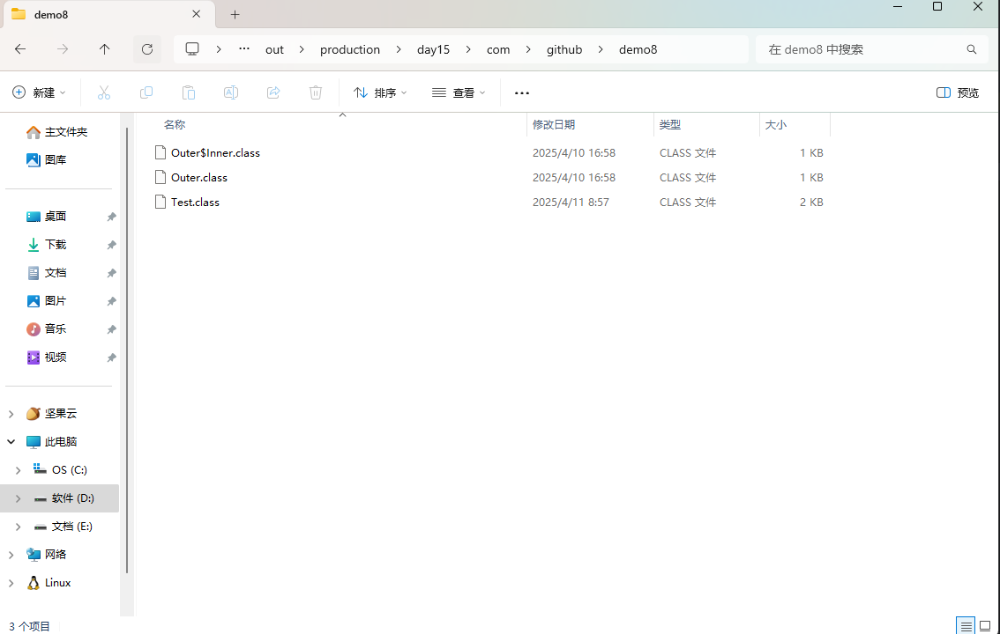
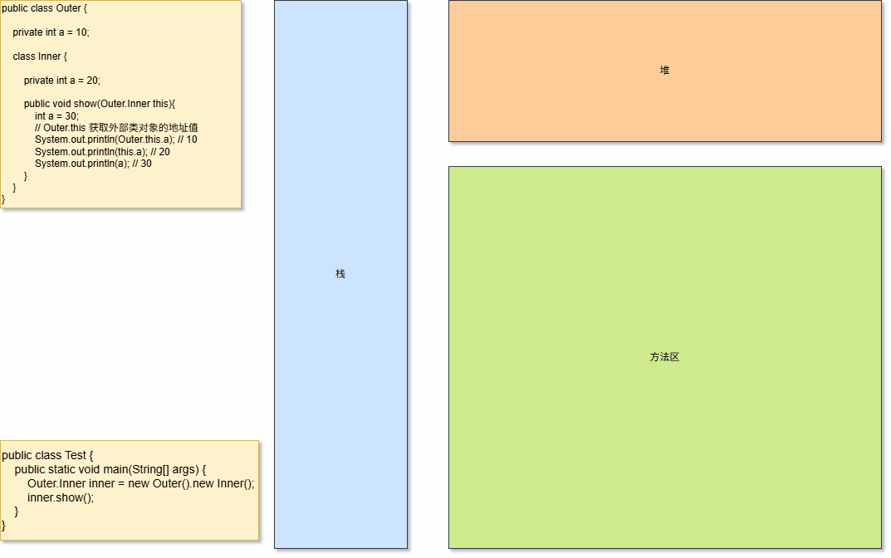
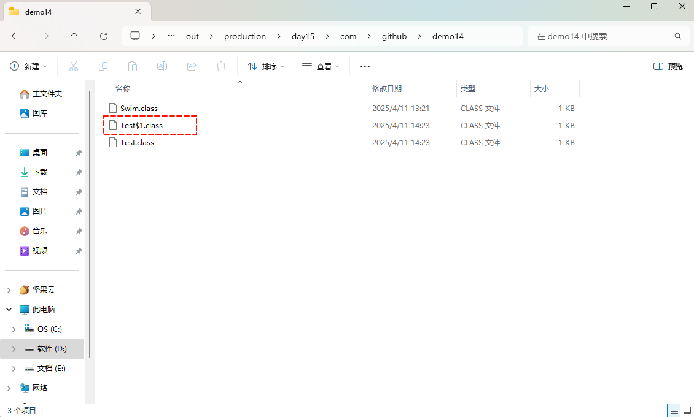
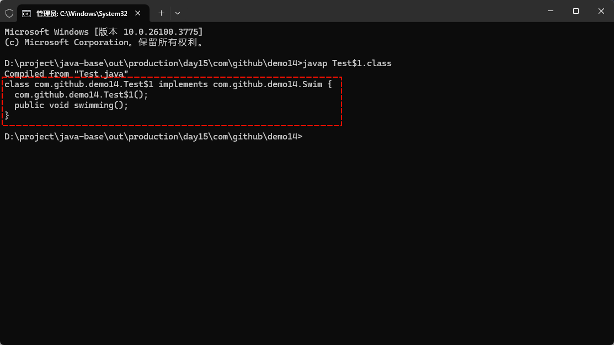

# 第一章：前言

## 1.1 概述

* 之前，我们学过类的定义，如下所示：

```java
public class 类名 {
    ① 成员变量(代表属性，一般是名词)
    ② 成员方法(代表行为，一般是动词)
    ③ 构造器
    ④ 代码块
    ⑤ 内部类（后面学习）    
}
```

* 到目前为止，我们已经学习过了`类`的`成员变量`、`成员方法`、`构造器`以及`代码块`，接下来我们将学习`类`的`内部类`。

## 1.2 什么是内部类 

### 1.2.1 回顾嵌套循环

* 所谓的嵌套循环，是指一个循环结构 A 的循环体是另一个循环结构 B 。例如：for 循环里面还有一个for 循环，就是嵌套循环。
* 语法：

```java
for(初始化语句①; 循环条件语句②; 迭代语句⑦) {
    for(初始化语句③; 循环条件语句④; 迭代语句⑥) {
      	循环体语句⑤;
    }
}
```

- 其中，for 、while 、do-while 均可以作为外层循环或内层循环。


> [!NOTE]
>
> - ① 实际上，嵌套循环就是将内层循环当成外层循环的循环体。当只有内层循环的循环条件为 false ，才会完全跳出内层循环，才可结束外层的当次循环，开始下一次循环。
> - ② 假设外层循环次数为 m 次，内层循环次数为 n 次，则内层循环体实际上需要执行 m × n 次。
> - ③ 从二维图形的角度看，外层循环控制`行数`，内层循环控制`列数`。
> - ④ 实际开发中，我们最多见到的嵌套循环是两层，一般不会出现超过三层的嵌套循环。如果将要出现，一定要停下来重新梳理业务逻辑，重新思考算法的实现，控制在三层以内；否则，可读性会很差。


* 示例：

```java
public class Main {
    public static void main(String[] args) {
        for (int i = 1; i <= 5; ++i) { // 外层循环
            for (int j = 1; j < 6; ++j) { // 内层循环
                System.out.print("* ");
            }
            System.out.println();
        }
    }
}
```

### 1.2.2 内部类的概念

* 所谓的内部类，就是在一个类的里面，再定义一个类，这个类被称为内部类。

> [!NOTE]
>
> 在 Java 中，允许一个类`Inner`的定义在另一个类`Outer`的内部，类`Inner`就被称为`内部类`，而类`Outer`就被称为`外部类`。

```java
public class Outer  { // 外部类
    
    public class Inner { // 内部类
        
    }
}
```


# 第二章：为什么要学习内部类？

## 2.1 概述

* 内部类表示的事物是外部类的一部分，内部类单独出现没有任何意义，如：汽车的`发送机`、人的`心脏`等。

## 2.2 应用示例

* 需求：写一个 JavaBean 类用来描述汽车。

> [!NOTE]
>
> 属性：汽车的品牌、车龄、颜色、发动机的品牌以及发动机的使用年限。


* 示例：

```java
public class Car {
    
    String carName;
    
    int carAge;
    
    String carColor;
    
    // 不太好，显得太分散了（发动机应该是整体）
    String engineName;
    
    // 不太好，显得太分散了（发动机应该是整体）
    int engineAge;
}
```


* 示例：内部类表示的事物是外部类的一部分，内部类单独出现没有任何意义

```java
public class Car { // 外部类

    String carName;

    int carAge;

    String carColor;

    // 非常棒，很好地显示了发送机是个整体，并且依赖于汽车，是汽车的一部分
    class Engine { // 内部类
        
        String engineName;

        int engineAge;
    }
}
```

## 2.3 特点

* ① 内部类可以直接访问外部类的成员，包括私有成员。
* ② 外部类要想访问内部类的成员，必须创建对象。


* 示例：内部类可以直接访问外部类的成员，包括私有成员

```java {19-24}
package com.github.demo8;

public class Car {

    String carName;

    int carAge;

    String carColor;

    class Engine {

        String engineName;

        int engineAge;

        // 内部类可以直接访问外部类的成员，包括私有成员。
        public void show(){ 
            System.out.println(engineName);
            System.out.println(engineAge);

            System.out.println(carName);
            System.out.println(carAge);
            System.out.println(carColor);
        }
    }
}
```


* 示例：外部类要想访问内部类的成员，必须创建对象

```java {15-18}
package com.github.demo8;

public class Car {

    String carName;

    int carAge;

    String carColor;

    // 外部类要想访问内部类的成员，必须创建对象
    public void show(Car this){
        // this 表示调用者的地址
        System.out.println(this.carName);
        // 此时，show 方法中没有 Engine 对象，所以要创建对象
        Engine engine = new Engine();
        System.out.println(engine.engineName);
        System.out.println(engine.engineAge);
        engine.show();
    }
    
    class Engine {

        String engineName;

        int engineAge;

        // 内部类可以直接访问外部类的成员，包括私有成员。
        public void show(){
            System.out.println(engineName);
            System.out.println(engineAge);

            System.out.println(carName);
            System.out.println(carAge);
            System.out.println(carColor);
        }
    }
}
```

## 2.4 JDK 中的内部类

* JDK 中的 ArrayList 类中就有内部类的身影。


* 示例：

```java
public class ArrayList<E> extends AbstractList<E>
        implements List<E>, RandomAccess, Cloneable, java.io.Serializable {   
    
	public Iterator<E> iterator() {
        // 外部类要想访问内部类的成员，必须创建对象。
        return new Itr();
    }

    /**
     * 内部类
     */
    private class Itr implements Iterator<E> { // [!code highlight]
        int cursor;       // index of next element to return
        int lastRet = -1; // index of last element returned; -1 if no such
        int expectedModCount = modCount;

        // prevent creating a synthetic constructor
        Itr() {}

        public boolean hasNext() {
            return cursor != size;
        }

        @SuppressWarnings("unchecked")
        public E next() {
            checkForComodification();
            int i = cursor;
            if (i >= size)
                throw new NoSuchElementException();
            Object[] elementData = ArrayList.this.elementData;
            if (i >= elementData.length)
                throw new ConcurrentModificationException();
            cursor = i + 1;
            return (E) elementData[lastRet = i];
        }

        public void remove() {
            if (lastRet < 0)
                throw new IllegalStateException();
            checkForComodification();

            try {
                ArrayList.this.remove(lastRet);
                cursor = lastRet;
                lastRet = -1;
                expectedModCount = modCount;
            } catch (IndexOutOfBoundsException ex) {
                throw new ConcurrentModificationException();
            }
        }

        @Override
        public void forEachRemaining(Consumer<? super E> action) {
            Objects.requireNonNull(action);
            final int size = ArrayList.this.size;
            int i = cursor;
            if (i < size) {
                final Object[] es = elementData;
                if (i >= es.length)
                    throw new ConcurrentModificationException();
                for (; i < size && modCount == expectedModCount; i++)
                    action.accept(elementAt(es, i));
                // update once at end to reduce heap write traffic
                cursor = i;
                lastRet = i - 1;
                checkForComodification();
            }
        }

        final void checkForComodification() {
            if (modCount != expectedModCount)
                throw new ConcurrentModificationException();
        }
    }
    
    // 其余略
}    
```


# 第三章：内部类

## 3.1 内部类的分类

* 根据内部类`声明位置`的不同，可以将内部类分为如下两类：


## 3.2 成员内部类（非静态成员内部类）

### 3.2.1 语法

* 写在成员位置（类中方法外），属于外部类的成员。
* 语法：

```java
[权限修饰符2种] class 外部类名{
    [权限修饰符4种] [final] class 内部类名 {
        ...
    }
}
```

> [!NOTE]
>
> * ① 成员内部类可以被一些修饰符所修饰，如：private、默认、protected、public、abstract、final、static 等。
> * ② 在成员内部类里面，JDK16 之前不可以定义静态变量，JDK16 之后可以定义静态变量。
> * ③ 在创建内部类的对象时，对象中有一个隐含的 `Outer.this` 记录外部类的对象的地址值。
> * ④ 成员内部类编译之后有自己独立的字节码文件（class 文件），只不过是在内部类前面冠以`外部类名和$符号`，如：`Outer$Inner.class`。
> * ⑤ 成员内部类可以继承自己想要继承的父类以及实现自己想要实现的接口，和外部类（外部接口）无关。


* 示例：

```java {9}
public class Car { // 外部类

    String carName;

    int carAge;

    String carColor;

    class Engine { // 成员内部类（非静态成员内部类）
        
        String engineName;

        int engineAge;
    }
}
```


* 示例：

```java {9}
public class Car { // 外部类

    String carName;

    int carAge;

    String carColor;

    private class Engine { // 成员内部类（非静态成员内部类）
        
        String engineName;

        int engineAge;
    }
}
```


* 示例：

```java {9}
public class Car { // 外部类

    String carName;

    int carAge;

    String carColor;

    protected class Engine { // 成员内部类（非静态成员内部类）
        
        String engineName;

        int engineAge;
    }
}
```


* 示例：

```java {9}
public class Car { // 外部类

    String carName;

    int carAge;

    String carColor;

    public class Engine { // 成员内部类（非静态成员内部类）
        
        String engineName;

        int engineAge;
    }
}
```

### 3.2.2 如何创建成员内部类的对象

#### 3.2.2.1 方式一

* 在外部类中编写方法，对外提供内部的对象。

```java
public class Outer {

    class Inner {}

    public Inner getInstance(){
        return new Inner();
    }
}
```

> [!NOTE]
>
> 应用场景：通常应用于内部类使用`private`修饰。


* 示例：

::: code-group

```java {8,15-17} [Outer.java]
package com.github.demo8;

public class Outer {

    String name;


    class Inner { // [!code highlight]

        String name;

        int age;
    }

    public Inner getInstance(){
        return new Inner();
    }

}
```

```java [Test.java]
package com.github.demo8;

public class Test {
    public static void main(String[] args) {
        // 之前创建对象
        // 类名 对象名 = new 类名();
        Outer outer = new Outer();
        // 根据外部类对象调用方法获取内部类对象
        // Outer.Inner 表示内部类不能脱离外部类而存在，即：Inner 是 Outer 的内部类
        Outer.Inner inner = outer.getInstance();
        inner.name = "张三";
        inner.age = 18;
        System.out.println(inner.name + ":" + inner.age);
        // com.github.demo8.Outer$Inner@15aeb7ab
        System.out.println(inner); 
    }
}
```

:::


* 示例：

::: code-group

```java {8,15-17} [Outer.java]
package com.github.demo8;

public class Outer {

    String name;


    private class Inner { // [!code highlight]

        String name;

        int age;
    }

    public Inner getInstance(){
        return new Inner();
    }

}
```

```java [Test.java]
package com.github.demo9;

public class Test {
    public static void main(String[] args) {
        // 之前创建对象
        // 类名 对象名 = new 类名();
        Outer outer = new Outer();
        // 只能使用 Object 来接收，因为 Inner 是 private 权限
        Object inner = outer.getInstance();
        // com.github.demo9.Outer$Inner@41629346
        System.out.println(inner); 
    }
}
```

:::

#### 3.2.2.2 方式二

* 直接在外部类中创建内部类的对象。

```java
外部类名.内部类名 对象名 = 外部对象.内部对象;
```

> [!NOTE]
>
> 应用场景：通常应用于内部类使用`非private`修饰。


* 示例：

::: code-group

```java {8,15-17} [Outer.java]
package com.github.demo8;

public class Outer {

    String name;


    class Inner { // [!code highlight]

        String name;

        int age;
    }

    public Inner getInstance(){
        return new Inner();
    }

}
```

```java [Test.java]
package com.github.demo8;

public class Test {
    public static void main(String[] args) {

        // 外部类名.内部类名 对象名 = 外部类对象.内部类对象;
        // 因为内部类不能脱离外部类而存在，Outer.Inner 表示 Inner 是 Outer 的内部类
        Outer.Inner inner = new Outer().new Inner();
        inner.name = "张三";
        inner.age = 18;
        System.out.println(inner.name + ":" + inner.age);
    }
}
```

:::

### 3.2.3 成员内部类的特点

* 成员内部类编译之后有自己独立的字节码文件（class 文件），只不过是在内部类前面冠以`外部类名和$符号`，如：`Outer$Inner.class`。


* 示例：

::: code-group

```java {8,15-17} [Outer.java]
package com.github.demo8;

public class Outer {

    String name;


    class Inner { // [!code highlight]

        String name;

        int age;
    }

    public Inner getInstance(){
        return new Inner();
    }

}
```

```java [Test.java]
package com.github.demo8;

public class Test {
    public static void main(String[] args) {

        // 外部类名.内部类名 对象名 = 外部类对象.内部类对象;
        // 因为内部类不能脱离外部类而存在，Outer.Inner 表示 Inner 是 Outer 的内部类
        Outer.Inner inner = new Outer().new Inner();
        inner.name = "张三";
        inner.age = 18;
        System.out.println(inner.name + ":" + inner.age);
    }
}
```

:::

* 编译后的字节码文件，如下所示：




### 3.2.3 成员内部类如何获取外部类的成员变量？

* 在创建内部类的对象时，对象中有一个隐含的 `外部类.this` 记录外部类的对象的地址值。
* 如果在内部类中有变量和外部类的成员变量相同，可以使用 `外部类.this.变量名` 进行区别。


* 示例：

::: code-group

```java [Outer.java]
package com.github.demo10;

public class Outer {

    private int a = 10;

    class Inner {

        private int a = 20;

        public void show(Outer.Inner this){
            int a = 30;
            // Outer.this 获取外部类对象的地址值
            System.out.println(Outer.this.a); // 10
            System.out.println(this.a); // 20
            System.out.println(a); // 30
        }
    }
}
```

```java [Test.java]
package com.github.demo10;

public class Test {
    public static void main(String[] args) {
        Outer.Inner inner = new Outer().new Inner();
        inner.show();
    }
}
```

:::

* 其内存动态图，如下所示：



### 3.2.4 证明

* 我们可以通过`JOL`工具或 IDEA 的`JclassLib`插件来证明成员内部类对象中有一个隐含的 `外部类.this` 记录外部类的对象的地址值。


* 示例：


## 3.3 静态成员内部类

### 3.3.1 语法

* 写在成员位置（类中方法外），属于外部类的成员。和成员内部类不同的是，使用`static`关键字修饰。
* 语法：

```java
[权限修饰符2种] class 外部类名{
    [权限修饰符4种] static [final] class 内部类名 {
        ...
    }
}
```

> [!NOTE]
>
> * ① 静态内部类可以直接访问外部类的静态成员。
> * ② 静态内部类不可以直接访问外部类的非静态成员，如果需要访问需要创建外部类的对象。
> * ③ 静态内部类没有`外部类.this`变量。

### 3.3.2 如何创建静态内部类的对象

* 语法：

```java
外部类.内部类 对象 = new 外部类.静态内部类();
```


* 示例：

::: code-group

```java [Outer.java]
package com.github.demo11;

public class Outer {
    
    static class Inner {}
    
}
```

```java [Test.java]
package com.github.demo11;

public class Test {
    public static void main(String[] args) {
        Outer.Inner inner = new Outer.Inner();
    }
}
```

:::

### 3.3.4 调用静态内部类成员

* 如果是调用静态内部类的非静态成员，需要先创建`对象`，再通过对象调用：

```java
Outer.Inner inner = new Outer.Inner();
inner.xxx = 'aa'; // 调用属性
inner.yyy(); // 调用方法   
```

* 如果是调用静态内部类的静态成员，直接`外部类.静态内部类.成员`：

```java
Outer.Innter.xxx ; // 调用静态内部类的静态属性
Outer.Innter.yyy() ; // 调用静态内部类的静态方法
```


* 示例：调用静态内部类的非静态成员

::: code-group

```java [Outer.java]
package com.github.demo11;

public class Outer {

    static class Inner {

        String name = "许大仙"; // [!code highlight]

        public void show(){ // [!code highlight]
            System.out.println(name);
        }

    }

}
```

```java [Test.java]
package com.github.demo11;

public class Test {
    public static void main(String[] args) {
        Outer.Inner inner = new Outer.Inner();
        System.out.println(inner.name); // [!code highlight]
        inner.show(); // [!code highlight]
    }
}
```

:::


* 示例：调用静态内部类的静态成员

::: code-group

```java [Outer.java]
package com.github.demo11;

public class Outer {

    static class Inner {

        static String name = "许大仙"; // [!code highlight]

        public static void show(){ // [!code highlight]
            System.out.println(name);
        }

    }

}
```

```java [Test.java]
package com.github.demo11;

public class Test {
    public static void main(String[] args) {
        System.out.println(Outer.Inner.name); // [!code highlight]
        Outer.Inner.show(); // [!code highlight]
    }
}
```

:::

## 3.4 局部内部类（有名字的局部内部类）

* 定义在方法内部的类（鸡肋，实际开发中，使用为 0 ）。
* 语法：

```java
[权限修饰符] class 外部类 {
    [权限修饰符] 返回值类型 方法名(形参列表){
        [abstract|final] class 内部类 {
            ...
        }
    }
}
```

> [!NOTE]
>
> * ① 外界是无法访问局部内部类的，需要在方法内部创建对象并使用。
> * ② 局部内部类可以直接访问外部类的成员，也可以访问方法内的局部变量。


* 示例：

::: code-group

```java [Outer.java]
package com.github.demo12;

public class Outer {

    static String name = "张三";
    int age = 30;

    public static void outerMethod() {
        // 局部内部类
        class Inner2 { // [!code highlight]
            public void innerMethod() {
                System.out.println(name);
            }
        }

        Inner2 inner2 = new Inner2();
        inner2.innerMethod();
    }

    public void method() {
        // 局部变量
        int number = 10;
        // 局部内部类
        class Inner { // [!code highlight]

            public void innerMethod() {
                System.out.println(Outer.this.age);
                System.out.println(name);
                System.out.println(number);
            }
        }

        Inner inner = new Inner();
        inner.innerMethod();
    }

}
```

```java [Test.java]
package com.github.demo12;

public class Test {
    public static void main(String[] args) {
        Outer.outerMethod();
        Outer outer = new Outer();
        outer.method();
    }
}
```

:::

## 3.5 匿名内部类（⭐）

### 3.5.1 匿名对象

* 语法：

```java
new 类名();
```

> [!NOTE]
>
> 没有名字的对象，通常应用于对象只使用一次的场景。


* 示例：

::: code-group

```java [Student.java]
package com.github.demo13;

public class Student {

    private String name;

    private int age;

    public Student() {}

    public Student(String name, int age) {
        this.name = name;
        this.age = age;
    }

    public String getName() {
        return name;
    }

    public void setName(String name) {
        this.name = name;
    }

    public int getAge() {
        return age;
    }

    public void setAge(int age) {
        this.age = age;
    }

    public void study() {
        System.out.println(this.getName() + ":" + "正在学习~");
    }

}
```

```java [Test.java]
package com.github.demo13;

public class Test {
    public static void main(String[] args) {
        show(new Student("张三",18)); // [!code highlight]
        show(new Student("李四",20)); // [!code highlight]
    }

    public static void show(Student stu){
        stu.study();
    }
}
```

```txt [cmd 控制台]
张三:正在学习~
李四:正在学习~
```

:::

### 3.5.2 概述

* 匿名内部类的本质是隐藏了名字（不需要我们定义名字，由系统给我们创建）并继承类或实现接口的局部内部类对象。

### 3.5.3 语法

* 语法：

```java
new 类名或接口名(){
    重写方法();
}
```

> [!NOTE]
>
> 匿名内部类包含了以下三种含义：
>
> * ① 继承或实现关系。
> * ② 方法重写。
> * ③ 创建对象。


* 示例：

::: code-group

```java [Swim.java]
package com.github.demo14;

public interface Swim {

    void swimming();
}
```

```java [Test.java]
package com.github.demo14;

public class Test {
    public static void main(String[] args) {
        Swim swim = new Swim(){ // [!code highlight]
            @Override
            public void swimming() {
                System.out.println("游泳~");
            }
        };

        swim.swimming();
    }
}
```

:::

### 3.5.4 如何理解匿名内部类？

* 之前，我们都是创建某个实现类，去继承某个类（抽象类）或实现某个接口，并重写其中的所有抽象方法，然后通过多态来调用抽象方法，如下所示：

::: code-group

```java [Swim.java]
public interface Swim {

    void swimming();
}
```

```java [Student.java]
public class Student implements Swim{ // [!code highlight]
    @Override
    public void swimming() { // [!code highlight]
        System.out.println("重写了游泳方法~");
    }
}
```

```java [Test.java]
public class Test {
    public static void main(String[] args) {        
        Swim swim = new Student(); // [!code highlight]
        swim.swimming(); // [!code highlight]
    }
}
```

:::

* 其图示，如下所示：


* 我们可以解析下实现类（子类），如下所示：

```java
public class Student implements Swim{ // [!code highlight]
    @Override
    public void swimming() { // [!code highlight]
        System.out.println("重写了游泳方法~");
    }
}
```

* 其图示，如下所示：


* 如果将`类名`删除，不就变为了没有名字的类（匿名类）吗？


* 此时，这个没有名字的类（匿名类）想要实现接口，就需要将接口写在`{}`前面，表示这个匿名类实现了接口，并重写了接口中所有的抽象方法，如下所示：


* 之前，我们创建匿名对象是这样的，如下所示：

```java
new 类名();
```

* 现在，我们给匿名类创建对象也是同样的道理，如下所示：

```java
new 类名或接口名() {
  重写方法  
};
```

* 其图示，如下所示：


* 而所谓的`匿名内部类`中的`内部类`指的是该语法只能定义在方法内部，不可以定义在成员位置，如下所示：

```java
public class Test {
    public static void main(String[] args) {
        new Swim(){ // 只能定义在方法内部，现在就是匿名内部类
            @Override
            public void swimming() {
                System.out.println("游泳~");
            }
        };
    }
}
```

* 剖析下匿名内部类的特点之一：`继承或实现关系`，如下所示：


* 剖析下匿名内部类的特点之一：`重写方法`，如下所示：


* 剖析下匿名内部类的特点之一：`创建对象`，如下所示：


### 3.5.5 证明

* 假设代码是这样的，如下所示：

::: code-group

```java [Swim.java]
package com.github.demo14;

public interface Swim {

    void swimming();
}
```

```java [Test.java]
package com.github.demo14;

public class Test {
    public static void main(String[] args) {
        Swim swim = new Swim(){ // [!code highlight]
            @Override
            public void swimming() {
                System.out.println("游泳~");
            }
        };

        swim.swimming();
    }
}
```

:::

* 编译完毕之后，将在磁盘上产生这样的文件，如下所示：



* 我们可以使用 Java 提供的反编译工具，对该字节码文件进行反编译，如下所示：

```java
javap Test$1.class
```

> [!NOTE]
>
> 所谓的匿名并不是没有名字，而是由 Java 在底层编译的时候替我们给生成的类命名，只是程序员看到没有给类进行命名！！！



### 3.5.6 应用场景

* 当我们希望定义一个只使用一次的类时，就可以考虑使用匿名内部类。匿名内部类出现的目的就是为了简化代码。


* 示例：没有使用匿名内部类

::: code-group

```java [Swim.java]
public interface Swim {

    void swimming();
}
```

```java [Student.java]
public class Student implements Swim {

    @Override
    public void swimming() {
        System.out.println("重写了 swimming 方法");
    }
}
```

```java [Test.java]
public class Test {
    public static void main(String[] args) {
        new  Student().swimming();
    }
}
```

:::


* 示例：使用匿名内部类

::: code-group

```java [Swim.java]
public interface Swim {

    void swimming();
}
```

```java [Test.java]
public class Test {
    public static void main(String[] args) {
        new Swim(){
            @Override
            public void swimming() {
                System.out.println("游泳~");
            }
        }.swimming();
        
        Swim swim = new Swim(){
            @Override
            public void swimming() {
                System.out.println("游泳~");
            }
        };

        swim.swimming();
    }
}
```

:::


* 示例：使用匿名内部类

::: code-group

```java [Swim.java]
public interface Swim {

    void swimming();
}
```

```java [Test.java]
public class Test {
    public static void main(String[] args) {
        goSwimming(new Swim() {
            @Override
            public void swimming() {
                System.out.println("重写了 swimming 方法");
            }
        });
    }

    // 定义一个方法,模拟请一些人去游泳
    public static void goSwimming(Swim s) {
        s.swimming();
    }
}
```

:::

### 3.5.7 总结

#### 3.5.7.1 总结一

* 【问】什么是匿名内部类？
* 【答】隐藏了名字（不需要我们定义名字，由系统给我们命名）并继承类或实现接口的局部内部类对象。

#### 3.5.7.2 总结二

* 【问】匿名内部类格式的细节（`new 类名或接口名(){重写方法}`）？
* 【答】继承或实现关系，方法重写，创建对象，即：一个类的子类对象或接口的实现类对象。

#### 3.5.7.3 总结三

* 【问】使用场景？
* 【答】当方法的参数是类或接口的时候，如果实现类只需要使用一次，就可以使用匿名内部类来简化代码。
