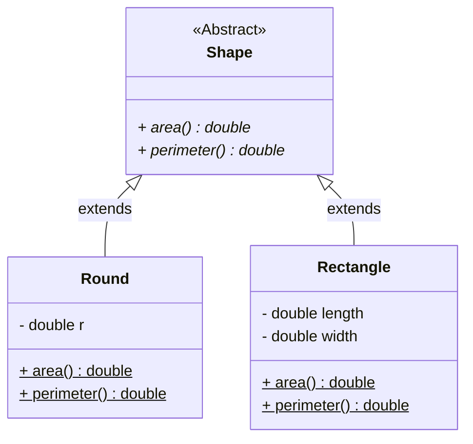
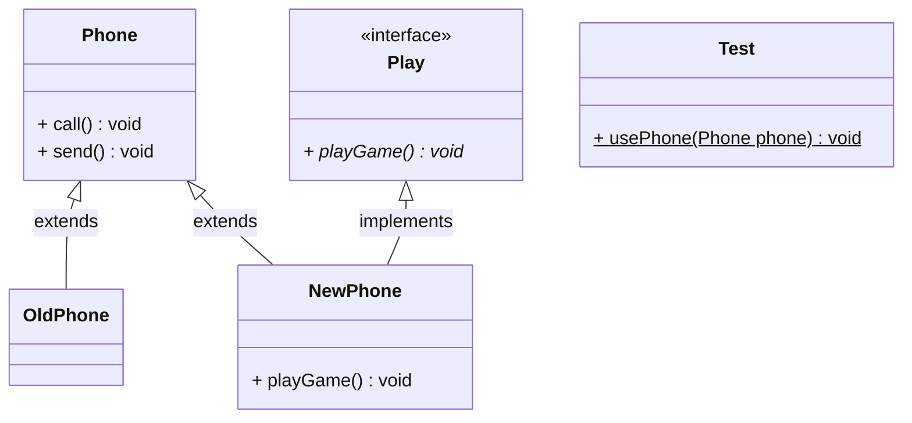

# 第一章：题目 1

## 1.1 概述

* ① 定义形状类（Shape），功能有：求面积、求周长。 
* ② 定义圆形类（Round），属性有：半径；功能有：求面积、求周长。
* ③ 定义长方形类（Rectangle），属性有：长和宽，功能有：求面积、求周长。
* ④ 定义测试类，创建圆形对象和长方形对象，为其属性赋值，并调用求面积和求周长的方法。

## 1.2 类图

* 其类继承体系设计，如下所示：



## 1.3 应用示例

* 示例：

::: code-group

```java [Shape.java]
package com.github.test1;

/**
 * 形状类
 */
public abstract class Shape {

    /**
     * 计算面积
     * @return 面积
     */
    public abstract double area();

    /**
     * 计算周长
     * @return 周长
     */
    public abstract double perimeter();

}
```

```java [Round.java]
package com.github.test1;

import static java.lang.Math.PI;

/**
 * 圆形类
 */
public class Round extends Shape {

    private double r;

    @Override
    public double area() {
        return PI * r * r;
    }

    @Override
    public double perimeter() {
        return 2 * PI * r;
    }

    public Round() {
    }

    public Round(double r) {
        this.r = r;
    }

    public double getR() {
        return r;
    }

    public void setR(double r) {
        this.r = r;
    }
}
```

```java [Rectangle.java]
package com.github.test1;

/**
 * 长方形类
 */
public class Rectangle extends Shape{

    private double length;

    private double width;

    @Override
    public double area() {
        return length * width;
    }

    @Override
    public double perimeter() {
        return (length + width) * 2;
    }

    public Rectangle() {
    }

    public Rectangle(double length, double width) {
        this.length = length;
        this.width = width;
    }

    public double getLength() {
        return length;
    }

    public void setLength(double length) {
        this.length = length;
    }

    public double getWidth() {
        return width;
    }

    public void setWidth(double width) {
        this.width = width;
    }
}
```

```java [Test.java]
package com.github.test1;

public class Test {
    public static void main(String[] args) {
        Round round = new Round(1);
        double area = round.area();
        System.out.println("area = " + area);
        double perimeter = round.perimeter();
        System.out.println("perimeter = " + perimeter);

        System.out.println("----------------");
        Rectangle rectangle = new Rectangle(1,2);
        double are2 = rectangle.area();
        System.out.println("are2 = " + are2);
        double perimeter2 = rectangle.perimeter();
        System.out.println("perimeter2 = " + perimeter2);

    }
}

```

:::


# 第二章：题目 2

## 2.1 概述

* ① 定义手机类，行为：打电话、发短信。
* ② 定义接口 Play，行为：玩游戏。
* ③ 定义旧手机继承手机类，行为是继承父类的行为。
* ④ 定义新手机继承手机类并实现 Play 接口，行为是继承父类的行为，重写玩游戏的方法。
* ⑤ 在测试类中定义一个用手机的方法，要求该方法既能接收老手机对象，也能接收新手机对象，在该方法内部调用打电话。发短信以及新手机特有的玩游戏方法。

## 2.2 类图

* 其类继承体系设计，如下所示：



## 2.3 应用示例

* 示例：

::: code-group

```java [Phone.java]
package com.github.test2;

public class Phone {

    public void call(){
        System.out.println("打电话");
    }

    public void send(){
        System.out.println("发短信");
    }
}
```

```java [Play.java]
package com.github.test2;

public interface Play {

    void playGame();

}
```

```java [OldPhone.java]
package com.github.test2;

public class OldPhone extends Phone{}
```

```java [NewPhone.java]
package com.github.test2;

public class NewPhone extends Phone implements Play{
    @Override
    public void playGame() {
        System.out.println("玩游戏");
    }
}
```

```java [Test.java]
package com.github.test2;

public class Test {
    public static void main(String[] args) {
        usePhone(new OldPhone());

        System.out.println("---------------");

        usePhone(new NewPhone());
    }

    public static void usePhone(Phone phone){
        phone.call();
        phone.send();
        if(phone instanceof NewPhone newPhone){
            newPhone.playGame();
        }
    }
}
```

:::


# 第三章：题目 3

## 3.1 概述

* 接口 Play 中有一个方法 playGame()，如何在测试类中调用该方法。

## 3.2 应用示例

* 示例：通过子类实现接口的方式

::: code-group

```java [Play.java]
package com.github.test3;

public interface Play {

    void playGame();

}
```

```java [Phone.java]
package com.github.test3;

public class Phone implements Play{
    @Override
    public void playGame() {
        System.out.println("王者荣耀");
    }
}
```

```java [Test.java]
package com.github.test3;

public class Test {
    public static void main(String[] args) {
        Play play = new Phone();
        play.playGame();
    }
}
```

:::


* 示例：通过匿名内部类的方式

::: code-group

```java [Play.java]
package com.github.test3;

public interface Play {

    void playGame();

}
```

```java [Test.java]
package com.github.test3;

public class Test {
    public static void main(String[] args) {

        Play play2 = new Play() {
            @Override
            public void playGame() {
                System.out.println("玩王者荣耀");
            }
        };
        
        play2.playGame();
    }
}
```

:::


# 第四章：题目 4

## 4.1 概述

* 一个抽象类 Fun 中有一个抽象方法 fun() ，在测试类中如何调用该方法?

## 4.2 应用示例

* 示例：通过子类实现接口的方式

::: code-group

```java [Fun.java]
package com.github.test4;

public abstract class Fun {

    public abstract void fun();

}
```

```java [Bird.java]
package com.github.test4;

public class Bird extends Fun{
    @Override
    public void fun() {
        System.out.println(" fun ... ");
    }
}
```

```java [Test.java]
package com.github.test4;

public class Test {
    public static void main(String[] args) {
        Fun fun = new Bird();
        fun.fun();
    }
}
```

:::


* 示例：通过匿名内部类的方式

::: code-group

```java [Fun.java]
package com.github.test4;

public abstract class Fun {

    public abstract void fun();

}
```

```java [Test.java]
package com.github.test4;

public class Test {
    public static void main(String[] args) {
        Fun fun = new Fun() {
            @Override
            public void fun() {
                System.out.println(" fun ...");
            }
        };
        fun.fun();
    }
}

```

:::

