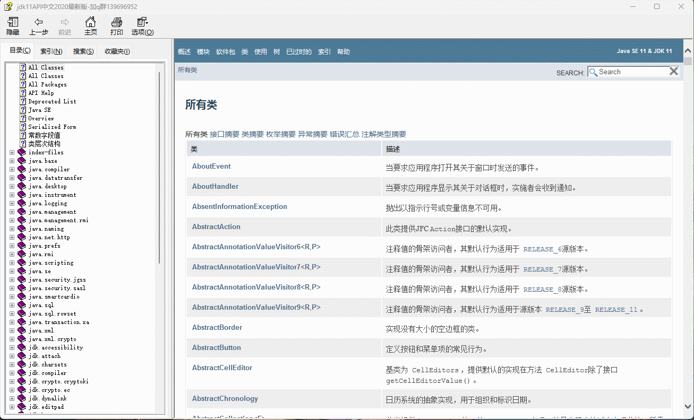
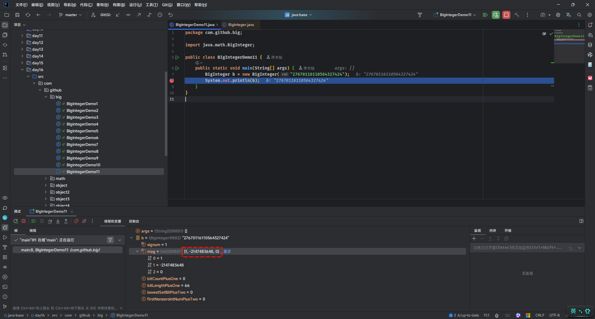
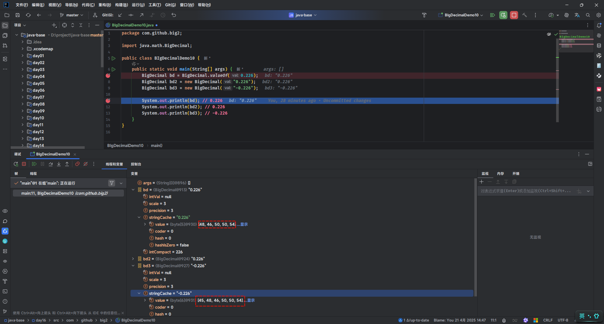

# 第一章：API 和 API 帮助文档

## 1.1 概述

* 之前我们已经学习过了面向对象了。并且我们知道，面向对象具体就是两个部分：
  * ① `如何使用别人已经写好的东西`。
  * ② `我们自己如何设计一个类，并使用`。
* 之前，我们都是学习`自己如何设计一个类，并使用`。但是，不可能所有的功能都是我们自己去手动实现，这样效率太低。

> [!NOTE]
>
> * ① 为了降低开发的难度，Java 官方将一些常用的功能进行了封装，并形成 API 供我们调用。
> * ② 有的时候，我们需要实现一些功能，Java 官方并没有实现，如：通过 Java 代码去操作 Word、Excel 等，这个时候就需要调用一些第三方库提供的 API，如：Apache POI 等。

* 之后，在学习和工作的时候，我们也需要学习`如何使用别人已经写好的东西`。

## 1.2 ISA、ABI 和 API

* ISA 、ABI 和 API 的参考模型，如下所示：


* 在底层，硬件模型以指令集架构 （ISA） 表示，该架构定义了处理器、寄存器、存储器和中断管理的指令集。ISA 是硬件和软件之间的接口，对于操作系统 （OS） 开发人员 （System ISA） 和直接管理底层硬件的应用程序 （User ISA） 的开发人员来说非常重要。

> [!NOTE]
>
> - ① ISA 是计算机体系结构中定义的一组指令，它规定了处理器能够执行的操作。ISA 包括指令的编码、寄存器的使用、内存访问模式等。不同的处理器可能有不同的 ISA，例如：x86、ARM、MIPS 等。
> - ② 在设计一个新的操作系统时，开发者需要确保操作系统能够支持特定的 ISA ，以便在特定的硬件上运行。例如：如果操作系统旨在运行在 ARM 架构的处理器上，那么它必须能够理解和执行 ARM ISA 定义的指令集。

* 应用程序二进制接口 （ABI） 将`操作系统层`与由操作系统管理的`应用程序`和`库`分开。ABI 涵盖了低级数据类型、对齐方式和调用约定等详细信息，并定义了可执行程序的格式。系统调用在此级别定义。此接口允许应用程序和库在实现相同 ABI 的操作系统之间移植。

> [!NOTE]
>
> - ① ABI 是指在二进制级别上，应用程序与操作系统、库或应用程序的不同部分之间的接口。它定义了数据类型的大小、布局、对齐方式，以及函数调用的约定（如参数如何传递、返回值如何处理等）。ABI 确保了编译后的二进制文件能够在特定的操作系统和硬件平台上正确地运行。
> - ② 在 windows 上的应用程序的运行格式是：`PE`（portable executable）格式、`.dll` （dynamic link library）格式和 `.lib` 格式；而在 Linux 上的应用程序的运行格式是：`ELF`（executable and linking format）格式、`.so` （shared object）格式和 `.a` 格式。
> - ③ 在 Linux 中可以通过 `file /bin/ls` 命令查看指定可执行应用程序的 ABI 格式；从而也可以论证，在 Windows 上可以运行的程序，在 Linux 上运行不了。
> - ④ 当开发者在 Linux 系统上编写 C 语言程序，并使用特定的编译器（如：GCC）编译时，编译器会遵循 Linux 平台的 ABI 规范来生成二进制文件。这样，生成的可执行文件就可以在任何遵循相同 ABI 规范的 Linux 系统上运行。
> - ⑤ 如果一个应用程序需要跨平台（操作系统）运行，就需要使用`一套代码，多平台编译`的方式（针对 C 或 C++ 等），即：相同的源代码，在不同平台（操作系统）上使用特定平台的编译器（如：GCC）来分别编译成符合自己平台的 ABI 规范的二进制文件。

* 最高级别的抽象由应用程序编程接口 （API） 表示，它将`应用程序`连接到`库`或`底层操作系统`。

> [!NOTE]
>
> - ① API 是一组预定义的函数、协议和工具，用于构建软件和应用程序。API 允许不同的软件系统相互交互，它定义了软件组件之间如何相互通信。API 可以是库、框架、协议或服务。
> - ② 在 Web 开发中，开发者可能会使用 JavaScript 的 Fetch API 来与服务器进行通信，获取数据或提交表单。这个 API 提供了一种标准化的方式来发送 HTTP 请求和处理响应，而不需要开发者关心底层的网络协议细节。

## 1.3 API

* `API`（`A`pplication `P`rogramming `I`nterface）：应用程序编程接口。

> [!NOTE]
>
> API 的简单理解：API 就是别人已经写好的东西，我们不需要自己编写，直接使用。（无情的调参侠）

* `Java API`：指的是 JDK 中提供的各种功能的 Java 类。

> [!NOTE]
>
> * ① Java API（应用程序编程接口）是 Java 编程语言提供的一组预定义的类、接口、方法和工具，它们用于帮助开发人员快速构建应用程序。
> * ② Java API 是 Java 平台的重要组成部分，提供了大量的功能模块，开发人员可以直接使用这些模块来避免重复造轮子。
> * ③ Java API 涵盖了广泛的领域，包括输入/输出、网络、数据库连接、图形用户界面等。
> * ④ 这些类将底层的实现封装起来，我们并不需要关心这些类是如何实现的，只需要学习如何使用这些类。

* `第三方 API`：指的是开源组织或个人提供用于实现特定功能的 Java 类，如：Apache 的 POI 。

## 1.4 API 帮助文档

* Java 本身提供的 API 实在是太多太多，如果每个类，我们都需要背诵并记忆，那么我们想哭的心都有，如下所示：



* 为了帮助开发人员（程序员）能快速的搜索、了解以及学习的 Java 中的 API，Java 提供了文档，如下所示：

> [!NOTE]
>
> Java 中的`API 帮助文档`是通过`java doc`工具根据`文档注释`来生成的！！！


## 1.5 API 学习方法（⭐）

* ① 千万不要去背 Java 中的 API （根据背不完），因为 Java 中的 API 实现是太多了！！！
* ② 只需要记住`类名`和`类的作用`就可以了。
* ③ 平常养成查询 API 帮助文档的习惯。


# 第二章：Objects 类（⭐）

## 2.1 概述

* Objects 是一个工具类，用于操作对象或在操作前检查某些条件。
* Objects 可以用来检测 null、nonNull、计算对象的 hashCode、返回对象的字符串、比较两个对象等。

## 2.2 常用 API

### 2.2.1 比较两个对象是否相等

* 先做非空判断，再比较两个对象：

```java
public static boolean equals(Object a, Object b) { // [!code focus]
    return (a == b) || (a != null && a.equals(b));
} // [!code focus]
```

> [!NOTE]
>
> * ① 首先判断 a 是否为 null，如果为 null，直接返回 false。
> * ② 如果 a 不为 null，那么就利用 a 再次调用 equals() 方法。
> * ③ 如果 a 是 Student 类型，那么最终还是会调用 Student 中重写的 equals() 方法。
> * ④ 如果 a 是 Student 类型，但是 Student 没有重写 equals() 方法，那么就会比较地址值。


* 示例：

```java
package com.github.objects1;

import java.util.Objects;

public class Test {
    public static void main(String[] args) {
        String str1 = null;
        String str2 = "hello";
        String str3 = "world";

        System.out.println(Objects.equals(str1, str2)); // false
        System.out.println(Objects.equals(str2, str3)); // false
    }
}
```

### 2.2.2 判断对象是否为空

* 判断某个对象是否为 null ：

```java
public static boolean isNull(Object obj) { // [!code focus]
    return obj == null;
} // [!code focus]
```

> [!NOTE]
>
> 如果对象为 null ，则返回 true；否则，返回 false 。


* 示例：

```java
package com.github.objects2;

import java.util.Objects;

public class Test {
    public static void main(String[] args) {
        String str1 = null;
        String str2 = "hello";

        System.out.println(Objects.isNull(str1)); // true
        System.out.println(Objects.isNull(str2)); // false
    }
}
```

### 2.2.3 判断对象是否不为空

* 判断某个对象是否为非 null：

```java
public static boolean nonNull(Object obj) { // [!code focus]
    return obj != null;
} // [!code focus]
```

> [!NOTE]
>
> 如果对象不为 null ，则返回 true；否则，返回 false 。


* 示例：

```java
package com.github.objects3;

import java.util.Objects;

public class Test {
    public static void main(String[] args) {
        String str1 = null;
        String str2 = "hello";

        System.out.println(Objects.nonNull(str1)); // false
        System.out.println(Objects.nonNull(str2)); // true
    }
}
```

### 2.2.4 检查对象是否为非空

* 检查对象是否为非空：

```java
public static <T> T requireNonNull(T obj) { // [!code focus]
    if (obj == null)
        throw new NullPointerException();
    return obj;
} // [!code focus]
```

```java
public static <T> T requireNonNull(T obj, String message) { // [!code focus]
    if (obj == null)
        throw new NullPointerException(message);
    return obj;
} // [!code focus]
```

```java
public static <T> T requireNonNull(T obj, Supplier<String> messageSupplier) { // [!code focus]
    if (obj == null)
        throw new NullPointerException(messageSupplier == null ?
                                       null : messageSupplier.get());
    return obj;
} // [!code focus]
```

```java
public static <T> T requireNonNullElse(T obj, T defaultObj) { // [!code focus]
    return (obj != null) ? obj : requireNonNull(defaultObj, "defaultObj");
} // [!code focus]
```

```java
public static <T> T requireNonNullElseGet(T obj, Supplier<? extends T> supplier) { // [!code focus]
    return (obj != null) ? obj
            : requireNonNull(requireNonNull(supplier, "supplier").get(), 
                             "supplier.get()");
} // [!code focus]
```

> [!NOTE]
>
> 应用场景：
>
> * ① 错误诊断：尽量发现并阻止潜在的 NullPointerException。
> * ② 代码清晰度：显示的表达了参数或状态不能为空的要求。


* 示例：

::: code-group

```java [Person.java]
package com.github.objects5;

import java.util.Objects;

public class Person  {

    private String name;

    private int age;

    public Person() {}

    public Person(String name, int age) {
        this.name = name;
        this.age = age;
    }

    public String getName() {
        return name;
    }

    public void setName(String name) {
        this.name = name;
    }

    public int getAge() {
        return age;
    }

    public void setAge(int age) {
        this.age = age;
    }

    @Override
    public boolean equals(Object o) {
        if (o == null || getClass() != o.getClass()) return false;
        Person person = (Person) o;
        return getAge() == person.getAge() 
            && Objects.equals(getName(), person.getName());
    }

    @Override
    public int hashCode() {
        return Objects.hash(getName(), getAge());
    }

    @Override
    public String toString() {
        return "Person{" + "name='" + name + '\'' + ", age=" + age + '}';
    }
}
```

```java [Test.java]
package com.github.objects5;

import java.util.Objects;

public class Test {
    public static void main(String[] args) {
        register(new Person("张三", 18));
    }

    /**
     * 注册方法
     * @param p
     */
    public static void register(Person p) {
        // 判断非空，如果 p 是空，将抛出异常
        Person person = Objects.requireNonNull(p);
        /*
         * 其余的业务逻辑
         */
        System.out.println(person);
    }
}
```

```txt [cmd 控制台]
Person{name='张三', age=18}
```

:::

### 2.2.5 判断两个对象是否深层相等

* 判断两个对象是否深层相等：

```java
public static boolean deepEquals(Object a, Object b) { // [!code focus]
    if (a == b)
        return true;
    else if (a == null || b == null)
        return false;
    else
        return Arrays.deepEquals0(a, b);
} // [!code focus]
```

> [!NOTE]
>
> * ① 对于非数组对象之间的比较，和`Objects.equals(o1,o2)`行为保持一致。
> * ② 对于数组对象之间的比较（无论是基本数据类型还是引用数据类型，包括：多维数组），将递归比较数组中的元素是否相等。


* 示例：非数组对象的深层比较

::: code-group

```java [Person.java]
package com.github.objects6;

import java.util.Objects;

public class Person {

    private String name;

    private int age;

    public Person() {}

    public Person(String name, int age) {
        this.name = name;
        this.age = age;
    }

    public String getName() {
        return name;
    }

    public void setName(String name) {
        this.name = name;
    }

    public int getAge() {
        return age;
    }

    public void setAge(int age) {
        this.age = age;
    }

    @Override
    public boolean equals(Object o) {
        if (o == null || getClass() != o.getClass()) return false;
        Person person = (Person) o;
        return getAge() == person.getAge() 
            && Objects.equals(getName(), person.getName());
    }

    @Override
    public int hashCode() {
        return Objects.hash(getName(), getAge());
    }

    @Override
    public String toString() {
        return "Person{" + "name='" + name + '\'' + ", age=" + age + '}';
    }
}
```

```java [Test.java]
package com.github.objects6;

import java.util.Objects;

public class Test {
    public static void main(String[] args) {
        Person p1 = new Person("张三", 18);
        Person p2 = new Person("李四", 18);
        Person p3 = new Person("张三", 18);

        System.out.println(Objects.equals(p1, p2)); // false
        System.out.println(Objects.equals(p1, p3)); // true
        System.out.println(Objects.equals(p2, p3)); // false

        System.out.println("-----------");

        System.out.println(Objects.deepEquals(p1, p2)); // false
        System.out.println(Objects.deepEquals(p1, p3)); // true
        System.out.println(Objects.deepEquals(p2, p3)); // false
    }
}

```

```txt[cmd 控制台]
false
true
false
-----------
false
true
false
```

:::


* 示例：数组对象的深层比较

::: code-group

```java [Test.java]
package com.github.objects6;

import java.util.Objects;

public class Test {
    public static void main(String[] args) {
        int[] arr1 = {1, 2, 3};
        int[] arr2 = {1, 2, 3};
        int[] arr3 = {1, 2, 4};

        System.out.println(Objects.equals(arr1, arr2)); // false
        System.out.println(Objects.equals(arr1, arr3)); // false
        System.out.println(Objects.equals(arr2, arr3)); // false

        System.out.println("----------------------------------");

        System.out.println(Objects.deepEquals(arr1, arr2)); // true
        System.out.println(Objects.deepEquals(arr1, arr3)); // false
        System.out.println(Objects.deepEquals(arr2, arr3)); // false
    }
}
```

```txt[cmd 控制台]
false
false
false
----------------------------------
true
false
false
```

:::


* 示例：数组对象的深层比较

::: code-group

```java [Test.java]
package com.github.objects6;

import java.util.Objects;

public class Test {
    public static void main(String[] args) {
        int[][] arr1 = {{1, 2}, {3, 4}};
        int[][] arr2 = {{1, 2}, {3, 4}};
        int[][] arr3 = {{1, 2}, {3, 5}};

        System.out.println(Objects.equals(arr1, arr2)); // false
        System.out.println(Objects.equals(arr1, arr3)); // false
        System.out.println(Objects.equals(arr2, arr3)); // false

        System.out.println("----------------------------------");

        System.out.println(Objects.deepEquals(arr1, arr2)); // true
        System.out.println(Objects.deepEquals(arr1, arr3)); // false
        System.out.println(Objects.deepEquals(arr2, arr3)); // false
    }
}
```

```txt[cmd 控制台]
false
false
false
----------------------------------
true
false
false
```

:::

### 2.2.6 将对象转换为字符串

* 将对象转换为字符串：

```java
public static String toString(Object o) { // [!code focus]
    return String.valueOf(o);
} // [!code focus]
```

> [!NOTE]
>
> * ① 如果参数不是 `null` ，则调用 `toString` 的结果。
> * ② 如果参数是 `null` ，则返回 `"null"`。

* 将对象转换为字符串（如果对象为 null，将返回传入的参数）：

```java
public static String toString(Object o, String nullDefault) { // [!code focus]
    return (o != null) ? o.toString() : nullDefault;
} // [!code focus]
```

> [!NOTE]
>
> * ① 如果第一个参数不是 `null` ，则返回第一个参数调用 `toString` 的结果。
> * ② 如果第一个参数是 `null` ，则返回第二个参数。


* 示例：

```java
package com.github.objects6;

import java.util.Objects;

public class Test {
    public static void main(String[] args) {
        String str1 = null;
        String str2 = "abc";

        System.out.println(str1); // null
        System.out.println(str2); // abc
        System.out.println(Objects.toString(str1, "空")); // 空
        System.out.println(Objects.toString(str2, "空")); // abc
    }
}
```

### 2.2.7 对象比较大小

* 比较两个对象的大小，可以传入自定义的比较规则：

```java
public static <T> int compare(T a, T b, Comparator<? super T> c) { // [!code focus]
    return (a == b) ? 0 :  c.compare(a, b);
} // [!code focus]
```

> [!NOTE]
>
> * ① 如果 a 和 b 是同一个对象，则返回 0 。
> * ② 如果 a 和 b 不是同一个对象，则可以传入自定义的比较规则，进行对象之间的比较。


::: code-group

```java [Person.java]
package com.github.objects6;

import java.util.Objects;

public class Person {

    private String name;

    private int age;

    public Person() {}

    public Person(String name, int age) {
        this.name = name;
        this.age = age;
    }

    public String getName() {
        return name;
    }

    public void setName(String name) {
        this.name = name;
    }

    public int getAge() {
        return age;
    }

    public void setAge(int age) {
        this.age = age;
    }

    @Override
    public boolean equals(Object o) {
        if (o == null || getClass() != o.getClass()) return false;
        Person person = (Person) o;
        return getAge() == person.getAge() 
            && Objects.equals(getName(), person.getName());
    }

    @Override
    public int hashCode() {
        return Objects.hash(getName(), getAge());
    }

    @Override
    public String toString() {
        return "Person{" + "name='" + name + '\'' + ", age=" + age + '}';
    }
}
```

```java [Test.java]
package com.github.objects6;

import java.util.Comparator;
import java.util.Objects;

public class Test {
    public static void main(String[] args) {
        Person p1 = new Person("张三", 18);
        Person p2 = new Person("李四", 25);

        int compare = Objects.compare(p1, p2, new Comparator<Person>() {
            @Override
            public int compare(Person o1, Person o2) {
                return o1.getAge() - o2.getAge();
            }
        });

        System.out.println(compare >= 0 ? p1 : p2);
    }
}
```

```txt[cmd 控制台]
Person{name='李四', age=25}
```

:::

### 2.2.8 生成 hashCode

* 返回参数的 hashCode ：

```java
public static int hashCode(Object o) {  // [!code focus]
    return o != null ? o.hashCode() : 0;
} // [!code focus]
```

> [!NOTE]
>
> 如果参数为 null，返回 0 。

* 返回一系列输入值的 hashCode：

```java
public static int hash(Object... values) { // [!code focus]
    return Arrays.hashCode(values);
} // [!code focus]
```

> [!NOTE]
>
> 如果参数为 null，返回 0 。

* 返回数组的深度 hashCode ：

```java
public static boolean deepEquals(Object a, Object b) { // [!code focus]
    if (a == b)
        return true;
    else if (a == null || b == null)
        return false;
    else
        return Arrays.deepEquals0(a, b);
} // [!code focus]
```

> [!NOTE]
>
> * ① 如果是非数组对象，和`hashCode(Object o)`行为保持一致。
> * ② 如果是数组对象，将递归数组内容计算 hashcode 。


* 示例：

```java
package com.github.objects6;

import java.util.Objects;

public class Test6 {
    public static void main(String[] args) {
        System.out.println(Objects.hashCode("abc")); // 96354
        System.out.println(Objects.hashCode("abc")); // 96354
        System.out.println(Objects.hashCode("")); // 0
        System.out.println(Objects.hashCode(null)); // 0
    }
}
```


* 示例：

```java
package com.github.objects6;

import java.util.Objects;

public class Person {

    private String name;

    private int age;

    public Person() {}

    public Person(String name, int age) {
        this.name = name;
        this.age = age;
    }

    public String getName() {
        return name;
    }

    public void setName(String name) {
        this.name = name;
    }

    public int getAge() {
        return age;
    }

    public void setAge(int age) {
        this.age = age;
    }

    @Override
    public boolean equals(Object o) {
        if (o == null || getClass() != o.getClass()) return false;
        Person person = (Person) o;
        return getAge() == person.getAge() 
            && Objects.equals(getName(), person.getName());
    }

    @Override
    public int hashCode() {
        return Objects.hash(getName(), getAge()); // [!code highlight]
    }

    @Override
    public String toString() {
        return "Person{" + "name='" + name + '\'' + ", age=" + age + '}';
    }
}
```

### 2.2.9 检查索引是否越界

* 检查索引是否越界：

```java
public static int checkIndex(int index, int length) { // [!code focus]
    return Preconditions.checkIndex(index, length, null);
} // [!code focus]
```

```java
public static long checkIndex(long index, long length) { // [!code focus]
    return Preconditions.checkIndex(index, length, null);
} // [!code focus]
```

> [!NOTE]
>
> * ① 如果满足以下的任何不等式，则断定 index 越界：
>
>   * index < 0 。
>
>   * index >= length 。
>
>   * length < 0 。
>
> * ② 如果 index 越界，则会报 IndexOutOfBoundsException 异常。


* 示例：

```java
package com.github.objects6;

import java.util.List;
import java.util.Objects;

public class Test {
    public static void main(String[] args) {
        List<String> list = List.of("a", "b", "c", "d");

        processList(list);
    }

    public static void processList(List<String> items) {
        for (int i = 0; i < items.size(); i++) {
            int validIndex = Objects.checkIndex(i, items.size());
            String item = items.get(validIndex);
            System.out.println(item);
        }
    }
}
```


# 第三章：BIgInteger 类（⭐）

## 3.1 概述

* 在 Java 中整数类型有四种，如下所示：

| 整数类型 | 内存占用（字节） | 内存占用（位数） | 取值范围                                                     |
| -------- | ---------------- | ---------------- | ------------------------------------------------------------ |
| byte     | 1                | 8                | -128 到 127 (`−2^7` 到 `2^7−1`)                              |
| short    | 2                | 16               | -32,768 到 32,767 (`−2^15` 到 `2^15−1`)                      |
| int      | 4                | 32               | -2,147,483,648 到 2,147,483,647 (`−2^31` 到 `2^31−1`)        |
| long     | 8                | 64               | -9,223,372,036,854,775,808 到 9,223,372,036,854,775,807 (`−2^63` 到 `2^63−1`) |

* 我们知道，在 Java 中，对于整数，实际会转换为`二进制补码`来进行存储和计算，如下所示：


* 但是，如果超过了`9,223,372,036,854,775,807`就会出现`数据溢出`现象，如下所示：

```java
public class Test {
    public static void main(String[] args) {
        Long num = 9223372036854775807L + 1;
        System.out.println(num); // -9223372036854775808
    }
}
```

* 之前，可以通过`Math`类提供的`addExact(s1,s2)`方法来解决，一旦出现`数据溢出`现象，就报错，如下所示：

```java
public class Test {
    public static void main(String[] args) {
        // Exception in thread "main" java.lang.ArithmeticException: long overflow
        long num = Math.addExact(9223372036854775807L, 1);
        System.out.println(num);
    }
}
```

> [!NOTE]
>
> * ① 如果我们真的需要存储这么大的数据，只报错是不能解决问题的。
> * ② Java 提供了 BigInteger 类，其能帮助我们解决大数据的存储和计算。

## 3.2 构造方法

* 获取随机 BigInteger 对象，范围是`[0,2^n -1]`：

```java
public BigInteger(int numBits, Random rnd) {
    ...
} 
```

* 获取指定的 BigInteger 对象（推荐）：

```java
public BigInteger(String val) {
    ...
}
```

* 获取指定进制的 BigInteger 对象：

```java
public BigInteger(String val, int radix) { 
	...
}
```

* 静态方法获取 BigInteger 对象（推荐，内部有优化）：

```java
public static BigInteger valueOf(long val) {
    ...
}
```

> [!NOTE]
>
> * ① `BigInteger.valueOf(x)` 表示的范围小，只能在 Long 的取值范围内。
> * ② `BigInteger.valueOf(x)`会在内部对常用的数字`[-16,16]`进行优化，即：会提前创建好`[-16,16]`的对象，如果多次获取不会重新创建新的对象。
>
> ::: details 点我查看 具体细节
>
> ```java
> public class BigInteger extends Number implements Comparable<BigInteger> {    
> 
>     private static final int MAX_CONSTANT = 16;
> 
>     private static final BigInteger[] posConst = new BigInteger[MAX_CONSTANT+1];
> 
>     private static final BigInteger[] negConst = new BigInteger[MAX_CONSTANT+1];
> 
> 	static {
> 
>         for (int i = 1; i <= MAX_CONSTANT; i++) {
>             int[] magnitude = new int[1];
>             magnitude[0] = i;
>             posConst[i] = new BigInteger(magnitude,  1);
>             negConst[i] = new BigInteger(magnitude, -1);
>         }
> 
>        ...
>     }
> 
>     public static BigInteger valueOf(long val) {
>         // If -MAX_CONSTANT < val < MAX_CONSTANT, return stashed constant
>         if (val == 0)
>             return ZERO;
>         if (val > 0 && val <= MAX_CONSTANT)
>             return posConst[(int) val];
>         else if (val < 0 && val >= -MAX_CONSTANT)
>             return negConst[(int) -val];
> 
>         return new BigInteger(val);
>     }
> 
>     ...
> }    
> ```
>
> ::: 
>
> * ③ 对象一旦创建，BigInteger 内部记录的值不能发生改变。
> * ④ 只有进行计算，就会产生一个新的 BigInteger 对象。
> * ⑤ 如果 BigInteger 表示的数字`没有超出` long 的范围，可以使用静态方法获取。
> * ⑥ 如果 BigInteger 表示的数字`超出` long 的范围，可以使用构造方法获取。


* 示例：

```java
package com.github.big;

import java.math.BigInteger;
import java.util.Random;

public class Test {
    public static void main(String[] args) {
        Random random = new Random();
        // 获取随机大整数，范围是：[0,2^n -1]
        BigInteger b1 = new BigInteger(4, random); // [0,15]
        System.out.println(b1);
    }
}
```


* 示例：

```java
package com.github.big;

import java.math.BigInteger;

public class Test {
    public static void main(String[] args) {
        // 字符串中必须是整数，否则将会报错
        BigInteger big = new BigInteger("1000");
        System.out.println("big = " + big);
    }
}
```


* 示例：

```java
package com.github.big;

import java.math.BigInteger;

public class BIgIntegerDemo3 {
    public static void main(String[] args) {
        // 字符串中的数字必须是正数
        // 字符串中的数字必须和进制吻合，如：二进制中，只能包含 0 和 1
        BigInteger big = new BigInteger("1000", 2);
        System.out.println("big = " + big);
    }
}
```


* 示例：

```java
package com.github.big;

import java.math.BigInteger;

public class BIgIntegerDemo4 {
    public static void main(String[] args) {
        BigInteger b1 = BigInteger.valueOf(10);
        BigInteger b2 = BigInteger.valueOf(2);

        System.out.println(b1);
        System.out.println(b2);

        BigInteger b3 = BigInteger.valueOf(16);
        BigInteger b4 = BigInteger.valueOf(16);

        System.out.println(b3 == b4); // true
    }
}
```


* 示例：

```java
package com.github.big;

import java.math.BigInteger;

public class Test {
    public static void main(String[] args) {
        // 对象一旦创建内部的数据不能发生改变
        BigInteger b1 = new BigInteger("1");
        BigInteger b2 = new BigInteger("2");

        // 此时，不会修改参与计算的 BigInteger 对象中的值，
        // 而是会产生一个新的 BigInteger 对象
        BigInteger add = b1.add(b2);

        System.out.println(b1); // 1
        System.out.println(b2); // 2
        System.out.println(add); // 3

        System.out.println(b1 == add); // false
        System.out.println(b2 == add); // false
    }
}
```

## 3.3 常用 API

### 3.3.1 四则运算

* 加法：

```java
public BigInteger add(BigInteger val) { 
	...
}
```

* 减法：

```java
public BigInteger subtract(BigInteger val) {
    ...
}
```

* 乘法：

```java
public BigInteger multiply(BigInteger val) {
    ...
}
```

* 除法（求商）：

```java
public BigInteger divide(BigInteger val) {
    ...
}
```

* 除法（求余数）：

```java
public BigInteger remainder(BigInteger val) {
    ...
}
```

* 除法（求商和余数）：

```java
public BigInteger[] divideAndRemainder(BigInteger val) { 
	...
}
```


* 示例：

```java
package com.github.big;

import java.math.BigInteger;
import java.util.Arrays;

public class Test {
    public static void main(String[] args) {
        BigInteger b1 = BigInteger.valueOf(10);
        BigInteger b2 = BigInteger.valueOf(3);

        System.out.println(b1.add(b2)); // 13
        System.out.println(b1.subtract(b2)); // 7
        System.out.println(b1.multiply(b2)); // 30
        System.out.println(b1.divide(b2)); // 3
        System.out.println(Arrays.toString(b1.divideAndRemainder(b2))); // [3, 1]
        System.out.println(b1.remainder(b2)); // 1
    }
}
```

### 3.3.2 比较是否相等

* 比较两个 BigInteger 对象是否相等（其实会判断内部维护的数据是否相等）：

```java
public boolean equals(Object x) {
    ...
}
```

> [!CAUTION]
>
> 【强制】在实际开发中，需要通过调用 equals() 方法来判断两个 BigInteger 对象是否相等！！！


* 示例：

```java
package com.github.big;

import java.math.BigInteger;

public class Test {
    public static void main(String[] args) {
        BigInteger b1 = BigInteger.valueOf(3);
        BigInteger b2 = BigInteger.valueOf(3);

        System.out.println(b1 == b2); // true
        System.out.println(b1.equals(b2)); // true

        BigInteger b3 = BigInteger.valueOf(17);
        BigInteger b4 = BigInteger.valueOf(17);

        System.out.println(b3 == b4); // false
        System.out.println(b3.equals(b4)); // true
    }
}
```

### 3.3.3 指数运算

* 求指数运算的结果：

```java
public BigInteger pow(int exponent) {
    ...
}
```


* 示例：

```java
package com.github.big;

import java.math.BigInteger;

public class Test {
    public static void main(String[] args) {
        BigInteger b = BigInteger.valueOf(2);

        System.out.println(b.pow(3)); // 8
    }
}
```

### 3.3.4 求最值

* 求最大值：

```java
public BigInteger max(BigInteger val) {
    ...
}
```

* 求最小值：

```java
public BigInteger min(BigInteger val) {
    ...
}
```


* 示例：

```java
package com.github.big;

import java.math.BigInteger;

public class Test {
    public static void main(String[] args) {
        BigInteger b1 = BigInteger.valueOf(5);
        BigInteger b2 = BigInteger.valueOf(20);

        System.out.println(b1.max(b2)); // 20
        System.out.println(b1.min(b2)); // 5
    }
}
```

### 3.3.5 转换为基本数据类型

* 转换为 int 类型：

```java
public int intValue() {
    ...
}
```

```java
public int intValueExact() { // 推荐
    ...
}
```

> [!NOTE]
>
> * ① 如果 BigInteger 内部维护的数据超过 int 的取值范围，将会出现`数据溢出`现象。
> * ② 推荐使用 `intValueExact()`，当 BigInteger 中内部的数据超过 int 范围的时候，将报错！！！

* 转换为 long 类型：

```java
public long longValue() { 
    ...
}
```

```java
public long longValueExact() { // 推荐
    ...
}
```

> [!NOTE]
>
> * ① 如果 BigInteger 内部维护的数据超过 long 的取值范围，将会出现`数据溢出`现象。
> * ② 推荐使用 `longValueExact()`，当 BigInteger 中内部的数据超过 long 范围的时候，将报错！！！


* 示例：

```java
package com.github.big;

import java.math.BigInteger;

public class BIgIntegerDemo10 {
    public static void main(String[] args) {
        BigInteger b1 = BigInteger.valueOf(5);
        BigInteger b2 = BigInteger.valueOf((long) Integer.MAX_VALUE + 1);
        BigInteger b3 = BigInteger.valueOf(5);
        BigInteger b4 = BigInteger.valueOf((long) Integer.MAX_VALUE + 1);

        System.out.println(b1.intValue()); // 5
        System.out.println(b2.intValue()); // -2147483648
        System.out.println(b3.intValueExact()); // 5
        // Exception in thread "main" java.lang.ArithmeticException: 
        // BigInteger out of int range
        System.out.println(b4.intValueExact());
    }
}
```

## 3.4 底层原理（了解）

### 3.4.1 概述

* 对于计算机而言，其实是没有`数据类型`的概念（在计算机的世界中，所有的东西都是`01010101`），如下所示：


* 数据类型是编程语言自己的规定，如：Java 语言中的 char 类型占用 2 个字节，而 C 语言中的 char 类型只占用 1 个字节。

### 3.4.2 底层原理

* 假如现在有一个大整数 `27670116110564327424`，那么其在计算机底层存储应该是`11000000000000000000000000000000000000000000000000000000000000000`，如下所示：


> [!NOTE]
>
> Java 中整型的最大值是 long 类型 64 位，而 `27670116110564327424`转换为二进制是 65 位，已经超过了 long 类型的取值范围，所以 long 类型是存储不了 `27670116110564327424` 的。

* 我们可以查看下 BigInteger 的源码片段，如下所示：

```java
public class BigInteger extends Number implements Comparable<BigInteger> {
    /**
     * The signum of this BigInteger: -1 for negative, 0 for zero, or
     * 1 for positive.  Note that the BigInteger zero <em>must</em> have
     * a signum of 0.  This is necessary to ensures that there is exactly one
     * representation for each BigInteger value.
     */
    final int signum;

    /**
     * The magnitude of this BigInteger, in <i>big-endian</i> order: the
     * zeroth element of this array is the most-significant int of the
     * magnitude.  The magnitude must be "minimal" in that the most-significant
     * int ({@code mag[0]}) must be non-zero.  This is necessary to
     * ensure that there is exactly one representation for each BigInteger
     * value.  Note that this implies that the BigInteger zero has a
     * zero-length mag array.
     */
    final int[] mag;
    
     /**
     * Translates the String representation of a BigInteger in the
     * specified radix into a BigInteger.  The String representation
     * consists of an optional minus or plus sign followed by a
     * sequence of one or more digits in the specified radix.  The
     * character-to-digit mapping is provided by {@link
     * Character#digit(char, int) Character.digit}.  The String may
     * not contain any extraneous characters (whitespace, for
     * example).
     *
     * @param val String representation of BigInteger.
     * @param radix radix to be used in interpreting {@code val}.
     * @throws NumberFormatException {@code val} is not a valid representation
     *         of a BigInteger in the specified radix, or {@code radix} is
     *         outside the range from {@link Character#MIN_RADIX} to
     *         {@link Character#MAX_RADIX}, inclusive.
     */
    public BigInteger(String val, int radix) {
        int cursor = 0, numDigits;
        final int len = val.length();

        if (radix < Character.MIN_RADIX || radix > Character.MAX_RADIX)
            throw new NumberFormatException("Radix out of range");
        if (len == 0)
            throw new NumberFormatException("Zero length BigInteger");

        // Check for at most one leading sign
        int sign = 1;
        int index1 = val.lastIndexOf('-');
        int index2 = val.lastIndexOf('+');
        if (index1 >= 0) {
            if (index1 != 0 || index2 >= 0) {
                throw new NumberFormatException("Illegal embedded sign character");
            }
            sign = -1;
            cursor = 1;
        } else if (index2 >= 0) {
            if (index2 != 0) {
                throw new NumberFormatException("Illegal embedded sign character");
            }
            cursor = 1;
        }
        if (cursor == len)
            throw new NumberFormatException("Zero length BigInteger");

        // Skip leading zeros and compute number of digits in magnitude
        while (cursor < len &&
               Character.digit(val.charAt(cursor), radix) == 0) {
            cursor++;
        }

        if (cursor == len) {
            signum = 0;
            mag = ZERO.mag;
            return;
        }

        numDigits = len - cursor;
        signum = sign;

        // Pre-allocate array of expected size. May be too large but can
        // never be too small. Typically exact.
        long numBits = ((numDigits * bitsPerDigit[radix]) >>> 10) + 1;
        if (numBits + 31 >= (1L << 32)) {
            reportOverflow();
        }
        int numWords = (int) (numBits + 31) >>> 5;
        int[] magnitude = new int[numWords];

        // Process first (potentially short) digit group
        int firstGroupLen = numDigits % digitsPerInt[radix];
        if (firstGroupLen == 0)
            firstGroupLen = digitsPerInt[radix];
        String group = val.substring(cursor, cursor += firstGroupLen);
        magnitude[numWords - 1] = Integer.parseInt(group, radix);
        if (magnitude[numWords - 1] < 0)
            throw new NumberFormatException("Illegal digit");

        // Process remaining digit groups
        int superRadix = intRadix[radix];
        int groupVal = 0;
        while (cursor < len) {
            group = val.substring(cursor, cursor += digitsPerInt[radix]);
            groupVal = Integer.parseInt(group, radix);
            if (groupVal < 0)
                throw new NumberFormatException("Illegal digit");
            destructiveMulAdd(magnitude, superRadix, groupVal);
        }
        // Required for cases where the array was overallocated.
        mag = trustedStripLeadingZeroInts(magnitude);
        if (mag.length >= MAX_MAG_LENGTH) {
            checkRange();
        }
    }
 	
    // 其余略
}    
```

* 其中，属性`signum`用来表示`new BigInteger("xxx")`中`xxx`的符号，如下所示：
  * 如果`xxx`是`正数`，则`signum`等于`1`。
  * 如果`xxx`是`负数`，则`signum`等于`-1`。
  * 如果`xxx`是`0`，则`signum`等于`0`。

* 其实，属性`mag`是一个数组，用来存储 BigInteter 中拆分的数据，如果原始数据太大，如：`new BigInteger("xxx")`中`xxx`，BigIntger 会按照`一定的规则`将其进行拆分，每一个被拆分的部分都被单独的存储到数组中，如下所示：


* BIgInteger 会将`new BigInteger("xxx")`中`xxx`，先转换为二进制补码，然后按照大端存储法，以 32 位为一组将其转换为对应的十进制，并存储到数组中对应的位置，如下所示：


* 我们可以在 IDEA ，进行验证，如下所示：



### 3.4.3 存储上限

* BigInteger 内部的存储方式，类似于：`[1, -2147483648, 0]`，是一个数组。

> [!NOTE]
>
> * ① 在 Java 中，数组的理论最大长度是 int 的最大值 `2,147,483,647`，即：数组中最多能存储的元素个数是 `21亿多`。
> * ② 类似于`[1, -2147483648, 0]`这样的数组中的每一位能表示的数字是：`-2,147,483,648 ~ 2,147,483,647`，即：数组中每一位能表示的数字是：`42亿多`。

* 综上所述：BigInteger 的存储上限是 `42亿 ^ 21亿`，实在太多了。


# 第四章：BigDecimal 类（⭐）

## 4.1 概述

* 如果对浮点数进行运算，如下所示：

```java
public class Test {
    public static void main(String[] args) {
        System.out.println(0.09 + 0.01); // 0.09999999999999999
        System.out.println(0.216 - 0.1); // 0.11599999999999999
        System.out.println(0.226 * 0.1); // 0.022600000000000002
        System.out.println(0.09 / 0.1); // 0.8999999999999999
    }
}
```

* 你可能会发现结果和我们想象的不一样，如：`0.09 + 0.01`在数学上就应该是`0.1`，为什么在计算机中却是`0.09999999999999999`；其实，这和`浮点数`在计算机中的存储有关！！！

## 4.2 计算机中的浮点数

### 4.2.1 任意进制转为十进制

* `二进制`、`八进制`和`十六进制`转为`十进制`非常容易，就是`位权相加法`。

> [!NOTE]
>
> * ① 如果当前数字是 N 进制，那么：
>
>   * 对于整数，从右往左看，第 i 位的位权等于 `N^(i-1)`。
>
>   * 对于小数，从左往右看，第 j 位的维权等于 `N^(-j)`。
>
> * ② 如果当前数字是 8 进制，转换为二进制，如下所示：
>
> 


* 示例：(53627)<sub>8</sub> --> (22423)<sub>10</sub>

```txt
53627 = 5×8^4 + 3×8^3 + 6×8^2 + 2×8^1 + 7×8^0
      = 20480 + 1536 + 384 + 16 + 7
      = 22423
```


* 示例：(9FA8C)<sub>16</sub> --> (653964)<sub>10</sub>

```txt
9FA8C = 9×16^4 + 15×16^3 + 10×16^2 + 8×16^1 + 12×16^0
      = 589824 + 61440 + 2560 + 128 + 12
      = 653964
```


* 示例：(11010)<sub>2</sub> --> (26)<sub>10</sub>

```txt
11010 = 1×2^4 + 1×2^3 + 0×2^2 + 1×2^1 + 0×2^0
      = 16 + 8 + 0 + 2 + 0
      = 26
```


* 示例：(423.5176)<sub>8</sub> --> (275.65576171875)<sub>10</sub>

```txt
423.5176 = 4×8^2 + 2×8^1 + 3×8^0 + 5×8^(-1) + 1×8^(-2) + 7×8^(-3) + 6×8^(-4)
         = 256 + 16 + 3 + 0.625 + 0.015625 + 0.013671875 + 0.00146484375
         = 275.65576171875
```


* 示例：(1010.1101)<sub>2</sub> --> (10.8125)<sub>10</sub>

```txt
1010.1101 = 1×2^3 + 0×2^2 + 1×2^1 + 0×2^0 + 1×2^(-1) + 1×2^(-2) + 0×2^(-3) + 1×2^(-4)
		  = 8 + 0 + 2 + 0 + 0.5 + 0.25 + 0 + 0.0625
          = 10.8125
```

### 4.2.2 将十进制转为任意机制

#### 4.2.2.1 整数

* 对于`整数部分`转换为 N 进制整数采取 `"除 N 取余，逆序排序"`法，具体做法是：
  * 将 N 作为除数，用十进制整数除以 N，可以得到一个商和余数；
  * 保留余数，用商继续除以 N，又得到一个新的商和余数；
  * 仍然保留余数，用商继续除以 N，还会得到一个新的商和余数；
  * ……
  * 如此反复进行，每次都保留余数，用商接着除以 N，直到商为 0 时为止。
  * 将先得到的余数作为 N 进制数的低位数字，后得到的余数作为 N 进制数的高位数字，依次排列起来，就得到了 N 进制数字。


* 示例：(36926)<sub>10</sub> --> (110076)<sub>8</sub>


* 示例：(42)<sub>10</sub> --> (101010)<sub>2</sub>


#### 4.2.2.2 小数

* 十进制小数转换成 N 进制小数采用`"乘 N 取整，顺序排列"`法，具体做法是：

  - 用 N 乘以十进制小数，可以得到一个积，这个积包含了整数部分和小数部分；

  - 将积的整数部分取出，再用 N 乘以余下的小数部分，又得到一个新的积；

  - 再将积的整数部分取出，继续用 N 乘以余下的小数部分；

  - ……

  - 如此反复进行，每次都取出整数部分，用 N 接着乘以小数部分，直到积中的小数部分为 0，或者达到所要求的精度为止。

  * 把取出的整数部分按顺序排列起来，先取出的整数作为 N 进制小数的高位数字，后取出的整数作为低位数字，这样就得到了 N 进制小数。

> [!CAUTION]
>
> 十进制小数转换为其他进制小数的时候，结果可能是一个无限位的小数，如下所示：
>
> * ① (0.51)<sub>10</sub> --> (0.100000101000111101011100001010001111010111...)<sub>2</sub>，是一个无限循环小数。
> * ② (0.72)<sub>10</sub> --> (0.1011100001010001111010111000010100011110...)<sub>2</sub>，是一个无限循环小数。
> * ③ (0.625)<sub>10</sub> --> (0.101)<sub>2</sub>，是一个有限小数。


* 示例：(0.930908203125)<sub>10</sub> --> (0.7345)<sub>8</sub>


### 4.2.3 浮点类型的妥协

* 在 Java 中，float 和 double 在计算机中存储采取的类似`科学计数法`的形式，如下所示：

| 类型   | 占用字节数 | 总 bit 位数 | 小数部分 bit 位数 |
| ------ | ---------- | ----------- | ----------------- |
| float  | 4          | 32          | 23                |
| double | 8          | 64          | 52                |

* 像十进制小数`0.51`，转换为二进制小数就是一个无限循环小数，而 double 对于小数部分最大只能存储 52 位，那么超过 double 表示小数部分的位数就只能舍弃了，所以浮点数在存储的时候就有可能是不精确的，那么进行四则运算的时候，当然就很有可能更不精确了。

> [!NOTE]
>
> * ① 在实际开发中，如果说数据不精确，在大多数场景中可能问题不大。
> * ② 但是，在金融领域以及航空领域的精密仪器上，都需要小数的精确运算。
>
> ::: details 点我查看 具体细节
>
> 
>
> :::

* 在实际开发中，对于小数的精确运算，我们会使用 BigDecimal 类，其有如下的作用：
  * ① 用于小数的精确计算。
  * ② 用来表示很大的小数。

## 4.3 构造方法

* ~~获取指定的 BigDecimal 对象（不推荐）~~：

```java
public BigDecimal(double val) {
    ...
}
```

> [!CAUTION]
>
> 【强制】禁止使用构造方法 BigDecimal(double) 的方式把 double 值转化为 BigDecimal 对象，因为该构造方法的结果可能有些不可预测，如：`new BigDecimal(0.1)` 实际上并不完全等于`0.1`。

* 获取指定的 BigDecimal 对象（推荐）：

```java
public BigDecimal(String val) {
    ...
}
```

* 静态方法获取 BigDecimal 对象（推荐）：

```java
public static BigDecimal valueOf(double val) {
    ...
}
```

> [!NOTE]
>
> * ① 如果要表示的数字不大，没有超过 double 的取值范围，建议使用静态方法。
> * ② 如果要表示的数字很大，超过了 double 的取值范围，建议使用构造方法。


* 示例：

```java
package com.github.big2;

import java.math.BigDecimal;

public class Test {
    public static void main(String[] args) {
        // 不推荐
        BigDecimal bd = new BigDecimal(0.1);
  
        // 0.1000000000000000055511151231257827021181583404541015625
        System.out.println(bd); 
    }
}
```


* 示例：

```java
package com.github.big2;

import java.math.BigDecimal;

public class Test {
    public static void main(String[] args) {
        BigDecimal bd1 = new BigDecimal("0.1");
        BigDecimal bd2 = BigDecimal.valueOf(0.1);

        System.out.println(bd1); // 0.1
        System.out.println(bd2); // 0.1
    }
}
```


* 示例：

```java
package com.github.big2;

import java.math.BigDecimal;
import java.math.RoundingMode;

public class Test {
    public static void main(String[] args) {
        BigDecimal bd1 = BigDecimal.valueOf(0.09);
        BigDecimal bd2 = BigDecimal.valueOf(0.01);
        BigDecimal bd3 = BigDecimal.valueOf(0.216);
        BigDecimal bd4 = BigDecimal.valueOf(0.1);
        BigDecimal bd5 = BigDecimal.valueOf(0.226);

        System.out.println(bd1.add(bd2)); // 0.10
        System.out.println(bd3.subtract(bd4)); // 0.116
        System.out.println(bd5.multiply(bd4)); // 0.0226
        System.out.println(bd1.divide(bd4, RoundingMode.HALF_UP)); // 0.90
    }
}
```

## 4.4 常用 API

### 4.4.1 设置精确位数和舍入模式

* 设置精确位数（小数点后几位数字）和舍入模式：

```java
public BigDecimal setScale(int newScale, RoundingMode roundingMode) {
    ...
}
```


* 示例：

```java
package com.github.big2;

import java.math.BigDecimal;
import java.math.RoundingMode;

public class Test {
    public static void main(String[] args) {
        BigDecimal b1 = BigDecimal.valueOf(0.09);
        BigDecimal b2 = b1.setScale(4, RoundingMode.HALF_UP);

        System.out.println(b1); // 0.09
        System.out.println(b2); // 0.0900
    }
}
```

### 4.4.1 四则运算

* 加法：

```java
public BigDecimal add(BigDecimal augend) { 
	...
}
```

* 减法：

```java
public BigDecimal subtract(BigDecimal subtrahend) {
    ...
}
```

* 乘法：

```java
public BigDecimal multiply(BigDecimal multiplicand) {
    ...
}
```

* 除法：

```java
// scale 精确位数（小数点后几位）
// roundingMode 舍入模式
public BigDecimal divide(BigDecimal divisor, int scale, 
                         RoundingMode roundingMode) {
    ...
}
```


* 示例：

```java
package com.github.big2;

import java.math.BigDecimal;
import java.math.RoundingMode;

public class Test {
    public static void main(String[] args) {
        BigDecimal b1 = BigDecimal.valueOf(0.09);
        BigDecimal b2 = BigDecimal.valueOf(0.01);

        BigDecimal add = b1.add(b2);
        System.out.println(add); // 0.10

        BigDecimal subtract = b1.subtract(b2);
        System.out.println(subtract); // 0.08

        BigDecimal multiply = b1.multiply(b2);
        System.out.println(multiply); // 0.0009

        BigDecimal divide = b1.divide(b2, 2, RoundingMode.HALF_UP);
        System.out.println(divide); // 9.00
    }
}
```

### 4.4.2 比较是否相等

* 比较两个 BigInteger 对象是否相等：

```java
public boolean equals(Object x) {
    ...
}
```

> [!CAUTION]
>
> * ① `equals()` 方法在判断数据是否相等之前，会判断数据的精确位数。
> * ② 在实际开发中，更推荐 `compareTo()` 方法，因为其会忽略精确位数（ scale）的差异。


* 示例：

```java
package com.github.big2;

import java.math.BigDecimal;

public class Test {
    public static void main(String[] args) {
        BigDecimal b1 = new BigDecimal("1.00");
        BigDecimal b2 = BigDecimal.valueOf(1.0);

        System.out.println(b1.equals(b2)); // false
        System.out.println(b1.compareTo(b2) == 0); // true
    }
}
```

### 4.4.3 指数运算

* 求指数运算的结果：

```java
public BigDecimal pow(int n) {
    ...
}
```


* 示例：

```java
package com.github.big2;

import java.math.BigDecimal;

public class Test {
    public static void main(String[] args) {
        BigDecimal b1 = BigDecimal.valueOf(2);

        System.out.println(b1.pow(2)); // 4
    }
}
```

### 4.4.4 求最值

* 求最大值：

```java
public BigDecimal max(BigDecimal val) {
    ...
}
```

* 求最小值：

```java
public BigDecimal min(BigDecimal val) {
    ...
}
```


* 示例：

```java
package com.github.big2;

import java.math.BigDecimal;

public class Test {
    public static void main(String[] args) {
        BigDecimal b1 = BigDecimal.valueOf(2);
        BigDecimal b2 = BigDecimal.valueOf(-4);

        System.out.println(b1.max(b2)); // 2
        System.out.println(b1.min(b2)); // -4
    }
}
```

### 4.4.5 转换为基本数据类型

* 转换为 int 类型：

```java
public int intValue() {
    ...
}
```

```java
public int intValueExact() { // 推荐
    ...
}
```

> [!NOTE]
>
> * ① 如果 BigDecimal 内部维护的数据超过 int 的取值范围，将会出现`数据溢出`现象。
> * ② 推荐使用 `intValueExact()`，当 BigDecimal 中内部的数据超过 int 范围的时候，将报错！！！

* 转换为 long 类型：

```java
public long longValue() { 
    ...
}
```

```java
public long longValueExact() { // 推荐
    ...
}
```

> [!NOTE]
>
> * ① 如果 BigDecimal 内部维护的数据超过 long 的取值范围，将会出现`数据溢出`现象。
> * ② 推荐使用 `longValueExact()`，当 BigDecimal 中内部的数据超过 long 范围的时候，将报错！！！

* 转换为 float 类型：

```java
public float floatValue(){
    ...
}
```

* 转换为 double 类型：

```java
public double doubleValue(){
    ...
}
```


* 示例：

```java
package com.github.big2;

import java.math.BigDecimal;

public class Test {
    public static void main(String[] args) {
        BigDecimal bd = BigDecimal.valueOf(2);

        System.out.println(bd.intValue()); // 2
        System.out.println(bd.longValue()); // 2
        System.out.println(bd.floatValue()); // 2.0
        System.out.println(bd.doubleValue()); // 2.0
    }
}
```

## 4.5 底层原理（了解）

* 假设十进制小数是`0.226`，其二进制是：`0.1000001010001111010111000010100011110101110000101001`，如下所示：


* 在 Java 中，BigDecimal 并没有采取 BigInteger 那种分组存储方式，因为有可能小数部分转换为二进制的位数实在太多太多了，如果采取那样的方式效率太低，如下所示：


* 无论我们采取静态方法还是构造方法，在底层都是创建 BigDecimal 对象，如下所示：

```java
BigDecimal bd1 = new BigDecimal("0.1");
BigDecimal bd2 = BigDecimal.valueOf(0.1);
```

* 在 Java 中，BigDecimal 会将字符串`“0.226”`，转换为字符数组，然后再将这些字符转换为 ASCII 码表中对应的数值来进行存储，如下所示：


* 如果 BigDecimal 中传递的是`负数`，也会将`负号`转换为 ASCII 码表中对应的数值进行存储，如下所示：


* 我们可以在 IDEA ，进行验证，如下所示：


