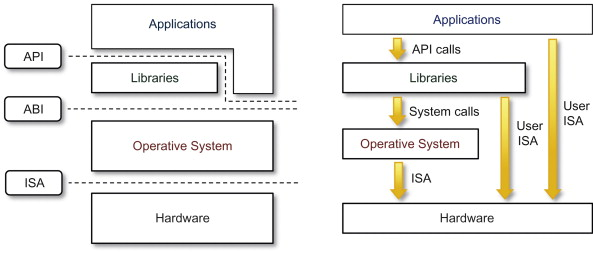
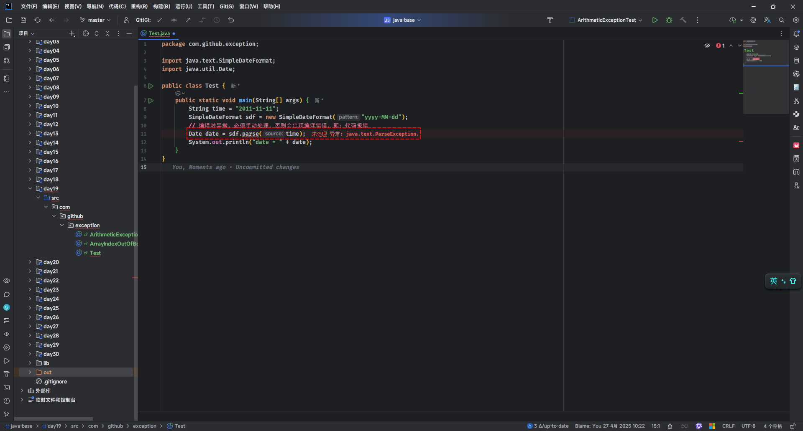
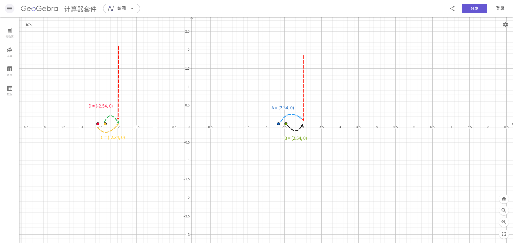
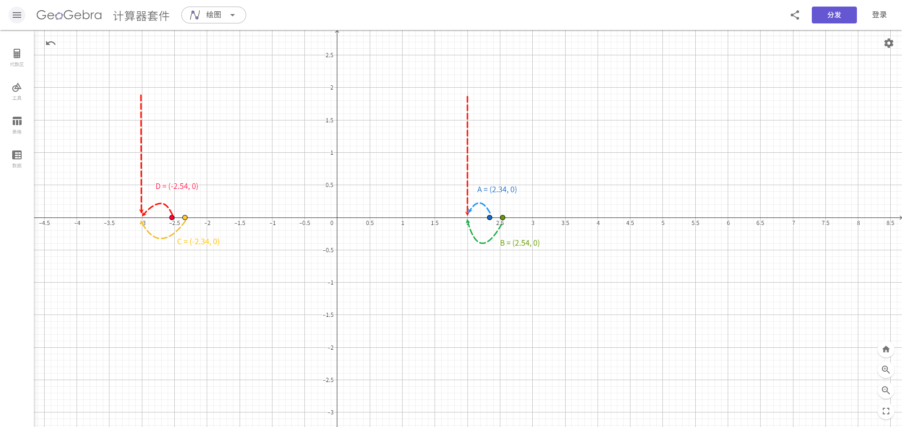

# 第一章：API 和 API 帮助文档

## 1.1 概述

* 之前我们已经学习过了面向对象了。并且我们知道，面向对象具体就是两个部分：
  * ① `如何使用别人已经写好的东西`。
  * ② `我们自己如何设计一个类，并使用`。
* 之前，我们都是学习`自己如何设计一个类，并使用`。但是，不可能所有的功能都是我们自己去手动实现，这样效率太低。

> [!NOTE]
>
> * ① 为了降低开发的难度，Java 官方将一些常用的功能进行了封装，并形成 API 供我们调用。
> * ② 有的时候，我们需要实现一些功能，Java 官方并没有实现，如：通过 Java 代码去操作 Word、Excel 等，这个时候就需要调用一些第三方库提供的 API，如：Apache POI 等。

* 之后，在学习和工作的时候，我们也需要学习`如何使用别人已经写好的东西`。

## 1.2 ISA、ABI 和 API

* ISA 、ABI 和 API 的参考模型，如下所示：



* 在底层，硬件模型以指令集架构 （ISA） 表示，该架构定义了处理器、寄存器、存储器和中断管理的指令集。ISA 是硬件和软件之间的接口，对于操作系统 （OS） 开发人员 （System ISA） 和直接管理底层硬件的应用程序 （User ISA） 的开发人员来说非常重要。

> [!NOTE]
>
> - ① ISA 是计算机体系结构中定义的一组指令，它规定了处理器能够执行的操作。ISA 包括指令的编码、寄存器的使用、内存访问模式等。不同的处理器可能有不同的 ISA，例如：x86、ARM、MIPS 等。
> - ② 在设计一个新的操作系统时，开发者需要确保操作系统能够支持特定的 ISA ，以便在特定的硬件上运行。例如：如果操作系统旨在运行在 ARM 架构的处理器上，那么它必须能够理解和执行 ARM ISA 定义的指令集。

* 应用程序二进制接口 （ABI） 将`操作系统层`与由操作系统管理的`应用程序`和`库`分开。ABI 涵盖了低级数据类型、对齐方式和调用约定等详细信息，并定义了可执行程序的格式。系统调用在此级别定义。此接口允许应用程序和库在实现相同 ABI 的操作系统之间移植。

> [!NOTE]
>
> - ① ABI 是指在二进制级别上，应用程序与操作系统、库或应用程序的不同部分之间的接口。它定义了数据类型的大小、布局、对齐方式，以及函数调用的约定（如参数如何传递、返回值如何处理等）。ABI 确保了编译后的二进制文件能够在特定的操作系统和硬件平台上正确地运行。
> - ② 在 windows 上的应用程序的运行格式是：`PE`（portable executable）格式、`.dll` （dynamic link library）格式和 `.lib` 格式；而在 Linux 上的应用程序的运行格式是：`ELF`（executable and linking format）格式、`.so` （shared object）格式和 `.a` 格式。
> - ③ 在 Linux 中可以通过 `file /bin/ls` 命令查看指定可执行应用程序的 ABI 格式；从而也可以论证，在 Windows 上可以运行的程序，在 Linux 上运行不了。
> - ④ 当开发者在 Linux 系统上编写 C 语言程序，并使用特定的编译器（如：GCC）编译时，编译器会遵循 Linux 平台的 ABI 规范来生成二进制文件。这样，生成的可执行文件就可以在任何遵循相同 ABI 规范的 Linux 系统上运行。
> - ⑤ 如果一个应用程序需要跨平台（操作系统）运行，就需要使用`一套代码，多平台编译`的方式（针对 C 或 C++ 等），即：相同的源代码，在不同平台（操作系统）上使用特定平台的编译器（如：GCC）来分别编译成符合自己平台的 ABI 规范的二进制文件。

* 最高级别的抽象由应用程序编程接口 （API） 表示，它将`应用程序`连接到`库`或`底层操作系统`。

> [!NOTE]
>
> - ① API 是一组预定义的函数、协议和工具，用于构建软件和应用程序。API 允许不同的软件系统相互交互，它定义了软件组件之间如何相互通信。API 可以是库、框架、协议或服务。
> - ② 在 Web 开发中，开发者可能会使用 JavaScript 的 Fetch API 来与服务器进行通信，获取数据或提交表单。这个 API 提供了一种标准化的方式来发送 HTTP 请求和处理响应，而不需要开发者关心底层的网络协议细节。

## 1.3 API

* `API`（`A`pplication `P`rogramming `I`nterface）：应用程序编程接口。

> [!NOTE]
>
> API 的简单理解：API 就是别人已经写好的东西，我们不需要自己编写，直接使用。（无情的调参侠）

* `Java API`：指的是 JDK 中提供的各种功能的 Java 类。

> [!NOTE]
>
> * ① Java API（应用程序编程接口）是 Java 编程语言提供的一组预定义的类、接口、方法和工具，它们用于帮助开发人员快速构建应用程序。
> * ② Java API 是 Java 平台的重要组成部分，提供了大量的功能模块，开发人员可以直接使用这些模块来避免重复造轮子。
> * ③ Java API 涵盖了广泛的领域，包括输入/输出、网络、数据库连接、图形用户界面等。
> * ④ 这些类将底层的实现封装起来，我们并不需要关心这些类是如何实现的，只需要学习如何使用这些类。

* `第三方 API`：指的是开源组织或个人提供用于实现特定功能的 Java 类，如：Apache 的 POI 。

## 1.4 API 帮助文档

* Java 本身提供的 API 实在是太多太多，如果每个类，我们都需要背诵并记忆，那么我们想哭的心都有，如下所示：


* 为了帮助开发人员（程序员）能快速的搜索、了解以及学习的 Java 中的 API，Java 提供了文档，如下所示：

> [!NOTE]
>
> Java 中的`API 帮助文档`是通过`java doc`工具根据`文档注释`来生成的！！！



## 1.5 API 学习方法

* ① 千万不要去背 Java 中的 API （根据背不完），因为 Java 中的 API 实在是太多太多了！！！
* ② 只需要记住`类名`和`类的作用`就可以了。
* ③ 平常养成查询 API 帮助文档的习惯。


# 第二章：Math 类

## 2.1 概述

* Math 类是一个帮助我们用于数学计算的`工具类`。
* Math 类的构造方法是私有的，所有的方法都是静态方法。

## 2.2 常用 API

### 2.2.1 绝对值

* 求一个数的绝对值：

```java
public static int abs(int a){
    ...
}
```

```java
public static long abs(long a){
    ...
}
```

```java
public static float abs(float a){
    ...
}
```

```java
public static double abs(double a){
    ...
}
```

> [!NOTE]
>
> * ① int 取值范围是：`[-2147483648,2147483647]`，如果对`abs(-2147483648)`求绝对值，其值还是`-2147483648`，因为`-2147483648`对应的绝对值`2147483648`，不在 int 的取值范围内。
> * ② 在实际开发中，更推荐使用`absExact`方法代替`abs`方法，因为对于`-2147483648`这种问题，`absExact`直接抛出异常。


* 示例：

```java
package com.github;

public class MathDemo {
    public static void main(String[] args) {
        int abs = Math.abs(1);
        System.out.println("abs = " + abs); // abs = 1

        abs = Math.abs(-1);
        System.out.println("abs = " + abs); // abs = 1
    }
}
```


* 示例：

```java
package com.github;

public class MathDemo {
    public static void main(String[] args) {
        int abs = Math.abs(-2147483648);
        System.out.println("abs = " + abs); // abs = -2147483648
    }
}
```


* 示例：

```java
package com.github;

public class MathDemo {
    public static void main(String[] args) {
        // 运行报错
        // Exception in thread "main" java.lang.ArithmeticException:
        // Overflow to represent absolute value of Integer.MIN_VALUE
        int abs = Math.absExact(-2147483648);
        System.out.println("abs = " + abs); // 
    }
}
```

### 2.2.2 向上取整和向下取值

* 向上取整：

```java
public static double ceil(double a){
    ...
}
```

* 向下取整：

```java
public static double floor(double a){
    ...
}
```

> [!NOTE]
>
> * ① `向上取整`类似于数学中的`进一法`，即：向正无穷大的方向获取距离最近的整数。
>
> ::: details 点我查看 具体细节
>
> 
>
> :::
>
> * ② `向下取整`类似于数学中的`去尾法`，即：向负无穷大的方向获取距离最近的整数。
>
> ::: details 点我查看 具体细节
>
> 
>
> :::


* 示例：

```java
package com.github;

public class MathDemo {
    public static void main(String[] args) {
        System.out.println(Math.ceil(12.34)); // 13.0
        System.out.println(Math.ceil(12.54)); // 13.0
        System.out.println(Math.ceil(-12.34)); // -12.0
        System.out.println(Math.ceil(-12.54)); // -12.0
    }
}
```


* 示例：

```java
package com.github;

public class MathDemo {
    public static void main(String[] args) {
        System.out.println(Math.floor(12.34)); // 12.0
        System.out.println(Math.floor(12.54)); // 12.0
        System.out.println(Math.floor(-12.34)); // -13.0
        System.out.println(Math.floor(-12.54)); // -13.0
    }
}
```

### 2.2.3 四舍五入

* 求一个数的四舍五入：

```java
public static int round(float a){
    ...
}
```

```java
public static long round(double a){
    ...
}
```


* 示例：

```java
package com.github;

public class MathDemo {
    public static void main(String[] args) {
        System.out.println(Math.round(2.34)); // 2
        System.out.println(Math.round(2.54)); // 3
        System.out.println(Math.round(-2.34)); // -2
        System.out.println(Math.round(-2.54)); // -3
    }
}
```

### 2.2.4  最值（最大值和最小值）

* 求一个数的最大值：

```java
public static int max(int a, int b) {
    ...
}
```

```java
public static long max(long a, long b) {
    ...
}
```

```java
public static float max(float a, float b) {
    ...
}
```

```java
public static double max(double a, double b) {
    ...
}
```

* 求一个数的最小值：

```java
public static int min(int a, int b) {
    ...
}
```

```java
public static long min(long a, long b) {
    ...
}
```

```java
public static float min(float a, float b) {
    ...
}
```

```java
public static double min(double a, double b) {
    ...
}
```


* 示例：

```java
package com.github;

public class MathDemo {
    public static void main(String[] args) {
        System.out.println(Math.max(1, 1.1)); // 1.1
        System.out.println(Math.max(10, 1.1)); // 10.0
        System.out.println(Math.min(1, 1.1)); // 1.0
        System.out.println(Math.min(10, 1.1)); // 1.1
    }
}
```

### 2.2.5 指数、平方根和立方根

* 求一个数的指数：

```java
public static double pow(double a, double b) {
    ...
}
```

* 求一个数的平方根：

```java
public static double sqrt(double a) {
    ...
}
```

* 求一个数的立方根：

```java
public static double cbrt(double a){
    ...
}
```


* 示例：

```java
package com.github;

public class MathDemo {
    public static void main(String[] args) {
        System.out.println("2^3 = " + Math.pow(2, 3)); // 2^3 = 8.0
        System.out.println("4 的平方根 = " + Math.sqrt(4)); // 4 的平方根 = 2.0
        System.out.println("8 的立方根 = " + Math.cbrt(8)); // 8 的立方根 = 2.0
    }
}
```

### 2.2.6 随机值

* 求一个数的随机值，范围是`[0.0,1.0)`：

```java
public static double random() { 
	...
}
```

> [!NOTE]
>
> * ① 在 Java 中，我们通常会使用`Random`类，而不是 Math.random() 方法获取随机值，因为 Random 类中的 nextInt(10) 方法就是获取 [0,10) 之间的随机值。
> * ② 在其他编程语言中，如：JavaScript ，就只有 `Math.random()` 方法用来获取随机值。


* 示例：

```java
package com.github;

import java.util.Random;

public class MathDemo {
    public static void main(String[] args) {
        Random random = new Random();
        for (int i = 0; i < 100; i++) {
            // 获取 1 - 100 之间的随机值
            int num = random.nextInt(100) + 1;
            System.out.println("num = " + num);
        }
    }
}
```


* 示例：

```java
package com.github;

public class MathDemo {
    public static void main(String[] args) {
        for (int i = 0; i < 10; i++) {
            // 获取 1 - 100 之间的随机值
            int num = (int) (Math.floor(Math.random() * 100)) + 1;
            System.out.println("num = " + num);
        }
    }
}
```

## 2.3 应用示例

* 需求：判断一个数是否为质数。


* 示例：

```java
package com.github;

public class MathDemo {
    public static void main(String[] args) {
        System.out.println(isPrime(2));
        System.out.println(isPrime(3));
        System.out.println(isPrime(4));
    }

    /**
     * 判断一个数是否为质数
     * @param num 整数
     * @return true 表示质数，false 表示非质数
     */
    public static boolean isPrime(int num) {
        for (int i = 2; i < num; i++) {
            if (num % i == 0) {
                return false;
            }
        }
        return true;
    }
}
```


* 示例：

```java
package com.github;

public class MathDemo {
    public static void main(String[] args) {
        System.out.println(isPrime(2));
        System.out.println(isPrime(3));
        System.out.println(isPrime(4));
    }

    /**
     * 判断一个数是否为质数
     * @param num 整数
     * @return true 表示质数，false 表示非质数
     */
    public static boolean isPrime(int num) {
        for (int i = 2; i <= Math.sqrt(num); i++) {
            if (num % i == 0) {
                return false;
            }
        }
        return true;
    }
}
```

## 2.4 应用示例

* 自幂数：一个 n 位自然数等于自身给位上的数字的 n 次幂之和。

> [!NOTE]
>
> * ① 三位数 `1^3 + 2^3 + 3^3 = 153`。
> * ② 四位数 `1^4 + 6 ^4 + 3^4 + 4^4 = 1634`。


* 示例：

```java
package com.github;

import java.util.ArrayList;
import java.util.List;
import java.util.ListIterator;

public class MathDemo2 {
    public static void main(String[] args) {
        System.out.println(isSelfPower(1634));
        System.out.println(isSelfPower(153));
    }

    /**
     * 判断一个数是否为自幂数
     *
     * @param num 整数
     * @return true 表示自幂数，false 表示非自幂数
     */
    public static boolean isSelfPower(int num) {
        // 缓存 num
        int original = num;
        // 获取 num 各个位上的数
        List<Integer> list = new ArrayList<>();
        while (num != 0) {
            list.add(num % 10);
            num /= 10;
        }
        // 逆序遍历，并获取结果
        int result = 0;
        ListIterator<Integer> iterator = list.listIterator(list.size());
        while (iterator.hasPrevious()) {
            int element = iterator.previous();
            result += (int) Math.pow(element, list.size());
        }
        return result == original;
    }
}
```


# 第三章：System

## 3.1 概述

* System 是一个工具类，提供了一些和系统相关的属性或方法。
* System 类的构造方法是私有的，所有的方法都是静态方法。

## 3.2 常用 API

### 3.2.1 当前系统时间戳

* 返回当前系统时间距离`1970-01-01 00:00:00`的毫秒值：

```java
public static native long currentTimeMillis();
```

* 返回当前系统时间距离`1970-01-01 00:00:00`的纳秒值：

```java
public static native long nanoTime();
```


* 示例：

```java
package com.github;

import java.util.Date;

public class SystemDemo {
    public static void main(String[] args) {
        long timeMillis = System.currentTimeMillis();
        // timeMillis = 1744791339759
        System.out.println("timeMillis = " + timeMillis); 

        Date date = new Date(timeMillis);
        // date = Wed Apr 16 16:16:04 CST 2025
        System.out.println("date = " + date); 
    }
}
```

### 3.2.2 退出当前系统

* 终止当前运行的 JVM 虚拟机：

```java
public static void exit(int status) {
    ...
}
```


* 示例：

```java
package com.github;

import java.util.Scanner;

public class SystemDemo2 {
    public static void main(String[] args) {
        Scanner input = new Scanner(System.in);
        do {
            System.out.print("请输入数字（0 退出）：");
            int num = input.nextInt();
            if (num == 0) {
                System.exit(0);
            }
            System.out.println("num = " + num);
        } while (true);
    }
}
```

### 3.2.3 获取属性

* 获取系统所有属性：

```java
public static Properties getProperties() {
    ...
}
```

* 根据`系统属性名`获取`系统属性值`：

```java
public String getProperty(String key) { 
	...
}
```


* 示例：

```java
package com.github;

import java.util.Properties;
import java.util.Set;

public class SystemDemo3 {
    public static void main(String[] args) {
        Properties properties = System.getProperties();
        Set<String> propertyNames = properties.stringPropertyNames();
        for (String propertyName : propertyNames) {
            String property = properties.getProperty(propertyName);
            System.out.println(propertyName + " = " + property);
        }
    }
}

```

### 3.2.4 数组复制（拷贝）

* 从指定源数组中复制一个数组，复制从指定的位置开始，到目标数组的指定位置结束。

```java
public static native void arraycopy(Object src,  int  srcPos,
                                        Object dest, int destPos,
                                        int length);
```

> [!NOTE]
>
> * ① 如果数据源数组和目的地数组都是基本数据类型，两者的数据类型必须保持一致，否则将会报错！！！
> * ② 在拷贝的时候，需要考虑数组的长度，如果超出范围将会报错！！！
> * ③ 如果数据源数组和目的地数组都是引用数据类型，那么子类类型可以赋值给父类类型。


* 示例：

```java
package com.github;

import java.util.Arrays;

public class SystemDemo4 {
    public static void main(String[] args) {
        int[] arr = {1, 2, 3, 4, 5, 6};
        int[] target = new int[arr.length];
        System.arraycopy(arr, 0, target, 0, 2);
        System.out.println(Arrays.toString(target)); // [1, 2, 0, 0, 0, 0]
    }
}
```

