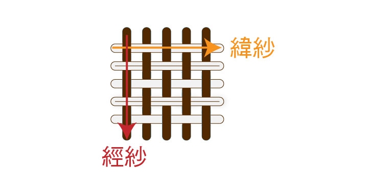
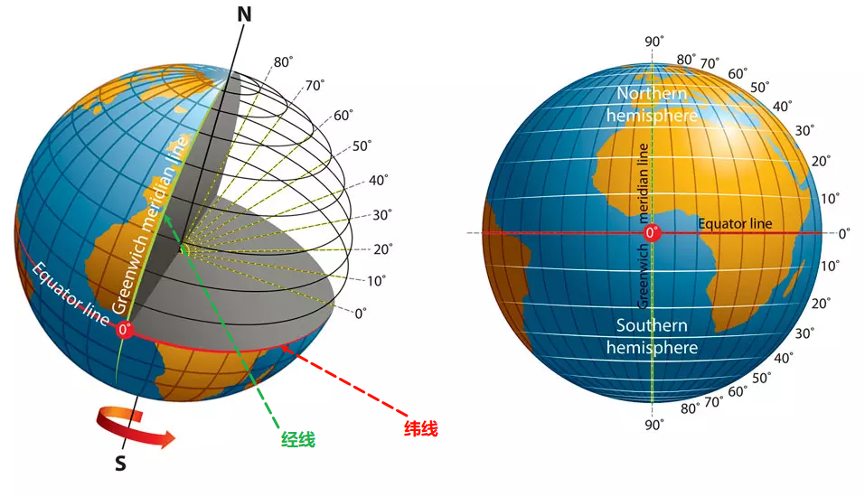
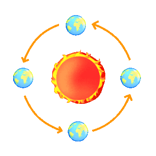
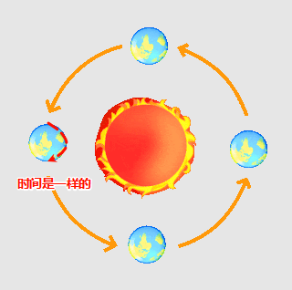
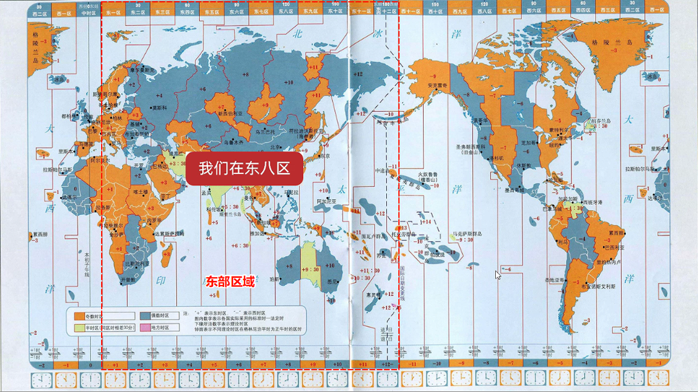
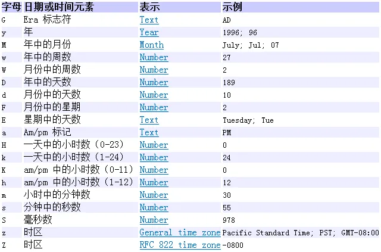
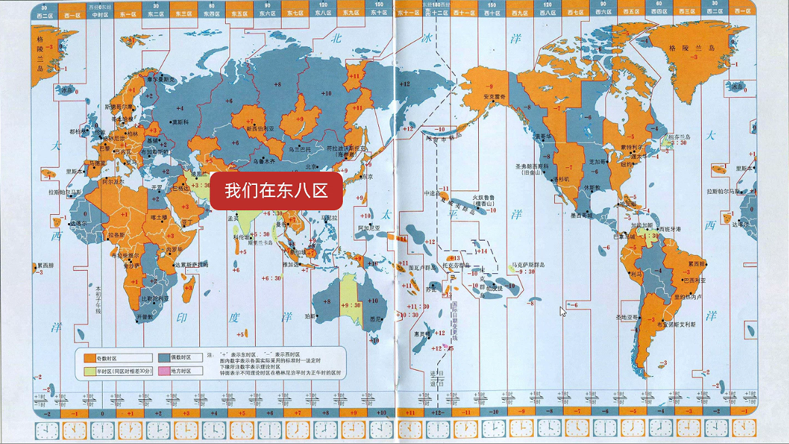
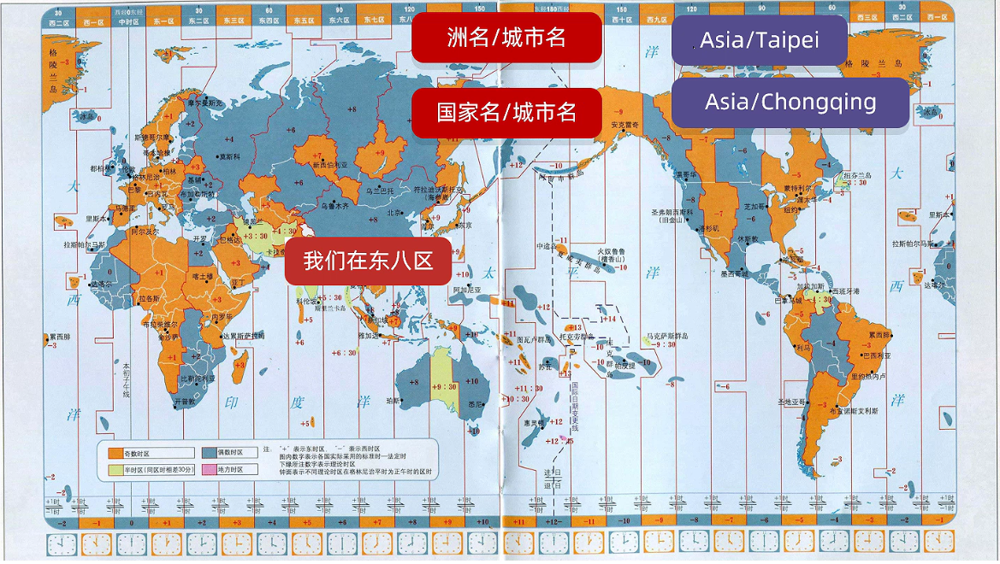
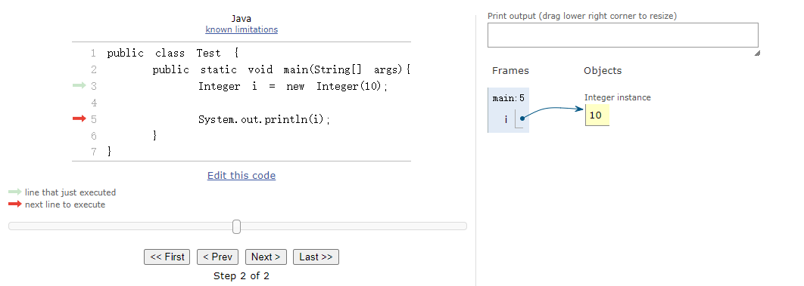

# 第一章：JDK 8 之前时间相关类

## 1.1 概述

* 地球是有`经纬线`的，`经线`（子午线）是连接南北两极竖着的线，而`纬线`（平行线）是与地球赤道平行的环绕地球的假想线，如下所示：

> [!NOTE]
>
> * ① `经线`指示南北方向的位置，并用于测量**经度**，即：地球上某一点相对于本初子午线（0 度经线，通常通过英国格林威治天文台）的东西方向上的角度。所有的经线长度都**相等**，并在南北两极**汇聚**。经度分为**东经 (E)** 和 **西经 (W)**，各有 0° 到 180°。
>
> ::: details 点我查看 具体细节
>
> * `经`是`纵向`、`直的`、`贯穿`的意思，如：“经脉”指身体里纵向的主要通道。
>
> 
>
> * `经线`是连接地球南北两极的，呈现纵向的形态，就像一根根“经”线贯穿地球的南北。因此，用“经”来形容这种纵向的线非常贴切。
>
> :::
>
> * ② `纬线`指示东西方向的位置，并用于测量**纬度**，即：地球上某一点相对于赤道的南北方向上的角度。所有的纬线都互相**平行**，但长度**不相等**，赤道最长，越靠近两极纬线越短，到两极缩成一个点。赤道是 0 度纬线。纬度分为**北纬 (N)** 和 **南纬 (S)**，各有 0°（赤道）到 90°（两极）。
>
> ::: details 点我查看 具体细节
>
> * `纬`是横向的、水平的、交织的意思，如：纬纱”指的是织布过程中横向的纱线。
>
> 
>
> *  `纬线`是与赤道平行的横向圆圈，环绕地球，与纵向的经线交织成网格。因此，用“纬”来形容这种横向的线非常形象。
>
> :::



* 当地球围绕太阳旋转的时候，围绕太阳转一圈是一年（公转），地球自己转一圈是一天（自转），如下所示：



* 在同一条`经线`上的时间是一样的，如下所示：



* 之前，我们都是以`零度经线`为标准，认为它是标准的世界时间，如下所示：

> [!NOTE]
>
> 零度经线（本初子午线），英国的格林威治正好坐落在零度经线上，所以之前的标准世界时间也被称为`格林威治时间`。


* 全世界一共有 24 个时区，每个时区都是按照`标准世界时间`进行`加`或`减`，即：在本初子午线右侧的 12 个时区，称为`东部区域`；剩余的 12 个时区，称为`西部区域`，如下所示：

> [!NOTE]
>
> 中国在东八区，所以中国的标准时间 = 标准世界时间 + 8 。



> [!NOTE]
>
> 总结：
>
> * ① 全世界的时间，有一个统一的计算标准，在 1884 年，规定`零度经线`上的时间是`标准时间`，又因为英国的`格林威治`坐落在`零度经线`上，所以`世界标准时间`也被称为`格林威治时间`（Greenwich Mean Time），简称 `GMT`，其计算的核心是：地球自转一天是 24 小时，再将时间划分为 24 等份，太阳直射时是正午 12 点。
> * ② 上述的计算方式并没有太大的问题，对于平时生活已经足够的；但是，随着时代的发展，人们发现地球自转的速度是不均匀的，使用`格林威治时间`作为`世界时间标准`和`实际真正的时间`是有误差的，历史统计，最大的误差曾达 16 分钟，现在`格林威治时间`已经不再作为`世界标准时间`去使用了。
> * ③ 后来，人们为了彻底解决定义的时间的流逝不均匀的问题，到了 1972 年，开始使用`原子钟`（利用铯原子的震动频率计算出来的时间）定义`世界标准时间`，即：世界协调时间（法语：**T**emps **U**niversel **C**oordonné，简称为`UTC`），所以目前的`世界标准时间`是`世界协调时间`（UTC）。
> * ④ 中国位于东八区，中国标准时间 = 世界标准时间（UTC）+ 8 。

## 1.2 Date

### 1.2.1 概述

* `Date`类用来描述时间，精确到毫秒，这个类的对象表示某个时间点的对象。

### 1.2.2 构造方法

* 使用空参构造方法创建的对象，表示系统当前时间：

```java
public Date() { // [!code focus]
    this(System.currentTimeMillis());
} // [!code focus]
```

* 使用有参构造方法创建的对象，表示指定的时间：

```java
public Date(long date) { // [!code focus]
    fastTime = date;
} // [!code focus]
```


* 示例：

```java
package com.github.date;

import java.util.Date;

public class Test {
    public static void main(String[] args) {
        // 当前系统时间
        Date date = new Date();
        // date = Tue Apr 22 11:03:51 CST 2025
        System.out.println("date = " + date); 
    }
}
```


* 示例：

```java
package com.github.date;

import java.util.Date;

public class Test {
    public static void main(String[] args) {
        // 指定时间
        Date date = new Date(System.currentTimeMillis() + 10);
        // date = Tue Apr 22 11:05:19 CST 2025
        System.out.println("date = " + date);
    }
}
```

### 1.2.3 常用 API

#### 1.2.3.1 将 Date 对象转换为时间戳

* 获取时间对象的毫秒值：

```java
public long getTime() { // [!code focus]
    return getTimeImpl();
} // [!code focus]

private final long getTimeImpl() {
    if (cdate != null && !cdate.isNormalized()) {
        normalize();
    }
    return fastTime;
}
```


* 示例：

```java
package com.github.date;

import java.util.Date;

public class Test {
    public static void main(String[] args) {
        // 当前系统时间
        Date date = new Date();
        // date = Tue Apr 22 11:03:51 CST 2025
        System.out.println("date = " + date);

        long time = date.getTime(); // [!code highlight]
        // time = 1745291495789
        System.out.println("time = " + time);
    }
}
```

#### 1.2.3.2 将毫秒值转换为 Date 对象

* 设置或修改毫秒值：

```java
public void setTime(long time) { // [!code focus]
    fastTime = time;
    cdate = null;
} // [!code focus]
```


* 示例：

```java
package com.github.date;

import java.util.Date;

public class Test {
    public static void main(String[] args) {
        // 指定时间
        Date date = new Date(System.currentTimeMillis() + 1000);
        // date = Tue Apr 22 11:13:44 CST 2025
        System.out.println("date = " + date);
        // 设置或修改毫秒值
        date.setTime(System.currentTimeMillis()); // [!code highlight]
        // date = Tue Apr 22 11:13:43 CST 2025
        System.out.println("date = " + date);
    }
}
```

#### 1.2.3.3 判断当前时间是否晚于指定时间

* 判断当前时间是否晚于指定时间：

```java
public boolean after(Date when) { // [!code focus]
    return getMillisOf(this) > getMillisOf(when);
} // [!code focus]
```


* 示例：

```java
package com.github.date;

import java.util.Date;

public class Test {
    public static void main(String[] args) {
        Date d1 = new Date();

        Date d2 = new Date(d1.getTime() + 100000);

        System.out.println(d1.after(d2)); // false
    }
}
```

#### 1.2.3.4 判断当前时间是否早于指定时间

* 判断当前时间是否早于指定时间：

```java
public boolean before(Date when) { // [!code focus]
    return getMillisOf(this) < getMillisOf(when);
} // [!code focus]
```


* 示例：

```java
package com.github.date;

import java.util.Date;

public class Test {
    public static void main(String[] args) {
        Date d1 = new Date();

        Date d2 = new Date(d1.getTime() + 100000);

        System.out.println(d1.before(d2)); // true
    }
}
```

## 1.3 SimpleDateFormat

### 1.3.1 概述

* `SimpleDateFormat`是格式化时间的类，有如下的作用：
  * ① `格式化`：可以将`Date 对象`格式化我们喜欢的格式，如：`2025-04-22`、`2025/04/22`、`2025年04月22日`等。
  * ② `解析`：可以将`字符串表示的时间`变为`Date 对象`。

### 1.3.2 构造方法

* 使用默认格式，创建一个 SimpleDateFormat 对象：

```java
public SimpleDateFormat() { // [!code focus]
    this("", Locale.getDefault(Locale.Category.FORMAT));
    applyPatternImpl(LocaleProviderAdapter.getResourceBundleBased().getLocaleResources(locale)
                     .getDateTimePattern(SHORT, SHORT, calendar));
} // [!code focus]
```

* 使用指定格式，创建一个 SimpleDateFormat 对象（推荐）：

```java
public SimpleDateFormat(String pattern) { // [!code focus]
    this(pattern, Locale.getDefault(Locale.Category.FORMAT));
} // [!code focus]
```

> [!NOTE]
>
> ::: details 点我查看 pattern 的具体含义
>
> 
>
> :::


* 示例：

```java
package com.github.simple;

import java.text.SimpleDateFormat;
import java.util.Date;

public class Test {
    public static void main(String[] args) {
        SimpleDateFormat format = new SimpleDateFormat();

        String str = format.format(new Date());

        // str = 2025/4/22 下午1:33
        System.out.println("str = " + str);
    }
}
```


* 示例：

```java
package com.github.simple;

import java.text.SimpleDateFormat;
import java.util.Date;

public class Test {
    public static void main(String[] args) {
        SimpleDateFormat format = new SimpleDateFormat("yyyy-MM-dd HH:mm:ss");

        String str = format.format(new Date());

        // str = 2025-04-22 13:33:55
        System.out.println("str = " + str);
    }
}
```

### 1.3.3 常用 API

#### 1.3.3.1 将日期对象格式化为字符串

* 格式化（日期对象 --> 字符串）：

```java
public final String format(Date date){ // [!code focus]
    return format(date, new StringBuffer(),
                  DontCareFieldPosition.INSTANCE).toString();
} // [!code focus]
```


* 示例：

```java
package com.github.simple;

import java.text.SimpleDateFormat;
import java.util.Date;

public class Test {
    public static void main(String[] args) {
        SimpleDateFormat format = new SimpleDateFormat("yyyy-MM-dd HH:mm:ss");

        String str = format.format(new Date()); // [!code highlight]

        // str = 2025-04-22 13:33:55
        System.out.println("str = " + str);
    }
}
```

#### 1.3.3.2 将字符串解析为日期对象

* 解析（字符串 --> 日期对象）：

```java
public Date parse(String source) throws ParseException {  // [!code focus]
    ParsePosition pos = new ParsePosition(0);
    Date result = parse(source, pos);
    if (pos.index == 0)
        throw new ParseException("Unparseable date: \"" + source + "\"" ,
            pos.errorIndex);
    return result;
}  // [!code focus]
```

> [!CAUTION]
>
> 如果给定的字符串内容和 SimpleDateFormat 对象中传递的 pattern 参数不匹配，将会报错！！！


* 示例：

```java
package com.github.simple;

import java.text.ParseException;
import java.text.SimpleDateFormat;
import java.util.Date;

public class Test {
    public static void main(String[] args) throws ParseException {
        SimpleDateFormat format = new SimpleDateFormat("yyyy-MM-dd HH:mm:ss");

        Date parse = format.parse("2012-12-12 12:12:12"); // [!code highlight]

        // parse = Wed Dec 12 12:12:12 CST 2012
        System.out.println("parse = " + parse);
    }
}
```

### 1.3.4 应用示例

* 需求：假设初恋的出生日期是`2000-11-11`，请用字符串表示这个数据，并将其转换为`2000年11月11日`。


* 示例：

```java
package com.github.simple;

import java.text.ParseException;
import java.text.SimpleDateFormat;
import java.util.Date;

public class Test {
    public static void main(String[] args) throws ParseException {
        String str = "2000-11-11";
        // 解析
        SimpleDateFormat sdf1 = new SimpleDateFormat("yyyy-MM-dd");
        Date date = sdf1.parse(str);
        // 格式化
        SimpleDateFormat sdf2 = new SimpleDateFormat("yyyy年MM月dd日");
        String str2 = sdf2.format(date);
        System.out.println(str2); // 2000年11月11日
    }
}
```

### 1.3.5 应用示例

* 需求：秒杀活动。

> [!NOTE]
>
> 用代码判断下面两位同学能否参与这次秒杀活动？
>
> * ① 小贾下单并付款的时间是：`2023年11月11日 0:01:00`。
> * ② 小皮下单并付款的时间是：`2023年11月11日 0:11:00`。


* 示例：

::: code-group

```java [Test.java]
package com.github.simple;

import java.text.ParseException;
import java.text.SimpleDateFormat;
import java.util.Date;

public class Test {
    public static void main(String[] args) throws ParseException {
        SimpleDateFormat sdf = new SimpleDateFormat("yyyy年MM月dd日 HH:mm:ss");
        Date skillStartDate = sdf.parse("2023年11月11日 00:00:00");
        Date skillEndDate = sdf.parse("2023年11月11日 00:10:00");

        Date xiaoJiaDate = sdf.parse("2023年11月11日 00:01:00");
        Date xiaoPiDate = sdf.parse("2023年11月11日 00:11:00");

        if (xiaoJiaDate.after(skillStartDate) 
            && xiaoJiaDate.before(skillEndDate)) {
            System.out.println("小贾可以参与此次秒杀活动");
        } else {
            System.out.println("小贾不能参与此次秒杀活动");
        }

        if (xiaoPiDate.after(skillStartDate) 
            && xiaoPiDate.before(skillEndDate)) {
            System.out.println("小皮可以参与此次秒杀活动");
        } else {
            System.out.println("小皮不能参与此次秒杀活动");
        }
    }
}
```

```txt [cmd 控制台]
小贾可以参与此次秒杀活动
小皮不能参与此次秒杀活动
```

:::

## 1.4 Calendar

### 1.4.1 概述

* Calendar 代表了系统当前时间的日历对象，可以单独修改、获取时间中的年、月、日等。

> [!CAUTION]
>
> Calendar 是一个抽象类，不能直接创建对象；但是，其提供一个静态方法返回 Calendar 实例。

### 1.4.2 静态方法

* 静态方法获取 Calendar 实例：

```java
public static Calendar getInstance(){ // [!code focus]
    Locale aLocale = Locale.getDefault(Locale.Category.FORMAT);
    return createCalendar(defaultTimeZone(aLocale), aLocale);
} // [!code focus]
```


* 示例：

```java
package com.github.calendar;

import java.util.Calendar;

public class Test {
    public static void main(String[] args){
        Calendar calendar = Calendar.getInstance();
        System.out.println("calendar = " + calendar);
    }
}
```

### 1.4.3 常用 API

#### 1.4.3.1 获取日期对象

* 将 Calendar 实例转换为日期对象：

```java
public final Date getTime() { // [!code focus]
    return new Date(getTimeInMillis());
} // [!code focus]
```


* 示例：

```java
package com.github.calendar;

import java.util.Calendar;
import java.util.Date;

public class Test {
    public static void main(String[] args) {
        Calendar calendar = Calendar.getInstance();
        Date date = calendar.getTime();
        // date = Tue Apr 22 14:58:13 CST 2025
        System.out.println("date = " + date);
    }
}
```

#### 1.4.3.2 给日历设置日期对象

* 将日期对象转换为 Calendar 实例：

```java
public final void setTime(Date date) { // [!code focus]
    Objects.requireNonNull(date, "date must not be null");
    setTimeInMillis(date.getTime());
} // [!code focus]
```


* 示例：

```java
package com.github.calendar;

import java.util.Calendar;
import java.util.Date;

public class CalendarTest3 {
    public static void main(String[] args) {
        Calendar calendar = Calendar.getInstance();
        calendar.setTime(new Date());
        System.out.println("calendar = " + calendar);
    }
}
```

#### 1.4.3.3 获取毫秒值

* 将 Calendar 实例转换为毫秒值：

```java
public long getTimeInMillis() { // [!code focus]
    if (!isTimeSet) {
        updateTime();
    }
    return time;
} // [!code focus]
```


* 示例：

```java
package com.github.calendar;

import java.util.Calendar;

public class Test {
    public static void main(String[] args) {
        Calendar calendar = Calendar.getInstance();
        long time = calendar.getTimeInMillis();
        // time = 1745305350908
        System.out.println("time = " + time);
    }
}
```

#### 1.4.3.4 给日历设置毫秒值

* 将毫秒值转换为 Calendar 实例：

```java
public void setTimeInMillis(long millis) { // [!code focus]
    // If we don't need to recalculate the calendar field values,
    // do nothing.
    if (time == millis && isTimeSet && areFieldsSet && areAllFieldsSet
        && (zone instanceof ZoneInfo) && !((ZoneInfo)zone).isDirty()) {
        return;
    }
    time = millis;
    isTimeSet = true;
    areFieldsSet = false;
    computeFields();
    areAllFieldsSet = areFieldsSet = true;
} // [!code focus]
```


* 示例：

```java
package com.github.calendar;

import java.util.Calendar;

public class Test {
    public static void main(String[] args) {
        Calendar calendar = Calendar.getInstance();
        calendar.setTimeInMillis(System.currentTimeMillis());
        System.out.println("calendar = " + calendar);
    }
}
```

#### 1.4.3.5 获取日历中某个字段信息

* 获取日历中某个字段信息：

```java
public int get(int field) { // [!code focus]
    complete();
    return internalGet(field);
} // [!code focus]
```


* 示例：

```java
package com.github.calendar;

import java.util.Calendar;

public class Test {
    public static void main(String[] args) {
        Calendar calendar = Calendar.getInstance();
        int year = calendar.get(Calendar.YEAR);
        System.out.println("year = " + year); // year = 2025
        int month = calendar.get(Calendar.MONTH) + 1;
        System.out.println("month = " + month); // month = 4
        int day = calendar.get(Calendar.DAY_OF_MONTH);
        System.out.println("day = " + day); // day = 22
        int hour = calendar.get(Calendar.HOUR_OF_DAY);
        System.out.println("hour = " + hour); // hour = 14
        int minute = calendar.get(Calendar.MINUTE);
        System.out.println("minute = " + minute); // minute = 53
        int second = calendar.get(Calendar.SECOND);
        System.out.println("second = " + second); // second = 48
        int milliSecond = calendar.get(Calendar.MILLISECOND);
        System.out.println("milliSecond = " + milliSecond); // milliSecond = 658

    }
}
```

#### 1.4.3.6 修改日历中某个字段信息

* 修改日历中某个字段信息：

```java
public void set(int field, int value) { // [!code focus]
    // If the fields are partially normalized, calculate all the
    // fields before changing any fields.
    if (areFieldsSet && !areAllFieldsSet) {
        computeFields();
    }
    internalSet(field, value);
    isTimeSet = false;
    areFieldsSet = false;
    isSet[field] = true;
    stamp[field] = nextStamp++;
    if (nextStamp == Integer.MAX_VALUE) {
        adjustStamp();
    }
} // [!code focus]
```


* 示例：

```java
package com.github.calendar;

import java.util.Calendar;

public class Test {
    public static void main(String[] args) {
        Calendar calendar = Calendar.getInstance();
        calendar.set(Calendar.YEAR,2005);
        // calendar = 2005
        System.out.println("calendar = " + calendar.get(Calendar.YEAR));
    }
}
```

#### 1.4.3.7 为某个字段增加或减少指定的值

* 设置日历字段的偏移量：

```java
public abstract void add(int field, int amount);
```

> [!NOTE]
>
> 如果是增加，amount 是正数；如果是减少，amount 是负数。


* 示例：

```java
package com.github.calendar;

import java.util.Calendar;

public class Test {
    public static void main(String[] args) {
        Calendar calendar = Calendar.getInstance();
        // 日历向后移动 180 天
        calendar.add(Calendar.DAY_OF_MONTH, 180);
        int year = calendar.get(Calendar.YEAR);
        System.out.println("year = " + year); // year = 2025
        int month = calendar.get(Calendar.MONTH) + 1;
        System.out.println("month = " + month); // month = 10
        int day = calendar.get(Calendar.DAY_OF_MONTH);
        System.out.println("day = " + day); // day = 19
        int hour = calendar.get(Calendar.HOUR_OF_DAY);
        System.out.println("hour = " + hour); // hour = 15
        int minute = calendar.get(Calendar.MINUTE);
        System.out.println("minute = " + minute); // minute = 8
        int second = calendar.get(Calendar.SECOND);
        System.out.println("second = " + second); // second = 55
        int milliSecond = calendar.get(Calendar.MILLISECOND);
        System.out.println("milliSecond = " + milliSecond); // milliSecond = 136
    }
}
```


# 第二章：JDK 8 新增时间相关类（⭐）

## 2.1 概述

* Java 1.0 中包含了一个 Date 类，但是它的大多数方法已经在 Java 1.1 中引入 Calendar 类的时候被废弃了。
* 但是，Calendar 并不比 Date 类好多少，它们有如下的问题：
  * ① 可变性：像日期和时间这样的类对象应该是不可变的。Calendar 类可以使用三种方法更改日历字段：`set()` 、`add()` 和 `roll()` 。
  - ② 偏移性：Date 和 Calendar 中的月份是从 0 开始的。
  - ③ 格式化：格式化只对 Date 有效，Calendar 则不行。
  - ④ 它们不是线程安全的，不能处理闰秒等。
* 在 JDK8 之前，对日期和时间的操作一直是 Java 程序员最为痛苦的地方，没有之一。第三方库 joda-time 在 JDK8 出现之前的很长时间备受 Java 程序员欢迎。JDK8 吸收了 joda-time 的精华，以一个新的开始，为 Java 程序员提供优秀的时间日期 API 。
  * ① `java.time` – 包含值对象的基础包。
  - ② `java.time.chrono` – 提供对不同的日历系统的访问。
  - ③ `java.time.format` – 格式化和解析时间和日期。
  - ④ `java.time.temporal` – 包括底层框架和扩展特性。
  - ⑤ `java.time.zone` – 包含时区支持的类。
  
* JDK7 和 JDK8 的对比，如下所示：

| 代码层面                                                | 安全层面                                                     |
| ------------------------------------------------------- | ------------------------------------------------------------ |
| JDK7 编码麻烦，日期对象 <--> 毫秒值。                   | JDK7 在多线程环境下会导致数据安全问题。                      |
| JDK8 编码简单，提供了判断的方法以及计算时间间隔的方法。 | JDK8 的时间日期对象都是不可变对象，一举解决了之前在多线程下导致数据安全的问题。 |

## 2.2 JDK8 新增的时间相关类

* JDK8 新增的时间相关类非常多，如下所示：

| JDK8 新增的时间相关类 | 描述                   |
| --------------------- | ---------------------- |
| ZoneId                | 时区                   |
| Instant               | 时间戳                 |
| ZoneDateTime          | 带时区的时间           |
| DateTimeFormatter     | 用于时间的格式化和解析 |
| LocalDate             | 年、月、日             |
| LocalTime             | 时、分、秒             |
| LocalDateTime         | 年、月、日、时、分、秒 |
| Duration              | 时间间隔（秒，纳秒）   |
| Period                | 时间间隔（年、月、日） |
| ChronoUnit            | 时间间隔（所有单位）   |

* 我们可以对比 JDK8 之前的 API 来学习，如下所示：


## 2.2 时区（ZoneId）

### 2.2.1 概述

* 全世界一共分为 24 个时区，每个时区都是按照`标准世界时间`进行`加`或`减`，中国处于东八区，如下所示：



* Java 在定义时区的时候，并不是采取`东一区`、`东二区`、... ，而是采取`洲名/城市名`或`国家名/城市名`，如下所示：

> [!CAUTION]
>
> * ① Java 在定义时区的时候是没有北京的，如：`Asia/Beijing`。
> * ② 在实际开发中，我们通常会使用`Asia/Shanghai`来表示中国的时区。



### 2.2.2 常用 API

* 获取 Java 中支持的所有时区：

```java
public static Set<String> getAvailableZoneIds() { // [!code focus]
    return new HashSet<String>(ZoneRulesProvider.getAvailableZoneIds());
} // [!code focus]
```

* 获取系统默认的时区：

```java
public static ZoneId systemDefault() { // [!code focus]
    return TimeZone.getDefault().toZoneId();
} // [!code focus]
```

* 获取指定的时区：

```java
public static ZoneId of(String zoneId) { // [!code focus]
    return of(zoneId, true);
} // [!code focus]
```

> [!CAUTION]
>
> Java 提供的时区太多了，我们并不需要记住，只需要使用上面的 API 就可以获取对应的时区！！！


* 示例：

```java
package com.github.jdk8;

import java.time.ZoneId;
import java.util.Set;

public class Test {

    public static void main(String[] args) throws InterruptedException {
        Set<String> availableZoneIds = ZoneId.getAvailableZoneIds();
        System.out.println("availableZoneIds = " + availableZoneIds);
        ZoneId zoneId = ZoneId.systemDefault();
        System.out.println("zoneId = " + zoneId);
        ZoneId zoneId2 = ZoneId.of("Asia/Chongqing");
        System.out.println("zoneId2 = " + zoneId2);
    }
}
```

## 2.3 时间戳（Instant）

### 2.3.1 概述

* Instant 类在 Java 中表示的是时间线上的一个瞬时点（时间戳），它并不直接关联任何特定的时区。 
* Instant 对象本质上是以 UTC（世界协调时间）为基准的时间戳，记录自 1970 年 1 月 1 日 00:00:00（UTC）以来的秒数和纳秒数。 

### 2.3.2 常用 API

#### 2.3.2.1 获取 Instant 对象

* 获取当前时间的 Instant 对象（标准时间 UTC）：

```java
public static Instant now() { // [!code focus]
    return Clock.currentInstant();
} // [!code focus]
```

* 根据秒、毫秒、纳秒获取 Instant 对象（标准时间 UTC）：

```java
// 根据秒获取 Instant 对象
public static Instant ofEpochSecond(long epochSecond) { // [!code focus]
    return create(epochSecond, 0);
} // [!code focus]
```

```java
// 根据毫秒获取 Instant 对象
public static Instant ofEpochMilli(long epochMilli) { // [!code focus]
    long secs = Math.floorDiv(epochMilli, 1000);
    int mos = Math.floorMod(epochMilli, 1000);
    return create(secs, mos * 1000_000);
} // [!code focus]
```

```java
// 根据秒和纳秒获取 Instant 对象
public static Instant ofEpochSecond(long epochSecond, long nanoAdjustment) { // [!code focus]
    long secs = Math.addExact(epochSecond, Math.floorDiv(nanoAdjustment, NANOS_PER_SECOND));
    int nos = (int)Math.floorMod(nanoAdjustment, NANOS_PER_SECOND);
    return create(secs, nos);
} // [!code focus]
```


* 示例：

```java
package com.github.jdk8.instant;

import java.time.Instant;

public class Test {
    public static void main(String[] args) {
        Instant now = Instant.now();
        // now = 2025-04-23T01:02:02.398288Z
        System.out.println("now = " + now);
    }
}
```


* 示例：

```java
package com.github.jdk8.instant;

import java.time.Instant;

public class Test {
    public static void main(String[] args) {

        Instant instant1 = Instant.ofEpochSecond(1);
        // instant1 = 1970-01-01T00:00:01Z
        System.out.println("instant1 = " + instant1);

        Instant instant2 = Instant.ofEpochMilli(1000);
        // instant2 = 1970-01-01T00:00:01Z
        System.out.println("instant2 = " + instant2);

        Instant instant3 = Instant.ofEpochSecond(0, (long) Math.pow(10, 9));
        // instant3 = 1970-01-01T00:00:01Z
        System.out.println("instant3 = " + instant3);
    }
}
```

#### 2.3.2.2 转换时区

* 将 UTC 表示的时间戳转换为指定时区的时间：

```java
public ZonedDateTime atZone(ZoneId zone) { // [!code focus]
    return ZonedDateTime.ofInstant(this, zone);
} // [!code focus]
```


* 示例：

```java
package com.github.jdk8.instant;

import java.time.Instant;
import java.time.ZoneId;
import java.time.ZonedDateTime;

public class Test {
    public static void main(String[] args) {
        Instant now = Instant.now();

        // UTC = 2025-04-23T01:09:18.513139200Z
        System.out.println("UTC = " + now);

        ZonedDateTime zonedDateTime = now.atZone(ZoneId.of("Asia/Shanghai"));

        // 2025-04-23T09:09:18.513139200+08:00[Asia/Shanghai]
        System.out.println("zonedDateTime = " + zonedDateTime);
    }
}
```

#### 2.3.2.3 判断系列方法

* 判断`当前时间戳（时刻）`是否在`指定时间戳（时刻）`之前：

```java
public boolean isBefore(Instant otherInstant) { // [!code focus]
    return compareTo(otherInstant) < 0;
} // [!code focus]
```

* 判断`当前时间戳（时刻）`是否在`指定时间戳（时刻）`之后：

```java
public boolean isAfter(Instant otherInstant) { // [!code focus]
    return compareTo(otherInstant) > 0;
} // [!code focus]
```


* 示例：

```java
package com.github.jdk8.instant;

import java.time.Instant;

public class Test {
    public static void main(String[] args) {
        Instant instant = Instant.ofEpochSecond(0);
        Instant now = Instant.now();

        System.out.println(instant.isBefore(now)); // true
        System.out.println(instant.isAfter(now)); // false
    }
}
```

#### 2.3.2.4 增加时间系列方法

* 在`当前时间戳（时刻）`基础上增加`秒`：

```java
public Instant plusSeconds(long secondsToAdd) { // [!code focus]
    return plus(secondsToAdd, 0);
} // [!code focus]
```

* 在`当前时间戳（时刻）`基础上增加`毫秒`：

```java
public Instant plusMillis(long millisToAdd) { // [!code focus]
    return plus(millisToAdd / 1000, (millisToAdd % 1000) * 1000_000);
} // [!code focus]
```

* 在`当前时间戳（时刻）`基础上增加`纳秒`：

```java
public Instant plusNanos(long nanosToAdd) { // [!code focus]
    return plus(0, nanosToAdd);
} // [!code focus]
```


* 示例：

```java
package com.github.jdk8.instant;

import java.time.Instant;

public class Test {
    public static void main(String[] args) {
        Instant instant = Instant.ofEpochSecond(0);
        // instant = 1970-01-01T00:00:00Z
        System.out.println("instant = " + instant);
        Instant instant2 = instant.plusSeconds(7);
        // instant2 = 1970-01-01T00:00:07Z
        System.out.println("instant2 = " + instant2);
        Instant instant3 = instant.plusMillis(1000);
        // instant3 = 1970-01-01T00:00:01Z
        System.out.println("instant3 = " + instant3);
        Instant instant4 = instant.plusNanos((long) Math.pow(10, 9));
        // instant4 = 1970-01-01T00:00:01Z
        System.out.println("instant4 = " + instant4);
    }
}
```

#### 2.3.2.5 减少时间系列方法

* 在`当前时间戳（时刻）`基础上减少`秒`：

```java
public Instant minusSeconds(long secondsToSubtract) { // [!code focus]
    if (secondsToSubtract == Long.MIN_VALUE) {
        return plusSeconds(Long.MAX_VALUE).plusSeconds(1);
    }
    return plusSeconds(-secondsToSubtract);
} // [!code focus]
```

* 在`当前时间戳（时刻）`基础上减少`毫秒`：

```java
public Instant minusMillis(long millisToSubtract) { // [!code focus]
    if (millisToSubtract == Long.MIN_VALUE) {
        return plusMillis(Long.MAX_VALUE).plusMillis(1);
    }
    return plusMillis(-millisToSubtract);
} // [!code focus]
```

* 在`当前时间戳（时刻）`基础上减少`纳秒`：

```java
public Instant minusNanos(long nanosToSubtract) { // [!code focus]
    if (nanosToSubtract == Long.MIN_VALUE) {
        return plusNanos(Long.MAX_VALUE).plusNanos(1);
    }
    return plusNanos(-nanosToSubtract);
} // [!code focus]
```


* 示例：

```java
package com.github.jdk8.instant;

import java.time.Instant;

public class Test {
    public static void main(String[] args) {
        Instant instant = Instant.now();
        // instant = 2025-04-23T01:37:22.990790600Z
        System.out.println("instant = " + instant);
        Instant instant2 = instant.minusSeconds(7);
        // instant2 = 2025-04-23T01:37:15.990790600Z
        System.out.println("instant2 = " + instant2);
        Instant instant3 = instant.minusMillis(1000);
        // instant3 = 2025-04-23T01:37:21.990790600Z
        System.out.println("instant3 = " + instant3);
        Instant instant4 = instant.minusNanos((long) Math.pow(10, 9));
        // instant4 = 2025-04-23T01:37:21.990790600Z
        System.out.println("instant4 = " + instant4);
    }
}
```

## 2.4 带时区的时间（ZoneDateTime）

### 2.4.1 概述

* ZoneDateTime 用于表示带有时区信息的日期和时间。

### 2.4.2 常用 API

#### 2.4.2.1 获取 ZoneDateTime 对象

* 获取当前时间的 ZoneDateTime 对象（带有时区）：

```java
public static ZonedDateTime now() { // [!code focus]
    return now(Clock.systemDefaultZone());
} // [!code focus]
```

* 年、月、日、时、分、秒、纳秒方式获取 ZoneDateTime 对象（带有时区）：

```java
public static ZonedDateTime of( // [!code focus]
        int year, int month, int dayOfMonth,  // [!code focus]
        int hour, int minute, int second, int nanoOfSecond, ZoneId zone) { // [!code focus]
    LocalDateTime dt = LocalDateTime.of(year, month, dayOfMonth, 
                                        hour, minute, second, nanoOfSecond);
    return ofLocal(dt, zone, null);
} // [!code focus]
```

* Instant + 时区方式获取 ZoneDateTime 对象（带有时区）：

```java
public static ZonedDateTime ofInstant(Instant instant, ZoneId zone) { // [!code focus]
    Objects.requireNonNull(instant, "instant");
    Objects.requireNonNull(zone, "zone");
    return create(instant.getEpochSecond(), instant.getNano(), zone);
} // [!code focus]
```


* 示例：

```java
package com.github.jdk8.zonedatetime;

import java.time.ZonedDateTime;

public class Test {
    public static void main(String[] args) {
        ZonedDateTime now = ZonedDateTime.now();
        // now = 2025-04-23T09:50:51.743019300+08:00[Asia/Shanghai]
        System.out.println("now = " + now);
    }
}
```


* 示例：

```java
package com.github.jdk8.zonedatetime;

import java.time.ZoneId;
import java.time.ZonedDateTime;

public class Test {
    public static void main(String[] args) {

        ZonedDateTime zonedDateTime = ZonedDateTime.of(2025, 4, 3,
                11, 11, 11,
                11, ZoneId.of("Asia/Shanghai"));
        // zonedDateTime = 2025-04-03T11:11:11.000000011+08:00[Asia/Shanghai]
        System.out.println("zonedDateTime = " + zonedDateTime);
    }
}
```


* 示例：

```java
package com.github.jdk8.zonedatetime;

import java.time.Instant;
import java.time.ZoneId;
import java.time.ZonedDateTime;

public class Test {
    public static void main(String[] args) {

        ZonedDateTime zonedDateTime = ZonedDateTime.ofInstant(
            Instant.now(), ZoneId.of("Asia/Shanghai"));
        // zonedDateTime = 2025-04-23T09:57:52.336562200+08:00[Asia/Shanghai]
        System.out.println("zonedDateTime = " + zonedDateTime);
    }
}
```

#### 2.4.2.2 修改时间系列方法

* 修改年：

```java
public ZonedDateTime withYear(int year) { // [!code focus]
    return resolveLocal(dateTime.withYear(year));
} // [!code focus]
```

* 修改秒：

```java
public ZonedDateTime withSecond(int second) { // [!code focus]
    return resolveLocal(dateTime.withSecond(second));
} // [!code focus]
```

* 修改纳秒：

```java
public ZonedDateTime withNano(int nanoOfSecond) { // [!code focus]
    return resolveLocal(dateTime.withNano(nanoOfSecond));
} // [!code focus]
```

* 修改任意时间（年、月、日、时、分、秒、毫秒、纳秒）：

```java
public ZonedDateTime with(TemporalField field, long newValue) { // [!code focus]
    if (field instanceof ChronoField chronoField) {
        switch (chronoField) {
            case INSTANT_SECONDS:
                return create(newValue, getNano(), zone);
            case OFFSET_SECONDS:
                ZoneOffset offset = 
                    ZoneOffset.ofTotalSeconds(
                    chronoField.checkValidIntValue(newValue));
                return resolveOffset(offset);
        }
        return resolveLocal(dateTime.with(field, newValue));
    }
    return field.adjustInto(this, newValue);
} // [!code focus]
```


* 示例：

```java
package com.github.jdk8.zonedatetime;

import java.time.ZonedDateTime;
import java.time.temporal.ChronoField;

public class Test {
    public static void main(String[] args) {

        ZonedDateTime zonedDateTime = ZonedDateTime.now();
        System.out.println("zonedDateTime = " + zonedDateTime);
        // 修改年
        ZonedDateTime zonedDateTime1 = zonedDateTime.withYear(2024);
        System.out.println("zonedDateTime1 = " + zonedDateTime1);
        // 修改月
        ZonedDateTime zonedDateTime2 = zonedDateTime.withMonth(1);
        System.out.println("zonedDateTime2 = " + zonedDateTime2);
        // 修改日
        ZonedDateTime zonedDateTime3 = zonedDateTime.withDayOfMonth(20);
        System.out.println("zonedDateTime3 = " + zonedDateTime3);
        // 修改小时
        ZonedDateTime zonedDateTime4 = zonedDateTime.withHour(1);
        System.out.println("zonedDateTime4 = " + zonedDateTime4);
        // 修改分钟
        ZonedDateTime zonedDateTime5 = zonedDateTime.withMinute(1);
        System.out.println("zonedDateTime5 = " + zonedDateTime5);
        // 修改秒
        ZonedDateTime zonedDateTime6 = zonedDateTime.withSecond(1);
        System.out.println("zonedDateTime6 = " + zonedDateTime6);
        // 修改毫秒
        ZonedDateTime zonedDateTime7 = zonedDateTime.with(ChronoField.MILLI_OF_SECOND, 1);
        System.out.println("zonedDateTime7 = " + zonedDateTime7);
        // 修改纳秒
        ZonedDateTime zonedDateTime8 = zonedDateTime.withNano(1);
        System.out.println("zonedDateTime8 = " + zonedDateTime8);
    }
}
```

#### 2.4.2.3 增加时间系列方法

* 在`当前时间戳（时刻）`基础上增加`年`：

```java
public ZonedDateTime plusYears(long years) { // [!code focus]
    return resolveLocal(dateTime.plusYears(years));
} // [!code focus]
```

* 在`当前时间戳（时刻）`基础上增加`秒`：

```java
public ZonedDateTime plusSeconds(long seconds) { // [!code focus]
    return resolveInstant(dateTime.plusSeconds(seconds));
} // [!code focus]
```

* 在`当前时间戳（时刻）`基础上增加`纳秒`：

```java
public ZonedDateTime plusNanos(long nanos) { // [!code focus]
    return resolveInstant(dateTime.plusNanos(nanos));
} // [!code focus]
```

* 在`当前时间戳（时刻）`基础上增加`任意时间（年、月、日、时、分、秒、毫秒、纳秒）`：

```java
public ZonedDateTime plus(long amountToAdd, TemporalUnit unit) { // [!code focus]
    if (unit instanceof ChronoUnit) {
        if (unit.isDateBased()) {
            return resolveLocal(dateTime.plus(amountToAdd, unit));
        } else {
            return resolveInstant(dateTime.plus(amountToAdd, unit));
        }
    }
    return unit.addTo(this, amountToAdd);
} // [!code focus]
```


* 示例：

```java
package com.github.jdk8.zonedatetime;

import java.time.ZonedDateTime;
import java.time.temporal.ChronoUnit;

public class Test {
    public static void main(String[] args) {
        ZonedDateTime zonedDateTime = ZonedDateTime.now();
        System.out.println("zonedDateTime = " + zonedDateTime);
        // 增加年
        ZonedDateTime zonedDateTime1 = zonedDateTime.plusYears(2024);
        System.out.println("zonedDateTime1 = " + zonedDateTime1);
        // 增加月
        ZonedDateTime zonedDateTime2 = zonedDateTime.plusMonths(1);
        System.out.println("zonedDateTime2 = " + zonedDateTime2);
        // 增加日
        ZonedDateTime zonedDateTime3 = zonedDateTime.plusDays(20);
        System.out.println("zonedDateTime3 = " + zonedDateTime3);
        // 增加小时
        ZonedDateTime zonedDateTime4 = zonedDateTime.plusHours(1);
        System.out.println("zonedDateTime4 = " + zonedDateTime4);
        // 增加分钟
        ZonedDateTime zonedDateTime5 = zonedDateTime.plusMinutes(1);
        System.out.println("zonedDateTime5 = " + zonedDateTime5);
        // 增加秒
        ZonedDateTime zonedDateTime6 = zonedDateTime.plusSeconds(1);
        System.out.println("zonedDateTime6 = " + zonedDateTime6);
        // 增加毫秒
        ZonedDateTime zonedDateTime7 = zonedDateTime.plus(1L, ChronoUnit.MILLIS);
        System.out.println("zonedDateTime7 = " + zonedDateTime7);
        // 增加纳秒
        ZonedDateTime zonedDateTime8 = zonedDateTime.plusNanos(1);
        System.out.println("zonedDateTime8 = " + zonedDateTime8);
    }
}
```

#### 2.4.2.4 减少时间系列方法

* 在`当前时间戳（时刻）`基础上减少`年`：

```java
public ZonedDateTime minusYears(long years) { // [!code focus]
    return (years == Long.MIN_VALUE ? 
            plusYears(Long.MAX_VALUE).plusYears(1) : plusYears(-years));
} // [!code focus]
```

* 在`当前时间戳（时刻）`基础上减少`秒`：

```java
public ZonedDateTime minusSeconds(long seconds) { // [!code focus]
    return (seconds == Long.MIN_VALUE ? 
            plusSeconds(Long.MAX_VALUE).plusSeconds(1) : 
            plusSeconds(-seconds));
} // [!code focus]
```

* 在`当前时间戳（时刻）`基础上减少`纳秒`：

```java
public ZonedDateTime minusNanos(long nanos) { // [!code focus]
    return (nanos == Long.MIN_VALUE ? 
            plusNanos(Long.MAX_VALUE).plusNanos(1) : 
            plusNanos(-nanos));
} // [!code focus]
```

* 在`当前时间戳（时刻）`基础上减少`任意时间（年、月、日、时、分、秒、毫秒、纳秒）`：

```java
public ZonedDateTime minus(long amountToSubtract, TemporalUnit unit) { // [!code focus]
    return (amountToSubtract == Long.MIN_VALUE ? 
            plus(Long.MAX_VALUE, unit).plus(1, unit) : 
            plus(-amountToSubtract, unit));
} // [!code focus]
```


* 示例：

```java
package com.github.jdk8.zonedatetime;

import java.time.ZonedDateTime;
import java.time.temporal.ChronoUnit;

public class Test {
    public static void main(String[] args) {
        ZonedDateTime zonedDateTime = ZonedDateTime.now();
        System.out.println("zonedDateTime = " + zonedDateTime);
        // 减少年
        ZonedDateTime zonedDateTime1 = zonedDateTime.minusYears(2024);
        System.out.println("zonedDateTime1 = " + zonedDateTime1);
        // 减少月
        ZonedDateTime zonedDateTime2 = zonedDateTime.minusMonths(1);
        System.out.println("zonedDateTime2 = " + zonedDateTime2);
        // 减少日
        ZonedDateTime zonedDateTime3 = zonedDateTime.minusDays(20);
        System.out.println("zonedDateTime3 = " + zonedDateTime3);
        // 减少小时
        ZonedDateTime zonedDateTime4 = zonedDateTime.minusHours(1);
        System.out.println("zonedDateTime4 = " + zonedDateTime4);
        // 减少分钟
        ZonedDateTime zonedDateTime5 = zonedDateTime.minusMinutes(1);
        System.out.println("zonedDateTime5 = " + zonedDateTime5);
        // 减少秒
        ZonedDateTime zonedDateTime6 = zonedDateTime.minusSeconds(1);
        System.out.println("zonedDateTime6 = " + zonedDateTime6);
        // 减少毫秒
        ZonedDateTime zonedDateTime7 = zonedDateTime.minus(1L, ChronoUnit.MILLIS);
        System.out.println("zonedDateTime7 = " + zonedDateTime7);
        // 减少纳秒
        ZonedDateTime zonedDateTime8 = zonedDateTime.minusNanos(1);
        System.out.println("zonedDateTime8 = " + zonedDateTime8);
    }
}
```

## 2.5 格式化（DateTimeFormatter）

### 2.5.1 概述

* `DateTimeFormatter` 和 `SimpleDateFormat` 类似，是 JDK8 新增的用于格式化时间的类。

### 2.5.2 静态方法

* 使用静态方法，获取一个 DateTimeFormatter 对象：

```java
public static DateTimeFormatter ofPattern(String pattern) { // [!code focus]
    return new DateTimeFormatterBuilder().appendPattern(pattern).toFormatter();
} // [!code focus]
```

> [!NOTE]
>
> ::: details 点我查看 pattern 的具体含义
>
> 
>
> :::


* 示例：

```java
package com.github.jdk8.format;

import java.time.format.DateTimeFormatter;

public class Test {
    public static void main(String[] args) {
        DateTimeFormatter df = DateTimeFormatter.ofPattern("yyyy-MM-dd HH:mm:ss");

        System.out.println("df = " + df);
    }
}
```

### 2.5.3 常用 API

#### 2.5.3.1 将日期对象格式化为字符串

* 格式化（日期对象 --> 字符串）：

```java
public String format(TemporalAccessor temporal) { // [!code focus]
    StringBuilder buf = new StringBuilder(32);
    formatTo(temporal, buf);
    return buf.toString();
} // [!code focus]
```


* 示例：

```java
package com.github.jdk8.format;

import java.time.ZonedDateTime;
import java.time.format.DateTimeFormatter;

public class Test {
    public static void main(String[] args) {
        DateTimeFormatter df = DateTimeFormatter.ofPattern("yyyy-MM-dd HH:mm:ss");
        // 格式化
        String format = df.format(ZonedDateTime.now());
        // format = 2025-04-23 10:36:35
        System.out.println("format = " + format);
    }
}
```

#### 2.5.3.2 将字符串解析为日期对象

* 解析（字符串 --> 日期对象）：

```java
public TemporalAccessor parse(CharSequence text) { // [!code focus]
    Objects.requireNonNull(text, "text");
    try {
        return parseResolved0(text, null);
    } catch (DateTimeParseException ex) {
        throw ex;
    } catch (RuntimeException ex) {
        throw createError(text, ex);
    }
} // [!code focus]
```

> [!CAUTION]
>
> 如果给定的字符串内容和 DateTimeFormatter 对象中传递的 pattern 参数不匹配，将会报错！！！


* 示例：

```java
package com.github.jdk8.format;

import java.time.LocalDateTime;
import java.time.ZonedDateTime;
import java.time.format.DateTimeFormatter;
import java.time.temporal.TemporalAccessor;

public class Test {
    public static void main(String[] args) {
        DateTimeFormatter df = DateTimeFormatter.ofPattern("yyyy-MM-dd HH:mm:ss");
        // 格式化
        String format = df.format(ZonedDateTime.now());
        // format = 2025-04-23 10:36:35
        System.out.println("format = " + format);
        // 解析
        TemporalAccessor parse = df.parse("2025-05-05 11:11:11");
        LocalDateTime localDateTime = LocalDateTime.from(parse);
        // localDateTime = 2025-05-05T11:11:11
        System.out.println("localDateTime = " + localDateTime);
    }
}
```

## 2.6 日历类

### 2.6.1 概述

* 在 JDK 7 中，我们可以使用 Calendar 来对年、月、日、时、分、秒等进行操作（翻日历），也可以获取年、月、日、时、分、秒等。
* 在 JDK 8 中新增了 LocalDate、LocalTime 和 LocalDateTime 就是对标 JDK7 中的 Calendar 。

> [!CAUTION]
>
> * ① LocalDate 只有`年、月、日`。
> * ② LocalTime 只有`时、分、秒`。
> * ③ LocalDateTime = LocalDate  + LocalTime ，既有`年、月、日`，也有`时、分、秒`。

### 2.6.2 静态方法

* 静态方法获取`当前`日期、时间或日期时间的对象：

```java
public static LocalDate now() { // [!code focus]
    return now(Clock.systemDefaultZone());
} // [!code focus]
```

```java
public static LocalTime now() { // [!code focus]
    return now(Clock.systemDefaultZone());
} // [!code focus]
```

```java
public static LocalDateTime now() { // [!code focus]
    return now(Clock.systemDefaultZone());
} // [!code focus]
```

* 静态方法获取`指定`日期、时间或日期时间的对象：

```java
public static LocalDate of(int year, int month, int dayOfMonth) { // [!code focus]
    YEAR.checkValidValue(year);
    MONTH_OF_YEAR.checkValidValue(month);
    DAY_OF_MONTH.checkValidValue(dayOfMonth);
    return create(year, month, dayOfMonth);
} // [!code focus]
```

```java
public static LocalTime of(int hour, int minute, int second) { // [!code focus]
    HOUR_OF_DAY.checkValidValue(hour);
    if ((minute | second) == 0) {
        return HOURS[hour];  // for performance
    }
    MINUTE_OF_HOUR.checkValidValue(minute);
    SECOND_OF_MINUTE.checkValidValue(second);
    return new LocalTime(hour, minute, second, 0);
} // [!code focus]
```

```java
public static LocalDateTime of(int year, int month, int dayOfMonth, int hour, int minute) { // [!code focus]
    LocalDate date = LocalDate.of(year, month, dayOfMonth);
    LocalTime time = LocalTime.of(hour, minute);
    return new LocalDateTime(date, time);
} // [!code focus]
```


* 示例：

```java
package com.github.jdk8.calendar;

import java.time.LocalDate;
import java.time.LocalDateTime;
import java.time.LocalTime;

public class Test {
    public static void main(String[] args){
        LocalDate now1 = LocalDate.now();
        LocalTime now2 = LocalTime.now();
        LocalDateTime now3 = LocalDateTime.now();
        // now1 = 2025-04-23
        System.out.println("now1 = " + now1); 
        // now2 = 11:12:41.556228200
        System.out.println("now2 = " + now2); 
        // now3 = 2025-04-23T11:12:41.556228200
        System.out.println("now3 = " + now3); 
    }
}
```


* 示例：

```java
package com.github.jdk8.calendar;

import java.time.LocalDate;
import java.time.LocalDateTime;
import java.time.LocalTime;

public class Test {
    public static void main(String[] args) {
        LocalDate now1 = LocalDate.of(2012, 12, 12);
        LocalTime now2 = LocalTime.of(3, 5, 6);
        LocalDateTime now3 = LocalDateTime.of(2012, 12, 12, 11, 11);
        System.out.println("now1 = " + now1); // now1 = 2012-12-12
        System.out.println("now2 = " + now2); // now2 = 03:05:06
        System.out.println("now3 = " + now3); // now3 = 2012-12-12T11:11
    }
}
```

### 2.6.3 常用 API

#### 2.6.3.1 获取日历中的某个字段信息

* 获取年：

```java
public int getYear() { // [!code focus]
    return date.getYear();
} // [!code focus]
```

* 获取秒：

```java
public int getSecond() { // [!code focus]
    return time.getSecond();
} // [!code focus]
```

* 获取任意时间（年、月、日、时、分、秒、毫秒、纳秒）：

```java
public int get(TemporalField field) { // [!code focus]
    if (field instanceof ChronoField chronoField) {
        return (chronoField.isTimeBased() ? time.get(field) : date.get(field));
    }
    return ChronoLocalDateTime.super.get(field);
} // [!code focus]
```

> [!CAUTION]
>
> * ① LocalDate 只能获取`年、月、日`。
> * ② LocalTime 只能获取`时、分、秒`。
> * ③ LocalDateTime = LocalDate  + LocalTime ，既能获取`年、月、日`，也能获取`时、分、秒`。


* 示例：

```java
package com.github.jdk8.calendar;

import java.time.LocalDateTime;
import java.time.temporal.ChronoField;

public class Demo3 {
    public static void main(String[] args) {
        LocalDateTime now = LocalDateTime.now();
        // 获取年
        int year = now.getYear();
        System.out.println("year = " + year);
        // 获取月
        int monthValue = now.getMonthValue();
        System.out.println("monthValue = " + monthValue);
        // 获取一个月的第几天
        int dayOfMonth = now.getDayOfMonth();
        System.out.println("dayOfMonth = " + dayOfMonth);
        // 获取一年中的第几天
        int dayOfYear = now.getDayOfYear();
        System.out.println("dayOfYear = " + dayOfYear);
        // 获取一周中的第几天
        int dayOfWeek = now.getDayOfWeek().getValue();
        System.out.println("dayOfWeek = " + dayOfWeek);
        // 获取时
        int hour = now.getHour();
        System.out.println("hour = " + hour);
        // 获取分钟
        int minute = now.getMinute();
        System.out.println("minute = " + minute);
        // 获取秒
        int second = now.getSecond();
        System.out.println("second = " + second);
        // 获取毫秒
        int milliOfSecond = now.get(ChronoField.MILLI_OF_SECOND);
        System.out.println("milliOfSecond = " + milliOfSecond);
        // 获取纳秒
        int nano = now.getNano();
        System.out.println("nano = " + nano);
    }
}
```

#### 2.6.3.2 判断系列方法

* 判断`当前时间`是否在`指定时间`之前：

```java
public boolean isBefore(ChronoLocalDateTime<?> other) { // [!code focus]
    if (other instanceof LocalDateTime) {
        return compareTo0((LocalDateTime) other) < 0;
    }
    return ChronoLocalDateTime.super.isBefore(other);
} // [!code focus]
```

* 判断`当前时间`是否在`指定时间`之后：

```java
public boolean isAfter(ChronoLocalDateTime<?> other) { // [!code focus]
    if (other instanceof LocalDateTime) {
        return compareTo0((LocalDateTime) other) > 0;
    }
    return ChronoLocalDateTime.super.isAfter(other);
} // [!code focus]
```


* 示例：

```java
package com.github.jdk8.calendar;

import java.time.Instant;
import java.time.LocalDateTime;
import java.time.ZoneId;

public class Test {
    public static void main(String[] args) {
        LocalDateTime now = LocalDateTime.now();
        LocalDateTime newLocalDateTime = LocalDateTime.ofInstant(Instant.EPOCH, ZoneId.systemDefault());

        System.out.println(now.isBefore(newLocalDateTime)); // false
        System.out.println(now.isAfter(newLocalDateTime)); // true
    }
}
```

#### 2.6.3.3 修改时间系列方法

* 修改年：

```java
public LocalDateTime withYear(int year) { // [!code focus] 
    return with(date.withYear(year), time);
} // [!code focus]
```

* 修改秒：

```java
public LocalDateTime withSecond(int second) {  // [!code focus] 
    LocalTime newTime = time.withSecond(second);
    return with(date, newTime);
}  // [!code focus] 
```

* 修改纳秒：

```java
public LocalDateTime withNano(int nanoOfSecond) { // [!code focus] 
    LocalTime newTime = time.withNano(nanoOfSecond);
    return with(date, newTime);
} // [!code focus] 
```

* 修改任意时间（年、月、日、时、分、秒、毫秒、纳秒）：

```java
public LocalDateTime with(TemporalField field, long newValue) { // [!code focus] 
    if (field instanceof ChronoField chronoField) {
        if (chronoField.isTimeBased()) {
            return with(date, time.with(field, newValue));
        } else {
            return with(date.with(field, newValue), time);
        }
    }
    return field.adjustInto(this, newValue);
} // [!code focus] 
```

> [!CAUTION]
>
> * ① LocalDate 只能修改`年、月、日`。
> * ② LocalTime 只能修改`时、分、秒`。
> * ③ LocalDateTime = LocalDate  + LocalTime ，既能修改`年、月、日`，也能修改`时、分、秒`。


* 示例：

```java
package com.github.jdk8.calendar;

import java.time.LocalDateTime;
import java.time.temporal.ChronoField;

public class Test {
    public static void main(String[] args) {
        LocalDateTime now = LocalDateTime.now();
        // 修改年
        LocalDateTime localDateTime1 = now.withYear(2012);
        System.out.println("localDateTime1 = " + localDateTime1);
        // 修改月
        LocalDateTime localDateTime2 = now.withMonth(1);
        System.out.println("localDateTime2 = " + localDateTime2);
        // 修改一个月的第几天
        LocalDateTime localDateTime3 = now.withDayOfMonth(1);
        System.out.println("localDateTime3 = " + localDateTime3);
        // 修改一年中的第几天
        LocalDateTime localDateTime4 = now.withDayOfYear(5);
        System.out.println("localDateTime4 = " + localDateTime4);
        // 修改一周中的第几天
        LocalDateTime localDateTime5 = now.with(ChronoField.DAY_OF_WEEK, 2);
        System.out.println("localDateTime5 = " + localDateTime5);
        // 修改时
        LocalDateTime localDateTime6 = now.withHour(5);
        System.out.println("localDateTime6 = " + localDateTime6);
        // 修改分钟
        LocalDateTime localDateTime7 = now.withMinute(10);
        System.out.println("localDateTime7 = " + localDateTime7);
        // 修改秒
        LocalDateTime localDateTime8 = now.withSecond(10);
        System.out.println("localDateTime8 = " + localDateTime8);
        // 修改毫秒
        LocalDateTime localDateTime9 = now.with(ChronoField.MILLI_OF_SECOND, 2);
        System.out.println("localDateTime9 = " + localDateTime9);
        // 修改纳秒
        LocalDateTime localDateTime10 = now.withNano(10);
        System.out.println("localDateTime10 = " + localDateTime10);
    }
}

```

#### 2.6.3.4 增加时间系列方法

* 在`当前时间`基础上增加`年`：

```java
public LocalDateTime plusYears(long years) { // [!code focus]
    LocalDate newDate = date.plusYears(years);
    return with(newDate, time);
} // [!code focus]
```

* 在`当前时间`基础上增加`秒`：

```java
public LocalDateTime plusSeconds(long seconds) { // [!code focus]
    return plusWithOverflow(date, 0, 0, seconds, 0, 1);
} // [!code focus]
```

* 在`当前时间`基础上增加`纳秒`：

```java
public LocalDateTime plusNanos(long nanos) { // [!code focus]
    return plusWithOverflow(date, 0, 0, 0, nanos, 1);
} // [!code focus]
```

* 在`当前时间`基础上增加`任意时间（年、月、日、时、分、秒、毫秒、纳秒）`：

```java
public LocalDateTime plus(long amountToAdd, TemporalUnit unit) { // [!code focus]
    if (unit instanceof ChronoUnit chronoUnit) {
        switch (chronoUnit) {
            case NANOS: return plusNanos(amountToAdd);
            case MICROS: return plusDays(amountToAdd / MICROS_PER_DAY).plusNanos((amountToAdd % MICROS_PER_DAY) * 1000);
            case MILLIS: return plusDays(amountToAdd / MILLIS_PER_DAY).plusNanos((amountToAdd % MILLIS_PER_DAY) * 1000_000);
            case SECONDS: return plusSeconds(amountToAdd);
            case MINUTES: return plusMinutes(amountToAdd);
            case HOURS: return plusHours(amountToAdd);
            case HALF_DAYS: return plusDays(amountToAdd / 256).plusHours((amountToAdd % 256) * 12);  // no overflow (256 is multiple of 2)
        }
        return with(date.plus(amountToAdd, unit), time);
    }
    return unit.addTo(this, amountToAdd);
} // [!code focus]
```

> [!CAUTION]
>
> * ① LocalDate 只能增加`年、月、日`。
> * ② LocalTime 只能增加`时、分、秒`。
> * ③ LocalDateTime = LocalDate  + LocalTime ，既能增加`年、月、日`，也能增加`时、分、秒`。


* 示例：

```java
package com.github.jdk8.calendar;

import java.time.LocalDateTime;
import java.time.temporal.ChronoUnit;

public class Test {
    public static void main(String[] args) {
        LocalDateTime now = LocalDateTime.now();
        // 增加年
        LocalDateTime localDateTime1 = now.plusYears(2012);
        System.out.println("localDateTime1 = " + localDateTime1);
        // 增加月
        LocalDateTime localDateTime2 = now.plusMonths(1);
        System.out.println("localDateTime2 = " + localDateTime2);
        // 增加几天
        LocalDateTime localDateTime3 = now.plusDays(1);
        System.out.println("localDateTime3 = " + localDateTime3);
        // 增加时
        LocalDateTime localDateTime6 = now.plusHours(5);
        System.out.println("localDateTime6 = " + localDateTime6);
        // 增加分钟
        LocalDateTime localDateTime7 = now.plusMinutes(10);
        System.out.println("localDateTime7 = " + localDateTime7);
        // 增加秒
        LocalDateTime localDateTime8 = now.plusSeconds(10);
        System.out.println("localDateTime8 = " + localDateTime8);
        // 增加毫秒
        LocalDateTime localDateTime9 = now.plus(2, ChronoUnit.MILLIS);
        System.out.println("localDateTime9 = " + localDateTime9);
        // 增加纳秒
        LocalDateTime localDateTime10 = now.plusNanos(10);
        System.out.println("localDateTime10 = " + localDateTime10);
    }
}

```

#### 2.6.3.5 减少时间系列方法

* 在`当前时间`基础上减少`年`：

```java
public LocalDateTime minusYears(long years) { // [!code focus]
    return (years == Long.MIN_VALUE 
            ? plusYears(Long.MAX_VALUE).plusYears(1) 
            : plusYears(-years));
} // [!code focus]
```

* 在`当前时间`基础上减少`秒`：

```java
public LocalDateTime minusSeconds(long seconds) { // [!code focus]
    return plusWithOverflow(date, 0, 0, seconds, 0, -1);
} // [!code focus]
```

* 在`当前时间`基础上减少`纳秒`：

```java
public LocalDateTime minusNanos(long nanos) { // [!code focus]
    return plusWithOverflow(date, 0, 0, 0, nanos, -1);
} // [!code focus]
```

* 在`当前时间`基础上减少`任意时间（年、月、日、时、分、秒、毫秒、纳秒）`：

```java
public LocalDateTime minus(long amountToSubtract, TemporalUnit unit) { // [!code focus]
    return (amountToSubtract == Long.MIN_VALUE 
            ? plus(Long.MAX_VALUE, unit).plus(1, unit) 
            : plus(-amountToSubtract, unit));
} // [!code focus]
```

> [!CAUTION]
>
> * ① LocalDate 只能减少`年、月、日`。
> * ② LocalTime 只能减少`时、分、秒`。
> * ③ LocalDateTime = LocalDate  + LocalTime ，既能减少`年、月、日`，也能减少`时、分、秒`。


* 示例：

```java
package com.github.jdk8.calendar;

import java.time.LocalDateTime;
import java.time.temporal.ChronoUnit;

public class Test {
    public static void main(String[] args) {
        LocalDateTime now = LocalDateTime.now();
        // 减少年
        LocalDateTime localDateTime1 = now.minusYears(2012);
        System.out.println("localDateTime1 = " + localDateTime1);
        // 减少月
        LocalDateTime localDateTime2 = now.minusMonths(1);
        System.out.println("localDateTime2 = " + localDateTime2);
        // 减少几天
        LocalDateTime localDateTime3 = now.minusDays(1);
        System.out.println("localDateTime3 = " + localDateTime3);
        // 减少时
        LocalDateTime localDateTime6 = now.minusHours(5);
        System.out.println("localDateTime6 = " + localDateTime6);
        // 减少分钟
        LocalDateTime localDateTime7 = now.minusMinutes(10);
        System.out.println("localDateTime7 = " + localDateTime7);
        // 减少秒
        LocalDateTime localDateTime8 = now.minusSeconds(10);
        System.out.println("localDateTime8 = " + localDateTime8);
        // 减少毫秒
        LocalDateTime localDateTime9 = now.minus(2, ChronoUnit.MILLIS);
        System.out.println("localDateTime9 = " + localDateTime9);
        // 减少纳秒
        LocalDateTime localDateTime10 = now.minusNanos(10);
        System.out.println("localDateTime10 = " + localDateTime10);
    }
}
```

### 2.6.4 应用示例

* 需求：判断今天是否是生日？

> [!NOTE]
>
> * ① 获取生日的 LocalDate 对象。
> * ② 获取当前日期的 LocalDate 对象。
> * ③ 将`生日的 LocalDate 对象`和`当前日期的 LocalDate 对象`都转换为 MonthDay 对象，然后再比较。


* 示例：

```java
package com.github.jdk8.calendar;

import java.time.LocalDate;
import java.time.MonthDay;

public class Test {
    public static void main(String[] args) {
        LocalDate birthDate = LocalDate.of(1999, 10, 1);
        LocalDate now = LocalDate.now();

        // MonthDay 只包含月和日
        MonthDay birthMonthDay = MonthDay.of(birthDate.getMonth(), 
                                             birthDate.getDayOfMonth());
        MonthDay nowMonthDay = MonthDay.from(now);

        if (birthMonthDay.equals(nowMonthDay)) {
            System.out.println("今天是生日o(*￣︶￣*)o");
        } else {
            System.out.println("今天不是生日o(╥﹏╥)o");
        }
    }
}
```

## 2.7 工具类

### 2.7.1 Period 

#### 2.7.1.1 概述

* Period 侧重于计算`日期`的间隔，如：年、月、日。

#### 2.7.1.2 常用 API

* 静态方法获取 Period 对象：

```java
public static Period between(LocalDate startDateInclusive, LocalDate endDateExclusive) { // [!code focus]
    return startDateInclusive.until(endDateExclusive);
} // [!code focus]
```

* 获取区间相差的年份：

```java
public int getYears() { // [!code focus]
    return years;
} // [!code focus]
```

* 获取区间相差的月份：

```java
public int getMonths() { // [!code focus]
    return months;
} // [!code focus]
```

* 获取区间相差的天数：

```java
public int getDays() { // [!code focus]
    return days;
} // [!code focus]
```

* 获取区间相差总的月份：

```java
public long toTotalMonths() { // [!code focus]
    return years * 12L + months;  // no overflow
} // [!code focus]
```


* 示例：

```java
package com.github.jdk8.utils;

import java.time.LocalDate;
import java.time.Period;

public class Test {
    public static void main(String[] args) {
        LocalDate start = LocalDate.of(2000, 8, 10);
        LocalDate end = LocalDate.now();

        Period period = Period.between(start, end);

        // 获取日期间隔 -- 年
        int years = period.getYears();
        // years = 24 即：（end 的 years）-（start 的 years）
        System.out.println("years = " + years);

        // 获取日期间隔 -- 月
        int months = period.getMonths();
        // months = 8 即：（end 的 months）-（start 的 months）
        System.out.println("months = " + months);

        // 获取日期间隔 -- 日
        int days = period.getDays();
        // days = 13 即：（end 的 days）-（start 的 days）
        System.out.println("days = " + days);

        // 获取日期间隔 -- 总月数
        long totalMonths = period.toTotalMonths();
        // totalMonths = 296 实际相差的月份
        System.out.println("totalMonths = " + totalMonths);
    }
}
```

### 2.7.2 Duration 

#### 2.7.2.1 概述

* Duration 侧重于计算`时间`的间隔，如：时、分、秒等。此类以`秒`和`纳秒`为单位模拟时间量或时间量。

#### 2.7.2.2 常用 API

* 静态方法获取 Duration 对象：

```java
public static Duration between(Temporal startInclusive, Temporal endExclusive) { // [!code focus]
    try {
        return ofNanos(startInclusive.until(endExclusive, NANOS));
    } catch (DateTimeException | ArithmeticException ex) {
        long secs = startInclusive.until(endExclusive, SECONDS);
        long nanos;
        try {
            nanos = endExclusive.getLong(NANO_OF_SECOND) 
                - startInclusive.getLong(NANO_OF_SECOND);
            if (secs > 0 && nanos < 0) {
                secs++;
            } else if (secs < 0 && nanos > 0) {
                secs--;
            }
        } catch (DateTimeException ex2) {
            nanos = 0;
        }
        return ofSeconds(secs, nanos);
    }
} // [!code focus]
```

* 获取相差的天数：

```java
public long toDays() { // [!code focus]
    return seconds / SECONDS_PER_DAY;
} // [!code focus]
```

* 获取相差的小时：

```java
public long toHours() { // [!code focus]
    return seconds / SECONDS_PER_HOUR;
} // [!code focus]
```

* 获取相差的分钟：

```java
public long toMinutes() { // [!code focus]
    return seconds / SECONDS_PER_MINUTE;
} // [!code focus]
```

* 获取相差的秒：

```java
public long toSeconds() { // [!code focus]
    return seconds;
} // [!code focus]
```

* 获取相差的毫秒：

```java
public long toMillis() { // [!code focus]
    long tempSeconds = seconds;
    long tempNanos = nanos;
    if (tempSeconds < 0) {
        // change the seconds and nano value to
        // handle Long.MIN_VALUE case
        tempSeconds = tempSeconds + 1;
        tempNanos = tempNanos - NANOS_PER_SECOND;
    }
    long millis = Math.multiplyExact(tempSeconds, 1000);
    millis = Math.addExact(millis, tempNanos / NANOS_PER_MILLI);
    return millis;
} // [!code focus]
```

* 获取相差的纳秒：

```java
public long toNanos() {  // [!code focus]
    long tempSeconds = seconds;
    long tempNanos = nanos;
    if (tempSeconds < 0) {
        // change the seconds and nano value to
        // handle Long.MIN_VALUE case
        tempSeconds = tempSeconds + 1;
        tempNanos = tempNanos - NANOS_PER_SECOND;
    }
    long totalNanos = Math.multiplyExact(tempSeconds, NANOS_PER_SECOND);
    totalNanos = Math.addExact(totalNanos, tempNanos);
    return totalNanos;
}  // [!code focus]
```


* 示例：

```java
package com.github.jdk8.utils;

import java.time.Duration;
import java.time.LocalDateTime;

public class Test {
    public static void main(String[] args) {
        LocalDateTime start = LocalDateTime.now();
        LocalDateTime end = LocalDateTime.now()
                .plusYears(1)
                .plusMonths(1)
                .plusDays(1)
                .plusHours(1)
                .plusMonths(1)
                .plusSeconds(1)
                .plusNanos(1);

        Duration period = Duration.between(start, end);

        // 获取相差的天数
        long days = period.toDays();
        System.out.println("days = " + days);

        // 获取相差的小时
        long hours = period.toHours();
        System.out.println("hours = " + hours);

        // 获取相差的分钟
        long minutes = period.toMinutes();
        System.out.println("minutes = " + minutes);

        // 获取相差的秒
        long seconds = period.toSeconds();
        System.out.println("seconds = " + seconds);

        // 获取相差的毫秒
        long millis = period.toMillis();
        System.out.println("millis = " + millis);

        // 获取相差的纳秒
        long nanos = period.toNanos();
        System.out.println("nanos = " + nanos);
    }
}
```

### 2.7.3 ChronoUnit（推荐）

#### 2.7.3.1 概述

* ChronoUnit 侧重于计算`日期时间`（所有时间单位）的间隔，如：年、月、日、时、分、秒等。

#### 2.7.3.2 常用 API

* 获取相差的年数：

```java
long num = ChronoUnit.YEARS.between(start, end);
```

* 获取相差的天数：

```java
long num = ChronoUnit.DAYS.between(start, end);
```


* 示例：

```java
package com.github.jdk8.utils;

import java.time.LocalDateTime;
import java.time.temporal.ChronoUnit;

public class Demo3 {
    public static void main(String[] args) {
        LocalDateTime start = LocalDateTime.now();
        LocalDateTime end = LocalDateTime.now()
                .plusYears(1)
                .plusMonths(1)
                .plusDays(1)
                .plusHours(1)
                .plusMonths(1)
                .plusSeconds(1)
                .plusNanos(1);

        System.out.println("相差的年数：" + ChronoUnit.YEARS.between(start, end));
        System.out.println("相差的月数：" + ChronoUnit.MONTHS.between(start, end));
        System.out.println("相差的周数：" + ChronoUnit.WEEKS.between(start, end));
        System.out.println("相差的天数：" + ChronoUnit.DAYS.between(start, end));
        System.out.println("相差的时数：" + ChronoUnit.HOURS.between(start, end));
        System.out.println("相差的分数：" + ChronoUnit.MINUTES.between(start, end));
        System.out.println("相差的秒数：" + ChronoUnit.SECONDS.between(start, end));
        System.out.println("相差的毫秒数：" + ChronoUnit.MILLIS.between(start, end));
        System.out.println("相差的微妙数：" + ChronoUnit.MICROS.between(start, end));
        System.out.println("相差的纳秒数：" + ChronoUnit.NANOS.between(start, end));
        System.out.println("相差的半天数：" + ChronoUnit.HALF_DAYS.between(start, end));
        System.out.println("相差的十年数：" + ChronoUnit.DECADES.between(start, end));
        System.out.println("相差的世纪（百年）数：" + ChronoUnit.CENTURIES.between(start, end));
        System.out.println("相差的千年数：" + ChronoUnit.MILLENNIA.between(start, end));
        System.out.println("相差的纪元数：" + ChronoUnit.ERAS.between(start, end));
    }
}
```


# 第三章：包装类（⭐）

## 3.1 概述

* 在 Java 中，`包装类`就是`基本数据类型`对应的`引用数据类型`的`对象`。

> [!NOTE]
>
> 所谓的`包装类`就是将`基本数据类型`的`数据`变为一个`对象`！！！

* Java 中的基本数据类型和包装类的对比表，如下所示：

| 基本数据类型 | 包装类（java.lang 包） |
| ------------ | ---------------------- |
| byte         | Byte                   |
| short        | Short                  |
| `int`        | `Integer`              |
| long         | Long                   |
| float        | Float                  |
| double       | Double                 |
| `char`       | `Character`            |
| boolean      | Boolean                |
| void         | Void                   |

> [!NOTE]
>
> * ① Byte 、Short 、Integer 、Long 、Float 、Double 的父类是 Number 。
> * ② 在实际开发中，最常用的包装类是 Integer 类，下面将以此类作为例子讲解！！！

## 3.2 如何理解包装类？

* 所谓的基本数据类型，在变量中记录的是真实的数据值，如下所示：

```java
public class Test {
    public static void main(String[] args){
        int num = 10; // [!code focus]
        
        System.out.println(num);
    }
}
```

* 其对应的内存图，如下所示：


* 基本数据类型 int 对应的包装类是 Integer，如下所示：

```java
public final class Integer extends Number
        implements Comparable<Integer>, Constable, ConstantDesc {
	
    private final int value;
    
    // 其余略
    ...
    
}
```

* 所谓的包装类（引用数据类型），在变量中记录的是对象的地址值，如下所示：

```java
public class Test {
    public static void main(String[] args){
        Integer i = new Integer(10); // [!code focus]
        
        System.out.println(i);
    }
}
```

* 其对应的内存图，如下所示：



> [!NOTE]
>
> 综上所述：包装类就是用一个`对象`将`基本数据类型`的`变量`（真实的数据值）包起来！！！

## 3.3 为什么要学习包装类？

* ① Java 是一个纯面向对象的编程语言，即：Java 中万物皆对象（可以将所有的东西都看做对象）。由于多态的存在，所有的对象都可以使用 Object 类表示，如：`Object o = new Student();`，如果此时我们设计如下的通用方法，假设没有包装类的存在，当我们调用方法的时候，传入基本数据类型的变量，程序就会报错：

```java
public class Test {
    public static void main(String[] args){
        
        int num = 10;
        
        // ❌ 错误：Object o != num 
        method(num); // [!code error]
    }
    
    public static void method(Object o){
        ...
    }
}
```

* ② 在集合中，是不能存储基本数据类型的，只能存储对象，即：当我们向集合中存储基本数据类型的变量的时候，也需要使用包装类，如下所示：

```java
import java.util.List;

public class Test {
    public static void main(String[] args){
        
        List<Integer> list = new ArrayList<>();
        
        list.add(new Integer(10)); // [!code focus]
    }

}
```

## 3.4 装箱和拆箱

### 3.4.1 装箱（获取 Integer 对象，了解）

* ~~根据传递的整数创建一个 Integer 对象（构造方法，JDK9 之后过时）：~~

```java
@Deprecated(since="9", forRemoval = true)
public Integer(int value) { // [!code focus]
    this.value = value;
} // [!code focus]
```

* ~~根据传递的字符串创建一个 Integer 对象（构造方法，JDK9 之后过时）：~~

```java
@Deprecated(since="9", forRemoval = true)
public Integer(String s) throws NumberFormatException { // [!code focus]
    this.value = parseInt(s, 10);
} // [!code focus]
```

* 根据传递的`整数`创建一个 Integer 对象（静态方法）：

```java
public static Integer valueOf(int i) {  // [!code focus]
    if (i >= IntegerCache.low && i <= IntegerCache.high)
        return IntegerCache.cache[i + (-IntegerCache.low)];
    return new Integer(i);
} // [!code focus]
```

* 根据传递的`字符串`创建一个 Integer 对象（静态方法）：

```java
public static Integer valueOf(String s) throws NumberFormatException { // [!code focus]
    return Integer.valueOf(parseInt(s, 10));
} // [!code focus]
```

* 根据传递的`字符串`和`进制`创建一个 Integer 对象（静态方法，不常用）：

```java
public static Integer valueOf(String s, int radix) throws NumberFormatException { // [!code focus]
    return Integer.valueOf(parseInt(s,radix));
} // [!code focus]
```

> [!NOTE]
>
> * 装箱的定义：将`基本数据类型`的`变量`转换为`包装类对象`。
> * 装箱的目的：就是为了使用专门为对象设计的 API 和特性。


* 示例：

```java
package com.github.wrapper;

public class Test {
    public static void main(String[] args) {
        Integer i1 = Integer.valueOf(10);
        System.out.println("i1 = " + i1); // i1 = 10

        Integer i2 = Integer.valueOf("10");
        System.out.println("i2 = " + i2); // i2 = 10
    }
}
```

### 3.4.2 拆箱（将 Integer 对象转换为基本数据类型，了解）

* 将 Integer 对象转换为基本数据类型的变量：

```java
public int intValue() { // [!code focus]
    return value;
} // [!code focus]
```

> [!NOTE]
>
> * 拆箱的定义：将`包装类对象`转换为`基本数据类型`的`变量`。
> * 拆箱的目的：一般是因为需要运算，Java 中的大多数的运算符都是为基本数据类型而设计的，比如：比较、算术等。


* 示例：

```java
package com.github.wrapper;

public class Test {
    public static void main(String[] args) {
        // 因为对象之间不能直接进行计算，所以需要拆箱
        Integer i1 = Integer.valueOf(1);
        Integer i2 = Integer.valueOf(2);

        // 将对象进行拆箱
        int num1 = i1.intValue();
        int num2 = i2.intValue();

        // 基本数据类型之间可以进行计算
        int sum = num1 + num2;

        // 将得到的结果再次进行装箱
        Integer result = Integer.valueOf(sum);
        System.out.println("result = " + result);
    }
}
```

### 3.4.3 自动装箱和拆箱

* 在 JDK 5 之后，Java 提供一种机制：自动装箱和自动拆箱：
  * 自动装箱：将`基本数据类型的变量`自动变为其对应的`包装类对象`。
  * 自动拆箱：将`包装类对象`自动变为对应的`基本数据类型的变量`。

> [!CAUTION]
>
> * ① Java 是一种强类型语言，每种数据都有自己的数据类型。
> * ② 在计算的时候，如果不是同一种数据类型，是无法直接计算的。
> * ③ 基本数据类型的变量和自己对应的包装类之间才可以实现自动装箱和自动拆箱。


* 示例：

```java
package com.github.wrapper;

public class Test {
    public static void main(String[] args) {
        // 自动装箱，即：直接将基本类型的数据赋值给包装类类型
        // 在底层依然会调用 Integer.valueof(xxx)得到一个 Integer 对象
        // 对程序员是透明的，换言之，程序员无需关心
        Integer i = 10;

        System.out.println("i = " + i);
    }
}
```


* 示例：

```java
package com.github.wrapper;

public class Test {
    public static void main(String[] args) {
        
        Integer i = Integer.valueOf(10);
        
        // 自动拆箱，即：将包装类对象直接赋值给基本数据类型
        // 在底层依然会调用 int.intvalue() 得到一个 int 变量
        // 对程序员是透明的，换言之，程序员无需关心
        int num = i;
        
        System.out.println("num = " + num);
    }
}
```

## 3.5 基本数据类型和 String 之间的转换

* ① 基本数据类型 --> String ：
  * 使用 `+ ` 拼接`""`，如：`String str = 5 + "";`。
  * 使用 String 的静态方法`valueOf()`，如：`String str = String.valueOf(5)`。
* ② String --> 基本数据类型：
  * 通过包装类（除了 Character 类）的静态方法`parseXxx()`，如：`int i = Integer.parsetInt("12");`。
  * 通过包装类的静态方法`valueOf()`，如：`int i = Integer.valueOf("12");`。


> [!CAUTION]
>
> 在 String 转换为基本数据类型的时候，如果字符串参数的内容无法正确的转换为对应的基本数据类型，将会抛出`java.lang.NumberFormatException` 异常。


* 示例：

```java
package com.wrapper.demo3;

public class Test {
    public static void main(String[] args) {
        String str = "12";

        int num = Integer.parseInt(str);

        System.out.println("num = " + num);

        num = Integer.valueOf(str);
        
        System.out.println("num = " + num);
    }
}
```

